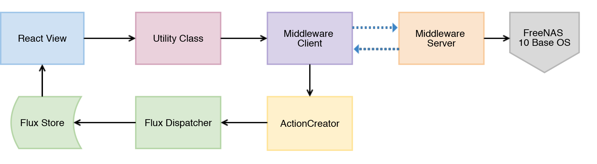
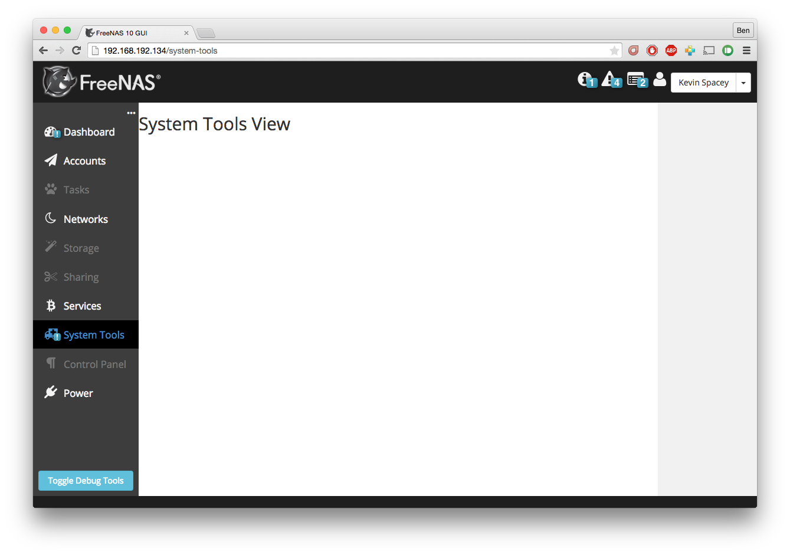

.. highlight:: javascript
   :linenothreshold: 5

Adding a New Viewer
===================

This guide explains the process of creating a new view in the FreeNAS 10 GUI.
A view is used to display data and will usually provide means to search through
a list of items and edit each one. Examples of views are [FreeNAS URL]/Accounts/Users
and [FreeNAS URL]/Services. This guide will largely use the implmentation of the Groups
view as an example to show the entire process from beginning to end.

What is the Viewer?
-------------------

In simplest terms, the Viewer is a multipurpose React Component
(controller-view) which displays arbitrary data returned by the FreeNAS
10 Middleware Server. It has several different sub-views, which each
sort the data in a different way.

The parent controller-view is responsible for maintaining state,
indicating subscription changes to the Middleware Client, and handling
the propagation of data to its children.

Flux
----

This guide will rely heavily on :ref:`Flux`. It's worth having that full
guide open alongside this one. This diagram, in particular, is going to
dictate the steps we work through as we create the new Viewer instance.

   A high level data flow diagram for FreeNAS 10's UI

A New Viewer
------------

A completely blank, basic view might look something like the example below.
This is currently doing nothing but displaying an ``<h2>`` tag within ``<main>``
- which is the expected "base" tag in any Primary View.

.. code-block:: javascript

  // SystemTools
  // ======
  //

  "use strict";

  var React = require("react");

  var SystemTools = React.createClass({
    render: function() {
      return (
        <main>
          <h2>System Tools View</h2>
        </main>
      );
    }
  });

  module.exports = SystemTools;

   An example of a completely blank view.

The example above isn't using the Viewer yet, just rendering some html on its
own. To actually use the Viewer, we're going to need all its props and a number
of other modules and functions. This begins our journey through the Flux
architecture cycle.

.. figure:: images/architecture/flux/react_view.png
   :alt: The React View

Require the Modules
~~~~~~~~~~~~~~~~~~~

The first step is to require everything we're about to need for this
controller-view. The Viewer component itself is required, and eventual
references will be made to the Middleware Utility Class the Flux Store, neither
of which exist yet. Since this view will also interact with user data, we should
also require the already-established UsersMiddleware and UsersStore modules.

.. code-block:: javascript

  var React = require("react");

  var Viewer = require("../components/Viewer");

  // var GroupsMiddleware =
  // var GroupsStore      =

  var UsersMiddleware = require("../../middleware/UsersMiddleware");
  var UsersStore      = require("../../stores/UsersStore");

Viewer Props
~~~~~~~~~~~~

The Viewer React component expects certain props.

.. code-block:: javascript

  propTypes: {
      defaultMode  : React.PropTypes.string
    , allowedModes : React.PropTypes.array
    , inputData    : React.PropTypes.array.isRequired
    , viewData     : React.PropTypes.object.isRequired
    , displayData  : React.PropTypes.object // not currently used
  }

* ``defaultMode`` - a string representing the view mode that the view should open with by default.
* ``allowedModes`` - an array containing the list of view modes the user should have available.
* ``inputData`` - an array containing the raw data that the view is responsible for displaying.
* ``viewData`` - an object containing Viewer metadata, which in turn must contain the following fields:

  * ``format`` - information about the item schema including how to edit certain
    fields and which ones should be used for searching, path names, and certain
    display defaults.
  * ``addEntity`` - string to display on the button for adding a new item of the type
    represented by the view.
  * ``routing`` - information used for setting up routes to the view. It contains
    the following fields:

    * ``route`` - the identifier for the per-route that's specified in routes.js
    * ``param`` - the identifier for the field to be used to create the per-item
      routes, also as specified in routes.js
    * ``addentity`` - the name of the route to be used for adding an item

  * ``display`` - an object containing data used for how the sidebar display will
    group and filter items It contains the following fields:

    * ``filterCriteria`` - all the groupings into which items should be sorted.
      It may contain an arbitrary number of groups. The keys used for each group
      will be used in the rest of the display fields. Each group is an object
      that must contain the following fields:

      * ``name`` - a string that will be used to label the group when it is displayed
      * ``testprop`` - an expression that will be evaluated to determine if an item
        should be considered part of the group. The typical case is just to
        check for a value of a field in the item

    * ``remainingName`` - the string displayed as the name of the group containing
      all otherwise ungrouped items
    * ``ungroupedName`` - also a string to be displayed as the name of the group containing all otherwise ungrouped
      items. fallback from remainingName
    * ``allowedFilters`` - not currently in use?
    * ``defaultFilters`` - not currently working according to a TODO (?)
    * ``allowedGroups`` - not currently in use?
    * ``defaultGroups`` - not currently in use?
    * ``defaultCollapsed`` - an array of strings representing groups that should
      begin in the collapsed state in the sidebar
* ``displayData`` - not currently in use. May have been obsoleted by moving
  ``format`` into ``viewdata``

We're going to construct them one at a time.

defaultMode
^^^^^^^^^^^

The Viewer supports three view modes: Detail, Icon, and Table. ``defaultMode`` is
simply a string naming the desired default mode. This string should be "detail",
"icon", or "table". If this prop is not submitted, the default is "detail".

For more information on each of the view modes and how they display data, see the
docs for :ref:`Viewer`.

.. note:: There are plans to implement a fourth "heirarchical" mode which may or may not ever come to pass.

allowedModes
^^^^^^^^^^^^

Not every viewer mode is suitable for every view. ``allowedModes`` should be an
array containing the list of view modes to enable. If ``allowedModes`` is not
submitted, all view modes will be available.

inputData
^^^^^^^^^

``inputData`` should be an array containing the raw data that the view is
responsible for displaying. inputData depends on the rest of the Flux cycle,
so we can't generate it at this point.

viewData
^^^^^^^^

.. warning:: This is subject to change.

format
******

Currently, each Viewer instance relies on a JSON file with some display
information. Really, this could be provided any other way. In the
future, it might be provided by the Middleware Server as companion
metadata to new types of data provided on the same channel.

What it does is take the response returned by the Middleware Server and
tell the Viewer how to regard different types of data. The Viewer
expects to know a few things, like what the "primary" and "secondary"
keys are (these are used in certain display modes, and also for
searching).

In the future, searching will probably be based on a combination of
preselected keys.

The current functional information contained by the display JSON file is
something like this:

.. code-block:: json

  [{
      "primaryKey"   : "name"
    , "secondaryKey" : "id"
    , "selectionKey" : "name"
    , "uniqueKey"    : "id"
    , "dataKeys": [
        {
            "key"         : "name"
          , "name"        : "Group Name"
          , "type"        : "string"
          , "formElement" : "input"
          , "mutable"     : true
          , "defaultCol"  : true
        }
        // ...

      ]
  }]

When looking at the Middleware Server response for
``groups.query``, we can see this:

.. code-block:: json

  [
    // ...
    {
      "name": "sshd",
      "updated-at": 1429629023.899011,
      "created-at": 1429629023.899011,
      "builtin": true,
      "id": 22
    },
    {
      "name": "daemon",
      "updated-at": 1429629023.89957,
      "created-at": 1429629023.89957,
      "builtin": true,
      "id": 1
    },
    {
      "name": "wheel",
      "updated-at": 1429629023.900156,
      "created-at": 1429629023.900156,
      "builtin": true,
      "id": 0
    },
    {
      "name": "sys",
      "updated-at": 1429629023.900732,
      "created-at": 1429629023.900732,
      "builtin": true,
      "id": 3
    },
    // ...
  ]

Based on that, we can see that we have five keys: ``name``, ``updated-at``,
``created-at``, ``builtin``, and ``id``. Some schema, like that for users, have
optional fields that are only provided if they are in use.

Additionally, there's information there we likely don't care about. Since we
don't plan to display creation and modification times for groups in the UI,
we don't need to include them in the format JSON. Naturally, this depends on the
design of the view you're implementing.

Therefore, ``groups-display.json`` might look like:

.. code-block:: json

  [{
      "primaryKey"   : "name"
    , "secondaryKey" : "id"
    , "selectionKey" : "name"
    , "uniqueKey"    : "id"
    , "dataKeys": [
        {
            "key"         : "name"
          , "name"        : "Group Name"
          , "type"        : "string"
          , "formElement" : "input"
          , "mutable"     : true
          , "defaultCol"  : true
        }
      , {
            "key"         : "builtin"
          , "name"        : "Built-in Group"
          , "type"        : "boolean"
          , "formElement" : "checkbox"
          , "mutable"     : false
          , "defaultCol"  : true
        }
      , {   "key"         : "id"
          , "name"        : "Group ID"
          , "type"        : "number"
          , "formElement" : "input"
          , "mutable"     : false
          , "defaultCol"  : true
        }
    ]
  }]

It's then required, like everything else:

.. code-block:: javascript

  var formatData = require("../../data/middleware-keys/groups-display.json")[0];

    *To make this follow the workflow little bit better I will prefer if
    the data displaying part was following the previous paragraphs.
    Dynamic Routing and Filteres/Groups are important, but maybe too
    distracting in this moment. First I want to see the data somehow and
    afterwards worry abour routing and organizing them.* ##

addEntity
*********

``addEntity`` is simply a string to display on the button for adding a new item.
Not all views will need an addEntity entry. If addEntity is not provided in
``viewData``, the button will simply not appear and functionality to add an item
will not be available from the GUI.

Dynamic Routing
~~~~~~~~~~~~~~~

Because the FreeNAS 10 GUI uses client-side routing, the
page is never refreshed or changed during a session. One of the
interesting effects of this is the ability to use client-side
routing - meaning that as the visible React components are changed
or selected, the route in the browser bar changes to reflect that.

Part of the functionality of the viewer is the ability to create dynamic
routes based on the visible item. For example, when you click on
``root`` in the Users DetailViewer, the URL displayed in the browser bar
changes to ``myfreenas.local/accounts/users/root``.

This is not automatic, however, and some setup is required to make it
work.

The Viewer requires an object called ``itemData`` which provides routing
information, based on predefined routes in ``routes.js``.

For instance, if we set up ``routes.js`` such that

.. code-block:: javascript

        <Route name="services" handler={ Services }>
          <Route name    = "services-editor"
                 path    = "/services/:serviceID"
                 handler = { Editor }
        </Route>

our cooresponding ``itemData`` object in the Services view will look
something like this:

.. code-block:: javascript

        var itemData = {
            "route" : "services-editor"
          , "param" : "serviceID"
        };

"Route" is the "name" property given to the ``<Route>`` in
``routes.js``. "Param" is the variable part of the path.

Filters and Groups
------------------

Viewers understand the concept of filters and groups, which allow raw
Middleware responses to be sorted into different categories, or hidden
from the default View (this functionality may be removed soon).

Filters control whether content is displayed. They're applied first.

Groups sort content into defined categories, as well as a "remaining"
section.

Both of these rely on the ``filterCriteria`` object.

The order of criteria in either array is the same order in which they'll
render in the Viewer.

Putting it all together, we're able to create our ``displaySettings``
object. This is similar to the display JSON file, and is subject to the
same potential future rewrite.

.. code-block:: javascript

        var displaySettings = {
            filterCriteria: {
                stopped: {
                    name     : "stopped processes"
                  , testProp : { "state": "stopped" }
                }
            }
          , remainingName  : "other services"
          , ungroupedName  : "all services"
          , allowedFilters : [ ]
          , defaultFilters : [ ]
          , allowedGroups  : [ "running", stopped" ]
          , defaultGroups  : [ "running", stopped" ]
        };

What the above tells us is that we're going to sort processes by their
running state, and then anything that doesn't fit into either of those
will be in "remaining".

We aren't filtering anything by default, and we aren't even allowing
filters. If there were a category of services that was being returned,
and was somehow irrelevant to the user, we could add it to
``defaultFilters`` to hide it when the Viewer is initialized.

The "name" property here is a little different, and that's because it's
expected to be part of a sentence, or a menu entry, or a heading in the
DetailViewer or IconViewer.

Viewer Lifecycle
----------------

Each Viewer instance leverages the React lifecycle pretty heavily to get
set up the right way.

Here's what we're going to need in addition to ``render``:

.. code-block:: javascript

    getInitialState: function() {
      // ...
    }

  , componentDidMount: function() {
      // ...
    }

  , componentWillUnmount: function() {
      // ...
    }

In ``getInitialState``, what we'd really like to do is get the Services
data out of our Flux store and use them to initialize state. Only one
problem: we don't have a Flux store yet!

Instead of trying to solve that problem right away (and to keep things
simple), we're going to walk through the diagram in order.

   A high level data flow diagram for FreeNAS 10's UI
Based on that, the next thing we need is a Middleware Utility Class.

Middleware Utility Class
------------------------

In this class, we just need a single public method connected to the
Middleware Client with a callback to the GroupsActionCreators (which
also don't exist yet).

Looking at the middleware debugger, we can see that the right call is
``service.query``. Later, we can expect this to be pluralized to match
everything else. >\ *Maybe add more about activating the debug mode?*

Our Middleware Utility Class looks something like this:

.. code-block:: javascript

  // Groups Middleware
  // ================
  // Handle the lifecycle and event hooks for the Groups channel of the middleware

  "use strict";

  var MiddlewareClient = require("../middleware/MiddlewareClient");

  var GroupsActionCreators = require("../actions/GroupsActionCreators");

  module.exports = {

      requestGroupsList: function() {
        MiddlewareClient.request( "groups.query", [], function ( groupsList ) {
          GroupsActionCreators.receiveGroupsList( groupsList );
        });
      }

    , createGroup: function( newGroupProps ) {
        MiddlewareClient.request( "task.submit", ["groups.create" , [ newGroupProps ] ], function ( taskID, groupID ) {
          GroupsActionCreators.receiveGroupUpdateTask( taskID, groupID );
        });
      }

    , updateGroup: function (groupID, props) {
        MiddlewareClient.request( "task.submit", ["groups.update", [groupID, props]], function ( taskID ) {
          GroupsActionCreators.receiveGroupUpdateTask( taskID, groupID );
        });
      }

    , deleteGroup: function( groupID ) {
        MiddlewareClient.request( "task.submit", ["groups.delete", [ groupID ] ], function ( taskID, groupID ) {
          GroupsActionCreators.receiveGroupUpdateTask( taskID, groupID );
        });
      }

  };

ActionCreators
--------------

After that call returns from the Middleware, we need to handle the raw
data. We assumed a function called ``receiveServicesList`` in our MUC's
``requestServicesList`` function, so that's what we need to create now.

All it has to do here is tag the payload with a sensible action type,
and provide the returned raw data as another parameter. These will be
caught by the Flux store we're about to create (and ignored by all the
other Flux stores).

This ActionCreator will then call the dispatcher and broadcast this
payload to all registered Flux stores.

.. code-block:: javascript

  // Groups Action Creators
  // ==================================
  // Receive and handle events from the middleware, and call the dispatcher.

  "use strict";

  var FreeNASDispatcher = require("../dispatcher/FreeNASDispatcher");
  var FreeNASConstants  = require("../constants/FreeNASConstants");

  var ActionTypes = FreeNASConstants.ActionTypes;

  module.exports = {

      receiveGroupsList: function( groupsList ) {
        FreeNASDispatcher.handleMiddlewareAction({
            type       : ActionTypes.RECEIVE_GROUPS_LIST
          , groupsList : groupsList
        });
      }

    , receiveGroupUpdateTask: function( taskID, groupID ) {
        FreeNASDispatcher.handleMiddlewareAction({
            type    : ActionTypes.RECEIVE_GROUP_UPDATE_TASK
          , taskID  : taskID
          , groupID : groupID
        });
      }

  };

FreeNASConstants
~~~~~~~~~~~~~~~~

We'll need to jump into ``FreeNASConstants.js`` to add key-value pairs for
``RECEIVE_GROUPS_LIST`` and ``RECEIVE_GROUP_UPDATE_TASK``.

.. code-block:: javascript

  // Groups
  , RECEIVE_GROUPS_LIST       : null
  , RECEIVE_GROUP_UPDATE_TASK : null

Flux Store
----------

The Flux stores unfortunately have a lot of boilerplate. I'm working on
reducing this - likely will have them all inherit from more things in
the future.

.. code-block:: javascript

  // Groups Flux Store
  // -----------------

  "use strict";

It uses Lodash, mostly for its ``_.assign()`` function.

.. code-block:: javascript

  var _            = require("lodash");

One of the most important functions that a Flux store performs is that
it also behaves as an EventEmitter.

.. code-block:: javascript

  var EventEmitter = require("events").EventEmitter;

It requires the Dispatcher and the Constants (for the ActionTypes).

.. code-block:: javascript

  var FreeNASDispatcher = require("../dispatcher/FreeNASDispatcher");
  var FreeNASConstants  = require("../constants/FreeNASConstants");

  var ActionTypes  = FreeNASConstants.ActionTypes;

We need to define a change event, just so that all the EventEmitter
stuff can all use the same one.

.. code-block:: javascript

  var CHANGE_EVENT = "change";

And finally, we'll define ``_groups``, which is the actual beating
heart of the Flux Store. This variable is what will ACTUALLY be modified
and updated when the Middleware sends new data. It's just a normal
JavaScript object with no hidden attributes or special sauce.

.. code-block:: javascript

  var _groups = [];

Now, we create the object for ``GroupsStore`` and assign the
EventEmitter prototype to it (this gives it all the EventEmitter
methods).

We'll also need three of our own methods - a way to emit a change (used
internally), a way for a React component to "listen" to the store and
know when it updates, and a way for it to stop doing that.

On top of those, we need what we came here for - a way to get an
up-to-date list of the groups, right out of the ``_groups`` object.

.. code-block:: javascript

  var GroupsStore = _.assign( {}, EventEmitter.prototype, {

      emitChange: function() {
        this.emit( CHANGE_EVENT );
      }

    , addChangeListener: function( callback ) {
        this.on( CHANGE_EVENT, callback );
      }

    , removeChangeListener: function( callback ) {
        this.removeListener( CHANGE_EVENT, callback );
      }

    , getAllGroups: function() {
        return _groups;
      }

  });

Now we just need to register ``GroupsStore`` with the
``FreeNASDispatcher``, and add a switch-case to look for the ActionType
we defined in our ``GroupsActionCreator``.

.. code-block:: javascript

  GroupsStore.dispatchToken = FreeNASDispatcher.register( function( payload ) {
    var action = payload.action;

    switch( action.type ) {

      case ActionTypes.RECEIVE_GROUPS_LIST:

        var updatedGroupIDs = _.pluck( action.groupsList, PRIMARY_KEY );

        // When receiving new data, we can comfortably resolve anything that may
        // have had an outstanding update indicated by the Middleware.
        if ( _updatedOnServer.length > 0 ) {
          _updatedOnServer = _.difference( _updatedOnServer, updatedGroupIDs );
        }

        // Updated groups come from the middleware as an array, but we store the
        // data as an object keyed by the PRIMARY_KEY. Here, we map the changed groups
        // into the object.
        action.groupsList.map( function ( group ) {
          _groups[ group [ PRIMARY_KEY ] ] = group;
        });
        GroupsStore.emitChange();
        break;

      default:
        // Do Nothing
    }

  });

  // Typically this will be the end of the file, so here's the necessary module.exports.
  module.exports = GroupsStore;

Back to the Lifecycle
---------------------

Finally, we have some stuff to plumb into the React Lifecycle.

Let's go back up and continue to fill in our list of requires. We should
now only be missing the Item template.

.. code-block:: javascript

        var ServicesMiddleware = require("../middleware/ServicesMiddleware");
        var ServicesStore      = require("../stores/ServicesStore");

First, let's make a private method that we can use to quickly get the
list of services out of the store, whenever we need to (we'll know we
need to because the listener will call this later).

In this case, it's pretty simple, but if we needed to ``concat()`` data
from another store, or some hard-coded values, or do some other data
merging, this would be a very convenient place.

.. code-block:: javascript

        function getServicesFromStore() {
          return {
            usersList: ServicesStore.getAllServices()
          };
        }

Now we can fill in the lifecycle methods.

.. code-block:: javascript

          getInitialState: function() {
            return getServicesFromStore();
          }

        , componentDidMount: function() {
            ServicesMiddleware.requestUsersList();

            ServicesStore.addChangeListener( this.handleServicesChange );
          }

        , componentWillUnmount: function() {
            ServicesStore.removeChangeListener( this.handleServicesChange );
          }

As you can probably tell, this initializes state with our utility
function, which is important every time but the very first - since
Stores are singletons and they're totally separate from the
views/components, anything we've previously put in the store, either
from another view, or from opening this view previously will still be in
there, giving us a faster initialization without a flash of unstyled
content (nice!). >\ *This is not important, but I was once told that
phrases like "As you can probably tell" sounds condescending to the
readers.*

When the component mounts, it subscribes to the Services store, and when
it unmounts, it unsubscribes.

The only difference is that ``componentDidMount`` also calls our
original ``requestServicesList`` function, asking the Middleware for an
initial payload.

(This is also where subscriptions will be handled, but they're not
implemented yet.)

You may also notice that I made reference to another method that doesn't
exist yet - ``handleServicesChange``. This is a convenient method we'll
create just so that we have a single function for updating our
controller-view's state. For now, it's basically the same thing we did
in ``getInitialState``.

.. code-block:: javascript

        , handleServicesChange: function() {
            this.setState( getServicesFromStore() );
          }

The Actual Viewer Component
---------------------------

Now that we've gone and done all that, we can finally implement the
actual ``<Viewer>`` in ``render``. All the setup we've done is finally
going to pay off, as we plug everything into the Viewer component.

As before, we're still missing the ItemView, which the Viewer will need.

.. code-block:: javascript

        , render: function() {
            return (
              <main>
                <h2>Services</h2>
                <Viewer header      = { "Services" }
                        inputData   = { this.state.servicesList }
                        displayData = { displaySettings }
                        formatData  = { formatData }
                        itemData    = { itemData }
                        Editor      = { this.props.activeRouteHandler }>
                </Viewer>
              </main>
            );
          }

A Note on Debugging
-------------------

Now that we're ready to actually check our work, it can be helpful to
change this value in ``MiddlewareClient.js``:

.. code-block:: javascript

          // Change DEBUG to `true` to activate verbose console messages
          var DEBUG = true;

This will cause the JavaScript console to contain very detailed messages
about exactly what the Middleware Client is doing, what responses are
being seen, and how they're being treated.

Disallowing Viewer Modes
------------------------

Creating an Item Template
-------------------------

    *Can you maybe add the names of used files/functions to the diagram?
    It will visually demonstrate, where in this tutorial we are relative
    to the more abstract diagram.*
