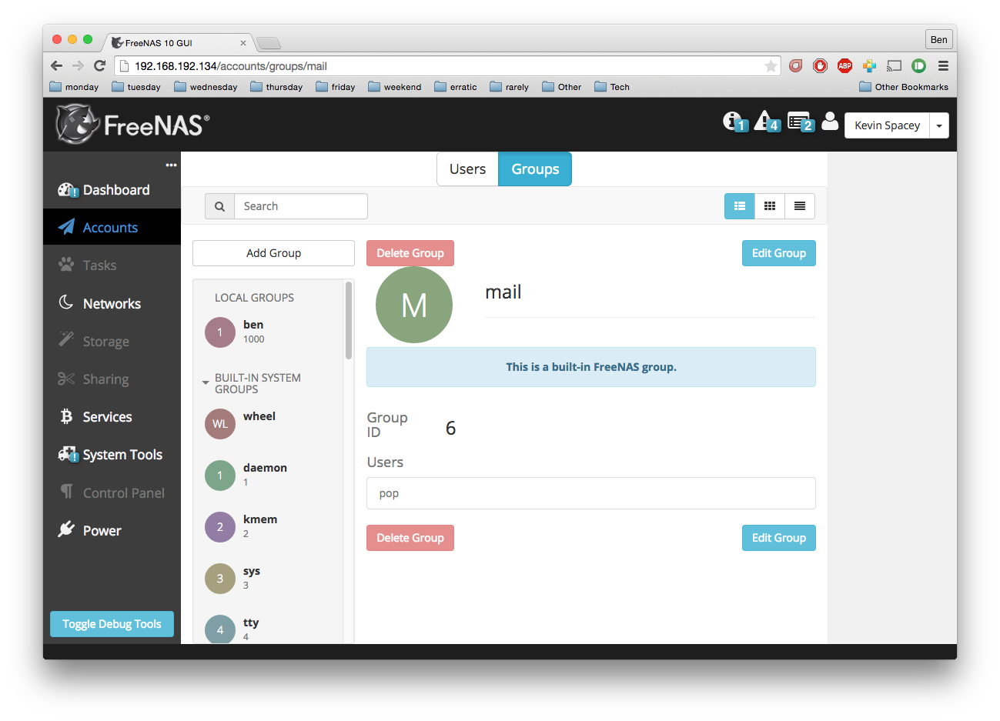

.. highlight:: javascript
   :linenothreshold: 5

Understanding the Flux Application Architecture
===============================================

.. figure:: images/architecture/flux/freenas_flux.png
   :alt: A high level data flow diagram for FreeNAS 10's UI

   A high level data flow diagram for FreeNAS 10's UI
Flux and FreeNAS 10
-------------------

The FreeNAS 10 UI is based on `Facebook's
React <http://facebook.github.io/react/>`__, a declarative front-end
view framework. Because of this, FreeNAS' UI shares many of the same
conventions as a standard React application does.

The `Flux Architecture <http://facebook.github.io/flux/>`__ is more of
an architectural model than it is a framework or plugin. While it does
include a Dispatcher module, Flux is primarily focused on enforcing
unidirectional data flow, and accomplishes this through strict
separation of concerns.

React does not depend on Flux, and vice versa, but between the two
ideologies, it's very easy to create a highly composible, declarative
UI, with straightforward data flow and clear delegation of
responsibilities.

External Resources
------------------

`Official Project Homepage <https://facebook.github.io/flux/>`__

`What is the Flux Application
Architecture? <https://medium.com/brigade-engineering/what-is-the-flux-application-architecture-b57ebca85b9e>`__
- Flarnie Marchan, Dec 10, 2014

`Understanding
Flux <https://medium.com/@garychambers108/understanding-flux-f93e9f650af7>`__
- Gary Chambers, May 19, 2014

`Flux in
Practice <https://medium.com/@garychambers108/flux-in-practice-ec08daa9041a>`__
- Gary Chambers, May 22, 2014

Displaying Data
---------------

This section is short, since the strict separation of concerns means
that React Views and Components display data, and do very little else.
However, the primary View is a good touchstone for understanding the
rest of the Flux architecture, since this is where user input is
entered, and where server output is finally rendered.

React View
~~~~~~~~~~

|React View| A React View can be any `React component <react.md>`__, but
is generally the primary view open in the webapp. While other persistent
components (navigation, notifications, widgets etc) function in slightly
different ways, they're broadly similar to a standard React View.

   Example of a basic view
Role
^^^^

A React View displays data to the user, and handles all interactions
with the user. It is responsible for maintaining internal state, and
updating itself when newer data is available.

Input
^^^^^

In the above screenshot, the Users view is open. Following the diagram
at the top of this guide, the Users view receives new information from
the Users Flux Store. The view does not modify the Flux store, and
has no opinions of its contents. When a React View is first initialized,
it will often subscribe to an empty Flux store, and display nothing. In
a few moments, when the Flux store is updated with the relevant data,
the React View will re-render itself to display that data.

Output
^^^^^^

The React View submits events, data, and requests to the Middleware
Utility Class. In the example of the Groups View, if a group is
edited - for example, its name is changed - upon saving, the
updated group object is sent to the Groups Middleware Utility Class. The
React View is ignorant of what will then happen to the group, and does
not register a callback or perform any followup actions. When the group
is updated, or an error occurrs, it will be communicated through the
same subscription to the Flux Store described above.

Submitting User Input
---------------------

The next step in the Flux Architecture is handling user input and
sending it to the server. There is a deliberate pattern which will
emerge, in which each "step" is ignorant of what came before it, and is
only responsible for taking the data given to it and performing the
appropriate next step.

Middleware Utility Class
~~~~~~~~~~~~~~~~~~~~~~~~

|Middleware Utility Class| The Middleware Utility Class (MUC) is an
abstaction provided by FreeNAS 10, and while suggested by Flux, it isn't
a strict requirement of the architecture. It provides an interface
between the React View, the Middleware Client, and the Action Creators.
When a user interacts with the FreeNAS 10 UI in a way that will require
the Middleware Server to provide new data, the action is handled by the
MUC, which calls the Middleware Client's ``request()`` method with a
callback for the appropriate Action Creator.

.. code:: javascript

    requestGroupsList: function() {
      MiddlewareClient.request( "groups.query", [], function ( groupsList ) {
        GroupsActionCreators.receiveGroupsList( groupsList );
      });
    }

Role
^^^^

The MUC pipes request data into a public method provided by the
Middleware Client, and registers a callback that will be run when a
matching response is receieved from the Middleware Server. The MUC does
not modify input data, and does not manipulate response data.

The ambiguation provided by this class is necessary for a few reasons:

Consistency
'''''''''''

Because the MUC exists outside of a React View's lifecycle, it is able
to guarantee that the registered callback will be run even if the
original requesting View has closed.

Concurrency
'''''''''''

Because the MUC is a singleton, it is also concurrently available to
other views while retaining internal state.

Flexibility
'''''''''''

Because the MUC is not combined with an ActionCreator, it is more
composible, and may contain methods which register callbacks tied to
many different ActionCreators.

In this way, the architecture ensures that no replies are regarded as
spurious by views which should have no knowledge of them, and the entire
application maintains consistent state.

Input
^^^^^

The MUC recieves raw event data, objects, and other pre-packaged
interactions from a React View. These might be as simple as a click
event, or as complex as a dictionary object representing the changed
properties for an array of hard disks. The MUC is deliberately ignorant
of the Views which send it data.

Output
^^^^^^

The MUC registers a callback with one of the Middleware Client's public
methods, ensuring that once the Middleware Client has recieved a
response from the Middleware Server, the response data is passed into
the callback. The callback is almost always a public method exposed by
an ActionCreator class, which will handle the response data.

--------------

Middleware Client
~~~~~~~~~~~~~~~~~

|Middleware Client| The FreeNAS 10 UI uses a fully asyncronous WebSocket
connection for communication with the hardware backend. The :ref:`Middleware Client`
is a simple WebSocket client which handles the connection lifecycle, as well as the
packaging, identification, transmission, and (initial) receipt of data.

See the doumentation for the :ref:`Public Facing Middleware Client Functions`,
which explains the relevant methods and their intended uses.

Role
^^^^

The Middleware Client exposes public methods for
connecting/disconnecting, logging in/out, subscribing/unsubscribing from
event types, and making specific requests to the Middleware Server. It
can be thought of as a sort of companion to the FreeNAS 10 Command Line
Interface, as it provides similar functionality.

Dangers
^^^^^^^

The Middleware Client should not be accessed directly from a View.

Directly accessing the Middleware Client can cause data to be returned
and not handled, or treated as a spurious reply with no known origin.

The Middleware Client does not and should not modify Flux Stores or
Views.

Input
^^^^^

The Middleware Client exposes functions like ``request()``, which are
meant to be called from a Middleware Utility Class. These methods should
be provided input data to send to the Middleware Server, and also
provided a registered callback to a method exposed by an ActionCreator.

.. note:: At some point soon, we will functionality to accept a second callback
specificaly for error handling. APRIL 2015

Output
^^^^^^

The registered callback to the ActionCreator will be run when an
appropriate response is received from the Middleware Server, and the
callback function will take the response as its parameters.

On the Server
-------------

This part of the guide is only provided to give a more complete
understanding of the system as a whole. No GUI developer should ever
need to worry about the specifics of the Middleware Server, or even the
underlying FreeNAS OS. It may as well be a black box which receives
packaged calls and returns new data.

Middleware Server
~~~~~~~~~~~~~~~~~

|Middleware Server| The Middleware Server is a WebSocket server running
on the same hardware as the core FreeNAS 10 OS. It collects and
disburses system data requested by a Middleware Client. It is capable of
handling event queues and multiple (non-blocking) requests. It can
connect to many clients at the same time, and correctly triage requests
and responses to each, concurrently.

FreeNAS 10 Base OS
~~~~~~~~~~~~~~~~~~

|FreeNAS 10 Base OS| The core operating system. Out of scope for any UI
work, and shown in the above diagram only to describe its
relationship to the rest of the system and position in the flow of logic.

Handling Data From the Middleware
---------------------------------

After being sent a request, the Middleware Client will receive a
response from the Middleware Server. This isn't necessarily a 1:1
relationship, as a subscription request will cause the Middleware Server
to send a stream of "patch" responses to the Middleware Client.
Fortunately, the ActionCreators and other Flux errata are ignorant of
their data's sources, and only care about how to process it and where to
send it.

Action Creators
~~~~~~~~~~~~~~~

|Action Creators| Action Creators aren't provided or created by Flux,
but they are a necessary abstraction when piping multiple data streams
into the same Dispatcher.

While conceptually simple, an Action Creator class is an easy way to
group similar functions, and attach identifying information to the
packaged data. It limits code reuse, and creates a clear channel for
handling data from the middleware. Flux suggests ActionCreator classes
as an alternative to putting all of the processing functions inside the
Dispatcher itself - reducing the size and complexity of the Dispatcher
module and allowing for a more visible separation of concerns.

This also allows for simpler debugging, and creates a more extensible
and composible platform than just calling
``FreeNASDispatcher.dispatch()`` directly would.

Role
^^^^

Action Creators handle response data from the middleware, process and
tag it as necessary, and call the appropriate method within the
Dispatcher to perform the next step.

Input
^^^^^

ActionCreator methods are registered as callbacks by Middleware Utility
Classes, and are called by the Middleware Client when a response is
given for the original request. The response data is passed into the
ActionCreator function, where it is packaged, tagged, and processed (if
necessary).

In the example below, the Middleware client receives a list of groups and
packages them for the ``handleMiddlewareAction()`` function in
FreeNASDispatcher.

.. code:: javascript

    receiveGroupsList: function( groupsList ) {
      FreeNASDispatcher.handleMiddlewareAction({
          type       : ActionTypes.RECEIVE_GROUPS_LIST
        , groupsList : groupsList
      });
    }

Output
^^^^^^

ActionCreator methods call shared methods within the Dispatcher, and
send them the payload data. It's the responsibility of these methods to
identify the source of their payload, so the ActionCreator needs only to
select the correct handler in the Dispatcher.

--------------

Flux Dispatcher
~~~~~~~~~~~~~~~

|Flux Dispatcher| The Dispatcher broadcasts payloads to registered
callbacks. Essentially, a store will register with the Dispatcher,
indicating that it wants to run a callback when the Dispatcher
broadcasts data of a certain "action type".

Role
^^^^

The Dispatcher is only responsible for broadcasting data to registered
callbacks (Flux Stores). It contains handler functions that will tag the
payload with a source, and these are selected by the ActionCreator.
Primarily, they assist with debugging, and are a final opportunity to
perform processing or tagging on the payload before it is broadcast to
the Stores.

Input
^^^^^

Handler functions which ultimately call ``FreeNASDispatcher.dispatch()``
are registered in ActionCreators, and are called whenever the
ActionCreator is receiving data.

Output
^^^^^^

Whenever ``FreeNASDispatcher.dispatch()`` is called (usually by a
handler function), the data parameter is broadcast to registered
callbacks (Flux Stores).

Callbacks are not subscribed to particular events. **Each payload is
dispatched to all registered callbacks**, and it's up to the callback to
triage the action type, and decide whether to act.

.. code:: javascript

        var FreeNASDispatcher = _.assign( new Dispatcher(), {

            handleMiddlewareAction: function( action ) {
              var payload = {
                  source : PayloadSources.MIDDLEWARE_ACTION
                , action : action
              };

              this.dispatch( payload );
            }

        });

--------------

Flux Store
~~~~~~~~~~

|Flux Store| A Flux store is, at its core, a simple JavaScript object.
Stores are exported as singletons, so each store is both a single
instance and globally accessible by any other module or view.

Role
^^^^

Flux Stores are persistent data stores, accessible by any view or
component. They can be relied on to always have up-to-date information
from the Middleware, and obviate the need to perform long-polling
operations.

Stores additionally function as event emitters, and allow views to
"subscribe" to the store's "change" event, and register a callback to be
run when the store is updated.

.. code:: javascript

          emitChange: function() {
            this.emit( CHANGE_EVENT );
          }

        , addChangeListener: function( callback ) {
            this.on( CHANGE_EVENT, callback );
          }

        , removeChangeListener: function( callback ) {
            this.removeListener( CHANGE_EVENT, callback );
          }

In this way, data upkeep and processing tasks are abstracted out of the
view, and the view can rely on always having up-to-date data provided
automatically by the store.

Stores also tend to have utility functions for retrieving specific data.

.. code:: javascript

        // Return a specific user
          getUser: function( key ) {
            return _users[ key ];
          }

        // Return all users
        , getAllUsers: function() {
            return _users;
          }

Another unique function of stores is the ability to act syncronously,
and delay an update until another store has completed updating. Because
each store registers a dispatchToken with the Dispatcher, it's a trivial
matter to wait for another store to finish updating, then update the
target.

.. code:: javascript

        case ActionTypes.UPDATE_USERS:

          // waitFor will prevent the user update from occurring until GroupsStore
          // is guaranteed to have updated

          FreeNASDispatcher.waitFor([GroupsStore.dispatchToken]);

          // GroupsStore has been updated, so now we can proceed

          _users = action.rawUsers;
          UsersStore.emitChange();
          break;

Input
^^^^^

Stores are **only ever modified by the Dispatcher**. They receieve every
broadcast payload the Dispatcher ever sends out, and will generally have
a ``switch`` function that determines whether the broadcast is
applicable to the type of data that the Store is concerned with. This
determination is usually based on the action type added by the
ActionCreator.

.. code:: javascript

        UsersStore.dispatchToken = FreeNASDispatcher.register( function( payload ) {
          var action = payload.action;

          switch( action.type ) {

            case ActionTypes.RECEIVE_RAW_USERS:
              _users = action.rawUsers;
              UsersStore.emitChange();
              break;

            default:
              // No action
          }
        });

Output
^^^^^^

Each React View will choose to subscribe to events emit by a specific
Flux store, and additionally may request some or all of its data at
various points in its lifecycle. When the Flux store updates, it will
emit an event, causing the Change Listeners registered with that store to execute.
Usually these will be functions to re-request the data updated in the store
(which may cause the component to re-render to display the update).

The Flux Store is ignorant of which views are subscribed to it, and
persists as a singleton outside the lifecycle of any View or Component.
In this way, it is always up to date, and can act as a single source of
truth to multiple Components in parallel.

.. |React View| image:: images/architecture/flux/react_view.png

.. |Middleware Client| image:: images/architecture/flux/middleware_client.png

.. |Action Creators| image:: images/architecture/flux/actioncreator.png
.. |Flux Dispatcher| image:: images/architecture/flux/dispatcher.png
.. |Flux Store| image:: images/architecture/flux/store.png
