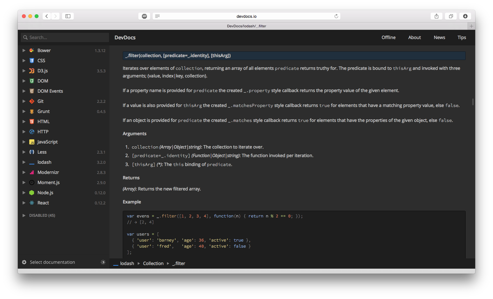

.. highlight:: javascript
   :linenothreshold: 5

************************
Glossary of Technologies
************************

This document contains short descriptions of each of the web technologies used in FreeNAS 10. The isomorphic webapp architecture in FreeNAS 10 relies on a mixture of frontend and backend technology, and a functional understanding of both the component parts and the ways they interact is essential to GUI development. Each entry contains links to the source, license, documentation, and authors.

.. contents::
   :local:
   :depth: 2

A Word on External Documentation
================================

This Developer's Guide doesn't aim to be an exhaustive resource for development documentation, nor does it attempt to replicate the efforts of original authors or full tutorials. Each section here should contain the original documentation (if available), and other resources such as guides and tutorials (where applicable).

Quite a lot of these packages have their documentation available on `devdocs.io <http://devdocs.io>`__, which is always the recommended resource. It's searchable, available offline, and offers all of the documentation through a unified interface.

   The `DevDocs <http://devdocs.io>`__ interface

Package Management
==================
Frontend GUI development for FreeNAS 10 largely revolves around two `Node`_-based package managers: `Bower`_ and `NPM`_. They have subtle differences, and it's important for any frontend developer to understand which to use based on the context and desired outcome.

Package Management FAQ
----------------------

How do I know if I should use `Bower`_ or `NPM`_?
^^^^^^^^^^^^^^^^^^^^^^^^^^^^^^^^^^^^^^^^^^^^^^^^^

In many cases, the same package may be available in broadly similar formats on both `Bower`_ and `NPM`_. The rule of thumb is generally that `Bower`_ should be used to manage frontend packages that are only used when the webapp has a real DOM implementation. For instance, animations and transitions provided by `Velocity`_ have no impact on the structure or renderability of different views, and they are only used once the DOM representation exists.

Another telling case is that `NPM`_ modules are meant to work as part of a module system (ES6, AMD, CommonJS, etc), and will have something akin to ``module.exports`` that allows them to be accessed by a ``require()`` call in `Node`_ or `Browserify`_.

--------------

Bower
-----
|Bower|

+--------------+---------------+-------------+---------+---------------------------+
| Homepage     | Documentation | Source Code | License | Authors                   |
+==============+===============+=============+=========+===========================+
| `bower.io`__ | `DevDocs`__   | `GitHub`__  | MIT     | `@fat`__ and `@maccman`__ |
+--------------+---------------+-------------+---------+---------------------------+

.. Homepage
__ http://bower.io/

.. Docuementation
__ http://devdocs.io/bower

.. Source Code
__ https://github.com/bower/bower

.. Author(s)
__ https://github.com/fat
__ https://github.com/maccman

Bower is a package management system for frontend libraries and plugins. It focuses on compiled (and often minified) code which is ready to be redistributed as-is. It functions as a counterpart to `npm`_, and provides packages like `Twitter Bootstrap`_ or `Velocity`_. Bower components will usually not feature any kind of module export functionality, and play no part in the lifecycle or rendering of `React`_ components.

.. NOTE::
   DevDocs is the recommended resource for Bower documentation, but the original documentation is also available.

   `View original Bower documentation`__

.. Original Documentation
__ http://bower.io/docs/api/

--------------

NPM
---
|NPM|

+---------------+---------------+-------------+----------------------+-----------+
| Homepage      | Documentation | Source Code | License              | Authors   |
+===============+===============+=============+======================+===========+
| `npmjs.org`__ | `NPM Docs`__  | `GitHub`__  | Artistic License 2.0 | npm, Inc. |
+---------------+---------------+-------------+----------------------+-----------+

.. Homepage
__ http://npmjs.org/

.. Docuementation
__ https://docs.npmjs.com/

.. Source Code
__ https://github.com/npm/npm

npm is the "Node package manager". It manages the libraries, dependencies, `Grunt`_ plugins, and other development tools used in the creation of a `Node`_ webapp. NPM modules are meant to work as part of a module system (ES6, AMD, CommonJS, etc), and will have something akin to ``module.exports`` that allows them to be accessed by a ``require()`` call in `Node`_ or `Browserify`_.

Frontend Packages
=================

In this document, "frontend packages" refer to the `NPM` modules and Bower components used by the FreeNAS WebApp running in a browser context. The isomorphic WebApp model can blur this line, since the entire application is rendered serverside in a `Node`_ environment before being delivered to the client.

However, because many of the frontend packages rely either on user interaction, or methods in the `React`_ lifecycle that will not be called until the React component is mounted in the real browser DOM, this group of packages tends to behave much more like traditional web frameworks, and usually will not use the `Node`_/`Browserify`_ ``require()`` syntax.

Frontend FAQ
------------

Where is jQuery?
^^^^^^^^^^^^^^^^
FreeNAS 10 does not use jQuery.

jQuery is an excellent library, and offers simple, direct utilities for many important functions. However, it is considered harmful in conjunction with our technology stack, particularly `React`_ and WebSockets.

jQuery's functionality in the following areas has been wholly replaced or obviated by different technology choices.

1. DOM manipulation

   As all views in the FreeNAS 10 WebApp are `React`_ components, there is no reason to modify the browser DOM, since any changes or differences from the `React`_ virtual DOM will be overridden when the ``render()`` function is next called. It also poses certain risks of creating non-reconcilable state, modifying controlled values outside of the React lifecycle, and other anti-patterns.

2. AJAX requests

   The FreeNAS 10 Middleware uses a persistent WebSocket connection to facilitate communication between client and server. For times when this isn't the right course of action, the syntax and adoption of `XMLHTTPRequest <https://developer.mozilla.org/en-US/docs/Web/API/XMLHttpRequest/Using_XMLHttpRequest>`__ have stabilized enough that a dedicated library is unneccessary, and it can just be called directly.

3. Animation

   See `Velocity`_.

4. Polyfills for old browsers

   As `React`_ features a `synthetic event system <http://facebook.github.io/react/docs/events.html>`__, many of the most commonly needed polyfills are no longer required. Since the target platforms for FreeNAS 10 must also support WebSockets, the number of browsers that support WebSockets and yet still have a need for polyfills for now-standard methods like ``map()`` is negligible.

--------------

Twitter Bootstrap
-----------------
|Bootstrap|

+----------------------+---------------+-------------+---------+-----------------------+
| Homepage             | Documentation | Source Code | License | Authors               |
+======================+===============+=============+=========+=======================+
| `getbootstrap.com`__ | `TWBS Docs`__ | `GitHub`__  | MIT     | `@mdo`__ and `@fat`__ |
+----------------------+---------------+-------------+---------+-----------------------+

.. Homepage
__ http://getbootstrap.com/

.. Docuementation
__ http://getbootstrap.com/getting-started/

.. Source Code
__ https://github.com/twbs/bootstrap/

.. Author(s)
__ https://github.com/mdo
__ https://github.com/fat

Twitter Bootstrap (TWBS) is one of the most popular and well-known HTML, CSS, and JavaScript frameworks in use today. It has been widely adopted in a variety of websites, from personal blogs to Fortune 500 companies.

The act of switching away from the toolkits used in previous versions of FreeNAS has given the project more freedom, but also introduced a lack of visible structure. Primarily, the use of TWBS in FreeNAS 10 leverages a recognizable, well-documented platform with a shallow learning curve, and promotes the use of pre-existing patterns to design and organize content.

But what about `LESS`_?
^^^^^^^^^^^^^^^^^^^^
TWBS is used in FreeNAS 10 in a slightly unconventional way. Rather than using the pre-packaged download, the `LESS`_ source files for TWBS are compiled at build time, together with the FreeNAS 10 `LESS`_ files, to create a single master stylesheet.

Doesn't TWBS require jQuery?
^^^^^^^^^^^^^^^^^^^^^^^^^^^^
The JavaScript components are not included verbatim, but rather provided by `React Bootstrap <http://react-bootstrap.github.io>`__, a companion library that includes simple React reimplementations of the TWBS components without jQuery.

--------------

D3
--
|D3|

+--------------+---------------+-------------+-----------------------+---------------+
| Homepage     | Documentation | Source Code | License               | Authors       |
+==============+===============+=============+=======================+===============+
| `d3js.org`__ | `DevDocs`__   | `GitHub`__  | Modified BSD 2-Clause | `@mbostock`__ |
+--------------+---------------+-------------+-----------------------+---------------+

.. Homepage
__ http://d3js.org/

.. Docuementation
__ http://devdocs.io/d3

.. Source Code
__ https://github.com/mbostock/d3

.. Authors
__ https://github.com/mbostock

D3 (short for Data Driven Documents) is a JavaScript library for manipulating documents based on data. It is capable of providing rich visualization in the form of charts, graphs, maps, and more. In particular, it's used for FreeNAS 10's system overview, providing realtime graphs of CPU, network, disk, etc.

.. NOTE::
   DevDocs is the recommended resource for D3 documentation, but the original documentation is also available.

   `View original D3 documentation`__

.. Original Documentation
__ https://github.com/mbostock/d3/wiki

--------------

React
-----
|React|

+-------------------------------+---------------+-------------+------------+------------------------------------+
| Homepage                      | Documentation | Source Code | License    | Authors                            |
+===============================+===============+=============+============+====================================+
| `facebook.github.io/react/`__ | `DevDocs`__   | `GitHub`__  | Apache 2.0 | Facebook & Instagram collaboration |
+-------------------------------+---------------+-------------+------------+------------------------------------+

.. Homepage
__ http://facebook.github.io/react/

.. Docuementation
__ http://devdocs.io/react

.. Source Code
__ https://github.com/facebook/react

React is a JavaScript library for creating user interfaces. It is unlike MVC frameworks (eg. Ember, Backbone, Angular) as React aims only to provide self-updating, dynamic views. React uses a virtual DOM and hashes changes to the in-browser DOM, so its event-system, templates, and supported features are properly represented across all browsers, regardless of age.

React is rendered serverside in FreeNAS 10, so that the initial payload sent to the user contains the HTML output of the React template, the virtual DOM is preloaded, and the component's state is already initialized.

Because React focuses on creating "components" instead of "pages", it also works well with `Node`_ and `Browserify`_'s ``require()`` syntax to keep files short, legible, and well organized. Components ``require()`` each other, creating a visible nested heirarchy.

Developers who are familiar with writing static HTML pages should be quickly familiar with React's pseudo-HTML syntax (JSX), which provides both a gentle learning curve and valid semantic abstractions for the JavaScript it represents.

.. NOTE::
   DevDocs is the recommended resource for React documentation, but the original documentation is also available.

   `View original React documentation`__

.. Original Documentation
__ http://facebook.github.io/react/docs/getting-started.html

--------------

Velocity
--------
|Velocity|

+-----------------------------------+-------------------+-------------+---------+--------------------+
| Homepage                          | Documentation     | Source Code | License | Authors            |
+===================================+===================+=============+=========+====================+
| `julian.com/research/velocity/`__ | `Velocity Site`__ | `GitHub`__  | MIT     | `@julianshapiro`__ |
+-----------------------------------+-------------------+-------------+---------+--------------------+

.. Homepage
__ julian.com/research/velocity/

.. Docuementation
__ http://julian.com/research/velocity/

.. Source Code
__ https://github.com/julianshapiro/velocity

.. Authors
__ https://github.com/julianshapiro

Velocity is a ground-up reimplementation of jQuery's ``$.animate()`` function. It is lightweight, and more consistently more performant than jQuery. It handles JavaScript-based UI animation, queues, and other transitions.

Server Environment
==================

Browserify
----------
|Browserify|

+--------------------+----------------------+-------------+--------------+---------------+
| Homepage           | Documentation        | Source Code | License Type | Authors       |
+====================+======================+=============+==============+===============+
| `browserify.org`__ | `ReadMe on GitHub`__ | `GitHub`__  | MIT          | `@substack`__ |
+--------------------+----------------------+-------------+--------------+---------------+

.. Homepage
__ http://browserify.org

.. Docuementation
__ https://github.com/substack/node-browserify#browserify

.. Source Code
__ https://github.com/substack/node-browserify

.. Authors
__ https://github.com/substack

Browserify is a JavaScript bundler which concatenates and minifies a webapp's many individual JavaScript module files into a single, indexed bundle file. It uses a simple ``require()`` syntax (similar to the native `Node`_ method) to "export" each module as an indexable, pre-packaged object. This has enormous benefits in a single-page webapp, as JavaScript modules are singletons, and thus every view, component, et al. will have access to the same instance of each other module - conserving memory and simplifying state reconciliation between `React`_ components and especially Flux stores.

.. code:: javascript

    var unique = require('uniq');

Browserify minimizes the number of requests that need to be made for resources, ensures that the initial load will include all of the application "run" code, and decouples source files' placement from their final compiled "location".

--------------

Grunt
-----
|Grunt|

+-----------------+---------------+-------------+---------+--------------------+
| Homepage        | Documentation | Source Code | License | Authors            |
+=================+===============+=============+=========+====================+
| `gruntjs.com`__ | `DevDocs`__   | `GitHub`__  | MIT     | `Grunt Dev Team`__ |
+-----------------+---------------+-------------+---------+--------------------+

.. Homepage
__ http://gruntjs.com

.. Docuementation
__ http://devdocs.io/grunt

.. Source Code
__ https://github.com/gruntjs/

.. Authors
__ http://gruntjs.com/development-team

Grunt is a JavaScript task runner, which allows developers to specify tasks and build pipelines. It can be used to automatically compile code, restart webservers, parallelize tasks, and can be extended to almost any functionality. Grunt runs the tasks that compile `LESS`_ to CSS, uglify and unit test JavaScript, create `Browserify`_ bundles, and more.

FreeNAS 10 uses Grunt most visibily in the live development environment, where a series of concurrent file watchers are run, set up to trigger everything from CSS rebuilds to restarting the FreeNAS development target over ``ssh``.

.. NOTE::
   DevDocs is the recommended resource for Grunt documentation, but the original documentation is also available.

   `View original Grunt documentation`__

.. Original Documentation
__ http://gruntjs.com/api/grunt

--------------

LESS
----
|LESS|

+-----------------+---------------+-------------+---------+----------------+
| Homepage        | Documentation | Source Code | License | Authors        |
+=================+===============+=============+=========+================+
| `lesscss.org`__ | `DevDocs`__   | `GitHub`__  | Apache  | `@cloudhead`__ |
+-----------------+---------------+-------------+---------+----------------+

.. Homepage
__ http://lesscss.org/

.. Docuementation
__ http://devdocs.io/less

.. Source Code
__ https://github.com/less/less.js

.. Authors
__ https://github.com/cloudhead

LESS is a CSS-like language which compiles to CSS. It features variables, mixins, imports, and heirarchical class declarations which make development simpler. LESS can also be split into several different files for better organization and separation of concerns.

LESS is used in FreeNAS 10 primarily for its utility, and because `Twitter Bootstrap`_ is based on LESS. Compiling from LESS creates a single, unified file with fewer overwrites or complicated rules. The mixin architecture allows for powerful and dynamic expressions, as well as a simpler development process. It also means that the `Twitter Bootstrap`_ variables and mixins can be redefined or modified in our own LESS files, without modifying contents of the originals.

.. NOTE::
   DevDocs is the recommended resource for LESS documentation, but the original documentation is also available.

   `View original LESS documentation`__

.. Original Documentation
__ http://lesscss.org/features/

--------------

Node
----
|Node|

+----------------+---------------+-------------+---------+-------------+
| Homepage       | Documentation | Source Code | License | Authors     |
+================+===============+=============+=========+=============+
| `nodejs.org`__ | `DevDocs`__   | `GitHub`__  | MIT     | `@joyent`__ |
+----------------+---------------+-------------+---------+-------------+

.. Homepage
__ http://nodejs.org/

.. Docuementation
__ http://devdocs.io/node

.. Source Code
__ https://github.com/joyent/node

.. Authors
__ https://github.com/joyent

Node.js is a serverside JavaScript environment based on Chromium's V8 engine. It is used to build web applications, run webservers, operate task runners like Grunt, cross-compile code, and more.

Running a Node.js process on FreeNAS allows for things like serverside rendering of JavaScript templates, pre-initialized state, and easily customized payloads. It is the basis of the isomorphic application model.

.. NOTE::
   DevDocs is the recommended resource for Node documentation, but the original documentation is also available.

   `View original Node documentation`__

.. Original Documentation
__ http://nodejs.org/api/

Is Node.js a webserver?
^^^^^^^^^^^^^^^^^^^^^^^
No. Node contains all of the component parts and APIs necessary to create a webserver, and there are many webserver projects that run in the Node.js environment, but Node itself is not a webserver.

.. |Bootstrap| image:: images/glossary/Bootstrap.png
.. |Bower| image:: images/glossary/Bower.png
.. |Browserify| image:: images/glossary/Browserify.png
.. |D3| image:: images/glossary/D3.png
.. |Grunt| image:: images/glossary/Grunt.png
.. |LESS| image:: images/glossary/LESS.png

.. |Node| image:: images/glossary/Node.png
.. |NPM| image:: images/glossary/NPM.png
.. |React| image:: images/glossary/React.png
.. |Velocity| image:: images/glossary/Velocity.png
