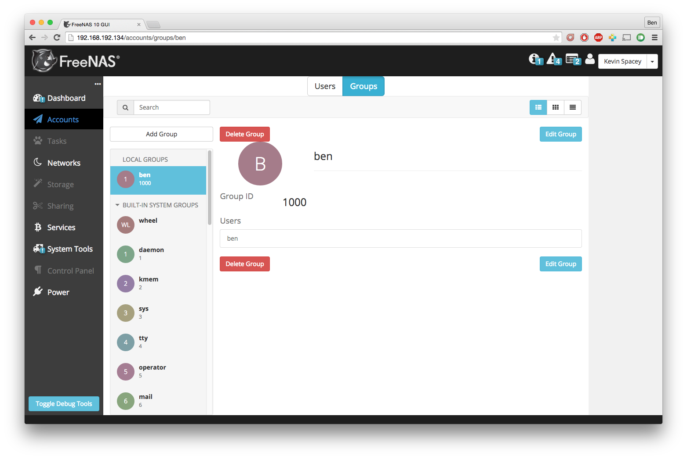
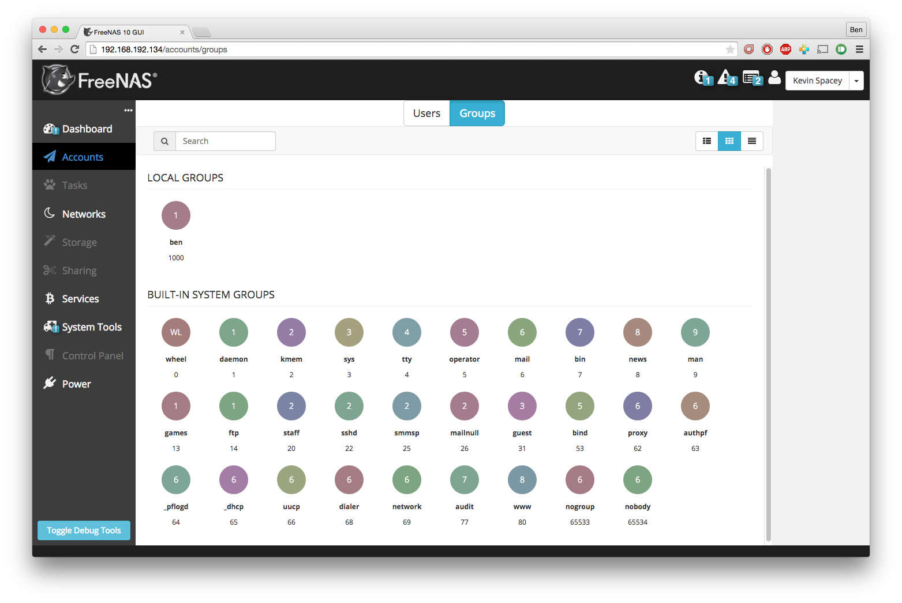
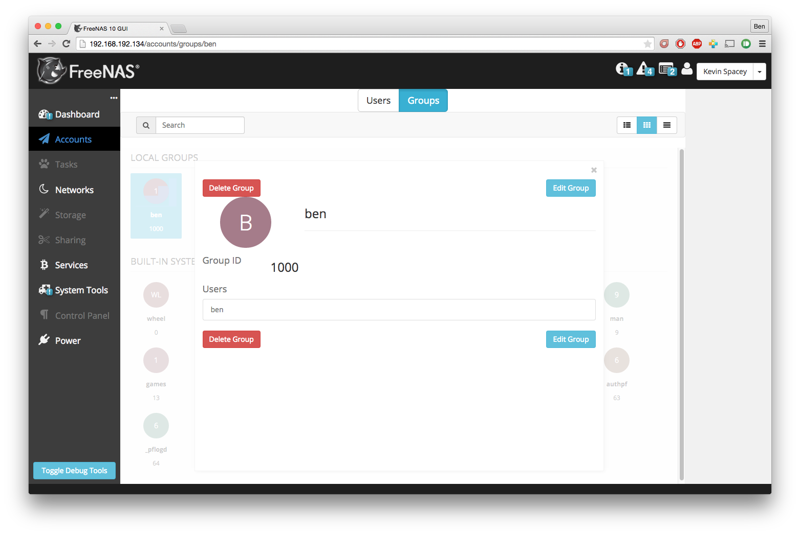
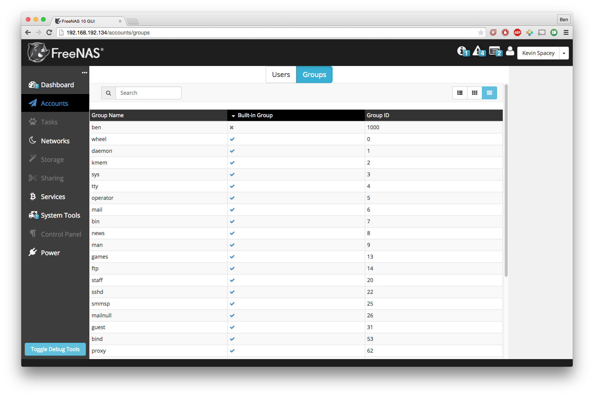
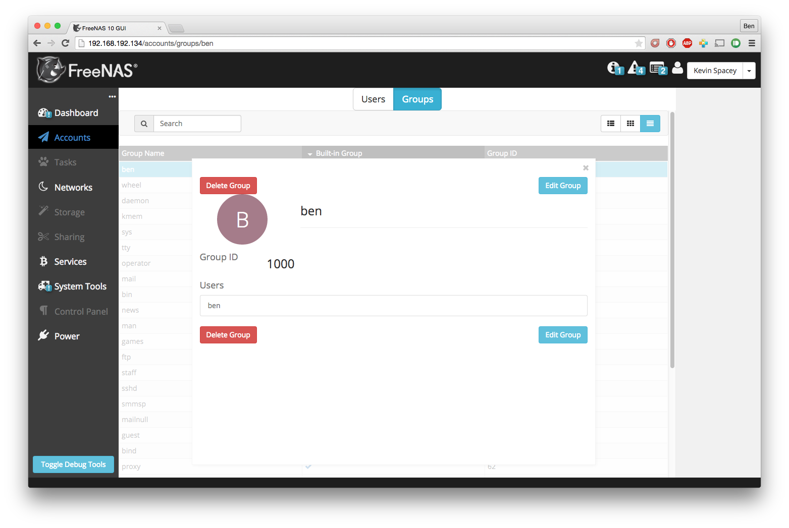

.. highlight:: javascript
   :linenothreshold: 5

.. index:: Viewer
.. _Viewer:

The Viewer
==========

The Viewer is the React component that diplays most of the pages in the
FreeNAS 10 UI. It supports three modes of displaying items: Detail, Icon, and
Table. Each mode has a distinct layout for displaying available items and
displaying an item that's been selected.

DetailViewer
------------

The Groups view in detail mode with an item selected.

IconViewer
----------

The Groups view in icon mode without an item selected.

The Groups view in icon mode with an item selected.

TableViewer
-----------

The Groups view in table mode without an item selected.

The Groups view in table mode with an item selected.
