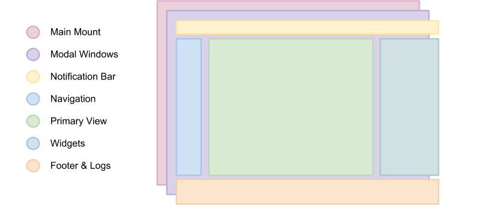

FreeNAS 10 WebApp Architecture
==============================

   A stacked diagram representing the FreeNAS 10 UI's "layers"
Layers of the UI
----------------

The FreeNAS 10 UI is divided into layers, which map well to Middleware
channels. In simplest terms, the "wrapper" (persistent toolbars,
titlebar, footer) subscribes to general system information
(authentication status, events, alerts, uptime, hostname, etc), and then
each view will subscribe to a specific and more detailed stream of
information (users, network interfaces, volumes) for the duration of its
open state, and unsubscribe/garbage collect before unmounting.

This creates a modular and highly composible UI, where individual views
and layers are only responsble for subscribing to the Flux store from
which they want to receive data, and indicating to the Middleware Client
that it should alter a subscription state. It enforces a rigid
separation of concerns for data handling as well as conceptually
disparate areas of the system.

Main Mount
~~~~~~~~~~

The Main Mount is rendered directly into ``<body>``, and all other
components are descended from it. It is represented by ``routes.js``,
which handles the client-side routing, including the ``FreeNASWebApp``
component. ``FreeNASWebApp`` is the functional "shoebox" wrapper for the
application, and subscribes to the general system information channel.
It handles authentication, and subscribes to events, alerts, and other
notifications.

Each nested route is rendered within its parent, enforcing a strict
visual and architectural heirarchy.

Modal Windows
~~~~~~~~~~~~~

Modal Windows aren't heavily used in FreeNAS 10, but may be used for
things like login, unexpected disconnect, etc. In general, they can
receive data from the primary connections managed by the Main Mount.

Notification Bar
~~~~~~~~~~~~~~~~

The persistent titlebar in the FreeNAS 10 UI also functions as a kind of
notification center, handling the events, alerts, and notifications
passed into it from the Main Mount's system-general subscription.

Navigation
~~~~~~~~~~

The Navigation is currently hard-coded, but in the future, may receive
its routes from a web permissions context that doesn't exist yet. TBD.

The Primary View
~~~~~~~~~~~~~~~~

The Primary View is generally a React Controller-View which maps to a
specific Middleware channel, like "Users" or "Network Interfaces". This
is the primary area of the UI, and is not persistent. For more on how
this is handled, pleaes refer to the `Flux Architecture <flux.md>`__
documentation.

Widgets
~~~~~~~

(TBD)

Footer and Logs
~~~~~~~~~~~~~~~

(TBD)
