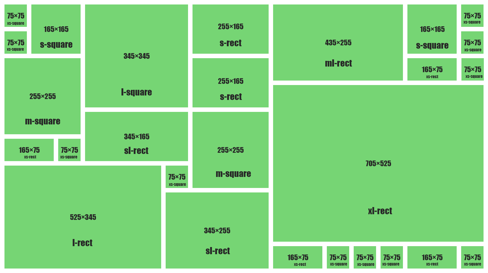

Widget Sizes
============

To support automated nice ordering on dashboard. Widgets should be in
one of the ten following sizes.

-  75px × 75px - xs-square
-  165px × 75px - xs-rect
-  165px × 165px - s-square
-  255px × 165px - s-rect
-  345px × 165px - sl-rect
-  255px × 255px - m-square
-  345px × 255px - m-rect
-  435px × 255px - ml-rect
-  345px × 345px - l-square
-  705px × 525px - xl-rect

   Example of widget ordering

