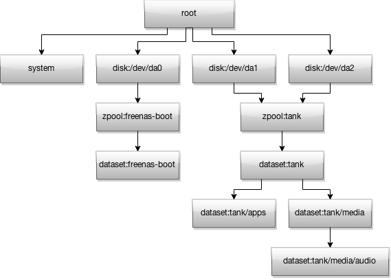
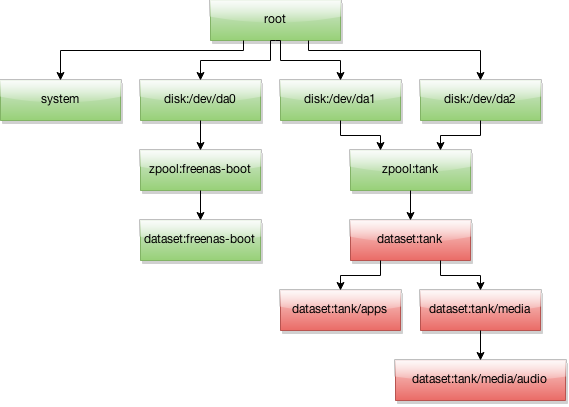

dispatcher task processing
==========================

Basic information
-----------------

Task is the basic unit of work in dispatcher. It's a piece of code,
running in separate thread interacting with the system, altering system
state and providing feedback to user.

Task scheduling
---------------

Tasks submitted to server are added onto a list and at that time, task
verify() method is called. verify() should return list of resource names
required for that task. That information is recorded and used in
distribution thread. Distribution thread evaluates which resources are
free to use and spawns task from waiting list accordingly. Tasks
submitted earlier are typically scheduled first.

Resource hierarchy
------------------

Tasks are synchronized using "resource tree". It's a directed acyclic
graph (DAG) of locks representing certain resources. Each task needs to
claim resources it want to use at "verify" stage. Locking one resource
means whole sub-tree of resources under that one will be also locked.

Acquiring resource may fail if:

-  Resource is already locked
-  Any resource or any subtree of resources depending on that resource
   is already locked

Simple example of dispatcher resource tree:

   Resource tree
Suppose we have a task operating on a dataset. It would acquire resource
representing that dataset, eg. "tank" (root dataset of zpool having the
same name):

   Partially busy resource tree
"zfs:tank" resource and all dependent resources are locked, which
means that no other task can acquire any of them until currently
executed finishes. Also, it's not possible to acquire resource which has
any busy resources in it's dependency subtree. For example, given
situation from the diagram above, any task trying to claim
"disk:/dev/da2" resource would wait until "dataset:tank" and all other
dependent resources will be freed.

Task Interface
--------------

All tasks should derive from base class ``tasks.Task``.

Mandatory methods:
~~~~~~~~~~~~~~~~~~

.. py:function:: describe(self, args...)

    Return human readable task description as string. That doesn't need to
    be localizable, it's used by debugging purposes only.

.. py:function:: verify(self, args...)

    Verify whether provided task parameters are sane and compute list of
    resources needed for that task. Should return list of resources, eg.
    ``["disk:/dev/da0", "disk:/dev/da1"]``

.. py:function:: run(self, args...)

    Run actual task.

Optional methods:
~~~~~~~~~~~~~~~~~

Long-running tasks can implement following methods to provide user with
task progress and possibility to abort a task in the middle (by default,
task can't be aborted once started):

.. py:function:: get_status(self)

    Return progress information from a task.

.. py:function:: abort(self)

    Try to abort a task. If that succeeds, return ``True``. If aborting
    failed, return ``False``.

Reporting failures
~~~~~~~~~~~~~~~~~~

Failures at verify stage should be communicated by raising
``task.VerifyException``. Failures at run stage should be reported by
raising ``task.TaskException``. However, all exceptions at both stages
are catched and presented to user.
