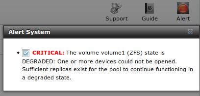

.. index:: Alert
.. _Alert:

Alert
=====

FreeNAS® provides an alert system to provide a visual warning of any conditions that require administrative attention. The "Alert" button in the far right
corner will flash red when there is an outstanding alert. In the example alert shown in Figure 22a, one of the disks in a ZFS pool is offline which has
degraded the state of the pool.

**Figure 22a: Example Alert Message**

|alert2.png|

Informational messages will have a green "OK" while messages requiring attention will be listed as a red "CRITICAL". CRITICAL messages will also be emailed to
the root user account. If you are aware of a critical condition but wish to remove the flashing alert until you deal with it, uncheck the box next to that
message.

Behind the scenes, an alert daemon checks for various alert conditions, such as volume and disk status, and writes the current conditions to
:file:`/var/tmp/alert`. The daemon retrieves the current alert status every minute and will change the solid green alert icon to flashing red if a new alert
is detected. Some of the conditions that trigger an alert include:

* a volume's capacity goes over 80%

* new OpenZFS feature flags are available for the pool; this alert can be unchecked if you choose not to upgrade the pool at this time

* a new update is available

* non-optimal multipath states

* ZFS pool status changes from "HEALTHY"

* the system is unable to bind to the "WebGUI IPv4 Address" set in :menuselection:`System --> General`

* the system can not find an IP address configured on an iSCSI portal

* a replication task fails

* a VMware login or a :ref:`VMware-Snapshot` task fails

* the status of a LSI MegaRAID SAS controller has changed;
  `mfiutil(8) <http://www.freebsd.org/cgi/man.cgi?query=mfiutil>`_
  is included for managing these devices

An alert will also be generated when the LSI HBA firmware version does not match the driver version. To resolve this alert, download the IT (integrated
target) firmware, not the IR (integrated RAID) firmware, from the LSI website. Then, specify the name of the firmware image and bios as well as the
controller to flash::

 sas2flash -f firmwareimagename -b biosname -c controllernumber

When finished, reboot the system. The new firmware version should appear in the system messages and the alert will be cleared.
