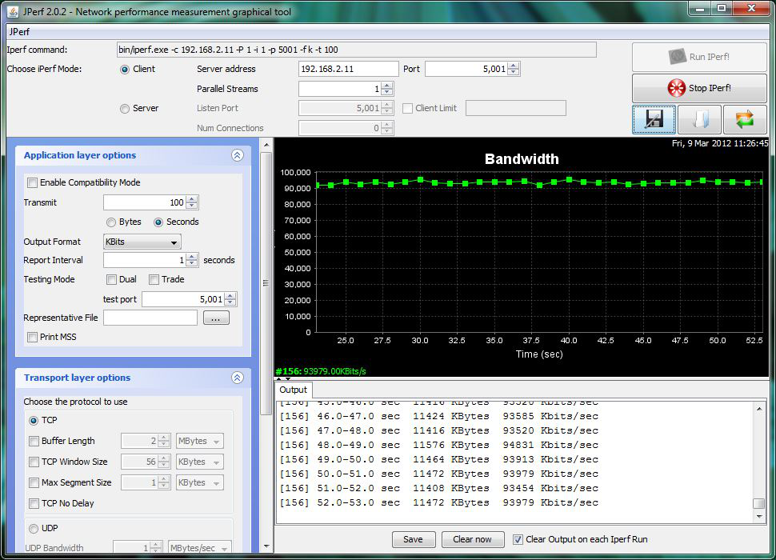
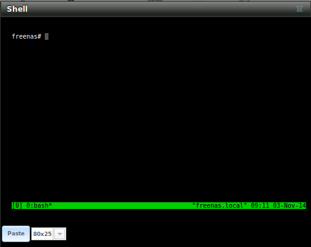

.. _Command Line Utilities:

Command Line Utilities
======================

Several command line utilities which are provided with FreeNAS® are demonstrated in this section.

The following utilities can be used for benchmarking and performance testing:

* :ref:`Iperf`: used for measuring maximum TCP and UDP bandwidth performance

* :ref:`Netperf`: a tool for measuring network performance

* :ref:`IOzone`: filesystem benchmark utility used to perform a broad filesystem analysis

* :ref:`arcstat`: used to gather ZFS ARC statistics

* :ref:`XDD`: a tool for measuring and characterizing disk subsystem I/O

The following utilities are specific to RAID controllers:

* :ref:`tw_cli`:_used to monitor and maintain 3ware RAID controllers

* :ref:`MegaCli`: used to configure and manage LSI MegaRAID SAS family of RAID controllers

This section also describes the following utilities:

* :ref:`freenas-debug`: the backend used to dump FreeNAS® debugging information

* :ref:`tmux`: a terminal multiplexer similar to GNU screen

* :ref:`Dmidecode`: reports information about system hardware as described in the system's BIOS

.. index:: Iperf
.. _Iperf:

Iperf
-----

Iperf is a utility for measuring maximum TCP and UDP bandwidth performance. It can be used to chart network throughput over time. For example, you can use it
to test the speed of different types of shares to determine which type best performs on your network.

FreeNAS® includes the Iperf server. To perform network testing, you will need to install an Iperf client on a desktop system that has network access to the
FreeNAS® system. This section will demonstrate how to use the
`xjperf GUI client <http://code.google.com/p/xjperf/downloads/detail?name=jperf-2.0.2.zip>`_
as it works on Windows, Mac OS X, Linux, and BSD systems.

Since this client is java based, you will also need to install the appropriate
`JRE <http://www.oracle.com/technetwork/java/javase/downloads/index.html>`_
for the client operating system.

Linux and BSD users will need to install the iperf package using their operating system's package management system.

To start xjperf on Windows: unzip the downloaded file, start Command Prompt in Run as administrator mode, :command:`cd` to the unzipped folder, and run
:command:`jperf.bat`.

To start xjperf on Mac OS X, Linux, or BSD, unzip the downloaded file, :command:`cd` to the unzipped directory, type :command:`chmod u+x jperf.sh`, and run
:command:`./jperf.sh`.

Once the client is ready, you need to start the Iperf server on FreeNAS®. To see the available server options, open Shell and type::

 iperf --help | more
 Usage: iperf [-s|-c host] [options]
 iperf [-h|--help] [-v|--version]

 Client/Server:
 -f, --format	[kmKM]	format to report: Kbits, Mbits, KBytes, MBytes
 -i, --interval	#	seconds between periodic bandwidth reports
 -l, --len	#[KM]	length of buffer to read or write (default 8 KB)
 -m, --print_mss	print TCP maximum segment size (MTU - TCP/IP header)
 -o, --output	<filename> output the report or error message to this specified file
 -p, --port	#	server port to listen on/connect to
 -u, --udp		use UDP rather than TCP
 -w, --window	#[KM]	TCP window size (socket buffer size)
 -B, --bind	<host>	bind to <host>, an interface or multicast address
 -C, --compatibility	for use with older versions does not sent extra msgs
 -M, --mss	#	set TCP maximum segment size (MTU - 40 bytes)
 -N, --nodelay		set TCP no delay, disabling Nagle's Algorithm
 -V, --IPv6Version	Set the domain to IPv6

 Server specific:
 -s, --server		run in server mode
 -U, --single_udp	run in single threaded UDP mode
 -D, --daemon		run the server as a daemon

 Client specific:
 -b, --bandwidth #[KM]	for UDP, bandwidth to send at in bits/sec
			(default 1 Mbit/sec, implies -u)
 -c, --client	<host>	run in client mode, connecting to <host>
 -d, --dualtest		Do a bidirectional test simultaneously
 -n, --num	#[KM]	number of bytes to transmit (instead of -t)
 -r, --tradeoff		Do a bidirectional test individually
 -t, --time	#	time in seconds to transmit for (default 10 secs)
 -F, --fileinput <name>	input the data to be transmitted from a file
 -I, --stdin		input the data to be transmitted from stdin
 -L, --listenport #	port to receive bidirectional tests back on
 -P, --parallel	#	number of parallel client threads to run
 -T, --ttl	#	time-to-live, for multicast (default 1)
 -Z, --linux-congestion <algo> set TCP congestion control algorithm (Linux only)

 Miscellaneous:
 -x, --reportexclude [CDMSV]	exclude C(connection) D(data) M(multicast) S(settings) V(server) reports
 -y, --reportstyle C		report as a Comma-Separated Values
 -h, --help			print this message and quit
 -v, --version			print version information and quit

 [KM] Indicates options that support a K or M suffix for kilo- or mega-

 The TCP window size option can be set by the environment variable

 TCP_WINDOW_SIZE. Most other options can be set by an environment variable
 IPERF_<long option name>, such as IPERF_BANDWIDTH.

For example, to perform a TCP test and start the server in daemon mode (so that you get your prompt back), type::

 iperf -sD
 ------------------------------------------------------------
 Server listening on TCP port 5001
 TCP window size: 64.0 KByte (default)
 ------------------------------------------------------------
 Running Iperf Server as a daemon
 The Iperf daemon process ID: 4842

.. note:: if you close Shell, the daemon process will stop. Have your environment setup (e.g. shares configured and started)
   **before** starting the iperf process.

From your desktop, open the client. Input the IP of address of the FreeNAS® system, specify the running time for the test under
:menuselection:`Application layer options --> Transmit` (the default test time is 10 seconds), and click the "Run Iperf!" button. Figure 24.1a shows an
example of the client running on a Windows system while an SFTP transfer is occurring on the network.

**Figure 24.1a: Viewing Bandwidth Statistics Using xjperf**

|iperf.png|

Depending upon the traffic being tested (e.g. the type of share running on your network), you may need to test UDP instead of TCP. To start the iperf server
in UDP mode, use :command:`iperf -sDu` as the **u** specifies UDP; the startup message should indicate that the server is listening for UDP datagrams. If you
are not sure if the traffic that you wish to test is UDP or TCP, run this command to determine which services are running on the FreeNAS® system::

 sockstat -4 | more
 USER	COMMAND	PID	FD PROTO	LOCAL ADDRESS	FOREIGN ADDRESS
 root	iperf	4870	6  udp4		*:5001		*:*
 root	iperf	4842	6  tcp4		*:5001		*:*
 www	nginx	4827	3  tcp4		127.0.0.1:15956 127.0.0.1:9042
 www	nginx	4827	5  tcp4		192.168.2.11:80 192.168.2.26:56964
 www	nginx	4827	7  tcp4		*:80		*:*
 root	sshd	3852	5  tcp4		*:22		*:*
 root	python	2503	5  udp4		*:*		*:*
 root	mountd	2363	7  udp4		*:812		*:*
 root	mountd	2363	8  tcp4		*:812		*:*
 root	rpcbind	2359	9  udp4		*:111		*:*
 root	rpcbind	2359	10 udp4		*:886		*:*
 root	rpcbind	2359	11 tcp4		*:111		*:*
 root	nginx	2044	7  tcp4		*:80		*:*
 root	python	2029	3  udp4		*:*		*:*
 root	python	2029	4  tcp4		127.0.0.1:9042	*:*
 root	python	2029	7  tcp4		127.0.0.1:9042	127.0.0.1:15956
 root	ntpd	1548	20 udp4		*:123		*:*
 root	ntpd	1548	22 udp4		192.168.2.11:123*:*
 root	ntpd	1548	25 udp4		127.0.0.1:123	*:*
 root	syslogd	1089	6  udp4		127.0.0.1:514	*:*

When you are finished testing, either type :command:`killall iperf` or close Shell to terminate the iperf server process.

.. index:: Netperf
.. _Netperf:

Netperf
-------

Netperf is a benchmarking utility that can be used to measure the performance of unidirectional throughput and end-to-end latency.

Before you can use the :command:`netperf` command, you must start its server process using this command::

 netserver
 Starting netserver with host 'IN(6)ADDR_ANY' port '12865' and family AF_UNSPEC

The following command will display the available options for performing tests with the :command:`netperf` command. The
`Netperf Manual <http://www.netperf.org/svn/netperf2/tags/netperf-2.6.0/doc/netperf.html>`_
describes each option in more detail and explains how to perform many types of tests. It is the best reference for understanding how each test works and how
to interpret your results. When you are finished with your tests, type :command:`killall netserver` to stop the server process.

::

 netperf -h |more
 Usage: netperf [global options] -- [test options]
 Global options:
     -a send,recv	Set the local send,recv buffer alignment
     -A send,recv	Set the remote send,recv buffer alignment
     -B brandstr	Specify a string to be emitted with brief output
     -c [cpu_rate]	Report local CPU usage
     -C [cpu_rate]	Report remote CPU usage
     -d			Increase debugging output
     -D [secs,units] *  Display interim results at least every secs seconds
			using units as the initial guess for units per second
     -f G|M|K|g|m|k	Set the output units
     -F fill_file	Pre-fill buffers with data from fill_file
     -h			Display this text
     -H name|ip,fam *	Specify the target machine and/or local ip and family
     -i max,min		Specify the max and min number of iterations (15,1)
     -I lvl[,intvl]	Specify confidence level (95 or 99) (99)
			and confidence interval in percentage (10)
     -j			Keep additional timing statistics
     -l testlen		Specify test duration (>0 secs) (<0 bytes|trans)
     -L name|ip,fam *	Specify the local ip|name and address family
     -o send,recv	Set the local send,recv buffer offsets
     -O send,recv	Set the remote send,recv buffer offset
     -n numcpu		Set the number of processors for CPU util
     -N			Establish no control connection, do 'send' side only
     -p port,lport*	Specify netserver port number and/or local port
     -P 0|1		Don't/Do display test headers
     -r			Allow confidence to be hit on result only
     -s seconds		Wait seconds between test setup and test start
     -S			Set SO_KEEPALIVE on the data connection
     -t testname	Specify test to perform
     -T lcpu,rcpu	Request netperf/netserver be bound to local/remote cpu
     -v verbosity	Specify the verbosity level
     -W send,recv	Set the number of send,recv buffers
     -v level		Set the verbosity level (default 1, min 0)
     -V			Display the netperf version and exit

For those options taking two parms, at least one must be specified; specifying one value without a comma will set both parms to that value, specifying a value
with a leading comma will set just the second parm, a value with a trailing comma will set just the first. To set each parm to unique values, specify both and
separate them with a comma.

For these options taking two parms, specifying one value with no comma will only set the first parms and will leave the second at the default value. To set
the second value it must be preceded with a comma or be a comma-separated pair. This is to retain previous netperf behaviour.

.. index:: IOzone
.. _IOzone:

IOzone
------

IOzone is a disk and filesystem benchmarking tool. It can be used to test file I/O performance for the following operations: read, write, re-read, re-write,
read backwards, read strided, fread, fwrite, random read, pread, mmap, aio_read, and aio_write.

FreeNAS® ships with IOzone, meaning that it can be run from Shell. When using IOzone on FreeNAS®, :command:`cd` to a directory in a volume that you have
permission to write to, otherwise you will get an error about being unable to write the temporary file.

Before using IOzone, read through the
`IOzone documentation PDF <http://www.iozone.org/docs/IOzone_msword_98.pdf>`_
as it describes the tests, the many command line switches, and how to interpret your results.

If you have never used this tool before, these resources provide good starting points on which tests to run, when to run them, and how to interpret the
results:

* `How To Measure Linux Filesystem I/O Performance With iozone <http://www.cyberciti.biz/tips/linux-filesystem-benchmarking-with-iozone.html>`_

* `Analyzing NFS Client Performance with IOzone <http://www.iozone.org/docs/NFSClientPerf_revised.pdf>`_

* `10 iozone Examples for Disk I/O Performance Measurement on Linux <http://www.thegeekstuff.com/2011/05/iozone-examples/>`_

You can receive a summary of the available switches by typing the following command. As you can see from the number of options, IOzone is comprehensive and it
may take some time to learn how to use the tests effectively.

Starting with version 9.2.1, FreeNAS® enables compression on newly created ZFS pools by default. Since IOzone creates test data that is compressible, this
can skew test results. To configure IOzone to generate incompressible test data, include the options **-+w 1 -+y 1 -+C 1**.

Alternatively, consider temporarily disabling compression on the ZFS pool or dataset when running IOzone benchmarks.

.. note:: if you prefer to visualize the collected data, scripts are available to render IOzone's output in
   `Gnuplot <http://www.gnuplot.info/>`_.

::

 iozone -h | more
 iozone: help mode
 Usage: iozone[-s filesize_Kb] [-r record_size_Kb] [-f [path]filename] [-h]
	      [-i test] [-E] [-p] [-a] [-A] [-z] [-Z] [-m] [-M] [-t children]
	      [-l min_number_procs] [-u max_number_procs] [-v] [-R] [-x] [-o]
	      [-d microseconds] [-F path1 path2...] [-V pattern] [-j stride]
	      [-T] [-C] [-B] [-D] [-G] [-I] [-H depth] [-k depth] [-U mount_point]
	      [-S cache_size] [-O] [-L cacheline_size] [-K] [-g maxfilesize_Kb]
	      [-n minfilesize_Kb] [-N] [-Q] [-P start_cpu] [-e] [-c] [-b Excel.xls]
	      [-J milliseconds] [-X write_telemetry_filename] [-w] [-W]
	      [-Y read_telemetry_filename] [-y minrecsize_Kb] [-q maxrecsize_Kb]
	      [-+u] [-+m cluster_filename] [-+d] [-+x multiplier] [-+p # ]
	      [-+r] [-+t] [-+X] [-+Z] [-+w percent dedupable] [-+y percent_interior_dedup]
	      [-+C percent_dedup_within]
	  -a  Auto mode
	  -A  Auto2 mode
	  -b Filename  Create Excel worksheet file
	  -B  Use mmap() files
	  -c  Include close in the timing calculations
	  -C  Show bytes transferred by each child in throughput testing
	  -d #  Microsecond delay out of barrier
	  -D  Use msync(MS_ASYNC) on mmap files
	  -e  Include flush (fsync,fflush) in the timing calculations
	  -E  Run extension tests
	  -f  filename to use
	  -F  filenames for each process/thread in throughput test
	  -g #  Set maximum file size (in Kbytes) for auto mode (or #m or #g)
	  -G  Use msync(MS_SYNC) on mmap files
	  -h  help
	  -H #  Use POSIX async I/O with # async operations
	  -i #  Test to run (0=write/rewrite, 1=read/re-read, 2=random-read/write
		3=Read-backwards, 4=Re-write-record, 5=stride-read, 6=fwrite/re-fwrite
		7=fread/Re-fread, 8=random_mix, 9=pwrite/Re-pwrite, 10=pread/Re-pread
		11=pwritev/Re-pwritev, 12=preadv/Re-preadv)
	  -I  Use VxFS VX_DIRECT, O_DIRECT,or O_DIRECTIO for all file operations
	  -j #  Set stride of file accesses to (# * record size)
	  -J #  milliseconds of compute cycle before each I/O operation
	  -k #  Use POSIX async I/O (no bcopy) with # async operations
	  -K  Create jitter in the access pattern for readers
	  -l #  Lower limit on number of processes to run
	  -L #  Set processor cache line size to value (in bytes)
	  -m  Use multiple buffers
	  -M  Report uname -a output
	  -n #  Set minimum file size (in Kbytes) for auto mode (or #m or #g)
	  -N  Report results in microseconds per operation
	  -o  Writes are synch (O_SYNC)
	  -O  Give results in ops/sec.
	  -p  Purge on
	  -P #  Bind processes/threads to processors, starting with this cpu
	  -q #  Set maximum record size (in Kbytes) for auto mode (or #m or #g)
	  -Q  Create offset/latency files
	  -r #  record size in Kb
	     or -r #k .. size in Kb
	     or -r #m .. size in Mb
	     or -r #g .. size in Gb
	  -R  Generate Excel report
	  -s #  file size in Kb
	     or -s #k .. size in Kb
	     or -s #m .. size in Mb
	     or -s #g .. size in Gb
	  -S #  Set processor cache size to value (in Kbytes)
	  -t #  Number of threads or processes to use in throughput test
	  -T  Use POSIX pthreads for throughput tests
	  -u #  Upper limit on number of processes to run
	  -U  Mount point to remount between tests
	  -v  version information
	  -V #  Verify data pattern write/read
	  -w  Do not unlink temporary file
	  -W  Lock file when reading or writing
	  -x  Turn off stone-walling
	  -X filename  Write telemetry file. Contains lines with (offset reclen compute_time) in ascii
	  -y #  Set minimum record size (in Kbytes) for auto mode (or #m or #g)
	  -Y filename  Read telemetry file. Contains lines with (offset reclen compute_time) in ascii
	  -z  Used in conjunction with -a to test all possible record sizes
	  -Z  Enable mixing of mmap I/O and file I/O
	  -+E Use existing non-Iozone file for read-only testing
	  -+K Sony special. Manual control of test 8.
	  -+m Cluster_filename  Enable Cluster testing
	  -+d File I/O diagnostic mode. (To troubleshoot a broken file I/O subsystem)
	  -+u Enable CPU utilization output (Experimental)
	  -+x # Multiplier to use for incrementing file and record sizes
	  -+p # Percentage of mix to be reads
	  -+r Enable O_RSYNC|O_SYNC for all testing.
	  -+t Enable network performance test. Requires -+m
	  -+n No retests selected.
	  -+k Use constant aggregate data set size.
	  -+q Delay in seconds between tests.
	  -+l Enable record locking mode.
	  -+L Enable record locking mode, with shared file.
	  -+B Sequential mixed workload.
	  -+A # Enable madvise. 0 = normal, 1=random, 2=sequential 3=dontneed, 4=willneed
	  -+N Do not truncate existing files on sequential writes.
	  -+S # Dedup-able data is limited to sharing within each numerically identified file set
	  -+V Enable shared file. No locking.
	  -+X Enable short circuit mode for filesystem testing ONLY
	      ALL Results are NOT valid in this mode.
	  -+Z Enable old data set compatibility mode. WARNING.. Published
	      hacks may invalidate these results and generate bogus, high values for results.
	  -+w ## Percent of dedup-able data in buffers.
	  -+y ## Percent of dedup-able within & across files in buffers.
	  -+C ## Percent of dedup-able within & not across files in buffers.
	  -+H Hostname  Hostname of the PIT server.
	  -+P Service  Service of the PIT server.
	  -+z Enable latency histogram logging.

.. index:: arcstat
.. _arcstat:

arcstat
-------

Arcstat is a script that prints out ZFS
`ARC <http://en.wikipedia.org/wiki/Adaptive_replacement_cache>`_
statistics. Originally it was a perl script created by Sun. That perl script was ported to FreeBSD and was then ported as a Python script for use on
FreeNAS®.

Watching ARC hits/misses and percentages will provide an indication of how well your ZFS pool is fetching from the ARC rather than using disk I/O. Ideally,
you want as many things fetching from cache as possible. Keep your load in mind as you review the stats. For random reads, expect a miss and having to go to
disk to fetch the data. For cached reads, expect it to pull out of the cache and have a hit.

Like all cache systems, the ARC takes time to fill with data. This means that it will have a lot of misses until the pool has been in use for a while. If
there continues to be lots of misses and high disk I/O on cached reads, there is cause to investigate further and tune the system.

The
`FreeBSD ZFS Tuning Guide <http://wiki.freebsd.org/ZFSTuningGuide>`_
provides some suggestions for commonly tuned :command:`sysctl` values. It should be noted that performance tuning is more of an art than a science and that
any changes you make will probably require several iterations of tune and test. Be aware that what needs to be tuned will vary depending upon the type of
workload and that what works for one person's network may not benefit yours.

In particular, the value of pre-fetching depends upon the amount of memory and the type of workload, as seen in these two examples:

* `Understanding ZFS: Prefetch  <http://www.cuddletech.com/blog/pivot/entry.php?id=1040>`_

* `ZFS prefetch algorithm can cause performance drawbacks <http://southbrain.com/south/2008/04/the-nightmare-comes-slowly-zfs.html>`_

FreeNAS® provides two command line scripts which an be manually run from Shell:

* :command:`arc_summary.py`: provides a summary of the statistics

* :command:`arcstat.py`: used to watch the statistics in real time

The advantage of these scripts is that they can be used to provide real time (right now) information, whereas the current GUI reporting mechanism is designed
to only provide graphs charted over time.

This
`forum post <http://forums.freenas.org/threads/benchmarking-zfs.7928/>`__
demonstrates some examples of using these scripts with hints on how to interpret the results.

To view the help for arcstat.py::

 arcstat.py -h
 Usage: arcstat [-hvx] [-f fields] [-o file] [-s string] [interval [count]]
 -h: Print this help message
 -v: List all possible field headers and definitions
 -x: Print extended stats
 -f: Specify specific fields to print (see -v)
 -o: Redirect output to the specified file
 -s: Override default field separator with custom character or string

 Examples:
 arcstat -o /tmp/a.log 2 10
 arcstat -s "," -o /tmp/a.log 2 10
 arcstat -v
 arcstat -f time,hit%,dh%,ph%,mh% 1

To view ARC statistics in real time, specify an interval and a count. This command will display every 1 second for a count of five.
::

 arcstat.py 1 5
 time		read	miss	miss%	dmis	dm%	pmis	pm%	mmis	mm%	arcsz	c
 06:19:03	  7	0	0	0	0	0	0	0	0	153M	6.6G
 06:19:04	257	0	0	0	0	0	0	0	0	153M	6.6G
 06:19:05	193	0	0	0	0	0	0	0	0	153M	6.6G
 06:19:06	193	0	0	0	0	0	0	0	0	153M	6.6G
 06:19:07	255	0	0	0	0	0	0	0	0	153M	6.6G

Table 24.4a briefly describes the columns in the output.

**Table 24.4a: arcstat Column Descriptions**

+---------------------+-------------------------------------------------------------------------+
| **Column**          | **Description**                                                         |
|                     |                                                                         |
+=====================+=========================================================================+
| read                | total ARC accesses/second                                               |
|                     |                                                                         |
+---------------------+-------------------------------------------------------------------------+
| miss                | ARC misses/second                                                       |
|                     |                                                                         |
+---------------------+-------------------------------------------------------------------------+
| miss%               | ARC miss percentage                                                     |
|                     |                                                                         |
+---------------------+-------------------------------------------------------------------------+
| dmis                | demand data misses/second                                               |
|                     |                                                                         |
+---------------------+-------------------------------------------------------------------------+
| dm%                 | demand data miss percentage                                             |
|                     |                                                                         |
+---------------------+-------------------------------------------------------------------------+
| pmis                | prefetch misses per second                                              |
|                     |                                                                         |
+---------------------+-------------------------------------------------------------------------+
| pm%                 | prefetch miss percentage                                                |
|                     |                                                                         |
+---------------------+-------------------------------------------------------------------------+
| mmis                | metadata misses/second                                                  |
|                     |                                                                         |
+---------------------+-------------------------------------------------------------------------+
| mm%                 | metadata miss percentage                                                |
|                     |                                                                         |
+---------------------+-------------------------------------------------------------------------+
| arcsz               | arc size                                                                |
|                     |                                                                         |
+---------------------+-------------------------------------------------------------------------+
| c                   | arc target size                                                         |
|                     |                                                                         |
+---------------------+-------------------------------------------------------------------------+

This command provides more verbose information::

 arcstat.py -v
 System Memory:
	2.00%	156.36	MiB Active,	1.49%	116.70	MiB Inact
	39.49%	3.02	GiB Wired,	0.03%	2.53	MiB Cache
	56.97%	4.35	GiB Free,	0.02%	1.23	MiB Gap
	Real Installed:				8.00	GiB
	Real Available:			98.65%	7.89	GiB
	Real Managed:			96.83%	7.64	GiB
	Logical Total:				8.00	GiB
	Logical Used:			44.12%	3.53	GiB
	Logical Free:			55.88%	4.47	GiB
	Kernel Memory:				226.69	MiB
	Data:				90.16%	204.39	MiB
	Text:				9.84%	22.31	MiB
	Kernel Memory Map:			7.64	GiB
	Size:				22.56%	1.72	GiB
	Free:				77.44%	5.92	GiB
	ARC Summary: (HEALTHY)
		Storage pool Version:	5000
		Filesystem Version:	5
		Memory Throttle Count:	0
	ARC Misc:
		Deleted:		0
		Recycle Misses:		0
		Mutex Misses:		0
		Evict Skips:		0
	ARC Size:			28.39%	1.89	GiB
		Target Size: (Adaptive)	100.00%	6.64	GiB
		Min Size (Hard Limit):	12.50%	850.23	MiB
		Max Size (High Water):	8:1	6.64	GiB
	ARC Size Breakdown:
		Recently Used Cache Size: 50.30% 3.34	GiB
		Frequently Used Cache Size: 49.70% 3.30	GiB
	ARC Hash Breakdown:
		Elements Max:		258.19k
		Elements Current:	100.00%	258.19k
		Collisions:			157.63k
		Chain Max:			8
		Chains:				79.46k
	ARC Total accesses:			2.25m
		Cache Hit Ratio:	99.94%	2.25m
		Cache Miss Ratio:	0.06%	1.38k
		Actual Hit Ratio:	99.86%	2.25m
		Data Demand Efficiency:	100.00%	1.99m
		Data Prefetch Efficiency: 100.00% 6.11k
		CACHE HITS BY CACHE LIST:
		 Anonymously Used:	0.02%	353
		 Most Recently Used:	2.70%	60.83k
		 Most Frequently Used:	97.22%	2.19m
		 Most Recently Used Ghost: 0.06% 1.34k
		 Most Frequently Used Ghost: 0.00% 13
		CACHE HITS BY DATA TYPE:
		 Demand Data:		88.26%	1.99m
		 Prefetch Data:		0.27%	6.11k
		 Demand Metadata:	11.47%	258.29k
		 Prefetch Metadata:	0.00%	0
		CACHE MISSES BY DATA TYPE:
		 Demand Data:		0.00%	0
		 Prefetch Data:		0.00%	0
		 Demand Metadata:	9.76%	135
		 Prefetch Metadata:	90.24%	1.25k
	File-Level Prefetch: (HEALTHY)DMU Efficiency: 10.16m
		 Hit Ratio:		80.03%	8.13m
		 Miss Ratio:		19.97%	2.03m
		 Colinear:			2.03m
		  Hit Ratio:		0.00%	91
		  Miss Ratio:		100.00%	2.03m
		 Stride:			8.06m
		  Hit Ratio:		100.00%	8.06m
		  Miss Ratio:		0.00%	0
	DMU Misc:
		Reclaim:			2.03m
		 Successes:		0.08%	1.65k
		 Failures:		99.92%	2.03m
		Streams:			72.11k
		 +Resets:		0.00%	0
		 -Resets:		100.00%	72.11k
		Bogus:				0
	ZFS Tunable (sysctl):
		kern.maxusers			384
		vm.kmem_size			8205963264
		vm.kmem_size_scale		1
		vm.kmem_size_min		0
		vm.kmem_size_max		329853485875
		vfs.zfs.l2c_only_size		0
		vfs.zfs.mfu_ghost_data_lsize	623119872
		vfs.zfs.mfu_ghost_metadata_lsize 348672
		vfs.zfs.mfu_ghost_size		623468544
		vfs.zfs.mfu_data_lsize		302145536
		vfs.zfs.mfu_metadata_lsize	8972288
		vfs.zfs.mfu_size		326883328
		vfs.zfs.mru_ghost_data_lsize	769186304
		vfs.zfs.mru_ghost_metadata_lsize 8935424
		vfs.zfs.mru_ghost_size		778121728
		vfs.zfs.mru_data_lsize		1127638016
		vfs.zfs.mru_metadata_lsize	30442496
		vfs.zfs.mru_size		1274765312
		vfs.zfs.anon_data_lsize		0
		vfs.zfs.anon_metadata_lsize	0
		vfs.zfs.anon_size		279040
		vfs.zfs.l2arc_norw		1
		vfs.zfs.l2arc_feed_again	1
		vfs.zfs.l2arc_noprefetch	1
		vfs.zfs.l2arc_feed_min_ms	200
		vfs.zfs.l2arc_feed_secs		1
		vfs.zfs.l2arc_headroom		2
		vfs.zfs.l2arc_write_boost	8388608
		vfs.zfs.l2arc_write_max		8388608
		vfs.zfs.arc_meta_limit		1783055360
		vfs.zfs.arc_meta_used		594834472
		vfs.zfs.arc_min			891527680
		vfs.zfs.arc_max			7132221440
		vfs.zfs.dedup.prefetch		1
		vfs.zfs.mdcomp_disable		0
		vfs.zfs.nopwrite_enabled	1
		vfs.zfs.zfetch.array_rd_sz	1048576
		vfs.zfs.zfetch.block_cap	256
		vfs.zfs.zfetch.min_sec_reap	2
		vfs.zfs.zfetch.max_streams	8
		vfs.zfs.prefetch_disable	0
		vfs.zfs.no_scrub_prefetch	0
		vfs.zfs.no_scrub_io		0
		vfs.zfs.resilver_min_time_ms	3000
		vfs.zfs.free_min_time_ms	1000
		vfs.zfs.scan_min_time_ms	1000
		vfs.zfs.scan_idle		50
		vfs.zfs.scrub_delay		4
		vfs.zfs.resilver_delay		2
		vfs.zfs.top_maxinflight		32
		vfs.zfs.write_to_degraded	0
		vfs.zfs.mg_noalloc_threshold	0
		vfs.zfs.mg_alloc_failures	8
		vfs.zfs.condense_pct		200
		vfs.zfs.metaslab.weight_factor_enable 0
		vfs.zfs.metaslab.preload_enabled 1
		vfs.zfs.metaslab.preload_limit	3
		vfs.zfs.metaslab.unload_delay	8
		vfs.zfs.metaslab.load_pct	50
		vfs.zfs.metaslab.min_alloc_size	10485760
		vfs.zfs.metaslab.df_free_pct	4
		vfs.zfs.metaslab.df_alloc_threshold 131072
		vfs.zfs.metaslab.debug_unload	0
		vfs.zfs.metaslab.debug_load	0
		vfs.zfs.metaslab.gang_bang	131073
		vfs.zfs.ccw_retry_interval	300
		vfs.zfs.check_hostid		1
		vfs.zfs.deadman_enabled		1
		vfs.zfs.deadman_checktime_ms	5000
		vfs.zfs.deadman_synctime_ms	1000000
		vfs.zfs.recover			0
		vfs.zfs.txg.timeout		5
		vfs.zfs.max_auto_ashift		13
		vfs.zfs.vdev.cache.bshift	16
		vfs.zfs.vdev.cache.size		0
		vfs.zfs.vdev.cache.max		16384
		vfs.zfs.vdev.trim_on_init	1
		vfs.zfs.vdev.write_gap_limit	4096
		vfs.zfs.vdev.read_gap_limit	32768
		vfs.zfs.vdev.aggregation_limit	131072
		vfs.zfs.vdev.scrub_max_active	2
		vfs.zfs.vdev.scrub_min_active	1
		vfs.zfs.vdev.async_write_max_active 10
		vfs.zfs.vdev.async_write_min_active 1
		vfs.zfs.vdev.async_read_max_active 3
		vfs.zfs.vdev.async_read_min_active 1
		vfs.zfs.vdev.sync_write_max_active 10
		vfs.zfs.vdev.sync_write_min_active 10
		vfs.zfs.vdev.sync_read_max_active 10
		vfs.zfs.vdev.sync_read_min_active 10
		vfs.zfs.vdev.max_active		1000
		vfs.zfs.vdev.larger_ashift_minimal 1
		vfs.zfs.vdev.bio_delete_disable 0
		vfs.zfs.vdev.bio_flush_disable	0
		vfs.zfs.vdev.trim_max_pending	64
		vfs.zfs.vdev.trim_max_bytes	2147483648
		vfs.zfs.cache_flush_disable	0
		vfs.zfs.zil_replay_disable	0
		vfs.zfs.sync_pass_rewrite	2
		vfs.zfs.sync_pass_dont_compress	5
		vfs.zfs.sync_pass_deferred_free	2
		vfs.zfs.zio.use_uma		1
		vfs.zfs.snapshot_list_prefetch	0
		vfs.zfs.version.ioctl		3
		vfs.zfs.version.zpl		5
		vfs.zfs.version.spa		5000
		vfs.zfs.version.acl		1
		vfs.zfs.debug			0
		vfs.zfs.super_owner		0
		vfs.zfs.trim.enabled		1
		vfs.zfs.trim.max_interval	1
		vfs.zfs.trim.timeout		30
		vfs.zfs.trim.txg_delay		32

When reading the tunable values, 0 means no, 1 typically means yes, and any other number represents a value. To receive a brief description of a "sysctl"
value, use :command:`sysctl -d`. For example::

 sysctl -d vfs.zfs.zio.use_uma
 vfs.zfs.zio.use_uma: Use uma(9) for ZIO allocations

The ZFS tunables require a fair understanding of how ZFS works, meaning that you will be reading man pages and searching for the meaning of acronyms you are
unfamiliar with. **Do not change a tunable's value without researching it first.** If the tunable takes a numeric value (rather than 0 for no or 1 for yes),
do not make one up. Instead, research examples of beneficial values that match your workload.

If you decide to change any of the ZFS tunables, continue to monitor the system to determine the effect of the change. It is recommended that you test your
changes first at the command line using :command:`sysctl`. For example, to disable pre-fetch (i.e. change disable to *1* or yes)::

 sysctl vfs.zfs.prefetch_disable=1
 vfs.zfs.prefetch_disable: 0 -> 1

The output will indicate the old value followed by the new value. If the change is not beneficial, change it back to the original value. If the change turns
out to be beneficial, you can make it permanent by creating a "sysctl" using the instructions in :ref:`Tunables`.

.. index:: XDD
.. _XDD:

XDD
---

XDD is a utility which provides accurate and detailed measurements of disk I/O performance. This section provides some usage examples.

Type the name of the command without any options to see its usage::

 xdd
 Usage: xdd command-line-options
  -align [target <target#>] <#bytes>
  -blocksize [target <target#>] <#bytes/block>
  -combinedout <filename>
  -createnewfiles [target <target#>]
  -csvout <filename>
  -datapattern [target <target#>] <c> |random|sequenced|ascii <asciistring>|hex <hexdigits>|replicate
  -delay #seconds
  -deletefile [target <target#>]
  -deskew
  -devicefile
  -dio [target <target#>]
  -errout <filename>
  -fullhelp
  -heartbeat #
  -id "string" | commandline
  -kbytes [target <target#>] <#>
  -lockstep <mastertarget#> <slavetarget#> <time|op|percent|mbytes|kbytes> # <time|op|percent|mbytes|kbytes># <wait|run> <complete|
					   stop>
  -lockstepoverlapped
  -maxall
  -maxerrors #
  -maxpri
  -mbytes [target <target#>] <#>
  -minall
  -nobarrier
  -nomemlock
  -noproclock
  -numreqs [target <target#>] <#>
  -operation [target <target#>] read|write
  -output <filename>
  -passes #
  -passoffset [target <target#>] <#blocks>
  -preallocate [target <target#>] <#blocks>
  -processlock
  -processor target# processor#
  -queuedepth #cmds
  -qthreadinfo
  -randomize [target <target#>]
  -readafterwrite [target #] trigger <stat|mp> |lag <#> | reader <hostname>|port <#>
  -reallyverbose
  -recreatefiles [target <target#>]
  -reopen [target <target#>]
  -reportthreshold [target #] <#.#>
  -reqsize [target <target#>] <#blocks>
  -roundrobin # or 'all'
  -runtime #seconds
  -rwratio [target <target#>] <ratio>
  -seek [target <target#>] save <filename> |load <filename> |disthist #buckets | seekhist #buckets|sequential|random|range #blocks|
	stagger|interleave #blocks|seed # | none
  -setup filename
  -sgio
  -sharedmemory [target <target#>]
  -singleproc #
  -startdelay [target <target#>]#.#seconds
  -startoffset [target <target#>] #
  -starttime #seconds
  -starttrigger <target#> <target#> <<time|op|percent|mbytes|kbytes> #>
  -stoptrigger <target#> <target#> <<time|op|percent|mbytes|kbytes> #>
  -syncio #
  -syncwrite [target <target#>]
  -target filename
  -targetdir [target <target#>] <directory_name>
  -targetoffset # -targets # filename filename filename... -or- -targets -# filename
  -targetstartdelay #.#seconds
  -throttle [target <target#>] <ops|bw|var> <#.#ops | #.#MB/sec | #.#var>
  -timelimit [target <target#>] <#seconds>
  -timerinfo
  -timeserver <host hostname | port # | bounce #>
  -ts [target <target#>] summary|detailed|wrap|oneshot|size #|append|output <filename>|dump <filename>|triggertime <seconds>|
      triggerop <op#>
  -verbose
  -verify [target <target#>] location|contents
  -version

Here is an example of a ZFS write test::

 xdd –op write –targets 2 /mnt/tank/BIGFILE1 /mnt/tank/BIGFILE2 -blocksize 512 \ -reqsize 128 -mbytes 2048 –verbose –passes 3
 
This test will write sequentially from two existing target files, :file:`/mnt/tank/BIGFILE1` and :file:`/mnt/tank/BIGFILE2`. It starts at the beginning of
each file using a fixed request size of 128 blocks with 512 bytes per block until it has read 2048 MB, at which time it will end the current pass and proceed
to the next pass. It will do this 3 times and display performance information for each pass. The combined performance of both devices is calculated and
displayed at the end of the run. Once the test is finished, you can test the read performance by changing the **-op** to
**read**.

You can also test read or write operations on a specified disk. Replace */dev/ada0* with the device name for the disk you wish to test.
::

 xdd –op read –targets 1 /dev/ada0 –reqsize 128 -mbytes 64 –passes 3 –verbose

If you use the same switches often, create a setup file and refer to it with the **-setup** switch. For example, in a writable location (e.g. volume or
dataset) create a :file:`xdd.setup` file containing this line::

 –reqsize 128 -mbytes 64 –passes 3 –verbose

Now your command would be::

 xdd –op read –targets 1 /dev/ada0 -setup xdd.setup

To perform a random I/O test on the specified disk::

 xdd –op read –targets 1 /dev/ada0 –reqsize 8 -mbytes 16 –passes 3 –verbose –seek \ random –seek range 4000000

This random I/O test will read from the target device at some random location using a fixed request size of 8 blocks until it has read 16 MB. It will do this
3 times and display performance information for each pass. Since this is a random I/O pattern, the read requests are distributed over a range of 4,000,000
blocks. This is useful in constraining the area over which the random locations are chosen from. The same seek locations are used for each pass in order to
generate reproducible results. In fact, upon each invocation of :command:`xdd` using the same parameters, the same random locations are generated each time.
This allows the user to change the disk or starting offset and observe the effects. The random locations may be changed from pass to pass within an
:command:`xdd` run by using the **-randomize** option which generates a new set of locations for each pass. The random locations may be changed from run to
run using the **-seek seed** option to specify a different random number generation seed value for each invocation of :command:`xdd`.

.. index:: tw_cli
.. _tw_cli:

tw_cli
------

FreeNAS® includes the :command:`tw_cli` command line utility for providing controller, logical unit, and drive management for AMCC/3ware ATA RAID Controllers.
The supported models are listed in the man pages for the
`twe(4) <http://www.freebsd.org/cgi/man.cgi?query=twe>`_
and
`twa(4) <http://www.freebsd.org/cgi/man.cgi?query=twa>`_
drivers.

Before using this command, read its
`man page <http://www.cyberciti.biz/files/tw_cli.8.html>`_
as it describes the terminology and provides some usage examples.

If you type :command:`tw_cli` in Shell, the prompt will change, indicating that you have entered interactive mode where you can run all sorts of maintenance
commands on the controller and its arrays.

Alternately, you can specify one command to run. For example, to view the disks in the array::

 tw_cli /c0 show
 Unit	UnitType	Status	%RCmpl	%V/I/M	Stripe	Size(GB)	Cache 	AVrfy
 ------------------------------------------------------------------------------
 u0	RAID-6		OK	-	-	256K	5587.88		RiW	ON
 u1	SPARE		OK	-	-	-	931.505		-	OFF
 u2	RAID-10		OK	-	-	256K	1862.62		RiW	ON
 
 VPort Status	Unit 	Size		Type	Phy Encl-Slot	Model
 ------------------------------------------------------------------------------
 p8	OK	u0	931.51 GB SAS	-	/c0/e0/slt0	SEAGATE ST31000640SS
 p9	OK	u0	931.51 GB SAS	-	/c0/e0/slt1	SEAGATE ST31000640SS
 p10	OK	u0	931.51 GB SAS	-	/c0/e0/slt2	SEAGATE ST31000640SS
 p11	OK	u0	931.51 GB SAS	-	/c0/e0/slt3	SEAGATE ST31000640SS
 p12	OK	u0	931.51 GB SAS	-	/c0/e0/slt4	SEAGATE ST31000640SS
 p13	OK	u0	931.51 GB SAS	-	/c0/e0/slt5	SEAGATE ST31000640SS
 p14	OK	u0	931.51 GB SAS	-	/c0/e0/slt6	SEAGATE ST31000640SS
 p15	OK	u0	931.51 GB SAS	-	/c0/e0/slt7	SEAGATE ST31000640SS
 p16	OK	u1	931.51 GB SAS	-	/c0/e0/slt8	SEAGATE ST31000640SS
 p17	OK	u2	931.51 GB SATA	-	/c0/e0/slt9	ST31000340NS
 p18	OK	u2	931.51 GB SATA	-	/c0/e0/slt10 	ST31000340NS
 p19	OK	u2	931.51 GB SATA	-	/c0/e0/slt11 	ST31000340NS
 p20	OK	u2	931.51 GB SATA	-	/c0/e0/slt15 	ST31000340NS

 Name	OnlineState	BBUReady	Status	Volt	Temp	Hours 	LastCapTest
 ---------------------------------------------------------------------------
 bbu	On		Yes		OK	OK	OK	212	03-Jan-2012

Or, to review the event log::

 tw_cli /c0 show events
 Ctl	Date				Severity	AEN Message
 ------------------------------------------------------------------------------
 c0	[Thu Feb 23 2012 14:01:15]	INFO		Battery charging started
 c0	[Thu Feb 23 2012 14:03:02]	INFO		Battery charging completed
 c0	[Sat Feb 25 2012 00:02:18]	INFO		Verify started: unit=0
 c0	[Sat Feb 25 2012 00:02:18]	INFO		Verify started: unit=2,subunit=0
 c0	[Sat Feb 25 2012 00:02:18]	INFO		Verify started: unit=2,subunit=1
 c0	[Sat Feb 25 2012 03:49:35]	INFO		Verify completed: unit=2,subunit=0
 c0	[Sat Feb 25 2012 03:51:39]	INFO		Verify completed: unit=2,subunit=1
 c0	[Sat Feb 25 2012 21:55:59]	INFO		Verify completed: unit=0
 c0	[Thu Mar 01 2012 13:51:09]	INFO		Battery health check started
 c0	[Thu Mar 01 2012 13:51:09]	INFO		Battery health check completed
 c0	[Thu Mar 01 2012 13:51:09]	INFO		Battery charging started
 c0	[Thu Mar 01 2012 13:53:03]	INFO		Battery charging completed
 c0	[Sat Mar 03 2012 00:01:24]	INFO		Verify started: unit=0
 c0	[Sat Mar 03 2012 00:01:24]	INFO		Verify started: unit=2,subunit=0
 c0	[Sat Mar 03 2012 00:01:24]	INFO		Verify started: unit=2,subunit=1
 c0	[Sat Mar 03 2012 04:04:27]	INFO		Verify completed: unit=2,subunit=0
 c0	[Sat Mar 03 2012 04:06:25]	INFO		Verify completed: unit=2,subunit=1
 c0	[Sat Mar 03 2012 16:22:05]	INFO		Verify completed: unit=0
 c0	[Thu Mar 08 2012 13:41:39]	INFO		Battery charging started
 c0	[Thu Mar 08 2012 13:43:42]	INFO		Battery charging completed
 c0	[Sat Mar 10 2012 00:01:30]	INFO		Verify started: unit=0
 c0	[Sat Mar 10 2012 00:01:30]	INFO		Verify started: unit=2,subunit=0
 c0	[Sat Mar 10 2012 00:01:30]	INFO		Verify started: unit=2,subunit=1
 c0	[Sat Mar 10 2012 05:06:38]	INFO		Verify completed: unit=2,subunit=0
 c0	[Sat Mar 10 2012 05:08:57]	INFO		Verify completed: unit=2,subunit=1
 c0	[Sat Mar 10 2012 15:58:15]	INFO		Verify completed: unit=0

If you add some disks to the array and they are not showing up in the GUI, try running the following command::

 tw_cli /c0 rescan

Use the drives to create units and export them to the operating system. When finished, run :command:`camcontrol rescan all` and they should now be available
in the FreeNAS® GUI.

This
`forum post <http://forums.freenas.org/threads/3ware-drive-monitoring.13835/>`__
contains a handy wrapper script that will notify you of errors.

.. index:: MegaCli
.. _MegaCli:

MegaCli
-------

:command:`MegaCli` is the command line interface for the LSI MegaRAID SAS family of RAID controllers. FreeNAS® also includes the
`mfiutil(8) <http://www.freebsd.org/cgi/man.cgi?query=mfiutil>`_
utility which can be used to configure and manage connected storage devices.

The :command:`MegaCli` command is quite complex with several dozen options. While it is fully documented in this 442 page
`PDF <http://www.lsi.com/downloads/Public/MegaRAID%20Common%20Files/SASUG_51530-00_RevG.pdf>`_
, the commands demonstrated in the
`Emergency Cheat Sheet <http://tools.rapidsoft.de/perc/perc-cheat-sheet.html>`_
can get you started.

.. index:: freenas-debug
.. _freenas-debug:

freenas-debug
-------------

The FreeNAS® GUI provides an option to save debugging information to a text file using
:menuselection:`System --> Advanced --> Save Debug`. This debugging information is created by the :command:`freenas-debug` command line utility and a copy of
the information is saved to :file:`/var/tmp/fndebug`.

Using Shell, you can run this command manually to gather the specific debugging information that you need. To see the available options, type::

 freenas-debug
 usage: /usr/local/bin/freenas-debug <options>
 Where options is:
     -e		A list of comma delimited list of email addresses to email the debug log to.
     -a		Dump Active Directory Configuration
     -c		Dump (AD|LDAP) Cache
     -C		Dump CIFS Configuration
     -D		Dump Domain Controller Configuration
     -d		Dump dtrace scripts
     -g		Dump GEOM configuration
     -h		Dump Hardware Configuration
     -I		Dump IPMI Configuration
     -i		Dump iSCSI Configuration
     -j		Dump jails Information
     -l		Dump LDAP Configuration
     -T		Loader Configuration Information
     -n		Dump Network Configuration
     -N		Dump NFS Configuration
     -S		Dump SMART information
     -s		Dump SSL Configuration
     -y		Dump Sysctl Configuration
     -t		Dump System Information
     -v		Dump Boot System File Verification Status and Inconsistencies (if any)
     -z		Dump ZFS configuration
 Output will be saved to /var/tmp/fndebug

For example, if you are troubleshooting your Active Directory configuration, try the following commands to generate and view the debug file::

 freenas-debug -a

 more /var/tmp/fndebug

.. index:: tmux
.. _tmux:

tmux
----

:command:`tmux` is a terminal multiplexer which enables a number of terminals to be created, accessed, and controlled from a single screen. :command:`tmux` is
an alternative to GNU :command:`screen`. Similar to screen, :command:`tmux` can be detached from a screen and continue running in the background, then later
reattached. Unlike :ref:`Shell`, :command:`tmux` allows you to have access to a command prompt while still providing access to the graphical administration
screens.

To start a session, simply type :command:`tmux`. As seen in Figure 24.9a, a new session with a single window will open with a status line at the bottom of the
screen. This line shows information on the current session and is used to enter interactive commands.

**Figure 24.9a: tmux Session**

|tmux.png|

To create a second window, press :kbd:`Ctrl+b` then :kbd:`"`. To close a window, type :command:`exit` within the window.

`tmux(1) <http://www.openbsd.org/cgi-bin/man.cgi?query=tmux>`_
lists all of the key bindings and commands for interacting with :command:`tmux` windows and sessions.

If you close :ref:`Shell` while :command:`tmux` is running, it will detach its session. The next time you open Shell, run :command:`tmux attach` to return to
the previous session. To leave the :command:`tmux` session entirely, type :command:`exit`. If you have multiple windows running, you will need to
:command:`exit` out of each first.

These resources provide more information about using :command:`tmux`:

* `A tmux Crash Course <http://robots.thoughtbot.com/a-tmux-crash-course>`_

* `TMUX - The Terminal Multiplexer <http://blog.hawkhost.com/2010/06/28/tmux-the-terminal-multiplexer/>`_

.. index:: Dmidecode
.. _Dmidecode:

Dmidecode
---------

Dmidecode reports hardware information as reported by the system BIOS. Dmidecode does not scan the hardware, it only reports what the BIOS told it to. A
sample output can be seen
`here <http://www.nongnu.org/dmidecode/sample/dmidecode.txt>`_.

To view the BIOS report, type the command with no arguments::

 dmidecode | more

`dmidecode(8) <http://linux.die.net/man/8/dmidecode>`_
describes the supported strings and types.

