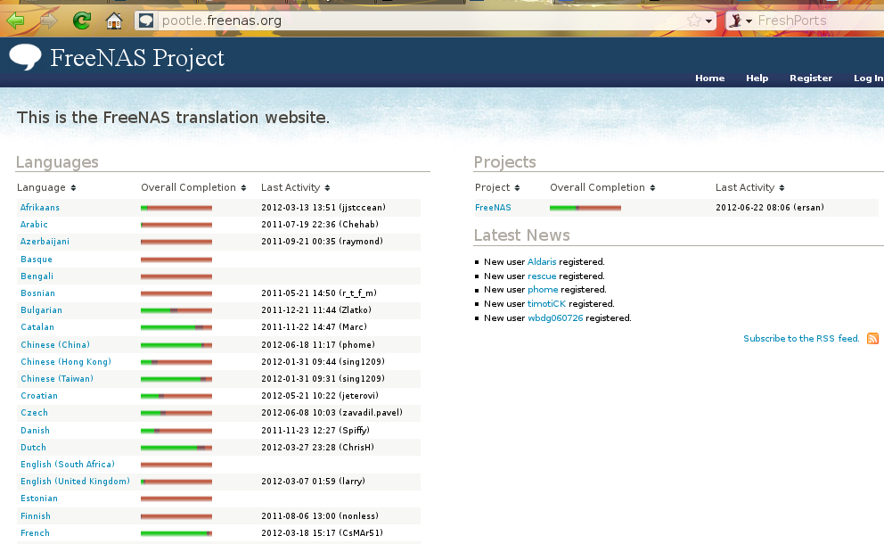
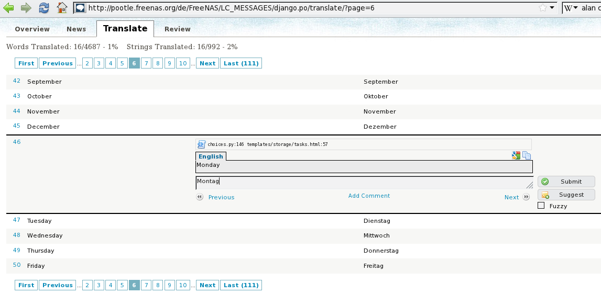

.. _Contributing to FreeNAS®:

Contributing to FreeNAS®
=========================

As an open source community, FreeNAS® relies on the input and expertise of its users to help improve FreeNAS®. When you take some time to assist the
community, your contributions benefit everyone who uses FreeNAS®.

This section describes some areas of participation to get you started. It is by no means an exhaustive list. If you have an idea that you think would benefit
the FreeNAS® community, bring it up on one of the resources mentioned in :ref:`FreeNAS® Support Resources`.

This section demonstrates how you can:

* :ref:`Localize`

* :ref:`Beta Test`

.. index:: Localize, Translate
.. _Localize:

Localize
---------

FreeNAS® uses
`Pootle <http://en.wikipedia.org/wiki/Pootle>`_, an open source application, for managing the localization of the menu screens used by the FreeNAS® graphical
administrative interface. Pootle makes it easy to find out the localization status of your native language and to translate the text for any menus that have
not been localized yet. By providing a web editor and commenting system, Pootle allows translators to spend their time making and reviewing translations
rather than learning how to use a translation submission tool.

To see the status of a localization, open `pootle.freenas.org <http://pootle.freenas.org/>`_ in your browser, as seen in Figure 25.1a:

**Figure 25.1a: FreeNAS® Localization System**

The localizations FreeNAS® users have requested are listed alphabetically on the left. If your language is missing and you would like to help in its
translation, send an email to the
`translations mailing list <http://lists.freenas.org/mailman/listinfo/freenas-translations>`_
so it can be added.

The green bar in the Overall Completion column indicates the percentage of FreeNAS® menus that have been localized. If a language is not at 100%, it means
that the menus that currently are not translated will appear in English instead of in that language.

If you wish to help localize your language, you should first join the
`translations mailing list <http://lists.freenas.org/mailman/listinfo/freenas-translations>`_
and introduce yourself and which language(s) you can assist with. This will allow you to meet other volunteers as well as keep abreast of any notices or
updates that may effect the translations. You will also need to click on the "Register" link in order to create a Pootle login account.

The first time you log into the FreeNAS® Pootle interface, you will be prompted to select your language so that you can access that language's translation
whenever you login. Alternately, you can click the "Home" link to see the status of all of the languages. To work on a translation, click the link for the
language, click the FreeNAS® link for the project, click the link for "LC_MESSAGES", and click the link for "django.po". Every text line available in the GUI
menu screens has been assigned a string number. If you click the number, an editor will open where you can translate the text. In the example shown in Figure
25.1b, a user has selected string number 46 in the German translation; the other strings in the screenshot have already been translated:

**Figure 25.1b: Using the Pootle Interface to Edit a Translation String**

Simply type in the translated text and click the "Submit" button to save your change.

.. _Beta Test:

Beta Test
---------

The FreeNAS® download page has a
`nightly directory <http://download.freenas.org/nightly/>`_. Once a day, the build server automatically uploads a new testing image for those users who wish
to assist in testing. Nightly images should **never** be installed on a production system as they are intended for testing purposes only.

.. note:: expert users who prefer to build a customized image should refer to the instructions in this
   `README <https://github.com/freenas/freenas>`_.

Additionally, prior to any release, BETA and RELEASE CANDIDATES are announced on the FreeNAS® Forums as they become available. These testing images are meant
to provide users an opportunity to test the upcoming release in order to provide feedback on any encountered bugs so that they can be fixed prior to release.

Testers can provide feedback by searching to see if the bug has already been reported, and if not, to submit a bug report using the instructions in
:ref:`Support`.

