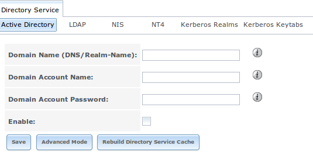
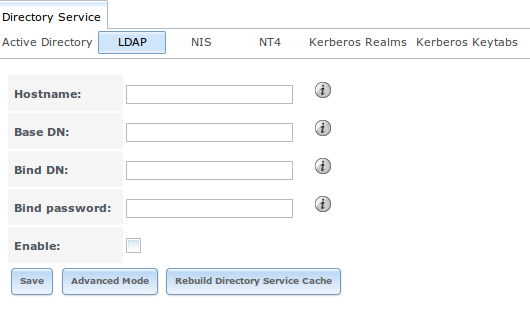
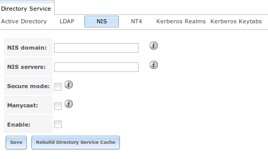
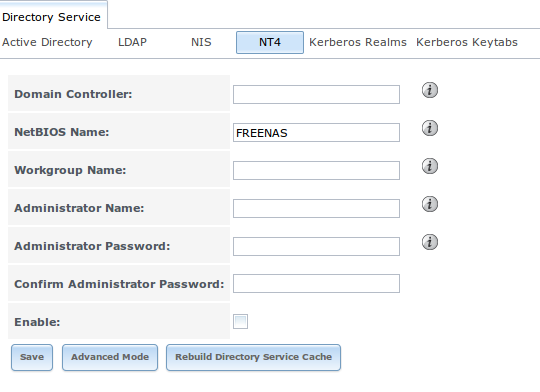
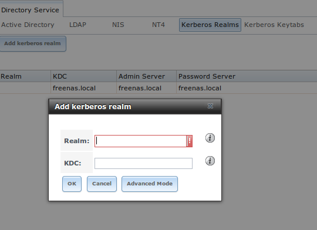

.. _Directory Service:

Directory Service
=================

FreeNAS® supports integration with the following directory services:

* :ref:`Active Directory` (for Windows 2000 and higher networks)

* :ref:`LDAP`

* :ref:`NIS`

* :ref:`NT4` (for Windows networks older than Windows 2000)

It also supports :ref:`Kerberos Realms` and :ref:`Kerberos Keytabs`.

This section summarizes each of these services and their available configurations within the FreeNAS® GUI.

.. _Active Directory:

Active Directory
----------------

Active Directory (AD) is a service for sharing resources in a Windows network. AD can be configured on a Windows server that is running Windows Server 2000 or
higher or on a Unix-like operating system that is running
`Samba version 4 <http://wiki.samba.org/index.php/Samba4/HOWTO#Step_4:_Provision_Samba4>`_. Since AD provides authentication and authorization services for
the users in a network, you do not have to recreate these user accounts on the FreeNAS® system. Instead, configure the Active Directory service so that it
can import the account information and imported users can be authorized to access the CIFS shares on the FreeNAS® system.

.. note:: if your network contains an NT4 domain controller, or any domain controller containing a version which is earlier than Windows 2000, configure
   :ref:`NT4` instead.

Many changes and improvements have been made to Active Directory support within FreeNAS®. If you are not running FreeNAS® 9.3-RELEASE, it is strongly
recommended that you upgrade before attempting Active Directory integration.

**Before configuring the Active Directory service**, ensure name resolution is properly configured by
:command:`ping` ing the domain name of the Active Directory domain controller from Shell on the FreeNAS® system. If the
:command:`ping` fails, check the DNS server and default gateway settings in
:menuselection:`Network --> Global Configuration` on the FreeNAS® system.

Next, add a DNS record for the FreeNAS® system on the Windows server and verify that you can :command:`ping` the hostname of the FreeNAS® system from the
domain controller.

Active Directory relies on Kerberos, which is a time sensitive protocol. This means that the time on both the FreeNAS® system and the Active Directory Domain
Controller can not be out of sync by more than a few minutes. The best way to ensure that the same time is running on both systems is to configure both
systems to:

* use the same NTP server (set in :menuselection:`System --> NTP Servers` on the FreeNAS® system)

* have the same timezone

* be set to either localtime or universal time at the BIOS level

Figure 9.1a shows the screen that appears when you click :menuselection:`Directory Service --> Active Directory`. Table 9.1a describes the configurable
options. Some settings are only available in Advanced Mode. To see these settings, either click the "Advanced Mode" button or configure the system to always
display these settings by checking the box "Show advanced fields by default" in :menuselection:`System --> Advanced`.

**Figure 9.1a: Configuring Active Directory**

|ad1.png|

**Table 9.1a: Active Directory Configuration Options**

+--------------------------+---------------+--------------------------------------------------------------------------------------------------------------------------------------------+
| **Setting**              | **Value**     | **Description**                                                                                                                            |
|                          |               |                                                                                                                                            |
+==========================+===============+============================================================================================================================================+
| Domain Name              | string        | name of Active Directory domain (e.g. *example.com*) or child domain (e.g.                                                                 |
|                          |               | *sales.example.com*); this setting is mandatory and the GUI will refuse to save the settings if the domain controller for the specified    |
|                          |               | domain can not be found                                                                                                                    |
|                          |               |                                                                                                                                            |
+--------------------------+---------------+--------------------------------------------------------------------------------------------------------------------------------------------+
| Domain Account Name      | string        | name of the Active Directory administrator account; this setting is mandatory and the GUI will refuse to save the settings if it can not   |
|                          |               | connect to the domain controller using this account name                                                                                   |
|                          |               |                                                                                                                                            |
+--------------------------+---------------+--------------------------------------------------------------------------------------------------------------------------------------------+
| Domain Account Password  | string        | password for the Active Directory administrator account; this setting is mandatory and the GUI will refuse to save the settings if it can  |
|                          |               | not connect to the domain controller using this password                                                                                   |
|                          |               |                                                                                                                                            |
+--------------------------+---------------+--------------------------------------------------------------------------------------------------------------------------------------------+
| NetBIOS Name             | string        | only available in "Advanced Mode"; automatically populated with the hostname of the system; **use caution when changing this setting**     |
|                          |               | as setting an                                                                                                                              |
|                          |               | `incorrect value can corrupt an AD installation <http://forums.freenas.org/threads/before-you-setup-ad-authentication-please-read.2447/>`_ |
|                          |               |                                                                                                                                            |
+--------------------------+---------------+--------------------------------------------------------------------------------------------------------------------------------------------+
| Use keytab               | checkbox      | only available in "Advanced Mode"; if selected, browse to the keytab with "Kerberos keytab"                                                |
|                          |               |                                                                                                                                            |
+--------------------------+---------------+--------------------------------------------------------------------------------------------------------------------------------------------+
| Kerberos keytab          | browse button | only available in "Advanced Mode"; browse to the location of the keytab created using the instructions in :ref:`Kerberos Keytabs`          |
|                          |               |                                                                                                                                            |
+--------------------------+---------------+--------------------------------------------------------------------------------------------------------------------------------------------+
| Verbose logging          | checkbox      | only available in "Advanced Mode"; if checked, logs attempts to join the domain to */var/log/messages*                                     |
|                          |               |                                                                                                                                            |
+--------------------------+---------------+--------------------------------------------------------------------------------------------------------------------------------------------+
| UNIX extensions          | checkbox      | only available in "Advanced Mode"; **only** check this box if the AD server has been explicitly configured to map                          |
|                          |               | permissions for UNIX users; checking this box provides persistent UIDs and GUIDs, otherwise, users/groups get                              |
|                          |               | mapped to the UID/GUID range configured in Samba                                                                                           |
|                          |               |                                                                                                                                            |
+--------------------------+---------------+--------------------------------------------------------------------------------------------------------------------------------------------+
| Allow Trusted Domains    | checkbox      | only available in "Advanced Mode"; should only be enabled if network has active                                                            |
|                          |               | `domain/forest trusts <http://technet.microsoft.com/en-us/library/cc757352%28WS.10%29.aspx>`_                                              |
|                          |               | and you need to manage files on multiple domains; use with caution as it will generate more winbindd traffic,                              |
|                          |               | slowing down the ability to filter through user/group information                                                                          |
|                          |               |                                                                                                                                            |
+--------------------------+---------------+--------------------------------------------------------------------------------------------------------------------------------------------+
| Use Default Domain       | checkbox      | only available in "Advanced Mode"; when unchecked, the domain name is prepended to the username; if                                        |
|                          |               | "Allow Trusted Domains" is checked and multiple domains use the same usernames, uncheck this box to prevent name                           |
|                          |               | collisions                                                                                                                                 |
|                          |               |                                                                                                                                            |
+--------------------------+---------------+--------------------------------------------------------------------------------------------------------------------------------------------+
| Site Name                | string        | only available in "Advanced Mode"; the relative distinguished name of the site object in Active Directory                                  |
|                          |               |                                                                                                                                            |
+--------------------------+---------------+--------------------------------------------------------------------------------------------------------------------------------------------+
| Domain Controller        | string        | only available in "Advanced Mode"; if the hostname of the domain controller to use is specified, make sure it is resolvable                |
|                          |               |                                                                                                                                            |
+--------------------------+---------------+--------------------------------------------------------------------------------------------------------------------------------------------+
| Global Catalog Server    | string        | only available in "Advanced Mode"; if the hostname of the global catalog server to use is specified, make sure it is resolvable            |
|                          |               |                                                                                                                                            |
+--------------------------+---------------+--------------------------------------------------------------------------------------------------------------------------------------------+
| Kerberos Realm           | drop-down     | only available in "Advanced Mode";  select the realm created using the instructions in :ref:`Kerberos Realms`                              |
|                          | menu          |                                                                                                                                            |
+--------------------------+---------------+--------------------------------------------------------------------------------------------------------------------------------------------+
| AD timeout               | integer       | only available in "Advanced Mode"; in seconds, increase if the AD service does not start after connecting to the                           |
|                          |               | domain                                                                                                                                     |
|                          |               |                                                                                                                                            |
+--------------------------+---------------+--------------------------------------------------------------------------------------------------------------------------------------------+
| DNS timeout              | integer       | only available in "Advanced Mode"; in seconds, increase if AD DNS queries timeout                                                          |
|                          |               |                                                                                                                                            |
+--------------------------+---------------+--------------------------------------------------------------------------------------------------------------------------------------------+
| Idmap backend            | drop-down     | only available in "Advanced Mode"; select the backend to use to map Windows security identifiers (SIDs) to UNIX UIDs and GIDs; see Table   |
|                          | menu and Edit | 9.1b for a summary of the available backends; click the "Edit" link to configure that backend's editable options                           |
|                          |               |                                                                                                                                            |
+--------------------------+---------------+--------------------------------------------------------------------------------------------------------------------------------------------+
| Windbind NSS Info        | drop-down     | only available in "Advanced Mode" and defines the schema to use when querying AD for user/group info; *rfc2307* uses the RFC2307 schema    |
|                          |               | support included in Windows 2003 R2, *sfu20* is for Services For Unix 3.0 or 3.5, and                                                      |
|                          |               | *sfu* is for Services For Unix 2.0                                                                                                         |
|                          | menu          |                                                                                                                                            |
|                          |               |                                                                                                                                            |
+--------------------------+---------------+--------------------------------------------------------------------------------------------------------------------------------------------+
| SASL wrapping            | drop-down     | only available in "Advanced Mode" and defines how LDAP traffic is transmitted; choices are *plain* (plain text),                           |
|                          | menu          | *sign* (signed only),                                                                                                                      |
|                          |               | or *seal* (signed and encrypted); Windows 2000 SP3 and higher can be configured to enforce signed LDAP connections                         |
|                          |               |                                                                                                                                            |
+--------------------------+---------------+--------------------------------------------------------------------------------------------------------------------------------------------+
| Enable                   | checkbox      | uncheck to disable the configuration without deleting it                                                                                   |
|                          |               |                                                                                                                                            |
+--------------------------+---------------+--------------------------------------------------------------------------------------------------------------------------------------------+

Table 9.1b summarizes the backends which are available in the "Idmap backend" drop-down menu. Each backend has its own
`man page <https://www.samba.org/samba/docs/man/manpages/>`_ which should be referred to for implementation details.

**Table 9.1b: Available ID Mapping Backends**

+----------------+------------------------------------------------------------------------------------------------------------------------------------------+
| **Value**      | **Description**                                                                                                                          |
|                |                                                                                                                                          |
+================+==========================================================================================================================================+
| ad             | AD server uses RFC2307 or Services For Unix schema extensions; mappings must be provided in advance by adding the uidNumber attributes   |
|                | for users and gidNumber attributes for groups in the AD                                                                                  |
|                |                                                                                                                                          |
+----------------+------------------------------------------------------------------------------------------------------------------------------------------+
| adex           | AD server uses RFC2307 schema extensions and supports domain trusts as well as two-way cross-forest trusts; mappings must be provided in |
|                | advance by adding the POSIX attribute information to the users and groups objects in AD using a tool such as "Identity Services for      |
|                | Unix" on Windows 2003 R2 and later                                                                                                       |
|                |                                                                                                                                          |
+----------------+------------------------------------------------------------------------------------------------------------------------------------------+
| autorid        | similar to "rid", but automatically configures the range to be used for each domain, so there is no need to specify a specific range for |
|                | each domain in the forest; the only needed configuration is the range of UID/GIDs to use for user/group mappings and an optional size    |
|                | for the ranges                                                                                                                           |
|                |                                                                                                                                          |
+----------------+------------------------------------------------------------------------------------------------------------------------------------------+
| hash           | uses a hashing algorithm for mapping and can be used to support local name mapping files                                                 |
|                |                                                                                                                                          |
+----------------+------------------------------------------------------------------------------------------------------------------------------------------+
| ldap           | stores and retrieves mapping tables in an LDAP directory service; default for "LDAP" directory service                                   |
|                |                                                                                                                                          |
+----------------+------------------------------------------------------------------------------------------------------------------------------------------+
| nss            | provides a simple means of ensuring that the SID for a Unix user is reported as the one assigned to the corresponding domain user        |
|                |                                                                                                                                          |
+----------------+------------------------------------------------------------------------------------------------------------------------------------------+
| rfc2307        | an AD server is required to provide the mapping between the name and SID and an LDAP server is required to provide the mapping between   |
|                | the name and the UID/GID                                                                                                                 |
|                |                                                                                                                                          |
+----------------+------------------------------------------------------------------------------------------------------------------------------------------+
| rid            | default for "AD" and "NT4" directory services; requires an explicit idmap configuration for each domain, using disjoint ranges where a   |
|                | writeable default idmap range should be defined, using a backend like "tdb" or "ldap"                                                    |
|                |                                                                                                                                          |
+----------------+------------------------------------------------------------------------------------------------------------------------------------------+
| tdb            | default backend used by winbindd for storing mapping tables                                                                              |
|                |                                                                                                                                          |
+----------------+------------------------------------------------------------------------------------------------------------------------------------------+
| tdb2           | substitute for "tdb" used by winbindd in clustered environments                                                                          |
|                |                                                                                                                                          |
+----------------+------------------------------------------------------------------------------------------------------------------------------------------+

Click the "Rebuild Directory Service Cache" button if you add a user to Active Directory who needs immediate access to FreeNAS®; otherwise this occurs
automatically once a day as a cron job.

.. note:: Active Directory places restrictions on which characters are allowed in Domain and NetBIOS names. If you are having problems connecting to the
   realm,
   `verify <http://support.microsoft.com/kb/909264>`_
   that your settings do not include any disallowed characters. Also, the Administrator Password cannot contain the *$* character. If a
   *$* exists in the domain administrator's password, kinit will report a "Password Incorrect" error and ldap_bind will report an "Invalid credentials
   (49)" error.

Once you have configured the Active Directory service, it may take a few minutes for the Active Directory information to be populated to the FreeNAS® system.
Once populated, the AD users and groups will be available in the drop-down menus of the "Permissions" screen of a volume/dataset. For performance reasons,
every available user may not show in the listing. However, it will autocomplete all applicable users if you start typing in a username.

You can verify which Active Directory users and groups have been imported to the FreeNAS® system by using these commands within the FreeNAS® Shell. To view
users::

 wbinfo -u

To view groups, use::

 wbinfo -g

In addition, :command:`wbinfo -t` will test the connection and, if successful, will give a message similar to::

 checking the trust secret for domain YOURDOMAIN via RPC calls succeeded

To manually check that a specified user can authenticate::

 net ads join -S dcname -U username

If no users or groups are listed in the output of those commands, these commands will provide more troubleshooting information::

 getent passwd

 getent group
 
If the :command:`wbinfo` commands display the network's users, but they do not show up in the drop-down menu of a Permissions screen, it may be because it is
taking longer then the default 10 seconds for the FreeNAS® system to join Active Directory. Try bumping up the value of "AD timeout" to 60 seconds.

.. _Troubleshooting Tips:

Troubleshooting Tips
~~~~~~~~~~~~~~~~~~~~

If you are running AD in a 2003/2008 mixed domain, see this
`forum post <http://forums.freenas.org/showthread.php?1931-2008R2-2003-mixed-domain>`_
for instructions on how to prevent the secure channel key from becoming corrupt.

Active Directory uses DNS to determine the location of the domain controllers and global catalog servers in the network. Use the
:command:`host -t srv _ldap._tcp.domainname.com` command to determine the network's SRV records and, if necessary, change the weight and/or priority of the
SRV record to reflect the fastest server. More information about SRV records can be found in the Technet article
`How DNS  <http://technet.microsoft.com/en-us/library/cc759550%28WS.10%29.aspx>`_
`Support for Active Directory Works <http://technet.microsoft.com/en-us/library/cc759550%28WS.10%29.aspx>`_.

The realm that is used depends upon the priority in the SRV DNS record, meaning that DNS can override your Active Directory settings. If you are unable to
connect to the correct realm, check the SRV records on the DNS server.
`This article <http://www.informit.com/guides/content.aspx?g=security&seqNum=37&rll=1>`_
describes how to configure KDC discovery over DNS and provides some examples of records with differing priorities.

If the cache becomes out of sync due to an AD server being taken off and back online, resync the cache using
:menuselection:`System --> Advanced --> Rebuild LDAP/AD Cache`.

An expired password for the administrator account will cause kinit to fail, so ensure that the password is still valid. Also, double-check that the password
on the AD account being used does not include any spaces or special symbols, and is not unusually long. 

Try creating a Computer entry on the Windows server's OU. When creating this entry, enter the FreeNAS® hostname in the "name" field. Make sure that it is
under 15 characters and that it is the same name as the one set in the "Hostname" field in :menuselection:`Network --> Global Configuration` and the
"NetBIOS Name" in :menuselection:`Directory Service --> Active Directory` settings. Make sure the hostname of the domain controller is set in the "Domain
Controller" field of :menuselection:`Directory Service --> Active Directory`.

.. _If the System Will not Join the Domain:

If the System Will not Join the Domain
~~~~~~~~~~~~~~~~~~~~~~~~~~~~~~~~~~~~~~

If the system will not join the active directory domain, try running the following commands in the order listed. If any of the commands fail or result in a
traceback, create a bug report at `bugs.freenas.org <http://bugs.freenas.org>`_ that includes the commands in the order which they were run and the exact
wording of the error message or traceback.

Start with these commands, where the :command:`echo` command should return a value of *0* and the :command:`klist` command should show a Kerberos ticket:
::
 sqlite3 /data/freenas-v1.db "update directoryservice_activedirectory set ad_enable=1;"
 echo $?
 service ix-kerberos start
 service ix-nsswitch start
 service ix-kinit start
 service ix-kinit status
 klist

Next, only run these two commands **if** the "Unix extensions" box is checked in "Advanced Mode"::

 service ix-sssd start
 service sssd start

Finally, run these commands. Again, the :command:`echo` command should return a *0*:
::
 python /usr/local/www/freenasUI/middleware/notifier.py start cifs
 service ix-activedirectory start
 service ix-activedirectory status
 echo $?
 python /usr/local/www/freenasUI/middleware/notifier.py restart cifs
 service ix-pam start
 service ix-cache start &

.. _LDAP:

LDAP
----

FreeNAS® includes an
`OpenLDAP <http://www.openldap.org/>`_
client for accessing information from an LDAP server. An LDAP server provides directory services for finding network resources such as users and their
associated permissions. Examples of LDAP servers include Microsoft Server (2000 and newer), Mac OS X Server, Novell eDirectory, and OpenLDAP running on a BSD
or Linux system. If an LDAP server is running on your network, you should configure the FreeNAS® LDAP service so that the network's users can authenticate to
the LDAP server and thus be provided authorized access to the data stored on the FreeNAS® system.

.. note:: LDAP authentication for CIFS shares will be disabled unless the LDAP directory has been configured for and populated with Samba attributes. The most
   popular script for performing this task is `smbldap-tools <http://download.gna.org/smbldap-tools/>`_ and instructions for using it can be found at
   `The Linux Samba-OpenLDAP Howto <http://download.gna.org/smbldap-tools/docs/samba-ldap-howto/#htoc29>`_.

Figure 9.2a shows the LDAP Configuration screen that is seen when you click :menuselection:`Directory Service --> LDAP`.

**Figure 9.2a: Configuring LDAP**

|ldap1.png|

Table 9.2a summarizes the available configuration options. Some settings are only available in Advanced Mode. To see these settings, either click the
"Advanced Mode" button or configure the system to always display these settings by checking the box "Show advanced fields by default" in
:menuselection:`System --> Advanced`.

If you are new to LDAP terminology, skim through the
`OpenLDAP Software 2.4 Administrator's Guide <http://www.openldap.org/doc/admin24/>`_.

**Table 9.2a: LDAP Configuration Options**

+-------------------------+----------------+----------------------------------------------------------------------------------------------------------------+
| **Setting**             | **Value**      | **Description**                                                                                                |
|                         |                |                                                                                                                |
+=========================+================+================================================================================================================+
| Hostname                | string         | hostname or IP address of LDAP server                                                                          |
|                         |                |                                                                                                                |
+-------------------------+----------------+----------------------------------------------------------------------------------------------------------------+
| Base DN                 | string         | top level of the LDAP directory tree to be used when searching for resources (e.g.                             |
|                         |                | *dc=test,dc=org*)                                                                                              |
|                         |                |                                                                                                                |
+-------------------------+----------------+----------------------------------------------------------------------------------------------------------------+
| Bind DN                 | string         | name of administrative account on LDAP server (e.g. *cn=Manager,dc=test,dc=org*)                               |
|                         |                |                                                                                                                |
+-------------------------+----------------+----------------------------------------------------------------------------------------------------------------+
| Bind password           | string         | password for "Root bind DN"                                                                                    |
|                         |                |                                                                                                                |
+-------------------------+----------------+----------------------------------------------------------------------------------------------------------------+
| Allow Anonymous         | checkbox       | only available in "Advanced Mode"; instructs LDAP server to not provide authentication and to allow            |
| Binding                 |                | read and write access to any client                                                                            |
|                         |                |                                                                                                                |
+-------------------------+----------------+----------------------------------------------------------------------------------------------------------------+
| User Suffix             | string         | only available in "Advanced Mode" and optional; can be added to name when user account added to LDAP           |
|                         |                | directory (e.g. dept. or company name)                                                                         |
|                         |                |                                                                                                                |
+-------------------------+----------------+----------------------------------------------------------------------------------------------------------------+
| Group Suffix            | string         | only available in "Advanced Mode" and optional; can be added to name when group added to LDAP                  |
|                         |                | directory (e.g. dept. or company name)                                                                         |
|                         |                |                                                                                                                |
+-------------------------+----------------+----------------------------------------------------------------------------------------------------------------+
| Password Suffix         | string         | only available in "Advanced Mode" and optional; can be added to password when password added to                |
|                         |                | LDAP directory                                                                                                 |
|                         |                |                                                                                                                |
+-------------------------+----------------+----------------------------------------------------------------------------------------------------------------+
| Machine Suffix          | string         | only available in "Advanced Mode" and optional; can be added to name when system added to LDAP                 |
|                         |                | directory (e.g. server, accounting)                                                                            |
|                         |                |                                                                                                                |
+-------------------------+----------------+----------------------------------------------------------------------------------------------------------------+
| SUDO Suffix             | string         | only available in "Advanced Mode"; use if LDAP-based users need superuser access                               |
|                         |                |                                                                                                                |
+-------------------------+----------------+----------------------------------------------------------------------------------------------------------------+
| Kerberos Realm          | drop-down menu | only available in "Advanced Mode";  select the realm created using the instructions in :ref:`Kerberos Realms`  |
|                         |                |                                                                                                                |
+-------------------------+----------------+----------------------------------------------------------------------------------------------------------------+
| Kerberos Keytab         | drop-down menu | only available in "Advanced Mode";  browse to the location of the keytab created using the instructions in     |
|                         |                | :ref:`Kerberos Keytabs`                                                                                        |
|                         |                |                                                                                                                |
+-------------------------+----------------+----------------------------------------------------------------------------------------------------------------+
| Encryption Mode         | drop-down menu | only available in "Advanced Mode"; choices are *Off*,                                                          |
|                         |                | *SSL*, or                                                                                                      |
|                         |                | *TLS*                                                                                                          |
|                         |                |                                                                                                                |
+-------------------------+----------------+----------------------------------------------------------------------------------------------------------------+
| Certificate             | browse button  | only available in "Advanced Mode"; browse to the location of the certificate of the LDAP server if             |
|                         |                | SSL connections are used                                                                                       |
|                         |                |                                                                                                                |
+-------------------------+----------------+----------------------------------------------------------------------------------------------------------------+
| Idmap backend           | drop-down menu | only available in "Advanced Mode";  select the backend to use to map Windows security identifiers (SIDs) to    |
|                         | and Edit       | UNIX UIDs and GIDs; see Table 9.1b for a summary of the available backends; click the "Edit" link to configure |
|                         |                | that backend's editable options                                                                                |
|                         |                |                                                                                                                |
+-------------------------+----------------+----------------------------------------------------------------------------------------------------------------+
| Samba Schema            | checkbox       | only available in "Advanced Mode"; only check this box if you need LDAP authentication for CIFS shares **and** |
|                         |                | you have **already** configured the LDAP server with Samba attributes                                          |
|                         |                |                                                                                                                |
+-------------------------+----------------+----------------------------------------------------------------------------------------------------------------+
| Auxiliary Parameters    | string         | additional options for `sssd.conf(5) <https://jhrozek.fedorapeople.org/sssd/1.11.6/man/sssd.conf.5.html>`_     |
|                         |                |                                                                                                                |
+-------------------------+----------------+----------------------------------------------------------------------------------------------------------------+
| Enable                  | checkbox       | uncheck to disable the configuration without deleting it                                                       |
|                         |                |                                                                                                                |
+-------------------------+----------------+----------------------------------------------------------------------------------------------------------------+

Click the "Rebuild Directory Service Cache" button if you add a user to LDAP who needs immediate access to FreeNAS®; otherwise this occurs automatically once
a day as a cron job.

.. note:: FreeNAS® automatically appends the root DN. This means that you should not include the scope and root DN when configuring the user, group,
   password, and machine suffixes.

After configuring the LDAP service, the LDAP users and groups should appear in the drop-down menus of the "Permissions" screen of a volume/dataset. To verify
that the users have been imported, type :command:`getent passwd` from Shell. To verify that the groups have been imported, type :command:`getent group`.

If the users and groups are not listed, refer to the
`Common errors encountered when using OpenLDAP Software <http://www.openldap.org/doc/admin24/appendix-common-errors.html>`_
for common errors and how to fix them. When troubleshooting LDAP, open Shell and look for error messages in :file:`/var/log/auth.log`.

.. _NIS:

NIS
---

Network Information Service (NIS) is a service which maintains and distributes a central directory of Unix user and group information, hostnames, email
aliases and other text-based tables of information. If a NIS server is running on your network, the FreeNAS® system can be configured to import the users
and groups from the NIS directory.

Figure 9.3a shows the configuration screen which opens when you click :menuselection:`Directory Service --> NIS`. Table 9.3a summarizes the configuration
options.

**Figure 9.3a: NIS Configuration**

|nis1.png|

**Table 9.3a: NIS Configuration Options**

+-------------+-----------+----------------------------------------------------------------------------------------------------------------------------+
| **Setting** | **Value** | **Description**                                                                                                            |
|             |           |                                                                                                                            |
|             |           |                                                                                                                            |
+=============+===========+============================================================================================================================+
| NIS domain  | string    | name of NIS domain                                                                                                         |
|             |           |                                                                                                                            |
+-------------+-----------+----------------------------------------------------------------------------------------------------------------------------+
| NIS servers | string    | comma delimited list of hostnames or IP addresses                                                                          |
|             |           |                                                                                                                            |
+-------------+-----------+----------------------------------------------------------------------------------------------------------------------------+
| Secure mode | checkbox  | if checked,                                                                                                                |
|             |           | `ypbind(8) <http://www.freebsd.org/cgi/man.cgi?query=ypbind>`_                                                             |
|             |           | will refuse to bind to any NIS server that is not running as root on a TCP port number over 1024                           |
|             |           |                                                                                                                            |
+-------------+-----------+----------------------------------------------------------------------------------------------------------------------------+
| Manycast    | checkbox  | if checked, ypbind will bind to the server that responds the fastest; this is useful when no local NIS server is available |
|             |           | on the same subnet                                                                                                         |
|             |           |                                                                                                                            |
+-------------+-----------+----------------------------------------------------------------------------------------------------------------------------+
| Enable      | checkbox  | uncheck to disable the configuration without deleting it                                                                   |
|             |           |                                                                                                                            |
+-------------+-----------+----------------------------------------------------------------------------------------------------------------------------+

Click the "Rebuild Directory Service Cache" button if you add a user to NIS who needs immediate access to FreeNAS®; otherwise this occurs automatically once
a day as a cron job.

.. _NT4:

NT4
---

This service should only be configured if the Windows network's domain controller is running NT4. If the network's domain controller is running a more recent
version of Windows, you should configure :ref:`Active Directory` instead.

Figure 9.4a shows the configuration screen that appears when you click :menuselection:`Directory Service --> NT4`. These options are summarized in Table 9.4a.
Some settings are only available in Advanced Mode. To see these settings, either click the "Advanced Mode" button or configure the system to always display
these settings by checking the box "Show advanced fields by default" in :menuselection:`System --> Advanced`.

**Figure 9.4a: NT4 Configuration Options**

|nt1.png|

**Table 9.4a: NT4 Configuration Options**

+------------------------+-----------+--------------------------------------------------------------------------------------------------+
| **Setting**            | **Value** | **Description**                                                                                  |
|                        |           |                                                                                                  |
|                        |           |                                                                                                  |
+========================+===========+==================================================================================================+
| Domain Controller      | string    | hostname of domain controller                                                                    |
|                        |           |                                                                                                  |
+------------------------+-----------+--------------------------------------------------------------------------------------------------+
| NetBIOS Name           | string    | hostname of FreeNAS system                                                                       |
|                        |           |                                                                                                  |
+------------------------+-----------+--------------------------------------------------------------------------------------------------+
| Workgroup Name         | string    | name of Windows server's workgroup                                                               |
|                        |           |                                                                                                  |
+------------------------+-----------+--------------------------------------------------------------------------------------------------+
| Administrator Name     | string    | name of the domain administrator account                                                         |
|                        |           |                                                                                                  |
+------------------------+-----------+--------------------------------------------------------------------------------------------------+
| Administrator Password | string    | input and confirm the password for the domain administrator account                              |
|                        |           |                                                                                                  |
+------------------------+-----------+--------------------------------------------------------------------------------------------------+
| Use default domain     | checkbox  | only available in "Advanced Mode"; when unchecked, the domain name is prepended to the username  |
|                        |           |                                                                                                  |
+------------------------+-----------+--------------------------------------------------------------------------------------------------+
| Idmap backend          | drop-down | only available in "Advanced Mode"; select the backend to use to map Windows security identifiers |
|                        | and Edit  | (SIDs) to UNIX UIDs and GIDs; see Table 9.1b for a summary of the available backends; click the  |
|                        | menu      | "Edit" link to configure that backend's editable options                                         |
|                        |           |                                                                                                  |
+------------------------+-----------+--------------------------------------------------------------------------------------------------+
| Enable                 | checkbox  | uncheck to disable the configuration without deleting it                                         |
|                        |           |                                                                                                  |
+------------------------+-----------+--------------------------------------------------------------------------------------------------+

Click the "Rebuild Directory Service Cache" button if you add a user to Active Directory who needs immediate access to FreeNAS®; otherwise this occurs
automatically once a day as a cron job.

.. _Kerberos Realms:

Kerberos Realms
---------------

Beginning with FreeNAS® 9.3, a default Kerberos realm is created for the local system.  :menuselection:`Directory Service --> Kerberos Realms` can be used to
view and add Kerberos realms.  If the network contains a KDC, click the "Add kerberose realm" button to add the Kerberos realm. This configuration screen is
shown in Figure 9.5a.

**Figure 9.5a: Viewing Kerberos Realms**

|realm1.png|

Table 9.5a summarizes the configurable options. Some settings are only available in Advanced Mode. To see these settings, either click the "Advanced Mode"
button or configure the system to always display these settings by checking the box "Show advanced fields by default" in :menuselection:`System --> Advanced`.

**Table 9.5a: Kerberos Realm Options**

+------------------------+-----------+------------------------------------------------------------------------------------------------------------------+
| **Setting**            | **Value** | **Description**                                                                                                  |
|                        |           |                                                                                                                  |
+========================+===========+==================================================================================================================+
| Realm                  | string    | mandatory; name of the realm                                                                                     |
|                        |           |                                                                                                                  |
+------------------------+-----------+------------------------------------------------------------------------------------------------------------------+
| KDC                    | string    | name of the Key Distribution Center                                                                              |
|                        |           |                                                                                                                  |
+------------------------+-----------+------------------------------------------------------------------------------------------------------------------+
| Admin Server           | string    | only available in "Advanced Mode"; server where all changes to the database are performed                        |
|                        |           |                                                                                                                  |
+------------------------+-----------+------------------------------------------------------------------------------------------------------------------+
| Password Server        | string    | only available in "Advanced Mode"; server where all password changes are performed                               |
|                        |           |                                                                                                                  |
+------------------------+-----------+------------------------------------------------------------------------------------------------------------------+

.. _Kerberos Keytabs:

Kerberos Keytabs
----------------

Kerberos keytabs are used to do Active Directory or LDAP joins without a password. This means that the password for the Active Directory or LDAP administrator
account does not need to be saved into the FreeNAS® configuration database, which is a security risk in some environments.

When using a keytab, it is recommended to create and use a less privileged account for performing the required queries as the password for that account will
be stored in the FreeNAS® configuration database.  To create the keytab on a Windows system, use these commands::

 ktpass.exe -out hostname.keytab host/ hostname@DOMAINNAME -ptype KRB5_NT_PRINCIPAL -mapuser DOMAIN\username -pass userpass

 setspn -A host/ hostname@DOMAINNAME DOMAIN\username

where:

* **hostname** is the fully qualified hostname of the domain controller

* **DOMAINNAME** is the domain name in all caps

* **DOMAIN** is the pre-Windows 2000 short name for the domain

* **username** is the privileged account name

* **userpass** is the password associated with username

This will create a keytab with sufficient privileges to grant tickets.

Once the keytab is generated, use :menuselection:`Directory Service --> Kerberos Keytabs --> Add kerberos keytab` to add it to the FreeNAS® system. 

Then, to instruct the Active Directory service to use the keytab, check the "Use keytab" box and select the installed keytab using the drop-down "Kerberos
keytab" menu in :menuselection:`Directory Service --> Active Directory`. When using a keytab with Active Directory, make sure that the "username" and
"userpass" in the keytab matches the "Domain Account Name" and "Domain Account Password" fields in :menuselection:`Directory Service --> Active Directory`.

To instruct LDAP to use the keytab, select the installed keytab using the drop-down "Kerberos keytab" menu in :menuselection:`Directory Service --> LDAP`.
