.. _Installing and Upgrading FreeNAS®:

Installing and Upgrading FreeNAS®
==================================

Before installing, it is important to remember that the FreeNAS® operating system must be installed on a separate device from the drive(s) that will hold the
storage data. In other words, if you only have one disk drive you will be able to use the FreeNAS® graphical interface but won't be able to store any data,
which after all, is the whole point of a NAS system. If you are a home user who is experimenting with FreeNAS®, you can install FreeNAS® on an inexpensive
USB thumb drive and use the computer's disk(s) for storage.

This section describes the following:

* :ref:`Getting FreeNAS®`

* :ref:`Preparing the Media`

* :ref:`Performing the Installation`

* :ref:`Installation Troubleshooting`

* :ref:`Upgrading`

* :ref:`Virtualization`

.. index:: Getting Freenas, Download
.. _Getting FreeNAS®:

Getting FreeNAS®
-----------------

FreeNAS® 9.3 can be downloaded from
`http://download.freenas.org/ <http://download.freenas.org/>`_.

.. note:: FreeNAS® will only install to 64-bit hardware and the installer will not work on 32-bit hardware.

The download page contains the following types of files:

* **.iso:** this is a bootable installer that can be written to either a CD or USB flash as described in :ref:`Preparing the Media`.

* **.GUI_Upgrade.txz:** this is a compressed firmware upgrade image. If your intent is to upgrade FreeNAS®, download this file and see the section on
  :ref:`Upgrading`.

.. index:: Checksum

Each file has an associated :file:`sha256.txt` file which should be used to verify the integrity of the downloaded file. The command you use to verify the
checksum varies by operating system:

* on a BSD system use the command :command:`sha256 name_of_file`

* on a Linux system use the command :command:`sha256sum name_of_file`

* on a Mac system use the command :command:`shasum -a 256 name_of_file`

* on a Windows or Mac system, you can also install a utility such as
  `HashCalc <http://www.slavasoft.com/hashcalc/>`_
  or
  `HashTab <http://implbits.com/HashTab.aspx>`_

The value produced by running the command should match the value of the :file:`sha256.txt` file.

.. index:: Burn ISO, ISO, USB Stick
.. _Preparing the Media:

Preparing the Media
-------------------

Beginning with version 9.3, FreeNAS® must be installed using a menu-driven installer, as the ZFS boot partition is created during the installation. To
perform an installation, download the :file:`.iso` file and write it to either a CD or a USB stick.

To burn the :file:`.iso` file to CD, use a CD burning utility.

The command which is used to burn the :file:`.iso` file to a compact flash card or USB thumbdrive depends upon the operating system. This section demonstrates
utilities for several operating systems.

.. note:: if you will be burning the installation file to a USB stick, you will need **two** USB slots, each with an inserted USB device, where one USB stick
          contains the installer and the other USB stick is selected to install into. When performing the installation, be sure to select the correct USB
          device to install to. In other words, you can **not** install FreeNAS® into the same USB stick that you boot the installer from. After
          installation, remove the USB stick containing the installer, and if necessary, configure the BIOS to boot from the remaining USB stick.

Once you have written the :file:`.iso` file to the installation media, make sure the boot order in the BIOS is set to boot from that device and boot the
system to start the installation.

.. _On FreeBSD or Linux:

On FreeBSD or Linux
~~~~~~~~~~~~~~~~~~~

On a FreeBSD or Linux system, the :command:`dd` command can be used to write the :file:`.iso` file to an inserted USB thumb drive or compact flash device.
Example 2.2a demonstrates writing the image to the first USB device (*/dev/da0*) on a FreeBSD system. Substitute the filename of your :file:`.iso` file and
the device name representing the device to write to on your system.

.. warning:: The :command:`dd` command is very powerful and can destroy any existing data on the specified device. Be 
   **very sure** that you know the device name to write to and that you do not typo the device name when using :command:`dd`! If you are uncomfortable using
   this command, write the :file:`.iso` file to a CD instead.

**Example 2.2a: Writing the .iso file to a USB Thumb Drive**

::

 dd if=FreeNAS-9.3-RELEASE-x64.iso of=/dev/da0 bs=64k
 6117+0 records in
 6117+0 records out
 400883712 bytes transferred in 88.706398 secs (4519220 bytes/sec)

When using the :command:`dd` command:

* **if=** refers to the input file, or the name of the file to write to the device.

* **of=** refers to the output file; in our case, the device name of the flash card or removable USB drive. You may have to increment the number in the name
  if it is not the first USB device. On Linux, use */dev/sdX,* where *X* refers to the letter of the USB device.

* **bs=** refers to the block size

.. _On OS X:

On OS X
~~~~~~~

Insert the USB thumb drive and go to :menuselection:`Launchpad --> Utilities --> Disk Utility`. Unmount any mounted partitions on the USB thumb drive. Check
that the USB thumb drive has only one partition, otherwise you will get partition table errors on boot. If needed, use Disk Utility to setup one partition on
the USB drive; selecting "free space" when creating the partition works fine.

Next, determine the device name of the inserted USB thumb drive. From TERMINAL, navigate to your Desktop then type this command::

 diskutil list
 /dev/disk0

 #:	TYPE NAME		SIZE		IDENTIFIER
 0:	GUID_partition_scheme	*500.1 GB	disk0
 1:	EFI			209.7 MB	disk0s1
 2:	Apple_HFS Macintosh HD	499.2 GB	disk0s2
 3:	Apple_Boot Recovery HD	650.0 MB	disk0s3

 /dev/disk1
 #:	TYPE NAME		SIZE		IDENTIFIER
 0:	FDisk_partition_scheme	*8.0 GB		disk1
 1:	DOS_FAT_32 UNTITLED	8.0 GB		disk1s1

This will show you which devices are available to the system. Locate your USB stick and record the path. If you are not sure which path is the correct one for
the USB stick, remove the device, run the command again, and compare the difference. Once you are sure of the device name, navigate to the Desktop from
TERMINAL, unmount the USB stick, and use the :command:`dd` command to write the image to the USB stick. In Example 2.2b, the USB thumb drive is */dev/disk1*.
Substitute the name of your uncompressed file and the correct path to your USB thumb drive.

**Example 2.2b: Using dd on an OS X System**
::

 diskutil unmountDisk /dev/disk1
 Unmount of all volumes on disk1 was successful

 dd if=FreeNAS-9.3-RELEASE-x64.iso of=/dev/disk1 bs=64k

.. note:: if you get the error "Resource busy" when you run the :command:`dd` command, go to :menuselection:`Applications --> Utilities --> Disk Utility`,
   find your USB thumb drive, and click on its partitions to make sure all of them are unmounted. If you get the error "dd: /dev/disk1: Permission denied",
   run the :command:`dd` command by typing :command:`sudo dd if=FreeNAS-9.3-RELEASE-x64.iso of=/dev/disk1 bs=64k`, which will prompt for your password.

The :command:`dd` command will take some minutes to complete. Wait until you get a prompt back and a message that displays how long it took to write the image
to the USB drive.

.. _On Windows:

On Windows
~~~~~~~~~~

Windows users will need to download a utility that can create a USB bootable image from the :file:`.iso` file.

This section will demonstrate how to use
`Win32DiskImager <https://launchpad.net/win32-image-writer>`_
to burn the :file:`.iso` file. When downloading Win32DiskImager, download the latest version that ends in :file:`-binary.zip` and use 7-Zip to unzip its
executable.

Once installed, launch Win32DiskImager and use its "browse" button to browse to the location of the :file:`.iso` file. Insert a USB thumb drive and select its
drive letter from the "Device" drop-down menu. Click the "Write" button and the image will be written to the USB thumb drive.

.. index:: Install
.. _Performing the Installation:

Performing the Installation
---------------------------

With the installation media inserted, boot the system. This should load the FreeNAS® installation's GRUB menu shown in Figure 2.3a.

**Figure 2.3a: FreeNAS® Grub Menu**

|install1.png|

.. |install1.png| image:: images/install1.png
    :width: 6.04in
    :height: 3.4in

.. note:: if the installer does not boot, check that the installation device is listed first in the boot order in the BIOS. When booting from a CD, some
   motherboards may require you to connect the CD device to SATA0 (the first connector) in order to boot from CD. If the installer stalls during bootup,
   double-check the SHA256 hash of the :file:`.iso` file. If the hash does not match, re-download the file. If the hash is correct, try burning the CD again
   at a lower speed or try writing the file to a different USB stick.

Either wait for the menu to timeout or press :kbd:`Enter` to boot into the installer. Once the media has finished booting, you will be presented with the
console setup menu seen in Figure 2.3b.

**Figure 2.3b: FreeNAS® Console Setup**

|install2.png|

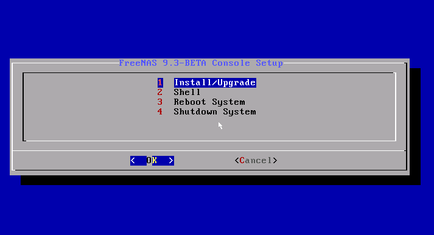

Press :kbd:`Enter` to select the default option of "1 Install/Upgrade". The next menu, seen in Figure 2.3c, will list all available drives, including any
inserted USB thumb drives which will begin with *da*. In this example, the user is performing a test installation using VirtualBox and has created a 8 GB
virtual disk to hold the operating system.

**Figure 2.3c: Selecting Which Drive to Install Into**

|install3.png|

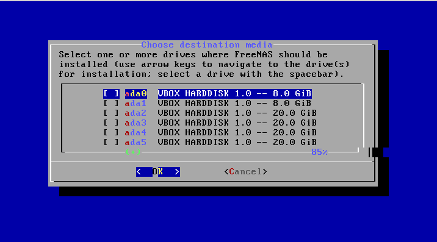

Use your arrow keys to highlight the USB, compact flash device, or virtual disk to install into and press the :kbd:`spacebar` to select it. If you wish to
mirror the boot device, arrow to the second device and press :kbd:`spacebar` to select it as well. After making your selections, press :kbd:`Enter`.
FreeNAS® will issue the warning seen in Figure 2.3d, reminding you to not install the operating system onto a drive that is meant for storage. Press
:kbd:`Enter` to advance to the screen shown in Figure 2.3f.

**Figure 2.3d: FreeNAS® Installation Warning**

|cdrom3.png|

.. |cdrom3.png| image:: images/cdrom3.png
    :width: 6.0in
    :height: 2.5in

.. note:: at this time, the installer does not check the size of the install media before attempting an installation. A minimum of a 4 GB device is required,
   but the install will appear to complete successfully on smaller devices, only to fail at boot. If a 4 GB USB drive fails to boot, try using a 8 GB USB
   drive instead.

The installer will recognize if a previous version of FreeNAS® 8.x or 9.x is already installed, and if so, will display the menu shown in Figure 2.3e. If the
installer recognizes that a previous version of FreeNAS® is installed and you wish to overwrite the existing installation, arrow over to "Fresh Install" and
press :kbd:`Enter` twice to advance to the screen shown in Figure 2.3f.

**Figure 2.3e: Performing a Fresh Install**

|upgrade1.png|

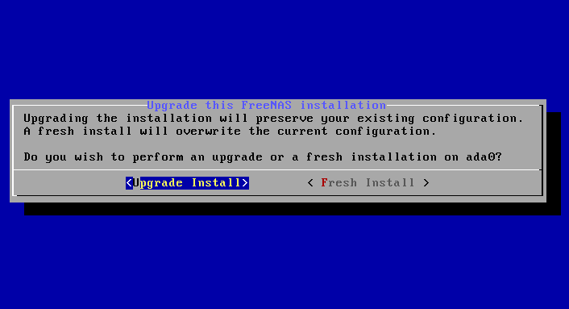

The next screen, shown in Figure 2.3f, prompts for the *root* password which is used to log into the administrative graphical interface.

**Figure 2.3f: Set the Root Password**

|install4.png|

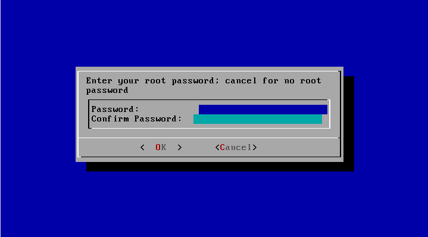

Setting a password is mandatory and the password can not be blank. Since this password provides access to the administrative GUI, it should be a hard-to-guess
password. Input the password, press the down arrow key, and confirm the password. Then press :kbd:`Enter` to start the installation.

.. note:: for security reasons, the SSH service and *root* SSH logins are disabled by default. Unless these are set, the only way to access a shell as
   *root* is to gain physical access to the console menu or to access the web shell within the administrative GUI. This means that the FreeNAS® system should
   be kept physically secure and that the administrative GUI should be behind a properly configured firewall and protected by a secure password.

Once the installation is complete, you should see a message similar to Figure 2.3g.

**Figure 2.3g: FreeNAS® Installation Complete**

|cdrom4.png|

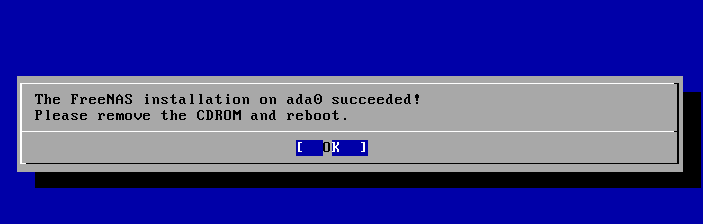

Press :kbd:`Enter` to return to the first menu, seen in Figure 2.3a. Highlight "3 Reboot System" and press :kbd:`Enter`. If booting from CD, remove the CDROM.
As the system reboots, make sure that the device you installed to is listed as the first boot entry in the BIOS so that the system will boot from it.
FreeNAS® should boot into the "Console Setup" menu described in :ref:`Initial Configuration Wizard`.

.. _Installation Troubleshooting:

Installation Troubleshooting
----------------------------

If the system does not boot into FreeNAS®, there are several things that you can check to resolve the situation.

First, check the system BIOS and see if there is an option to change the USB emulation from CD/DVD/floppy to hard drive. If it still will not boot, check to
see if the card/drive is UDMA compliant.

If the system BIOS does not support EFI with BIOS emulation, see if it has an option to boot using legacy BIOS mode.

Some users have found that some brands of 4 GB USB sticks do not work as they are not really 4 GB in size, but changing to a 8 GB stick fixes the problem.

If you are writing the image to a compact flash card, make sure that it is MSDOS formatted.

If the system starts to boot but hangs with this repeated error message::

 run_interrupt_driven_hooks: still waiting after 60 seconds for xpt_config

go into the system BIOS and see if there is an onboard device configuration for a 1394 Controller. If so, disable the device and try booting again.

If the system starts to boot but hangs at a *mountroot>* prompt, follow the instructions in
`Workaround/Semi-Fix for Mountroot Issues with 9.3 <https://forums.freenas.org/index.php?threads/workaround-semi-fix-for-mountroot-issues-with-9-3.26071/>`_.

If the burned image fails to boot and the image was burned using a Windows system, wipe the USB stick before trying a second burn using a utility such as
`Active@ KillDisk <http://how-to-erase-hard-drive.com/>`_. Otherwise, the second burn attempt will fail as Windows does not understand the partition which was
written from the image file. Be very careful that you specify the USB stick when using a wipe utility!

.. index:: Upgrade
.. _Upgrading:

Upgrading
---------

Beginning with version 9.3, FreeNAS® provides more flexibility for keeping the operating system up-to-date:

#. Upgrades to major releases, for example from version 9.3 to 10.0, can still be performed using either an ISO or the graphical administrative interface.
   Unless the Release Notes for the new major release indicate that your current version requires an ISO upgrade, you can use either upgrade method.

#. Minor releases have been replaced with signed updates. This means that, for example, there will not be a 9.3.1 or 9.3.2 minor release. It also means that
   you do not have to wait for a minor release to update the system with a system update or newer versions of drivers and features and that you no longer have
   to manually download an upgrade file and its associated checksum in order to do so.

#. The updater automatically creates a boot environment, meaning that updates are a low-risk operation. Boot environments provide the option to return to the
   previous version of the operating system by rebooting the system and selecting the previous boot environment from the boot menu.

This section describes how to perform an upgrade to the next major release as well as how to update a 9.3 system with newer features between major releases.

.. _Caveats:

Caveats:
~~~~~~~~

Be aware of the following caveats **before** attempting an upgrade:

* **Upgrades from FreeNAS® 0.7x are not supported.** The system has no way to import configuration settings from 0.7x versions of FreeNAS®, meaning that you
  will have to manually recreate your configuration, and if supported, import the FreeNAS® 0.7x volumes or disks.

* **Upgrades on 32-bit hardware to FreeNAS® 9.3 or higher are not supported.** However, if the system is currently running a 32-bit version of FreeNAS®
  **and** the hardware supports 64-bit, the system can be upgraded but any archived reporting graphs will be lost during the upgrade.

* **UFS is no longer supported.** If your data currently resides on
  **one** UFS-formatted disk, you will need to create a ZFS volume using
  **other** disk(s) after the upgrade, then use the instructions in :ref:`Import Disk` to mount the UFS-formatted disk in order to copy the data to the ZFS
  volume. If you only have one disk, backup its data to another system or media before the upgrade, format the disk as ZFS after the upgrade, then restore the
  backup. If your data currently resides on a UFS RAID of disks, you will not be able to import that UFS volume. Instead, you will need to backup that data
  before the upgrade, create a ZFS volume after the upgrade, then restore the data from backup.

* The initial configuration wizard will not recognize an encrypted ZFS pool. If your ZFS pool is GELI-encrypted and the :ref:`Initial Configuration Wizard`
  starts after the upgrade, cancel the wizard and use the instructions in :ref:`Importing an Encrypted Pool` to import the encrypted volume. You can then
  rerun the wizard afterwards, if you wish to use it for post-configuration, and it will recognize that the volume has been imported and will not prompt to
  reformat the disks.

* **DO NOT upgrade the ZFS pool unless you are absolutely sure that you will never want to go back to the previous version.** For this reason, the update
  process will not automatically upgrade the ZFS pool, though the :ref:`Alert` system will tell you if newer feature flags are available for the pool. Unless
  you need a new feature flag, it is safe to leave the ZFS pool at its current version and uncheck the alert. If you do decide to upgrade the pool, you will
  not be able to boot into a previous version that does not support the newer feature flags.

* The mps driver for 6G LSI SAS HBAs is version 16, which requires phase 16 firmware on the controller. It is recommended to upgrade the firmware before
  installing FreeNAS® or immediately after upgrading FreeNAS®, using the instructions in :ref:`Alert`. Running older firmware can cause many woes, including
  the failure to probe all of the attached disks, which can lead to degraded or unavailable arrays. While you can mismatch your firmware version with a higher
  version and things will "probably still work", there are no guarantees as that driver and firmware combination is untested.

.. _Initial Preparation:

Initial Preparation
~~~~~~~~~~~~~~~~~~~

Before upgrading the operating system or applying a system update, perform the following steps:

#.  **Backup the FreeNAS® configuration** in :menuselection:`System --> General --> Save Config`.

#.  If any volumes are encrypted, **make sure** that you have set the passphrase and have a copy of the encryption key and the latest recovery key. Once the
    upgrade is complete, use the instructions in :ref:`Importing an Encrypted Pool` to import the encrypted volume.

#.  Warn users that the FreeNAS® shares will be unavailable during the upgrade; you should schedule the upgrade for a time that will least impact users.

#.  Stop all services in :menuselection:`Services --> Control Services`.

.. _Upgrading Using the ISO:

Upgrading Using the ISO
~~~~~~~~~~~~~~~~~~~~~~~

To perform an upgrade using this method, `download <http://www.freenas.org/download-releases.html>`_ the :file:`.iso` for the new release to the computer that
will be used to prepare the installation media. Burn the downloaded :file:`.iso` file to a CD or USB thumb drive using the instructions in
:ref:`Preparing the Media`.

Insert the prepared media into the system and boot from it. Once the media has finished booting into the installation menu, press :kbd:`Enter` to select the
default option of "1 Install/Upgrade." The installer will present a screen showing all available drives; select the device FreeNAS® is installed into and
press :kbd:`Enter`.

The installer will recognize that an earlier version of FreeNAS® is installed on the device and will present the message shown in Figure 2.5a.

**Figure 2.5a: Upgrading a FreeNAS® Installation**

|upgrade1.png|

.. note:: if you select to perform a "Fresh Install", you will have to restore the backup of your configuration using
   :menuselection:`System --> General --> Upload Config` after you boot into the new operating system.

To perform an upgrade, press :kbd:`Enter` to accept the default of "Upgrade Install". Again, the installer will remind you that the operating system should be
installed on a disk that is not used for storage. Press :kbd:`Enter` to start the upgrade. Once the installer has finished unpacking the new image, you will
see the menu shown in Figure 2.5b. The database file that is preserved and migrated contains your FreeNAS® configuration settings.

**Figure 2.5b: FreeNAS® will Preserve and Migrate Settings**

|upgrade2.png|

.. |upgrade2.png| image:: images/upgrade2.png
    :width: 6.9252in
    :height: 3.8134in

Press :kbd:`Enter` and FreeNAS® will indicate that the upgrade is complete and that you should reboot. Press "OK", highlight "3 Reboot System", and press
:kbd:`Enter` to reboot the system. If booting from CD, remove the CDROM.

During the reboot there may be a conversion of the previous configuration database to the new version of the database. This happens during the "Applying
database schema changes" line in the reboot cycle. This conversion can take a long time to finish so be patient and the boot should complete normally. If
for some reason you end up with database errors but the graphical administrative interface is accessible, go to :menuselection:`Settings --> General` and use
the "Upload Config" button to upload the configuration that you saved before you started the upgrade.

.. _Upgrading From the GUI:

Upgrading From the GUI
~~~~~~~~~~~~~~~~~~~~~~

To perform an upgrade using this method, `download <http://www.freenas.org/download-releases.html>`_ the :file:`.txz` file for the new release and its
associated SHA256 hash to the computer that you use to access the FreeNAS® system. Then, go to :menuselection:`System --> Update`. Click the "Manual Update"
button to open the screen shown in Figure 2.5c.

**Figure 2.5c: Upgrading FreeNAS® From the GUI**

|upgrade3.png|

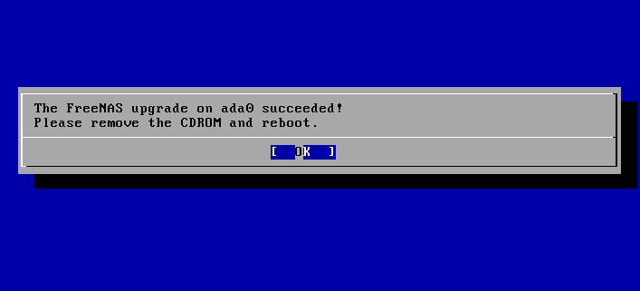

Use the drop-down menu to select an existing volume to temporarily place the firmware file during the upgrade. Alternately, select "Memory device" to allow
the system to create a temporary RAM disk to be used during the upgrade. After making your selection, click the "OK" button to see the screen shown in Figure
2.5d.

**Figure 2.5d: Step 2 of 2**

|upgrade4.png|

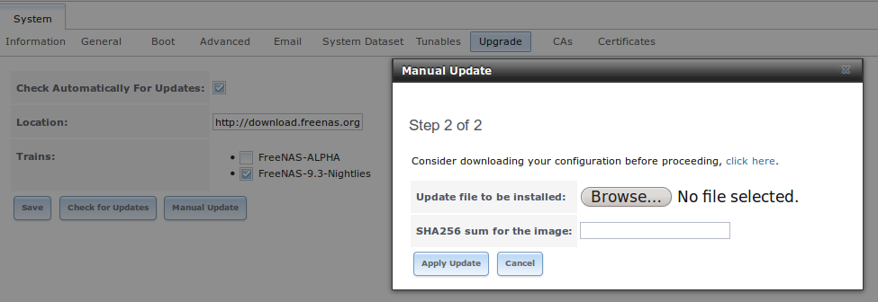

This screen again reminds you to backup your configuration before proceeding. If you have not yet, click the "click here" link.

Browse to the location of the downloaded :file:`.txz` file, then paste its SHA256 sum.

When finished, click the "Apply Update" button to begin the upgrade progress. Behind the scenes, the following steps are occurring:

* The SHA256 hash is confirmed and an error will display if it does not match. If you get this error, double-check that you pasted the correct checksum and
  try pasting again.

* The new image is uncompressed and written to the operating system drive. This can take a few minutes so be patient.

* Once the new image is written, you will temporarily lose your connection as the FreeNAS® system will reboot into the new version of the operating system.
  FreeNAS® will actually reboot twice: once the new operating system loads, the upgrade process applies the new database schema and reboots again.

* Assuming all went well, the FreeNAS® system will receive the same IP from the DHCP server. Refresh your browser after a moment to see if you can access
  the system.

.. index:: Update
.. _Updating Between Releases:

Updating Between Releases
~~~~~~~~~~~~~~~~~~~~~~~~~

To update the system between releases, use :menuselection:`System --> Update`.

.. warning:: each update creates a boot environment and if the boot device does not have sufficient space to hold another boot environment, the upgrade will
   fail. If you need to create more space on the boot device, use :menuselection:`System --> Boot` to review your current boot environments and to delete the
   ones you no longer plan to boot into.

In the screen shown in Figure 2.5e, use the drop-down menu to select which "Train" you would like to track updates to.

**Figure 2.5e: Checking for Updates**

|update1.png|

.. |update1.png| image:: images/update1.png
    :width: 6.2in
    :height: 3.4in

In this example, this system has the option to track *FreeNAS-9.3-Nightlies*, (the latest nightly build of 9.3 which may contain untested fixes),
*FreeNAS-9.3-STABLE* (all new and tested features, drivers, and bug fixes since 9.3 was released), and
*FreeNAS-10-Nightlies* (the latest, pre-alpha build of the upcoming 10 version). The administrator has selected to track the recommended
*FreeNAS-9.3-STABLE* train. Click the hyperlink for "Train Descriptions" to read a brief description of each train.

To see if any updates are available, click the "Check Now" button. If any updates are available, they will be listed in a pop-up screen. Either click the "OK"
button to apply the listed updates or the "Cancel" button to exit the screen containing the listing. 

.. note:: some updates require a system reboot. You should ensure that no clients are currently connected to the FreeNAS® system and that no scrubs are
   currently in progress before applying an update.

If you choose to apply the updates, a progress bar will indicate the progress of downloading and installing the updates. Before the update process begins,
FreeNAS® will automatically take a snapshot of the current operating system and add it to the boot menu. If the update requires a system reboot, the system
will automatically be rebooted immediately after the update is applied.

.. _If Something Goes Wrong:

If Something Goes Wrong
~~~~~~~~~~~~~~~~~~~~~~~

If an update fails, an alert will be issued and the details will be written to :file:`/data/update.failed`.

To return to a previous version of the operating system, you will need physical or IPMI access to the FreeNAS® console. Reboot the system and watch for the
boot menu. In the example shown in Figure 2.5f, the first boot menu entry, *FreeNAS (default)*, refers to the initial installation, before the update was
applied. The second boot entry, *FreeNAS-1415259326*, refers to the current version of the operating system, after the update was applied. This second entry
is highlighted and begins with a star, indicating that this is the environment the system will boot into, unless another entry is manually selected. Both
entries include a date and timestamp, indicating when that boot environment was created.

**Figure 2.5f: Boot Menu**

|boot1.png|

.. |boot1.png| image:: images/boot1.png
    :width: 5.7in
    :height: 4.1in

To boot into the previous version of the operating system, use the up or down arrow to select it and press enter.

Should a boot device fail and the system no longer boots, don't panic. The data is still on your disks and you still have a copy of your saved configuration.
You can always:

#.  Perform a fresh installation on a new boot device.

#.  Import your volumes in :menuselection:`Storage --> Auto Import Volume`.

#.  Restore the configuration in :menuselection:`System --> General --> Upload Config`.

.. index:: Upgrade ZFS Pool
.. _Upgrading a ZFS Pool:

Upgrading a ZFS Pool
~~~~~~~~~~~~~~~~~~~~

Beginning with FreeNAS® 9.3, ZFS pools can be upgraded from the graphical administrative interface.

Before upgrading an existing ZFS pool, be aware of the following caveats first:

* the pool upgrade is a one-way street meaning that **if you change your mind you can not go back to an earlier ZFS version or downgrade to an earlier version
  of FreeNAS® that does not support those feature flags.**

* before performing any operation that may affect the data on a storage disk, **always backup your data first and verify the integrity of the backup.**
  While it is unlikely that the pool upgrade will affect the data, it is always better to be safe than sorry.

* upgrading a ZFS pool is **optional**. You do not need to upgrade the pool if you do not need newer feature flags or if you want to keep the possibility of
  reverting to an earlier version of FreeNAS® or repurposing the disks in another operating system that supports ZFS. If you do decide to upgrade the pool to
  the latest feature flags, you will not be able to import that pool into another operating system that does not yet support those feature flags.

To perform the ZFS pool upgrade, go to :menuselection:`Storage --> Volumes --> View Volumes` and highlight the volume (ZFS pool) to upgrade. Click the
"Upgrade" button as seen in Figure 2.5g.

.. note:: if the "Upgrade" button does not appear, the pool is already at the latest feature flags and does not need to be upgraded.

**Figure 2.5g: Upgrading a ZFS Pool**

|pool1.png|

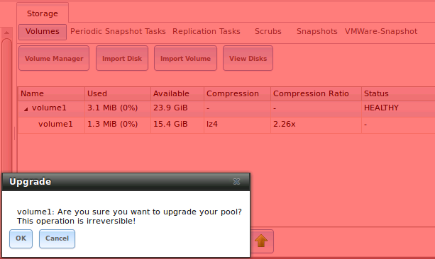

The warning message will remind you that a pool upgrade is irreversible. Click "OK" to proceed with the upgrade.

The upgrade itself should only take a seconds and is non-disruptive. This means that you do not need to stop any sharing services in order to upgrade the
pool. However, you should choose to upgrade when the pool is not being heavily used. The upgrade process will suspend I/O for a short period, but should be
nearly instantaneous on a quiet pool.

.. index:: Virtualization, VM
.. _Virtualization:

Virtualization
--------------

FreeNAS® can be run inside a virtual environment for development, experimentation, and educational purposes. Please note that running FreeNAS® in production
as a virtual machine is
`not recommended <http://forums.freenas.org/showthread.php?12484-Please-do-not-run-FreeNAS-in-production-as-a-Virtual-Machine%21>`_.
If you decide to use FreeNAS® within a virtual environment,
`read this post first <http://forums.freenas.org/showthread.php?12714-quot-Absolutely-must-virtualize-FreeNAS%21-quot-a-guide-to-not-completely-losing-your-data>`_
as it contains useful guidelines for minimizing the risk of losing your data.

In order to install or run FreeNAS® within a virtual environment, you will need to create a virtual machine that meets the following minimum requirements:

* **at least** 8192 MB base memory size

* a virtual disk **at least 8 GB in size** to hold the operating system and boot environments

* at least one more virtual disk **at least 4 GB in size** to be used as data storage

* a bridged adapter

This section demonstrates how to create and access a virtual machine within the VirtualBox and VMware ESXi environments.

.. _VirtualBox:

VirtualBox
~~~~~~~~~~

`VirtualBox <http://www.virtualbox.org/>`__ is an open source virtualization program originally created by Sun Microsystems. VirtualBox runs on Windows, BSD,
Linux, Macintosh, and OpenSolaris. It can be configured to use a downloaded FreeNAS® :file:`.iso` file, and makes a good testing environment for practicing
configurations or learning how to use the features provided by FreeNAS®.

To create the virtual machine, start VirtualBox and click the "New" button, seen in Figure 2.6a, to start the new virtual machine wizard.

**Figure 2.6a: Initial VirtualBox Screen**

|virtualbox1.png|

.. |virtualbox1.png| image:: images/virtualbox1.png
    :width: 6.9252in
    :height: 3.6335in

Click the "Next" button to see the screen in Figure 2.6b. Enter a name for the virtual machine, click the "Operating System" drop-down menu and select BSD,
and select "FreeBSD (64-bit)" from the "Version" dropdown.

**Figure 2.6b: Type in a Name and Select the Operating System for the New Virtual Machine**

|virtualbox2.png|

.. |virtualbox2.png| image:: images/virtualbox2.png
    :width: 5.4626in
    :height: 3.6665in

Click "Next" to see the screen in Figure 2.6c. The base memory size must be changed to **at least 8192 MB**. When finished, click "Next" to see the screen in
Figure 2.6d.

**Figure 2.6c: Select the Amount of Memory Reserved for the Virtual Machine**

|virtualbox3.png|

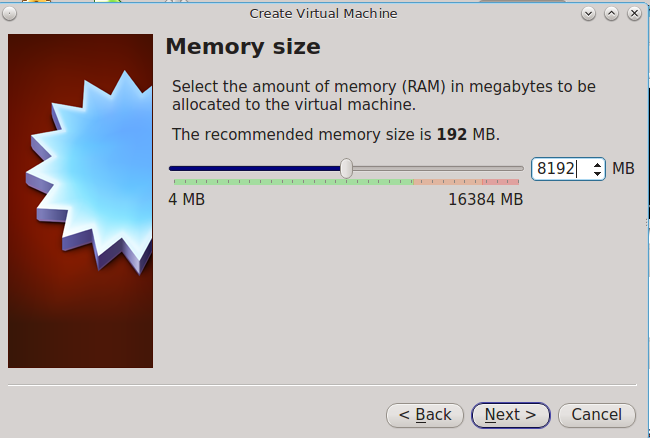

**Figure 2.6d: Select Whether to Use an Existing or Create a New Virtual Hard Drive**

|virtualbox4.png|

.. |virtualbox4.png| image:: images/virtualbox4.png
    :width: 5.4626in
    :height: 3.6665in

Click "Create" to launch the "Create Virtual Hard Drive Wizard" shown in Figure 2.6e.

**Figure 2.6e: Create New Virtual Hard Drive Wizard**

|virtualbox5.png|

.. |virtualbox5.png| image:: images/virtualbox5.png
    :width: 6.361in
    :height: 4.1417in

Select "VDI" and click the "Next" button to see the screen in Figure 2.6f.

**Figure 2.6f: Select the Storage Type for the Virtual Disk**

|virtualbox6.png|

.. |virtualbox6.png| image:: images/virtualbox6.png
    :width: 6.361in
    :height: 4.1417in

You can now choose whether you want "Dynamically allocated" or "Fixed-size" storage. The first option uses disk space as needed until it reaches the
maximum size that you will set in the next screen. The second option creates a disk the same size as that specified amount of disk space, whether it is used
or not. Choose the first option if you are worried about disk space; otherwise, choose the second option as it allows VirtualBox to run slightly faster. Once
you select "Next", you will see the screen in Figure 2.6g.

**Figure 2.6g: Select the File Name and Size of the Virtual Disk**

|virtualbox7.png|

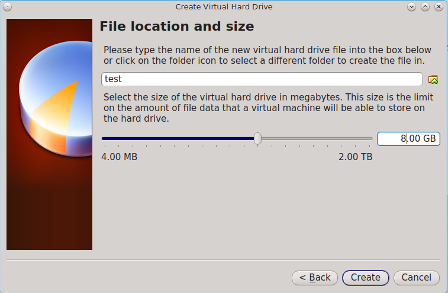

This screen is used to set the size (or upper limit) of the virtual machine. **Increase the default size to 8 GB**. Use the folder icon to browse to a
directory on disk with sufficient space to hold the virtual machine.

Once you make your selection and press "Next", you will see a summary of your choices. Use the "Back" button to return to a previous screen if you need to
change any values. Otherwise, click "Finish" to finish using the wizard. The virtual machine will be listed in the left frame, as seen in the example in
Figure 2.6h.

**Figure 2.6h: The New Virtual Machine**

|virtualbox8.png|

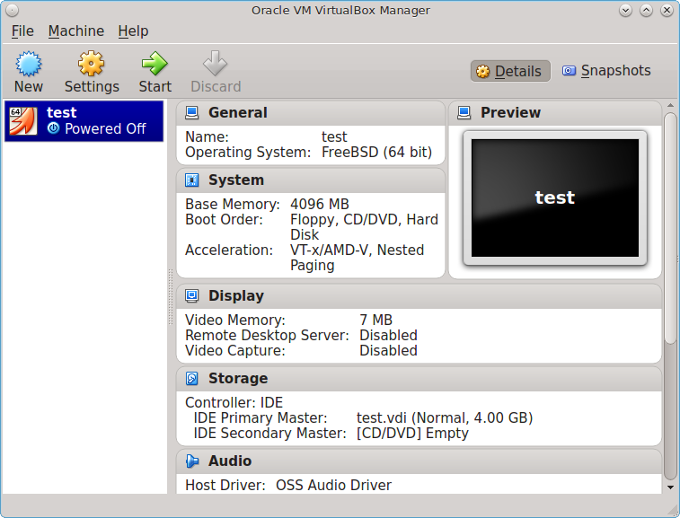

Next, create the virtual disk(s) to be used for storage. Click the "Storage" hyperlink in the right frame to access the storage screen seen in Figure
2.6i.

**Figure 2.6i: The Storage Settings of the Virtual Machine**

|virtualbox9.png|

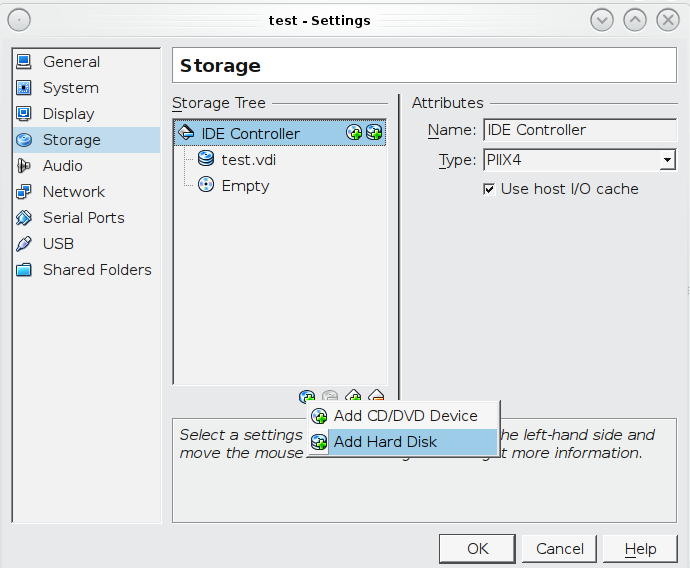

Click the "Add Attachment" button, select "Add Hard Disk" from the pop-up menu, then click the "Create New Disk" button. This will launch the Create New 
Virtual Hard Drive Wizard (seen in Figures 2.2e and 2.2f). Since this disk will be used for storage, create a size appropriate to your needs, making sure that
it is **at least 4 GB** in size. If you wish to practice RAID configurations, create as many virtual disks as you need. You will be able to create 2 disks on
the IDE controller. If you need additional disks, click the "Add Controller" button to create another controller to attach disks to.

Next, create the device for the installation media. Highlight the word "Empty", then click the "CD" icon as seen in Figure 2.6j.

**Figure 2.6j: Configuring the ISO Installation Media**

|virtualbox10.png|

.. |virtualbox10.png| image:: images/virtualbox10.png
    :width: 6.9252in
    :height: 3.6602in

Click "Choose a virtual CD/DVD disk file..." to browse to the location of the :file:`.iso` file. Alternately, if you have burned the :file:`.iso` to disk,
select the detected "Host Drive".

Depending upon the extensions available in your CPU, you may or may not be able to use the ISO. If you receive the error "your CPU does not support long
mode" when you try to boot the ISO, your CPU either does not have the required extension or AMD-V/VT-x is disabled in the system BIOS.

.. note:: if you receive a kernel panic when booting into the ISO, stop the virtual machine. Then, go to System and check the box "Enable IO APIC".

To configure the network adapter, go to :menuselection:`Settings --> Network`. In the "Attached to" drop-down menu select "Bridged Adapter", then select the
name of the physical interface from the "Name" drop-down menu. In the example shown in Figure 2.6k, the Intel Pro/1000 Ethernet card is attached to the
network and has a device name of *em0*.

**Figure 2.6k: Configuring a Bridged Adapter in VirtualBox**

|virtualbox11.png|

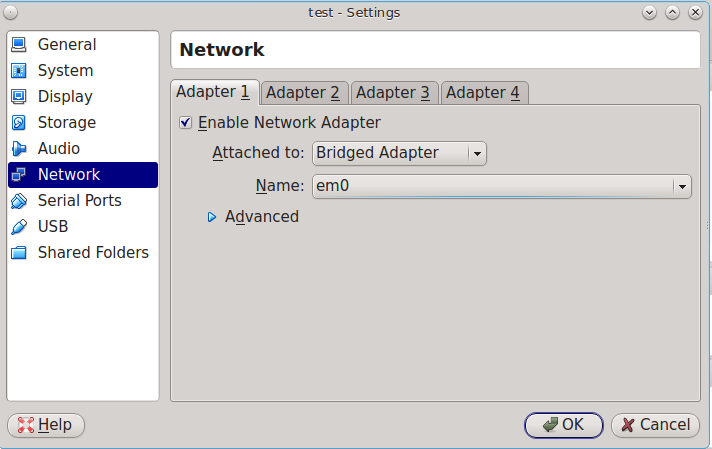

Once your configuration is complete, click the "Start" arrow and install FreeNAS® as described in `Performing the Installation`_. Once FreeNAS® is
installed, press "F12" to access the boot menu in order to select the primary hard disk as the boot option. You can permanently boot from disk by removing the
"CD/DVD" device in "Storage" or by unchecking "CD/DVD-ROM" in the "Boot Order" section of "System".

.. _VMware ESXi:

VMware ESXi
~~~~~~~~~~~

If you are considering using ESXi, read
`this post <http://forums.freenas.org/threads/sync-writes-or-why-is-my-esxi-nfs-so-slow-and-why-is-iscsi-faster.12506/>`_
for an explanation of why iSCSI will be faster than NFS.

ESXi is is a bare-metal hypervisor architecture created by VMware Inc. Commercial and free versions of the VMware vSphere Hypervisor operating system (ESXi)
are available from the
`VMware website <http://www.vmware.com/products/vsphere/esxi-and-esx/>`_. Once the operating system is installed on supported hardware, use a web browser to
connect to its IP address. The welcome screen will provide a link to download the VMware vSphere client which is used to create and manage virtual machines.

Once the VMware vSphere client is installed, use it to connect to the ESXi server. To create a new virtual machine, click :menuselection:`File --> New -->
Virtual Machine`. The New Virtual Machine Wizard will launch as seen in Figure 2.6l.

**Figure 2.6l: New Virtual Machine Wizard**

|esxi1.png|

.. |esxi1.png| image:: images/esxi1.png
    :width: 6.9252in
    :height: 4.1in

Click "Next" and input a name for the virtual machine. Click "Next" and highlight a datastore. An example is shown in Figure 2.6m. Click "Next". In the screen
shown in Figure 2.6n, click "Other" then select a FreeBSD architecture that matches the FreeNAS® architecture.

**Figure 2.6m: Select a Datastore**

|esxi2.png|

.. |esxi2.png| image:: images/esxi2.png
    :width: 6.9252in
    :height: 4.1in

**Figure 2.6n: Select the Operating System**

|esxi3.png|

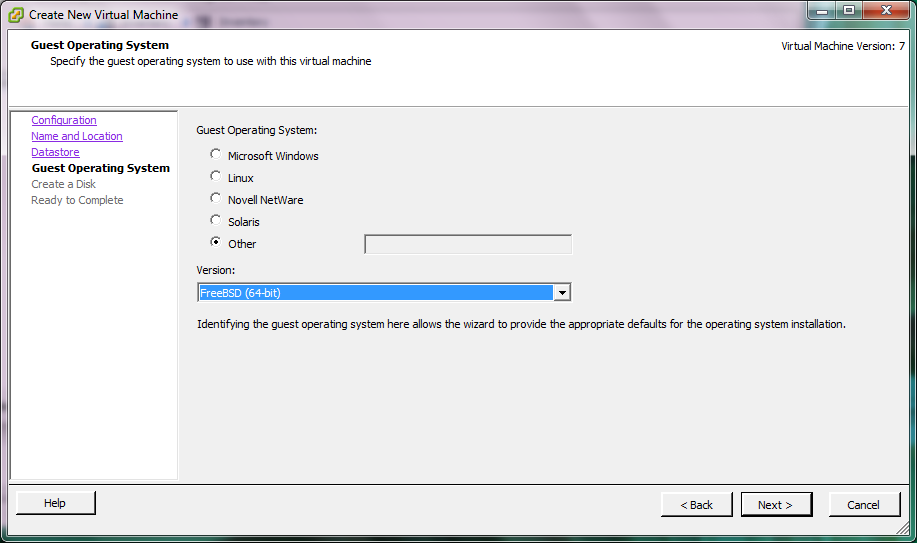

Click "Next" and create a virtual disk file of **8 GB** to hold the FreeNAS® operating system, as shown in Figure 2.6o.

**Figure 2.6o: Create a Disk for the Operating System**

|esxi4.png|

.. |esxi4.png| image:: images/esxi4.png
    :width: 6.7957in
    :height: 3.8472in

Click "Next" then "Finish". Your virtual machine will be listed in the left frame. Right-click the virtual machine and select "Edit Settings" to access the
screen shown in Figure 2.6p.

**Figure 2.6p: Virtual Machine's Settings**

|esxi5.png|

.. |esxi5.png| image:: images/esxi5.png
    :width: 6.7346in
    :height: 4.3146in

Increase the "Memory Configuration" to **at least 8192 MB**.

Under "CPUs", make sure that only 1 virtual processor is listed, otherwise you will be unable to start any FreeNAS® services.

To create a storage disk, click :menuselection:`Hard disk 1 --> Add`. In the "Device Type" menu, highlight "Hard Disk" and click "Next". Select "Create a new
virtual disk" and click "Next". In the screen shown in Figure 2.6q, select the size of the disk. If you would like the size to be dynamically allocated as
needed, check the box "Allocate and commit space on demand (Thin Provisioning)". Click "Next", then "Next", then "Finish" to create the disk. Repeat to create
the amount of storage disks needed to meet your requirements.

**Figure 2.6q: Creating a Storage Disk**

|esxi6.png|

.. |esxi6.png| image:: images/esxi6.png
    :width: 6.7925in
    :height: 5.3339in

