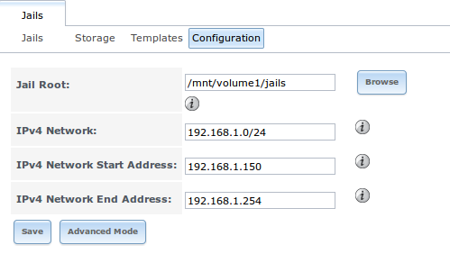
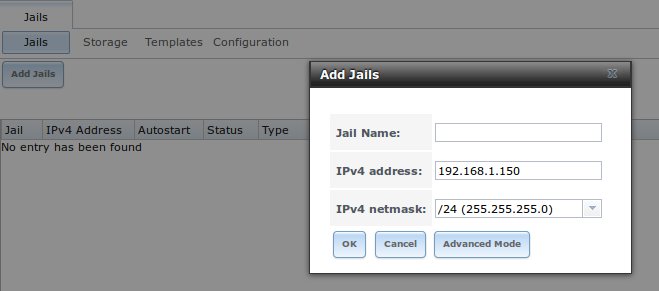

:orphan:

.. _Jails:

Jails
=====

The previous section described how to find, install, and configure software using the Plugins method.

This section describes how to use the Jails method, which allows users who are comfortable using the command line to have more control over software
installation and management. Any software installed using the Jails method must be managed from the command line and will not appear in the FreeNAS® GUI. If
you prefer to use the FreeNAS® GUI to manage software, use :ref:`Plugins` instead.

While the Plugins method automatically creates a FreeBSD jail for each installed PBI, the Jails method allows users to create as many jails as needed and
to customize the operating system and software within each jail. Unlike the Plugins method, one is not limited to installing only one application per jail.

Essentially, a
`jail <http://en.wikipedia.org/wiki/Freebsd_jail>`_
provides a very light-weight, operating system-level virtualization. Consider it as an independent operating system running on the same hardware, without all
of the overhead usually associated with virtualization. This means that any software and configurations within a jail are isolated from both the FreeNAS®
operating system and any other jails running on that system. During creation, the *VIMAGE* option can be selected which provides that jail with its own,
independent networking stack. This allows the jail to do its own IP broadcasting, which is required by some applications.

By default, creating a jail installs an instance of FreeBSD and its software management utilities. This means that you can compile FreeBSD ports and install
FreeBSD pkgng packages from the command line of a FreeBSD jail.

In addition to FreeBSD jails, one can use the Virtualbox template to install an instance of phpVirtualBox, which provides a web-based front-end to
VirtualBox. This can be used to install any operating system and to use the software management tools provided by that operating system.

Advanced users can also create custom templates to automate the creation of pre-installed and customized operating systems.

The ability to create multiple jails running different operating systems offers great flexibility regarding software management. For example, the
administrator can choose to provide application separation by installing different applications in each jail, or to create one jail for all installed
applications, or to mix and match how software is installed into each jail.

The rest of this section describes the following:

* :ref:`Jails Configuration`

* :ref:`Add Jails`

* :ref:`Using phpVirtualBox`

* :ref:`Jail Templates`

* :ref:`Installing Software in a FreeBSD Jail`

.. _Jails Configuration:

Jails Configuration
-------------------

Before you can create any jails, you must first configure which volume or dataset will be used to hold the jails. To do so, click
:menuselection:`Jails --> Configuration` to access the screen shown in Figure 13.1a. While a jail can be installed on a UFS volume, it is recommended to use
ZFS and to create a dataset to use for the "Jail Root". As jails are created on a ZFS system, they will automatically be installed into their own dataset
under the specified path. For example, if you configure a "Jail Root" of :file:`/mnt/volume1/dataset1` and create a jail named *jail1*, it will be installed
into its own dataset named :file:`/mnt/volume1/dataset1/jail1`.

**Figure 13.1a: Global Jail Configuration**

|jails1.png|

.. |jails1.png| image:: images/jails1.png
    :width: 4.2in
    :height: 2.4in

.. warning:: if you have already used the Plugins method, all of the fields in this screen will automatically be filled in. You should still double-check that
   the pre-configured IP addressing values are appropriate for your jails and will not conflict with addresses used by other systems on the network.

Table 13.1a summarizes the fields in this configuration screen. Some settings are only available in "Advanced Mode". To see these settings, either click the
"Advanced Mode" button or configure the system to always display these settings by checking the box "Show advanced fields by default" in
:menuselection:`System --> Advanced`.

**Table 13.1a: Jail Configuration Options**

+----------------------------+---------------+--------------------------------------------------------------------------+
| **Setting**                | **Value**     | **Description**                                                          |
|                            |               |                                                                          |
|                            |               |                                                                          |
+============================+===============+==========================================================================+
| Jail Root                  | browse button | see explanation below table; mandatory as you cannot add a jail until    |
|                            |               | this is set                                                              |
|                            |               |                                                                          |
+----------------------------+---------------+--------------------------------------------------------------------------+
| IPv4 Network               | string        | see explanation below table; format is IP address of *network/CIDR mask* |
|                            |               |                                                                          |
+----------------------------+---------------+--------------------------------------------------------------------------+
| IPv4 Network Start Address | string        | see explanation below table; format is IP address of *host/CIDR mask*    |
|                            |               |                                                                          |
+----------------------------+---------------+--------------------------------------------------------------------------+
| IPv4 Network End Address   | string        | see explanation below table; format is IP address of *host/CIDR mask*    |
|                            |               |                                                                          |
+----------------------------+---------------+--------------------------------------------------------------------------+
| IPv6 Network               | string        | only available in "Advanced Mode"; only set if jails are to be accessed  |
|                            |               | over a properly configured IPv6 network                                  |
+----------------------------+---------------+--------------------------------------------------------------------------+
| IPv6 Network Start Address | string        | only available in "Advanced Mode"; only set if jails are to be accessed  |
|                            |               | over a properly configured IPv6 network                                  |
+----------------------------+---------------+--------------------------------------------------------------------------+
| IPv6 Network End Address   | string        | only available in "Advanced Mode"; only set if jails are to be accessed  |
|                            |               | over a properly configured IPv6 network                                  |
+----------------------------+---------------+--------------------------------------------------------------------------+
| Collection URL             | string        | only available in "Advanced Mode"; changing the default may break the    |
|                            |               | ability to install jails                                                 |
+----------------------------+---------------+--------------------------------------------------------------------------+

When selecting the "Jail Root", ensure that the size of the selected volume or dataset is sufficient to hold the number of jails to be installed as well
as any software, log files, and data to be stored within each jail. At a bare minimum, budget at least 2GB per jail and do not select a dataset that is less
than 2GB in size.

.. note:: if you plan to add storage to a jail, be aware that path size is limited to 88 characters. Make sure that the length of your volume name plus the
   dataset name plus the jail name does not exceed this limit.

FreeNAS® will automatically detect and display the "IPv4 Network" that the administrative interface is connected to. This setting is important as the IPv4
network must be :command:`ping` able from the FreeNAS® system in order for your jails and any installed software to be accessible. If your network topology
requires you to change the default value, you will also need to configure a default gateway, and possibly a static route, to the specified network. If you
change this value, ensure that the subnet mask value is correct as an incorrect mask can make the IP network unreachable. When in doubt, keep the default
setting for "IPv4 Network". If you are using VMware, make sure that the vswitch is set to "promiscuous mode".

Review the default values of the "IPv4 Network Start Address" and "IPv4 Network End Address" to determine if that range is appropriate for the number of jails
that you will create. If there is a DHCP server on the network, make sure that this range of addresses is excluded from the scope of the DHCP server. As jails
are created, they will automatically be assigned the next free IP address within the range specified by these two values.

.. note:: these 4 fields are necessary for the proper operation of Jails. If you are unable to add, start, or access the software installed into jails,
   double-check the values in these fields. In particular, make sure that the specified IPv4 settings are reachable by clients and that the specified
   addresses are not in use by any other clients in the network.

The "Advanced Mode" fields only need to be completed if jails are to be accessible by IPv6 clients. You should not need to change the "Collection URL".

Once you click the "Save" button to save the configuration, the "Jails" tab will change, as seen in the example shown in Figure 13.1b.

**Figure 13.1a: Jails Tab**

|jails2.png|

You can now create and manage jails as described in the rest of this chapter.

.. _Add Jails:

Add Jails
---------

To create a jail, click :menuselection:`Jails --> Add Jails` to access the screen shown in Figure 13.2a.

.. note:: the "Add Jails" menu item will not appear until after you configure :menuselection:`Jails --> Configuration`.

**Figure 13.2a: Creating a Jail**

|jails3.png|

By default, the only required value to create a jail is to give it a name and to double-check that the suggested IP address will not conflict with any other
address being used on the network. The default is to create a FreeBSD jail.

Table 13.2a summarizes the available options. Most settings are only available in "Advanced Mode" and are not needed if the intent is to create a FreeBSD
jail. To see these settings, either click the "Advanced Mode" button or configure the system to always display these settings by checking the box "Show
advanced fields by default" in :menuselection:`System --> Advanced`.

**Table 13.2a: Jail Configuration Options**

+---------------------------+----------------+--------------------------------------------------------------------------------------------------------------+
| **Setting**               | **Value**      | **Description**                                                                                              |
|                           |                |                                                                                                              |
|                           |                |                                                                                                              |
+===========================+================+==============================================================================================================+
| Jail Name                 | string         | mandatory; can only contain letters and numbers                                                              |
|                           |                |                                                                                                              |
+---------------------------+----------------+--------------------------------------------------------------------------------------------------------------+
| Template                  | drop-down menu | by default, contains the *VirtualBox* template for creating an instance of phpVirtualBox; advanced users can |
|                           |                | create and install custom templates as described in `Creating Templates`_                                    |
|                           |                |                                                                                                              |
+---------------------------+----------------+--------------------------------------------------------------------------------------------------------------+
| IPv4 address              | integer        | will be automatically assigned the next free address from the range specified in "Jails Configuration"; if   |
|                           |                | you change the default address, make sure it is reachable within the local network and is not in use by any  |
|                           |                | other host on the network                                                                                    |
|                           |                |                                                                                                              |
+---------------------------+----------------+--------------------------------------------------------------------------------------------------------------+
| IPv4 netmask              | drop-down menu | select the subnet mask associated with "IPv4 address"                                                        |
|                           |                |                                                                                                              |
|                           |                |                                                                                                              |
+---------------------------+----------------+--------------------------------------------------------------------------------------------------------------+
| IPv4 bridge address       | integer        | see NOTE below; will be greyed out if "VIMAGE" is unchecked                                                  |
|                           |                |                                                                                                              |
+---------------------------+----------------+--------------------------------------------------------------------------------------------------------------+
| IPv4 bridge netmask       | drop-down menu | select the subnet mask associated with "IPv4 bridge address"; will be greyed if "VIMAGE" is unchecked        |
|                           |                |                                                                                                              |
+---------------------------+----------------+--------------------------------------------------------------------------------------------------------------+
| IPv4 default gateway      | string         | used to set the jail's default gateway IPv4 address; will be greyed out if "VIMAGE" is unchecked             |
|                           |                |                                                                                                              |
+---------------------------+----------------+--------------------------------------------------------------------------------------------------------------+
| IPv6 address              | integer        | if IPv6 has been configured, will be automatically assigned the next free address from the range specified   |
|                           |                | in "Jails Configuration"_                                                                                    |
|                           |                |                                                                                                              |
+---------------------------+----------------+--------------------------------------------------------------------------------------------------------------+
| IPv6 prefix length        | drop-down menu | select the prefix length associated with "IPv6 address"                                                      |
|                           |                |                                                                                                              |
+---------------------------+----------------+--------------------------------------------------------------------------------------------------------------+
| IPv6 bridge address       | integer        | see NOTE below; will be greyed if "VIMAGE" is unchecked                                                      |
|                           |                |                                                                                                              |
+---------------------------+----------------+--------------------------------------------------------------------------------------------------------------+
| IPv6 bridge prefix length | drop-down menu | select the prefix length associated with "IPv6 address"; will be greyed out if "VIMAGE" is unchecked         |
|                           |                |                                                                                                              |
+---------------------------+----------------+--------------------------------------------------------------------------------------------------------------+
| IPv6 default gateway      | string         | used to set the jail's default gateway IPv6 address; will be greyed out if "VIMAGE" is unchecked             |
|                           |                |                                                                                                              |
+---------------------------+----------------+--------------------------------------------------------------------------------------------------------------+
| MAC                       | string         | if a static MAC address is needed, input it here; will be greyed out if "VIMAGE" is unchecked                |
|                           |                |                                                                                                              |
+---------------------------+----------------+--------------------------------------------------------------------------------------------------------------+
| Sysctls                   | string         | comma-delimited list of sysctls to set inside jail (e.g. *allow.sysvipc=1,allow.raw_sockets=1*)              |
|                           |                |                                                                                                              |
+---------------------------+----------------+--------------------------------------------------------------------------------------------------------------+
| Autostart                 | checkbox       | uncheck if you want to start the jail manually                                                               |
|                           |                |                                                                                                              |
+---------------------------+----------------+--------------------------------------------------------------------------------------------------------------+
| VIMAGE                    | checkbox       | gives a jail its own virtualized network stack; requires promiscuous mode to be enabled on the interface     |
|                           |                |                                                                                                              |
+---------------------------+----------------+--------------------------------------------------------------------------------------------------------------+
| NAT                       | checkbox       | enables Network Address Translation for the jail; will be greyed out for Linux jails or if "VIMAGE" is       |
|                           |                | unchecked                                                                                                    |
|                           |                |                                                                                                              |
+---------------------------+----------------+--------------------------------------------------------------------------------------------------------------+

.. note:: the IPv4 and IPv6 bridge interface is used to bridge the
   `epair(4) <http://www.freebsd.org/cgi/man.cgi?query=epair>`_
   device, which is automatically created for each started jail, to a physical network device. The default network device is the one that is configured with a
   default gateway. So, if *em0* is the FreeBSD name of the physical interface and three jails are running, the following virtual interfaces will be
   automatically created: *bridge0*,
   *epair0a*,
   *epair1a*, and
   *epair2a.* The physical interface
   *em0* will be added to the bridge, as well as each epair device. The other half of the epair will be placed inside the jail and will be assigned the IP
   address specified for that jail. The bridge interface will be assigned an alias of the default gateway for that jail, if configured, or the bridge IP, if
   configured; either is correct.

If you uncheck both the "VIMAGE" and "NAT" boxes, the jail must be configured with an IP address within the same network as the interface it is bound to, and
that address will be assigned as an alias on that interface. To use a "VIMAGE" jail on the same subnet, uncheck "NAT" and configure an IP address within the
same network. In both of these cases, you only configure an IP address and do not configure a bridge or a gateway address.

After making your selections, click the "OK" button. The jail will be created and will be added to the "Jails" tab as well as in the tree menu under "Jails".
By default, the jail will automatically start, unless you specify otherwise by unchecking the "Autostart" box.

The first time you add a jail or use a template, the GUI will automatically download the necessary components from the Internet. If it is unable to connect to
the Internet, the jail creation will fail. Otherwise, a progress bar will indicate the status of the download and provide an estimated time for the process to
complete. Once the first jail is created, or a template used, subsequent jails will be added instantaneously as the downloaded base for creating the jail is
saved to the "Jail Root".

.. _Managing Jails:

Managing Jails
~~~~~~~~~~~~~~

To view and configure the added jails, click :menuselection:`Jails --> View all Jails`. In the example shown in Figure 13.2b, four jails have been created and
the list entry for the jail named *pluginjail* has been clicked.

**Figure 13.2b: Created Jails Added to the GUI**

|Figure132b_png|

Click a jail's entry to access its configuration icons. In order, from left to right, these icons are used to:

**Edit Jail:** edit the jail's settings as described in :ref:`Edit Jail`.

**Add Storage:** configure the jail to access an area of storage as described in :ref:`Add Storage`.

**Upload Plugin:** only available in a plugin jail. Used to install plugins as described in :ref:`Installing FreeNAS® PBIs`.

**Start/Stop:** this icon will vary, depending upon the current running status of the jail. If the jail is currently stopped, the icon will be green and can
be used to start the jail. If the jail is currently running, the icon will be red and can be used to stop the jail. A stopped jail and its applications are
inaccessible until it is restarted.

**Shell:** used to access a root command prompt in order to configure the selected jail from the command line.

**Delete:** deleting the specified jail also deletes any software that was installed in that jail. The GUI will display a warning which requires you to click
the "Yes" button, indicating that you are sure that you want to delete the jail, before this operation is performed.

.. _Accessing a Jail Using SSH:

Accessing a Jail Using SSH
^^^^^^^^^^^^^^^^^^^^^^^^^^

If you prefer to use :command:`ssh` to access a jail you will need to first start the :command:`ssh` service and create a user account for :command:`ssh`
access. Since this configuration occurs on a jail-by-jail basis, click the "shell" icon for the jail you wish to configure :command:`ssh` access to.

To start the SSH service on a non-Linux jail, look for the following line in that jail's :file:`/etc/rc.conf`::

 sshd_enable="NO"

Change the *NO* to
*YES* and save the file. Then, start the SSH daemon::

 service sshd start

The host RSA key pair should be generated and the key's fingerprint and random art image displayed.

For a Linux jail, refer to the documentation for that Linux distribution for instructions on how to start the SSH service. Depending upon the distribution,
you may have to first install a SSH server.

Next, add a user account. If you want the user to have superuser privileges to a non-Linux jail, make sure the user is placed in the *wheel* group when it is
created. Type :command:`adduser` and follow the prompts. When you get to this prompt, **do not** press :kbd:`Enter` but instead type
*wheel*::

 Login group is user1. Invite user1 into other groups? []: wheel

Once the user is created, set the *root* password so that the new user will be able to use the :command:`su` command to gain superuser privilege. To set the
password, type :command:`passwd` then input and confirm the desired password.

For a Linux jail, you will need to create a user account using the software that comes with the Linux distribution. Since Linux does not use the *wheel*
group, if you wish to give this user superuser privileges, instead install and configure the sudo application.

Finally, test from another system that the user can successfully :command:`ssh` in and become the superuser. In this example, a user named *user1* uses
:command:`ssh` to access the non-Linux jail at 192.168.2.3. The first time the user logs in, they will be asked to verify the fingerprint of the host::

 ssh user1@192.168.2.3
 The authenticity of host '192.168.2.3 (192.168.2.3)' can't be established.
 RSA key fingerprint is 6f:93:e5:36:4f:54:ed:4b:9c:c8:c2:71:89:c1:58:f0.
 Are you sure you want to continue connecting (yes/no)? yes
 Warning: Permanently added '192.168.2.3' (RSA) to the list of known hosts.
 Password: type_password_here

.. note:: each jail has its own user accounts and service configuration. This means that you will need to repeat these steps for each jail that requires SSH
   access.

.. _Edit Jail:

Edit Jail
^^^^^^^^^

Figure 13.2c shows the configuration screen that appears when you click the "Edit Jail" button for a highlighted jail's entry. This screen can also be
accessed by expanding the jail's name in the tree view and clicking "Edit".

**Figure 13.2c: Jail's Edit Settings**

|Figure132c_png|

Most of these settings were previously described in Table 13.2a and can be changed using this screen after jail creation. The following settings differ
between the "Add Jail" and "Edit Jail" screens:

* **Jail Name:** this setting is read-only once the jail has been created.

* **IPv4 aliases:** once a jail has been created, this field can be used to add additional IPv4 addresses, which are known as aliases. When adding multiple
  aliases, use a comma delimited list.

* **IPv6 aliases:** once a jail has been created, this field can be used to add additional IPv6 addresses. When adding multiple aliases, use a comma
  delimited list.

.. note:: if you need to modify the IP address information for a jail, use it's "Edit Jail" button instead of the associated networking commands from the
   command line of the jail.

.. _Add Storage:

Add Storage
^^^^^^^^^^^

It is possible to give a jail access to an area of storage on the FreeNAS® system. This is useful if you install an application that stores a large amount of
data or if an installed application needs access to the data stored on the FreeNAS® system. An example would be transmission, which stores torrents. The
storage is added using the
`mount_nullfs(8) <http://www.freebsd.org/cgi/man.cgi?query=mount_nullfs>`_
mechanism which links data that resides outside of the jail as a storage area within the jail.

To add storage, click the "Add Storage" button for a highlighted jail's entry. This screen can also be accessed by expanding the jail's name in the tree
view and clicking :menuselection:`Storage --> Add Storage`, shown in Figure 13.2d.

Browse to the "Source" and "Destination", where:

* **Source:** is the directory or dataset on the FreeNAS® system you would like to gain access to from the jail. This directory
  **must**  reside outside of the volume or dataset being used by the jail. This is why it is recommended to create a separate dataset to store jails, as the
  dataset holding the jails will always be separate from any datasets used for storage on the FreeNAS® system.

* **Destination:** select the directory within the jail which will be linked to the "Source" storage area.

**Figure 13.2d: Adding Storage to a Jail**

|Figure132d_png|

When you are adding storage, it is typically because the user and group account associated with an application installed inside of a jail needs to access data
stored on the FreeNAS® system. Before selecting the "Source", it is important to first ensure that the permissions of the selected directory or dataset grant
permission to the user/group account inside of the jail. This is typically not the default, as the users and groups created inside of a jail are totally
separate from the users and groups of the FreeNAS® system.

This means that the workflow for adding storage is usually as follows:

#.  Determine the name of the user and group account used by the application. For example, the installation of the transmission application automatically
    creates a user account named *transmission* and a group account named
    *transmission*. When in doubt, check the files :file:`/etc/passwd` (to find the user account) and :file:`/etc/group` (to find the group account) inside of
    the jail. Typically, the user and group names are similar to the application name. Also, the UID and GID are usually the same as the port number used by
    the service.

#.  On the FreeNAS® system, create a user account and group account to match the name of the user and group used by the application in the jail.

#.  On the FreeNAS® system, determine if you want the jail to have access to existing data or if you want to set aside an area of storage for the jail to
    use.

#.  If the jail should access existing data, edit the permissions of the volume or dataset so that the user and group account has the desired read and write
    access. If multiple applications or jails are to have access to the same data, you will need to create a separate group and add each needed user account
    to that group.

#.  If you are instead setting aside an area of storage for that jail (or individual application), create a dataset. Then, edit the permissions of that
    dataset so that the user and group account has the desired read and write access.

#.  Use the "Add Storage" button of the jail and select the configured volume/dataset as the "Source".

If you wish to prevent writes to the storage, check the box "Read-Only".

By default, the "Create directory" box is checked. This means that the directory will automatically be created for you under the specified "Destination" path
if the directory does not already exist.

Once a storage has been added, it will be added to the tree under the specified jail. In the example shown in Figure 13.2e, a dataset named 
:file:`volume1/data` has been chosen as the "Source" as it contains the files stored on the FreeNAS® system. When the storage was created, the user browsed
to :file:`volume1/jails/pluginjail/usr/local` in the "Destination" field, then typed in *test* as the directory. Since this directory did not already exist,
it was created as the "Create directory" box was left as checked. The resulting storage was added to the *pluginjail* entry in the tree as
:file:`/usr/local/test`. The user has clicked this :file:`/usr/local/test` entry in order to access its "Edit" screen.

By default, the storage is mounted as it is created. To unmount the storage, uncheck its "Mounted?" box.

.. note:: a mounted dataset will not automatically mount any of its child datasets. While the child datasets may appear browsable inside the jail, any changes
   will not be visible. Since each dataset is considered to be its own filesystem, each child dataset must have its own mount point, meaning that you need to
   create a separate storage for any child datasets which need to be mounted.

To delete the storage, click its "Delete" button.

.. warning:: it is important to realize that an added storage is really just a pointer to the selected storage directory on the FreeNAS® system. It does
   **not** create a copy of that data within the jail.
   **This means that if you delete any files from the "Destination" directory located in the jail, you are really deleting those files from the "Source" directory located on the FreeNAS® system.**
   However, if you delete the storage, you are only deleting the pointer, not the data itself.

**Figure 13.2e: Example Storage**

|Figure132e_png|

.. _Using phpVirtualBox:

Using phpVirtualBox
-------------------

.. _Jail Templates:

Jail Templates
--------------

Beginning with 9.2.0, FreeNAS® uses the
`warden <http://wiki.pcbsd.org/index.php/Warden®/9.2>`_
templating system to provision jails. When you select the type of jail when creating a jail, as seen in Figure 13.3a, you are really choosing which existing
template to use.

To view the default templates, click :menuselection:`Jails --> View Jail Templates`. A listing of the default templates used by a 9.3 system are seen in
Figure 13.3a.

**Figure 13.3a: Listing of Default Jail Templates**

|Figure133a_png|

The listing contains the following columns:

* **Name:** will appear in the "type" drop-down menu when adding a new jail.

* **URL:** when adding a new jail, the template will be downloaded from this location.

* **Instances:** indicates if the template has been used to create a jail. In this example, one pluginjail, portjail, standard, and debian jail have been
  created, so their instances show as *1*. The rest of the templates have not been used yet so their instances show as
  *0*. 

.. _Creating Templates:

Creating Templates
~~~~~~~~~~~~~~~~~~

Creating your own custom templates allows you to deploy different versions and architectures of FreeBSD or different 32-bit Linux distributions into a
FreeNAS® jail. Additionally, the template can be pre-configured to include the applications, configurations, and user accounts that you need in order to
quickly deploy your jails.

To create a template, first install the desired FreeBSD or Linux operating system and configure it the way you want. The installation can be either to an
existing jail or on another system.

.. note:: if you are installing Linux, make sure to install the 32-bit version of the operating system as 64-bit Linux versions are not supported at this
   time.

Once your configuration is complete, you need to create a tarball of the entire operating system that you wish to use as a template. This tarball needs to be
compressed with :command:`gzip` and end in a :file:`.tgz` extension. Be careful when creating the tarball as you don't want to end up in a recursive loop. In
other words, the resulting tarball needs to be saved outside of the operating system being tarballed, such as to an external USB drive or network share.
Alternately, you can create a temporary directory within the operating system and use the *--exclude* switch to :command:`tar` to exclude this directory from
the tarball. The exact :command:`tar` command to use will vary, depending upon the operating system being used to create the tarball.

Once you have the :file:`.tgz` file for the operating system, save it to either an FTP share or an HTTP server. You will need the associated FTP or HTTP URL
in order to add the template to the list of available templates.

To add the template, click :menuselection:`Jails --> Add Jail Templates` which will open the screen seen in Figure 13.3b.

**Figure 13.3b: Adding A Custom Jail Template**

|Figure133b_png|

Table 13.3a summarizes the fields in this screen.

**Table 13.3a: Jail Template Options**

+--------------+----------------+----------------------------------------------------------------+
| **Setting**  | **Value**      | **Description**                                                |
|              |                |                                                                |
|              |                |                                                                |
+==============+================+================================================================+
| Name         | string         | value will appear in the "Name" column of "View Jail Templates"|
|              |                |                                                                |
+--------------+----------------+----------------------------------------------------------------+
| OS           | drop-down menu | choices are  *FreeBSD* or                                      |
|              |                | *Linux*                                                        |
|              |                |                                                                |
|              |                |                                                                |
+--------------+----------------+----------------------------------------------------------------+
| Architecture | drop-down menu | choices are *x86* or                                           |
|              |                | *x64*;                                                         |
|              |                | *x86* is required if                                           |
|              |                | *Linux* is selected                                            |
|              |                |                                                                |
+--------------+----------------+----------------------------------------------------------------+
| URL          | string         | input the full URL to the :file:`.tgz` file, including the     |
|              |                | protocol (*ftp://* or                                          |
|              |                | *http://*)                                                     |
|              |                |                                                                |
+--------------+----------------+----------------------------------------------------------------+

.. _Installing Software in a FreeBSD Jail:

Installing Software in a FreeBSD Jail
---------------------------

If a PBI is not available for the software that you wish to install, you can still install and configure the application from the command line of a plugin,
port, or standard jail using FreeBSD ports or pkgng packages. This section describes these methods of software installation. You should skim through the
entire section first to determine which method of software installation best meets your needs.

.. note:: the commands demonstrated in this section need to be executed from the shell icon of the jail the software is to be installed into.

.. _Installing Packages:

Installing Packages
~~~~~~~~~~~~~~~~~~~

The quickest and easiest way to install software inside the jail is to install a FreeBSD package. A FreeBSD package is pre-compiled, meaning that it contains
all the binaries and dependencies required for the software to run on a FreeBSD system.

A lot of software has been ported to FreeBSD (currently over 24,400 applications) and most of that software is available as a package. One way to find FreeBSD
software is to use the searchbar at
`FreshPorts.org <http://freshports.org/>`_.

Once you have located the name of the package you would like to install, use the :command:`pkg install` command to install it. For example, to install the
audiotag package, use this command::

 pkg install audiotag

When prompted, type *y* to complete the installation. The installation messages will indicate if the package and its dependencies successfully download and
install.

.. warning:: **do not** use the :command:`pkg_add` command in a FreeNAS® jail as it will cause inconsistencies in your package management database.

You can confirm that the installation was successful by querying the package database::

 pkg info -f audiotag
 audiotag-0.19_1
 Name:		 audiotag
 Version:	 0.19_1
 Origin:	 audio/audiotag
 Architecture:	 freebsd:9:x86:64
 Prefix:	 /usr/local
 Categories:	 multimedia audio
 Licenses:	 GPLv2
 Maintainer:	 ports@FreeBSD.org
 WWW:		 http://github.com/Daenyth/audiotag
 Comment:	 Command-line tool for mass tagging/renaming of audio files
 Options:
 DOCS:		 on
 FLAC:		 on
 ID3:		 on
 MP4:		 on
 VORBIS:	 on
 Flat size:	 62.8KiB
 Description:	Audiotag is a command-line tool for mass tagging/renaming of audio files
		it supports the vorbis comment, id3 tags, and MP4 tags.
 WWW:		http://github.com/Daenyth/audiotag

To see what was installed with the package::

 pkg info -l audiotag
 audiotag-0.19_1:
 /usr/local/bin/audiotag
 /usr/local/share/doc/audiotag/COPYING
 /usr/local/share/doc/audiotag/ChangeLog
 /usr/local/share/doc/audiotag/README
 /usr/local/share/licenses/audiotag-0.19_1/GPLv2
 /usr/local/share/licenses/audiotag-0.19_1/LICENSE
 /usr/local/share/licenses/audiotag-0.19_1/catalog.mk

In FreeBSD, third-party software is always stored in :file:`/usr/local` to differentiate it from the software that came with the operating system. Binaries
are almost always located in a subdirectory called :file:`bin` or :file:`sbin` and configuration files in a subdirectory called :file:`etc`.

.. _Compiling Ports:

Compiling Ports
~~~~~~~~~~~~~~~

Typically, software is installed using packages. Occasionally you may prefer to compile the port yourself. Compiling the port offers the following advantages:

* not every port has an available package. This is usually due to licensing restrictions or known, unaddressed security vulnerabilities.

* sometimes the package is out-of-date and you need a feature that became available in the newer version.

* some ports provide compile options that are not available in the pre-compiled package. These options are used to add additional features or to strip out
  the features you do not need.

Compiling the port yourself has the following dis-advantages:

* it takes time. Depending upon the size of the application, the amount of dependencies, the amount of CPU and RAM on the system, and the current load on
  the FreeNAS® system, the amount of time can range from a few minutes to a few hours or even to a few days.

.. note:: if the port doesn't provide any compile options, you are better off saving your time and the FreeNAS® system's resources by using the
   :command:`pkg install` command instead.

You can determine if the port has any configurable compile options by clicking its FreshPorts listing. Figure 13.5a shows the "Configuration Options"
for audiotag.

**Figure 13.5a: Configuration Options for Audiotag**

|10000000000002E1000002757E7365A6_png|

.. |10000000000002E1000002757E7365A6_png| image:: images/10000000000002E1000002757E7365A6.png
    :width: 6.9252in
    :height: 4.5425in

In FreeBSD, a :file:`Makefile` is used to provide the compiling instructions to the :command:`make` command. The :file:`Makefile` is in ascii text, fairly
easy to understand, and documented in
`bsd.port.mk <http://www.freebsd.org/cgi/cvsweb.cgi/ports/Mk/bsd.port.mk?rev=1.708;content-type=text%2Fplain>`_.

If the port has any configurable compile options, they will be listed at FreshPorts in the port's "Configuration Options". This port contains five
configurable options (DOCS, FLAC, ID3, MP4, and VORBIS) and each option is enabled (on) by default.

FreeBSD packages are always built using the default options. When you compile the port yourself, those options will be presented to you in a menu, allowing
you to change their default settings.

Before you can compile a port, the ports collection must be installed within the jail. From within the jail, use the :command:`portsnap` utility::

 portsnap fetch extract

This command will download the ports collection and extract it to the jail's :file:`/usr/ports/` directory.

.. note:: if you install additional software at a later date, you should make sure that the ports collection is up-to-date using this command::

 portsnap fetch update

To compile a port, you will :command:`cd` into a subdirectory of :file:`/usr/ports/`. FreshPorts provides the location to :command:`cd` into and the
:command:`make` command to run. This example will compile the audiotag port::

 cd /usr/ports/audio/audiotag
 make install clean

Since this port has configurable options, the first time this command is run the configure screen shown in Figure 13.5b will be displayed:

**Figure 13.5b: Configuration Options for Audiotag Port**

|10000000000001DF0000012CAAF5492B_png|

.. |10000000000001DF0000012CAAF5492B_png| image:: images/10000000000001DF0000012CAAF5492B.png
    :width: 5.7701in
    :height: 2.778in

To change an option's setting, use the arrow keys to highlight the option, then press the :kbd:spacebar` to toggle the selection. Once you are finished, tab
over to OK and press :kbd:`Enter`. The port will begin to compile and install.

.. note:: if you change your mind, the configuration screen will not be displayed again should you stop and restart the build. Type
   :command:`make config && make install clean` if you need to change your selected options.

If the port has any dependencies with options, their configuration screens will be displayed and the compile will pause until it receives your input. It is a
good idea to keep an eye on the compile until it finishes and you are returned to the command prompt.

Once the port is installed, it is registered in the same package database that manages packages. This means that you can use :command:`pkg info` to determine
what was installed, as described in the previous section.

.. _Starting Installed Software:

Starting Installed Software
~~~~~~~~~~~~~~~~~~~~~~~~~~~

Once the package or port is installed, you will need to configure and start it. If you are familiar with how to configure the software, look for its
configuration file in :file:`/usr/local/etc` or a subdirectory thereof. Many FreeBSD packages contain a sample configuration file to get you started. If you
are unfamiliar with the software, you will need to spend some time at the software's website to learn which configuration options are available and which
configuration file(s) need to be edited.

Most FreeBSD packages that contain a startable service include a startup script which is automatically installed to :file:`/usr/local/etc/rc.d/`. Once your
configuration is complete, you can test that the service starts by running the script with the :command:`onestart` option. As an example, if openvpn is
installed into the jail, these commands will run its startup script and verify that the service started::

 /usr/local/etc/rc.d/openvpn onestart
 Starting openvpn.

 /usr/local/etc/rc.d/openvpn onestatus
 openvpn is running as pid 45560.

 sockstat -4
 USER	COMMAND		PID	FD	PROTO	LOCAL ADDRESS	FOREIGN ADDRESS
 root	openvpn		48386 	4	udp4	*:54789		*:*

If you instead receive an error::

 /usr/local/etc/rc.d/openvpn onestart
 Starting openvpn.
 /usr/local/etc/rc.d/openvpn: WARNING: failed to start openvpn

Run :command:`tail /var/log/messages` to see if any error messages hint at the problem. Most startup failures are related to a mis-configuration: either a
typo or a missing option in a configuration file.

Once you have verified that the service starts and is working as intended, add a line to :file:`/etc/rc.conf` to ensure that the service automatically starts
whenever the jail is started. The line to start a service always ends in *enable="YES"* and typically starts with the name of the software. For example, this
is the entry for the openvpn service::

 openvpn_enable="YES"

When in doubt, the startup script will tell you which line to put in :file:`/etc/rc.conf`. This is the description in :file:`/usr/local/etc/rc.d/openvpn`:

::

 # This script supports running multiple instances of openvpn.
 # To run additional instances link this script to something like
 # % ln -s openvpn openvpn_foo

 # and define additional openvpn_foo_* variables in one of
 # /etc/rc.conf, /etc/rc.conf.local or /etc/rc.conf.d /openvpn_foo

 #
 # Below NAME should be substituted with the name of this script. By default
 # it is openvpn, so read as openvpn_enable. If you linked the script to
 # openvpn_foo, then read as openvpn_foo_enable etc.
 #
 # The following variables are supported (defaults are shown).
 # You can place them in any of
 # /etc/rc.conf, /etc/rc.conf.local or /etc/rc.conf.d/NAME
 #
 # NAME_enable="NO"
 # set to YES to enable openvpn

The startup script will also indicate if any additional parameters are available::

 # NAME_if=
 # driver(s) to load, set to "tun", "tap" or "tun tap"
 #
 # it is OK to specify the if_ prefix.
 #
 # # optional:
 # NAME_flags=
 # additional command line arguments
 # NAME_configfile="/usr/local/etc/openvpn/NAME.conf"
 # --config file
 # NAME_dir="/usr/local/etc/openvpn"
 # --cd directory