.. index:: Jails
.. _Jails:

Jails
=====

The previous section described how to find, install, and configure software using "Plugins".

This section describes how to use "Jails", which allows users who are comfortable using the command line to have more control over software installation and
management. Any software installed using "Jails" must be managed from the command line of the jail. If you prefer to use a GUI to manage software, use
:ref:`Plugins` instead.

While FreeNAS® automatically creates a jail whenever a plugin is installed, it does not let the user install multiple plugins into the same jail. In
contrast, using "Jails" allows users to create as many jails as needed and to customize the operating system and installed software within each jail.

In FreeNAS® 9.3, two types of jails are supported:

#. By default, a
   `FreeBSD jail <http://en.wikipedia.org/wiki/Freebsd_jail>`_ is created. This provides a very light-weight, operating system-level virtualization. Consider
   it as another independent instance of FreeBSD running on the same hardware, without all of the overhead usually associated with virtualization.  The jail
   will install the FreeBSD software management utilities so that you can compile FreeBSD ports and install FreeBSD packages from the command line of the jail.

#. A Virtualbox template is also provided. This template will install an instance of
   `phpVirtualBox <http://sourceforge.net/projects/phpvirtualbox/>`_, which provides a web-based front-end to
   `VirtualBox <.https://www.virtualbox.org/>`_ This can then be used to install any operating system and to use the software management tools provided by
   that operating system.

It is important to understand that any users, groups, installed software, and configurations within a jail are isolated from both the FreeNAS® operating
system and any other jails running on that system. During creation, the *VIMAGE* option can be selected which will also provide that jail with its own,
independent networking stack. This allows that jail to do its own IP broadcasting, which is required by some applications.

Advanced users can also create custom templates to automate the creation of pre-installed and customized operating systems.

The ability to create multiple jails running different operating systems offers great flexibility regarding software management. For example, the
administrator can choose to provide application separation by installing different applications in each jail, or to create one jail for all installed
applications, or to mix and match how software is installed into each jail.

The rest of this section describes the following:

* :ref:`Jails Configuration`

* :ref:`Adding Jails`

* :ref:`Using the phpVirtualBox Template`

* :ref:`Managing Jail Templates`

.. _Jails Configuration:

Jails Configuration
-------------------

Before you can create any jails, you must first configure which volume or dataset will be used to hold the jails. To do so, click
:menuselection:`Jails --> Configuration` to access the screen shown in Figure 13.1a. 
**It is recommended to create a dataset to use for the "Jail Root"**. As jails are created, they will automatically be installed into their own dataset under
the specified path. For example, if you configure a "Jail Root" of :file:`/mnt/volume1/dataset1` and create a jail
named *jail1*, it will be installed into its own dataset named :file:`/mnt/volume1/dataset1/jail1`.

**Figure 13.1a: Global Jail Configuration**

|jails1.png|

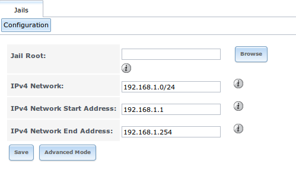

.. warning:: if you have already installed any :ref:`Plugins`, the "Jail Root", "IPv4 Network", "IPv4 Network Start Address", and "IPv4 Network End Address"
   will automatically be filled in. You should double-check that the pre-configured IP addressing values are appropriate for your jails and will not conflict
   with addresses used by other systems on the network.

Table 13.1a summarizes the fields in this configuration screen. Refer to the text below the table for more details on how to properly configure the "Jail
Root" and network settings.  Some settings are only available in "Advanced Mode". To see these settings, either click the "Advanced Mode" button or configure
the system to always display these settings by checking the box "Show advanced fields by default" in :menuselection:`System --> Advanced`.

**Table 13.1a: Jail Configuration Options**

+----------------------------+---------------+--------------------------------------------------------------------------------+
| **Setting**                | **Value**     | **Description**                                                                |
|                            |               |                                                                                |
|                            |               |                                                                                |
+============================+===============+================================================================================+
| Jail Root                  | browse button | mandatory as you cannot add a jail until this is set                           |
|                            |               |                                                                                |
+----------------------------+---------------+--------------------------------------------------------------------------------+
| IPv4 DHCP                  | checkbox      | check this box if the network has a DHCP server                                |
|                            |               |                                                                                |
+----------------------------+---------------+--------------------------------------------------------------------------------+
| IPv4 Network               | string        | only available in "Advanced Mode"; format is IP address of *network/CIDR mask* |
|                            |               |                                                                                |
+----------------------------+---------------+--------------------------------------------------------------------------------+
| IPv4 Network Start Address | string        | only available in "Advanced Mode"; input the first IP address in the           |
|                            |               | reserved range in the format *host/CIDR mask*                                  |
|                            |               |                                                                                |
+----------------------------+---------------+--------------------------------------------------------------------------------+
| IPv4 Network End Address   | string        | only available in "Advanced Mode"; input the last IP address in the reserved   |
|                            |               | range in the format *host/CIDR mask*                                           |
|                            |               |                                                                                |
+----------------------------+---------------+--------------------------------------------------------------------------------+
| IPv6 Autoconfigure         | checkbox      | check this box if the network has a DHCPv6 server and you plan to use          |
|                            |               | IPv6 to access jails                                                           |
|                            |               |                                                                                |
+----------------------------+---------------+--------------------------------------------------------------------------------+
| IPv6 Network               | string        | only available in "Advanced Mode"; input the network address                   |
|                            |               | for a properly configured IPv6 network                                         |
+----------------------------+---------------+--------------------------------------------------------------------------------+
| IPv6 Network Start Address | string        | only available in "Advanced Mode"; input the first IP address in the reserved  |
|                            |               | range for a properly configured IPv6 network                                   |
+----------------------------+---------------+--------------------------------------------------------------------------------+
| IPv6 Network End Address   | string        | only available in "Advanced Mode"; input the last IP address in the reserved   |
|                            |               | range for a properly configured IPv6 network                                   |
+----------------------------+---------------+--------------------------------------------------------------------------------+
| Collection URL             | string        | only available in "Advanced Mode"; changing the default may break the          |
|                            |               | ability to install jails                                                       |
+----------------------------+---------------+--------------------------------------------------------------------------------+

When selecting the "Jail Root", ensure that the size of the selected volume or dataset is sufficient to hold the number of jails to be installed as well
as any software, log files, and data to be stored within each jail. At a bare minimum, budget at least 2GB per jail and do not select a dataset that is less
than 2GB in size.

.. note:: if you plan to add storage to a jail, be aware that the path size is limited to 88 characters. Make sure that the length of your volume name plus the
   dataset name plus the jail name does not exceed this limit.

If the network contains a DHCP server, it is recommended to check the box "IPv4 DHCP" (or "IPv6 Autoconfigure, for a properly configured IPv6 network). This
will prevent IP address conflicts on the network as the DHCP server will automatically assign the jail the next available lease and record the lease as in
use.

If a static IP address is needed so that users always know the IP address of the jail, input the start and end address for the IPv4 and/or IPv6 network. The
range that you define by the start and end addresses will be automatically assigned as you create jails. For example, if you plan to create 5 jails on the
192.168.1.0 network, you could input a "IPv4 Network Start Address" of 
*192.168.1.100* and a "IPv4 Network End Address" of
*192.168.1.104*.
**If you create a start and end range on a network that contains a DHCP server, it is very important that you also reserve those addresses on the DHCP server.**
Otherwise, the DHCP server will not be aware that those addresses are being used by jails and there will be IP address conflicts and weird networking errors
on the network. When troubleshooting jails that do not install or which are unavailable, double-check that the IP address being used by the jail is not also
being used by another jail or system in the network.

FreeNAS® will automatically detect and display the "IPv4 Network" that the administrative interface is connected to. This setting is important as the IPv4 as
the IP address(es) used by your jails must be :command:`ping` able from the FreeNAS® system in order for your jails and any installed software to be
accessible. If your network topology requires you to change the default value, you will also need to configure a default gateway, and possibly a static route, to the specified network. If you
change this value, ensure that the subnet mask value is correct as an incorrect mask can make the IP network unreachable. When in doubt, keep the default
setting for "IPv4 Network". If you are using VMware, make sure that the vswitch is set to "promiscuous mode".

Once you click the "Save" button to save the configuration, you are now ready to create and manage jails as described in the rest of this chapter.

.. index:: Add Jail, New Jail, Create Jail
.. _Adding Jails:

Adding Jails
------------

To create a jail, click :menuselection:`Jails --> Add Jail` to access the screen shown in Figure 13.2a.

.. note:: the "Add Jail" menu item will not appear until after you configure :menuselection:`Jails --> Configuration`.

**Figure 13.2a: Creating a Jail**

|jails3a.png|

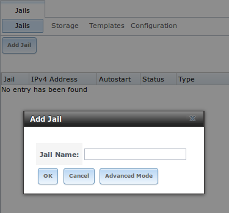

By default, the only required value to create a jail is to give it a name. The default is to create a FreeBSD jail.

Table 13.2a summarizes the available options. Most settings are only available in "Advanced Mode" and are not needed if the intent is to create a FreeBSD
jail. To see these settings, either click the "Advanced Mode" button or configure the system to always display these settings by checking the box "Show
advanced fields by default" in :menuselection:`System --> Advanced`.

**Table 13.2a: Jail Configuration Options**

+---------------------------+----------------+--------------------------------------------------------------------------------------------------------------+
| **Setting**               | **Value**      | **Description**                                                                                              |
|                           |                |                                                                                                              |
|                           |                |                                                                                                              |
+===========================+================+==============================================================================================================+
| Jail Name                 | string         | mandatory; can only contain letters and numbers                                                              |
|                           |                |                                                                                                              |
+---------------------------+----------------+--------------------------------------------------------------------------------------------------------------+
| Template                  | drop-down menu | only available in "Advanced Mode"; contains the *VirtualBox* template for creating an instance of            |
|                           |                | phpVirtualBox; advanced users can create and install custom templates as described in                        |
|                           |                | `Managing Jail Templates`_                                                                                   |
|                           |                |                                                                                                              |
+---------------------------+----------------+--------------------------------------------------------------------------------------------------------------+
| IPv4 DHCP                 | checkbox       | only available in "Advanced Mode"; if unchecked, make sure that the defined address does not conflict with   |
|                           |                | the DHCP server's pool of available addresses                                                                |
|                           |                |                                                                                                              |
+---------------------------+----------------+--------------------------------------------------------------------------------------------------------------+
| IPv4 address              | integer        | only available in "Advanced Mode"; this and the other IPv4 settings will be greyed out if "IPv4 DHCP" is     |
|                           |                | checked; input IP address that is reachable within the local network and is not in use by any other host in  |
|                           |                | the network                                                                                                  |
|                           |                |                                                                                                              |
+---------------------------+----------------+--------------------------------------------------------------------------------------------------------------+
| IPv4 netmask              | drop-down menu | only available in "Advanced Mode"; select the subnet mask associated with "IPv4 address"                     |
|                           |                |                                                                                                              |
|                           |                |                                                                                                              |
+---------------------------+----------------+--------------------------------------------------------------------------------------------------------------+
| IPv4 bridge address       | integer        | only available in "Advanced Mode" and will be greyed out if "VIMAGE" is unchecked; see NOTE below            |
|                           |                |                                                                                                              |
+---------------------------+----------------+--------------------------------------------------------------------------------------------------------------+
| IPv4 bridge netmask       | drop-down menu | only available in "Advanced Mode"; select the subnet mask associated with "IPv4 bridge address"; will be     |
|                           |                | greyed if "VIMAGE" is unchecked                                                                              |
|                           |                |                                                                                                              |
+---------------------------+----------------+--------------------------------------------------------------------------------------------------------------+
| IPv4 default gateway      | string         | only available in "Advanced Mode"; will be greyed out if "VIMAGE" is unchecked                               |
|                           |                |                                                                                                              |
+---------------------------+----------------+--------------------------------------------------------------------------------------------------------------+
| IPv6 Autoconfigure        | checkbox       | only available in "Advanced Mode"; if unchecked, make sure that the defined address does not conflict with   |
|                           |                | the DHCP server's pool of available addresses                                                                |
|                           |                |                                                                                                              |
+---------------------------+----------------+--------------------------------------------------------------------------------------------------------------+
| IPv6 address              | integer        | only available in "Advanced Mode"; this and the other IPv6 settings will be greyed out if "IPv6              |
|                           |                | Autoconfigure" is checked; input IPv6 address that is reachable within the local network and is not in use   |
|                           |                | by any other host in the network                                                                             |
|                           |                |                                                                                                              |
+---------------------------+----------------+--------------------------------------------------------------------------------------------------------------+
| IPv6 prefix length        | drop-down menu | only available in "Advanced Mode"; select the prefix length associated with "IPv6 address"                   |
|                           |                |                                                                                                              |
+---------------------------+----------------+--------------------------------------------------------------------------------------------------------------+
| IPv6 bridge address       | integer        | only available in "Advanced Mode" and will be greyed if "VIMAGE" is unchecked; see NOTE below                |
|                           |                |                                                                                                              |
+---------------------------+----------------+--------------------------------------------------------------------------------------------------------------+
| IPv6 bridge prefix length | drop-down menu | only available in "Advanced Mode" and will be greyed out if "VIMAGE" is unchecked; select the prefix length  |
|                           |                | associated with "IPv6 address"                                                                               |
|                           |                |                                                                                                              |
+---------------------------+----------------+--------------------------------------------------------------------------------------------------------------+
| IPv6 default gateway      | string         | only available in "Advanced Mode" and will be greyed if "VIMAGE" is unchecked; used to set the jail's        |
|                           |                | default gateway IPv6 address                                                                                 |
|                           |                |                                                                                                              |
+---------------------------+----------------+--------------------------------------------------------------------------------------------------------------+
| MAC                       | string         | only available in "Advanced Mode" and will be greyed out if "VIMAGE" is unchecked; if a static MAC address   |
|                           |                | is needed, input it here                                                                                     |
|                           |                |                                                                                                              |
+---------------------------+----------------+--------------------------------------------------------------------------------------------------------------+
| NIC                       | drop-down menu | only available in "Advanced Mode" and will be greyed out if "VIMAGE" is checked; can be used to specify      |
|                           |                | the interface to use for jail connections                                                                    |
|                           |                |                                                                                                              |
+---------------------------+----------------+--------------------------------------------------------------------------------------------------------------+
| Sysctls                   | string         | only available in "Advanced Mode"; comma-delimited list of sysctls to set inside jail (e.g.                  |
|                           |                | *allow.sysvipc=1,allow.raw_sockets=1*)                                                                       |
|                           |                |                                                                                                              |
+---------------------------+----------------+--------------------------------------------------------------------------------------------------------------+
| Autostart                 | checkbox       | only available in "Advanced Mode"; uncheck if you want to start the jail manually                            |
|                           |                |                                                                                                              |
+---------------------------+----------------+--------------------------------------------------------------------------------------------------------------+
| VIMAGE                    | checkbox       | only available in "Advanced Mode"; gives a jail its own virtualized network stack; requires promiscuous mode |
|                           |                | to be enabled on the interface                                                                               |
|                           |                |                                                                                                              |
+---------------------------+----------------+--------------------------------------------------------------------------------------------------------------+
| NAT                       | checkbox       | only available in "Advanced Mode" and will be greyed out for Linux jails or if "VIMAGE" is unchecked;        |
|                           |                | enables Network Address Translation for the jail                                                             |
|                           |                |                                                                                                              |
+---------------------------+----------------+--------------------------------------------------------------------------------------------------------------+

.. note:: the IPv4 and IPv6 bridge interface is used to bridge the
   `epair(4) <http://www.freebsd.org/cgi/man.cgi?query=epair>`_
   device, which is automatically created for each started jail, to a physical network device. The default network device is the one that is configured with a
   default gateway. So, if *em0* is the FreeBSD name of the physical interface and three jails are running, the following virtual interfaces will be
   automatically created: *bridge0*,
   *epair0a*,
   *epair1a*, and
   *epair2a.* The physical interface
   *em0* will be added to the bridge, as well as each epair device. The other half of the epair will be placed inside the jail and will be assigned the IP
   address specified for that jail. The bridge interface will be assigned an alias of the default gateway for that jail, if configured, or the bridge IP, if
   configured; either is correct. 
   
   The only time you need to specify an address and mask for the bridge is when you need to configure the jail to be on a different network than the
   FreeNAS® system. For example, if the FreeNAS® system is on the *10.0.0.0/24* network and the jail needs to be configured for the
   *192.168.0.0/24* network, set the "IPv4 bridge address" and "IPv4 bridge netmask" fields for the jail.

If you uncheck both the "VIMAGE" and "NAT" boxes, the jail must be configured with an IP address within the same network as the interface it is bound to, and
that address will be assigned as an alias on that interface. To use a "VIMAGE" jail on the same subnet, uncheck "NAT" and configure an IP address within the
same network. In both of these cases, you only configure an IP address and do not configure a bridge or a gateway address.

After making your selections, click the "OK" button. The jail will be created and will be added to the "Jails" tab as well as in the tree menu under "Jails".
By default, the jail will automatically start, unless you specify otherwise by unchecking the "Autostart" box.

The first time you add a jail or use a template, the GUI will automatically download the necessary components from the Internet. If it is unable to connect to
the Internet, the jail creation will fail. Otherwise, a progress bar will indicate the status of the download and provide an estimated time for the process to
complete. Once the first jail is created, or a template used, subsequent jails will be added instantaneously as the downloaded base for creating the jail is
saved to the "Jail Root".

.. _Managing Jails:

Managing Jails
~~~~~~~~~~~~~~

To view and configure the added jails, click "Jails". In the example shown in Figure 13.2b, the list entry for the jail named *freebsd1* has been clicked in
order to enable that jail's configuration options. The entry indicates the name of the jail, its IP address, whether or not it will start automatically at
system boot, whether or not it is currently running, and the type of jail (e.g. *standard* indicates that it is a FreeBSD jail whereas
*pluginjail* would indicate that it was installed using :ref:`Plugins`).

**Figure 13.2b: Viewing Added Jails**

|jails4a.png|

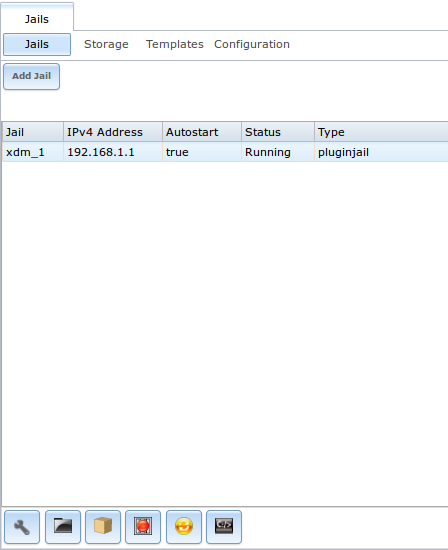

In order, from left to right, the following configuration icons are available:

**Edit Jail:** used to edit the jail's settings which were described in Table 13.2a. Note that once a jail is created, the jail's name and type cannot be
changed so these fields will be greyed out.

.. note:: if you need to modify the IP address information for a jail, use it's "Edit Jail" button instead of the associated networking commands from the
   command line of the jail.

**Add Storage:** used to configure the jail to access an area of storage as described in :ref:`Add Storage`.

**Upload Plugin:** used to manually upload a plugin previously downloaded from the `plugins repository <http://download.freenas.org/plugins/9/x64/>`_.

**Start/Stop:** this icon will vary, depending upon the current "Status" of the jail. If the jail is currently stopped, the icon will be green and can be used
to start the jail. If the jail is currently running, the icon will be red and can be used to stop the jail. A stopped jail and its applications are
inaccessible until it is restarted.

**Restart:** used to restart the jail.

**Shell:** used to access a *root* command prompt in order to configure the selected jail from the command line. When finished, type :command:`exit` to close
the shell.

.. _Accessing a Jail Using SSH:

Accessing a Jail Using SSH
^^^^^^^^^^^^^^^^^^^^^^^^^^

If you prefer to use :command:`ssh` to access a jail instead of the jail's "Shell" icon, you will need to first start the :command:`ssh` service and create a
user account for :command:`ssh` access. To do this, click the "Shell" icon for the jail you wish to configure :command:`ssh` access to.

To start the SSH service, look for the following line in that jail's :file:`/etc/rc.conf`::

 sshd_enable="NO"

Change the *NO* to
*YES* and save the file. Then, start the SSH daemon::

 service sshd start

The jail's RSA key pair should be generated and the key's fingerprint and random art image displayed.

Next, add a user account. If you want the user to have superuser privileges, make sure the user is placed in the *wheel* group when it is created. Type
:command:`adduser` and follow the prompts. When you get to this prompt, **do not** press :kbd:`Enter` but instead type
*wheel*::

 Login group is user1. Invite user1 into other groups? []: wheel

Once the user is created, set the *root* password so that the new user will be able to use the :command:`su` command to gain superuser privilege. To set the
password, type :command:`passwd` then input and confirm the desired password.

Finally, test from another system that the user can successfully :command:`ssh` in and become the superuser. In this example, a user named *user1* uses
:command:`ssh` to access the jail at 192.168.2.3. The first time the user logs in, they will be asked to verify the fingerprint of the host::

 ssh user1@192.168.2.3
 The authenticity of host '192.168.2.3 (192.168.2.3)' can't be established.
 RSA key fingerprint is 6f:93:e5:36:4f:54:ed:4b:9c:c8:c2:71:89:c1:58:f0.
 Are you sure you want to continue connecting (yes/no)? yes
 Warning: Permanently added '192.168.2.3' (RSA) to the list of known hosts.
 Password: type_password_here

.. note:: each jail has its own user accounts and service configuration. This means that you will need to repeat these steps for each jail that requires SSH
   access.

.. _Add Storage:

Add Storage
^^^^^^^^^^^

It is possible to give a FreeBSD jail access to an area of storage on the FreeNAS® system. This is useful if you install an application that stores a large
amount of data or if an installed application needs access to the data stored on the FreeNAS® system. An example would be transmission, which stores
torrents. The storage is added using the
`mount_nullfs(8) <http://www.freebsd.org/cgi/man.cgi?query=mount_nullfs>`_
mechanism which links data that resides outside of the jail as a storage area within the jail.

To add storage, click the "Add Storage" button for a highlighted jail's entry to open the screen shown in Figure 13.2c. This screen can also be accessed by
expanding the jail's name in the tree view and clicking :menuselection:`Storage --> Add Storage`.

**Figure 13.2c: Adding Storage to a Jail**

|jails5.png|

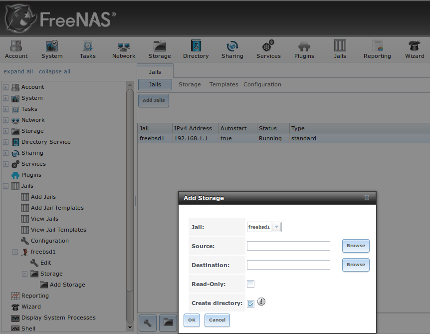

Browse to the "Source" and "Destination", where:

* **Source:** is the directory or dataset on the FreeNAS® system you would like to gain access to from the jail. This directory
  **must**  reside outside of the volume or dataset being used by the jail. This is why it is recommended to create a separate dataset to store jails, so that
  the dataset holding the jails will always be separate from any datasets used for storage on the FreeNAS® system.

* **Destination:** select the directory within the jail which will be linked to the "Source" storage area.

When you are adding storage, it is typically because the user and group account associated with an application installed inside of a jail needs to access data
stored on the FreeNAS® system. Before selecting the "Source", it is important to first ensure that the permissions of the selected directory or dataset grant
permission to the user/group account inside of the jail. This is typically not the default, as the users and groups created inside of a jail are totally
separate from the users and groups of the FreeNAS® system.

This means that the workflow for adding storage is usually as follows:

#.  Determine the name of the user and group account used by the application. For example, the installation of the transmission application automatically
    creates a user account named *transmission* and a group account named
    *transmission*. When in doubt, check the files :file:`/etc/passwd` (to find the user account) and :file:`/etc/group` (to find the group account) inside of
    the jail. Typically, the user and group names are similar to the application name. Also, the UID and GID are usually the same as the port number used by
    the service.

#.  On the FreeNAS® system, create a user account and group account to match the name of the user and group used by the application in the jail.

#.  On the FreeNAS® system, determine if you want the jail to have access to existing data or if you want to set aside an area of storage for the jail to
    use.

#.  If the jail should access existing data, edit the permissions of the volume or dataset so that the user and group account has the desired read and write
    access. If multiple applications or jails are to have access to the same data, you will need to create a separate group and add each needed user account
    to that group.

#.  If you are instead setting aside an area of storage for that jail (or individual application), create a dataset. Then, edit the permissions of that
    dataset so that the user and group account has the desired read and write access.

#.  Use the "Add Storage" button of the jail and select the configured volume/dataset as the "Source".

If you wish to prevent writes to the storage, check the box "Read-Only".

By default, the "Create directory" box is checked. This means that the directory will automatically be created for you under the specified "Destination" path
if the directory does not already exist.

Once a storage has been added, it will be added to the tree under the specified jail. In the example shown in Figure 13.2d, a dataset named 
:file:`volume1/data` has been chosen as the "Source" as it contains the files stored on the FreeNAS® system. When the storage was created, the user browsed
to :file:`volume1/jails/freebsd1/usr/local` in the "Destination" field, then typed in *test* as the directory. Since this directory did not already exist,
it was created as the "Create directory" box was left as checked. The resulting storage was added to the *freenas1* entry in the tree as
:file:`/usr/local/test`. The user has clicked this :file:`/usr/local/test` entry in order to access its "Edit" screen.

**Figure 13.2d: Example Storage**

|jails6.png|

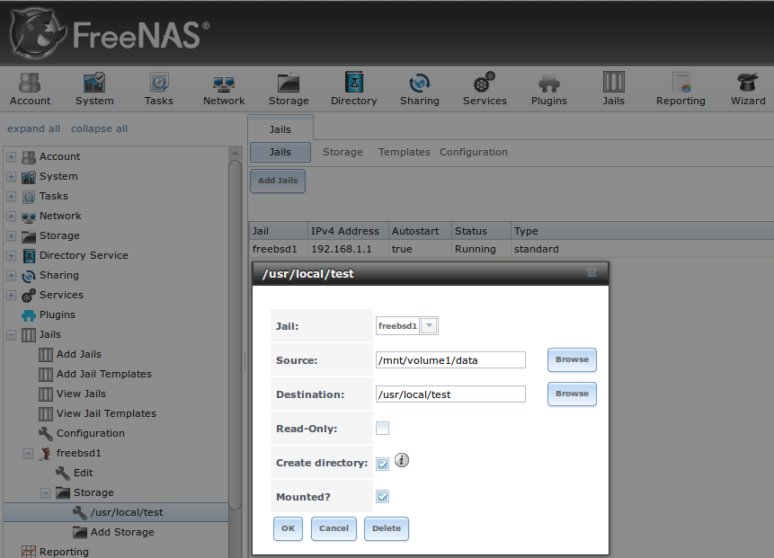

By default, the storage is mounted as it is created. To unmount the storage, uncheck its "Mounted?" box.

.. note:: a mounted dataset will not automatically mount any of its child datasets. While the child datasets may appear browsable inside the jail, any changes
   will not be visible. Since each dataset is considered to be its own filesystem, each child dataset must have its own mount point, meaning that you need to
   create a separate storage for any child datasets which need to be mounted.

To delete the storage, click its "Delete" button.

.. warning:: it is important to realize that an added storage is really just a pointer to the selected storage directory on the FreeNAS® system. It does
   **not** create a copy of that data within the jail.
   **This means that if you delete any files from the "Destination" directory located in the jail, you are really deleting those files from the "Source" directory located on the FreeNAS® system.**
   However, if you delete the storage, you are only deleting the pointer, not the data itself.

.. _Installing FreeBSD Packages:

Installing FreeBSD Packages
~~~~~~~~~~~~~~~~~~~~~~~~~~~

The quickest and easiest way to install software inside the jail is to install a FreeBSD package. A FreeBSD package is pre-compiled, meaning that it contains
all the binaries and dependencies required for the software to run on a FreeBSD system.

A lot of software has been ported to FreeBSD (currently over 24,000 applications) and most of that software is available as a package. One way to find FreeBSD
software is to use the searchbar at
`FreshPorts.org <http://freshports.org/>`_.

Once you have located the name of the package you would like to install, use the :command:`pkg install` command to install it. For example, to install the
audiotag package, use this command::

 pkg install audiotag

When prompted, type **y** to complete the installation. The installation messages will indicate if the package and its dependencies successfully download and
install.

.. warning:: **do not** use the :command:`pkg_add` command in a FreeNAS® jail as it will cause inconsistencies in your package management database.

You can confirm that the installation was successful by querying the package database::

 pkg info -f audiotag
 audiotag-0.19_1
 Name:		 audiotag
 Version:	 0.19_1
 Installed on:   Fri Nov 21 10:10:34 PST 2014
 Origin:	 audio/audiotag
 Architecture:	 freebsd:9:x86:64
 Prefix:	 /usr/local
 Categories:	 multimedia audio
 Licenses:	 GPLv2
 Maintainer:	 ports@FreeBSD.org
 WWW:		 http://github.com/Daenyth/audiotag
 Comment:	 Command-line tool for mass tagging/renaming of audio files
 Options:
   DOCS:	 on
   FLAC:	 on
   ID3:		 on
   MP4:		 on
   VORBIS:	 on
 Annotations:
   repo_type:    binary
   repository:   FreeBSD
 Flat size:	 62.8KiB
 Description:	Audiotag is a command-line tool for mass tagging/renaming of audio files
		it supports the vorbis comment, id3 tags, and MP4 tags.
 WWW:		http://github.com/Daenyth/audiotag

To see what was installed with the package::

 pkg info -l audiotag
 audiotag-0.19_1:
 /usr/local/bin/audiotag
 /usr/local/share/doc/audiotag/COPYING
 /usr/local/share/doc/audiotag/ChangeLog
 /usr/local/share/doc/audiotag/README
 /usr/local/share/licenses/audiotag-0.19_1/GPLv2
 /usr/local/share/licenses/audiotag-0.19_1/LICENSE
 /usr/local/share/licenses/audiotag-0.19_1/catalog.mk

In FreeBSD, third-party software is always stored in :file:`/usr/local` to differentiate it from the software that came with the operating system. Binaries
are almost always located in a subdirectory called :file:`bin` or :file:`sbin` and configuration files in a subdirectory called :file:`etc`.

.. _Compiling FreeBSD Ports:

Compiling FreeBSD Ports
~~~~~~~~~~~~~~~~~~~~~~~

Typically, software is installed into a FreeBSD jail using packages. Occasionally you may prefer to compile the port yourself. Compiling the port offers the
following advantages:

* Not every port has an available package. This is usually due to licensing restrictions or known, unaddressed security vulnerabilities.

* Sometimes the package is out-of-date and you need a feature that became available in the newer version.

* Some ports provide compile options that are not available in the pre-compiled package. These options are used to add additional features or to strip out
  the features you do not need.

Compiling the port yourself has the following dis-advantages:

* It takes time. Depending upon the size of the application, the amount of dependencies, the amount of CPU and RAM on the system, and the current load on
  the FreeNAS® system, the amount of time can range from a few minutes to a few hours or even to a few days.

.. note:: if the port doesn't provide any compile options, you are better off saving your time and the FreeNAS® system's resources by using the
   :command:`pkg install` command instead.

You can determine if the port has any configurable compile options by clicking its FreshPorts listing. Figure 13.2e shows the "Configuration Options"
for audiotag.

**Figure 13.2e: Configuration Options for Audiotag**

|ports1.png|

.. |ports1.png| image:: images/ports1.png

In FreeBSD, a :file:`Makefile` is used to provide the compiling instructions to the :command:`make` command. The :file:`Makefile` is in ascii text, fairly
easy to understand, and documented in
`bsd.port.mk <http://www.freebsd.org/cgi/cvsweb.cgi/ports/Mk/bsd.port.mk?rev=1.708;content-type=text%2Fplain>`_.

If the port has any configurable compile options, they will be listed at FreshPorts in the port's "Configuration Options". This port contains five
configurable options (DOCS, FLAC, ID3, MP4, and VORBIS) and each option is enabled (on) by default.

FreeBSD packages are always built using the default options. When you compile the port yourself, those options will be presented to you in a menu, allowing
you to change their default settings.

Before you can compile a port, the ports collection must be installed within the jail. From within the jail, use the :command:`portsnap` utility. This command
will download the ports collection and extract it to the jail's :file:`/usr/ports/` directory::

 portsnap fetch extract

.. note:: if you install additional software at a later date, you should make sure that the ports collection is up-to-date using by typing
   :command:`portsnap fetch update`.

To compile a port, you will :command:`cd` into a subdirectory of :file:`/usr/ports/`. The entry for the port at FreshPorts provides the location to
:command:`cd` into and the :command:`make` command to run. This example will compile the audiotag port::

 cd /usr/ports/audio/audiotag
 make install clean

Since this port has configurable options, the first time this command is run the configure screen shown in Figure 13.2f will be displayed:

**Figure 13.2f: Configuration Options for Audiotag Port**

|ports2.png|

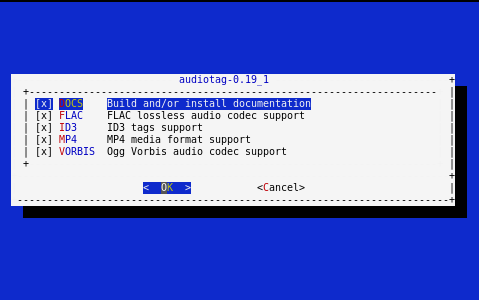

To change an option's setting, use the arrow keys to highlight the option, then press the :kbd:`spacebar` to toggle the selection. Once you are finished, tab
over to OK and press :kbd:`Enter`. The port will begin to compile and install.

.. note:: if you change your mind, the configuration screen will not be displayed again should you stop and restart the build. Type
   :command:`make config && make install clean` if you need to change your selected options.

If the port has any dependencies with options, their configuration screens will be displayed and the compile will pause until it receives your input. It is a
good idea to keep an eye on the compile until it finishes and you are returned to the command prompt.

Once the port is installed, it is registered in the same package database that manages packages. This means that you can use :command:`pkg info` to determine
what was installed, as described in the previous section.

.. _Starting Installed Software:

Starting Installed Software
~~~~~~~~~~~~~~~~~~~~~~~~~~~

Once the package or port is installed, you will need to configure and start it. If you are familiar with how to configure the software, look for its
configuration file in :file:`/usr/local/etc` or a subdirectory thereof. Many FreeBSD packages contain a sample configuration file to get you started. If you
are unfamiliar with the software, you will need to spend some time at the software's website to learn which configuration options are available and which
configuration file(s) need to be edited.

Most FreeBSD packages that contain a startable service include a startup script which is automatically installed to :file:`/usr/local/etc/rc.d/`. Once your
configuration is complete, you can test that the service starts by running the script with the :command:`onestart` option. As an example, if openvpn is
installed into the jail, these commands will run its startup script and verify that the service started::

 /usr/local/etc/rc.d/openvpn onestart
 Starting openvpn.

 /usr/local/etc/rc.d/openvpn onestatus
 openvpn is running as pid 45560.

 sockstat -4
 USER	COMMAND		PID	FD	PROTO	LOCAL ADDRESS	FOREIGN ADDRESS
 root	openvpn		48386 	4	udp4	*:54789		*:*

If you instead receive an error::

 /usr/local/etc/rc.d/openvpn onestart
 Starting openvpn.
 /usr/local/etc/rc.d/openvpn: WARNING: failed to start openvpn

Run :command:`tail /var/log/messages` to see if any error messages hint at the problem. Most startup failures are related to a mis-configuration: either a
typo or a missing option in a configuration file.

Once you have verified that the service starts and is working as intended, add a line to :file:`/etc/rc.conf` to ensure that the service automatically starts
whenever the jail is started. The line to start a service always ends in *enable="YES"* and typically starts with the name of the software. For example, this
is the entry for the openvpn service::

 openvpn_enable="YES"

When in doubt, the startup script will tell you which line to put in :file:`/etc/rc.conf`. This is the description in :file:`/usr/local/etc/rc.d/openvpn`:

::

 # This script supports running multiple instances of openvpn.
 # To run additional instances link this script to something like
 # % ln -s openvpn openvpn_foo

 # and define additional openvpn_foo_* variables in one of
 # /etc/rc.conf, /etc/rc.conf.local or /etc/rc.conf.d /openvpn_foo

 #
 # Below NAME should be substituted with the name of this script. By default
 # it is openvpn, so read as openvpn_enable. If you linked the script to
 # openvpn_foo, then read as openvpn_foo_enable etc.
 #
 # The following variables are supported (defaults are shown).
 # You can place them in any of
 # /etc/rc.conf, /etc/rc.conf.local or /etc/rc.conf.d/NAME
 #
 # NAME_enable="NO"
 # set to YES to enable openvpn

The startup script will also indicate if any additional parameters are available::

 # NAME_if=
 # driver(s) to load, set to "tun", "tap" or "tun tap"
 #
 # it is OK to specify the if_ prefix.
 #
 # # optional:
 # NAME_flags=
 # additional command line arguments
 # NAME_configfile="/usr/local/etc/openvpn/NAME.conf"
 # --config file
 # NAME_dir="/usr/local/etc/openvpn"
 # --cd directory

.. index:: phpVirtualBox Template, VirtualBox Template, VirtualBox Jail
.. _Using the phpVirtualBox Template:

Using the phpVirtualBox Template
--------------------------------

If the software you need requires a different operating system or you wish to use a non-FreeBSD operating system to manage software, use the VirtualBox
template to create an instance of phpVirtualBox. In the "Add Jail" screen, click the "Advanced Mode" button. As seen in the example in Figure 13.3a, input a
"Jail Name", verify that the "IPv4 address" is valid and not in use by another host or jail, and select *VirtualBox* from the "Template" drop-down menu. Press
the "OK" button to begin the installation.

**Figure 13.3a: Creating a phpVirtualBox Instance**

|jails7.png|

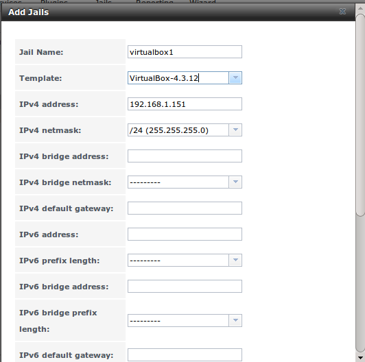

Once installed, input the IP address of the VirtualBox jail into a web browser and enter the username and password of *admin* into the login screen. Once
authenticated, the screen shown in Figure 13.3b will appear in the web browser.

**Figure 13.3b: The phpVirtualBox Interface**

|jails8.png|

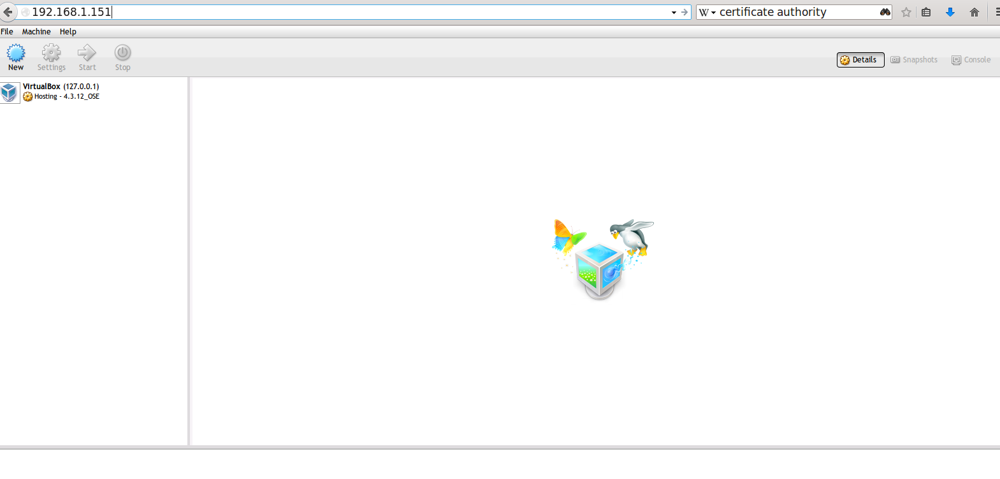

Click the "New" button to create virtual machines. You can then install the desired operating systems and software into the created virtual machines.

.. note:: if the FreeNAS® system reboots, the installed virtual machines will not automatically restart. To configure auto-start, refer to this 
   `forum post <https://forums.freenas.org/index.php?threads/enabling-autostart-of-virtualbox-vms-on-freenas.26503/>`_.

.. _Managing Jail Templates:

Managing Jail Templates
-----------------------

FreeNAS® 9.3 supports the ability to add custom templates to the "Templates" drop-down menu described in Table 13.2a.

By default, FreeNAS® provides the *VirtualBox* template. To view the default and any customized templates, click :menuselection:`Jails --> Templates`. A
listing showing the default template is seen in Figure 13.4a.

**Figure 13.4a: Listing of Default Jail Templates**

|jails9.png|

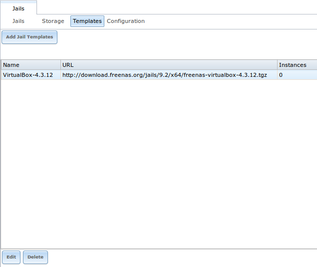

The listing contains the following columns:

* **Name:** will appear in the "Template" drop-down menu when adding a new jail.

* **URL:** when adding a new jail using this template, the template will be downloaded from this location.

* **Instances:** indicates if the template has been used to create a jail. In this example, the template has not yet been used so its "Instances" shows as
  *0*. 

To create a custom template, first install the desired operating system and configure it the way you want. The installation can be either to an existing jail
or on another system.

Once your configuration is complete, create a tarball of the entire operating system that you wish to use as a template. This tarball needs to be compressed
with :command:`gzip` and end in a :file:`.tgz` extension. Be careful when creating the tarball as you don't want to end up in a recursive loop. In other
words, the resulting tarball needs to be saved outside of the operating system being tarballed, such as to an external USB drive or network share.
Alternately, you can create a temporary directory within the operating system and use the *--exclude* switch to :command:`tar` to exclude this directory from
the tarball. The exact :command:`tar` command to use will vary, depending upon the operating system being used to create the tarball.

Once you have the :file:`.tgz` file for the operating system, save it to either an FTP share or an HTTP server. You will need the associated FTP or HTTP URL
in order to add the template to the list of available templates.

To add the template, click :menuselection:`Jails --> Templates --> Add Jail Templates` which will open the screen seen in Figure 13.4b.

**Figure 13.4b: Adding A Custom Jail Template**

|jails11.png|

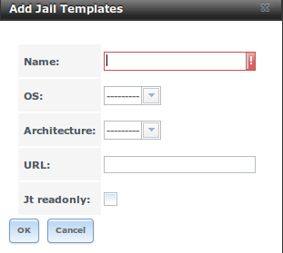

Table 13.4a summarizes the fields in this screen.

**Table 13.4a: Jail Template Options**

+--------------+----------------+-----------------------------------------------------------------------------------------------+
| **Setting**  | **Value**      | **Description**                                                                               |
|              |                |                                                                                               |
+==============+================+===============================================================================================+
| Name         | string         | value will appear in the "Name" column of "View Jail Templates"                               |
|              |                |                                                                                               |
+--------------+----------------+-----------------------------------------------------------------------------------------------+
| OS           | drop-down menu | choices are  *FreeBSD* or                                                                     |
|              |                | *Linux*                                                                                       |
|              |                |                                                                                               |
|              |                |                                                                                               |
+--------------+----------------+-----------------------------------------------------------------------------------------------+
| Architecture | drop-down menu | choices are *x86* or                                                                          |
|              |                | *x64*;                                                                                        |
|              |                | *x86* is required if                                                                          |
|              |                | *Linux* is selected                                                                           |
|              |                |                                                                                               |
+--------------+----------------+-----------------------------------------------------------------------------------------------+
| URL          | string         | input the full URL to the :file:`.tgz` file, including the protocol (*ftp://* or              |
|              |                | or *http://*)                                                                                 |
|              |                |                                                                                               |
+--------------+----------------+-----------------------------------------------------------------------------------------------+
| Jt readonly  | checkbox       | if this box is checked, the "Name" and "URL" of the template cannot be changed after creation |
|              |                |                                                                                               |
+--------------+----------------+-----------------------------------------------------------------------------------------------+

Once a template has been added, you can click the entry for the template to access its "Edit" and "Delete" buttons. If you click a template's "Edit" button,
it will open the configuration screen shown in the Figure 13.4c.

.. note:: the "Delete" button is not available for the built-in *VirtualBox* template and its "Edit" button opens as read-only.

**Figure 13.4c: Editing a Template's Options**

|jails10.png|

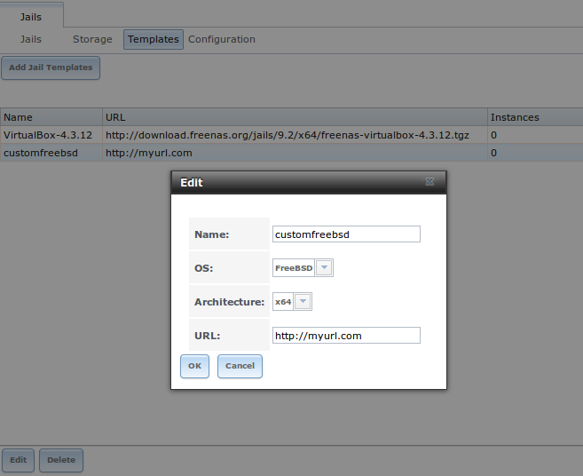

If you click a template's "Delete" button, a warning message will prompt you to confirm the deletion. Note that once a template is deleted, it will be removed
from the "Templates" drop-down menu and will be no longer available for creating new jails.
