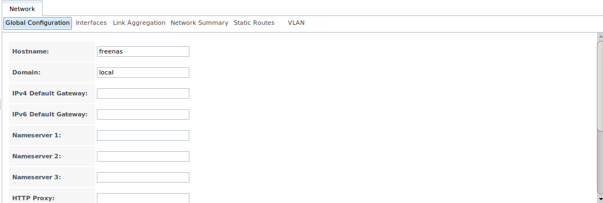
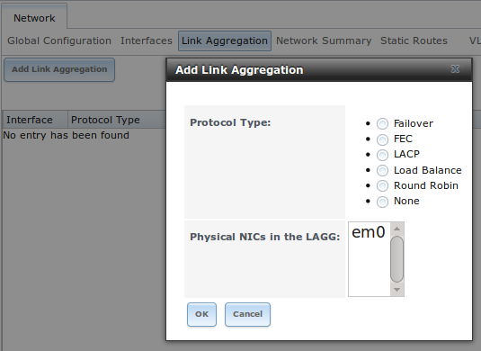
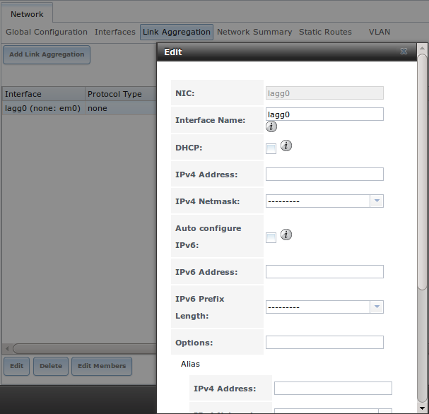
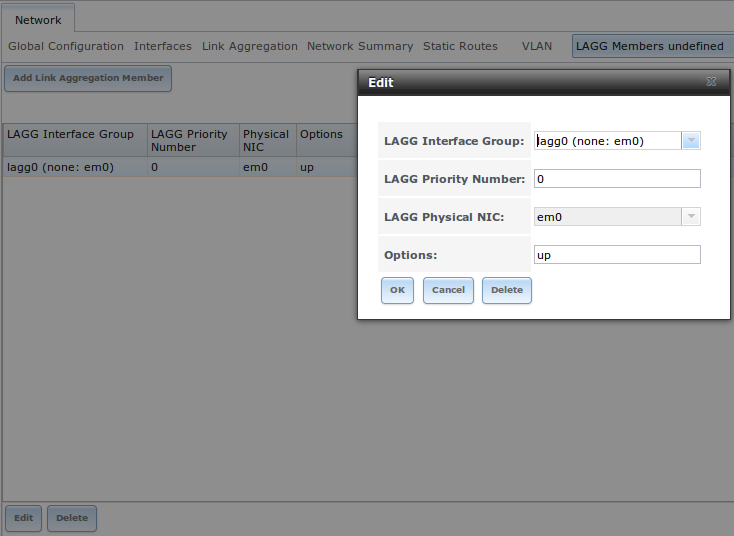

.. index:: Network Settings
.. _Network:

Network
=======

The Network section of the administrative GUI contains the following components for viewing and configuring the FreeNAS® system's network settings:

* :ref:`Global Configuration`: used to to set non-interface specific network settings.

* :ref:`Interfaces`: used to configure a specified interface's network settings.

* :ref:`IPMI`: configures hardware side-band management should the appliance become unavailable through the graphical administrative interface.

* :ref:`Link Aggregations`: used to configure link aggregation and link failover.

* :ref:`Network Summary`: provides an overview of the current network settings.

* :ref:`Static Routes`: used to add static routes.

* :ref:`VLANs`: used to configure IEEE 802.1q tagging.

Each of these is described in more detail in this section.

.. _Global Configuration:

Global Configuration
--------------------

:menuselection:`Network --> Global Configuration`, shown in Figure 7.1a, allows you to set non-interface specific network settings.

**Figure 7.1a: Global Configuration**

|network1.png|

Table 7.1a summarizes the settings that can be configured using the Global Configuration tab. The hostname and domain will be pre-filled for you, as seen in
Figure 7.1a, but can be changed to meet the local network's requirements.

**Table 7.1a: Global Configuration Settings**

+------------------------+------------+----------------------------------------------------------------------------------------------------------------------+
| **Setting**            | **Value**  | **Description**                                                                                                      |
|                        |            |                                                                                                                      |
+========================+============+======================================================================================================================+
| Hostname               | string     | system host name                                                                                                     |
|                        |            |                                                                                                                      |
+------------------------+------------+----------------------------------------------------------------------------------------------------------------------+
| Domain                 | string     | system domain name                                                                                                   |
|                        |            |                                                                                                                      |
+------------------------+------------+----------------------------------------------------------------------------------------------------------------------+
| IPv4 Default Gateway   | IP address | typically not set (see NOTE below)                                                                                   |
|                        |            |                                                                                                                      |
+------------------------+------------+----------------------------------------------------------------------------------------------------------------------+
| IPv6 Default Gateway   | IP address | typically not set (see NOTE below)                                                                                   |
|                        |            |                                                                                                                      |
+------------------------+------------+----------------------------------------------------------------------------------------------------------------------+
| Nameserver 1           | IP address | primary DNS server (typically in Windows domain)                                                                     |
|                        |            |                                                                                                                      |
+------------------------+------------+----------------------------------------------------------------------------------------------------------------------+
| Nameserver 2           | IP address | secondary DNS server                                                                                                 |
|                        |            |                                                                                                                      |
+------------------------+------------+----------------------------------------------------------------------------------------------------------------------+
| Nameserver 3           | IP address | tertiary DNS server                                                                                                  |
|                        |            |                                                                                                                      |
+------------------------+------------+----------------------------------------------------------------------------------------------------------------------+
| HTTP Proxy             | string     | enter the proxy information for the network in the format *http://my.proxy.server:3128* or                           |
|                        |            | *http://user@password:my.proxy.server:3128*                                                                          |
|                        |            |                                                                                                                      |
+------------------------+------------+----------------------------------------------------------------------------------------------------------------------+
| Enable netwait feature | checkbox   | if enabled, network services will not be started at boot time until the interface is able to ping the addresses      |
|                        |            | listed in "Netwait IP list"                                                                                          |
|                        |            |                                                                                                                      |
+------------------------+------------+----------------------------------------------------------------------------------------------------------------------+
| Netwait IP list        | string     | if "Enable netwait feature" is checked, list of IP addresses to ping; otherwise, ping the default gateway            |
|                        |            |                                                                                                                      |
+------------------------+------------+----------------------------------------------------------------------------------------------------------------------+
| Host name database     | string     | used to add one entry per line which will be appended to :file:`/etc/hosts`; use the format                          |
|                        |            | *IP_address space hostname* where multiple hostnames can be used if separated by a space                             |
|                        |            |                                                                                                                      |
+------------------------+------------+----------------------------------------------------------------------------------------------------------------------+

If you will be using Active Directory, set the IP address of the realm's DNS server in the "Nameserver 1" field.

If your network does not have a DNS server or NFS, SSH, or FTP users are receiving "reverse DNS" or timeout errors, add an entry for the IP address of
the FreeNAS® system in the "Host name database" field.

.. note:: in many cases, a FreeNAS® configuration does not include default gateway information as a way to make it more difficult for a remote
   attacker to communicate with the server. While this is a reasonable precaution, such a configuration does **not** restrict inbound traffic from sources
   within the local network. However, omitting a default gateway will prevent the FreeNAS® system from communicating with DNS servers, time servers, and mail
   servers that are located outside of the local network. In this case, it is recommended to add :ref:`Static Routes` in order to reach external DNS, NTP, and
   mail servers which are configured with static IP addresses. If you add a gateway to the Internet, make sure that the FreeNAS® system is protected by a
   properly configured firewall.

.. _Interfaces:

Interfaces
----------

:menuselection:`Network --> Interfaces` is used to view which interfaces have been manually configured, to add a manually configured interface, and to edit an
interface's manual configuration.

.. note:: typically the interface used to access the FreeNAS® administrative GUI is configured by DHCP. This interface will not appear in this screen, even
   though it is already dynamically configured and in use.

Figure 7.2a shows the screen that opens when you click :menuselection:`Interfaces --> Add Interface`. Table 7.2a summarizes the configuration options when you
add an interface or edit an already configured interface. Note that if any changes to this screen require a network restart, the screen will turn red when you
click the "OK" button and a pop-up message will remind you that network connectivity to the FreeNAS® system will be interrupted while the changes are
applied. Click "Yes" to proceed with the network restart or "No" to cancel the operation.

**Figure 7.2a: Adding or Editing an Interface**

|interface.png|

.. |interface.png| image:: images/interface.png
    :width: 3.2in
    :height: 4.2in

**Table 7.2a: Interface Configuration Settings**

+---------------------+----------------+---------------------------------------------------------------------------------------------------------------------+
| **Setting**         | **Value**      | **Description**                                                                                                     |
|                     |                |                                                                                                                     |
+=====================+================+=====================================================================================================================+
| NIC                 | drop-down menu | select the FreeBSD device name; will be a read-only field when editing an interface                                 |
|                     |                |                                                                                                                     |
+---------------------+----------------+---------------------------------------------------------------------------------------------------------------------+
| Interface Name      | string         | description of interface                                                                                            |
|                     |                |                                                                                                                     |
+---------------------+----------------+---------------------------------------------------------------------------------------------------------------------+
| DHCP                | checkbox       | requires static IPv4 or IPv6 configuration if unchecked; note that only one interface can be configured for DHCP    |
|                     |                |                                                                                                                     |
+---------------------+----------------+---------------------------------------------------------------------------------------------------------------------+
| IPv4 Address        | IP address     | set if "DHCP" unchecked                                                                                             |
|                     |                |                                                                                                                     |
+---------------------+----------------+---------------------------------------------------------------------------------------------------------------------+
| IPv4 Netmask        | drop-down menu | set if "DHCP" unchecked                                                                                             |
|                     |                |                                                                                                                     |
+---------------------+----------------+---------------------------------------------------------------------------------------------------------------------+
| Auto configure IPv6 | checkbox       | only one interface can be configured for this option; requires manual configuration if unchecked and wish to use    |
|                     |                | IPv6                                                                                                                |
|                     |                |                                                                                                                     |
+---------------------+----------------+---------------------------------------------------------------------------------------------------------------------+
| IPv6 Address        | IPv6 address   | must be unique on network                                                                                           |
|                     |                |                                                                                                                     |
+---------------------+----------------+---------------------------------------------------------------------------------------------------------------------+
| IPv6 Prefix Length  | drop-down menu | match the prefix used on network                                                                                    |
|                     |                |                                                                                                                     |
+---------------------+----------------+---------------------------------------------------------------------------------------------------------------------+
| Options             | string         | additional parameters from                                                                                          |
|                     |                | `ifconfig(8) <http://www.freebsd.org/cgi/man.cgi?query=ifconfig>`_,                                                 |
|                     |                | separate multiple parameters with a space; for example: *mtu 9000* will increase the MTU for interfaces that        |
|                     |                | support jumbo frames                                                                                                |
|                     |                |                                                                                                                     |
+---------------------+----------------+---------------------------------------------------------------------------------------------------------------------+

This screen also allows you to configure an IP alias for the interface, which allows the interface to be configured with multiple IP addresses. If you wish to
set multiple aliases, click the "Add extra alias" link for each alias you wish to configure. To delete an alias, highlight the interface in the tree to access
its "Edit" screen. Be sure to check the "Delete" checkbox associated with the alias. If you instead click the "Delete" button at the bottom of this screen,
you will delete the whole interface, not just the alias.

When configuring multiple interfaces, they can **not** be members of the same subnet. Check the subnet mask if you receive an error when setting the IP
addresses on multiple interfaces.

When configuring an interface for both IPv4 and IPv6, this screen will not let you set both addresses as primary. In other words, you will get an error if you
fill in both the "IPv4 address" and "IPv6 address" fields. Instead, set one of these address fields and create an alias for the other address.

.. _IPMI:

IPMI
----

Beginning with version 9.2.1, FreeNAS® provides a graphical screen for configuring an IPMI interface. This screen will only appear if the system hardware
includes a Baseboard Management Controller (BMC).

IPMI provides side-band management should the system become unavailable through the graphical administrative interface. This allows for a few vital functions,
such as checking the log, accessing the BIOS setup, and powering on the system without requiring physical access to the system. IPMI can also be used to allow
another person remote access to the system in order to assist with a configuration or troubleshooting issue. Before configuring IPMI, ensure that the
management interface is physically connected to the network. Depending upon the hardware, the IPMI device may share the primary Ethernet interface or it may
be a dedicated IPMI interface.

.. warning:: it is recommended to first ensure that the IPMI has been patched against the Remote Management Vulnerability before enabling IPMI. This
   `article <http://www.ixsystems.com/whats-new/how-to-fix-the-ipmi-remote-management-vulnerability/>`_ provides more information about the vulnerability and
   how to fix it.

IPMI can be configured from :menuselection:`Network --> IPMI`. This IPMI configuration screen, shown in Figure 7.3a, provides a shortcut to the most basic
IPMI configuration. If you are already comfortable using the BMC's utilities, they can be used instead. Table 7.3a summarizes the options when configuring
IPMI using the FreeNAS® GUI.

**Figure 7.3a: IPMI Configuration**

|ipmi.png|

.. |ipmi.png| image:: images/ipmi.png
    :width: 5.7in
    :height: 3.3in

**Table 7.3a: IPMI Options**

+----------------------+----------------+-----------------------------------------------------------------------------+
| **Setting**          | **Value**      | **Description**                                                             |
|                      |                |                                                                             |
|                      |                |                                                                             |
+======================+================+=============================================================================+
| Channel              | drop-down menu | select the channel to use                                                   |
|                      |                |                                                                             |
+----------------------+----------------+-----------------------------------------------------------------------------+
| Password             | string         | input the password used to connect to the IPMI interface from a web browser |
|                      |                |                                                                             |
+----------------------+----------------+-----------------------------------------------------------------------------+
| DHCP                 | checkbox       | if left unchecked, the following three fields must be set                   |
|                      |                |                                                                             |
+----------------------+----------------+-----------------------------------------------------------------------------+
| IPv4 Address         | string         | IP address used to connect to the IPMI web GUI                              |
|                      |                |                                                                             |
+----------------------+----------------+-----------------------------------------------------------------------------+
| IPv4 Netmask         | drop-down menu | subnet mask associated with the IP address                                  |
|                      |                |                                                                             |
+----------------------+----------------+-----------------------------------------------------------------------------+
| IPv4 Default Gateway | string         | default gateway associated with the IP address                              |
|                      |                |                                                                             |
+----------------------+----------------+-----------------------------------------------------------------------------+

Once configured, you can access the IPMI interface using a web browser and the IP address you specified in the configuration. The management interface will
prompt for a username and the password that you configured. Refer to the documentation for the IPMI device to determine the default administrative username.

Once you have logged into the management interface, you can change the default administrative username as well as create additional users. The appearance of
the utility and the functions that are available within the IPMI management utility will vary depending upon the hardware.

.. index:: Link Aggregation, LAGG, LACP, EtherChannel
.. _Link Aggregations:

Link Aggregations
-----------------

FreeNAS® uses FreeBSD's
`lagg(4) <http://www.freebsd.org/cgi/man.cgi?query=lagg>`_
interface to provide link aggregation and link failover. The lagg interface allows aggregation of multiple network interfaces into a single virtual lagg
interface, providing fault-tolerance and high-speed multi-link throughput. The aggregation protocols supported by lagg determine which ports are used for
outgoing traffic and whether a specific port accepts incoming traffic. The link state of the lagg interface is used to validate if the port is active or not.

Aggregation works best on switches supporting LACP, which distributes traffic bi-directionally while responding to failure of individual links. FreeNAS® also
supports active/passive failover between pairs of links. The LACP, FEC and load-balance modes select the output interface using a hash that includes the
Ethernet source and destination address, VLAN tag (if available), IP source and destination address, and flow label (IPv6 only). The benefit can only be
observed when multiple clients are transferring files **from** your NAS. The flow entering
**into** your NAS depends on the Ethernet switch load-balance algorithm.

The lagg driver currently supports the following aggregation protocols:

**Failover:** the default protocol. Sends traffic only through the active port. If the master port becomes unavailable, the next active port is used. The
first interface added is the master port; any interfaces added after that are used as failover devices. By default, received traffic is only accepted when
received through the active port. This constraint can be relaxed, which is useful for certain bridged network setups, by creating a a tunable with a
"Variable" of *net.link.lagg.failover_rx_all*, a "Value" of a non-zero integer, and a "Type" of
*Sysctl* in :menuselection:`System --> Tunables --> Add Tunable`.

**FEC:** supports Cisco EtherChannel on older Cisco switches. This is a static setup and does not negotiate aggregation with the peer or exchange frames to
monitor the link.

**LACP:** supports the IEEE 802.3ad Link Aggregation Control Protocol (LACP) and the Marker Protocol. LACP will negotiate a set of aggregable links with the
peer into one or more link aggregated groups (LAGs). Each LAG is composed of ports of the same speed, set to full-duplex operation. The traffic will be
balanced across the ports in the LAG with the greatest total speed; in most cases there will only be one LAG which contains all ports. In the event of changes
in physical connectivity, link aggregation will quickly converge to a new configuration. LACP must be configured on the switch as well.

**Load Balance:** balances outgoing traffic across the active ports based on hashed protocol header information and accepts incoming traffic from any active
port. This is a static setup and does not negotiate aggregation with the peer or exchange frames to monitor the link. The hash includes the Ethernet source
and destination address, VLAN tag (if available), and IP source and destination address. Requires a switch which supports IEEE 802.3ad static link
aggregation.

**Round Robin:** distributes outgoing traffic using a round-robin scheduler through all active ports and accepts incoming traffic from any active port. This
mode can cause unordered packet arrival at the client. This has a side effect of limiting throughput as reordering packets can be CPU intensive on the client. Requires a switch which supports IEEE 802.3ad static link aggregation.

**None:** this protocol disables any traffic without disabling the lagg interface itself.

**Do not** configure the interfaces used in the lagg device before creating the lagg device.

.. _LACP, MPIO, NFS, and ESXi:

LACP, MPIO, NFS, and ESXi
~~~~~~~~~~~~~~~~~~~~~~~~~

LACP bonds Ethernet connections in order to improve bandwidth. For example, four physical interfaces can be used to create one mega interface. However, it
cannot increase the bandwidth for a single conversation. It is designed to increase bandwidth when multiple clients are simultaneously accessing the same
system. It also assumes that quality Ethernet hardware is used and it will not make much difference when using inferior Ethernet chipsets such as a Realtek.

LACP reads the sender and receiver IP addresses and, if they are deemed to belong to the same TCP connection, always sends the packet over the same interface
to ensure that TCP does not need to reorder packets. This makes LACP ideal for load balancing many simultaneous TCP connections, but does nothing for
increasing the speed over one TCP connection.

MPIO operates at the iSCSI protocol level. For example, if you create four IP addresses and there are four simultaneous TCP connections, MPIO will send the
data over all available links. When configuring MPIO, make sure that the IP addresses on the interfaces are configured to be on separate subnets with
non-overlapping netmasks or configure static routes to do point-to-point communication. Otherwise, all packets will pass through one interface.

LACP and other forms of link aggregation generally do not work well with virtualization solutions. In a virtualized environment, consider the use of iSCSI
MPIO through the creation of an iSCSI Portal. This allows an iSCSI initiator to recognize multiple links to a target, utilizing them for increased bandwidth
or redundancy. This
`how-to <http://fojta.wordpress.com/2010/04/13/iscsi-and-esxi-multipathing-and-jumbo-frames/>`_
contains instructions for configuring MPIO on ESXi.

NFS does not understand MPIO. Therefore, you will need one fast interface since creating an iSCSI portal will not improve bandwidth when using NFS. LACP does
not work well to increase the bandwidth for point-to-point NFS (one server and one client). LACP is a good solution for link redundancy or for one server and
many clients.

.. _Creating a Link Aggregation:

Creating a Link Aggregation
~~~~~~~~~~~~~~~~~~~~~~~~~~~

**Before** creating a link aggregation, double-check that no interfaces have been manually configured in
:menuselection:`Network --> Interfaces --> View Interfaces`. If any configured interfaces exist, delete them as lagg creation will fail if any interfaces are
manually configured.

Figure 7.4a shows the configuration options when adding a lagg interface using :menuselection:`Network --> Link Aggregations --> Create Link Aggregation`.

**Figure 7.4a: Creating a lagg Interface**

|lagg1.png|

.. note:: if interfaces are installed but do not appear in the "Physical NICs" list, check that a FreeBSD driver for the interface exists
   `here <http://www.freebsd.org/releases/9.3R/hardware.html#ETHERNET>`_.

To create the link aggregation, select the desired "Protocol Type", highlight the interface(s) to associate with the lagg device, and click the "OK" button.

Once the lagg device has been created, click its entry to enable its "Edit", "Delete", and "Edit Members" buttons.

If you click the "Edit" button for a lagg, you will see the configuration screen shown in Figure 7.4b. Table 7.4a describes the options in this screen.

After creating the lagg interface, set the IP address manually or with DHCP and save. The connection to the web interface may be temporarily lost at this
point, as the network is restarted. You may also have to change your switch settings to communicate through the new lagg interface, and, if the IP address was
set manually, you may have to manually enter a default gateway from the console setup menu option in order to get access into the GUI through the new lagg
interface.

**Figure 7.4b: Editing a lagg**

|lagg2.png|

**Table 7.4a: Configurable Options for a lagg**

+---------------------+----------------+----------------------------------------------------------------------------------+
| **Setting**         | **Value**      | **Description**                                                                  |
|                     |                |                                                                                  |
|                     |                |                                                                                  |
+=====================+================+==================================================================================+
| NIC                 | string         | read-only as automatically assigned next available numeric ID                    |
|                     |                |                                                                                  |
+---------------------+----------------+----------------------------------------------------------------------------------+
| Interface Name      | string         | by default same as device (NIC) name, can be changed to a more descriptive value |
|                     |                |                                                                                  |
+---------------------+----------------+----------------------------------------------------------------------------------+
| DHCP                | checkbox       | check if the lagg device gets its IP address info from DHCP server               |
|                     |                |                                                                                  |
+---------------------+----------------+----------------------------------------------------------------------------------+
| IPv4 Address        | string         | mandatory if "DHCP" is left unchecked                                            |
|                     |                |                                                                                  |
+---------------------+----------------+----------------------------------------------------------------------------------+
| IPv4 Netmask        | drop-down menu | mandatory if "DHCP" is left unchecked                                            |
|                     |                |                                                                                  |
+---------------------+----------------+----------------------------------------------------------------------------------+
| Auto configure IPv6 | checkbox       | check only if DHCP server available to provide IPv6 address info                 |
|                     |                |                                                                                  |
+---------------------+----------------+----------------------------------------------------------------------------------+
| IPv6 Address        | string         | optional                                                                         |
|                     |                |                                                                                  |
+---------------------+----------------+----------------------------------------------------------------------------------+
| IPv6 Prefix Length  | drop-down menu | required if input IPv6 address                                                   |
|                     |                |                                                                                  |
+---------------------+----------------+----------------------------------------------------------------------------------+
| Options             | string         | additional                                                                       |
|                     |                | `ifconfig(8) <http://www.freebsd.org/cgi/man.cgi?query=ifconfig>`_               |
|                     |                | options                                                                          |
|                     |                |                                                                                  |
+---------------------+----------------+----------------------------------------------------------------------------------+

This screen also allows you to configure an alias for the lagg interface. If you wish to set multiple aliases, click the "Add extra Alias" link for each
alias you wish to configure.

If you click the "Edit Members" button, click the entry for a member, then click its "Edit" button, you will see the configuration screen shown in Figure 7.4c.
The configurable options are summarized in Table 7.4b.

**Figure 7.4c: Editing a Member Interface**

|lagg3.png|

**Table 7.4b: Configuring a Member Interface**

+----------------------+----------------+------------------------------------------------------------------------------------------------+
| **Setting**          | **Value**      | **Description**                                                                                |
|                      |                |                                                                                                |
|                      |                |                                                                                                |
+======================+================+================================================================================================+
| LAGG Interface group | drop-down menu | select the member interface to configure                                                       |
|                      |                |                                                                                                |
+----------------------+----------------+------------------------------------------------------------------------------------------------+
| LAGG Priority Number | integer        | order of selected interface within the lagg; configure a failover to set the master interface  |
|                      |                | to *0* and the other interfaces to                                                             |
|                      |                | *1*,                                                                                           |
|                      |                | *2*, etc.                                                                                      |
|                      |                |                                                                                                |
+----------------------+----------------+------------------------------------------------------------------------------------------------+
| LAGG Physical NIC    | drop-down menu | physical interface of the selected member                                                      |
|                      |                |                                                                                                |
+----------------------+----------------+------------------------------------------------------------------------------------------------+
| Options              | string         | additional parameters from                                                                     |
|                      |                | `ifconfig(8) <http://www.freebsd.org/cgi/man.cgi?query=ifconfig>`_                             |
|                      |                |                                                                                                |
+----------------------+----------------+------------------------------------------------------------------------------------------------+

.. note:: options can be set at either the lagg level (using the "Edit" button) or the individual parent interface level (using the "Edit Members" button).
   Typically, changes are made at the lagg level (Figure 7.4c) as each interface member will inherit from the lagg. If you instead configure the interface
   level (Figure 7.4d), you will have to repeat the configuration for each interface within the lagg. However, some lagg options can only be set by editing
   the interface. For instance, since the MTU of a lagg is inherited from the interface, in order to set an MTU on a lagg you must set all the interfaces to
   the same MTU **before** creating the lagg.

To see if the link aggregation is load balancing properly, run the following command from Shell::

 systat -ifstat

More information about this command can be found at
`systat(1) <http://www.freebsd.org/cgi/man.cgi?query=systat>`_.

.. _Network Summary:

Network Summary
---------------

:menuselection:`Network --> Network Summary` allows you to quickly view the addressing information of every configured interface. For each interface name, the
configured IPv4 and IPv6 address(es), DNS server(s), and default gateway will be displayed.

.. index:: Route, Static Route
.. _Static Routes:

Static Routes
-------------

By default, no static routes are defined on the FreeNAS® system. Should you need a static route to reach portions of your network, add the route using
:menuselection:`Network --> Static Routes --> Add Static Route`, shown in Figure 7.6a.

**Figure 7.6a: Adding a Static Route**

|static.png|

.. |static.png| image:: images/static.png
    :width: 3.0in
    :height: 1.8in

The available options are summarized in Table 7.6a.

**Table 7.6a: Static Route Options**

+---------------------+-----------+-------------------------------------+
| **Setting**         | **Value** | **Description**                     |
|                     |           |                                     |
|                     |           |                                     |
+=====================+===========+=====================================+
| Destination network | integer   | use the format *A.B.C.D/E* where    |
|                     |           | *E* is the CIDR mask                |
|                     |           |                                     |
+---------------------+-----------+-------------------------------------+
| Gateway             | integer   | input the IP address of the gateway |
|                     |           |                                     |
+---------------------+-----------+-------------------------------------+
| Description         | string    | optional                            |
|                     |           |                                     |
+---------------------+-----------+-------------------------------------+

If you add any static routes, they will show in "View Static Routes". Click a route's entry to access its "Edit" and "Delete" buttons.

.. index:: VLAN, Trunking, 802.1Q
.. _VLANs:

VLANs
-----

FreeNAS® uses FreeBSD's
`vlan(4) <http://www.freebsd.org/cgi/man.cgi?query=vlan>`_
interface to demultiplex frames with IEEE 802.1q tags. This allows nodes on different VLANs to communicate through a layer 3 switch or router. A vlan
interface must be assigned a parent interface and a numeric VLAN tag. A single parent can be assigned to multiple vlan interfaces provided they have different
tags.

.. note:: VLAN tagging is the only 802.1q feature that is implemented. Additionally, not all Ethernet interfaces support full VLAN processing–see the
   HARDWARE section of
   `vlan(4) <http://www.freebsd.org/cgi/man.cgi?query=vlan>`_
   for details.

If you click :menuselection:`Network --> VLANs --> Add VLAN`, you will see the screen shown in Figure 7.7a.

**Figure 7.7a: Adding a VLAN**

|vlan.png|

.. |vlan.png| image:: images/vlan.png
    :width: 3.0in
    :height: 2.1in

Table 7.7a summarizes the configurable fields.

**Table 7.7a: Adding a VLAN**

+-------------------+----------------+---------------------------------------------------------------------------------------------------+
| **Setting**       | **Value**      | **Description**                                                                                   |
|                   |                |                                                                                                   |
+===================+================+===================================================================================================+
| Virtual Interface | string         | use the format *vlanX* where                                                                      |
|                   |                | *X* is a number representing the vlan interface                                                   |
|                   |                |                                                                                                   |
+-------------------+----------------+---------------------------------------------------------------------------------------------------+
| Parent Interface  | drop-down menu | usually an Ethernet card connected to a properly configured switch port; note that newly created  |
|                   |                | :ref:`Link Aggregations` will not appear in the drop-down until the system is rebooted            |
|                   |                |                                                                                                   |
+-------------------+----------------+---------------------------------------------------------------------------------------------------+
| VLAN Tag          | integer        | should match a numeric tag set up in the switched network                                         |
|                   |                |                                                                                                   |
+-------------------+----------------+---------------------------------------------------------------------------------------------------+
| Description       | string         | optional                                                                                          |
|                   |                |                                                                                                   |
+-------------------+----------------+---------------------------------------------------------------------------------------------------+

The parent interface of a vlan has to be up, but it can have an IP address or it can be unconfigured, depending upon the requirements of the VLAN
configuration. This makes it difficult for the GUI to do the right thing without trampling the configuration. To remedy this, after adding the VLAN, go to
:menuselection:`Network --> Interfaces --> Add Interface`. Select the parent interface from the "NIC" drop-down menu and in the "Options" field, type
:command:`up`. This will bring up the parent interface. If an IP address is required, it can be configured using the rest of the options in the "Add
Interface" screen.
