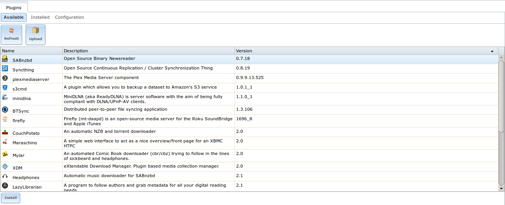
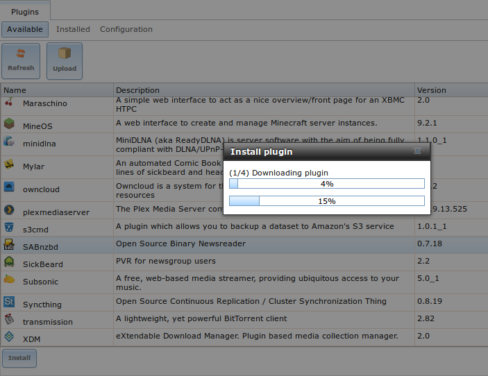
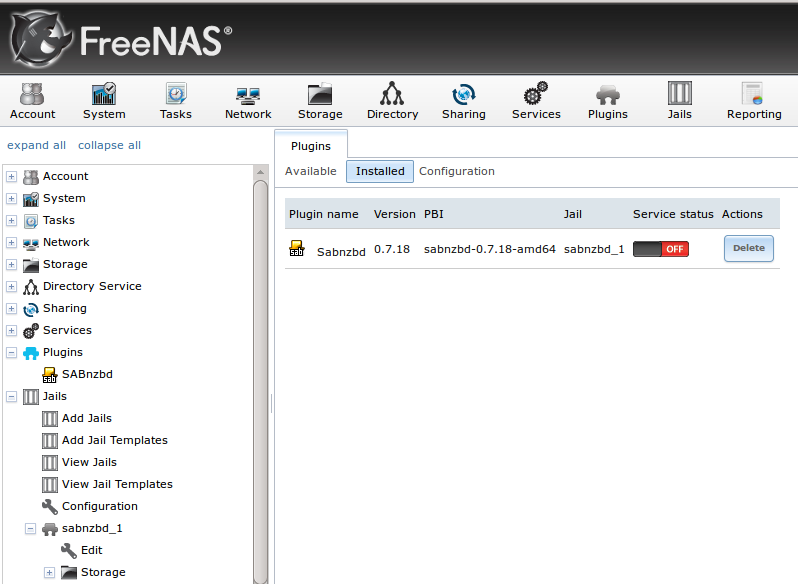
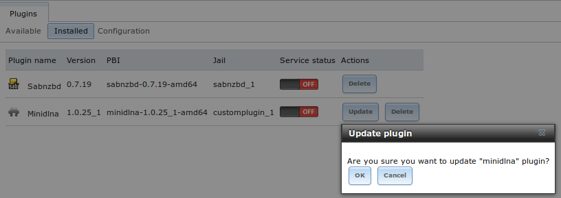
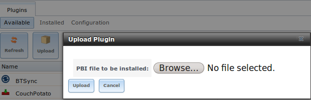
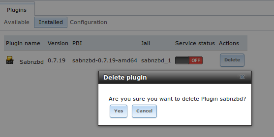

.. index:: Plugin
.. _Plugins:

Plugins
=======

FreeNAS® 8.2.0 introduced the ability to extend the built-in NAS services by providing a mechanism for installing additional software. This mechanism was known
as the Plugins architecture and is based on `FreeBSD jails <http://en.wikipedia.org/wiki/Freebsd_jail>`_ and `PC-BSD PBIs
<http://wiki.pcbsd.org/index.php/AppCafe%C2%AE/9.2>`_. This allowed users to install and configure additional applications once they had created and configured
a plugins jail.

FreeNAS® 9.x simplifies this procedure by providing two methods for software installation. The Plugins method, described in this section, is meant for users
who prefer to browse for, install, and configure available software using the GUI. This method is very easy to use, but is limited in the amount of software
that is available. Each application will automatically be installed into its own jail, meaning that this method may not be suitable for users who wish to run
multiple applications within the same jail.

The Jails method provides much more control over software installation but assumes that the user is comfortable working from the command line can and has a
good understanding of networking basics and software installation on FreeBSD-based systems.

It is recommended that users skim through both the :ref:`Plugins` and :ref:`Jails` sections in order to become familiar with the features and limitations of
each and to choose the method that best meets their software needs.

.. note:: due to ABI (application binary interface) changes, FreeNAS® 8.x Plugins can not be installed on a 9.x system.

.. _Installing Plugins:

Installing Plugins
------------------

A plugin is a self-contained application installer which has been designed to integrate into the FreeNAS® GUI. A plugin offers several advantages:

* the FreeNAS® GUI provides a browser for viewing the list of available plugins

* the FreeNAS® GUI provides buttons for installing, starting, managing, and deleting plugins

* if the plugin has configuration options, a screen will be added to the FreeNAS® GUI so that these options can be configured from the GUI

To install a plugin, click "Plugins". As seen in Figure 12.1a, the list of available plugins will be displayed.

**Figure 12.1a: Viewing the List of Available Plugins**

|plugins1.png|

.. note:: if the list of available plugins is not displayed, open :ref:`Shell` and verify that the FreeNAS® system can :command:`ping` an address on the
   Internet. If it cannot, you may have to add a default gateway address and/or DNS server address in :menuselection:`Network --> Global Configuration`.

Highlight the plugin you would like to install, click its "Install" button, then click "OK". In the example shown in Figure 12.1b, SABnzbd is selected for
installation.

**Figure 12.1b: Installing a Plugin**

|plugins2.png|

The installation will take a few minutes as the system will first download and configure a jail to contain the installed software. It will then install the
plugin and add it to the "Installed" tab as shown in Figure 12.1c.

.. warning:: be patient and wait for the installation to finish. Navigating away from the installation before it is finished will cause problems with the
   installation.

**Figure 12.1c: Viewing Installed PBIs**

|plugins3.png|

As seen in the example shown in Figure 12.1c, entries for the installed PBI will appear in the following locations:

* the "Installed" tab of "Plugins"

* the "Plugins" section of the tree

* the "Jails" section of the tree

The entry in the "Installed" tab of Plugins will display the plugin name and version, the name of the PBI that was installed, the name of the jail that was
created, whether the application status is "ON" or "OFF", and a button to delete the application and its associated jail. If a newer version of the
application is available as a plugin, a button to update the application will also appear.

.. note:: the "Service status" of a plugin must be turned to "ON" before the installed application is available. Before starting the service, check to see if
   it has a configuration menu by clicking its entry in the "Plugins" section of the tree. If the application is configurable, this will open a graphical
   screen that contains the available configuration options. Plugins which are not configurable will instead display a message with a hyperlink for accessing
   the software. However, that hyperlink will **not work** until the plugin is started.

You should always review a plugin's configuration options before attempting to start it. some plugins have options that need to be set before their service
will successfully start. If you have never configured that application before, check the application's website to see what documentation is available. A link
to the website for each available plugin can be found in :ref:`Available Plugins`.

If the application requires access to the data stored on the FreeNAS® system, click the entry for the associated jail in the "Jails" section of the tree and
add a storage as described in :ref:`Add Storage`.

If you need to access the shell of the jail containing the application to complete or test your configuration, click the entry for the associated jail in the
"Jails" section of the tree. You can then click its "shell" icon as described in :ref:`Managing Jails`.

Once the configuration is complete, click the red "OFF" button for the entry for the plugin. If the service successfully starts, it will change to a blue 
"ON". If it fails to start, click the jail's "shell" icon and type :command:`tail /var/log/messages` to see if any errors were logged.

.. _Updating Plugins:

Updating Plugins
----------------

When a newer version of a plugin becomes available in the official repository, an "Update" button is added to the entry for the plugin in the "Installed" tab.
In the example shown in Figure 12.2a, a newer version of Transmission is available.

**Figure 12.2a: Updating an Installed Plugin**

|plugins4.png|

Click the "OK" button to start the download and installation of the latest version of the plugin. Once the update is complete, the entry for the plugin will
be refreshed to show the new version number and the "Update" button will disappear.

.. _Uploading Plugins:

Uploading Plugins
-----------------

The "Available" tab of "Plugins" contains an "Upload" button. This button allows you to install plugins that are not yet available in the official repository
or which are still being tested. These plugins must be manually downloaded and should end in a :file:`.pbi` extension. When downloading a plugin, make sure
that it is 64-bit and that it was developed for 9.x. as 8.x and 10.x applications will not work on a 9.x FreeNAS® system.

Once you have downloaded the plugin, click the "Upload" button. As seen in the example in Figure 12.3a, this will prompt you to browse to the location of the
downloaded file. Once selected, click the "Upload" button to begin the installation.

**Figure 12.3a: Installing a Previously Downloaded *.pbi File**

|plugins5.png|

When the installation is complete, an entry for the plugin will be added to the "Installed" tab and its associated jail will be listed under "Jails". However,
if it is not a FreeNAS® plugin, it will not be added to "Plugins" in the tree. In this case, if the application requires any configuration, you will have to
perform it from the command line of the jail's shell instead of from the GUI.

.. _Deleting Plugins:

Deleting Plugins
----------------

When you install a plugin, an associated jail is created. If you decide to delete a plugin, the associated jail is also deleted as it is no longer required.
**Before deleting a plugin,** make sure that you do not have any data or configuration in the jail that you need to save. If you do, back up that data first,
**before** deleting the plugin.

In the example shown in Figure 12.4a, Sabnzbd has been installed and the user has clicked its "Delete" button. A pop-up message asks the user if they are sure
that they want to delete. **This is the one and only warning.** If the user clicks "Yes", the plugin and the associated jail will be permanently deleted.

**Figure 12.4a: Deleting an Installed Plugin**

|plugins6.png|

.. _Available Plugins:

Available Plugins
-----------------

The following plugins are available for FreeNAS® 9.3:

* `bacula-sd (storage daemon) <http://bacula.org/>`_

* `BTSync <http://www.bittorrent.com/sync>`_

* `CouchPotato <https://couchpota.to/>`_

* `crashplan <http://www.code42.com/crashplan/>`_

* `cruciblewds <http://cruciblewds.org/>`_

* `firefly <https://en.wikipedia.org/wiki/Firefly_Media_Server>`_

* `Headphones <https://github.com/rembo10/headphones>`_

* `HTPC-Manager <http://htpc.io/>`_

* `LazyLibrarian <https://github.com/itsmegb/LazyLibrarian>`_

* `Maraschino <http://www.maraschinoproject.com/>`_

* `MediaBrowser <http://mediabrowser.tv/>`_

* `MineOS <http://minecraft.codeemo.com/>`_

* `Mylar <https://github.com/evilhero/mylar>`_

* `owncloud <http://owncloud.org/>`_

* `plexmediaserver <http://www.plexapp.com/>`_

* `s3cmd <http://s3tools.org/s3cmd>`_

* `SABnzbd <http://sabnzbd.org/>`_

* `SickBeard <http://sickbeard.com/>`_

* `Subsonic <http://subsonic.org/>`_

* `Syncthing <http://syncthing.net/>`_

* `transmission <http://www.transmissionbt.com/>`_

* `XDM <https://github.com/lad1337/XDM>`_

While the FreeNAS® Plugins system makes it easy to install software, it is still up to you to know how to configure and use the installed application. When
in doubt, refer to the documentation for that application.
