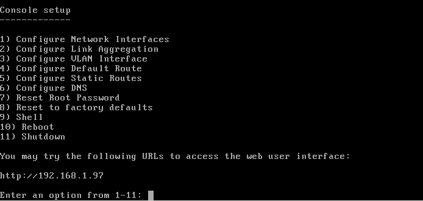

:orphan:

.. _Booting Into FreeNAS®:

Booting Into FreeNAS®
----------------------

When you boot into FreeNAS®, the Console Setup, shown in Figure 3a, will appear at the end of the boot process. If you have access to the the FreeNAS®
system's keyboard and monitor, this Console Setup menu can be used to administer the system should the administrative GUI become inaccessible.

.. note:: you can access the Console Setup menu from within the FreeNAS® GUI by typing
   :command:`/etc/netcli` from Shell. You can disable the Console Setup menu by unchecking the "Enable Console Menu" in :menuselection:`System --> Advanced`.

**Figure 3a: FreeNAS® Console Setup Menu**

|console1.png|

This menu provides the following options:

**1) Configure Network Interfaces:** provides a configuration wizard to configure the system's network interfaces.

**2) Configure Link Aggregation:** allows you to either create a new link aggregation or to delete an existing link aggregation.

**3) Configure VLAN Interface:** used to create or delete a VLAN interface.

**4) Configure Default Route:** used to set the IPv4 or IPv6 default gateway. When prompted, input the IP address of the default gateway.

**5) Configure Static Routes:** will prompt for the destination network and the gateway IP address. Re-enter this option for each route you need to add.

**6) Configure DNS:** will prompt for the name of the DNS domain then the IP address of the first DNS server. To input multiple DNS servers, press
:kbd:`Enter` to input the next one. When finished, press :kbd:`Enter` twice to leave this option.

**7) Reset Root Password:** if you are unable to login to the graphical administrative interface, select this option and follow the prompts to set the *root*
password.

**8) Reset to factory defaults:** if you wish to delete
**all** of the configuration changes made in the administrative GUI, select this option. Once the configuration is reset, the system will reboot. You will
need to go to :menuselection:`Storage --> Volumes --> Auto Import Volume` to re-import your volume.

**9) Shell:** enters a shell in order to run FreeBSD commands. To leave the shell, type :command:`exit`.

**10) Reboot:** reboots the system.

**11) Shutdown:** halts the system.

During boot, FreeNAS® will automatically try to connect to a DHCP server from all live interfaces. If it successfully receives an IP address, it will display
the IP address which can be used to access the graphical console. In the example seen in Figure 2.5b, the FreeNAS® system is accessible from
*http://192.168.1.97*.

If your FreeNAS® server is not connected to a network with a DHCP server, you can use the network configuration wizard to manually configure the interface as
seen in Example 3a. In this example, the FreeNAS® system has one network interface (*em0*).

**Example 3a: Manually Setting an IP Address from the Console Menu**
::

 Enter an option from 1-11: 1
 1) em0
 Select an interface (q to quit): 1
 Delete existing config? (y/n) n
 Configure interface for DHCP? (y/n) n
 Configure IPv4? (y/n) y
 Interface name: (press enter as can be blank)
 Several input formats are supported
 Example 1 CIDR Notation: 192.168.1.1/24
 Example 2 IP and Netmask separate:
 IP: 192.168.1.1
 Netmask: 255.255.255.0, or /24 or 24
 IPv4 Address: 192.168.1.108/24
 Saving interface configuration: Ok
 Configure IPv6? (y/n) n
 Restarting network: ok
 You may try the following URLs to access the web user interface:
 `http://192.168.1.108 <http://192.168.1.108/>`_

Once the system has an IP address, input that address into a graphical web browser from a computer capable of accessing the network containing the FreeNAS®
system. You should be prompted to input the password for the root user, as seen in Figure 3.1a.

**Figure 3.1a: Input the Root Password**

|Figure26b_png|

Enter the password created during the installation. You should then see the administrative GUI as shown in the example in Figure 3.1b.

**Figure 3.1b: FreeNAS® Graphical Configuration Menu**

|Figure26c_png|

If you are unable to access the IP address from a browser, check the following:

* Are proxy settings enabled in the browser configuration? If so, disable the settings and try connecting again.

* If the page does not load, make sure that you can :command:`ping` the FreeNAS® system's IP address. If the address is in a private IP address range, you
  will only be able to access the system from within the private network.

* If the user interface loads but is unresponsive or seems to be missing menu items, try using a different web browser. IE9 has known issues and will not
  display the graphical administrative interface correctly if compatibility mode is turned on. If you can't access the GUI using Internet Explorer, use
  `Firefox <http://www.mozilla.com/en-US/firefox/all.html>`_
  instead.

* If you receive "An error occurred!" messages when attempting to configure an item in the GUI, make sure that the browser is set to allow cookies from
  the FreeNAS® system.

This
`blog post <http://fortysomethinggeek.blogspot.com/2012/10/ipad-iphone-connect-with-freenas-or-any.html>`_
describes some applications which can be used to access the FreeNAS® system from an iPad or iPhone.

.. _Initial Configuration Wizard:

Initial Configuration Wizard
~~~~~~~~~~~~~~~~~~~~~~~~~~~~

ADD SCREENSHOTS AND CLEAN UP PLACEHOLDER DESCRIPTIONS ONCE WIZARD IS FINALIZED

.. note:: it is important to use the GUI (or the console) for all configuration changes. FreeNAS® uses a configuration database to store its settings. While
   you can use the command line to modify your configuration, changes made at the command line are not written to the configuration database. This means that
   any changes made at the command line will not persist after a reboot and will be overwritten by the values in the configuration database during an upgrade.

#. Set the Email Address: FreeNAS® provides an Alert icon in the upper right corner to provide a visual indication of events that warrant administrative
   attention. The alert system automatically emails the *root* user account whenever an alert is issued.

   To set the email address for the *root* account, go to :menuselection:`Account --> Users --> View Users`. Click the "Change E-mail" button associated with
   the *root* user account and input the email address of the person to receive the administrative emails.

#. Enable Console Logging: To view system messages within the graphical administrative interface, go to :menuselection:`System --> Advanced`. Check the box
   "Show console messages in the footer" and click "Save". The output of :command:`tail -f /var/log/messages` will now be displayed at the bottom of the
   screen. If you click the console messages area, it will pop-up as a window, allowing you to scroll through the output and to copy its contents.

#. Create Storage: When creating a volume, you have several choices depending upon your storage requirements and whether or not data already exists on the
   disk(s). The following options are available:

   * Auto-import an existing UFS disk, gstripe (RAID0), gmirror (RAID1), or graid3 (RAID3) in :menuselection:`Storage --> Volumes --> Auto Import Volume`.

   * Auto-import an existing ZFS disk, stripe, mirror, RAIDZ1, RAIDZ2, or RAIDZ3 in :menuselection:`Storage --> Volumes --> Auto Import Volume`.

   * Import a disk that is formatted with UFS, NTFS, MSDOS, or EXT2 in :menuselection:`Storage --> Volumes --> Import Volume`.

   * Format disk(s) with ZFS and optionally create a stripe, mirror, RAIDZ1, RAIDZ2, or RAIDZ3 in :menuselection:`Storage -->Volumes --> ZFS Volume Manager`.

   * Divide the ZFS pool into datasets to provide more flexibility when configuring user access to data.

   * Create a Zvol to be used when configuring an iSCSI device extent.

#. Create Users/Groups: FreeNAS® supports a variety of user access scenarios:

   * the use of an anonymous or guest account that everyone in the network uses to access the stored data

   * the creation of individual user accounts where each user has access to their own ZFS dataset

   * the addition of individual user accounts to groups where each group has access to their own volume or ZFS dataset

   * the import of existing accounts from an OpenLDAP or Active Directory server

   When configuring your FreeNAS® system, **select one of the following,** depending upon whether or not the network has an existing OpenLDAP or Active
   Directory domain. OpenLDAP and Active Directory are mutually exclusive, meaning that you can not use both but must choose one or the other.

   * Manually create users and groups. User management is described in Users and group management is described in Groups.

   * Import existing Active Directory account information using the instructions in Active Directory.

   * Import existing OpenLDAP account information using the instructions in LDAP.

#. Configure Permissions: Setting permissions is an important aspect of configuring access to storage data. The graphical administrative interface is meant to
   set the **initial** permissions in order to make a volume or dataset accessible as a share. Once a share is available, the client operating system should
   be used to fine-tune the permissions of the files and directories that are created by the client.

   Configured volumes and datasets will appear in :menuselection:`Storage --> Volumes`. Each volume and dataset will have its own "Change Permissions" option,
   allowing for greater flexibility when providing access to data.

   Before creating your shares, determine which users should have access to which data. This will help you to determine if multiple volumes, datasets, and/or
   shares should be created to meet the permissions needs of your environment.

#. Configure Sharing: Once your volumes have been configured with permissions, you are ready to configure the type of share or service that you determine is
   suitable for your network. FreeNAS® supports several types of shares and sharing services for providing storage data to the clients in a network. It is
   recommended that you **select only one type of share per volume or dataset** in order to prevent possible conflicts between different types of shares. The
   type of share you create depends upon the operating system(s) running in your network, your security requirements, and expectations for network transfer
   speeds. The following types of shares and services are available:

   * **Apple (AFP):** FreeNAS® uses Netatalk to provide sharing services to Apple clients. This type of share is a good choice if all of your computers run
     Mac OS X.

   * **Unix (NFS):** this type of share is accessible by Mac OS X, Linux, BSD, and professional/enterprise versions of Windows. It is a good choice if there
     are many different operating systems in your network.

   * **Windows (CIFS):** FreeNAS® uses Samba to provide the SMB/CIFS sharing service. This type of share is accessible by Windows, Mac OS X, Linux, and BSD
     computers, but it is slower than an NFS share. If your network contains only Windows systems, this is a good choice.

   * **FTP:** this service provides fast access from any operating system, using a cross-platform FTP and file manager client application such as Filezilla.
     FreeNAS® supports encryption and chroot for FTP.

   * **SSH:** this service provides encrypted connections from any operating system using SSH command line utilities or the graphical WinSCP application for
     Windows clients.

   * **iSCSI:** FreeNAS® supports the export of virtual disk drives that are accessible to clients running iSCSI initiator software.

#. Start Service(s): Once you have configured your share or service, you will need to start its associated service(s) in order to implement the configuration.
   By default, all services are off until you start them. The status of services is managed using :menuselection:`Services --> Control Services`. To start a
   service, click its red "OFF" button. After a second or so, it will change to a blue ON, indicating that the service has been enabled. Watch the console
   messages as the service starts to determine if there are any error messages.

#. Test Configuration: If the service successfully starts, try to make a connection to the service from a client system. For example, use Windows Explorer to
   try to connect to a CIFS share, use an FTP client such as Filezilla to try to connect to an FTP share, or use Finder on a Mac OS X system to try to connect
   to an AFP share. If the service starts correctly and you can make a connection but receive permissions errors, check that the user has permissions to the
   volume/dataset being accessed.

#. Backup Configuration: Once you have tested your configuration, be sure to back it up. Go to :menuselection:`System --> General` and click the "Save Config"
   button. Your browser will provide an option to save a copy of the configuration database. You should
   **backup your configuration whenever you make configuration changes and always before upgrading FreeNAS®**.
