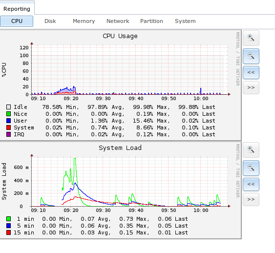

.. index:: Reporting
.. _Reporting:

Reporting
=========

Reporting displays several graphs, as seen in the example in Figure 14a. Click the tab for a device type to see its graphs.

**Figure 14a: Reporting Graphs**

FreeNAS® uses
`collectd <https://collectd.org/>`_
to provide reporting statistics. The following collectd plugins are enabled in :file:`/conf/base/etc/local/collectd.conf`, and thus provide reporting graphs:

*   `CPU usage <https://collectd.org/wiki/index.php/Plugin:CPU>`_
    : collects the amount of time spent by the CPU in various states such as executing user code, executing system code, and being idle.

*   `system load <https://collectd.org/wiki/index.php/Plugin:Load>`_
    : provides a rough overview of system utilization over a one, five, and fifteen minute average.

*   `disk <https://collectd.org/wiki/index.php/Plugin:Disk>`_
    : shows the average time a disk I/O operation took to complete.

*   `physical memory <https://collectd.org/wiki/index.php/Plugin:Memory>`_
    : displays physical memory usage.

*   `swap utilization <https://collectd.org/wiki/index.php/Plugin:Swap>`_
    : displays the amount of free and used swap space.

*   `interface <https://collectd.org/wiki/index.php/Plugin:Interface>`_
    : shows received and transmitted traffic in bits per second for each configured interface.

*   `disk space <https://collectd.org/wiki/index.php/Plugin:DF>`_
    : displays free and used space for each volume and dataset. However, the disk space used by an individual zvol is not displayed as it is a block device.

*   `processes <https://collectd.org/wiki/index.php/Plugin:Processes>`_
    : displays the number of processes, grouped by state.

*   `uptime <https://collectd.org/wiki/index.php/Plugin:Uptime>`_
    : keeps track of the system uptime, the average running time, and the maximum reached uptime.

*   `zfs <https://collectd.org/wiki/index.php/Plugin:ZFS_ARC>`_
    : shows ARC and L2ARC size and hit rates.

Reporting data is saved, allowing you to view and monitor usage trends over time. By default, reporting data is saved to :file:`/data/rrd_dir.tar.bz2` and
should be preserved across system upgrades and at shutdown. To instead save this data to the system dataset, check the "Reporting database" box in
:menuselection:`System --> System Dataset`.

Use the magnifier buttons next to each graph to increase or decrease the displayed time increment from 10 minutes, hourly, daily, weekly, or monthly. You can
also use the "<<" and ">>" buttons to scroll through the output.

