.. _Sharing:

Sharing
=======

Once you have a volume, create at least one share so that the storage is accessible by the other computers in your network. The type of share you create
depends upon the operating system(s) running in your network, your security requirements, and expectations for network transfer speeds.

Beginning with version 9.3, FreeNAS® provides an :ref:`Initial Configuration Wizard` for creating shares. The Wizard will automatically create the correct
type of dataset and permissions for the type of share, set the default permissions for the share type, and start the service needed by the share. It is
recommended to use the Wizard to create shares, fine-tune the share settings using the instructions in the rest of this chapter if needed, then to fine-tune
the default permissions from the client operating system to meet the requirements of the network.

.. note:: shares are created to provide and control access to an area of storage. Before creating your shares, it is recommended to make a list of the users
   that will need access to storage data, which operating systems these users are using, whether or not all users should have the same permissions to the
   stored data, and whether or not these users should authenticate before accessing the data. This information can help you determine which type of share(s)
   you need to create, whether or not you need to create multiple datasets in order to divide up the storage into areas with differing access and permission
   requirements, and how complex it will be to setup your permission requirements. It should be noted that a share is used to provide access to data. If you
   delete a share, it removes access to data but does not delete the data itself.

The following types of shares and services are available:

* :ref:`Apple (AFP) Shares`: the Apple File Protocol (AFP) type of share is a good choice if all of your computers run Mac OS X.

* :ref:`Unix (NFS) Shares`: the Network File System (NFS) type of share is accessible by Mac OS X, Linux, BSD, and the professional and enterprise versions
  (not the home editions) of Windows. It is a good choice if there are many different operating systems in your network. Depending upon the operating system,
  it may require the installation or configuration of client software on the desktop.
  
* :ref:`WebDAV Shares`: this type of share is accessible using an authenticated web browser (read-only) or
  `WebDAV client <http://en.wikipedia.org/wiki/WebDAV#Clients>`_ running on any operating system.

* :ref:`Windows (CIFS) Shares`: the Common Internet File System (CIFS) type of share is accessible by Windows, Mac OS X, Linux, and BSD computers, but it is
  slower than an NFS share due to the single-threaded design of Samba. It provides more configuration options than NFS and is a good choice on a network
  containing only Windows systems. However, it is a poor choice if the CPU on the FreeNAS® system is limited; if your CPU is maxed out, you need to upgrade
  the CPU or consider another type of share.

* :ref:`Block (iSCSI)` shares: this type of share appears as an unformatted disk to clients running iSCSI initiator software or a virtualization solution such
  as VMware.

If you are looking for a solution that allows fast access from any operating system, consider configuring the :ref:`FTP` service instead of a share and use a
cross-platform FTP and file manager client application such as
`Filezilla <http://filezilla-project.org/>`_. Secure FTP can be configured if the data needs to be encrypted.

If data security is a concern and your network's users are familiar with SSH command line utilities or
`WinSCP <http://winscp.net/>`_, consider configuring the :ref:`SSH` service instead of a share. It will be slower than unencrypted FTP due to the overhead of
encryption, but the data passing through the network will be encrypted.

.. note:: while the GUI will let you do it, it is a bad idea to share the same volume or dataset using multiple types of access methods. Different types of
   shares and services use different file locking methods. For example, if the same volume is configured to use both NFS and FTP, NFS will lock a file for
   editing by an NFS user, but a FTP user can simultaneously edit or delete that file. This will result in lost edits and confused users. Another example: if
   a volume is configured for both AFP and CIFS, Windows users may be confused by the extra filenames used by Mac files and delete the ones they don't
   understand; this will corrupt the files on the AFP share. Pick the one type of share or service that makes the most sense for the types of clients that
   will access that volume, and configure that volume for that one type of share or service. If you need to support multiple types of shares, divide the
   volume into datasets and use one dataset per share.

This section will demonstrate how to fine-tune the configuration of AFP, NFS, CIFS, WebDAV, and iSCSI shares. FTP and SSH configurations are described in
:ref:`Services Configuration`.

.. index:: AFP, Apple Filing Protocol
.. _Apple (AFP) Shares:

Apple (AFP) Shares
------------------

FreeNAS® uses the
`Netatalk <http://netatalk.sourceforge.net/>`_
AFP server to share data with Apple systems. This section describes the configuration screen for fine-tuning AFP shares created using the
:ref:`Initial Configuration Wizard`. It then provides configuration examples for using the Wizard to create a guest share, configuring Time Machine to backup
to a dataset on the FreeNAS® system, and for connecting to the share from a Mac OS X client.

To view the AFP share created by the Wizard, click :menuselection:`Sharing --> Apple (AFP)` and highlight the name of the share. Click its "Edit" button to see
the configuration options shown in Figure 10.1a. The values showing for these options will vary, depending upon the information given when the share was
created.

**Figure 10.1a: Creating an AFP Share**

|afp2.png|

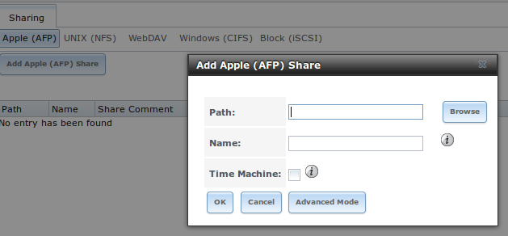

.. note:: while Table 10.1a summarizes the available options for fine-tuning an AFP share, you typically should not change the default settings of an AFP
          share as doing so may cause the share to not work as expected. Most settings are only available when you click "Advanced Mode". Do **not** change an
          advanced option unless you fully understand the function of that option. Refer to
          `Setting up Netatalk <http://netatalk.sourceforge.net/2.2/htmldocs/configuration.html>`_ for a more detailed explanation of the available options.

**Table 10.1a: AFP Share Configuration Options**

+------------------------------+---------------+-------------------------------------------------------------------------------------------------------------+
| **Setting**                  | **Value**     | **Description**                                                                                             |
|                              |               |                                                                                                             |
+==============================+===============+=============================================================================================================+
| Path                         | browse button | browse to the volume/dataset to share; do not nest additional volumes, datasets, or symbolic links beneath  |
|                              |               | this path because Netatalk lacks complete support                                                           |
|                              |               |                                                                                                             |
+------------------------------+---------------+-------------------------------------------------------------------------------------------------------------+
| Name                         | string        | volume name that will appear in the Mac computer's "connect to server" dialogue; limited to 27 characters   |
|                              |               | and can not contain a period                                                                                |
|                              |               |                                                                                                             |
+------------------------------+---------------+-------------------------------------------------------------------------------------------------------------+
| Share Comment                | string        | only available in "Advanced Mode"; optional                                                                 |
|                              |               |                                                                                                             |
+------------------------------+---------------+-------------------------------------------------------------------------------------------------------------+
| Allow List                   | string        | only available in "Advanced Mode"; comma delimited list of allowed users and/or groups where groupname      |
|                              |               | begins with a *@*; note that adding an entry will deny any user/group that is not specified                 |
|                              |               |                                                                                                             |
+------------------------------+---------------+-------------------------------------------------------------------------------------------------------------+
| Deny List                    | string        | only available in "Advanced Mode"; comma delimited list of denied users and/or groups where groupname       |
|                              |               | begins with a *@*; note that adding an entry will allow all users/groups that are not specified             |
|                              |               |                                                                                                             |
+------------------------------+---------------+-------------------------------------------------------------------------------------------------------------+
| Read-only Access             | string        | only available in "Advanced Mode"; comma delimited list of users and/or groups who only have read access    |
|                              |               | where groupname begins with a *@*                                                                           |
|                              |               |                                                                                                             |
+------------------------------+---------------+-------------------------------------------------------------------------------------------------------------+
| Read-write Access            | string        | only available in "Advanced Mode"; comma delimited list of users and/or groups who have read and write      |
|                              |               | access where groupname begins with a @                                                                      |
|                              |               |                                                                                                             |
+------------------------------+---------------+-------------------------------------------------------------------------------------------------------------+
| Time Machine                 | checkbox      | when checked, FreeNAS will advertise itself as a Time Machine disk so it can be found by Macs; due to a     |
|                              |               | limitation in how Mac deals with low-diskspace issues when multiple Mac's share the same volume, checking   |
|                              |               | "Time Machine" on multiple shares may result in intermittent failed backups                                 |
|                              |               |                                                                                                             |
+------------------------------+---------------+-------------------------------------------------------------------------------------------------------------+
| Zero Device Numbers          | checkbox      | only available in "Advanced Mode"; enable when the device number is not constant across a reboot            |
|                              |               |                                                                                                             |
+------------------------------+---------------+-------------------------------------------------------------------------------------------------------------+
| No Stat                      | checkbox      | only available in "Advanced Mode"; if checked, AFP won't stat the volume path when enumerating the volumes  |
|                              |               | list; useful for automounting or volumes created by a preexec script                                        |
|                              |               |                                                                                                             |
+------------------------------+---------------+-------------------------------------------------------------------------------------------------------------+
| AFP3 UNIX Privs              | checkbox      | only available in "Advanced Mode"; enables Unix privileges supported by OSX 10.5 and higher; do not enable  |
|                              |               | if the network contains Mac OS X 10.4 clients or lower as they do not support these                         |
|                              |               |                                                                                                             |
+------------------------------+---------------+-------------------------------------------------------------------------------------------------------------+
| Default file permission      | checkboxes    | only available in "Advanced Mode"; only works with Unix ACLs; new files created on the share are set with   |
|                              |               | the selected permissions                                                                                    |
|                              |               |                                                                                                             |
+------------------------------+---------------+-------------------------------------------------------------------------------------------------------------+
| Default directory permission | checkboxes    | only available in "Advanced Mode"; only works with Unix ACLs; new directories created on the share are set  |
|                              |               | with the selected permissions                                                                               |
|                              |               |                                                                                                             |
+------------------------------+---------------+-------------------------------------------------------------------------------------------------------------+
| Default umask                | integer       | only available in "Advanced Mode"; umask for newly created files, default is *000* (anyone can read, write, |
|                              |               | and execute)                                                                                                |
|                              |               |                                                                                                             |
+------------------------------+---------------+-------------------------------------------------------------------------------------------------------------+
| Hosts Allow                  | string        | only available in "Advanced Mode"; comma, space, or tab delimited list of allowed hostnames or IP addresses |
|                              |               |                                                                                                             |
+------------------------------+---------------+-------------------------------------------------------------------------------------------------------------+
| Hosts Deny                   | string        | only available in "Advanced Mode"; comma, space, or tab delimited list of denied hostnames or IP addresses  |
|                              |               |                                                                                                             |
+------------------------------+---------------+-------------------------------------------------------------------------------------------------------------+

.. _Creating AFP Guest Shares:

Creating AFP Guest Shares
~~~~~~~~~~~~~~~~~~~~~~~~~

AFP supports guest logins, meaning that all of your Mac OS X users can access the AFP share without requiring their user accounts to first be created on or
imported into the the FreeNAS® system.

.. note:: if you create a guest share as well a share that requires authentication, AFP will only map users who login as guest to the guest share. This means
   that if a user logs in to the share that requires authentication, the permissions on the guest share may prevent that user from writing to the guest share.
   The only way to allow both guest and authenticated users to write to a guest share is to set the permissions on the guest share to 777 or to add the
   authenticated users to a guest group and set the permissions to 77x.

To create an AFP guest share, click "Wizard", then click the "Next" button twice to display the screen shown in Figure 10.1b. Complete the following fields in
this screen:

#. **Share name:** input a name for the share that is useful to you but which is under 27 characters and does not contain a period. In this example, the share
   is named *afp_guest*.

#. Click the button for "Mac OS X (AFP)".

#. Click the "Add" button. **If you forget to do this, the share will not be created**. Clicking the "Add" button will add an entry to the "Name" frame with
   the name that you typed into "Share name".

**Figure 10.1b: Creating a Guest AFP Share**

|afp6.png|

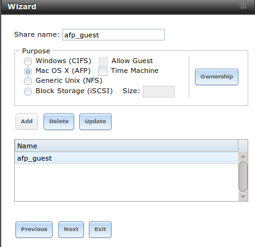

Click the "Next" button twice, then the "Confirm" button to create the share. The Wizard will automatically create a dataset for the share that contains the
correct default permissions and start the AFP service for you, so that the share is immediately available. The new share will also be added as an entry to
:menuselection:`Sharing --> Apple (AFP)`.

Mac OS X users can connect to the guest AFP share by clicking :menuselection:`Go --> Connect to Server`. In the example shown in Figure 10.1c, the user has
input *afp://* followed by the IP address of the FreeNAS® system.

Click the "Connect" button. Once connected, Finder will automatically open. The name of the AFP share will be displayed in the SHARED section in the left
frame and the contents of any data that has been saved in the share will be displayed in the right frame.

**Figure 10.1c: Connect to Server Dialogue**

|afp3.png|

.. |afp3.png| image:: images/afp3.png
    :width: 6.9252in
    :height: 3.4327in

To disconnect from the volume, click the "eject" button in the "Shared" sidebar.

.. index:: Time Machine
.. _Creating Authenticated and Time Machine Shares:

Creating Authenticated and Time Machine Shares
~~~~~~~~~~~~~~~~~~~~~~~~~~~~~~~~~~~~~~~~~~~~~~

Mac OS X includes the Time Machine application which can be used to schedule automatic backups.  In this configuration example, a Time Machine user will be
configured to backup to an AFP share on a FreeNAS® system. It is recommended to create a separate Time Machine share for each user that will be using Time
Machine to backup their Mac OS X system to FreeNAS®. The process for creating an authenticated share for a user is the same as creating a Time Machine share
for that user.

To use the Wizard to create an authenticated or Time Machine share, enter the following information, as seen in the example in Figure 10.1d.

#. **Share name:** input a name for the share that is useful to you but which is under 27 characters and does not contain a period. In this example, the share
   is named *backup_user1*.

#. Click the button for "Mac OS X (AFP)" and check the box for "Time Machine". If the user will not be using Time Machine, leave the box unchecked.

#. Click the "Ownership" button. If the user already exists on the FreeNAS® system, click the drop-down "User" menu to select their user account.  If the user
   does not yet exist on the FreeNAS® system, type their name into the "User" field and check the "Create User" checkbox. If you want the user to be a member
   of a group that already exists on the FreeNAS® system, click the drop-down "Group" menu to select the group name. If you wish to create a new group to be
   used by Time Machine users, input the name into the "Group" field and check the "Create Group" checkbox. Otherwise, input the same name as the user. In the
   example shown in Figure 10.1e, a new user named *user1* will be created, as well as a new group named
   *tm_backups*. Since a new user is being created, this screen prompts for the password for the user to use when accessing the share. It also provides an
   opportunity to change the default permissions on the share. When finished, click "Return" to return to the screen shown in Figure 10.1d.

#. Click the "Add" button. **If you forget to do this, the share will not be created**. Clicking the "Add" button will add an entry to the "Name" frame with
   the name that you typed into "Share name".

If you wish to configure multiple authenticated or Time Machine shares, repeat for each user, giving each user their own "Share name" and "Ownership". When
finished, click the "Next" button twice, then the "Confirm" button to create the share(s). The Wizard will automatically create a dataset for each share that
contains the correct ownership and start the AFP service for you, so that the share(s) are immediately available. The new share(s) will also be added as
entries to :menuselection:`Sharing --> Apple (AFP)`.

**Figure 10.1d: Creating a Time Machine Share**

|afp7.png|

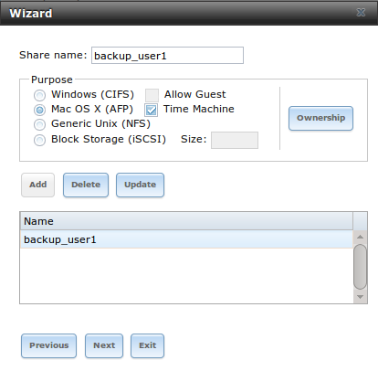

**Figure 10.1e: Creating an Authenticated User**

|afp8.png|

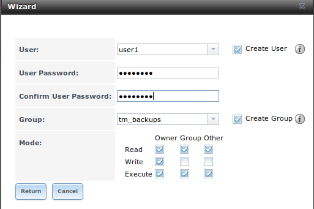

At this point, it may be desirable to configure a quota for each Time Machine share, to restrict backups from using all of the available space on the
FreeNAS® system. The first time Time Machine makes a backup, it will create a full backup after waiting two minutes. It will then create a one hour
incremental backup for the next 24 hours, and then one backup each day, each week and each month.
**Since the oldest backups are deleted when a Time Machine share becomes full, make sure that the quota size you set is sufficient to hold the desired number of backups.**
Note that a default installation of Mac OS X is ~21 GB in size.

To configure a quota, go to :menuselection:`Storage --> Volumes` and highlight the entry for the share. In the example shown in Figure 10.1f, the Time
Machine share name is *backup_user1*. Click the "Edit Options" button for the share, then "Advanced Mode". Input a value in the "Quota for this dataset"
field then click "Edit Dataset" to save the change. In this example, the Time Machine share is restricted to 200GB.

**Figure 10.1f: Setting a Quota**

|afp9.png|

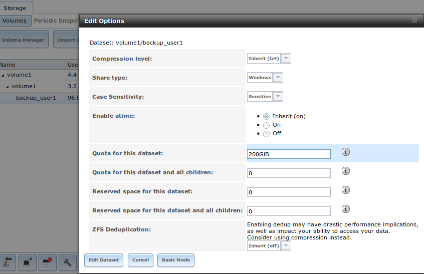

To configure Time Machine on the Mac OS X client, go to :menuselection:`System Preferences --> Time Machine` which will open the screen shown in Figure 10.1g.
Click "ON" and a pop-up menu should show the FreeNAS® system as a backup option. In our example, it is listed as *backup_user1 on "freenas"*. Highlight the
entry representing the FreeNAS® system and click the "Use Backup Disk" button. A connection bar will open and will prompt for the user account's password--in
this example, the password that was set for the *user1* account.

**Figure 10.1g: Configuring Time Machine on Mac OS X Lion**

|afp5.png|

.. |afp5.png| image:: images/afp5.png
    :width: 6.9252in
    :height: 4.6055in

If you receive a "Time Machine could not complete the backup. The backup disk image could not be created (error 45)" error when backing up to the FreeNAS®
system, you will need to create a sparsebundle image using
`these instructions <http://forum1.netgear.com/showthread.php?t=49482>`_.

If you receive the message "Time Machine completed a verification of your backups. To improve reliability, Time Machine must create a new backup for you." and
you do not want to perform another complete backup or lose past backups, follow the instructions in this
`post <http://www.garth.org/archives/2011,08,27,169,fix-time-machine-sparsebundle-nas-based-backup-errors.html>`_. Note that this can occur after performing a
scrub as Time Machine may mistakenly believe that the sparsebundle backup is corrupt.

.. index:: NFS, Network File System
.. _Unix (NFS) Shares:

Unix (NFS) Shares
-----------------

FreeNAS® supports the Network File System (NFS) for sharing volumes over a network. Once the NFS share is configured, clients use the :command:`mount`
command to mount the share. Once mounted, the share appears as just another directory on the client system. Some Linux distros require the installation of
additional software in order to mount an NFS share. On Windows systems, enable Services for NFS in the Ultimate or Enterprise editions or install an NFS
client application.

.. note:: for performance reasons, iSCSI is preferred to NFS shares when FreeNAS is installed on ESXi. If you are considering creating NFS shares on ESXi,
   read through the performance analysis at
   `Running ZFS over NFS as a VMware Store <http://blog.laspina.ca/ubiquitous/running-zfs-over-nfs-as-a-vmware-store>`_.

Configuring NFS is a multi-step process that requires you to create NFS share(s), configure NFS in :menuselection:`Services --> NFS`, then start NFS in
:menuselection:`Services --> Control Services`. It does not require you to create users or groups as NFS uses IP addresses to determine which systems are
allowed to access the NFS share.

This section demonstrates how to create an NFS share, provides a configuration example, demonstrates how to connect to the share from various operating
systems, and provides some troubleshooting tips.

To create an NFS share, click :menuselection:`Sharing --> Unix (NFS) Shares --> Add Unix (NFS) Share`, shown in Figure 10.2a. 

**Figure 10.2a: Creating an NFS Share**

|nfs2.png|

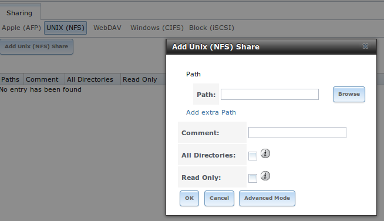

Once you press the "OK" button when creating the NFS share, a pop-up menu will ask "Would you like to enable this service?" Click "Yes" and
:menuselection:`Services --> Control Services` will open and indicate whether or not the NFS service successfully started.

Table 10.2a summarizes the options in this screen. Some settings are only available in "Advanced Mode". To see these settings, either click the "Advanced
Mode" button or configure the system to always display these settings by checking the box "Show advanced fields by default" in
:menuselection:`System --> Advanced`.

**Table 10.2a: NFS Share Options**

+---------------------+----------------+--------------------------------------------------------------------------------------------------------------------+
| **Setting**         | **Value**      | **Description**                                                                                                    |
|                     |                |                                                                                                                    |
+=====================+================+====================================================================================================================+
| Path                | browse button  | browse to the volume/dataset/directory to share (cannot contain a space); click "Add extra path" to select         |
|                     |                | multiple paths                                                                                                     |
|                     |                |                                                                                                                    |
+---------------------+----------------+--------------------------------------------------------------------------------------------------------------------+
| Comment             | string         | used to set the share name; if left empty, share name will be the list of selected "Path"s                         |
|                     |                |                                                                                                                    |
+---------------------+----------------+--------------------------------------------------------------------------------------------------------------------+
| Authorized networks | string         | only available in "Advanced Mode"; space delimited list of allowed network addresses in the form *1.2.3.0/24*      |
|                     |                | where the number after the slash is a CIDR mask                                                                    |
|                     |                |                                                                                                                    |
+---------------------+----------------+--------------------------------------------------------------------------------------------------------------------+
| Authorized  IP      | string         | only available in "Advanced Mode"; space delimited list of allowed IP addresses or hostnames                       |
| addresses or hosts  |                |                                                                                                                    |
|                     |                |                                                                                                                    |
+---------------------+----------------+--------------------------------------------------------------------------------------------------------------------+
| All directories     | checkbox       | if checked, the client can mount any subdirectory within the "Path"                                                |
|                     |                |                                                                                                                    |
+---------------------+----------------+--------------------------------------------------------------------------------------------------------------------+
| Read only           | checkbox       | prohibits writing to the share                                                                                     |
|                     |                |                                                                                                                    |
+---------------------+----------------+--------------------------------------------------------------------------------------------------------------------+
| Quiet               | checkbox       | only available in "Advanced Mode"; inhibits some syslog diagnostics which can be useful to avoid some annoying     |
|                     |                | error messages; see                                                                                                |
|                     |                | `exports(5) <http://www.freebsd.org/cgi/man.cgi?query=exports>`_                                                   |
|                     |                | for examples                                                                                                       |
|                     |                |                                                                                                                    |
+---------------------+----------------+--------------------------------------------------------------------------------------------------------------------+
| Maproot User        | drop-down menu | only available in "Advanced Mode"; if a user is selected, the *root* user is limited to that user's permissions    |
|                     |                |                                                                                                                    |
+---------------------+----------------+--------------------------------------------------------------------------------------------------------------------+
| Maproot Group       | drop-down menu | only available in "Advanced Mode"; if a group is selected, the *root* user will also be limited to that group's    |
|                     |                | permissions                                                                                                        |
|                     |                |                                                                                                                    |
+---------------------+----------------+--------------------------------------------------------------------------------------------------------------------+
| Mapall User         | drop-down menu | only available in "Advanced Mode"; the specified user's permissions are used by all clients                        |
|                     |                |                                                                                                                    |
+---------------------+----------------+--------------------------------------------------------------------------------------------------------------------+
| Mapall Group        | drop-down menu | only available in "Advanced Mode"; the specified group's permission are used by all clients                        |
|                     |                |                                                                                                                    |
+---------------------+----------------+--------------------------------------------------------------------------------------------------------------------+
| Security            | selection      | only available in "Advanced Mode"; choices are *sys* () or the following Kerberos options:                         |
|                     |                | *krb5* (authentication only),                                                                                      |
|                     |                | *krb5i* (authentication and integrity), or                                                                         |
|                     |                | *krb5p* (authentication and privacy); if multiple security mechanisms are added to the "Selected" column using the |
|                     |                | arrows, use the "Up" or "Down" buttons to list in order of preference                                              |
|                     |                |                                                                                                                    |
+---------------------+----------------+--------------------------------------------------------------------------------------------------------------------+

When creating the NFS share, keep the following points in mind:

#.  The "Maproot" and "Mapall" options are exclusive, meaning you can only use one or the other--the GUI will not let you use both. The "Mapall" options
    supersede the "Maproot" options. If you only wish to restrict the *root* user's permissions, set the "Maproot" option. If you wish to restrict the
    permissions of all users, set the "Mapall" options.

#.  Each volume or dataset is considered to be its own filesystem and NFS is not able to cross filesystem boundaries.

#.  The network or host must be unique per share and per filesystem or directory.

#.  The "All directories" option can only be used once per share per filesystem.

To better understand these restrictions, consider the following scenario where there are:

* 2 networks named *10.0.0.0/8* and
  *20.0.0.0/8*

* a ZFS volume named :file:`volume1` with 2 datasets named :file:`dataset1` and :file:`dataset2`

* :file:`dataset1` has a directory named :file:`directory1`

Because of restriction #3, you will receive an error if you try to create one NFS share as follows:

* "Authorized networks" set to *10.0.0.0/8 20.0.0.0/8*

* "Path" set to :file:`/mnt/volume1/dataset1` and :file:`/mnt/volume1/dataset1/directory1`

Instead, you should select a "Path" of :file:`/mnt/volume1/dataset1` and check the "All directories" box.

However, you could restrict that directory to one of the networks by creating two shares as follows.

First NFS share:

* "Authorized networks" set to *10.0.0.0/8*

* "Path" set to :file:`/mnt/volume1/dataset1`

Second NFS share:

* "Authorized networks" set to *20.0.0.0/8*

* "Path" set to :file:`/mnt/volume1/dataset1/directory1`

Note that this requires the creation of two shares as it can not be accomplished in one share.

.. _Example Configuration:

Example Configuration
~~~~~~~~~~~~~~~~~~~~~

By default the "Mapall" options shown in Figure 10.2a show as *N/A*. This means that when a user connects to the NFS share, they connect with the permissions
associated with their user account. This is a security risk if a user is able to connect as *root* as they will have complete access to the share.

A better scenario is to do the following:

#.  Specify the built-in *nobody* account to be used for NFS access.

#.  In the "Change Permissions" screen of the volume/dataset that is being shared, change the owner and group to *nobody* and set the permissions according to
    your specifications.

#.  Select *nobody* in the "Mapall User" and "Mapall Group" drop-down menus for the share in :menuselection:`Sharing --> Unix (NFS) Shares`.

With this configuration, it does not matter which user account connects to the NFS share, as it will be mapped to the *nobody* user account and will only
have the permissions that you specified on the volume/dataset. For example, even if the *root* user is able to connect, it will not gain
*root* access to the share.

.. _Connecting to the Share:

Connecting to the Share
~~~~~~~~~~~~~~~~~~~~~~~

In the following examples, an NFS share on a FreeNAS® system with the IP address of *192.168.2.2* has been configured as follows:

#.  A ZFS volume named :file:`/mnt/data` has its permissions set to the *nobody* user account and the
    *nobody* group.

#.  A NFS share has been created with the following attributes:

    * "Path": :file:`/mnt/data`

    * "Authorized Network": *192.168.2.0/24*

    * "MapAll User" and "MapAll Group" are both set to *nobody*

    * the "All Directories" checkbox has been checked

.. _From BSD or Linux:

From BSD or Linux
^^^^^^^^^^^^^^^^^

To make this share accessible on a BSD or a Linux system, run the following command as the superuser (or with :command:`sudo`) from the client system. Repeat
on each client that needs access to the NFS share::

 mount -t nfs 192.168.2.2:/mnt/data /mnt

The :command:`mount` command uses the following options:

* **-t nfs:** specifies the type of share.

* **192.168.2.2:** replace with the IP address of the FreeNAS® system

* **/mnt/data:** replace with the name of the NFS share

* **/mnt:** a mount point on the client system. This must be an existing,
  **empty** directory. The data in the NFS share will be made available to the client in this directory.

The :command:`mount` command should return to the command prompt without any error messages, indicating that the share was successfully mounted.

.. note:: if this command fails on a Linux system, make sure that the `nfs-utils <http://sourceforge.net/projects/nfs/files/nfs-utils/>`_ package is
   installed.

Once mounted, this configuration allows users on the client system to copy files to and from :file:`/mnt` (the mount point) and all files will be owned by
*nobody:nobody*. Any changes to :file:`/mnt` will be saved to the FreeNAS® system's :file:`/mnt/data` volume.

Should you wish to make any changes to the NFS share's settings or wish to make the share inaccessible, first unmount the share on the client as the
superuser::

 umount /mnt

.. _From Microsoft:

From Microsoft
^^^^^^^^^^^^^^

Windows systems can connect to NFS shares using Services for NFS (refer to the documentation for your version of Windows for instructions on how to find,
activate, and use this service) or a third-party NFS client.

Instructions for connecting from an Enterprise version of Windows 7 can be found at
`Mount Linux NFS Share on Windows 7 <http://www.hackourlife.com/mount-linux-nfs-share-on-windows-7/>`_.

`Nekodrive <http://code.google.com/p/nekodrive/downloads/list>`_
provides an open source graphical NFS client. To use this client, you will need to install the following on the Windows system:

* `7zip <http://www.7-zip.org/>`_
  to extract the Nekodrive download files

* NFSClient and NFSLibrary from the Nekodrive download page; once downloaded, extract these files using 7zip

* `.NET Framework 4.0 <http://www.microsoft.com/download/en/details.aspx?id=17851>`_

Once everything is installed, run the NFSClient executable to start the GUI client. In the example shown in Figure 10.2b, the user has connected to the
example :file:`/mnt/data` share of the FreeNAS® system at
*192.168.2.2*.

.. note:: Nekodrive does not support Explorer drive mapping via NFS. If you need this functionality,
   `try this utility <http://www.citi.umich.edu/projects/nfsv4/windows/readme.html>`_
   instead.

**Figure 10.2b: Using the Nekodrive NFSClient from Windows 7 Home Edition**

|nfs5.jpg|

.. |nfs5.jpg| image:: images/nfs5.jpg
    :width: 6.9252in
    :height: 5.3736in

.. _From Mac OS X:

From Mac OS X
^^^^^^^^^^^^^

To mount the NFS volume from a Mac OS X client, click on :menuselection:`Go --> Connect to Server`. In the "Server Address" field, input *nfs://* followed by
the IP address of the FreeNAS® system and the name of the volume/dataset being shared by NFS. The example shown in Figure 10.2c continues with our example of
*192.168.2.2:/mnt/data*.

Once connected, Finder will automatically open. The IP address of the FreeNAS® system will be displayed in the SHARED section in the left frame and the
contents of the share will be displayed in the right frame. In the example shown in Figure 10.2d, :file:`/mnt/data` has one folder named :file:`images`. The
user can now copy files to and from the share.

**Figure 10.2c: Mounting the NFS Share from Mac OS X**

|nfs3.png|

.. |nfs3.png| image:: images/nfs3.png
    :width: 6.9252in
    :height: 3.5618in

**Figure 10.2d: Viewing the NFS Share in Finder**

|nfs4.png|

.. |nfs4.png| image:: images/nfs4.png
    :width: 6.2193in
    :height: 4.5102in

.. _Troubleshooting NFS:

Troubleshooting NFS
~~~~~~~~~~~~~~~~~~~

Some NFS clients do not support the NLM (Network Lock Manager) protocol used by NFS. You will know that this is the case if the client receives an error that
all or part of the file may be locked when a file transfer is attempted. To resolve this error, add the option **-o nolock** when running the
:command:`mount` command on the client in order to allow write access to the NFS share.

If you receive an error about a "time out giving up" when trying to mount the share from a Linux system, make sure that the portmapper service is running
on the Linux client and start it if it is not. If portmapper is running and you still receive timeouts, force it to use TCP by including **-o tcp** in your
:command:`mount` command.

If you receive an error "RPC: Program not registered", upgrade to the latest version of FreeNAS® and restart the NFS service after the upgrade in order
to clear the NFS cache.

If your clients are receiving "reverse DNS" errors, add an entry for the IP address of the FreeNAS® system in the "Host name database" field of
:menuselection:`Network --> Global Configuration`.

If the client receives timeout errors when trying to mount the share, add the IP address and hostname of the client to the "Host name data base" field of
:menuselection:`Network --> Global Configuration`.

.. index:: WebDAV
.. _WebDAV Shares:

WebDAV Shares
------------------

Beginning with FreeNAS® 9.3, WebDAV shares can be created so that authenticated users can browse the contents of the specified volume, dataset, or directory
from a web browser.

Configuring WebDAV shares is a two step process. First, create the WebDAV share(s) to specify which data can be accessed. Then, configure the WebDAV service
by specifying the port, authentication type, and authentication password. Once the configuration is complete, the share can be accessed using a URL in the
format::

 protocol://IP_address:port_number/share_name
 
where:

* **protocol:** is either
  *http* or
  *https*, depending upon the "Protocol" configured in :menuselection:`Services --> WebDAV`.
  
* **IP address:** is the IP address or hostname of the FreeNAS® system. Take care when configuring a public IP address to ensure that the network's firewall
  only allows access to authorized systems.
  
* **port_number:** is configured in :menuselection:`Services --> WebDAV`. If the FreeNAS® system is to be accessed using a public IP address, consider
  changing the default port number and ensure that the network's firewall only allows access to authorized systems.
  
* **share_name:** is configured in :menuselection:`Sharing --> WebDAV Shares`.

Inputting the URL into a web browser will bring up an authentication pop-up message. Input a username of *webdav* and the password configured in
:menuselection:`Services --> WebDAV`.

To create a WebDAV share, click :menuselection:`Sharing --> WebDAV Shares --> Add WebDAV Share` which will open the screen shown in Figure 10.3a.

**Figure 10.3a: Adding a WebDAV Share**

|webdav.png|

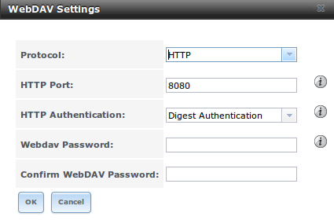

Table 10.3a summarizes the available options.

**Table 10.3a: WebDAV Share Options**

+------------------------------+---------------+-------------------------------------------------------------------------------------------------------------+
| **Setting**                  | **Value**     | **Description**                                                                                             |
|                              |               |                                                                                                             |
+==============================+===============+=============================================================================================================+
| Share Path Name              | string        | input a name for the share                                                                                  |
|                              |               |                                                                                                             |
+------------------------------+---------------+-------------------------------------------------------------------------------------------------------------+
| Comment                      | string        | optional                                                                                                    |
|                              |               |                                                                                                             |
+------------------------------+---------------+-------------------------------------------------------------------------------------------------------------+
| Path                         | browse button | browse to the volume/dataset to share                                                                       |
|                              |               |                                                                                                             |
+------------------------------+---------------+-------------------------------------------------------------------------------------------------------------+
| Read Only                    | checkbox      | if checked, users cannot write to the share                                                                 |
|                              |               |                                                                                                             |
+------------------------------+---------------+-------------------------------------------------------------------------------------------------------------+
| Change User & Group          | checkbox      | if checked, automatically sets the share's contents to the *webdav* user and group                          |
| Ownership                    |               |                                                                                                             |
+------------------------------+---------------+-------------------------------------------------------------------------------------------------------------+

Once you click "OK", a pop-up will ask if you would like to enable the service. Once the service starts, review the settings in
:menuselection:`Services --> WebDAV` as they are used to determine which URL is used to access the WebDAV share and whether or not authentication is required
to access the share. These settings are described in :ref:`WebDAV`.

.. index:: CIFS, Samba, Windows Shares, SMB
.. _Windows (CIFS) Shares:

Windows (CIFS) Shares
---------------------

FreeNAS® uses
`Samba <http://samba.org/>`_
to share volumes using Microsoft's CIFS protocol. CIFS is built into the Windows and Mac OS X operating systems and most Linux and BSD systems pre-install
the Samba client which provides support for CIFS. If your distro did not, install the Samba client using your distro's software repository.

Configuring CIFS shares is a multi-step process that requires you to set permissions, create CIFS share(s), configure the CIFS service in
:menuselection:`Services --> CIFS`, then enable the CIFS service in :menuselection:`Services --> Control Services`. If your Windows network has a Windows
server running Active Directory, you will also need to configure the Active Directory service in
:menuselection:`Directory Services --> Active Directory`. Depending upon your authentication requirements, you may need to create or import users and groups.

This section will demonstrate some common configuration scenarios. If you would like to use Shadow Copies, see :ref:`Configuring Shadow Copies`. If you are
having problems accessing your CIFS share, see :ref:`Troubleshooting CIFS`.

Figure 10.4a shows the configuration screen that appears when you click :menuselection:`Sharing --> Windows (CIFS Shares) --> Add Windows (CIFS) Share`.

**Figure 10.4a: Adding a CIFS Share**

|cifs2.png|

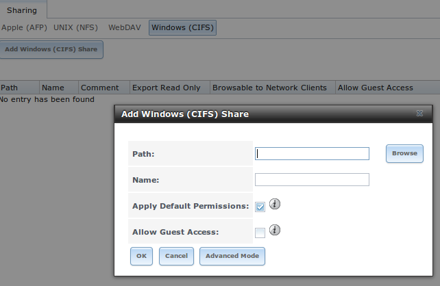

Table 10.4a summarizes the options when creating a CIFS share. Some settings are only available in "Advanced Mode". To see these settings, either click the
"Advanced Mode" button or configure the system to always display these settings by checking the box "Show advanced fields by default" in
:menuselection:`System --> Advanced`.

`smb.conf(5) <http://www.sloop.net/smb.conf.html>`_
provides more details for each configurable option. Once you press the "OK" button when creating the CIFS share, a pop-up menu will ask "Would you like to
enable this service?" Click "Yes" and :menuselection:`Services --> Control Services` will open and indicate whether or not the CIFS service successfully
started.

**Table 10.4a: Options for a CIFS Share**

+------------------------------+---------------+-------------------------------------------------------------------------------------------------------------+
| **Setting**                  | **Value**     | **Description**                                                                                             |
|                              |               |                                                                                                             |
+==============================+===============+=============================================================================================================+
| Path                         | browse button | select volume/dataset/directory to share                                                                    |
|                              |               |                                                                                                             |
+------------------------------+---------------+-------------------------------------------------------------------------------------------------------------+
| Use as home share            | checkbox      | check this box if the share is meant to hold user home directories; only one share can be the homes share   |
|                              |               |                                                                                                             |
+------------------------------+---------------+-------------------------------------------------------------------------------------------------------------+
| Name                         | string        | mandatory; name of share                                                                                    |
|                              |               |                                                                                                             |
+------------------------------+---------------+-------------------------------------------------------------------------------------------------------------+
| Comment                      | string        | only available in "Advanced Mode";  optional description                                                    |
|                              |               |                                                                                                             |
+------------------------------+---------------+-------------------------------------------------------------------------------------------------------------+
| Apply Default Permissions    | checkbox      | sets the ACLs to allow read/write for owner/group and read-only for others; should only be unchecked when   |
|                              |               | creating a share on a system that already has custom ACLs set                                               |
|                              |               |                                                                                                             |
+------------------------------+---------------+-------------------------------------------------------------------------------------------------------------+
| Export Read Only             | checkbox      | only available in "Advanced Mode"; prohibits write access to the share                                      |
|                              |               |                                                                                                             |
+------------------------------+---------------+-------------------------------------------------------------------------------------------------------------+
| Browsable to Network Clients | checkbox      | only available in "Advanced Mode"; enables Windows clients to browse the shared directory using Windows     |
|                              |               | Explorer                                                                                                    |
|                              |               |                                                                                                             |
+------------------------------+---------------+-------------------------------------------------------------------------------------------------------------+
| Export Recycle Bin           | checkbox      | only available in "Advanced Mode"; deleted files are instead moved to a hidden :file:`.recycle` directory   |
|                              |               | in the root folder of the share                                                                             |
|                              |               |                                                                                                             |
+------------------------------+---------------+-------------------------------------------------------------------------------------------------------------+
| Show Hidden Files            | checkbox      | only available in "Advanced Mode"; if enabled, will display filenames that begin with a dot (Unix hidden    |
|                              |               | files)                                                                                                      |
|                              |               |                                                                                                             |
+------------------------------+---------------+-------------------------------------------------------------------------------------------------------------+
| Allow Guest Access           | checkbox      | if checked, no password is required to connect to the share and all users share the permissions of the      |
|                              |               | guest user defined in the CIFS service                                                                      |
|                              |               |                                                                                                             |
+------------------------------+---------------+-------------------------------------------------------------------------------------------------------------+
| Only Allow Guest Access      | checkbox      | only available in "Advanced Mode"; requires "Allow guest access" to also be checked; forces guest access    |
|                              |               | for all connections                                                                                         |
|                              |               |                                                                                                             |
+------------------------------+---------------+-------------------------------------------------------------------------------------------------------------+
| Hosts Allow                  | string        | only available in "Advanced Mode"; comma, space, or tab delimited list of allowed hostnames or IP addresses;|
|                              |               | see NOTE below                                                                                              |
|                              |               |                                                                                                             |
+------------------------------+---------------+-------------------------------------------------------------------------------------------------------------+
| Hosts Deny                   | string        | only available in "Advanced Mode"; comma, space, or tab delimited list of denied hostnames or IP addresses; |
|                              |               | allowed hosts take precedence so can use *ALL* in this field and specify allowed hosts in                   |
|                              |               | "Hosts Allow"; see NOTE below                                                                               |
|                              |               |                                                                                                             |
+------------------------------+---------------+-------------------------------------------------------------------------------------------------------------+
| VFS Objects                  | selection     | only available in "Advanced Mode" and adds virtual file system modules to enhance functionality; Table      |
|                              |               | 10.4b summarizes the available modules                                                                      |
|                              |               |                                                                                                             |
+------------------------------+---------------+-------------------------------------------------------------------------------------------------------------+
| Auxiliary Parameters         | string        | only available in "Advanced Mode"; additional :file:`smb4.conf` parameters not covered by other option      |
|                              |               | fields                                                                                                      |
|                              |               |                                                                                                             |
+------------------------------+---------------+-------------------------------------------------------------------------------------------------------------+

.. note:: hostname lookups add some time to accessing the CIFS share. If you only use IP addresses, uncheck the "Hostnames lookups" box in
   :menuselection:`Services --> CIFS`.

If you wish some files on a shared volume to be hidden and inaccessible to users, put a *veto files=* line in the "Auxiliary Parameters" field. The syntax for
this line and some examples can be found
`here <http://www.samba.org/samba/docs/man/manpages-3/smb.conf.5.html#VETOFILES>`_.

**Table 10.4b: Available VFS Modules**

+---------------+--------------------------------------------------------------------------------------------------------------------------------------------+
| **Value**     | **Description**                                                                                                                            |
|               |                                                                                                                                            |
+===============+============================================================================================================================================+
| audit         | logs share access, connects/disconnects, directory opens/creates/removes, and file opens/closes/renames/unlinks/chmods to syslog           |
|               |                                                                                                                                            |
+---------------+--------------------------------------------------------------------------------------------------------------------------------------------+
| extd_audit    | sends "audit" logs to both syslog and the Samba log files                                                                                  |
|               |                                                                                                                                            |
+---------------+--------------------------------------------------------------------------------------------------------------------------------------------+
| fake_perms    | allows roaming profile files and directories to be set as read-only                                                                        |
|               |                                                                                                                                            |
+---------------+--------------------------------------------------------------------------------------------------------------------------------------------+
| netatalk      | eases the co-existence of CIFS and AFP shares                                                                                              |
|               |                                                                                                                                            |
+---------------+--------------------------------------------------------------------------------------------------------------------------------------------+
| streams_depot | **experimental** module to store alternate data streams in a central directory                                                             |
|               |                                                                                                                                            |
+---------------+--------------------------------------------------------------------------------------------------------------------------------------------+

.. _Share Configuration:

Share Configuration
~~~~~~~~~~~~~~~~~~~

The process for configuring a share is as follows:

#.  If you are not using Active Directory or LDAP, create a user account for each user in :menuselection:`Account --> Users --> Add User` with the following
    attributes:

    * "Username" and "Password": matches the username and password on the client system

    * "Home Directory": browse to the volume to be shared

    * Repeat this process to create a user account for every user that will need access to the CIFS share

#.  If you are not using Active Directory or LDAP, create a group in :menuselection:`Account --> Groups --> Add Group`. Once the group is created, click its
    "Members" button and add the user accounts that you created in step 1.

#.  Give the group permission to the volume in :menuselection:`Storage --> View Volumes`. When setting the permissions:

    * set "Owner(user)" to *nobody*

    * set the "Owner(group)" to the one you created in Step 2

    * "Mode": check the "write" checkbox for the "Group" as it is unchecked by default

    
#.  Create a CIFS share in :menuselection:`Sharing --> CIFS Shares --> Add CIFS Share` with the following attributes:

    * "Name": input the name of the share

    * "Path": browse to the volume to be shared

    * keep the "Browsable to Network Clients" box checked

    .. note:: be careful about unchecking the "Browsable to Network Clients" box. When this box is checked (the default), other users will see the names of
       every share that exists using Windows Explorer, but they will receive a permissions denied error message if they try to access someone else's share. If
       this box is unchecked, even the owner of the share won't see it or be able to create a drive mapping for the share in Windows Explorer. However, they
       can still access the share from the command line. Unchecking this option provides limited security and is not a substitute for proper permissions and
       password control.

#.  Configure the CIFS service in :menuselection:`Services --> CIFS` as follows:

    * "Workgroup": if you are not using Active Directory or LDAP, set to the name being used on the Windows network; unless it has been changed, the default
      Windows workgroup name is *WORKGROUP*

#.  Start the CIFS service in :menuselection:`Services --> Control Services`. Click the click the red "OFF" button next to CIFS. After a second or so, it will
    change to a blue "ON", indicating that the service has been enabled.

#.  Test the share.

To test the share from a Windows system, open Explorer and click on "Network". For this configuration example, a system named *FREENAS* should appear with a
share named :file:`backups`. An example is seen in Figure 10.4b:

**Figure 10.4b: Accessing the CIFS Share from a Windows Computer**

|cifs3.png|

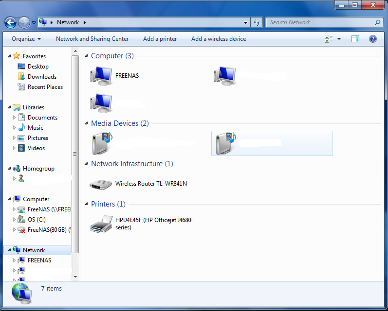

If you click on :file:`backups`, a Windows Security pop-up screen should prompt for the user's username and password. Once authenticated, the user can copy
data to and from the CIFS share.

To prevent Windows Explorer from hanging when accessing the share, map the share as a network drive. To do this, right-click the share and select "Map network
drive..." as seen in Figure 10.4c:

**Figure 10.4c: Mapping the Share as a Network Drive**

|cifs4.png|

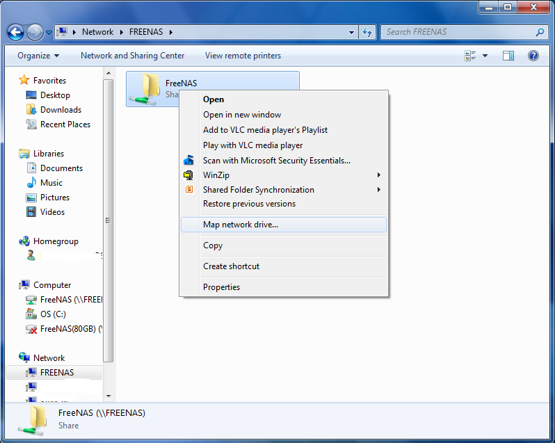

Choose a drive letter from the drop-down menu and click the "Finish" button as shown in Figure 10.4d:

**Figure 10.4d: Selecting the Network Drive Letter**

|cifs5.jpg|

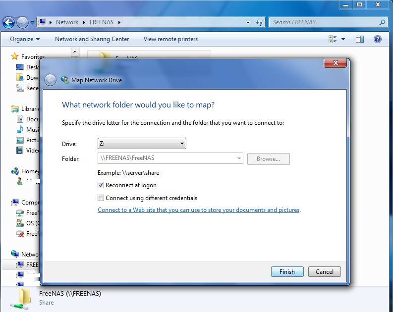

.. index:: Shadow Copies
.. _Configuring Shadow Copies:

Configuring Shadow Copies
~~~~~~~~~~~~~~~~~~~~~~~~~

`Shadow Copies <http://en.wikipedia.org/wiki/Shadow_copy>`_, also known as the Volume Shadow Copy Service (VSS) or Previous Versions, is a Microsoft service
for creating volume snapshots. Shadow copies allow you to easily restore previous versions of files from within Windows Explorer. Shadow Copy support is built
into Vista and Windows 7. Windows XP or 2000 users need to install the
`Shadow Copy client <http://www.microsoft.com/download/en/details.aspx?displaylang=en&id=16220>`_.

When you create a periodic snapshot task on a ZFS volume that is configured as a CIFS share in FreeNAS®, it is automatically configured to support shadow
copies.

Before using shadow copies with FreeNAS®, be aware of the following caveats:

* If the Windows system is not fully patched to the latest service pack, Shadow Copies may not work. If you are unable to see any previous versions of files
  to restore, use Windows Update to make sure that the system is fully up-to-date.

* Shadow copy support only works for ZFS pools or datasets. This means that the CIFS share must be configured on a volume or dataset, not on a directory.

* Since directories can not be shadow copied at this time, if you configure "Enable home directories" on the CIFS service, any data stored in the
  user's home directory will not be shadow copied.

* Datasets are filesystems and shadow copies cannot traverse filesystems. If you want to be able to see the shadow copies in your child datasets, create
  separate shares for them.

* shadow copies will not work with a manual snapshot, you must create a periodic snapshot task for the pool or dataset being shared by CIFS or a recursive
  task for a parent dataset. At this time, if multiple snapshot tasks are created for the same pool/dataset being shared by CIFS, shadow copies will only
  work on the last executed task at the time the CIFS service started. A future version of FreeNAS® will address this limitation.

* The periodic snapshot task should be created and at least one snapshot should exist **before** creating the CIFS share. If you created the CIFS share
  first, restart the CIFS service in :menuselection:`Services --> Control Services`.

* Appropriate permissions must be configured on the volume/dataset being shared by CIFS.

* Users can not delete shadow copies on the Windows system due to the way Samba works. Instead, the administrator can remove snapshots from the FreeNAS®
  administrative GUI. The only way to disable shadow copies completely is to remove the periodic snapshot task and delete all snapshots associated with the
  CIFS share.

In this configuration example, a Windows 7 computer has two users: *user1* and
*user2*. To configure FreeNAS® to provide shadow copy support:

#.  For the ZFS volume named :file:`/mnt/data`, create two ZFS datasets in :menuselection:`Storage --> Volumes --> /mnt/data --> Create ZFS Dataset`. The
    first dataset is named :file:`/mnt/data/user1` and the second dataset is named :file:`/mnt/data/user2`.

#.  If you are not using Active Directory or LDAP, create two users, *user1* and
    *user2* in :menuselection:`Account --> Users --> Add User`. Each user has the following attributes:

    * "Username" and "Password" match that user's username and password on the Windows system

    * for the "Home Directory", browse to the dataset created for that user

#.  Set the permissions on :file:`/mnt/data/user1` so that the Owner(user) and Owner(group) is *user1*. Set the permissions on :file:`/mnt/data/user2` so that
    the "Owner(user)" and "Owner(group)" is *user2*. For each dataset's permissions, tighten the "Mode" so that "Other" can not read or execute the
    information on the dataset.

#.  Create two periodic snapshot tasks in :menuselection:`Storage --> Periodic Snapshot Tasks --> Add Periodic Snapshot`, one for each dataset. Alternatively,
    you can create one periodic snapshot task for the entire :file:`data` volume. 
    **Before continuing to the next step,** confirm that at least one snapshot for each dataset is displayed in the "ZFS Snapshots" tab. When creating your
    snapshots, keep in mind how often your users need to access modified files and during which days and time of day they are likely to make changes.

#.  Create two CIFS shares in :menuselection:`Sharing --> Windows (CIFS) Shares --> Add Windows (CIFS) Share`. The first CIFS share is named *user1* and has a
    Path of :file:`/mnt/data/user1`; the second CIFS share is named *user2* and has a "Path" of :file:`/mnt/data/user2`. When creating the first share, click
    the "No" button when the pop-up button asks if the CIFS service should be started. When the last share is created, click the "Yes" button when the pop-up
    button prompts to start the CIFS service. Verify that the CIFS service is set to "ON" in :menuselection:`Services --> Control Services`.

#.  From a Windows system, login as *user1* and open :menuselection:`Windows Explorer --> Network --> FREENAS`. Two shares should appear, named
    *user1* and
    *user2*. Due to the permissions on the datasets,
    *user1* should receive an error if they click on the
    *user2* share. Due to the permissions on the datasets,
    *user1* should be able to create, add, and delete files and folders from the
    *user1* share.

Figure 10.4e provides an example of using shadow copies while logged in as *user1*. In this example, the user right-clicked
*modified file* and selected "Restore previous versions" from the menu. This particular file has three versions: the current version, plus two previous
versions stored on the FreeNAS® system. The user can choose to open one of the previous versions, copy a previous version to the current folder, or restore
one of the previous versions, which will overwrite the existing file on the Windows system.

**Figure 10.4e: Viewing Previous Versions within Explorer**

|cifs6.png|

.. |cifs6.png| image:: images/cifs6.png
    :width: 6.9252in
    :height: 5.8945in

.. index:: iSCSI, Internet Small Computer System Interface
.. _Block (iSCSI):

Block (iSCSI)
-------------

iSCSI is a protocol standard for the consolidation of storage data. iSCSI allows FreeNAS® to act like a storage area network (SAN) over an existing Ethernet
network. Specifically, it exports disk devices over an Ethernet network that iSCSI clients (called initiators) can attach to and mount. Traditional SANs
operate over fibre channel networks which require a fibre channel infrastructure such as fibre channel HBAs, fibre channel switches, and discrete cabling.
iSCSI can be used over an existing Ethernet network, although dedicated networks can be built for iSCSI traffic in an effort to boost performance. iSCSI also
provides an advantage in an environment that uses Windows shell programs; these programs tend to filter "Network Location" but iSCSI mounts are not
filtered.

Before configuring the iSCSI service, you should be familiar with the following iSCSI terminology:

**CHAP:** an authentication method which uses a shared secret and three-way authentication to determine if a system is authorized to access the storage device
and to periodically confirm that the session has not been hijacked by another system. In iSCSI, the initiator (client) performs the CHAP authentication.

**Mutual CHAP:** a superset of CHAP in that both ends of the communication authenticate to each other.

**Initiator:** a client which has authorized access to the storage data on the FreeNAS® system. The client requires initiator software in order to initiate
the connection to the iSCSI share.

**Target:** a storage resource on the FreeNAS® system. Every target has a unique name known as an iSCSI Qualified Name (IQN).

**Internet Storage Name Service (iSNS):** protocol for the automated discovery of iSCSI devices on a TCP/IP network.

**Extent:** the storage unit to be shared. It can either be a file or a device.

**Portal:** indicates which IP(s) and port(s) to listen on for connection requests.

**LUN:** stands for Logical Unit Number and represents a logical SCSI device. An initiator negotiates with a target to establish connectivity to a LUN; the
result is an iSCSI connection that emulates a connection to a SCSI hard disk. Initiators treat iSCSI LUNs the same way as they would a raw SCSI or IDE hard
drive; rather than mounting remote directories, initiators format and directly manage filesystems on iSCSI LUNs. When configuring multiple iSCSI LUNs, create
a new target for each LUN. Since iSCSI multiplexes a target with multiple LUNs over the same TCP connection, you will experience contention from TCP if there
is more than one target per LUN.

In FreeNAS® 9.3, iSCSI is built into the kernel. This version of iSCSI supports Microsoft Offloaded Data Transfer (ODX), meaning that file copies happen
locally, rather than over the network. It also supports the following VAAI (vStorage APIs for Array Integration) primitives, where VAAI is VMware's API
framework that enables certain storage tasks, such as large data moves, to be offloaded from the virtualization hardware to the storage array.

* **unmap:** tells ZFS that the space occupied by deleted files should be freed. Without unmap, ZFS is unaware of freed space made when the initiator deletes
  files. For this feature to work, the initiator must support the unmap command.

* **atomic test and set:** allows multiple initiators to synchronize LUN access in a fine-grained manner rather than locking the whole LUN, which would
  prevent other hosts from accessing the same LUN simultaneously.

* **write same:** when allocating virtual machines with thick provisioning, the necessary write of zeroes is done locally, rather than over the network, so
  virtual machine creation is much quicker.

* **xcopy:** similar to Microsoft ODX, copies happen locally rather than over the network.

* **stun:** if a volume runs out of space, this feature pauses any running virtual machines so that the space issue can be fixed, instead of reporting write
  errors.

* **threshold warning:** the system reports a warning when a configurable capacity is reached. In FreeNAS, this threshold can be configured both at the pool
  level (see Table 10.5a) and the device extent level (see Table 10.5f).

* **LUN reporting:** the LUN reports that it is thin provisioned.

To take advantage of these VAAI primitives, create a zvol using the instructions in :ref:`Create zvol` and use it to create a device extent, as described in
:ref:`Extents`.

In order to configure iSCSI:

#.  Review the target global configuration parameters.

#.  Create at least one portal.

#.  Determine which hosts are allowed to connect using iSCSI and create an initiator.

#.  Decide if you will use authentication, and if so, whether it will be CHAP or mutual CHAP. If using authentication, create an authorized access.

#.  Create a target.

#.  Create either a device or a file extent to be used as storage.

#.  Associate a target with an extent.

#.  Start the iSCSI service in :menuselection:`Services --> Control Services`.

The rest of this section describes these steps in more detail.

.. _Target Global Configuration:

Target Global Configuration
~~~~~~~~~~~~~~~~~~~~~~~~~~~

:menuselection:`Sharing --> Block (iSCSI) --> Target Global Configuration`, shown in Figures 10.5a, contains settings that apply to all iSCSI shares. Table
10.5a summarizes the settings that can be configured in the Target Global Configuration screen.

**Figure 10.5a: iSCSI Target Global Configuration Variables**

|global.png|

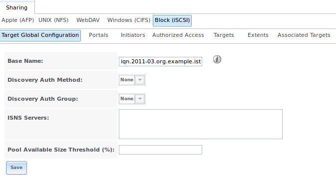

**Table 10.5a: Target Global Configuration Settings**

+---------------------------------+------------------------------+-------------------------------------------------------------------------------------------+
| **Setting**                     | **Value**                    | **Description**                                                                           |
|                                 |                              |                                                                                           |
|                                 |                              |                                                                                           |
+=================================+==============================+===========================================================================================+
| Base Name                       | string                       | see the "Constructing iSCSI names using the iqn. format" section of :rfc:`3721`           |
|                                 |                              | if you are unfamiliar with this format                                                    |
|                                 |                              |                                                                                           |
+---------------------------------+------------------------------+-------------------------------------------------------------------------------------------+
| Discovery Auth Method           | drop-down menu               | configures the authentication level required by the target for discovery of valid         |
|                                 |                              | devices, where *None* will allow anonymous discovery,                                     |
|                                 |                              | *CHAP* and                                                                                |
|                                 |                              | *Mutual CHAP* require authentication, and                                                 |
|                                 |                              | *Auto* lets the initiator decide the authentication scheme                                |
|                                 |                              |                                                                                           |
+---------------------------------+------------------------------+-------------------------------------------------------------------------------------------+
| Discovery Auth Group            | drop-down menu               | depends on "Discovery Auth Method" setting: required if set to *CHAP* or                  |
|                                 |                              | *Mutual CHAP*, optional if set to                                                         |
|                                 |                              | *Auto*, and not needed if set to                                                          |
|                                 |                              | *None*                                                                                    |
|                                 |                              |                                                                                           |
+---------------------------------+------------------------------+-------------------------------------------------------------------------------------------+
| ISNS Servers                    | string                       | space delimited list of hostnames or IP addresses of ISNS server(s) to register the       |
|                                 |                              | system's iSCSI targets and portals with                                                   |
|                                 |                              |                                                                                           |
+---------------------------------+------------------------------+-------------------------------------------------------------------------------------------+
| Pool Available Space Threshold  | integer                      | input the pool percentage; when the pool's specified capacity is reached, the system will |
|                                 |                              | issue an alert                                                                            |
|                                 |                              |                                                                                           |
+---------------------------------+------------------------------+-------------------------------------------------------------------------------------------+

.. _Portals:

Portals
~~~~~~~

A portal specifies the IP address and port number to be used for iSCSI connections. :menuselection:`Sharing --> Block (iSCSI) --> Portals --> Add Portal` will
bring up the screen shown in Figure 10.5b.

Table 10.5b summarizes the settings that can be configured when adding a portal. If you need to assign additional IP addresses to the portal, click the link
"Add extra Portal IP".

**Figure 10.5b: Adding an iSCSI Portal**

|portal.png|

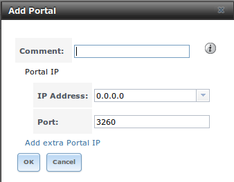

**Table 10.5b: Portal Configuration Settings**

+-------------+----------------+-----------------------------------------------------------------------------+
| **Setting** | **Value**      | **Description**                                                             |
|             |                |                                                                             |
|             |                |                                                                             |
+=============+================+=============================================================================+
| Comment     | string         | optional description; portals are automatically assigned a numeric group ID |
|             |                |                                                                             |
+-------------+----------------+-----------------------------------------------------------------------------+
| IP address  | drop-down menu | select the IP address associated with an interface or the wildcard address  |
|             |                | of *0.0.0.0* (any interface)                                                |
|             |                |                                                                             |
+-------------+----------------+-----------------------------------------------------------------------------+
| Port        | integer        | TCP port used to access the iSCSI target; default is *3260*                 |
|             |                |                                                                             |
+-------------+----------------+-----------------------------------------------------------------------------+

FreeNAS® systems with multiple IP addresses or interfaces can use a portal to provide services on different interfaces or subnets. This can be used to
configure multi-path I/O (MPIO). MPIO is more efficient than a link aggregation.

If the FreeNAS® system has multiple configured interfaces, portals can also be used to provide network access control. For example, consider a system with
four interfaces configured with the following addresses:

192.168.1.1/24

192.168.2.1/24

192.168.3.1/24

192.168.4.1/24

You could create a portal containing the first two IP addresses (group ID 1) and a portal containing the remaining two IP addresses (group ID 2). You could
then create a target named A with a Portal Group ID of 1 and a second target named B with a Portal Group ID of 2. In this scenario, istgt would listen on all
four interfaces, but connections to target A would be limited to the first two networks and connections to target B would be limited to the last two networks.

Another scenario would be to create a portal which includes every IP address **except** for the one used by a management interface. This would prevent iSCSI
connections to the management interface.

.. _Initiators:

Initiators
~~~~~~~~~~

The next step is to configure authorized initiators, or the systems which are allowed to connect to the iSCSI targets on the FreeNAS® system. To configure
which systems can connect, use :menuselection:`Sharing --> Block (iSCSI) --> Initiators --> Add Initiator`, shown in Figure 10.5c.

**Figure 10.5c: Adding an iSCSI Initiator**

|initiator1.png|

.. |initiator1.png| image:: images/initiator1.png
    :width: 6.5in
    :height: 2.5in

Table 10.5c summarizes the settings that can be configured when adding an initiator.

**Table 10.5c: Initiator Configuration Settings**

+--------------------+-----------+--------------------------------------------------------------------------------------+
| **Setting**        | **Value** | **Description**                                                                      |
|                    |           |                                                                                      |
+====================+===========+======================================================================================+
| Initiators         | string    | use *ALL* keyword or a list of initiator hostnames separated by commas or spaces     |
|                    |           |                                                                                      |
+--------------------+-----------+--------------------------------------------------------------------------------------+
| Authorized network | string    | use *ALL* keyword or a network address with CIDR mask such as                        |
|                    |           | *192.168.2.0/24*                                                                     |
|                    |           |                                                                                      |
+--------------------+-----------+--------------------------------------------------------------------------------------+
| Comment            | string    | optional description                                                                 |
|                    |           |                                                                                      |
+--------------------+-----------+--------------------------------------------------------------------------------------+

In the example shown in Figure 10.5d, two groups have been created. Group 1 allows connections from any initiator on any network; Group 2 allows connections
from any initiator on the *10.10.1.0/24* network. Click an initiator's entry to display its "Edit" and "Delete" buttons.

.. note:: if you delete an initiator, a warning will indicate if any targets or target/extent mappings depend upon the initiator. If you confirm the delete,
   these will be deleted as well.

**Figure 10.5d: Sample iSCSI Initiator Configuration**

|initiator2.png|

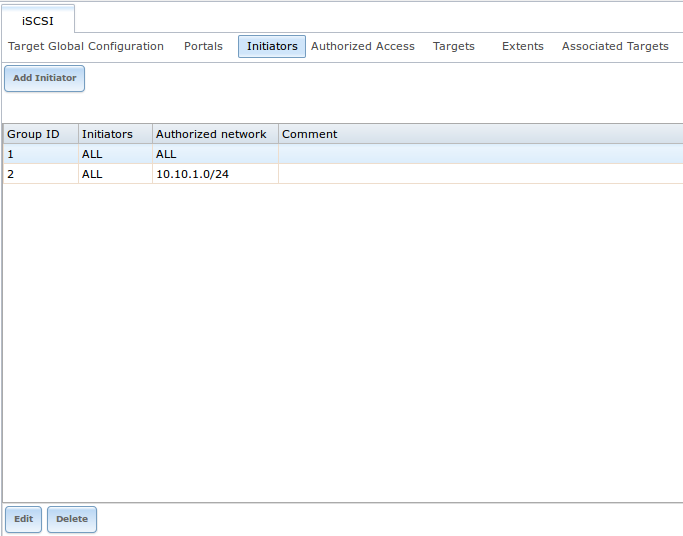

.. _Authorized Accesses:

Authorized Accesses
~~~~~~~~~~~~~~~~~~~

If you will be using CHAP or mutual CHAP to provide authentication, you must create an authorized access in
:menuselection:`Sharing --> Block (iSCSI) --> Authorized Accesses --> Add Authorized Access`. This screen is shown in Figure 10.5e.

.. note:: this screen sets login authentication. This is different from discovery authentication which is set in `Target Global Configuration`_.

**Figure 10.5e: Adding an iSCSI Authorized Access**

|authorized1.png|

.. |authorized1.png| image:: images/authorized1.png
    :width: 3.989in
    :height: 3.8429in

Table 10.5d summarizes the settings that can be configured when adding an authorized access:

**Table 10.5d: Authorized Access Configuration Settings**

+-------------+-----------+----------------------------------------------------------------------------------------------------------------------------------+
| **Setting** | **Value** | **Description**                                                                                                                  |
|             |           |                                                                                                                                  |
+=============+===========+==================================================================================================================================+
| Group ID    | integer   | allows different groups to be configured with different authentication profiles; for instance, all users with a Group ID of *1*  |
|             |           | will inherit the authentication profile associated with Group *1*                                                                |
|             |           |                                                                                                                                  |
+-------------+-----------+----------------------------------------------------------------------------------------------------------------------------------+
| User        | string    | name of user account to create for CHAP authentication with the user on the remote system; many initiators default to using the  |
|             |           | initiator name as the user                                                                                                       |
|             |           |                                                                                                                                  |
+-------------+-----------+----------------------------------------------------------------------------------------------------------------------------------+
| Secret      | string    | password to be associated with "User"; the iSCSI standard requires that this be at least 12 characters long                      |
|             |           |                                                                                                                                  |
+-------------+-----------+----------------------------------------------------------------------------------------------------------------------------------+
| Peer User   | string    | only input when configuring mutual CHAP; in most cases it will need to be the same value as "User"                               |
|             |           |                                                                                                                                  |
+-------------+-----------+----------------------------------------------------------------------------------------------------------------------------------+
| Peer Secret | string    | the mutual secret password which **must be different than the "Secret"**; required if the                                        |
|             |           | "Peer User" is set                                                                                                               |
|             |           |                                                                                                                                  |
+-------------+-----------+----------------------------------------------------------------------------------------------------------------------------------+

.. note:: CHAP does not work with GlobalSAN initiators on Mac OS X.

As authorized accesses are added, they will be listed under View Authorized Accesses. In the example shown in Figure 10.5f, three users (*test1*,
*test2*, and
*test3*) and two groups (
*1* and
*2*) have been created, with group 1 consisting of one CHAP user and group 2 consisting of one mutual CHAP user and one CHAP user. Click an authorized access
entry to display its "Edit" and "Delete" buttons.

**Figure 10.5f: Viewing Authorized Accesses**

|authorized2.png|

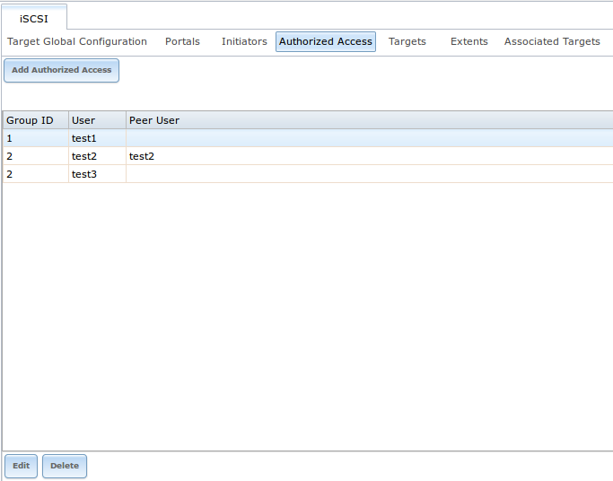

.. _Targets:

Targets
~~~~~~~

Next, create a Target using :menuselection:`Sharing --> Block (iSCSI) --> Targets --> Add Target`, as shown in Figure 10.5g. A target combines a portal ID,
allowed initiator ID, and an authentication method. Table 10.5e summarizes the settings that can be configured when creating a Target.

.. note:: an iSCSI target creates a block device that may be accessible to multiple initiators. A clustered filesystem is required on the block device, such
   as VMFS used by VMware ESX/ESXi, in order for multiple initiators to mount the block device read/write. If a traditional filesystem such as EXT, XFS, FAT,
   NTFS, UFS, or ZFS is placed on the block device, care must be taken that only one initiator at a time has read/write access or the result will be
   filesystem corruption. If you need to support multiple clients to the same data on a non-clustered filesystem, use CIFS or NFS instead of iSCSI or create
   multiple iSCSI targets (one per client).

**Figure 10.5g: Adding an iSCSI Target**

|target1png|

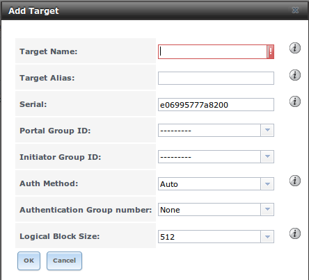

**Table 10.5e: Target Settings**

+-----------------------------+----------------+-------------------------------------------------------------------------------------------------------------+
| **Setting**                 | **Value**      | **Description**                                                                                             |
|                             |                |                                                                                                             |
|                             |                |                                                                                                             |
+=============================+================+=============================================================================================================+
| Target Name                 | string         | required value; base name will be appended automatically if it does not start with *iqn*                    |
|                             |                |                                                                                                             |
+-----------------------------+----------------+-------------------------------------------------------------------------------------------------------------+
| Target Alias                | string         | optional user-friendly name                                                                                 |
|                             |                |                                                                                                             |
+-----------------------------+----------------+-------------------------------------------------------------------------------------------------------------+
| Serial                      | string         | unique ID for target to allow for multiple LUNs; the default is generated from the system's MAC address     |
|                             |                |                                                                                                             |
+-----------------------------+----------------+-------------------------------------------------------------------------------------------------------------+
| Portal Group ID             | drop-down menu | leave empty or select number of existing portal to use                                                      |
|                             |                |                                                                                                             |
+-----------------------------+----------------+-------------------------------------------------------------------------------------------------------------+
| Initiator Group ID          | drop-down menu | select which existing initiator group has access to the target                                              |
|                             |                |                                                                                                             |
+-----------------------------+----------------+-------------------------------------------------------------------------------------------------------------+
| Auth Method                 | drop-down menu | choices are *None*,                                                                                         |
|                             |                | *Auto*,                                                                                                     |
|                             |                | *CHAP*, or                                                                                                  |
|                             |                | *Mutual CHAP*                                                                                               |
|                             |                |                                                                                                             |
+-----------------------------+----------------+-------------------------------------------------------------------------------------------------------------+
| Authentication Group number | drop-down menu | *None* or integer representing number of existing authorized access                                         |
|                             |                |                                                                                                             |
+-----------------------------+----------------+-------------------------------------------------------------------------------------------------------------+
| Logical Block Size          | drop-down menu | should only be changed to emulate a physical disk's size or to increase the block size to allow for larger  |
|                             |                | filesystems on an operating system limited by block count                                                   |
|                             |                |                                                                                                             |
+-----------------------------+----------------+-------------------------------------------------------------------------------------------------------------+

.. _Extents:

Extents
~~~~~~~

In iSCSI, the target virtualizes something and presents it as a device to the iSCSI client. That something can be a device extent or a file extent:

**Device extent:** virtualizes an unformatted physical disk, RAID controller, zvol, zvol snapshot, or an existing
`HAST device <http://www.freebsd.org/doc/en_US.ISO8859-1/books/handbook/disks-hast.html>`_.

Virtualizing a single disk is slow as there is no caching but virtualizing a hardware RAID controller has higher performance due to its cache. This type of
virtualization does a pass-through to the disk or hardware RAID controller. None of the benefits of ZFS are provided and performance is limited to the
capabilities of the disk or controller.

Virtualizing a zvol adds the benefits of ZFS such as its read cache and write cache. Even if the client formats the device extent with a different filesystem,
as far as FreeNAS® is concerned, the data benefits from ZFS features such as block checksums and snapshots. A zvol is also required in order to take
advantage of VAAI primitives and should be used when using virtualization software as the iSCSI initiator.

**File extent:** allows you to export a portion of a ZFS volume. The advantage of a file extent is that you can create multiple exports per volume.

.. warning::  for performance reasons and to avoid excessive fragmentation, it is recommended to keep the used space of an extent below 50%. As required, you
   can increase the capacity of an extent using the instructions in :ref:`Growing LUNs`.

To add an extent, go to :menuselection:`Services --> ISCSI --> Extents --> Add Extent`. In the example shown in Figure 10.5h, the device extent is using the
:file:`export` zvol that was previously created from the :file:`/mnt/volume1` volume.

.. note:: in FreeNAS® versions prior to 8.3.1, if a physical disk was used instead of a zvol to create a device extent, a bug wiped the partition table on
   the disk, resulting in data loss. This bug was fixed in 8.3.1.

Table 10.5f summarizes the settings that can be configured when creating an extent. Note that
**file extent creation will fail if you do not append the name of the file to be created to the volume/dataset name.**

**Figure 10.5h: Adding an iSCSI Extent**

|extent.png|

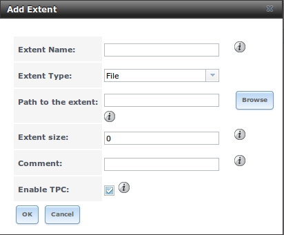

**Table 10.5f: Extent Configuration Settings**

+--------------------+----------------+----------------------------------------------------------------------------------------------------------------------+
| **Setting**        | **Value**      | **Description**                                                                                                      |
|                    |                |                                                                                                                      |
+====================+================+======================================================================================================================+
| Extent Name        | string         | name of extent; if the "Extent size" is not *0*, it can not be an existing file within the volume/dataset            |
|                    |                |                                                                                                                      |
+--------------------+----------------+----------------------------------------------------------------------------------------------------------------------+
| Extent Type        | drop-down menu | select from *File* or                                                                                                |
|                    |                | *Device*                                                                                                             |
|                    |                |                                                                                                                      |
+--------------------+----------------+----------------------------------------------------------------------------------------------------------------------+
| Path to the extent | browse button  | only appears if *File* is selected; either browse to an existing file and use                                        |
|                    |                | *0* as the "Extent size",                                                                                            |
|                    |                | **or** browse to the volume or dataset, click the "Close" button, append the "Extent Name" to the path, and specify  |
|                    |                | a value in "Extent size"                                                                                             |
|                    |                |                                                                                                                      |
+--------------------+----------------+----------------------------------------------------------------------------------------------------------------------+
| Device             | drop-down menu | only appears if *Device* is selected; select the unformatted disk, controller, zvol, zvol snapshot, or HAST device   |
|                    |                |                                                                                                                      |
+--------------------+----------------+----------------------------------------------------------------------------------------------------------------------+
| Extent size        | integer        | only appears if *File* is selected; if the size is specified as                                                      |
|                    |                | *0*, the file must already exist and the actual file size will be used; otherwise specifies the size of the file to  |
|                    |                | create                                                                                                               |
|                    |                |                                                                                                                      |
+--------------------+----------------+----------------------------------------------------------------------------------------------------------------------+
| Available Size     | string         | only appears if a zvol is selected as the "Device"; when the specified capacity is reached, the system will issue an |
| Threshold          |                | alert                                                                                                                |
|                    |                |                                                                                                                      |
+--------------------+----------------+----------------------------------------------------------------------------------------------------------------------+
| Logical Block Size | drop-down menu | only appears if *File* is selected; some initiators (MS SQL) do not like large physical block sizes; only override   |
|                    |                | the default if the initiator requires a different block size                                                         |
|                    |                |                                                                                                                      |
+--------------------+----------------+----------------------------------------------------------------------------------------------------------------------+
| Disable Physical   | checkbox       | if the initiator does not support physical block size values over 4K, check this box                                 |
| Block Size         |                |                                                                                                                      |
| Reporting          |                |                                                                                                                      |
|                    |                |                                                                                                                      |
+--------------------+----------------+----------------------------------------------------------------------------------------------------------------------+
| Comment            | string         | optional                                                                                                             |
|                    |                |                                                                                                                      |
+--------------------+----------------+----------------------------------------------------------------------------------------------------------------------+
| Enable TPC         | checkbox       | if checked, an initiator can bypass normal access control and access any scannable target; this allows               |
|                    |                | :command:`xcopy` operations otherwise blocked by access control                                                      |
|                    |                |                                                                                                                      |
+--------------------+----------------+----------------------------------------------------------------------------------------------------------------------+
| Xen initiator      | checkbox       | check this box when using Xen as the iSCSI initiator                                                                 |
| compat mode        |                |                                                                                                                      |
|                    |                |                                                                                                                      |
+--------------------+----------------+----------------------------------------------------------------------------------------------------------------------+

.. _Targets/Extents:

Target/Extents
~~~~~~~~~~~~~~

The last step is associating an extent to a target within :menuselection:`Sharing --> Block (iSCSI) --> Target/Extents --> Add Target/Extent`. This screen is
shown in Figure 10.5i. Use the drop-down menus to select the existing target and extent.

Table 10.5g summarizes the settings that can be configured when associating targets and extents.

**Table 10.5g: Target/Extents Configuration Settings**

+-------------+----------------+--------------------------------------------------------------------------------------------------------+
| **Setting** | **Value**      | **Description**                                                                                        |
|             |                |                                                                                                        |
+=============+================+========================================================================================================+
| LUN ID      | drop-down menu | specify the ID of the LUN; the default of *Auto* will select the next available LUN ID, starting at 0  |
|             |                |                                                                                                        |
+-------------+----------------+--------------------------------------------------------------------------------------------------------+
| Target      | drop-down menu | select the pre-created target                                                                          |
|             |                |                                                                                                        |
+-------------+----------------+--------------------------------------------------------------------------------------------------------+
| Extent      | drop-down menu | select the pre-created extent                                                                          |
|             |                |                                                                                                        |
+-------------+----------------+--------------------------------------------------------------------------------------------------------+

It is recommended to always associate extents to targets in a 1:1 manner, even though the GUI will allow multiple extents to be associated with the same
target.

Once iSCSI has been configured, don't forget to start it in :menuselection:`Services --> Control Services`. Click the red "OFF" button next to iSCSI. After a
second or so, it will change to a blue ON, indicating that the service has started.

.. _Connecting to iSCSI:

Connecting to iSCSI
~~~~~~~~~~~~~~~~~~~

In order to access the iSCSI target, clients will need to use iSCSI initiator software.

An iSCSI Initiator client is pre-installed with Windows 7. A detailed how-to for this client can be found
`here <http://www.windowsnetworking.com/articles_tutorials/Connecting-Windows-7-iSCSI-SAN.html>`__. A client for Windows 2000, XP, and 2003 can be found
`here <http://www.microsoft.com/downloads/en/details.aspx?FamilyID=12cb3c1a-15d6-4585-b385-befd1319f825>`__. This
`how-to <http://www.trainsignal.com/blog/freenas-8-iscsi-target-windows-7>`_
shows how to create an iSCSI target for a Windows 7 system.

Mac OS X does not include an initiator.
`globalSAN <http://www.studionetworksolutions.com/products/product_detail.php?pi=11>`_
is a commercial, easy-to-use Mac initiator.

BSD systems provide command line initiators:
`iscontrol(8) <http://www.freebsd.org/cgi/man.cgi?query=iscontrol>`_
comes with FreeBSD versions 9.x and lower,
`iscsictl(8) <https://www.freebsd.org/cgi/man.cgi?query=iscsictl>`_
comes with FreeBSD versions 10.0 and higher,
`iscsi-initiator(8) <http://netbsd.gw.com/cgi-bin/man-cgi?iscsi-initiator++NetBSD-current>`_
comes with NetBSD, and
`iscsid(8) <http://www.openbsd.org/cgi-bin/man.cgi?query=iscsid>`_
comes with OpenBSD.

Some Linux distros provide the command line utility :command:`iscsiadm` from
`Open-iSCSI <http://www.open-iscsi.org/>`_. Use a web search to see if a package exists for your distribution should the command not exist on your Linux
system.

If you add a LUN while :command:`iscsiadm` is already connected, it will not see the new LUN until you rescan using :command:`iscsiadm -m node -R`.
Alternately, use :command:`iscsiadm -m discovery -t st -p portal_IP` to find the new LUN and :command:`iscsiadm -m node -T LUN_Name -l` to log into the LUN.

Instructions for connecting from a VMware ESXi Server can be found at
`How to configure FreeNAS 8 for iSCSI and connect to ESX(i) <http://www.vladan.fr/how-to-configure-freenas-8-for-iscsi-and-connect-to-esxi/>`_. Note that the
requirements for booting vSphere 4.x off iSCSI differ between ESX and ESXi. ESX requires a hardware iSCSI adapter while ESXi requires specific iSCSI boot
firmware support. The magic is on the booting host side, meaning that there is no difference to the FreeNAS® configuration. See the
`iSCSI SAN Configuration Guide <http://www.vmware.com/pdf/vsphere4/r41/vsp_41_iscsi_san_cfg.pdf>`_
for details.

If you can see the target but not connect to it, check the "Discovery Auth" settings in "Target Global Configuration".

If the LUN is not discovered by ESXi, make sure that promiscuous mode is set to "Accept" in the vSwitch.

.. _Growing LUNs:

Growing LUNs
~~~~~~~~~~~~

The method used to grow the size of an existing iSCSI LUN depends on whether the LUN is backed by a file extent or a zvol. Both methods are described in this
section.

After the LUN is expanded using one of the methods below, use the tools from the initiator software to grow the partitions and the filesystems it contains.

.. _Zvol Based LUN:

Zvol Based LUN
^^^^^^^^^^^^^^

To grow a zvol based LUN, go to :menuselection:`Storage --> Volumes --> View Volumes`, highlight the zvol to be grown, and click its "Edit zvol" button. In
the example shown in Figure 10.5j, the current size of the zvol named *zvol1* is 4GB.

**Figure 10.5j: Editing an Existing Zvol**

|grow.png|

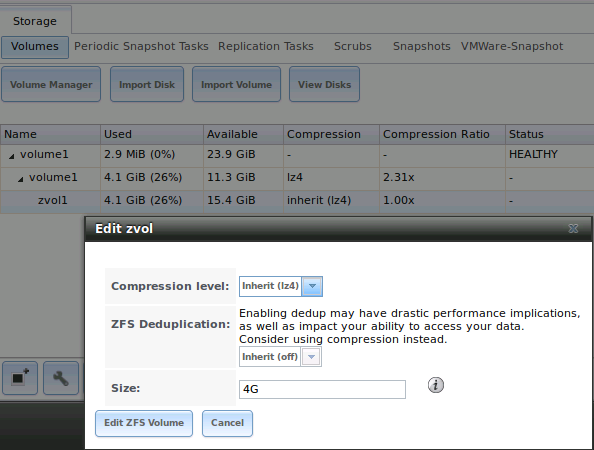

Input the new size for the zvol in the "Size" field and click the "Edit ZFS Volume" button. This menu will close and the new size for the zvol will
immediately show in the "Used" column of the "View Volumes" screen.

.. _File Extent Based LUN:

File Extent Based LUN
^^^^^^^^^^^^^^^^^^^^^

To grow a file extent based LUN, go to :menuselection:`Services --> iSCSI --> File Extents --> View File Extents` to determine the path of the file extent to
grow. Open Shell to grow the extent. This example grows :file:`/mnt/volume1/data` by 2G::

 truncate -s +2g /mnt/volume1/data

Go back to :menuselection:`Services --> iSCSI --> File Extents --> View File Extents` and click the "Edit" button for the file extent. Set the size to *0* as
this causes the iSCSI target to use the new size of the file.
