.. _Storage:

Storage
=======

The Storage section of the graphical interface allows you to configure the following:

* :ref:`Volumes`: used to create and manage storage volumes.

* :ref:`Periodic Snapshot Tasks`: used to schedule the automatic creation of filesystem snapshots.

* :ref:`Replication Tasks`: used to schedule the replication of snapshots to a remote system.

* :ref:`Scrubs`: used to schedule scrubs as part of ongoing disk maintenance.

* :ref:`Snapshots`: used to manage local snapshots.

* :ref:`VMware-Snapshot`: is used to coordinate ZFS snapshots with a VWware datastore.

These configurations are described in more detail in this section.

.. index:: Volumes
.. _Volumes:

Volumes
-------

The "Volumes" section of the FreeNAS® graphical interface can be used to format ZFS pools, import a disk in order to copy its data into an existing pool, or
import an existing ZFS pool. It can also be used to create ZFS datasets and zvols and to manage their permissions.

.. note:: in ZFS terminology, the storage that is managed by ZFS is referred to as a pool. The FreeNAS® graphical interface uses the term volume to refer to
   a ZFS pool.

Proper storage design is important for any NAS.
**It is recommended that you read through this entire chapter first, before configuring your storage disks, so that you are aware of all of the possible features, know which ones will benefit your setup most, and are aware of any caveats or hardware restrictions.**

.. _Volume Manager:

Volume Manager
~~~~~~~~~~~~~~

If you have unformatted disk(s) or wish to overwrite the current filesystem and data on your disk(s), use "Volume Manager" to format the disk(s) into a ZFS
pool. If you have multiple disks and are new to how ZFS handles redundancy, skim through the :ref:`ZFS Primer` before using "Volume Manager".

If you click on :menuselection:`Storage --> Volumes --> Volume Manager`, you will see a screen similar to the example shown in Figure 8.1a.

**Figure 8.1a: Creating a ZFS Pool Using Volume Manager**

|zfs1a.png|

.. |zfs1a.png| image:: images/zfs1a.png
    :width: 8.2in
    :height: 4.2in

Table 8.1a summarizes the configuration options of this screen.

**Table 8.1a: Options When Creating a ZFS Volume**

+------------------+----------------+--------------------------------------------------------------------------------------------+
| **Setting**      | **Value**      | **Description**                                                                            |
|                  |                |                                                                                            |
+==================+================+============================================================================================+
| Volume name      | string         | ZFS volumes must conform to these                                                          |
|                  |                | `naming conventions <http://docs.oracle.com/cd/E23824_01/html/821-1448/gbcpt.html>`__;     |
|                  |                | it is recommended to choose a name that will stick out in the logs (e.g. **not**           |
|                  |                | :file:`data` or :file:`freenas`)                                                           |
|                  |                |                                                                                            |
+------------------+----------------+--------------------------------------------------------------------------------------------+
| Volume to extend | drop-down menu | used to extend an existing ZFS pool; see :ref:`Extending a ZFS Volume` for instructions    |
|                  |                |                                                                                            |
+------------------+----------------+--------------------------------------------------------------------------------------------+
| Encryption       | checkbox       | read the section on :ref:`Encryption` before choosing to use encryption                    |
|                  |                |                                                                                            |
+------------------+----------------+--------------------------------------------------------------------------------------------+
| Available disks  | display        | displays the number and size of available disks; hover over "show" to list the available   |
|                  |                | device names; click the *+* to add all of the disks to the pool                            |
|                  |                |                                                                                            |
+------------------+----------------+--------------------------------------------------------------------------------------------+
| Volume layout    | drag and drop  | click and drag the icon to select the desired number of disks for a vdev; once at least    |
|                  |                | one disk is selected, the layouts supported by the selected number of disks will be        |
|                  |                | added to the drop-down menu                                                                |
|                  |                |                                                                                            |
+------------------+----------------+--------------------------------------------------------------------------------------------+
| Add Extra Device | button         | used to configure multiple vdevs or to add log or cache devices during pool creation       |
|                  |                |                                                                                            |
+------------------+----------------+--------------------------------------------------------------------------------------------+
| Manual setup     | button         | used to make a non-optimal pool (not recommended); see :ref:`Manual Setup` for details     |
|                  |                |                                                                                            |
+------------------+----------------+--------------------------------------------------------------------------------------------+

To configure the pool, drag the slider to select the desired number of disks. "Volume Manager" will display the resulting storage capacity, which takes
swap into account. If you wish to change the layout or the number of disks, use the mouse to drag the slider to the desired volume layout. The "Volume layout"
drop-down menu can also be clicked if a different level of redundancy is required.

.. note:: for performance and capacity reasons, this screen will not allow you to create a volume from disks of differing sizes. While it is not recommended,
   it is possible to create a volume in this situation by using the "Manual setup" button and following the instructions in :ref:`Manual Setup`.

"Volume Manager" will not allow you to select a configuration if the number of disks selected is not enough to create that configuration. The following layouts
are supported:

* **Stripe:** requires at least one disk

* **Mirror:** requires at least two disks

* **RAIDZ1:** requires at least three disks

* **RAIDZ2:** requires at least four disks

* **RAIDZ3:** requires at least five disks

* **log device:** requires at least one dedicated device, where an SSD is recommended

* **cache device:** requires at least one dedicated device, where an SSD is recommended

If you have more than five disks and are using ZFS, consider the number of disks to use for best performance and scalability. An overview of the recommended
disk group sizes as well as more information about log and cache devices can be found in the :ref:`ZFS Primer`.

The "Add Volume" button warns that **existing data will be cleared**. In other words, creating a new volume reformats the selected disks. If your intent is to
**not** overwrite the data on an existing volume, click the "Cancel" button and refer to :ref:`Import Disk` and :ref:`Import Volume` to see if the existing
format is supported. If so, perform that supported action instead. If the current storage format is not supported, you will need to backup the data to an
external media, format the disks, then restore the data to the new volume.

Depending upon the size and number of disks, the type of controller, and whether or not encryption is selected, creating the volume may take some time. Once
the volume is created, the screen will refresh and the new volume will be listed in the tree under :menuselection:`Storage --> Volumes`. Click the *+* next to
the volume name to access its :ref:`Change Permissions`, :ref:`Create Dataset`, and :ref:`Create zvol` options.

.. index:: Encryption
.. _Encryption:

Encryption
^^^^^^^^^^

Beginning with 8.3.1, FreeNAS® supports
`GELI <http://www.freebsd.org/cgi/man.cgi?query=geli>`_
full disk encryption when creating ZFS volumes. It is important to understand the following when considering whether or not encryption is right for your
FreeNAS® system:

* This is **not** the encryption method used by Oracle's version of ZFS as that version is not open source and is the property of Oracle.

* This is full disk encryption and **not** per-filesystem encryption. The underlying drives are first encrypted, then the pool is created on top of the
  encrypted devices.

* This type of encryption is primarily targeted at users who store sensitive data and want to retain the ability to remove disks from the pool without
  having to first wipe the disk's contents.

* This design is only suitable for safe disposal of disks independent of the encryption key. As long as the key and the disks are intact, the system is
  vulnerable to being decrypted. The key should be protected by a strong passphrase and any backups of the key should be securely stored.

* On the other hand, if the key is lost, the data on the disks is inaccessible. Always backup the key!

.. warning:: the per-drive GELI master keys are not backed up along with the user keys. If a bit error occurs in the last sector of an encrypted disk, this
   may mean the data on that disk is completely lost. Until this issue is resolved, it is important to read
   `this forum post <http://forums.freenas.org/threads/please-validate-my-backup-plan-rotating-offsite-backup-disks-from-single-freenas-primary-storage.17316/#post-93073>`__
   which explains how to back up your master keys manually.
   `This forum post <http://forums.freenas.org/threads/recover-encryption-key.16593/#post-85497>`_
   gives an in-depth explanation of how the various key types are used by GELI.
   To track future progress on this issue, refer to `this bug report <https://bugs.freenas.org/issues/2375>`_.

* The encryption key is per ZFS volume (pool). If you create multiple pools, each pool has its own encryption key.

* If the system has a lot of disks, there will be a performance hit if the CPU does not support
  `AES-NI <http://en.wikipedia.org/wiki/AES-NI#Supporting_CPUs>`_
  or if no crypto hardware is installed. Without hardware acceleration, there will be about a 20% performance hit for a single disk. Performance degradation
  will continue to increase with more disks. As data is written, it is automatically encrypted and as data is read, it is decrypted on the fly. If the
  processor does support the AES-NI instruction set, there should be very little, if any, degradation in performance when using encryption. This
  `forum post <http://forums.freenas.org/showthread.php?12157-Encryption-performance-benchmarks>`__
  compares the performance of various CPUs.

* Data in the ARC cache and the contents of RAM are unencrypted.

* Swap is always encrypted, even on unencrypted volumes.

* There is no way to convert an existing, unencrypted volume. Instead, the data must be backed up, the existing pool must be destroyed, a new encrypted
  volume must be created, and the backup restored to the new volume.

* Hybrid pools are not supported. In other words, newly created vdevs must match the existing encryption scheme. When extending a volume, Volume Manager
  will automatically encrypt the new vdev being added to the existing encrypted pool.

.. note:: the encryption facility used by FreeNAS® is designed to protect against physical theft of the disks. It is not designed to protect against
   unauthorized software access. Ensure that only authorized users have access to the administrative GUI and that proper permissions are set on shares if
   sensitive data is stored on the system.

To create an encrypted volume, check the "Encryption" box shown in Figure 8.1a. A pop-up message will remind you that
**it is extremely important** to set a passphrase on the key, make a backup of the key, and create a recovery key. Refer to
:ref:`Managing Encrypted Volumes` for instructions on how to perform those tasks.

.. _Manual Setup:

Manual Setup
^^^^^^^^^^^^

The "Manual Setup" button shown in Figure 8.1a can be used to create a non-optimal ZFS volume. While this is **not** recommended, it can, for example, be used
to create a volume containing disks of different sizes.

.. note:: when using disks of differing sizes, the volume is limited by the size of the smallest disk. For this reason, it is recommended to instead use
   "Volume Manager" with same-size disks.

Figure 8.1b shows the "Manual Setup" screen and Table 8.1b summarizes the available options.

**Figure 8.1b: Creating a Non-Optimal ZFS Volume**

|manual.png|

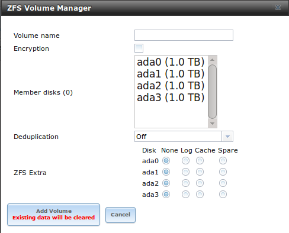

**Table 8.1b: Manual Setup Options**

+---------------+------------------+------------------------------------------------------------------------------------------------+
| **Setting**   | **Value**        | **Description**                                                                                |
|               |                  |                                                                                                |
|               |                  |                                                                                                |
+===============+==================+================================================================================================+
| Volume name   | string           | ZFS volumes must conform to these                                                              |
|               |                  | `naming conventions <http://docs.oracle.com/cd/E19082-01/817-2271/gbcpt/index.html>`_ ;        |
|               |                  | it is recommended to choose a name that will stick out in the logs (e.g.                       |
|               |                  | **not** :file:`data` or :file:`freenas`)                                                       |
|               |                  |                                                                                                |
+---------------+------------------+------------------------------------------------------------------------------------------------+
| Encryption    | checkbox         | read the section on `Encryption`_ before choosing to use encryption                            |
|               |                  |                                                                                                |
+---------------+------------------+------------------------------------------------------------------------------------------------+
| Member disks  | list             | highlight desired number of disks from list of available disks                                 |
|               |                  |                                                                                                |
+---------------+------------------+------------------------------------------------------------------------------------------------+
| Deduplication | drop-down menu   | choices are *Off*,                                                                             |
|               |                  | *Verify*, and                                                                                  |
|               |                  | *On*; carefully consider the section on `Deduplication`_ before changing this setting          |
|               |                  |                                                                                                |
+---------------+------------------+------------------------------------------------------------------------------------------------+
| ZFS Extra     | bullet selection | used to specify if disk is used for storage (*None*), a log device, a cache device, or a spare |
|               |                  |                                                                                                |
+---------------+------------------+------------------------------------------------------------------------------------------------+

.. _Extending a ZFS Volume:

Extending a ZFS Volume
^^^^^^^^^^^^^^^^^^^^^^

The "Volume to extend" drop-down menu in :menuselection:`Storage --> Volumes --> Volume Manager`, shown in Figure 8.1a, can be used to add additional
disks to an existing ZFS volume. This drop-down menu will be empty if no ZFS volume exists.

.. note:: if the existing volume is encrypted, a warning message will remind you that the operation of extending a volume will reset the passphrase and
   recovery key. After extending the volume, you should immediately recreate both using the instructions in :ref:`Managing Encrypted Volumes`.

Once an existing volume has been selected from the drop-down menu, drag and drop the desired disk(s) and select the desired volume layout. For example you
can:

* select an SSD with a volume layout of "Log (ZIL)" to add a log device to the ZFS pool. Selecting 2 SSDs will create a mirrored log device.

* select an SSD with a volume layout of "Cache (L2ARC)" to add a cache device to the ZFS pool.

* add additional disks to increase the capacity of the ZFS pool. The caveats to doing this are described below.

When adding disks to increase the capacity of a volume, ZFS supports the addition of virtual devices, known as vdevs, to an existing ZFS pool. A vdev can be a
single disk, a stripe, a mirror, a RAIDZ1, RAIDZ2, or a RAIDZ3. **Once a vdev is created, you can not add more drives to that vdev**; however, you can stripe
a new vdev (and its disks) with the **same type of existing vdev** in order to increase the overall size of ZFS the pool. In other words, when you extend a
ZFS volume, you are really striping similar vdevs. Here are some examples:

* to extend a ZFS stripe, add one or more disks. Since there is no redundancy, you do not have to add the same amount of disks as the existing stripe.

* to extend a ZFS mirror, add the same number of drives. The resulting striped mirror is a RAID 10. For example, if you have 10 drives, you could start by
  creating a mirror of two drives, extending this mirror by creating another mirror of two drives, and repeating three more times until all 10 drives have
  been added.

* to extend a three drive RAIDZ1, add three additional drives. The result is a RAIDZ+0, similar to RAID 50 on a hardware controller.

* to extend a RAIDZ2 requires a minimum of four additional drives. The result is a RAIDZ2+0, similar to RAID 60 on a hardware controller.

If you try to add an incorrect number of disks to the existing vdev, an error message will appear, indicating the number of disks that are needed. You will
need to select the correct number of disks in order to continue.

.. _Change Permissions:

Change Permissions
~~~~~~~~~~~~~~~~~~

Setting permissions is an important aspect of configuring volumes. The graphical administrative interface is meant to set the **initial** permissions for a
volume or dataset in order to make it available as a share. Once a share is available, the client operating system should be used to fine-tune the
permissions of the files and directories that are created by the client.

The chapter on :ref:`Sharing` contains configuration examples for several types of permission scenarios. This section provides an overview of the screen that
is used to set permissions.

Once a volume or dataset is created, it will be listed by its mount point name in :menuselection:`Storage --> Volumes --> View Volumes`. If you click the
"Change Permissions" icon for a specific volume/dataset, you will see the screen shown in Figure 8.1c. Table 8.1c summarizes the options in this screen.

**Figure 8.1c: Changing Permissions on a Volume or Dataset**

|perms1.png|

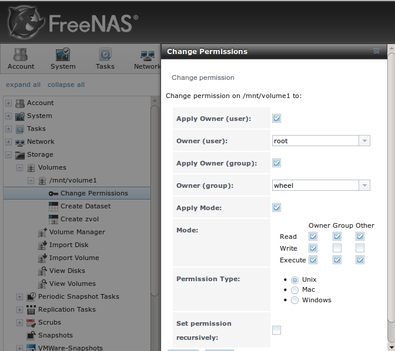

**Table 8.1c: Options When Changing Permissions**

+----------------------------+------------------+------------------------------------------------------------------------------------------------------------+
| **Setting**                | **Value**        | **Description**                                                                                            |
|                            |                  |                                                                                                            |
|                            |                  |                                                                                                            |
+============================+==================+============================================================================================================+
| Apply Owner (user)         | checkbox         | uncheck to prevent new permission change from being applied to "Owner (user)", see NOTE below              |
|                            |                  |                                                                                                            |
+----------------------------+------------------+------------------------------------------------------------------------------------------------------------+
| Owner (user)               | drop-down menu   | user to control the volume/dataset; users which were manually created or imported from a directory service |
|                            |                  | will appear in the drop-down menu                                                                          |
|                            |                  |                                                                                                            |
+----------------------------+------------------+------------------------------------------------------------------------------------------------------------+
| Apply Owner (group)        | checkbox         | uncheck to prevent new permission change from being applied to "Owner (group)", see NOTE below             |
|                            |                  |                                                                                                            |
+----------------------------+------------------+------------------------------------------------------------------------------------------------------------+
| Owner (group)              | drop-down menu   | group to control the volume/dataset; groups which were manually created or imported from a directory       |
|                            |                  | service will appear in the drop-down menu                                                                  |
|                            |                  |                                                                                                            |
+----------------------------+------------------+------------------------------------------------------------------------------------------------------------+
| Apply Mode                 | checkbox         | uncheck to prevent new permission change from being applied to "Mode", see NOTE below                      |
|                            |                  |                                                                                                            |
+----------------------------+------------------+------------------------------------------------------------------------------------------------------------+
| Mode                       | checkboxes       | only applies to the *Unix*                                                                                 |
|                            |                  | or *Mac* "Permission Type" so will be greyed out if                                                        |
|                            |                  | *Windows* is selected                                                                                      |
|                            |                  |                                                                                                            |
+----------------------------+------------------+------------------------------------------------------------------------------------------------------------+
| Permission Type            | bullet selection | choices are *Unix*,                                                                                        |
|                            |                  | *Mac* or                                                                                                   |
|                            |                  | *Windows*; select the type which matches the type of client accessing the volume/dataset                   |
|                            |                  |                                                                                                            |
+----------------------------+------------------+------------------------------------------------------------------------------------------------------------+
| Set permission recursively | checkbox         | if checked, permissions will also apply to subdirectories of the volume/dataset; if data already exists    |
|                            |                  | on the volume/dataset, change the permissions on the **client side** to prevent a performance lag          |
|                            |                  |                                                                                                            |
+----------------------------+------------------+------------------------------------------------------------------------------------------------------------+

.. note:: the "Apply Owner (user)", "Apply Owner (group)", and "Apply Mode" checkboxes allow you to fine-tune the change permissions behavior. By default, all
          boxes are checked and FreeNAS® resets the owner, group, and mode whenever the "Change" button is clicked. These checkboxes allow you to fine-tune
          which settings to change. For example, to just change the "Owner (group)" setting, uncheck the boxes "Apply Owner (user)" and "Apply Mode".

If you have a mix of operating systems or clients will be accessing the volume/dataset using a non-CIFS share, select the *Unix* "Permission Type" as all
clients understand them. 

The *Windows* "Permission Type" augments traditional
*Unix* permissions with ACLs. Use the 
*Windows* "Permission Type" for CIFS shares or when the FreeNAS® system  is a member of an Active Directory domain.

If you change your mind about the "Permission Type", you do not have to recreate the volume/dataset as existing data is not lost. However, if you change from
*Windows* to 
*Unix* or
*Mac*, the extended permissions provided by ACLs will be removed from the existing files.

When you select the *Windows* "Permission Type", the ACLs are set to what Windows sets on new files and directories by default. The Windows client should then
be used to fine-tune the permissions as required.

.. index:: Create Dataset
.. _Create Dataset:

Create Dataset
~~~~~~~~~~~~~~

An existing ZFS volume can be divided into datasets. Permissions, compression, deduplication, and quotas can be set on a per-dataset basis, allowing more
granular control over access to storage data. A dataset is similar to a folder in that you can set permissions; it is also similar to a filesystem in that
you can set properties such as quotas and compression as well as create snapshots.

.. note:: ZFS provides thick provisioning using quotas and thin provisioning using reserved space.

If you select an existing ZFS volume in the tree then click "Create Dataset", you will see the screen shown in Figure 8.1d.

**Figure 8.1d: Creating a ZFS Dataset**

|dataset.png|

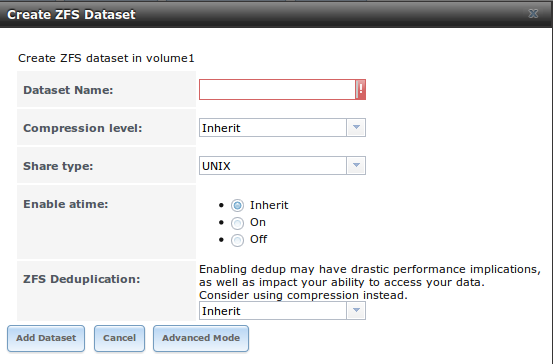

Table 8.1d summarizes the options available when creating a ZFS dataset. Some settings are only available in "Advanced Mode". To see these settings, either
click the "Advanced Mode" button or configure the system to always display these settings by checking the box "Show advanced fields by default" in
:menuselection:`System --> Advanced`. Most attributes, except for the "Dataset Name" and  "Record Size", can be changed after dataset creation by highlighting
the dataset name and clicking its "Edit Options" button in :menuselection:`Storage --> Volumes --> View Volumes`.

**Table 8.1d: ZFS Dataset Options**

+--------------------------+---------------------+-----------------------------------------------------------------------------------------------------------+
| **Setting**              | **Value**           | **Description**                                                                                           |
|                          |                     |                                                                                                           |
+==========================+=====================+===========================================================================================================+
| Dataset Name             | string              | mandatory; input a name for the dataset                                                                   |
|                          |                     |                                                                                                           |
+--------------------------+---------------------+-----------------------------------------------------------------------------------------------------------+
| Compression Level        | drop-down menu      | see the section on :ref:`Compression` for a description of the available algorithms                       |
|                          |                     |                                                                                                           |
+--------------------------+---------------------+-----------------------------------------------------------------------------------------------------------+
| Share type               | drop-down menu      | select the type of share that will be used on the dataset; choices are *UNIX* for an NFS share,           |
|                          |                     | *Windows* for a CIFS share, or                                                                            |
|                          |                     | *Mac* for an AFP share                                                                                    |
|                          |                     |                                                                                                           |
+--------------------------+---------------------+-----------------------------------------------------------------------------------------------------------+
| Case Sensitivity         | drop-down menu      | choices are *sensitive* (default, assumes filenames are case sensitive),                                  |
|                          |                     | *insensitive* (assumes filenames are not case sensitive), or                                              |
|                          |                     | *mixed* (understands both types of filenames)                                                             |
|                          |                     |                                                                                                           |
+--------------------------+---------------------+-----------------------------------------------------------------------------------------------------------+
| Enable atime             | Inherit, On, or Off | controls whether the access time for files is updated when they are read; setting this property to *Off*  |
|                          |                     | avoids producing log traffic when reading files and can result in significant performance gains           |
|                          |                     |                                                                                                           |
+--------------------------+---------------------+-----------------------------------------------------------------------------------------------------------+
| Quota for this dataset   | integer             | only available in "Advanced Mode"; default of 0 is off; e.g. *20GiB* for 20 GB                            |
|                          |                     |                                                                                                           |
+--------------------------+---------------------+-----------------------------------------------------------------------------------------------------------+
| Quota for this dataset   | integer             | only available in "Advanced Mode"; default of *0* is off; e.g. *20GiB* for 20 GB                          |
| and all children         |                     |                                                                                                           |
|                          |                     |                                                                                                           |
+--------------------------+---------------------+-----------------------------------------------------------------------------------------------------------+
| Reserved space for this  | integer             | only available in "Advanced Mode"; default of *0* is unlimited (besides hardware); e.g. *20GiB* for 20 GB |
| dataset                  |                     |                                                                                                           |
|                          |                     |                                                                                                           |
+--------------------------+---------------------+-----------------------------------------------------------------------------------------------------------+
| Reserved space for this  | integer             | only available in Advanced Mode; default of *0* is unlimited (besides hardware); e.g. *20GiB* for 20 GB   |
| dataset and all children |                     |                                                                                                           |
|                          |                     |                                                                                                           |
+--------------------------+---------------------+-----------------------------------------------------------------------------------------------------------+
| ZFS Deduplication        | drop-down menu      | read the section on :ref:`Deduplication` before making a change to this setting                           |
|                          |                     |                                                                                                           |
+--------------------------+---------------------+-----------------------------------------------------------------------------------------------------------+
| Record Size              | drop-down menu      | only available in "Advanced Mode"; while ZFS automatically adapts the record size dynamically to adapt to |
|                          |                     | data, if the data has a fixed size (e.g. a database), matching that size may result in better performance |
|                          |                     |                                                                                                           |
+--------------------------+---------------------+-----------------------------------------------------------------------------------------------------------+

Once a dataset is created, you can click on that dataset and select "Create Dataset", thus creating a nested dataset, or a dataset within a dataset. You can
also create a zvol within a dataset. When creating datasets, double-check that you are using the "Create Dataset" option for the intended volume or dataset.
If you get confused when creating a dataset on a volume, click all existing datasets to close them--the remaining "Create Dataset" will be for the volume.

.. index:: Deduplication
.. _Deduplication:

Deduplication
^^^^^^^^^^^^^

Deduplication is the process of not creating duplicate copies of data in order to save space. Depending upon the amount of duplicate data, deduplicaton can
improve storage capacity as less data is written and stored. However, the process of deduplication is RAM intensive and a general rule of thumb is 5 GB RAM
per TB of storage to be deduplicated.
**In most cases, using compression instead of deduplication will provide a comparable storage gain with less impact on performance.**

In FreeNAS®, deduplication can be enabled during dataset creation. Be forewarned that
**there is no way to undedup the data within a dataset once deduplication is enabled** as disabling deduplication has
**NO AFFECT** on existing data. The more data you write to a deduplicated dataset, the more RAM it requires and when the system starts storing the DDTs
(dedup tables) on disk because they no longer fit into RAM, performance craters. Furthermore, importing an unclean pool can require between 3-5 GB of RAM per
TB of deduped data, and if the system doesn't have the needed RAM it will panic, with the only solution being to add more RAM or to recreate the pool.
**Think carefully before enabling dedup!** This `article <http://constantin.glez.de/blog/2011/07/zfs-dedupe-or-not-dedupe>`_ provides a good description of
the value versus cost considerations for deduplication.

**Unless you have a lot of RAM and a lot of duplicate data, do not change the default deduplication setting of "Off".** For performance reasons, consider
using compression rather than turning this option on.

If deduplication is changed to *On*, duplicate data blocks are removed synchronously. The result is that only unique data is stored and common components are
shared among files. If deduplication is changed to *Verify*, ZFS will do a byte-to-byte comparison when two blocks have the same signature to make sure that
the block contents are identical. Since hash collisions are extremely rare, *Verify* is usually not worth the performance hit.

.. note:: once deduplication is enabled, the only way to disable it is to use the :command:`zfs set dedup=off dataset_name` command from :ref:`Shell`.
   However, any data that is already stored as deduplicated will not be un-deduplicated as only newly stored data after the property change will not be
   deduplicated. The only way to remove existing deduplicated data is to copy all of the data off of the dataset, set the property to off, then copy the data
   back in again. Alternately, create a new dataset with "ZFS Deduplication" left as disabled, copy the data to the new dataset, and destroy the original
   dataset.

.. index:: Compression
.. _Compression:

Compression
^^^^^^^^^^^

When selecting a compression type, you need to balance performance with the amount of disk space saved by compression. Compression is transparent to the
client and applications as ZFS automatically compresses data as it is written to a compressed dataset or zvol and automatically decompresses that data as it
is read. The following compression algorithms are supported:

* **lz4:** recommended compression method as it allows compressed datasets to operate at near real-time speed. This algorithm only compresses the files that
  will benefit from compression. By default, ZFS pools made using FreeNAS® 9.2.1 or higher use this compression method, meaning that this algorithm is used
  if the "Compression level" is left at *Inherit* when creating a dataset or zvol.

* **gzip:** varies from levels 1 to 9 where *gzip fastest* (level 1) gives the least compression and
  *gzip maximum* (level 9) provides the best compression but is discouraged due to its performance impact.

* **zle:** fast but simple algorithm to eliminate runs of zeroes.

* **lzjb:** provides decent data compression, but is considered deprecated as 
  *lz4* provides much better performance.

If you select *Off* as the "Compression level" when creating a dataset or zvol, compression will not be used on the dataset/zvol. This is not recommended as
using *lz4* has a negligible performance impact and allows for more storage capacity.

.. index:: ZVOL
.. _Create zvol:

Create zvol
~~~~~~~~~~~

A zvol is a feature of ZFS that creates a raw block device over ZFS. This allows you to use a zvol as an :ref:`iSCSI` device extent.

To create a zvol, select an existing ZFS volume or dataset from the tree then click "Create zvol" to open the screen shown in Figure 8.1e.

**Figure 8.1e: Creating a zvol**

|zvol.png|

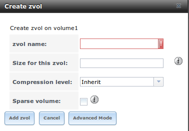

The configuration options are described in Table 8.1e. Some settings are only available in "Advanced Mode". To see these settings, either click the "Advanced
Mode" button or configure the system to always display these settings by checking the box "Show advanced fields by default" in
:menuselection:`System --> Advanced`.

**Table 8.1e: zvol Configuration Options**

+--------------------+----------------+----------------------------------------------------------------------------------------------------------------------+
| **Setting**        | **Value**      | **Description**                                                                                                      |
|                    |                |                                                                                                                      |
|                    |                |                                                                                                                      |
+====================+================+======================================================================================================================+
| zvol Name          | string         | mandatory; input a name for the zvol                                                                                 |
|                    |                |                                                                                                                      |
+--------------------+----------------+----------------------------------------------------------------------------------------------------------------------+
| Size for this zvol | integer        | specify size and value such as *10Gib*; if the size is more than 80% of the available capacity, the creation will    |
|                    |                | fail with an "out of space" error unless the "Force size" box is checked                                             |
|                    |                |                                                                                                                      |
+--------------------+----------------+----------------------------------------------------------------------------------------------------------------------+
| Force size         | checkbox       | by default, the system will not let you create a zvol if that operation will bring the pool to over 80% capacity;    |
|                    |                | **while NOT recommended**, checking this box will force the creation of the zvol in this situation                   |
|                    |                |                                                                                                                      |
+--------------------+----------------+----------------------------------------------------------------------------------------------------------------------+
| Compression level  | drop-down menu | see the section on :ref:`Compression` for a description of the available algorithms                                  |
|                    |                |                                                                                                                      |
+--------------------+----------------+----------------------------------------------------------------------------------------------------------------------+
| Sparse volume      | checkbox       | used to provide thin provisioning; use with caution for when this option is selected, writes will fail when the      |
|                    |                | pool is low on space                                                                                                 |
|                    |                |                                                                                                                      |
+--------------------+----------------+----------------------------------------------------------------------------------------------------------------------+
| Block size         | drop-down menu | only available in "Advanced Mode" and by default is based on the number of disks in pool; can be set to match the    |
|                    |                | block size of the filesystem which will be formatted onto the iSCSI target                                           |
|                    |                |                                                                                                                      |
+--------------------+----------------+----------------------------------------------------------------------------------------------------------------------+

.. _Import Disk:

Import Disk
~~~~~~~~~~~~~

The :menuselection:`Volume --> Import Disk` screen, shown in Figure 8.1f, is used to import a **single** disk that has been formatted with the UFS, NTFS,
MSDOS, or EXT2/3 filesystem. The import is meant to be a temporary measure in order to copy the data from a disk to an existing ZFS dataset. Only one disk can
be imported at a time.

**Figure 8.1f: Importing a Disk**

|import1.png|

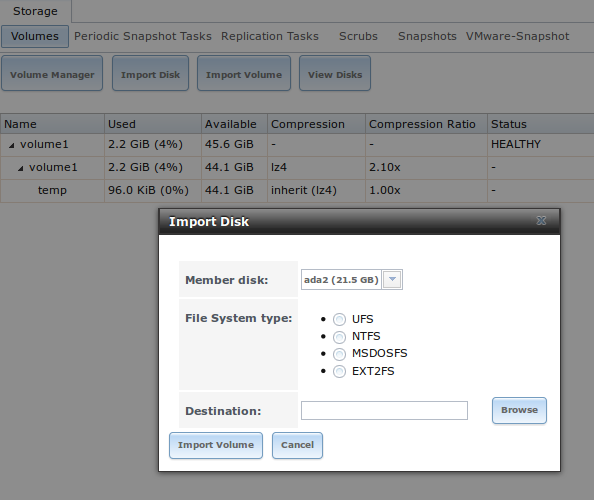

Use the drop-down menu to select the disk to import, select the type of filesystem on the disk, and browse to the ZFS dataset that will hold the copied data.
When you click "Import Volume", the disk will be automatically mounted, its contents will be copied to the specified ZFS dataset, and the disk will
automatically unmount once the copy operation completes.

.. _Import Volume:

Import Volume
~~~~~~~~~~~~~

If you click :menuselection:`Storage --> Volumes --> Import Volume`, you can configure FreeNAS® to use an
**existing** ZFS pool. This action is typically performed when an existing FreeNAS® system is re-installed. Since the operating system is separate from the
storage disks, a new installation does not affect the data on the disks. However, the new operating system needs to be configured to use the existing volume.

Figure 8.1g shows the initial pop-up window that appears when you select to import a volume.

**Figure 8.1g: Initial Import Volume Screen**

|auto1.png|

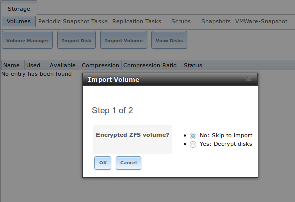

If you are importing an unencrypted ZFS pool, select "No: Skip to import" to open the screen shown in Figure 8.1h.

**Figure 8.1h: Importing a Non-Encrypted Volume**

|auto2.png|

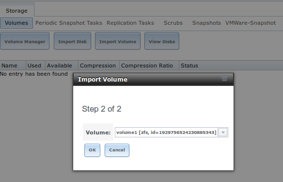

Existing volumes should be available for selection from the drop-down menu. In the example shown in Figure 8.1h, the FreeNAS® system has an existing,
unencrypted ZFS pool. Once the volume is selected, click the "OK" button to import the volume.

If an existing ZFS pool does not show in the drop-down menu, run :command:`zpool import` from :ref:`Shell` to import the pool.

If you plan to physically install ZFS formatted disks from another system, be sure to export the drives on that system to prevent an "in use by another
machine" error during the import.

If you suspect that your hardware is not being detected, run :command:`camcontrol devlist` from :ref:`Shell`. If the disk does not appear in the output, check
to see if the controller driver is supported or if it needs to be loaded using :ref:`Tunables`.

.. _Importing an Encrypted Pool:

Importing an Encrypted Pool
^^^^^^^^^^^^^^^^^^^^^^^^^^^

If you are importing an existing GELI-encrypted ZFS pool, you must decrypt the disks before importing the pool. In Figure 8.1g, select "Yes: Decrypt disks" to
access the screen shown in Figure 8.1i.

**Figure 8.1i: Decrypting the Disks Before Importing the ZFS Pool**

|decrypt.png|

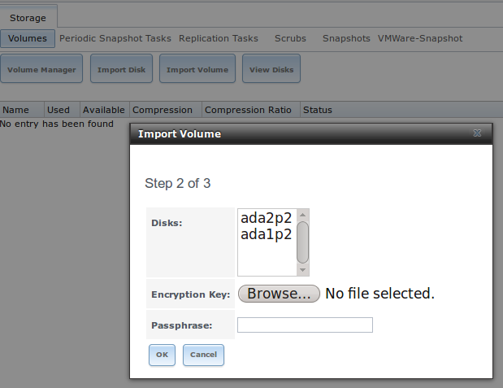

Select the disks in the encrypted pool, browse to the location of the saved encryption key, input the passphrase associated with the key, then click "OK" to
decrypt the disks.

.. note:: the encryption key is required to decrypt the pool. If the pool can not be decrypted, it can not be re-imported after a failed upgrade or lost
   configuration. This means that it is **very important** to save a copy of the key and to remember the passphrase that was configured for the key. Refer to
   :ref:`Managing Encrypted Volumes` for instructions on how to manage the keys for encrypted volumes.

Once the pool is decrypted, it should appear in the drop-down menu of Figure 8.1h. Click the "OK" button to finish the volume import.

.. _View Disks:

View Disks
~~~~~~~~~~

:menuselection:`Storage --> Volumes --> View Disks` allows you to view all of the disks recognized by the FreeNAS® system. An example is shown in Figure
8.1j.

**Figure 8.1j: Viewing Disks**

|view.png|

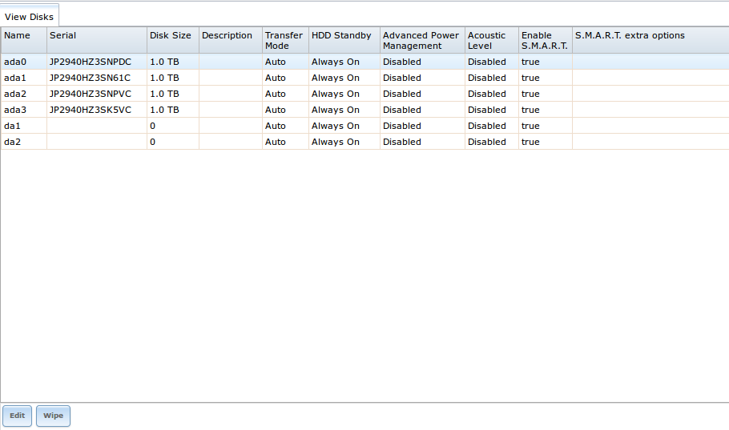

The current configuration of each device is displayed. Click a disk's entry and then its "Edit" button to change its configuration. The configurable options
are described in Table 8.1f.

**Table 8.1f: Disk Options**

+--------------------------------------------------------+----------------+----------------------------------------------------------------------------------------------------------------------+
| **Setting**                                            | **Value**      | **Description**                                                                                                      |
|                                                        |                |                                                                                                                      |
+========================================================+================+======================================================================================================================+
| Name                                                   | string         | read-only value showing FreeBSD device name for disk                                                                 |
|                                                        |                |                                                                                                                      |
+--------------------------------------------------------+----------------+----------------------------------------------------------------------------------------------------------------------+
| Serial                                                 | string         | read-only value showing the disk's serial number                                                                     |
|                                                        |                |                                                                                                                      |
+--------------------------------------------------------+----------------+----------------------------------------------------------------------------------------------------------------------+
| Description                                            | string         | optional                                                                                                             |
|                                                        |                |                                                                                                                      |
+--------------------------------------------------------+----------------+----------------------------------------------------------------------------------------------------------------------+
| HDD Standby                                            | drop-down menu | indicates the time of inactivity (in minutes) before the drive enters standby mode in order to conserve energy; this |
|                                                        |                | `forum post <http://forums.freenas.org/showthread.php?2068-How-to-find-out-if-a-drive-is-spinning-down-properly>`__  |
|                                                        |                | demonstrates how to determine if a drive has spun down                                                               |
|                                                        |                |                                                                                                                      |
+--------------------------------------------------------+----------------+----------------------------------------------------------------------------------------------------------------------+
| Advanced Power Management                              | drop-down menu | default is *Disabled*, can select a power management profile from the menu                                           |
|                                                        |                |                                                                                                                      |
+--------------------------------------------------------+----------------+----------------------------------------------------------------------------------------------------------------------+
| Acoustic Level                                         | drop-down menu | default is *Disabled*; can be modified for disks that understand                                                     |
|                                                        |                | `AAM <http://en.wikipedia.org/wiki/Automatic_acoustic_management>`_                                                  |
|                                                        |                |                                                                                                                      |
+--------------------------------------------------------+----------------+----------------------------------------------------------------------------------------------------------------------+
| Enable S.M.A.R.T.                                      | checkbox       | enabled by default if the disk supports S.M.A.R.T.; unchecking this box will disable any configured                  |
|                                                        |                | :ref:`S.M.A.R.T. Tests` for the disk                                                                                 |
|                                                        |                |                                                                                                                      |
+--------------------------------------------------------+----------------+----------------------------------------------------------------------------------------------------------------------+
| S.M.A.R.T. extra options                               | string         | additional `smartctl(8) <http://smartmontools.sourceforge.net/man/smartctl.8.html>`_                                 |
|                                                        |                | options                                                                                                              |
|                                                        |                |                                                                                                                      |
+--------------------------------------------------------+----------------+----------------------------------------------------------------------------------------------------------------------+

Clicking a disk's entry will also display its "Wipe" button which can be used to blank a disk while providing a progress bar of the wipe's status. Use this
option before discarding a disk.

.. note:: should a disk's serial number not be displayed in this screen, use the :command:`smartctl` command within :ref:`Shell`. For example, to determine
   the serial number of disk *ada0*, type :command:`smartctl -a /dev/ada0 | grep Serial`.

.. _View Volumes:

View Volumes
~~~~~~~~~~~~

If you click :menuselection:`Storage --> Volumes --> View Volumes`, you can view and further configure existing ZFS pools, datasets, and zvols. The example
shown in Figure 8.1k demonstrates one ZFS pool (*volume1*) with two datasets
(the one automatically created with the pool, *volume1*, and
*dataset1*) and one zvol
(*zvol1*).

Buttons are provided for quick access to "Volume Manager", "Import Disk", "Import Volume", and "View Disks". If the system has multipath-capable hardware, an
extra button will be added to "View Multipaths". The columns indicate the "Name" of the volume/dataset/zvol, how much disk space is "Used", how much disk
space is "Available", the type of "Compression", the "Compression Ratio", and the "Status" of the pool.

**Figure 8.1k: Viewing Volumes**

|volume1a.png|

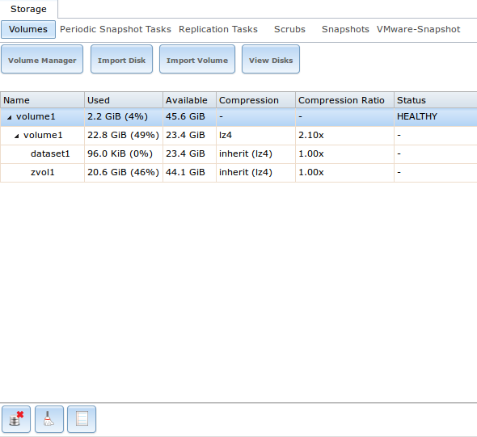

If you click the entry for a pool, several buttons will appear at the bottom of the screen. In order from left to right, these buttons are used to perform the
following:

**Detach Volume:** allows you to either export the pool or to delete the contents of the pool, depending upon the choice you make in the screen shown in
Figure 8.1l. The "Detach Volume" screen displays the current used space and indicates if there are any shares, provides checkboxes to "Mark the disks as new
(destroy data)" and to "Also delete the share's configuration", asks if you are sure that you want to do this, and the browser will turn red to alert you
that you are about to do something that will make the data inaccessible.
**If you do not check the box to mark the disks as new, the volume will be exported.** This means that the data is not destroyed and the volume can be
re-imported at a later time. If you will be moving a ZFS pool from one system to another, perform this export action first as it flushes any unwritten data to
disk, writes data to the disk indicating that the export was done, and removes all knowledge of the pool from the system.
**If you do check the box to mark the disks as new, the pool and all the data in its datasets, zvols, and shares will be destroyed and the underlying disks will be returned to their raw state.**

**Figure 8.1l: Detaching or Deleting a Volume**

|detach1.png|

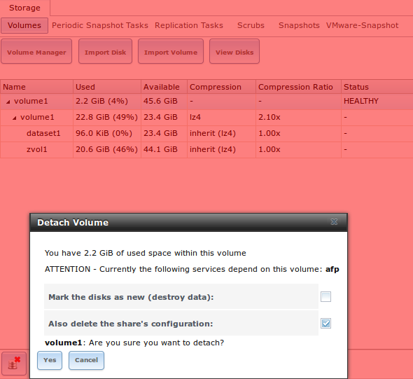

**Scrub Volume:** scrubs and how to schedule them are described in more detail in :ref:`Scrubs`. This button allows you to manually initiate a scrub. Since a
scrub is I/O intensive and can negatively impact performance, you should not initiate one while the system is busy. A "Cancel" button is provided should you
need to cancel a scrub. If you do cancel a scrub, the next scrub will start over from the beginning, not where the cancelled scrub left off. To view the
current status of a running scrub or the statistics from the last completed scrub, click the "Volume Status" button.

**Volume Status:** as seen in the example in Figure 8.1m, this screen shows the device name and status of each disk in the ZFS pool as well as any read,
write, or checksum errors. It also indicates the status of the latest ZFS scrub. If you click the entry for a device, buttons will appear to edit the device's
options (shown in Figure 8.1n), offline the device, or replace the device (as described in :ref:`Replacing a Failed Drive`).

**Upgrade:** used to upgrade the pool to the latest ZFS features, as described in :ref:`Upgrading a ZFS Pool`. This button will not appear if the pool is
running the latest versions of feature flags.

**Figure 8.1m: Volume Status**

|volume2.png|

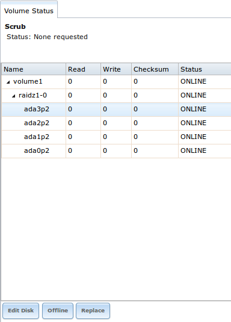

If you click a disk in "Volume Status" and click its "Edit Disk" button, you will see the screen shown in Figure 8.1n. Table 8.1f summarizes the
configurable options.

**Figure 8.1n: Editing a Disk**

|disk.png|

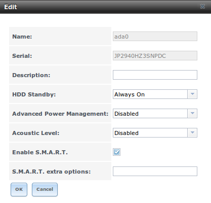

.. note:: versions of FreeNAS® prior to 8.3.1 required a reboot in order to apply changes to the "HDD Standby", "Advanced Power Management", and "Acoustic
   Level" settings. As of 8.3.1, changes to these settings are applied immediately.

If you click a dataset in :menuselection:`Storage --> Volumes --> View Volumes`, six buttons will appear at the bottom of the screen. In order from left to
right, these buttons allow you to:

**Change Permissions:** allows you to edit the dataset's permissions as described in :ref:`Change Permissions`.

**Create Snapshot:** allows you to create a one-time snapshot. If you wish to schedule the regular creation of snapshots, instead use
:ref:`Periodic Snapshot Tasks`.

**Destroy Dataset:** if you click the "Destroy Dataset" button, the browser will turn red to indicate that this is a destructive action. The "Destroy
Dataset" screen forces you to check the box "I'm aware this will destroy all child datasets and snapshots within this dataset" before it will perform this
action.

**Edit Options:** allows you to edit the volume's properties described in Table 8.1d. Note that it will not let you change the dataset's name.

**Create Dataset:** used to create a child dataset within this dataset.

**Create zvol:** allows you to create a child zvol within this dataset.

If you click a zvol in :menuselection:`Storage --> Volumes --> View Volumes`, three icons will appear at the bottom of the screen: "Create Snapshot", "Edit
zvol", and "Destroy zvol". Similar to datasets, you can not edit a zvol's name and you will need to confirm that you wish to destroy the zvol.

.. _Managing Encrypted Volumes:

Managing Encrypted Volumes
^^^^^^^^^^^^^^^^^^^^^^^^^^

If you check the "Encryption" box during the creation of a pool, five additional buttons will be added to the entry for the pool in
:menuselection:`Storage --> Volumes --> View Volumes`. An example is seen in Figure 8.1o.

**Figure 8.1o: Encryption Icons Associated with an Encrypted Pool**

|encrypt1.png|

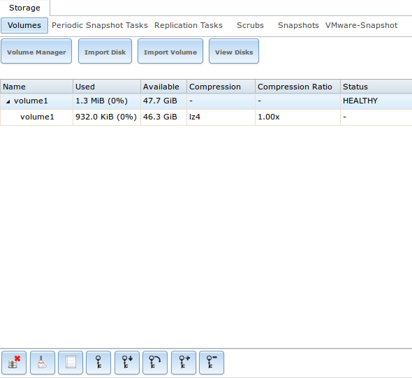

In order from left to right, these additional encryption buttons are used to:

**Create/Change Passphrase:** click this button to set and confirm the passphrase associated with the GELI encryption key. You will be prompted to input and
repeat the desired passphrase and a red warning reminds you to "Remember to add a new recovery key as this action invalidates the previous recovery key".
Unlike a password, a passphrase can contain spaces and is typically a series of words. A good passphrase is easy to remember (like the line to a song or piece
of literature) but hard to guess (people who know you should not be able to guess the passphrase).
**Remember this passphrase as you can not re-import an encrypted volume without it.** In other words, if you forget the passphrase, the data on the volume can
become inaccessible if you need to re-import the pool. Protect this passphrase as anyone who knows it could re-import your encrypted volume, thwarting the
reason for encrypting the disks in the first place.

Once the passphrase is set, the name of this button will change to "Change Passphrase". After setting or changing the passphrase, it is important to
immediately create a new recovery key by clicking the "Add recovery key" button. This way, if the passphrase is forgotten, the associated recovery key can be
used instead.

**Download Key:** click this icon to download a backup copy of the GELI encryption key. The encryption key is saved to the client system, not on the FreeNAS®
system. You will be prompted to input the password used to access the FreeNAS® administrative GUI before the selecting the directory in which to store the
key. Since the GELI encryption key is separate from the FreeNAS® configuration database,
**it is highly recommended to make a backup of the key. If the key is every lost or destroyed and there is no backup key, the data on the disks is inaccessible.**

**Encryption Re-key:** generates a new GELI encryption key. Typically this is only performed when the administrator suspects that the current key may be
compromised. This action also removes the current passphrase.

**Add recovery key:** generates a new recovery key. This screen will prompt you to input the password used to access the FreeNAS® administrative GUI and then
to select the directory in which to save the key. Note that the recovery key is saved to the client system, not on the FreeNAS® system. This recovery key can
be used if the passphrase is forgotten. **Always immediately** add a recovery key whenever the passphrase is changed.

**Remove recover key:** Typically this is only performed when the administrator suspects that the current recovery key may be compromised.
**Immediately** create a new passphrase and recovery key.

.. note:: the passphrase, recovery key, and encryption key need to be protected. Do not reveal the passphrase to others. On the system containing the
   downloaded keys, take care that that system and its backups are protected. Anyone who has the keys has the ability to re-import the disks should they be
   discarded or stolen.

.. _View Multipaths:

View Multipaths
~~~~~~~~~~~~~~~

FreeNAS® uses
`gmultipath(8) <http://www.freebsd.org/cgi/man.cgi?query=gmultipath>`_
to provide
`multipath I/O <http://en.wikipedia.org/wiki/Multipath_I/O>`_
support on systems containing hardware that is capable of multipath. An example would be a dual SAS expander backplane in the chassis or an external JBOD.

Multipath hardware adds fault tolerance to a NAS as the data is still available even if one disk I/O path has a failure.

FreeNAS® automatically detects active/active and active/passive multipath-capable hardware. Any multipath-capable devices that are detected will be placed in
multipath units with the parent devices hidden. The configuration will be displayed in :menuselection:`Storage --> Volumes --> View Multipaths`. Note that
this option will not be displayed in the :menuselection:`Storage --> Volumes` tree on systems that do not contain multipath-capable hardware.

.. index:: Replace Failed Drive
.. _Replacing a Failed Drive:

Replacing a Failed Drive
~~~~~~~~~~~~~~~~~~~~~~~~

If you are using any form of redundant RAID, you should replace a failed drive as soon as possible to repair the degraded state of the RAID. Depending upon
the capability of your hardware, you may or may not need to reboot in order to replace the failed drive. AHCI capable hardware does not require a reboot.

.. note:: a stripe (RAID0) does not provide redundancy. If you lose a disk in a stripe, you will need to recreate the volume and restore the data from backup.

Before physically removing the failed device, go to :menuselection:`Storage --> Volumes --> View Volumes`. Next, select your volume's name. At the bottom of
the interface you will see several icons, one of which is "Volume Status". Click the "Volume Status" icon and locate the failed disk. Once you have located
the failed device in the GUI, perform the following steps:

#.  If the disk is formatted with ZFS, click the disk's entry then its "Offline" button in order to change that disk's status to OFFLINE. This step is
    needed to properly remove the device from the ZFS pool and to prevent swap issues. If your hardware supports hot-pluggable disks, click the disk's
    "Offline" button, pull the disk, then skip to step 3. If there is no "Offline" button but only a "Replace" button, then the disk is already
    offlined and you can safely skip this step.

    .. note:: if the process of changing the disk's status to OFFLINE fails with a "disk offline failed - no valid replicas" message, you will need to scrub
       the ZFS volume first using its "Scrub Volume" button in :menuselection:`Storage --> Volumes --> View Volumes`. Once the scrub completes, try to "Offline"
       the disk again before proceeding.

#.  If the hardware is not AHCI capable, shutdown the system in order to physically replace the disk. When finished, return to the GUI and locate the OFFLINE
    disk.

#.  Once the disk is showing as OFFLINE, click the disk again and then click its "Replace" button. Select the replacement disk from the drop-down menu
    and click the "Replace Disk" button. If the disk is a member of an encrypted ZFS pool, you will be prompted to input the passphrase for the pool.
    Once you click the "Replace Disk" button, the ZFS pool will start to resilver and the status of the resilver will be displayed.

In the example shown in Figure 8.1p, a failed disk is being replaced by disk *ada5* in the volume named :file:`volume1`.

**Figure 8.1p: Replacing a Failed Disk**

|replace.png|

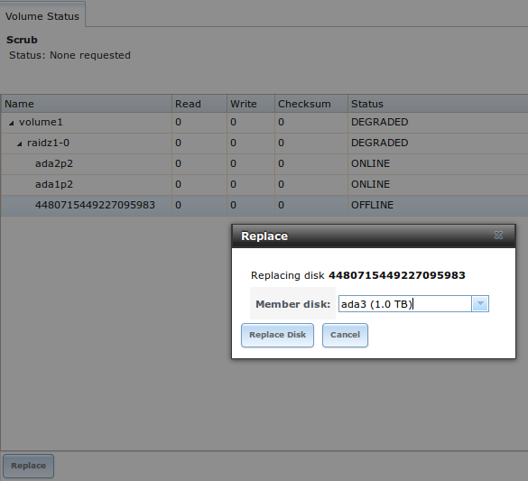

Once the resilver is complete, "Volume Status" will show a "Completed" resilver status and indicate if there were any errors. Figure 8.1q indicates that the
disk replacement was successful for this example.

**Figure 8.1q: Disk Replacement is Complete**

|replace2.png|

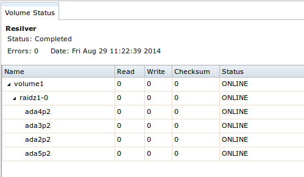
    
.. _Replacing an Encrypted Drive:

Replacing an Encrypted Drive
^^^^^^^^^^^^^^^^^^^^^^^^^^^^

If the ZFS pool is encrypted, additional steps are needed when replacing a failed drive.

First, make sure that a passphrase has been set using the instructions in :ref:`Encryption` **before** attempting to replace the failed drive. Then, follow
the steps 1 and 2 as described above. During step 3, you will be prompted to input the passphrase for the pool. Wait until the resilvering is complete.

Next, restore the encryption keys to the pool.
**If the following additional steps are not performed before the next reboot, you may lose access to the pool permanently.**

#.  Highlight the pool that contains the disk you just replaced and click the "Encryption Re-key" button in the GUI. You will need to enter the
    *root* password.

#.  Highlight the pool that contains the disk you just replaced and click the "Create Passphrase" button and enter the new passphrase. You can reuse the
    old passphrase if desired.

#.  Highlight the pool that contains the disk you just replaced and click the "Download Key" button in order to save the new encryption key. Since the 
    old key will no longer function, any old keys can be safely discarded.

#.  Highlight the pool that contains the disk you just replaced and click the "Add Recovery Key" button in order to save the new recovery key. The old
    recovery key will no longer function, so it can be safely discarded.

.. _Removing a Log or Cache Device:

Removing a Log or Cache Device
^^^^^^^^^^^^^^^^^^^^^^^^^^^^^^

If you have added any log or cache devices, these devices will also appear in :menuselection:`Storage --> Volumes --> View Volumes --> Volume Status`. If you
click the device, you can either use its "Replace" button to replace the device as described above, or click its "Remove" button to remove the device.

Before performing either of these operations, verify the version of ZFS running on the system by running :command:`zpool upgrade -v|more` from Shell.

If the pool is running ZFSv15, and a non-mirrored log device fails, is replaced, or removed, the pool is unrecoverable and the pool must be recreated and the
data restored from a backup. For other ZFS versions, removing or replacing the log device will lose any data in the device which had not yet been written.
This is typically the last few seconds of writes.

Removing or replacing a cache device will not result in any data loss, but may have an impact on read performance until the device is replaced.

.. _Replacing Drives to Grow a ZFS Pool:

Replacing Drives to Grow a ZFS Pool
~~~~~~~~~~~~~~~~~~~~~~~~~~~~~~~~~~~

The recommended method for expanding the size of a ZFS pool is to pre-plan the number of disks in a vdev and to stripe additional vdevs using
:ref:`Volume Manager` as additional capacity is needed.

However, this is not an option if you do not have open drive ports or the ability to add a SAS/SATA HBA card. In this case, you can replace one disk at a time
with a larger disk, wait for the resilvering process to incorporate the new disk into the pool completes, then repeat with another disk until all of the disks
have been replaced. This process is slow and places the system in a degraded state. Since a failure at this point could be disastrous,
**do not attempt this method unless the system has a reliable backup.**

.. note:: this method requires the ZFS property autoexpand. This property became available starting with FreeNAS® version 8.3.0. If you are running an
   earlier version of FreeNAS®, upgrade before attempting this method.

Check and verify that the autoexpand property is enabled **before** attempting to grow the pool. If it is not, the pool will not recognize that the disk
capacity has increased. By default, this property is enabled in FreeNAS® versions 8.3.1 and higher. To verify the property, use Shell. This example checks
the ZFS volume named :file:`Vol1`::

 zpool get all Vol1
 NAME	PROPERTY	VALUE			SOURCE
 Vol1	size		4.53T			-
 Vol1	capacity	31%			-
 Vol1	altroot		/mnt			local
 Vol1	health		ONLINE			-
 Vol1	guid		8068631824452460057	default
 Vol1	version		28			default
 Vol1	bootfs		-			default
 Vol1	delegation	on			default
 Vol1	autoreplace	off			default
 Vol1	cachefile	/data/zfs/zpool.cache	local
 Vol1	failmode	wait			default
 Vol1	listsnapshots	off			default
 Vol1 	autoexpand 	on 			local
 Vol1	dedupditto	0			default
 Vol1	dedupratio	1.00x			-
 Vol1	free		3.12T			-
 Vol1	allocated	1.41T			-
 Vol1	readonly	off			-
 Vol1	comment		-			default

If autoexpansion is not enabled, enable it by specifying the name of the ZFS volume::

 zpool set autoexpand=on Vol1 

Verify that autoexpand is now enabled by repeating :command:`zpool get all Vol1`.

You are now ready to replace one drive with a larger drive using the instructions in Replacing a Failed Drive.

Replace one drive at a time and wait for the resilver process to complete on the replaced drive before replacing the next drive. Once all the drives are
replaced and the resilver completes, you should see the added space in the pool.

You can view the status of the resilver process by running :command:`zpool status Vol1`.

.. _Enabling ZFS Pool Expansion:

Enabling ZFS Pool Expansion
~~~~~~~~~~~~~~~~~~~~~~~~~~~

It is recommended to enable the autoexpand property before you start replacing drives. If the property is not enabled before replacing some or all of the
drives, extra configuration is needed to inform ZFS of the expanded capacity.

Verify that autoexpand is set as described in the previous section. Then, bring each of the drives back online with the following command, replacing the
volume name and GPT ID for each disk in the ZFS pool::

 zpool online -e Vol1 gptid/xxx

Online one drive at a time and check the status using the following example. If a drive starts to resilver, you need to wait for the resilver to complete
before proceeding to online the next drive.

To find the GPT ID information for the drives, use :command:`zpool status Pool_Name` which will also show you if any drives are failed or in the process of
being resilvered::

 zpool status Vol1
 pool: Vol1
 state: ONLINE
 scan: scrub repaired 0 in 16h24m with 0 errors on Sun Mar 10 17:24:20 2013
 config:
 NAME						STATE	READ WRITE CKSUM
 Vol1						ONLINE  0    0     0
 raidz1-0					ONLINE  0    0     0
 gptid/d5ed48a4-634a-11e2-963c-00e081740bfe	ONLINE  0    0     0
 gptid/03121538-62d9-11e2-99bd-00e081740bfe	ONLINE  0    0     0
 gptid/252754e1-6266-11e2-8088-00e081740bfe	ONLINE  0    0     0
 gptid/9092045a-601d-11e2-892e-00e081740bfe	ONLINE  0    0     0
 gptid/670e35bc-5f9a-11e2-92ca-00e081740bfe	ONLINE  0    0     0

 errors: No known data errors

After onlining all of the disks, type :command:`zpool status` to see if the drives start to resilver. If this happens, wait for the resilvering process to
complete.

Next, export and then import the pool::

 zpool export Vol1

 zpool import -R /mnt Vol1

Once the import completes, all of the drive space should be available. Verify that the increased size is recognized::

 zpool list Vol1
 NAME	SIZE	ALLOC	FREE	CAP	DEDUP	HEALTH	ALTROOT
 Vol1	9.06T	1.41T	7.24T	31%	1.00x	ONLINE	/mnt

If you cannot see the extra space, you may need to run :command:`zpool online -e pool_name device_name` for every device listed in :command:`zpool status`.

.. _Splitting a Mirrored Pool:

Splitting a Mirrored Pool
~~~~~~~~~~~~~~~~~~~~~~~~~

ZFSv28 provides the ability to to split a **mirrored** storage pool, which detaches a disk or disks in the original ZFS volume in order to create another
identical ZFS volume on another system.

.. note:: this operation only works on mirrored ZFS volumes.

In this example, a ZFS mirror named :file:`test` contains three drives::

 zpool status
  pool: test
 state: ONLINE
 scan: resilvered 568K in 0h0m with 0 errors on Wed Jul 6 16:10:58 2011
 config:
 NAME		STATE	READ WRITE CKSUM
 test		ONLINE  0    0     0
 mirror-0	ONLINE  0    0     0
 da1		ONLINE  0    0     0
 da0		ONLINE  0    0     0
 da4		ONLINE  0    0     0

The following command splits from the existing three disk mirror :file:`test` a new ZFS volume named :file:`migrant` containing one disk, *da4*. Disks *da0* and
*da1* remain in :file:`test`::

 zpool split test migrant da4

At this point, *da4* can be physically removed and installed to a new system as the new pool is exported as it is created. Once physically installed, import
the identical pool on the new system::

 zpool import migrant

This makes the ZFS volume :file:`migrant` available with a single disk. Be aware that properties come along with the clone, so the new pool will be mounted
where the old pool was mounted if the mountpoint property was set on the original pool.

Verify the status of the new pool::

 zpool status
  pool: migrant
 state: ONLINE
 scan: resilvered 568K in 0h0m with 0 errors on Wed Jul 6 16:10:58 2011
 config:
 NAME		STATE	READ WRITE CKSUM
 migrant	ONLINE  0    0     0
 da4		ONLINE  0    0     0

 errors: No known data errors

On the original system, the status now looks like this::

 zpool status
  pool: test
 state: ONLINE
 scan: resilvered 568K in 0h0m with 0 errors on Wed Jul 6 16:10:58 2011
 config:

 NAME		STATE	READ WRITE CKSUM
 test		ONLINE  0    0     0
 mirror-0	ONLINE  0    0     0
 da1		ONLINE  0    0     0
 da0		ONLINE  0    0     0

 errors: No known data errors

At this point, it is recommended to add disks to create a full mirror set. This example adds two disks named *da2* and
*da3*::

 zpool attach migrant da4 da2

 zpool attach migrant da4 da3

The :file:`migrant` volume now looks like this::

 zpool status
  pool: migrant
 state: ONLINE
 scan: resilvered 572K in 0h0m with 0 errors on Wed Jul 6 16:43:27 2011
 config:
 NAME		STATE	READ WRITE CKSUM
 migrant	ONLINE  0    0     0
 mirror-0	ONLINE  0    0     0
 da4		ONLINE  0    0     0
 da2		ONLINE  0    0     0
 da3		ONLINE  0    0     0

Now that the new system has been cloned, you can detach *da4* and install it back to the original system. Before physically removing the disk, run this
command on the new system::

 zpool detach migrant da4

Once the disk is physically re-installed, run this command on the original system::

 zpool attach orig da0 da4

Should you ever need to create a new clone, remember to remove the old clone first::

 zpool destroy migrant

.. index:: Periodic Snapshot, Snapshot
.. _Periodic Snapshot Tasks:

Periodic Snapshot Tasks
-----------------------

A periodic snapshot task allows you to schedule the creation of read-only versions of ZFS volumes and datasets at a given point in time. Snapshots can be
created quickly and, if little data changes, new snapshots take up very little space. For example, a snapshot where no files have changed takes 0 MB of
storage, but as you make changes to files, the snapshot size changes to reflect the size of the changes.

Snapshots provide a clever way of keeping a history of files, should you need to recover an older copy or even a deleted file. For this reason, many
administrators take snapshots often (e.g. every 15 minutes), store them for a period of time (e.g. for a month), and store them on another system (e.g. using
Replication Tasks). Such a strategy allows the administrator to roll the system back to a specific time or, if there is a catastrophic loss, an off-site
snapshot can restore the system up to the last snapshot interval.

Before you can create a snapshot, you need to have an existing ZFS volume. How to create a volume is described in :ref:`Volume Manager`.

To create a periodic snapshot task, click :menuselection:`Storage --> Periodic Snapshot Tasks --> Add Periodic Snapshot` which will open the screen shown in
Figure 8.2a. Table 8.2a summarizes the fields in this screen.

.. note:: if you just need a one-time snapshot, instead use :menuselection:`Storage --> Volumes --> View Volumes` and click the "Create Snapshot" button for
   the volume or dataset that you wish to snapshot.

**Figure 8.2a: Creating a Periodic Snapshot**

|periodic1a.png|

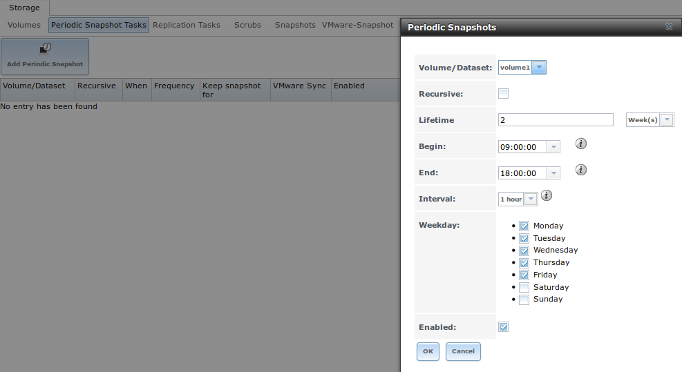

**Table 8.2a: Options When Creating a Periodic Snapshot**

+----------------+----------------------------+--------------------------------------------------------------------------------------------------------------+
| **Setting**    | **Value**                  | **Description**                                                                                              |
|                |                            |                                                                                                              |
+================+============================+==============================================================================================================+
| Volume/Dataset | drop-down menu             | select an existing ZFS volume, dataset, or zvol                                                              |
|                |                            |                                                                                                              |
+----------------+----------------------------+--------------------------------------------------------------------------------------------------------------+
| Recursive      | checkbox                   | select this box to take separate snapshots of the volume/dataset and each of its child datasets; if          |
|                |                            | unchecked, only one snapshot is taken of the specified Volume/Dataset                                        |
|                |                            |                                                                                                              |
+----------------+----------------------------+--------------------------------------------------------------------------------------------------------------+
| Lifetime       | integer and drop-down menu | how long to keep the snapshot on this system; if the snapshot is replicated, it is not removed from the      |
|                |                            | receiving system when the lifetime expires                                                                   |
|                |                            |                                                                                                              |
+----------------+----------------------------+--------------------------------------------------------------------------------------------------------------+
| Begin          | drop-down menu             | do not create snapshots before this time of day                                                              |
|                |                            |                                                                                                              |
+----------------+----------------------------+--------------------------------------------------------------------------------------------------------------+
| End            | drop-down menu             | do not create snapshots after this time of day                                                               |
|                |                            |                                                                                                              |
+----------------+----------------------------+--------------------------------------------------------------------------------------------------------------+
| Interval       | drop-down menu             | how often to take snapshot between *Begin* and                                                               |
|                |                            | *End* times                                                                                                  |
|                |                            |                                                                                                              |
+----------------+----------------------------+--------------------------------------------------------------------------------------------------------------+
| Weekday        | checkboxes                 | which days of the week to take snapshots                                                                     |
|                |                            |                                                                                                              |
+----------------+----------------------------+--------------------------------------------------------------------------------------------------------------+
| Enabled        | checkbox                   | uncheck to disable the scheduled replication task without deleting it                                        |
|                |                            |                                                                                                              |
+----------------+----------------------------+--------------------------------------------------------------------------------------------------------------+

If the "Recursive" box is checked, you do not need to create snapshots for every dataset individually as they are included in the snapshot. The downside is
that there is no way to exclude certain datasets from being included in a recursive snapshot.

Once you click the "OK" button, a snapshot will be taken and this task will be repeated according to your settings.

After creating a periodic snapshot task, an entry for the snapshot task will be added to "View Periodic Snapshot Tasks". Click an entry to access its "Edit"
and "Delete" buttons.

.. index:: Replication
.. _Replication Tasks:

Replication Tasks
-----------------

A replication task allows you to automate the copy of ZFS snapshots to another system over an encrypted connection. This allows you to create an off-site
backup of a ZFS dataset or pool.

This section will refer to the system generating the ZFS snapshots as *PUSH* and the system to receive a copy of the ZFS snapshots as
*PULL*.

Before you can configure a replication task, the following pre-requisites must be met:

* a ZFS pool must exist on both *PUSH* and
  *PULL*.

* a periodic snapshot task must be created on *PUSH*. You will not be able to create a replication task before the first snapshot exists.

* the SSH service must be enabled on *PULL*. The first time the service is enabled, it will generate the required SSH keys.

A replication task uses the following keys:

* :file:`/data/ssh/replication.pub`: the RSA public key used for authenticating the *PUSH* replication user. This key needs to be copied to the replication
  user account on *PULL*.

* :file:`/etc/ssh/ssh_host_rsa_key.pub`: the RSA host public key of *PULL* used to authenticate the receiving side in order to prevent a man-in-the-middle
  attack. This key needs to be copied to the replication task on *PUSH*.

This section will demonstrate how to configure a replication task between the following two FreeNAS® systems:

* *192.168.2.2* will be referred to as 
  *PUSH*. This system has a periodic snapshot task for the ZFS dataset :file:`/mnt/local/data`.

* *192.168.2.6* will be referred to as
  *PULL*. This system has an existing ZFS volume named :file:`/mnt/remote` which will store the pushed snapshots.

.. _Configure PULL:

Configure PULL
~~~~~~~~~~~~~~

A copy of the public key for the replication user on *PUSH* needs to be pasted to the public key of the replication user on the
*PULL* system.

To obtain a copy of the replication key: on *PUSH* go to :menuselection:`Storage --> Replication Tasks --> View Replication Tasks`. Click the "View Public
Key" button and copy its contents. An example is shown in Figure 8.3a.

**Figure 8.3a: Copy the Replication Key**

|replication1a.png|

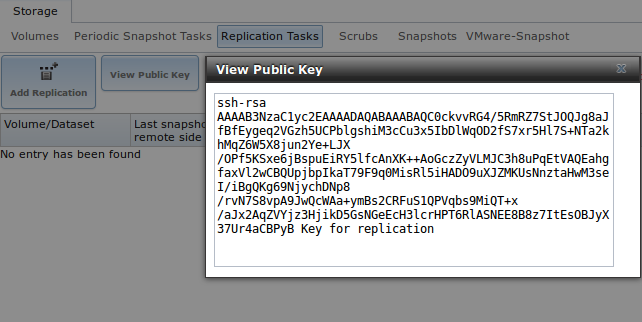

Go to *PULL* and click :menuselection:`Account --> Users --> View Users`. Click the "Modify User" button for the user account you will be using for
replication (by default this is the *root* user). Paste the copied key into the "SSH Public Key" field and click "OK". If a key already exists, append the new
text after the existing key.

On *PULL*, ensure that the SSH service is enabled in :menuselection:`Services --> Control Services`. Start it if it is not already running.

.. _Configure PUSH:

Configure PUSH
~~~~~~~~~~~~~~

On *PUSH*, verify that a periodic snapshot task has been created and that at least one snapshot is listed in
:menuselection:`Storage --> Periodic Snapshot Tasks --> View Periodic Snapshot Tasks --> Snapshots`.

To create the replication task, click :menuselection:`Storage --> Replication Tasks --> Add Replication Task` which will open the screen shown in Figure 8.3b.
For this example, the required configuration is as follows:

* the Volume/Dataset is :file:`local/data`

* the Remote ZFS Volume/Dataset is :file:`remote`

* the Remote hostname is *192.168.2.6*

* the Begin and End times are at their default values, meaning that replication will occur whenever a snapshot is created

* once the Remote hostname is input, click the "SSH Key Scan" button; assuming the address is reachable and the SSH service is running on *PULL*, its key will
  automatically be populated to the "Remote hostkey" box

**Figure 8.3b: Adding a Replication Task**

|replication2.png|

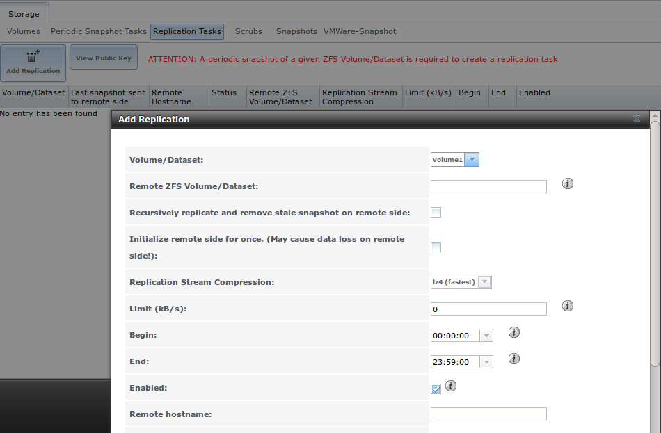

Table 8.3a summarizes the available options in the "Add Replication Task" screen.

**Table 8.3a: Adding a Replication Task**

+---------------------------+----------------+--------------------------------------------------------------------------------------------------------------+
| **Setting**               | **Value**      | **Description**                                                                                              |
|                           |                |                                                                                                              |
|                           |                |                                                                                                              |
+===========================+================+==============================================================================================================+
| Volume/Dataset            | drop-down menu | the ZFS volume or dataset on *PUSH* containing the snapshots to be replicated; the drop-down menu will be    |
|                           |                | empty if a snapshot does not already exist                                                                   |
|                           |                |                                                                                                              |
+---------------------------+----------------+--------------------------------------------------------------------------------------------------------------+
| Remote ZFS Volume/Dataset | string         | the ZFS volume on *PULL* that will store the snapshots;                                                      |
|                           |                | :file:`/mnt/` is assumed and should not be included in the path                                              |
|                           |                |                                                                                                              |
+---------------------------+----------------+--------------------------------------------------------------------------------------------------------------+
| Recursively replicate     | checkbox       | if checked will replicate child datasets and replace previous snapshot stored on *PULL*                      |
|                           |                |                                                                                                              |
|                           |                |                                                                                                              |
+---------------------------+----------------+--------------------------------------------------------------------------------------------------------------+
| Initialize remote side    | checkbox       | does a reset once operation which destroys the replication data on *PULL* before reverting to normal         |
|                           |                | operation; use this option if replication gets stuck                                                         |
|                           |                |                                                                                                              |
+---------------------------+----------------+--------------------------------------------------------------------------------------------------------------+
| Replication Stream        | drop-down menu | choices are *lz4 (fastest)*,                                                                                 |
| Compression               |                | *pigz (all rounder)*,                                                                                        |
|                           |                | *plzip (best compression)*, or                                                                               |
|                           |                | *Off* (no compression); selecting a compression algorithm can reduce the size of the data being replicated   |
|                           |                |                                                                                                              |
+---------------------------+----------------+--------------------------------------------------------------------------------------------------------------+
| Limit (kB/s)              | integer        | limits replication speed to specified value in kilobytes/second; default of *0* is unlimited                 |
|                           |                |                                                                                                              |
+---------------------------+----------------+--------------------------------------------------------------------------------------------------------------+
| Begin                     | drop-down menu | the replication can not start before this time; the times selected in the "Begin" and                        |
|                           |                | "End" fields set the replication window for when replication can occur                                       |
|                           |                |                                                                                                              |
+---------------------------+----------------+--------------------------------------------------------------------------------------------------------------+
| End                       | drop-down menu | the replication must start by this time; once started, replication will occur until it is finished (see NOTE |
|                           |                | below)                                                                                                       |
|                           |                |                                                                                                              |
+---------------------------+----------------+--------------------------------------------------------------------------------------------------------------+
| Enabled                   | checkbox       | uncheck to disable the scheduled replication task without deleting it                                        |
|                           |                |                                                                                                              |
+---------------------------+----------------+--------------------------------------------------------------------------------------------------------------+
| Remote hostname           | string         | IP address or DNS name of *PULL*                                                                             |
|                           |                |                                                                                                              |
+---------------------------+----------------+--------------------------------------------------------------------------------------------------------------+
| Remote port               | string         | must match port being used by SSH service on *PULL*                                                          |
|                           |                |                                                                                                              |
+---------------------------+----------------+--------------------------------------------------------------------------------------------------------------+
| Dedicated User Enabled    | checkbox       | allows a user account other than root to be used for replication                                             |
|                           |                |                                                                                                              |
+---------------------------+----------------+--------------------------------------------------------------------------------------------------------------+
| Dedicated User            | drop-down menu | only available if "Dedicated User Enabled" is checked; select the user account to be used for replication    |
|                           |                |                                                                                                              |
+---------------------------+----------------+--------------------------------------------------------------------------------------------------------------+
| Encryption Cipher         | drop-down menu | choices are *Standard*,                                                                                      |
|                           |                | *Fast*, or                                                                                                   |
|                           |                | *Disabled*; temporarily selecting                                                                            |
|                           |                | *Disabled* can significantly reduce the time for the initial replication                                     |
|                           |                |                                                                                                              |
+---------------------------+----------------+--------------------------------------------------------------------------------------------------------------+
| Remote hostkey            | string         | use the "SSH Key Scan" button to retrieve the public key of *PULL*                                           |
|                           |                |                                                                                                              |
+---------------------------+----------------+--------------------------------------------------------------------------------------------------------------+

By default, replication occurs when snapshots occur. For example, if snapshots are scheduled for every 2 hours, replication occurs every 2 hours. The initial
replication can take a significant period of time, from many hours to possibly days, as the structure of the entire ZFS pool needs to be recreated on the
remote system. The actual time will depend upon the size of the pool and the speed of the network. Subsequent replications will take far less time, as only
the modified data will be replicated. If the security policy allows it, temporarily change the "Encryption Cipher" to *Disabled* until the initial replication
is complete. This will turn off encryption but will speed up the replication. The "Encryption Cipher" can then be changed to *Standard* or
*Fast* for subsequent replications.

The "Begin" and "End" times can be used to create a window of time where replication occurs. The default times allow replication to occur at any time of the
day a snapshot occurs. Change these times if snapshot tasks are scheduled during office hours but the replication itself should occur after office hours. For
the "End" time, consider how long replication will take so that it finishes before the next day's office hours begin.

Once the replication task is created, it will appear in the "View Replication Tasks" of *PUSH.*

*PUSH* will immediately attempt to replicate its latest snapshot to
*PULL*. If the replication is successful, the snapshot will appear in the
:menuselection:`Storage --> Periodic Snapshot Tasks --> View Periodic Snapshot Tasks --> Snapshots` tab of *PULL*. If the snapshot is not replicated, refer to
:ref:`Troubleshooting Replication` for troubleshooting tips.

.. _Troubleshooting Replication:

Troubleshooting Replication
~~~~~~~~~~~~~~~~~~~~~~~~~~~

If you have followed all of the steps above and have *PUSH* snapshots that are not replicating to
*PULL*, check to see if SSH is working properly. On
*PUSH*, open Shell and try to :command:`ssh` into
*PULL*. Replace
**hostname_or_ip** with the value for
*PULL*::

 ssh -vv -i /data/ssh/replication hostname_or_ip

This command should not ask for a password. If it asks for a password, SSH authentication is not working. Go to 
:menuselection:`Storage --> Replication Tasks --> View Replication Tasks` and click the "View Public Key" button. Make sure that it matches one of the values
in :file:`/~/.ssh/authorized_keys` on *PULL*, where :file:`~` represents the home directory of the replication user.

Also check :file:`/var/log/auth.log` on *PULL* and :file:`/var/log/messages` on
*PUSH* to see if either log gives an indication of the error.

If the key is correct and replication is still not working, try deleting all snapshots on *PULL* except for the most recent one. In
:menuselection:`Storage --> Periodic Snapshot Tasks --> View Periodic Snapshot Tasks --> Snapshots` check the box next to every snapshot except for the
last one (the one with 3 icons instead of 2), then click the global "Destroy" button at the bottom of the screen.

Once you have only one snapshot, open Shell on *PUSH* and use the :command:`zfs send` command. To continue our example, the ZFS snapshot on the *local/data*
dataset of *PUSH* is named :file:`auto-20110922.1753-2h`, the IP address of *PULL* is *192.168.2.6*, and the ZFS volume on *PULL* is :file:`remote`. Note that
the **@** is used to separate the volume/dataset name from the snapshot name::

 zfs send local/data@auto-20110922.1753-2h | ssh -i /data/ssh/replication 192.168.2.6 zfs receive local/data@auto-20110922.1753-2h

.. note:: if this command fails with the error "cannot receive new filesystem stream: destination has snapshots", check the box "initialize remote side
   for once" in the replication task and try again. If the :command:`zfs send` command still fails, you will need to open Shell on
   *PULL* and use the :command:`zfs destroy -R volume_name@snapshot_name` command to delete the stuck snapshot. You can then use the
   :command:`zfs list -t snapshot` on *PULL* to confirm if the snapshot successfully replicated.

After successfully transmitting the snapshot, recheck again after the time period between snapshots lapses to see if the next snapshot successfully
transmitted. If it is still not working, you can manually send the specified snapshot with this command::

 zfs send local/data@auto-20110922.1753-2h | ssh -i /data/ssh/replication 192.168.2.6 zfs receive local/data@auto-20110922.1753-2h
 
.. index:: Scrub
.. _Scrubs:

Scrubs
----------

:menuselection:`Storage --> Scrubs` allows you to schedule and manage scrubs on a ZFS volume. Performing a ZFS scrub on a regular basis helps to identify
data integrity problems, detects silent data corruptions caused by transient hardware issues, and provides early alerts to disk failures. If you have
consumer-quality drives, consider a weekly scrubbing schedule. If you have datacenter-quality drives, consider a monthly scrubbing schedule.

Depending upon the amount of data, a scrub can take a long time. Scrubs are I/O intensive and can negatively impact performance. They should be scheduled for
evenings or weekends to minimize the impact to users.

A ZFS scrub only checks used disk space. To check unused disk space, schedule :ref:`S.M.A.R.T. Tests` of "Type" of *Long Self-Test* to run once or twice a
month.

When you create a volume that is formatted with ZFS, a ZFS scrub is automatically scheduled for you. An entry of the same volume name is added to
:menuselection:`Storage --> Scrubs` and a summary of this entry can be viewed in :menuselection:`Storage --> Scrubs --> View Scrubs`. Figure 8.4a
displays the default settings for the volume named :file:`volume1`. In this example, the entry has been highlighted and the "Edit" button clicked in order to
display the "Edit" screen. Table 8.4a summarizes the options in this screen.

**Figure 8.4a: Viewing a Volume's Default Scrub Settings**

|scrub1.png|

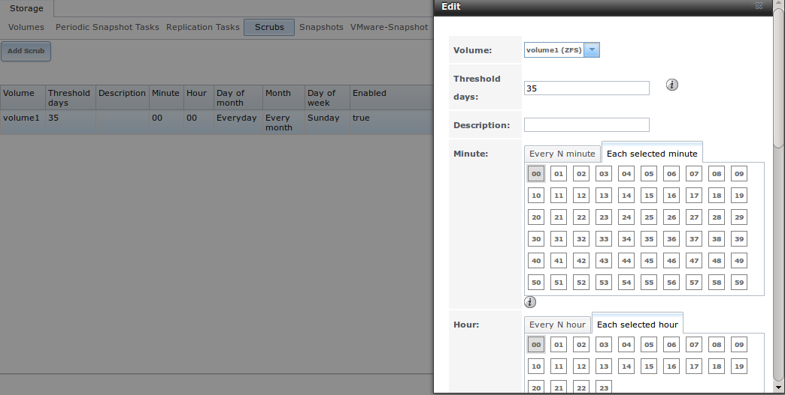

**Table 8.4a: ZFS Scrub Options**

+----------------+-----------------------------+-------------------------------------------------------------------------------------------------------------+
| **Setting**    | **Value**                   | **Description**                                                                                             |
|                |                             |                                                                                                             |
|                |                             |                                                                                                             |
+================+=============================+=============================================================================================================+
| Volume         | drop-down menu              | select ZFS volume to scrub                                                                                  |
|                |                             |                                                                                                             |
+----------------+-----------------------------+-------------------------------------------------------------------------------------------------------------+
| Threshold days | integer                     | number of days since the last scrub completed before the next scrub can occur, regardless of the calendar   |
|                |                             | schedule; the default is a multiple of 7 which should ensure that the scrub always occurs on the same day   |
|                |                             | of the week                                                                                                 |
|                |                             |                                                                                                             |
+----------------+-----------------------------+-------------------------------------------------------------------------------------------------------------+
| Description    | string                      | optional                                                                                                    |
|                |                             |                                                                                                             |
+----------------+-----------------------------+-------------------------------------------------------------------------------------------------------------+
| Minute         | slider or minute selections | if use the slider, scrub occurs every N minutes; if use minute selections, scrub starts at the highlighted  |
|                |                             | minutes                                                                                                     |
|                |                             |                                                                                                             |
+----------------+-----------------------------+-------------------------------------------------------------------------------------------------------------+
| Hour           | slider or hour selections   | if use the slider, scrub occurs every N hours; if use hour selections, scrub occurs at the highlighted      |
|                |                             | hours                                                                                                       |
|                |                             |                                                                                                             |
+----------------+-----------------------------+-------------------------------------------------------------------------------------------------------------+
| Day of Month   | slider or month selections  | if use the slider, scrub occurs every N days; if use month selections, scrub occurs on the highlighted days |
|                |                             | of the selected months                                                                                      |
|                |                             |                                                                                                             |
+----------------+-----------------------------+-------------------------------------------------------------------------------------------------------------+
| Month          | checkboxes                  | scrub occurs on the selected months                                                                         |
|                |                             |                                                                                                             |
+----------------+-----------------------------+-------------------------------------------------------------------------------------------------------------+
| Day of week    | checkboxes                  | scrub occurs on the selected days; default is *Sunday* to least impact users                                |
|                |                             |                                                                                                             |
+----------------+-----------------------------+-------------------------------------------------------------------------------------------------------------+
| Enabled        | checkbox                    | uncheck to disable the scheduled scrub without deleting it                                                  |
|                |                             |                                                                                                             |
+----------------+-----------------------------+-------------------------------------------------------------------------------------------------------------+

You should review the default selections and, if necessary, modify them to meet the needs of your environment.

While a "Delete" button is provided,
**deleting a scrub is not recommended as a scrub provides an early indication of disk issues that could lead to a disk failure.** If you find that a scrub is
too intensive for your hardware, consider unchecking the "Enabled" button for the scrub as a temporary measure until the hardware can be upgraded.

.. index:: Snapshots
.. _Snapshots:

Snapshots
-------------

The "Snapshots" tab can be used to review the listing of available snapshots. An example is shown in Figure 8.5a.

.. note:: if snapshots do not appear, check that the current time configured in :ref:`Periodic Snapshot Tasks` does not conflict with the "Begin", "End", and
   "Interval" settings. If the snapshot was attempted but failed, an entry will be added to :file:`/var/log/messages`. This log file can be viewed in
   :ref:`Shell`.

**Figure 8.5a: Viewing Available Snapshots**

|periodic3a.png|

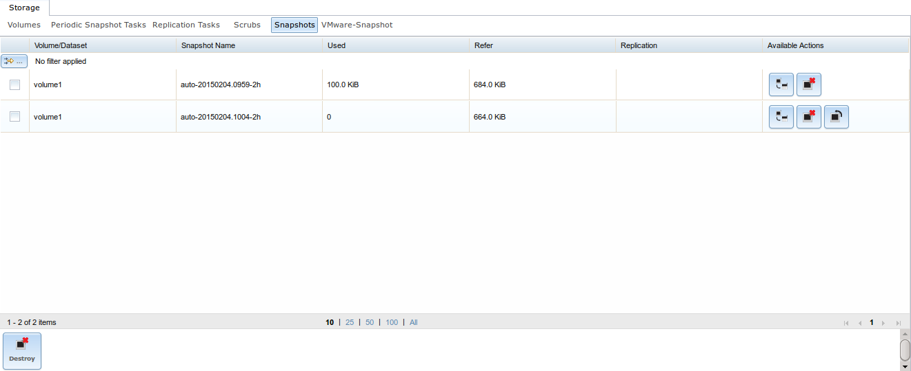

The listing will include the name of the volume or dataset, the name of each snapshot, and the amount of used and referenced data, where:

**Used:** indicates the amount of space consumed by this dataset and all its descendents. This value is checked against this dataset's quota and reservation.
The space used does not include this dataset's reservation, but does take into account the reservations of any descendent datasets. The amount of space that
a dataset consumes from its parent, as well as the amount of space that are freed if this dataset is recursively destroyed, is the greater of its space used
and its reservation. When a snapshot is created, its space is initially shared between the snapshot and the filesystem, and possibly with previous snapshots.
As the filesystem  changes, space  that was previously shared becomes unique to the snapshot, and is counted in the snapshot's space used. Additionally,
deleting snapshots can increase the amount of space unique to (and used by) other snapshots. The  amount of space used, available, or referenced does not take
into account pending changes. While pending changes are generally accounted for within a few  seconds, disk changes do not necessarily guarantee that the
space usage information is updated immediately.

**Refer:** indicates the amount of data that is accessible by this dataset, which may or may not be shared  with other  datasets  in  the pool. When a
snapshot or clone is created, it initially references the same amount of space as the file system or snapshot it was created from, since its contents are
identical.

It will also indicate if the snapshot has been replicated to a remote system.

The most recent snapshot will have 3 icons. The icons associated with a snapshot allow you to:

**Clone Snapshot:** will prompt for the name of the clone to create. The clone will be a writable copy of the snapshot. Since a clone is really a dataset
which can be mounted, the clone will appear in the "Active Volumes" tab, instead of the "Periodic Snapshots" tab, and will have the word *clone* in its name.

**Destroy Snapshot:** a pop-up message will ask you to confirm this action. Child clones must be destroyed before their parent snapshot can be destroyed.
While creating a snapshot is instantaneous, deleting a snapshot can be I/O intensive and can take a long time, especially when deduplication is enabled.
In order to delete a block in a snapshot, ZFS has to walk all the allocated blocks to see if that block is used anywhere else; if it is not, it can be freed.

**Rollback Snapshot:** a pop-up message will ask if you are sure that you want to rollback to this snapshot state. If you click "Yes", any files that have
changed since the snapshot was taken will be reverted back to their state at the time of the snapshot.

.. note:: rollback is a potentially dangerous operation and will cause any configured replication tasks to fail as the replication system uses the existing
   snapshot when doing an incremental backup. If you do need to restore the data within a snapshot, the recommended steps are:

   #.  Clone the desired snapshot.

   #.  Share the clone with the share type or service running on the FreeNAS® system.

   #.  Once users have recovered the needed data, destroy the clone in the Active Volumes tab.

   This approach will never destroy any on-disk data and has no impact on replication.

Periodic snapshots can be configured to appear as shadow copies in newer versions of Windows Explorer, as described in :ref:`Configuring Shadow Copies`. Users
can access the files in the shadow copy using Explorer without requiring any interaction with the FreeNAS® graphical administrative interface.

The ZFS Snapshots screen allows you to create filters to view snapshots by selected criteria. To create a filter, click the "Define filter" icon (near the
text "No filter applied"). When creating a filter:

* select the column or leave the default of "Any Column".

* select the condition. Possible conditions are: *contains* (default),
  *is, starts with, ends with, does not contain, is not, does not start with, does not end with*, and
  *is empty*.

*   input a value that meets your view criteria.

*   click the "Filter" button to save your filter and exit the define filter screen. Alternately, click the "+" button to add another filter.

If you create multiple filters, select the filter you wish to use before leaving the define filter screen. Once a filter is selected, the "No filter
applied" text will change to "Clear filter". If you click "Clear filter", a pop-up message will indicate that this will remove the filter and all
available snapshots will be listed.

.. index:: VMware Snapshot
.. _VMware-Snapshot:

VMware-Snapshot
---------------

:menuselection:`Storage --> VMware-Snapshot` allows you to coordinate ZFS snapshots when using VMware as a datastore. Once this type of snapshot is created,
FreeNAS® will automatically snapshot any running VMware virtual machines before taking a scheduled or manual ZFS snapshot of the dataset or zvol backing that
VMware datastore. The temporary VMware snapshots are then deleted on the VMware side but still exist in the ZFS snapshot and can be used as stable
resurrection points in that snapshot.  These coordinated snapshots will be listed in :ref:`Snapshots`.

Figure 8.6a shows the menu for adding a VMware snapshot and Table 8.6a summarizes the available options.

**Figure 8.6a: Adding a VMware Snapshot**

|vmware1a.png|

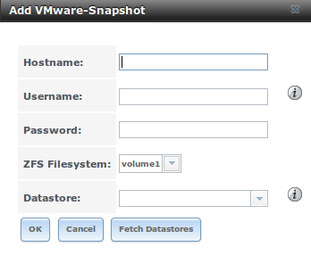

**Table 8.6a: VMware Snapshot Options**

+----------------+-----------------------------+-------------------------------------------------------------------------------------------------------------+
| **Setting**    | **Value**                   | **Description**                                                                                             |
|                |                             |                                                                                                             |
|                |                             |                                                                                                             |
+================+=============================+=============================================================================================================+
| Hostname       | string                      | IP address or hostname of VMware host                                                                       |
|                |                             |                                                                                                             |
+----------------+-----------------------------+-------------------------------------------------------------------------------------------------------------+
| Username       | string                      | user on VMware host with enough permission to snapshot virtual machines                                     |
|                |                             |                                                                                                             |
+----------------+-----------------------------+-------------------------------------------------------------------------------------------------------------+
| Password       | string                      | password associated with "Username"                                                                         |
|                |                             |                                                                                                             |
+----------------+-----------------------------+-------------------------------------------------------------------------------------------------------------+
| ZFS Filesystem | drop-down menu              | the filesystem to snapshot                                                                                  |
|                |                             |                                                                                                             |
+----------------+-----------------------------+-------------------------------------------------------------------------------------------------------------+
| Datastore      | drop-down menu              | after inputting the "Hostname", "Username", and "Password", click the "Fetch Datastores" button to populate |
|                |                             | the menu and select the datastore to synchronize with                                                       |
|                |                             |                                                                                                             |
+----------------+-----------------------------+-------------------------------------------------------------------------------------------------------------+
