.. _System:

System
======

The System section of the administrative GUI contains the following entries:

* :ref:`Information`: provides general FreeNAS® system information such as hostname, operating system version, platform, and uptime

* :ref:`General`: used to configure general settings such as HTTPS access, the language, and the timezone

* :ref:`Boot`: used to create, rename, and delete boot environments

* :ref:`Advanced`: used to configure advanced settings such as the serial console, swap, and console messages

* :ref:`Email`: used to configure the email address to receive notifications

* :ref:`System Dataset`: used to configure the location where logs and reporting graphs are stored

* :ref:`Tunables`: provides a front-end for tuning in real-time and to load additional kernel modules at boot time

* :ref:`Update`: used to perform upgrades and to check for system updates

* :ref:`CAs`: used to import or create an internal or intermediate CA (Certificate Authority)

* :ref:`Certificates`: used to import existing certificates or to create self-signed certificates

* :ref:`Support`: used to report a bug or request a new feature.

Each of these is described in more detail in this section.

.. _Information:

Information
-----------

:menuselection:`System --> Information` displays general information about the FreeNAS® system. An example is seen in Figure 5.1a.

The information includes the hostname, the build version, type of CPU (platform), the amount of memory, the current system time, the system's uptime, and the
current load average.

To change the system's hostname, click its "Edit" button, type in the new hostname, and click "OK". The hostname must include the domain name. If the network
does not use a domain name add *.local* to the end of the hostname.

**Figure 5.1a: System Information Tab**

|system1a.png|

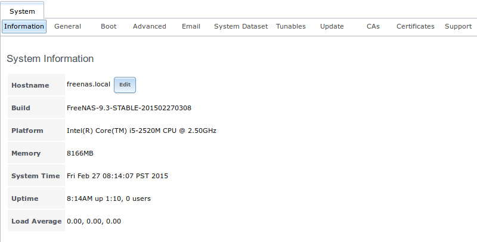

.. _General:

General
-------

:menuselection:`System --> General` is shown in Figure 5.2a.

**Figure 5.2a: General Screen**

|system2a.png|

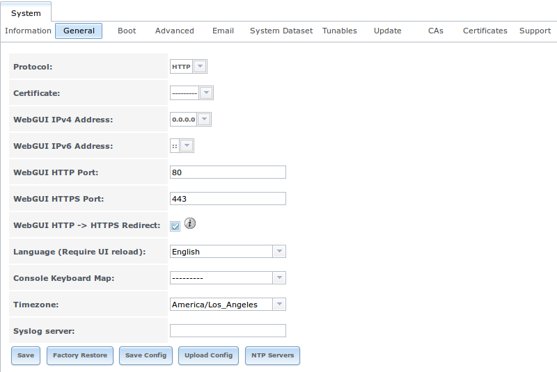
    
Table 5.2a summarizes the settings that can be configured using the General tab:

**Table 5.2a: General Configuration Settings**

+----------------------+----------------+--------------------------------------------------------------------------------------------------------------------------------+
| Setting              | Value          | Description                                                                                                                    |
|                      |                |                                                                                                                                |
+======================+================+================================================================================================================================+
| Protocol             | drop-down menu | protocol to use when connecting to the administrative GUI from a browser; if you change the default of *HTTP* to               |
|                      |                | *HTTPS* or to                                                                                                                  |
|                      |                | *HTTP+HTTPS*, select the certificate to use in "Certificate"; if you do not have a certificate, first create a CA (in `CAs`_)  |
|                      |                | then the certificate (in `Certificates`_)                                                                                      |
|                      |                |                                                                                                                                |
+----------------------+----------------+--------------------------------------------------------------------------------------------------------------------------------+
| Certificate          | drop-down menu | required for *HTTPS*; browse to the location of the certificate to use for encrypted connections                               |
|                      |                |                                                                                                                                |
+----------------------+----------------+--------------------------------------------------------------------------------------------------------------------------------+
| WebGUI IPv4 Address  | drop-down menu | choose from a list of recent IP addresses to limit the one to use when accessing the administrative GUI; the                   |
|                      |                | built-in HTTP server will automatically bind to the wildcard address of *0.0.0.0* (any address) and will issue an              | 
|                      |                | alert if the specified address becomes unavailable                                                                             |
|                      |                |                                                                                                                                |
+----------------------+----------------+--------------------------------------------------------------------------------------------------------------------------------+
| WebGUI IPv6 Address  | drop-down menu | choose from a list of recent IPv6 addresses to limit the one to use when accessing the administrative GUI; the                 |
|                      |                | built-in HTTP server will automatically bind to any address and will issue an alert                                            |
|                      |                | if the specified address becomes unavailable                                                                                   |
|                      |                |                                                                                                                                |
+----------------------+----------------+--------------------------------------------------------------------------------------------------------------------------------+
| WebGUI HTTP Port     | integer        | allows you to configure a non-standard port for accessing the administrative GUI over HTTP; changing this setting              |
|                      |                | may require you to                                                                                                             |
|                      |                | `change a firefox configuration setting <http://www.redbrick.dcu.ie/%7Ed_fens/articles/Firefox:_This_Address_is_Restricted>`_  |
|                      |                |                                                                                                                                |
+----------------------+----------------+--------------------------------------------------------------------------------------------------------------------------------+
| WebGUI HTTPS Port    | integer        | allows you to configure a non-standard port for accessing the administrative GUI over HTTPS                                    |
|                      |                |                                                                                                                                |
+----------------------+----------------+--------------------------------------------------------------------------------------------------------------------------------+
| WebGUI HTTPS -->     | checkbox       | when this box is checked, *HTTP* connections will be automatically redirected to                                               |
| HTTPS Redirect       |                | *HTTPS* if                                                                                                                     |
|                      |                | *HTTPS* is selected in "Protocol", otherwise such connections will fail                                                        |
|                      |                |                                                                                                                                |
|                      |                |                                                                                                                                |
+----------------------+----------------+--------------------------------------------------------------------------------------------------------------------------------+
| Language             | drop-down menu | select the localization from the drop-down menu and reload the browser; you can view the status of localization at             |
|                      |                | `pootle.freenas.org <http://pootle.freenas.org/>`_                                                                             |
|                      |                |                                                                                                                                |
+----------------------+----------------+--------------------------------------------------------------------------------------------------------------------------------+
| Console Keyboard Map | drop-down menu | select the keyboard layout                                                                                                     |
|                      |                |                                                                                                                                |
+----------------------+----------------+--------------------------------------------------------------------------------------------------------------------------------+
| Timezone             | drop-down menu | select the timezone from the drop-down menu                                                                                    |
|                      |                |                                                                                                                                |
+----------------------+----------------+--------------------------------------------------------------------------------------------------------------------------------+
| Syslog server        | string         | IP address or hostname of remote syslog server to send logs to; once set, log entries will be written to                       |
|                      |                | both the console and the remote server                                                                                         |
|                      |                |                                                                                                                                |
+----------------------+----------------+--------------------------------------------------------------------------------------------------------------------------------+

If you make any changes, click the "Save" button.

This screen also contains the following buttons:

**Factory Restore:** resets the configuration database to the default base version. However, it does not delete user SSH keys or any other data stored in a
user's home directory. Since any configuration changes stored in the configuration database will be erased, this option is handy if you mess up your system or
wish to return a test system to the original configuration.

**Save Config:** used to create a backup copy of the current configuration database in the format *hostname-version-architecture*.
**Always save the configuration after making changes and verify that you have a saved configuration before performing an upgrade.** This
`forum post <http://forums.freenas.org/showthread.php?10735-How-to-automate-FreeNAS-configuration-database-backup>`__
contains a script to backup the configuration which could be customized and added as a cron job. This
`forum post <http://forums.freenas.org/showthread.php?12333-Backup-config-only-if-changed>`__
contains an alternate script which only saves a copy of the configuration when it changes. And this
`forum post <http://forums.freenas.org/threads/backup-config-file-every-night-automatically.8237>`__
contains a script for backing up the configuration from another system.

**Upload Config:** allows you to browse to the location of a previously saved configuration file in order to restore that configuration. The screen will turn
red as an indication that the system will need to reboot in order to load the restored configuration.

**NTP Servers:** The network time protocol (NTP) is used to synchronize the time on the computers in a network. Accurate time is necessary for the successful
operation of time sensitive applications such as Active Directory or other directory services. By default, FreeNAS® is pre-configured to use three public NTP
servers. If your network is using a directory service, ensure that the FreeNAS® system and the server running the directory service have been configured to
use the same NTP servers. To add a NTP server on the FreeNAS® system, click :menuselection:`NTP Servers --> Add NTP Server` to open the screen shown in
Figure 5.2b. Table 5.2b summarizes the options when adding an NTP server.
`ntp.conf(5) <http://www.freebsd.org/cgi/man.cgi?query=ntp.conf>`_
explains these options in more detail.

**Figure 5.2b: Add a NTP Server**

|ntp1.png|

.. |ntp1.png| image:: images/ntp1.png

**Table 5.2b: NTP Servers Configuration Options**

+-------------+-----------+-----------------------------------------------------------------------------------------------------------------------+
| **Setting** | **Value** | **Description**                                                                                                       |
|             |           |                                                                                                                       |
|             |           |                                                                                                                       |
+=============+===========+=======================================================================================================================+
| Address     | string    | name of NTP server                                                                                                    |
|             |           |                                                                                                                       |
+-------------+-----------+-----------------------------------------------------------------------------------------------------------------------+
| Burst       | checkbox  | recommended when "Max. Poll" is greater than *10*; only use on your own servers i.e.                                  |
|             |           | **do not** use with a public NTP server                                                                               |
|             |           |                                                                                                                       |
+-------------+-----------+-----------------------------------------------------------------------------------------------------------------------+
| IBurst      | checkbox  | speeds the initial synchronization (seconds instead of minutes)                                                       |
|             |           |                                                                                                                       |
+-------------+-----------+-----------------------------------------------------------------------------------------------------------------------+
| Prefer      | checkbox  | should only be used for NTP servers that are known to be highly accurate, such as those with time monitoring hardware |
|             |           |                                                                                                                       |
+-------------+-----------+-----------------------------------------------------------------------------------------------------------------------+
| Min. Poll   | integer   | power of 2 in seconds; can not be lower than                                                                          |
|             |           | *4* or higher than "Max. Poll"                                                                                        |
|             |           |                                                                                                                       |
+-------------+-----------+-----------------------------------------------------------------------------------------------------------------------+
| Max. Poll   | integer   | power of 2 in seconds; can not be higher than                                                                         |
|             |           | *17* or lower than "Min. Poll"                                                                                        |
|             |           |                                                                                                                       |
+-------------+-----------+-----------------------------------------------------------------------------------------------------------------------+
| Force       | checkbox  | forces the addition of the NTP server, even if it is currently unreachable                                            |
|             |           |                                                                                                                       |
+-------------+-----------+-----------------------------------------------------------------------------------------------------------------------+

.. _Boot:

Boot
----

Beginning with version 9.3, FreeNAS® supports a feature of ZFS known as multiple boot environments. With multiple boot environments, the process of updating
the operating system becomes a low-risk operation as the updater automatically creates a snapshot of your current boot environment and adds it to the boot
menu before applying the update. If the update fails, simply reboot the system and select the previous boot environment from the boot menu to instruct the
system to go back to that system state.

.. note:: do not confuse boot environments with the configuration database. Boot environments are a snapshot of the
   *operating system* at a specified time. When a FreeNAS® system boots, it loads the specified boot environment, or operating system, then reads the
   configuration database in order to load the current configuration values. If your intent is to make configuration changes, rather than operating system
   changes, make a backup of the configuration database first using :menuselection:`System --> General` --> Save Config.

As seen in Figure 5.3a, two boot environments are created when FreeNAS® is installed. The system will boot into the *default* boot environment and users can
make their changes and update from this version. The other boot environment, named *Initial-Install* can be booted into if the system needs to be returned to
a pristine, non-configured version of the installation. If you used the initial configuration wizard, a third boot environment called *Wizard-date* is also
created indicating the date and time the wizard was run.

**Figure 5.3a: Viewing Boot Environments**

|be1d.png|

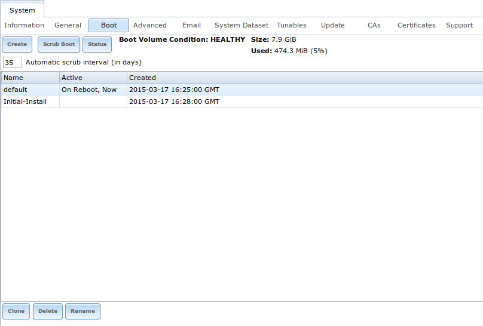

Each boot environment entry contains the following information:

* **Name:** the name of the boot entry as it will appear in the boot menu.

* **Active:** indicates which entry will boot by default if the user does not select another entry in the boot menu.

* **Created:** indicates the date and time the boot entry was created.

Highlight an entry to view its configuration buttons.  The following configuration buttons are available:

* **Rename:** used to change the name of the boot environment. Note that you cannot rename any boot environment which has an entry under the "Active" column.

* **Clone:** used to create a copy of the highlighted boot environment.

* **Activate:** will only appear on entries which are not currently set to "Active". Changes the selected entry to the default boot entry on next boot. Its
  status will change to "On Reboot" and the current "Active" entry will change from "On Reboot, Now" to "Now", indicating that it was used on the last boot
  but won't be used on the next boot.

* **Delete:** used to delete the highlighted entries, which also removes these entries from the boot menu. You
  **can not** delete the
  *default* entry or an entry that has been activated. If you need to delete an entry that you created and it is currently activated, first activate another
  entry, which will clear the *On reboot* field of the currently activated entry. 

The buttons above the boot entries can be used to:

* **Create:** a manual boot environment. A pop-up menu will prompt you to input a "Name" for the boot environment. When inputting the name, only alphanumeric,
  underscores, and dashes are allowed.

* **Scrub Boot:** can be used to perform a manual scrub of the boot device(s). By default, the boot device is scrubbed every 35 days. To change the default
  interval, input a different number in the "Automatic scrub interval (in days)" field. The date and results of the last scrub are also listed in this screen.
  The condition of the boot device should be listed as *HEALTHY*.

* **Status:** click this button to see the status of the boot device(s). In the example shown in Figure 5.3b, there is only one boot device and it is *ONLINE*.

**Figure 5.3b: Viewing the Status of the Boot Device**

|be2.png|

.. |be2.png| image:: images/be2.png

If this system had a mirrored boot device and one device had a "Status" of *OFFLINE*, one could click the device to replace, then click its "Replace" button.
Note that **you cannot replace the boot device if it is the only boot device** as it contains the operating system itself.

Figure 5.3c shows a sample boot menu containing entries for the default, initial, and wizard generated boot environments.

**Figure 5.3c: Boot Environments in Boot Menu**

|be3a.png|

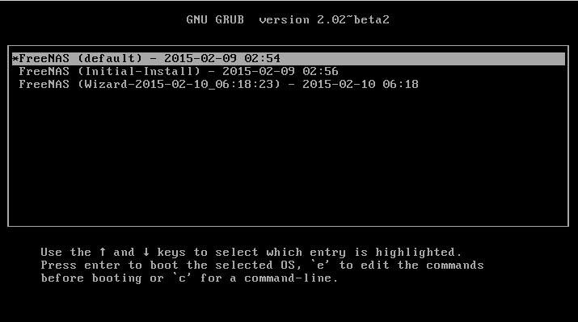

.. index:: Mirroring the Boot Device
.. _Mirroring the Boot Device:

Mirroring the Boot Device
~~~~~~~~~~~~~~~~~~~~~~~~~

If the system is currently booting from one device, you can add another device to create a mirrored boot device. This way, if one device fails, the system
still has a copy of the boot file system and can be configured to boot from the remaining device in the mirror.

.. note:: when adding another boot device, it must be the same size (or larger) as the existing boot device. Different models of USB devices which advertise the same size may
   not necessarily be the same size. For this reason, it is recommended to use the same model of USB drive.

In the example shown in Figure 5.3d, the user has clicked :menuselection:`System --> Boot --> Status` to display the current status of the boot device. The
example indicates that there is currently one device, *ada0p2*, its status is "ONLINE", and it is currently the only boot device as indicated by the word
*stripe*. To create a mirrored boot device, click either the entry called
*freenas-boot* or
*stripe*, then click the "Attach" button. If another device is available, it will appear in the "Member disk" drop-down menu. Select the desired device, then
click "Attach Disk".

**Figure 5.3d: Mirroring a Boot Device**

|mirror1.png|

.. |mirror1.png| image:: images/mirror1.png

Once the mirror is created, the "Status" screen will indicate that it is now a *mirror* and the number of devices in the mirror will be shown, as seen in the
example in Figure 5.3e.

**Figure 5.3e: Viewing the Status of a Mirrored Boot Device**

|mirror2.png|

.. |mirror2.png| image:: images/mirror2.png

.. _Advanced:

Advanced
--------

:menuselection:`System --> Advanced` is shown in Figure 5.4a. The configurable settings are summarized in Table 5.4a.

**Figure 5.4a: Advanced Screen**

|system3a.png|

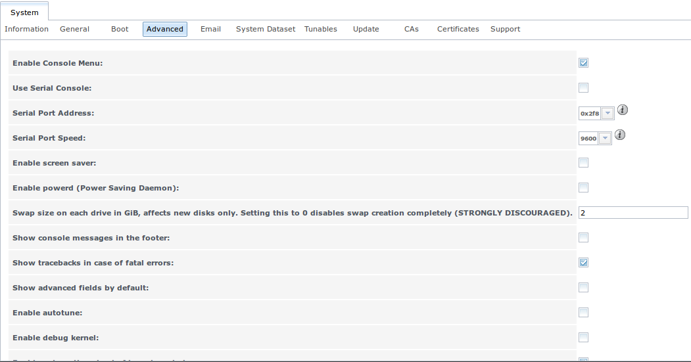

**Table 5.4a: Advanced Configuration Settings**

+-----------------------------------------+----------------------------------+------------------------------------------------------------------------------+
| Setting                                 | Value                            | Description                                                                  |
|                                         |                                  |                                                                              |
+=========================================+==================================+==============================================================================+
| Enable Console Menu                     | checkbox                         | unchecking this box removes the console menu shown in Figure 3a              |
|                                         |                                  |                                                                              |
+-----------------------------------------+----------------------------------+------------------------------------------------------------------------------+
| Use Serial Console                      | checkbox                         | do **not** check this box if your serial port is disabled                    |
|                                         |                                  |                                                                              |
+-----------------------------------------+----------------------------------+------------------------------------------------------------------------------+
| Serial Port Address                     | string                           | serial port address written in hex                                           |
|                                         |                                  |                                                                              |
+-----------------------------------------+----------------------------------+------------------------------------------------------------------------------+
| Serial Port Speed                       | drop-down menu                   | select the speed used by the serial port                                     |
|                                         |                                  |                                                                              |
+-----------------------------------------+----------------------------------+------------------------------------------------------------------------------+
| Enable screen saver                     | checkbox                         | enables/disables the console screen saver                                    |
|                                         |                                  |                                                                              |
+-----------------------------------------+----------------------------------+------------------------------------------------------------------------------+
| Enable powerd (Power Saving Daemon)     | checkbox                         | `powerd(8) <http://www.freebsd.org/cgi/man.cgi?query=powerd>`_               |
|                                         |                                  | monitors the system state and sets the CPU frequency accordingly             |
|                                         |                                  |                                                                              |
+-----------------------------------------+----------------------------------+------------------------------------------------------------------------------+
| Swap size                               | non-zero integer representing GB | by default, all data disks are created with this amount of swap; this        |
|                                         |                                  | setting does not affect log or cache devices as they are created without     |
|                                         |                                  | swap                                                                         |
|                                         |                                  |                                                                              |
+-----------------------------------------+----------------------------------+------------------------------------------------------------------------------+
| Show console messages in the footer     | checkbox                         | will display console messages in real time at bottom of browser; click the   |
|                                         |                                  | console to bring up a scrollable screen; check the "Stop refresh" box in the |
|                                         |                                  | scrollable screen to pause updating and uncheck the box to continue to watch |
|                                         |                                  | the messages as they occur                                                   |
|                                         |                                  |                                                                              |
+-----------------------------------------+----------------------------------+------------------------------------------------------------------------------+
| Show tracebacks in case of fatal errors | checkbox                         | provides a pop-up of diagnostic information when a fatal error occurs        |
|                                         |                                  |                                                                              |
+-----------------------------------------+----------------------------------+------------------------------------------------------------------------------+
| Show advanced fields by default         | checkbox                         | several GUI menus provide an "Advanced Mode" button to access additional     |
|                                         |                                  | features; enabling this shows these features by default                      |
|                                         |                                  |                                                                              |
+-----------------------------------------+----------------------------------+------------------------------------------------------------------------------+
| Enable autotune                         | checkbox                         | enables :ref:`autotune` which attempts to optimize the system depending      |
|                                         |                                  | upon the hardware which is installed                                         |
|                                         |                                  |                                                                              |
+-----------------------------------------+----------------------------------+------------------------------------------------------------------------------+
| Enable debug kernel                     | checkbox                         | if checked, next boot will boot into a debug version of the kernel           |
|                                         |                                  |                                                                              |
+-----------------------------------------+----------------------------------+------------------------------------------------------------------------------+
| Enable automatic upload of kernel       | checkbox                         | if checked, kernel crash dumps and telemetry (some system stats, collectd    |
| crash dumps and daily telemetry         |                                  | RRDs, and select syslog messages) are automatically sent to the  development |
|                                         |                                  | team for diagnosis                                                           |
|                                         |                                  |                                                                              |
+-----------------------------------------+----------------------------------+------------------------------------------------------------------------------+
| MOTD banner                             | string                           | input the message to be seen when a user logs in via SSH                     |
|                                         |                                  |                                                                              |
+-----------------------------------------+----------------------------------+------------------------------------------------------------------------------+
| Periodic Notification User              | drop-down menu                   | select the user to receive security output emails; this output runs nightly  |
|                                         |                                  | but only sends an email when the system reboots or encounters an error       |
|                                         |                                  |                                                                              |
+-----------------------------------------+----------------------------------+------------------------------------------------------------------------------+

If you make any changes, click the "Save" button.

This tab also contains the following buttons:

**Backup:** used to backup the FreeNAS® configuration and ZFS layout, and, optionally, the data, to a remote system over an encrypted connection. Click this
button to open the configuration screen shown in Figure 5.4b. Table 5.4b summarizes the configuration options. The only requirement for the remote system is
that it has sufficient space to hold the backup and it is running an SSH server on port 22. The remote system does not have to be formatted with ZFS as the
backup will be saved as a binary file. To restore a saved backup, use the "12) Restore from a backup" option of the FreeNAS® console menu shown in Figure 3a.

.. warning:: the backup and restore options are meant for disaster recovery. If you restore a system, it will be returned to the point in time that the backup
             was created. If you select the option to save the data, any data created after the backup was made will be lost. If you do **not** select the
             option to save the data, the system will be recreated with the same ZFS layout, but with **no** data.

.. warning:: the backup function **IGNORES ENCRYPTED POOLS**. Do not use it to backup systems with encrypted pools.

**Save Debug:** used to generate a text file of diagnostic information. It will prompt for the location to save the generated ASCII text file.

**Performance Test:** runs the `IOzone <http://iozone.org/>`_ write/rewrite and read/re-read tests. Since running these tests can affect performance, clicking
this button will turn the screen red and warn that the tests can impact performance of a running system. For this reason, the tests should be run at a time
that will least impact users. Once the tests are complete, which can take a few minutes, a pop-up message will prompt to save the results as a tarball.
Uncompress the tar file and use the resources in :ref:`IOzone` to assist in interpreting the results of the file.

**Figure 5.4b: Backup Configuration Screen**

|backup1.png|

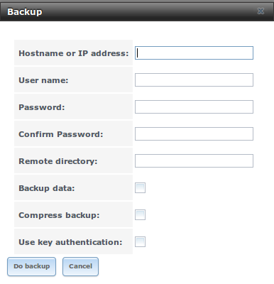

**Table 5.4b: Backup Configuration Settings**

+-----------------------------------------+----------------+------------------------------------------------------------------------------------------------+
| Setting                                 | Value          | Description                                                                                    |
|                                         |                |                                                                                                |
+=========================================+================+================================================================================================+
| Hostname or IP address                  | string         | input the IP address of the remote system, or the hostname if DNS is properly configured       |
|                                         |                |                                                                                                |
+-----------------------------------------+----------------+------------------------------------------------------------------------------------------------+
| User name                               | string         | the user account must exist on the remote system and have permissions to write to the "Remote  |
|                                         |                | directory"                                                                                     |
|                                         |                |                                                                                                |
+-----------------------------------------+----------------+------------------------------------------------------------------------------------------------+
| Password                                | string         | input and confirm the password associated with the user account                                |
|                                         |                |                                                                                                |
+-----------------------------------------+----------------+------------------------------------------------------------------------------------------------+
| Remote directory                        | string         | the full path to the directory to save the backup to                                           |
|                                         |                |                                                                                                |
+-----------------------------------------+----------------+------------------------------------------------------------------------------------------------+
| Backup data                             | checkbox       | by default, the backup is very quick as only the configuration database and the ZFS pool and   |
|                                         |                | database layout are saved; check this box to also save the data (which may take some time,     |
|                                         |                | depending upon the size of the pool and speed of the network)                                  |
|                                         |                |                                                                                                |
+-----------------------------------------+----------------+------------------------------------------------------------------------------------------------+
| Compress backup                         | checkbox       | if checked, gzip will be used to compress the backup which reduces the transmission size when  |
|                                         |                | "Backup data" is checked                                                                       |
|                                         |                |                                                                                                |
+-----------------------------------------+----------------+------------------------------------------------------------------------------------------------+
| Use key authentication                  | checkbox       | if checked, the public key of the *root* user must be stored in                                |
|                                         |                | :file:`~root/.ssh/authorized_keys` on the remote system and that key should **not** be         |
|                                         |                | protected by a passphrase; see :ref:`Rsync over SSH Mode` for instructions on how to generate  |
|                                         |                | a key pair                                                                                     |
|                                         |                |                                                                                                |
+-----------------------------------------+----------------+------------------------------------------------------------------------------------------------+

.. index:: Autotune
.. _Autotune:

Autotune
~~~~~~~~

FreeNAS® provides an autotune script which attempts to optimize the system depending upon the hardware which is installed. For example, if a ZFS volume
exists on a system with limited RAM, the autotune script will automatically adjust some ZFS sysctl values in an attempt to minimize ZFS memory starvation
issues. It should only be used as a temporary measure on a system that hangs until the underlying hardware issue is addressed by adding more RAM. Autotune
will always slow the system down as it caps the ARC.

The "Enable autotune" checkbox in :menuselection:`System --> Advanced` is unchecked by default. Check this box if you would like the autotuner to run
at boot time. If you would like the script to run immediately, you will need to reboot the system.

If the autotune script finds any settings that need adjusting, the changed values will appear in :menuselection:`System --> Tunables`. If you do not like the
changes, you can modify the values that are displayed in the GUI and your changes will override the values that were created by the autotune script. However,
if you delete a tunable that was created by autotune, it will be recreated at next boot. This is because autotune only creates values that do not already
exist.

If you are trying to increase the performance of your FreeNAS® system and suspect that the current hardware may be limiting performance, try enabling
autotune.

If you wish to read the script to see which checks are performed, the script is located in :file:`/usr/local/bin/autotune`.

.. index:: Email
.. _Email:

Email
-----

:menuselection:`System --> Email`, shown in Figure 5.5a, is used to configure the email settings on the FreeNAS® system. Table 5.5a summarizes the settings
that can be configured using the Email tab.

.. note:: it is important to configure the system so that it can successfully send emails. An automatic script sends a nightly email to the *root* user
   account containing important information such as the health of the disks. Alert events are also emailed to the *root* user account.

**Figure 5.5a: Email Screen**

|system4b.png|

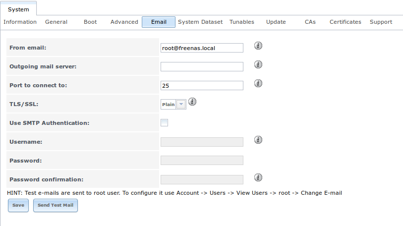

**Table 5.5a: Email Configuration Settings**

+----------------------+----------------------+-------------------------------------------------------------------------------------------------+
| **Setting**          | **Value**            | **Description**                                                                                 |
|                      |                      |                                                                                                 |
+======================+======================+=================================================================================================+
| From email           | string               | the **from** email address to be used when sending email notifications                          |
|                      |                      |                                                                                                 |
+----------------------+----------------------+-------------------------------------------------------------------------------------------------+
| Outgoing mail server | string or IP address | hostname or IP address of SMTP server                                                           |
|                      |                      |                                                                                                 |
+----------------------+----------------------+-------------------------------------------------------------------------------------------------+
| Port to connect to   | integer              | SMTP port number, typically *25*,                                                               |
|                      |                      | *465* (secure SMTP), or                                                                         |
|                      |                      | *587* (submission)                                                                              |
|                      |                      |                                                                                                 |
+----------------------+----------------------+-------------------------------------------------------------------------------------------------+
| TLS/SSL              | drop-down menu       | encryption type; choices are *Plain*,                                                           |
|                      |                      | *SSL*, or                                                                                       |
|                      |                      | *TLS*                                                                                           |
|                      |                      |                                                                                                 |
+----------------------+----------------------+-------------------------------------------------------------------------------------------------+
| Use                  | checkbox             | enables/disables                                                                                |
| SMTP                 |                      | `SMTP AUTH <http://en.wikipedia.org/wiki/SMTP_Authentication>`_                                 |
| Authentication       |                      | using PLAIN SASL; if checked, input the required "Username" and "Password"                      |
|                      |                      |                                                                                                 |
+----------------------+----------------------+-------------------------------------------------------------------------------------------------+
| Username             | string               | input the username if the SMTP server requires authentication                                   |
|                      |                      |                                                                                                 |
+----------------------+----------------------+-------------------------------------------------------------------------------------------------+
| Password             | string               | input the password if the SMTP server requires authentication                                   |
|                      |                      |                                                                                                 |
+----------------------+----------------------+-------------------------------------------------------------------------------------------------+

Click the "Send Test Mail" button to verify that the configured email settings are working. If the test email fails, double-check the email address to send
emails to by clicking the "Change E-mail" button for the *root* account in :menuselection:`Account --> Users --> View Users`.

.. _System Dataset:

System Dataset
--------------

:menuselection:`System --> System Dataset`, shown in Figure 5.6a, is used to select the pool which will contain the persistent system dataset. The system
dataset stores debugging core files and Samba4 metadata such as the user/group cache and share level permissions. If the FreeNAS® system is configured to be
a Domain Controller, all of the domain controller state is stored there as well, including domain controller users and groups.

**Figure 5.6a: System Dataset Screen**

|system5a.png|

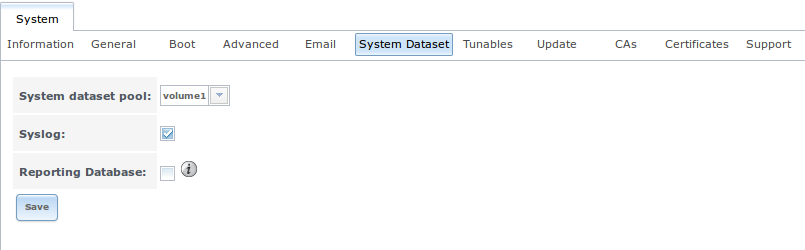

The system dataset can optionally be configured to also store the system log and :ref:`Reporting` information. If there are lots of log entries or reporting
information, moving these to the system dataset will prevent :file:`/var/` on the device holding the operating system from filling up as :file:`/var/` has
limited space. 

Use the drop-down menu to select the ZFS volume (pool) to contain the system dataset.

To store the system log on the system dataset, check the "Syslog" box.

To store the reporting information on the system dataset, check the "Reporting Database" box.

If you make any changes, click the "Save" button to save them.

If you change the pool storing the system dataset at a later time, FreeNAS® will automatically migrate the existing data in the system dataset to the new
location.

.. index:: Tunables
.. _Tunables:

Tunables
--------

:menuselection:`System --> Tunables` can be used to manage the following:

#. **FreeBSD sysctls:** a `sysctl(8) <http://www.freebsd.org/cgi/man.cgi?query=sysctl>`_ makes changes to the FreeBSD kernel running on a FreeNAS® system and
   can be used to tune the system.

#. **FreeBSD loaders:** a loader is only loaded when a FreeBSD-based system boots and can be used to pass a parameter to the kernel or to load an additional
   kernel module such as a FreeBSD hardware driver.

#. **FreeBSD rc.conf options:** `rc.conf(5) <https://www.freebsd.org/cgi/man.cgi?query=rc.conf&apropos=0&sektion=0&manpath=FreeBSD+9.3-RELEASE>`_ is used to
   pass system configuration options to the system startup scripts as the system boots. Since FreeNAS® has been optimized for storage, not all of the
   services mentioned in rc.conf(5) are available for configuration. Note that in FreeNAS®, customized rc.conf options are stored in
   :file:`/tmp/rc.conf.freenas`.

.. warning:: adding a sysctl, loader, or rc.conf option is an advanced feature. A sysctl immediately affects the kernel running the FreeNAS® system and a
   loader could adversely affect the ability of the FreeNAS® system to successfully boot.
   **Do not create a tunable on a production system unless you understand and have tested the ramifications of that change.** 

Since sysctl, loader, and rc.conf values are specific to the kernel parameter to be tuned, the driver to be loaded, or the service to configure, descriptions
and suggested values can be found in the man page for the specific driver and in many sections of the
`FreeBSD Handbook <http://www.freebsd.org/handbook>`_.

To add a loader, sysctl, or rc.conf option, go to :menuselection:`System --> Tunables --> Add Tunable`, to access the screen shown in seen in Figure 5.7a.

**Figure 5.7a: Adding a Tunable**

|tunable.png|

.. |tunable.png| image:: images/tunable.png

Table 5.7a summarizes the options when adding a tunable.

**Table 5.7a: Adding a Tunable**

+-------------+-------------------+-------------------------------------------------------------------------------------+
| **Setting** | **Value**         | **Description**                                                                     |
|             |                   |                                                                                     |
|             |                   |                                                                                     |
+=============+===================+=====================================================================================+
| Variable    | string            | typically the name of the sysctl or driver to load, as indicated by its man page    |
|             |                   |                                                                                     |
+-------------+-------------------+-------------------------------------------------------------------------------------+
| Value       | integer or string | value to associate with "Variable"; typically this is set to *YES*                  |
|             |                   | to enable the sysctl or driver specified by the "Variable"                          |
|             |                   |                                                                                     |
+-------------+-------------------+-------------------------------------------------------------------------------------+
| Type        | drop-down menu    | choices are *Loader*,                                                               |
|             |                   | *rc.conf*, or                                                                       |
|             |                   | *Sysctl*                                                                            |
|             |                   |                                                                                     |
+-------------+-------------------+-------------------------------------------------------------------------------------+
| Comment     | string            | optional, but a useful reminder for the reason behind adding this tunable           |
|             |                   |                                                                                     |
+-------------+-------------------+-------------------------------------------------------------------------------------+
| Enabled     | checkbox          | uncheck if you would like to disable the tunable without deleting it                |
|             |                   |                                                                                     |
+-------------+-------------------+-------------------------------------------------------------------------------------+

.. note:: as soon as you add or edit a *Sysctl*, the running kernel will change that variable to the value you specify. However, when you add a
   *Loader* or
   *rc.conf*, the changes you make will not take effect until the system is rebooted. Regardless of the type of tunable, your changes will persist at each
   boot and across upgrades unless the tunable is deleted or its "Enabled" checkbox is unchecked.

Any tunables that you add will be listed in :menuselection:`System --> Tunables`. To change the value of an existing tunable, click its "Edit" button. To
remove a tunable, click its "Delete" button.

Some sysctls are read-only, meaning that they require a reboot in order to enable their setting. You can determine if a sysctl is read-only by first
attempting to change it from :ref:`Shell`. For example, to change the value of *net.inet.tcp.delay_ack* to *1*, use the command
:command:`sysctl net.inet.tcp.delay_ack=1`. If the sysctl value is read-only, an error message will indicate that the setting is read-only. If you do not get
an error, the setting is now applied. For the setting to be persistent across reboots, the sysctl must still be added in :menuselection:`System --> Tunables`.

The GUI does not display the sysctls that are pre-set when FreeNAS® is installed. FreeNAS® 9.3 ships with the following sysctls set::

 kern.metadelay=3
 kern.dirdelay=4
 kern.filedelay=5
 kern.coredump=1
 kern.sugid_coredump=1
 net.inet.tcp.delayed_ack=0
 vfs.timestamp_precision=3

**Do not add or edit these default sysctls** as doing so may render the system unusable.

The GUI does not display the loaders that are pre-set when FreeNAS® is installed. FreeNAS® 9.3 ships with the following loaders set::

 autoboot_delay="2"
 loader_logo="freenas"
 loader_menu_title="Welcome to FreeNAS"
 loader_brand="freenas-brand"
 loader_version=" "
 debug.debugger_on_panic=1
 debug.ddb.textdump.pending=1
 hw.hptrr.attach_generic=0
 kern.ipc.nmbclusters="262144"
 vfs.mountroot.timeout="30"
 ispfw_load="YES"
 hint.isp.0.role=2
 hint.isp.1.role=2
 hint.isp.2.role=2
 hint.isp.3.role=2
 module_path="/boot/kernel;/boot/modules;/usr/local/modules"
 net.inet6.ip6.auto_linklocal="0"
 vfs.zfs.vol.mode=2
 hw.usb.no_shutdown_wait=1

**Do not add or edit the default tunables** as doing so may render the system unusable.

The ZFS version used in 9.3 deprecates the following tunables::

 vfs.zfs.write_limit_override
 vfs.zfs.write_limit_inflated
 vfs.zfs.write_limit_max
 vfs.zfs.write_limit_min
 vfs.zfs.write_limit_shift
 vfs.zfs.no_write_throttle

If you upgrade from an earlier version of FreeNAS® where these tunables are set, they will automatically be deleted for you. You should not try to add these
tunables back.

.. _Update:

Update
------

Beginning with version 9.3, FreeNAS® uses signed updates rather than point releases. This provides the FreeNAS® administrator more flexibility in deciding
when to upgrade the system in order to apply system patches or to add new drivers or features. It also allows the administrator to "test drive" an upcoming
release. Combined with boot environments, an administrator can try new features or apply system patches with the knowledge that they can revert to a previous
version of the operating system, using the instructions in :ref:`If Something Goes Wrong`. Signed patches also mean that the administrator no longer has to
manually download the GUI upgrade file and its associated checksum in order to perform an upgrade.

Figure 5.8a shows an example of the :menuselection:`System --> Update` screen. 

**Figure 5.8a: Update Options**

|update1a.png|

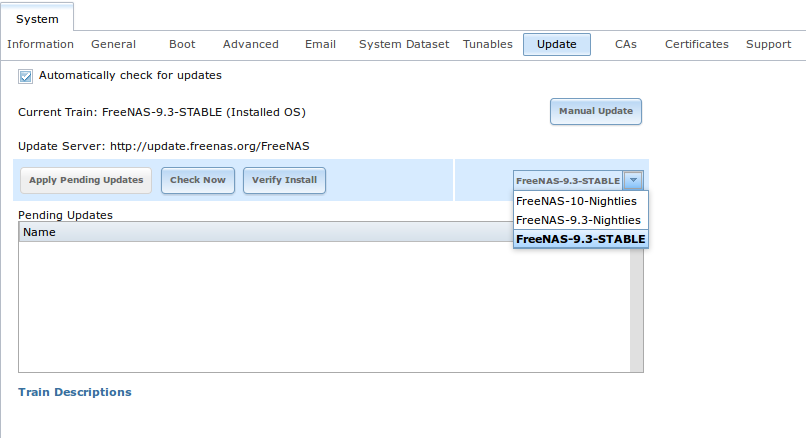

By default, the system will automatically check for updates and will issue an alert when a new update becomes available. To disable this default, uncheck the
box "Automatically check for updates".

This screen also shows which software branch, or train, the system is currently tracking updates for. The following trains are available:

* **FreeNAS-10-Nightlies:** this train should
  **not be used in production**. It represents the experimental branch for the future 10 version and is meant only for bleeding edge testers and developers.

* **FreeNAS-9.3-Nightlies:** this train has the latest, but still being tested, fixes and features. Unless you are testing a new feature, you do not want to
  run this train in production.

* **FreeNAS-9.3-STABLE:** this is the
  **recommended train for production use**. Once new fixes and features have been tested, they are added to this train. It is recommended to follow this train
  and to apply any of its pending updates.

To change the train, use the drop-down menu to make a different selection. It also lists the URL of the official update server should that information be
needed in a network with outbound firewall restrictions.

The "Verify Install" button will go through the operating system files in the current installation, looking for any inconsistencies. When finished, a pop-up
menu will list any files with checksum mismatches or permission errors.

To see if any updates are available, make sure the desired train is selected and click the "Check Now" button. If there are any updates available, they will
be listed. In the example shown in Figure 5.8b, the numbers which begin with a *#* represent the bug report number from
`bugs.freenas.org <http://bugs.freenas.org>`_. Numbers which do not begin with a *#* represent a git commit. Click the "ChangeLog" hyperlink to open the log
of changes in your web browser. Click the "ReleaseNotes" hyperlink to open the 9.3 Release Notes in your web browser.

**Figure 5.8b: Reviewing Updates**

|update2.png|

.. |update2.png| image:: images/update2.png

To apply the updates now, make sure that there aren't any clients currently connected to the FreeNAS® system and that a scrub is not running. Click the "OK"
button to download and apply the updates. Note that some updates will automatically reboot the system once they are applied.

.. warning:: each update creates a boot environment and if the boot device does not have sufficient space to hold another boot environment, the upgrade will
   fail. If you need to create more space on the boot device, use :menuselection:`System --> Boot` to review your current boot environments and to delete the
   ones you no longer plan to boot into.

Alternately, you can download the updates now and apply them later. To do so, uncheck the "Apply updates after downloading" box before pressing "OK". In this
case, this screen will close once the updates are downloaded and the downloaded updates will be listed in the "Pending Updates" section of the screen shown
in Figure 5.8a. When you are ready to apply the previously downloaded updates, click the "Apply Pending Updates" button and be aware that the system may
reboot after the updates are applied.

.. note:: the "Manual Update" button can be used to manually upgrade using a previously downloaded upgrade file, as described in :ref:`Upgrading From the GUI`. 
   While this can be useful to upgrade to a specific point in time, this button is primarily included for backwards compatibility as this method is no longer
   the recommended way to upgrade. Instead, select a train and apply any outstanding updates to ensure that the operating system has the most recent updates for
   the specified train.

.. index:: CA, Certificate Authority
.. _CAs:

CAs
---

Beginning with version 9.3, FreeNAS® can act as a Certificate Authority (CA). If you plan to use SSL or TLS to encrypt any of the connections to the
FreeNAS® system, you will need to first create a CA, then either create or import the certificate to be used for encrypted connections. Once you do this,
the certificate will appear in the drop-down menus for all the services that support SSL or TLS.

Figure 5.9a shows the initial screen if you click :menuselection:`System --> CAs`.

**Figure 5.9a: Initial CA Screen**

|ca1a.png|

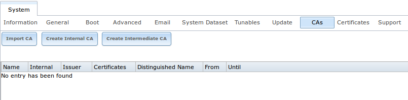

If your organization already has a CA, you can import the CA's certificate and key. Click the "Import CA" button to open the configuration screen shown in
Figure 5.9b. The configurable options are summarized in Table 5.9a.

**Figure 5.9b: Importing a CA**

|ca2a.png|

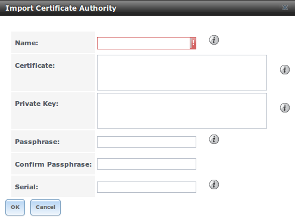

**Table 5.9a: Importing a CA Options**

+----------------------+----------------------+---------------------------------------------------------------------------------------------------+
| **Setting**          | **Value**            | **Description**                                                                                   |
|                      |                      |                                                                                                   |
+======================+======================+===================================================================================================+
| Name                 | string               | mandatory; input a descriptive name for the CA                                                    |
|                      |                      |                                                                                                   |
+----------------------+----------------------+---------------------------------------------------------------------------------------------------+
| Certificate          | string               | mandatory; paste in the certificate for the CA                                                    |
|                      |                      |                                                                                                   |
+----------------------+----------------------+---------------------------------------------------------------------------------------------------+
| Private Key          | string               | paste the private key associated with the certificate so that it can be used to sign certificates |
|                      |                      |                                                                                                   |
+----------------------+----------------------+---------------------------------------------------------------------------------------------------+
| Passphrase           | string               | if the private key is protected by a passphrase, enter it here and repeat it in the "Confirm      |
|                      |                      | Passphrase" field                                                                                 |
|                      |                      |                                                                                                   |
+----------------------+----------------------+---------------------------------------------------------------------------------------------------+
| Serial               | string               | mandatory; input the serial number for the certificate                                            |
|                      |                      |                                                                                                   |
+----------------------+----------------------+---------------------------------------------------------------------------------------------------+

To instead create a new CA, first decide if it will be the only CA which will sign certificates for internal use or if the CA will be part of a
`certificate chain <https://en.wikipedia.org/wiki/Root_certificate>`_.

To create a CA for internal use only, click the "Create Internal CA" button which will open the screen shown in Figure 5.9c. 

**Figure 5.9c: Creating an Internal CA**

|ca3.png|

.. |ca3.png| image:: images/ca3.png

The configurable options are described in Table 5.9b. When completing the fields for the certificate authority, use the information for your organization.

**Table 5.9b: Internal CA Options**

+----------------------+----------------------+-------------------------------------------------------------------------------------------------+
| **Setting**          | **Value**            | **Description**                                                                                 |
|                      |                      |                                                                                                 |
+======================+======================+=================================================================================================+
| Name                 | string               | mandatory; input a descriptive name for the CA                                                  |
|                      |                      |                                                                                                 |
+----------------------+----------------------+-------------------------------------------------------------------------------------------------+
| Key Length           | drop-down menu       | for security reasons, a minimum of *2048* is recommended                                        |
|                      |                      |                                                                                                 |
+----------------------+----------------------+-------------------------------------------------------------------------------------------------+
| Digest Algorithm     | drop-down menu       | the default should be fine unless your organization requires a different algorithm              |
|                      |                      |                                                                                                 |
+----------------------+----------------------+-------------------------------------------------------------------------------------------------+
| Lifetime             | integer              | in days                                                                                         |
|                      |                      |                                                                                                 |
+----------------------+----------------------+-------------------------------------------------------------------------------------------------+
| Country              | drop-down menu       | select the country for the organization                                                         |
|                      |                      |                                                                                                 |
+----------------------+----------------------+-------------------------------------------------------------------------------------------------+
| State                | string               | mandatory; input the state or province for the organization                                     |
|                      |                      |                                                                                                 |
+----------------------+----------------------+-------------------------------------------------------------------------------------------------+
| Locality             | string               | mandatory; input the location of the organization                                               |
|                      |                      |                                                                                                 |
+----------------------+----------------------+-------------------------------------------------------------------------------------------------+
| Organization         | string               | mandatory; input the name of the company or organization                                        |
|                      |                      |                                                                                                 |
+----------------------+----------------------+-------------------------------------------------------------------------------------------------+
| Email Address        | string               | mandatory; input the email address for the person responsible for the CA                        |
|                      |                      |                                                                                                 |
+----------------------+----------------------+-------------------------------------------------------------------------------------------------+
| Common Name          | string               | mandatory; input the FQDN of FreeNAS system                                                     |
|                      |                      |                                                                                                 |
+----------------------+----------------------+-------------------------------------------------------------------------------------------------+

To instead create an intermediate CA which is part of a certificate chain, click the "Create Intermediate CA" button. This screen adds one more option to the
screen shown in Figure 5.9c:

* **Signing Certificate Authority:** this drop-down menu is used to specify the root CA in the certificate chain. This CA must first be imported or created.

Any CAs that you import or create will be added as entries in :menuselection:`System --> CAs`. The columns in this screen will indicate the name of the CA,
whether or not it is an internal CA, whether or not the issuer is self-signed, the number of certificates that have been issued by the CA, the distinguished
name of the CA, the date and time the CA was created, and the date and time the CA expires.

If you click the entry for a CA, the following buttons become available:

* **Edit:** can be used to edit the "Name", "Certificate", "Private Key", or "Serial" of the CA.

* **Export Certificate:** will prompt to browse to the location, on the system being used to access the FreeNAS® system, to save a copy of the CA's
  X.509 certificate.

* **Export Private Key:** will prompt to browse to the location, on the system being used to access the FreeNAS® system, to save a copy of the CA's private
  key.

* **Delete:** will prompt to confirm before deleting the CA.

.. index:: Certificates
.. _Certificates:

Certificates
------------

Beginning with version 9.3, FreeNAS® can import existing existing certificates, create new certificates, and issue certificate
signing requests so that created certificates can be signed by the CA which was previously imported or created in :ref:`CAs`.

Figure 5.10a shows the initial screen if you click :menuselection:`System --> Certificates`.

**Figure 5.10a: Initial Certificates Screen**

|cert1a.png|

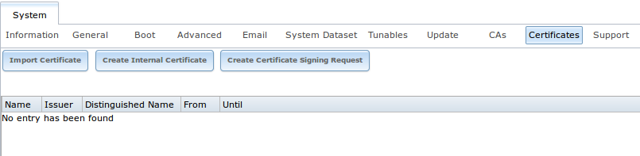

To import an existing certificate, click the "Import Certificate" button to open the configuration screen shown in Figure 5.10b. The configurable options are
summarized in Table 5.10a.

**Figure 5.10b: Importing a Certificate**

|cert2a.png|

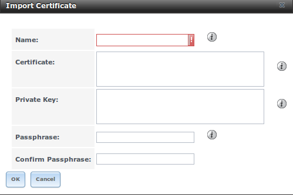

**Table 5.10a: Certificate Import Options**

+----------------------+----------------------+-------------------------------------------------------------------------------------------------+
| **Setting**          | **Value**            | **Description**                                                                                 |
|                      |                      |                                                                                                 |
+======================+======================+=================================================================================================+
| Name                 | string               | mandatory; input a descriptive name for the certificate; can not contain the *"* character      |
|                      |                      |                                                                                                 |
+----------------------+----------------------+-------------------------------------------------------------------------------------------------+
| Certificate          | string               | mandatory; paste the contents of the certificate                                                |
|                      |                      |                                                                                                 |
+----------------------+----------------------+-------------------------------------------------------------------------------------------------+
| Private Key          | string               | mandatory; paste the private key associated with the certificate                                |
|                      |                      |                                                                                                 |
+----------------------+----------------------+-------------------------------------------------------------------------------------------------+
| Passphrase           | string               | if the private key is protected by a passphrase, enter it here and repeat it in the "Confirm    |
|                      |                      | Passphrase" field                                                                               |
|                      |                      |                                                                                                 |
+----------------------+----------------------+-------------------------------------------------------------------------------------------------+

To instead create a new self-signed certificate, click the "Create Internal Certificate" button to see the screen shown in Figure 5.10c. The configurable
options are summarized in Table 5.10b. When completing the fields for the certificate authority, use the information for your organization. Since this is a
self-signed certificate, use the CA that you imported or created using :ref:`CAs` as the signing authority.

**Figure 5.10c: Creating a New Certificate**

|cert3a.png|

.. |cert3a.png| image:: images/cert3a.png

**Table 5.10b: Certificate Creation Options**

+----------------------+----------------------+-------------------------------------------------------------------------------------------------+
| **Setting**          | **Value**            | **Description**                                                                                 |
|                      |                      |                                                                                                 |
+======================+======================+=================================================================================================+
| Signing Certificate  | drop-down menu       | mandatory; select the CA which was previously imported or created using :ref:`CAs`              |
| Authority            |                      |                                                                                                 |
+----------------------+----------------------+-------------------------------------------------------------------------------------------------+
| Name                 | string               | mandatory; input a descriptive name for the certificate; can not contain the *"* character      |
|                      |                      |                                                                                                 |
+----------------------+----------------------+-------------------------------------------------------------------------------------------------+
| Key Length           | drop-down menu       | for security reasons, a minimum of *2048* is recommended                                        |
|                      |                      |                                                                                                 |
+----------------------+----------------------+-------------------------------------------------------------------------------------------------+
| Digest Algorithm     | drop-down menu       | the default should be fine unless your organization requires a different algorithm              |
|                      |                      |                                                                                                 |
+----------------------+----------------------+-------------------------------------------------------------------------------------------------+
| Lifetime             | integer              | in days                                                                                         |
|                      |                      |                                                                                                 |
+----------------------+----------------------+-------------------------------------------------------------------------------------------------+
| Country              | drop-down menu       | select the country for the organization                                                         |
|                      |                      |                                                                                                 |
+----------------------+----------------------+-------------------------------------------------------------------------------------------------+
| State                | string               | mandatory; input the state or province for the organization                                     |
|                      |                      |                                                                                                 |
+----------------------+----------------------+-------------------------------------------------------------------------------------------------+
| Locality             | string               | mandatory; input the location for the organization                                              |
|                      |                      |                                                                                                 |
+----------------------+----------------------+-------------------------------------------------------------------------------------------------+
| Organization         | string               | mandatory; input the name of the company or organization                                        |
|                      |                      |                                                                                                 |
+----------------------+----------------------+-------------------------------------------------------------------------------------------------+
| Email Address        | string               | mandatory; input the email address for the person responsible for the CA                        |
|                      |                      |                                                                                                 |
+----------------------+----------------------+-------------------------------------------------------------------------------------------------+
| Common Name          | string               | mandatory; input the FQDN of FreeNAS system                                                     |
|                      |                      |                                                                                                 |
+----------------------+----------------------+-------------------------------------------------------------------------------------------------+

If you need to use a certificate that is signed by an external CA, such as Verisign, instead create a certificate signing request. To do so, click the
"Create Certificate Signing Request" button. This will open a screen similar to Figure 5.10c, but without the "Signing Certificate Authority" field.

All certificates that you import, self-sign, or make a certificate signing request for will be added as entries to :menuselection:`System --> Certificates`.
In the example shown in Figure 5.10d, a self-signed certificate and a certificate signing request have been created for the fictional organization
*My Company*. The self-signed certificate was issued by the internal CA named
*My Company* and the administrator has not yet sent the certificate signing request to Verisign so that it can be signed. Once that certificate is signed and
returned by the external CA, it should be imported using the "Import Certificate" button so that is available as a configurable option for encrypting
connections.

**Figure 5.10d: Managing Certificates**

|cert4.png|

.. |cert4.png| image:: images/cert4.png

If you click an entry, it will activate the following configuration buttons:

* **View:** once a certificate is created, it cannot be edited. You can, however, view its "Name", "Certificate", and "Private Key". If you need to change a
  certificate, you will need to "Delete" it then recreate it.

* **Export Certificate:** used to save a copy of the certificate or certificate signing request to the system being used to access the FreeNAS® system. For a
  certificate signing request, send the exported certificate to the external signing authority so that it can be signed.

* **Export Private Key:** used to save a copy of the private key associated with the certificate or certificate signing request to the system being used to
  access the FreeNAS® system.

* **Delete:** used to delete a certificate or certificate signing request.

.. index:: Support
.. _Support:

Support
-------

The FreeNAS® "Support" tab, shown in Figure 5.11a, provides a built-in ticketing system for generating bug reports and feature requests.

**Figure 5.11a: Support Tab**

|support1a.png|

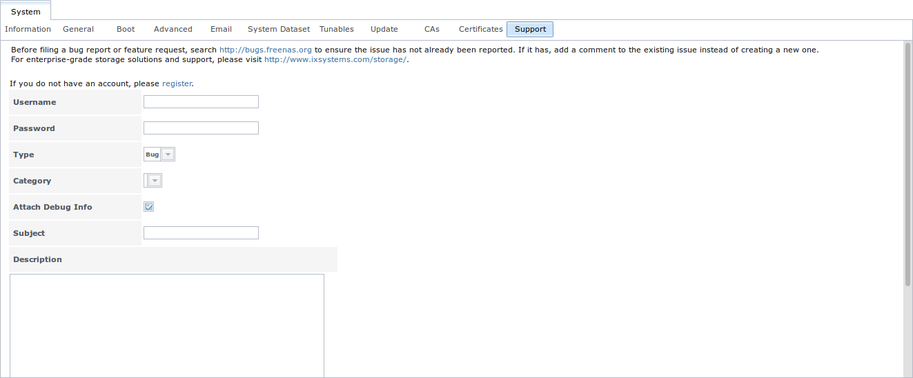

This screen provides a built-in interface to the FreeNAS® bug tracker located at `bugs.freenas.org <https://bugs.freenas.org>`_. If you have not yet used the
FreeNAS® bug tracker, you must first go to that website, click the "Register" link, fill out the form, and reply to the register email. You will then have a
username and password which can be used to create bug reports and receive notifications as your reports are actioned.

Before creating a bug report or feature request, ensure that an existing report does not already exist at `bugs.freenas.org <https://bugs.freenas.org>`_. If
you find a similar issue that is not yet marked as "closed" or "resolved", add a comment to that issue if you have new information to provide that can assist
in resolving the issue. If you find a similar issue that is marked as "closed" or "resolved", you can create a new issue and refer to the earlier issue
number.

.. note:: if you are not updated to the latest version of STABLE, do that first to see if it resolves your issue.

To generate a report using the built-in "Support" screen, complete the following fields:

* **Username:** input the login name you created when registering at `bugs.freenas.org <https://bugs.freenas.org>`_.

* **Password:** input the password associated with the registered login name.

* **Type:** select "Bug" when reporting an issue or "Feature" when requesting a new feature.

* **Category:** this drop-down menu will be empty until you input a registered "Username" and "Password" and an error message will display if either value is
  incorrect. Once the "Username" and "Password" are validated, the possible categories will be populated to the drop-down menu. Select the one that best
  describes the bug or feature that you are reporting.

* **Attach Debug Info:** it is recommended to leave this box checked so that an overview of the system's hardware, build string, and configuration is
  automatically generated and included with the ticket.

* **Subject:** input a descriptive title for the ticket. A good "Subject" makes it easy for you and other users to find similar reports.

* **Description:** input a 1 to 3 paragraph summary of the issue that describes the problem, and if applicable, what steps one can do to reproduce it.

* **Attachments:** this is the only optional field. It is useful for including configuration files or screenshots of any errors or tracebacks.

Once you have finished completing the fields, click the "Submit" button to automatically generate and upload the report to
`bugs.freenas.org <https://bugs.freenas.org>`_. A pop-up menu will provide a clickable URL so that you can view the status of or add additional information to
the report.
