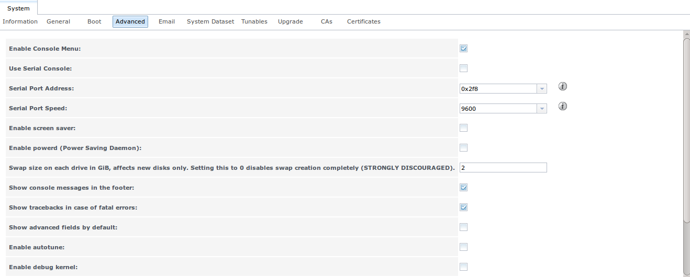

:orphan:

.. _System:

System
======

The System section of the administrative GUI contains the following entries:

* :ref:`Information`: provides general FreeNAS® system information such as hostname, operating system version, platform, and uptime

* :ref:`General`: used to general settings such as HTTPS access, the language, and the timezone

* :ref:`Boot`: used to create, rename, and delete boot environments.

* :ref:`Advanced`: used to configure advanced settings such as the serial console, swap, console messages, and other advanced fields

* :ref:`Email`: used to configure the email address to receive notifications

* :ref:`System Dataset`: used to configure the location of the system dataset

* :ref:`Tunables`: provides a front-end for tuning in real-time and to load additional kernel modules at boot time

* :ref:`Upgrade`: used to perform upgrades and to check for new updates.

* :ref:`CAs`: used to import or create an internal or intermediate CA (Certificate Authority)

* :ref:`Certificates`: used to import existing certificates or to create self-signed certificates

Each of these is described in more detail in this section.

.. _Information:

Information
-----------

:menuselection:`System --> Information` displays general information about the FreeNAS® system. An example is seen in Figure 5.1a.

The information includes the hostname, the build version, type of CPU (platform), the amount of memory, the current system time, the system's uptime, and the
current load average.

To change the system's hostname, click its "Edit" button, type in the new hostname, and click "OK". The hostname must include the domain name. If the network
does not use a domain name add *.local* to the end of the hostname.

**Figure 5.1a: System Information Tab**

|Figure51a_png|

.. _General:

General
-------

:menuselection:`System --> General` is shown in Figure 5.2a.

**Figure 5.2a: General Screen**

|system2.png|

.. |system2.png| image:: images/system2.png
    :width: 4.8in
    :height: 4.2in
    
Table 5.2a summarizes the settings that can be configured using the General tab:

**Table 5.2a: General Configuration Settings**

+----------------------+----------------+--------------------------------------------------------------------------------------------------------------------------------+
| Setting              | Value          | Description                                                                                                                    |
|                      |                |                                                                                                                                |
+======================+================+================================================================================================================================+
| Protocol             | drop-down menu | protocol to use when connecting to the administrative GUI from a browser; if you change the default of *HTTP* to               |
|                      |                | *HTTPS*, select the certificate to use in "Certificate"; if you do not have a certificate, first create a CA (in `CAs`_)       |
|                      |                | then the certificate (in `Certificates`_)                                                                                      |
|                      |                |                                                                                                                                |
+----------------------+----------------+--------------------------------------------------------------------------------------------------------------------------------+
| Certificate          | drop-down menu | required for *HTTPS*; browse to the location of the certificate to use for encrypted connections                               |
|                      |                |                                                                                                                                |
+----------------------+----------------+--------------------------------------------------------------------------------------------------------------------------------+
| WebGUI IPv4 Address  | drop-down menu | choose from a list of recent IP addresses to limit the one to use when accessing the administrative GUI; the                   |
|                      |                | built-in HTTP server will automatically bind to the wildcard address of *0.0.0.0* (any address) and will issue an              | 
|                      |                | alert if the specified address becomes unavailable                                                                             |
|                      |                |                                                                                                                                |
+----------------------+----------------+--------------------------------------------------------------------------------------------------------------------------------+
| WebGUI IPv6 Address  | drop-down menu | choose from a list of recent IPv6 addresses to limit the one to use when accessing the administrative GUI; the                 |
|                      |                | built-in HTTP server will automatically bind to any address and will issue an alert                                            |
|                      |                | if the specified address becomes unavailable                                                                                   |
|                      |                |                                                                                                                                |
+----------------------+----------------+--------------------------------------------------------------------------------------------------------------------------------+
| WebGUI HTTP Port     | integer        | allows you to configure a non-standard port for accessing the administrative GUI over HTTP; changing this setting              |
|                      |                | may require you to                                                                                                             |
|                      |                | `change a firefox configuration setting <http://www.redbrick.dcu.ie/%7Ed_fens/articles/Firefox:_This_Address_is_Restricted>`_  |
|                      |                |                                                                                                                                |
+----------------------+----------------+--------------------------------------------------------------------------------------------------------------------------------+
| WebGUI HTTPS Port    | integer        | allows you to configure a non-standard port for accessing the administrative GUI over HTTPS                                    |
|                      |                |                                                                                                                                |
+----------------------+----------------+--------------------------------------------------------------------------------------------------------------------------------+
| WebGUI HTTPS -->     | checkbox       |                                                                                                                                |
| HTTPS Redirect       |                |                                                                                                                                |
|                      |                |                                                                                                                                |
+----------------------+----------------+--------------------------------------------------------------------------------------------------------------------------------+
| Language             | drop-down menu | select the localization from the drop-down menu and reload the browser; you can view the status of localization at             |
|                      |                | `pootle.freenas.org <http://pootle.freenas.org/>`_                                                                             |
|                      |                |                                                                                                                                |
+----------------------+----------------+--------------------------------------------------------------------------------------------------------------------------------+
| Console Keyboard Map | drop-down menu | select the keyboard layout                                                                                                     |
|                      |                |                                                                                                                                |
+----------------------+----------------+--------------------------------------------------------------------------------------------------------------------------------+
| Timezone             | drop-down menu | select the timezone from the drop-down menu                                                                                    |
|                      |                |                                                                                                                                |
+----------------------+----------------+--------------------------------------------------------------------------------------------------------------------------------+
| Syslog server        | string         | IP address or hostname of remote syslog server to send logs to; once set, log entries will be written to                       |
|                      |                | both the console and the remote server                                                                                         |
|                      |                |                                                                                                                                |
+----------------------+----------------+--------------------------------------------------------------------------------------------------------------------------------+

If you make any changes, click the "Save" button.

This screen also contains the following buttons:

**Factory Restore:** resets the configuration database to the default base version. However, it does not delete user SSH keys or any other data stored in a
user's home directory. Since any configuration changes stored in the configuration database will be erased, this option is handy if you mess up your system or
wish to return a test system to the original configuration.

**Save Config:** used to create a backup copy of the current configuration database in the format *hostname-version-architecture*.
**Always save the configuration after making changes and verify that you have a saved configuration before performing an upgrade.** This
`forum post <http://forums.freenas.org/showthread.php?10735-How-to-automate-FreeNAS-configuration-database-backup>`_
contains a script to backup the configuration which could be customized and added as a cron job. This
`forum post <http://forums.freenas.org/showthread.php?12333-Backup-config-only-if-changed>`_
contains an alternate script which only saves a copy of the configuration when it changes. And this
`forum post <http://forums.freenas.org/threads/backup-config-file-every-night-automatically.8237>`_
contains a script for backing up the configuration from another system.

**Upload Config:** allows you to browse to location of saved configuration file in order to restore that configuration.

**NTP Servers:** The network time protocol (NTP) is used to synchronize the time on the computers in a network. Accurate time is necessary for the successful
operation of time sensitive applications such as Active Directory. By default, FreeNAS® is pre-configured to use three public NTP servers. If your network is
using Active Directory, ensure that the FreeNAS® system and the Active Directory Domain Controller have been configured to use the same NTP servers. To
add a NTP server to match the settings used by your network's domain controller, click :menuselection:`NTP Servers --> Add NTP Server` to open the screen
shown in Figure 5.2b. Table 5.2b summarizes the options when adding an NTP server.
`ntp.conf(5) <http://www.freebsd.org/cgi/man.cgi?query=ntp.conf>`_
explains these options in more detail.

**Figure 5.2b: Add a NTP Server**

|ntp1.png|

.. |ntp1.png| image:: images/ntp1.png
    :width: 7.1in
    :height: 3.9in

**Table 5.2b: NTP Servers Configuration Options**

+-------------+-----------+-----------------------------------------------------------------------------------------------------------------------+
| **Setting** | **Value** | **Description**                                                                                                       |
|             |           |                                                                                                                       |
|             |           |                                                                                                                       |
+=============+===========+=======================================================================================================================+
| Address     | string    | name of NTP server                                                                                                    |
|             |           |                                                                                                                       |
+-------------+-----------+-----------------------------------------------------------------------------------------------------------------------+
| Burst       | checkbox  | recommended when "Max. Poll" is greater than *10*; only use on your own servers i.e.                                  |
|             |           | **do not** use with a public NTP server                                                                               |
|             |           |                                                                                                                       |
+-------------+-----------+-----------------------------------------------------------------------------------------------------------------------+
| IBurst      | checkbox  | speeds the initial synchronization (seconds instead of minutes)                                                       |
|             |           |                                                                                                                       |
+-------------+-----------+-----------------------------------------------------------------------------------------------------------------------+
| Prefer      | checkbox  | should only be used for NTP servers that are known to be highly accurate, such as those with time monitoring hardware |
|             |           |                                                                                                                       |
+-------------+-----------+-----------------------------------------------------------------------------------------------------------------------+
| Min. Poll   | integer   | power of 2 in seconds; can not be lower than                                                                          |
|             |           | *4* or higher than "Max. Poll"                                                                                        |
|             |           |                                                                                                                       |
+-------------+-----------+-----------------------------------------------------------------------------------------------------------------------+
| Max. Poll   | integer   | power of 2 in seconds; can not be higher than                                                                         |
|             |           | *17* or lower than "Min. Poll"                                                                                        |
|             |           |                                                                                                                       |
+-------------+-----------+-----------------------------------------------------------------------------------------------------------------------+
| Force       | checkbox  | forces the addition of the NTP server, even if it is currently unreachable                                            |
|             |           |                                                                                                                       |
+-------------+-----------+-----------------------------------------------------------------------------------------------------------------------+

.. _Boot:

Boot
----

Beginning with version 9.3, FreeNAS® supports a feature of ZFS known as multiple boot environments. With multiple boot environments, the process of updating
the operating system or testing configuration changes becomes a low-risk operation as you can create a snapshot of your current boot environment before
upgrading or making configuration changes to the system. When a boot environment is created, an entry is added to the boot menu. If the upgrade or
configuration change fails, simply reboot the system and select that boot environment from the boot menu to instruct the system to go back to that system
state.

As seen in Figure 5.3a, a *default* boot environment is created when FreeNAS® is installed.

**Figure 5.3a: Default Boot Environment**

|be1.png|

To create a boot environment, click the "Create" button, input a name for the boot environment, and click "OK". In the example shown in Figure 5.3b, a boot
environment named *working_config* was created in preparation before making testing changes to a known working configuration.

**Figure 5.3b: Viewing Boot Environments**

|be2.png|

Highlight an entry to view its configuration buttons. Each entry contains the following information:

* **Name:** the name of the boot entry which will appear in the boot menu.

* **Active:** indicates which entry will boot by default if the user does not select another entry in the boot menu.

* **Created:** indicates the date and time the boot entry was created.

The following configuration buttons are available:

* **Rename:** used to change the name of the boot environment.

* **Clone:** used to create a copy of the highlighted boot environment.

* **Activate:** will only appear on entries which are not currently set to "Active". Changes the selected entry to the default boot entry on next boot. Its
  status will change to "On Reboot" and the current "Active" entry will change from "On Reboot, Now" to "Now", indicating that it was used on the last boot
  but won't be used on the next boot.

* **Delete:** used to delete that entry, which also removes it from the boot menu. You
  **can not** delete the
  *default* entry or an entry that has been activated. If you need to delete an entry that you created and it is currently activated, first activate another
  entry, which will clear the *On reboot* field of the currently activated entry.

Figure 5.3c shows the boot menu with our example boot environment added.

**Figure 5.3c: Boot Environments in Boot Menu**

|be3.png|

.. _Advanced:

Advanced
--------

:menuselection:`System --> Advanced` is shown in Figure 5.4a. The configurable settings are summarized in Table 5.4a.

**Figure 5.4a: Advanced Screen**

|system3.png|

**Table 5.4a: Advanced Configuration Settings**

+-----------------------------------------+----------------------------------+------------------------------------------------------------------------------+
| Setting                                 | Value                            | Description                                                                  |
|                                         |                                  |                                                                              |
+=========================================+==================================+==============================================================================+
| Enable Console Menu                     | checkbox                         | unchecking this box removes the console menu shown in Figure 2.6a            |
|                                         |                                  |                                                                              |
+-----------------------------------------+----------------------------------+------------------------------------------------------------------------------+
| Use Serial Console                      | checkbox                         | do **not** check this box if your serial port is disabled                    |
|                                         |                                  |                                                                              |
+-----------------------------------------+----------------------------------+------------------------------------------------------------------------------+
| Serial Port Address                     | string                           | serial port address written in hex                                           |
|                                         |                                  |                                                                              |
+-----------------------------------------+----------------------------------+------------------------------------------------------------------------------+
| Serial Port Speed                       | drop-down menu                   | select the speed used by the serial port                                     |
|                                         |                                  |                                                                              |
+-----------------------------------------+----------------------------------+------------------------------------------------------------------------------+
| Enable screen saver                     | checkbox                         | enables/disables the console screen saver                                    |
|                                         |                                  |                                                                              |
+-----------------------------------------+----------------------------------+------------------------------------------------------------------------------+
| Enable powerd (Power Saving Daemon)     | checkbox                         | `powerd(8) <http://www.freebsd.org/cgi/man.cgi?query=powerd>`_               |
|                                         |                                  | monitors the system state and sets the CPU frequency accordingly             |
|                                         |                                  |                                                                              |
+-----------------------------------------+----------------------------------+------------------------------------------------------------------------------+
| Swap size                               | non-zero integer representing GB | by default, all data disks are created with this amount of swap; this        |
|                                         |                                  | setting does not affect log or cache devices as they are created without     |
|                                         |                                  | swap                                                                         |
|                                         |                                  |                                                                              |
+-----------------------------------------+----------------------------------+------------------------------------------------------------------------------+
| Show console messages in the footer     | checkbox                         | will display console messages in real time at bottom of browser; click the   |
|                                         |                                  | console to bring up a scrollable screen; check the "Stop refresh" box in the |
|                                         |                                  | scrollable screen to pause updating and uncheck the box to continue to watch |
|                                         |                                  | the messages as they occur                                                   |
|                                         |                                  |                                                                              |
+-----------------------------------------+----------------------------------+------------------------------------------------------------------------------+
| Show tracebacks in case of fatal errors | checkbox                         | provides a pop-up of diagnostic information when a fatal error occurs        |
|                                         |                                  |                                                                              |
+-----------------------------------------+----------------------------------+------------------------------------------------------------------------------+
| Show advanced fields by default         | checkbox                         | several GUI menus provide an "Advanced Mode" button to access additional     |
|                                         |                                  | features; enabling this shows these features by default                      |
|                                         |                                  |                                                                              |
+-----------------------------------------+----------------------------------+------------------------------------------------------------------------------+
| Enable autotune                         | checkbox                         | enables the autotune script which attempts to optimize the system depending  |
|                                         |                                  | upon the hardware which is installed                                         |
|                                         |                                  |                                                                              |
+-----------------------------------------+----------------------------------+------------------------------------------------------------------------------+
| Enable debug kernel                     | checkbox                         | if checked, next boot will boot into a debug version of the kernel           |
|                                         |                                  |                                                                              |
+-----------------------------------------+----------------------------------+------------------------------------------------------------------------------+
| Enable automatic upload of kernel       | checkbox                         | if checked, kernel crash dumps are automatically sent to the                 |
| crash dumps                             |                                  | development team for diagnosis                                               |
|                                         |                                  |                                                                              |
+-----------------------------------------+----------------------------------+------------------------------------------------------------------------------+
| MOTD banner                             | string                           | input the message to be seen when a user logs in via SSH                     |
|                                         |                                  |                                                                              |
+-----------------------------------------+----------------------------------+------------------------------------------------------------------------------+

If you make any changes, click the "Save" button.

This tab also contains the following buttons:

**Save Debug:** used to generate a text file of diagnostic information. t will prompt for the location to save the ASCII text file.

**Performance Test:** runs a series of performance tests and prompts to saves the results as a tarball. Since running the tests can affect performance, a
warning is provided and the tests should be run at a time that will least impact users.

.. _Autotune:

Autotune
~~~~~~~~

FreeNAS® provides an autotune script which attempts to optimize the system depending upon the hardware which is installed. For example, if a ZFS volume
exists on a system with limited RAM, the autotune script will automatically adjust some ZFS sysctl values in an attempt to minimize ZFS memory starvation
issues. It should only be used as a temporary measure on a system that hangs until the underlying hardware issue is addressed by adding more RAM. Autotune
will always slow the system down as it caps the ARC.

The "Enable autotune" checkbox in :menuselection:`System --> Advanced` is unchecked by default; check it if you would like the autotuner to run
at boot time. If you would like the script to run immediately, reboot the system.

If autotuner finds any settings that need adjusting, the changed values will appear in :menuselection:`System --> Tunables`. If you do not like the changes,
you can modify the values that are displayed in the GUI and your changes will override the values that were created by the autotune script. However, if you
delete a tunable that was created by autotune, it will be recreated at next boot. This is because autotune only creates values that do not already exist.

If you are trying to increase the performance of your FreeNAS® system and suspect that the current hardware may be limiting performance, try enabling
autotune.

If you wish to read the script to see which checks are performed, the script is located in :file:`/usr/local/bin/autotune`.

.. _Email:

Email
-----

:menuselection:`System --> Email`, shown in Figure 5.5a, is used to configure the email settings on the FreeNAS® system. Table 5.5a summarizes the settings
that can be configured using the Email tab.

.. note:: it is important to configure the system so that it can successfully send emails. An automatic script send a nightly email to the *root* user account
   containing important information such as the health of the disks. Alert events are also emailed to the *root* user account.

**Figure 5.5a: Email Screen**

|system4.png|

.. |system4.png| image:: images/system4.png
    :width: 4.7in
    :height: 3.7in

**Table 5.5a: Email Configuration Settings**

+----------------------+----------------------+-------------------------------------------------------------------------------------------------+
| **Setting**          | **Value**            | **Description**                                                                                 |
|                      |                      |                                                                                                 |
+======================+======================+=================================================================================================+
| From email           | string               | the **from** email address to be used when sending email notifications                          |
|                      |                      |                                                                                                 |
+----------------------+----------------------+-------------------------------------------------------------------------------------------------+
| Outgoing mail server | string or IP address | hostname or IP address of SMTP server                                                           |
|                      |                      |                                                                                                 |
+----------------------+----------------------+-------------------------------------------------------------------------------------------------+
| Port to connect to   | integer              | SMTP port number, typically *25*,                                                               |
|                      |                      | *465* (secure SMTP), or                                                                         |
|                      |                      | *587* (submission)                                                                              |
|                      |                      |                                                                                                 |
+----------------------+----------------------+-------------------------------------------------------------------------------------------------+
| TLS/SSL              | drop-down menu       | encryption type; choices are *Plain*,                                                           |
|                      |                      | *SSL*, or                                                                                       |
|                      |                      | *TLS*                                                                                           |
|                      |                      |                                                                                                 |
+----------------------+----------------------+-------------------------------------------------------------------------------------------------+
| Use                  | checkbox             | enables/disables                                                                                |
| SMTP                 |                      | `SMTP AUTH <http://en.wikipedia.org/wiki/SMTP_Authentication>`_                                 |
| Authentication       |                      | using PLAIN SASL                                                                                |
|                      |                      |                                                                                                 |
+----------------------+----------------------+-------------------------------------------------------------------------------------------------+
| Username             | string               | used to authenticate with SMTP server                                                           |
|                      |                      |                                                                                                 |
+----------------------+----------------------+-------------------------------------------------------------------------------------------------+
| Password             | string               | used to authenticate with SMTP server                                                           |
|                      |                      |                                                                                                 |
+----------------------+----------------------+-------------------------------------------------------------------------------------------------+

Click the "Send Test Mail" button to verify that the configured email settings are working. If the test email fails, double-check the email address to send
emails to by clicking the "Change E-mail" button for the *root* account in :menuselection:`Account --> Users --> View Users`.

.. _System Dataset:

System Dataset
--------------

:menuselection:`System --> System Dataset`, shown in Figure 5.6a, is used to select the pool which will contain the persistent system dataset. The system
dataset stores debugging core files and Samba4 metadata such as the user/group cache and share level permissions. If the FreeNAS® system is configured to be
a Domain Controller, all of the domain controller state is stored there as well, including domain controller users and groups.

**Figure 5.6a: System Dataset Screen**

|system5.png|

.. |system5.png| image:: images/system5.png
    :width: 3.8in
    :height: 2.0in

The system dataset can optionally be configured to also store the system log and :ref:`Reporting` information. If there are lots of log entries or reporting
information, moving these to the system dataset will prevent :file:`/var/` on the device holding the operating system from filling up as :file:`/var/` has
limited space. 

Use the drop-down menu to select the ZFS volume (pool) to contain the system dataset.

To store the system log on the system dataset, check the "Syslog" box.

To store the reporting information on the system dataset, check the "Reporting Database" box.

If you make any changes, click the "Save" button to save them.

If you change the pool storing the system dataset at a later time, FreeNAS® will automatically migrate the existing data in the system dataset to the new
location.

.. _Tunables:

Tunables
--------

:menuselection:`System --> Tunables` can be used to either set a FreeBSD
`sysctl(8) <http://www.freebsd.org/cgi/man.cgi?query=sysctl>`_ or loader. A sysctl makes changes to the FreeBSD kernel running on a FreeNAS® system and can
be used to tune the system. A loader is only loaded when a FreeBSD-based system boots and can be used to pass a parameter to the kernel or to load an
additional kernel module such as a FreeBSD hardware driver.

.. warning:: setting a sysctl or a loader is an advanced feature. A sysctl immediately affects the kernel running the FreeNAS® system and a loader could
   adversely affect the ability of the FreeNAS® system to successfully boot.
   **Do not create a tunable on a production system unless you understand the ramifications of that change.** This means that you should
   always test the impact of any changes on a test system first. It is also recommended to create a boot environment using the instructions in `Boot`_
   **before** creating a tunable so that the system can reboot into the previous boot environment should the tunable prevent the system from booting.

Since sysctl and loader values are specific to the kernel parameter to be tuned or driver to be loaded, descriptions and suggested values can be found in the
man page for the specific driver and in many sections of the
`FreeBSD Handbook <http://www.freebsd.org/handbook>`_.

To add a loader or sysctl, go to :menuselection:`System --> Tunables --> Add Tunable`, to access the screen shown in seen in Figure 5.7a.

**Figure 5.7a: Adding a Tunable**

|tunable.png|

.. |tunable.png| image:: images/tunable.png
    :width: 2.8in
    :height: 2.4in

Table 5.7a summarizes the options when adding a tunable.

**Table 5.7a: Adding a Tunable**

+-------------+-------------------+---------------------------------------------------------------------------+
| **Setting** | **Value**         | **Description**                                                           |
|             |                   |                                                                           |
|             |                   |                                                                           |
+=============+===================+===========================================================================+
| Variable    | string            | typically the name of the driver to load, as indicated by its man page    |
|             |                   |                                                                           |
+-------------+-------------------+---------------------------------------------------------------------------+
| Value       | integer or string | value to associate with variable; typically this is set to *YES*          |
|             |                   | to enable the driver specified by the variable                            |
|             |                   |                                                                           |
+-------------+-------------------+---------------------------------------------------------------------------+
| Type        | drop-down menu    | choices are *Loader* or                                                   |
|             |                   | *Sysctl*                                                                  |
|             |                   |                                                                           |
+-------------+-------------------+---------------------------------------------------------------------------+
| Comment     | string            | optional, but a useful reminder for the reason behind adding this tunable |
|             |                   |                                                                           |
+-------------+-------------------+---------------------------------------------------------------------------+
| Enabled     | checkbox          | uncheck if you would like to disable the tunable without deleting it      |
|             |                   |                                                                           |
+-------------+-------------------+---------------------------------------------------------------------------+

.. note:: as soon as you add or edit a *Sysctl*, the running kernel will change that variable to the value you specify. As long as the *Sysctl* is enabled,
   its value will persist across reboots and upgrades.  However, when you add a *Loader*, the changes you make will not take effect until the system is
   rebooted as loaders are only read when the kernel is loaded at boot time. As long as the *Loader* is enabled, your changes will persist at each boot and
   across upgrades.

Any tunables that you add will be listed in :menuselection:`System --> Tunables`. To change the value of an existing tunable, click its "Edit" button. To
remove a tunable, click its "Delete" button.

Some sysctls are read-only, meaning that they require a reboot in order to enable their setting. You can verify if a sysctl is read-only by first attempting
to change it from :ref:`Shell`. For example, to change the value of *net.inet.tcp.delay_ack* to *1*, use the command
:command:`sysctl net.inet.tcp.delay_ack=1`. If the sysctl value is read-only, an error message will indicate that the setting is read-only. If you do not get
an error, the setting is now applied. For the setting to be persistent across reboots, the sysctl must be added in :menuselection:`System --> Tunables`.

At this time, the GUI does not display the sysctls that are pre-set when FreeNAS® is installed. 9.3 ships with the following sysctls set::

 kern.metadelay=3
 kern.dirdelay=4
 kern.filedelay=5
 kern.coredump=0
 kern.sugid_coredump=1
 net.inet.tcp.delayed_ack=0

**Do not add or edit these default sysctls** as doing so may render the system unusable.

At this time, the GUI does not display the loaders that are pre-set when FreeNAS® is installed. 9.3 ships with the following loaders set::

 autoboot_delay="2"
 loader_logo="freenas"
 loader_menu_title="Welcome to FreeNAS"
 loader_brand="freenas-brand"
 loader_version=" "
 debug.debugger_on_panic=1
 debug.ddb.textdump.pending=1
 hw.hptrr.attach_generic=0
 kern.ipc.nmbclusters="262144"
 vfs.mountroot.timeout="30"
 ispfw_load="YES"
 hint.isp.0.role=2
 hint.isp.1.role=2
 hint.isp.2.role=2
 hint.isp.3.role=2
 module_path="/boot/kernel;/boot/modules;/usr/local/modules"
 net.inet6.ip6.auto_linklocal="0"
 vfs.zfs.vol.mode=2

**Do not add or edit the default tunables** as doing so may render the system unusable.

The ZFS version used in 9.3 deprecates the following tunables::

 vfs.zfs.write_limit_override
 vfs.zfs.write_limit_inflated
 vfs.zfs.write_limit_max
 vfs.zfs.write_limit_min
 vfs.zfs.write_limit_shift
 vfs.zfs.no_write_throttle

If you upgrade from an earlier version of FreeNAS® where these tunables are set, they will automatically be deleted for you. You should not try to add these
tunables back.

.. _Upgrade:

Upgrade
-------

**Manual Update:** used to Upgrade FreeNAS®.

.. _CAs:

CAs
---

Beginning with version 9.3, FreeNAS® can act as a Certificate Authority (CA).

Figure 5.9a shows the initial screen if you click :menuselection:`System --> CAs`.

**Figure 5.9a: Initial CA Screen**

|ca1.png|

To import an existing CA, click the "Import CA" button to open the configuration screen shown in Figure 5.9b. The configurable options are summarized in
Table 5.9a.

**Figure 5.9b: Importing a CA**

|ca2.png|

**Table 5.9a: Importing a CA Options**

+----------------------+----------------------+-------------------------------------------------------------------------------------------------+
| **Setting**          | **Value**            | **Description**                                                                                 |
|                      |                      |                                                                                                 |
+======================+======================+=================================================================================================+
| Name                 | string               |                                                                                                 |
|                      |                      |                                                                                                 |
+----------------------+----------------------+-------------------------------------------------------------------------------------------------+
| Certificate          | string               |                                                                                                 |
|                      |                      |                                                                                                 |
+----------------------+----------------------+-------------------------------------------------------------------------------------------------+
| Private Key          | string               |                                                                                                 |
|                      |                      |                                                                                                 |
+----------------------+----------------------+-------------------------------------------------------------------------------------------------+
| Serial               | string               |                                                                                                 |
|                      |                      |                                                                                                 |
+----------------------+----------------------+-------------------------------------------------------------------------------------------------+

To instead create a new CA, decide if it will be for internal use only or if it needs to be part of a chain of trust.

To create a CA for internal use only, click the "Create Internal CA" button which will open the screen shown in Figure 5.9c. The configurable options are
described in Table 5.9b.

**Figure 5.9c: Creating an Internal CA**

|ca3.png|

**Table 5.9b: Internal CA Options**

+----------------------+----------------------+-------------------------------------------------------------------------------------------------+
| **Setting**          | **Value**            | **Description**                                                                                 |
|                      |                      |                                                                                                 |
+======================+======================+=================================================================================================+
| Name                 | string               |                                                                                                 |
|                      |                      |                                                                                                 |
+----------------------+----------------------+-------------------------------------------------------------------------------------------------+
| Key Length           | drop-down menu       |                                                                                                 |
|                      |                      |                                                                                                 |
+----------------------+----------------------+-------------------------------------------------------------------------------------------------+
| Digest Algorithm     | drop-down menu       |                                                                                                 |
|                      |                      |                                                                                                 |
+----------------------+----------------------+-------------------------------------------------------------------------------------------------+
| Lifetime             | integer              |                                                                                                 |
|                      |                      |                                                                                                 |
+----------------------+----------------------+-------------------------------------------------------------------------------------------------+
| Country              | drop-down menu       |                                                                                                 |
|                      |                      |                                                                                                 |
+----------------------+----------------------+-------------------------------------------------------------------------------------------------+
| State                | string               |                                                                                                 |
|                      |                      |                                                                                                 |
+----------------------+----------------------+-------------------------------------------------------------------------------------------------+
| City                 | string               |                                                                                                 |
|                      |                      |                                                                                                 |
+----------------------+----------------------+-------------------------------------------------------------------------------------------------+
| Organization         | string               |                                                                                                 |
|                      |                      |                                                                                                 |
+----------------------+----------------------+-------------------------------------------------------------------------------------------------+
| Email Address        | string               |                                                                                                 |
|                      |                      |                                                                                                 |
+----------------------+----------------------+-------------------------------------------------------------------------------------------------+
| Common Name          | string               |                                                                                                 |
|                      |                      |                                                                                                 |
+----------------------+----------------------+-------------------------------------------------------------------------------------------------+

To instead create an intermediate CA, click the "Create Intermediate CA" to open the screen shown in Figure 5.9d. The configurable options are
described in Table 5.9c.

**Figure 5.9d: Creating an Intermediate CA**

|ca4.png|

**Table 5.9c: Intermediate CA Options**

+----------------------+----------------------+-------------------------------------------------------------------------------------------------+
| **Setting**          | **Value**            | **Description**                                                                                 |
|                      |                      |                                                                                                 |
+======================+======================+=================================================================================================+
| Signing Certificate  | drop-down menu       |                                                                                                 |
| Authority            |                      |                                                                                                 |
+----------------------+----------------------+-------------------------------------------------------------------------------------------------+
| Name                 | string               |                                                                                                 |
|                      |                      |                                                                                                 |
+----------------------+----------------------+-------------------------------------------------------------------------------------------------+
| Key Length           | drop-down menu       |                                                                                                 |
|                      |                      |                                                                                                 |
+----------------------+----------------------+-------------------------------------------------------------------------------------------------+
| Digest Algorithm     | drop-down menu       |                                                                                                 |
|                      |                      |                                                                                                 |
+----------------------+----------------------+-------------------------------------------------------------------------------------------------+
| Lifetime             | integer              |                                                                                                 |
|                      |                      |                                                                                                 |
+----------------------+----------------------+-------------------------------------------------------------------------------------------------+
| Country              | drop-down menu       |                                                                                                 |
|                      |                      |                                                                                                 |
+----------------------+----------------------+-------------------------------------------------------------------------------------------------+
| State                | string               |                                                                                                 |
|                      |                      |                                                                                                 |
+----------------------+----------------------+-------------------------------------------------------------------------------------------------+
| City                 | string               |                                                                                                 |
|                      |                      |                                                                                                 |
+----------------------+----------------------+-------------------------------------------------------------------------------------------------+
| Organization         | string               |                                                                                                 |
|                      |                      |                                                                                                 |
+----------------------+----------------------+-------------------------------------------------------------------------------------------------+
| Email Address        | string               |                                                                                                 |
|                      |                      |                                                                                                 |
+----------------------+----------------------+-------------------------------------------------------------------------------------------------+
| Common Name          | string               |                                                                                                 |
|                      |                      |                                                                                                 |
+----------------------+----------------------+-------------------------------------------------------------------------------------------------+

.. _Certificates:

Certificates
------------

Beginning with version 9.3, FreeNAS® can import existing existing certificates, create new certificates, which can then be self-signed, and certificate
signing requests so that created certificates can be signed by another CA.

Figure 5.10a shows the initial screen if you click :menuselection:`System --> Certificates`.

**Figure 5.10a: Initial Certificates Screen**

|cert1.png|

To import an existing certificate, click the "Import Certificate" button to open the configuration screen shown in Figure 5.10b. The configurable options are
summarized in Table 5.10a.

**Figure 5.10b: Importing a Certificate**

|cert2.png|

**Table 5.10a: Certificate Import Options**

+----------------------+----------------------+-------------------------------------------------------------------------------------------------+
| **Setting**          | **Value**            | **Description**                                                                                 |
|                      |                      |                                                                                                 |
+======================+======================+=================================================================================================+
| Name                 | string               |                                                                                                 |
|                      |                      |                                                                                                 |
+----------------------+----------------------+-------------------------------------------------------------------------------------------------+
| Certificate          | string               |                                                                                                 |
|                      |                      |                                                                                                 |
+----------------------+----------------------+-------------------------------------------------------------------------------------------------+
| Private Key          | string               |                                                                                                 |
|                      |                      |                                                                                                 |
+----------------------+----------------------+-------------------------------------------------------------------------------------------------+

To create a new certificate, click the "Create Internal Certificate" button to see the screen shown in Figure 5.10c. The configurable options are summarized
in Table 5.10b.

**Figure 5.10c: Creating a New Certificate**

|cert3.png|

**Table 5.10b: Certificate Creation Options**

+----------------------+----------------------+-------------------------------------------------------------------------------------------------+
| **Setting**          | **Value**            | **Description**                                                                                 |
|                      |                      |                                                                                                 |
+======================+======================+=================================================================================================+
| Signing Certificate  | drop-down menu       |                                                                                                 |
| Authority            |                      |                                                                                                 |
+----------------------+----------------------+-------------------------------------------------------------------------------------------------+
| Name                 | string               |                                                                                                 |
|                      |                      |                                                                                                 |
+----------------------+----------------------+-------------------------------------------------------------------------------------------------+
| Key Length           | drop-down menu       |                                                                                                 |
|                      |                      |                                                                                                 |
+----------------------+----------------------+-------------------------------------------------------------------------------------------------+
| Digest Algorithm     | drop-down menu       |                                                                                                 |
|                      |                      |                                                                                                 |
+----------------------+----------------------+-------------------------------------------------------------------------------------------------+
| Country              | drop-down menu       |                                                                                                 |
|                      |                      |                                                                                                 |
+----------------------+----------------------+-------------------------------------------------------------------------------------------------+
| State                | string               |                                                                                                 |
|                      |                      |                                                                                                 |
+----------------------+----------------------+-------------------------------------------------------------------------------------------------+
| City                 | string               |                                                                                                 |
|                      |                      |                                                                                                 |
+----------------------+----------------------+-------------------------------------------------------------------------------------------------+
| Organization         | string               |                                                                                                 |
|                      |                      |                                                                                                 |
+----------------------+----------------------+-------------------------------------------------------------------------------------------------+
| Email Address        | string               |                                                                                                 |
|                      |                      |                                                                                                 |
+----------------------+----------------------+-------------------------------------------------------------------------------------------------+
| Common Name          | string               |                                                                                                 |
|                      |                      |                                                                                                 |
+----------------------+----------------------+-------------------------------------------------------------------------------------------------+

Once a certificate is created, it can either be self-signed, if you have created a CA, or sent to another CA for signing. Before a certificate can be signed,
a certificate signing request must be created. To create the certificate signing request, click the "Create Certificate Signing Request" button to open the
screen shown in Figure 5.10d. The configurable options are summarized in Table 5.10c.

**Figure 5.10d: Creating a Certificate Signing Request**

|cert4.png|

**Table 5.10c: Certificate Signing Request Options**

+----------------------+----------------------+-------------------------------------------------------------------------------------------------+
| **Setting**          | **Value**            | **Description**                                                                                 |
|                      |                      |                                                                                                 |
+======================+======================+=================================================================================================+
| Name                 | string               |                                                                                                 |
|                      |                      |                                                                                                 |
+----------------------+----------------------+-------------------------------------------------------------------------------------------------+
| Key Length           | drop-down menu       |                                                                                                 |
|                      |                      |                                                                                                 |
+----------------------+----------------------+-------------------------------------------------------------------------------------------------+
| Digest Algorithm     | drop-down menu       |                                                                                                 |
|                      |                      |                                                                                                 |
+----------------------+----------------------+-------------------------------------------------------------------------------------------------+
| Lifetime             | integer              |                                                                                                 |
|                      |                      |                                                                                                 |
+----------------------+----------------------+-------------------------------------------------------------------------------------------------+
| Country              | drop-down menu       |                                                                                                 |
|                      |                      |                                                                                                 |
+----------------------+----------------------+-------------------------------------------------------------------------------------------------+
| State                | string               |                                                                                                 |
|                      |                      |                                                                                                 |
+----------------------+----------------------+-------------------------------------------------------------------------------------------------+
| City                 | string               |                                                                                                 |
|                      |                      |                                                                                                 |
+----------------------+----------------------+-------------------------------------------------------------------------------------------------+
| Organization         | string               |                                                                                                 |
|                      |                      |                                                                                                 |
+----------------------+----------------------+-------------------------------------------------------------------------------------------------+
| Email Address        | string               |                                                                                                 |
|                      |                      |                                                                                                 |
+----------------------+----------------------+-------------------------------------------------------------------------------------------------+
| Common Name          | string               |                                                                                                 |
|                      |                      |                                                                                                 |
+----------------------+----------------------+-------------------------------------------------------------------------------------------------+
