|INSERT COVER IMAGE HERE|

FreeNAS® is © 2011-2014 iXsystems

FreeNAS® and the FreeNAS® logo are registered trademarks of iXsystems.

*FreeBSD is a registered trademark of the FreeBSD Foundation*

*Cover art by Jenny Rosenberg*

Preface
=======

Written by users of the FreeNAS® network-attached storage operating system.

Version 9.3

Published
XX, 2014

Copyright © 2011-2014
`iXsystems <http://www.ixsystems.com/>`_

This Guide covers the installation and use of FreeNAS® 9.3.

The FreeNAS® Users Guide is a work in progress and relies on the contributions of many individuals. If you are interested in helping us to improve the Guide,
read the instructions in the `README 
<https://github.com/freenas/freenas/blob/master/docs/userguide/README>`_. If you use IRC Freenode, you are welcome to join the #freenas channel where you will
find other FreeNAS® users.

The FreeNAS® Users Guide is freely available for sharing and redistribution under the terms of the
`Creative Commons Attribution License
<http://creativecommons.org/licenses/by/3.0/>`_. This means that you have permission to copy, distribute, translate, and adapt the work as long as you
attribute iXsystems as the original source of the Guide.

FreeNAS® and the FreeNAS® logo are registered trademarks of iXsystems.

3ware® and LSI® are trademarks or registered trademarks of LSI Corporation.

Active Directory® is a registered trademark or trademark of Microsoft Corporation in the United States and/or other countries.

Apple, Mac and Mac OS are trademarks of Apple Inc., registered in the U.S. and other countries.

Chelsio® is a registered trademark of Chelsio Communications.

Cisco® is a registered trademark or trademark of Cisco Systems, Inc. and/or its affiliates in the United States and certain other countries.

Django® is a registered trademark of Django Software Foundation.

Facebook® is a registered trademark of Facebook Inc.

FreeBSD and the FreeBSD logo are registered trademarks of the FreeBSD Foundation.

Fusion-io is a trademark or registered trademark of Fusion-io, Inc.

Intel, the Intel logo, Pentium Inside, and Pentium are trademarks of Intel Corporation in the U.S. and/or other countries.

LinkedIn® is a registered trademark of LinkedIn Corporation.

Linux® is a registered trademark of Linus Torvalds.

Marvell® is a registered trademark of Marvell or its affiliates.

Twitter is a trademark of Twitter, Inc. in the United States and other countries.

UNIX® is a registered trademark of The Open Group.

VirtualBox® is a registered trademark of Oracle.

VMware® is a registered trademark of VMware, Inc.

Wikipedia® is a registered trademark of the Wikimedia Foundation, Inc., a non-profit organization.

Windows® is a registered trademark of Microsoft Corporation in the United States and other countries.

Typographic Conventions
-----------------------

The FreeNAS® 9.3 Users Guide uses the following typographic conventions:

**bold text:** represents a command written at the command line. In usage examples, the font is changed to Courier 10 with any command output displayed in
unbolded text.

*italic text:* used to represent device names, file name paths, or text that is input into a GUI field.

**bold italic text:** used to emphasize an important point.

Section 1: Introduction and Installation
========================================

Introduction
------------

FreeNAS® is an embedded open source network-attached storage (NAS) system based on FreeBSD and released under a BSD license. A NAS provides an operating
system that has been optimized for file storage and sharing.

Notable features in FreeNAS® include:

* supports AFP, CIFS, FTP, NFS, SSH (including SFTP), and TFTP as file sharing mechanisms

* supports exporting file or device extents via iSCSI

* supports Active Directory or LDAP for user authentication as well as manual user and group creation

* supports the creation and import of UFS2 based volumes, including gmirror, gstripe, and graid3

* supports the creation and import of
  `ZFS <http://en.wikipedia.org/wiki/ZFS>`_
  pools, enabling many features not available in UFS2 such as quotas, snapshots, compression, replication, and datasets for sharing subsets of volumes

* upgrade procedure saves the current operating system to an inactive partition, allowing for an easy reversal of an undesirable upgrade

* system notifications are automatically mailed to the root user account

* `Django <http://en.wikipedia.org/wiki/Django_%28Web_framework%29>`_
  driven graphical user interface available through a web browser

* secure replication, automatic ZFS snapshots, scheduling of ZFS scrubs, and cron management are all configurable through the graphical interface

* support for menu localization and keyboard layouts

* SMART monitoring and UPS management in GUI

* support for Windows ACLs and UNIX filesystem permissions

* periodic ZFS snapshots are visible in Windows as shadow copies

* includes
  `tmux <http://sourceforge.net/projects/tmux/>`_
  , a BSD-licensed utility similar to GNU screen

What's New in 9.3
~~~~~~~~~~~~~~~~~~~

FreeNAS® 9.3 fixes this list of bugs and includes the following features:

* Based on FreeBSD 9.3 which adds these features and supports this hardware.

* FreeNAS® is now 64-bit only. 

* The "IP Server" field has been added to Dynamic DNS. 

Known Issues
~~~~~~~~~~~~

Before installing FreeNAS® you should be aware of the following known issues:

* **UPGRADES FROM FreeNAS® 0.7x ARE UNSUPPORTED.**
  The system has no way to import configuration settings from 0.7x versions of FreeNAS®, meaning that you will have to manually recreate your configuration.
  However, you should be able to import_supported FreeNAS® 0.7x volumes.

* **The ZFS upgrade procedure is non-reversible.** Do not upgrade your ZFS version unless you are absolutely sure that you will never want to go back to the
  previous version. There is no reversing a ZFS pool upgrade, and there is no way for a system with an older version of ZFS to access pools that have been
  upgraded.

* The available space reported in the parent zpool may not reflect reality and can be confusing because the available space represented by datasets or zvols
  can exceed that of the parent zpool.

* Disks with certain configurations can get probed by GEOM and become essentially unwritable without manual intervention. For instance, if you use disks that
  previously had a gmirror on them, the system may pick that up and the disks will be unavailable until the existing gmirror is stopped and destroyed.

* The mps driver for 6G LSI SAS HBAs is version 16, which requires phase 16 firmware on the controller. Running older firmware can cause many woes,
  including the failure to probe all of the attached disks, which can lead to degraded or unavailable arrays.

Hardware Recommendations
~~~~~~~~~~~~~~~~~~~~~~~~

Since FreeNAS® 9.3 is based on FreeBSD 9.3, it supports the same hardware found in the amd64 and i386 sections of the `FreeBSD Hardware Compatibility List
<http://www.freebsd.org/releases/9.3R/hardware.html>`__.

Actual hardware requirements will vary depending upon what you are using your FreeNAS® system for. This section provides some guidelines to get you started.
You can also skim through the
`FreeNAS® Hardware Forum <http://forums.freenas.org/forumdisplay.php?18-Hardware>`_ for performance tips from other FreeNAS® users or to post questions
regarding the hardware best suited to meet your requirements. This
`forum post <http://forums.freenas.org/threads/so-you-want-some-hardware-suggestions.12276/>`_
provides some specific recommendations if you are planning on purchasing hardware.

Architecture
^^^^^^^^^^^^

While FreeNAS® is available for both 32-bit and 64-bit architectures, 64-bit hardware is recommended for speed and performance. A 32-bit system can only
address up to 4 GB of RAM, making it poorly suited to the RAM requirements of ZFS. If you only have access to a 32-bit system, consider using UFS instead of
ZFS.

RAM
^^^

The best way to get the most out of your FreeNAS® system is to install as much RAM as possible. If your RAM is limited, consider using UFS until you can
afford better hardware. FreeNAS® with ZFS typically requires a minimum of 8 GB of RAM in order to provide good performance and stability. The more RAM, the
better the performance, and the
`FreeNAS® Forums <http://forums.freenas.org/>`_
provide anecdotal evidence from users on how much performance is gained by adding more RAM. For systems with large disk capacity (greater than 8 TB), a
general rule of thumb is 1 GB of RAM for every 1 TB of storage. This
`post <http://hardforum.com/showpost.php?s=8d31305e57c1dd2853eb817124ff18d9&p=1036865233&postcount=3>`_
describes how RAM is used by ZFS.

If you plan to use your server for home use, you can often soften the rule of thumb of 1 GB of RAM for every 1 TB of storage, though 8 GB of RAM is still the
recommended minimum. If performance is inadequate you should consider adding more RAM as a first remedy. The sweet spot for most users in home/small business
is 16GB of RAM.

It is possible to use ZFS on systems with less than 8 GB of RAM. However, FreeNAS® as distributed is configured to be suitable for systems meeting the sizing
recommendations above. If you wish to use ZFS on a smaller memory system, some tuning will be necessary, and performance will be (likely substantially)
reduced. ZFS will automatically disable pre-fetching (caching) on systems where it is not able to use at least 4 GB of memory just for ZFS cache and data
structures. This
`post <http://forums.freenas.org/showthread.php?3606-How-I-did-ZFS-through-FreeNAS-on-a-32bit-proc-with-low-memory>`_
describes many of the relevant tunables.

If your system supports it and your budget allows for it, install ECC RAM.

If you plan to use ZFS deduplication, a general rule of thumb is 5 GB RAM per TB of storage to be deduplicated.

If you use Active Directory with FreeNAS®, add an additional 2 GB of RAM for winbind's internal cache.

If you are installing FreeNAS® on a headless system, disable the shared memory settings for the video card in the BIOS.

If you only plan to use UFS, you may be able to get by with as little as 2GB of RAM.

If you don't have at least 8GB of RAM with ZFS or 2GB of RAM with UFS, you should consider getting more powerful hardware before using FreeNAS® to store your
data. Otherwise, data loss may result.

**WARNING:** to ensure consistency for the checksumming and parity calculations performed by ZFS, ECC RAM is highly recommended. Using non-ECC RAM can cause
unrecoverable damage to a zpool resulting in a loss of all data in the pool.

Compact or USB Flash
^^^^^^^^^^^^^^^^^^^^

The FreeNAS® operating system is a running image. This means that it should not be installed onto a hard drive, but rather to a USB or compact flash device
that is at least 2 GB in size. If you don't have compact flash, you can instead use a USB thumb drive that is dedicated to the running image and which stays
inserted in the USB slot. While technically you can install FreeNAS® onto a hard drive, this is discouraged as you will lose the storage capacity of the
drive. In other words, the operating system will take over the drive and will not allow you to store data on it, regardless of the size of the drive.

The FreeNAS® installation will partition the operating system drive into two partitions. One partition holds the current operating system and the other
partition is used when you upgrade. This allows you to safely upgrade to a new image or to revert to an older image should you encounter problems.

USB 3.0 support is disabled by default as it currently is not compatible with some hardware, including Haswell (Lynx point) chipsets. If you receive a
"failed with error 19" message when trying to boot FreeNAS®, make sure that xHCI/USB3 is disabled in the system BIOS. While this will downclock the USB
ports to 2.0, the bootup and shutdown times will not be significantly different. To see if USB 3.0 support works with your hardware, create a Tunable
named *xhci_load*, set its value to *YES*, and reboot the system.

It is highly recommended that when using a USB stick, that only name brand USB sticks are used as off-brand sticks may not be fully compatible with FreeNAS®.

**NOTE:** SD cards to USB converters are not recommended as these have caused problems for many users. When using a CF adapter, avoid the no-name brands to
ensure compatibility, reliability, and performance.

Storage Disks and Controllers
^^^^^^^^^^^^^^^^^^^^^^^^^^^^^

The
`Disk section <http://www.freebsd.org/releases/9.3R/hardware.html#DISK>`_
of the FreeBSD Hardware List lists the supported disk controllers. In addition, support for 3ware 6gbps RAID controllers has been added along with the CLI
utility **tw_cli**_for managing 3ware RAID controllers.

FreeNAS® supports hot pluggable drives. Make sure that AHCI is enabled in the BIOS. Note that hot plugging is **not the same** as a hot spare, which is not
supported at this time.

If you need reliable disk alerting, immediate reporting of a failed drive, and or swapping, use a fully manageable hardware RAID controller such as a LSI
MegaRAID controller or a 3Ware twa-compatible controller. The current FreeBSD ZFS implementation will not notice that a drive is gone until you reboot or put
the volume on high load. More information about LSI cards and FreeNAS® can be found in this
`forum post <http://forums.freenas.org/showthread.php?11901-Confused-about-that-LSI-card-Join-the-crowd>`_
.

Suggestions for testing disks before adding them to a RAID array can be found in this
`forum post <http://forums.freenas.org/showthread.php?12082-Checking-new-HDD-s-in-RAID>`_
.

`This article <http://technutz.com/purpose-built-nas-hard-drives/>`_
provides a good overview of hard drives which are well suited for a NAS.

If you have some money to spend and wish to optimize your disk subsystem, consider your read/write needs, your budget, and your RAID requirements.

If you have steady, non-contiguous writes, use disks with low seek times. Examples are 10K or 15K SAS drives which cost about $1/GB. An example configuration
would be six 600 GB 15K SAS drives in a RAID 10 which would yield 1.8 TB of usable space or eight 600 GB 15K SAS drives in a RAID 10 which would yield 2.4 TB
of usable space.

7200 RPM SATA disks are designed for single-user sequential I/O and are not a good choice for multi-user writes.

If you have the budget and high performance is a key requirement, consider a
`Fusion-I/O card <http://www.fusionio.com/products/>`_
which is optimized for massive random access. These cards are expensive and are suited for high end systems that demand performance. A Fusion-I/O can be
formatted with a filesystem and used as direct storage; when used this way, it does not have the write issues typically associated with a flash device. A
Fusion-I/O can also be used as a cache device when your ZFS dataset size is bigger than your RAM. Due to the increased throughput, systems running these cards
typically use multiple 10 GigE network interfaces.

If you will be using ZFS,
`Disk Space Requirements for ZFS Storage Pools <http://download.oracle.com/docs/cd/E19253-01/819-5461/6n7ht6r12/index.html>`_
recommends a minimum of 16 GB of disk space. Due to the way that ZFS creates swap, **you can not format less than 3 GB of space with ZFS**. However, on a
drive that is below the minimum recommended size you lose a fair amount of storage space to swap: for example, on a 4 GB drive, 2 GB will be reserved for
swap.

If you are new to ZFS and are purchasing hardware, read through
`ZFS Storage Pools  <http://www.open-tech.com/2011/10/zfs-best-practices-guide-from-solaris-internals/>`_
`Recommendations <http://www.solarisinternals.com/wiki/index.php/ZFS_Best_Practices_Guide#ZFS_Storage_Pools_Recommendations>`_
first.

ZFS uses dynamic block sizing, meaning that it is capable of striping different sized disks. However, if you care about performance, use disks of the same
size. Further, when creating a RAIDZ, only the size of the smallest disk will be used on each disk.

Network Interfaces
^^^^^^^^^^^^^^^^^^

The
`Ethernet section <http://www.freebsd.org/releases/9.3R/hardware.html#ETHERNET>`_
of the FreeBSD Hardware Notes indicates which interfaces are supported by each driver. While many interfaces are supported, FreeNAS® users have seen the best
performance from Intel and Chelsio interfaces, so consider these brands if you are purchasing a new interface. Realteks will perform poorly under CPU load as
interfaces with these chipsets do not provide their own processors.

At a minimum you will want to use a GigE interface. While GigE interfaces and switches are affordable for home use, it should be noted that modern disks can
easily saturate 110 MB/s. If you require a higher network throughput, you can bond multiple GigE cards together using the LACP type of
Link Aggregation. However, any switches will need to support LACP which means you will need a more expensive managed switch rather than a home user grade
switch.

If network performance is a requirement and you have some money to spend, use 10 GigE interfaces and a managed switch. If you are purchasing a managed switch,
consider one that supports LACP and jumbo frames as both can be used to increase network throughput.

**NOTE:** at this time the following are **not** supported: InfiniBand, FibreChannel over Ethernet, or wireless interfaces.

If network speed is a requirement, consider both your hardware and the type of shares that you create. On the same hardware, CIFS will be slower than FTP or
NFS as Samba is
`single-threaded <http://www.samba.org/samba/docs/man/Samba-Developers-Guide/architecture.html>`_
. If you will be using CIFS, use a fast CPU.

Wake on LAN (WOL) support is dependent upon the FreeBSD driver for the interface. If the driver supports WOL, it can be enabled using
`ifconfig(8) <http://www.freebsd.org/cgi/man.cgi?query=ifconfig>`_
. To determine if WOL is supported on a particular interface, specify the interface name to the following command. In this example, the capabilities line
indicates that WOL is supported for the *re0* interface::

 ifconfig -m re0
 re0: flags=8943<UP,BROADCAST,RUNNING,PROMISC,SIMPLEX,MULTICAST> metric 0 mtu 1500
 options=42098<VLAN_MTU,VLAN_HWTAGGING,VLAN_HWCSUM,WOL_MAGIC,VLAN_HWTSO>
 capabilities=5399b<RXCSUM,TXCSUM,VLAN_MTU,VLAN_HWTAGGING,VLAN_HWCSUM,TSO4,WOL_UCAST,WOL_MCAST, WOL_MAGIC,VLAN_HWFILTER,VLAN_H WTSO>

If you find that WOL support is indicated but not working for a particular interface, submit a bug report.

RAID Overview
^^^^^^^^^^^^^

Data redundancy and speed are important considerations for any network attached storage system. Most NAS systems use multiple disks to store data, meaning you
should decide which type of
`RAID <http://en.wikipedia.org/wiki/RAID>`_
to use *before* installing FreeNAS®. This section provides an overview of RAID types to assist you in deciding which type best suits your requirements.

**RAID 0:** provides optimal performance and allows you to add disks as needed.
**Provides zero redundancy, meaning if one disk fails, all of the data on all of the disks is lost.** The more disks in the RAID 0, the more likely the chance
of a failure.

**RAID 1:** provides redundancy as data is copied (mirrored) to two or more drives. Provides good read performance but may have slower write performance,
depending upon how the mirrors are setup and the number of ZILs and L2ARCs.

**RAID 5:** requires a minimum of three disks and can tolerate the loss of one disk without losing data. Disk reads are fast but write speed can be reduced by
as much as 50%. If a disk fails, it is marked as degraded but the system will continue to operate until the drive is replaced and the RAID is rebuilt.
However, should another disk fail before the RAID is rebuilt, all data will be lost.

**RAID 6:** requires a minimum of four disks and can tolerate the loss of two disks without losing data. Benefits from having many disks as performance, fault
tolerance, and cost efficiency are all improved relatively with more disks. The larger the failed drive, the longer it takes to rebuild the array. Reads are
very fast but writes are slower than a RAID 5.

**RAID 10:** requires a minimum of four disks and number of disks is always even as this type of RAID mirrors striped sets. This type of RAID can survive the
failure of any one drive. If you lose a second drive from the **same** mirrored set, you will lose the array. However, if you lose a second drive from a
different mirrored set, the array will continue to operate in a degraded state. RAID 10 significantly outperforms RAIDZ2, especially on writes.

**RAID 60:** requires a minimum of eight disks. Combines RAID 0 striping with the distributed double parity of RAID 6 by striping 2 4-disk RAID 6 arrays. RAID
60 rebuild times are half that of RAID 6.

**RAIDZ1:** ZFS software solution that is equivalent to RAID5. Its advantage over RAID 5 is that it avoids the
`write-hole <http://blogs.oracle.com/bonwick/entry/raid_z>`_
and does not require any special hardware, meaning it can be used on commodity disks. If your FreeNAS® system will be used for steady writes, RAIDZ is a
poor choice due to the slow write speed.

**RAIDZ2:** double-parity ZFS software solution that is similar to RAID-6. Its advantage over RAID 5 is that it also avoids the write-hole and does not
require any special hardware, meaning it can be used on commodity disks. RAIDZ2 allows you to lose one drive without any degradation as it basically becomes
a RAIDZ1 until you replace the failed drive and resilver. At this time, RAIDZ2 on FreeBSD is slower than RAIDZ1.

**RAIDZ3:** triple-parity ZFS software solution. RAIDZ3 offers three parity drives and can operate in degraded mode if up to three drives fail with no
restrictions on which drives can fail.

**NOTE:** instead of mixing ZFS RAID with hardware RAID, it is recommended that you place your hardware RAID controller in JBOD mode and let ZFS handle the
RAID. According to
`Wikipedia <http://en.wikipedia.org/wiki/ZFS#Data_Integrity>`_
: ”ZFS can not fully protect the user's data when using a hardware RAID controller, as it is not able to perform the automatic self-healing unless it
controls the redundancy of the disks and data. ZFS prefers direct, exclusive access to the disks, with nothing in between that interferes. If the user insists
on using hardware-level RAID, the controller should be configured as JBOD mode (i.e. turn off RAID-functionality) for ZFS to be able to guarantee data
integrity. Note that hardware RAID configured as JBOD may still detach disks that do not respond in time; and as such may require TLER/CCTL/ERC-enabled disks
to prevent drive dropouts. These limitations do not apply when using a non-RAID controller, which is the preferred method of supplying disks to ZFS.”

When determining the type of RAIDZ to use, consider whether your goal is to maximum disk space or maximum performance:

* RAIDZ1 maximizes disk space and generally performs well when data is written and read in large chunks (128K or more).

* RAIDZ2 offers better data availability and significantly better mean time to data loss (MTTDL) than RAIDZ1.

* A mirror consumes more disk space but generally performs better with small random reads.

For better performance, a mirror is strongly favored over any RAIDZ, particularly for large, uncacheable, random read loads.

Array sizes beyond 12 disks are not recommended. The recommended number of disks per group is between 3 and 9. If you have more disks, use multiple groups.

The following resources can also help you determine the RAID configuration best suited to your storage needs:

* `What is the Best RAIDZ Configuration <http://forums.freenas.org/showthread.php?312-what-is-the-best-raidz-configuration-and-how-to-set-it-up>`_

* `Getting the Most out of ZFS Pools <http://forums.freenas.org/showthread.php?16-Getting-the-most-out-of-ZFS-pools%21>`_

* `A Closer Look at ZFS, Vdevs and Performance <http://constantin.glez.de/blog/2010/06/closer-look-zfs-vdevs-and-performance>`_

**NOTE: NO RAID SOLUTION PROVIDES A REPLACEMENT FOR A RELIABLE BACKUP STRATEGY. BAD STUFF CAN STILL HAPPEN AND YOU WILL BE GLAD THAT YOU BACKED UP YOUR DATA WHEN IT DOES.**
See Periodic Snapshot Tasks and Replication Tasks if you would like to use ZFS snapshots and rsync as part of your backup strategy.

ZFS Overview
^^^^^^^^^^^^

While ZFS isn't hardware, an overview is included in this section as the decision to use ZFS may impact on your hardware choices and whether or not to use
hardware RAID.

If you are new to ZFS, the
`Wikipedia entry on ZFS <http://en.wikipedia.org/wiki/Zfs>`_
provides an excellent starting point to learn about its features. These resources are also useful to bookmark and refer to as needed:

* `FreeBSD ZFS Tuning Guide <http://wiki.freebsd.org/ZFSTuningGuide>`_

* `ZFS Administration Guide <http://download.oracle.com/docs/cd/E19253-01/819-5461/index.html>`_

* `Becoming a ZFS Ninja (video) <http://blogs.oracle.com/video/entry/becoming_a_zfs_ninja>`_

* `Slideshow explaining VDev, zpool, ZIL and L2ARC and other newbie mistakes! <http://forums.freenas.org/threads/slideshow-explaining-vdev-zpool-zil-and-l2arc-for-noobs.7775/>`_

* `A Crash Course on ZFS <http://www.bsdnow.tv/tutorials/zfs>`_

The following is a glossary of terms used by ZFS:

**Pool:** a collection of devices that provides physical storage and data replication managed by ZFS. This pooled storage model eliminates the concept of
volumes and the associated problems of partitions, provisioning, wasted bandwidth and stranded storage. In FreeNAS®, ZFS Volume Manager is used to create ZFS
pools.

**Dataset:** once a pool is created, it can be divided into datasets. A dataset is similar to a folder in that it supports permissions. A dataset is also
similar to a filesystem in that you can set properties such as quotas
and compression.

**Zvol:** ZFS storage pools can provide volumes for applications that need raw-device semantics such as swap devices or iSCSI device extents. In other words,
a zvol is a virtual block device in a ZFS storage pool.

**Snapshot:** a read-only point-in-time copy of a filesystem. Snapshots can be created quickly and, if little data changes, new snapshots take up very little
space. For example, a snapshot where no files have changed takes 0 MB of storage, but if you change a 10 GB file it will keep a copy of both the old and the
new 10 GB version. Snapshots provide a clever way of keeping a history of files, should you need to recover an older copy or even a deleted file. For this
reason, many administrators take snapshots often (e.g. every 15 minutes), store them for a period of time (e.g. for a month), and store them on another
system. Such a strategy allows the administrator to roll the system back to a specific time or, if there is a catastrophic loss, an off-site snapshot can
restore the system up to the last snapshot interval (e.g. within 15 minutes of the data loss). Snapshots can be cloned or rolled back, but the files on the
snapshot cannot be accessed independently.

**Clone:** a writable copy of a snapshot which can only be created on the same ZFS volume. Clones provide an extremely space-efficient way to store many
copies of mostly-shared data such as workspaces, software installations, and diskless clients. Clones do not inherit the properties of the parent dataset,
but rather inherit the properties based on where the clone is created in the ZFS pool. Because a clone initially shares all its disk space with the original
snapshot, its used property is initially zero. As changes are made to the clone, it uses more space.

**Deduplication:** the process of eliminating duplicate copies of data in order to save space. Once deduplicaton occurs, it can improve ZFS performance as
less data is written and stored. However, the process of deduplicating the data is RAM intensive and a general rule of thumb is 5 GB RAM per TB of storage to
be deduplicated.
**In most cases, enabling compression will provide comparable performance.** In FreeNAS®, deduplication can be enabled at the dataset level and there is no
way to undedup data once it is deduplicated: switching deduplication off has **NO AFFECT** on existing data. The more data you write to a deduplicated
dataset, the more RAM it requires, and there is no upper bound on this. When the system starts storing the DDTs (dedup tables) on disk because they no longer
fit into RAM, performance craters. Furthermore, importing an unclean pool can require between 3-5 GB of RAM per TB of deduped data, and if the system doesn't
have the needed RAM it will panic, with the only solution being to add more RAM or to recreate the pool. **Think carefully before enabling dedup!**

**ZIL:** (
`ZFS Intent Log <http://blogs.oracle.com/realneel/entry/the_zfs_intent_log>`_
) is effectively a filesystem journal that manages writes. The ZIL is a temporary storage area for sync writes until they are written asynchronously to the
ZFS pool. If the system has many sync writes, such as from a database server, performance can be increased by adding a dedicated log device (slog) using
ZFS Volume Manager. If the system has few sync writes, a slog will not speed up writes to the pool. A more detailed explanation can be found in this
`forum post <http://forums.freenas.org/threads/some-insights-into-slog-zil-with-zfs-on-freenas.13633/>`_
.

A dedicated log device will have no affect on CIFS, AFP, or iSCSI as these protocols rarely use sync writes. A dedicated log device can increase write
performance over NFS, especially for ESXi. When creating a dedicated log device, it is recommended to use a fast SSD with a supercapacitor or a bank of
capacitors that can handle writing the contents of the SSD's RAM to the SSD. If you don't have access to such an SSD, try disabling sync writes on the NFS
dataset using
`zfs(8) <http://www.freebsd.org/cgi/man.cgi?query=zfs>`_
instead.

The **zilstat** utility can be run from Shell to help determine if the system would benefit from a dedicated ZIL device. See
`this website <http://www.richardelling.com/Home/scripts-and-programs-1/zilstat>`_
for usage information.

If you decide to create a dedicated log device to speed up NFS writes, the SSD can be half the size of system RAM as anything larger than that is unused
capacity. The log device **should be mirrored on a ZFSv15 pool because if one of the log devices fails, the pool is unrecoverable** and the pool must be
recreated and the data restored from a backup. The log device does not need to be mirrored on a ZFSv28 pool as the system will revert to using the ZIL if the
log device fails and only the data in the device which had not been written to the pool will be lost (typically the last few seconds of writes). You can
replace the lost log device in the View Volumes → Volume Status screen. Note that a dedicated log device can not be shared between ZFS pools and that the
same device cannot hold both a log and a cache device.

`L2ARC <https://blogs.oracle.com/brendan/entry/test>`_
**:** ZFS uses a RAM cache to reduce read latency. If an SSD is dedicated as a cache device, it is known as an L2ARC and ZFS uses it to store more reads which
can increase random read performance. However, adding a cache device will not improve a system with too little RAM and will actually decrease performance as
ZFS uses RAM to track the contents of L2ARC. RAM is always faster than disks, so always add as much RAM as possible before determining if the system would
benefit from a L2ARC device.

If you have a lot of applications that do large amounts of random reads, on a dataset small enough to fit into the L2ARC, read performance may be increased by
adding a dedicated cache device using ZFS Volume Manager. SSD cache devices only help if your working set is larger than system RAM, but small enough that a
significant percentage of it will fit on the SSD. After adding an L2ARC, monitor its effectiveness using tools such as
**arcstat**. If you need to increase the size of an existing L2ARC, you can stripe another cache device by
adding another device using ZFS Volume Manager_. The GUI will always stripe L2ARC, not mirror it, as the contents of L2ARC are recreated at boot.

Losing an L2ARC device will not affect the integrity of the pool, but may have an impact on read performance, depending upon the workload and the ratio of
dataset size to cache size. Note that a dedicated L2ARC device can not be shared between ZFS pools.

**Scrub:** similar to ECC memory scrubbing, all data is read to detect latent errors while they're still correctable. A scrub traverses the entire storage
pool to read every data block, validates it against its 256-bit checksum, and repairs it if necessary.

Installing and Upgrading FreeNAS®
---------------------------------

Before installing, it is important to remember that the FreeNAS® operating system must be installed on a separate device from the drive(s) that will hold the storage data. In other words, if you only have one disk drive you will be able to use the FreeNAS® graphical interface but won't be able to store any data, which after all, is the whole point of a NAS system. If you are a home user who is experimenting with FreeNAS®, you can install FreeNAS® on an inexpensive USB thumb drive and use the computer's disk(s) for storage.

This section describes the following:

* Getting FreeNAS®

* FreeNAS® in a Virtual Environment

* Installing from CDROM

* Burning an IMG File

* Initial Setup

* Upgrading FreeNAS®

Getting FreeNAS®
~~~~~~~~~~~~~~~~

FreeNAS® 9.3 can be downloaded from
`http://download.freenas.org/ <http://download.freenas.org/>`_
.

The download page contains the following types of files. Download one file that meets your needs:

* **CD Installer:** this is a bootable installer that can be written to CDROM. This is described in more detail in Installing from CDROM.

* **Disk Image:** this is a compressed image of the operating system that needs to be written to a USB or compact flash device. Burning an IMG File
  describes how to write the image.

* **GUI Upgrade:** this is a compressed firmware upgrade image. If your intent is to upgrade FreeNAS®, download this file and see the section on Upgrading
  FreeNAS®.

Each file has an associated SHA256 hash which should be used to verify the integrity of the downloaded file before writing it to the installation media. The
command you use to verify the checksum varies by operating system:

* on a BSD system use the command **sha256 name_of_file**

* on a Linux system use the command **sha256sum name_of_file**

* on a Mac system use the command **shasum -a 256 name_of_file**

* on a Windows system or Mac system, you can install a utility such as
  `HashCalc <http://www.slavasoft.com/hashcalc/>`_
  or
  `HashTab <http://implbits.com/HashTab.aspx>`_

FreeNAS® in a Virtual Environment
~~~~~~~~~~~~~~~~~~~~~~~~~~~~~~~~~

FreeNAS can be run inside a virtual environment for development, experimentation, and educational purposes. Please note that running FreeNAS in production as
a virtual machine is
`not recommended <http://forums.freenas.org/showthread.php?12484-Please-do-not-run-FreeNAS-in-production-as-a-Virtual-Machine%21>`_
.
If you decide to use FreeNAS® within a virtual environment,
`read this post first <http://forums.freenas.org/showthread.php?12714-quot-Absolutely-must-virtualize-FreeNAS%21-quot-a-guide-to-not-completely-losing-your-data>`_
as it contains useful guidelines for minimizing the risk of losing your data.

In order to install or run FreeNAS® within a virtual environment, you will need to create a virtual machine that meets the following minimum requirements:

* **at least** 2048 MB base memory size (UFS) or 4096 MB (ZFS)

* a virtual disk **at least 2 GB in size** to hold the operating system and swap

* at least one more virtual disk **at least 4 GB in size** to be used as data storage

* a bridged adapter

This section demonstrates how to create and access a virtual machine within the VirtualBox and VMware ESXi environments.

VirtualBox
^^^^^^^^^^

`VirtualBox <http://www.virtualbox.org/>`_
is an open source virtualization program originally created by Sun Microsystems. VirtualBox runs on Windows, BSD, Linux, Macintosh, and OpenSolaris. It can be
configured to use a downloaded FreeNAS® *.iso* or *.img.xz* file, and makes a good testing environment for practicing configurations or learning how to use
the features provided by FreeNAS®.

Creating the Virtual Machine
""""""""""""""""""""""""""""

To create the virtual machine, start VirtualBox and click the “New” button, seen in Figure 2.2a, to start the new virtual machine wizard.

**Figure 2.2a: Initial VirtualBox Screen**

|100000000000030200000194DB5CCF9B_png|

Click the “Next” button to see the screen in Figure 2.2b. Enter a name for the virtual machine, click the “Operating System” drop-down menu and
select BSD, and select “FreeBSD (64-bit)” from the “Version” dropdown.

**Figure 2.2b: Type in a Name and Select the Operating System for the New Virtual Machine**

|100002010000028A000001B8AD594B93_png|

Click “Next” to see the screen in Figure 2.2c. The base memory size must be changed to *at least 2048 MB*.
*If your system has enough memory, select at least 4096 MB so that you can use ZFS*. When finished, click “Next” to see the screen in Figure 2.2d.

**Figure 2.2c: Select the Amount of Memory Reserved for the Virtual Machine**

|100002010000028A000001B83E678583_png|

**Figure 2.2d: Select Whether to Use an Existing or Create a New Virtual Hard Drive**

|100002010000028A000001B82CB5EA35_png|

Click “Create” to launch the “Create Virtual Hard Drive Wizard” shown in Figure 2.2e.

**Figure 2.2e: Create New Virtual Hard Drive Wizard**

|10000201000002F5000001F1967BE2E6_png|

Select one of the following types:

* **VDI:** select this option if you downloaded the ISO.

* **VMDK:** select this option if you converted the *.img* file to VMDK format using the instructions in Running FreeNAS® from a USB Image.

Once you make a selection, click the “Next” button to see the screen in Figure 2.2f.

**Figure 2.2f: Select the Storage Type for the Virtual Disk**

|10000201000002F5000001F1A595AB8F_png|

You can now choose whether you want “Dynamically allocated” or “Fixed-size” storage. The first option uses disk space as needed until it reaches the
maximum size that you will set in the next screen. The second option creates a disk the same size as that specified amount of disk space, whether it is used
or not. Choose the first option if you are worried about disk space; otherwise, choose the second option as it allows VirtualBox to run slightly faster. Once
you select “Next”, you will see the screen in Figure 2.2g.

**Figure 2.2g: Select the File Name and Size of the Virtual Disk**

|100002010000023E000001BAFB464DC1_png|

This screen is used to set the size (or upper limit) of the virtual machine. **Increase the default size to 2 or 4 GB**. Use the folder icon to browse to a
directory on disk with sufficient space to hold the virtual machine.

Once you make your selection and press “Next”, you will see a summary of your choices. Use the “Back” button to return to a previous screen if you
need to change any values. Otherwise, click “Finish” to finish using the wizard. The virtual machine will be listed in the left frame, as seen in the
example in Figure 2.2h.

**Figure 2.2h: The New Virtual Machine**

|10000201000002F500000241B6F0F7D2_png|

Creating Devices for Storage and Installation Media
"""""""""""""""""""""""""""""""""""""""""""""""""""

Next, create the virtual disk(s) to be used for storage. Click the “Storage” hyperlink in the right frame to access the storage screen seen in Figure
2.2i.

**Figure 2.2i: The Storage Settings of the Virtual Machine**

|10000000000002B200000238AA2AAEAB_png|

Click the “Add Attachment” button, select “Add Hard Disk” from the pop-up menu, then click the “Create New Disk” button. This will launch the
Create New Virtual Hard Drive Wizard (seen in Figures 2.2e and 2.2f). Since this disk will be used for storage, create a size appropriate to your needs,
making sure that it is **at least 4 GB** in size. If you wish to practice RAID configurations, create as many virtual disks as you need. You will be able to
create 2 disks on the IDE controller. If you need additional disks, click the “Add Controller” button to create another controller to attach disks to.

Next, create the device for the installation media.

If you will be installing from an ISO, highlight the word “Empty”, then click the CD icon as seen in Figure 2.2j.

**Figure 2.2j: Configuring the ISO Installation Media**

|100000000000033400000234CCE0A6DA_png|

Click “Choose a virtual CD/DVD disk file...” to browse to the location of the *.iso* file. Alternately, if you have burned the *.iso* to disk, select the
detected “Host Drive”.

Depending upon the extensions available in your CPU, you may or may not be able to use the ISO. If you receive the error “your CPU does not support long
mode” when you try to boot the ISO, your CPU either does not have the required extension or AMD-V/VT-x is disabled in the system BIOS.

**NOTE:** if you receive a kernel panic when booting into the ISO, stop the virtual machine. Then, go to System and check the box “Enable IO APIC”.

Configuring the Bridged Adapter
"""""""""""""""""""""""""""""""

To configure the network adapter, go to Settings → Network. In the “Attached to” drop-down menu select “Bridged Adapter”, then select the name of
the physical interface from the “Name” drop-down menu. In the example shown in Figure 2.2k, the Intel Pro/1000 Ethernet card is attached to the network
and has a device name of *re0*.

Once your configuration is complete, click the “Start” arrow. If you configured the ISO, install FreeNAS® as described in Installing from CDROM. Once
FreeNAS® is installed, press F12 to access the boot menu in order to select the primary hard disk as the boot option. You can permanently boot from disk by
removing the CD/DVD device in “Storage” or by unchecking CD/DVD-ROM in the “Boot Order” section of “System”.

If you configured the VMDK, the virtual machine will boot directly into FreeNAS®.

**Figure 2.2k: Configuring a Bridged Adapter in VirtualBox**

|1000000000000293000001EB2237CFE9_png|

Running FreeNAS® from a USB Image
"""""""""""""""""""""""""""""""""

If you will be running FreeNAS® from an *.img.xz* file instead of installing it from the ISO, you must first download and install the
`Oracle VM VirtualBox Extension Pack <https://www.virtualbox.org/wiki/Downloads>`_
that matches your version of VirtualBox. The extension pack enables USB support.

Next, uncompress and burn the FreeNAS® *.img.xz* file using the instructions at Burning an Image File. Once the image is burned to the USB device, leave the
device inserted.

The VirtualBox GUI does not automatically provide a way to select a USB device to boot from. However, you can use a command line utility to link the USB
device to a *.vmdk* file so that it can be selected as a boot device. To do this on a Windows system, open a command prompt in administrative mode
(right-click **cmd** from the Run menu and select Run as administrator), and run the commands shown in Figure 2.2l. Before running these commands, verify the
physical drive number from Start menu → right-click Computer → Manage → Storage → Disk Management. If the USB drive is different than Disk 1,
change the number in *\\.\PhysicalDrive1* to match the disk number. You can also specify where to save the
.*vmdk* file. Make sure that the security tab of the saved file gives “Full control” permissions to Users so that the file can be accessed by VirtualBox.

**Figure 2.2l: Creating the vmdk File in Windows**

|10000201000002A500000156B453E8F1_png|

Once you have a .*vmdk* file, create a new virtual machine while the USB stick is inserted. When you get to Figure 2.2e, select “Use existing hard
disk” and browse to your *.vmdk* file. Click “Next”, then “Create”. This will create the virtual machine and bring you to Figure 2.2h. You can
then create your storage disks and bridged adapter as usual. When finished, start the virtual machine and it will boot directly into FreeNAS®.

VMware ESXi
^^^^^^^^^^^

If you are considering using ESXi, read
`this post <http://forums.freenas.org/threads/sync-writes-or-why-is-my-esxi-nfs-so-slow-and-why-is-iscsi-faster.12506/>`_
for an explanation of why iSCSI will be faster than NFS.

ESXi is is a bare-metal hypervisor architecture created by VMware Inc. Commercial and free versions of the VMware vSphere Hypervisor operating system (ESXi)
are available from the
`VMware website <http://www.vmware.com/products/vsphere/esxi-and-esx/>`_
. Once the operating system is installed on supported hardware, use a web browser to connect to its IP address. The welcome screen will provide a link to
download the VMware vSphere client which is used to create and manage virtual machines.

Once the VMware vSphere client is installed, use it to connect to the ESXi server. To create a new virtual machine, click File → New → Virtual Machine.
The New Virtual Machine Wizard will launch as seen in Figure 2.2m.

Click “Next” and input a name for the virtual machine. Click “Next” and highlight a datastore. An example is shown in Figure 2.2n. Click “Next”.
In the screen shown in Figure 2.2o, click “Other” then select a FreeBSD architecture that matches the FreeNAS® architecture.

**Figure 2.2m: New Virtual Machine Wizard**

|10000201000003950000021F0BA6E10F_png|

**Figure 2.2n: Select a Datastore**

|10000201000003950000021F7988BEDD_png|

**Figure 2.2o: Select the Operating System**

|10000201000003950000021FFB8F2015_png|

Click “Next” and create a virtual disk file of **2 GB** to hold the FreeNAS® operating system, as shown in Figure 2.2p.

Click “Next” then “Finish”. Your virtual machine will be listed in the left frame. Right-click the virtual machine and select “Edit Settings”
to access the screen shown in Figure 2.2q.

Increase the “Memory Configuration” to **at least 2048 MB**.

Under “CPUs”, make sure that only 1 virtual processor is listed, otherwise you will be unable to start any FreeNAS® services.

To create a storage disk, click Hard disk 1 → Add. In the “Device Type” menu, highlight “Hard Disk” and click” Next”. Select “Create a
new virtual disk” and click “Next”. In the screen shown in Figure 2.2r, select the size of the disk. If you would like the size to be dynamically
allocated as needed, check the box “Allocate and commit space on demand (Thin Provisioning)”. Click “Next”, then “Next”, then “Finish” to
create the disk. Repeat to create the amount of storage disks needed to meet your requirements.

**Figure 2.2p: Create a Disk for the Operating System**

|10000201000003950000021F038D89C4_png|

**Figure 2.2q: Virtual Machine's Settings**

|10000201000002C400000270A063501A_png|

**Figure 2.2r: Creating a Storage Disk**

|100002010000028C00000200588B16CC_png|

Installing from CDROM
~~~~~~~~~~~~~~~~~~~~~

If you prefer to install FreeNAS® using a menu-driven installer, download the ISO image that matches the architecture of the system you will install onto
(32- or 64-bit) and burn it to a CDROM.

**NOTE:** the installer on the CDROM will recognize if a previous version of FreeNAS® is already installed, meaning the CDROM can also be used to upgrade
FreeNAS®. However, the installer can not perform an upgrade from a FreeNAS® .7 system.

Insert the CDROM into the system and boot from it. Once the media has finished booting, you will be presented with the console setup menu seen in Figure 2.3a.

**NOTE:** if the installer does not boot, check that the CD drive is listed first in the boot order in the BIOS. Some motherboards may require you to connect
the CDROM to SATA0 (the first connector) in order to boot from CDROM. If it stalls during boot, check the SHA256 hash of your ISO against that listed in the
Release Notes; if the hash does not match, re-download the file. If the hash is correct, try burning the CD again at a lower speed.

**Figure 2.3a: FreeNAS® Console Setup**

|Figure23a_png|

Press enter to select the default option of “1 Install/Upgrade to hard drive/flash device, etc.”. The next menu, seen in Figure 2.3b, will list all
available drives, including any inserted USB thumb drives which will begin with *da*. In this example, the user is installing into VirtualBox and has created
a 4 GB virtual disk to hold the operating system.

**NOTE:** at this time, the installer does not check the size of the install media before attempting an installation. A 2 GB device is required, but the
install will appear to complete successfully on smaller devices, only to fail at boot. If using a USB thumb drive, an 4 GB drive is recommended as many 2 GB
thumb drives have a smaller capacity which will result in a seemingly successful installation that fails to boot.

Use your arrow keys to highlight the USB, compact flash device, or virtual disk to install into, then tab to OK and press enter. FreeNAS® will issue the 
warning seen in Figure 2.3c, reminding you not to install onto a storage drive.

Press enter and FreeNAS® will extract the image from the ISO and transfer it to the device. Once the installation is complete, you should see a message
similar to Figure 2.3d.

Press enter to return to the first menu, seen in Figure 2.3a. Highlight “3 Reboot System” and press enter. Remove the CDROM. If you installed onto a USB
thumb drive, leave the thumb drive inserted. Make sure that the device you installed to is listed as the first boot entry in the BIOS so that the system will
boot from it. FreeNAS® should now be able to boot into the Console setup menu described in Initial Setup.

**Figure 2.3b: Selecting Which Drive to Install Into**

|10000000000002B50000016CE687B64A_png|

**Figure 2.3c: FreeNAS® Installation Warning**

|10000000000002CA000001595A6F0226_png|

**Figure 2.3d: FreeNAS® Installation Complete**

|10000000000002BF000000E0D845E216_png|

Burning an IMG File
~~~~~~~~~~~~~~~~~~~

If your system does not have a CDROM drive to install from, you can instead write the operating system directly to a compact flash card or USB thumbdrive.
Download the *img.xz* file, uncompress the file, and write it to a compact flash card or USB thumbdrive that is 2 GB or larger. You then boot into that device
to load the FreeNAS® operating system. This section demonstrates how to write the image using several different operating systems. The Unetbootin tool is not
supported at this time.

**DANGER!** The **dd** command demonstrated in this section is very powerful and can destroy any existing data on the specified device. Be
**very sure** that you know the device name to write to and that you do not typo the device name when using **dd**! If you are uncomfortable writing the image
yourself, download the *.iso* file instead and use the instructions in Installing from CDROM.

Once you have written the image to the device, make sure the boot order in the BIOS is set to boot from that device and boot the system. It should boot into
the Console setup menu described in Initial Setup. If it does not, try the suggestions in the Troubleshooting section.

Using xzcat and dd on a FreeBSD or Linux System
^^^^^^^^^^^^^^^^^^^^^^^^^^^^^^^^^^^^^^^^^^^^^^^

On a FreeBSD or Linux system, the **xzcat** and **dd** commands can be used to uncompress and write the *.xz* image to an inserted USB thumb drive or compact
flash device. Example 2.4a demonstrates writing the image to the first USB device (*/dev/da0*) on a FreeBSD system. Substitute the filename of your *.xz*
file and the device name representing the device to write to on your system.

**Example 2.4a: Writing the Image to a USB Thumb Drive**
::
 xzcat FreeNAS-9.3-RELEASE-x64.img.xz | dd of=/dev/da0 bs=64k
 0+244141 records in
 0+244141 records out
 2000000000 bytes transferred in 596.039857 secs (3355480 bytes/sec)

When using the **dd** command:

* **of=** refers to the output file; in our case, the device name of the flash card or removable USB drive. You may have to increment the number in the name
  if it is not the first USB device. On Linux, use */dev/sdX,* where *X* refers to the letter of the USB device.

* **bs=** refers to the block size

Using Keka and dd on an OS X System
^^^^^^^^^^^^^^^^^^^^^^^^^^^^^^^^^^^

On an OS X system, you can download and install
`Keka <http://www.kekaosx.com/en/>`_
to uncompress the image. In FINDER, navigate to the location where you saved the downloaded *.xz* file. Right-click the *.xz* file and select “Open With
Keka”. After a few minutes you will have a large file with the same name, but no *.xz* extension.

Insert the USB thumb drive and go to Launchpad → Utilities → Disk Utility. Unmount any mounted partitions on the USB thumb drive. Check that the USB
thumb drive has only one partition, otherwise you will get partition table errors on boot. If needed, use Disk Utility to setup one partition on the USB
drive; selecting "free space" when creating the partition works fine.

Next, determine the device name of the inserted USB thumb drive. From TERMINAL, navigate to your Desktop then type this command::

 diskutil list
 /dev/disk0

 #:	TYPE NAME		SIZE		IDENTIFIER
 0:	GUID_partition_scheme	*500.1 GB	disk0
 1:	EFI			209.7 MB	disk0s1
 2:	Apple_HFS Macintosh HD	499.2 GB	disk0s2
 3:	Apple_Boot Recovery HD	650.0 MB	disk0s3

 /dev/disk1
 #:	TYPE NAME		SIZE		IDENTIFIER
 0:	FDisk_partition_scheme	*8.0 GB		disk1
 1:	DOS_FAT_32 UNTITLED	8.0 GB		disk1s1

This will show you which devices are available to the system. Locate your USB stick and record the path. If you are not sure which path is the correct one for
the USB stick, remove the device, run the command again, and compare the difference. Once you are sure of the device name, navigate to the Desktop from
TERMINAL, unmount the USB stick, and use the **dd** command to write the image to the USB stick. In Example 2.4b, the USB thumb drive is */dev/disk1*. 
Substitute the name of your uncompressed file and the correct path to your USB thumb drive.

**Example 2.4b: Using dd on an OS X System**
::

 diskutil unmountDisk /dev/disk1
 Unmount of all volumes on disk1 was successful

 dd if=FreeNAS-9.3-RELEASE-x64.img of=/dev/disk1 bs=64k

**NOTE:** if you get the error “Resource busy” when you run the
**dd** command, go to Applications → Utilities → Disk Utility, find your USB thumb drive, and click on its partitions to make sure all of them are
unmounted. If you get the error “dd: /dev/disk1: Permission denied”, run the **dd** command by typing
**sudo dd if=FreeNAS-9.3-RELEASE-x64.img of=/dev/disk1 bs=64k**, which will prompt for your password.

The **dd** command will take some minutes to complete. Wait until you get a prompt back and a message that displays how long it took to write the image to the
USB drive.

Using 7-Zip and Win32DiskImager on Windows
^^^^^^^^^^^^^^^^^^^^^^^^^^^^^^^^^^^^^^^^^^

Windows users will need to download a utility that can uncompress *.xz* files and a utility that can create a USB bootable image from the uncompressed *.img*
file.

This section will demonstrate how to use
`7-Zip <http://www.7-zip.org/>`_
and
`Win32DiskImager <https://launchpad.net/win32-image-writer>`_
to burn the image file. When downloading Win32DiskImager, download the latest version that ends in *-binary.zip* and use 7-Zip to unzip its executable.

Once both utilities are installed, launch the 7-Zip File Manager and browse to the location containing your downloaded *.img.xz* file, as seen in Figure 2.4a.

**Figure 2.4a: Using 7-Zip to Extract Image File**

|Figure24a_png|

Click the Extract button, browse to the path to extract to, and click OK. The extracted image will end in *.img* and is now ready to be written to a USB
device using Win32DiskImager.

Next, launch Win32DiskImager, shown in Figure 2.4b. Use the browse button to browse to the location of the *.img* file. Insert a USB thumb drive and select
its drive letter from the Device drop-down menu. Click the Write button and the image will be written to the USB thumb drive.

**Figure 2.4b: Using Win32DiskImager to Write the Image**

|Figure24b_png|

Troubleshooting
^^^^^^^^^^^^^^^

If the system does not boot into FreeNAS®, there are several things that you can check to resolve the situation.

First, check the system BIOS and see if there is an option to change the USB emulation from CD/DVD/floppy to hard drive. If it still will not boot, check to
see if the card/drive is UDMA compliant.

Some users have found that some brands of 2 GB USB sticks do not work as they are not really 2 GB in size, but changing to a 4 GB stick fixes the problem.

If you are writing the image to a compact flash card, make sure that it is MSDOS formatted.

If the system starts to boot but hangs with this repeated error message:

run_interrupt_driven_hooks: still waiting after 60 seconds for xpt_config

go into the system BIOS and see if there is an onboard device configuration for a 1394 Controller. If so, disable the device and try booting again.

If the burned image fails to boot and the image was burned using a Windows system, wipe the USB stick before trying a second burn using a utility such as
`Active@ KillDisk <http://how-to-erase-hard-drive.com/>`_
. Otherwise, the second burn attempt will fail as Windows does not understand the partition which was written from the image file. Be very careful that you
specify the USB stick when using a wipe utility!

Initial Setup
~~~~~~~~~~~~~

When you boot into FreeNAS®, the Console Setup, shown in Figure 2.5a, will appear at the end of the boot process. If you have access to the the FreeNAS®
system's keyboard and monitor, this Console Setup menu can be used to administer the system should the administrative GUI become inaccessible.

**NOTE:** you can access the Console Setup menu from within the FreeNAS® GUI by typing
**/etc/netcli** from Shell. You can disable the Console Setup menu by unchecking the "Enable Console Menu" in System → Settings →
Advanced.

**Figure 2.5a: FreeNAS® Console Setup Menu**

|10000000000001EB0000014DF2519984_png|

This menu provides the following options:

**1) Configure Network Interfaces:** provides a configuration wizard to configure the system's network interfaces.

**2) Configure Link Aggregation:** allows you to either create a new link aggregation or to delete an existing link aggregation.

**3) Configure VLAN Interface:** used to create or delete a VLAN interface.

**4) Configure Default Route:** used to set the IPv4 or IPv6 default gateway. When prompted, input the IP address of the default gateway.

**5) Configure Static Routes:** will prompt for the destination network and the gateway IP address. Re-enter this option for each route you need to add.

**6) Configure DNS:** will prompt for the name of the DNS domain then the IP address of the first DNS server. To input multiple DNS servers, press enter to
input the next one. When finished, press enter twice to leave this option.

**7) Reset WebGUI login credentials:** if you are unable to login to the graphical administrative interface, select this option. The next time the graphical
interface is accessed, it will prompt to set the *root* password.

**8) Reset to factory defaults:** if you wish to delete
**all** of the configuration changes made in the administrative GUI, select this option. Once the configuration is reset, the system will reboot. You will
need to go to Storage → Volumes → Auto Import Volume to re-import your volume.

**9) Shell:** enters a shell in order to run FreeBSD commands. To leave the shell, type
**exit.**

**10) Reboot:** reboots the system.

**11) Shutdown:** halts the system.

During boot, FreeNAS® will automatically try to connect to a DHCP server from all live interfaces. If it successfully receives an IP address, it will display
the IP address which can be used to access the graphical console. In the example seen in Figure 2.5a, the FreeNAS® system is accessible from
*http://192.168.1.70*.

If your FreeNAS® server is not connected to a network with a DHCP server, you can use the network configuration wizard to manually configure the interface as
seen in Example 2.5a. In this example, the FreeNAS® system has one network interface (*em0*).

**Example 2.5a: Manually Setting an IP Address from the Console Menu**
::

 Enter an option from 1-11: 1
 1) em0
 Select an interface (q to quit): 1
 Delete existing config? (y/n) n
 Configure interface for DHCP? (y/n) n
 Configure IPv4? (y/n) y
 Interface name: (press enter as can be blank)
 Several input formats are supported
 Example 1 CIDR Notation: 192.168.1.1/24
 Example 2 IP and Netmask separate:
 IP: 192.168.1.1
 Netmask: 255.255.255.0, or /24 or 24
 IPv4 Address: 192.168.1.108/24
 Saving interface configuration: Ok
 Configure IPv6? (y/n) n
 Restarting network: ok
 You may try the following URLs to access the web user interface:
 `http://192.168.1.108 <http://192.168.1.108/>`_

Once the system has an IP address, input that address into a graphical web browser from a computer capable of accessing the network containing the FreeNAS®
system. You should be prompted to create a password for the *root* user, as seen in Figure 2.5b.

**Figure 2.5b: Set the Root Password**

|Figure25b_png|

Setting a password is mandatory and the password can not be blank. Since this password provides access to the administrative GUI, it should be a hard-to-guess
password. Once the password has been input and confirmed, you should see the administrative GUI as shown in the example in Figure 2.5c.

**Figure 2.5c: FreeNAS® Graphical Configuration Menu**

|Figure25c_png|

If you are unable to access the IP address from a browser, check the following:

* Are proxy settings enabled in the browser configuration? If so, disable the settings and try connecting again.

* If the page does not load, make sure that you can **ping** the FreeNAS® system's IP address. If the address is in a private IP address range, you will
  only be able to access the system from within the private network.

* If the user interface loads but is unresponsive or seems to be missing menu items, try using a different web browser. IE9 has known issues and will not
  display the graphical administrative interface correctly if compatibility mode is turned on. If you can't access the GUI using Internet Explorer, use
  `Firefox <http://www.mozilla.com/en-US/firefox/all.html>`_
  instead.

* If you receive “An error occurred!” messages when attempting to configure an item in the GUI, make sure that the browser is set to allow cookies from
  the FreeNAS® system.

This
`blog post <http://fortysomethinggeek.blogspot.com/2012/10/ipad-iphone-connect-with-freenas-or-any.html>`_
describes some applications which can be used to access the FreeNAS® system from an iPad or iPhone.

Upgrading FreeNAS®
~~~~~~~~~~~~~~~~~~~

FreeNAS® provides two methods for performing an upgrade: an ISO upgrade or an upgrade using the graphical administrative interface. Unless the Release Notes
indicate that your current version requires an ISO upgrade, you can use either upgrade method. Both methods are described in this section.

**Before performing an upgrade, always backup your configuration file and your data.**

When upgrading, **be aware of the following caveats:**

* Neither upgrade method can be used to migrate from FreeNAS 0.7x. Instead, install FreeNAS® and either auto-import supported software RAID or import
  supported filesystems. You will need to recreate your configuration as the installation process will not import 0.7 configuration settings.

Preparing for the Upgrade
^^^^^^^^^^^^^^^^^^^^^^^^^

Before upgrading the system, perform the following steps:

#.  `Download <http://www.freenas.org/download-releases.html>`_
    the *.iso* or .*txz* file that matches the system's architecture to the computer that you use to access the FreeNAS® system.

#.  Locate and confirm the SHA256 hash for the file that you downloaded in the Release Notes for the version that you are upgrading to.

#.  **Backup the FreeNAS® configuration** in System → Settings → General → Save Config.

#.  If any volumes are encrypted, make sure that you have set the passphrase and have copies of the encryption key and the latest recovery key.

#.  Warn users that the FreeNAS® shares will be unavailable during the upgrade; you should schedule the upgrade for a time that will least impact users.

#.  Stop all services in Services → Control Services.

Using the ISO to Upgrade
^^^^^^^^^^^^^^^^^^^^^^^^

Burn the downloaded *.iso* file to a CDROM.

Insert the CDROM into the system and boot from it. Once the media has finished booting into the installation menu, press enter to select the default option of
“1 Install/Upgrade to hard drive/flash device, etc.” As with a fresh install, the installer will present a screen showing all available drives; select
the device FreeNAS® is installed into and press enter.

The installer will recognize that an earlier version of FreeNAS® is installed on the device and will present the message shown in Figure 2.6a.

**NOTE:** if you select to perform a *Fresh Install*, you will have to restore the backup of your configuration.

To perform an upgrade, press enter to accept the default of *Upgrade Install*. Again, the installer will remind you that the operating system should be
installed on a thumb drive. Press enter to start the upgrade. Once the installer has finished unpacking the new image, you will see the menu shown in Figure
2.6b. The database file that is preserved and migrated contains your FreeNAS® configuration settings.

Press enter and FreeNAS® will indicate that the upgrade is complete and that you should reboot, as seen in Figure 2.6c.

**Figure 2.6a: Upgrading a FreeNAS® Installation**

|10000000000002C20000017F0B9104CB_png|

**Figure 2.6b: FreeNAS® will Preserve and Migrate Settings**

|10000000000002CF0000018CA87134B3_png|

During the reboot there may be a conversion of the previous configuration database to the new version of the database. This happens during the “Applying
database schema changes” line in the reboot cycle. This conversion can take a long time to finish so be patient and the boot should complete normally. If
for some reason you end up with database errors but the graphical administrative interface is accessible, go to Settings → General and use the Upload
Config button to upload the configuration that you saved before you started the upgrade.

**Figure 2.6c: Upgrade is Complete**

|10000000000002C300000141704D5CD2_png|

Using the GUI to Upgrade
^^^^^^^^^^^^^^^^^^^^^^^^^

To perform an upgrade using this method,
`download <http://www.freenas.org/download-releases.html>`_
the latest version of the *.txz* file that matches the architecture of the system (32- or 64-bit). Then, go to System → Settings → Advanced → 
Firmware Update as shown in Figure 2.6d.

Use the drop-down menu to select an existing volume to temporarily place the firmware file during the upgrade. Alternately, select “Memory device” to
allow the system to create a temporary RAM disk to be used during the upgrade. After making your selection, click the Apply Update button to see the screen
shown in Figure 2.6e.

This screen again reminds you to backup your configuration before proceeding. If you have not yet, click the “click here” link.

Browse to the location of the downloaded *.txz* file, then paste its SHA256 sum.

When finished, click the Apply Update button to begin the upgrade progress. Behind the scenes, the following steps are occurring:

* the SHA256 hash is confirmed and an error will display if it does not match; if you get this error, double-check that you pasted the correct checksum and
  try pasting again

* the new image is uncompressed and written to the USB compact or flash drive; this can take a few minutes so be patient

* once the new image is written, you will momentarily lose your connection as the FreeNAS® system will automatically reboot into the new version of the
  operating system

* FreeNAS® will actually reboot twice: once the new operating system loads, the upgrade process applies the new database schema and reboots again

* assuming all went well, the FreeNAS® system will receive the same IP from the DHCP server; refresh your browser after a moment to see if you can access
  the system

**Figure 2.6d: Upgrading FreeNAS® From the GUI**

|10000000000002D1000001F0BFB72532_png|

**Figure 2.6e: Step 2 of 2**

|10000000000002FA000001E9AA5ABD0D_png|

Unlocking an Encrypted Volume
^^^^^^^^^^^^^^^^^^^^^^^^^^^^^

If your disks are encrypted and you have created a passphrase and saved the recovery key, the volume will automatically be locked during an upgrade. This is
to prevent an unauthorized user from using an upgrade procedure to gain access to the data on the encrypted disks. After the upgrade, the locked volumes will
be unavailable until they are unlocked with the passphrase and recovery key.

To unlock the volume, go to Storage → Volumes → View Volumes and highlight the locked volume. As seen in Figure 2.6f, clicking the “Unlock” icon
will prompt for the passphrase or recovery key. You can also select which services to start when the volume is unlocked.

**Figure 2.6f: Unlocking an Encrypted Volume**

|10000000000002EE00000236CD5A0F75_png|

If Something Goes Wrong
^^^^^^^^^^^^^^^^^^^^^^^

If the FreeNAS® system does not become available after the upgrade, you will need physical access to the system to find out what went wrong. From the console
menu you can determine if it received an IP address and use option “1) Configure Network Interfaces” if it did not.

If this does not fix the problem, go into option “9) Shell” and read the system log with this command::

 more /var/log/messages

If the database upgrade failed, a file called */data/upgrade-failed* should be created with the details.

If the problem is not obvious or you are unsure how to fix it, see FreeNAS® Support Resources.

FreeNAS® supports two operating systems on the operating system device: the current operating system and, if you have performed an upgrade, the previously
installed version of the operating system. This allows you to reboot into the previous version should you experience a problem with the upgraded version.

The upgrade process automatically configures the system to boot from the new operating system. If the system remains inaccessible and you wish to revert back
to the previous installation, type **reboot** from the shell or select “10) Reboot” from the console menu. Watch the boot screens and press the other
boot option (typically*F2*) from the FreeNAS® console when you see the following options at the very beginning of the boot process. In this example,
*Boot: F1* refers to the default option (the newly upgraded version), so pressing
*F2* will boot into the previous version.::

 F1 FreeBSD
 F2 FreeBSD
 Boot: F1

**NOTE:** if a previously working FreeNAS® system hangs after a FreeNAS® upgrade, check to see if there is a BIOS/BMC firmware upgrade available as that
may fix the issue.

If the upgrade completely fails, don't panic. The data is still on your disks and you still have a copy of your saved configuration. You can always:

#.  Perform a fresh installation.

#.  Import your volumes in Storage → Auto Import Volume.

#.  Restore the configuration in System → Settings → Upload Config.

Upgrading a ZFS Pool
^^^^^^^^^^^^^^^^^^^^

ZFS pools that are created using ZFS Volume Manager on FreeNAS® 9.x have
`ZFS feature flags <http://blog.vx.sk/archives/35-New-features-in-open-source-ZFS.html>`_
enabled. Feature flags are sometimes referred to as ZFS version 5000. ZFS pools that were created in FreeNAS® 8.3.x use ZFSv28. Any ZFS pools that were
created in any previous 8.x versions of FreeNAS® use ZFSv15. If you auto-import a ZFS pool from any 8.x version, it will remain at its original ZFS version
unless you upgrade the pool. This means that the pool will not understand any feature flags, such as LZ4 compression, until the pool is upgraded.

If you wish to upgrade an existing ZFSv15 or ZFSv28 pool, be aware of the following caveats first:

* the ZFS version upgrade must be performed from the command line, it can not be performed using the GUI.

* the pool upgrade is a one-way street meaning that **if you change your mind you can not go back to an earlier ZFS version** or downgrade to an earlier
  version of FreeNAS® that does not support feature flags.

* before performing any operation that may affect the data on a storage disk, **always backup your data first and verify the integrity of the backup.**
  While it is unlikely that the pool upgrade will affect the data, it is always better to be safe than sorry.

To perform the ZFS version upgrade, open Shell. The following commands will determine the pool state and version. In this example, the pool name is *volume1*
and the ZFS version is 28.::

 zpool status
 pool: volume1
 state: ONLINE
 status: The pool is formatted using a legacy on-disk format. The pool can still be used, but some features are unavailable.
 action: Upgrade the pool using 'zpool upgrade'. Once this is done, the pool will no longer be accessible on software that does not
	 support feature flags.
 scan: none requested
 config:
 
 NAME						STATE	READ WRITE CKSUM
 volume1					ONLINE  0    0     0
 gptid/ea16925b-e96e-11e2-9ed5-e06995777a82	ONLINE  0    0     0
 gptid/ea8f3a7b-e96e-11e2-9ed5-e06995777a82	ONLINE  0    0     0
 gptid/eb064d06-e96e-11e2-9ed5-e06995777a82	ONLINE  0    0     0
 gptid/eb7ba402-e96e-11e2-9ed5-e06995777a82	ONLINE  0    0     0
 
 errors: No known data errors

 zpool get version volume1
 NAME		PROPERTY	VALUE	SOURCE
 volume1	version		28	local

Next, verify that the status of the pool is healthy::

 zpool status -x
 all pools are healthy

**NOTE:** do not upgrade the pool if its status does not show as healthy.

To upgrade a pool named *volume1* ::

 zpool upgrade volume1
 This system supports ZFS pool feature flags.
 Successfully upgraded 'volume1' from version 28 to feature flags.
 Enabled the following features on 'volume1':
 async_destroy
 empty_bpobj
 lz4_compress

The upgrade itself should only take a seconds and is non-disruptive. This means that you do not need to stop any sharing services in order to upgrade the
pool. However, you should choose to upgrade when the pool is not being heavily used. The upgrade process will suspend I/O for a short period, but should be
nearly instantaneous on a quiet pool.

Section 2: Using the Graphical Interface
========================================

This section of the Guide describes all of the configuration screens available within the FreeNAS® graphical administrative interface. It begins with a Quick
Start Guide that provides an overview of the FreeNAS® configuration workflow.

The configuration screens are listed in the order that they appear within the FreeNAS® configuration tree found in the left frame of the graphical
administrative interface.

**NOTE:**
it is important to use the GUI (or the console) for all configuration changes.
FreeNAS® uses a configuration database to store its settings. While you can use the command line to modify your configuration, changes made at the command
line are not written to the configuration database. This means that any changes made at the command line will not persist after a reboot and will be
overwritten by the values in the configuration database during an upgrade.

Quick Start Guide
-----------------

This section demonstrates the initial preparation that should be performed before you start to configure the FreeNAS® system. It then provides an overview of
the configuration workflow.

Set the Root Password
~~~~~~~~~~~~~~~~~~~~~

The first time you access the FreeNAS® administrative interface, a pop-up window will prompt you to set the *root* password. You should set a hard to guess
password as anyone who knows this password can gain access to the FreeNAS® administrative GUI.

**NOTE:** for security reasons, the SSH service and *root* SSH logins are disabled by default. Unless these are set, the only way to access a shell as
*root* is to gain physical access to the console menu or to access the web shell within the administrative GUI. This means that the FreeNAS® system should be
kept physically secure and that the administrative GUI should be behind a properly configured firewall and protected by a secure password.

Set the Administrative Email Address
~~~~~~~~~~~~~~~~~~~~~~~~~~~~~~~~~~~~

FreeNAS® provides an Alert icon in the upper right corner to provide a visual indication of events that warrant administrative attention. The alert system
automatically emails the *root* user account whenever an alert is issued. FreeNAS® also sends a daily email to the
*root * user which should be read in order to determine the overall health of the system.

To set the email address for the *root* account, go to Account → Users → View Users. Click the Change E-mail button associated with the
*root* user account and input the email address of the person to receive the administrative emails.

Enable Console Logging
~~~~~~~~~~~~~~~~~~~~~~

To view system messages within the graphical administrative interface, go to System → Settings → Advanced. Check the box “Show console messages in
the footer” and click Save. The output of **tail -f /var/log/messages** will now be displayed at the bottom of the screen. If you click the console
messages area, it will pop-up as a window, allowing you to scroll through the output and to copy its contents.

You are now ready to start configuring the FreeNAS® system. Typically, the configuration workflow will use the following steps in their listed order.

Configure Storage
~~~~~~~~~~~~~~~~~

FreeNAS® supports the creation of both UFS and ZFS volumes; however, ZFS volumes are recommended to get the most out of your FreeNAS® system.

When creating a volume, you have several choices depending upon your storage requirements and whether or not data already exists on the disk(s). The following
options are available:

#.  Auto-import an existing UFS disk, gstripe (RAID0), gmirror (RAID1), or graid3 (RAID3) in Storage → Volumes → Auto Import Volume.

#.  Auto-import an existing ZFS disk, stripe, mirror, RAIDZ1, RAIDZ2, or RAIDZ3 in Storage → Volumes → Auto Import Volume. Auto-importing is described
    in more detail in Auto Importing_Volumes.

#.  Import a disk that is formatted with UFS, NTFS, MSDOS, or EXT2 in Storage → Volumes → Import Volume. This is described in more detail in
    Importing Volumes.

#.  Format disk(s) with UFS and optionally create a gstripe (RAID0), gmirror (RAID1), or graid3 (RAID3) in Storage → Volumes → UFS Volume Manager.

#.  Format disk(s) with ZFS and optionally create a stripe, mirror, RAIDZ1, RAIDZ2, or RAIDZ3 in Storage → Volumes → ZFS Volume Manager.

If you format your disk(s) with ZFS, additional options are available:

#.  Divide the ZFS pool into datasets to provide more flexibility when configuring user access to data. Dataset creation is described in Creating ZFS
    Datasets.

#.  Create a Zvol to be used when configuring an iSCSI device extent. Zvol creation is described in Creating a zvol.

Create Users/Groups or Integrate with AD/LDAP
~~~~~~~~~~~~~~~~~~~~~~~~~~~~~~~~~~~~~~~~~~~~~

FreeNAS® supports a variety of user access scenarios:

* the use of an anonymous or guest account that everyone in the network uses to access the stored data

* the creation of individual user accounts where each user has access to their own ZFS dataset

* the addition of individual user accounts to groups where each group has access to their own volume or ZFS dataset

* the import of existing accounts from an OpenLDAP or Active Directory server

When configuring your FreeNAS® system, **select one of the following,** depending upon whether or not the network has an existing OpenLDAP or Active
Directory domain. OpenLDAP and Active Directory are mutually exclusive, meaning that you can not use both but must choose one or the other.

#.  Manually create users and groups. User management is described in Users and group management is described in Groups.

#.  Import existing Active Directory account information using the instructions in Active Directory.

#.  Import existing OpenLDAP account information using the instructions in LDAP.

Configure Permissions
~~~~~~~~~~~~~~~~~~~~~

Setting permissions is an important aspect of configuring access to storage data. The graphical administrative interface is meant to set the **initial**
permissions in order to make a volume or dataset accessible as a share. Once a share is available, the client operating system should be used to fine-tune the
permissions of the files and directories that are created by the client.

Configured volumes and datasets will appear in Storage → Volumes. Each volume and dataset will have its own Change Permissions option, allowing for
greater flexibility when providing access to data.

Before creating your shares, determine which users should have access to which data. This will help you to determine if multiple volumes, datasets, and/or
shares should be created to meet the permissions needs of your environment.

Configure Sharing
~~~~~~~~~~~~~~~~~

Once your volumes have been configured with permissions, you are ready to configure the type of share or service that you determine is suitable for your
network.

FreeNAS® supports several types of shares and sharing services for providing storage data to the clients in a network. It is recommended that you
**select only one type of share per volume or dataset** in order to prevent possible conflicts between different types of shares. The type of share you
create depends upon the operating system(s) running in your network, your security requirements, and expectations for network transfer speeds. The following
types of shares and services are available:

* **Apple (AFP):** FreeNAS® uses Netatalk to provide sharing services to Apple clients. This type of share is a good choice if all of your computers run
  Mac OS X. Configuration examples can be found in Apple (AFP) Shares.

* **Unix (NFS):** this type of share is accessible by Mac OS X, Linux, BSD, and professional/enterprise versions of Windows. It is a good choice if there
  are many different operating systems in your network. Configuration examples can be found in Unix (NFS) Shares.

* **Windows (CIFS):** FreeNAS® uses Samba to provide the SMB/CIFS sharing service. This type of share is accessible by Windows, Mac OS X, Linux, and BSD
  computers, but it is slower than an NFS share. If your network contains only Windows systems, this is a good choice. Configuration examples can be found
  in Windows (CIFS) Shares.

* **FTP:** this service provides fast access from any operating system, using a cross-platform FTP and file manager client application such as Filezilla.
  FreeNAS® supports encryption and chroot for FTP. Configuration examples can be found in FTP.

* **SSH:** this service provides encrypted connections from any operating system using SSH command line utilities or the graphical WinSCP application for
  Windows clients. Configuration examples can be found in SSH.

* **iSCSI:** FreeNAS® uses istgt to export virtual disk drives that are accessible to clients running iSCSI initiator software. Configuration examples can
  be found in iSCSI.

Start Applicable Service(s)
~~~~~~~~~~~~~~~~~~~~~~~~~~~

Once you have configured your share or service, you will need to start its associated service(s) in order to implement the configuration. By default, all
services are off until you start them. The status of services is managed using Services → Control Services. To start a service, click its red OFF button.
After a second or so, it will change to a blue ON, indicating that the service has been enabled. Watch the console messages as the service starts to determine
if there are any error messages.

Test Configuration from Client
~~~~~~~~~~~~~~~~~~~~~~~~~~~~~~

If the service successfully starts, try to make a connection to the service from a client system. For example, use Windows Explorer to try to connect to a
CIFS share, use an FTP client such as Filezilla to try to connect to an FTP share, or use Finder on a Mac OS X system to try to connect to an AFP share.

If the service starts correctly and you can make a connection but receive permissions errors, check that the user has permissions to the volume/dataset being
accessed.

Backup the Configuration
~~~~~~~~~~~~~~~~~~~~~~~~

Once you have tested your configuration, be sure to back it up. Go to System → Settings and click the Save Config button. Your browser will provide an
option to save a copy of the configuration database.

You should **backup your configuration whenever you make configuration changes and always before upgrading FreeNAS®**.

Account Configuration
---------------------

The Account Configuration section of the administrative GUI describes how to manually create and manage users and groups. This section contains the following
entries:

* Groups: used to manage UNIX-style groups on the FreeNAS® system.

* Users: used to manage UNIX-style accounts on the FreeNAS® system.

Each of these entries are described in more detail in this section.

Groups
~~~~~~

The Groups interface allows you to manage UNIX-style groups on the FreeNAS® system.

**NOTE:** if Active Directory or OpenLDAP is running on your network, you do not need to recreate the network's users or groups. Instead, import the existing
account information into FreeNAS® using Services → Directory Services → Active Directory_ or Services → Directory Services → LDAP.

This section describes how to create a group and assign it user accounts. The next section will describe how to create user accounts.

If you click Groups → View Groups, you will see a screen similar to Figure 3.2a.

**Figure 3.2a: FreeNAS® Groups Management**

|10000000000002B1000001EDAEAA5CF9_png|

All groups that came with the operating system will be listed. Each group has an entry indicating the group ID, group name, whether or not it is a built-in
group which was installed with FreeNAS®, and whether or not the group's members are allowed to use **sudo**. If you click a group entry, a Members button
will appear. Click this button to view and modify that group's membership.

If you click the Add Group button, you will see the screen shown in Figure 3.2b. Table 3.2a summarizes the available options when creating a group.

**Figure 3.2b: Creating a New Group**

|10000000000002400000014CFA486E78_png|

**Table 3.2a: Options When Creating a Group**

+---------------------+-----------+--------------------------------------------------------------------------------------------------------------------------------------------------------------------------------------------------------------------------------------------------------------------------------+
| **Setting**         | **Value** | **Description**                                                                                                                                                                                                                                                                |
|                     |           |                                                                                                                                                                                                                                                                                |
|                     |           |                                                                                                                                                                                                                                                                                |
+=====================+===========+================================================================================================================================================================================================================================================================================+
| Group ID            | string    | the next available group ID will be suggested for you; by convention, UNIX groups containing user accounts have an ID greater than 1000 and groups required by a service have an ID equal to the default port number used by the service (e.g. the sshd group has an ID of 22) |
|                     |           |                                                                                                                                                                                                                                                                                |
+---------------------+-----------+--------------------------------------------------------------------------------------------------------------------------------------------------------------------------------------------------------------------------------------------------------------------------------+
| Group Name          | string    | mandatory                                                                                                                                                                                                                                                                      |
|                     |           |                                                                                                                                                                                                                                                                                |
+---------------------+-----------+--------------------------------------------------------------------------------------------------------------------------------------------------------------------------------------------------------------------------------------------------------------------------------+
| Permit Sudo         | checkbox  | if checked, members of the group have permission to use                                                                                                                                                                                                                        |
|                     |           | **sudo**                                                                                                                                                                                                                                                                       |
|                     |           |                                                                                                                                                                                                                                                                                |
+---------------------+-----------+--------------------------------------------------------------------------------------------------------------------------------------------------------------------------------------------------------------------------------------------------------------------------------+
| Allow repeated GIDs | checkbox  | allows multiple groups to share the same group id; this is useful when a GID is already associated with the UNIX permissions for existing data                                                                                                                                 |
|                     |           |                                                                                                                                                                                                                                                                                |
+---------------------+-----------+--------------------------------------------------------------------------------------------------------------------------------------------------------------------------------------------------------------------------------------------------------------------------------+

Once the group and users are created, you can assign users as members of a group. Click on View Groups then the Members button for the group you wish to
assign users to. Highlight the user in the Member users list (which shows all user accounts on the system) and click the >> to move that user to the right
frame. The user accounts which appear in the right frame will be added as members of that group.

In the example shown in Figure 3.2c, the *data1* group has been created and the *user1* user account has been created with a primary group of *user1*. The
Members button for the *data1* group has been selected and *user1* has been added as a member of that group.

To delete a group, click its Delete Group button. The pop-up message will ask whether or not you would also like to delete all members of that group. Note
that the built-in groups do not provide a Delete Group button.

**Figure 3.2c: Assigning a User as a Member of a Group**

|100000000000037A000001F472E304C4_png|

Users
~~~~~

FreeNAS® supports users, groups, and permissions, allowing great flexibility in configuring which users have access to the data stored on FreeNAS®. In order
to assign permissions which will be used by shares, you will need to do **one of the following**:

#.  Create a guest account that all users will use.

#.  Create a user account for every user in the network where the name of each account is the same as a logon name used on a computer. For example, if a
    Windows system has a login name of *bobsmith*, you should create a user account with the name *bobsmith* on FreeNAS®. If your intent is to assign groups
    of users different permissions to shares, you will need to also create groups and assign users to the groups.

#.  If your network uses Active Directory to manage user accounts and permissions, enable the Active Directory_service.

#.  If your network uses an OpenLDAP server to manage user accounts and permissions, enable the LDAP service.

User accounts can be given permissions to volumes or datasets. If you wish to use groups to manage permissions, you should create the user accounts first,
then assign the accounts as members of the groups. This section demonstrates how to create a user account.

**NOTE:** if Active Directory or OpenLDAP is running on your network, you do not need to recreate the network's users or groups. Instead, import the existing
account information into FreeNAS® using Services → Active Directory or Services → LDAP.

Account → Users → View Users provides a listing of all of the system accounts that were installed with the FreeNAS® operating system, as shown in
Figure 3.2d.

**Figure 3.2d: Managing User Accounts**

|10000000000004BC000001E97FA3DC88_png|

Each account entry indicates the user ID, username, primary group ID, home directory, default shell, full name, whether or not it is a built-in user that came
with the FreeNAS® installation, the email address, whether or not logins are disabled, whether or not the user account is locked, and whether or not the user
is allowed to use **sudo**. To reorder the list, click the desired column.

If you click a user account, the following buttons will appear for that account:

* **Change Password:** provides fields to enter and confirm the new password.

* **Modify User:** used to modify the account's settings, as listed in Table 3.2b.

* **Auxiliary Groups:** used to make the account a member of additional groups.

* **Change E-mail:** used to change the email address associated with the account.

**NOTE:** it is important to set the email address for the built-in *root* user account as important system messages are sent to the
*root* user. For security reasons, password logins are disabled for the
*root* account and changing this setting is highly discouraged.

Every account that came with the FreeNAS® operating system, except for the *root* user, is a system account. Each system account is used by a service and
should not be available for use as a login account. For this reason, the default shell is
`nologin(8) <http://www.freebsd.org/cgi/man.cgi?query=nologin>`_
. For security reasons, and to prevent breakage of system services, you should not modify the system accounts.

To create a user account, click the Add New User button to open the screen shown in Figure 3.2e. Some settings are only available in Advanced Mode. To see
these settings, either click the Advanced Mode button or configure the system to always display these settings by checking the box “Show advanced fields by
default” in System → Settings → Advanced. Table 3.2b summarizes the options which are available when you create or modify a user account.

**Figure 3.2e: Adding or Editing a User Account**

|100000000000026B000001AA72839EBC_jpg|

**Table 3.2b: User Account Configuration**

+----------------------------+-----------------+----------------------------------------------------------------------------------------------------------------------------------------------------------------------------------------------------------------------------------------------------+
| **Setting**                | **Value**       | **Description**                                                                                                                                                                                                                                    |
|                            |                 |                                                                                                                                                                                                                                                    |
|                            |                 |                                                                                                                                                                                                                                                    |
+============================+=================+====================================================================================================================================================================================================================================================+
| User ID                    | integer         | greyed out if user already created; when creating an account, the next numeric ID will be suggested; by convention, user accounts have an ID greater than 1000 and system accounts have an ID equal to the default port number used by the service |
|                            |                 |                                                                                                                                                                                                                                                    |
+----------------------------+-----------------+----------------------------------------------------------------------------------------------------------------------------------------------------------------------------------------------------------------------------------------------------+
| Username                   | string          | greyed out if user already created; maximum 32 characters to allow for longer AD names though a maximum of 8 is recommended for interoperability; can include numerals but can not include a space                                                 |
|                            |                 |                                                                                                                                                                                                                                                    |
+----------------------------+-----------------+----------------------------------------------------------------------------------------------------------------------------------------------------------------------------------------------------------------------------------------------------+
| Create a new primary group | checkbox        | by default, a primary group with the same name as the user will be created; uncheck this box to select a different primary group name (                                                                                                            |
|                            |                 | **NOTE**                                                                                                                                                                                                                                           |
|                            |                 | : in Unix,                                                                                                                                                                                                                                         |
|                            |                 | `a primary group is not the same as a secondary/auxiliary group <http://linuxers.org/article/difference-between-primary-and-secondary-groups-linux>`_                                                                                              |
|                            |                 | )                                                                                                                                                                                                                                                  |
|                            |                 |                                                                                                                                                                                                                                                    |
+----------------------------+-----------------+----------------------------------------------------------------------------------------------------------------------------------------------------------------------------------------------------------------------------------------------------+
| Primary Group              | drop-down menu  | must uncheck                                                                                                                                                                                                                                       |
|                            |                 | *Create a new primary group*                                                                                                                                                                                                                       |
|                            |                 | in order to access this menu; for security reasons, FreeBSD will not give a user                                                                                                                                                                   |
|                            |                 | **su**                                                                                                                                                                                                                                             |
|                            |                 | permissions if                                                                                                                                                                                                                                     |
|                            |                 | *wheel*                                                                                                                                                                                                                                            |
|                            |                 | is their primary group--if your intent is to give a user                                                                                                                                                                                           |
|                            |                 | **su**                                                                                                                                                                                                                                             |
|                            |                 | access, add them to the                                                                                                                                                                                                                            |
|                            |                 | *wheel*                                                                                                                                                                                                                                            |
|                            |                 | group in the Auxiliary groups section                                                                                                                                                                                                              |
|                            |                 |                                                                                                                                                                                                                                                    |
+----------------------------+-----------------+----------------------------------------------------------------------------------------------------------------------------------------------------------------------------------------------------------------------------------------------------+
| Home Directory             | browse button   | leave as                                                                                                                                                                                                                                           |
|                            |                 | */nonexistent*                                                                                                                                                                                                                                     |
|                            |                 | for system accounts, otherwise browse to the name of an                                                                                                                                                                                            |
|                            |                 | **existing**                                                                                                                                                                                                                                       |
|                            |                 | volume or dataset that the user will be assigned permission to access                                                                                                                                                                              |
|                            |                 |                                                                                                                                                                                                                                                    |
+----------------------------+-----------------+----------------------------------------------------------------------------------------------------------------------------------------------------------------------------------------------------------------------------------------------------+
| Home Directory Mode        | checkboxes      | only available in Advanced Mode and will be read-only for built-in users; sets default permissions of user's home directory                                                                                                                        |
|                            |                 |                                                                                                                                                                                                                                                    |
+----------------------------+-----------------+----------------------------------------------------------------------------------------------------------------------------------------------------------------------------------------------------------------------------------------------------+
| Shell                      | drop-down menu  | if creating a system account, choose                                                                                                                                                                                                               |
|                            |                 | *nologin*                                                                                                                                                                                                                                          |
|                            |                 | ; if creating a user account, select shell of choice                                                                                                                                                                                               |
|                            |                 |                                                                                                                                                                                                                                                    |
+----------------------------+-----------------+----------------------------------------------------------------------------------------------------------------------------------------------------------------------------------------------------------------------------------------------------+
| Full Name                  | string          | mandatory, may contain spaces                                                                                                                                                                                                                      |
|                            |                 |                                                                                                                                                                                                                                                    |
+----------------------------+-----------------+----------------------------------------------------------------------------------------------------------------------------------------------------------------------------------------------------------------------------------------------------+
| E-mail                     | string          | email address associated with the account                                                                                                                                                                                                          |
|                            |                 |                                                                                                                                                                                                                                                    |
+----------------------------+-----------------+----------------------------------------------------------------------------------------------------------------------------------------------------------------------------------------------------------------------------------------------------+
| Password                   | string          | mandatory unless check box to disable password logins                                                                                                                                                                                              |
|                            |                 |                                                                                                                                                                                                                                                    |
+----------------------------+-----------------+----------------------------------------------------------------------------------------------------------------------------------------------------------------------------------------------------------------------------------------------------+
| Password confirmation      | string          | must match                                                                                                                                                                                                                                         |
|                            |                 | *Password*                                                                                                                                                                                                                                         |
|                            |                 |                                                                                                                                                                                                                                                    |
|                            |                 |                                                                                                                                                                                                                                                    |
+----------------------------+-----------------+----------------------------------------------------------------------------------------------------------------------------------------------------------------------------------------------------------------------------------------------------+
| Disable password login     | checkbox        | when checked, the user can not log into the FreeNAS® system or authenticate to a CIFS share; to undo this setting, set a password for the user using the "Change Password" button for the user in "View Users"; checking this box will grey out    |
|                            |                 | *Lock user*                                                                                                                                                                                                                                        |
|                            |                 | which is mutually exclusive                                                                                                                                                                                                                        |
|                            |                 |                                                                                                                                                                                                                                                    |
+----------------------------+-----------------+----------------------------------------------------------------------------------------------------------------------------------------------------------------------------------------------------------------------------------------------------+
| Lock user                  | checkbox        | a checked box prevents user from logging in until the account is unlocked (box is unchecked)                                                                                                                                                       |
|                            |                 | ; checking this box will grey out                                                                                                                                                                                                                  |
|                            |                 | *Disable password login*                                                                                                                                                                                                                           |
|                            |                 | which is mutually exclusive                                                                                                                                                                                                                        |
|                            |                 |                                                                                                                                                                                                                                                    |
+----------------------------+-----------------+----------------------------------------------------------------------------------------------------------------------------------------------------------------------------------------------------------------------------------------------------+
| Permit Sudo                | checkbox        | if checked, members of the group have permission to use                                                                                                                                                                                            |
|                            |                 | **sudo**                                                                                                                                                                                                                                           |
|                            |                 |                                                                                                                                                                                                                                                    |
+----------------------------+-----------------+----------------------------------------------------------------------------------------------------------------------------------------------------------------------------------------------------------------------------------------------------+
| SSH                        | string          | paste the user's                                                                                                                                                                                                                                   |
| Public K                   |                 | **public**                                                                                                                                                                                                                                         |
| ey                         |                 | key to be used for SSH key authentication (                                                                                                                                                                                                        |
|                            |                 | **do not paste the private key!**                                                                                                                                                                                                                  |
|                            |                 | )                                                                                                                                                                                                                                                  |
|                            |                 |                                                                                                                                                                                                                                                    |
+----------------------------+-----------------+----------------------------------------------------------------------------------------------------------------------------------------------------------------------------------------------------------------------------------------------------+
| Auxiliary groups           | mouse selection | highlight the group(s) you wish to add the user to and use the >> button to add the user to the highlighted groups                                                                                                                                 |
|                            |                 |                                                                                                                                                                                                                                                    |
+----------------------------+-----------------+----------------------------------------------------------------------------------------------------------------------------------------------------------------------------------------------------------------------------------------------------+

System Configuration
--------------------

The System section of the administrative GUI contains the following entries:

* **Cron Jobs:** provides a graphical front-end to
  `crontab(5) <http://www.freebsd.org/cgi/man.cgi?query=crontab&sektion=5>`_

* **Init/Shutdown Scripts:** used to configure a command or script to automatically execute during system startup or shutdown

* **NTP Servers:** used to configure NTP server settings

* **Rsync Tasks:** allows you to schedule rsync tasks

* **S.M.A.R.T. Tests:** allows you to schedule which S.M.A.R.T. tests to run on a per-disk basis

* **Settings:** used to configure system wide settings such as timezone, email setup, HTTPS access, and firmware upgrades

* **Sysctls:** provides a front-end for tuning the FreeNAS® system by interacting with the underlying FreeBSD kernel

* **System Information:** provides general FreeNAS® system information such as hostname, operating system version, platform, and uptime

* **Tunables:** provides a front-end to load additional kernel modules at boot time

Each of these is described in more detail in this section.

Cron Jobs
~~~~~~~~~

`cron(8) <http://www.freebsd.org/cgi/man.cgi?query=cron>`_
is a daemon that runs a command or script on a regular schedule as a specified user. Typically, the user who wishes to schedule a task manually creates a
`crontab(5) <http://www.freebsd.org/cgi/man.cgi?query=crontab&sektion=5>`_
using syntax that can be perplexing to new Unix users. The FreeNAS® GUI makes it easy to schedule when you would like the task to occur.

**NOTE:** due to a limitation in FreeBSD, users with account names that contain spaces or exceed 17 characters are unable to create cron jobs.

Figure 4.1a shows the screen that opens when you click System → Cron Jobs → Add Cron Job.

**Figure 4.1a: Creating a Cron Job**

|10000000000002B1000001DFB89D50FB_png|

Table 4.1a summarizes the configurable options when creating a cron job.

**Table 4.1a: Cron Job Options**

+-------------------+-----------------------------+---------------------------------------------------------------------------------------------------------------------------------+
| **Setting**       | **Value**                   | **Description**                                                                                                                 |
|                   |                             |                                                                                                                                 |
|                   |                             |                                                                                                                                 |
+===================+=============================+=================================================================================================================================+
| User              | drop-down menu              | make sure the selected user has permission to run the specified command or script                                               |
|                   |                             |                                                                                                                                 |
+-------------------+-----------------------------+---------------------------------------------------------------------------------------------------------------------------------+
| Command           | string                      | the                                                                                                                             |
|                   |                             | **full path**                                                                                                                   |
|                   |                             | to the command or script to be run; if it is a script, test it at the command line first to make sure that it works as expected |
|                   |                             |                                                                                                                                 |
+-------------------+-----------------------------+---------------------------------------------------------------------------------------------------------------------------------+
| Short description | string                      | optional                                                                                                                        |
|                   |                             |                                                                                                                                 |
+-------------------+-----------------------------+---------------------------------------------------------------------------------------------------------------------------------+
| Minute            | slider or minute selections | if use the slider, cron job occurs every N minutes; if use minute selections, cron job occurs at the highlighted minutes        |
|                   |                             |                                                                                                                                 |
+-------------------+-----------------------------+---------------------------------------------------------------------------------------------------------------------------------+
| Hour              | slider or hour selections   | if use the slider, cron job occurs every N hours; if use hour selections, cron job occurs at the highlighted hours              |
|                   |                             |                                                                                                                                 |
+-------------------+-----------------------------+---------------------------------------------------------------------------------------------------------------------------------+
| Day of month      | slider or month selections  | if use the slider, cron job occurs every N days; if use day selections, cron job occurs on the highlighted days each month      |
|                   |                             |                                                                                                                                 |
+-------------------+-----------------------------+---------------------------------------------------------------------------------------------------------------------------------+
| Month             | checkboxes                  | cron job occurs on the selected months                                                                                          |
|                   |                             |                                                                                                                                 |
+-------------------+-----------------------------+---------------------------------------------------------------------------------------------------------------------------------+
| Day of week       | checkboxes                  | cron job occurs on the selected days                                                                                            |
|                   |                             |                                                                                                                                 |
+-------------------+-----------------------------+---------------------------------------------------------------------------------------------------------------------------------+
| Redirect Stdout   | checkbox                    | disables emailing standard output to the                                                                                        |
|                   |                             | *root*                                                                                                                          |
|                   |                             | user account                                                                                                                    |
|                   |                             |                                                                                                                                 |
+-------------------+-----------------------------+---------------------------------------------------------------------------------------------------------------------------------+
| Redirect Stderr   | checkbox                    | disables emailing errors to the                                                                                                 |
|                   |                             | *root*                                                                                                                          |
|                   |                             | user account                                                                                                                    |
|                   |                             |                                                                                                                                 |
+-------------------+-----------------------------+---------------------------------------------------------------------------------------------------------------------------------+
| Enabled           | checkbox                    | uncheck if you would like to disable the cron job without deleting it                                                           |
|                   |                             |                                                                                                                                 |
+-------------------+-----------------------------+---------------------------------------------------------------------------------------------------------------------------------+

Init/Shutdown Scripts
~~~~~~~~~~~~~~~~~~~~~

FreeNAS® provides the ability to schedule commands or scripts to run at system startup or shutdown.

Figure 4.2a shows the screen that opens when you click System → Init/Shutdown Scripts → Add Init/Shutdown Script. Table 4.2a summarizes the available
options.

When scheduling a command, make sure that the command is in your path or give the full path to the command. One way to test the path is to type
**which command_name.** If the command is not found, it is not in your path.

When scheduling a script, make sure that the script is executable and has been fully tested to ensure that it achieves the desired results.

**Figure 4.2a: Add an Init/Shutdown Script**

|10000000000001F40000013D5D55C1C6_png|

**Table 4.2a: Options When Adding an Init/Shutdown Script**

+-------------+----------------+-------------------------------------------------------------------+
| **Setting** | **Value**      | **Description**                                                   |
|             |                |                                                                   |
|             |                |                                                                   |
+=============+================+===================================================================+
| Type        | drop-down menu | select from                                                       |
|             |                | *Command*                                                         |
|             |                | (for an executable) or                                            |
|             |                | *Script*                                                          |
|             |                | (for an executable script)                                        |
|             |                |                                                                   |
+-------------+----------------+-------------------------------------------------------------------+
| Command     | string         | if                                                                |
|             |                | *Command*                                                         |
|             |                | is selected, input the command plus any desired options; if       |
|             |                | *Script*                                                          |
|             |                | is selected, browse to the location of the script                 |
|             |                |                                                                   |
+-------------+----------------+-------------------------------------------------------------------+
| Type        | drop-down menu | select when the command/script will run; choices are              |
|             |                | *Pre Init *                                                       |
|             |                | (very early in boot process before filesystems are mounted)       |
|             |                | ,                                                                 |
|             |                | *Post Init *                                                      |
|             |                | (towards end of boot process before FreeNAS services are started) |
|             |                | , or                                                              |
|             |                | *Shutdown*                                                        |
|             |                |                                                                   |
+-------------+----------------+-------------------------------------------------------------------+

NTP Servers
~~~~~~~~~~~

The network time protocol (NTP) is used to synchronize the time on the computers in a network. Accurate time is necessary for the successful operation of time
sensitive applications such as Active Directory.

By default, FreeNAS® is pre-configured to use three public NTP servers. If your network is using Active Directory, ensure that the FreeNAS® system and the
Active Directory Domain Controller have been configured to use the same NTP servers.

Figure 4.3a shows the default NTP configuration for FreeNAS®. If you wish to change a default server to match the settings used by your network's domain
controller, click an entry to access its “Edit” button. Alternately, you can delete the default NTP servers and click “Add NTP Server” to create
your own. Figure 4.3b shows the “Add NTP Server” screen and Table 4.3a summarizes the options when adding or editing an NTP server.
`ntp.conf(5) <http://www.freebsd.org/cgi/man.cgi?query=ntp.conf>`_
explains these options in more detail.

**Figure 4.3a: Default NTP Configuration**

|10000000000002E3000001E636F5AB70_png|

**Figure 4.3b: Add or Edit a NTP Server**

|100000000000011C0000016E12EDFEE5_jpg|

**Table 4.3a: NTP Server Options**

+-------------+-----------+-----------------------------------------------------------------------------------------------------------------------+
| **Setting** | **Value** | **Description**                                                                                                       |
|             |           |                                                                                                                       |
|             |           |                                                                                                                       |
+=============+===========+=======================================================================================================================+
| Address     | string    | name of NTP server                                                                                                    |
|             |           |                                                                                                                       |
+-------------+-----------+-----------------------------------------------------------------------------------------------------------------------+
| Burst       | checkbox  | recommended when *Max. Poll* is greater than *10*; only use on your own servers i.e. **do not**                       |
|             |           | use with a public NTP server                                                                                          |
|             |           |                                                                                                                       |
+-------------+-----------+-----------------------------------------------------------------------------------------------------------------------+
| IBurst      | checkbox  | speeds the initial synchronization (seconds instead of minutes)                                                       |
|             |           |                                                                                                                       |
+-------------+-----------+-----------------------------------------------------------------------------------------------------------------------+
| Prefer      | checkbox  | should only be used for NTP servers that are known to be highly accurate, such as those with time monitoring hardware |
|             |           |                                                                                                                       |
+-------------+-----------+-----------------------------------------------------------------------------------------------------------------------+
| Min. Poll   | integer   | power of 2 in seconds; can not be lower than                                                                          |
|             |           | *4*                                                                                                                   |
|             |           | or higher than                                                                                                        |
|             |           | *Max. Poll*                                                                                                           |
|             |           |                                                                                                                       |
|             |           |                                                                                                                       |
+-------------+-----------+-----------------------------------------------------------------------------------------------------------------------+
| Max. Poll   | integer   | power of 2 in seconds; can not be higher than                                                                         |
|             |           | *17*                                                                                                                  |
|             |           | or lower than                                                                                                         |
|             |           | *Min. Poll*                                                                                                           |
|             |           |                                                                                                                       |
|             |           |                                                                                                                       |
+-------------+-----------+-----------------------------------------------------------------------------------------------------------------------+
| Force       | checkbox  | forces the addition of the NTP server, even if it is currently unreachable                                            |
|             |           |                                                                                                                       |
+-------------+-----------+-----------------------------------------------------------------------------------------------------------------------+

Rsync Tasks
~~~~~~~~~~~

`Rsync <http://www.samba.org/ftp/rsync/rsync.html>`_
is a utility that automatically copies specified data from one system to another over a network. Once the initial data is copied, rsync reduces the amount of data sent over the network by sending only the differences between the source and destination files. Rsync can be used for backups, mirroring data on multiple systems, or for copying files between systems.

To configure rsync, you need to configure both ends of the connection:

* **the rsync server:** this system pulls (receives) the data. This system is referred to as *PULL* in the configuration examples.

* **the rsync client:** this system pushes (sends) the data. This system is referred to as *PUSH* in the configuration examples.

FreeNAS® can be configured as either an rsync client or an rsync server. The opposite end of the connection can be another FreeNAS® system or any other
system running rsync. In FreeNAS® terminology, an rysnc task defines which data is synchronized between the two systems. If you are synchronizing data
between two FreeNAS® systems, create the rsync task on the rsync client.

FreeNAS® supports two modes of rsync operation:

* **rsync module mode:** exports a directory tree, and its configured settings, as a symbolic name over an unencrypted connection. This mode requires that
  at least one module be defined on the rsync server. It can be defined in the FreeNAS® GUI under Services → Rsync → Rsync Modules. In other
  operating systems, the module is defined in
  `rsyncd.conf(5) <http://www.samba.org/ftp/rsync/rsyncd.conf.html>`_
  .

* **rsync over SSH:** synchronizes over an encrypted connection. Requires the configuration of SSH user and host public keys.

This section summarizes the options when creating an Rsync Task. It then provides a configuration example between two FreeNAS® systems for each mode of rsync
operation.

**NOTE:** if there is a firewall between the two systems or if the other system has a built-in firewall, make sure that TCP port 873 is allowed.

Creating an Rsync Task
^^^^^^^^^^^^^^^^^^^^^^

Figure 4.4a shows the screen that appears when you click System → Rsync Tasks → Add Rsync Task. Table 4.4a summarizes the options that can be
configured when creating an rsync task.

**Figure 4.4a: Adding an Rsync Task**

|1000000000000231000001C0FC056B3B_png|

**Table 4.4a: Rsync Configuration Options**

+----------------------------------+-----------------------------+------------------------------------------------------------------------------------------------------------------------------------------------------------------------------------------------------------+
| **Setting**                      | **Value**                   | **Description**                                                                                                                                                                                            |
|                                  |                             |                                                                                                                                                                                                            |
|                                  |                             |                                                                                                                                                                                                            |
+==================================+=============================+============================================================================================================================================================================================================+
| Path                             | browse button               | browse to the volume/dataset/directory that you wish to copy;                                                                                                                                              |
|                                  |                             | note that a path length greater than 255 characters will fail                                                                                                                                              |
|                                  |                             |                                                                                                                                                                                                            |
+----------------------------------+-----------------------------+------------------------------------------------------------------------------------------------------------------------------------------------------------------------------------------------------------+
| Remote Host                      | string                      | IP address or hostname of the remote system that will store the copy                                                                                                                                       |
|                                  |                             |                                                                                                                                                                                                            |
+----------------------------------+-----------------------------+------------------------------------------------------------------------------------------------------------------------------------------------------------------------------------------------------------+
| Remote SSH Port                  | integer                     | only available in  *Rsync over SSH* mode; allows you to specify an alternate                                                                                                                               |
|                                  |                             | SSH port other than the default of *22*                                                                                                                                                                    |
|                                  |                             |                                                                                                                                                                                                            |
+----------------------------------+-----------------------------+------------------------------------------------------------------------------------------------------------------------------------------------------------------------------------------------------------+
| Rsync mode                       | drop-down menu              | choices are *Rsync module* or *Rsync over SSH*                                                                                                                                                             | 
|                                  |                             |                                                                                                                                                                                                            |
+----------------------------------+-----------------------------+------------------------------------------------------------------------------------------------------------------------------------------------------------------------------------------------------------+
| Remote Module Name / Remote Path | string                      | when using *Rsync module* mode, at least one module must be defined in                                                                                                                                     |                                                                                                         
|                                  |                             | `rsyncd.conf(5) <http://www.samba.org/ftp/rsync/rsyncd.conf.html>`_                                                                                                                                        |
|                                  |                             | of rsync server or in Services → Rsync → Rsync Modules of another FreeNAS® system; when using                                                                                                      |
|                                  |                             | *Rsync over SSH* mode,                                                                                                                                                                                     |
|                                  |                             | input the path on the remote host to push or pull (e.g.                                                                                                                                                    |
|                                  |                             | */mnt/volume*                                                                                                                                                                                              |
|                                  |                             | )                                                                                                                                                                                                          |
|                                  |                             |                                                                                                                                                                                                            |
+----------------------------------+-----------------------------+------------------------------------------------------------------------------------------------------------------------------------------------------------------------------------------------------------+
| Direction                        | drop-down menu              | choices are                                                                                                                                                                                                |
|                                  |                             | *Push*                                                                                                                                                                                                     |
|                                  |                             | or                                                                                                                                                                                                         |
|                                  |                             | *Pull*                                                                                                                                                                                                     |
|                                  |                             | ; default is to push from the FreeNAS®                                                                                                                                                                    |
|                                  |                             | system to a remote host                                                                                                                                                                                    |
|                                  |                             |                                                                                                                                                                                                            |
+----------------------------------+-----------------------------+------------------------------------------------------------------------------------------------------------------------------------------------------------------------------------------------------------+
| Short Description                | string                      | optional                                                                                                                                                                                                   |
|                                  |                             |                                                                                                                                                                                                            |
+----------------------------------+-----------------------------+------------------------------------------------------------------------------------------------------------------------------------------------------------------------------------------------------------+
| Minute                           | slider or minute selections | if use the slider, sync occurs every N minutes; if use minute selections, sync occurs at the highlighted minutes                                                                                           |
|                                  |                             |                                                                                                                                                                                                            |
+----------------------------------+-----------------------------+------------------------------------------------------------------------------------------------------------------------------------------------------------------------------------------------------------+
| Hour                             | slider or hour selections   | if use the slider, sync occurs every N hours; if use hour selections, sync occurs at the highlighted hours                                                                                                 |
|                                  |                             |                                                                                                                                                                                                            |
+----------------------------------+-----------------------------+------------------------------------------------------------------------------------------------------------------------------------------------------------------------------------------------------------+
| Day of month                     | slider or day selections    | if use the slider, sync occurs every N days; if use day selections, sync occurs on the highlighted days                                                                                                    |
|                                  |                             |                                                                                                                                                                                                            |
+----------------------------------+-----------------------------+------------------------------------------------------------------------------------------------------------------------------------------------------------------------------------------------------------+
| Month                            | checkboxes                  | task occurs on the selected months                                                                                                                                                                         |
|                                  |                             |                                                                                                                                                                                                            |
+----------------------------------+-----------------------------+------------------------------------------------------------------------------------------------------------------------------------------------------------------------------------------------------------+
| Day of week                      | checkboxes                  | task occurs on the selected days of the week                                                                                                                                                               |
|                                  |                             |                                                                                                                                                                                                            |
+----------------------------------+-----------------------------+------------------------------------------------------------------------------------------------------------------------------------------------------------------------------------------------------------+
| User                             | drop-down menu              | specified user must have permission to write to the specified directory on the remote system; due to a limitation in FreeBSD, the user name can not contain spaces or exceed 17 characters                 |
|                                  |                             |                                                                                                                                                                                                            |
+----------------------------------+-----------------------------+------------------------------------------------------------------------------------------------------------------------------------------------------------------------------------------------------------+
| Recursive                        | checkbox                    | if checked, copy will include all subdirectories of the specified volume                                                                                                                                   |
|                                  |                             |                                                                                                                                                                                                            |
+----------------------------------+-----------------------------+------------------------------------------------------------------------------------------------------------------------------------------------------------------------------------------------------------+
| Times                            | checkbox                    | preserve modification times of files                                                                                                                                                                       |
|                                  |                             |                                                                                                                                                                                                            |
+----------------------------------+-----------------------------+------------------------------------------------------------------------------------------------------------------------------------------------------------------------------------------------------------+
| Compress                         | checkbox                    | recommended on slow connections as reduces size of data to be transmitted                                                                                                                                  |
|                                  |                             |                                                                                                                                                                                                            |
+----------------------------------+-----------------------------+------------------------------------------------------------------------------------------------------------------------------------------------------------------------------------------------------------+
| Archive                          | checkbox                    | equivalent to                                                                                                                                                                                              |
|                                  |                             | **-rlptgoD**                                                                                                                                                                                               |
|                                  |                             | (recursive, copy symlinks as symlinks, preserve permissions, preserve modification times, preserve group, preserve owner (super-user only), and preserve device files (super-user only) and special files) |
|                                  |                             |                                                                                                                                                                                                            |
+----------------------------------+-----------------------------+------------------------------------------------------------------------------------------------------------------------------------------------------------------------------------------------------------+
| Delete                           | checkbox                    | delete files in destination directory that don't exist in sending directory                                                                                                                                |
|                                  |                             |                                                                                                                                                                                                            |
+----------------------------------+-----------------------------+------------------------------------------------------------------------------------------------------------------------------------------------------------------------------------------------------------+
| Quiet                            | checkbox                    | suppresses informational messages from the remote server                                                                                                                                                   |
|                                  |                             |                                                                                                                                                                                                            |
+----------------------------------+-----------------------------+------------------------------------------------------------------------------------------------------------------------------------------------------------------------------------------------------------+
| Preserve permissions             | checkbox                    | preserves original file permissions; useful if User is set to                                                                                                                                              |
|                                  |                             | *root*                                                                                                                                                                                                     |
|                                  |                             |                                                                                                                                                                                                            |
|                                  |                             |                                                                                                                                                                                                            |
+----------------------------------+-----------------------------+------------------------------------------------------------------------------------------------------------------------------------------------------------------------------------------------------------+
| Preserve extended attributes     | checkbox                    | both systems must support                                                                                                                                                                                  |
|                                  |                             | `extended attributes <http://en.wikipedia.org/wiki/Xattr>`_                                                                                                                                                |
|                                  |                             |                                                                                                                                                                                                            |
+----------------------------------+-----------------------------+------------------------------------------------------------------------------------------------------------------------------------------------------------------------------------------------------------+
| Extra options                    | string                      | `rsync(1) <http://rsync.samba.org/ftp/rsync/rsync.html>`_                                                                                                                                                  |
|                                  |                             | options not covered by the GUI                                                                                                                                                                             |
|                                  |                             |                                                                                                                                                                                                            |
+----------------------------------+-----------------------------+------------------------------------------------------------------------------------------------------------------------------------------------------------------------------------------------------------+
| Enabled                          | checkbox                    | uncheck if you would like to disable the rsync task without deleting it                                                                                                                                    |
|                                  |                             |                                                                                                                                                                                                            |
+----------------------------------+-----------------------------+------------------------------------------------------------------------------------------------------------------------------------------------------------------------------------------------------------+

If the rysnc server requires password authentication, input *--password-file=/PATHTO/FILENAME* in the “Extra options” box, replacing
*/PATHTO/FILENAME* with the appropriate path to the file containing the value of the password.

Configuring Rsync Module Mode Between Two FreeNAS® Systems
^^^^^^^^^^^^^^^^^^^^^^^^^^^^^^^^^^^^^^^^^^^^^^^^^^^^^^^^^^

This configuration example will configure rsync module mode between the two following FreeNAS® systems:

* *192.168.2.2* has existing data in
  */mnt/local/images*. It will be the rsync client, meaning that an rsync task needs to be defined. It will be referred to as
  *PUSH.*

* *192.168.2.6* has an existing volume named
  */mnt/remote*. It will be the rsync server, meaning that it will receive the contents of
  */mnt/local/images*. An rsync module needs to be defined on this system and the rsyncd service needs to be started. It will be referred to as
  *PULL.*

On *PUSH*, an rsync task is defined in System → Rsync Tasks → Add Rsync Task as shown in Figure 4.5b. In this example:

* the Path points to */usr/local/images*, the directory to be copied

* the Remote Host points to *192.168.2.6*, the IP address of the rsync server

* the Rsync Mode is *Rsync module*

* the Remote Module Name is *backups*; this will need to be defined on the rsync server

* the Direction is *Push*

* the rsync is scheduled to occur every 15 minutes

* the User is set to *root* so it has permission to write anywhere

* the Preserve Permissions checkbox is checked so that the original permissions are not overwritten by the *root* user

On *PULL*, an rsync module is defined in Services → Rsync Modules → Add Rsync Module, shown in Figure 4.4c. In this example:

* the Module Name is *backups*; this needs to match the setting on the rsync client

* the Path is */mnt/remote*; a directory called
  *images* will be created to hold the contents of
  */usr/local/images*

* the User is set to *root* so it has permission to write anywhere

* Hosts allow is set to *192.168.2.2*, the IP address of the rsync client

Descriptions of the configurable options can be found in Rsync Modules.

To finish the configuration, start the rsync service on *PULL* in Services → Control Services. If the rsync is successful, the contents of
*/mnt/local/images/* will be mirrored to
*/mnt/remote/images/*.

**Figure 4.4b: Configuring the Rsync Client**

|1000000000000230000001BF3B7F7314_png|

**Figure 4.4c: Configuring the Rsync Server**

|10000000000002FC000001F4677F2595_png|

Configuring Rsync over SSH Mode Between Two FreeNAS® Systems
^^^^^^^^^^^^^^^^^^^^^^^^^^^^^^^^^^^^^^^^^^^^^^^^^^^^^^^^^^^^

SSH replication mode does not require the creation of an rsync module or for the rsync service to be running on the rsync server. It does require SSH to be
configured before creating the rsync task:

* a public/private key pair for the rsync user account (typically *root*) must be generated on
  *PUSH* and the public key copied to the same user account on
  *PULL*

* to mitigate the risk of man-in-the-middle attacks, the public host key of *PULL* must be copied to
  *PUSH*

* the SSH service must be running on *PULL*

To create the public/private key pair for the rsync user account, open Shell_on *PUSH*. The / filesystem must first be mounted as read-write. The following
example generates an RSA type public/private key pair for the *root* user. When creating the key pair, do not enter the passphrase as the key is meant to be
used for an automated task.::

 mount -o rw /

 ssh-keygen -t rsa
 Generating public/private rsa key pair.
 Enter file in which to save the key (/root/.ssh/id_rsa):
 Created directory '/root/.ssh'.
 Enter passphrase (empty for no passphrase):
 Enter same passphrase again:
 Your identification has been saved in /root/.ssh/id_rsa.
 Your public key has been saved in /root/.ssh/id_rsa.pub.
 The key fingerprint is:
 f5:b0:06:d1:33:e4:95:cf:04:aa:bb:6e:a4:b7:2b:df root@freenas.local
 The key's randomart image is:
 +--[ RSA 2048]----+
 |        .o. oo   |
 |         o+o. .  |
 |       . =o +    |
 |        + +   o  |
 |       S o .     |
 |       .o        |
 |      o.         |
 |    o oo         |
 |     **oE        |
 |-----------------|
 |                 |
 |-----------------|

FreeNAS® supports the following types of SSH keys: DSA, and RSA. When creating the key, specify the type you wish to use or, if you are generating the key
on another operating system, select a type of key the key generation software supports.

**NOTE:** if a different user account is used for the rsync task, use the su - command after mounting the filesystem but before generating the key. For
example, if the rsync task is configured to use the *user1* user account, use this command to become that user::

 su - user1

Next, view and copy the contents of the generated public key::

 more .ssh/id_rsa.pub
 ssh-rsa AAAAB3NzaC1yc2EAAAADAQABAAABAQC1lBEXRgw1W8y8k+lXPlVR3xsmVSjtsoyIzV/PlQPo
 SrWotUQzqILq0SmUpViAAv4Ik3T8NtxXyohKmFNbBczU6tEsVGHo/2BLjvKiSHRPHc/1DX9hofcFti4h
 dcD7Y5mvU3MAEeDClt02/xoi5xS/RLxgP0R5dNrakw958Yn001sJS9VMf528fknUmasti00qmDDcp/kO
 xT+S6DFNDBy6IYQN4heqmhTPRXqPhXqcD1G+rWr/nZK4H8Ckzy+l9RaEXMRuTyQgqJB/rsRcmJX5fApd
 DmNfwrRSxLjDvUzfywnjFHlKk/+TQIT1gg1QQaj21PJD9pnDVF0AiJrWyWnR root@freenas.local

Go to *PULL* and paste (or append) the copied key into the SSH Public Key field of Account → Users → View Users → root (or the specified rsync
user account) → Modify User. The paste for the above example is shown in Figure 4.4d. When pasting the key, ensure that it is pasted as one long line and,
if necessary, remove any extra spaces representing line breaks.

**Figure 4.4d: Pasting the User's SSH Public Key**

|10000000000003BD000001E785E8303B_png|

While on *PULL*, verify that the SSH service is running in Services → Control Services and start it if it is not.

Next, copy the host key of *PULL* using Shell on
*PUSH*. The following command copies the RSA host key of the
*PULL* server used in our previous example. Be sure to include the double bracket
*>>* to prevent overwriting any existing entries in the
*known_hosts* file.::

 ssh-keyscan -t rsa 192.168.2.6 >> /root/.ssh/known_hosts

**NOTE:** If *PUSH* is a Linux system, use the following command to copy the RSA key to the Linux system::

 cat ~/.ssh/id_rsa.pub | ssh user@192.168.2.6 'cat >> .ssh/authorized_keys'

You are now ready to create the rsync task on *PULL*. To configure rsync SSH mode using the systems in our previous example, the configuration would be as
follows:

* the Path points to */mnt/local/images*, the directory to be copied

* the Remote Host points to *192.168.2.6*, the IP address of the rsync server

* the Rsync Mode is *Rsync over SSH*

* the rsync is scheduled to occur every 15 minutes

* the User is set to *root* so it has permission to write anywhere; the public key for this user must be generated on
  *PUSH* and copied to
  *PULL*

* the *Preserve Permissions* checkbox is checked so that the original permissions are not overwritten by the
  *root* user

Once you save the rsync task, the rsync will automatically occur according to your schedule. In this example, the contents of */mnt/local/images/* will
automatically appear in */mnt/remote/images/* after 15 minutes. If the content does not appear, use Shell on
*PULL* to read
*/var/log/messages*. If the message indicates a
*\n* (newline character) in the key, remove the space in your pasted key--it will be after the character that appears just before the
*\n* in the error message.

S.M.A.R.T. Tests
~~~~~~~~~~~~~~~~

`S.M.A.R.T. <http://en.wikipedia.org/wiki/S.M.A.R.T.>`_
(Self-Monitoring, Analysis and Reporting Technology) is a monitoring system for computer hard disk drives to detect and report on various indicators of
reliability. When a failure is anticipated by S.M.A.R.T., the drive should be replaced. Most modern ATA, IDE and SCSI-3 hard drives support S.M.A.R.T.--refer
to your drive's documentation if you are unsure.

Figure 4.5a shows the configuration screen that appears when you click System → S.M.A.R.T. Tests → Add S.M.A.R.T. Test. The tests that you create will
be listed under View S.M.A.R.T. Tests. After creating your tests, check the configuration in Services → S.M.A.R.T., then click the slider to ON for the
S.M.A.R.T. service in Services → Control Services. The S.M.A.R.T. service will not start if you have not created any volumes.

**NOTE:** to prevent problems, do not enable the S.M.A.R.T. service if your disks are controlled by a RAID controller as it is the job of the controller to
monitor S.M.A.R.T. and mark drives as Predictive Failure when they trip.

**Figure 4.5a: Adding a S.M.A.R.T. Test**

|10000000000001DA0000021AE2615C27_png|

Table 4.5a summarizes the configurable options when creating a S.M.A.R.T. test.

**Table 4.5a: S.M.A.R.T. Test Options**

+-------------------+---------------------------+---------------------------------------------------------------------------------------------------------------------+
| **Setting**       | **Value**                 | **Description**                                                                                                     |
|                   |                           |                                                                                                                     |
|                   |                           |                                                                                                                     |
+===================+===========================+=====================================================================================================================+
| Disk              | list                      | highlight disk(s) to monitor                                                                                        |
|                   |                           |                                                                                                                     |
+-------------------+---------------------------+---------------------------------------------------------------------------------------------------------------------+
| Type              | drop-down menu            | select type of test to run; see                                                                                     |
|                   |                           | `smartctl(8) <http://smartmontools.sourceforge.net/man/smartctl.8.html>`_                                           |
|                   |                           | for a description of each type of test (note that some test types will degrade performance or take disk(s) offline) |
|                   |                           |                                                                                                                     |
+-------------------+---------------------------+---------------------------------------------------------------------------------------------------------------------+
| Short description | string                    | optional                                                                                                            |
|                   |                           |                                                                                                                     |
+-------------------+---------------------------+---------------------------------------------------------------------------------------------------------------------+
| Hour              | slider or hour selections | if use the slider, test occurs every N hours; if use hour selections, test occurs at the highlighted hours          |
|                   |                           |                                                                                                                     |
+-------------------+---------------------------+---------------------------------------------------------------------------------------------------------------------+
| Day of month      | slider or day selections  | if use the slider, test occurs every N days; if use day selections, test occurs on the highlighted days             |
|                   |                           |                                                                                                                     |
+-------------------+---------------------------+---------------------------------------------------------------------------------------------------------------------+
| Month             | checkboxes                | select the months when you wish the test to occur                                                                   |
|                   |                           |                                                                                                                     |
+-------------------+---------------------------+---------------------------------------------------------------------------------------------------------------------+
| Day of week       | checkboxes                | select the days of the week when you wish the test to occur                                                         |
|                   |                           |                                                                                                                     |
+-------------------+---------------------------+---------------------------------------------------------------------------------------------------------------------+

You can verify which tests will run and when by typing **smartd -q showtests** within Shell.

Settings
~~~~~~~~

The Settings tab, shown in Figure 4.6a, contains 4 tabs: General, Advanced, Email, and SSL.

**Figure 4.6a: General Tab of Settings**

|1000000000000299000001F1EE4FB0C6_png|

General Tab
^^^^^^^^^^^

Table 4.6a summarizes the settings that can be configured using the General tab:

**Table 4.6a: General Tab's Configuration Settings**

+----------------------+----------------+----------------------------------------------------------------------------------------------------------------------------------------------------------------------------------------+
| Setting              | Value          | Description                                                                                                                                                                            |
|                      |                |                                                                                                                                                                                        |
+======================+================+========================================================================================================================================================================================+
| Protocol             | drop-down menu | protocol to use when connecting to the administrative                                                                                                                                  |
|                      |                | GUI                                                                                                                                                                                    |
|                      |                | from a browser; if you change the default of                                                                                                                                           |
|                      |                | *HTTP*                                                                                                                                                                                 |
|                      |                | to                                                                                                                                                                                     |
|                      |                | *HTTPS*                                                                                                                                                                                |
|                      |                | , an unsigned certificate and RSA key will be generated and you will be logged out in order to accept the certificate                                                                  |
|                      |                |                                                                                                                                                                                        |
+----------------------+----------------+----------------------------------------------------------------------------------------------------------------------------------------------------------------------------------------+
| WebGUI IPv4 Address  | drop-down menu | choose from a list of recent IP addresses to limit the one to use when accessing the administrative GUI; the built-in HTTP server will automatically bind to the wildcard address of   |
|                      |                | *0.0.0.0*                                                                                                                                                                              |
|                      |                | (any address) and will issue an alert if                                                                                                                                               |
|                      |                | the specified address becomes unavailable                                                                                                                                              |
|                      |                |                                                                                                                                                                                        |
+----------------------+----------------+----------------------------------------------------------------------------------------------------------------------------------------------------------------------------------------+
| WebGUI IPv6 Address  | drop-down menu | choose from a list of recent IPv6 addresses to limit the one to use when accessing the administrative GUI; the built-in HTTP server will automatically bind to the wildcard address of |
|                      |                | *::*                                                                                                                                                                                   |
|                      |                | (any address) and will issue an alert if the specified address becomes unavailable                                                                                                     |
|                      |                |                                                                                                                                                                                        |
+----------------------+----------------+----------------------------------------------------------------------------------------------------------------------------------------------------------------------------------------+
| WebGUI HTTP Port     | integer        | allows you to configure a non-standard port for accessing the administrative GUI over HTTP; changing this setting may require you to                                                   |
|                      |                | `change a firefox configuration setting <http://www.redbrick.dcu.ie/%7Ed_fens/articles/Firefox:_This_Address_is_Restricted>`_                                                          |
|                      |                |                                                                                                                                                                                        |
+----------------------+----------------+----------------------------------------------------------------------------------------------------------------------------------------------------------------------------------------+
| WebGUI HTTPS Port    | integer        | allows you to configure a non-standard port for accessing the administrative GUI over HTTPS                                                                                            |
|                      |                |                                                                                                                                                                                        |
+----------------------+----------------+----------------------------------------------------------------------------------------------------------------------------------------------------------------------------------------+
| Language             | drop-down menu | select the localization from the drop-down menu and reload the browser; you can view the status of localization at                                                                     |
|                      |                | `pootle.freenas.org <http://pootle.freenas.org/>`_                                                                                                                                     |
|                      |                |                                                                                                                                                                                        |
+----------------------+----------------+----------------------------------------------------------------------------------------------------------------------------------------------------------------------------------------+
| Console Keyboard Map | drop-down menu | select the keyboard layout                                                                                                                                                             |
|                      |                |                                                                                                                                                                                        |
+----------------------+----------------+----------------------------------------------------------------------------------------------------------------------------------------------------------------------------------------+
| Timezone             | drop-down menu | select the timezone from the drop-down menu                                                                                                                                            |
|                      |                |                                                                                                                                                                                        |
+----------------------+----------------+----------------------------------------------------------------------------------------------------------------------------------------------------------------------------------------+
| Syslog server        | string         | IP address or hostname of remote syslog server to send FreeNAS® logs to;                                                                                                              |
|                      |                | once set, log entries will be written to both the FreeNAS® console and the remote server                                                                                              |
|                      |                |                                                                                                                                                                                        |
+----------------------+----------------+----------------------------------------------------------------------------------------------------------------------------------------------------------------------------------------+
| Directory Service    | drop-down menu | can select one of                                                                                                                                                                      |
|                      |                | *Active Directory*,                                                                                                                                                                    |                                               
|                      |                | *Domain Controller*_                                                                                                                                                                   |                                                                                                                                                                               
|                      |                | *LDAP*,_                                                                                                                                                                               |                                                                                                                                                                                   
|                      |                | *NIS*, or_                                                                                                                                                                             |                                                                                                                                                                                  
|                      |                | *NT4*;                                                                                                                                                                                 |
|                      |                | if a service is selected, an entry named                                                                                                                                               |
|                      |                | *Directory Services*                                                                                                                                                                   |
|                      |                | will be added to Services → Control Services for managing that selected service                                                                                                    |
|                      |                |                                                                                                                                                                                        |
+----------------------+----------------+----------------------------------------------------------------------------------------------------------------------------------------------------------------------------------------+

**NOTE:** by default, logs are stored in RAM as there is no space on the embedded device to store logs. This means that logs are deleted whenever the system
reboots. If you wish to save the system logs, either:

* configure a remote syslog server on another Unix-like operating system, or

* create a ZFS dataset called *syslog* and reboot the system; FreeNAS® will automatically create a *log/* directory in this dataset which contains the logs

If you make any changes, click the Save button.

This tab also contains the following buttons:

**Factory Restore:** resets the configuration database to the default base version. However, it does not delete user SSH keys or any other data stored in a
user's home directory. Since any configuration changes stored in the configuration database will be erased, this option is handy if you mess up your system or
wish to return a test system to the original configuration.

**Save Config:** used to create a backup copy of the current configuration database in the format *hostname-version-architecture*.
**Always save the configuration after making changes and verify that you have a saved configuration before performing an upgrade.** This
`forum post <http://forums.freenas.org/showthread.php?10735-How-to-automate-FreeNAS-configuration-database-backup>`_
contains a script to backup the configuration which could be customized and added as a cron job. This
`forum post <http://forums.freenas.org/showthread.php?12333-Backup-config-only-if-changed>`_
contains an alternate script which only saves a copy of the configuration when it changes. And this
`forum post <http://forums.freenas.org/threads/backup-config-file-every-night-automatically.8237>`_
contains a script for backing up the configuration from another system.

**Upload Config:** allows you to browse to location of saved configuration file in order to restore that configuration.

Advanced Tab
^^^^^^^^^^^^

The Advanced tab, shown in Figure 4.6b, allows you to set some miscellaneous settings on the FreeNAS® system. The configurable settings are summarized in
Table 4.6b.

**Figure 4.6b: Advanced Tab**

|Figure46b_png|

**Table 4.6b: Advanced Tab's Configuration Settings**

+-----------------------------------------+----------------------------------+-----------------------------------------------------------------------------------------------------------------------------------------------------------------------------------------------------------------------------------------------------------------+
| Setting                                 | Value                            | Description                                                                                                                                                                                                                                                     |
|                                         |                                  |                                                                                                                                                                                                                                                                 |
+=========================================+==================================+=================================================================================================================================================================================================================================================================+
| Enable Console Menu                     | checkbox                         | unchecking this box removes the console menu shown in Figure 2.5a                                                                                                                                                                                               |
|                                         |                                  |                                                                                                                                                                                                                                                                 |
+-----------------------------------------+----------------------------------+-----------------------------------------------------------------------------------------------------------------------------------------------------------------------------------------------------------------------------------------------------------------+
| Use Serial Console                      | checkbox                         | do                                                                                                                                                                                                                                                              |
|                                         |                                  | **not**                                                                                                                                                                                                                                                         |                                                                                                                                                                                                                                                          
|                                         |                                  | check this box if your serial port is disabled                                                                                                                                                                                                                  |
|                                         |                                  |                                                                                                                                                                                                                                                                 |
+-----------------------------------------+----------------------------------+-----------------------------------------------------------------------------------------------------------------------------------------------------------------------------------------------------------------------------------------------------------------+
| Serial Port Address                     | string                           | serial port address written in hex                                                                                                                                                                                                                              |
|                                         |                                  |                                                                                                                                                                                                                                                                 |
+-----------------------------------------+----------------------------------+-----------------------------------------------------------------------------------------------------------------------------------------------------------------------------------------------------------------------------------------------------------------+
| Serial Port Speed                       | drop-down menu                   | select the speed used by the serial port                                                                                                                                                                                                                        |
|                                         |                                  |                                                                                                                                                                                                                                                                 |
+-----------------------------------------+----------------------------------+-----------------------------------------------------------------------------------------------------------------------------------------------------------------------------------------------------------------------------------------------------------------+
| Enable screen saver                     | checkbox                         | enables/disables the console screen saver                                                                                                                                                                                                                       |
|                                         |                                  |                                                                                                                                                                                                                                                                 |
+-----------------------------------------+----------------------------------+-----------------------------------------------------------------------------------------------------------------------------------------------------------------------------------------------------------------------------------------------------------------+
| Enable powerd (Power Saving Daemon)     | checkbox                         | `powerd(8) <http://www.freebsd.org/cgi/man.cgi?query=powerd>`_                                                                                                                                                                                                  |
|                                         |                                  | monitors the system state and sets the CPU frequency accordingly                                                                                                                                                                                                |
|                                         |                                  |                                                                                                                                                                                                                                                                 |
+-----------------------------------------+----------------------------------+-----------------------------------------------------------------------------------------------------------------------------------------------------------------------------------------------------------------------------------------------------------------+
| Swap size                               | non-zero integer representing GB | by default, all data disks are created with this amount of swap; this setting does not affect log or cache devices as they are created without swap                                                                                                             |
|                                         |                                  |                                                                                                                                                                                                                                                                 |
+-----------------------------------------+----------------------------------+-----------------------------------------------------------------------------------------------------------------------------------------------------------------------------------------------------------------------------------------------------------------+
| Show console messages in the footer     | checkbox                         | will display console messages in real time at bottom of browser; click the console to bring up a scrollable screen; check the “Stop refresh” box in the scrollable screen to pause updating and uncheck the box to continue to watch the messages as they occur |
|                                         |                                  |                                                                                                                                                                                                                                                                 |
+-----------------------------------------+----------------------------------+-----------------------------------------------------------------------------------------------------------------------------------------------------------------------------------------------------------------------------------------------------------------+
| Show tracebacks in case of fatal errors | checkbox                         | provides a pop-up of diagnostic information when a fatal error occurs                                                                                                                                                                                           |
|                                         |                                  |                                                                                                                                                                                                                                                                 |
+-----------------------------------------+----------------------------------+-----------------------------------------------------------------------------------------------------------------------------------------------------------------------------------------------------------------------------------------------------------------+
| Show advanced fields by default         | checkbox                         | several GUI menus provide an Advanced Mode button to access additional features; enabling this shows these features by default                                                                                                                                  |
|                                         |                                  |                                                                                                                                                                                                                                                                 |
+-----------------------------------------+----------------------------------+-----------------------------------------------------------------------------------------------------------------------------------------------------------------------------------------------------------------------------------------------------------------+
| Enable autotune                         | checkbox                         | enables the                                                                                                                                                                                                                                                     |
|                                         |                                  | autotune                                                                                                                                                                                                                      |
|                                         |                                  | script which attempts to optimize the system depending upon the hardware which is installed                                                                                                                                                                     |
|                                         |                                  |                                                                                                                                                                                                                                                                 |
+-----------------------------------------+----------------------------------+-----------------------------------------------------------------------------------------------------------------------------------------------------------------------------------------------------------------------------------------------------------------+
| Enable debug kernel                     | checkbox                         | if checked, next boot will boot into a debug version of the kernel                                                                                                                                                                                              |
|                                         |                                  |                                                                                                                                                                                                                                                                 |
+-----------------------------------------+----------------------------------+-----------------------------------------------------------------------------------------------------------------------------------------------------------------------------------------------------------------------------------------------------------------+
| Enable automatic upload of              | checkbox                         | if checked, kernel crash dumps are automatically sent                                                                                                                                                                                                           |
| kernel crash dumps                      |                                  | to the FreeNAS® development team for diagnosis                                                                                                                                                                                                                  |
|                                         |                                  |                                                                                                                                                                                                                                                                 |
+-----------------------------------------+----------------------------------+-----------------------------------------------------------------------------------------------------------------------------------------------------------------------------------------------------------------------------------------------------------------+
| MOTD banner                             | string                           | input the message to be seen when a user logs in via                                                                                                                                                                                                            |
|                                         |                                  | SSH                                                                                                                                                                                                                                                             |
|                                         |                                  |                                                                                                                                                                                                                                                                 |
+-----------------------------------------+----------------------------------+-----------------------------------------------------------------------------------------------------------------------------------------------------------------------------------------------------------------------------------------------------------------+
| System dataset pool                     | drop-down menu                   | by default, the                                                                                                                                                                                                                                                 |
|                                         |                                  | *.system*                                                                                                                                                                                                                                                       |
|                                         |                                  | dataset is automatically created in the first ZFS volume in order to store persistent Samba permissions, collecting core files, and storing system log files; the drop-down menu can be used to select a different ZFS volume                                   |
|                                         |                                  |                                                                                                                                                                                                                                                                 |
+-----------------------------------------+----------------------------------+-----------------------------------------------------------------------------------------------------------------------------------------------------------------------------------------------------------------------------------------------------------------+
| Use system dataset for syslog           | checkbox                         | uncheck this box if you don't want logging to spin up the disks and it will write to                                                                                                                                                                            |
|                                         |                                  | */var/log/*                                                                                                                                                                                                                                                     |
|                                         |                                  | instead of the                                                                                                                                                                                                                                                  |
|                                         |                                  | *.system*                                                                                                                                                                                                                                                       |
|                                         |                                  | dataset                                                                                                                                                                                                                                                         |
|                                         |                                  |                                                                                                                                                                                                                                                                 |
+-----------------------------------------+----------------------------------+-----------------------------------------------------------------------------------------------------------------------------------------------------------------------------------------------------------------------------------------------------------------+

If you make any changes, click the Save button.

This tab also contains the following buttons:

**Rebuild LDAP/AD Cache:** click if you add a user to Active Directory who needs immediate access to FreeNAS®; otherwise this occurs automatically once a day
as a cron job.

**Save Debug:** used to generate a text file of diagnostic information. t will prompt for the location to save the ASCII text file.

**Firmware Update:** used to Upgrade FreeNAS®.

Autotune
""""""""

FreeNAS® provides an autotune script which attempts to optimize the system depending upon the hardware which is installed. For example, if a ZFS volume
exists on a system with limited RAM, the autotune script will automatically adjust some ZFS sysctl values in an attempt to minimize ZFS memory starvation
issues. It should only be used as a temporary measure on a system that hangs until the underlying hardware issue is addressed by adding more RAM. Autotune
will always slow the system down as it caps the ARC.

The “Enable autotune” checkbox in System → Settings → Advanced is unchecked by default; check it if you would like the autotuner to run at boot
time. If you would like the script to run immediately, reboot the system.

If autotuner finds any settings that need adjusting, the changed values will appear in System → Sysctls (for *sysctl.conf* values) and in System →
Tunables (for *loader.conf* values). If you do not like the changes, you can modify the values that are displayed in the GUI and your changes will override
the values that were created by the autotune script. However, if you delete a sysctl or tunable that was created by autotune, it will be recreated at next
boot. This is because autotune only creates values that do not already exist.

If you are trying to increase the performance of your FreeNAS® system and suspect that the current hardware may be limiting performance, try enabling
autotune.

If you wish to read the script to see which checks are performed, the script is located in */usr/local/bin/autotune*.

Email Tab
^^^^^^^^^

The Email tab, shown in Figure 4.6c, is used to configure the email settings on the FreeNAS® system. Table 4.6c summarizes the settings that can be
configured using the Email tab.

**NOTE:** it is important to configure the system so that it can successfully send emails. An automatic script send a nightly email to the *root* user account
containing important information such as the health of the disks. Alert events are also emailed to the *root* user account.

**Figure 4.6c: Email Tab**

|10000000000002C1000001F84303F765_png|

**Table 4.6c: Email Tab's Configuration Settings**

+----------------------+----------------------+-------------------------------------------------------------------------------------------------+
| Setting              | Value                | Description                                                                                     |
|                      |                      |                                                                                                 |
+======================+======================+=================================================================================================+
| From email           | string               | the                                                                                             |
|                      |                      | **From**                                                                                        |
|                      |                      | email address to be used when sending email notifications                                       |
|                      |                      |                                                                                                 |
+----------------------+----------------------+-------------------------------------------------------------------------------------------------+
| Outgoing mail server | string or IP address | hostname or IP address of SMTP server                                                           |
|                      |                      |                                                                                                 |
+----------------------+----------------------+-------------------------------------------------------------------------------------------------+
| Port to connect to   | integer              | SMTP                                                                                            |
|                      |                      | port number, typically 25, 465 (secure                                                          |
|                      |                      | SMTP                                                                                            |
|                      |                      | ), or 587 (submission)                                                                          |
|                      |                      |                                                                                                 |
+----------------------+----------------------+-------------------------------------------------------------------------------------------------+
| TLS/                 | drop-down menu       | encryption type; choices are                                                                    |
| SSL                  |                      | *Plain*                                                                                         |
|                      |                      | ,                                                                                               |
|                      |                      | *SSL*                                                                                           |
|                      |                      | , or                                                                                            |
|                      |                      | *TLS*                                                                                           |
|                      |                      |                                                                                                 |
|                      |                      |                                                                                                 |
+----------------------+----------------------+-------------------------------------------------------------------------------------------------+
| Use                  | checkbox             | enables/disables                                                                                |
| SMTP                 |                      | `SMTP AUTH <http://en.wikipedia.org/wiki/SMTP_Authentication>`_                                 |
| Authentication       |                      | using PLAIN SASL                                                                                |
|                      |                      |                                                                                                 |
+----------------------+----------------------+-------------------------------------------------------------------------------------------------+
| Username             | string               | used to authenticate with SMTP server                                                           |
|                      |                      |                                                                                                 |
+----------------------+----------------------+-------------------------------------------------------------------------------------------------+
| Password             | string               | used to authenticate with SMTP server                                                           |
|                      |                      |                                                                                                 |
+----------------------+----------------------+-------------------------------------------------------------------------------------------------+
| Send Test Mail       | button               | click to check that configured email settings are working; this will fail if you do not set the |
|                      |                      | **To**                                                                                          |
|                      |                      | email address                                                                                   |
|                      |                      | by clicking the Change E-mail button for the                                                    |
|                      |                      | *root*                                                                                          |
|                      |                      | account in Accounts → Users → View Users                                                        |
|                      |                      |                                                                                                 |
+----------------------+----------------------+-------------------------------------------------------------------------------------------------+

SSL Tab
^^^^^^^

When you change the Protocol value to HTTPS in System → Settings → General, an unsigned RSA certificate and key are auto-generated. Once generated,
the certificate and key will be displayed in the SSL Certificate field in System → Settings → SSL, shown in Figure 4.6d. If you already have your own
signed certificate that you wish to use for SSL/TLS connections, replace the values in the SSL certificate field with a copy/paste of your own key and certificate. The certificate can be used to secure the HTTP connection (enabled in the Settings → General Tab) to the FreeNAS® system.

Table 4.6d summarizes the settings that can be configured using the SSL tab. This
`howto <http://www.akadia.com/services/ssh_test_certificate.html>`_
shows how to manually generate your own certificate using OpenSSL and provides some examples for the values shown in Table 4.6d.

**Figure 4.6d: SSL Tab**

|100000000000025A00000201DD9E6537_png|

**Table 4.6d: SSL Tab's Configuration Settings**

+---------------------+--------+------------------------------------------------------------------------------------------------------------------+
| Setting             | Value  | Description                                                                                                      |
|                     |        |                                                                                                                  |
+=====================+========+==================================================================================================================+
| Organization        | string | optional                                                                                                         |
|                     |        |                                                                                                                  |
+---------------------+--------+------------------------------------------------------------------------------------------------------------------+
| Organizational Unit | string | optional                                                                                                         |
|                     |        |                                                                                                                  |
+---------------------+--------+------------------------------------------------------------------------------------------------------------------+
| Email Address       | string | optional                                                                                                         |
|                     |        |                                                                                                                  |
+---------------------+--------+------------------------------------------------------------------------------------------------------------------+
| Locality            | string | optional                                                                                                         |
|                     |        |                                                                                                                  |
+---------------------+--------+------------------------------------------------------------------------------------------------------------------+
| State               | string | optional                                                                                                         |
|                     |        |                                                                                                                  |
+---------------------+--------+------------------------------------------------------------------------------------------------------------------+
| Country             | string | optional                                                                                                         |
|                     |        |                                                                                                                  |
+---------------------+--------+------------------------------------------------------------------------------------------------------------------+
| Common Name         | string | optional                                                                                                         |
|                     |        |                                                                                                                  |
+---------------------+--------+------------------------------------------------------------------------------------------------------------------+
| Passphrase          | string | if the certificate was created with a passphrase, input and confirm it; the value will appear as dots in the GUI |
|                     |        |                                                                                                                  |
+---------------------+--------+------------------------------------------------------------------------------------------------------------------+
| SSL                 | string | paste the                                                                                                        |
| Certificate         |        | private                                                                                                          |
|                     |        | key and certificate                                                                                              |
|                     |        | into the box                                                                                                     |
|                     |        |                                                                                                                  |
+---------------------+--------+------------------------------------------------------------------------------------------------------------------+

**NOTE:** FreeNAS® will check the validity of the certificate and key and will fallback to HTTP if they appear to be invalid.

Sysctls
~~~~~~~

`sysctl(8) <http://www.freebsd.org/cgi/man.cgi?query=sysctl>`_
is an interface that is used to make changes to the FreeBSD kernel running on a FreeNAS® system. It can be used to tune the system in order to meet the
specific needs of a network. Over five hundred system variables can be set using sysctl(8). Each variable is known as a MIB as it is comprised of a dotted set
of components. Since these MIBs are specific to the kernel feature that is being tuned, descriptions can be found in many FreeBSD man pages (e.g.
`sysctl(3) <http://www.freebsd.org/cgi/man.cgi?query=sysctl&sektion=3>`_
,
`tcp(4) <http://www.freebsd.org/cgi/man.cgi?query=tcp>`_
and
`tuning(7) <http://www.freebsd.org/cgi/man.cgi?query=tuning>`_
) and in many sections of the
`FreeBSD Handbook <http://www.freebsd.org/handbook>`_
.

**DANGER!** changing the value of a sysctl MIB is an advanced feature that immediately affects the kernel of the FreeNAS® system.
**Do not change a MIB on a production system unless you understand the ramifications of that change.** A badly configured MIB could cause the system to become
unbootable, unreachable via the network, or can cause the system to panic under load. Certain changes may break assumptions made by the FreeNAS® software.
This means that you should always test the impact of any changes on a test system first.

FreeNAS® provides a graphical interface for managing sysctl MIBs. To add a sysctl, go to System → Sysctls → Add Sysctl, shown in Figure 4.7a.

**Figure 4.7a: Adding a Sysctl**

|1000000000000126000000FBE02571B5_png|

Table 4.7a summarizes the options when adding a sysctl.

**Table 4.7a: Adding a Sysctl**

+-------------+-------------------+-----------------------------------------------------------------------------------+
| **Setting** | **Value**         | **Description**                                                                   |
|             |                   |                                                                                   |
|             |                   |                                                                                   |
+-------------+-------------------+-----------------------------------------------------------------------------------+
| Variable    | string            | must be in dotted format e.g.                                                     |
|             |                   | *kern.ipc.shmmax*                                                                 |
|             |                   |                                                                                   |
|             |                   |                                                                                   |
+-------------+-------------------+-----------------------------------------------------------------------------------+
| Value       | integer or string | value to associate with the MIB;                                                  |
|             |                   | **do not make this up**                                                           |
|             |                   | , refer to the suggested values in a man page, FreeBSD Handbook page, or tutorial |
|             |                   |                                                                                   |
+-------------+-------------------+-----------------------------------------------------------------------------------+
| Comment     | string            | optional, but a useful reminder for the reason behind using this MIB/value        |
|             |                   |                                                                                   |
+-------------+-------------------+-----------------------------------------------------------------------------------+
| Enabled     | checkbox          | uncheck if you would like to disable the sysctl without deleting it               |
|             |                   |                                                                                   |
+-------------+-------------------+-----------------------------------------------------------------------------------+

As soon as you add or edit a sysctl, the running kernel will change that variable to the value you specify. As long as the sysctl exists, that value will
persist across reboots and upgrades.

Note that any sysctl that is read-only will require a reboot to enable the setting change. You can verify if a sysctl is read-only by attempting to change it
from Shell. For example, to change the value of *net.inet.tcp.delay_ack* to *1* , use the command  
**sysctl net.inet.tcp.delay_ack=1**. If the sysctl value is read-only, an error message will indicate that the setting is read-only. If you do not get an
error, the setting is now applied. However, for the setting to be persistent across reboots, the sysctl must be added in System → Sysctls.

Any MIBs that you add will be listed in System → Sysctls → View Sysctls. To change the value of a MIB, click its Edit button. To remove a MIB, click
its Delete button.

At this time, the GUI does not display the sysctl MIBs that are pre-set in the installation image. 9.3 ships with the following MIBs set::

 kern.metadelay=3
 kern.dirdelay=4
 kern.filedelay=5
 kern.coredump=0
 net.inet.tcp.delayed_ack=0

**Do not add or edit the default MIBS as sysctls** as doing so will overwrite the default values which may render the system unusable.

System Information
~~~~~~~~~~~~~~~~~~

System → System Information displays general information about the FreeNAS® system. An example is seen in Figure 4.8a.

The information includes the hostname, the build version, type of CPU (platform), the amount of memory, the current system time, the system's uptime, and the
current load average.

To change the system's hostname, click its “Edit” button, type in the new hostname, and click “OK”. The hostname must include the domain name. If
the network does not use a domain name add *.local* to the end of the hostname.

**Figure 4.8a: System Information Tab**

|Figure48a_png|

Tunables
~~~~~~~~

When a FreeBSD-based system boots,
`loader.conf(5) <http://www.freebsd.org/cgi/man.cgi?query=loader.conf>`_
is read to determine if any parameters should be passed to the kernel or if any additional kernel modules (such as drivers) should be loaded. Since loader
values are specific to the kernel parameter or driver to be loaded, descriptions can be found in the man page for the specified driver and in many sections of
the
`FreeBSD Handbook <http://www.freebsd.org/handbook>`_
.

FreeNAS® provides a graphical interface for managing loader values. This advanced functionality is intended to make it easier to load additional kernel
modules at boot time. A typical usage would be to load a FreeBSD hardware driver that does not automatically load after a FreeNAS® installation. The default
FreeNAS® image does not load every possible hardware driver. This is a necessary evil as some drivers conflict with one another or cause stability issues,
some are rarely used, and some drivers just don't belong on a standard NAS system. If you need a driver that is not automatically loaded, you need to add a
tunable.

**DANGER!** adding a tunable is an advanced feature that could adversely effect the ability of the FreeNAS® system to successfully boot. It is
**very important** that you do not have a typo when adding a tunable as this could halt the boot process. Fixing this problem requires physical access to the
FreeNAS® system and knowledge of how to use the boot loader prompt as described in Recovering From Incorrect Tunables. This means that you should always test
the impact of any changes on a test system first.

To add a tunable, go to System → Tunables → Add Tunable, as seen in Figure 4.9a.

**Figure 4.9a: Adding a Tunable**

|1000000000000127000001015F4550E1_png|

Table 4.9a summarizes the options when adding a tunable. The changes you make will not take effect until the system is rebooted as loader settings are only
read when the kernel is loaded at boot time. As long as the tunable exists, your changes will persist at each boot and across upgrades. Any tunables that you
add will be listed alphabetically in System → Tunables → View Tunables. To change the value of a tunable, click its Edit button. To remove a tunable,
click its Delete button.

**Table 4.9a: Adding a Tunable**

+-------------+-------------------+---------------------------------------------------------------------------+
| **Setting** | **Value**         | **Description**                                                           |
|             |                   |                                                                           |
|             |                   |                                                                           |
+-------------+-------------------+---------------------------------------------------------------------------+
| Variable    | string            | typically the name of the driver to load, as indicated by its man page    |
|             |                   |                                                                           |
+-------------+-------------------+---------------------------------------------------------------------------+
| Value       | integer or string | value to associate with variable; typically this is set to                |
|             |                   | *YES*                                                                     |
|             |                   | to enable the driver specified by the variable                            |
|             |                   |                                                                           |
+-------------+-------------------+---------------------------------------------------------------------------+
| Comment     | string            | optional, but a useful reminder for the reason behind adding this tunable |
|             |                   |                                                                           |
+-------------+-------------------+---------------------------------------------------------------------------+
| Enabled     | checkbox          | uncheck if you would like to disable the tunable without deleting it      |
|             |                   |                                                                           |
+-------------+-------------------+---------------------------------------------------------------------------+

At this time, the GUI does not display the tunables that are pre-set in the installation image. 9.3 ships with the following tunables set::

 autoboot_delay="2"
 loader_logo="freenas-logo"
 loader_menu_title="Welcome to FreeNAS"
 loader_brand="freenas-brand"
 loader_version=" "
 debug.debugger_on_panic=1
 debug.ddb.textdump.pending=1
 hw.hptrr.attach_generic=0
 kern.ipc.nmbclusters="262144"
 vfs.mountroot.timeout="30"
 hint.isp.0.role=2
 hint.isp.1.role=2
 hint.isp.2.role=2
 hint.isp.3.role=2
 module_path="/boot/modules;/usr/local/modules"
 net.inet6.ip6.auto_linklocal="0"

**Do not add or edit the default tunables** as doing so will overwrite the default values which may render the system unusable.

The ZFS version used in 9.2.2 deprecates the following tunables::

 vfs.zfs.write_limit_override
 vfs.zfs.write_limit_inflated
 vfs.zfs.write_limit_max
 vfs.zfs.write_limit_min
 vfs.zfs.write_limit_shift
 vfs.zfs.no_write_throttle

If you upgrade from an earlier version of FreeNAS® where these tunables are set, they will automatically be deleted for you. You should not try to add these
tunables back.

Recovering From Incorrect Tunables
^^^^^^^^^^^^^^^^^^^^^^^^^^^^^^^^^^

If a tunable is preventing the system from booting, you will need physical access to the FreeNAS® system. Watch the boot messages and press the number 3 key
or the Esc key to select “3. **Esc**ape to loader prompt” when you see the FreeNAS® boot menu shown in Figure 4.9b.

**Figure 4.9b: FreeNAS® Boot Menu**

|10000000000002D10000018F743DB34E_png|

The boot loader prompt provides a minimal set of commands described in
`loader(8) <http://www.freebsd.org/cgi/man.cgi?query=loader>`_
. Once at the prompt, use the **unset** command to disable a problematic value, the
**set** command to modify the problematic value, or the
**unload** command to prevent the problematic driver from loading.

Example 4.9a demonstrates several examples using these commands at the boot loader prompt. The first command disables the current value associated with the
*kern.ipc.nmbclusters* MIB and will fail with a “no such file or directory” error message if a current tunable does not exist to set this value. The
second command disables ACPI. The third command instructs the system not to load the fuse driver. When finished, type **boot** to continue the boot process.

**Example 4.9a: Sample Commands at the Boot Loader Prompt**
::

 Type '?' for a list of commands, 'help' for more detailed help.
 OK
 
 unset kern.ipc.nmbclusters
 OK

 set hint.acpi.0.disabled=1
 OK

 unload fuse
 OK

 boot

Any changes made at the boot loader prompt only effect the current boot. This means that you need to edit or remove the problematic tunable in System →
Tunables → View Tunables to make your change permanent and to prevent future boot errors.

Network Configuration
---------------------

The Network section of the administrative GUI contains the following components for viewing and configuring the FreeNAS® system's network settings:

* Global Configuration: used to to set non-interface specific network settings.

* Interfaces: used to configure a specified interface's network settings.

* IPMI: configures hardware side-band management should the appliance become unavailable through the graphical administrative interface.

* Link Aggregations: used to configure link aggregation and link failover.

* Network Summary: provides an overview of the current network settings.

* Static Routes: used to add static routes.

* VLANs: used to configure IEEE 802.1q tagging.

Each of these is described in more detail in this section.

Global Configuration
~~~~~~~~~~~~~~~~~~~~

Network → Global Configuration, shown in Figure 5.1a, allows you to set non-interface specific network settings.

Table 5.1a summarizes the settings that can be configured using the Global Configuration tab. The hostname and domain will be pre-filled for you, as seen in
Figure 5.1a, but can be changed to meet the local network's requirements.

If you will be using Active Directory, set the IP address of the DNS server used in the realm.

If your network does not have a DNS server or NFS, SSH, or FTP users are receiving “reverse DNS” or timeout errors, add an entry for the IP address of
the FreeNAS® system in the “Host name database” field.

**NOTE:** if you add a gateway to the Internet, make sure that the FreeNAS® system is protected by a properly configured firewall.

**Figure 5.1a: Global Configuration**

|10000000000002E8000001F895B2C752_png|

**Table 5.1a: Global Configuration Settings**

+------------------------+------------+---------------------------------------------------------------------------------------------------------------------------+
| Setting                | Value      | Description                                                                                                               |
|                        |            |                                                                                                                           |
+========================+============+===========================================================================================================================+
| Hostname               | string     | system host name                                                                                                          |
|                        |            |                                                                                                                           |
+------------------------+------------+---------------------------------------------------------------------------------------------------------------------------+
| Domain                 | string     | system domain name                                                                                                        |
|                        |            |                                                                                                                           |
+------------------------+------------+---------------------------------------------------------------------------------------------------------------------------+
| IPv4 Default Gateway   | IP address | typically not set (see NOTE below)                                                                                        |
|                        |            |                                                                                                                           |
+------------------------+------------+---------------------------------------------------------------------------------------------------------------------------+
| IPv6 Default Gateway   | IP address | typically not set (see NOTE below)                                                                                        |
|                        |            |                                                                                                                           |
+------------------------+------------+---------------------------------------------------------------------------------------------------------------------------+
| Nameserver 1           | IP address | primary DNS server (typically in Windows domain)                                                                          |
|                        |            |                                                                                                                           |
+------------------------+------------+---------------------------------------------------------------------------------------------------------------------------+
| Nameserver 2           | IP address | secondary DNS server                                                                                                      |
|                        |            |                                                                                                                           |
+------------------------+------------+---------------------------------------------------------------------------------------------------------------------------+
| Nameserver 3           | IP address | tertiary DNS server                                                                                                       |
|                        |            |                                                                                                                           |
+------------------------+------------+---------------------------------------------------------------------------------------------------------------------------+
| Enable netwait feature | checkbox   | if enabled, network services will not be started at boot time until the interface is able to ping the addresses listed in |
|                        |            | *Netwait IP list*                                                                                                         |
|                        |            |                                                                                                                           |
+------------------------+------------+---------------------------------------------------------------------------------------------------------------------------+
| Netwait IP list        | string     | if                                                                                                                        |
|                        |            | *Enable netwait feature*                                                                                                  |
|                        |            | is checked, list of IP addresses to ping; otherwise, ping the default gateway                                             |
|                        |            |                                                                                                                           |
+------------------------+------------+---------------------------------------------------------------------------------------------------------------------------+
| Host name database     | string     | used to add one entry per line which will be appended to                                                                  |
|                        |            | */etc/hosts*                                                                                                              |
|                        |            | ; use the format                                                                                                          |
|                        |            | *IP_address space hostname*                                                                                               |
|                        |            | where multiple hostnames can be used if separated by a space                                                              |
|                        |            |                                                                                                                           |
+------------------------+------------+---------------------------------------------------------------------------------------------------------------------------+

**NOTE:** In many cases, a FreeNAS® configuration will deliberately exclude default gateway information as a way to make it more difficult for a remote
attacker to communicate with the server. While this is a reasonable precaution, such a configuration does **not** restrict inbound traffic from sources within
the local network. However, omitting a default gateway will prevent the FreeNAS® system from communicating with DNS servers, time servers, and mail servers
that are located outside of the local network. In this case, it is recommended that Static Routes be added in order to reach external DNS, NTP, and mail
servers which are configured with static IP addresses.

Interfaces
~~~~~~~~~~

Network → Interfaces is used to view which interfaces have been manually configured, to add a manually configured interface, and to edit an interface's
manual configuration.

**NOTE:** typically the interface used to access the FreeNAS® administrative GUI is configured by DHCP. This interface will not appear in this screen, even
though it is already dynamically configured and in use.

Figure 5.2a shows the screen that opens when you click Interfaces → Add Interface. Table 5.2a summarizes the configuration options when you Add an
interface or Edit an already configured interface.

**Figure 5.2a: Adding or Editing an Interface**

|1000000000000182000001C49B157EE6_png|

**Table 5.2a: Interface Configuration Settings**

+---------------------+----------------+-----------------------------------------------------------------------------------------------------------------------+
| Setting             | Value          | Description                                                                                                           |
|                     |                |                                                                                                                       |
+=====================+================+=======================================================================================================================+
| NIC                 | drop-down menu | select the FreeBSD device name; will be a read-only field when editing an interface                                   |
|                     |                |                                                                                                                       |
+---------------------+----------------+-----------------------------------------------------------------------------------------------------------------------+
| Interface Name      | string         | description of interface                                                                                              |
|                     |                |                                                                                                                       |
+---------------------+----------------+-----------------------------------------------------------------------------------------------------------------------+
| DHCP                | checkbox       | requires static IPv4 or IPv6 configuration if unchecked; note that only one interface can be configured for DHCP      |
|                     |                |                                                                                                                       |
|                     |                |                                                                                                                       |
+---------------------+----------------+-----------------------------------------------------------------------------------------------------------------------+
| IPv4 Address        | IP address     | set if                                                                                                                |
|                     |                | DHCP                                                                                                                  |
|                     |                | unchecked                                                                                                             |
|                     |                |                                                                                                                       |
+---------------------+----------------+-----------------------------------------------------------------------------------------------------------------------+
| IPv4 Netmask        | drop-down menu | set if                                                                                                                |
|                     |                | DHCP                                                                                                                  |
|                     |                | unchecked                                                                                                             |
|                     |                |                                                                                                                       |
+---------------------+----------------+-----------------------------------------------------------------------------------------------------------------------+
| Auto configure IPv6 | checkbox       | only one interface can be configured for this option; requires manual configuration if unchecked and wish to use IPv6 |
|                     |                |                                                                                                                       |
+---------------------+----------------+-----------------------------------------------------------------------------------------------------------------------+
| IPv6 Address        | IPv6 address   | must be unique on network                                                                                             |
|                     |                |                                                                                                                       |
+---------------------+----------------+-----------------------------------------------------------------------------------------------------------------------+
| IPv6 Prefix Length  | drop-down menu | match the prefix used on network                                                                                      |
|                     |                |                                                                                                                       |
+---------------------+----------------+-----------------------------------------------------------------------------------------------------------------------+
| Options             | string         | additional parameters from                                                                                            |
|                     |                | `ifconfig(8) <http://www.freebsd.org/cgi/man.cgi?query=ifconfig>`_                                                    |
|                     |                | , separate multiple parameters with a space; for example:                                                             |
|                     |                | *mtu 9000*                                                                                                            |
|                     |                | will increase the MTU for interfaces that support jumbo frames                                                        |
|                     |                |                                                                                                                       |
+---------------------+----------------+-----------------------------------------------------------------------------------------------------------------------+

This screen also allows you to configure an alias for the interface. If you wish to set multiple aliases, click the “Add extra alias” link for each alias
you wish to configure. To delete an alias, highlight the interface in the tree to access its "Edit" screen. Be sure to check the "Delete" checkbox associated
with the alias. If you instead click the "Delete" button at the bottom of this screen, you will delete the whole interface, not just the alias.

When configuring multiple interfaces, they can not be members of the same subnet. Check the subnet mask if you receive an error when setting the IP addresses
on multiple interfaces.

When configuring an interface for both IPv4 and IPv6, this screen will not let you set both addresses as primary. In other words, you will get an error if you
fill in both the *IPv4 address* and
*IPv6 address* fields. Instead, set one of these address fields and create an alias for the other address.

IPMI
~~~~

Beginning with version 9.2.1, FreeNAS® provides a graphical screen for configuring an IPMI interface. This screen will only appear if the system hardware
includes a Baseboard Management Controller (BMC) and the IPMI kernel module is loaded.

IPMI provides side-band management should the system become unavailable through the graphical administrative interface. This allows for a few vital functions,
such as checking the log, accessing the BIOS setup, and powering on the system without requiring physical access to the system. IPMI can also be used to allow another person remote access to the system in order to assist with a configuration or troubleshooting issue. Before configuring IPMI, ensure that the management interface is physically connected to the network. Depending upon the hardware, the IPMI device may share the primary Ethernet interface or it may be a dedicated IPMI interface.

Before configuring IPMI, add a Tunable_ with a "Variable" of *ipmi_load* and a "Value" of
*YES*. This will configure the system to load the driver at bootup. Then, to load the
*ipmi* kernel module now, without rebooting, type this from Shell::

 kldload ipmi

Once the module is loaded, IPMI should be configured from Network → IPMI. Figure 5.3a shows the configuration screen and Table 5.3a summarizes the options
when configuring IPMI.

**Figure 5.3a: IPMI Configuration**

|Figure53a_png|

**Table 5.3a: IPMI Options**

+----------------------+----------------+-----------------------------------------------------------------------------+
| **Setting**          | **Value**      | **Description**                                                             |
|                      |                |                                                                             |
|                      |                |                                                                             |
+======================+================+=============================================================================+
| Password             | string         | input the password used to connect to the IPMI interface from a web browser |
|                      |                |                                                                             |
+----------------------+----------------+-----------------------------------------------------------------------------+
| DHCP                 | checkbox       | if left unchecked, the following three fields must be set                   |
|                      |                |                                                                             |
+----------------------+----------------+-----------------------------------------------------------------------------+
| IPv4 Address         | string         | IP address used to connect to the IPMI web GUI                              |
|                      |                |                                                                             |
+----------------------+----------------+-----------------------------------------------------------------------------+
| IPv4 Netmask         | drop-down menu | subnet mask associated with the IP address                                  |
|                      |                |                                                                             |
+----------------------+----------------+-----------------------------------------------------------------------------+
| IPv4 Default Gateway | string         | default gateway associated with the IP address                              |
|                      |                |                                                                             |
+----------------------+----------------+-----------------------------------------------------------------------------+

Once configured, you can access the IPMI interface using a web browser and the IP address you specified in the configuration. The management interface will
prompt for a username and the password that you configured. Refer to the documentation for the IPMI device to determine the default administrative username.

The default username is *ADMIN* (in all caps). Once you have logged into the management interface, you can change the administrative username as well as
create additional users. The appearance of the utility and the functions that are available within the IPMI management utility will vary depending upon the
hardware.

Link Aggregations
~~~~~~~~~~~~~~~~~

FreeNAS® uses FreeBSD's
`lagg(4) <http://www.freebsd.org/cgi/man.cgi?query=lagg>`_
interface to provide link aggregation and link failover. The lagg interface allows aggregation of multiple network interfaces into a single virtual lagg
interface, providing fault-tolerance and high-speed multi-link throughput. The aggregation protocols supported by lagg determine which ports are used for
outgoing traffic and whether a specific port accepts incoming traffic. The link state of the lagg interface is used to validate if the port is active or not.

Aggregation works best on switches supporting LACP, which distributes traffic bi-directionally while responding to failure of individual links. FreeNAS® also
supports active/passive failover between pairs of links. The LACP, FEC and load-balance modes select the output interface using a hash that includes the
Ethernet source and destination address, VLAN tag (if available), IP source and destination address, and flow label (IPv6 only). The benefit can only be
observed when multiple clients are transferring files **from** your NAS. The flow entering
**into** your NAS depends on the Ethernet switch load-balance algorithm.

The lagg driver currently supports the following aggregation protocols:

**Failover:** the default protocol. Sends traffic only through the active port. If the master port becomes unavailable, the next active port is used. The
first interface added is the master port; any interfaces added after that are used as failover devices. By default, received traffic is only accepted when
received through the active port. This constraint can be relaxed, which is useful for certain bridged network setups, by setting
*net.link.lagg.failover_rx_all* to a non-zero value in System → Sysctls → Add Sysctl.

**FEC:** supports Cisco EtherChannel on older Cisco switches. This is a static setup and does not negotiate aggregation with the peer or exchange frames to
monitor the link.

**LACP:** supports the IEEE 802.3ad Link Aggregation Control Protocol (LACP) and the Marker Protocol. LACP will negotiate a set of aggregable links with the
peer into one or more link aggregated groups (LAGs). Each LAG is composed of ports of the same speed, set to full-duplex operation. The traffic will be
balanced across the ports in the LAG with the greatest total speed; in most cases there will only be one LAG which contains all ports. In the event of changes
in physical connectivity, link aggregation will quickly converge to a new configuration. LACP must be configured on the switch as well.

**Load Balance:** balances outgoing traffic across the active ports based on hashed protocol header information and accepts incoming traffic from any active
port. This is a static setup and does not negotiate aggregation with the peer or exchange frames to monitor the link. The hash includes the Ethernet source
and destination address, VLAN tag (if available), and IP source and destination address. Requires a switch which supports IEEE 802.3ad static link
aggregation.

**Round Robin:** distributes outgoing traffic using a round-robin scheduler through all active ports and accepts incoming traffic from any active port. This
mode can cause unordered packet arrival at the client. This has a side effect of limiting throughput as reordering packets can be CPU intensive on the client. Requires a switch which supports IEEE 802.3ad static link aggregation.

**None:** this protocol disables any traffic without disabling the lagg interface itself.

**NOTE:** the FreeNAS® system must be rebooted after configuring the lagg device and TCP access will be lost during reboot.

**Do not** configure the interfaces used in the lagg device before creating the lagg device.

Considerations When Using LACP, MPIO, NFS, or ESXi
^^^^^^^^^^^^^^^^^^^^^^^^^^^^^^^^^^^^^^^^^^^^^^^^^^^

LACP bonds Ethernet connections in order to improve bandwidth. For example, four physical interfaces can be used to create one mega interface. However, it
cannot increase the bandwidth for a single conversation. It is designed to increase bandwidth when multiple clients are simultaneously accessing the same
system. It also assumes that quality Ethernet hardware is used and it will not make much difference when using inferior Ethernet chipsets such as a Realtek.

LACP reads the sender and receiver IP addresses and, if they are deemed to belong to the same TCP connection, always sends the packet over the same interface
to ensure that TCP does not need to reorder packets. This makes LACP ideal for load balancing many simultaneous TCP connections, but does nothing for
increasing the speed over one TCP connection.

MPIO operates at the iSCSI protocol level. For example, if you create four IP addresses and there are four simultaneous TCP connections, MPIO will send the
data over all available links. When configuring MPIO, make sure that the IP addresses on the interfaces are configured to be on separate subnets with
non-overlapping netmasks or configure static routes to do point-to-point communication. Otherwise, all packets will pass through one interface.

LACP and other forms of link aggregation generally do not work well with virtualization solutions. In a virtualized environment, consider the use of iSCSI
MPIO through the creation of an iSCSI Portal. This allows an iSCSI initiator to recognize multiple links to a target, utilizing them for increased bandwidth
or redundancy. This
`how-to <http://fojta.wordpress.com/2010/04/13/iscsi-and-esxi-multipathing-and-jumbo-frames/>`_
contains instructions for configuring MPIO on ESXi.

NFS does not understand MPIO. Therefore, you will need one fast interface since creating an iSCSI portal will not improve bandwidth when using NFS. LACP does
not work well to increase the bandwidth for point-to-point NFS (one server and one client). LACP is a good solution for link redundancy or for one server and
many clients.

Creating a Link Aggregation
^^^^^^^^^^^^^^^^^^^^^^^^^^^^

Before creating a link aggregation, double-check that no interfaces have been manually configured in Network → Interfaces → View Interfaces. If any
configured interfaces exist, delete them as lagg creation will fail if any interfaces are manually configured.

Figure 5.4a shows the configuration options when adding a lagg interface using Network → Link Aggregations → Create Link Aggregation.

**Figure 5.4a: Creating a lagg Interface**

|100000000000021700000197330084C6_png|

**NOTE:** if interfaces are installed but do not appear in the Physical NICs in the LAGG list, check that a FreeBSD driver for the interface exists
`here <http://www.freebsd.org/releases/9.2R/hardware.html#ETHERNET>`_
.

Select the desired aggregation protocol, highlight the interface(s) to associate with the lagg device, and click the OK button.

Once the lagg device has been created, it will be listed in the tree under an entry which indicates the type of protocol. As seen in Figure 5.4b, it will also
appear in View Link Aggregations.

**Figure 5.4b: Viewing Link Aggregations**

|100000000000020D000001F8277BDF48_png|

Click a link aggregation entry to see the buttons to edit that lagg interface, delete the link aggregation, or edit the lagg's member interfaces.

If you click the Edit button for a lagg, you will see the configuration screen shown in Figure 5.4c. Table 5.4a describes the options in this screen.

After creating the lagg interface, set the IP address manually or with DHCP and save. The connection to the web interface may be lost at this point, and if
so, the system must be rebooted from the console setup menu. You may also have to change your switch settings to communicate through the new lagg interface.
After reboot, if the IP address was set manually, you may also have to manually enter a default gateway from the console setup menu option in order to get
access into the GUI through the new lagg interface.

**Figure 5.4c: Editing a lagg**

|10000000000002AF000001F1B648933C_png|

**Table 5.4a: Configurable Options for a lagg**

+---------------------+----------------+----------------------------------------------------------------------------------+
| **Setting**         | **Value**      | **Description**                                                                  |
|                     |                |                                                                                  |
|                     |                |                                                                                  |
+=====================+================+==================================================================================+
| NIC                 | string         | read-only as automatically assigned next available numeric ID                    |
|                     |                |                                                                                  |
+---------------------+----------------+----------------------------------------------------------------------------------+
| Interface Name      | string         | by default same as device (NIC) name, can be changed to a more descriptive value |
|                     |                |                                                                                  |
+---------------------+----------------+----------------------------------------------------------------------------------+
| DHCP                | checkbox       | check if the lagg device gets its IP address info from DHCP server               |
|                     |                |                                                                                  |
+---------------------+----------------+----------------------------------------------------------------------------------+
| IPv4 Address        | string         | mandatory if DHCP is left unchecked                                              |
|                     |                |                                                                                  |
+---------------------+----------------+----------------------------------------------------------------------------------+
| IPv4 Netmask        | drop-down menu | mandatory if DHCP is left unchecked                                              |
|                     |                |                                                                                  |
+---------------------+----------------+----------------------------------------------------------------------------------+
| Auto configure IPv6 | checkbox       | check only if DHCP server available to provide IPv6 address info                 |
|                     |                |                                                                                  |
+---------------------+----------------+----------------------------------------------------------------------------------+
| IPv6 Address        | string         | optional                                                                         |
|                     |                |                                                                                  |
+---------------------+----------------+----------------------------------------------------------------------------------+
| IPv6 Prefix Length  | drop-down menu | required if input IPv6 address                                                   |
|                     |                |                                                                                  |
+---------------------+----------------+----------------------------------------------------------------------------------+
| Options             | string         | additional                                                                       |
|                     |                | `ifconfig(8) <http://www.freebsd.org/cgi/man.cgi?query=ifconfig>`_               |
|                     |                | options                                                                          |
|                     |                |                                                                                  |
+---------------------+----------------+----------------------------------------------------------------------------------+

This screen also allows you to configure an alias for the lagg interface. If you wish to set multiple aliases, click the “Add extra Alias” link for each
alias you wish to configure.

If you click the Edit Members button, click the entry for a member, then click its Edit button, you will see the configuration screen shown in Figure 5.4d.
The configurable options are summarized in Table 5.4b.

**Figure 5.4d: Editing a Member Interface**

|100000000000038A000001F41B7DFD86_png|

**Table 5.4b: Configuring a Member Interface**

+----------------------+----------------+------------------------------------------------------------------------------------------------+
| **Setting**          | **Value**      | **Description**                                                                                |
|                      |                |                                                                                                |
|                      |                |                                                                                                |
+======================+================+================================================================================================+
| LAGG Interface group | drop-down menu | select the member interface to configure                                                       |
|                      |                |                                                                                                |
+----------------------+----------------+------------------------------------------------------------------------------------------------+
| LAGG Priority Number | integer        | order of selected interface within the lagg                                                    |
|                      |                | ; configure a failover to set the master interface to 0 and the other interfaces to 1, 2, etc. |
|                      |                |                                                                                                |
+----------------------+----------------+------------------------------------------------------------------------------------------------+
| LAGG Physical NIC    | drop-down menu | physical interface of the selected member                                                      |
|                      |                |                                                                                                |
+----------------------+----------------+------------------------------------------------------------------------------------------------+
| Options              | string         | additional parameters from                                                                     |
|                      |                | `ifconfig(8) <http://www.freebsd.org/cgi/man.cgi?query=ifconfig>`_                             |
|                      |                |                                                                                                |
+----------------------+----------------+------------------------------------------------------------------------------------------------+

**NOTE:** options can be set at either the lagg level (using the Edit button) or the individual parent interface level (using the Edit Members button).
Typically, changes are made at the lagg level (Figure 5.4c) as each interface member will inherit from the lagg. If you instead configure the interface level
(Figure 5.4d), you will have to repeat the configuration for each interface within the lagg. However, some lagg options can only be set by editing the
interface. For instance, the MTU of a lagg is inherited from the interface. To set an MTU on a lagg, set all the interfaces to the same MTU.

To see if the link aggregation is load balancing properly, run the following command from Shell::

 systat -ifstat

More information about this command can be found at
`systat(1) <http://www.freebsd.org/cgi/man.cgi?query=systat>`_
.

Network Summary
~~~~~~~~~~~~~~~

Network → Network Summary allows you to quickly view the addressing information of every configured interface. For each interface name, the configured IP
address(es), DNS server(s), and default gateway will be displayed.

Static Routes
~~~~~~~~~~~~~

By default, no static routes are defined on the FreeNAS® system. Should you need a static route to reach portions of your network, add the route using
Network → Static Routes → Add Static Route, shown in Figure 5.6a.

**Figure 5.6a: Adding a Static Route**

|1000000000000150000000D15F029EC2_png|

The available options are summarized in Table 5.6a.

**Table 5.6a: Static Route Options**

+---------------------+-----------+-------------------------------------+
| **Setting**         | **Value** | **Description**                     |
|                     |           |                                     |
|                     |           |                                     |
+=====================+===========+=====================================+
| Destination network | integer   | use the format                      |
|                     |           | *A.B.C.D/E*                         |
|                     |           | where                               |
|                     |           | *E*                                 |
|                     |           | is the CIDR mask                    |
|                     |           |                                     |
+---------------------+-----------+-------------------------------------+
| Gateway             | integer   | input the IP address of the gateway |
|                     |           |                                     |
+---------------------+-----------+-------------------------------------+
| Description         | string    | optional                            |
|                     |           |                                     |
+---------------------+-----------+-------------------------------------+

If you add any static routes, they will show in “View Static Routes”. Click a route's entry to access its Edit and Delete buttons.

VLANs
~~~~~

FreeNAS® uses FreeBSD's
`vlan(4) <http://www.freebsd.org/cgi/man.cgi?query=vlan>`_
interface to demultiplex frames with IEEE 802.1q tags. This allows nodes on different VLANs to communicate through a layer 3 switch or router. A vlan
interface must be assigned a parent interface and a numeric VLAN tag. A single parent can be assigned to multiple vlan interfaces provided they have different
tags. If you click Network → VLANs → Add VLAN, you will see the screen shown in Figure 5.7a.

**NOTE:** VLAN tagging is the only 802.1q feature that is implemented. Additionally, not all Ethernet interfaces support full VLAN processing–see the
HARDWARE section of
`vlan(4) <http://www.freebsd.org/cgi/man.cgi?query=vlan>`_
for details.

**Figure 5.7a: Adding a VLAN**

|100000000000013A000000F8F965FD90_png|

Table 5.7a summarizes the configurable fields.

**Table 5.7a: Adding a VLAN**

+-------------------+----------------+---------------------------------------------------------------------------------------------------+
| Setting           | Value          | Description                                                                                       |
|                   |                |                                                                                                   |
+===================+================+===================================================================================================+
| Virtual Interface | string         | use the format                                                                                    |
|                   |                | *vlanX*                                                                                           |
|                   |                | where                                                                                             |
|                   |                | *X*                                                                                               |
|                   |                | is a number representing the vlan interface                                                       |
|                   |                |                                                                                                   |
+-------------------+----------------+---------------------------------------------------------------------------------------------------+
| Parent Interface  | drop-down menu | usually an Ethernet card connected to a properly configured switch port; if using a newly created |
|                   |                | Link Aggregation,_                                                 |
|                   |                | it will not appear in the drop-down until the FreeNAS® system is rebooted                       |
|                   |                |                                                                                                   |
+-------------------+----------------+---------------------------------------------------------------------------------------------------+
| VLAN Tag          | integer        | should match a numeric tag set up in the switched network                                         |
|                   |                |                                                                                                   |
+-------------------+----------------+---------------------------------------------------------------------------------------------------+
| Description       | string         | optional                                                                                          |
|                   |                |                                                                                                   |
+-------------------+----------------+---------------------------------------------------------------------------------------------------+

The parent interface of a vlan has to be up, but it can have an IP address or it can be unconfigured, depending upon the requirements of the VLAN
configuration. This makes it difficult for the GUI to do the right thing without trampling the configuration. To remedy this, after adding the VLAN, go to
Network → Interfaces → Add Interface. Select the parent interface from the NIC drop-down menu and in the Options field, type *up*. This will bring up
the parent interface. If an IP address is required, it can be configured using the rest of the options in the Add Interface screen.

Storage Configuration
---------------------

The Storage section of the graphical interface allows you to configure the following:

* Periodic Snapshot Tasks: used to schedule the automatic creation of ZFS snapshots.

* Replication Tasks: used to schedule the replication of snapshots over an encrypted connection.

* Volumes: used to create and manage storage volumes.

* ZFS Scrubs: used to schedule ZFS scrubs as part of ongoing disk maintenance.

These configurations are described in more detail in this section.

Periodic Snapshot Tasks
~~~~~~~~~~~~~~~~~~~~~~~

A periodic snapshot task allows you to schedule the creation of read-only versions of ZFS volumes and datasets at a given point in time. Snapshots can be
created quickly and, if little data changes, new snapshots take up very little space. For example, a snapshot where no files have changed takes 0 MB of
storage, but as you make changes to files, the snapshot size changes to reflect the size of the changes.

Snapshots provide a clever way of keeping a history of files, should you need to recover an older copy or even a deleted file. For this reason, many
administrators take snapshots often (e.g. every 15 minutes), store them for a period of time (e.g. for a month), and store them on another system (e.g. using
Replication Tasks). Such a strategy allows the administrator to roll the system back to a specific time or, if there is a catastrophic loss, an off-site
snapshot can restore the system up to the last snapshot interval.

Before you can create a snapshot, you need to have an existing ZFS volume. How to create a volume is described in ZFS Volume Manager.

Creating a Periodic Snapshot Task
^^^^^^^^^^^^^^^^^^^^^^^^^^^^^^^^^

To create a periodic snapshot task, click Storage → Periodic Snapshot Tasks → Add Periodic Snapshot which will open the screen shown in Figure 6.1a.
Table 6.1a summarizes the fields in this screen.

**NOTE:** if you just need a one-time snapshot, instead use Storage → Volumes → View Volumes and click the Create Snapshot button for the volume or
dataset that you wish to snapshot.

**Figure 6.1a: Creating a ZFS Periodic Snapshot**

|1000000000000267000001E2C69857F7_png|

**Table 6.1a: Options When Creating a Periodic Snapshot**

+----------------+----------------------------+------------------------------------------------------------------------------------------------------------------------------------------------------------------------------+
| Setting        | Value                      | Description                                                                                                                                                                  |
|                |                            |                                                                                                                                                                              |
+================+============================+==============================================================================================================================================================================+
| Enabled        | checkbox                   | uncheck to disable the scheduled replication task without deleting it                                                                                                        |
|                |                            |                                                                                                                                                                              |
+----------------+----------------------------+------------------------------------------------------------------------------------------------------------------------------------------------------------------------------+
| Volume/Dataset | drop-down menu             | select an existing ZFS volume, dataset, or zvol; if you select a volume, separate snapshots will also be created for each of its datasets                                    |
|                |                            |                                                                                                                                                                              |
+----------------+----------------------------+------------------------------------------------------------------------------------------------------------------------------------------------------------------------------+
| Recursive      | checkbox                   | select this box to take separate snapshots of the volume/dataset and each of its child datasets; if unchecked, only one snapshot is taken of the volume/dataset specified in |
|                |                            | *Filesystem / Volume*                                                                                                                                                        |
|                |                            |                                                                                                                                                                              |
+----------------+----------------------------+------------------------------------------------------------------------------------------------------------------------------------------------------------------------------+
| Lifetime       | integer and drop-down menu | how long to keep the snapshot on this system; if the snapshot is replicated, it is not removed from the receiving system when the lifetime expires                           |
|                |                            |                                                                                                                                                                              |
+----------------+----------------------------+------------------------------------------------------------------------------------------------------------------------------------------------------------------------------+
| Begin          | drop-down menu             | do not create snapshots before this time of day                                                                                                                              |
|                |                            |                                                                                                                                                                              |
+----------------+----------------------------+------------------------------------------------------------------------------------------------------------------------------------------------------------------------------+
| End            | drop-down menu             | do not create snapshots after this time of day                                                                                                                               |
|                |                            |                                                                                                                                                                              |
+----------------+----------------------------+------------------------------------------------------------------------------------------------------------------------------------------------------------------------------+
| Interval       | drop-down menu             | how often to take snapshot between                                                                                                                                           |
|                |                            | *Begin*                                                                                                                                                                      |
|                |                            | and                                                                                                                                                                          |
|                |                            | *End*                                                                                                                                                                        |
|                |                            | times                                                                                                                                                                        |
|                |                            |                                                                                                                                                                              |
+----------------+----------------------------+------------------------------------------------------------------------------------------------------------------------------------------------------------------------------+
| Weekday        | checkboxes                 | which days of the week to take snapshots                                                                                                                                     |
|                |                            |                                                                                                                                                                              |
+----------------+----------------------------+------------------------------------------------------------------------------------------------------------------------------------------------------------------------------+

If the Recursive box is checked, you do not need to create snapshots for every dataset individually as they are included in the snapshot. The downside is that
there is no way to exclude certain datasets from being included in a recursive snapshot.

Once you click the OK button, a snapshot will be taken and this task will be repeated according to your settings.

Managing Periodic Snapshot Tasks
^^^^^^^^^^^^^^^^^^^^^^^^^^^^^^^^

After creating a periodic snapshot task, an entry for the snapshot task will be added to View Periodic Snapshot Tasks, as seen in the example in Figure 6.1b.
Click an entry to access its Modify and Delete buttons.

**Figure 6.1b: View Periodic Snapshot Tasks**

|10000000000003AE000001EC7F2141B9_png|

If you click the ZFS Snapshots tab (above the Add Periodic Snapshot button), you can review the listing of available snapshots. An example is shown in Figure
6.1c.

**NOTE:** if snapshots do not appear, check that the current time does not conflict with the begin, end, and interval settings. If the snapshot was attempted
but failed, an entry will be added to */var/log/messages*. This log file can be viewed in Shell.

**Figure 6.1c: Viewing Available Snapshots**

|100000000000054E000001EE38B1A8BB_png|

The most recent snapshot for a volume or dataset will be listed last and will have 3 icons. The icons associated with a snapshot allow you to:

**Clone Snapshot:** will prompt for the name of the clone to create. The clone will be a writable copy of the snapshot. Since a clone is really a dataset
which can be mounted, the clone will appear in the Active Volumes tab, instead of the Periodic Snapshots tab, and will have the word *clone* in its name.

**Destroy Snapshot:** a pop-up message will ask you to confirm this action. Child clones must be destroyed before their parent snapshot can be destroyed.
While creating a snapshot is instantaneous, deleting a snapshot can be I/O intensive and can take a long time, especially when deduplication is enabled.
In order to delete a block in a snapshot, ZFS has to walk all the allocated blocks to see if that block is used anywhere else; if it is not, it can be freed.

**Rollback Snapshot:** a pop-up message will ask if you are sure that you want to rollback to this snapshot state. If you click Yes, any files that have
changed since the snapshot was taken will be reverted back to their state at the time of the snapshot.

**NOTE:** rollback is a potentially dangerous operation and will cause any configured replication tasks to fail as the replication system uses the existing
snapshot when doing an incremental backup. If you do need to restore the data within a snapshot, the recommended steps are:

#.  Clone the desired snapshot.

#.  Share the clone with the share type or service running on the FreeNAS® system.

#.  Once users have recovered the needed data, destroy the clone in the Active Volumes tab.

This approach will never destroy any on-disk data and has no impact on replication.

Periodic snapshots can be configured to appear as Shadow Copies in newer versions of Windows Explorer. Users can access the files in the shadow copy using
Explorer without requiring any interaction with the FreeNAS® graphical administrative interface.

The ZFS Snapshots screen allows you to create filters to view snapshots by selected criteria. To create a filter, click the Define filter icon (near the text
“No filter applied”). When creating a filter:

* select the column or leave the default of Any Column.

* select the condition. Possible conditions are: *contains* (default),
  *is, starts with, ends with, does *
  *not contain, is not, does not start with, does not end with*, and
  *is empty*.

*   input a value that meets your view criteria.

*   click the Filter button to save your filter and exit the define filter screen. Alternately, click the + button to add another filter.

If you create multiple filters, select the filter you wish to use before leaving the define filter screen. Once a filter is selected, the “No filter
applied” text will change to “Clear filter”. If you click “Clear filter”, a pop-up message will indicate that this will remove the filter and all
available snapshots will be listed.

Replication Tasks
~~~~~~~~~~~~~~~~~

A replication task allows you to automate the copy of ZFS snapshots to another system over an encrypted connection. This allows you to create an off-site
backup of a ZFS dataset or pool.

This section will refer to the system generating the ZFS snapshots as *PUSH*
and the system to receive a copy of the ZFS snapshots as *PULL*.

Before you can configure a replication task, the following pre-requisites must be met:

* a ZFS volume must exist on both *PUSH* and
  *PULL*.

* a periodic snapshot task must be created on *PUSH*. You will not be able to create a replication task before the first snapshot exists.

* the SSH service must be enabled on *PULL*. The first time the service is enabled, it will generate the required SSH keys.

A replication task uses the following keys:

* **/data/ssh/replication.pub:** the RSA public key used for authenticating the *PUSH* replication user. This key needs to be copied to the replication
  user account on *PULL*.

* **/etc/ssh/ssh_host_rsa_key.pub:** the RSA host public key of *PULL* used to authenticate the receiving side in order to prevent a man-in-the-middle
  attack. This key needs to be copied to the replication task on *PUSH*.

This section will demonstrate how to configure a replication task between the following two FreeNAS® systems:

* *192.168.2.2* will be referred to as *PUSH*. This system has a periodic snapshot task for the ZFS dataset
  */mnt/local/data*.

* *192.168.2.6* will be referred to as *PULL* . This system has an existing ZFS volume named
  */mnt/remote* which will store the pushed snapshots.

Configure PULL
^^^^^^^^^^^^^^

A copy of the public key for the replication user on *PUSH* needs to be pasted to the public key of the replication user on the *PULL* system.

To obtain a copy of the replication key: on *PUSH* go to Storage → View Replication Tasks. Click the View Public Key button and copy its contents. An
example is shown in Figure 6.2a.

**Figure 6.2a: Copy the Replication Key**

|100000000000033D000001B86EE0E351_png|

Go to *PULL* and click Account → Users → View Users. Click the Modify User button for the user account you will be using for replication (by default
this is the *root* user). Paste the copied key into the “SSH Public Key” field and click OK. If a key already exists, append the new text after the
existing key.

On *PULL*, ensure that the SSH service is enabled in Services → Control Services. Start it if it is not already running.

Configure PUSH
^^^^^^^^^^^^^^

On *PUSH*, verify that a periodic snapshot task has been created and that at least one snapshot is listed in Storage → Periodic Snapshot Tasks → View
Periodic Snapshot Tasks → ZFS Snapshots.

To create the replication task, click Storage → Replication Tasks → Add Replication Task. Figure 6.2b shows the required configuration for our example:

* the Volume/Dataset is *local/data*

* the Remote ZFS Volume/Dataset is *remote*

* the Remote hostname is *192.168.2.6*

* the Begin and End times are at their default values, meaning that replication will occur whenever a snapshot is created

* once the Remote hostname is input, click the SSH Key Scan button; assuming the address is reachable and the SSH service is running on *PULL*, its key will
  automatically be populated to the Remote hostkey box

Table 6.2a summarizes the available options in the Add Replication Task screen.

**Figure 6.2b: Adding a Replication Task**

|1000000000000405000001A6B477C9AE_png|

**Table 6.2a: Adding a Replication Task**

+---------------------------+----------------+---------------------------------------------------------------------------------------------------------------------+
| **Setting**               | **Value**      | **Description**                                                                                                     |
|                           |                |                                                                                                                     |
|                           |                |                                                                                                                     |
+===========================+================+=====================================================================================================================+
| Enabled                   | checkbox       | uncheck to disable the scheduled replication task without deleting it                                               |
|                           |                |                                                                                                                     |
+---------------------------+----------------+---------------------------------------------------------------------------------------------------------------------+
| Volume/Dataset            | drop-down menu | the ZFS volume or dataset on                                                                                        |
|                           |                | *PUSH*                                                                                                              |
|                           |                | containing the snapshots to be replicated; the drop-down menu will be empty if a snapshot does not already exist    |
|                           |                |                                                                                                                     |
+---------------------------+----------------+---------------------------------------------------------------------------------------------------------------------+
| Remote ZFS Volume/Dataset | string         | the ZFS volume on                                                                                                   |
|                           |                | *PULL*                                                                                                              |
|                           |                | that will store the snapshots;                                                                                      |
|                           |                | */mnt/*                                                                                                             |
|                           |                | is assumed and should not be included in the path                                                                   |
|                           |                |                                                                                                                     |
+---------------------------+----------------+---------------------------------------------------------------------------------------------------------------------+
| Recursively replicate     | checkbox       | if checked will replicate child datasets and replace previous snapshot stored on                                    |
|                           |                | *PULL*                                                                                                              |
|                           |                |                                                                                                                     |
|                           |                |                                                                                                                     |
+---------------------------+----------------+---------------------------------------------------------------------------------------------------------------------+
| Initialize remote side    | checkbox       | does a reset once operation which destroys the replication data on                                                  |
|                           |                | *PULL*                                                                                                              |
|                           |                | before reverting to normal operation; use this option if replication gets stuck                                     |
|                           |                |                                                                                                                     |
+---------------------------+----------------+---------------------------------------------------------------------------------------------------------------------+
| Limit (kB/s)              | integer        | limits replication speed to specified value in kilobytes/second; default of                                         |
|                           |                | *0*                                                                                                                 |
|                           |                | is unlimited                                                                                                        |
|                           |                |                                                                                                                     |
+---------------------------+----------------+---------------------------------------------------------------------------------------------------------------------+
| Begin                     | drop-down menu | the replication can not start before this time; the times selected in the                                           |
|                           |                | *Begin*                                                                                                             |
|                           |                | and                                                                                                                 |
|                           |                | *End*                                                                                                               |
|                           |                | fields set the replication window for when replication can occur                                                    |
|                           |                |                                                                                                                     |
+---------------------------+----------------+---------------------------------------------------------------------------------------------------------------------+
| End                       | drop-down menu | the replication must start by this time; once started, replication will occur until it is finished (see NOTE below) |
|                           |                |                                                                                                                     |
+---------------------------+----------------+---------------------------------------------------------------------------------------------------------------------+
| Remote hostname           | string         | IP address or DNS name of                                                                                           |
|                           |                | *PULL*                                                                                                              |
|                           |                |                                                                                                                     |
|                           |                |                                                                                                                     |
+---------------------------+----------------+---------------------------------------------------------------------------------------------------------------------+
| Remote port               | string         | must match port being used by SSH service on                                                                        |
|                           |                | *PULL*                                                                                                              |
|                           |                |                                                                                                                     |
+---------------------------+----------------+---------------------------------------------------------------------------------------------------------------------+
| Dedicated User Enabled    | checkbox       | allows a user account other than root to be used for replication                                                    |
|                           |                |                                                                                                                     |
+---------------------------+----------------+---------------------------------------------------------------------------------------------------------------------+
| Dedicated User            | drop-down menu | only available if                                                                                                   |
|                           |                | *Dedicated User Enabled*                                                                                            |
|                           |                | is checked; select the user account to be used for replication                                                      |
|                           |                |                                                                                                                     |
+---------------------------+----------------+---------------------------------------------------------------------------------------------------------------------+
| Enable High Speed Ciphers | checkbox       | note that the cipher is quicker because it has a lower strength                                                     |
|                           |                |                                                                                                                     |
+---------------------------+----------------+---------------------------------------------------------------------------------------------------------------------+
| Remote hostkey            | string         | use the SSH Key Scan button to retrieve the public key of                                                           |
|                           |                | *PULL*                                                                                                              |
|                           |                |                                                                                                                     |
|                           |                |                                                                                                                     |
+---------------------------+----------------+---------------------------------------------------------------------------------------------------------------------+

By default, replication occurs when snapshots occur. For example, if snapshots are scheduled for every 2 hours, replication occurs every 2 hours. The Begin
and End times can be used to create a window of time where replication occurs. Change the default times (which allow replication to occur at any time of the
day a snapshot occurs) if snapshot tasks are scheduled during office hours but the replication itself should occur after office hours. For the End time,
consider how long replication will take so that it finishes before the next day's office hours begin.

Once the replication task is created, it will appear in the View Replication Tasks of *PUSH.*

*PUSH* will immediately attempt to replicate its latest snapshot to
*PULL*. If the replication is successful, the snapshot will appear in the Storage → Periodic Snapshot Tasks → View Periodic Snapshot Tasks → ZFS
Snapshots tab of *PULL*, as seen in Figure 6.2c. If the snapshot is not replicated, see the next section for troubleshooting tips.

**Figure 6.2c: Verifying the Snapshot was Replicated**

|Figure62c_png|

Troubleshooting Replication
^^^^^^^^^^^^^^^^^^^^^^^^^^^

If you have followed all of the steps above and have *PUSH* snapshots that are not replicating to *PULL*, check to see if SSH is working properly. On *PUSH*,
open Shell and try to **ssh** into *PULL*. Replace
*hostname_or_ip* with the value for
*PULL*::

 ssh -vv -i /data/ssh/replication hostname_or_ip

This command should not ask for a password. If it asks for a password, SSH authentication is not working. Go to Storage → Replication Tasks → View
Replication Tasks and click the “View Public Key” button. Make sure that it matches one of the values in */~/.ssh/authorized_keys* on
*PULL, * where ~ represents the home directory of the replication user.

Also check */var/log/auth.log* on
*PULL* and
*/var/log/messages* on
*PUSH* to see if either log gives an indication of the error.

If the key is correct and replication is still not working, try deleting all snapshots on *PULL* except for the most recent one. In Storage → Periodic
Snapshot Tasks → View Periodic Snapshot Tasks → ZFS Snapshots check the box next to every snapshot except for the last one (the one with 3 icons
instead of 2), then click the global Destroy button at the bottom of the screen.

Once you have only one snapshot, open Shell on *PUSH* and use the
**zfs send** command. To continue our example, the ZFS snapshot on the
*local/data* dataset of
*PUSH* is named
*auto-20110922.1753-2h*, the IP address of
*PULL* is
*192.168.2.6*, and the ZFS volume on
*PULL* is
*remote*. Note that the
**@** is used to separate the volume/dataset name from the snapshot name.::

 zfs send local/data@auto-20110922.1753-2h | ssh -i /data/ssh/replication 192.168.2.6 zfs receive local/data@auto-20110922.1753-2h

**NOTE:** if this command fails with the error “cannot receive new filesystem stream: destination has snapshots”, check the box “initialize remote side
for once” in the replication task and try again. If the **zfs send** command still fails, you will need to open Shell on
*PULL* and use the
**zfs destroy -R volume_name@snapshot_name** command to delete the stuck snapshot. You can then use the
**zfs list -t snapshot** on
*PULL* to confirm if the snapshot successfully replicated.

After successfully transmitting the snapshot, recheck again after the time period between snapshots lapses to see if the next snapshot successfully
transmitted. If it is still not working, you can manually send an incremental backup of the last snapshot that is on both systems to the current one with this
command::

 zfs send local/data@auto-20110922.1753-2h | ssh -i /data/ssh/replication 192.168.2.6 zfs receive local/data@auto-20110922.1753-2h

Volumes
~~~~~~~

Since the storage disks are separate from the FreeNAS® operating system, you do not actually have a NAS (network-attached storage) system until you configure
your disks into at least one volume. The FreeNAS® graphical interface supports the creation of both
`UFS <http://en.wikipedia.org/wiki/Unix_File_System>`_
and
`ZFS <http://en.wikipedia.org/wiki/Zfs>`_
volumes. ZFS volumes are recommended to get the most out of your FreeNAS® system.

**NOTE:** in ZFS terminology, the storage that is managed by ZFS is referred to as a pool. When configuring the ZFS pool using the FreeNAS® graphical
interface, the term volume is used to refer to either a UFS volume or a ZFS pool.

Proper storage design is important for any NAS.
**It is recommended that you read through this entire chapter first, before configuring your storage disks, so that you are aware of all of the possible features, know which ones will benefit your setup most, and are aware of any caveats or hardware restrictions.**

Auto Importing Volumes
^^^^^^^^^^^^^^^^^^^^^^

If you click Storage → Volumes → Auto Import Volume, you can configure FreeNAS® to use an **existing** software UFS or ZFS RAID volume. This action
is typically performed when an existing FreeNAS® system is re-installed (rather than upgraded). Since the operating system is separate from the disks, a new
installation does not affect the data on the disks; however, the new operating system needs to be configured to use the existing volume.

Supported volumes are UFS GEOM stripes (RAID0), UFS GEOM mirrors (RAID1), UFS GEOM RAID3, as well as existing ZFS pools. UFS RAID5 is not supported as it is
an unmaintained summer of code project which was never integrated into FreeBSD.

Beginning with version 8.3.1, the import of existing GELI-encrypted ZFS pools is also supported. However, the pool must be decrypted before it can be
imported.

Figure 6.3a shows the initial pop-up window that appears when you select to auto import a volume.

If you are importing a UFS RAID or an existing, unencrypted ZFS pool, select “No: Skip to import” to access the screen shown in Figure 6.3b.

**Figure 6.3a: Initial Auto Import Volume Screen**

|100000000000027600000153F572D1A1_png|

**Figure 6.3b: Auto Importing a Non-Encrypted Volume**

|100000000000026600000151FC5B0A5B_png|

Existing software RAID volumes should be available for selection from the drop-down menu. In the example shown in Figure 6.3b, the FreeNAS® system has an
existing, unencrypted ZFS pool. Once the volume is selected, click the “OK” button to import the volume.

FreeNAS® will not import a dirty volume. If an existing UFS RAID does not show in the drop-down menu, you will need to **fsck** the volume.

If an existing ZFS pool does not show in the drop-down menu, run **zpool import** from Shell_ to import the pool.

If you plan to physically install ZFS formatted disks from another system, be sure to export the drives on that system to prevent an “in use by another
machine” error during the import.

If you suspect that your hardware is not being detected, run **camcontrol devlist** from Shell. If the disk does not appear in the output, check to see if the
controller driver is supported or if it needs to be loaded by creating a Tunable.

Auto Importing a GELI-Encrypted ZFS Pool
""""""""""""""""""""""""""""""""""""""""

If you are importing an existing GELI-encrypted ZFS pool, you must decrypt the disks before importing the pool. In Figure 6.3a, select “Yes: Decrypt
disks” to access the screen shown in Figure 6.3c.

**Figure 6.3c: Decrypting the Disks Before Importing the ZFS Pool**

|10000000000002990000017C9E48C038_png|

Select the disks in the encrypted pool, browse to the location of the saved encryption key, input the passphrase associated with the key, then click OK to
decrypt the disks.

**NOTE:** the encryption key is required to decrypt the pool. If the pool can not be decrypted, it can not be re-imported after a failed upgrade or lost
configuration. This means that it is **very important** to save a copy of the key and to remember the passphrase that was configured for the key. The
View Volumes screen is used to manage the keys for encrypted volumes.

Once the pool is decrypted, it should appear in the drop-down menu of Figure 6.3b. Click the OK button to finish the volume import.

Importing Volumes
^^^^^^^^^^^^^^^^^

The Volume → Import Volume screen, shown in Figure 6.3d, is used to import a single disk or partition that has been formatted with a supported filesystem.
FreeNAS® supports the import of disks that have been formatted with UFS, NTFS, MSDOS, or EXT2. The import is meant to be a temporary measure in order to copy
the data from a disk to a volume. Only one disk can be imported at a time.

**Figure 6.3d: Importing a Volume**

|10000000000002160000016D814978F6_png|

Input a name for the volume, use the drop-down menu to select the disk or partition that you wish to import, and select the type of filesystem on the disk.

Before importing a disk, be aware of the following caveats:

* FreeNAS® will not import a dirty filesystem. If a supported filesystem does not show in the drop-down menu, you will need to **fsck** or run a disk check
  on the filesystem.

* FreeNAS® can not import dynamic NTFS volumes at this time. A future version of FreeBSD may address this issue.

* if an NTFS volume will not import, try ejecting the volume safely from a Windows system. This will fix some journal files that are required to mount the
  drive.

UFS Volume Manager
^^^^^^^^^^^^^^^^^^

While the UFS filesystem is supported, it is not recommended as it does not provide any ZFS features such as compression, encryption, deduplication,
copy-on-write, lightweight snapshots, or the ability to provide early detection and correction of corrupt data. If you are using UFS as a temporary solution
until you can afford better hardware, note that you will have to destroy your existing UFS volume in order to create a ZFS pool, then restore your data from
backup.

**NOTE:** it is not recommended to create a UFS volume larger than 5TB as it will be inefficient to
**fsck**, causing long delays at system boot if the system was not shutdown cleanly.

To format your disks with UFS, go to Storage → Volumes → UFS Volume Manager (legacy) which will open the screen shown in Figure 6.3e.

**Figure 6.3e: Creating a UFS Volume**

|100000000000024B0000015CFFDFDC80_png|

Table 6.3a summarizes the available options.

**Table 6.3a: Options When Creating a UFS Volume**

+---------------------+-----------+-------------------------------------------------------------------------------------------------------------------------------------------------------------+
| **Setting**         | **Value** | **Description**                                                                                                                                             |
|                     |           |                                                                                                                                                             |
|                     |           |                                                                                                                                                             |
+=====================+===========+=============================================================================================================================================================+
| Volume name         | string    | mandatory; it is recommended to choose a name that will stick out in the logs (e.g. not                                                                     |
|                     |           | *data*                                                                                                                                                      |
|                     |           | or                                                                                                                                                          |
|                     |           | *freenas*                                                                                                                                                   |
|                     |           | )                                                                                                                                                           |
|                     |           |                                                                                                                                                             |
+---------------------+-----------+-------------------------------------------------------------------------------------------------------------------------------------------------------------+
| Member disks        | selection | use the mouse to select the disk(s) to be used; to select multiple disks, highlight the first disk, then hold the shift key as you highlight the last disk. |
|                     |           |                                                                                                                                                             |
+---------------------+-----------+-------------------------------------------------------------------------------------------------------------------------------------------------------------+
| Specify custom path | checkbox  | optional; useful for creating a                                                                                                                             |
|                     |           | */var*                                                                                                                                                      |
|                     |           | for persistent log storage                                                                                                                                  |
|                     |           |                                                                                                                                                             |
+---------------------+-----------+-------------------------------------------------------------------------------------------------------------------------------------------------------------+
| Path                | string    | only available when                                                                                                                                         |
|                     |           | *Specify custom path*                                                                                                                                       |
|                     |           | is checked; must be full name of volume (e.g.                                                                                                               |
|                     |           | */mnt/var*                                                                                                                                                  |
|                     |           | ) and if no path is provided, it will append the                                                                                                            |
|                     |           | *Volume *                                                                                                                                                   |
|                     |           | *name*                                                                                                                                                      |
|                     |           | to                                                                                                                                                          |
|                     |           | */mnt*                                                                                                                                                      |
|                     |           |                                                                                                                                                             |
|                     |           |                                                                                                                                                             |
+---------------------+-----------+-------------------------------------------------------------------------------------------------------------------------------------------------------------+

The Add Volume button warns that **creating a volume destroys all existing data on selected disk(s).** In other words, creating storage using UFS Volume
Manager is a destructive action that reformats the selected disks. If your intent is to not overwrite the data on an existing volume, see if the volume format
is supported by the auto-import or import actions. If so, perform the supported action instead. If the current storage format is not supported, you will need
to backup the data to an external media, format the disks, then restore the data to the new volume.

ZFS Volume Manager
^^^^^^^^^^^^^^^^^^

If you have unformatted disks or wish to overwrite the filesystem (and data) on your disks, use the ZFS Volume Manager to format the desired disks into a ZFS
pool.

If you are new to RAID concepts or would like an overview of the differences between hardware RAID and ZFS RAIDZ*, skim through the section on Hardware
Recommendations before using ZFS Volume Manager.

If you click on Storage → Volumes → ZFS Volume Manager, you will see a screen similar to the example shown in Figure 6.3f.

**Figure 6.3f: Creating a ZFS Pool Using Volume Manager**

|10000000000003A1000001F0749B2C74_png|

Table 6.3b summarizes the configuration options of this screen.

**Table 6.3b: Options When Creating a ZFS Volume**

+------------------+----------------+----------------------------------------------------------------------------------------+
| Setting          | Value          | Description                                                                            |
|                  |                |                                                                                        |
+==================+================+========================================================================================+
| Volume name      | string         | ZFS volumes must conform to these                                                      |
|                  |                | `naming conventions <http://docs.oracle.com/cd/E23824_01/html/821-1448/gbcpt.html>`_   |
|                  |                | ; it is                                                                                |
|                  |                | recommended to choose a name that will stick out in the logs (e.g.                     |
|                  |                | **not**                                                                                |
|                  |                | *data*                                                                                 |
|                  |                | or                                                                                     |
|                  |                | *freenas*                                                                              |
|                  |                | )                                                                                      |
|                  |                |                                                                                        |
+------------------+----------------+----------------------------------------------------------------------------------------+
| Volume to extend | drop-down menu | requires an existing ZFS pool to extend; see                                           |
|                  |                | Extending a ZFS Volume                                                                 |
|                  |                | for instructions                                                                       |
|                  |                |                                                                                        |
+------------------+----------------+----------------------------------------------------------------------------------------+
| Encryption       | checkbox       | read the section on                                                                    |
|                  |                | Encryption                                  _                                          |
|                  |                | before choosing to use encryption                                                      |
|                  |                |                                                                                        |
+------------------+----------------+----------------------------------------------------------------------------------------+
| Available disks  | display        | displays the size of available disks; hover over                                       |
|                  |                | *show*                                                                                 |
|                  |                | to list the available device names                                                     |
|                  |                |                                                                                        |
+------------------+----------------+----------------------------------------------------------------------------------------+
| Volume layout    | drag and drop  | click and drag the icon to select the desired number of disks                          |
|                  |                |                                                                                        |
+------------------+----------------+----------------------------------------------------------------------------------------+
| Add Extra Device | button         | select to configure multiple pools or to add log or cache devices during pool creation |
|                  |                |                                                                                        |
+------------------+----------------+----------------------------------------------------------------------------------------+

To configure the pool, drag the slider to select the desired number of disks. The ZFS Volume Manager will automatically select the optimal configuration and
the resulting storage capacity, which takes swap into account, will be displayed. If you wish to change the layout or the number of disks, use the mouse to
drag the slider to the desired volume layout. The drop-down menu showing the optimal configuration can also be clicked to change the configuration, though
the GUI will turn red if the selected configuration is not recommended.

**NOTE:** for performance and capacity reasons, this screen will not allow you to create a volume from disks of differing sizes. While it is not recommended,
it is possible to create a volume in this situation by using the “Manual setup” button and following the instructions in Manual Volume Creation.

ZFS Volume Manager will allow you to save save a non-optimal configuration. It will still work, but will perform less efficiently than an optimal
configuration. However, the GUI will not allow you to select a configuration if the number of disks selected is not enough to create that configuration.
Click the tool tip icon to access a link to this documentation.

The Add Volume button warns that **creating a volume will destroys any existing data on the selected disk(s)**. In other words, creating a new volume
reformats the selected disks. If your intent is to not overwrite the data on an existing volume, see if the volume format is supported by the auto-import or
import actions. If so, perform the supported action instead. If the current storage format is not supported, you will need to backup the data to an external
media, format the disks, then restore the data to the new volume.

The ZFS Volume Manager will automatically select the optimal layout for the new pool, depending upon the number of disks selected. The following formats are
supported:

* **Stripe:** requires at least one disk

* **Mirror:** requires at least two disks

* **RAIDZ1:** requires at least three disks

* **RAIDZ2:** requires at least four disks

* **RAIDZ3:** requires at least five disks

* **log device:** add a dedicated log device (slog)

* **cache device:** add a dedicated cache device

If you have more than five disks and are using ZFS, consider the number of disks to use for best performance and scalability. An overview of the various RAID
levels and recommended disk group sizes can be found in the RAID Overview section. More information about log and cache devices can be found in the ZFS
Overview_section.

Depending upon the size and number of disks, the type of controller, and whether or not encryption is selected, creating the volume may take some time. Once
the volume is created, the screen will refresh and the new volume will be listed under Storage → Volumes.

Encryption
""""""""""

Beginning with 8.3.1, FreeNAS® supports
`GELI <http://www.freebsd.org/cgi/man.cgi?query=geli>`_
full disk encryption when creating ZFS volumes. It is important to understand the following when considering whether or not encryption is right for your
FreeNAS® system:

* This is **not** the encryption method used by Oracle ZFSv30. That version of ZFS has not been open sourced and is the property of Oracle.

* This is full disk encryption and **not** per-filesystem encryption. The underlying drives are first encrypted, then the pool is created on top of the
  encrypted devices.

* This type of encryption is primarily targeted at users who store sensitive data and want to retain the ability to remove disks from the pool without
  having to first wipe the disk's contents.

* This design is only suitable for safe disposal of disks independent of the encryption key. As long as the key and the disks are intact, the system is
  vulnerable to being decrypted. The key should be protected by a strong passphrase and any backups of the key should be securely stored.

* On the other hand, if the key is lost, the data on the disks is inaccessible. Always backup the key!

**IMPORTANT NOTE:** the per-drive GELI master keys are not backed up along with with the user keys. If a bit error occurs in the last sector of an encrypted
disk, this may mean the data on that disk is completely lost. Until this issue is resolved, it is important to read
`this forum post <http://forums.freenas.org/threads/please-validate-my-backup-plan-rotating-offsite-backup-disks-from-single-freenas-primary-storage.17316/#post-93073>`_
which explains how to back up your master keys manually.
`this forum post <http://forums.freenas.org/threads/recover-encryption-key.16593/#post-85497>`_
gives an in-depth explanation of how the various key types are used by GELI. To track future progress on this issue, refer to
`this bug report <https://bugs.freenas.org/issues/2375>`_
.

* The encryption key is per ZFS volume (pool). If you create multiple pools, each pool has its own encryption key.

* If the system has a lot of disks, there will be a performance hit if the CPU does not support
  `AES-NI <http://en.wikipedia.org/wiki/AES-NI#Supporting_CPUs>`_
  or if no crypto hardware is installed. Without hardware acceleration, there will be about a 20% performance hit for a single disk. Performance degradation
  will continue to increase with more disks. As data is written, it is automatically encrypted and as data is read, it is decrypted on the fly. If the
  processor does support the AES-NI instruction set, there should be very little, if any, degradation in performance when using encryption. This
  `forum post <http://forums.freenas.org/showthread.php?12157-Encryption-performance-benchmarks>`_
  compares the performance of various CPUs.

* Data in the ARC cache and the contents of RAM are unencrypted.

* Swap is always encrypted, even on unencrypted volumes.

* There is no way to convert an existing, unencrypted volume. Instead, the data must be backed up, the existing pool must be destroyed, a new encrypted
  volume must be created, and the backup restored to the new volume.

* Hybrid pools are not supported. In other words, newly created vdevs must match the existing encryption scheme. When extending a volume, Volume Manager
  will automatically encrypt the new vdev being added to the existing encrypted pool.

**NOTE:** the encryption facility used by FreeNAS® is designed to protect against physical theft of the disks. It is not designed to protect against
unauthorized software access. Ensure that only authorized users have access to the administrative GUI and that proper permissions are set on shares if
sensitive data stored on the system.

Creating an Encrypted Volume
''''''''''''''''''''''''''''

To create an encrypted volume, check the “Encryption” box shown in Figure 6.3f. Input the volume name, select the disks to add to the volume, and click
the Add Volume button to make the encrypted volume.

Once the volume is created, **it is extremely important** to set a passphrase on the key, make a backup of the key, and create a recovery key. Without these,
it is impossible to re-import the disks at a later time.

To perform these tasks, go to Storage → Volumes -> View Volumes. This screen is shown in Figure 6.3o.

To set a passphrase on the key, click the volume name and then the "Create Passphrase" button (the key shaped icon in Figure 6.3o). You will be prompted to
input the password used to access the FreeNAS® administrative GUI, and then to input and repeat the desired passphrase. Unlike a password, a passphrase can
contain spaces and is typically a series of words. A good passphrase is easy to remember (like the line to a song or piece of literature) but hard to guess
(people who know you should not be able to guess the passphrase).

When you set the passphrase, a warning message will remind you to create a new recovery key as a new passphrase needs a new recovery key. This way, if the
passphrase is forgotten, the associated recovery key can be used instead. To create the recovery key, click the "Add recovery key" button (second last key
icon in Figure 6.3o). This screen will prompt you to input the password used to access the FreeNAS® administrative GUI and then to select the directory in
which to save the key. Note that the recovery key is saved to the client system, not on the FreeNAS® system.

Finally, download a copy of the encryption key, using the "Download key" button (the key icon with a down arrow in Figure 6.3o). Again, the encryption key is
saved to the client system, not on the FreeNAS® system. You will be prompted to input the password used to access the FreeNAS® administrative GUI before the
selecting the directory in which to store the key.

The passphrase, recovery key, and encryption key need to be protected. Do not reveal the passphrase to others. On the system containing the downloaded keys,
take care that that system and its backups are protected. Anyone who has the keys has the ability to re-import the disks should they be discarded or stolen.

Manual Volume Creation
""""""""""""""""""""""

The "Manual Setup" button shown in Figure 6.3f can be used to create a non-optimal ZFS volume. While this is **not** recommended, it can, for example, be used
to create a volume containing disks of different sizes or to put more than the recommended number of disks into a vdev.

**NOTE:** when using disks of differing sizes, the volume is limited by the size of the smallest disk. When using more disks than are recommended for a vdev,
you increase resilvering time and the risk that more than the allowable number of disks will fail before a resilver completes. For these reasons, it is
recommended to instead let the ZFS Volume Manager create an optimal pool for you, as described in ZFS Volume Manager, using same-size disks.

Figure 6.3g shows the "Manual Setup" screen and Table 6.3c summarizes the available options.

**Figure 6.3g: Creating a Non-Optimal ZFS Volume**

|10000000000002FB000001C024B7C06D_png|

**Table 6.3c: Manual Setup Options**

+---------------+------------------+------------------------------------------------------------------------------------------------+
| **Setting**   | **Value**        | **Description**                                                                                |
|               |                  |                                                                                                |
|               |                  |                                                                                                |
+===============+==================+================================================================================================+
| Volume name   | string           | ZFS volumes must conform to these                                                              |
|               |                  | `naming conventions <http://docs.oracle.com/cd/E19082-01/817-2271/gbcpt/index.html>`_          |
|               |                  | ; it is recommended to choose a name that will stick out in the logs (e.g.                     |
|               |                  | **not**                                                                                        |
|               |                  | ** **                                                                                          |
|               |                  | *data*                                                                                         |
|               |                  | or                                                                                             |
|               |                  | *freenas*                                                                                      |
|               |                  | )                                                                                              |
|               |                  |                                                                                                |
+---------------+------------------+------------------------------------------------------------------------------------------------+
| Encryption    | checkbox         | read the section on                                                                            |
|               |                  | Encryption                                                                                     |
|               |                  | before choosing to use encryption                                                              |
|               |                  |                                                                                                |
+---------------+------------------+------------------------------------------------------------------------------------------------+
| Member disks  | list             | highlight desired number of disks from list of available disks                                 |
|               |                  |                                                                                                |
+---------------+------------------+------------------------------------------------------------------------------------------------+
| Deduplication | drop-down menu   | choices are                                                                                    |
|               |                  | *Off*                                                                                          |
|               |                  | ,                                                                                              |
|               |                  | *Verify*                                                                                       |
|               |                  | , and                                                                                          |
|               |                  | *On*                                                                                           |
|               |                  | ; carefully consider the section on                                                            |
|               |                  | Deduplication                                                                                  |
|               |                  | before changing this setting                                                                   |
|               |                  |                                                                                                |
+---------------+------------------+------------------------------------------------------------------------------------------------+
| ZFS Extra     | bullet selection | used to specify if disk is used for storage ("None"), a log device, a cache device, or a spare |
|               |                  |                                                                                                |
+---------------+------------------+------------------------------------------------------------------------------------------------+

Extending a ZFS Volume
^^^^^^^^^^^^^^^^^^^^^^

The “Volume to extend” drop-down menu in Storage → Volumes → ZFS Volume Manager, shown in Figure 6.3h, can be used to add additional disks to an
existing ZFS volume. This drop-down empty will be empty if an existing ZFS volume does not exist.

**Figure 6.3h: Volume to Extend Field**

|10000000000002F5000001C1A3854FFC_png|

**NOTE:** if the existing volume is encrypted, a warning message will remind you that the operation of extending a volume will reset the passphrase and
recovery key. After extending the volume, you should immediately recreate both using the instructions in Creating an Encrypted Volume.

Once an existing volume has been selected from the drop-down menu, drag and drop the desired disk(s) and select the desired volume layout. For example you
can:

* select an SSD or disk with a volume layout of *Log (ZIL)* to add a log device to the ZFS pool. Selecting 2 SSDs or disks will mirror the log device.

* select an SSD or disk with a volume layout of *Cache (L2ARC)* to add a cache device to the ZFS pool.

* add additional disks to increase the capacity of the ZFS pool. The caveats to doing this are described below.

When adding disks to increase the capacity of a volume, ZFS supports the addition of virtual devices, known as vdevs, to an existing ZFS pool. A vdev can be a
single disk, a stripe, a mirror, a RAIDZ1, RAIDZ2, or a RAIDZ3. **Once a vdev is created, you can not add more drives to that vdev**; however, you can stripe
a new vdev (and its disks) with the **same type of existing vdev** in order to increase the overall size of ZFS the pool. In other words, when you extend a
ZFS volume, you are really striping similar vdevs. Here are some examples:

* to extend a ZFS stripe, add one or more disks. Since there is no redundancy, you do not have to add the same amount of disks as the existing stripe.

* to extend a ZFS mirror, add the same number of drives. The resulting striped mirror is a RAID 10. For example, if you have 10 drives, you could start by
  creating a mirror of two drives, extending this mirror by creating another mirror of two drives, and repeating three more times until all 10 drives have
  been added.

* to extend a three drive RAIDZ1, add three additional drives. The result is a RAIDZ+0, similar to RAID 50 on a hardware controller.

* to extend a RAIDZ2 requires a minimum of four additional drives. The result is a RAIDZ2+0, similar to RAID 60 on a hardware controller.

If you try to add an incorrect number of disks to the existing vdev, an error message will appear, indicating the number of disks that are needed. You will
need to select the correct number of disks in order to continue.

Creating ZFS Datasets
^^^^^^^^^^^^^^^^^^^^^

An existing ZFS volume can be divided into datasets. Permissions, compression, deduplication, and quotas can be set on a per dataset basis, allowing more
granular control over access to storage data. A dataset is similar to a folder in that you can set permissions; it is also similar to a filesystem in that
you can set properties such as quotas and compression as well as create snapshots.

**NOTE:** ZFS provides thick provisioning using quotas and thin provisioning using reserved space.

If you select an existing ZFS volume → Create ZFS Dataset, you will see the screen shown in Figure 6.3i.

Once a dataset is created, you can click on that dataset and select Create ZFS Dataset, thus creating a nested dataset, or a dataset within a dataset. You can
also create a zvol within a dataset. When creating datasets, double-check that you are using the Create ZFS Dataset option for the intended volume or dataset.
If you get confused when creating a dataset on a volume, click all existing datasets to close them--the remaining Create ZFS Dataset will be for the volume.

**Figure 6.3i: Creating a ZFS Dataset**

|Figure63i_png|

Table 6.3d summarizes the options available when creating a ZFS dataset. Some settings are only available in Advanced Mode. To see these settings, either
click the Advanced Mode button or configure the system to always display these settings by checking the box “Show advanced fields by default” in System
→ Settings → Advanced. These attributes can also be changed after dataset creation in Storage → Volumes → View Volumes.

**Table 6.3d: ZFS Dataset Options**

+--------------------------+---------------------+---------------------------------------------------------------------------------------------------------------------------------------------------------------------------+
| Setting                  | Value               | Description                                                                                                                                                               |
|                          |                     |                                                                                                                                                                           |
+==========================+=====================+===========================================================================================================================================================================+
| Dataset Name             | string              | mandatory                                                                                                                                                                 |
|                          |                     |                                                                                                                                                                           |
+--------------------------+---------------------+---------------------------------------------------------------------------------------------------------------------------------------------------------------------------+
| Compression Level        | drop-down menu      | see the section on                                                                                                                                                        |
|                          |                     | Compression_                                                                                                                                                              |
|                          |                     | for a comparison of the available algorithms                                                                                                                              |
|                          |                     |                                                                                                                                                                           |
+--------------------------+---------------------+---------------------------------------------------------------------------------------------------------------------------------------------------------------------------+
| Share type               |                     |                                                                                                                                                                           |
|                          |                     |                                                                                                                                                                           |
+--------------------------+---------------------+---------------------------------------------------------------------------------------------------------------------------------------------------------------------------+
| Enable atime             | Inherit, On, or Off | controls whether the access time for files is updated when they are read; setting this property to                                                                        |
|                          |                     | *Off*                                                                                                                                                                     |
|                          |                     | avoids producing log traffic when                                                                                                                                         |
|                          |                     | reading files and can result in significant performance gains                                                                                                             |
|                          |                     |                                                                                                                                                                           |
+--------------------------+---------------------+---------------------------------------------------------------------------------------------------------------------------------------------------------------------------+
| Quota for                | integer             | only available in Advanced Mode; default of 0 is off; can specify M (megabyte), G (gigabyte), or T (terabyte) as in                                                       |
| this                     |                     | *20G*                                                                                                                                                                     |
| dataset                  |                     | for 20 GB                                                                                                                                                                 |
|                          |                     | , can also include a decimal point (e.g.                                                                                                                                  |
|                          |                     | *2.8G*                                                                                                                                                                    |
|                          |                     | )                                                                                                                                                                         |
|                          |                     |                                                                                                                                                                           |
+--------------------------+---------------------+---------------------------------------------------------------------------------------------------------------------------------------------------------------------------+
| Quota for                | integer             | only available in Advanced Mode; default of                                                                                                                               |
| this                     |                     | *0*                                                                                                                                                                       |
| dataset and all children |                     | is off; can specify M (megabyte), G (gigabyte), or T (terabyte) as in                                                                                                     |
|                          |                     | *20G*                                                                                                                                                                     |
|                          |                     | for 20 GB                                                                                                                                                                 |
|                          |                     |                                                                                                                                                                           |
+--------------------------+---------------------+---------------------------------------------------------------------------------------------------------------------------------------------------------------------------+
| Reserved space for       | integer             | only available in Advanced Mode; default of                                                                                                                               |
| this                     |                     | *0*                                                                                                                                                                       |
| dataset                  |                     | is unlimited (besides hardware); can specify M (megabyte), G (gigabyte), or T (terabyte) as in                                                                            |
|                          |                     | *20G*                                                                                                                                                                     |
|                          |                     | for 20 GB                                                                                                                                                                 |
|                          |                     |                                                                                                                                                                           |
+--------------------------+---------------------+---------------------------------------------------------------------------------------------------------------------------------------------------------------------------+
| Reserved space for       | integer             | only available in Advanced Mode; default of                                                                                                                               |
| this                     |                     | *0*                                                                                                                                                                       |
| dataset and all children |                     | is unlimited (besides hardware); can specify M (megabyte), G (gigabyte), or T (terabyte) as in                                                                            |
|                          |                     | *20G*                                                                                                                                                                     |
|                          |                     | for 20 GB                                                                                                                                                                 |
|                          |                     |                                                                                                                                                                           |
+--------------------------+---------------------+---------------------------------------------------------------------------------------------------------------------------------------------------------------------------+
| ZFS Deduplication        | drop-down menu      | read the section on                                                                                                                                                       |
|                          |                     | Deduplication                                                                                                                                                             |
|                          |                     | before making a change to this                                                                                                                                            |
|                          |                     | setting                                                                                                                                                                   |
|                          |                     |                                                                                                                                                                           |
+--------------------------+---------------------+---------------------------------------------------------------------------------------------------------------------------------------------------------------------------+
| Record                   | drop-down menu      | only available in Advanced Mode; while ZFS automatically adapts the record size dynamically to adapt to data, if the data has a fixed size (e.g. a database), setting the |
| Size                     |                     | *Record Size*                                                                                                                                                             |
|                          |                     | may result in better performance                                                                                                                                          |
|                          |                     |                                                                                                                                                                           |
+--------------------------+---------------------+---------------------------------------------------------------------------------------------------------------------------------------------------------------------------+

Deduplication
"""""""""""""

The *ZFS Deduplication* option warns that enabling dedup may have drastic performance implications and that compression should be used instead. Before
checking the deduplication box, read the section on deduplication in the ZFS Overview first. This
`article <http://constantin.glez.de/blog/2011/07/zfs-dedupe-or-not-dedupe>`_
provides a good description of the value v.s. cost considerations for deduplication.

**Unless you have a lot of RAM and a lot of duplicate data, do not change the default deduplication setting of “Off”.** The dedup tables used during
deduplication need ~8 GB of RAM per 1TB of data to be deduplicated. For performance reasons, consider using compression rather than turning this option on.

If deduplication is changed to *On*, duplicate data blocks are removed synchronously. The result is that only unique data is stored and common components are
shared among files. If deduplication is changed to *Verify*, ZFS will do a byte-to-byte comparison when two blocks have the same signature to make sure that
the block contents are identical. Since hash collisions are extremely rare, verify is usually not worth the performance hit.

**NOTE:** once deduplication is enabled, the only way to disable it is to use the
**zfs set dedup=off dataset_name** command from Shell. However, any data that is already stored as deduplicated will not be un-deduplicated as only newly
stored data after the property change will not be deduplicated. The only way to remove existing deduplicated data is to copy all of the data off of the
dataset, set the property to off, then copy the data back in again. Alternately, create a new dataset with the *ZFS Deduplication* left as disabled, copy the
data to the new dataset, and destroy the original dataset.

Compression
"""""""""""

Most media (e.g. *.mp3*, *.mp4*, *.avi*) is already compressed, meaning that you will increase CPU utilization for no gain if you store these files on a
compressed dataset. However, if you have raw *.wav* rips of CDs or *.vob* rips of DVDs, you will see a performance gain using a compressed dataset. When
selecting a compression type, you need to balance performance with the amount of compression. The following compression algorithms are supported:

* **lz4:** recommended compression method as it allows compressed datasets to operate at near real-time speed.

* **gzip:** varies from levels 1 to 9 where *gzip fastest* (level 1) gives the least compression and
  *gzip maximum* (level 9) provides the best compression but is discouraged due to its performance impact.

* **zle:** fast and simple algorithm to eliminate runs of zeroes.

* **lzjb:** provides decent data compression, but is considered deprecated as lz4 provides much better performance.

If you leave the default of *Inherit* or select
*Off*, compression will not be used on the dataset.

Creating a zvol
^^^^^^^^^^^^^^^

A zvol is a feature of ZFS that creates a block device over ZFS. This allows you to use a zvol as an iSCSI device extent.

To create a zvol, select an existing ZFS volume or dataset → Create zvol which will open the screen shown in Figure 6.3j.

The configuration options are described in Table 6.3e. Some settings are only available in Advanced Mode. To see these settings, either click the Advanced
Mode button or configure the system to always display these settings by checking the box “Show advanced fields by default” in System →
Settings → Advanced.

**Figure 6.3j: Creating a zvol**

|100000000000023B00000194713ECE99_png|

**Table 6.3e: zvol Configuration Options**

+--------------------+----------------+-----------------------------------------------------------------------------------------------------------------------------------------------------------------------------------------------------------------+
| **Setting**        | **Value**      | **Description**                                                                                                                                                                                                 |
|                    |                |                                                                                                                                                                                                                 |
|                    |                |                                                                                                                                                                                                                 |
+====================+================+=================================================================================================================================================================================================================+
| zvol Name          | string         | input a name for the zvol                                                                                                                                                                                       |
|                    |                |                                                                                                                                                                                                                 |
+--------------------+----------------+-----------------------------------------------------------------------------------------------------------------------------------------------------------------------------------------------------------------+
| Size for this zvol | integer        | specify size and value such as                                                                                                                                                                                  |
|                    |                | *10G*                                                                                                                                                                                                           |
|                    |                |                                                                                                                                                                                                                 |
|                    |                |                                                                                                                                                                                                                 |
+--------------------+----------------+-----------------------------------------------------------------------------------------------------------------------------------------------------------------------------------------------------------------+
| Compression level  | drop-down menu | default of                                                                                                                                                                                                      |
|                    |                | *Inherit*                                                                                                                                                                                                       |
|                    |                | means it will use the same compression level as the existing zpool used to create the zvol                                                                                                                      |
|                    |                |                                                                                                                                                                                                                 |
+--------------------+----------------+-----------------------------------------------------------------------------------------------------------------------------------------------------------------------------------------------------------------+
| Sparse volume      | checkbox       | used to provide thin provisioning; if this option is selected, writes will fail when the pool is low on space                                                                                                   |
|                    |                |                                                                                                                                                                                                                 |
+--------------------+----------------+-----------------------------------------------------------------------------------------------------------------------------------------------------------------------------------------------------------------+
| Block size         | integer        | only available in Advanced Mode; valid size is any power of 2 from 512b to 128kb with a default size of 8kb; can be set to match the block size of the filesystem which will be formatted onto the iSCSI target |
|                    |                |                                                                                                                                                                                                                 |
+--------------------+----------------+-----------------------------------------------------------------------------------------------------------------------------------------------------------------------------------------------------------------+

Viewing Disks
^^^^^^^^^^^^^

Storage → Volumes → View Disks allows you to view all of the disks recognized by the FreeNAS® system. An example is shown in Figure 6.3k.

**Figure 6.3k: Viewing Disks**

|10000000000004E8000001EACF908077_png|

For each device, the current configuration of the options described in Table 6.3e is displayed. Click a disk's entry and then its Edit button to change its
configuration.

Clicking a disk's entry will also display its Wipe button which can be used to blank a disk while providing a progress bar of the wipe's status. Use this
option before discarding a disk.

**NOTE:** should a disk's serial number not be displayed in this screen, use the
**smartctl** command within Shell. For example, to determine the serial number of disk ada0, type
**smartctl -a /dev/ada0 | grep Serial**.

Viewing Volumes
^^^^^^^^^^^^^^^

If you click Storage → Volumes → View Volumes, you can view and further configure existing volumes, ZFS datasets, and zvols. The example shown in
Figure 6.3l demonstrates one ZFS volume with two datasets and one zvol.

Buttons are provided to provide quick access to ZFS Volume Manager, UFS Volume Manager, Import Volume, Auto Import Volume, and View Disks. If the system has
multipath-capable hardware, an extra button will be added to View Multipaths.

**Figure 6.3l: Viewing Volumes**

|10000000000003D6000001C4C62B96CF_png|

If you click the entry for a ZFS volume, eight icons will appear at the bottom of the screen. In order from left to right, these icons allow you to:

#.  **Detach Volume:** allows you to either detach a disk before removing it from the system (also known as a ZFS export) or to delete the contents of the
    volume, depending upon the choice you make in the screen that pops up when you click this button. The pop-up message, seen in Figure 6.3m, will show the
    current used space, provide the check box “Mark the disks as new (destroy data)”, prompt you to make sure that you want to do this, warn you if the
    volume has any associated shares and ask if you wish to delete them, and the browser will turn red to alert you that you are about to do something that
    will make the data inaccessible. **If you do not check the box to mark the disks as new, the volume will be exported (ZFS volumes only).** This means that
    the data is not destroyed and the volume can be re-imported at a later time. If you will be moving a ZFS drive from one system to another, perform this
    `export <http://docs.huihoo.com/opensolaris/solaris-zfs-administration-guide/html/ch04s06.html>`_
    action first. This operation flushes any unwritten data to disk, writes data to the disk indicating that the export was done, and removes all knowledge of
    the pool from the system.
    **If you do check the box to mark the disks as new, the volume and all of its data, datasets, and zvols will be destroyed and the underlying disks will be returned to their raw state.**

#.  **Scrub Volume:** ZFS scrubs and how to schedule them are described in more detail in ZFS Scrubs. This button allows you to manually initiate a scrub. A
    scrub is I/O intensive and can negatively impact performance, meaning that you should not initiate one while the system is busy. A cancel button is
    provided should you need to cancel a scrub.

**NOTE:** if you do cancel a scrub, the next scrub will start over from the beginning, not where the cancelled scrub left off.

**Figure 6.3m: Detaching or Deleting a Volume**

|100000000000032B00000215E25408A6_png|

#.  **Edit ZFS Options:** allows you to edit the volume's compression level, atime setting, dataset quota, and reserved space for quota. If compression is
    newly enabled on a volume or dataset that already contains data, existing files will not be compressed until they are modified as compression is only
    applied when a file is written.

#.  **Create ZFS Dataset:** allows you to create a dataset.

#.  **Create zvol:** allows you to create a zvol to use as an iSCSI device extent.

#.  **Change Permissions:** allows you to edit the volume's user, group, Unix rwx permissions, type of ACL, and to enable recursive permissions on the
    volume's subdirectories.

#.  **Create Snapshot:** allows you to configure the snapshot's name and whether or not it is recursive before manually creating a one-time snapshot. If you
    wish to schedule the regular creation of snapshots, instead create a periodic snapshot task.

#.  **Volume Status:** as seen in the example in Figure 6.3n, this screen shows the device name and status of each disk in the ZFS pool as well as any read,
    write, or checksum errors. It also indicates the status of the latest ZFS scrub. If you click the entry for a device, buttons will appear to edit the
    device's options (shown in Figure 6.3o), offline the device, or replace the device (as described in Replacing a Failed Drive).

**Figure 6.3n: Volume Status**

|100000000000028F000001982A79D88A_png|

If you click a disk in Volume Status and click its “Edit Disk” button, you will see the screen shown in Figure 6.3o. Table 6.3f summarizes the
configurable options.

**Figure 6.3o: Editing a Disk**

|1000000000000181000001977D3920D2_jpg|

**Table 6.3f: Disk Options**

+--------------------------------------------------------+----------------+----------------------------------------------------------------------------------------------------------------------+
| Setting                                                | Value          | Description                                                                                                          |
|                                                        |                |                                                                                                                      |
+========================================================+================+======================================================================================================================+
| Name                                                   | string         | read-only value showing FreeBSD device name for disk                                                                 |
|                                                        |                |                                                                                                                      |
+--------------------------------------------------------+----------------+----------------------------------------------------------------------------------------------------------------------+
| Serial                                                 | string         | read-only value showing the disk's serial number                                                                     |
|                                                        |                |                                                                                                                      |
+--------------------------------------------------------+----------------+----------------------------------------------------------------------------------------------------------------------+
| Description                                            | string         | optional                                                                                                             |
|                                                        |                |                                                                                                                      |
+--------------------------------------------------------+----------------+----------------------------------------------------------------------------------------------------------------------+
| HDD Standby                                            | drop-down menu | indicates the time of inactivity (in minutes) before the drive enters standby mode in order to conserve energy; this |
|                                                        |                | `forum post <http://forums.freenas.org/showthread.php?2068-How-to-find-out-if-a-drive-is-spinning-down-properly>`_   |
|                                                        |                | demonstrates how to determine if a drive has spun down                                                               |
|                                                        |                |                                                                                                                      |
+--------------------------------------------------------+----------------+----------------------------------------------------------------------------------------------------------------------+
| Advanced Power Management                              | drop-down menu | default is                                                                                                           |
|                                                        |                | *Disabled*                                                                                                           |
|                                                        |                | , can select a power management profile from the menu                                                                |
|                                                        |                |                                                                                                                      |
+--------------------------------------------------------+----------------+----------------------------------------------------------------------------------------------------------------------+
| Acoustic Level                                         | drop-down menu | default is                                                                                                           |
|                                                        |                | *Disabled*                                                                                                           |
|                                                        |                | , can be modified for disks that understand                                                                          |
|                                                        |                | `AAM <http://en.wikipedia.org/wiki/Automatic_acoustic_management>`_                                                  |
|                                                        |                |                                                                                                                      |
+--------------------------------------------------------+----------------+----------------------------------------------------------------------------------------------------------------------+
| Enable                                                 | checkbox       | enabled by default if the disk supports S.M.A.R.T.; unchecking this box will disable any configured                  |
| `S.M.A.R.T <http://en.wikipedia.org/wiki/S.M.A.R.T.>`_ |                | S.M.A.R.T. Tests                                    _                                                                |
|                                                        |                | for the disk                                                                                                         |
|                                                        |                |                                                                                                                      |
+--------------------------------------------------------+----------------+----------------------------------------------------------------------------------------------------------------------+
| S.M.A.R.T. extra options                               | string         | `smartctl(8) <http://smartmontools.sourceforge.net/man/smartctl.8.html>`_                                            |
|                                                        |                | options                                                                                                              |
|                                                        |                |                                                                                                                      |
+--------------------------------------------------------+----------------+----------------------------------------------------------------------------------------------------------------------+

**NOTE:** versions of FreeNAS® prior to 8.3.1 required a reboot in order to apply changes to the HDD Standby, Advanced Power Management, and Acoustic Level
settings. As of 8.3.1, changes to these settings are applied immediately.

A ZFS dataset only has five icons as the scrub volume, create ZFS volume, and volume status buttons only apply to volumes. In a dataset, the Detach Volume
button is replaced with the Destroy Dataset button. If you click the Destroy Dataset button, the browser will turn red to indicate that this is a destructive
action. The pop-up warning message will warn that destroying the dataset will delete all of the files and snapshots of that dataset.

Key Management for Encrypted Volumes
""""""""""""""""""""""""""""""""""""

If you check the “Enable full disk encryption” box during the creation of a ZFS volume, five encryption icons will be added to the icons that are
typically seen when Viewing Volumes. An example is seen in Figure 6.3p.

**Figure 6.3p: Encryption Icons Associated with an Encrypted ZFS Volume**

|1000000000000377000001F18C3BCAE8_png|

These icons are used to:

**Create/Change Passphrase:** click this icon to set and confirm the passphrase associated with the GELI encryption key.
**Remember this passphrase as you can not re-import an encrypted volume without it.** In other words, if you forget the passphrase, it is possible for the
data on the volume to become inaccessible. An example would be a failed USB stick that requires a new installation on a new USB stick and a re-import of the
existing pool, or the physical removal of disks when moving from an older hardware system to a new system. Protect this passphrase as anyone who knows it
could re-import your encrypted volume, thus thwarting the reason for encrypting the disks in the first place.

When you click this icon, a red warning is displayed: *Remember to add a new recovery key as this action invalidates the previous recovery key.* Setting a
passphrase invalidates the existing key. Once you set the passphrase, immediately click the *Add recovery key* button to create a new recovery key. Once the
passphrase is set, the name of this icon will change to Change Passphrase.

**Download Key:** click this icon to download a backup copy of the GELI encryption key. Since the GELI encryption key is separate from the FreeNAS®
configuration database,
**it is highly recommended to make a backup of the key. If the key is every lost or destroyed and there is no backup key, the data on the disks is inaccessible.**

**Encryption Re-key:** generates a new GELI encryption key. Typically this is only performed when the administrator suspects that the current key may be
compromised. This action also removes the current passphrase.

**Add recovery key:** generates a new recovery key and prompts for a location to download a backup copy of the recovery key. This recovery key can be used if
the passphrase is forgotten. **Always immediately** add a recovery key whenever the passphrase is changed.

**Remove recover key:** Typically this is only performed when the administrator suspects that the current recovery key may be compromised.
**Immediately** create a new passphrase and recovery key.

Each of these icons will prompt for the password used to access the FreeNAS® administrative GUI.

Setting Permissions
^^^^^^^^^^^^^^^^^^^

Setting permissions is an important aspect of configuring volumes. The graphical administrative interface is meant to set the **initial** permissions for a
volume or dataset in order to make it available as a share. Once a share is available, the client operating system should be used to fine-tune the
permissions of the files and directories that are created by the client.

Sharing Configuration contains configuration examples for several types of permission scenarios. This section provides an overview of the screen that is used
to set permissions.

Once a volume or dataset is created, it will be listed by its mount point name in Storage → Volumes → View Volumes. If you click the Change
Permissions icon for a specific volume/dataset, you will see the screen shown in Figure 6.3q. Table 6.3g summarizes the options in this screen.

**Figure 6.3q: Changing Permissions on a Volume or Dataset**

|10000000000001720000018E06DDC591_png|

**Table 6.3g: Options When Changing Permissions**

+----------------------------+------------------+-----------------------------------------------------------------------------------------------------------------------------------------------+
| **Setting**                | **Value**        | **Description**                                                                                                                               |
|                            |                  |                                                                                                                                               |
|                            |                  |                                                                                                                                               |
+============================+==================+===============================================================================================================================================+
| Owner (user)               | drop-down menu   | user to control the volume/dataset; users which were manually created or imported from Active Directory or LDAP will appear in drop-down menu |
|                            |                  |                                                                                                                                               |
+----------------------------+------------------+-----------------------------------------------------------------------------------------------------------------------------------------------+
| Owner (group)              | drop-down menu   | group to control the volume/dataset; groups which were manually created or imported from Active Directory or LDAP will appear in drop-down    |
|                            |                  |                                                                                                                                               |
+----------------------------+------------------+-----------------------------------------------------------------------------------------------------------------------------------------------+
| Mode                       | checkboxes       | check the desired                                                                                                                             |
|                            |                  | **Unix**                                                                                                                                      |
|                            |                  | permissions for user, group, and other                                                                                                        |
|                            |                  |                                                                                                                                               |
+----------------------------+------------------+-----------------------------------------------------------------------------------------------------------------------------------------------+
| Type of ACL                | bullet selection | Unix and Windows ACLs are mutually exclusive, this means that                                                                                 |
|                            |                  | **you must select the correct type of ACL to match the share**                                                                                |
|                            |                  | ; see the paragraphs below this Table for more details                                                                                        |
|                            |                  |                                                                                                                                               |
+----------------------------+------------------+-----------------------------------------------------------------------------------------------------------------------------------------------+
| Set permission recursively | checkbox         | if checked, permissions will also apply to subdirectories of the volume or dataset; if data already exists on the volume/dataset,             |
|                            |                  | **it is recommended to instead change the permissions recursively on the client side to prevent a performance lag on the FreeNAS® system**   |
|                            |                  |                                                                                                                                               |
+----------------------------+------------------+-----------------------------------------------------------------------------------------------------------------------------------------------+

When in doubt, or if you have a mix of operating systems in your network, select Unix ACLs as all clients understand them. Windows ACLs are appropriate when
the network contains only Windows clients and are the preferred option within an Active Directory domain. Windows ACLs add a superset of permissions that
augment those provided by Unix ACLs. While Windows clients also understand Unix ACLs, they won't benefit from the extra permissions provided by Active
Directory and Windows ACLs when Unix ACLs are used.

If you change your mind about the type of ACL, you do not have to recreate the volume. That is, existing data is not lost if the type of ACL is changed.
However, if you change from Windows ACLs to Unix ACLs, the extended permissions provided by Windows ACLs will be removed from the existing files.

When you select Windows ACLs, the *Mode* will become greyed out as it only applies to Unix permissions. The default Windows ACLs are always set to what
Windows sets on new files and directories by default. The Windows client should then be used to fine-tune the permissions as required.

Viewing Multipaths
^^^^^^^^^^^^^^^^^^

FreeNAS® uses
`gmultipath(8) <http://www.freebsd.org/cgi/man.cgi?query=gmultipath>`_
to provide
`multipath I/O <http://en.wikipedia.org/wiki/Multipath_I/O>`_
support on systems containing hardware that is capable of multipath. An example would be a dual SAS expander backplane in the chassis or an external JBOD.

Multipath hardware adds fault tolerance to a NAS as the data is still available even if one disk I/O path has a failure.

FreeNAS® automatically detects active/active and active/passive multipath-capable hardware. Any multipath-capable devices that are detected will be placed in
multipath units with the parent devices hidden. The configuration will be displayed in Storage → Volumes → View Multipaths, as seen in the example in
Figure 6.3r. Note that this option will not be displayed in the Storage → Volumes tree on systems that do not contain multipath-capable hardware.

**Figure 6.3r: Viewing Multipaths**

|1000020100000398000000DC97182069_png|

Figure 6.3q provides an example of a system with a SAS ZIL and a SAS hard drive. The ZIL device is capable of active/active writes, whereas the hard drive is
capable of active/read.

Replacing a Failed Drive
^^^^^^^^^^^^^^^^^^^^^^^^

If you are using any form of redundant RAID, you should replace a failed drive as soon as possible to repair the degraded state of the RAID. Depending upon
the capability of your hardware, you may or may not need to reboot in order to replace the failed drive. AHCI capable hardware does not require a reboot.

**NOTE:**
a stripe (RAID0) does not provide redundancy. If you lose a disk in a stripe, you will need to recreate the volume and restore the data from backup.

Before physically removing the failed device, go to Storage → Volumes → View Volumes → Volume Status and locate the failed disk. Once you have
located the failed device in the GUI, perform the
following steps:

#.  If the disk is formatted with ZFS, click the disk's entry then its “Offline” button in order to change that disk's status to OFFLINE. This step is
    needed to properly remove the device from the ZFS pool and to prevent swap issues. If your hardware supports hot-pluggable disks, click the disk's
    “Offline” button, pull the disk, then skip to step 3. If there is no “Offline” button but only a “Replace” button, then the disk is already
    offlined and you can safely skip this step.

**NOTE:** if the process of changing the disk's status to OFFLINE fails with a “disk offline failed - no valid replicas” message, you will need to scrub
the ZFS volume first using its Scrub Volume button in Storage → Volumes → View Volumes. Once the scrub completes, try to Offline the disk again before
proceeding.

#.  If the hardware is not AHCI capable, shutdown the system in order to physically replace the disk. When finished, return to the GUI and locate the OFFLINE
    disk.

#.  Once the disk is showing as OFFLINE, click the disk again and then click its “Replace” button. Select the replacement disk from the drop-down menu
    and click the “Replace Disk” button. If the disk is a member of an encrypted ZFS pool, you will be prompted to input the passphrase for the pool.
    Once you click the “Replace Disk” button, the ZFS pool will start to resilver. You can use the **zpool status** command in Shell to monitor the
    status of the resilvering.

#.  If the replaced disk continues to be listed after resilvering is complete, click its entry and use the “Detach” button to remove the disk from the
    list.

In the example shown in Figure 6.3s, a failed disk is being replaced by disk *ada2* in the volume named
*volume1*.

**Figure 6.3s: Replacing a Failed Disk**

|100000000000026B000001F2DE16903D_png|

Replacing a Failed Drive in an Encrypted Pool
"""""""""""""""""""""""""""""""""""""""""""""

If the ZFS pool is encrypted, additional steps are needed when replacing a failed drive.

First, make sure that a passphrase has been set using the instructions in Creating an Encrypted Volume_ **before** attempting to replace the failed drive.
Then, follow the steps 1 and 2 as described above. During step 3, you will be prompted to input the passphrase for the pool. Wait until the resilvering is
complete.

Next, restore the encryption keys to the pool.
**If the following additional steps are not performed before the next reboot, you may lose access to the pool permanently.**

#.  Highlight the pool that contains the disk you just replaced and click the “Encryption Re-key” button in the GUI. You will need to enter the
    *root* password.

#.  Highlight the pool that contains the disk you just replaced and click the “Create Passphrase” button and enter the new passphrase. You can reuse the
    old passphrase if desired.

#.  Highlight the pool that contains the disk you just replaced and click the “Download Key” button in order to save the new encryption key. Since the 
    old key will no longer function, any old keys can be safely discarded.

#.  Highlight the pool that contains the disk you just replaced and click the “Add Recovery Key” button in order to save the new recovery key. The old
    recovery key will no longer function, so it can be safely discarded.

Removing a Log or Cache Device
""""""""""""""""""""""""""""""

If you have added any log or cache devices, these devices will also appear in Storage → Volumes → View Volumes → Volume Status. If you click the
device, you can either use its "Replace" button to replace the device as described above, or click its "Remove" button to remove the device.

Before performing either of these operations, verify the version of ZFS running on the system by running **zpool upgrade -v|more** from Shell.

If the pool is running ZFSv15, and a non-mirrored log device fails, is replaced, or removed, the pool is unrecoverable and the pool must be recreated and the
data restored from a backup. For other ZFS versions, removing or replacing the log device will lose any data in the device which had not yet been written.
This is typically the last few seconds of writes.

Removing or replacing a cache device will not result in any data loss, but may have an impact on read performance until the device is replaced.

Replacing Drives to Grow a ZFS Pool
^^^^^^^^^^^^^^^^^^^^^^^^^^^^^^^^^^^

The recommended method for expanding the size of a ZFS pool is to pre-plan the number of disks in a vdev and to stripe additional vdevs using ZFS Volume
Manager as additional capacity is needed.

However, this is not an option if you do not have open drive ports or the ability to add a SAS/SATA HBA card. In this case, you can replace one disk at a time
with a larger disk, wait for the resilvering process to incorporate the new disk into the pool completes, then repeat with another disk until all of the disks
have been replaced. This process is slow and places the system in a degraded state. Since a failure at this point could be disastrous,
**do not attempt this method unless the system has a reliable backup.**

**NOTE:** this method requires the ZFS property autoexpand. This property became available starting with FreeNAS® version 8.3.0. If you are running an
earlier version of FreeNAS®, upgrade before attempting this method.

Check and verify that the autoexpand property is enabled **before** attempting to grow the pool. If it is not, the pool will not recognize that the disk
capacity has increased. By default, this property is enabled in FreeNAS® versions 8.3.1 and higher. To verify the property, use Shell. This example checks
the ZFS volume named *Vol1*::

 zpool get all Vol1
 NAME	PROPERTY	VALUE			SOURCE
 Vol1	size		4.53T			-
 Vol1	capacity	31%			-
 Vol1	altroot		/mnt			local
 Vol1	health		ONLINE			-
 Vol1	guid		8068631824452460057	default
 Vol1	version		28			default
 Vol1	bootfs		-			default
 Vol1	delegation	on			default
 Vol1	autoreplace	off			default
 Vol1	cachefile	/data/zfs/zpool.cache	local
 Vol1	failmode	wait			default
 Vol1	listsnapshots	off			default
 Vol1 	autoexpand 	on 			local
 Vol1	dedupditto	0			default
 Vol1	dedupratio	1.00x			-
 Vol1	free		3.12T			-
 Vol1	allocated	1.41T			-
 Vol1	readonly	off			-
 Vol1	comment		-			default

If autoexpansion is not enabled, enable it by specifying the name of the ZFS volume::

 zpool set autoexpand=on Vol1 

Verify that autoexpand is now enabled by repeating **zpool get all Vol1**.

You are now ready to replace one drive with a larger drive using the instructions in Replacing a Failed Drive.

Replace one drive at a time and wait for the resilver process to complete on the replaced drive before replacing the next drive. Once all the drives are
replaced and the resilver completes, you should see the added space in the pool.

You can view the status of the resilver process by running **zpool status Vol1**.

Enabling ZFS Pool Expansion After Drive Replacement
"""""""""""""""""""""""""""""""""""""""""""""""""""

It is recommended to enable the autoexpand property before you start replacing drives. If the property is not enabled before replacing some or all of the
drives, extra configuration is needed to inform ZFS of the expanded capacity.

Verify that autoexpand is set as described in the previous section. Then, bring each of the drives back online with the following command, replacing the
volume name and GPT ID for each disk in the ZFS pool::

 zpool online -e Vol1 gptid/xxx

Online one drive at a time and check the status using the following example. If a drive starts to resilver, you need to wait for the resilver to complete
before proceeding to online the next drive.

To find the GPT ID information for the drives, use **zpool status [Pool_Name]** which will also show you if any drives are failed or in the process of being
resilvered::

 zpool status Vol1
 pool: Vol1
 state: ONLINE
 scan: scrub repaired 0 in 16h24m with 0 errors on Sun Mar 10 17:24:20 2013
 config:
 NAME						STATE	READ WRITE CKSUM
 Vol1						ONLINE  0    0     0
 raidz1-0					ONLINE  0    0     0
 gptid/d5ed48a4-634a-11e2-963c-00e081740bfe	ONLINE  0    0     0
 gptid/03121538-62d9-11e2-99bd-00e081740bfe	ONLINE  0    0     0
 gptid/252754e1-6266-11e2-8088-00e081740bfe	ONLINE  0    0     0
 gptid/9092045a-601d-11e2-892e-00e081740bfe	ONLINE  0    0     0
 gptid/670e35bc-5f9a-11e2-92ca-00e081740bfe	ONLINE  0    0     0

 errors: No known data errors

After onlining all of the disks, type **zpool status** to see if the drives start to resilver. If this happens, wait for the resilvering process to complete.

Next, export and then import the pool::

 zpool export Vol1

 zpool import -R /mnt Vol1

Once the import completes, all of the drive space should be available. Verify that the increased size is recognized::

 zpool list Vol1
 NAME	SIZE	ALLOC	FREE	CAP	DEDUP	HEALTH	ALTROOT
 Vol1	9.06T	1.41T	7.24T	31%	1.00x	ONLINE	/mnt

If you cannot see the extra space, you may need to run **zpool online -e <pool> <device>** for every device listed in
**zpool status**.

Splitting a Mirrored ZFS Storage Pool
^^^^^^^^^^^^^^^^^^^^^^^^^^^^^^^^^^^^^

ZFSv28 provides the ability to to split a **mirrored** storage pool, which detaches a disk or disks in the original ZFS volume in order to create another
identical ZFS volume on another system.

**NOTE:** zpool split only works on mirrored ZFS volumes.

In this example, a ZFS mirror named *test* contains three drives::

 zpool status
  pool: test
 state: ONLINE
 scan: resilvered 568K in 0h0m with 0 errors on Wed Jul 6 16:10:58 2011
 config:
 NAME		STATE	READ WRITE CKSUM
 test		ONLINE  0    0     0
 mirror-0	ONLINE  0    0     0
 da1		ONLINE  0    0     0
 da0		ONLINE  0    0     0
 da4		ONLINE  0    0     0

The following command splits from the existing three disk mirror *test* a new ZFS volume named
*migrant* containing one disk,
*da4*. Disks
*da0* and
*da1* remain in
*test*.::

 zpool split test migrant da4

At this point, *da4* can be physically removed and installed to a new system as the new pool is exported as it is created. Once physically installed, import
the identical pool on the new system::

 zpool import migrant

This makes the ZFS volume *migrant* available with a single disk. Be aware that properties come along with the clone, so the new pool will be mounted where
the old pool was mounted if the mountpoint property was set on the original pool.

Verify the status of the new pool::

 zpool status
  pool: migrant
 state: ONLINE
 scan: resilvered 568K in 0h0m with 0 errors on Wed Jul 6 16:10:58 2011
 config:
 NAME		STATE	READ WRITE CKSUM
 migrant	ONLINE  0    0     0
 da4		ONLINE  0    0     0

 errors: No known data errors

On the original system, the status now looks like this::

 zpool status
  pool: test
 state: ONLINE
 scan: resilvered 568K in 0h0m with 0 errors on Wed Jul 6 16:10:58 2011
 config:

 NAME		STATE	READ WRITE CKSUM
 test		ONLINE  0    0     0
 mirror-0	ONLINE  0    0     0
 da1		ONLINE  0    0     0
 da0		ONLINE  0    0     0

 errors: No known data errors

At this point, it is recommended to add disks to create a full mirror set. This example adds two disks named *da2* and
*da3*::

 zpool attach migrant da4 da2

 zpool attach migrant da4 da3

The *migrant* volume now looks like this::

 zpool status
  pool: migrant
 state: ONLINE
 scan: resilvered 572K in 0h0m with 0 errors on Wed Jul 6 16:43:27 2011
 config:
 NAME		STATE	READ WRITE CKSUM
 migrant	ONLINE  0    0     0
 mirror-0	ONLINE  0    0     0
 da4		ONLINE  0    0     0
 da2		ONLINE  0    0     0
 da3		ONLINE  0    0     0

Now that the new system has been cloned, you can detach *da4* and install it back to the original system. Before physically removing the disk, run this
command on the new system::

 zpool detach migrant da4

Once the disk is physically re-installed, run this command on the original system::

 zpool attach orig da0 da4

Should you ever need to create a new clone, remember to remove the old clone first::

 zpool destroy migrant

ZFS Scrubs
~~~~~~~~~~

Storage → ZFS Scrubs allows you to schedule and manage scrubs on a ZFS volume. Performing a ZFS scrub on a regular basis helps to identify data integrity
problems, detects silent data corruptions caused by transient hardware issues, and provides early alerts to disk failures. If you have consumer-quality
drives, consider a weekly scrubbing schedule. If you have datacenter-quality drives, consider a monthly scrubbing schedule.

Depending upon the amount of data, a scrub can take a long time. Scrubs are I/O intensive and can negatively impact performance. They should be scheduled for
evenings or weekends to minimize the impact to users.

A ZFS scrub only checks used disk space. To check unused disk space, schedule a S.M.A.R.T. Test_ *Type* of
*Long Self-Test* to run once or twice a month.

When you create a volume that is formatted with ZFS, a ZFS scrub is automatically scheduled for you. An entry of the same volume name is added to
Storage → ZFS Scrubs and a summary of this entry can be viewed in Storage → ZFS Scrubs → View ZFS Scrubs. Figure 6.4a displays the default
settings for the volume named *volume1. * Table 6.4a summarizes the options in this screen.

**Figure 6.4a: Viewing a Volume's Default Scrub Settings**

|10000000000003780000016DE5BE4BC7_png|

**Table 6.4a: ZFS Scrub Options**

+----------------+----------------------------+---------------------------------------------------------------------------------------------------------------------------------------------------------------------------------------------------------------------------------+
| **Setting**    | **Value**                  | **Description**                                                                                                                                                                                                                 |
|                |                            |                                                                                                                                                                                                                                 |
|                |                            |                                                                                                                                                                                                                                 |
+================+============================+=================================================================================================================================================================================================================================+
| Volume         | drop-down menu             | select ZFS volume to scrub                                                                                                                                                                                                      |
|                |                            |                                                                                                                                                                                                                                 |
+----------------+----------------------------+---------------------------------------------------------------------------------------------------------------------------------------------------------------------------------------------------------------------------------+
| Threshold days | integer                    | number of days since the last scrub completed before the next scrub can occur, regardless of the calendar schedule; the default is a multiple of 7 which should ensure that the scrub always occurs on the same day of the week |
|                |                            |                                                                                                                                                                                                                                 |
+----------------+----------------------------+---------------------------------------------------------------------------------------------------------------------------------------------------------------------------------------------------------------------------------+
| Description    | string                     | optional                                                                                                                                                                                                                        |
|                |                            |                                                                                                                                                                                                                                 |
+----------------+----------------------------+---------------------------------------------------------------------------------------------------------------------------------------------------------------------------------------------------------------------------------+
| Minute         | slider or                  | if use the slider, scrub occurs every N minutes; if use minute selections, scrub starts at the highlighted minutes                                                                                                              |
|                | minute selections          |                                                                                                                                                                                                                                 |
|                |                            |                                                                                                                                                                                                                                 |
+----------------+----------------------------+---------------------------------------------------------------------------------------------------------------------------------------------------------------------------------------------------------------------------------+
| Hour           | slider or hour selections  | if use the slider, scrub occurs every N hours; if use hour selections, scrub occurs at the highlighted hours                                                                                                                    |
|                |                            |                                                                                                                                                                                                                                 |
+----------------+----------------------------+---------------------------------------------------------------------------------------------------------------------------------------------------------------------------------------------------------------------------------+
| Day of Month   | slider or month selections | if use the slider, scrub occurs every N days; if use month selections, scrub occurs on the highlighted days of the selected months                                                                                              |
|                |                            |                                                                                                                                                                                                                                 |
+----------------+----------------------------+---------------------------------------------------------------------------------------------------------------------------------------------------------------------------------------------------------------------------------+
| Month          | checkboxes                 | scrub occurs on the selected months                                                                                                                                                                                             |
|                |                            |                                                                                                                                                                                                                                 |
+----------------+----------------------------+---------------------------------------------------------------------------------------------------------------------------------------------------------------------------------------------------------------------------------+
| Day of week    | checkboxes                 | scrub occurs on the selected days; default is                                                                                                                                                                                   |
|                |                            | *Sunday*                                                                                                                                                                                                                        |
|                |                            | to least impact users                                                                                                                                                                                                           |
|                |                            |                                                                                                                                                                                                                                 |
+----------------+----------------------------+---------------------------------------------------------------------------------------------------------------------------------------------------------------------------------------------------------------------------------+
| Enabled        | checkbox                   | uncheck to disable the scheduled scrub without deleting it                                                                                                                                                                      |
|                |                            |                                                                                                                                                                                                                                 |
+----------------+----------------------------+---------------------------------------------------------------------------------------------------------------------------------------------------------------------------------------------------------------------------------+

You should review the default selections and, if necessary, modify them to meet the needs of your environment.

While a delete button is provided,
**deleting a scrub is not recommended as a scrub provides an early indication of disk issues that could lead to a disk failure.** If you find that a scrub is
too intensive for your hardware, consider disabling the scrub as a temporary measure until the hardware can be upgraded.

If you do delete a scrub, you can create a new scrub task by clicking Storage → Volumes → ZFS Scrubs → Add ZFS Scrub.

Sharing Configuration
---------------------

Once you have a volume, create at least one share so that the storage is accessible by the other computers in your network. The type of share you create
depends upon the operating system(s) running in your network, your security requirements, and expectations for network transfer speeds.

**NOTE:** shares are created to provide and control access to an area of storage. Before creating your shares, it is recommended to make a list of the users
that will need access to storage data, which operating systems these users are using, whether or not all users should have the same permissions to the stored
data, and whether or not these users should authenticate before accessing the data. This information can help you determine which type of share(s) you need to
create, whether or not you need to create multiple datasets in order to divide up the storage into areas with differing access and permission requirements,
and how complex it will be to setup your permission requirements. It should be noted that a share is used to provide access to data. If you delete a share, it
removes access to data but does not delete the data itself.

The following types of shares and services are available:

**Apple (AFP) Shares**: the Apple File Protocol (AFP) type of share is a good choice if all of your computers run Mac OS X.

**Unix (NFS) Shares**: the Network File System (NFS) type of share is accessible by Mac OS X, Linux, BSD, and the professional/enterprise versions (not the
home editions) of Windows. It is a good choice if there are many different operating systems in your network. Depending upon the operating system, it may
require the installation or configuration of client software on the desktop.

**Windows (CIFS) Shares**: the Common Internet File System (CIFS) type of share is accessible by Windows, Mac OS X, Linux, and BSD computers, but it is slower
than an NFS share due to the single-threaded design of Samba. It provides more configuration options than NFS and is a good choice on a network containing
only Windows systems. However, it is a poor choice if the CPU on the FreeNAS® system is limited; if your CPU is maxed out, you need to upgrade the CPU or
consider another type of share.

If you are looking for a solution that allows fast access from any operating system, consider configuring the FTP service instead of a share and use a
cross-platform FTP and file manager client application such as
`Filezilla <http://filezilla-project.org/>`_
. Secure FTP can be configured if the data needs to be encrypted.

If data security is a concern and your network's users are familiar with SSH command line utilities or
`WinSCP <http://winscp.net/>`_
, consider configuring the SSH service instead of a share. It will be slower than unencrypted FTP due to the overhead of encryption, but the data passing
through the network will be encrypted.

**NOTE:** while the GUI will let you do it, it is a bad idea to share the same volume or dataset using multiple types of access methods. Different types of
shares and services use different file locking methods. For example, if the same volume is configured to use both NFS and FTP, NFS will lock a file for
editing by an NFS user, but a FTP user can simultaneously edit or delete that file. This will result in lost edits and confused users. Another example: if a
volume is configured for both AFP and CIFS, Windows users may be confused by the extra filenames used by Mac files and delete the ones they don't understand;
this will corrupt the files on the AFP share. Pick the one type of share or service that makes the most sense for the types of clients that will access that
volume, and configure that volume for that one type of share or service. If you need to support multiple types of shares, divide the volume into datasets and
use one dataset per share.

This section will demonstrate how to create AFP, NFS, and CIFS shares. FTP and SSH configurations are described in Services Configuration.

Apple (AFP) Shares
~~~~~~~~~~~~~~~~~~

FreeNAS® uses the
`Netatalk <http://netatalk.sourceforge.net/>`_
AFP server to share data with Apple systems. Configuring AFP shares is a multi-step process that requires you to create or import users and groups, set
volume/dataset permissions, create the AFP share(s), configure the AFP service, then enable the AFP service in Services → Control Services.

This section describes the configuration screen for creating the AFP share. It then provides configuration examples for creating a guest share, configuring
Time Machine to backup to a dataset on the FreeNAS® system, and for connecting to the share from a Mac OS X client.

Creating AFP Shares
^^^^^^^^^^^^^^^^^^^

If you click Sharing → Apple (AFP) Shares → Add Apple (AFP) Share, you will see the screen shown in Figure 7.1a. Some settings are only available in
Advanced Mode. To see these settings, either click the Advanced Mode button or configure the system to always display these settings by checking the box
“Show advanced fields by default” in System → Settings → Advanced.

Table 7.1a summarizes the available options when creating an AFP share. Refer to
`Setting up Netatalk <http://netatalk.sourceforge.net/2.2/htmldocs/configuration.html>`_
for a more detailed explanation of the available options.

Once you press the OK button when creating the AFP share, a pop-up menu will ask “Would you like to enable this service?” Click Yes and Services
→ Control Services will open and indicate whether or not the AFP service successfully started.

**Figure 7.1a: Creating an AFP Share**

|10000000000002EF000001DDC96811A8_png|

**Table 7.1a: AFP Share Configuration Options**

+------------------------------+---------------+-------------------------------------------------------------------------------------------------------------------------------------------------------------+
| Setting                      | Value         | Description                                                                                                                                                 |
|                              |               |                                                                                                                                                             |
+==============================+===============+=============================================================================================================================================================+
| Name                         | string        | volume name that will appear in the Mac computer's “connect to server” dialogue; limited to 27 characters and can not contain a period                      |
|                              |               |                                                                                                                                                             |
+------------------------------+---------------+-------------------------------------------------------------------------------------------------------------------------------------------------------------+
| Share Comment                | string        | optional                                                                                                                                                    |
|                              |               |                                                                                                                                                             |
+------------------------------+---------------+-------------------------------------------------------------------------------------------------------------------------------------------------------------+
| Path                         | browse button | browse to the volume/dataset to share                                                                                                                       |
|                              |               |                                                                                                                                                             |
+------------------------------+---------------+-------------------------------------------------------------------------------------------------------------------------------------------------------------+
| Allow List                   | string        | comma delimited list of allowed users and/or groups where groupname begins with a @                                                                         |
|                              |               |                                                                                                                                                             |
+------------------------------+---------------+-------------------------------------------------------------------------------------------------------------------------------------------------------------+
| Deny List                    | string        | comma delimited list of denied users and/or groups where groupname begins with a @                                                                          |
|                              |               |                                                                                                                                                             |
+------------------------------+---------------+-------------------------------------------------------------------------------------------------------------------------------------------------------------+
| Read-only Access             | string        | comma delimited list of users and/or groups who only have read access where groupname begins with a @                                                       |
|                              |               |                                                                                                                                                             |
+------------------------------+---------------+-------------------------------------------------------------------------------------------------------------------------------------------------------------+
| Read-write Access            | string        | comma delimited list of users and/or groups who have read and write access where groupname begins with a @                                                  |
|                              |               |                                                                                                                                                             |
+------------------------------+---------------+-------------------------------------------------------------------------------------------------------------------------------------------------------------+
| Time Machine                 | checkbox      | due to a limitation in how Mac deals with low-diskspace issues when multiple Mac's share the same volume, checking                                          |
|                              |               | *Time Machine*                                                                                                                                              |
|                              |               | on multiple shares is discouraged as it may result in intermittent failed backups                                                                           |
|                              |               |                                                                                                                                                             |
+------------------------------+---------------+-------------------------------------------------------------------------------------------------------------------------------------------------------------+
| Database Path                | string        | specify the path to store the CNID databases used by AFP (default is the root of the volume); the path must be writable                                     |
|                              |               |                                                                                                                                                             |
+------------------------------+---------------+-------------------------------------------------------------------------------------------------------------------------------------------------------------+
| Zero Device Numbers          | checkbox      | only available in Advanced Mode;                                                                                                                            |
|                              |               | enable when the device number is not constant across a reboot                                                                                               |
|                              |               |                                                                                                                                                             |
+------------------------------+---------------+-------------------------------------------------------------------------------------------------------------------------------------------------------------+
| No Stat                      | checkbox      | only available in Advanced Mode;                                                                                                                            |
|                              |               | if checked, AFP won't stat the volume path when enumerating the volumes list; useful for automounting or volumes created by a preexec script                |
|                              |               |                                                                                                                                                             |
+------------------------------+---------------+-------------------------------------------------------------------------------------------------------------------------------------------------------------+
| AFP3 UNIX Privs              | checkbox      | enables Unix privileges supported by OSX 10.5 and higher; do not enable if the network contains Mac OS X 10.4 clients or lower as they do not support these |
|                              |               |                                                                                                                                                             |
+------------------------------+---------------+-------------------------------------------------------------------------------------------------------------------------------------------------------------+
| Default file permission      | checkboxes    | only works with Unix ACLs; new files created on the share are set with the selected permissions                                                             |
|                              |               |                                                                                                                                                             |
+------------------------------+---------------+-------------------------------------------------------------------------------------------------------------------------------------------------------------+
| Default directory permission | checkboxes    | only works with Unix ACLs; new directories created on the share are set with the selected permissions                                                       |
|                              |               |                                                                                                                                                             |
+------------------------------+---------------+-------------------------------------------------------------------------------------------------------------------------------------------------------------+
| Default umask                | integer       | umask for newly created files, default is                                                                                                                   |
|                              |               | *000*                                                                                                                                                       |
|                              |               | (anyone can read, write, and execute)                                                                                                                       |
|                              |               |                                                                                                                                                             |
+------------------------------+---------------+-------------------------------------------------------------------------------------------------------------------------------------------------------------+

Connecting to AFP Shares As Guest
^^^^^^^^^^^^^^^^^^^^^^^^^^^^^^^^^

AFP supports guest logins, meaning that all of your Mac OS X users can access the AFP share without requiring their user accounts to first be created on or
imported into the the FreeNAS® system.

**NOTE:** if you create a guest share as well a share that requires authentication, AFP will only map users who login as guest to the guest share. This means
that if a user logs in to the share that requires authentication, the permissions on the guest share may prevent that user from writing to the guest share.
The only way to allow both guest and authenticated users to write to a guest share is to set the permissions on the guest share to 777 or to add the
authenticated users to a guest group and set the permissions to 77x.

In this configuration example, the AFP share has been configured for guest access as follows:

#.  A ZFS volume named */mnt/data* has its permissions set to the built-in
    *nobody* user account and
    *nobody* group.

#.  An AFP share has been created with the following attributes:

*   Name: *freenas* (this is the name that will appear to Mac OS X clients)

*   Path: */mnt/data*

*   Allow List: set to *nobody*

*   Read-write Access: set to *nobody*

#.  Services → AFP has been configured as follows:

*   Server Name: *freenas*

*   Guest Access: checkbox is checked

*   *nobody* is selected in the Guest account drop-down menu

Once the AFP service has been started in Services → Control Services, Mac OS X users can connect to the AFP share by clicking Go → Connect to Server.
In the example shown in Figure 7.1b, the user has input *afp://* followed by the IP address of the FreeNAS® system.

Click the Connect button. Once connected, Finder will automatically open. The name of the AFP share will be displayed in the SHARED section in the left frame
and the contents of the share will be displayed in the right frame. In the example shown in Figure 7.1c, */mnt/data* has one folder named images. The user can
now copy files to and from the share.

**Figure 7.1b: Connect to Server Dialogue**

|100000000000024B000001232956E90B_png|

**Figure 7.1c: Viewing the Contents of the Share From a Mac System**

|10000000000001C60000015C9803C256_png|

To disconnect from the volume, click the eject button in the Shared sidebar.

Using Time Machine
^^^^^^^^^^^^^^^^^^

Mac OS X includes the Time Machine application which can be used to schedule automatic backups. In this configuration example, Time Machine will be configured
to backup to an AFP share on a FreeNAS® system. To configure the AFP share on the FreeNAS® system:

#.  A ZFS dataset named */mnt/data/backup_user1* with a quota of
    *60G* was created in Storage → Volumes → Create ZFS Dataset.

#.  A user account was created as follows:

*   Username: *user1*

*   Home Directory: */mnt/data/backup_user1*

*   the Full Name, E-mail, and Password fields were set where the Username and Password match the values for the user on the Mac OS X system

#.  An AFP share with a Name of *backup_user1* has been created with the following attributes:

*   Path: */mnt/data/backup_user1*

*   Allow List: set to *user1*

*   Read-write Access: set to *user1*

*   Time Machine: checkbox is checked

#.  Services → AFP has been configured as follows:

*   Guest Access: checkbox is unchecked

#.  The AFP service has been started in Services → Control Services.

To configure Time Machine on the Mac OS X client, go to System Preferences → Time Machine which will open the screen shown in Figure 7.1e. Click ON and a
pop-up menu should show the FreeNAS® system as a backup option. In our example, it is listed as *backup_user1 on "freenas"*. Highlight the entry
representing the FreeNAS® system and click the “Use Backup Disk” button. A connection bar will open and will prompt for the user account's
password--in this example, the password for the *user1* account.

Time Machine will create a full backup after waiting two minutes. It will then create a one hour incremental backup for the next 24 hours, and then one backup
each day, each week and each month.
**Since the oldest backups are deleted when the ZFS dataset becomes full, make sure that the quota size you set is sufficient to hold the backups.** Note that
a default installation of Mac OS X is ~21 GB in size.

If you receive a “Time Machine could not complete the backup. The backup disk image could not be created (error 45)” error when backing up to the
FreeNAS® system, you will need to create a sparsebundle image using
`these instructions <http://forum1.netgear.com/showthread.php?t=49482>`_
.

If you receive the message “Time Machine completed a verification of your backups. To improve reliability, Time Machine must create a new backup for
you.” and you do not want to perform another complete backup or lose past backups, follow the instructions in this
`post <http://www.garth.org/archives/2011,08,27,169,fix-time-machine-sparsebundle-nas-based-backup-errors.html>`_
. Note that this can occur after performing a scrub as Time Machine may mistakenly believe that the sparsebundle backup is corrupt.

**Figure 7.1e: Configuring Time Machine on Mac OS X Lion**

|10000000000002A3000001C1F794EDB8_png|

Unix (NFS) Shares
~~~~~~~~~~~~~~~~~

FreeNAS® supports the Network File System (NFS) for sharing volumes over a network. Once the NFS share is configured, clients use the **mount** command to
mount the share. Once mounted, the share appears as just another directory on the client system. Some Linux distros require the installation of additional
software in order to mount an NFS share. On Windows systems, enable Services for NFS in the Ultimate or Enterprise editions or install an NFS client
application.

**NOTE:** for performance reasons, iSCSI is preferred to NFS shares when FreeNAS is installed on ESXi. If you are considering creating NFS shares on ESXi,
read through the performance analysis at
`Running ZFS over NFS as a VMware Store <http://blog.laspina.ca/ubiquitous/running-zfs-over-nfs-as-a-vmware-store>`_
.

Configuring NFS is a multi-step process that requires you to create NFS share(s), configure NFS in Services → NFS, then start NFS in Services → 
Services. It does not require you to create users or groups as NFS uses IP addresses to determine which systems are allowed to access the NFS share.

This section demonstrates how to create an NFS share, provides a configuration example, demonstrates how to connect to the share from various operating
systems, and provides some troubleshooting tips.

Creating NFS Shares
^^^^^^^^^^^^^^^^^^^

To create an NFS share, click Sharing → Unix (NFS) Shares → Add Unix (NFS) Share, shown in Figure 7.2a. Table 7.2a summarizes the options in this
screen.

**Figure 7.2a: Creating an NFS Share**

|10000000000003460000019B3868D5D2_png|

Once you press the OK button when creating the NFS share, a pop-up menu will ask “Would you like to enable this service?” Click Yes and Services → 
Control Services will open and indicate whether or not the NFS service successfully started.

**Table 7.2a: NFS Share Options**

+---------------------+----------------+--------------------------------------------------------------------------------------------------------------------+
| Setting             | Value          | Description                                                                                                        |
|                     |                |                                                                                                                    |
+=====================+================+====================================================================================================================+
| Comment             | string         | used to set the share name; if left empty, share name will be the list of selected Paths                           |
|                     |                |                                                                                                                    |
+---------------------+----------------+--------------------------------------------------------------------------------------------------------------------+
| Authorized networks | string         | space                                                                                                              |
|                     |                | delimited list of allowed network addresses in the form 1.2.3.0/24 where the number after the slash is a CIDR mask |
|                     |                |                                                                                                                    |
+---------------------+----------------+--------------------------------------------------------------------------------------------------------------------+
| Authorized          | string         | space                                                                                                              |
| IP                  |                | delimited list of allowed IP addresses or hostnames                                                                |
| addresses or        |                |                                                                                                                    |
| hosts               |                |                                                                                                                    |
|                     |                |                                                                                                                    |
+---------------------+----------------+--------------------------------------------------------------------------------------------------------------------+
| All directories     | checkbox       | if checked, the client can mount any subdirectory within the                                                       |
|                     |                | *Path*                                                                                                             |
|                     |                |                                                                                                                    |
+---------------------+----------------+--------------------------------------------------------------------------------------------------------------------+
| Read only           | checkbox       | prohibits writing to the share                                                                                     |
|                     |                |                                                                                                                    |
+---------------------+----------------+--------------------------------------------------------------------------------------------------------------------+
| Quiet               | checkbox       | inhibits some syslog diagnostics which can be useful to avoid some annoying error messages; see                    |
|                     |                | `exports(5) <http://www.freebsd.org/cgi/man.cgi?query=exports>`_                                                   |
|                     |                | for examples                                                                                                       |
|                     |                |                                                                                                                    |
+---------------------+----------------+--------------------------------------------------------------------------------------------------------------------+
| Maproot User        | drop-down menu | if a user is selected, the                                                                                         |
|                     |                | *root*                                                                                                             |
|                     |                | user is limited to that user's permissions                                                                         |
|                     |                |                                                                                                                    |
+---------------------+----------------+--------------------------------------------------------------------------------------------------------------------+
| Maproot Group       | drop-down menu | if a group is selected, the                                                                                        |
|                     |                | *root*                                                                                                             |
|                     |                | user will also be limited to that group's permissions                                                              |
|                     |                |                                                                                                                    |
+---------------------+----------------+--------------------------------------------------------------------------------------------------------------------+
| Mapall User         | drop-down menu | the specified user's permissions are used by all clients                                                           |
|                     |                |                                                                                                                    |
+---------------------+----------------+--------------------------------------------------------------------------------------------------------------------+
| Mapall Group        | drop-down menu | the specified group's permission are used by all clients                                                           |
|                     |                |                                                                                                                    |
+---------------------+----------------+--------------------------------------------------------------------------------------------------------------------+
| Path                | browse button  | browse to the volume/dataset/directory to share; click                                                             |
|                     |                | *Add extra *                                                                                                       |
|                     |                | *path*                                                                                                             |
|                     |                | to select multiple paths                                                                                           |
|                     |                |                                                                                                                    |
+---------------------+----------------+--------------------------------------------------------------------------------------------------------------------+

When creating the NFS share, keep the following points in mind:

#.  The Maproot and Mapall options are exclusive, meaning you can only use one or the other--the GUI will not let you use both. The Mapall options supersede
    the Maproot options. If you only wish to restrict the *root* user's permissions, set the Maproot option. If you wish to restrict the permissions of all
    users, set the Mapall option.

#.  Each volume or dataset is considered to be its own filesystem and NFS is not able to cross filesystem boundaries.

#.  The network or host must be unique per share and per filesystem or directory.

#.  The “All directories” option can only be used once per share per filesystem.

To better understand these restrictions, consider the following scenario where there are:

* 2 networks named *10.0.0.0/8* and
  *20.0.0.0/8*

* a ZFS volume named *volume1* with 2 datasets named
  *dataset1* and
  *dataset2*

* *dataset1* has a directory named
  *directory1*

Because of restriction #3, you will receive an error if you try to create one NFS share as follows:

* **Authorized networks:** *10.0.0.0/8 20.0.0.0/8 *

* **Path:** */mnt/volume1/dataset1* and /
  *mnt/volume1/dataset1/directory1*

Instead, you should select the Path of */mnt/volume1/dataset1* and check the “All directories” box.

However, you could restrict that directory to one of the networks by creating two shares as follows.

First NFS share:

* **Authorized networks:** *10.0.0.0/8*

* **Path:** */mnt/volume1/dataset1 *

Second NFS share:

* **Authorized networks:** *20.0.0.0/8 *

* **Path:** */mnt/volume1/dataset1/directory1*

Note that this requires the creation of two shares as it can not be accomplished in one share.

Sample NFS Share Configuration
^^^^^^^^^^^^^^^^^^^^^^^^^^^^^^

By default the Mapall options shown in Figure 7.2a show as *N/A*. This means that when a user connects to the NFS share, they connect with the permissions
associated with their user account. This is a security risk if a user is able to connect as *root* as they will have complete access to the share.

A better scenario is to do the following:

#.  Specify the built-in *nobody* account to be used for NFS access.

#.  In the permissions_screen of the volume/dataset that is being shared, change the owner and group to *nobody* and set the permissions according to your
    specifications.

#.  Select *nobody* in the Mapall User and Mapall Group drop-down menus for the share in Sharing → Unix (NFS) Shares.

With this configuration, it does not matter which user account connects to the NFS share, as it will be mapped to the *nobody* user account and will only
have the permissions that you specified on the volume/dataset. For example, even if the *root* user is able to connect, it will not gain
*root* access to the share.

Connecting to the NFS Share
^^^^^^^^^^^^^^^^^^^^^^^^^^^

In the following examples, an NFS share on a FreeNAS® system with the IP address of *192.168.2.2* has been configured as follows:

#.  A ZFS volume named */mnt/data* has its permissions set to the
    *nobody* user account and the
    *nobody* group.

#.  A NFS share has been created with the following attributes:

*   Path: */mnt/data*

*   Authorized Network: *192.168.2.0/24*

*   MapAll User and MapAll Group are both set to *nobody*

*   the All Directories checkbox has been checked

From BSD or Linux Clients
"""""""""""""""""""""""""

To make this share accessible on a BSD or a Linux system, run the following command as the superuser (or with **sudo**) from the client system. Repeat on each
client that needs access to the NFS share::

 mount -t nfs 192.168.2.2:/mnt/data /mnt

The **mount** command uses the following options:

* **-t nfs:** specifies the type of share.

* **192.168.2.2:** replace with the IP address of the FreeNAS® system

* **/mnt/data:** replace with the name of the NFS share

* **/mnt:** a mount point on the client system. This must be an existing, **empty** directory. The data in the NFS share will be made available to the
  client in this directory.

The **mount** command should return to the command prompt without any error messages, indicating that the share was successfully mounted.

Once mounted, this configuration allows users on the client system to copy files to and from */mnt* (the mount point) and all files will be owned by
*nobody:nobody*. Any changes to
*/mnt* will be saved to the FreeNAS® system's
*/mnt/data* volume.

Should you wish to make any changes to the NFS share's settings or wish to make the share inaccessible, first unmount the share on the client as the
superuser::

 umount /mnt

From Microsoft Clients
""""""""""""""""""""""

Windows systems can connect to NFS shares using Services for NFS (refer to the documentation for your version of Windows for instructions on how to find,
activate, and use this service) or a third-party NFS client. Connecting to NFS shares is often faster than connecting to CIFS shares due to the
`single-threaded limitation <http://www.samba.org/samba/docs/man/Samba-Developers-Guide/architecture.html>`_
of Samba.

Instructions for connecting from an Enterprise version of Windows 7 can be found at
`Mount Linux NFS Share on Windows 7 <http://www.hackourlife.com/mount-linux-nfs-share-on-windows-7/>`_
.

`Nekodrive <http://code.google.com/p/nekodrive/downloads/list>`_
provides an open source graphical NFS client. To use this client, you will need to install the following on the Windows system:

* `7zip <http://www.7-zip.org/>`_
  to extract the Nekodrive download files

* NFSClient and NFSLibrary from the Nekodrive download page; once downloaded, extract these files using 7zip

* `.NET Framework 4.0 <http://www.microsoft.com/download/en/details.aspx?id=17851>`_

Once everything is installed, run the NFSClient executable to start the GUI client. In the example shown in Figure 7.2b, the user has connected to the example
*/mnt/data* share of the FreeNAS® system at
*192.168.2.2*
.

**NOTE:** Nekodrive does not support Explorer drive mapping via NFS. If you need this functionality,
`try this utility <http://www.citi.umich.edu/projects/nfsv4/windows/readme.html>`_
instead.

**Figure 7.2b: Using the Nekodrive NFSClient from Windows 7 Home Edition**

|1000000000000374000002AEF63058C7_jpg|

From Mac OS X Clients
"""""""""""""""""""""

To mount the NFS volume from a Mac OS X client, click on Go → Connect to Server. In the Server Address field, input *nfs://* followed by the IP address of
the FreeNAS® system and the name of the volume/dataset being shared by NFS. The example shown in Figure 7.2c continues with our example of
*192.168.2.2:/mnt/data. *

Once connected, Finder will automatically open. The IP address of the FreeNAS® system will be displayed in the SHARED section in the left frame and the
contents of the share will be displayed in the right frame. In the example shown in Figure 7.2d, */mnt/data* has one folder named
*images*. The user can now copy files to and from the share.

**Figure 7.2c: Mounting the NFS Share from Mac OS X**

|100000000000024D0000012FE1DE1BD5_png|

**Figure 7.2d: Viewing the NFS Share in Finder**

|10000000000001B9000001650B2A66FA_png|

Troubleshooting
^^^^^^^^^^^^^^^

Some NFS clients do not support the NLM (Network Lock Manager) protocol used by NFS. You will know that this is the case if the client receives an error that
all or part of the file may be locked when a file transfer is attempted. To resolve this error, add the option **-o nolock** when running the
**mount** command on the client in order to allow write access to the NFS share.

If you receive an error about a “time out giving up” when trying to mount the share from a Linux system, make sure that the portmapper service is running
on the Linux client and start it if it is not. If portmapper is running and you still receive timeouts, force it to use TCP by including **-o tcp** in your
**mount** command.

If you receive an error “RPC: Program not registered”, upgrade to the latest version of FreeNAS® and restart the NFS service after the upgrade in order
to clear the NFS cache.

If your clients are receiving “reverse DNS” or errors, add an entry for the IP address of the FreeNAS® system in the “Host name database” field of
Network → Global Configuration.

If the client receives timeout errors when trying to mount the share, add the IP address and hostname of the client to the "Host name data base" field of
Network → Global Configuration.

Windows (CIFS) Shares
~~~~~~~~~~~~~~~~~~~~~

FreeNAS® uses
`Samba <http://samba.org/>`_
to share volumes using Microsoft's CIFS protocol. CIFS is built into the Windows and Mac OS X operating systems and most Linux and BSD systems pre-install
the Samba client which provides support for CIFS. If your distro did not, install the Samba client using your distro's software repository.

Configuring CIFS shares is a multi-step process that requires you to set permissions, create CIFS share(s), configure the CIFS service in Services → CIFS,
then enable the CIFS service in Services → Control Services. If your Windows network has a Windows server running Active Directory, you will also need to
configure the Active Directory service in Services → Directory Services → Active Directory. Depending upon your authentication requirements, you may
need to create or import users and groups.

This section will demonstrate some common configuration scenarios:

* If you would like an overview of the configurable parameters, see Creating CIFS Shares.

* If you would like each user to authenticate before accessing the share, see Configuring Local User Access.

* If you would like to use Shadow Copies, see Configuring Shadow Copies.

* If you are having problems accessing your CIFS share, see Troubleshooting Tips.

Creating CIFS Shares
^^^^^^^^^^^^^^^^^^^^

Figure 7.3a shows the configuration screen that appears when you click Sharing → Windows (CIFS Shares) → Add Windows (CIFS) Share. Some settings are
only available in Advanced Mode. To see these settings, either click the Advanced Mode button or configure the system to always display these settings by
checking the box “Show advanced fields by default” in System → Settings → Advanced.

Table 7.3a summarizes the options when creating a CIFS share.

`smb.conf(5) <http://www.samba.org/samba/docs/man/manpages-3/smb.conf.5.html>`_
provides more details for each configurable option. Once you press the OK button when creating the CIFS share, a pop-up menu will ask “Would you like to
enable this service?” Click Yes and Services → Control Services will open and indicate whether or not the CIFS service successfully started.

**Figure 7.3a: Adding a CIFS Share**

|10000000000001E6000001C49A1423E2_png|

**Table 7.3a: Options for a CIFS Share**

+------------------------------+---------------+-------------------------------------------------------------------------------------------------------------------------------------------------------------------------------------------------------+
| Setting                      | Value         | Description                                                                                                                                                                                           |
|                              |               |                                                                                                                                                                                                       |
+==============================+===============+=======================================================================================================================================================================================================+
| Name                         | string        | mandatory; name of share                                                                                                                                                                              |
|                              |               |                                                                                                                                                                                                       |
+------------------------------+---------------+-------------------------------------------------------------------------------------------------------------------------------------------------------------------------------------------------------+
| Comment                      | string        | optional description                                                                                                                                                                                  |
|                              |               |                                                                                                                                                                                                       |
+------------------------------+---------------+-------------------------------------------------------------------------------------------------------------------------------------------------------------------------------------------------------+
| Path                         | browse button | select volume/dataset/directory to share                                                                                                                                                              |
|                              |               |                                                                                                                                                                                                       |
+------------------------------+---------------+-------------------------------------------------------------------------------------------------------------------------------------------------------------------------------------------------------+
| Export Read Only             | checkbox      | prohibits write access to the share                                                                                                                                                                   |
|                              |               |                                                                                                                                                                                                       |
+------------------------------+---------------+-------------------------------------------------------------------------------------------------------------------------------------------------------------------------------------------------------+
| Browsable to Network Clients | checkbox      | enables Windows clients to browse the shared directory using Windows Explorer                                                                                                                         |
|                              |               |                                                                                                                                                                                                       |
+------------------------------+---------------+-------------------------------------------------------------------------------------------------------------------------------------------------------------------------------------------------------+
| Inherit Owner                | checkbox      | if checked, ownership for new files and directories is inherited from parent directory rather than from the user                                                                                      |
|                              |               |                                                                                                                                                                                                       |
+------------------------------+---------------+-------------------------------------------------------------------------------------------------------------------------------------------------------------------------------------------------------+
| Inherit Permissions          | checkbox      | if checked, the                                                                                                                                                                                       |
|                              |               | **UNIX**                                                                                                                                                                                              |
|                              |               | permissions on new files and directories are inherited from parent directory; this can be useful on large systems with many users as it allows a single homes share to be used flexibly by each user; |
|                              |               | **do not check if Type of ACL is set to Windows in the Volume's permissions**                                                                                                                         |
|                              |               |                                                                                                                                                                                                       |
|                              |               |                                                                                                                                                                                                       |
+------------------------------+---------------+-------------------------------------------------------------------------------------------------------------------------------------------------------------------------------------------------------+
| Inherit ACLs                 | checkbox      |                                                                                                                                                                                                       |
|                              |               |                                                                                                                                                                                                       |
+------------------------------+---------------+-------------------------------------------------------------------------------------------------------------------------------------------------------------------------------------------------------+
| Export Recycle Bin           | checkbox      | deleted files are instead moved to a hidden                                                                                                                                                           |
|                              |               | *.recycle*                                                                                                                                                                                            |
|                              |               | directory in the root folder of the share                                                                                                                                                             |
|                              |               |                                                                                                                                                                                                       |
+------------------------------+---------------+-------------------------------------------------------------------------------------------------------------------------------------------------------------------------------------------------------+
| Show Hidden Files            | checkbox      | if enabled, will display filenames that begin with a dot (Unix hidden files)                                                                                                                          |
|                              |               |                                                                                                                                                                                                       |
+------------------------------+---------------+-------------------------------------------------------------------------------------------------------------------------------------------------------------------------------------------------------+
| Allow Guest Access           | checkbox      | if checked, no password is required to connect to the share and all users share the permissions of the guest user defined in Services → CIFS                                                          |
|                              |               |                                                                                                                                                                                                       |
+------------------------------+---------------+-------------------------------------------------------------------------------------------------------------------------------------------------------------------------------------------------------+
| Only Allow Guest Access      | checkbox      | requires                                                                                                                                                                                              |
|                              |               | *Allow guest access*                                                                                                                                                                                  |
|                              |               | to also be checked; forces guest access for all connections                                                                                                                                           |
|                              |               |                                                                                                                                                                                                       |
+------------------------------+---------------+-------------------------------------------------------------------------------------------------------------------------------------------------------------------------------------------------------+
| Hosts Allow                  | string        | only available in Advanced Mode;                                                                                                                                                                      |
|                              |               | comma, space, or tab delimited list of allowed hostnames or IP addresses; see NOTE below                                                                                                              |
|                              |               |                                                                                                                                                                                                       |
+------------------------------+---------------+-------------------------------------------------------------------------------------------------------------------------------------------------------------------------------------------------------+
| Hosts Deny                   | string        | only available in Advanced Mode;                                                                                                                                                                      |
|                              |               | comma, space, or tab delimited list of denied hostnames or IP addresses; allowed hosts take precedence so can use                                                                                     |
|                              |               | *ALL*                                                                                                                                                                                                 |
|                              |               | in this field and specify allowed hosts in                                                                                                                                                            |
|                              |               | *Hosts Allow*                                                                                                                                                                                         |
|                              |               | ; see NOTE below                                                                                                                                                                                      |
|                              |               |                                                                                                                                                                                                       |
+------------------------------+---------------+-------------------------------------------------------------------------------------------------------------------------------------------------------------------------------------------------------+
| Auxiliary Parameters         | string        | only available in Advanced Mode;                                                                                                                                                                      |
|                              |               | add additional [share]                                                                                                                                                                                |
|                              |               | `smb.conf <http://www.samba.org/samba/docs/man/manpages-3/smb.conf.5.html>`_                                                                                                                          |
|                              |               | parameters not covered by other option fields                                                                                                                                                         |
|                              |               |                                                                                                                                                                                                       |
+------------------------------+---------------+-------------------------------------------------------------------------------------------------------------------------------------------------------------------------------------------------------+

**NOTE:** hostname lookups add some time to accessing the CIFS share. If you only use IP addresses, uncheck the “Hostnames lookups” box in Services →
CIFS.

If you wish some files on a shared volume to be hidden and inaccessible to users, put a *veto files=* line in the Auxiliary Parameters field. The syntax for
this line and some examples can be found
`here <http://www.samba.org/samba/docs/man/manpages-3/smb.conf.5.html#VETOFILES>`_
.

Configuring a Share
^^^^^^^^^^^^^^^^^^^

The process for configuring a share is as follows:

#.  **If you are not using Active Directory or LDAP, create a user account for each user** in Account → Users → Add User with the following attributes:

* Username and Password: matches the username and password on the client system

* Home Directory: browse to the volume to be shared

* Repeat this process to create a user account for every user that will need access to the CIFS share

#.  If you are not using Active Directory or LDAP, create a group in Account → Groups → Add Group. Once the group is created, click its Members button
    and add the user accounts that you created in step 1.

#.  **Give the group permission to the volume** in Storage → View Volumes. When setting the permissions:

* set Owner(user) to *nobody*

* set the Owner(group) to the one you created in Step 2

* Mode: check the write checkbox for the Group as it is unchecked by default

#.  **Create a CIFS share** in Sharing → CIFS Shares → Add CIFS Share with the following attributes:

* Name: input the name of the share

* Path: browse to the volume to be shared

* keep the Browsable to Network Clients box checked

**NOTE:** be careful about unchecking the Browsable to Network Clients box. When this box is checked (the default), other users will see the names of every
share that exists using Windows Explorer, but they will receive a permissions denied error message if they try to access someone else's share. If this box is
unchecked, even the owner of the share won't see it or be able to create a drive mapping for the share in Windows Explorer. However, they can still access the
share from the command line. Unchecking this option provides limited security and is not a substitute for proper permissions and password control.

#.  **Configure the CIFS service in Services → CIFS** as follows:

* Workgroup: if you are not using Active Directory or LDAP, set to the name being used on the Windows network; unless it has been changed, the default
  Windows workgroup name is *WORKGROUP*

#.  **Start the CIFS service** in Services → Control Services. Click the click the red OFF button next to CIFS. After a second or so, it will change to a
    blue ON, indicating that the service has been enabled.

#.  **Test the share.**

To test the share from a Windows system, open Explorer and click on Network. For this configuration example, a system named *FREENAS* should appear with a
share named *backups*. An example is seen in Figure 7.3b:

**Figure 7.3b: Accessing the CIFS Share from a Windows Computer**

|100002010000031D000002804075756D_png|

If you click on *backups*, a Windows Security pop-up screen should prompt for the user's username and password. Once authenticated, the user can copy data to
and from the CIFS share.

To prevent Windows Explorer from hanging when accessing the share, map the share as a network drive. To do this, right-click the share and select "Map network
drive..." as seen in Figure 7.3c:

**Figure 7.3c: Mapping the Share as a Network Drive**

|100002010000031E0000027D2C5F8621_png|

Choose a drive letter from the drop-down menu and click the Finish button as shown in Figure 7.3d:

**Figure 7.3d: Selecting the Network Drive Letter**

|1000000000000319000002766C465264_jpg|

**NOTE:** since the share is group writable, any authenticated user can change the data in the share. If you wish to setup shares where a group of users have
access to some folders but only individuals have access to other folders (where all these folders reside on the same volume), create these directories and set
their permissions using Shell. Instructions for doing so can be found at the forum post
`Set Permission to allow users to share a common folder & have private personal folder <http://forums.freenas.org/showthread.php?1122-Set-Permission-to-allow-users-to-share-a-common-folder-amp-have-private-personal-folder>`_
.

Configuring Shadow Copies
^^^^^^^^^^^^^^^^^^^^^^^^^

`Shadow Copies <http://en.wikipedia.org/wiki/Shadow_copy>`_
, also known as the Volume Shadow Copy Service (VSS) or Previous Versions, is a Microsoft service for creating volume snapshots. Shadow copies allow you to
easily restore previous versions of files from within Windows Explorer. Shadow Copy support is built into Vista and Windows 7. Windows XP or 2000 users need
to install the
`Shadow Copy client <http://www.microsoft.com/download/en/details.aspx?displaylang=en&id=16220>`_
.

When you create a periodic snapshot task on a ZFS volume that is configured as a CIFS share in FreeNAS®, it is automatically configured to support shadow
copies.

Prerequisites
"""""""""""""

Before using shadow copies with FreeNAS®, be aware of the following caveats:

* if the Windows system is not fully patched to the latest service pack, Shadow Copies may not work. If you are unable to see any previous versions of files
  to restore, use Windows Update to make sure that the system is fully up-to-date.

* at this time, shadow copy support only works for ZFS pools or datasets. This means that the CIFS share must be configured on a volume or dataset, not on a
  directory. Directory support will be added in a future version of FreeNAS®.

* since directories can not be shadow copied at this time, if you configure “Enable home directories” on the CIFS service, any data stored in the
  user's home directory will not be shadow copied.

* shadow copies will not work with a manual snapshot, you must create a periodic snapshot task for the pool or dataset being shared by CIFS or a recursive
  task for a parent dataset. At this time, if multiple snapshot tasks are created for the same pool/dataset being shared by CIFS, shadow copies will only
  work on the last executed task at the time the CIFS service started. A future version of FreeNAS® will address this limitation.

* the periodic snapshot task should be created and at least one snapshot should exist **before** creating the CIFS share. If you created the CIFS share
  first, restart the CIFS service in Services → Control Services.

* appropriate permissions must be configured on the volume/dataset being shared by CIFS.

* users can not delete shadow copies on the Windows system due to the way Samba works. Instead, the administrator can remove snapshots from the FreeNAS®
  administrative GUI. The only way to disable shadow copies completely is to remove the periodic snapshot task and delete all snapshots associated with the
  CIFS share.

Configuration Example
"""""""""""""""""""""

In this example, a Windows 7 computer has two users: *user1* and
*user2*. To configure FreeNAS® to provide shadow copy support:

#.  For the ZFS volume named */mnt/data*, create two ZFS datasets in Storage → Volumes → /mnt/data → Create ZFS Dataset. The first dataset is
    named */mnt/data/user1*
    and the second dataset is named */mnt/data/user2*.

#.  If you are not using Active Directory or LDAP, create two users, *user1* and
    *user2* in Account → Users → Add User. Each user has the following attributes:

* Username and Password: matches that user's username and password on the Windows system

* Home Directory: browse to the dataset created for that user

#.  Set the permissions on */mnt/data/user1* so that the Owner(user) and Owner(group) is
    *user1*. Set the permissions on
    */mnt/data/user2* so that the Owner(user) and Owner(group) is
    *user2*. For each dataset's permissions, tighten the Mode so that Other can not read or execute the information on the dataset.

#.  Create two periodic snapshot tasks in Storage → Periodic Snapshot Tasks → Add Periodic Snapshot, one for each dataset. Alternatively, you can
    create one periodic snapshot task for the entire *data* volume.
    **Before continuing to the next step,** confirm that at least one snapshot for each dataset is displayed in the ZFS Snapshots tab. When creating your
    snapshots, keep in mind how often your users need to access modified files and during which days and time of day they are likely to make changes.

#.  Create two CIFS shares in Sharing → Windows (CIFS) Shares → Add Windows (CIFS) Share. The first CIFS share is named *user1* and has a Path of
    */mnt/data/user1*; the second CIFS share is named
    *user2* and has a Path of
    */mnt/data/user2*. When creating the first share, click the No button when the pop-up button asks if the CIFS service should be started. When the last
    share is created, click the Yes button when the pop-up button prompts to start the CIFS service. Verify that the CIFS service is set to ON in Services
    → Control Services.

#.  From a Windows system, login as *user1* and open Windows Explorer → Network → FREENAS. Two shares should appear, named
    *user1* and
    *user2*. Due to the permissions on the datasets,
    *user1* should receive an error if they click on the
    *user2* share. Due to the permissions on the datasets,
    *user1* should be able to create, add, and delete files and folders from the
    *user1* share.

Figure 7.3e provides an example of using shadow copies while logged in as *user1*. In this example, the user right-clicked
*modified file* and selected “Restore previous versions” from the menu. This particular file has three versions: the current version, plus two previous
versions stored on the FreeNAS® system. The user can choose to open one of the previous versions, copy a previous version to the current folder, or restore
one of the previous versions, which will overwrite the existing file on the Windows system.

**Figure 7.3e: Viewing Previous Versions within Explorer**

|10000201000002FE0000028C18A1102B_png|

Services Configuration
----------------------

The Services section of the GUI allows you to configure, start, and stop the various services that ship with the FreeNAS® system. FreeNAS® supports the
following built-in services:

* AFP

* CIFS

* Directory Services

* Dynamic DNS_

* FTP_

* iSCSI

* NFS

* Rsync_

* S.M.A.R.T._

* SNMP_

* SSH_

* TFTP

* UPS_

This section demonstrates how to start a FreeNAS® service then describes the available configuration options for each FreeNAS® service.

Control Services
~~~~~~~~~~~~~~~~

Services → Control Services, shown in Figure 8.1a, allows you to quickly determine which services are currently running, to start and stop services, and
to configure services. By default, all services (except for the S.M.A.R.T. service) are off until you start them.

Figure 8.1a: Control Services

|10000000000001E800000200D184B89D_png|

A service is stopped if its icon is a red OFF. A service is running if its icon is a blue ON. To start or stop a service, click its ON/OFF icon.

To configure a service, click the wrench icon associated with the service or click the name of the service in the Services section of the tree menu.

If a service does not start, go to System → Settings → Advanced and check the box “Show console messages in the footer”. Console messages will
now show at the bottom of your browser. If you click the console messages area, it will pop-up as a window, allowing you to scroll through the output and to
copy messages. Watch these messages for errors when you stop and start the problematic service.

If you would like to read the system logs to get more information about a service failure, open Shell and type **more /var/log/messages**.

AFP
~~~

The Apple Filing Protocol (AFP) is a network protocol that offers file services for Mac computers. Before configuring this service, you should first create
your AFP Shares in Sharing → Apple (AFP) Shares → Add Apple (AFP) Share. After configuring this service, go to Services → Control Services to start
the service. The AFP shares will not be available on the network if this service is not running.

Starting this service will open the following ports on the FreeNAS® system:

* TCP 548 (afpd)

* TCP 4799 (cnid_metadata)

* UDP 5353 and a random UDP port (avahi)

Figure 8.2a shows the configuration options which are described in Table 8.2a.

**Figure 8.2a: AFP Configuration**

|100000000000028C0000015BBA05D342_png|

**Table 8.2a: AFP Configuration Options**

+-------------------------+----------------+-----------------------------------------------------------------------------------------------------------------------+
| Setting                 | Value          | Description                                                                                                           |
|                         |                |                                                                                                                       |
+=========================+================+=======================================================================================================================+
| Guest Access            | checkbox       | if checked, clients will not be prompted to authenticate before accessing the AFP share                               |
|                         |                |                                                                                                                       |
+-------------------------+----------------+-----------------------------------------------------------------------------------------------------------------------+
| Guest Account           | drop-down menu | select account to use for guest access; the selected account must have permissions to the volume/dataset being shared |
|                         |                |                                                                                                                       |
+-------------------------+----------------+-----------------------------------------------------------------------------------------------------------------------+
| Max Connections         | integer        | maximum number of simultaneous connections                                                                            |
|                         |                |                                                                                                                       |
+-------------------------+----------------+-----------------------------------------------------------------------------------------------------------------------+
| Enable home directories | checkbox       | if checked, any user home directories located under                                                                   |
|                         |                | *Home directories*                                                                                                    |
|                         |                | will be available over the share                                                                                      |
|                         |                |                                                                                                                       |
+-------------------------+----------------+-----------------------------------------------------------------------------------------------------------------------+
| Home directories        | Browse button  | select the volume or dataset which contains user home directories                                                     |
|                         |                |                                                                                                                       |
+-------------------------+----------------+-----------------------------------------------------------------------------------------------------------------------+

When configuring home directories, it is recommended to create a dataset to hold the home directories which contains a child dataset for each user. As an
example, create a dataset named *volume1/homedirs* and browse to this dataset when configuring the “Home directories” field of the AFP service. Then, as
you create each user, first create a child dataset for that user. For example, create a dataset named *volume1/homedirs/user1*. When you create the
*user1* user, browse to the
*volume1/homedirs/user1* dataset in the “Home Directory” field of the “Add New User” screen.

Troubleshooting
^^^^^^^^^^^^^^^

If you receive a “Something wrong with the volume's CNID DB” error message, run the following command from Shell, replacing the path to the problematic
AFP share::

 dbd -rf /path/to/share

This command may take a while, depending upon the size of the volume or dataset being shared. This command will wipe the CNID database and rebuild it from the
CNIIDs stored in the AppleDouble files.

CIFS
~~~~

The Common Internet File System (CIFS) is a network protocol that offers file services for (typically) Windows computers. Unix-like systems that provide a
`CIFS client <http://www.samba.org/samba/GUI/>`_
can also connect to CIFS shares. Before configuring this service, you should first create your CIFS shares in Sharing → Windows (CIFS) Shares_ → Add
Windows (CIFS) Share. After configuring this service, go to Services → Control Services to start the service. The CIFS shares will not be available on the
network if this service is not running.

**NOTE:** after starting the CIFS service, it may take several minutes for the
`master browser election <http://www.samba.org/samba/docs/man/Samba-HOWTO-Collection/NetworkBrowsing.html#id2581357>`_
to occur and for the FreeNAS® system to become available in Windows Explorer.

Starting this service will open the following ports on the FreeNAS® system:

* TCP 139 (smbd)

* TCP 445 (smbd)

* UDP 137 (nmbd)

* UDP 138 (nmbd)

Figure 8.3a shows the configuration options which are described in Table 8.3a. This configuration screen is really a front-end to
`smb.conf(5) <http://samba.org/samba/docs/man/manpages-3/smb.conf.5.html>`_
.

**Figure 8.3a: Configuring CIFS**

|Figure83a_png|

**Table 8.3a: CIFS Configuration Options**

+----------------------------------+----------------+----------------------------------------------------------------------------------------------------------------------------------------------------------------------------------------------+
| Setting                          | Value          | Description                                                                                                                                                                                  |
|                                  |                |                                                                                                                                                                                              |
+==================================+================+==============================================================================================================================================================================================+
| NetBIOS Name                     | string         | must be lowercase and and is automatically populated with the hostname of the FreeNAS® system; it                                                                                           |
|                                  |                | **must**                                                                                                                                                                                     |
|                                  |                | be different from the                                                                                                                                                                        |
|                                  |                | *Workgroup*                                                                                                                                                                                  |
|                                  |                | name                                                                                                                                                                                         |
|                                  |                |                                                                                                                                                                                              |
+----------------------------------+----------------+----------------------------------------------------------------------------------------------------------------------------------------------------------------------------------------------+
| Workgroup                        | string         | must match Windows workgroup name; this setting is ignored if the Active Directory or LDAP service is running                                                                                |
|                                  |                |                                                                                                                                                                                              |
+----------------------------------+----------------+----------------------------------------------------------------------------------------------------------------------------------------------------------------------------------------------+
| Description                      | string         | optional                                                                                                                                                                                     |
|                                  |                |                                                                                                                                                                                              |
+----------------------------------+----------------+----------------------------------------------------------------------------------------------------------------------------------------------------------------------------------------------+
| DOS Charset                      | drop-down menu | the character set Samba uses when communicating with DOS and Windows 9x/ME                                                                                                                   |
|                                  |                | clients; default is                                                                                                                                                                          |
|                                  |                | *CP437*                                                                                                                                                                                      |
|                                  |                |                                                                                                                                                                                              |
+----------------------------------+----------------+----------------------------------------------------------------------------------------------------------------------------------------------------------------------------------------------+
| UNIX Charset                     | drop-down menu | default is                                                                                                                                                                                   |
|                                  |                | *UTF-8*                                                                                                                                                                                      |
|                                  |                | which supports all characters in all languages                                                                                                                                               |
|                                  |                |                                                                                                                                                                                              |
+----------------------------------+----------------+----------------------------------------------------------------------------------------------------------------------------------------------------------------------------------------------+
| Log Level                        | drop-down menu | choices are                                                                                                                                                                                  |
|                                  |                | *Minimum*                                                                                                                                                                                    |
|                                  |                | ,                                                                                                                                                                                            |
|                                  |                | *Normal*                                                                                                                                                                                     |
|                                  |                | ,                                                                                                                                                                                            |
|                                  |                | *Full*                                                                                                                                                                                       |
|                                  |                | , or                                                                                                                                                                                         |
|                                  |                | *Debug*                                                                                                                                                                                      |
|                                  |                |                                                                                                                                                                                              |
+----------------------------------+----------------+----------------------------------------------------------------------------------------------------------------------------------------------------------------------------------------------+
| Use syslog                       |                |                                                                                                                                                                                              |
|                                  |                |                                                                                                                                                                                              |
+----------------------------------+----------------+----------------------------------------------------------------------------------------------------------------------------------------------------------------------------------------------+
| Local Master                     | checkbox       | determines whether or not the FreeNAS® system participates in a browser election;                                                                                                           |
|                                  |                | should be disabled when network contains an AD or LDAP server and is not necessary if                                                                                                        |
|                                  |                | Vista or                                                                                                                                                                                     |
|                                  |                | Windows                                                                                                                                                                                      |
|                                  |                |                                                                                                                                                                                              |
|                                  |                | 7 machines are present                                                                                                                                                                       |
|                                  |                |                                                                                                                                                                                              |
+----------------------------------+----------------+----------------------------------------------------------------------------------------------------------------------------------------------------------------------------------------------+
| Time Server for Domain           | checkbox       | determines whether or not the FreeNAS® system advertises itself as a time server to Windows clients; should be disabled when network contains an AD or LDAP server                           |
|                                  |                |                                                                                                                                                                                              |
+----------------------------------+----------------+----------------------------------------------------------------------------------------------------------------------------------------------------------------------------------------------+
| Guest Account                    | drop-down menu | account to be used for guest access; that account must have permission to access the shared volume/dataset                                                                                   |
|                                  |                |                                                                                                                                                                                              |
+----------------------------------+----------------+----------------------------------------------------------------------------------------------------------------------------------------------------------------------------------------------+
| File mask                        | integer        | overrides default file creation mask of 0666 which creates files with read and write access for everybody                                                                                    |
|                                  |                |                                                                                                                                                                                              |
+----------------------------------+----------------+----------------------------------------------------------------------------------------------------------------------------------------------------------------------------------------------+
| Directory mask                   | integer        | overrides default directory creation mask of 0777 which grants directory read, write and execute access for everybody                                                                        |
|                                  |                |                                                                                                                                                                                              |
+----------------------------------+----------------+----------------------------------------------------------------------------------------------------------------------------------------------------------------------------------------------+
| EA Support                       | checkbox       | enables extended attributes                                                                                                                                                                  |
|                                  |                |                                                                                                                                                                                              |
+----------------------------------+----------------+----------------------------------------------------------------------------------------------------------------------------------------------------------------------------------------------+
| Support DOS File Attributes      | checkbox       | allows a user who has write access to a file to modify the permissions, even if not the owner of the file                                                                                    |
|                                  |                |                                                                                                                                                                                              |
+----------------------------------+----------------+----------------------------------------------------------------------------------------------------------------------------------------------------------------------------------------------+
| Allow Empty Password             | checkbox       | if checked, users can just press enter when prompted for a password; requires that the username/password be the same for the FreeNAS® user account and the Windows user account              |
|                                  |                |                                                                                                                                                                                              |
+----------------------------------+----------------+----------------------------------------------------------------------------------------------------------------------------------------------------------------------------------------------+
| Auxiliary parameters             | string         | *smb.conf *                                                                                                                                                                                  |
|                                  |                | options not covered elsewhere in this screen; see                                                                                                                                            |
|                                  |                | `the  <http://oreilly.com/openbook/samba/book/appb_02.html>`_                                                                                                                                |
|                                  |                | `Samba Guide <http://oreilly.com/openbook/samba/book/appb_02.html>`_                                                                                                                         |
|                                  |                | for additional settings                                                                                                                                                                      |
|                                  |                |                                                                                                                                                                                              |
+----------------------------------+----------------+----------------------------------------------------------------------------------------------------------------------------------------------------------------------------------------------+
| Enable home directories          | checkbox       | if checked, a folder with the same name as the user account will be created for each user                                                                                                    |
|                                  |                |                                                                                                                                                                                              |
+----------------------------------+----------------+----------------------------------------------------------------------------------------------------------------------------------------------------------------------------------------------+
| Enable home directories browsing | checkbox       | users can browse (but not write to) other users' home directories                                                                                                                            |
|                                  |                |                                                                                                                                                                                              |
+----------------------------------+----------------+----------------------------------------------------------------------------------------------------------------------------------------------------------------------------------------------+
| Home directories                 | browse button  | select volume/dataset where the home directories will be created                                                                                                                             |
|                                  |                |                                                                                                                                                                                              |
+----------------------------------+----------------+----------------------------------------------------------------------------------------------------------------------------------------------------------------------------------------------+
| Homes auxiliary parameters       | string         | options specific to the [homes] section of                                                                                                                                                   |
|                                  |                | *smb.conf*                                                                                                                                                                                   |
|                                  |                | ; for example,                                                                                                                                                                               |
|                                  |                | **hide dot files = yes**                                                                                                                                                                     |
|                                  |                | hides files beginning with a dot in home directories                                                                                                                                         |
|                                  |                |                                                                                                                                                                                              |
+----------------------------------+----------------+----------------------------------------------------------------------------------------------------------------------------------------------------------------------------------------------+
| Unix Extensions                  | checkbox       | allows non-Windows CIFS clients to access symbolic links and hard links, has no affect on Windows clients                                                                                    |
|                                  |                |                                                                                                                                                                                              |
+----------------------------------+----------------+----------------------------------------------------------------------------------------------------------------------------------------------------------------------------------------------+
| Zeroconf share discovery         | checkbox       | enable if                                                                                                                                                                                    |
|                                  |                | Mac clients will be connecting to the CIFS share                                                                                                                                             |
|                                  |                |                                                                                                                                                                                              |
+----------------------------------+----------------+----------------------------------------------------------------------------------------------------------------------------------------------------------------------------------------------+
| Hostnames lookups                | checkbox       | allows you to specify hostnames rather than IP addresses in the Hosts Allow or Hosts Deny fields of a CIFS share; uncheck if you only use IP addresses as it saves the time of a host lookup |
|                                  |                |                                                                                                                                                                                              |
+----------------------------------+----------------+----------------------------------------------------------------------------------------------------------------------------------------------------------------------------------------------+
| Server minimum protocol          |                |                                                                                                                                                                                              |
|                                  |                |                                                                                                                                                                                              |
+----------------------------------+----------------+----------------------------------------------------------------------------------------------------------------------------------------------------------------------------------------------+
| Server maximum protocol          |                |                                                                                                                                                                                              |
|                                  |                |                                                                                                                                                                                              |
+----------------------------------+----------------+----------------------------------------------------------------------------------------------------------------------------------------------------------------------------------------------+

Beginning with FreeNAS® 8.0.3-RELEASE, changes to CIFS settings and CIFS shares take effect immediately. For previous versions, changes will not take effect
until you manually stop and start the CIFS service.

**NOTE:** do not set the
*directory name cache size* as an auxiliary parameter. Due to differences in how Linux and BSD handle file descriptors, directory name caching is disabled on
BSD systems in order to improve performance.

Troubleshooting Tips
^^^^^^^^^^^^^^^^^^^^

Samba is single threaded, so CPU speed makes a big difference in CIFS performance. Your typical 2.5Ghz Intel quad core or greater should be capable to handle
speeds in excess of Gb LAN while low power CPUs such as Intel Atoms and AMD C-30s\E-350\E-450 will not be able to achieve more than about 30-40MB/sec
typically. Remember that other loading such as ZFS loading will also require CPU resources and may cause Samba performance to be less than optimal.

Samba's “write cache” parameter has been reported to improve write performance in some configurations and can be added to the Auxiliary Parameters field.
Use an integer value which is a multiple of _SC_PAGESIZE (typically 4096) to avoid memory fragmentation. This will increase Samba's memory requirements and
should not be used on systems with limited RAM.

If you wish to increase network performance, read the Samba section on
`socket options <http://samba.org/samba/docs/man/manpages-3/smb.conf.5.html#SOCKETOPTIONS%7C>`_
. It indicates which options are available and recommends that you experiment to see which are supported by your clients and improve your network's
performance.

Windows automatically caches file sharing information. If you make changes to a CIFS share or to the permissions of a volume/dataset being shared by CIFS and
are no longer able to access the share, try logging out and back into the Windows system. Alternately, users can type **net use /delete *** from the command
line to clear their SMB sessions.

Windows also automatically caches login information. If you wish users to be prompted to login every time access is required, reduce the cache settings on the
client computers.

Where possible, avoid using a mix of case in filenames as this may cause confusion for Windows users.
`Representing and resolving filenames with Samba <http://oreilly.com/openbook/samba/book/ch05_04.html>`_
explains this in more detail.

If permissions work for Windows users but not for OS X users, try disabling *Unix Extensions* and restarting the CIFS service.

If the CIFS service will not start, run this command from Shell to see if there is an error in the configuration::

 testparm /usr/local/etc/smb.conf

The
`Common Errors <http://www.samba.org/samba/docs/man/Samba-HOWTO-Collection/domain-member.html#id2573692>`_
section of the Samba documentation contains additional troubleshooting tips.

Directory Services
~~~~~~~~~~~~~~~~~~

FreeNAS® supports the following directory services:

* Active Directory (for Windows 2000 and higher networks)

* Domain Controller (for configuring FreeNAS® as a domain controller)

* LDAP

* NIS

* NT4 (for Windows networks older than Windows 2000)

This section summarizes each of these services and their available configurations within the FreeNAS® GUI.

**NOTE:** at this time,
**only one directory service can be configured**. That service must first be selected in the System → Settings → General → Directory Service
drop-down menu. Once selected, a Directory Service entry will be added to Services → Control Services so that the service can be started, stopped, and
configured.

Active Directory
^^^^^^^^^^^^^^^^

Active Directory (AD) is a service for sharing resources in a Windows network. AD can be configured on a Windows server that is running Windows Server 2000 or
higher or on a Unix-like operating system that is running
`Samba version 4 <http://wiki.samba.org/index.php/Samba4/HOWTO#Step_4:_Provision_Samba4>`_
. Since AD provides authentication and authorization services for the users in a network, you do not have to recreate these user accounts on the FreeNAS®
system. Instead, configure the Active Directory service so that it can import the account information and imported users can be authorized to access the CIFS
shares on the FreeNAS® system.

**NOTE:** if your network contains an NT4 domain controller, or any domain controller containing a version which is earlier than Windows 2000, configure
Directory Services → NT4 instead.

Many changes and improvements have been made to Active Directory support within FreeNAS®. If you are not running FreeNAS® 9.3-RELEASE, it is strongly
recommended that you upgrade before attempting Active Directory integration.

**Before configuring the Active Directory service**, ensure name resolution is properly configured by
**ping**
ing the domain name of the Active Directory domain controller from Shell on the FreeNAS® system. If the **ping** fails, check the DNS server and default
gateway settings in Network → Global Configuration on the FreeNAS® system.

Next, add a DNS record for the FreeNAS® system on the Windows server and verify that you can **ping** the hostname of the FreeNAS® system from the domain
controller.

Active Directory relies on Kerberos, which is a time sensitive protocol. This means that the time on both the FreeNAS® system and the Active Directory Domain
Controller can not be out of sync by more than a few minutes. The best way to ensure that the same time is running on both systems is to configure both
systems to:

* use the same NTP server (set in System → NTP Servers on the FreeNAS® system)

* have the same timezone

* be set to either localtime or universal time at the BIOS level

Figure 8.4a shows the screen that appears when you click Services → Directory Services → Active Directory. Table 8.4a describes the configurable
options. Some settings are only available in Advanced Mode. To see these settings, either click the Advanced Mode button or configure the system to always
display these settings by checking the box “Show advanced fields by default” in System → Settings → Advanced.

**Figure 8.4a: Configuring Active Directory**

|10000000000002EB00000195BD451959_png|

**Table 8.4a: Active Directory Configuration Options**

+--------------------------+---------------+--------------------------------------------------------------------------------------------------------------------------------------------------------------------------------------------------------------------------------------+
| Setting                  | Value         | Description                                                                                                                                                                                                                          |
|                          |               |                                                                                                                                                                                                                                      |
+==========================+===============+======================================================================================================================================================================================================================================+
| Domain Name              | string        | name of Active Directory domain (e.g.                                                                                                                                                                                                |
|                          |               | *example.com*                                                                                                                                                                                                                        |
|                          |               | ) or child domain (e.g.                                                                                                                                                                                                              |
|                          |               | *sales.example.com*                                                                                                                                                                                                                  |
|                          |               | )                                                                                                                                                                                                                                    |
|                          |               |                                                                                                                                                                                                                                      |
+--------------------------+---------------+--------------------------------------------------------------------------------------------------------------------------------------------------------------------------------------------------------------------------------------+
| NetBIOS Name             | string        | automatically populated with the hostname of the FreeNAS® system;                                                                                                                                                                   |
|                          |               | **use caution when changing this setting**                                                                                                                                                                                           |
|                          |               | as setting an                                                                                                                                                                                                                        |
|                          |               | `incorrect value can corrupt an AD installation <http://forums.freenas.org/threads/before-you-setup-ad-authentication-please-read.2447/>`_                                                                                           |
|                          |               |                                                                                                                                                                                                                                      |
|                          |               |                                                                                                                                                                                                                                      |
+--------------------------+---------------+--------------------------------------------------------------------------------------------------------------------------------------------------------------------------------------------------------------------------------------+
| Workgroup Name           | string        | name of Windows server's workgroup (for older Microsoft clients)                                                                                                                                                                     |
|                          |               |                                                                                                                                                                                                                                      |
+--------------------------+---------------+--------------------------------------------------------------------------------------------------------------------------------------------------------------------------------------------------------------------------------------+
| Domain Account           | string        | name of the                                                                                                                                                                                                                          |
| Name                     |               | Active Directory administrator                                                                                                                                                                                                       |
|                          |               | account                                                                                                                                                                                                                              |
|                          |               |                                                                                                                                                                                                                                      |
+--------------------------+---------------+--------------------------------------------------------------------------------------------------------------------------------------------------------------------------------------------------------------------------------------+
| Domain Account           | string        | password for the                                                                                                                                                                                                                     |
| Password                 |               | Active Directory administrator account                                                                                                                                                                                               |
|                          |               |                                                                                                                                                                                                                                      |
|                          |               |                                                                                                                                                                                                                                      |
+--------------------------+---------------+--------------------------------------------------------------------------------------------------------------------------------------------------------------------------------------------------------------------------------------+
| Use keytab               | checkbox      | only available in Advanced Mode;                                                                                                                                                                                                     |
|                          |               | if selected, browse to the                                                                                                                                                                                                           |
|                          |               | *Kerberos keytab*                                                                                                                                                                                                                    |
|                          |               |                                                                                                                                                                                                                                      |
+--------------------------+---------------+--------------------------------------------------------------------------------------------------------------------------------------------------------------------------------------------------------------------------------------+
| Kerberos keytab          | browse button | only available in Advanced Mode;                                                                                                                                                                                                     |
|                          |               | browse to the location of the keytab created using the instructions in                                                                                                                                                               |
|                          |               | Using a Keytab                                                                                                                                                                                                                       |
|                          |               |                                                                                                                                                                                                                                      |
+--------------------------+---------------+--------------------------------------------------------------------------------------------------------------------------------------------------------------------------------------------------------------------------------------+
| Verbose logging          | checkbox      | only available in Advanced Mode; if checked, logs attempts to join the domain to                                                                                                                                                     |
|                          |               | */var/log/messages*                                                                                                                                                                                                                  |
|                          |               |                                                                                                                                                                                                                                      |
+--------------------------+---------------+--------------------------------------------------------------------------------------------------------------------------------------------------------------------------------------------------------------------------------------+
| UNIX extensions          | checkbox      | only available in Advanced Mode;                                                                                                                                                                                                     |
|                          |               | ** only**                                                                                                                                                                                                                            |
|                          |               | check this box if the AD server has been explicitly configured to map permissions for UNIX users; checking this box provides persistent UIDs and GUIDs, otherwise, users/groups get mapped to the UID/GUID range configured in Samba |
|                          |               |                                                                                                                                                                                                                                      |
+--------------------------+---------------+--------------------------------------------------------------------------------------------------------------------------------------------------------------------------------------------------------------------------------------+
| Allow Trusted Domains    | checkbox      | only available in Advanced Mode; should only be enabled if network has active                                                                                                                                                        |
|                          |               | `domain/forest trusts <http://technet.microsoft.com/en-us/library/cc757352%28WS.10%29.aspx>`_                                                                                                                                        |
|                          |               | and you need to manage files on multiple domains; use with caution as it will generate more winbindd traffic, slowing down the ability to filter through user/group information                                                      |
|                          |               |                                                                                                                                                                                                                                      |
+--------------------------+---------------+--------------------------------------------------------------------------------------------------------------------------------------------------------------------------------------------------------------------------------------+
| Use default domain       | checkbox      | only available in Advanced Mode; when unchecked, the domain name is prepended to the username; if                                                                                                                                    |
|                          |               | *Allow Trusted Domains*                                                                                                                                                                                                              |
|                          |               | is checked and multiple domains use the same usernames, uncheck this box to prevent name collisions                                                                                                                                  |
|                          |               |                                                                                                                                                                                                                                      |
+--------------------------+---------------+--------------------------------------------------------------------------------------------------------------------------------------------------------------------------------------------------------------------------------------+
| Domain Controller        | string        | only available in Advanced Mode; can be used to specify hostname of domain controller to use                                                                                                                                         |
|                          |               |                                                                                                                                                                                                                                      |
+--------------------------+---------------+--------------------------------------------------------------------------------------------------------------------------------------------------------------------------------------------------------------------------------------+
| Global Catalog Server    | string        | only available in Advanced Mode; can be used to specify hostname of global catalog server to use                                                                                                                                     |
|                          |               |                                                                                                                                                                                                                                      |
+--------------------------+---------------+--------------------------------------------------------------------------------------------------------------------------------------------------------------------------------------------------------------------------------------+
| Kerberos Server          | string        | only available in Advanced Mode; can be used to specify hostname of kerberos server to use                                                                                                                                           |
|                          |               |                                                                                                                                                                                                                                      |
+--------------------------+---------------+--------------------------------------------------------------------------------------------------------------------------------------------------------------------------------------------------------------------------------------+
| Kerberos Password Server | string        | only available in Advanced Mode; can be used to specify hostname of kerberos password server to use                                                                                                                                  |
|                          |               |                                                                                                                                                                                                                                      |
+--------------------------+---------------+--------------------------------------------------------------------------------------------------------------------------------------------------------------------------------------------------------------------------------------+
| AD timeout               | integer       | only available in Advanced Mode; in seconds, increase if the AD service does not start after connecting to the domain                                                                                                                |
|                          |               |                                                                                                                                                                                                                                      |
+--------------------------+---------------+--------------------------------------------------------------------------------------------------------------------------------------------------------------------------------------------------------------------------------------+
| DNS timeout              | integer       | only available in Advanced Mode; in seconds, increase if AD DNS queries timeout                                                                                                                                                      |
|                          |               |                                                                                                                                                                                                                                      |
+--------------------------+---------------+--------------------------------------------------------------------------------------------------------------------------------------------------------------------------------------------------------------------------------------+

**NOTE:** Active Directory places restrictions on which characters are allowed in Domain and NetBIOS names. If you are having problems connecting to the
realm,
`verify <http://support.microsoft.com/kb/909264>`_
that your settings do not include any disallowed characters. Also, the Administrator Password cannot contain the *$* character. If a
*$* exists in the domain administrator's password, kinit will report a “Password Incorrect” error and ldap_bind will report an “Invalid credentials
(49)” error.

Once you have configured the Active Directory service, start it in Services → Control Services → Directory Services. It may take a few minutes for the
Active Directory information to be populated to the FreeNAS® system. Once populated, the AD users and groups will be available in the drop-down menus of the
permissions screen of a volume/dataset. For performance reasons, every available user may not show in the listing. However, it will autocomplete all
applicable users if you start typing in a username.

You can verify which Active Directory users and groups have been imported to the FreeNAS® system by using these commands within the FreeNAS® Shell:
::

 wbinfo -u

(to view users)
::

 wbinfo -g
(to view groups)

In addition, **wbinfo -t** will test the connection and, if successful, will give a message similar to::

 checking the trust secret for domain YOURDOMAIN via RPC calls succeeded

To manually check that a specified user can authenticate::

 net ads join -S dcname -U username

If no users or groups are listed in the output of those commands, these commands will provide more troubleshooting information::

 getent passwd

 getent group

Using a Keytab
""""""""""""""

Kerberos keytabs are used to do Active Directory joins without a password. This means that the password for the Active Directory administrator account does
not need to be saved into the FreeNAS® configuration database, which is a security risk in some environments.

When using a keytab, it is recommended to create and use a less privileged account for performing the required LDAP queries as the password for that account
will be stored in the FreeNAS® configuration database. Create this account on the domain controller, then input that account name and its associated password
into the *Domain Account Name* and
*Domain Account Password* fields in the screen shown in Figure 8.4a.

The keytab itself can be created on a Windows system using these commands::

 ktpass.exe -out hostname.keytab host/ hostname@DOMAINNAME -ptype KRB5_NT_PRINCIPAL -mapuser DOMAIN\username -pass userpass

 setspn -A host/ hostname@DOMAINNAME DOMAIN\username

where:

* **hostname** is the fully qualified hostname of the domain controller

* **DOMAINNAME** is the domain name in all caps

* **DOMAIN** is the pre-Windows 2000 short name for the domain

* **username** is the privileged account name

* **userpass** is the password associated with username

This will create a keytab with sufficient privileges to grant tickets for CIFS and LDAP.

Once the keytab is generated, transfer it to the FreeNAS® system, check the *Use keytab* box and browse to the location of the keytab.

Troubleshooting Tips
""""""""""""""""""""

If you are running AD in a 2003/2008 mixed domain, see this
`forum post <http://forums.freenas.org/showthread.php?1931-2008R2-2003-mixed-domain>`_
for instructions on how to prevent the secure channel key from becoming corrupt.

Active Directory uses DNS to determine the location of the domain controllers and global catalog servers in the network. Use the
**host -t srv _ldap._tcp.domainname.com**
command to determine the network's SRV records and, if necessary, change the weight and/or priority of the SRV record to reflect the fastest server. More
information about SRV records can be found in the Technet article
`How DNS  <http://technet.microsoft.com/en-us/library/cc759550%28WS.10%29.aspx>`_
`Support for Active Directory Works <http://technet.microsoft.com/en-us/library/cc759550%28WS.10%29.aspx>`_
.

The realm that is used depends upon the priority in the SRV DNS record, meaning that DNS can override your Active Directory settings. If you are unable to
connect to the correct realm, check the SRV records on the DNS server.
`This article <http://www.informit.com/guides/content.aspx?g=security&seqNum=37&rll=1>`_
describes how to configure KDC discovery over DNS and provides some examples of records with differing priorities.

If the cache becomes out of sync due to an AD server being taken off and back online, resync the cache using System → Settings → Advanced →
Rebuild LDAP/AD Cache.

An expired password for the administrator account will cause kinit to fail so ensure that the password is still valid.

Try creating a Computer entry on the Windows server's OU. When creating this entry, enter the FreeNAS® hostname in the name field. Make sure it is the same
name as the one set in the *Hostname* field in Network → Global Configuration and the
*NetBIOS Name* in Services → Directory Services → Active Directory settings. Make sure the hostname of the domain controller is set in the
*Domain Controller* field of Services → Directory Services → Active Directory.

Domain Controller
^^^^^^^^^^^^^^^^^^

Beginning with FreeNAS® 9.2.1, FreeNAS® uses Samba4, meaning that it can be configured to act as the domain controller for a network. Refer to the
`Samba FAQ <https://wiki.samba.org/index.php/FAQ>`_
for further information.

**NOTE:** creating a domain controller is a complex process that requires a good understanding of how Active Directory works. While FreeNAS® makes it easy
to input the needed settings into the administrative graphical interface, it can't tell you what those settings should be. Refer to the
`Samba AD DC HOWTO <http://wiki.samba.org/index.php/Samba_AD_DC_HOWTO>`_
for more information about creating a new domain. The current implementation does not support a configuration that allows FreeNAS® to join an existing domain
as a domain controller. This limitation will be addressed in a future version of FreeNAS®.

Figure 8.4b shows the configuration screen for creating a domain controller and Table 8.4b summarizes the available options.

**Figure 8.4b: Domain Controller Settings**

|10000000000002E5000001C53C1210DD_png|

**Table 8.4b: Domain Controller Configuration Options**

+------------------------+----------------+-------------------------------------------------------------------------------------------------------------------------------------------------------------------------------------------+
| **Setting**            | **Value**      | **Description**                                                                                                                                                                           |
|                        |                |                                                                                                                                                                                           |
|                        |                |                                                                                                                                                                                           |
+========================+================+===========================================================================================================================================================================================+
| Realm                  | string         | capitalized DNS realm name                                                                                                                                                                |
|                        |                |                                                                                                                                                                                           |
+------------------------+----------------+-------------------------------------------------------------------------------------------------------------------------------------------------------------------------------------------+
| Domain                 | string         | capitalized domain name                                                                                                                                                                   |
|                        |                |                                                                                                                                                                                           |
+------------------------+----------------+-------------------------------------------------------------------------------------------------------------------------------------------------------------------------------------------+
| Server Role            | drop-down menu | at this time, the only supported role is as the domain controller for a new domain                                                                                                        |
|                        |                |                                                                                                                                                                                           |
+------------------------+----------------+-------------------------------------------------------------------------------------------------------------------------------------------------------------------------------------------+
| DNS Backend            | drop-down menu | choices are                                                                                                                                                                               |
|                        |                | *SAMBA_INTERNAL*                                                                                                                                                                          |
|                        |                | ,                                                                                                                                                                                         |
|                        |                | *BIND9_FLATFILE*                                                                                                                                                                          |
|                        |                | ,                                                                                                                                                                                         |
|                        |                | *BIND9_DLZ*                                                                                                                                                                               |
|                        |                | , or                                                                                                                                                                                      |
|                        |                | *NONE*                                                                                                                                                                                    |
|                        |                | ; refer to                                                                                                                                                                                |
|                        |                | `Which DNS backend should I choose? <https://wiki.samba.org/index.php/DNS>`_                                                                                                              |
|                        |                | for details                                                                                                                                                                               |
|                        |                |                                                                                                                                                                                           |
+------------------------+----------------+-------------------------------------------------------------------------------------------------------------------------------------------------------------------------------------------+
| DNS Forwarder          | string         | IP address of DNS forwarder; required for recursive queries when                                                                                                                          |
|                        |                | *SAMBA_INTERNAL*                                                                                                                                                                          |
|                        |                | is selected                                                                                                                                                                               |
|                        |                |                                                                                                                                                                                           |
+------------------------+----------------+-------------------------------------------------------------------------------------------------------------------------------------------------------------------------------------------+
| Domain Forest Level    | drop-down menu | choices are                                                                                                                                                                               |
|                        |                | *2000*                                                                                                                                                                                    |
|                        |                | ,                                                                                                                                                                                         |
|                        |                | *2003*                                                                                                                                                                                    |
|                        |                | ,                                                                                                                                                                                         |
|                        |                | *2008*                                                                                                                                                                                    |
|                        |                | , or                                                                                                                                                                                      |
|                        |                | *2008_R2; *                                                                                                                                                                               |
|                        |                | refer to                                                                                                                                                                                  |
|                        |                | `Understanding Active Directory Domain Services (AD DS) Functional Levels <http://technet.microsoft.com/en-us/library/understanding-active-directory-functional-levels%28WS.10%29.aspx>`_ |
|                        |                | for details                                                                                                                                                                               |
|                        |                |                                                                                                                                                                                           |
+------------------------+----------------+-------------------------------------------------------------------------------------------------------------------------------------------------------------------------------------------+
| Administrator password | string         | password to be used for the Active Directory administrator account                                                                                                                        |
|                        |                |                                                                                                                                                                                           |
+------------------------+----------------+-------------------------------------------------------------------------------------------------------------------------------------------------------------------------------------------+

LDAP
^^^^

FreeNAS® includes an
`OpenLDAP <http://www.openldap.org/>`_
client for accessing information from an LDAP server. An LDAP server provides directory services for finding network resources such as users and their
associated permissions. Examples of LDAP servers include Microsoft Server (2000 and newer), Mac OS X Server, Novell eDirectory, and OpenLDAP running on a BSD
or Linux system. If an LDAP server is running on your network, you should configure the FreeNAS® LDAP service so that the network's users can authenticate to
the LDAP server and thus be provided authorized access to the data stored on the FreeNAS® system.

**NOTE:** LDAP will not work with CIFS shares until the LDAP directory has been configured for and populated with Samba attributes. The most popular script
for performing this task is
`smbldap-tools <http://download.gna.org/smbldap-tools/>`_
and instructions for using it can be found at
`The Linux Samba-OpenLDAP Howto <http://download.gna.org/smbldap-tools/docs/samba-ldap-howto/#htoc29>`_
.

Figure 8.4c shows the LDAP Configuration screen that is seen when you click Services → Directory Services → LDAP.

**Figure 8.4c: Configuring LDAP**

|100000000000022A000001A5020C73E1_png|

Table 8.4c summarizes the available configuration options. If you are new to LDAP terminology, skim through the
`OpenLDAP Software 2.4 Administrator's Guide <http://www.openldap.org/doc/admin24/>`_
.

**Table 8.4c: LDAP Configuration Options**

+-------------------------+----------------+--------------------------------------------------------------------------------------------------+
| Setting                 | Value          | Description                                                                                      |
|                         |                |                                                                                                  |
+=========================+================+==================================================================================================+
| Hostname                | string         | hostname or IP address of                                                                        |
|                         |                | LDAP                                                                                             |
|                         |                | server                                                                                           |
|                         |                |                                                                                                  |
+-------------------------+----------------+--------------------------------------------------------------------------------------------------+
| Base DN                 | string         | top level of the                                                                                 |
|                         |                | LDAP                                                                                             |
|                         |                | directory tree to be used when searching for resources (e.g.                                     |
|                         |                | *dc=test,dc=org*                                                                                 |
|                         |                | )                                                                                                |
|                         |                |                                                                                                  |
+-------------------------+----------------+--------------------------------------------------------------------------------------------------+
| Allow Anonymous         | checkbox       | instructs LDAP server to not provide authentication and to allow read/write access to any client |
| Binding                 |                |                                                                                                  |
|                         |                |                                                                                                  |
+-------------------------+----------------+--------------------------------------------------------------------------------------------------+
| Root bind DN            | string         | name of administrative account on LDAP server (e.g.                                              |
|                         |                | *cn=Manager,dc=test,dc=org)*                                                                     |
|                         |                |                                                                                                  |
+-------------------------+----------------+--------------------------------------------------------------------------------------------------+
| Root bind password      | string         | password for                                                                                     |
|                         |                | *Root bind DN*                                                                                   |
|                         |                |                                                                                                  |
|                         |                |                                                                                                  |
+-------------------------+----------------+--------------------------------------------------------------------------------------------------+
| Password Encryption     | drop-down menu | select a type supported by the LDAP server, choices are:                                         |
|                         |                | *clear*                                                                                          |
|                         |                | (unencrypted),                                                                                   |
|                         |                | *crypt*                                                                                          |
|                         |                | ,                                                                                                |
|                         |                | *md5*                                                                                            |
|                         |                | ,                                                                                                |
|                         |                | *nds*                                                                                            |
|                         |                | ,                                                                                                |
|                         |                | *racf*                                                                                           |
|                         |                | ,                                                                                                |
|                         |                | *ad*                                                                                             |
|                         |                | ,                                                                                                |
|                         |                | *exop*                                                                                           |
|                         |                |                                                                                                  |
+-------------------------+----------------+--------------------------------------------------------------------------------------------------+
| User Suffix             | string         | optional, can be added to name when user account added to                                        |
|                         |                | LDAP                                                                                             |
|                         |                | directory (e.g. dept. or company name)                                                           |
|                         |                |                                                                                                  |
+-------------------------+----------------+--------------------------------------------------------------------------------------------------+
| Group Suffix            | string         | optional, can be added to name when group added to                                               |
|                         |                | LDAP                                                                                             |
|                         |                | directory (e.g. dept. or company name)                                                           |
|                         |                |                                                                                                  |
+-------------------------+----------------+--------------------------------------------------------------------------------------------------+
| Password Suffix         | string         | optional, can be added to password when password added to                                        |
|                         |                | LDAP                                                                                             |
|                         |                | directory                                                                                        |
|                         |                |                                                                                                  |
+-------------------------+----------------+--------------------------------------------------------------------------------------------------+
| Machine Suffix          | string         | optional, can be added to name when system added to                                              |
|                         |                | LDAP                                                                                             |
|                         |                | directory (e.g. server, accounting)                                                              |
|                         |                |                                                                                                  |
+-------------------------+----------------+--------------------------------------------------------------------------------------------------+
| Encryption Mode         | drop-down menu | choices are                                                                                      |
|                         |                | *Off*                                                                                            |
|                         |                | ,                                                                                                |
|                         |                | *SSL*                                                                                            |
|                         |                | , or                                                                                             |
|                         |                | *TLS*                                                                                            |
|                         |                |                                                                                                  |
|                         |                |                                                                                                  |
+-------------------------+----------------+--------------------------------------------------------------------------------------------------+
| Self signed certificate | browse button  | browse to the location of the certificate of the LDAP server if SSL connections are used         |
|                         |                |                                                                                                  |
+-------------------------+----------------+--------------------------------------------------------------------------------------------------+
| Auxiliary Parameters    | string         | `ldap.conf(5) <http://www.openldap.org/software/man.cgi?query=ldap.conf>`_                       |
|                         |                | options, one per line, not covered by other options in this screen                               |
|                         |                |                                                                                                  |
+-------------------------+----------------+--------------------------------------------------------------------------------------------------+

**NOTE:** FreeNAS® automatically appends the root DN. This means that you should not include the scope and root DN when configuring the user, group,
password, and machine suffixes.

After configuring the LDAP service, start it in Services → Control Services → Directory Services. If the service will not start, refer to the
`Common errors encountered when using OpenLDAP Software <http://www.openldap.org/doc/admin24/appendix-common-errors.html>`_
for common errors and how to fix them. When troubleshooting LDAP, open Shell and look for error messages in */var/log/auth.log.*

To verify that the users have been imported, type **getent passwd** from Shell. To verify that the groups have been imported, type
**getent group**.

NIS
^^^

Network Information Service (NIS) is a service which maintains and distributes a central directory of Unix user and group information, hostnames, email
aliases and other text-based tables of information. If a NIS server is running on your network, the FreeNAS® system can be configured to import the users
and groups from the NIS directory.

After configuring this service, start it in Services → Control Services → Directory Services.

Figure 8.4d shows the configuration screen which opens when you click Services → Directory Services → NIS. Table 8.4d summarizes the configuration
options.

**Figure 8.4d: NIS Configuration**

|1000000000000266000001D916254B1A_png|

**Table 8.4d: NIS Configuration Options**

+-------------+-----------+----------------------------------------------------------------------------------------------------------------------------+
| **Setting** | **Value** | **Description**                                                                                                            |
|             |           |                                                                                                                            |
|             |           |                                                                                                                            |
+-------------+-----------+----------------------------------------------------------------------------------------------------------------------------+
| NIS domain  | string    | name of NIS domain                                                                                                         |
|             |           |                                                                                                                            |
+-------------+-----------+----------------------------------------------------------------------------------------------------------------------------+
| NIS servers | string    | comma delimited list of hostnames or IP addresses                                                                          |
|             |           |                                                                                                                            |
+-------------+-----------+----------------------------------------------------------------------------------------------------------------------------+
| Secure mode | checkbox  | if checked,                                                                                                                |
|             |           | `ypbind(8) <http://www.freebsd.org/cgi/man.cgi?query=ypbind>`_                                                             |
|             |           | will refuse to bind to any NIS server that is not running as root on a TCP port number over 1024                           |
|             |           |                                                                                                                            |
+-------------+-----------+----------------------------------------------------------------------------------------------------------------------------+
| Manycast    | checkbox  | if checked                                                                                                                 |
|             |           | , ypbind                                                                                                                   |
|             |           | will bind to the server that responds the fastest; this is useful when no local NIS server is available on the same subnet |
|             |           |                                                                                                                            |
+-------------+-----------+----------------------------------------------------------------------------------------------------------------------------+

NT4
^^^

This service should only be configured if the Windows network's domain controller is running NT4. If it is not, you should configure Active Directory instead.

Figure 8.4e shows the configuration screen that appears when you click Services → Directory Services → NT4. These options are summarized in Table 8.4e.

After configuring the NT4 service, start it in Services → Control Services → Directory Services.

**Figure 8.4e: NT4 Configuration Options**

|10000000000002DE000001EF50F27494_png|

**Table 8.4e: NT4 Configuration Options**

+------------------------+-----------+---------------------------------------------------------------------+
| **Setting**            | **Value** | **Description**                                                     |
|                        |           |                                                                     |
|                        |           |                                                                     |
+========================+===========+=====================================================================+
| Domain Controller      | string    | hostname of domain controller                                       |
|                        |           |                                                                     |
+------------------------+-----------+---------------------------------------------------------------------+
| NetBIOS Name           | string    | hostname of FreeNAS® system                                         |
|                        |           |                                                                     |
+------------------------+-----------+---------------------------------------------------------------------+
| Workgroup Name         | string    | name of Windows server's workgroup                                  |
|                        |           |                                                                     |
+------------------------+-----------+---------------------------------------------------------------------+
| Administrator Name     | string    | name of the domain administrator account                            |
|                        |           |                                                                     |
+------------------------+-----------+---------------------------------------------------------------------+
| Administrator Password | string    | input and confirm the password for the domain administrator account |
|                        |           |                                                                     |
+------------------------+-----------+---------------------------------------------------------------------+

Dynamic DNS
~~~~~~~~~~~

Dynamic DNS (DDNS) is useful if your FreeNAS® system is connected to an ISP that periodically changes the IP address of the system. With dynamic DNS, the
system can automatically associate its current IP address with a domain name, allowing you to access the FreeNAS® system even if the IP address changes. DDNS
requires you to register with a DDNS service such as
`DynDNS <http://www.dyndns.com/>`_
.

Figure 8.5a shows the DDNS configuration screen and Table 8.5a summarizes the configuration options. The values you need to input will be given to you by the
DDNS provider. After configuring DDNS, don't forget to start the DDNS service in Services → Control Services.

**Figure 8.5a: Configuring DDNS**

|Figure85a_png|

**Table 8.5a: DDNS Configuration Options**

+----------------------+----------------+----------------------------------------------------------------------------------------------------------------------------------------------------------------------------------------------------------------------------+
| Setting              | Value          | Description                                                                                                                                                                                                                |
|                      |                |                                                                                                                                                                                                                            |
+======================+================+============================================================================================================================================================================================================================+
| Provider             | drop-down menu | several providers are supported; if your provider is not listed, leave this field blank and specify the custom provider in the                                                                                             |
|                      |                | *Auxiliary parameters*                                                                                                                                                                                                     |
|                      |                | field                                                                                                                                                                                                                      |
|                      |                |                                                                                                                                                                                                                            |
+----------------------+----------------+----------------------------------------------------------------------------------------------------------------------------------------------------------------------------------------------------------------------------+
| IP Server            | string         |                                                                                                                                                                                                                            |
|                      |                |                                                                                                                                                                                                                            |
+----------------------+----------------+----------------------------------------------------------------------------------------------------------------------------------------------------------------------------------------------------------------------------+
| Domain name          | string         | fully qualified domain name                                                                                                                                                                                                |
|                      |                | (e.g.                                                                                                                                                                                                                      |
|                      |                | *yourname.dyndns.org*                                                                                                                                                                                                      |
|                      |                | )                                                                                                                                                                                                                          |
|                      |                |                                                                                                                                                                                                                            |
+----------------------+----------------+----------------------------------------------------------------------------------------------------------------------------------------------------------------------------------------------------------------------------+
| Username             | string         | username used to logon to the provider and update the record                                                                                                                                                               |
|                      |                |                                                                                                                                                                                                                            |
+----------------------+----------------+----------------------------------------------------------------------------------------------------------------------------------------------------------------------------------------------------------------------------+
| Password             | string         | password used to logon to the provider and update the record                                                                                                                                                               |
|                      |                |                                                                                                                                                                                                                            |
+----------------------+----------------+----------------------------------------------------------------------------------------------------------------------------------------------------------------------------------------------------------------------------+
| Update period        | integer        | in seconds; be careful with this setting as the provider may block you for abuse if this setting occurs more often than the IP address changes                                                                             |
|                      |                |                                                                                                                                                                                                                            |
+----------------------+----------------+----------------------------------------------------------------------------------------------------------------------------------------------------------------------------------------------------------------------------+
| Forced update period | integer        | in seconds so be careful with this setting as the provider may block you for abuse; issues a DDNS update request even when the address has not changed so that the service provider knows that the account is still active |
|                      |                |                                                                                                                                                                                                                            |
+----------------------+----------------+----------------------------------------------------------------------------------------------------------------------------------------------------------------------------------------------------------------------------+
| Auxiliary parameters | string         | additional parameters passed to the provider during record update; an example of specifying a custom provider is                                                                                                           |
|                      |                | *dyndns_system default@provider.com*                                                                                                                                                                                       |
|                      |                |                                                                                                                                                                                                                            |
+----------------------+----------------+----------------------------------------------------------------------------------------------------------------------------------------------------------------------------------------------------------------------------+

FTP
~~~

FreeNAS® uses the
`proftpd <http://www.proftpd.org/>`_
FTP server to provide FTP services. Once the FTP service is configured and started, clients can browse and download data using a web browser or FTP client
software. The advantage of FTP is that easy-to-use cross-platform utilities are available to manage uploads to and downloads from the FreeNAS® system. The
disadvantage of FTP is that it is considered to be an insecure protocol, meaning that it should not be used to transfer sensitive files. If you are concerned
about sensitive data, see Encrypting FTP.

This section provides an overview of the FTP configuration options. It then provides examples for configuring anonymous FTP, specified user access within a
chroot environment, encrypting FTP connections, and troubleshooting tips.

FTP Configuration Options
^^^^^^^^^^^^^^^^^^^^^^^^^

Figure 8.6a shows the configuration screen for Services → FTP. Some settings are only available in Advanced Mode. To see these settings, either click the
Advanced Mode button or configure the system to always display these settings by checking the box “Show advanced fields by default” in System → 
Settings → Advanced.

**Figure 8.6a: Configuring FTP**

|1000000000000373000001E07E2BF2D0_png|

Table 8.6a summarizes the available options when configuring the FTP server:

**Table 8.6a: FTP Configuration Options**

+--------------------------------------------------------------+----------------+------------------------------------------------------------------------------------------------------------------------------------------------------------------------------------------------------------------+
| Setting                                                      | Value          | Description                                                                                                                                                                                                      |
|                                                              |                |                                                                                                                                                                                                                  |
+==============================================================+================+==================================================================================================================================================================================================================+
| Port                                                         | integer        | port the FTP service listens on                                                                                                                                                                                  |
|                                                              |                |                                                                                                                                                                                                                  |
+--------------------------------------------------------------+----------------+------------------------------------------------------------------------------------------------------------------------------------------------------------------------------------------------------------------+
| Clients                                                      | integer        | maximum number of simultaneous clients                                                                                                                                                                           |
|                                                              |                |                                                                                                                                                                                                                  |
+--------------------------------------------------------------+----------------+------------------------------------------------------------------------------------------------------------------------------------------------------------------------------------------------------------------+
| Connections                                                  | integer        | maximum number of connections per IP address where                                                                                                                                                               |
|                                                              |                | *0*                                                                                                                                                                                                              |
|                                                              |                | means unlimited                                                                                                                                                                                                  |
|                                                              |                |                                                                                                                                                                                                                  |
+--------------------------------------------------------------+----------------+------------------------------------------------------------------------------------------------------------------------------------------------------------------------------------------------------------------+
| Login Attempts                                               | integer        | maximum number of attempts before client is disconnected; increase this if users are prone to typos                                                                                                              |
|                                                              |                |                                                                                                                                                                                                                  |
+--------------------------------------------------------------+----------------+------------------------------------------------------------------------------------------------------------------------------------------------------------------------------------------------------------------+
| Timeout                                                      | integer        | maximum client idle time in seconds before client is disconnected                                                                                                                                                |
|                                                              |                |                                                                                                                                                                                                                  |
+--------------------------------------------------------------+----------------+------------------------------------------------------------------------------------------------------------------------------------------------------------------------------------------------------------------+
| Allow Root Login                                             | checkbox       | discouraged as increases security risk                                                                                                                                                                           |
|                                                              |                |                                                                                                                                                                                                                  |
+--------------------------------------------------------------+----------------+------------------------------------------------------------------------------------------------------------------------------------------------------------------------------------------------------------------+
| Allow Anonymous Login                                        | checkbox       | enables anonymous FTP logins with access                                                                                                                                                                         |
|                                                              |                | to the                                                                                                                                                                                                           |
|                                                              |                | directory specified in                                                                                                                                                                                           |
|                                                              |                | *Path*                                                                                                                                                                                                           |
|                                                              |                |                                                                                                                                                                                                                  |
|                                                              |                |                                                                                                                                                                                                                  |
+--------------------------------------------------------------+----------------+------------------------------------------------------------------------------------------------------------------------------------------------------------------------------------------------------------------+
| Path                                                         | browse button  | root directory for anonymous FTP connections                                                                                                                                                                     |
|                                                              |                |                                                                                                                                                                                                                  |
+--------------------------------------------------------------+----------------+------------------------------------------------------------------------------------------------------------------------------------------------------------------------------------------------------------------+
| Allow Local User Login                                       | checkbox       | required if                                                                                                                                                                                                      |
|                                                              |                | *Anonymous Login*                                                                                                                                                                                                |
|                                                              |                | is disabled                                                                                                                                                                                                      |
|                                                              |                |                                                                                                                                                                                                                  |
+--------------------------------------------------------------+----------------+------------------------------------------------------------------------------------------------------------------------------------------------------------------------------------------------------------------+
| Display Login                                                | string         | message displayed to local login users after authentication; not displayed to anonymous login users                                                                                                              |
|                                                              |                |                                                                                                                                                                                                                  |
+--------------------------------------------------------------+----------------+------------------------------------------------------------------------------------------------------------------------------------------------------------------------------------------------------------------+
| File Permission                                              | checkboxes     | only available in Advanced Mode; sets default permissions                                                                                                                                                        |
|                                                              |                | for newly created files                                                                                                                                                                                          |
|                                                              |                |                                                                                                                                                                                                                  |
+--------------------------------------------------------------+----------------+------------------------------------------------------------------------------------------------------------------------------------------------------------------------------------------------------------------+
| Directory Permission                                         | checkboxes     | only available in Advanced Mode; s                                                                                                                                                                               |
|                                                              |                | ets default permissions                                                                                                                                                                                          |
|                                                              |                | for newly created directories                                                                                                                                                                                    |
|                                                              |                |                                                                                                                                                                                                                  |
+--------------------------------------------------------------+----------------+------------------------------------------------------------------------------------------------------------------------------------------------------------------------------------------------------------------+
| Enable                                                       | checkbox       | only available in Advanced Mode; e                                                                                                                                                                               |
| `FXP <http://en.wikipedia.org/wiki/File_eXchange_Protocol>`_ |                | nables File eXchange Protocol which is                                                                                                                                                                           |
|                                                              |                | discouraged as it                                                                                                                                                                                                |
|                                                              |                | makes the server                                                                                                                                                                                                 |
|                                                              |                | vulnerable to FTP bounce attacks                                                                                                                                                                                 |
|                                                              |                |                                                                                                                                                                                                                  |
+--------------------------------------------------------------+----------------+------------------------------------------------------------------------------------------------------------------------------------------------------------------------------------------------------------------+
| Allow Transfer Resumption                                    | checkbox       | allows FTP clients to                                                                                                                                                                                            |
|                                                              |                | resume                                                                                                                                                                                                           |
|                                                              |                | interrupted transfers                                                                                                                                                                                            |
|                                                              |                |                                                                                                                                                                                                                  |
+--------------------------------------------------------------+----------------+------------------------------------------------------------------------------------------------------------------------------------------------------------------------------------------------------------------+
| Always Chroot                                                | checkbox       | a local user is only allowed access to their home directory unless the user is a member of group                                                                                                                 |
|                                                              |                | *wheel*                                                                                                                                                                                                          |
|                                                              |                |                                                                                                                                                                                                                  |
+--------------------------------------------------------------+----------------+------------------------------------------------------------------------------------------------------------------------------------------------------------------------------------------------------------------+
| Require IDENT Authentication                                 | checkbox       | only available in Advanced Mode; will result in timeouts if identd is not running on the client                                                                                                                  |
|                                                              |                |                                                                                                                                                                                                                  |
+--------------------------------------------------------------+----------------+------------------------------------------------------------------------------------------------------------------------------------------------------------------------------------------------------------------+
| Perform Reverse                                              | checkbox       | perform reverse DNS lookups on client IPs; can cause long delays if reverse DNS is not configured                                                                                                                |
| DNS                                                          |                |                                                                                                                                                                                                                  |
| Lookups                                                      |                |                                                                                                                                                                                                                  |
|                                                              |                |                                                                                                                                                                                                                  |
+--------------------------------------------------------------+----------------+------------------------------------------------------------------------------------------------------------------------------------------------------------------------------------------------------------------+
| Masquerade address                                           | s              | public                                                                                                                                                                                                           |
|                                                              | tring          | IP address or hostname;                                                                                                                                                                                          |
|                                                              |                | set if                                                                                                                                                                                                           |
|                                                              |                | FTP                                                                                                                                                                                                              |
|                                                              |                | clients can not connect through a NAT device                                                                                                                                                                     |
|                                                              |                |                                                                                                                                                                                                                  |
+--------------------------------------------------------------+----------------+------------------------------------------------------------------------------------------------------------------------------------------------------------------------------------------------------------------+
| Minimum passive port                                         | integer        | only available in Advanced Mode; used by clients in PASV mode, default of                                                                                                                                        |
|                                                              |                | *0*                                                                                                                                                                                                              |
|                                                              |                | means any port above 1023                                                                                                                                                                                        |
|                                                              |                |                                                                                                                                                                                                                  |
+--------------------------------------------------------------+----------------+------------------------------------------------------------------------------------------------------------------------------------------------------------------------------------------------------------------+
| Maximum passive port                                         | integer        | only available in Advanced Mode; used by clients in PASV mode, default of                                                                                                                                        |
|                                                              |                | *0*                                                                                                                                                                                                              |
|                                                              |                | means any port above 1023                                                                                                                                                                                        |
|                                                              |                |                                                                                                                                                                                                                  |
+--------------------------------------------------------------+----------------+------------------------------------------------------------------------------------------------------------------------------------------------------------------------------------------------------------------+
| Local user upload bandwidth                                  | integer        | only available in Advanced Mode; in KB/s, default of                                                                                                                                                             |
|                                                              |                | *0*                                                                                                                                                                                                              |
|                                                              |                | means unlimited                                                                                                                                                                                                  |
|                                                              |                |                                                                                                                                                                                                                  |
+--------------------------------------------------------------+----------------+------------------------------------------------------------------------------------------------------------------------------------------------------------------------------------------------------------------+
| Local user download bandwidth                                | integer        | only available in Advanced Mode; in KB/s, default of                                                                                                                                                             |
|                                                              |                | *0*                                                                                                                                                                                                              |
|                                                              |                | means unlimited                                                                                                                                                                                                  |
|                                                              |                |                                                                                                                                                                                                                  |
+--------------------------------------------------------------+----------------+------------------------------------------------------------------------------------------------------------------------------------------------------------------------------------------------------------------+
| Anonymous user upload bandwidth                              | integer        | only available in Advanced Mode; in KB/s, default of                                                                                                                                                             |
|                                                              |                | *0*                                                                                                                                                                                                              |
|                                                              |                | means unlimited                                                                                                                                                                                                  |
|                                                              |                |                                                                                                                                                                                                                  |
+--------------------------------------------------------------+----------------+------------------------------------------------------------------------------------------------------------------------------------------------------------------------------------------------------------------+
| Anonymous user download bandwidth                            | integer        | only available in Advanced Mode; in KB/s, default of                                                                                                                                                             |
|                                                              |                | *0*                                                                                                                                                                                                              |
|                                                              |                | means unlimited                                                                                                                                                                                                  |
|                                                              |                |                                                                                                                                                                                                                  |
+--------------------------------------------------------------+----------------+------------------------------------------------------------------------------------------------------------------------------------------------------------------------------------------------------------------+
| Enable TLS                                                   | checkbox       | only available in Advanced Mode; enables encrypted connections; if not provided,                                                                                                                                 |
|                                                              |                | a certificate will                                                                                                                                                                                               |
|                                                              |                | automatically                                                                                                                                                                                                    |
|                                                              |                | be generated and will appear in the                                                                                                                                                                              |
|                                                              |                | *Certificate *                                                                                                                                                                                                   |
|                                                              |                | *and private key*                                                                                                                                                                                                |
|                                                              |                | box once you click OK                                                                                                                                                                                            |
|                                                              |                |                                                                                                                                                                                                                  |
+--------------------------------------------------------------+----------------+------------------------------------------------------------------------------------------------------------------------------------------------------------------------------------------------------------------+
| TLS policy                                                   | drop-down menu | only available in Advanced Mode; the selected policy defines whether the control channel, data channel, both channels, or neither channel, of an FTP session must occur over SSL/TLS; the policies are described |
|                                                              |                | `here <http://www.proftpd.org/docs/directives/linked/config_ref_TLSRequired.html>`_                                                                                                                              |
|                                                              |                |                                                                                                                                                                                                                  |
+--------------------------------------------------------------+----------------+------------------------------------------------------------------------------------------------------------------------------------------------------------------------------------------------------------------+
| TLS allow client renegotiations                              | checkbox       | only available in Advanced Mode; checking this box is                                                                                                                                                            |
|                                                              |                | **not**                                                                                                                                                                                                          |
|                                                              |                | recommended as it breaks several security measures; for this and the rest of the TLS fields, refer to                                                                                                            |
|                                                              |                | `mod_tls <http://www.proftpd.org/docs/contrib/mod_tls.html>`_                                                                                                                                                    |
|                                                              |                | for more details                                                                                                                                                                                                 |
|                                                              |                |                                                                                                                                                                                                                  |
+--------------------------------------------------------------+----------------+------------------------------------------------------------------------------------------------------------------------------------------------------------------------------------------------------------------+
| TLS allow dot login                                          | checkbox       | only available in Advanced Mode; if checked, the user's                                                                                                                                                          |
|                                                              |                | home directory is checked for a                                                                                                                                                                                  |
|                                                              |                | *.tlslogin*                                                                                                                                                                                                      |
|                                                              |                | file which contains one or more PEM-encoded certificates; if not found, the user will be prompted for password authentication                                                                                    |
|                                                              |                |                                                                                                                                                                                                                  |
+--------------------------------------------------------------+----------------+------------------------------------------------------------------------------------------------------------------------------------------------------------------------------------------------------------------+
| TLS allow per user                                           | checkbox       | only available in Advanced Mode; if checked, the user's password may be sent unencrypted                                                                                                                         |
|                                                              |                |                                                                                                                                                                                                                  |
+--------------------------------------------------------------+----------------+------------------------------------------------------------------------------------------------------------------------------------------------------------------------------------------------------------------+
| TLS common name required                                     | checkbox       | only available in Advanced Mode; if checked, the common name in the certificate must match the FQDN of the host                                                                                                  |
|                                                              |                |                                                                                                                                                                                                                  |
+--------------------------------------------------------------+----------------+------------------------------------------------------------------------------------------------------------------------------------------------------------------------------------------------------------------+
| TLS enable diagnostics                                       | checkbox       | only available in Advanced Mode; if checked when troubleshooting a connection, will log more verbosely                                                                                                           |
|                                                              |                |                                                                                                                                                                                                                  |
+--------------------------------------------------------------+----------------+------------------------------------------------------------------------------------------------------------------------------------------------------------------------------------------------------------------+
| TLS export certificate data                                  | checkbox       | only available in Advanced Mode; if checked, exports the certificate environment variables                                                                                                                       |
|                                                              |                |                                                                                                                                                                                                                  |
+--------------------------------------------------------------+----------------+------------------------------------------------------------------------------------------------------------------------------------------------------------------------------------------------------------------+
| TLS no certificate request                                   | checkbox       | only available in Advanced Mode; try checking this box if the client can not connect and you suspect that the client software is not properly handling the server's certificate request                          |
|                                                              |                |                                                                                                                                                                                                                  |
+--------------------------------------------------------------+----------------+------------------------------------------------------------------------------------------------------------------------------------------------------------------------------------------------------------------+
| TLS no empty fragments                                       | checkbox       | only available in Advanced Mode; checking this box is                                                                                                                                                            |
|                                                              |                | **not**                                                                                                                                                                                                          |
|                                                              |                | recommended as it bypasses a security mechanism                                                                                                                                                                  |
|                                                              |                |                                                                                                                                                                                                                  |
+--------------------------------------------------------------+----------------+------------------------------------------------------------------------------------------------------------------------------------------------------------------------------------------------------------------+
| TLS no session reuse required                                | checkbox       | only available in Advanced Mode; checking this box reduces the security of the connection so only do so if the client does not understand reused SSL sessions                                                    |
|                                                              |                |                                                                                                                                                                                                                  |
+--------------------------------------------------------------+----------------+------------------------------------------------------------------------------------------------------------------------------------------------------------------------------------------------------------------+
| TLS export standard vars                                     | checkbox       | only available in Advanced Mode; if checked, sets several environment variables                                                                                                                                  |
|                                                              |                |                                                                                                                                                                                                                  |
+--------------------------------------------------------------+----------------+------------------------------------------------------------------------------------------------------------------------------------------------------------------------------------------------------------------+
| TLS use implicit SSL                                         | checkbox       | only available in Advanced Mode; if checked, will break clients that expect explicit connections                                                                                                                 |
|                                                              |                |                                                                                                                                                                                                                  |
+--------------------------------------------------------------+----------------+------------------------------------------------------------------------------------------------------------------------------------------------------------------------------------------------------------------+
| TLS DNS name required                                        | checkbox       | only available in Advanced Mode; if checked, the client's DNS name must resolve to its IP address and the cert must contain the same DNS name                                                                    |
|                                                              |                |                                                                                                                                                                                                                  |
+--------------------------------------------------------------+----------------+------------------------------------------------------------------------------------------------------------------------------------------------------------------------------------------------------------------+
| TLS IP address required                                      | checkbox       | only available in Advanced Mode; if checked, the client's certificate must contain the IP address that matches the IP address of the client                                                                      |
|                                                              |                |                                                                                                                                                                                                                  |
+--------------------------------------------------------------+----------------+------------------------------------------------------------------------------------------------------------------------------------------------------------------------------------------------------------------+
| Certificate and private key                                  | string         | only available in Advanced Mode; the SSL certificate and private key to be used for TLS FTP connections                                                                                                          |
|                                                              |                |                                                                                                                                                                                                                  |
+--------------------------------------------------------------+----------------+------------------------------------------------------------------------------------------------------------------------------------------------------------------------------------------------------------------+
| Auxiliary parameters                                         | string         | only available in Advanced Mode; only available in Advanced Mode; include                                                                                                                                        |
|                                                              |                | `proftpd(8) <http://linux.die.net/man/8/proftpd>`_                                                                                                                                                               |
|                                                              |                | parameters not covered elsewhere in this screen                                                                                                                                                                  |
|                                                              |                |                                                                                                                                                                                                                  |
+--------------------------------------------------------------+----------------+------------------------------------------------------------------------------------------------------------------------------------------------------------------------------------------------------------------+

The following example demonstrates the auxiliary parameters that will prevent all users from performing the FTP DELETE command::

 <Limit DELE>
 DenyAll
 </Limit>

Anonymous FTP
^^^^^^^^^^^^^

Anonymous FTP may be appropriate for a small network where the FreeNAS® system is not accessible from the Internet and everyone in your internal network
needs easy access to the stored data. Anonymous FTP does not require you to create a user account for every user. In addition, passwords are not required so
you don't have to manage changed passwords on the FreeNAS® system.

To configure anonymous FTP:

#.  **Give the built-in ftp user account permissions** to the volume/dataset to be shared in Storage → Volumes as follows:

* Owner(user): select the built-in *ftp* user from the drop-down menu

* Owner(group): select the built-in *ftp* group from the drop-down menu

* Mode: review that the permissions are appropriate for the share

**NOTE:** for FTP, the type of client does not matter when it comes to the type of ACL. This means that you always use Unix ACLs, even if Windows clients will
be accessing FreeNAS® via FTP.

#.  **Configure anonymous FTP** in Services → FTP by setting the following attributes:

* check the box *Allow Anonymous Login*

* Path: browse to the volume/dataset/directory to be shared

#.  **Start the FTP service** in Control Services. Click the red OFF button next to FTP. After a second or so, it will change to a blue ON , indicating that
    the service has been enabled.

#.  **Test the connection** from a client using a utility such as
    `Filezilla <http://filezilla-project.org/>`_
    .

In the example shown in Figure 8.6b, a user has input the following information into the Filezilla client:

* IP address of the FreeNAS® server: *192.168.1.113*

* Username: *anonymous*

* Password: the email address of the user

**Figure 8.6b: Connecting Using Filezilla**

|100000000000038300000122BD3F6150_png|

The messages within the client indicate that the FTP connection is successful. The user can now navigate the contents of the root folder on the remote
site—this is the volume/dataset that was specified in the FTP service configuration. The user can also transfer files between the local site (their system)
and the remote site (the FreeNAS® system).

Specified User Access in chroot
^^^^^^^^^^^^^^^^^^^^^^^^^^^^^^^

If you require your users to authenticate before accessing the data on the FreeNAS® system, you will need to either create a user account for each user or
import existing user accounts using Active Directory or LDAP. If you then create a ZFS dataset for each user, you can chroot each user so that they are
limited to the contents of their own home directory. Datasets provide the added benefit of configuring a quota so that the size of the user's home directory
is limited to the size of the quota.

To configure this scenario:

#.  **Create a ZFS dataset for each user** in Storage → Volumes. Click an existing ZFS volume → Create ZFS Dataset and set an appropriate quota for
    each dataset. Repeat this process to create a dataset for every user that will need access to the FTP service.

#.  **If you are not using AD or LDAP, create a user account for each user** in Account → Users → Add User. For each user, browse to the dataset
    created for that user in the *Home Directory* field. Repeat this process to create a user account for every user that will need access to the FTP service,
    making sure to assign each user their own dataset.

#.  **Set the permissions for each dataset** in Storage → Volumes. Click the Change Permissions button for a dataset to assign a user account as Owner of
    that dataset and to set the desired permissions for that user. Repeat for each dataset.

**NOTE:** for FTP, the type of client does not matter when it comes to the type of ACL. This means that you always use Unix ACLs, even if Windows clients will
be accessing FreeNAS® via FTP.

#.  **Configure FTP** in Services → FTP with the following attributes:

* Path: browse to the parent volume containing the datasets

* make sure the boxes for *Allow Anonymous Login*
  and *Allow Root Login* are
  **unchecked**

* check the box *Allow Local User Login*

* check the box *Always Chroot*

#.  **Start the FTP service** in Control Services. Click the red OFF button next to FTP. After a second or so, it will change to a blue ON, indicating that
    the service has been enabled.

#.  **Test the connection from a client** using a utility such as Filezilla.

To test this configuration in Filezilla, use the IP address of the FreeNAS® system, the Username of a user that has been associated with a dataset, and the
Password for that user. The messages should indicate that the authorization and the FTP connection are successful. The user can now navigate the contents of
the root folder on the remote site—this time it is not the entire volume but the dataset that was created for that user. The user should be able to
transfer files between the local site (their system) and the remote site (their dataset on the FreeNAS® system).

Encrypting FTP
^^^^^^^^^^^^^^

To configure any FTP scenario to use encrypted connections:

#.  **Enable TLS** in Services → FTP. Check the box
    *Enable TLS*. Once you press OK, a certificate and key will automatically be generated for you and proftpd will restart and be configured to use that
    certificate. If you prefer to use your own certificate, delete the automatically generated one that appears in the *Certificate and private key field*
    and paste in your own certificate and key.

#.  **Specify secure FTP when accessing the FreeNAS® system.** For example, in Filezilla input
    *ftps://IP_address* (for an implicit connection) or
    *ftpes://IP_address*
    (for an explicit connection) as the Host when connecting. The first time a user connects, they should be presented with the certificate of the FreeNAS®
    system. Click OK to accept the certificate and negotiate an encrypted connection.

To force encrypted connections, add the following line to Auxiliary Parameters::

 TLS Required on

Troubleshooting
^^^^^^^^^^^^^^^

The FTP service will not start if it can not resolve the system's hostname to an IP address using DNS. To see if the FTP service is running, open Shell and
issue the command::

 sockstat -4p 21

If there is nothing listening on port 21, proftpd isn't running. To see the error message that occurs when FreeNAS® tries to start the FTP service, go to
System → Settings → Advanced, check the box “Show console messages in the footer” and click Save. Next, go to Services → Control Services and
switch the FTP service off then back on in the GUI. Watch the console messages at the bottom of the browser for errors.

If the error refers to DNS, either create an entry in your local DNS server with the FreeNAS® system's hostname and IP address or add an entry for the IP
address of the FreeNAS® system in the “Host name database” field of Network → Global Configuration.

iSCSI
~~~~~

iSCSI is a protocol standard for the consolidation of storage data. iSCSI allows FreeNAS® to act like a storage area network (SAN) over an existing Ethernet
network. Specifically, it exports disk devices over an Ethernet network that iSCSI clients (called initiators) can attach to and mount. Traditional SANs
operate over fibre channel networks which require a fibre channel infrastructure such as fibre channel HBAs, fibre channel switches, and discrete cabling.
iSCSI can be used over an existing Ethernet network, although dedicated networks can be built for iSCSI traffic in an effort to boost performance. iSCSI also
provides an advantage in an environment that uses Windows shell programs; these programs tend to filter “Network Location” but iSCSI mounts are not
filtered. FreeNAS® uses
`istgt <http://www.peach.ne.jp/archives/istgt/>`_
to provide iSCSI.

Before configuring the iSCSI service, you should be familiar with the following iSCSI terminology:

**CHAP:** an authentication method which uses a shared secret and three-way authentication to determine if a system is authorized to access the storage device
and to periodically confirm that the session has not been hijacked by another system. In iSCSI, the initiator (client) performs the CHAP authentication.

**Mutual CHAP:** a superset of CHAP in that both ends of the communication authenticate to each other.

**Initiator:** a client which has authorized access to the storage data on the FreeNAS® system. The client requires initiator software to connect to the
iSCSI share.

**Target:** a storage resource on the FreeNAS® system.

**Extent:** the storage unit to be shared. It can either be a file or a device.

**LUN:** stands for Logical Unit Number and represents a logical SCSI device. An initiator negotiates with a target to establish connectivity to a LUN; the
result is an iSCSI connection that emulates a connection to a SCSI hard disk. Initiators treat iSCSI LUNs the same way as they would a raw SCSI or IDE hard
drive; rather than mounting remote directories, initiators format and directly manage filesystems on iSCSI LUNs.

FreeNAS® supports multiple iSCSI drives. When configuring multiple iSCSI LUNs, create a new target for each LUN. Portal groups and initiator groups can be
reused without any issue. Since istgt multiplexes a target with multiple LUNs over the same TCP connection, you will experience contention from TCP if there
is more than one target per LUN.

In order to configure iSCSI:

#.  Decide if you will use authentication, and if so, whether it will be CHAP or mutual CHAP. If using authentication, create an authorized access.

#.  Create either a device extent or a file extent to be used as storage.

#.  Determine which hosts are allowed to connect using iSCSI and create an initiator.

#.  Create at least one portal.

#.  Review the target global configuration parameters.

#.  Create a target.

#.  Associate a target with an extent.

#.  Start the iSCSI service in Services → Control Services.

The rest of this section describes these steps in more detail.

Authorized Accesses
^^^^^^^^^^^^^^^^^^^

If you will be using CHAP or mutual CHAP to provide authentication, you must create an authorized access in Services → ISCSI → Authorized Accesses
→ Add Authorized Access. This screen is shown in Figure 8.7a.

**NOTE:** this screen sets login authentication. This is different from discovery authentication which is set in Target Global Configuration.

**Figure 8.7a: Adding an iSCSI Authorized Access**

|100000000000017F00000171394D6770_png|

Table 8.7a summarizes the settings that can be configured when adding an authorized access:

**Table 8.7a: Authorized Access Configuration Settings**

+-------------+---------+-----------------------------------------------------------------------------------------------------------------------------------------------------------------------------------------------+
| Setting     | Value   | Description                                                                                                                                                                                   |
|             |         |                                                                                                                                                                                               |
+=============+=========+===============================================================================================================================================================================================+
| Group ID    | integer | allows different groups to be configured with different authentication profiles; for instance, all users with a Group ID of 1 will inherit the authentication profile associated with Group 1 |
|             |         |                                                                                                                                                                                               |
+-------------+---------+-----------------------------------------------------------------------------------------------------------------------------------------------------------------------------------------------+
| User        | string  | name of user account that will be created on the FreeNAS® device for CHAP authentication with the user on the remote system; many initiators default to using the initiator name as the user  |
|             |         |                                                                                                                                                                                               |
+-------------+---------+-----------------------------------------------------------------------------------------------------------------------------------------------------------------------------------------------+
| Secret      | string  | password to be associated with                                                                                                                                                                |
|             |         | *User*                                                                                                                                                                                        |
|             |         | ; the iSCSI standard requires that this be at least 12 characters long                                                                                                                        |
|             |         |                                                                                                                                                                                               |
+-------------+---------+-----------------------------------------------------------------------------------------------------------------------------------------------------------------------------------------------+
| Peer User   | string  | only input when configuring mutual CHAP; in most cases it will need to be                                                                                                                     |
|             |         | the same value as                                                                                                                                                                             |
|             |         | *User*                                                                                                                                                                                        |
|             |         |                                                                                                                                                                                               |
|             |         |                                                                                                                                                                                               |
+-------------+---------+-----------------------------------------------------------------------------------------------------------------------------------------------------------------------------------------------+
| Peer Secret | string  | the mutual secret password which                                                                                                                                                              |
|             |         | **must be different than the Secret**                                                                                                                                                         |
|             |         | ; required if the                                                                                                                                                                             |
|             |         | *Peer User*                                                                                                                                                                                   |
|             |         | is set                                                                                                                                                                                        |
|             |         |                                                                                                                                                                                               |
+-------------+---------+-----------------------------------------------------------------------------------------------------------------------------------------------------------------------------------------------+

**NOTE:** CHAP does not work with GlobalSAN initiators on Mac OS X.

As authorized accesses are added, they will be listed under View Authorized Accesses. In the example shown in Figure 8.7b, three users (*test1*,
*test2*, and
*test3*) and two groups (
*1* and
*2*) have been created, with group 1 consisting of one CHAP user and group 2 consisting of one mutual CHAP user and one CHAP user. Click an authorized access
entry to display its Edit and Delete buttons.

**Figure 8.7b: Viewing Authorized Accesses**

|1000000000000272000001EAD978110B_png|

Extents
^^^^^^^

In iSCSI, the target virtualizes something and presents it as a device to the iSCSI client. That something can be a device extent or a file extent:

**Device extent:** virtualizes an unformatted physical disk, RAID controller, zvol, zvol snapshot, or an existing
`HAST device <http://www.freebsd.org/doc/en_US.ISO8859-1/books/handbook/disks-hast.html>`_
.

Virtualizing a single disk is slow as there is no caching but virtualizing a hardware RAID controller has higher performance due to its cache. This type of
virtualization does a pass-through to the disk or hardware RAID controller. None of the benefits of ZFS are provided and performance is limited to the
capabilities of the disk or controller.

Virtualizing a zvol adds the benefits of ZFS such as its read cache and write cache. Even if the client formats the device extent with a different filesystem,
as far as FreeNAS® is concerned, the data benefits from ZFS features such as block checksums and snapshots.

**File extent:** allows you to export a portion of a ZFS volume. The advantage of a file extent is that you can create multiple exports per volume.

In theory, a zvol and a file extent should have identical performance. In practice, a file extent outperforms in reads/writes but this is only noticeable at
10 GB Ethernet speeds or higher. For high performance, file extents are recommended at this time. Future changes to FreeBSD's zvol code will increase its
performance.

Adding an Extent
""""""""""""""""

To add an extent, go to Services → ISCSI → Extents → Add Extent. In the example shown in Figure 8.7c, the device extent is using the *export*
zvol that was previously created from the */mnt/volume1* volume.

**NOTE:** in FreeNAS® versions prior to 8.3.1, if a physical disk was used instead of a zvol to create a device extent, a bug wiped the partition table on
the disk, resulting in data loss. This bug was fixed in 8.3.1.

Table 8.7b summarizes the settings that can be configured when creating an extent. Note that
**file extent creation will fail if you do not append the name of the file to be created to the volume/dataset name.**

**Figure 8.7c: Adding an iSCSI Extent**

|10000000000002AB000001EBE6248ABC_png|

**Table 8.7b: Extent Configuration Settings**

+--------------------+----------------+-------------------------------------------------------------------------------------------------------------------------------------------------------------------+
| Setting            | Value          | Description                                                                                                                                                       |
|                    |                |                                                                                                                                                                   |
+====================+================+===================================================================================================================================================================+
| Extent Name        | string         | name of extent; if the                                                                                                                                            |
|                    |                | *Extent size*                                                                                                                                                     |
|                    |                | is not 0, it can not be an existing file within the volume/dataset                                                                                                |
|                    |                |                                                                                                                                                                   |
+--------------------+----------------+-------------------------------------------------------------------------------------------------------------------------------------------------------------------+
| Extent Type        | drop-down menu | select from                                                                                                                                                       |
|                    |                | *File*                                                                                                                                                            |
|                    |                | or                                                                                                                                                                |
|                    |                | *Device*                                                                                                                                                          |
|                    |                |                                                                                                                                                                   |
+--------------------+----------------+-------------------------------------------------------------------------------------------------------------------------------------------------------------------+
| Path to the extent | browse button  | only appears if                                                                                                                                                   |
|                    |                | *File*                                                                                                                                                            |
|                    |                | is selected; either browse to an existing file and use 0 as the                                                                                                   |
|                    |                | *Extent size*                                                                                                                                                     |
|                    |                | ,                                                                                                                                                                 |
|                    |                | **or**                                                                                                                                                            |
|                    |                | ** **                                                                                                                                                             |
|                    |                | browse to the volume or dataset, click the Close button, append the                                                                                               |
|                    |                | *Extent Name*                                                                                                                                                     |
|                    |                | to the path, and specify a value in                                                                                                                               |
|                    |                | *Extent *                                                                                                                                                         |
|                    |                | *size*                                                                                                                                                            |
|                    |                |                                                                                                                                                                   |
|                    |                |                                                                                                                                                                   |
+--------------------+----------------+-------------------------------------------------------------------------------------------------------------------------------------------------------------------+
| Device             | drop-down menu | only appears if                                                                                                                                                   |
|                    |                | *Device*                                                                                                                                                          |
|                    |                | is selected; select the unformatted disk, controller, zvol, zvol snapshot, or HAST device                                                                         |
|                    |                |                                                                                                                                                                   |
+--------------------+----------------+-------------------------------------------------------------------------------------------------------------------------------------------------------------------+
| Extent size        | integer        | only appears if                                                                                                                                                   |
|                    |                | *File*                                                                                                                                                            |
|                    |                | is selected; if the size is specified as 0, the file must already exist and the actual file size will be used; otherwise specifies the size of the file to create |
|                    |                |                                                                                                                                                                   |
+--------------------+----------------+-------------------------------------------------------------------------------------------------------------------------------------------------------------------+
| Comment            | string         | optional                                                                                                                                                          |
|                    |                |                                                                                                                                                                   |
+--------------------+----------------+-------------------------------------------------------------------------------------------------------------------------------------------------------------------+

Initiators
^^^^^^^^^^

The next step is to configure authorized initiators, or the systems which are allowed to connect to the iSCSI targets on the FreeNAS® system. To configure
which systems can connect, use Services → ISCSI → Initiators → Add Initiator, shown in Figure 8.7d.

**Figure 8.7d: Adding an iSCSI Initiator**

|100000000000022A00000107CAD88F71_png|

**NOTE:** beginning with 8.2.0, FreeNAS® contains
`iscontrol(8) <http://www.freebsd.org/cgi/man.cgi?query=iscontrol>`_
. This utility allows the FreeNAS® system to act as an initiator (rather than a target) and must be run from the command line. If you create a custom
configuration for **iscontrol**, back it up as it will not survive a reboot of the system.

Table 8.7c summarizes the settings that can be configured when adding an initiator.

**Table 8.7c: Initiator Configuration Settings**

+--------------------+--------+----------------------------------------------------------------------------+
| Setting            | Value  | Description                                                                |
|                    |        |                                                                            |
+====================+========+============================================================================+
| Initiators         | string | use                                                                        |
|                    |        | *ALL*                                                                      |
|                    |        | keyword or a list of initiator hostnames separated by commas with no space |
|                    |        |                                                                            |
+--------------------+--------+----------------------------------------------------------------------------+
| Authorized network | string | use                                                                        |
|                    |        | *ALL*                                                                      |
|                    |        | keyword or a network address with CIDR mask such as                        |
|                    |        | *192.168.2.0/24*                                                           |
|                    |        |                                                                            |
+--------------------+--------+----------------------------------------------------------------------------+
| Comment            | string | optional description                                                       |
|                    |        |                                                                            |
+--------------------+--------+----------------------------------------------------------------------------+

In the example shown in Figure 8.7e, two groups have been created. Group 1 allows connections from any initiator on any network; Group 2 allows connections
from any initiator on the *10.10.1.0/24* network. Click an initiator's entry to display its Edit and Delete buttons.

**NOTE:** if you delete an initiator, a warning will indicate if any targets or target/extent mappings depend upon the initiator. If you confirm the delete,
these will be deleted as well.

**Figure 8.7e: Sample iSCSI Initiator Configuration**

|100000000000026E000001F5B9108435_png|

Portals
^^^^^^^

A portal specifies the IP address and port number to be used for iSCSI connections. Services → ISCSI → Portals → Add Portal will bring up the
screen shown in Figure 8.7f.

Table 8.7d summarizes the settings that can be configured when adding a portal. If you need to assign additional IP addresses to the portal, click the link
“Add extra Portal IP”.

**Figure 8.7f: Adding an iSCSI Portal**

|100000000000020D000001AC8D7B7E46_png|

**Table 8.7d: Portal Configuration Settings**

+-------------+----------------+-----------------------------------------------------------------------------+
| **Setting** | **Value**      | **Description**                                                             |
|             |                |                                                                             |
|             |                |                                                                             |
+-------------+----------------+-----------------------------------------------------------------------------+
| Comment     | string         | optional description; portals are automatically assigned a numeric group ID |
|             |                |                                                                             |
+-------------+----------------+-----------------------------------------------------------------------------+
| IP address  | drop-down menu | select the IP address associated with an interface or the wildcard address  |
|             |                | of                                                                          |
|             |                | *0.0.0.0*                                                                   |
|             |                | (any interface)                                                             |
|             |                |                                                                             |
+-------------+----------------+-----------------------------------------------------------------------------+
| Port        | integer        | TCP port used to access the iSCSI target; default is                        |
|             |                | *3260*                                                                      |
|             |                |                                                                             |
|             |                |                                                                             |
+-------------+----------------+-----------------------------------------------------------------------------+

FreeNAS® systems with multiple IP addresses or interfaces can use a portal to provide services on different interfaces or subnets. This can be used to
configure multi-path I/O (MPIO). MPIO is more efficient than a link aggregation.

If the FreeNAS® system has multiple configured interfaces, portals can also be used to provide network access control. For example, consider a system with
four interfaces configured with the following addresses:

192.168.1.1/24

192.168.2.1/24

192.168.3.1/24

192.168.4.1/24

You could create a portal containing the first two IP addresses (group ID 1) and a portal containing the remaining two IP addresses (group ID 2). You could
then create a target named A with a Portal Group ID of 1 and a second target named B with a Portal Group ID of 2. In this scenario, istgt would listen on all
four interfaces, but connections to target A would be limited to the first two networks and connections to target B would be limited to the last two networks.

Another scenario would be to create a portal which includes every IP address **except** for the one used by a management interface. This would prevent iSCSI
connections to the management interface.

Target Global Configuration
^^^^^^^^^^^^^^^^^^^^^^^^^^^

Services → iSCSI → Target Global Configuration, shown in Figures 8.7g, contains settings that apply to all iSCSI shares. Table 8.7e summarizes the
settings that can be configured in the Target Global Configuration screen. The integer values in the table are used to tune network performance; most of these
values are described in
`RFC 3720 <http://tools.ietf.org/html/rfc3720>`_
.

LUC (Logical Unit Controller) is an API provided by istgt to control removable media by providing functions to list targets, load or unload a media to a unit,
change media file, or reset a LUN.

In order to dynamically add or remove **targets** without restarting the iSCSI service, which can disrupt iSCSI initiators, set the following options:

* check the *Enable LUC* box

* leave the *Controller IP address* and
  *Control Authorized Network* at their default values

* change the *Controller Auth Method*
  to *None*

**NOTE:** the following operations do require that the iSCSI service be restarted: editing a target, adding or deleting LUNs, or changing the size of an
existing extent.

**Figure 8.7g: iSCSI Target Global Configuration Variables**

|100000000000029F00000203E6A9CBB4_png|

**Table 8.7f: Target Global Configuration Settings**

+---------------------------------+------------------------------+-----------------------------------------------------------------------------------------------------------------------------------------------------------------------------------------------------------------------------------------------------------------------------------------------------------------+
| **Setting**                     | **Value**                    | **Description**                                                                                                                                                                                                                                                                                                 |
|                                 |                              |                                                                                                                                                                                                                                                                                                                 |
|                                 |                              |                                                                                                                                                                                                                                                                                                                 |
+=================================+==============================+=================================================================================================================================================================================================================================================================================================================+
| Base Name                       | string                       | see the “Constructing iSCSI names using the iqn. format” section of                                                                                                                                                                                                                                             |
|                                 |                              | `RFC 3721 <http://www.ietf.org/rfc/rfc3721.txt>`_                                                                                                                                                                                                                                                               |
|                                 |                              | if you are unfamiliar with this format                                                                                                                                                                                                                                                                          |
|                                 |                              |                                                                                                                                                                                                                                                                                                                 |
+---------------------------------+------------------------------+-----------------------------------------------------------------------------------------------------------------------------------------------------------------------------------------------------------------------------------------------------------------------------------------------------------------+
| Discovery Auth Method           | drop-down menu               | configures the authentication level required by the target for discovery of valid devices, where                                                                                                                                                                                                                |
|                                 |                              | *None*                                                                                                                                                                                                                                                                                                          |
|                                 |                              | will allow anonymous discovery,                                                                                                                                                                                                                                                                                 |
|                                 |                              | *CHAP*                                                                                                                                                                                                                                                                                                          |
|                                 |                              | and                                                                                                                                                                                                                                                                                                             |
|                                 |                              | *Mutual CHAP*                                                                                                                                                                                                                                                                                                   |
|                                 |                              | require authentication, and                                                                                                                                                                                                                                                                                     |
|                                 |                              | *Auto*                                                                                                                                                                                                                                                                                                          |
|                                 |                              | lets the initiator decide the authentication scheme                                                                                                                                                                                                                                                             |
|                                 |                              |                                                                                                                                                                                                                                                                                                                 |
+---------------------------------+------------------------------+-----------------------------------------------------------------------------------------------------------------------------------------------------------------------------------------------------------------------------------------------------------------------------------------------------------------+
| Discovery Auth Group            | drop-down menu               | depends on Discovery Auth Method setting: required if set to                                                                                                                                                                                                                                                    |
|                                 |                              | *CHAP*                                                                                                                                                                                                                                                                                                          |
|                                 |                              | or                                                                                                                                                                                                                                                                                                              |
|                                 |                              | *Mutual CHAP*                                                                                                                                                                                                                                                                                                   |
|                                 |                              | , optional if set to                                                                                                                                                                                                                                                                                            |
|                                 |                              | *Auto*                                                                                                                                                                                                                                                                                                          |
|                                 |                              | , and not needed if set to                                                                                                                                                                                                                                                                                      |
|                                 |                              | *None*                                                                                                                                                                                                                                                                                                          |
|                                 |                              |                                                                                                                                                                                                                                                                                                                 |
+---------------------------------+------------------------------+-----------------------------------------------------------------------------------------------------------------------------------------------------------------------------------------------------------------------------------------------------------------------------------------------------------------+
| I/O Timeout                     | integer representing seconds | sets the limit on how long an I/O can be outstanding before an error condition is returned; values range from 0-300 with a default of                                                                                                                                                                           |
|                                 |                              | *30*                                                                                                                                                                                                                                                                                                            |
|                                 |                              |                                                                                                                                                                                                                                                                                                                 |
|                                 |                              |                                                                                                                                                                                                                                                                                                                 |
+---------------------------------+------------------------------+-----------------------------------------------------------------------------------------------------------------------------------------------------------------------------------------------------------------------------------------------------------------------------------------------------------------+
| NOPIN Interval                  | integer                      | how often the target sends a NOP-IN packet to keep a discovered                                                                                                                                                                                                                                                 |
|                                 | representing seconds         | session alive; values range from 0-300 with a default of                                                                                                                                                                                                                                                        |
|                                 |                              | *20*                                                                                                                                                                                                                                                                                                            |
|                                 |                              |                                                                                                                                                                                                                                                                                                                 |
|                                 |                              |                                                                                                                                                                                                                                                                                                                 |
+---------------------------------+------------------------------+-----------------------------------------------------------------------------------------------------------------------------------------------------------------------------------------------------------------------------------------------------------------------------------------------------------------+
| Max. Sessions                   | integer                      | limits the number of sessions the target portal will create/accept from initiator portals; values range from 1-65536 with a default of                                                                                                                                                                          |
|                                 |                              | *16*                                                                                                                                                                                                                                                                                                            |
|                                 |                              |                                                                                                                                                                                                                                                                                                                 |
|                                 |                              |                                                                                                                                                                                                                                                                                                                 |
+---------------------------------+------------------------------+-----------------------------------------------------------------------------------------------------------------------------------------------------------------------------------------------------------------------------------------------------------------------------------------------------------------+
| Max. Connections                | integer                      | the number of connections a single initiator can make to a single target; values range from 1-65536 with a default of                                                                                                                                                                                           |
|                                 |                              | *8*                                                                                                                                                                                                                                                                                                             |
|                                 |                              |                                                                                                                                                                                                                                                                                                                 |
|                                 |                              |                                                                                                                                                                                                                                                                                                                 |
+---------------------------------+------------------------------+-----------------------------------------------------------------------------------------------------------------------------------------------------------------------------------------------------------------------------------------------------------------------------------------------------------------+
| Max. pre-send R2T               | integer                      | values range from 1-255 with a default of                                                                                                                                                                                                                                                                       |
|                                 |                              | *32*                                                                                                                                                                                                                                                                                                            |
|                                 |                              |                                                                                                                                                                                                                                                                                                                 |
|                                 |                              |                                                                                                                                                                                                                                                                                                                 |
+---------------------------------+------------------------------+-----------------------------------------------------------------------------------------------------------------------------------------------------------------------------------------------------------------------------------------------------------------------------------------------------------------+
| MaxOutstandingR2T               | integer                      | the maximum number of ready to receive packets (R2Ts) the target can have outstanding for a single iSCSI command, where larger values should yield performance increases until MaxOutstandingR2T exceeds the size of the largest Write I/O divided by MaxBurstLength; values range from 1-255 with a default of |
|                                 |                              | *16*                                                                                                                                                                                                                                                                                                            |
|                                 |                              |                                                                                                                                                                                                                                                                                                                 |
|                                 |                              |                                                                                                                                                                                                                                                                                                                 |
+---------------------------------+------------------------------+-----------------------------------------------------------------------------------------------------------------------------------------------------------------------------------------------------------------------------------------------------------------------------------------------------------------+
| First burst length              | integer                      | maximum amount in bytes of unsolicited data an iSCSI initiator may send to the target during the execution of a single SCSI command; values range from 1- 2^32 with a default of                                                                                                                                |
|                                 |                              | *65,536*                                                                                                                                                                                                                                                                                                        |
|                                 |                              |                                                                                                                                                                                                                                                                                                                 |
|                                 |                              |                                                                                                                                                                                                                                                                                                                 |
+---------------------------------+------------------------------+-----------------------------------------------------------------------------------------------------------------------------------------------------------------------------------------------------------------------------------------------------------------------------------------------------------------+
| Max burst length                | integer                      | maximum write size in bytes the target is willing to receive between R2Ts; values range from 1-2^32 with a default of                                                                                                                                                                                           |
|                                 |                              | *262,144*                                                                                                                                                                                                                                                                                                       |
|                                 |                              |                                                                                                                                                                                                                                                                                                                 |
|                                 |                              |                                                                                                                                                                                                                                                                                                                 |
+---------------------------------+------------------------------+-----------------------------------------------------------------------------------------------------------------------------------------------------------------------------------------------------------------------------------------------------------------------------------------------------------------+
| Max receive data segment length | integer                      | in bytes; values range from 1-2^32 with a default of                                                                                                                                                                                                                                                            |
|                                 |                              | *262,144*                                                                                                                                                                                                                                                                                                       |
|                                 |                              |                                                                                                                                                                                                                                                                                                                 |
|                                 |                              |                                                                                                                                                                                                                                                                                                                 |
+---------------------------------+------------------------------+-----------------------------------------------------------------------------------------------------------------------------------------------------------------------------------------------------------------------------------------------------------------------------------------------------------------+
| DefaultTime2Wait                | integer                      | minimum time in seconds to wait before attempting a logout or an active task reassignment after an unexpected connection termination or reset; values range from 1-300 with a default of                                                                                                                        |
|                                 |                              | *2*                                                                                                                                                                                                                                                                                                             |
|                                 |                              |                                                                                                                                                                                                                                                                                                                 |
|                                 |                              |                                                                                                                                                                                                                                                                                                                 |
+---------------------------------+------------------------------+-----------------------------------------------------------------------------------------------------------------------------------------------------------------------------------------------------------------------------------------------------------------------------------------------------------------+
| DefaultTime2Retain              | integer                      | maximum time in seconds after Time2Wait before which an active task reassignment is still possible after an unexpected connection termination or reset; values range from 1-300 with a default of                                                                                                               |
|                                 |                              | *60*                                                                                                                                                                                                                                                                                                            |
|                                 |                              |                                                                                                                                                                                                                                                                                                                 |
|                                 |                              |                                                                                                                                                                                                                                                                                                                 |
+---------------------------------+------------------------------+-----------------------------------------------------------------------------------------------------------------------------------------------------------------------------------------------------------------------------------------------------------------------------------------------------------------+
| Enable LUC                      | checkbox                     | check if you need to dynamically add and remove targets; if checked, the next three fields are activated and required                                                                                                                                                                                           |
|                                 |                              |                                                                                                                                                                                                                                                                                                                 |
+---------------------------------+------------------------------+-----------------------------------------------------------------------------------------------------------------------------------------------------------------------------------------------------------------------------------------------------------------------------------------------------------------+
| Controller IP address           | IP address                   | keep the default value of                                                                                                                                                                                                                                                                                       |
|                                 |                              | *127.0.0.1*                                                                                                                                                                                                                                                                                                     |
|                                 |                              |                                                                                                                                                                                                                                                                                                                 |
+---------------------------------+------------------------------+-----------------------------------------------------------------------------------------------------------------------------------------------------------------------------------------------------------------------------------------------------------------------------------------------------------------+
| Controller TCP port             | integer                      | possible values range from 1024-65535 with a default value of                                                                                                                                                                                                                                                   |
|                                 |                              | *3261*                                                                                                                                                                                                                                                                                                          |
|                                 |                              |                                                                                                                                                                                                                                                                                                                 |
|                                 |                              |                                                                                                                                                                                                                                                                                                                 |
+---------------------------------+------------------------------+-----------------------------------------------------------------------------------------------------------------------------------------------------------------------------------------------------------------------------------------------------------------------------------------------------------------+
| Controller Authorized netmask   | subnet mask                  | keep the default value of                                                                                                                                                                                                                                                                                       |
|                                 |                              | *127.0.0.0/8*                                                                                                                                                                                                                                                                                                   |
|                                 |                              |                                                                                                                                                                                                                                                                                                                 |
+---------------------------------+------------------------------+-----------------------------------------------------------------------------------------------------------------------------------------------------------------------------------------------------------------------------------------------------------------------------------------------------------------+
| Controller Auth Method          | drop-down menu               | choices are                                                                                                                                                                                                                                                                                                     |
|                                 |                              | *None*                                                                                                                                                                                                                                                                                                          |
|                                 |                              | ,                                                                                                                                                                                                                                                                                                               |
|                                 |                              | *Auto*                                                                                                                                                                                                                                                                                                          |
|                                 |                              | ,                                                                                                                                                                                                                                                                                                               |
|                                 |                              | *CHAP*                                                                                                                                                                                                                                                                                                          |
|                                 |                              | , or                                                                                                                                                                                                                                                                                                            |
|                                 |                              | *Mutual CHAP*                                                                                                                                                                                                                                                                                                   |
|                                 |                              |                                                                                                                                                                                                                                                                                                                 |
|                                 |                              |                                                                                                                                                                                                                                                                                                                 |
+---------------------------------+------------------------------+-----------------------------------------------------------------------------------------------------------------------------------------------------------------------------------------------------------------------------------------------------------------------------------------------------------------+
| Controller Auth Group           | drop-down menu               | required if Controller Auth Method is set to                                                                                                                                                                                                                                                                    |
|                                 |                              | *CHAP*                                                                                                                                                                                                                                                                                                          |
|                                 |                              | or                                                                                                                                                                                                                                                                                                              |
|                                 |                              | *Mutual CHAP*                                                                                                                                                                                                                                                                                                   |
|                                 |                              | , optional if set to                                                                                                                                                                                                                                                                                            |
|                                 |                              | *Auto*                                                                                                                                                                                                                                                                                                          |
|                                 |                              | , and not needed if set to                                                                                                                                                                                                                                                                                      |
|                                 |                              | *None*                                                                                                                                                                                                                                                                                                          |
|                                 |                              |                                                                                                                                                                                                                                                                                                                 |
+---------------------------------+------------------------------+-----------------------------------------------------------------------------------------------------------------------------------------------------------------------------------------------------------------------------------------------------------------------------------------------------------------+

If the settings in this screen differ from the settings on the initiator, set them to be the same. When making changes, always match the larger setting.

If you are changing integer values to optimize the connection, refer to the iSCSI initiator's documentation. For example, the following modifications are
recommended if the iSCSI initiator is running on Xenserver:

* Max. pre-send R2T: *255*

* MaxOutstandingR2T: *64*

* First burst length: *262,144*

* Max burst length: *2,097,152*

Targets
^^^^^^^

Next, create a Target using Services → ISCSI → Targets → Add Target, as shown in Figure 8.7h. A target combines a portal ID, allowed initiator ID,
and an authentication method. Table 8.7f summarizes the settings that can be configured when creating a Target.

**NOTE:** an iSCSI target creates a block device that may be accessible to multiple initiators. A clustered filesystem is required on the block device, such
as VMFS used by VMware ESX/ESXi, in order for multiple initiators to mount the block device read/write. If a traditional filesystem such as EXT, XFS, FAT,
NTFS, UFS, or ZFS is placed on the block device, care must be taken that only one initiator at a time has read/write access or the result will be filesystem
corruption. If you need to support multiple clients to the same data on a non-clustered filesystem, use CIFS or NFS instead of iSCSI or create multiple iSCSI
targets (one per client).

**Figure 8.7h: Adding an iSCSI Target**

|10000000000001BD000001C3DC193DAA_png|

**Table 8.7f: Target Settings**

+-----------------------------+----------------+----------------------------------------------------------------------------------------------------------------------------------------------------------------------------------+
| **Setting**                 | **Value**      | **Description**                                                                                                                                                                  |
|                             |                |                                                                                                                                                                                  |
|                             |                |                                                                                                                                                                                  |
+=============================+================+==================================================================================================================================================================================+
| Target Name                 | string         | required value; base name will be appended automatically if it does not start with                                                                                               |
|                             |                | *iqn*                                                                                                                                                                            |
|                             |                |                                                                                                                                                                                  |
|                             |                |                                                                                                                                                                                  |
+-----------------------------+----------------+----------------------------------------------------------------------------------------------------------------------------------------------------------------------------------+
| Target Alias                | string         | optional user-friendly name                                                                                                                                                      |
|                             |                |                                                                                                                                                                                  |
+-----------------------------+----------------+----------------------------------------------------------------------------------------------------------------------------------------------------------------------------------+
| Serial                      | string         | unique ID for target to allow for multiple LUNs; the default is generated from the system's MAC address                                                                          |
|                             |                |                                                                                                                                                                                  |
+-----------------------------+----------------+----------------------------------------------------------------------------------------------------------------------------------------------------------------------------------+
| Target Flags                | drop-down menu | choices are                                                                                                                                                                      |
|                             |                | *read-write*                                                                                                                                                                     |
|                             |                | or                                                                                                                                                                               |
|                             |                | *read-only*                                                                                                                                                                      |
|                             |                |                                                                                                                                                                                  |
|                             |                |                                                                                                                                                                                  |
+-----------------------------+----------------+----------------------------------------------------------------------------------------------------------------------------------------------------------------------------------+
| Portal Group ID             | drop-down menu | leave empty or select number of existing portal to use                                                                                                                           |
|                             |                |                                                                                                                                                                                  |
+-----------------------------+----------------+----------------------------------------------------------------------------------------------------------------------------------------------------------------------------------+
| Initiator Group ID          | drop-down menu | select which existing initiator group has access to the target                                                                                                                   |
|                             |                |                                                                                                                                                                                  |
+-----------------------------+----------------+----------------------------------------------------------------------------------------------------------------------------------------------------------------------------------+
| Auth Method                 | drop-down menu | choices are                                                                                                                                                                      |
|                             |                | *None*                                                                                                                                                                           |
|                             |                | ,                                                                                                                                                                                |
|                             |                | *Auto*                                                                                                                                                                           |
|                             |                | ,                                                                                                                                                                                |
|                             |                | *CHAP*                                                                                                                                                                           |
|                             |                | , or                                                                                                                                                                             |
|                             |                | *Mutual CHAP*                                                                                                                                                                    |
|                             |                |                                                                                                                                                                                  |
|                             |                |                                                                                                                                                                                  |
+-----------------------------+----------------+----------------------------------------------------------------------------------------------------------------------------------------------------------------------------------+
| Authentication Group number | drop-down menu | *None*                                                                                                                                                                           |
|                             |                | or integer representing number of existing authorized access                                                                                                                     |
|                             |                |                                                                                                                                                                                  |
+-----------------------------+----------------+----------------------------------------------------------------------------------------------------------------------------------------------------------------------------------+
| Queue Depth                 | integer        | see                                                                                                                                                                              |
|                             |                | `this post <http://storagefoo.blogspot.com/2006/04/queue-depths.html>`_                                                                                                          |
|                             |                | for an explanation of the math involved; values are 0-255 where                                                                                                                  |
|                             |                | *0*                                                                                                                                                                              |
|                             |                | is disabled and default is                                                                                                                                                       |
|                             |                | *32*                                                                                                                                                                             |
|                             |                |                                                                                                                                                                                  |
|                             |                |                                                                                                                                                                                  |
+-----------------------------+----------------+----------------------------------------------------------------------------------------------------------------------------------------------------------------------------------+
| Logical Block Size          | integer        | should only be changed to emulate a physical disk's size or to increase the block size to allow for larger filesystems on an operating system limited by block count; default is |
|                             |                | *512*                                                                                                                                                                            |
|                             |                |                                                                                                                                                                                  |
+-----------------------------+----------------+----------------------------------------------------------------------------------------------------------------------------------------------------------------------------------+

Target/Extents
^^^^^^^^^^^^^^

The last step is associating an extent to a target within Services → ISCSI → Target/Extents → Add Target/Extent. This screen is shown in Figure
8.7i. Use the drop-down menus to select the existing target and extent.

**Figure 8.7i: Associating iSCSI Targets/Extents**

|100000000000012A000000AEE11388A7_png|

Table 8.7g summarizes the settings that can be configured when associating targets and extents.

**Table 8.7g: Target/Extents Configuration Settings**

+---------+----------------+-------------------------------+
| Setting | Value          | Description                   |
|         |                |                               |
+---------+----------------+-------------------------------+
| Target  | drop-down menu | select the pre-created target |
|         |                |                               |
+---------+----------------+-------------------------------+
| Extent  | drop-down menu | select the pre-created extent |
|         |                |                               |
+---------+----------------+-------------------------------+

It is recommended to always associate extents to targets in a 1:1 manner, even though the GUI will allow multiple extents to be associated with the same
target.

Once iSCSI has been configured, don't forget to start it in Services → Control Services. Click the red OFF button next to iSCSI. After a second or so, it
will change to a blue ON, indicating that the service has started.

Connecting to iSCSI Share
^^^^^^^^^^^^^^^^^^^^^^^^^

In order to access the iSCSI target, clients will need to use iSCSI initiator software.

An iSCSI Initiator client is pre-installed with Windows 7. A detailed how-to for this client can be found
`here <http://www.windowsnetworking.com/articles_tutorials/Connecting-Windows-7-iSCSI-SAN.html>`_
. A client for Windows 2000, XP, and 2003 can be found
`here <http://www.microsoft.com/downloads/en/details.aspx?FamilyID=12cb3c1a-15d6-4585-b385-befd1319f825>`_
. This
`how-to <http://www.trainsignal.com/blog/freenas-8-iscsi-target-windows-7>`_
shows how to create an iSCSI target for a Windows 7 system.

Mac OS X does not include an initiator.
`globalSAN <http://www.studionetworksolutions.com/products/product_detail.php?pi=11>`_
is a commercial, easy-to-use Mac initiator.

BSD systems provide command line initiators:
`iscontrol(8) <http://www.freebsd.org/cgi/man.cgi?query=iscontrol>`_
comes with FreeBSD,
`iscsi-initiator(8) <http://netbsd.gw.com/cgi-bin/man-cgi?iscsi-initiator++NetBSD-current>`_
comes with NetBSD, and
`iscsid(8) <http://www.openbsd.org/cgi-bin/man.cgi?query=iscsid>`_
comes with OpenBSD.

Some Linux distros provide the command line utility **iscsiadm** from
`Open-iSCSI <http://www.open-iscsi.org/>`_
. Use a web search to see if a package exists for your distribution should the command not exist on your Linux system.

If you add a LUN while **iscsiadm** is already connected, it will not see the new LUN until you rescan using
**iscsiadm -m node -R**. Alternately, use
**iscsiadm -m discovery -t st -p <portal_IP>** to find the new LUN and
**iscsiadm -m node -T <LUN_Name> -l** to log into the LUN.

Instructions for connecting from a VMware ESXi Server can be found at
`How to configure FreeNAS 8 for iSCSI and connect to ESX(i) <http://www.vladan.fr/how-to-configure-freenas-8-for-iscsi-and-connect-to-esxi/>`_
. Note that the requirements for booting vSphere 4.x off iSCSI differ between ESX and ESXi. ESX requires a hardware iSCSI adapter while ESXi requires specific
iSCSI boot firmware support. The magic is on the booting host side, meaning that there is no difference to the FreeNAS® configuration. See the
`iSCSI SAN Configuration Guide <http://www.vmware.com/pdf/vsphere4/r41/vsp_41_iscsi_san_cfg.pdf>`_
for details.

If you can see the target but not connect to it, check the discovery authentication settings in Target Global Configuration.

If the LUN is not discovered by ESXi, make sure that promiscuous mode is set to Accept in the vswitch.

To determine which initiators are connected, type **istgtcontrol info** within Shell.

Growing LUNs
^^^^^^^^^^^^

The method used to grow the size of an existing iSCSI LUN depends on whether the LUN is backed by a file extent or a zvol. Both methods are described in this
section.

After the LUN is expanded using one of the methods below, use the tools from the initiator software to grow the partitions and the filesystems it contains.

Zvol Based LUN
""""""""""""""

Before growing a zvol based LUN, make sure that all initiators are disconnected. Stop the iSCSI service in Control Services.

Open Shell_and identify the zvol to be grown::

 zfs list -t volume
 NAME			USED	AVAIL	REFER	MOUNTPOINT
 tank/iscsi_zvol	4G	17.5G	33.9M	-

Then, grow the zvol. This example grows *tank/iscsi_zvol* from 4G to 6G::

 zfs set volsize=6G tank/iscsi_zvol

 zfs set refreservation=6G tank/iscsi_zvol**

Verify that the changes have taken effect::

 zfs list -t volume
 NAME			USED	AVAIL	REFER	MOUNTPOINT
 tank/iscsi_zvol	6G	17.5G	33.9M	-

You can now start the iSCSI service and allow initiators to connect.

File Extent Based LUN
"""""""""""""""""""""

Before growing a file extent based LUN, make sure that all initiators are disconnected. Stop the iSCSI service in Control Services.

Then, go to Services → iSCSI → File Extents → View File Extents to determine the path of the file extent to grow. Open Shell to grow the extent.
This example grows */mnt/volume1/data* by 2G::

 truncate -s +2g /mnt/volume1/data

Go back to Services → iSCSI → File Extents → View File Extents and click the Edit button for the file extent. Set the size to 0 as this causes the
iSCSI target to use the new size of the file.

You can now start the iSCSI service and allow initiators to connect.

NFS
~~~

Network File System (NFS) is a protocol for sharing files on a network. Before configuring this service, you should first create your NFS Shares in Sharing
→ Unix (NFS) Shares → Add Unix (NFS) Share. After configuring this service, go to Services → Control Panel to start the service.

Starting this service will open the following ports on the FreeNAS® system:

* TCP and UDP 111 (used by **rpcbind**)

* TCP 2049 (used by **nfsd**)

Additionally, **mountd** and
**rpcbind** will each bind to a randomly available UDP port.

Figure 8.8a shows the configuration screen and Table 8.8a summarizes the configuration options for the NFS service.

**Figure 8.8a: Configuring NFS**

|10000000000002A2000001D87E290272_png|

**Table 8.8a: NFS Configuration Options**

+------------------------+------------+---------------------------------------------------------------------------------------------------------------------+
| Setting                | Value      | Description                                                                                                         |
|                        |            |                                                                                                                     |
+========================+============+=====================================================================================================================+
| Number of servers      | integer    | run                                                                                                                 |
|                        |            | **sysctl -n kern.smp.cpus**                                                                                         |
|                        |            | from                                                                                                                |
|                        |            | Shell                                                                                     |
|                        |            | to determine the number; do not exceed the number listed in the output of that command                              |
|                        |            |                                                                                                                     |
+------------------------+------------+---------------------------------------------------------------------------------------------------------------------+
| Serve UDP NFS clients  | checkbox   | check if NFS client needs to use UDP                                                                                |
|                        |            |                                                                                                                     |
+------------------------+------------+---------------------------------------------------------------------------------------------------------------------+
| Bind IP Addresses      | checkboxes | select the IP address(es) to listen for NFS requests; if left unchecked, NFS will listen on all available addresses |
|                        |            |                                                                                                                     |
+------------------------+------------+---------------------------------------------------------------------------------------------------------------------+
| Allow non-root mount   | checkbox   | check this box only if the NFS client requires it                                                                   |
|                        |            |                                                                                                                     |
+------------------------+------------+---------------------------------------------------------------------------------------------------------------------+
| mountd(8) bind port    | integer    | optional; specify port for                                                                                          |
|                        |            | `mountd(8) <http://www.freebsd.org/cgi/man.cgi?query=mountd>`_                                                      |
|                        |            | to bind to                                                                                                          |
|                        |            |                                                                                                                     |
+------------------------+------------+---------------------------------------------------------------------------------------------------------------------+
| rpc.statd(8) bind port | integer    | optional; specify port for                                                                                          |
|                        |            | `rpc.statd(8) <http://www.freebsd.org/cgi/man.cgi?query=rpc.statd>`_                                                |
|                        |            | to bind to                                                                                                          |
|                        |            |                                                                                                                     |
+------------------------+------------+---------------------------------------------------------------------------------------------------------------------+
| rpc.lockd(8) bind port | integer    | optional; specify port for                                                                                          |
|                        |            | `rpc.lockd(8) <http://www.freebsd.org/cgi/man.cgi?query=rpc.lockd>`_                                                |
|                        |            | to bind to                                                                                                          |
|                        |            |                                                                                                                     |
+------------------------+------------+---------------------------------------------------------------------------------------------------------------------+

Rsync
~~~~~

Services → Rsync is used to configure an rsync server when using rsync module mode. See Configuring Rsync Module Mode Between Two FreeNAS® Systems for a
configuration example.

This section describes the configurable options for the **rsyncd** service and rsync modules.

Figure 8.9a shows the rsyncd configuration screen which is accessed from Services → Rsync → Configure Rsyncd.

**Figure 8.9a: Rsyncd Configuration**

|1000000000000234000000C82AD0CB4B_png|

Table 8.9a summarizes the options that can be configured for the rsync daemon:

**Table 8.9a: Rsync Configuration Options**

+----------------------+-----------+---------------------------------------------------------------------+
| **Setting**          | **Value** | **Description**                                                     |
|                      |           |                                                                     |
|                      |           |                                                                     |
+----------------------+-----------+---------------------------------------------------------------------+
| TCP Port             | integer   | port for                                                            |
|                      |           | **rsyncd**                                                          |
|                      |           | to listen on, default is                                            |
|                      |           | *873*                                                               |
|                      |           |                                                                     |
|                      |           |                                                                     |
+----------------------+-----------+---------------------------------------------------------------------+
| Auxiliary parameters | string    | additional parameters from                                          |
|                      |           | `rsyncd.conf(5) <http://www.samba.org/ftp/rsync/rsyncd.conf.html>`_ |
|                      |           |                                                                     |
|                      |           |                                                                     |
+----------------------+-----------+---------------------------------------------------------------------+

Rsync Modules
^^^^^^^^^^^^^

Figure 8.9b shows the configuration screen that appears when you click Services → Rsync → Rsync Modules → Add Rsync Module.

Table 8.9b summarizes the options that can be configured when creating a rsync module.

**Figure 8.9b: Adding an Rsync Module**

|100000000000023D000001C2EB395B61_png|

**Table 8.9b: Rsync Module Configuration Options**

+----------------------+----------------+-------------------------------------------------------------------------------+
| **Setting**          | **Value**      | **Description**                                                               |
|                      |                |                                                                               |
|                      |                |                                                                               |
+======================+================+===============================================================================+
| Module name          | string         | mandatory; needs to match the setting on the rsync client                     |
|                      |                |                                                                               |
+----------------------+----------------+-------------------------------------------------------------------------------+
| Comment              | string         | optional description                                                          |
|                      |                |                                                                               |
+----------------------+----------------+-------------------------------------------------------------------------------+
| Path                 | browse button  | volume/dataset to hold received data                                          |
|                      |                |                                                                               |
+----------------------+----------------+-------------------------------------------------------------------------------+
| Access Mode          | drop-down menu | choices are                                                                   |
|                      |                | *Read and Write*                                                              |
|                      |                | ,                                                                             |
|                      |                | *Read-only*                                                                   |
|                      |                | , or                                                                          |
|                      |                | *Write-only*                                                                  |
|                      |                |                                                                               |
|                      |                |                                                                               |
+----------------------+----------------+-------------------------------------------------------------------------------+
| Maximum connections  | integer        | *0*                                                                           |
|                      |                | is unlimited                                                                  |
|                      |                |                                                                               |
+----------------------+----------------+-------------------------------------------------------------------------------+
| User                 | drop-down menu | select user that file transfers to and from that module should take place as  |
|                      |                |                                                                               |
+----------------------+----------------+-------------------------------------------------------------------------------+
| Group                | drop-down menu | select group that file transfers to and from that module should take place as |
|                      |                |                                                                               |
+----------------------+----------------+-------------------------------------------------------------------------------+
| Hosts allow          | string         | see                                                                           |
|                      |                | `rsyncd.conf(5) <http://www.samba.org/ftp/rsync/rsyncd.conf.html>`_           |
|                      |                | for allowed formats                                                           |
|                      |                |                                                                               |
+----------------------+----------------+-------------------------------------------------------------------------------+
| Hosts deny           | string         | see rsyncd.conf(5) for allowed formats                                        |
|                      |                |                                                                               |
+----------------------+----------------+-------------------------------------------------------------------------------+
| Auxiliary parameters | string         | additional parameters from rsyncd.conf(5)                                     |
|                      |                |                                                                               |
+----------------------+----------------+-------------------------------------------------------------------------------+

S.M.A.R.T.
~~~~~~~~~~

FreeNAS® uses the
`smartd(8) <http://smartmontools.sourceforge.net/man/smartd.8.html>`_
service to monitor disk S.M.A.R.T. data for disk health. To fully configure S.M.A.R.T. you need to:

#.  Schedule when to run the S.M.A.R.T. tests in System → S.M.A.R.T. Tests → Add S.M.A.R.T. Test.

#.  Enable or disable S.M.A.R.T. for each disk member of a volume in Volumes → View Volumes. By default, this is already enabled on all disks that support
    S.M.A.R.T.

#.  Check the configuration of the S.M.A.R.T. service as described in this section.

#.  Start the S.M.A.R.T. service in Services →
    Control Services

Figure 8.10a shows the configuration screen that appears when you click Services → S.M.A.R.T.

**Figure 8.10a: S.M.A.R.T Configuration Options**

|1000000000000277000001997C795E8C_png|

**NOTE:**
**smartd**
will wake up at every *Check Interval* configured in Figure 8.10a. It will check the times you configured in your tests (described in Figure 4.5a) to see if
any tests should be run. Since the smallest time increment for a test is an hour (60 minutes), it does not make sense to set a check interval value higher
than 60 minutes. For example, if you set the check interval for 120 minutes and the smart test to every hour, the test will only be run every 2 hours since
the daemon only wakes up every 2 hours.

Table 8.10a summarizes the options in the S.M.A.R.T configuration screen.

**Table 8.10a: S.M.A.R.T Configuration Options**

+-----------------+----------------------------+-----------------------------------------------------------------------------------------------------------------------------------------------------------+
| **Setting**     | **Value**                  | **Description**                                                                                                                                           |
|                 |                            |                                                                                                                                                           |
|                 |                            |                                                                                                                                                           |
+=================+============================+===========================================================================================================================================================+
| Check interval  | integer                    | in minutes, how often to wake up                                                                                                                          |
|                 |                            | **smartd**                                                                                                                                                |
|                 |                            | to check to see if any tests have been configured to run                                                                                                  |
|                 |                            |                                                                                                                                                           |
+-----------------+----------------------------+-----------------------------------------------------------------------------------------------------------------------------------------------------------+
| Power mode      | drop-down menu             | the configured test is not performed if the system enters the specified power mode; choices are:                                                          |
|                 |                            | *Never*                                                                                                                                                   |
|                 |                            | ,                                                                                                                                                         |
|                 |                            | *Sleep*                                                                                                                                                   |
|                 |                            | ,                                                                                                                                                         |
|                 |                            | *Standby*                                                                                                                                                 |
|                 |                            | , or                                                                                                                                                      |
|                 |                            | *Idle*                                                                                                                                                    |
|                 |                            |                                                                                                                                                           |
+-----------------+----------------------------+-----------------------------------------------------------------------------------------------------------------------------------------------------------+
| Difference      | integer in degrees Celsius | default of                                                                                                                                                |
|                 |                            | *0*                                                                                                                                                       |
|                 |                            | disables this check, otherwise reports if the temperature of a drive has changed by N degrees Celsius since last report                                   |
|                 |                            |                                                                                                                                                           |
+-----------------+----------------------------+-----------------------------------------------------------------------------------------------------------------------------------------------------------+
| Informational   | integer in degrees Celsius | default of                                                                                                                                                |
|                 |                            | *0*                                                                                                                                                       |
|                 |                            | disables this check, otherwise will message with a log level of LOG_INFO if the temperature is higher than specified degrees in Celsius                   |
|                 |                            |                                                                                                                                                           |
+-----------------+----------------------------+-----------------------------------------------------------------------------------------------------------------------------------------------------------+
| Critical        | integer in degrees Celsius | default of                                                                                                                                                |
|                 |                            | *0*                                                                                                                                                       |
|                 |                            | disables this check, otherwise will message with a log level of LOG_CRIT and send an email if the temperature is higher than specified degrees in Celsius |
|                 |                            |                                                                                                                                                           |
+-----------------+----------------------------+-----------------------------------------------------------------------------------------------------------------------------------------------------------+
| Email to report | string                     | email address of person to receive S.M.A.R.T. alert                                                                                                       |
|                 |                            | ; separate multiple email recipients with a comma and no space                                                                                            |
|                 |                            |                                                                                                                                                           |
+-----------------+----------------------------+-----------------------------------------------------------------------------------------------------------------------------------------------------------+

SNMP
~~~~

SNMP (Simple Network Management Protocol) is used to monitor network-attached devices for conditions that warrant administrative attention. FreeNAS® can be
configured as a
`bsnmpd(8) <http://www.freebsd.org/cgi/man.cgi?query=bsnmpd>`_
server using FreeBSD's simple and extensible SNMP daemon. When you start the SNMP service, the following port will be enabled on the FreeNAS® system:

* UDP 161 (**bsnmpd** listens here for SNMP requests)

Available MIBS are located in */usr/share/SNMP/mibs* and
*/usr/local/share/SNMP/mibs*.

Figure 8.11a shows the SNMP configuration screen. Table 8.11a summarizes the configuration options.

**Figure 8.11a: Configuring SNMP**

|10000000000002AF000001B05B9731AC_png|

**Table 8.11a: SNMP Configuration Options**

+----------------------+--------+----------------------------------------------------------------+
| Setting              | Value  | Description                                                    |
|                      |        |                                                                |
+======================+========+================================================================+
| Location             | string | optional description of FreeNAS® system's location             |
|                      |        |                                                                |
+----------------------+--------+----------------------------------------------------------------+
| Contact              | string | optional email address of FreeNAS® administrator               |
|                      |        |                                                                |
+----------------------+--------+----------------------------------------------------------------+
| Community            | string | password used on the SNMP network, default is                  |
|                      |        | *public*                                                       |
|                      |        | and                                                            |
|                      |        | **should be changed for security reasons**                     |
|                      |        |                                                                |
+----------------------+--------+----------------------------------------------------------------+
| Auxiliary Parameters | string | additional                                                     |
|                      |        | `bsnmpd(8) <http://www.freebsd.org/cgi/man.cgi?query=bsnmpd>`_ |
|                      |        | options not covered in this screen, one per line               |
|                      |        |                                                                |
+----------------------+--------+----------------------------------------------------------------+

SSH
~~~

Secure Shell (SSH) allows for files to be transferred securely over an encrypted network. If you configure your FreeNAS® system as an SSH server, the users
in your network will need to use
`SSH  <http://en.wikipedia.org/wiki/Comparison_of_SSH_clients>`_
`client software <http://en.wikipedia.org/wiki/Comparison_of_SSH_clients>`_
in order to transfer files using SSH.

This section shows the FreeNAS® SSH configuration options, demonstrates an example configuration that restricts users to their home directory, and provides
some troubleshooting tips.

SSH Configuration Screen
^^^^^^^^^^^^^^^^^^^^^^^^

Figure 8.12a shows the Services → SSH configuration screen. Once you have configured SSH, don't forget to start it in Services → Control Services.

**Figure 8.12a: SSH Configuration**

|10000000000001950000012301F7AD89_png|

Table 8.12a summarizes the configuration options. Some settings are only available in Advanced Mode. To see these settings, either click the Advanced Mode
button or configure the system to always display these settings by checking the box “Show advanced fields by default” in System → Settings →
Advanced.

**Table 8.12a: SSH Configuration Options**

+-------------------------------+----------------+------------------------------------------------------------------------------------------------------------------------------------------------+
| Setting                       | Value          | Description                                                                                                                                    |
|                               |                |                                                                                                                                                |
+===============================+================+================================================================================================================================================+
| TCP Port                      | integer        | port to open for                                                                                                                               |
|                               |                | SSH                                                                                                                                            |
|                               |                | connection requests;                                                                                                                           |
|                               |                | *22*                                                                                                                                           |
|                               |                | by default                                                                                                                                     |
|                               |                |                                                                                                                                                |
+-------------------------------+----------------+------------------------------------------------------------------------------------------------------------------------------------------------+
| Login as Root with password   | checkbox       | **for security reasons, root logins are discouraged and disabled by default**                                                                  |
|                               |                | if enabled, password must be set for                                                                                                           |
|                               |                | *root*                                                                                                                                         |
|                               |                | user in Account → Users → View Users                                                                                                    |
|                               |                |                                                                                                                                                |
+-------------------------------+----------------+------------------------------------------------------------------------------------------------------------------------------------------------+
| Allow Password Authentication | checkbox       | if unchecked, key based authentication for all users is required; requires                                                                     |
|                               |                | `additional setup <http://the.earth.li/%7Esgtatham/putty/0.55/htmldoc/Chapter8.html>`_                                                         |
|                               |                | on both the                                                                                                                                    |
|                               |                | SSH                                                                                                                                            |
|                               |                | client and server                                                                                                                              |
|                               |                |                                                                                                                                                |
+-------------------------------+----------------+------------------------------------------------------------------------------------------------------------------------------------------------+
| Allow TCP Port Forwarding     | checkbox       | allows users to bypass firewall restrictions using                                                                                             |
|                               |                | SSH                                                                                                                                            |
|                               |                | 's                                                                                                                                             |
|                               |                | `port  <http://www.symantec.com/connect/articles/ssh-port-forwarding>`_                                                                        |
|                               |                | `forwarding feature <http://www.symantec.com/connect/articles/ssh-port-forwarding>`_                                                           |
|                               |                |                                                                                                                                                |
+-------------------------------+----------------+------------------------------------------------------------------------------------------------------------------------------------------------+
| Compress Connections          | checkbox       | may reduce latency over slow networks                                                                                                          |
|                               |                |                                                                                                                                                |
+-------------------------------+----------------+------------------------------------------------------------------------------------------------------------------------------------------------+
| Host Private Key              | string         | only available in Advanced Mode; allows you to paste a specific host key as the default key is changed with every installation                 |
|                               |                |                                                                                                                                                |
+-------------------------------+----------------+------------------------------------------------------------------------------------------------------------------------------------------------+
| SFTP Log Level                | drop-down menu | only available in Advanced Mode; select the                                                                                                    |
|                               |                | `syslog(3) <http://www.freebsd.org/cgi/man.cgi?query=syslog>`_                                                                                 |
|                               |                | level of the SFTP server                                                                                                                       |
|                               |                |                                                                                                                                                |
+-------------------------------+----------------+------------------------------------------------------------------------------------------------------------------------------------------------+
| SFTP Log Facility             | drop-down menu | only available in Advanced Mode; select the                                                                                                    |
|                               |                | `syslog(3) <http://www.freebsd.org/cgi/man.cgi?query=syslog>`_                                                                                 |
|                               |                | facility of the SFTP server                                                                                                                    |
|                               |                |                                                                                                                                                |
+-------------------------------+----------------+------------------------------------------------------------------------------------------------------------------------------------------------+
| Extra Options                 | string         | only available in Advanced Mode;                                                                                                               |
|                               |                | additional                                                                                                                                     |
|                               |                | `sshd_config(5) <http://www.freebsd.org/cgi/man.cgi?query=sshd_config>`_                                                                       |
|                               |                | options not covered in this screen, one per line; these options are case-sensitive and mis-spellings may prevent the SSH service from starting |
|                               |                |                                                                                                                                                |
+-------------------------------+----------------+------------------------------------------------------------------------------------------------------------------------------------------------+

A few sshd_config(5) options that are useful to input in the *Extra Options* field include:

* **ClientAliveInterval**: increase this number if ssh connections tend to drop

* **ClientMaxStartup**: defaults to 10; increase if you have more users

Chrooting Command Line SFTP Users
^^^^^^^^^^^^^^^^^^^^^^^^^^^^^^^^^^

By default when you configure SSH, users can use the **ssh** command to login to the FreeNAS® system. A user's home directory will be the volume/dataset
specified in the *Home Directory* field of their user account on the FreeNAS® system. Users can also use the
**scp** and
**sftp** commands to transfer files between their local computer and their home directory on the FreeNAS® system.

While these commands will default to the user's home directory, users are able to navigate outside of their home directory which can pose a security risk. SSH
supports using a
`chroot <http://en.wikipedia.org/wiki/Chroot>`_
to confine users to only the **sftp** command and to be limited to the contents of their own home directory. To configure this scenario on FreeNAS®, perform
the following steps.

**NOTE:** some utilities such as WinSCP can
`bypass the chroot <http://winscp.net/eng/docs/faq_breaks_permissions>`_
. This section assumes that users are accessing the chroot using the command line **sftp**.

#.  **Create a ZFS dataset for each user requiring sftp access** in Storage → Volumes.

#.  **If you are not using Active Directory or LDAP, create a user account** 
    for each user in Account → Users → Add User. In the *Home Directory* field, browse to the location of the dataset you created for that user.
    Repeat this process to create a user account for every user that will need access to the SSH service.

#.  **Create a group** named
    *sftp* in Account → Groups → Add Group. Then, click on the
    *sftp* group in View Groups and add the users who are to be restricted to their home directories when using
    **sftp**.

#.  **Set permissions for each dataset** in Storage → Volume → View Volumes. SSH chroot is
    **very specific** with regards to the required permissions (see the ChrootDirectory keyword in
    `sshd_config(5) <http://www.freebsd.org/cgi/man.cgi?query=sshd_config>`_
    for details).
    **Your configuration will not work if the permissions on the datasets used by SSH chroot users differ from those shown in Figure 8.12b.**

#.  Create a home directory within each dataset using Shell. Due to the permissions required by SSH chroot, the user will not have permissions to write to the
    root of their own dataset until you do this. Since your intention is to limit them to the contents of their home directory, manually create a home
    directory for each user **within their own dataset** and change the ownership of the directory to the user. Example 8.12a demonstrates the commands used
    to create a home directory called *user1* for the user account
    *user1* on dataset
    */mnt/volume1/user1*:

**Figure 8.12b: Permissions Required by SSH Chroot**

|10000000000001780000016131448D93_png|

**Example 8.12a: Creating a User's Home Directory**
::

 mkdir /mnt/volume1/user1/user1

 chown user1:user1 /mnt/volume1/user1/user1

#.  **Configure SSH** in Services → SSH. Add these lines to the Extra Options section:
::

 Match Group sftp
 ChrootDirectory %h
 ForceCommand internal-sftp
 AllowTcpForwarding no

#.  **Start the SSH service** in Control Services. Click the red OFF button next to SSH. After a second or so, it will change to a blue ON, indicating that
    the service has been enabled.

#.  **Test the connection** from a client by running
    **sftp**,
    **ssh**, and
    **scp** as the user. The
    **sftp** command should work but be limited to the user's home directory and the
    **ssh** and
    **scp** commands should fail.

Troubleshooting SSH Connections
^^^^^^^^^^^^^^^^^^^^^^^^^^^^^^^

If you add any *Extra Options* in the SSH configuration screen, be aware that the keywords listed in
`sshd_config(5) <http://www.freebsd.org/cgi/man.cgi?query=sshd_config>`_
are case sensitive. This means that your configuration will fail to do what you intended if you do not match the upper and lowercase letters of the keyword.

If your clients are receiving “reverse DNS” or timeout errors, add an entry for the IP address of the FreeNAS® system in the *Host name database* field
of Network → Global Configuration.

When configuring SSH, always test your configuration as an SSH user account to ensure that the user is limited to what you have configured and that they have
permission to transfer files within the intended directories. If the user account is experiencing problems, the SSH error messages are usually pretty specific
to what the problem is. Type the following command within Shell to read these messages as they occur::

 tail -f /var/log/messages

Additional messages regarding authentication errors may be found in */var/log/auth.log*.

TFTP
~~~~

Trivial File Transfer Protocol (TFTP) is a light-weight version of FTP usually used to transfer configuration or boot files between machines, such as routers,
in a local environment. TFTP provides an extremely limited set of commands and provides no authentication.

If the FreeNAS® system will be used to store images and configuration files for the network's devices, configure and start the TFTP service. Starting the
TFTP service will open UDP port 69.

**NOTE:** in versions of FreeNAS® prior to 8.3.0, TFTP is limited to a maximum file size of 32MB.

Figure 8.13a shows the TFTP configuration screen and Table 8.13a summarizes the available options:

**Figure 8.13a: TFTP Configuration**

|10000000000001A10000014C23FFB30C_png|

**Table 8.13a: TFTP Configuration Options**

+-----------------+---------------+-------------------------------------------------------------------------------------------------------------------------------------------------+
| Setting         | Value         | Description                                                                                                                                     |
|                 |               |                                                                                                                                                 |
+=================+===============+=================================================================================================================================================+
| Directory       | browse button | browse to the directory to be used for storage; some devices require a specific directory name, refer to the device's documentation for details |
|                 |               |                                                                                                                                                 |
+-----------------+---------------+-------------------------------------------------------------------------------------------------------------------------------------------------+
| Allow New Files | checkbox      | enable if network devices need to send files to the FreeNAS® system (e.g. backup their config)                                                  |
|                 |               |                                                                                                                                                 |
+-----------------+---------------+-------------------------------------------------------------------------------------------------------------------------------------------------+
| Port            | integer       | UDP port to listen for TFTP requests,                                                                                                           |
|                 |               | *69*                                                                                                                                            |
|                 |               | by default                                                                                                                                      |
|                 |               |                                                                                                                                                 |
+-----------------+---------------+-------------------------------------------------------------------------------------------------------------------------------------------------+
| Username        | drop-down     | account used for tftp requests; must have permission to the                                                                                     |
|                 | menu          | *Directory*                                                                                                                                     |
|                 |               |                                                                                                                                                 |
|                 |               |                                                                                                                                                 |
+-----------------+---------------+-------------------------------------------------------------------------------------------------------------------------------------------------+
| Umask           | integer       | umask for newly created files, default is                                                                                                       |
|                 |               | *022*                                                                                                                                           |
|                 |               | (everyone can read, nobody can write); some devices require a less strict umask                                                                 |
|                 |               |                                                                                                                                                 |
+-----------------+---------------+-------------------------------------------------------------------------------------------------------------------------------------------------+
| Extra options   | string        | additional                                                                                                                                      |
|                 |               | `tftpd(8) <http://www.freebsd.org/cgi/man.cgi?query=tftpd>`_                                                                                    |
|                 |               | options not shown in this screen, one per line                                                                                                  |
|                 |               |                                                                                                                                                 |
+-----------------+---------------+-------------------------------------------------------------------------------------------------------------------------------------------------+

UPS
~~~

FreeNAS® uses
`NUT <http://www.networkupstools.org/>`_
(Network UPS Tools) to provide UPS support. If the FreeNAS® system is connected to a UPS device, configure the UPS service then start it in Services →
Control Services.

Figure 8.14a shows the UPS configuration screen:

**Figure 8.14a: UPS Configuration Screen**

|100000000000032D000001F960A4A7FB_png|

Table 8.14a summarizes the options in the UPS Configuration screen.

**Table 8.14a: UPS Configuration Options**

+---------------------------+----------------+-------------------------------------------------------------------------------------------------------+
| **Setting**               | **Value**      | **Description**                                                                                       |
|                           |                |                                                                                                       |
|                           |                |                                                                                                       |
+===========================+================+=======================================================================================================+
| UPS Mode                  | drop-down menu | select from                                                                                           |
|                           |                | *Master*                                                                                              |
|                           |                | or                                                                                                    |
|                           |                | *Slave*                                                                                               |
|                           |                |                                                                                                       |
+---------------------------+----------------+-------------------------------------------------------------------------------------------------------+
| Identifier                | string         | can contain alphanumeric, period, comma, hyphen, and underscore characters                            |
|                           |                |                                                                                                       |
+---------------------------+----------------+-------------------------------------------------------------------------------------------------------+
| Driver                    | drop-down menu | supported UPS devices are listed at                                                                   |
|                           |                | `http://www.networkupstools.org/stable-hcl.html <http://www.networkupstools.org/stable-hcl.html>`_    |
|                           |                |                                                                                                       |
+---------------------------+----------------+-------------------------------------------------------------------------------------------------------+
| Port                      | drop-down      | select the serial or USB port the UPS is plugged into (see                                            |
|                           | menu           | NOTE below)                                                                                           |
|                           |                |                                                                                                       |
+---------------------------+----------------+-------------------------------------------------------------------------------------------------------+
| Auxiliary Parameters      | string         | additional options from                                                                               |
|                           |                | `ups.conf(5) <http://www.networkupstools.org/docs/man/ups.conf.html>`_                                |
|                           |                |                                                                                                       |
+---------------------------+----------------+-------------------------------------------------------------------------------------------------------+
| Description               | string         | optional                                                                                              |
|                           |                |                                                                                                       |
+---------------------------+----------------+-------------------------------------------------------------------------------------------------------+
| Shutdown mode             | drop-down menu | choices are                                                                                           |
|                           |                | *UPS goes on battery*                                                                                 |
|                           |                | and                                                                                                   |
|                           |                | *UPS reaches low battery*                                                                             |
|                           |                |                                                                                                       |
+---------------------------+----------------+-------------------------------------------------------------------------------------------------------+
| Shutdown timer            | integer        | in seconds; will initiate shutdown after this many seconds after UPS enters                           |
|                           |                | *UPS goes on battery*                                                                                 |
|                           |                | , unless power is restored                                                                            |
|                           |                |                                                                                                       |
+---------------------------+----------------+-------------------------------------------------------------------------------------------------------+
| Monitor User              | string         | default is                                                                                            |
|                           |                | *upsmon*                                                                                              |
|                           |                |                                                                                                       |
+---------------------------+----------------+-------------------------------------------------------------------------------------------------------+
| Monitor Password          | string         | default is known value                                                                                |
|                           |                | *fixmepass*                                                                                           |
|                           |                | and should be changed;                                                                                |
|                           |                | can not contain a space or #                                                                          |
|                           |                |                                                                                                       |
+---------------------------+----------------+-------------------------------------------------------------------------------------------------------+
| Extra users               | string         | defines the accounts that have administrative access; see                                             |
|                           |                | `upsd.users(5) <http://www.networkupstools.org/docs/man/upsd.users.html>`_                            |
|                           |                | for examples                                                                                          |
|                           |                |                                                                                                       |
+---------------------------+----------------+-------------------------------------------------------------------------------------------------------+
| Remote monitor            | checkbox       | if enabled, be aware that the default is to listen on all interfaces and to use the known values user |
|                           |                | *upsmon*                                                                                              |
|                           |                | and password                                                                                          |
|                           |                | *fixmepass*                                                                                           |
|                           |                |                                                                                                       |
|                           |                |                                                                                                       |
+---------------------------+----------------+-------------------------------------------------------------------------------------------------------+
| Send Email Status Updates | checkbox       | if checked, activates the                                                                             |
|                           |                | *To email*                                                                                            |
|                           |                | field                                                                                                 |
|                           |                |                                                                                                       |
+---------------------------+----------------+-------------------------------------------------------------------------------------------------------+
| To email                  | email address  | if                                                                                                    |
|                           |                | *Send Email*                                                                                          |
|                           |                | box checked, email address of person to receive status updates                                        |
|                           |                |                                                                                                       |
+---------------------------+----------------+-------------------------------------------------------------------------------------------------------+
| Email subject             | string         | if                                                                                                    |
|                           |                | *Send Email*                                                                                          |
|                           |                | box checked, subject of email updates                                                                 |
|                           |                |                                                                                                       |
+---------------------------+----------------+-------------------------------------------------------------------------------------------------------+

**NOTE:** for USB devices, the easiest way to determine the correct device name is to check the box “Show console messages” in System → Settings
→ Advanced. Plug in the USB device and the console messages will give the name of the */dev/ugenX.X* device; where the X's are the numbers that show on
the console.

`upsc(8) <http://www.networkupstools.org/docs/man/upsc.html>`_
can be used to get status variables from the UPS daemon such as the current charge and input voltage. It can be run from Shell using the following syntax. The
man page gives some other usage examples.
::

 upsc ups@localhost

`upscmd(8) <http://www.networkupstools.org/docs/man/upscmd.html>`_
can be used to send commands directly to the UPS, assuming that the hardware supports the command being sent. Only users with administrative rights can use
this command. These users are created in the *Extra users* field.

Plugins
-------

FreeNAS® 8.2.0 introduced the ability to extend the built-in NAS services by providing a mechanism for installing additional software. This mechanism was
known as the Plugins architecture and is based on
`FreeBSD jails <http://en.wikipedia.org/wiki/Freebsd_jail>`_
and
`PC-BSD PBIs <http://wiki.pcbsd.org/index.php/AppCafe®/9.2>`_
. This allowed users to install and configure additional applications once they had created and configured a plugins jail.

FreeNAS® 9.x simplifies this procedure by providing two methods for software installation. The Plugins method, described in this section, is meant for users
who prefer to browse for, install, and configure available software using the GUI. This method is very easy to use, but is limited in the amount of software
that is available. Each application will automatically be installed into its own jail, meaning that this method may not be suitable for users who wish to run
multiple applications within the same jail.

The Jails method provides much more control over software installation but assumes that the user is comfortable working from the command line can and has a
good understanding of networking basics and software installation on FreeBSD-based systems.

It is recommended that users skim through both the Plugins and Jails sections in order to become familiar with the features and limitations of each and to
choose the method that best meets their software needs.

Due to ABI (application binary interface) changes, FreeNAS® 8.x PBIs can not be installed on a 9.x system.

Installing a FreeNAS® PBI Using Plugins
~~~~~~~~~~~~~~~~~~~~~~~~~~~~~~~~~~~~~~~

A FreeNAS® PBI is a self-contained application installer which has been designed to integrate into the FreeNAS® GUI. A FreeNAS® PBI offers several
advantages:

* the FreeNAS® GUI provides a browser for viewing the list of available FreeNAS® PBIs. This list is also available at Available FreeNAS® PBIs.

* the FreeNAS® GUI provides buttons for installing, starting, upgrading, and deleting FreeNAS® PBIs.

* if the FreeNAS® PBIs has configuration options, a screen will be added to the FreeNAS® GUI so that these options can be configured from the GUI.

* FreeNAS® PBIs can be installed using either the Plugins or the Jails method.

To install a FreeNAS® PBI using the plugins method, click Plugins. As seen in Figure 9.1a, the list of available FreeNAS® PBIs will be displayed.

**Figure 9.1a: Using Plugins to Install a PBI**

|1000000000000556000001EE3E0B22FB_png|

**NOTE:** if the list of available PBIs is not displayed, open Shell and verify that the FreeNAS® system can
**ping** an address on the Internet. If it cannot, you may have to add a default gateway address and/or DNS server address in Network → Global
Configuration.

Highlight the entry of the PBI you would like to install, then click its Install button. In the example shown in Figure 9.1b, the transmission PBI is selected
for installation.

**Figure 9.1b: Selecting a PBI to Install**

|100000000000037E000001EB84FBFF52_png|

Click “OK” to start the installation. It will take a few minutes as the system will first download and configure a jail to contain the installed
software. It will then install the PBI and add it to the “Installed” tab as shown in Figure 9.1c. Be patient as it may take a few minutes for the
installation to finish.

**Figure 9.1c: Viewing Installed PBIs**

|1000000000000351000001F25FDB25AB_png|

Managing an Installed FreeNAS® PBI
^^^^^^^^^^^^^^^^^^^^^^^^^^^^^^^^^^

As seen in the example shown in Figure 9.1c, entries for the installed PBI will appear in the following locations:

* the Installed tab of Plugins

* the Plugins section of the tree

* the Jails section of the tree

The entry in the Installed tab of Plugins will display the plugin name and version, the name of the PBI that was installed, the name of the jail that was
created, whether the application status is ON or OFF, and a button to delete the application and its associated jail. If a newer version of the application is
available, a button to update the application will also appear.

The "Service status" of a PBI must be turned to "ON" before the installed application is available. Before starting the service, check to see if it has any
configuration options by clicking its entry in the Plugins section of the tree. If the application is configurable, this will open a graphical screen that
contains its available configuration options. The options that are available will vary by PBI. PBIs which are not configurable will instead display a message
with a hyperlink for accessing the software. That hyperlink will not work until the PBI is started.

You should always review a PBI's configuration options before attempting to start it as some PBIs have options that need to be set before their service will
successfully start. If you have never configured this application before, check the application's website to see what documentation is available. A link to
the website for each available PBI can be found in Available FreeNAS® PBIs.

If the application requires access to the data stored on the FreeNAS® system, click the entry for the associated jail in the Jails section of the tree and
add a storage as described in Adding Storage.

If you need to access the shell of the jail containing the application to complete or test your configuration, click the entry for the associated jail in the
Jails section of the tree. You can then click its shell icon as described in Managing Jails.

Once the configuration is complete, click the red OFF button in the entry for the PBI. If the service successfully starts, it will change to a blue ON. If it
fails to start, click the jail's shell icon and type **tail /var/log/messages** to see if any errors were logged.

Updating an Installed FreeNAS® PBI
^^^^^^^^^^^^^^^^^^^^^^^^^^^^^^^^^^

If a newer version of a FreeNAS® PBI becomes available in the official repository, an "Update" button will be added to the entry of the PBI in the
"Installed" tab. In the example shown in Figure 9.1d, a newer version of Minidlna is available.

**Figure 9.1d: Updating an Installed PBI**

|10000000000003900000019AB1074006_png|

Click the "OK" button and the latest version of the PBI will automatically be downloaded and installed. Once the update is complete, the entry for the PBI
will be refreshed to show the new version number and the "Update" button will disappear.

Installing Additional PBIs
^^^^^^^^^^^^^^^^^^^^^^^^^^

The "Available" tab of Plugins contains an "Upload" button. This button allows you to install PBIs that are not yet available in the official repository.
These PBIs include FreeNAS® PBIs which are still being tested as well as
`PC-BSD PBIs <http://pbibuild64.pcbsd.org/index.php?ver=9>`_
. These PBIs must be manually downloaded first and should end in a *.pbi* extension. When downloading a PBI, make sure that it matches the architecture (32-
or 64-bit) of the FreeNAS® system and that it was developed for 9.x as 8.x and 10.x PBIs will not work on a 9.x FreeNAS® system.

Once you have downloaded the PBI, click the "Upload" button. As seen in the example in Figure 9.1e, this will prompt you to browse to the location of the
downloaded PBI. Once the PBI is selected, click the "Upload" button to install the PBI. In this example, the user is installing the PC-BSD PBI for webmin.

**Figure 9.1e: Installing a Previously Downloaded PBI**

|10000000000002DD000001883EEDE3BA_png|

When the installation is complete, an entry for the PBI will be added to the "Installed" tab and its associated jail will be listed under "Jails". However, if
it is not a FreeNAS® PBI, it will not be added to "Plugins". In other words, if the application requires any configuration, you will have to perform it from
the command line of the jail's shell instead of the GUI.

Deleting a PBI
^^^^^^^^^^^^^^

When you install a PBI using the Plugins method, an associated jail is created. If you decide to delete a PBI, the associated jail is also deleted as it is no
longer required. **Before deleting a PBI,** make sure that you don't have any data or configuration in the jail that you do not want to lose. If you do, back
it up first, before deleting the PBI.

In the example shown in Figure 9.1f, the CouchPotato PBI has been installed and the user has clicked its "Delete" button. As described in the previous
sections, this PBI appears in the Plugins portion of the tree, its associated jail, *couchpotato_1* , appears in the Jails portion of the tree, and the PBI
shows as installed in the Installed tab of Plugins. A pop-up message asks the user if they are sure that they want to delete.
**This is the one and only warning.** If the user clicks "Yes", this PBI will be removed from the Plugins portion of the tree, its associated jail,
*couchpotato_1*, will be deleted, and the PBI will no longer show as installed in the Installed tab of Plugins.

**Figure 9.1f: Deleting an Installed PBI**

|1000000000000348000001E9B764361C_png|

Available FreeNAS® PBIs
~~~~~~~~~~~~~~~~~~~~~~~

Currently, the following FreeNAS® PBIs are available:

* `Bacula (storage daemon) <http://bacula.org/>`_

* `btsync <http://www.bittorrent.com/sync>`_

* `CouchPotato <https://couchpota.to/>`_

* `CrashPlan <http://www.code42.com/crashplan/>`_

* `Firefly <https://en.wikipedia.org/wiki/Firefly_Media_Server>`_

* `Gamez <https://github.com/mdlesk/Gamez>`_

* `HTPC Manager <http://htpc.io/>`_

* `Maraschino <http://www.maraschinoproject.com/>`_

* `MiniDLNA <https://wiki.archlinux.org/index.php/MiniDLNA>`_

* `mylar <https://github.com/evilhero/mylar>`_

* `ownCloud <http://owncloud.org/>`_

* `Plex Media Server <http://www.plexapp.com/>`_

* `SABnzbd <http://sabnzbd.org/>`_

* `Sick Beard <http://sickbeard.com/>`_

* `Transmission <http://www.transmissionbt.com/>`_

**NOTE:** only a small sub-set of these PBIs are available for 32-bit systems as most applications are 64-bit.

While the FreeNAS® Plugins system makes it easy to install a PBI, it is still up to you to know how to configure and use the installed application. When in
doubt, refer to the documentation for that application.

PBI Requests
^^^^^^^^^^^^

If you would like to request a 9.x PC-BSD or FreeNAS® PBI for an application please add an entry to the
`PBI Requests table <http://doc.freenas.org/index.php/Available_FreeNAS®_PBIs#PBI_Requests>`_
. When adding an entry, insert the application name in alphabetical order.

If you are working on a PC-BSD or FreeNAS® PBI module, indicate this in the “9.x PBI for Testing” column for that entry.

Before requesting a PBI, check that a FreeBSD port already exists for the application at
`FreshPorts <http://freshports.org/>`_
. If the software has been ported, FreshPorts will indicate the name and category of the port. For example, the
`GUI for the Bacula server <http://www.freshports.org/search.php?query=bacula&search=go&num=10&stype=name&method=match&deleted=excludedeleted&start=1&casesensitivity=caseinsensitive>`_
is located in sysutils/bacula-bat.

If the software has not been ported to FreeBSD yet, issue a port request at the PC-BSD Port Requests forum using
`these instructions <http://forums.pcbsd.org/showthread.php?t=13743>`_
. Alternately, if you have ported software before, the
`Porters Handbook <http://www.freebsd.org/doc/en_US.ISO8859-1/books/porters-handbook/>`_
contains detailed instructions for porting software to FreeBSD.

Jails
-----

The previous section described how to find, install, and configure software using the Plugins method.

This section describes how to use the Jails method, which allows users who are comfortable using the command line to have more control over software
installation and management.

While the Plugins method automatically created a FreeBSD jail for each installed PBI, the Jails method allows the user to create as many jails as needed and
to specify the type of jail. Unlike the Plugins method, one is not limited to installing only one application per jail.

Essentially, a
`FreeBSD jail <http://en.wikipedia.org/wiki/Freebsd_jail>`_
provides a very light-weight, operating system-level virtualization. Consider it as an independent FreeBSD operating system running on the same hardware,
without all of the overhead usually associated with virtualization. This means that any software and configurations within a jail are isolated from both the
FreeNAS® operating system and any other jails running on that system. During creation, some jail types provide a *VIMAGE* option which provides that jail
with its own, independent networking stack. This allows the jail to do its own IP broadcasting, which is required by some applications.

The following types of jails can be created:

#.  **Plugin jail:** this type of jail provides the most flexibility for software installation. Similar to the Plugins method, this type of jail supports the
    installation of FreeNAS® PBIs, which integrate into the FreeNAS® GUI. In addition to FreeNAS® PBIs, you can also install the following types of
    software within a plugin jail: FreeBSD ports and FreeBSD pkgng packages. However, only FreeNAS® PBIs can be managed from the GUI as the other types of
    software are managed from the command line of the jail. Further, the other types of jails do not support the ability to install FreeNAS® PBIs. If you
    plan to install FreeNAS® PBIs, install a plugin jail.

#.  **Port jail:** this type of jail supports the installation of FreeBSD ports and FreeBSD pkgng packages. It does
    **not** support the installation of FreeNAS® PBIs, meaning that any software installed in this type of jail must be managed from the command line of the
    jail.

#.  **Standard jail:** this type of jail is functionally the same as a port jail. A distinction is made for those users who prefer to separate network
    servers, such as DHCP or DNS services, from other installed software.

#.  **Linux jail:** 
    due to the
    `FreeBSD linux binary compatibility layer <http://www.freebsd.org/doc/en_US.ISO8859-1/books/handbook/linuxemu.html>`_
    , Linux can be installed into a jail and software can be installed using the package management system provided by the installed Linux distro. At this
    time, the Linux distro must be a 32-bit version and any applications installed into the jail must be available as a 32-bit binary.

Table 10a summarizes the type of software which can be installed into each type of jail. Click the name of the type of software for instructions on how to
install that type of software.

**NOTE:** the software which can be installed into a Linux jail is limited to the command line package management tool provided by that Linux distribution. If
you install software into a Linux jail, install the 32-bit version of the software.

**Table 10a: What Type of Software can be Installed Into a Jail?**

+------------------+-------------------------------------------------------------+-------------------------------------------------------------------------------------+-----------------------------------------------------------------------+
| **Type of Jail** | FreeNAS® PBI                                             _ | FreeBSD pkgng package                                                             _ | FreeBSD port                                                        _ |
|                  |                                                             |                                                                                     |                                                                       |
+==================+=============================================================+=====================================================================================+=======================================================================+
| Plugin           | yes                                                         | yes                                                                                 | yes                                                                   |
|                  |                                                             |                                                                                     |                                                                       |
+------------------+-------------------------------------------------------------+-------------------------------------------------------------------------------------+-----------------------------------------------------------------------+
| Port             | no                                                          | no, unless                                                                          | yes                                                                   |
|                  |                                                             | *vanilla*                                                                           |                                                                       |
|                  |                                                             | is unchecked during jail creation                                                   |                                                                       |
|                  |                                                             |                                                                                     |                                                                       |
+------------------+-------------------------------------------------------------+-------------------------------------------------------------------------------------+-----------------------------------------------------------------------+
| Standard         | no                                                          | no, unless                                                                          | yes                                                                   |
|                  |                                                             | *vanilla*                                                                           |                                                                       |
|                  |                                                             | is unchecked during jail creation                                                   |                                                                       |
|                  |                                                             |                                                                                     |                                                                       |
+------------------+-------------------------------------------------------------+-------------------------------------------------------------------------------------+-----------------------------------------------------------------------+
| Linux            | no                                                          | no                                                                                  | no                                                                    |
|                  |                                                             |                                                                                     |                                                                       |
+------------------+-------------------------------------------------------------+-------------------------------------------------------------------------------------+-----------------------------------------------------------------------+

The ability to create multiple jails and multiple types of jails offers great flexibility and application separation to the administrator. For example, one
could create a separate plugin jail for each FreeNAS® plugin, a separate port jail for each application that is not available as a FreeNAS® plugin, and a
separate standard jail for each installed network server. Alternately, one has the ability to create one jail and to mix and match how the software is
installed into that jail.

The rest of this section describes the following:

* Jails Configuration_

* Adding Jails

* Jail Templates

* Installing FreeNAS® PBIs

* Installing non-PBI Software

Jails Configuration
~~~~~~~~~~~~~~~~~~~

Before you can create any jails, you must first configure which volume or dataset will be used to hold the jails. To do so, click Jails → Configuration to
access the screen shown in Figure 10.1a.

**Figure 10.1a: Global Jail Configuration**

|10000000000002A2000001AA8352FB64_png|

**NOTE:** if you have already used the Plugins method, all of the fields in this screen will automatically be filled in. You should still double-check that
the pre-configured values are appropriate for your jails.

While a jail can be installed on a UFS volume, it is recommended to use ZFS and to create a dataset to use for the *Jail Root*. As jails are created on a ZFS
system, they will automatically be installed into their own dataset under the specified path. For example, if you configure a *Jail Root* of
*/mnt/volume1/dataset1* and create a jail named
*jail1*, it will be installed into its own dataset named
*/mnt/volume1/dataset1/jail1.*

Table 10.1a summarizes the fields in this configuration screen.

**Table 10.1a: Jail Configuration Options**

+----------------------------+---------------+--------------------------------------------------------------------------+
| **Setting**                | **Value**     | **Description**                                                          |
|                            |               |                                                                          |
|                            |               |                                                                          |
+============================+===============+==========================================================================+
| Jail Root                  | browse button | mandatory as you cannot add a jail until this is set                     |
|                            |               |                                                                          |
+----------------------------+---------------+--------------------------------------------------------------------------+
| IPv4 Network               | string        | see explanation below table; format is IP address of network / CIDR mask |
|                            |               |                                                                          |
+----------------------------+---------------+--------------------------------------------------------------------------+
| IPv4 Network Start Address | string        | see explanation below table; format is IP address of host / CIDR mask    |
|                            |               |                                                                          |
+----------------------------+---------------+--------------------------------------------------------------------------+
| IPv4 Network End Address   | string        | see explanation below table; format is IP address of host / CIDR mask    |
|                            |               |                                                                          |
+----------------------------+---------------+--------------------------------------------------------------------------+

When selecting the “Jail Root”, ensure that the size of the selected volume or dataset is sufficient to hold the number of jails to be installed as well
as any software, log files, and data to be stored within each jail. At a bare minimum, budget at least 2GB per jail and do not select a dataset that is less
than 2GB in size.

**NOTE:** if you plan to add storage to a jail, be aware that path size is limited to 88 characters. Make sure that the length of your volume name plus the
dataset name plus the jail name does not exceed this limit.

FreeNAS® will automatically detect and display the “IPv4 Network” that the administrative interface is connected to. This setting is important as the
IPv4 network must be **ping** able from the FreeNAS® system in order for your jails and any installed software to be accessible . If your network topology
requires you to change the default value, you will also need to configure a default gateway, and possibly a static route, to the specified network. If you
change this value, ensure that the subnet mask value is correct as an incorrect mask can make the IP network unreachable. When in doubt, keep the default
setting for “IPv4 Network”. If you are using VMware, make sure that the vswitch is set to promiscuous mode.

Review the default values of the “IPv4 Network Start Address” and “IPv4 Network End Address” to determine if that range is appropriate for the
number of jails that you will create. If there is a DHCP server on the network, make sure that this range of addresses is excluded from the scope of the DHCP
server. As jails are created, they will automatically be assigned the next free IP address within the range specified by these two values.

**NOTE:** these 4 fields are necessary for the proper operation of Jails. If you are unable to add, start, or access the software installed into jails,
double-check the values in these fields. In particular, make sure that the specified IPv4 settings are reachable by clients and that the specified addresses
are not in use by any other clients in the network.

Adding Jails
~~~~~~~~~~~~

To create a jail, click Jails → Add Jails to access the screen shown in Figure 10.2a. Table 10.2a summarizes the available options.

**NOTE:** the “Add Jails” menu item will not appear until after you configure Jails → Configuration.

**Figure 10.2a: Creating a Jail**

|10000000000002FD000001EA0AB33970_png|

**Table 10.2a: Jail Configuration Options**

+---------------------------+----------------+--------------------------------------------------------------------------------------------------------------------------------------------------------+
| **Setting**               | **Value**      | **Description**                                                                                                                                        |
|                           |                |                                                                                                                                                        |
|                           |                |                                                                                                                                                        |
+===========================+================+========================================================================================================================================================+
| Jail Name                 | string         | mandatory; can only contain letters and numbers                                                                                                        |
|                           |                |                                                                                                                                                        |
+---------------------------+----------------+--------------------------------------------------------------------------------------------------------------------------------------------------------+
| type                      | drop-down menu | default choices are                                                                                                                                    |
|                           |                | *pluginjail*                                                                                                                                           |
|                           |                | ,                                                                                                                                                      |
|                           |                | *portjail*                                                                                                                                             |
|                           |                | ,                                                                                                                                                      |
|                           |                | *standard*                                                                                                                                             |
|                           |                | ,                                                                                                                                                      |
|                           |                | *debian*                                                                                                                                               |
|                           |                | ,                                                                                                                                                      |
|                           |                | *gentoo*                                                                                                                                               |
|                           |                | ,                                                                                                                                                      |
|                           |                | *ubuntu*                                                                                                                                               |
|                           |                | ,                                                                                                                                                      |
|                           |                | *suse*                                                                                                                                                 |
|                           |                | , and                                                                                                                                                  |
|                           |                | *centos*                                                                                                                                               |
|                           |                | ; on a 64-bit system,                                                                                                                                  |
|                           |                | options are also available for creating the 32-bit versions of a plugin, port, or standard jail                                                        |
|                           |                |                                                                                                                                                        |
+---------------------------+----------------+--------------------------------------------------------------------------------------------------------------------------------------------------------+
| IPv4 address              | integer        | will be automatically assigned the next free address from the range specified in                                                                       |
|                           |                | Jails Configuration;_                                                                                                                                  |
|                           |                | if you change the default address, make sure it is reachable within the FreeNAS® system's network and is not in use by any other host on the network  |
|                           |                |                                                                                                                                                        |
+---------------------------+----------------+--------------------------------------------------------------------------------------------------------------------------------------------------------+
| IPv4 netmask              | drop-down menu | select the subnet mask associated with                                                                                                                 |
|                           |                | *IPv4 address*                                                                                                                                         |
|                           |                |                                                                                                                                                        |
|                           |                |                                                                                                                                                        |
+---------------------------+----------------+--------------------------------------------------------------------------------------------------------------------------------------------------------+
| IPv4 bridge address       | integer        | see NOTE below; will be greyed out for Linux jails or if                                                                                               |
|                           |                | *VIMAGE*                                                                                                                                               |
|                           |                | is unchecked                                                                                                                                           |
|                           |                |                                                                                                                                                        |
+---------------------------+----------------+--------------------------------------------------------------------------------------------------------------------------------------------------------+
| IPv4 bridge netmask       | drop-down menu | select the subnet mask associated with                                                                                                                 |
|                           |                | *IPv4 bridge address*                                                                                                                                  |
|                           |                | ; will be greyed out for Linux jails or if                                                                                                             |
|                           |                | *VIMAGE*                                                                                                                                               |
|                           |                | is unchecked                                                                                                                                           |
|                           |                |                                                                                                                                                        |
+---------------------------+----------------+--------------------------------------------------------------------------------------------------------------------------------------------------------+
| IPv4 default gateway      | string         | used to set the jail's default gateway IPv4 address; will be greyed out for Linux jails or if                                                          |
|                           |                | *VIMAGE*                                                                                                                                               |
|                           |                | is unchecked                                                                                                                                           |
|                           |                |                                                                                                                                                        |
+---------------------------+----------------+--------------------------------------------------------------------------------------------------------------------------------------------------------+
| IPv6 address              | integer        | if IPv6 has been configured, will be automatically assigned the next free                                                                              |
|                           |                | address from the range specified in                                                                                                                    |
|                           |                | Jails Configuration_                                                                                                                                   |
|                           |                |                                                                                                                                                        |
|                           |                |                                                                                                                                                        |
+---------------------------+----------------+--------------------------------------------------------------------------------------------------------------------------------------------------------+
| IPv6 prefix length        | drop-down menu | select the prefix length associated with                                                                                                               |
|                           |                | *IPv6 address*                                                                                                                                         |
|                           |                |                                                                                                                                                        |
|                           |                |                                                                                                                                                        |
+---------------------------+----------------+--------------------------------------------------------------------------------------------------------------------------------------------------------+
| IPv6 bridge address       | integer        | see NOTE below; will be greyed out for Linux jails or if                                                                                               |
|                           |                | *VIMAGE*                                                                                                                                               |
|                           |                | is unchecked                                                                                                                                           |
|                           |                |                                                                                                                                                        |
+---------------------------+----------------+--------------------------------------------------------------------------------------------------------------------------------------------------------+
| IPv6 bridge prefix length | drop-down menu | select the prefix length associated with                                                                                                               |
|                           |                | *IPv6 address*                                                                                                                                         |
|                           |                | ; will be greyed out for Linux jails or if                                                                                                             |
|                           |                | *VIMAGE*                                                                                                                                               |
|                           |                | is unchecked                                                                                                                                           |
|                           |                |                                                                                                                                                        |
+---------------------------+----------------+--------------------------------------------------------------------------------------------------------------------------------------------------------+
| IPv6 default gateway      | string         | used to set the jail's default gateway IPv6 address; will be greyed out for Linux jails or if                                                          |
|                           |                | *VIMAGE*                                                                                                                                               |
|                           |                | is unchecked                                                                                                                                           |
|                           |                |                                                                                                                                                        |
+---------------------------+----------------+--------------------------------------------------------------------------------------------------------------------------------------------------------+
| MAC                       | string         | if a static MAC address is needed, input it here; requires                                                                                             |
|                           |                | *VIMAGE*                                                                                                                                               |
|                           |                | to be checked                                                                                                                                          |
|                           |                |                                                                                                                                                        |
+---------------------------+----------------+--------------------------------------------------------------------------------------------------------------------------------------------------------+
| Sysctls                   | string         | comma-delimited list of sysctls to set inside jail (e.g.                                                                                               |
|                           |                | *allow.sysvipc=1,allow.raw_sockets=1*                                                                                                                  |
|                           |                | )                                                                                                                                                      |
|                           |                |                                                                                                                                                        |
+---------------------------+----------------+--------------------------------------------------------------------------------------------------------------------------------------------------------+
| Autostart                 | checkbox       | uncheck if you want to start the jail manually                                                                                                         |
|                           |                |                                                                                                                                                        |
+---------------------------+----------------+--------------------------------------------------------------------------------------------------------------------------------------------------------+
| VIMAGE                    | checkbox       | gives a jail its own virtualized network stack; requires promiscuous mode to be enabled on the interface; does not apply to Linux jails                |
|                           |                |                                                                                                                                                        |
+---------------------------+----------------+--------------------------------------------------------------------------------------------------------------------------------------------------------+
| NAT                       | checkbox       | enables Network Address Translation for the jail; will be greyed out for Linux jails or if                                                             |
|                           |                | *VIMAGE*                                                                                                                                               |
|                           |                | is unchecked                                                                                                                                           |
|                           |                |                                                                                                                                                        |
+---------------------------+----------------+--------------------------------------------------------------------------------------------------------------------------------------------------------+
| vanilla                   | checkbox       | uncheck this box if you plan to install FreeBSD packages into a                                                                                        |
|                           |                | *portjail*                                                                                                                                             |
|                           |                | or                                                                                                                                                     |
|                           |                | *standard*                                                                                                                                             |
|                           |                | jail                                                                                                                                                   |
|                           |                |                                                                                                                                                        |
+---------------------------+----------------+--------------------------------------------------------------------------------------------------------------------------------------------------------+

**NOTE:** the IPv4 and IPv6 bridge interface is used to bridge the
`epair(4) <http://www.freebsd.org/cgi/man.cgi?query=epair>`_
device, which is automatically created for each started jail, to a physical network device. The default network device is the one that is configured with a
default gateway. So, if *em0* is the FreeBSD name of the physical interface and three jails are running, the following virtual interfaces will be
automatically created: *bridge0*,
*epair0a*,
*epair1a*, and
*epair2a.* The physical interface
*em0* will be added to the bridge, as well as each epair device. The other half of the epair will be placed inside the jail and will be assigned the IP
address specified for that jail. The bridge interface will be assigned an alias of the default gateway for that jail, if configured, or the bridge IP, if
configured; either is correct.

A “traditional” FreeBSD jail does not use VIMAGE or NAT. If you uncheck both of these boxes, you need to configure the jail with an IP address within the
same network as the interface it is bound to, and that address will be assigned as an alias on that interface. To use a VIMAGE jail on the same subnet,
disable NAT, and configure an IP address within the same network. In both of these cases, you only configure an IP address and do not configure a bridge or a
gateway address.

After making your selections, click the OK button. The jail will be created and will be added to the tree under Jails. By default, a plugin jail will be
created and automatically started, unless you specify otherwise.

The first time you add a type of jail, the GUI will automatically download the necessary components from the Internet. If it is unable to connect to the
Internet, the jail creation will fail. Otherwise, a progress bar will indicate the status of the download and provide an estimated time for the process to
complete. Once the first jail is created, subsequent jails of that type will be added instantaneously as the downloaded base for creating that type of jail is
saved to the *Jail Root*.

Managing Jails
^^^^^^^^^^^^^^

To view and configure the added jails, click Jails → View all Jails. In the example shown in Figure 10.2b, four jails have been created and the list entry
for the jail named *pluginjail* has been clicked.

**Figure 10.2b: Created Jails Added to the GUI**

|100000000000029B000001F9B804C953_png|

Click a jail's entry to access its configuration icons. In order, from left to right, these icons are used to:

**Edit Jail:** edit the jail's settings as described in the Edit a Jail's Settings.

**Add Storage:** configure the jail to access an area of storage as described in Adding Storage.

**Upload Plugin:** only available in a plugin jail. Used to install plugins as described in Installing FreeNAS® PBIs.

**Start/Stop:** this icon will vary, depending upon the current running status of the jail. If the jail is currently stopped, the icon will be green and can
be used to start the jail. If the jail is currently running, the icon will be red and can be used to stop the jail. A stopped jail and its applications are
inaccessible until it is restarted.

**Shell:** used to access a root command prompt in order to configure the selected jail from the command line.

**Delete:** deleting the specified jail also deletes any software that was installed in that jail. The GUI will display a warning which requires you to click
the Yes button, indicating that you are sure that you want to delete the jail, before this operation is performed.

Accessing a Jail Using SSH Instead of its Shell Icon
^^^^^^^^^^^^^^^^^^^^^^^^^^^^^^^^^^^^^^^^^^^^^^^^^^^^

If you prefer to use **ssh** to access a jail you will need to first start the
**ssh** service and create a user account for
**ssh** access. Since this configuration occurs on a jail-by-jail basis, click the “Shell” icon for the jail you wish to configure
**ssh** access to.

To start the SSH service on a non-Linux jail, look for the following line in that jail's */etc/rc.conf*::

 sshd_enable="NO"

Change the *NO* to
*YES* and save the file. Then, start the SSH daemon::

 service sshd start

The host RSA key pair should be generated and the key's fingerprint and random art image displayed.

For a Linux jail, refer to the documentation for that Linux distribution for instructions on how to start the SSH service. Depending upon the distribution,
you may have to first install a SSH server.

Next, add a user account. If you want the user to have superuser privileges to a non-Linux jail, make sure the user is placed in the *wheel* group when it is
created. Type **adduser** and follow the prompts. When you get to this prompt, do not press enter but instead type *wheel*::

 Login group is user1. Invite user1 into other groups? []: wheel

Once the user is created, set the *root* password so that the new user will be able to use the
**su** command to gain superuser privilege. To set the password, type
**passwd** then input and confirm the desired password.

For a Linux jail, you will need to create a user account using the software that comes with the Linux distribution. Since Linux does not use the *wheel*
group, if you wish to give this user superuser privileges, instead install and configure the sudo application.

Finally, test from another system that the user can successfully **ssh** in and become the superuser. In this example, a user named
*user1* uses
**ssh** to access the non-Linux jail at 192.168.2.3. The first time the user logs in, they will be asked to verify the fingerprint of the host::

 ssh user1@192.168.2.3
 The authenticity of host '192.168.2.3 (192.168.2.3)' can't be established.
 RSA key fingerprint is 6f:93:e5:36:4f:54:ed:4b:9c:c8:c2:71:89:c1:58:f0.
 Are you sure you want to continue connecting (yes/no)? yes
 Warning: Permanently added '192.168.2.3' (RSA) to the list of known hosts.
 Password: type_password_here

**NOTE:** each jail has its own user accounts and service configuration. This means that you will need to repeat these steps for each jail that requires SSH
access.

Edit a Jail's Settings
""""""""""""""""""""""

Figure 10.2c shows the configuration screen that appears when you click the “Edit Jail” button for a highlighted jail's entry. This screen can also be
accessed by expanding the jail's name in the tree view and clicking Edit.

**Figure 10.2c: Jail's Edit Settings**

|10000000000002C4000001ED511B66EF_png|

Most of these settings were previously described in Table 10.2a and can be changed using this screen after jail creation. The following settings differ
between the “Add Jail” and “Edit Jail” screens:

* **Jail Name:** this setting is read-only once the jail has been created.

* **IPv4 aliases:** once a jail has been created, this field can be used to add additional IPv4 addresses, which are known as aliases. When adding multiple
  aliases, use a comma delimited list.

* **IPv6 aliases:** once a jail has been created, this field can be used to add additional IPv6 addresses. When adding multiple aliases, use a comma
  delimited list.

**NOTE:** if you need to modify the IP address information for a jail, use it's "Edit Jail" button instead of the associated networking commands from the
command line of the jail.

Adding Storage
""""""""""""""

It is possible to give a jail access to an area of storage on the FreeNAS® system. This is useful if you install an application that stores a large amount of
data or if an installed application needs access to the data stored on the FreeNAS® system. An example would be transmission, which stores torrents. The
storage is added using the
`mount_nullfs(8) <http://www.freebsd.org/cgi/man.cgi?query=mount_nullfs>`_
mechanism which links data that resides outside of the jail as a storage area within the jail.

To add storage, click the “Add Storage” button for a highlighted jail's entry. This screen can also be accessed by expanding the jail's name in the tree
view and clicking Storage → Add Storage, shown in Figure 10.2d.

Browse to the “Source” and “Destination”, where:

* **Source:** is the directory or dataset on the FreeNAS® system you would like to gain access to from the jail. This directory
  **must**  reside outside of the volume or dataset being used by the jail. This is why it is recommended to create a separate dataset to store jails, as the
  dataset holding the jails will always be separate from any datasets used for storage on the FreeNAS® system.

* **Destination:** select the directory within the jail which will be linked to the “Source” storage area.

**Figure 10.2d: Adding Storage to a Jail**

|10000000000002C30000020A7F861DA6_png|

When you are adding storage, it is typically because the user and group account associated with an application installed inside of a jail needs to access data
stored on the FreeNAS® system. Before selecting the "Source", it is important to first ensure that the permissions of the selected directory or dataset grant
permission to the user/group account inside of the jail. This is typically not the default, as the users and groups created inside of a jail are totally
separate from the users and groups of the FreeNAS® system.

This means that the workflow for adding storage is usually as follows:

#.  Determine the name of the user and group account used by the application. For example, the installation of the transmission application automatically
    creates a user account named *transmission* and a group account named
    *transmission*. When in doubt, check the files
    */etc/passwd* (to find the user account) and
    */etc/group* (to find the group account) inside of the jail. Typically, the user and group names are similar to the application name. Also, the UID and
    GID are usually the same as the port number used by the service.

#.  On the FreeNAS® system, create a user account and group account to match the name of the user and group used by the application in the jail.

#.  On the FreeNAS® system, determine if you want the jail to have access to existing data or if you want to set aside an area of storage for the jail to
    use.

#.  If the jail should access existing data, edit the permissions of the volume or dataset so that the user and group account has the desired read and write
    access. If multiple applications or jails are to have access to the same data, you will need to create a separate group and add each needed user account
    to that group.

#.  If you are instead setting aside an area of storage for that jail (or individual application), create a dataset. Then, edit the permissions of that
    dataset so that the user and group account has the desired read and write access.

#.  Use the "Add Storage" button of the jail and select the configured volume/dataset as the "Source".

If you wish to prevent writes to the storage, check the box “Read-Only”.

By default, the “Create directory” box is checked. This means that the directory will automatically be created for you under the specified
“Destination” path if the directory does not already exist.

Once a storage has been added, it will be added to the tree under the specified jail. In the example shown in Figure 10.2e, a dataset named *volume1/data*
has been chosen as the “Source” as it contains the files stored on the FreeNAS® system. When the storage was created, the user browsed to
*volume1/jails/pluginjail/usr/local* in the “Destination” field, then typed in
*test* as the directory. Since this directory did not already exist, it was created as the “Create directory” box was left as checked. The resulting
storage was added to the *pluginjail* entry in the tree as
*/usr/local/test*. The user has clicked this
*/usr/local/test* entry in order to access its edit screen.

By default, the storage is mounted as it is created. To unmount the storage, uncheck its “Mounted?” box.

**NOTE:** a mounted dataset will not automatically mount any of its child datasets. While the child datasets may appear browsable inside the jail, any changes
will not be visible. Since each dataset is considered to be its own filesystem, each child dataset must have its own mount point, meaning that you need to
create a separate storage for any child datasets which need to be mounted.

To delete the storage, click its “Delete” button.

**DANGER!** it is important to realize that an added storage is really just a pointer to the selected storage directory on the FreeNAS® system. It does
**not** create a copy of that data within the jail.
**This means that if you delete any files from the “Destination” directory located in the jail, you are really deleting those files from the “Source” directory located on the FreeNAS® system**
. However, if you delete the storage, you are only deleting the pointer, not the data itself.

**Figure 10.2e: Example Storage**

|1000000000000263000001F6A0162F91_png|

Jail Templates
~~~~~~~~~~~~~~

Beginning with 9.2.0, FreeNAS® uses the
`warden <http://wiki.pcbsd.org/index.php/Warden®/9.2>`_
templating system to provision jails. When you select the type of jail when creating a jail, as seen in Figure 10.2a, you are really choosing which existing
template to use.

To view the default templates, click Jails → View Jail Templates. A listing of the default templates used by a 9.3 system are seen in Figure 10.3a.

**Figure 10.3a: Listing of Default Jail Templates**

|Figure103a_png|

The listing contains the following columns:

* **Name:** will appear in the "type" drop-down menu when adding a new jail.

* **URL:** when adding a new jail, the template will be downloaded from this location.

* **Instances:** indicates if the template has been used to create a jail. In this example, no templates have been used to create a jail, so all of the
  instances are set to *0*.

Creating Your Own Templates
^^^^^^^^^^^^^^^^^^^^^^^^^^^

Creating your own custom templates allows you to deploy different versions and architectures of FreeBSD or different 32-bit Linux distributions into a
FreeNAS® jail. Additionally, the template can be pre-configured to include the applications, configurations, and user accounts that you need in order to
quickly deploy your jails.

To create a template, first install the desired FreeBSD or Linux operating system and configure it the way you want. The installation can be either to an
existing jail or on another system.

**NOTE:** if you are installing Linux, make sure to install the 32-bit version of the operating system as 64-bit Linux versions are not supported at this
time.

Once your configuration is complete, you need to create a tarball of the entire operating system that you wish to use as a template. This tarball needs to be
compressed with **gzip** and end in a
*.tgz* extension. Be careful when creating the tarball as you don't want to end up in a recursive loop. In other words, the resulting tarball needs to be
saved outside of the operating system being tarballed, such as to an external USB drive or network share. Alternately, you can create a temporary directory
within the operating system and use the *--exclude* switch to
**tar** to exclude this directory from the tarball. The exact
**tar** command to use will vary, depending upon the operating system being used to create the tarball.

Once you have the *.tgz* file for the operating system, save it to either an FTP share or an HTTP server. You will need the associated FTP or HTTP URL in
order to add the template to the list of available templates.

To add the template, click Jails → Add Jail Templates which will open the screen seen in Figure 10.3b.

**Figure 10.3b: Adding A Custom Jail Template**

|100000000000025600000180A291AF63_png|

Table 10.3a summarizes the fields in this screen.

**Table 10.3a: Jail Template Options**

+--------------+----------------+--------------------------------+
| **Setting**  | **Value**      | **Description**                |
|              |                |                                |
|              |                |                                |
+==============+================+================================+
| Name         | string         | value will appear in the       |
|              |                | *Name*                         |
|              |                | column of View Jail Templates  |
|              |                |                                |
+--------------+----------------+--------------------------------+
| OS           | drop-down menu | choices are                    |
|              |                | *FreeBSD*                      |
|              |                | or                             |
|              |                | *Linux*                        |
|              |                |                                |
|              |                |                                |
+--------------+----------------+--------------------------------+
| Architecture | drop-down menu | choices are                    |
|              |                | *x86*                          |
|              |                | or                             |
|              |                | *x64*                          |
|              |                | ;                              |
|              |                | *x86*                          |
|              |                | is required                    |
|              |                | if                             |
|              |                | *Linux*                        |
|              |                | is selected                    |
|              |                |                                |
+--------------+----------------+--------------------------------+
| URL          | string         | input the full URL to the      |
|              |                | *.tgz*                         |
|              |                | file, including the protocol ( |
|              |                | *ftp://*                       |
|              |                | or                             |
|              |                | *http://*                      |
|              |                | )                              |
|              |                |                                |
+--------------+----------------+--------------------------------+

Installing FreeNAS® PBIs
~~~~~~~~~~~~~~~~~~~~~~~~~

Typically, FreeNAS® PBIs are installed using Plugins as it provides a method for browsing for available PBIs.

However, if a user has created their own plugins jail, FreeNAS® PBIs can be installed into it. Installing a PBI this way requires the user to first
`download the PBI <http://www.freenas.org/downloads/plugins/9/>`_
for their architecture and version.

**NOTE:** FreeNAS® PBIs can not be installed inside a standard or ports jail.

To install a FreeNAS® PBI, go to Jails → View Jails and click the plugin jail you wish to install into. An example is seen in Figure 10.4a.

**Figure 10.4a: Select Plugin Jail to Install Into**

|100000000000029F000001F0A36F7687_png|

Click the “Upload Plugin” button. When prompted, “Browse” to the location of the downloaded PBI then click the “Upload” button to install the
PBI. A status bar will indicate the progress of the installation. Once installed, the application will appear under the Plugins entry of the tree. In the
example shown in Figure 10.4b, the MiniDLNA plugin has been installed.

You can now configure and manage the installed software as described in Installing a FreeNAS® PBI Using Plugins.

**Figure 10.4b: FreeNAS PBI Successfully Installed**

|10000000000002A1000001AC682CFEED_png|

Installing non-PBI Software
~~~~~~~~~~~~~~~~~~~~~~~~~~~~

If a PBI is not available for the software that you wish to install, you can still install and configure the application from the command line of a plugin,
port, or standard jail using FreeBSD ports or pkgng packages. This section describes these methods of software installation. You should skim through the
entire section first to determine which method of software installation best meets your needs.

**NOTE:** the commands demonstrated in this section need to be executed from the shell icon of the jail the software is to be installed into.

Installing FreeBSD Packages with pkgng
^^^^^^^^^^^^^^^^^^^^^^^^^^^^^^^^^^^^^^

The quickest and easiest way to install software inside the jail is to install a FreeBSD package. A FreeBSD package is pre-compiled, meaning that it contains
all the binaries and dependencies required for the software to run on a FreeBSD system.

A lot of software has been ported to FreeBSD (currently over 24,000 applications) and most of that software is available as a package. One way to find FreeBSD
software is to use the searchbar at
`FreshPorts.org <http://freshports.org/>`_
.

Once you have located the name of the package you would like to install, use the **pkg install** command to install it. For example, to install the audiotag
package, use this command::

 pkg install audiotag

When prompted, type **y** to complete the installation. The installation messages will indicate if the package and its dependencies successfully download and
install.

**DANGER! do not** use the
**pkg_add** command in a FreeNAS® jail as it will cause inconsistencies in your package management database.

You can confirm that the installation was successful by querying the package database::

 pkg info -f audiotag
 audiotag-0.19_1
 Name:		 audiotag
 Version:	 0.19_1
 Origin:	 audio/audiotag
 Architecture:	 freebsd:9:x86:64
 Prefix:	 /usr/local
 Categories:	 multimedia audio
 Licenses:	 GPLv2
 Maintainer:	 ports@FreeBSD.org
 WWW:		 http://github.com/Daenyth/audiotag
 Comment:	 Command-line tool for mass tagging/renaming of audio files
 Options:
 DOCS:		 on
 FLAC:		 on
 ID3:		 on
 MP4:		 on
 VORBIS:	 on
 Flat size:	 62.8KiB
 Description:	Audiotag is a command-line tool for mass tagging/renaming of audio files
		it supports the vorbis comment, id3 tags, and MP4 tags.
 WWW:		http://github.com/Daenyth/audiotag

To see what was installed with the package::

 pkg info -l audiotag
 audiotag-0.19_1:
 /usr/local/bin/audiotag
 /usr/local/share/doc/audiotag/COPYING
 /usr/local/share/doc/audiotag/ChangeLog
 /usr/local/share/doc/audiotag/README
 /usr/local/share/licenses/audiotag-0.19_1/GPLv2
 /usr/local/share/licenses/audiotag-0.19_1/LICENSE
 /usr/local/share/licenses/audiotag-0.19_1/catalog.mk

In FreeBSD, third-party software is always stored in */usr/local* to differentiate it from the software that came with the operating system. Binaries are
almost always located in a subdirectory called *bin* or
*sbin* and configuration files in a subdirectory called
*etc*.

Compiling FreeBSD Ports with make
^^^^^^^^^^^^^^^^^^^^^^^^^^^^^^^^^

Typically, software is installed using packages. Occasionally you may prefer to compile the port yourself. Compiling the port offers the following advantages:

* not every port has an available package. This is usually due to licensing restrictions or known, unaddressed security vulnerabilities.

* sometimes the package is out-of-date and you need a feature that became available in the newer version.

* some ports provide compile options that are not available in the pre-compiled package. These options are used to add additional features or to strip out
  the features you do not need.

Compiling the port yourself has the following dis-advantages:

* it takes time. Depending upon the size of the application, the amount of dependencies, the amount of CPU and RAM on the system, and the current load on
  the FreeNAS® system, the amount of time can range from a few minutes to a few hours or even to a few days.

**NOTE:** if the port doesn't provide any compile options, you are better off saving your time and the FreeNAS® system's resources by using the
**pkg install** command instead.

You can determine if the port has any configurable compile options by clicking its FreshPorts listing. Figure 10.5a shows the “Configuration Options”
for audiotag.

**Figure 10.5a: Configuration Options for Audiotag**

|10000000000002E1000002757E7365A6_png|

In FreeBSD, a *Makefile* is used to provide the compiling instructions to the
**make** command. The
*Makefile* is in ascii text, fairly easy to understand, and documented in
`bsd.port.mk <http://www.freebsd.org/cgi/cvsweb.cgi/ports/Mk/bsd.port.mk?rev=1.708;content-type=text%2Fplain>`_
.

If the port has any configurable compile options, they will be listed at FreshPorts in the port's “Configuration Options”. This port contains five
configurable options (DOCS, FLAC, ID3, MP4, and VORBIS) and each option is enabled (on) by default.

FreeBSD packages are always built using the default options. When you compile the port yourself, those options will be presented to you in a menu, allowing
you to change their default settings.

Before you can compile a port, the ports collection must be installed within the jail. From within the jail, use the **portsnap** utility::

 portsnap fetch extract

This command will download the ports collection and extract it to the jail's */usr/ports/* directory.

**NOTE:** if you install additional software at a later date, you should make sure that the ports collection is up-to-date using this command::

 portsnap fetch update

To compile a port, you will **cd** into a subdirectory of
*/usr/ports/*. FreshPorts provides the location to
**cd** into and the
**make** command to run. This example will compile the audiotag port::

 cd /usr/ports/audio/audiotag
 make install clean

Since this port has configurable options, the first time this command is run the configure screen shown in Figure 10.5b will be displayed:

**Figure 10.5b: Configuration Options for Audiotag Port**

|10000000000001DF0000012CAAF5492B_png|

To change an option's setting, use the arrow keys to highlight the option, then press the **spacebar** to toggle the selection. Once you are finished, tab
over to OK and press enter. The port will begin to compile and install.

**NOTE:** if you change your mind, the configuration screen will not be displayed again should you stop and restart the build. Type
**make config && make install clean** if you need to change your selected options.

If the port has any dependencies with options, their configuration screens will be displayed and the compile will pause until it receives your input. It is a
good idea to keep an eye on the compile until it finishes and you are returned to the command prompt.

Once the port is installed, it is registered in the same package database that manages packages. This means that you can use **pkg info** to determine what
was installed, as described in the previous section.

Configuring and Starting Installed FreeBSD Software
^^^^^^^^^^^^^^^^^^^^^^^^^^^^^^^^^^^^^^^^^^^^^^^^^^^

Once the package or port is installed, you will need to configure and start it. If you are familiar with how to configure the software, look for its
configuration file in */usr/local/etc* or a subdirectory thereof. Many FreeBSD packages contain a sample configuration file to get you started. If you are
unfamiliar with the software, you will need to spend some time at the software's website to learn which configuration options are available and which
configuration file(s) need to be edited.

Most FreeBSD packages that contain a startable service include a startup script which is automatically installed to */usr/local/etc/rc.d/*. Once your
configuration is complete, you can test that the service starts by running the script with the **onestart** option. As an example, if openvpn is installed
into the jail, these commands will run its startup script and verify that the service started::

 /usr/local/etc/rc.d/openvpn onestart
 Starting openvpn.

 /usr/local/etc/rc.d/openvpn onestatus
 openvpn is running as pid 45560.

 sockstat -4
 USER	COMMAND		PID	FD	PROTO	LOCAL ADDRESS	FOREIGN ADDRESS
 root	openvpn		48386 	4	udp4	*:54789		*:*

If you instead receive an error::

 /usr/local/etc/rc.d/openvpn onestart
 Starting openvpn.
 /usr/local/etc/rc.d/openvpn: WARNING: failed to start openvpn

Run **tail /var/log/messages** to see if any error messages hint at the problem. Most startup failures are related to a mis-configuration: either a typo or a
missing option in a configuration file.

Once you have verified that the service starts and is working as intended, add a line to */etc/rc.conf* to ensure that the service automatically starts
whenever the jail is started. The line to start a service always ends in *enable="YES"* and typically starts with the name of the software. For example, this
is the entry for the openvpn service::

 openvpn_enable="YES"

When in doubt, the startup script will tell you which line to put in */etc/rc.conf*. This is the description in
*/usr/local/etc/rc.d/openvpn*:

::

 # This script supports running multiple instances of openvpn.
 # To run additional instances link this script to something like
 # % ln -s openvpn openvpn_foo

 # and define additional openvpn_foo_* variables in one of
 # /etc/rc.conf, /etc/rc.conf.local or /etc/rc.conf.d /openvpn_foo

 #
 # Below NAME should be substituted with the name of this script. By default
 # it is openvpn, so read as openvpn_enable. If you linked the script to
 # openvpn_foo, then read as openvpn_foo_enable etc.
 #
 # The following variables are supported (defaults are shown).
 # You can place them in any of
 # /etc/rc.conf, /etc/rc.conf.local or /etc/rc.conf.d/NAME
 #
 # NAME_enable="NO"
 # set to YES to enable openvpn

The startup script will also indicate if any additional parameters are available::

 # NAME_if=
 # driver(s) to load, set to "tun", "tap" or "tun tap"
 #
 # it is OK to specify the if_ prefix.
 #
 # # optional:
 # NAME_flags=
 # additional command line arguments
 # NAME_configfile="/usr/local/etc/openvpn/NAME.conf"
 # --config file
 # NAME_dir="/usr/local/etc/openvpn"
 # --cd directory

Reporting
---------

Reporting displays several graphs, as seen in the example in Figure 11a. Click the tab for a device type to see its graphs.

Figure 11a: Reporting Graphs

|100000000000033C000001F3B917EE92_png|

FreeNAS® uses
`collectd <https://collectd.org/>`_
to provide reporting statistics. The following collectd plugins are enabled in */conf/base/etc/local/collectd.conf*, and thus provide reporting graphs:

*   `CPU usage <https://collectd.org/wiki/index.php/Plugin:CPU>`_
    : collects the amount of time spent by the CPU in various states such as executing user code, executing system code, and being idle.

*   `system load <https://collectd.org/wiki/index.php/Plugin:Load>`_
    : provides a rough overview of system utilization over a one, five, and fifteen minute average.

*   `disk <https://collectd.org/wiki/index.php/Plugin:Disk>`_
    : shows the average time a disk I/O operation took to complete.

*   `physical memory <https://collectd.org/wiki/index.php/Plugin:Memory>`_
    : displays physical memory usage.

*   `swap utilization <https://collectd.org/wiki/index.php/Plugin:Swap>`_
    : displays the amount of free and used swap space.

*   `interface <https://collectd.org/wiki/index.php/Plugin:Interface>`_
    : shows received and transmitted traffic in bits per second for each configured interface.

*   `disk space <https://collectd.org/wiki/index.php/Plugin:DF>`_
    : displays free and used space for each volume and dataset. However, the disk space used by an individual zvol is not displayed as it is a block device.

*   `processes <https://collectd.org/wiki/index.php/Plugin:Processes>`_
    : displays the number of processes, grouped by state.

*   `uptime <https://collectd.org/wiki/index.php/Plugin:Uptime>`_
    : keeps track of the system uptime, the average running time, and the maximum reached uptime.

Reporting data is saved, allowing you to view and monitor usage trends over time. Reporting data is saved to */data/rrd_dir.tar.bz2* and should be preserved
across system upgrades and at shutdown.

Use the magnifier buttons next to each graph to increase or decrease the displayed time increment from 10 minutes, hourly, daily, weekly, or monthly. You can
also use the << and >> buttons to scroll through the output.

Additional Options
------------------

This section covers the remaining miscellaneous options available from the FreeNAS® graphical administrative interface.

Display System Processes
~~~~~~~~~~~~~~~~~~~~~~~~

If you click Display System Processes, a screen will open showing the output of
`top(1) <http://www.freebsd.org/cgi/man.cgi?query=top>`_
. An example is shown in Figure 12.1a.

**Figure 12.1a: System Processes Running on FreeNAS®**

|10000000000001F70000019B91B24E55_png|

The display will automatically refresh itself. Simply click the X in the upper right corner to close the display when you are finished. Note that the display
is read-only, meaning that you won't be able to issue a **kill** command within it.

Shell
~~~~~

Beginning with version 8.2.0, the FreeNAS® GUI provides a web shell, making it convenient to run command line tools from the web browser as the *root* user.
The link to Shell is the third entry from the bottom of the menu tree. In Figure 12.2a, the link has been clicked and Shell is open.

The prompt indicates that the current user is *root*, the hostname is
*freenas*, and the current working directory is
*~*
(*root*'s home directory).

To change the size of the shell, click the *80x25* drop-down menu and select a different size.

To copy text from shell, highlight the text, right-click, and select Copy from the right-click menu. To paste into the shell, click the Paste button, paste
the text into the box that opens, and click the OK button to complete the paste operation.

**Figure 12.2a: Web Shell**

|10000000000002A100000215C3C73768_png|

While you are in Shell, you will not have access to any of the other GUI menus. If you are using Shell for troubleshooting purposes and need to leave the
Shell in order to modify a configuration, click the x in the window's upper right corner. The next time you enter Shell, you will return to your last session.
When you are finished using Shell, type **exit** to leave the session completely.

Shell provides history (use your up arrow to see previously entered commands and press enter to repeat the currently displayed command) and tab completion
(type a few letters and press tab to complete a command name or filename in the current directory).

**NOTE:** not all of Shell's features render correctly in Chrome. Firefox is the recommended browser for using Shell.

Due to the embedded nature of FreeNAS®, some FreeBSD components are missing and noticeable in Shell. For example, man pages are not included; however, a link
to the online FreeBSD man pages is available from Help. Most FreeBSD command line utilities should be available in Shell. Additional troubleshooting utilities
that are provided by FreeNAS® are described in Useful Command Line Utilities.

Reboot
~~~~~~

If you click Reboot, you will receive the warning message shown in Figure 12.3a and your browser color will change to red to indicate that you have selected
an option that will negatively impact users of the FreeNAS® system.

**NOTE:** if any volumes are encrypted, make sure that you have set the passphrase and have copies of the encryption key and the latest recovery key using the
instructions in Creating an Encrypted Volume_ before performing a reboot.
**Without these, you will not be able to unlock the encrypted volume after the reboot.**

**Figure 12.3a: Reboot Warning Message**

|100000000000025A00000181AFAC67DC_png|

If a scrub or resilver is in progress when a reboot is requested, an additional warning will ask you to make sure that you wish to proceed. In this case, it
is recommended to "Cancel" the reboot request and to periodically run **zpool status** from Shell until it is verified that the scrub or resilver process is
complete. Once complete, the reboot request can be re-issued.

Click the Cancel button if you wish to cancel the reboot request. Otherwise, click the Reboot button to reboot the system. Rebooting the system will
disconnect all clients, including the web administration GUI. The URL in your web browser will change to add */system/reboot/* to the end of the IP address.
Wait a few minutes for the system to boot, then use your browser's back button to return to the FreeNAS® system's IP address. If all went well, you should
receive the GUI login screen. If the login screen does not appear, you will need physical access to the FreeNAS® system's monitor and keyboard so that you
can determine what problem is preventing the system from resuming normal operation.

Shutdown
~~~~~~~~

If you click Shutdown, you will receive the warning message shown in Figure 12.4a and your browser color will change to red to indicate that you have selected
an option that will negatively impact users of the FreeNAS® system.

**NOTE: if any volumes are encrypted, make sure that you have set the passphrase and have copies of the encryption key and the latest recovery key before performing a shutdown. Without these, you will not be able to unlock the encrypted volume when the system is restarted.**

**Figure 12.4a: Shutdown Warning Message**

|100000000000026F000001988EEC0562_png|

If a scrub or resilver is in progress when a shutdown is requested, an additional warning will ask you to make sure that you wish to proceed. In this case, it
is recommended to “Cancel” the shutdown request and to periodically run **zpool status** from Shell_ until it is verified that the scrub or resilver
process is complete. Once complete, the shutdown request can be re-issued.

Click the “Cancel” button if you wish to cancel the shutdown request. Otherwise, click the “Shutdown” button to halt the system. Shutting down the
system will disconnect all clients, including the web administration GUI, and will power off the FreeNAS® system. You will need physical access to the
FreeNAS® system in order to turn it back on.

Help
~~~~

The Help button in the upper right corner provides a pop-up menu containing hyperlinks to the various FreeNAS® online resources, including:

* the Community Forum

* each mailing list

* the web interface to the IRC channel

* the Bug Tracker page which links to the bug database, video walkthroughs, forums, and the documentation wiki

* the online FreeBSD manual pages

* a link to professional support

These resources are discussed in more detail in the next section.

Log Out
~~~~~~~

To log out of the FreeNAS® GUI, simply click the Log Out button in the upper right corner. You will immediately be logged out. An informational message will
indicate that you are logged out and will provide a hyperlink which you can click on to log back in. When logging back in, you will be prompted for the *root*
password.

Alert
~~~~~

FreeNAS® provides an alert system to provide a visual warning of any conditions that require administrative attention. The Alert button in the far right
corner will flash red when there is an outstanding alert. In the example alert shown in Figure 12.7a. one of the disks in a ZFS pool is offline which has
degraded the state of the pool.

**Figure 12.7a: Example Alert Message**

|10000000000001860000009EEEECF771_png|

Informational messages will have a green OK while messages requiring attention will be listed as a red CRITICAL. CRITICAL messages will also be emailed to the
root user account. If you are aware of a critical condition but wish to remove the flashing alert until you deal with it, uncheck the box next to that
message.

Behind the scenes, an alert script checks for various alert conditions, such as volume and disk status, and writes the current conditions to */var/tmp/alert*.
A javascript retrieves the current alert status every 5 minutes and will change the solid green alert icon to flashing red if a new alert is detected. Some of
the conditions that trigger an alert include:

* a ZFS volume's capacity goes over 80%

* non-optimal multipath states

* UPS ONBATT/LOWBATT event

* ZFS pool status changes from HEALTHY

* the system is unable to bind to the WebGUI Address set in System → Settings → General

* the system can not find an IP address configured on an iSCSI portal

* the status of a LSI MegaRAID SAS controller has changed;
  `mfiutil(8) <http://www.freebsd.org/cgi/man.cgi?query=mfiutil>`_
  is included for managing these devices

Section 3: Getting Help
=======================

FreeNAS® Support Resources
--------------------------

FreeNAS® has a large installation base and an active user community. This means that many usage questions have already been answered and the details are
available on the Internet. If you get stuck using FreeNAS®, spend a few moments searching the Internet for the word *FreeNAS* with some key words that
describe your error message or the function that you are trying to implement.

The rest of this section discusses the following resources which are available to FreeNAS® users:

* Website and Social Media_

* Forums

* Support Database_

* IRC

* Mailing Lists

* Professional Support

Website and Social Media
~~~~~~~~~~~~~~~~~~~~~~~~

The
`FreeNAS® website <http://www.freenas.org/>`_
contains links to all of the available documentation, support, and social media resources. Major announcements are also posted to the main page.

Users are welcome to network on the FreeNAS® social media sites:

* `LinkedIn <http://www.linkedin.com/groups/FreeNAS8-3903140>`_

* `Google+ <https://plus.google.com/110373675402281849911/posts>`_

* `Facebook <https://www.facebook.com/freenascommunity>`_

* `Twitter <http://twitter.com/freenasteam>`_

Forums
~~~~~~

Another information source for FreeNAS® is the
`Forums <http://forums.freenas.org/>`_
. Forums contain user-contributed tips and guides which have been categorized, making it an ideal resource if you wish to learn more about a certain aspect of
FreeNAS®. A searchbar is included should you wish to search by keyword; alternately, you can click a category to browse through the threads that exist for
that topic.

The following categories are available under **Forum Information:**

* `Forum Guidelines <http://forums.freenas.org/forums/forum-guidelines-read-before-posting.26/>`_
  : read this first before creating a forum post.

* `Announcements <http://forums.freenas.org/forums/announcements.27/>`_
  : subscribe to this forum if you wish to receive announcements about new FreeNAS® versions and features.

The following categories are available under **Help and Support:**

* `FreeNAS 4 N00bs <http://forums.freenas.org/forumdisplay.php?5-FreeNAS-4-N00bs>`_
  : post here if you are new to FreeNAS® and are unsure which category best matches your question.

* `Feature Requests <http://forums.freenas.org/forumdisplay.php?6-Feature-Requests>`_
  : for the discussion of upcoming features.

* `Bug Reporting <http://forums.freenas.org/forumdisplay.php?7-Bug-Reporting>`_
  : use this forum if you think you have found a bug in FreeNAS® and want to discuss it before creating a support ticket.

* `Hardware <http://forums.freenas.org/forumdisplay.php?18-Hardware>`_
  : for the discussion of hardware and tips for getting the most out of your hardware.

* `User Authentication <http://forums.freenas.org/forumdisplay.php?19-User-Authentication>`_
  : LDAP and Active Directory.

* `Sharing <http://forums.freenas.org/forumdisplay.php?20-Sharing>`_
  : AFP, CIFS, NFS, and iSCSI.

* `Storage <http://forums.freenas.org/forumdisplay.php?21-Storage>`_
  : replication, snapshots, volumes, and ZFS.

* `Networking <http://forums.freenas.org/forumdisplay.php?22-Networking>`_
  : networking hardware, performance, link aggregation, VLANs, DDNS, FTP, SNMP, SSH, and TFTP.

* `Installation <http://forums.freenas.org/forumdisplay.php?32-Installation>`_
  : installing help or advice before performing the installation.

* `Plugins <http://forums.freenas.org/forumdisplay.php?34-Plugins>`_
  : provides a discussion area for creating and troubleshooting PBIs.

The following categories are available under **Development:**

* `FreeNAS <http://forums.freenas.org/forumdisplay.php?9-FreeNAS>`_
  : general development discussion.

* `nanobsd <http://forums.freenas.org/forumdisplay.php?10-nanobsd>`_
  : the embedded operating system FreeNAS® is based upon.

* `Django <http://forums.freenas.org/forumdisplay.php?11-Django>`_
  : the web framework used by the FreeNAS® graphical administrative interface.

* `Dojo Toolkit <http://forums.freenas.org/forumdisplay.php?12-Dojo-Toolkit>`_
  : the javascript toolkit used to create widgets and handle client side processing.

The following categories are available under **How-To Guides:**

* `Hacking <http://forums.freenas.org/forumdisplay.php?14-Hacking>`_
  : undocumented tricks for getting the most out of your FreeNAS® system.

* `Installation <http://forums.freenas.org/forumdisplay.php?15-Installation>`_
  : specific installation scenarios (hardware and/or software).

* `Configuration <http://forums.freenas.org/forumdisplay.php?16-Configuration>`_
  : specific configuration scenarios (e.g. software or client configuration).

* `Hardware <http://forums.freenas.org/forumdisplay.php?17-Hardware>`_
  : instructions for setting up specific hardware.

If you are looking for tips on how to test and increase the performance of your system, check out the
`Performance <http://forums.freenas.org/forumdisplay.php?37-Performance>`_
forum.

The following categories are available under **Community Forum:**

* `Off-topic <http://forums.freenas.org/forumdisplay.php?23-Off-topic>`_
  : want to discuss something of interest to FreeNAS® users but which is not necessarily related to FreeNAS®? This is your place.

* `Resources <http://forums.freenas.org/forumdisplay.php?24-Resources>`_
  : blogs, reviews, and other sources of FreeNAS® information not listed at
  `freenas.org <http://freenas.org/>`_
  .

* `Introductions <http://forums.freenas.org/forumdisplay.php?25-Introductions>`_
  : FreeNAS® Community meet 'n greet - introduce yourself and let us know who we are chatting with.

The following language-specific categories are available under **International**, allowing FreeNAS® users to interact with each other in their native
language:

* `Dutch - Nederlands <http://forums.freenas.org/forumdisplay.php?35-Dutch-Nederlands>`_

* `French - Francais <http://forums.freenas.org/forumdisplay.php?29-French-Francais>`_

* `German - Deutsch <http://forums.freenas.org/forumdisplay.php?31-German-Deutsch>`_

* `Italian - Italiano <http://forums.freenas.org/forumdisplay.php?30-Italian-Italiano>`_

* `Portuguese - Português <http://forums.freenas.org/forums/portuguese-português.44/>`_

* `Russian - Русский <http://forums.freenas.org/forumdisplay.php?38-Russian-Русский>`_

* `Spanish - Espanol <http://forums.freenas.org/forumdisplay.php?33-Spanish-Espanol>`_

* `Turkish - Türkçe <http://forums.freenas.org/forumdisplay.php?36-Turkish-T%FCrk%E7e>`_

If you wish to ask a question on the forum, you will need to click the “Sign Up Now!” link to create an account and login using that account.

When asking a question on the forum, it is important that you:

* First check to see if the question has already been asked. If you find a similar question, do not create a new thread. Instead use the “Reply” link
  at the bottom of the post to add your comments to the existing thread.

* Review the available categories to see which one is most closely related to your question. Click on that category and use the “Post New Thread”
  button to open the editor. After typing your post and before you click the “Create Thread” button, make sure the “Watch this thread...” box is
  checked. If you want to be notified by email, also check the “and receive email notifications” box. That way you will be notified whenever anyone
  answers your question.

Support Database
~~~~~~~~~~~~~~~~

If you encounter a traceback error when using FreeNAS® or suspect that you have found a software or documentation bug, go to
`https://bugs.freenas.org/projects/freenas <https://bugs.freenas.org/projects/freenas>`_
to see if your issue has already been reported. You do not need to register in order to search for existing issues. However, you will need to register if you
wish to comment on an existing issue or create a new support issue.

Before creating a new issue, take the time to research your bug or feature request first. This is to prevent duplicating an existing issue and to ensure that
your report contains the information that the developers need in order to implement the fix or the feature.

As part of your research, perform the following steps:

* Determine if you are running the latest release of FreeNAS®. FreeNAS® developers tend to fix bugs rapidly and new features are being implemented as
  FreeNAS® matures. If you are not running the latest version, it is quite likely that the bug has already been fixed or the missing feature has been
  implemented. If this is the case, your best course of action is to backup your data and configuration and perform an upgrade to the latest version.

* If you are running the latest version, use the search feature to see if a similar issue already exists. If one does, do not create a new issue. Instead,
  add a comment to the existing issue if you have additional information to add.

If a similar issue does not already exist, keep the following points in mind as you create a new issue:

#.  You will need to register for an account, confirm you registration email address, and be logged in before you can create a new issue.

#.  In the Tracker drop-down menu, select *Bug* if you are reporting a bug or
    *Feature* if you are making a feature request.

#.  In the Subject field, include descriptive keywords that describe the issue. This is useful for other users who search for a similar problem.

#.  In the Description section, describe the problem, how to recreate it, and include the text of any error messages. If you are requesting a feature,
    describe the benefit provided by the feature and, if applicable, provide examples of other products that use that feature or the URL of the homepage for
    the software.

#.  If you would like to include a screenshot or log of your configuration or error, use the Browse button next to the Files field to upload the file.

#.  Leave all of the other fields at their default values as these are used by developers as they take action on the issue.

#.  Press the Preview link to read through your ticket before submitting it. Make sure it includes all of the information that someone else would need to
    understand your problem or request. Once you are satisfied with your ticket, click the Create Ticket button to submit it.

An email will automatically be sent to the address you used when registering whenever a comment or action occurs on your issue.

IRC
~~~

If you wish to ask a question in “real time”, you can try the *#freenas* channel on IRC
`Freenode <http://freenode.net/index.shtml>`_
. Depending upon the time of day and your time zone, a FreeNAS® developer or other FreeNAS® users may be available to assist you. If you do not get an
answer right away, remain on the channel as other users tend to read the channel history in order to answer questions as they are able to.

Typically, an IRC
`client <http://en.wikipedia.org/wiki/Comparison_of_Internet_Relay_Chat_clients>`_
is used to access the *#freenas* IRC channel. Alternately, you can access the
`webchat <http://webchat.freenode.net/?channels=freenas>`_
version of the channel from a web browser.

To get the most out of the IRC channel, keep the following points in mind:

* Do not ask “can anyone help me?”; instead, just ask your question. If someone knows the answer, they will try to assist you.

* Do not ask a question and then leave. Users who know the answer can not help you if you disappear.

* Do not take it personally if no one answers or demand that someone answers your question. Maybe no one who knows the answer is available, maybe your
  question is really hard, or maybe it is a question that has already been answered many times in the other support resources. Try asking again in a few
  hours or research the other resources to see if you have missed anything.

* Do not post error messages in the channel as the IRC software will probably kick you out. Instead, use a pasting service such as
  `pastebin <http://www.pastebin.com/>`_
  and paste the resulting URL into the IRC discussion.

Mailing Lists
~~~~~~~~~~~~~

Several FreeNAS® mailing lists are available which allow users and developers to ask and answer questions related to the topic of the mailing list. To post
an email to a list, you will need to subscribe to it first. Each mailing list is archived, allowing you to browse for information by date, thread name, or
author.

The following mailing lists are available:

* `Freenas-announce <http://lists.freenas.org/mailman/listinfo/freenas-announce>`_
  : this is a low-volume, read-only list where major milestones, such as new releases, are announced.

* `Freenas-commit <http://lists.freenas.org/mailman/listinfo/freenas-commit>`_
  : this is a read-only list. As code changes in the FreeNAS® repository, the commit message is automatically sent to this list.

* `Freenas-devel <http://lists.freenas.org/mailman/listinfo/freenas-devel>`_
  : FreeNAS® developers are subscribed to this list. Technical questions about the current FreeNAS® release can be posted here.

* `Freenas-docs <http://lists.freenas.org/mailman/listinfo/freenas-docs>`_
  : this list is for discussion regarding
  `FreeNAS® documentation <http://doc.freenas.org/>`_
  .

* `Freenas-testing <http://lists.freenas.org/mailman/listinfo/freenas-testing>`_
  : FreeNAS® developers are subscribed to this list. Technical questions about the upcoming FreeNAS release and feedback on testing snapshots can be posted
  here.

* `Freenas-translations <http://lists.freenas.org/mailman/listinfo/freenas-translations>`_
  : this list is for discussion regarding
  `FreeNAS® localization <http://pootle.freenas.org/>`_
  and translating FreeNAS® documentation.

**NOTE:** the mailing lists were migrated from SourceForge to Mailman in December, 2013. Archives of the SourceForge mailing lists are available at
`Gmane <http://dir.gmane.org/index.php?prefix=gmane.os.freenas>`_
.

Professional Support
~~~~~~~~~~~~~~~~~~~~

In addition to the freely available community resources, iXsystems offers professional support packages. iXsystems' development team works hard to improve new
and current versions of FreeNAS®, providing them with the insight to provide expert FreeNAS® support and consultation services. Their Professional Services
team can also configure your FreeNAS® hardware and software to deliver the highest levels of performance, stability, and security. See the
`iXsystems support page <http://www.ixsystems.com/solutions/support/>`_
to request a quote.

Useful Command Line Utilities
-----------------------------

Several command line utilities which are provided with FreeNAS® are demonstrated in this section.

The following utilities can be used for benchmarking and performance testing:

* **Iperf**: used for measuring maximum TCP and UDP bandwidth performance

* **Netperf**: a tool for measuring network performance

* **IOzone**: filesystem benchmark utility used to perform a broad filesystem analysis

* **arcstat.py**_and
  **arc_summary.py**: used to gather ZFS ARC statistics

* **XDD**: a tool for measuring and characterizing disk subsystem I/O

The following utilities are specific to RAID controllers:

* **tw_cli**:_used to monitor and maintain 3ware RAID controllers

* **MegaCli**:_used to configure and manage LSI MegaRAID SAS family of RAID controllers

This section also describes the following utilities:

* **freenas-debug**: the backend used to dump FreeNAS® debugging information

* **tmux**: a terminal multiplexer similar to GNU screen

* **Dmidecode**: reports information about system hardware as described in the system's BIOS

Iperf
~~~~~

`Iperf <http://en.wikipedia.org/wiki/Iperf>`_
is a utility for measuring maximum TCP and UDP bandwidth performance. It can be used to chart network throughput over time. For example, you can use it to
test the speed of different types of shares to determine which type best performs on your network.

FreeNAS® includes the Iperf server. To perform network testing, you will need to install an Iperf client on a desktop system that has network access to the
FreeNAS® system. This section will demonstrate how to use the
`xjperf GUI client <http://code.google.com/p/xjperf/downloads/detail?name=jperf-2.0.2.zip>`_
as it works on Windows, Mac OS X, Linux, and BSD systems.

Since this client is java based, you will also need to install the appropriate
`JRE <http://www.oracle.com/technetwork/java/javase/downloads/index.html>`_
for the client operating system.

Linux and BSD users will need to install the iperf package using their operating system's package management system.

To start xjperf on Windows: unzip the downloaded file, start Command Prompt in Run as administrator mode, **cd** to the unzipped folder, and run
**jperf.bat**.

To start xjperf on Mac OS X, Linux, or BSD, unzip the downloaded file, **cd** to the unzipped directory, type
**chmod u+x jperf.sh**, and run
**./jperf.sh**.

Once the client is ready, you need to start the Iperf server on FreeNAS®. To see the available server options, open Shell and type::

 iperf --help | more
 Usage: iperf [-s|-c host] [options]
 iperf [-h|--help] [-v|--version]

 Client/Server:
 -f, --format	[kmKM]	format to report: Kbits, Mbits, KBytes, MBytes
 -i, --interval	#	seconds between periodic bandwidth reports
 -l, --len	#[KM]	length of buffer to read or write (default 8 KB)
 -m, --print_mss	print TCP maximum segment size (MTU - TCP/IP header)
 -o, --output	<filename> output the report or error message to this specified file
 -p, --port	#	server port to listen on/connect to
 -u, --udp		use UDP rather than TCP
 -w, --window	#[KM]	TCP window size (socket buffer size)
 -B, --bind	<host>	bind to <host>, an interface or multicast address
 -C, --compatibility	for use with older versions does not sent extra msgs
 -M, --mss	#	set TCP maximum segment size (MTU - 40 bytes)
 -N, --nodelay		set TCP no delay, disabling Nagle's Algorithm
 -V, --IPv6Version	Set the domain to IPv6

 Server specific:
 -s, --server		run in server mode
 -U, --single_udp	run in single threaded UDP mode
 -D, --daemon		run the server as a daemon

 Client specific:
 -b, --bandwidth #[KM]	for UDP, bandwidth to send at in bits/sec
			(default 1 Mbit/sec, implies -u)
 -c, --client	<host>	run in client mode, connecting to <host>
 -d, --dualtest		Do a bidirectional test simultaneously
 -n, --num	#[KM]	number of bytes to transmit (instead of -t)
 -r, --tradeoff		Do a bidirectional test individually
 -t, --time	#	time in seconds to transmit for (default 10 secs)
 -F, --fileinput <name>	input the data to be transmitted from a file
 -I, --stdin		input the data to be transmitted from stdin
 -L, --listenport #	port to receive bidirectional tests back on
 -P, --parallel	#	number of parallel client threads to run
 -T, --ttl	#	time-to-live, for multicast (default 1)
 -Z, --linux-congestion <algo> set TCP congestion control algorithm (Linux only)

 Miscellaneous:
 -x, --reportexclude [CDMSV]	exclude C(connection) D(data) M(multicast) S(settings) V(server) reports
 -y, --reportstyle C		report as a Comma-Separated Values
 -h, --help			print this message and quit
 -v, --version			print version information and quit

 [KM] Indicates options that support a K or M suffix for kilo- or mega-

 The TCP window size option can be set by the environment variable

 TCP_WINDOW_SIZE. Most other options can be set by an environment variable
 IPERF_<long option name>, such as IPERF_BANDWIDTH.

For example, to perform a TCP test and start the server in daemon mode (so that you get your prompt back), type::

 iperf -sD
 ------------------------------------------------------------
 Server listening on TCP port 5001
 TCP window size: 64.0 KByte (default)
 ------------------------------------------------------------
 Running Iperf Server as a daemon
 The Iperf daemon process ID: 4842

**NOTE:** if you close Shell, the daemon process will stop. Have your environment setup (e.g. shares configured and started)
**before** starting the iperf process.

From your desktop, open the client. Input the IP of address of the FreeNAS® system, specify the running time for the test under Application layer options
→ Transmit (the default test time is 10 seconds), and click the Run Iperf! button. Figure 14.1a shown an example of the client running on a Windows system
while an SFTP transfer is occurring on the network.

**Figure 14.1a: Viewing Bandwidth Statistics Using xjperf**

|10000000000003CA000002BC6A5C3D2E_png|

Depending upon the traffic being tested (e.g. the type of share running on your network), you may need to test UDP instead of TCP. To start the iperf server
in UDP mode, use **iperf -sDu** as the
**u** specifies UDP; the startup message should indicate that the server is listening for UDP datagrams. If you are not sure if the traffic that you wish to
test is UDP or TCP, run this command to determine which services are running on the FreeNAS® system::

 sockstat -4 | more
 USER	COMMAND	PID	FD PROTO	LOCAL ADDRESS	FOREIGN ADDRESS
 root	iperf	4870	6  udp4		*:5001		*:*
 root	iperf	4842	6  tcp4		*:5001		*:*
 www	nginx	4827	3  tcp4		127.0.0.1:15956 127.0.0.1:9042
 www	nginx	4827	5  tcp4		192.168.2.11:80 192.168.2.26:56964
 www	nginx	4827	7  tcp4		*:80		*:*
 root	sshd	3852	5  tcp4		*:22		*:*
 root	python	2503	5  udp4		*:*		*:*
 root	mountd	2363	7  udp4		*:812		*:*
 root	mountd	2363	8  tcp4		*:812		*:*
 root	rpcbind	2359	9  udp4		*:111		*:*
 root	rpcbind	2359	10 udp4		*:886		*:*
 root	rpcbind	2359	11 tcp4		*:111		*:*
 root	nginx	2044	7  tcp4		*:80		*:*
 root	python	2029	3  udp4		*:*		*:*
 root	python	2029	4  tcp4		127.0.0.1:9042	*:*
 root	python	2029	7  tcp4		127.0.0.1:9042	127.0.0.1:15956
 root	ntpd	1548	20 udp4		*:123		*:*
 root	ntpd	1548	22 udp4		192.168.2.11:123*:*
 root	ntpd	1548	25 udp4		127.0.0.1:123	*:*
 root	syslogd	1089	6  udp4		127.0.0.1:514	*:*

When you are finished testing, either type **killall iperf** or close Shell to terminate the iperf server process.

Netperf
~~~~~~~

`Netperf <http://www.netperf.org/netperf/>`_
is a benchmarking utility that can be used to measure the performance of unidirectional throughput and end-to-end latency.

Before you can use the **netperf** command, you must start its server process using this command::

 netserver
 Starting netserver with host 'IN(6)ADDR_ANY' port '12865' and family AF_UNSPEC

The following command will display the available options for performing tests with the **netperf** command. The
`Netperf Manual <http://www.netperf.org/svn/netperf2/tags/netperf-2.6.0/doc/netperf.html>`_
describes each option in more detail and explains how to perform many types of tests. It is the best reference for understanding how each test works and how
to interpret your results. When you are finished with your tests, type **killall netserver** to stop the server process.
::

 netperf -h |more
 Usage: netperf [global options] -- [test options]
 Global options:
     -a send,recv	Set the local send,recv buffer alignment
     -A send,recv	Set the remote send,recv buffer alignment
     -B brandstr	Specify a string to be emitted with brief output
     -c [cpu_rate]	Report local CPU usage
     -C [cpu_rate]	Report remote CPU usage
     -d			Increase debugging output
     -D [secs,units] *  Display interim results at least every secs seconds
			using units as the initial guess for units per second
     -f G|M|K|g|m|k	Set the output units
     -F fill_file	Pre-fill buffers with data from fill_file
     -h			Display this text
     -H name|ip,fam *	Specify the target machine and/or local ip and family
     -i max,min		Specify the max and min number of iterations (15,1)
     -I lvl[,intvl]	Specify confidence level (95 or 99) (99)
			and confidence interval in percentage (10)
     -j			Keep additional timing statistics
     -l testlen		Specify test duration (>0 secs) (<0 bytes|trans)
     -L name|ip,fam *	Specify the local ip|name and address family
     -o send,recv	Set the local send,recv buffer offsets
     -O send,recv	Set the remote send,recv buffer offset
     -n numcpu		Set the number of processors for CPU util
     -N			Establish no control connection, do 'send' side only
     -p port,lport*	Specify netserver port number and/or local port
     -P 0|1		Don't/Do display test headers
     -r			Allow confidence to be hit on result only
     -s seconds		Wait seconds between test setup and test start
     -S			Set SO_KEEPALIVE on the data connection
     -t testname	Specify test to perform
     -T lcpu,rcpu	Request netperf/netserver be bound to local/remote cpu
     -v verbosity	Specify the verbosity level
     -W send,recv	Set the number of send,recv buffers
     -v level		Set the verbosity level (default 1, min 0)
     -V			Display the netperf version and exit

For those options taking two parms, at least one must be specified; specifying one value without a comma will set both parms to that value, specifying a value
with a leading comma will set just the second parm, a value with a trailing comma will set just the first. To set each parm to unique values, specify both and
separate them with a comma.

* For these options taking two parms, specifying one value with no comma will only set the first parms and will leave the second at the default value. To set
  the second value it must be preceded with a comma or be a comma-separated pair. This is to retain previous netperf behaviour.

IOzone
~~~~~~

`IOzone <http://www.iozone.org/>`_
is a disk and filesystem benchmarking tool. It can be used to test file I/O performance for the following operations: read, write, re-read, re-write, read
backwards, read strided, fread, fwrite, random read, pread, mmap, aio_read, and aio_write.

FreeNAS® ships with IOzone, meaning that it can be run from Shell. When using IOzone on FreeNAS®, **cd** to a directory in a volume that you have permission
to write to, otherwise you will get an error about being unable to write the temporary file.

Before using IOzone, read through the
`IOzone documentation PDF <http://www.iozone.org/docs/IOzone_msword_98.pdf>`_
as it describes the tests, the many command line switches, and how to interpret your results.

If you have never used this tool before, these resources provide good starting points on which tests to run, when to run them, and how to interpret the
results:

* `How To Measure Linux Filesystem I/O Performance With iozone <http://www.cyberciti.biz/tips/linux-filesystem-benchmarking-with-iozone.html>`_

* `Analyzing NFS Client Performance with IOzone <http://www.iozone.org/docs/NFSClientPerf_revised.pdf>`_

* `10 iozone Examples for Disk I/O Performance Measurement on Linux <http://www.thegeekstuff.com/2011/05/iozone-examples/>`_

You can receive a summary of the available switches by typing the following command. As you can see from the number of options, IOzone is comprehensive and it
may take some time to learn how to use the tests effectively.

Recent versions of FreeNAS® enable compression by default on newly created ZFS volumes. To properly test performance, use data that is not compressible by
including following additional parameters: *-+w 0 -+y 0 -+C 0*.

**NOTE:** if you prefer to visualize the collected data, scripts are available to render IOzone's output in
`Gnuplot <http://www.gnuplot.info/>`_
.
::

 iozone -h | more
 iozone: help mode
 Usage: iozone[-s filesize_Kb] [-r record_size_Kb] [-f [path]filename] [-h]
	      [-i test] [-E] [-p] [-a] [-A] [-z] [-Z] [-m] [-M] [-t children]
	      [-l min_number_procs] [-u max_number_procs] [-v] [-R] [-x] [-o]
	      [-d microseconds] [-F path1 path2...] [-V pattern] [-j stride]
	      [-T] [-C] [-B] [-D] [-G] [-I] [-H depth] [-k depth] [-U mount_point]
	      [-S cache_size] [-O] [-L cacheline_size] [-K] [-g maxfilesize_Kb]
	      [-n minfilesize_Kb] [-N] [-Q] [-P start_cpu] [-e] [-c] [-b Excel.xls]
	      [-J milliseconds] [-X write_telemetry_filename] [-w] [-W]
	      [-Y read_telemetry_filename] [-y minrecsize_Kb] [-q maxrecsize_Kb]
	      [-+u] [-+m cluster_filename] [-+d] [-+x multiplier] [-+p # ]
	      [-+r] [-+t] [-+X] [-+Z] [-+w percent dedupable] [-+y percent_interior_dedup]
	      [-+C percent_dedup_within]
	  -a  Auto mode
	  -A  Auto2 mode
	  -b Filename  Create Excel worksheet file
	  -B  Use mmap() files
	  -c  Include close in the timing calculations
	  -C  Show bytes transferred by each child in throughput testing
	  -d #  Microsecond delay out of barrier
	  -D  Use msync(MS_ASYNC) on mmap files
	  -e  Include flush (fsync,fflush) in the timing calculations
	  -E  Run extension tests
	  -f  filename to use
	  -F  filenames for each process/thread in throughput test
	  -g #  Set maximum file size (in Kbytes) for auto mode (or #m or #g)
	  -G  Use msync(MS_SYNC) on mmap files
	  -h  help
	  -H #  Use POSIX async I/O with # async operations
	  -i #  Test to run (0=write/rewrite, 1=read/re-read, 2=random-read/write
		3=Read-backwards, 4=Re-write-record, 5=stride-read, 6=fwrite/re-fwrite
		7=fread/Re-fread, 8=random_mix, 9=pwrite/Re-pwrite, 10=pread/Re-pread
		11=pwritev/Re-pwritev, 12=preadv/Re-preadv)
	  -I  Use VxFS VX_DIRECT, O_DIRECT,or O_DIRECTIO for all file operations
	  -j #  Set stride of file accesses to (# * record size)
	  -J #  milliseconds of compute cycle before each I/O operation
	  -k #  Use POSIX async I/O (no bcopy) with # async operations
	  -K  Create jitter in the access pattern for readers
	  -l #  Lower limit on number of processes to run
	  -L #  Set processor cache line size to value (in bytes)
	  -m  Use multiple buffers
	  -M  Report uname -a output
	  -n #  Set minimum file size (in Kbytes) for auto mode (or #m or #g)
	  -N  Report results in microseconds per operation
	  -o  Writes are synch (O_SYNC)
	  -O  Give results in ops/sec.
	  -p  Purge on
	  -P #  Bind processes/threads to processors, starting with this cpu
	  -q #  Set maximum record size (in Kbytes) for auto mode (or #m or #g)
	  -Q  Create offset/latency files
	  -r #  record size in Kb
	     or -r #k .. size in Kb
	     or -r #m .. size in Mb
	     or -r #g .. size in Gb
	  -R  Generate Excel report
	  -s #  file size in Kb
	     or -s #k .. size in Kb
	     or -s #m .. size in Mb
	     or -s #g .. size in Gb
	  -S #  Set processor cache size to value (in Kbytes)
	  -t #  Number of threads or processes to use in throughput test
	  -T  Use POSIX pthreads for throughput tests
	  -u #  Upper limit on number of processes to run
	  -U  Mount point to remount between tests
	  -v  version information
	  -V #  Verify data pattern write/read
	  -w  Do not unlink temporary file
	  -W  Lock file when reading or writing
	  -x  Turn off stone-walling
	  -X filename  Write telemetry file. Contains lines with (offset reclen compute_time) in ascii
	  -y #  Set minimum record size (in Kbytes) for auto mode (or #m or #g)
	  -Y filename  Read telemetry file. Contains lines with (offset reclen compute_time) in ascii
	  -z  Used in conjunction with -a to test all possible record sizes
	  -Z  Enable mixing of mmap I/O and file I/O
	  -+E Use existing non-Iozone file for read-only testing
	  -+K Sony special. Manual control of test 8.
	  -+m Cluster_filename  Enable Cluster testing
	  -+d File I/O diagnostic mode. (To troubleshoot a broken file I/O subsystem)
	  -+u Enable CPU utilization output (Experimental)
	  -+x # Multiplier to use for incrementing file and record sizes
	  -+p # Percentage of mix to be reads
	  -+r Enable O_RSYNC|O_SYNC for all testing.
	  -+t Enable network performance test. Requires -+m
	  -+n No retests selected.
	  -+k Use constant aggregate data set size.
	  -+q Delay in seconds between tests.
	  -+l Enable record locking mode.
	  -+L Enable record locking mode, with shared file.
	  -+B Sequential mixed workload.
	  -+A # Enable madvise. 0 = normal, 1=random, 2=sequential 3=dontneed, 4=willneed
	  -+N Do not truncate existing files on sequential writes.
	  -+S # Dedup-able data is limited to sharing within each numerically identified file set
	  -+V Enable shared file. No locking.
	  -+X Enable short circuit mode for filesystem testing ONLY
	      ALL Results are NOT valid in this mode.
	  -+Z Enable old data set compatibility mode. WARNING.. Published
	      hacks may invalidate these results and generate bogus, high values for results.
	  -+w ## Percent of dedup-able data in buffers.
	  -+y ## Percent of dedup-able within & across files in buffers.
	  -+C ## Percent of dedup-able within & not across files in buffers.
	  -+H Hostname  Hostname of the PIT server.
	  -+P Service  Service of the PIT server.
	  -+z Enable latency histogram logging.

arcstat
~~~~~~~

Arcstat is a script that prints out ZFS
`ARC <http://en.wikipedia.org/wiki/Adaptive_replacement_cache>`_
statistics. Originally it was a perl script created by Sun. That perl script was ported to FreeBSD and was then ported as a Python script for use on
FreeNAS®.

Watching ARC hits/misses and percentages will provide an indication of how well your ZFS pool is fetching from the ARC rather than using disk I/O. Ideally,
you want as many things fetching from cache as possible. Keep your load in mind as you review the stats. For random reads, expect a miss and having to go to
disk to fetch the data. For cached reads, expect it to pull out of the cache and have a hit.

Like all cache systems, the ARC takes time to fill with data. This means that it will have a lot of misses until the pool has been in use for a while. If
there continues to be lots of misses and high disk I/O on cached reads, there is cause to investigate further and tune the system.

The
`FreeBSD ZFS Tuning Guide <http://wiki.freebsd.org/ZFSTuningGuide>`_
provides some suggestions for commonly tuned **sysctl** values. It should be noted that performance tuning is more of an art than a science and that any
changes you make will probably require several iterations of tune and test. Be aware that what needs to be tuned will vary depending upon the type of workload
and that what works for one person's network may not benefit yours.

In particular, the value of pre-fetching depends upon the amount of memory and the type of workload, as seen in these two examples:

* `Understanding ZFS: Prefetch  <http://www.cuddletech.com/blog/pivot/entry.php?id=1040>`_

* `ZFS prefetch algorithm can cause performance drawbacks <http://southbrain.com/south/2008/04/the-nightmare-comes-slowly-zfs.html>`_

Using the Scripts
^^^^^^^^^^^^^^^^^

FreeNAS® provides two command line scripts which an be manually run from Shell:

* **arc_summary.py:** provides a summary of the statistics

* **arcstat.py:** used to watch the statistics in real time

The advantage of these scripts is that they can be used to provide real time (right now) information, whereas the current GUI reporting mechanism is designed
to only provide graphs charted over time.

This
`forum post <http://forums.freenas.org/threads/benchmarking-zfs.7928/>`_
demonstrates some examples of using these scripts with hints on how to interpret the results.

To view the help for arcstat.py::

 arcstat.py -h
 Usage: arcstat [-hvx] [-f fields] [-o file] [-s string] [interval [count]]
 -h: Print this help message
 -v: List all possible field headers and definitions
 -x: Print extended stats
 -f: Specify specific fields to print (see -v)
 -o: Redirect output to the specified file
 -s: Override default field separator with custom character or string

 Examples:
 arcstat -o /tmp/a.log 2 10
 arcstat -s "," -o /tmp/a.log 2 10
 arcstat -v
 arcstat -f time,hit%,dh%,ph%,mh% 1

To view ARC statistics in real time, specify an interval and a count. This command will display every 1 second for a count of five.
::

 arcstat.py 1 5
 time		read	miss	miss%	dmis	dm%	pmis	pm%	mmis	mm%	arcsz	c
 06:19:03	0	0	0	0	0	0	0	0	0	425K	6.6G
 06:19:04	0	0	0	0	0	0	0	0	0	425K	6.6G
 06:19:05	0	0	0	0	0	0	0	0	0	425K	6.6G
 06:19:06	0	0	0	0	0	0	0	0	0	425K	6.6G
 06:19:07	0	0	0	0	0	0	0	0	0	425K	6.6G

This command provides a brief description of the fields in the output::

 arcstat.py -v
 System Memory:
	2.00%	156.36	MiB Active,	1.49%	116.70	MiB Inact
	39.49%	3.02	GiB Wired,	0.03%	2.53	MiB Cache
	56.97%	4.35	GiB Free,	0.02%	1.23	MiB Gap
	Real Installed:				8.00	GiB
	Real Available:			98.65%	7.89	GiB
	Real Managed:			96.83%	7.64	GiB
	Logical Total:				8.00	GiB
	Logical Used:			44.12%	3.53	GiB
	Logical Free:			55.88%	4.47	GiB
	Kernel Memory:				226.69	MiB
	Data:				90.16%	204.39	MiB
	Text:				9.84%	22.31	MiB
	Kernel Memory Map:			7.64	GiB
	Size:				22.56%	1.72	GiB
	Free:				77.44%	5.92	GiB
	ARC Summary: (HEALTHY)
		Storage pool Version:	5000
		Filesystem Version:	5
		Memory Throttle Count:	0
	ARC Misc:
		Deleted:		0
		Recycle Misses:		0
		Mutex Misses:		0
		Evict Skips:		0
	ARC Size:			28.39%	1.89	GiB
		Target Size: (Adaptive)	100.00%	6.64	GiB
		Min Size (Hard Limit):	12.50%	850.23	MiB
		Max Size (High Water):	8:1	6.64	GiB
	ARC Size Breakdown:
		Recently Used Cache Size: 50.30% 3.34	GiB
		Frequently Used Cache Size: 49.70% 3.30	GiB
	ARC Hash Breakdown:
		Elements Max:		258.19k
		Elements Current:	100.00%	258.19k
		Collisions:			157.63k
		Chain Max:			8
		Chains:				79.46k
	ARC Total accesses:			2.25m
		Cache Hit Ratio:	99.94%	2.25m
		Cache Miss Ratio:	0.06%	1.38k
		Actual Hit Ratio:	99.86%	2.25m
		Data Demand Efficiency:	100.00%	1.99m
		Data Prefetch Efficiency: 100.00% 6.11k
		CACHE HITS BY CACHE LIST:
		 Anonymously Used:	0.02%	353
		 Most Recently Used:	2.70%	60.83k
		 Most Frequently Used:	97.22%	2.19m
		 Most Recently Used Ghost: 0.06% 1.34k
		 Most Frequently Used Ghost: 0.00% 13
		CACHE HITS BY DATA TYPE:
		 Demand Data:		88.26%	1.99m
		 Prefetch Data:		0.27%	6.11k
		 Demand Metadata:	11.47%	258.29k
		 Prefetch Metadata:	0.00%	0
		CACHE MISSES BY DATA TYPE:
		 Demand Data:		0.00%	0
		 Prefetch Data:		0.00%	0
		 Demand Metadata:	9.76%	135
		 Prefetch Metadata:	90.24%	1.25k
	File-Level Prefetch: (HEALTHY)DMU Efficiency: 10.16m
		 Hit Ratio:		80.03%	8.13m
		 Miss Ratio:		19.97%	2.03m
		 Colinear:			2.03m
		  Hit Ratio:		0.00%	91
		  Miss Ratio:		100.00%	2.03m
		 Stride:			8.06m
		  Hit Ratio:		100.00%	8.06m
		  Miss Ratio:		0.00%	0
	DMU Misc:
		Reclaim:			2.03m
		 Successes:		0.08%	1.65k
		 Failures:		99.92%	2.03m
		Streams:			72.11k
		 +Resets:		0.00%	0
		 -Resets:		100.00%	72.11k
		Bogus:				0
	ZFS Tunable (sysctl):
		kern.maxusers			384
		vm.kmem_size			8205963264
		vm.kmem_size_scale		1
		vm.kmem_size_min		0
		vm.kmem_size_max		329853485875
		vfs.zfs.l2c_only_size		0
		vfs.zfs.mfu_ghost_data_lsize	623119872
		vfs.zfs.mfu_ghost_metadata_lsize 348672
		vfs.zfs.mfu_ghost_size		623468544
		vfs.zfs.mfu_data_lsize		302145536
		vfs.zfs.mfu_metadata_lsize	8972288
		vfs.zfs.mfu_size		326883328
		vfs.zfs.mru_ghost_data_lsize	769186304
		vfs.zfs.mru_ghost_metadata_lsize 8935424
		vfs.zfs.mru_ghost_size		778121728
		vfs.zfs.mru_data_lsize		1127638016
		vfs.zfs.mru_metadata_lsize	30442496
		vfs.zfs.mru_size		1274765312
		vfs.zfs.anon_data_lsize		0
		vfs.zfs.anon_metadata_lsize	0
		vfs.zfs.anon_size		279040
		vfs.zfs.l2arc_norw		1
		vfs.zfs.l2arc_feed_again	1
		vfs.zfs.l2arc_noprefetch	1
		vfs.zfs.l2arc_feed_min_ms	200
		vfs.zfs.l2arc_feed_secs		1
		vfs.zfs.l2arc_headroom		2
		vfs.zfs.l2arc_write_boost	8388608
		vfs.zfs.l2arc_write_max		8388608
		vfs.zfs.arc_meta_limit		1783055360
		vfs.zfs.arc_meta_used		594834472
		vfs.zfs.arc_min			891527680
		vfs.zfs.arc_max			7132221440
		vfs.zfs.dedup.prefetch		1
		vfs.zfs.mdcomp_disable		0
		vfs.zfs.nopwrite_enabled	1
		vfs.zfs.zfetch.array_rd_sz	1048576
		vfs.zfs.zfetch.block_cap	256
		vfs.zfs.zfetch.min_sec_reap	2
		vfs.zfs.zfetch.max_streams	8
		vfs.zfs.prefetch_disable	0
		vfs.zfs.no_scrub_prefetch	0
		vfs.zfs.no_scrub_io		0
		vfs.zfs.resilver_min_time_ms	3000
		vfs.zfs.free_min_time_ms	1000
		vfs.zfs.scan_min_time_ms	1000
		vfs.zfs.scan_idle		50
		vfs.zfs.scrub_delay		4
		vfs.zfs.resilver_delay		2
		vfs.zfs.top_maxinflight		32
		vfs.zfs.write_to_degraded	0
		vfs.zfs.mg_noalloc_threshold	0
		vfs.zfs.mg_alloc_failures	8
		vfs.zfs.condense_pct		200
		vfs.zfs.metaslab.weight_factor_enable 0
		vfs.zfs.metaslab.preload_enabled 1
		vfs.zfs.metaslab.preload_limit	3
		vfs.zfs.metaslab.unload_delay	8
		vfs.zfs.metaslab.load_pct	50
		vfs.zfs.metaslab.min_alloc_size	10485760
		vfs.zfs.metaslab.df_free_pct	4
		vfs.zfs.metaslab.df_alloc_threshold 131072
		vfs.zfs.metaslab.debug_unload	0
		vfs.zfs.metaslab.debug_load	0
		vfs.zfs.metaslab.gang_bang	131073
		vfs.zfs.ccw_retry_interval	300
		vfs.zfs.check_hostid		1
		vfs.zfs.deadman_enabled		1
		vfs.zfs.deadman_checktime_ms	5000
		vfs.zfs.deadman_synctime_ms	1000000
		vfs.zfs.recover			0
		vfs.zfs.txg.timeout		5
		vfs.zfs.max_auto_ashift		13
		vfs.zfs.vdev.cache.bshift	16
		vfs.zfs.vdev.cache.size		0
		vfs.zfs.vdev.cache.max		16384
		vfs.zfs.vdev.trim_on_init	1
		vfs.zfs.vdev.write_gap_limit	4096
		vfs.zfs.vdev.read_gap_limit	32768
		vfs.zfs.vdev.aggregation_limit	131072
		vfs.zfs.vdev.scrub_max_active	2
		vfs.zfs.vdev.scrub_min_active	1
		vfs.zfs.vdev.async_write_max_active 10
		vfs.zfs.vdev.async_write_min_active 1
		vfs.zfs.vdev.async_read_max_active 3
		vfs.zfs.vdev.async_read_min_active 1
		vfs.zfs.vdev.sync_write_max_active 10
		vfs.zfs.vdev.sync_write_min_active 10
		vfs.zfs.vdev.sync_read_max_active 10
		vfs.zfs.vdev.sync_read_min_active 10
		vfs.zfs.vdev.max_active		1000
		vfs.zfs.vdev.larger_ashift_minimal 1
		vfs.zfs.vdev.bio_delete_disable 0
		vfs.zfs.vdev.bio_flush_disable	0
		vfs.zfs.vdev.trim_max_pending	64
		vfs.zfs.vdev.trim_max_bytes	2147483648
		vfs.zfs.cache_flush_disable	0
		vfs.zfs.zil_replay_disable	0
		vfs.zfs.sync_pass_rewrite	2
		vfs.zfs.sync_pass_dont_compress	5
		vfs.zfs.sync_pass_deferred_free	2
		vfs.zfs.zio.use_uma		1
		vfs.zfs.snapshot_list_prefetch	0
		vfs.zfs.version.ioctl		3
		vfs.zfs.version.zpl		5
		vfs.zfs.version.spa		5000
		vfs.zfs.version.acl		1
		vfs.zfs.debug			0
		vfs.zfs.super_owner		0
		vfs.zfs.trim.enabled		1
		vfs.zfs.trim.max_interval	1
		vfs.zfs.trim.timeout		30
		vfs.zfs.trim.txg_delay		32

When reading the tunable values, 0 means no, 1 typically means yes, and any other number represents a value. To receive a brief description of a **sysctl**
value, use **sysctl -d**. For example::

 sysctl -d vfs.zfs.zio.use_uma
 vfs.zfs.zio.use_uma: Use uma(9) for ZIO allocations

The ZFS tunables require a fair understanding of how ZFS works, meaning that you will be reading man pages and searching for the meaning of acronyms you are
unfamiliar with. **Do not change a tunable's value without researching it first.** If the tunable takes a numeric value (rather than 0 for no or 1 for yes),
do not make one up. Instead, research examples of beneficial values that match your workload.

If you decide to change any of the ZFS tunables, continue to monitor the system to determine the effect of the change. It is recommended that you test your
changes first at the command line using **sysctl**. For example, to disable pre-fetch (i.e. change disable to 1 or yes)::

 sysctl vfs.zfs.prefetch_disable=1
 vfs.zfs.prefetch_disable: 0 -> 1

The output will indicate the old value followed by the new value. If the change is not beneficial, change it back to the original value. If the change turns
out to be beneficial, you can make it permanent by creating a Tunable.

XDD
~~~

`XDD <http://www.ioperformance.com/>`_
is a utility which provides accurate and detailed measurements of disk I/O performance. This section provides some usage examples.

Type the name of the command without any options to see its usage::

 xdd
 Usage: xdd command-line-options
  -align [target <target#>] <#bytes>
  -blocksize [target <target#>] <#bytes/block>
  -combinedout <filename>
  -createnewfiles [target <target#>]
  -csvout <filename>
  -datapattern [target <target#>] <c> |random|sequenced|ascii <asciistring>|hex <hexdigits>|replicate
  -delay #seconds
  -deletefile [target <target#>]
  -deskew
  -devicefile
  -dio [target <target#>]
  -errout <filename>
  -fullhelp
  -heartbeat #
  -id "string" | commandline
  -kbytes [target <target#>] <#>
  -lockstep <mastertarget#> <slavetarget#> <time|op|percent|mbytes|kbytes> # <time|op|percent|mbytes|kbytes># <wait|run> <complete|
					   stop>
  -lockstepoverlapped
  -maxall
  -maxerrors #
  -maxpri
  -mbytes [target <target#>] <#>
  -minall
  -nobarrier
  -nomemlock
  -noproclock
  -numreqs [target <target#>] <#>
  -operation [target <target#>] read|write
  -output <filename>
  -passes #
  -passoffset [target <target#>] <#blocks>
  -preallocate [target <target#>] <#blocks>
  -processlock
  -processor target# processor#
  -queuedepth #cmds
  -qthreadinfo
  -randomize [target <target#>]
  -readafterwrite [target #] trigger <stat|mp> |lag <#> | reader <hostname>|port <#>
  -reallyverbose
  -recreatefiles [target <target#>]
  -reopen [target <target#>]
  -reportthreshold [target #] <#.#>
  -reqsize [target <target#>] <#blocks>
  -roundrobin # or 'all'
  -runtime #seconds
  -rwratio [target <target#>] <ratio>
  -seek [target <target#>] save <filename> |load <filename> |disthist #buckets | seekhist #buckets|sequential|random|range #blocks|
	stagger|interleave #blocks|seed # | none
  -setup filename
  -sgio
  -sharedmemory [target <target#>]
  -singleproc #
  -startdelay [target <target#>]#.#seconds
  -startoffset [target <target#>] #
  -starttime #seconds
  -starttrigger <target#> <target#> <<time|op|percent|mbytes|kbytes> #>
  -stoptrigger <target#> <target#> <<time|op|percent|mbytes|kbytes> #>
  -syncio #
  -syncwrite [target <target#>]
  -target filename
  -targetdir [target <target#>] <directory_name>
  -targetoffset # -targets # filename filename filename... -or- -targets -# filename
  -targetstartdelay #.#seconds
  -throttle [target <target#>] <ops|bw|var> <#.#ops | #.#MB/sec | #.#var>
  -timelimit [target <target#>] <#seconds>
  -timerinfo
  -timeserver <host hostname | port # | bounce #>
  -ts [target <target#>] summary|detailed|wrap|oneshot|size #|append|output <filename>|dump <filename>|triggertime <seconds>|
      triggerop <op#>
  -verbose
  -verify [target <target#>] location|contents
  -version

Here is an example of a ZFS write test::

 xdd –op write –targets 2 /mnt/tank/BIGFILE1 /mnt/tank/BIGFILE2 -blocksize 512 \ -reqsize 128 -mbytes 2048 –verbose –passes 3
 
This test will write sequentially from two existing target files, */mnt/tank/BIGFILE1* and
*/mnt/tank/BIGFILE2*. It starts at the beginning of each file using a fixed request size of 128 blocks with 512 bytes per block until it has read 2048 MB, at
which time it will end the current pass and proceed to the next pass. It will do this 3 times and display performance information for each pass. The combined
performance of both devices is calculated and displayed at the end of the run. Once the test is finished, you can test the read performance by changing the
**-op** to
**read**.

You can also test read or write operations on a specified disk. Replace */dev/ada0* with the device name for the disk you wish to test.
::

 xdd –op read –targets 1 /dev/ada0 –reqsize 128 -mbytes 64 –passes 3 –verbose

If you use the same switches often, create a setup file and refer to it with the **-setup** switch. For example, in a writable location (e.g. volume or
dataset) create a *xdd.setup* file containing this line::

 –reqsize 128 -mbytes 64 –passes 3 –verbose

Now your command would be::

 xdd –op read –targets 1 /dev/ada0 -setup xdd.setup

To perform a random I/O test on the specified disk::

 xdd –op read –targets 1 /dev/ada0 –reqsize 8 -mbytes 16 –passes 3 –verbose –seek \ random –seek range 4000000

This random I/O test will read from the target device at some random location using a fixed request size of 8 blocks until it has read 16 MB. It will do this
3 times and display performance information for each pass. Since this is a random I/O pattern, the read requests are distributed over a range of 4,000,000
blocks. This is useful in constraining the area over which the random locations are chosen from. The same seek locations are used for each pass in order to
generate reproducible results. In fact, upon each invocation of **xdd** using the same parameters, the same random locations are generated each time. This
allows the user to change the disk or starting offset and observe the effects. The random locations may be changed from pass to pass within an **xdd** run by
using the **-randomize** option which generates a new set of locations for each pass. The random locations may be changed from run to run using the
**–seek seed** option to specify a different random number generation seed value for each invocation of
**xdd**.

tw_cli
~~~~~~

FreeNAS® includes the **tw_cli** command line utility for providing controller, logical unit, and drive management for AMCC/3ware ATA RAID Controllers. The
supported models are listed in the man pages for the
`twe(4) <http://www.freebsd.org/cgi/man.cgi?query=twe>`_
and
`twa(4) <http://www.freebsd.org/cgi/man.cgi?query=twa>`_
drivers.

Before using this command, read its
`man page <http://www.cyberciti.biz/files/tw_cli.8.html>`_
as it describes the terminology and provides some usage examples.

If you type **tw_cli** in Shell, the prompt will change, indicating that you have entered interactive mode where you can run all sorts of maintenance commands
on the controller and its arrays.

Alternately, you can specify one command to run. For example, to view the disks in the array::

 tw_cli /c0 show
 Unit	UnitType	Status	%RCmpl	%V/I/M	Stripe	Size(GB)	Cache 	AVrfy
 ------------------------------------------------------------------------------
 u0	RAID-6		OK	-	-	256K	5587.88		RiW	ON
 u1	SPARE		OK	-	-	-	931.505		-	OFF
 u2	RAID-10		OK	-	-	256K	1862.62		RiW	ON
 
 VPort Status	Unit 	Size		Type	Phy Encl-Slot	Model
 ------------------------------------------------------------------------------
 p8	OK	u0	931.51 GB SAS	-	/c0/e0/slt0	SEAGATE ST31000640SS
 p9	OK	u0	931.51 GB SAS	-	/c0/e0/slt1	SEAGATE ST31000640SS
 p10	OK	u0	931.51 GB SAS	-	/c0/e0/slt2	SEAGATE ST31000640SS
 p11	OK	u0	931.51 GB SAS	-	/c0/e0/slt3	SEAGATE ST31000640SS
 p12	OK	u0	931.51 GB SAS	-	/c0/e0/slt4	SEAGATE ST31000640SS
 p13	OK	u0	931.51 GB SAS	-	/c0/e0/slt5	SEAGATE ST31000640SS
 p14	OK	u0	931.51 GB SAS	-	/c0/e0/slt6	SEAGATE ST31000640SS
 p15	OK	u0	931.51 GB SAS	-	/c0/e0/slt7	SEAGATE ST31000640SS
 p16	OK	u1	931.51 GB SAS	-	/c0/e0/slt8	SEAGATE ST31000640SS
 p17	OK	u2	931.51 GB SATA	-	/c0/e0/slt9	ST31000340NS
 p18	OK	u2	931.51 GB SATA	-	/c0/e0/slt10 	ST31000340NS
 p19	OK	u2	931.51 GB SATA	-	/c0/e0/slt11 	ST31000340NS
 p20	OK	u2	931.51 GB SATA	-	/c0/e0/slt15 	ST31000340NS

 Name	OnlineState	BBUReady	Status	Volt	Temp	Hours 	LastCapTest
 ---------------------------------------------------------------------------
 bbu	On		Yes		OK	OK	OK	212	03-Jan-2012

Or, to review the event log::

 tw_cli /c0 show events
 Ctl	Date				Severity	AEN Message
 ------------------------------------------------------------------------------
 c0	[Thu Feb 23 2012 14:01:15]	INFO		Battery charging started
 c0	[Thu Feb 23 2012 14:03:02]	INFO		Battery charging completed
 c0	[Sat Feb 25 2012 00:02:18]	INFO		Verify started: unit=0
 c0	[Sat Feb 25 2012 00:02:18]	INFO		Verify started: unit=2,subunit=0
 c0	[Sat Feb 25 2012 00:02:18]	INFO		Verify started: unit=2,subunit=1
 c0	[Sat Feb 25 2012 03:49:35]	INFO		Verify completed: unit=2,subunit=0
 c0	[Sat Feb 25 2012 03:51:39]	INFO		Verify completed: unit=2,subunit=1
 c0	[Sat Feb 25 2012 21:55:59]	INFO		Verify completed: unit=0
 c0	[Thu Mar 01 2012 13:51:09]	INFO		Battery health check started
 c0	[Thu Mar 01 2012 13:51:09]	INFO		Battery health check completed
 c0	[Thu Mar 01 2012 13:51:09]	INFO		Battery charging started
 c0	[Thu Mar 01 2012 13:53:03]	INFO		Battery charging completed
 c0	[Sat Mar 03 2012 00:01:24]	INFO		Verify started: unit=0
 c0	[Sat Mar 03 2012 00:01:24]	INFO		Verify started: unit=2,subunit=0
 c0	[Sat Mar 03 2012 00:01:24]	INFO		Verify started: unit=2,subunit=1
 c0	[Sat Mar 03 2012 04:04:27]	INFO		Verify completed: unit=2,subunit=0
 c0	[Sat Mar 03 2012 04:06:25]	INFO		Verify completed: unit=2,subunit=1
 c0	[Sat Mar 03 2012 16:22:05]	INFO		Verify completed: unit=0
 c0	[Thu Mar 08 2012 13:41:39]	INFO		Battery charging started
 c0	[Thu Mar 08 2012 13:43:42]	INFO		Battery charging completed
 c0	[Sat Mar 10 2012 00:01:30]	INFO		Verify started: unit=0
 c0	[Sat Mar 10 2012 00:01:30]	INFO		Verify started: unit=2,subunit=0
 c0	[Sat Mar 10 2012 00:01:30]	INFO		Verify started: unit=2,subunit=1
 c0	[Sat Mar 10 2012 05:06:38]	INFO		Verify completed: unit=2,subunit=0
 c0	[Sat Mar 10 2012 05:08:57]	INFO		Verify completed: unit=2,subunit=1
 c0	[Sat Mar 10 2012 15:58:15]	INFO		Verify completed: unit=0

If you add some disks to the array and they are not showing up in the GUI, try running the following command::

 tw_cli /c0 rescan

Use the drives to create units and export them to the operating system. When finished, run **camcontrol rescan all** and they should now be available in the
FreeNAS® GUI.

This
`forum post <http://forums.freenas.org/threads/3ware-drive-monitoring.13835/>`_
contains a handy wrapper script that will notify you of errors.

MegaCli
~~~~~~~

**MegaCli** is the command line interface for the LSI MegaRAID SAS family of RAID controllers. FreeNAS® also includes the
`mfiutil(8) <http://www.freebsd.org/cgi/man.cgi?query=mfiutil>`_
utility which can be used to configure and manage connected storage devices.

The **MegaCli** command is quite complex with several dozen options. While it is fully documented in this 442 page
`PDF <http://www.lsi.com/downloads/Public/MegaRAID%20Common%20Files/SASUG_51530-00_RevG.pdf>`_
, the commands demonstrated in the
`Emergency Cheat Sheet <http://tools.rapidsoft.de/perc/perc-cheat-sheet.html>`_
can get you started.

freenas-debug
~~~~~~~~~~~~~

The FreeNAS® GUI provides an option to save debugging information to a text file using System → Settings →
Advanced → Save Debug. This debugging information is created by the **freenas-debug** command line utility and a copy of the information is saved to
*/var/tmp/fndebug*.

Using Shell, you can run this command manually to gather the specific debugging information that you need. To see the available options, type::

 freenas-debug
 usage: /usr/local/bin/freenas-debug <options>
 Where options is:
     -e		A list of comma delimited list of email addresses to email the debug log to.
     -a		Dump Active Directory Configuration
     -c		Dump (AD|LDAP) Cache
     -g		Dump GEOM configuration
     -h		Dump Hardware Configuration
     -I		Dump IPMI Configuration
     -i		Dump iSCSI Configuration
     -l		Dump LDAP Configuration
     -T		Loader Configuration Information
     -n		Dump Network Configuration
     -N		Dump NFS Configuration
     -s		Dump SSL Configuration
     -y		Dump Sysctl Configuration
     -t		Dump System Information
     -z		Dump ZFS configuration
 Output will be saved to /var/tmp/fndebug

For example, if you are troubleshooting your Active Directory configuration, try the following commands to generate and view the debug file::

 freenas-debug -a

 more /var/tmp/fndebug

tmux
~~~~

`tmux <http://tmux.sourceforge.net/>`_
is a terminal multiplexer which enables a number of terminals to be created, accessed, and controlled from a single screen. tmux is an alternative to GNU
screen. Similar to screen, tmux can be detached from a screen and continue running in the background, then later reattached.

To start a session, simply type **tmux**. As seen in Figure 14.9a, a new session with a single window will open with a status line at the bottom of the
screen. This line shows information on the current session and is used to enter interactive commands.

**Figure 14.9a: tmux Session**

|10000000000002A9000001C464676B50_png|

To create a second window, press *ctrl b* then
*"*. To close a window, type
**exit** within the window.

`tmux(1) <http://www.openbsd.org/cgi-bin/man.cgi?query=tmux>`_
lists all of the key bindings and commands for interacting with **tmux** windows and sessions.

If you close Shell while **tmux** is running, it will detach its session. The next time you open Shell, run
**tmux attach** to return to the previous session. To leave the
**tmux** session entirely, type
**exit**; if you have multiple windows running, you will need to
**exit** out of each first.

Dmidecode
~~~~~~~~~

`Dmidecode <http://www.nongnu.org/dmidecode/>`_
reports hardware information as reported by the system BIOS. Dmidecode does not scan the hardware, it only reports what the BIOS told it to. A sample output
can be seen
`here <http://www.nongnu.org/dmidecode/sample/dmidecode.txt>`_
.

To view the BIOS report, type the command with no arguments::

 dmidecode | more

`dmidecode(8) <http://linux.die.net/man/8/dmidecode>`_
describes the supported strings and types.

Section 4: Contributing to FreeNAS®
===================================

How to Get Involved
-------------------

As an open source community, FreeNAS® relies on the input and expertise of its users to help improve FreeNAS®. When you take some time to assist the
community, your contributions benefit everyone who uses FreeNAS®.

This section describes some areas of participation to get you started. It is by no means an exhaustive list. If you have an idea that you think would benefit
the FreeNAS® community, bring it up on one of the resources mentioned in FreeNAS® Support Resources.

This section demonstrates how you can:

* Assist with Localization

* Test Upcoming Versions

Assist with Localization
~~~~~~~~~~~~~~~~~~~~~~~~~

FreeNAS® uses
`Pootle <http://en.wikipedia.org/wiki/Pootle>`_
, an open source application, for managing the localization of the menu screens used by the FreeNAS® graphical administrative interface. Pootle makes it easy
to find out the localization status of your native language and to translate the text for any menus that have not been localized yet. By providing a web
editor and commenting system, Pootle allows translators to spend their time making and reviewing translations rather than learning how to use a translation
submission tool.

To see the status of a localization, open
`pootle.freenas.org <http://pootle.freenas.org/>`_
in your browser, as seen in Figure 15.1a:

**Figure 15.1a: FreeNAS® Localization System**

|10000000000003E0000002624E582DF2_png|

The localizations FreeNAS® users have requested are listed alphabetically on the left. If your language is missing and you would like to help in its
translation, send an email to the
`translations mailing list <http://lists.freenas.org/mailman/listinfo/freenas-translations>`_
so it can be added.

The green bar in the Overall Completion column indicates the percentage of FreeNAS® menus that have been localized. If a language is not at 100%, it means
that the menus that currently are not translated will appear in English instead of in that language.

If you wish to help localize your language, you should first join the
`translations mailing list <http://lists.freenas.org/mailman/listinfo/freenas-translations>`_
and introduce yourself and which language(s) you can assist with. This will allow you to meet other volunteers as well as keep abreast of any notices or
updates that may effect the translations. You will also need to click on the Register link in order to create a Pootle login account.

The first time you log into the FreeNAS® Pootle interface, you will be prompted to select your language so that you can access that language's translation
whenever you login. Alternately, you can click the Home link to see the status of all of the languages. To work on a translation, click the link for the
language → click the FreeNAS® link for the project → click the link for LC_MESSAGES → and click the link for django.po. Every text line available
in the GUI menu screens has been assigned a string number. If you click the number, an editor will open where you can translate the text. In the example shown
in Figure 15.1b, a user has selected string number 46 in the German translation; the other strings in the screenshot have already been translated:

**Figure 15.1b: Using the Pootle Interface to Edit a Translation String**

|100000000000047B00000232CA1DFA0A_png|

Simply type in the translated text and click the Submit button to save your change.

Test an Upcoming Version
~~~~~~~~~~~~~~~~~~~~~~~~

Prior to any release, there is a beta period where testing snapshots will be announced on the FreeNAS® website and social media sites. This beta period is
meant to provide users an opportunity to test the upcoming release and to provide feedback on bugs and errors so that they can be fixed prior to release.
Feedback can be sent to the
`Freenas-testing mailing list <http://lists.freenas.org/mailman/listinfo/freenas-testing>`_
or a bug report can be submitted.

Rolling Your Own Testing Snapshot
^^^^^^^^^^^^^^^^^^^^^^^^^^^^^^^^^

Users who wish to create their own custom ISO for testing purposes can download and compile the latest FreeNAS® source from the github repository.

In order to build your own testing snapshot, you will need to install
`FreeBSD 9.3 <http://www.freebsd.org/releases/9.3R/announce.html>`_
in a virtual environment or on a test system. If you are using a virtual environment, a 64-bit system with at least 4 GB of RAM is recommended. Download and
`install <http://www.freebsd.org/doc/en_US.ISO8859-1/books/handbook/bsdinstall.html>`_
the FreeBSD version (i386 or amd64) that matches the architecture that you wish to build.

After booting into the newly installed FreeBSD system, become the superuser (type **su** and enter the
*root* user's password) and run the following commands. First, install the software you'll need and refresh your path so it is aware of the new binaries::

 pkg_add -r git-subversion
 pkg_add -r cdrtools
 pkg_add -r python27
 pkg_add -r pbi-manager
 rehash

Change to the directory where you would like to store the FreeNAS® source, download the source, then change to the directory containing the downloaded
source::

 cd /path/to/your-build-filesystem
 git clone git://github.com/freenas/freenas.git
 cd freenas

You are now ready to build the image using the instructions in this
`README <https://github.com/freenas/freenas>`_
.

Using the FreeNAS® API
----------------------

FreeNAS® provides a
`reST <http://docutils.sourceforge.net/docs/ref/rst/restructuredtext.html>`_
API which can be used as an alternate mechanism for remotely controlling a FreeNAS® system.

reStructuredText is an easy-to-read, lightweight markup language that provides an HTTP implementation of functions, known as resources, which are available
beneath a specified base URL. Each resource is manipulated using
`HTTP methods <http://www.w3.org/Protocols/rfc2616/rfc2616-sec9.html>`_
such as GET, PUT, POST, or DELETE.

This section demonstrates how to install the necessary software to build a local copy of the reference documentation for the FreeNAS® APIs. It then walks
through some code examples to get you started using the APIs.

Building a Local Copy of the APIs
~~~~~~~~~~~~~~~~~~~~~~~~~~~~~~~~~

If you plan to use the APIs, it is recommended that you build a local HTML copy of the API documentation so that you can easily determine which resources are
available and learn more about how each resource works. This section demonstrates how to install the software and source needed to build the documentation
using a
`FreeBSD 9.3 <https://www.freebsd.org/releases/9.3R/announce.html>`_
system. Users of other operating systems will need to find and install the equivalent packages for their operating system.

On a FreeBSD system, login as root and install the necessary software::

 pkg_add -r git
 pkg_add -r py-oauth2
 pkg_add -r py-sphinxcontrib-httpdomain
 rehash

Those commands install the binary packages and add the new binaries to the user's path. If a package is not available,
`compile the port <http://www.freebsd.org/doc/en_US.ISO8859-1/books/handbook/ports-using.html>`_
instead.

Next, download a local copy of the FreeNAS® source code from github. Run this command in the directory which will store the local copy::

 cd /usr/local
 git clone --depth 1 git://github.com/freenas/freenas.git

This will create a subdirectory called *freenas* which contains the cloned source. Once the system has a local copy, it can be updated as needed by running
this command within *freenas*::

 git pull

To build a local copy of the API reference documentation::

 cd freenas/docs/api
 make html

Point a web browser to */usr/local/freenas/docs/api/_build/html/index.html* to view the documentation. As seen in the example in Figure 16.1a, the resources
are laid out in an order that is similar to the tree menu of the FreeNAS® GUI.

**Figure 16.1a: FreeNAS® API Documentation**

|10000000000003AC000002E942993BA8_png|

A Simple API Example
~~~~~~~~~~~~~~~~~~~~

The *freenas/examples/api/* directory contains some API usage examples. This section provides a walk-through of the
*freenas/examples/api/newuser.py* script, shown below, as it provides a simple example that creates a user.

In order to create a customized script based on this example, you will need a FreeNAS® system running at least version 9.2.0. If you would like to test the
scripts directly on the FreeNAS® system, create a user account. When creating this user account, select an existing volume or dataset for the user's "Home
Directory". Once the user is created, start the SSH service using Services → Control Services. That user will now be able to **ssh** to the IP address of
the FreeNAS® system in order to create and run scripts. Alternately, you can test your scripts on any system that has the software mentioned in the previous
section installed.

To customize this script, copy the contents of this example into a filename that ends in *.py*. The text that is highlighted in red below should be modified
in your copy in order to match the needs of the user being created. The text in black should remain as-is. After saving your changes, run the script by typing
**python scriptname.py**. If all goes well, the new user account will appear in Account → Users → View Users in the FreeNAS® GUI.

Here is the example script with line numbers. Do **not** include the line numbers in your script. Instead, refer to the line numbers in the explanation below.
::
 1 import json
 2 import requests
 3 r = requests.post(
 4   'https://freenas.mydomain/api/v1.0/account/users/',
 5   auth=('root', 'freenas'),
 6   headers={'Content-Type': 'application/json'},
 7   verify=False,
 8   data=json.dumps({
 9 	'bsdusr_uid': '1100',
 10 	'bsdusr_username': 'myuser',
 11 	'bsdusr_mode': '755',
 12 	'bsdusr_creategroup': 'True',
 13 	'bsdusr_password': '12345',
 14 	'bsdusr_shell': '/usr/local/bin/bash',
 15 	'bsdusr_full_name': 'Full Name',
 16 	'bsdusr_email': 'name@provider.com',
 17   })
 18 )
 19 print r.text

Where:

**Lines 1-2:** import the Python modules used to make HTTP requests and handle data in JSON format.

**Line 4:** replace 
*freenas.mydomain* with the "Hostname" value in System → System Information. Note that your script will fail if the machine running the script is not able
to resolve that hostname. If you are not using HTTPS to access the FreeNAS® system, change *https*
to *http*.

**Line 5:** replace *freenas* with the password that you use to access the FreeNAS® system.

**Line 7:** if you are using HTTPS and want to force validation of the SSL certificate, change
*False* to
*True*.

**Lines 8-16:** sets the values for the user being created. The "Users" resource, found in *freenas/docs/api/_build/html/resources/account.html#users*,
describes this resource in more detail. The allowed parameters are listed in the "Json Parameters" section of that resource. Since this resource creates a
FreeBSD user, the values that you input must be valid for a FreeBSD user account. Table 16.2a summarizes the valid values. Since this resource is using JSON,
the possible boolean values are *True*
or *False*.

**Table 16.2a: Valid JSON Parameters for Users Create Resource**

+--------------------------+----------+------------------------------------------------------------------------------------------------------------------------------------+
| **JSON Parameter**       | **Type** | **Description**                                                                                                                    |
|                          |          |                                                                                                                                    |
|                          |          |                                                                                                                                    |
+==========================+==========+====================================================================================================================================+
| bsdusr_username          | string   | maximum 32 characters, though a maximum of 8 is recommended for interoperability; can include numerals but can not include a space |
|                          |          |                                                                                                                                    |
+--------------------------+----------+------------------------------------------------------------------------------------------------------------------------------------+
| bsdusr_full_name         | string   | may contain spaces and uppercase characters                                                                                        |
|                          |          |                                                                                                                                    |
+--------------------------+----------+------------------------------------------------------------------------------------------------------------------------------------+
| bsdusr_password          | string   | can include a mix of upper and lowercase letters, characters, and                                                                  |
|                          |          | numbers                                                                                                                            |
|                          |          |                                                                                                                                    |
+--------------------------+----------+------------------------------------------------------------------------------------------------------------------------------------+
| bsdusr_uid               | integer  | by convention, user accounts have an ID greater than 1000 with a maximum allowable value of 65,535                                 |
|                          |          |                                                                                                                                    |
+--------------------------+----------+------------------------------------------------------------------------------------------------------------------------------------+
| bsdusr_group             | integer  | if                                                                                                                                 |
|                          |          | *bsdusr_creategroup*                                                                                                               |
|                          |          | is set to                                                                                                                          |
|                          |          | *False*                                                                                                                            |
|                          |          | , specify the numeric ID of the group to create                                                                                    |
|                          |          |                                                                                                                                    |
+--------------------------+----------+------------------------------------------------------------------------------------------------------------------------------------+
| bsdusr_creategroup       | boolean  | if set to                                                                                                                          |
|                          |          | *True*                                                                                                                             |
|                          |          | , a primary group with the same numeric ID as                                                                                      |
|                          |          | *bsdusr_uid*                                                                                                                       |
|                          |          | will be automatically created                                                                                                      |
|                          |          |                                                                                                                                    |
+--------------------------+----------+------------------------------------------------------------------------------------------------------------------------------------+
| bsdusr_mode              | string   | sets default numeric UNIX permissions of user's home directory                                                                     |
|                          |          |                                                                                                                                    |
+--------------------------+----------+------------------------------------------------------------------------------------------------------------------------------------+
| bsdusr_shell             | string   | specify full path to a UNIX shell that is installed on the system                                                                  |
|                          |          |                                                                                                                                    |
+--------------------------+----------+------------------------------------------------------------------------------------------------------------------------------------+
| bsdusr_password_disabled | boolean  | if set to                                                                                                                          |
|                          |          | *True*                                                                                                                             |
|                          |          | , user is not allowed to login                                                                                                     |
|                          |          |                                                                                                                                    |
+--------------------------+----------+------------------------------------------------------------------------------------------------------------------------------------+
| bsdusr_locked            | boolean  | if set to                                                                                                                          |
|                          |          | *True*                                                                                                                             |
|                          |          | , user is not allowed to login                                                                                                     |
|                          |          |                                                                                                                                    |
+--------------------------+----------+------------------------------------------------------------------------------------------------------------------------------------+
| bsdusr_sudo              | boolean  | if set to                                                                                                                          |
|                          |          | *True*                                                                                                                             |
|                          |          | , sudo is enabled for the user                                                                                                     |
|                          |          |                                                                                                                                    |
+--------------------------+----------+------------------------------------------------------------------------------------------------------------------------------------+

**NOTE:** when using boolean values, JSON returns raw lowercase values whereas Python uses uppercase values. This means that you should use
*True* or
*False* in your Python scripts even though the example JSON responses in the API documentation are displayed as
*true* or
*false*.

A More Complex Example
~~~~~~~~~~~~~~~~~~~~~~

This section provides a walk-through of a more complex example found in the *freenas/examples/api/startup.py* script. Use the searchbar within the API
documentation to quickly locate the JSON parameters used in this example. This example defines a class and several methods which are used to create a ZFS 
volume, create a ZFS dataset, share this dataset over CIFS, and enable the CIFS service. The responses from some methods are used as parameters in other
methods. In addition to the import lines seen in the previous example, this example imports two additional Python modules to provide parsing functions for
command line arguments::

 import argparse
 import sys

It then creates a *Startup* class which is started with the hostname, username, and password provided by the user via the command line::

 class Startup(object):
   def __init__(self, hostname, user, secret):
	self._hostname = hostname
	self._user = user
	self._secret = secret
	self._ep = 'http://%s/api/v1.0' % hostname
  def request(self, resource, method='GET', data=None):
	if data is None:
	    data =
	r = requests.request(
	    method,
	    '%s/%s/' % (self._ep, resource),
	    data=json.dumps(data),
	    headers={'Content-Type': "application/json"},
	    auth=(self._user, self._secret),
 )
 if r.ok:
	try:
	    return r.json()
	except:
	    return r.text
 raise ValueError(r)

A *get_disks* method is defined to get all the disks in the system as a
*disk_name* response. The
*create_pool* method will then use this information to create a ZFS pool named
*tank* which will be created as a stripe. The
*volume_name* and
*layout* JSON parameters are described in the Storage Volume resource of the API documentation.
::

 def _get_disks(self):
	disks = self.request('storage/disk')
	return [disk['disk_name'] for disk in disks]

 def create_pool(self):
	disks = self._get_disks()
	self.request('storage/volume', method='POST', data={
	    'volume_name': 'tank',
	    'layout': [
		{'vdevtype': 'stripe', 'disks': disks},
	    ],
 })

The *create_dataset* method is defined which creates a dataset named
*MyShare*:
::

 def create_dataset(self):
	self.request('storage/volume/tank/datasets', method='POST', data={
	    'name': 'MyShare',
	})

The *create_cifs_share* method is used to share
*/mnt/tank/MyShare* with guest-only access enabled. The
*cifs_name*,
*cifs_path*,
*cifs_guestonly* JSON parameters, as well as the other allowable parameters, are described in the Sharing CIFS resource of the API documentation.
::

 def create_cifs_share(self):
	self.request('sharing/cifs', method='POST', data={
	    'cifs_name': 'My Test Share',
	    'cifs_path': '/mnt/tank/MyShare',
	    'cifs_guestonly': True
 })

Finally, the *service_start* method issues a command to enable the CIFS service. The
*srv_enable* JSON parameter is described in the Services Services resource.
::

 def service_start(self, name):
	self.request('services/services/%s' % name, method='PUT', data={
	    'srv_enable': True,

 })

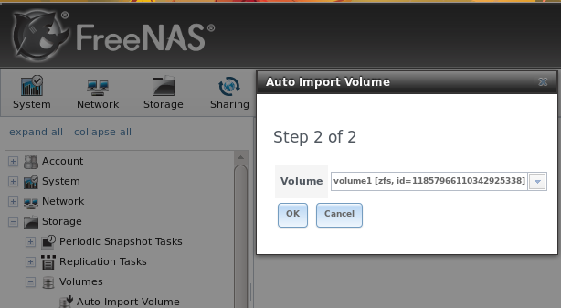

.. |1000000000000374000002AEF63058C7_jpg| image:: images/1000000000000374000002AEF63058C7.jpg
    :width: 6.9252in
    :height: 5.3736in

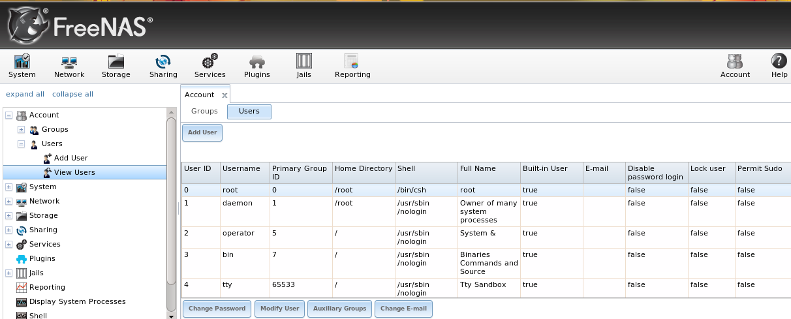

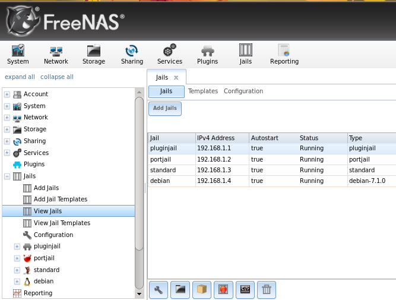

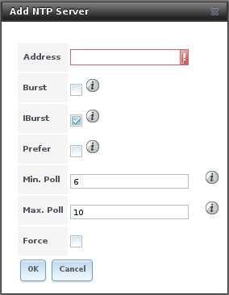

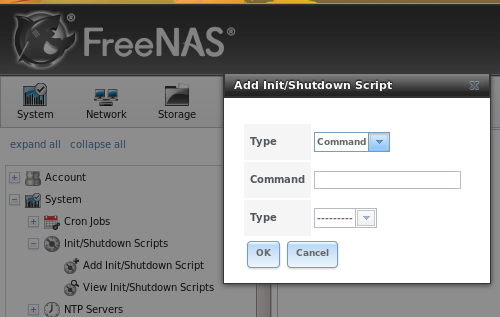

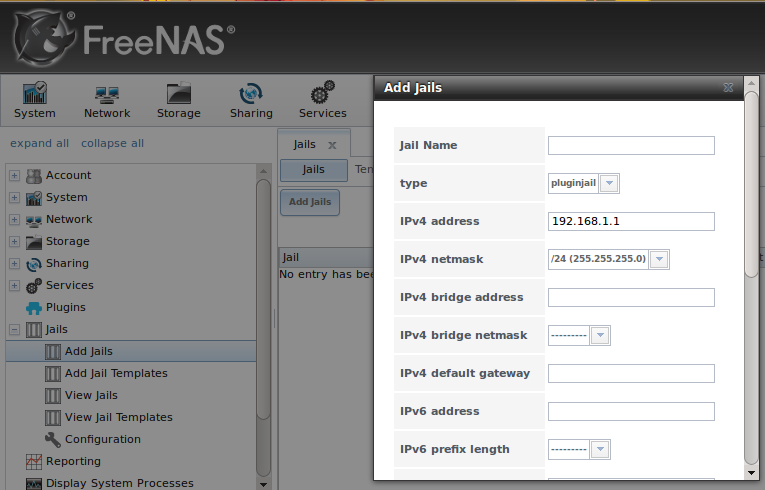

.. |10000000000001720000018E06DDC591_png| image:: images/10000000000001720000018E06DDC591.png
    :width: 3.8535in
    :height: 4.1453in

.. |10000000000002C20000017F0B9104CB_png| image:: images/10000000000002C20000017F0B9104CB.png
    :width: 5.9327in
    :height: 3.1917in

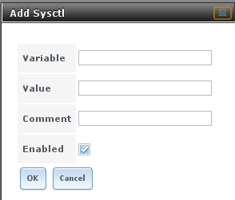

.. |100000000000054E000001EE38B1A8BB_png| image:: images/100000000000054E000001EE38B1A8BB.png
    :width: 6.9252in
    :height: 2.5189in

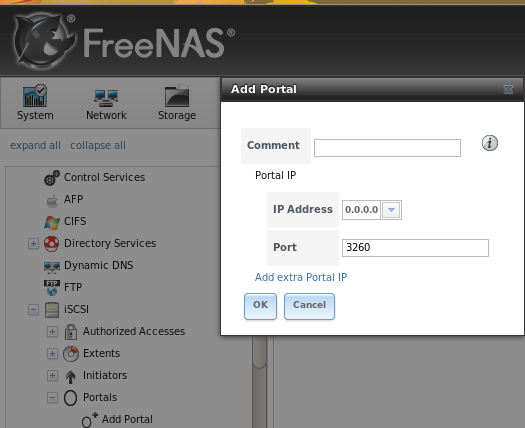

.. |10000201000003950000021FFB8F2015_png| image:: images/10000201000003950000021FFB8F2015.png
    :width: 6.9252in
    :height: 4.1in

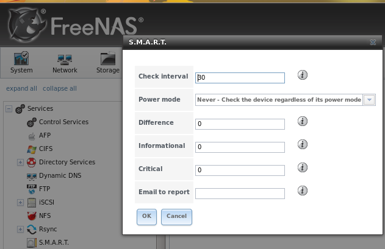

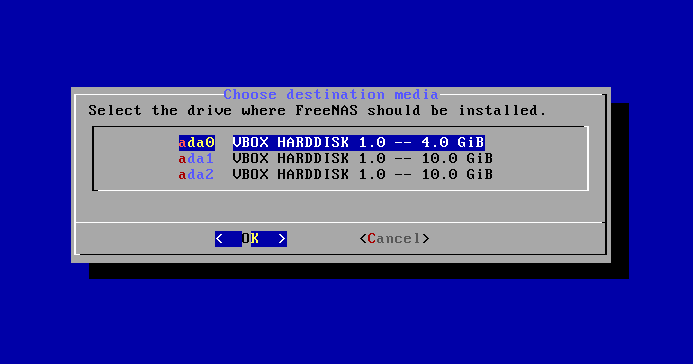

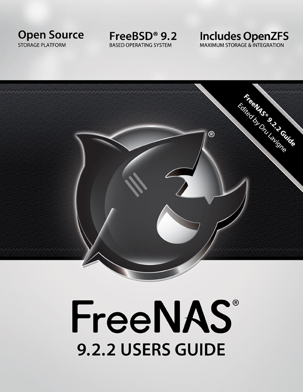

.. |10000000000002A3000001C1F794EDB8_png| image:: images/10000000000002A3000001C1F794EDB8.png
    :width: 6.9252in
    :height: 4.6055in

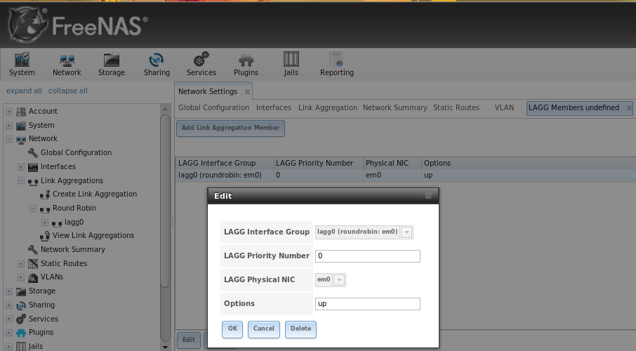

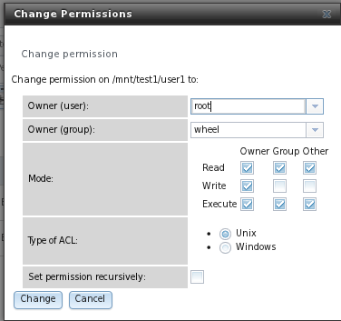

.. |10000000000003900000019AB1074006_png| image:: images/10000000000003900000019AB1074006.png
    :width: 6.9252in
    :height: 3.1126in

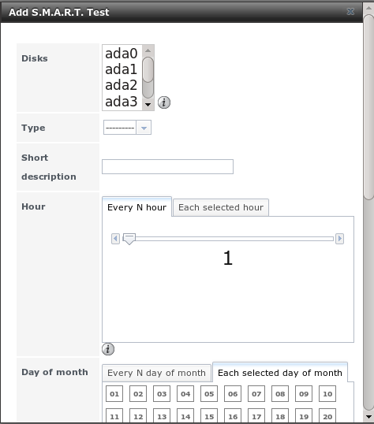

.. |10000000000002B1000001EDAEAA5CF9_png| image:: images/10000000000002B1000001EDAEAA5CF9.png
    :width: 6.9252in
    :height: 4.9547in

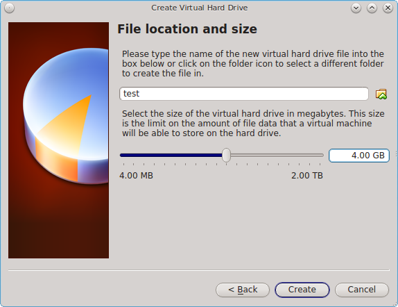

.. |10000000000002FA000001E9AA5ABD0D_png| image:: images/10000000000002FA000001E9AA5ABD0D.png
    :width: 6.6508in
    :height: 3.7728in

.. |10000000000002F5000001C1A3854FFC_png| image:: images/10000000000002F5000001C1A3854FFC.png
    :width: 6.9252in
    :height: 4.1071in

.. |10000000000002C1000001F84303F765_png| image:: images/10000000000002C1000001F84303F765.png
    :width: 6.9252in
    :height: 4.9508in

.. |1000020100000398000000DC97182069_png| image:: images/1000020100000398000000DC97182069.png
    :width: 6.9252in
    :height: 1.6736in

.. |10000000000001DF0000012CAAF5492B_png| image:: images/10000000000001DF0000012CAAF5492B.png
    :width: 5.7701in
    :height: 2.778in

.. |100002010000028A000001B8AD594B93_png| image:: images/100002010000028A000001B8AD594B93.png
    :width: 5.4626in
    :height: 3.6665in

.. |10000000000003AE000001EC7F2141B9_png| image:: images/10000000000003AE000001EC7F2141B9.png
    :width: 6.9252in
    :height: 3.6165in

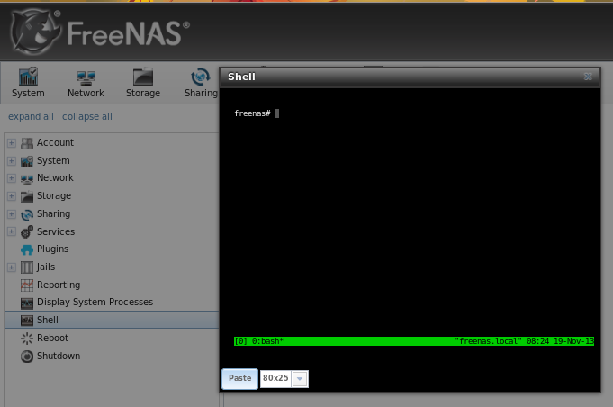

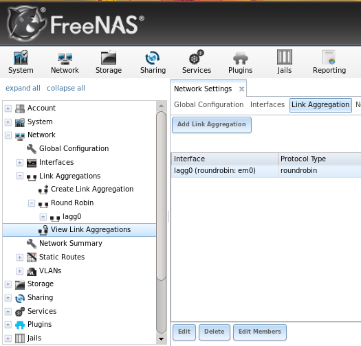

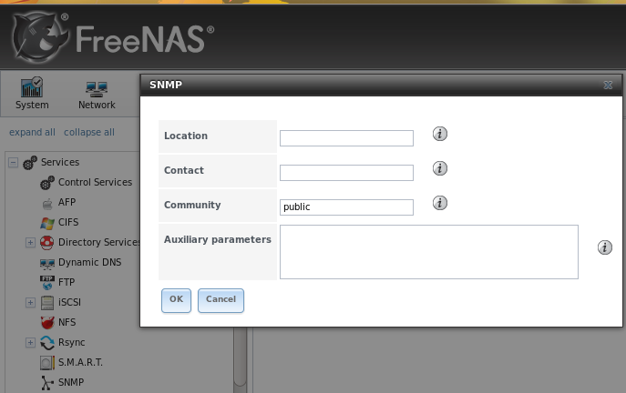

.. |100000000000033C000001F3B917EE92_png| image:: images/100000000000033C000001F3B917EE92.png
    :width: 6.9146in
    :height: 4.1665in

.. |10000000000003A1000001F0749B2C74_png| image:: images/10000000000003A1000001F0749B2C74.png
    :width: 6.9252in
    :height: 3.6972in

.. |100000000000032D000001F960A4A7FB_png| image:: images/100000000000032D000001F960A4A7FB.png
    :width: 6.9252in
    :height: 3.3055in

.. |10000000000001EB0000014DF2519984_png| image:: images/10000000000001EB0000014DF2519984.png
    :width: 5.9154in
    :height: 3.0835in

.. |10000000000004E8000001EACF908077_png| image:: images/10000000000004E8000001EACF908077.png
    :width: 6.9252in
    :height: 2.7016in

.. |10000000000001BD000001C3DC193DAA_png| image:: images/10000000000001BD000001C3DC193DAA.png
    :width: 5.3602in
    :height: 4.1756in

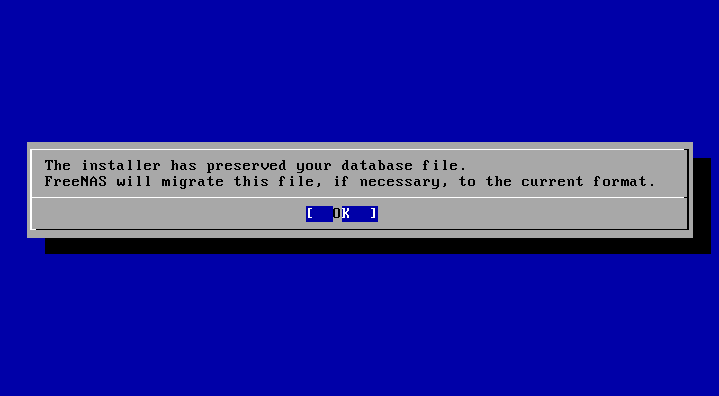

.. |100000000000024B000001232956E90B_png| image:: images/100000000000024B000001232956E90B.png
    :width: 6.9252in
    :height: 3.4327in

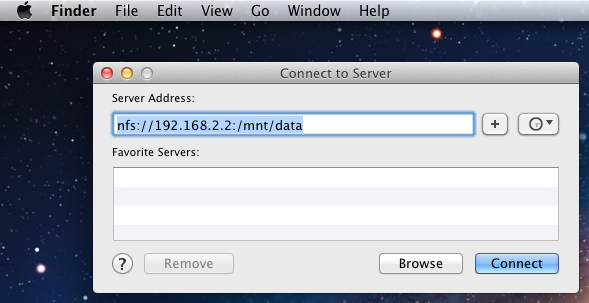

.. |100000000000025600000180A291AF63_png| image:: images/100000000000025600000180A291AF63.png
    :width: 6.2283in
    :height: 3.9992in

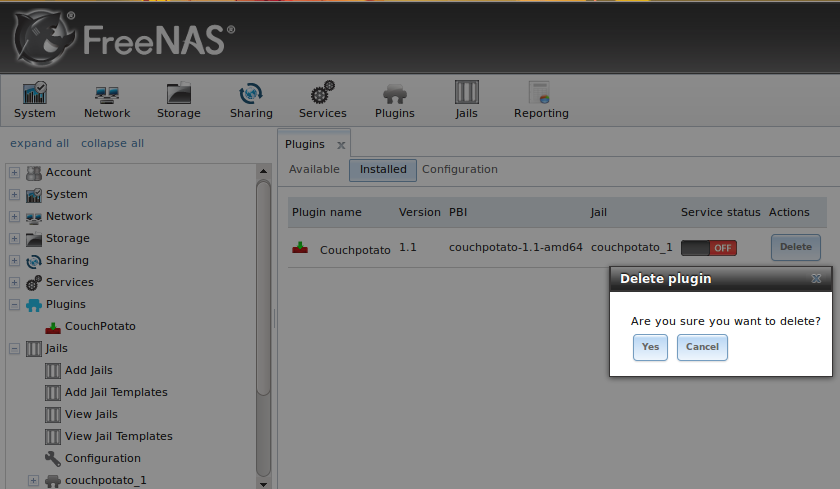

.. |10000000000002D1000001F0BFB72532_png| image:: images/10000000000002D1000001F0BFB72532.png
    :width: 6.7528in
    :height: 4.4299in

.. |100000000000026E000001F5B9108435_png| image:: images/100000000000026E000001F5B9108435.png
    :width: 6.4783in
    :height: 5.2181in

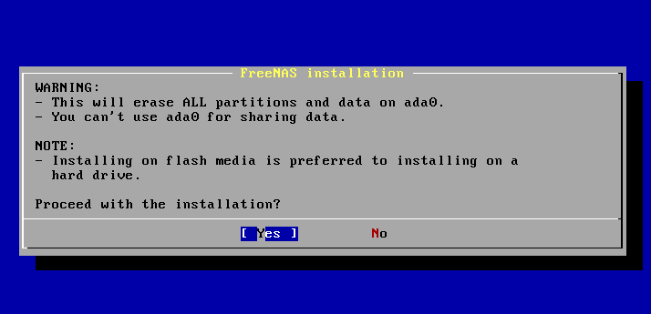

.. |10000000000001860000009EEEECF771_png| image:: images/10000000000001860000009EEEECF771.png
    :width: 4.0618in
    :height: 1.6453in

.. |10000000000002DD000001883EEDE3BA_png| image:: images/10000000000002DD000001883EEDE3BA.png
    :width: 6.9252in
    :height: 3.7028in

.. |10000000000001E6000001C49A1423E2_png| image:: images/10000000000001E6000001C49A1423E2.png
    :width: 5.8547in
    :height: 4.1846in

.. |100000000000038300000122BD3F6150_png| image:: images/100000000000038300000122BD3F6150.png
    :width: 6.9252in
    :height: 2.2335in

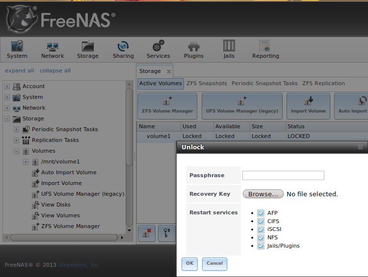

.. |10000000000002A2000001D87E290272_png| image:: images/10000000000002A2000001D87E290272.png
    :width: 6.9252in
    :height: 4.8492in

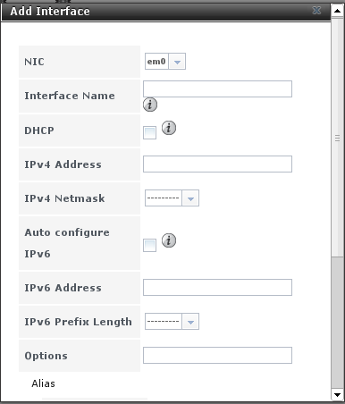

.. |100000000000047B00000232CA1DFA0A_png| image:: images/100000000000047B00000232CA1DFA0A.png
    :width: 6.9252in
    :height: 3.3929in

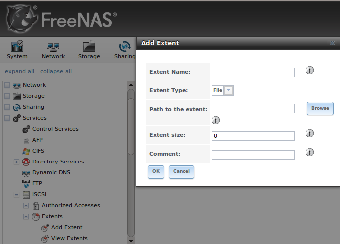

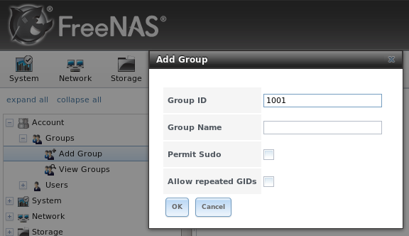

.. |100000000000025A00000201DD9E6537_png| image:: images/100000000000025A00000201DD9E6537.png
    :width: 6.2693in
    :height: 5.3429in

.. |10000000000002A100000215C3C73768_png| image:: images/10000000000002A100000215C3C73768.png
    :width: 6.9252in
    :height: 5.4839in

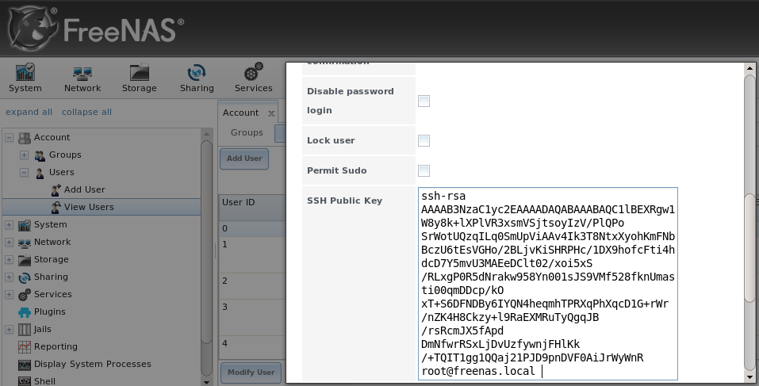

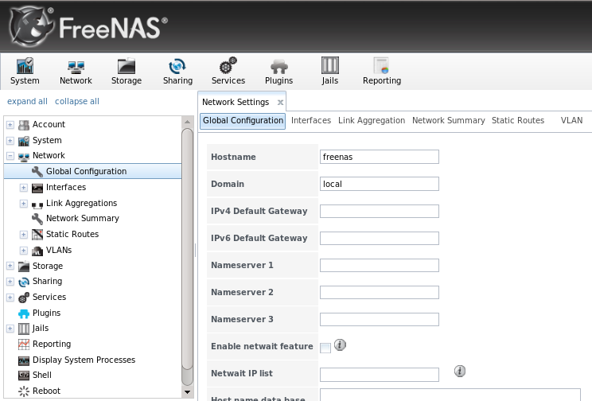

.. |100000000000024B0000015CFFDFDC80_png| image:: images/100000000000024B0000015CFFDFDC80.png
    :width: 6.1138in
    :height: 3.6244in

.. |10000000000003CA000002BC6A5C3D2E_png| image:: images/10000000000003CA000002BC6A5C3D2E.png
    :width: 6.9252in
    :height: 4.9965in

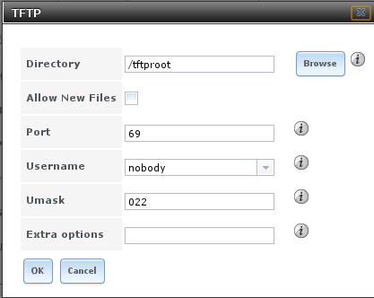

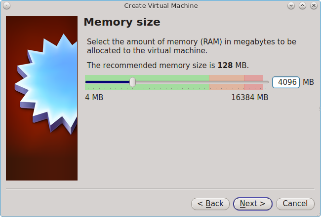

.. |100002010000028C00000200588B16CC_png| image:: images/100002010000028C00000200588B16CC.png
    :width: 6.7925in
    :height: 5.3339in

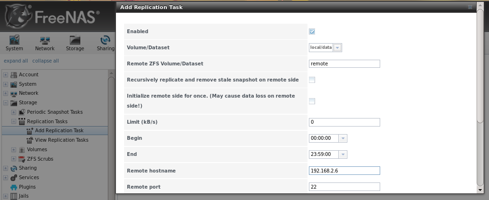

.. |10000000000003D6000001C4C62B96CF_png| image:: images/10000000000003D6000001C4C62B96CF.png
    :width: 6.9252in
    :height: 3.1866in

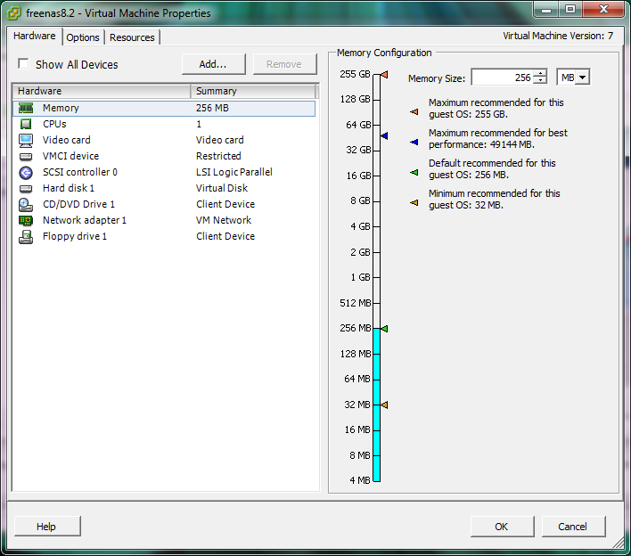

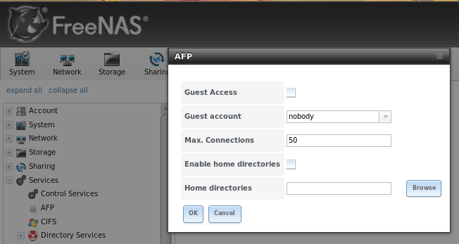

.. |10000000000001B9000001650B2A66FA_png| image:: images/10000000000001B9000001650B2A66FA.png
    :width: 6.2193in
    :height: 4.5102in

.. |10000201000002F500000241B6F0F7D2_png| image:: images/10000201000002F500000241B6F0F7D2.png
    :width: 6.361in
    :height: 4.8083in

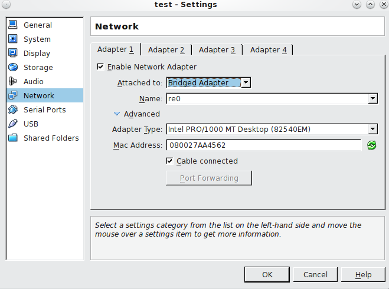

.. |1000000000000267000001E2C69857F7_png| image:: images/1000000000000267000001E2C69857F7.png
    :width: 6.4047in
    :height: 5.0201in

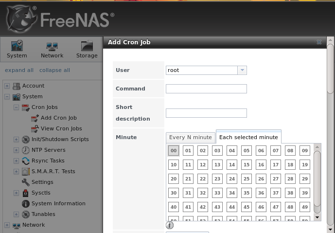

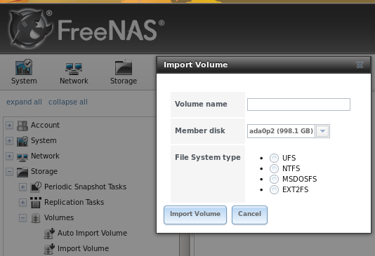

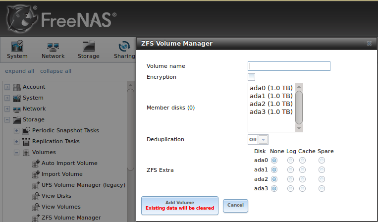

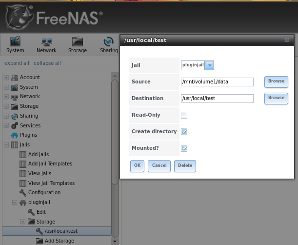

.. |100000000000026B000001AA72839EBC_jpg| image:: images/100000000000026B000001AA72839EBC.jpg
    :width: 6.9252in
    :height: 3.6626in

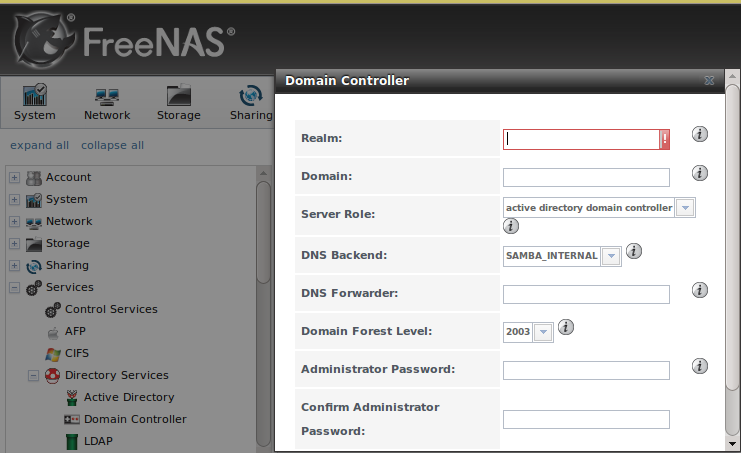

.. |100000000000022A00000107CAD88F71_png| image:: images/100000000000022A00000107CAD88F71.png
    :width: 6.6744in
    :height: 2.4346in

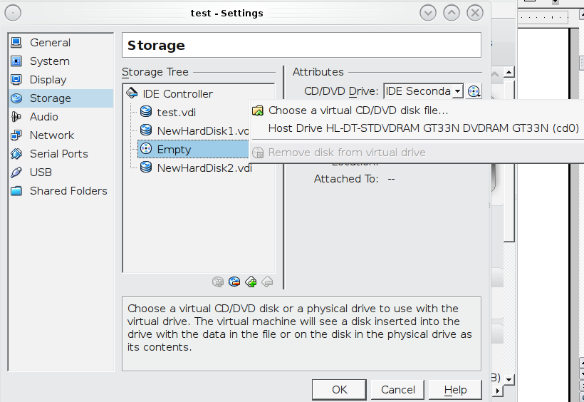

.. |10000000000002C300000141704D5CD2_png| image:: images/10000000000002C300000141704D5CD2.png
    :width: 6.9252in
    :height: 2.4161in

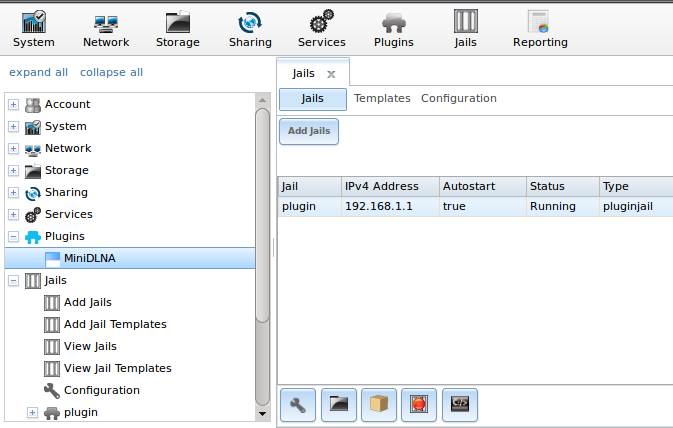

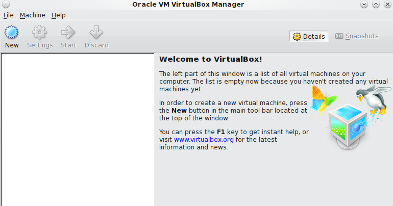

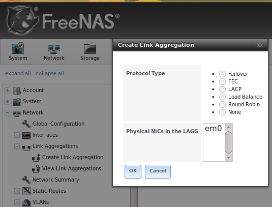

.. |1000000000000272000001EAD978110B_png| image:: images/1000000000000272000001EAD978110B.png
    :width: 6.5193in
    :height: 5.1035in

.. |10000201000003950000021F0BA6E10F_png| image:: images/10000201000003950000021F0BA6E10F.png
    :width: 6.9252in
    :height: 4.1in

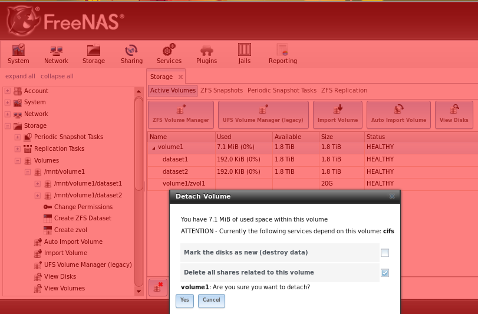

.. |100000000000026B000001F2DE16903D_png| image:: images/100000000000026B000001F2DE16903D.png
    :width: 6.4465in
    :height: 5.1866in

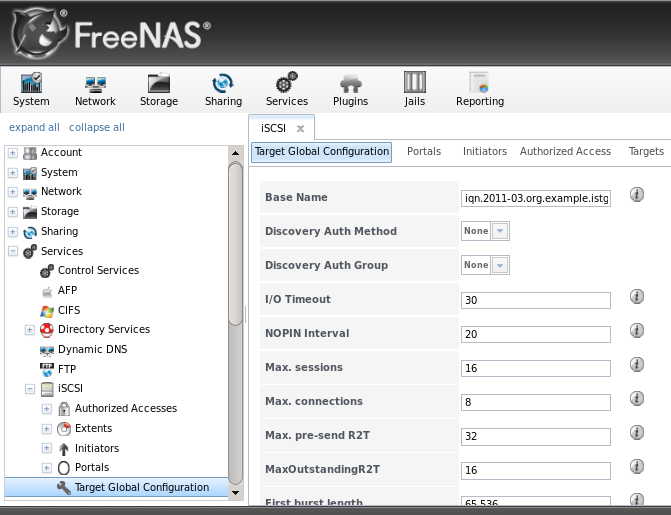

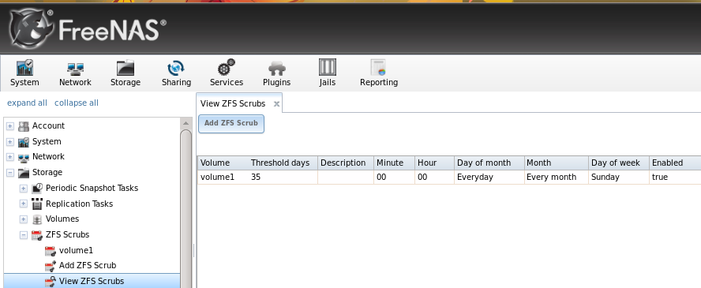

.. |10000000000001C60000015C9803C256_png| image:: images/10000000000001C60000015C9803C256.png
    :width: 6.9272in
    :height: 3.6102in

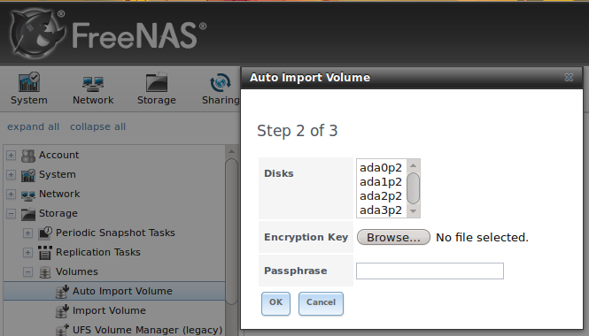

.. |10000000000002A2000001AA8352FB64_png| image:: images/10000000000002A2000001AA8352FB64.png
    :width: 6.9252in
    :height: 4.3772in

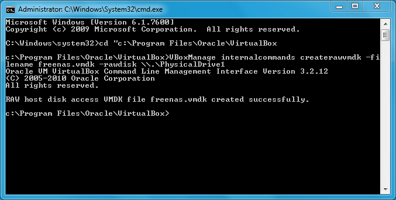

.. |10000201000002FE0000028C18A1102B_png| image:: images/10000201000002FE0000028C18A1102B.png
    :width: 6.9252in
    :height: 5.8945in

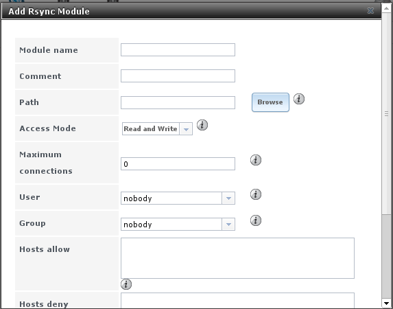

.. |1000000000000127000001015F4550E1_png| image:: images/1000000000000127000001015F4550E1.png
    :width: 3.5535in
    :height: 2.3799in

.. |1000000000000377000001F18C3BCAE8_png| image:: images/1000000000000377000001F18C3BCAE8.png
    :width: 6.9252in
    :height: 3.8799in

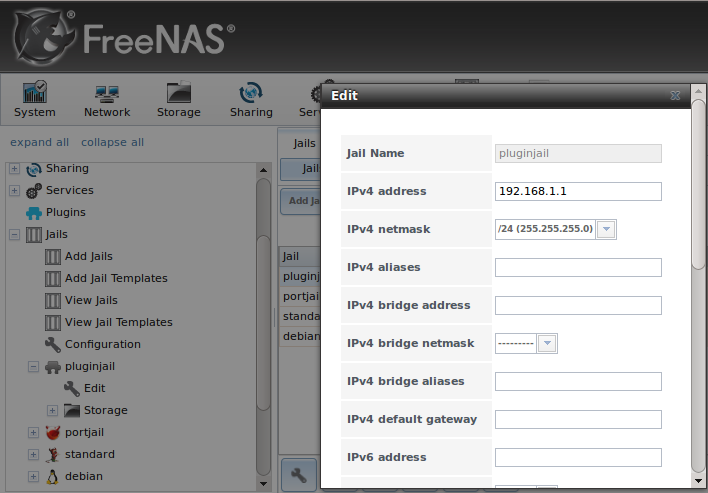

.. |1000000000000150000000D15F029EC2_png| image:: images/1000000000000150000000D15F029EC2.png
    :width: 3.4992in
    :height: 2.1772in


.. |100002010000031D000002804075756D_png| image:: images/100002010000031D000002804075756D.png
    :width: 6.9252in
    :height: 5.5602in


.. |10000000000002E3000001E636F5AB70_png| image:: images/10000000000002E3000001E636F5AB70.png
    :width: 6.9252in
    :height: 4.5543in


.. |100002010000031E0000027D2C5F8621_png| image:: images/100002010000031E0000027D2C5F8621.png
    :width: 6.9252in
    :height: 5.5272in


.. |10000000000001950000012301F7AD89_png| image:: images/10000000000001950000012301F7AD89.png
    :width: 4.8783in
    :height: 2.6937in


.. |100000000000037E000001EB84FBFF52_png| image:: images/100000000000037E000001EB84FBFF52.png
    :width: 6.9252in
    :height: 3.8028in


.. |10000000000001E800000200D184B89D_png| image:: images/10000000000001E800000200D184B89D.png
    :width: 5.8783in
    :height: 4.7402in


.. |10000000000002AF000001F1B648933C_png| image:: images/10000000000002AF000001F1B648933C.png
    :width: 6.9252in
    :height: 3.85in


.. |1000000000000319000002766C465264_jpg| image:: images/1000000000000319000002766C465264.jpg
    :width: 6.9252in
    :height: 5.5016in

.. |10000000000003E0000002624E582DF2_png| image:: images/10000000000003E0000002624E582DF2.png
    :width: 6.9252in
    :height: 3.272in

.. |10000000000001F70000019B91B24E55_png| image:: images/10000000000001F70000019B91B24E55.png
    :width: 6.0598in
    :height: 3.8055in


.. |10000000000002EB00000195BD451959_png| image:: images/10000000000002EB00000195BD451959.png
    :width: 6.9252in
    :height: 3.7543in

.. |10000000000003460000019B3868D5D2_png| image:: images/10000000000003460000019B3868D5D2.png
    :width: 6.9252in
    :height: 3.3957in

.. |1000000000000234000000C82AD0CB4B_png| image:: images/1000000000000234000000C82AD0CB4B.png
    :width: 6.7945in
    :height: 1.8516in


.. |100000000000026F000001988EEC0562_png| image:: images/100000000000026F000001988EEC0562.png
    :width: 6.489in
    :height: 4.2492in

.. |10000201000003950000021F038D89C4_png| image:: images/10000201000003950000021F038D89C4.png
    :width: 6.7957in
    :height: 3.8472in

.. |100000000000027600000153F572D1A1_png| image:: images/100000000000027600000153F572D1A1.png
    :width: 6.561in
    :height: 3.5307in


.. |10000000000002BF000000E0D845E216_png| image:: images/10000000000002BF000000E0D845E216.png
    :width: 6.911in
    :height: 1.9783in


.. |10000000000002FC000001F4677F2595_png| image:: images/10000000000002FC000001F4677F2595.png
    :width: 6.9252in
    :height: 3.4835in

.. |10000000000002DE000001EF50F27494_png| image:: images/10000000000002DE000001EF50F27494.png
    :width: 6.9252in
    :height: 4.6701in


.. |10000000000002B200000238AA2AAEAB_png| image:: images/10000000000002B200000238AA2AAEAB.png
    :width: 6.9252in
    :height: 4.3807in

