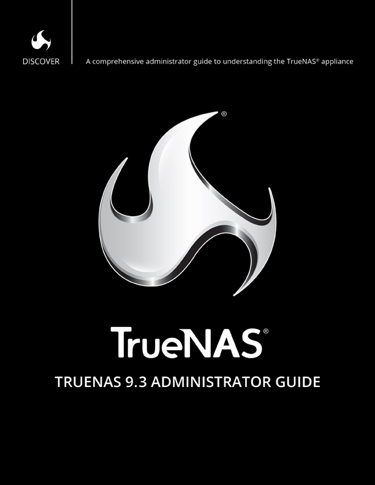

.. toctree::
   :numbered:
   :maxdepth: 4

   Introduction <truenas_introduction>
   ZFS Primer <truenas_zfsprimer>
   Initial Setup <truenas_quick>
   Account <truenas_account>
   System <truenas_system>
   Tasks <truenas_tasks>
   Network <truenas_network>
   Storage <truenas_storage>
   Directory Service <truenas_directoryservice>
   Sharing <truenas_sharing>
   Services <truenas_services>
   Reporting <truenas_reporting>
   Wizard <truenas_wizard>
   Additional Options <truenas_options>
   Using the FreeNAS® API <truenas_api>

.. only:: html

   Index
   =====

   * :ref:`genindex`