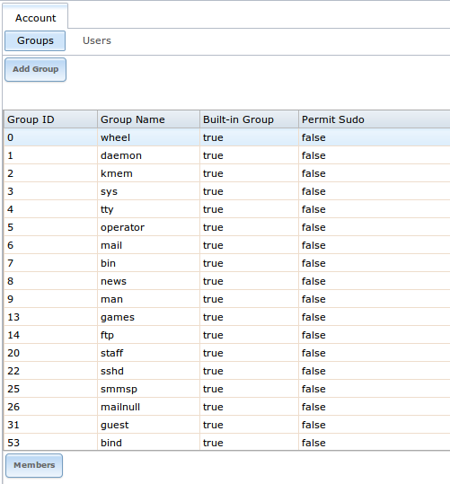
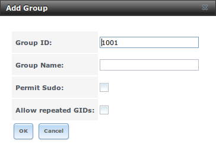
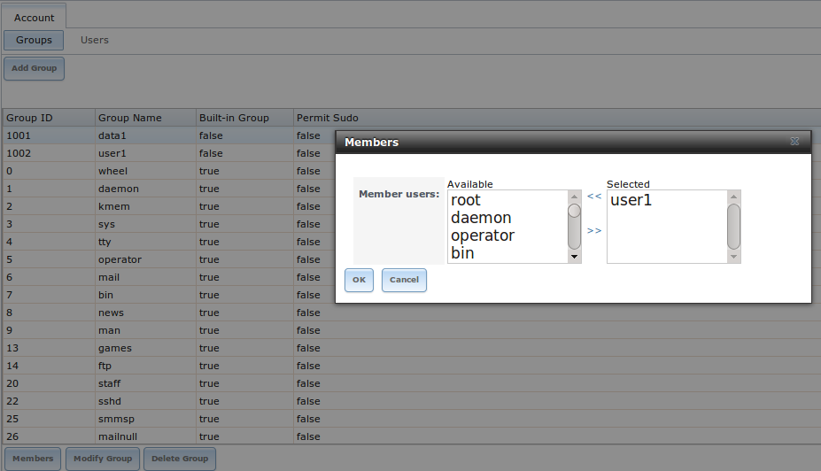
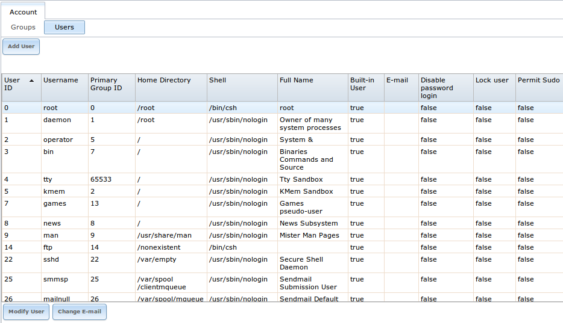
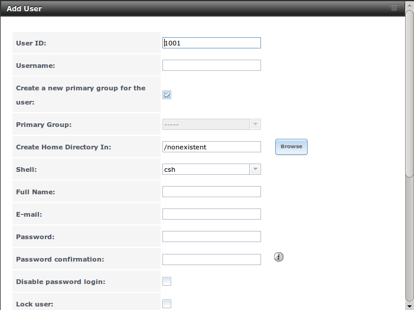

.. _Account:

Account
=======

The Account Configuration section of the administrative GUI describes how to manually create and manage users and groups. This section contains the following
entries:

* :ref:`Groups`: used to manage UNIX-style groups on the TrueNAS® system.

* :ref:`Users`: used to manage UNIX-style accounts on the TrueNAS® system.

Each of these entries are described in more detail in this section.

.. index:: Groups
.. _Groups:

Groups
------

The Groups interface allows you to manage UNIX-style groups on the TrueNAS® system.

.. note:: if a directory service is running on your network, you do not need to recreate the network's users or groups. Instead, import the existing
   account information into TrueNAS®. Refer to :ref:`Directory Service` for details.

This section describes how to create a group and assign it user accounts. The next section will describe how to create user accounts.

If you click :menuselection:`Groups --> View Groups`, you will see a screen similar to Figure 4.1a.

**Figure 4.1a: TrueNAS® Groups Management**

|group1.png|

All groups that came with the operating system will be listed. Each group has an entry indicating the group ID, group name, whether or not it is a built-in
group which was installed with TrueNAS®, and whether or not the group's members are allowed to use :command:`sudo`. If you click a group entry, a "Members"
button will appear. Click this button to view and modify that group's membership.

.. index:: Add Group, New Group, Create Group

If you click the "Add Group" button, you will see the screen shown in Figure 4.1b. Table 4.1a summarizes the available options when creating a group.

**Figure 4.1b: Creating a New Group**

|group2.png|

**Table 4.1a: Options When Creating a Group**

+---------------------+-----------+--------------------------------------------------------------------------------------------------------------------------+
| **Setting**         | **Value** | **Description**                                                                                                          |
|                     |           |                                                                                                                          |
|                     |           |                                                                                                                          |
+=====================+===========+==========================================================================================================================+
| Group ID            | string    | the next available group ID will be suggested for you; by convention, UNIX groups containing user accounts have an ID    |
|                     |           | greater than 1000 and groups required by a service have an ID equal to the default port number used by the service (e.g. |
|                     |           | the sshd group has an ID of 22)                                                                                          |
|                     |           |                                                                                                                          |
+---------------------+-----------+--------------------------------------------------------------------------------------------------------------------------+
| Group Name          | string    | mandatory                                                                                                                |
|                     |           |                                                                                                                          |
+---------------------+-----------+--------------------------------------------------------------------------------------------------------------------------+
| Permit Sudo         | checkbox  | if checked, members of the group have permission to use `sudo <http://www.sudo.ws/>`_                                    |
|                     |           |                                                                                                                          |
+---------------------+-----------+--------------------------------------------------------------------------------------------------------------------------+
| Allow repeated GIDs | checkbox  | allows multiple groups to share the same group id (GID); this is useful when a GID is already associated with the UNIX   |
|                     |           | permissions for existing data                                                                                            |
|                     |           |                                                                                                                          |
+---------------------+-----------+--------------------------------------------------------------------------------------------------------------------------+

Once the group and users are created, you can assign users as members of a group. Highlight the group you wish to assign users to, then click the "Members"
button. Highlight the user in the "Member users" list (which shows all user accounts on the system) and click the ">>" to move that user to the right
frame. The user accounts which appear in the right frame will be added as members of that group.

In the example shown in Figure 4.1c, the *data1* group has been created and the
*user1* user account has been created with a primary group of
*user1*. The "Members" button for the
*data1* group has been selected and
*user1* has been added as a member of that group.

**Figure 4.1c: Assigning a User as a Member of a Group**

|group3.png|

.. index:: Delete Group, Remove Group

To delete a group, click its "Delete Group" button. The pop-up message will ask whether or not you would also like to delete all members of that group. Note
that the built-in groups do not provide a "Delete Group" button.

.. index:: Users
.. _Users:

Users
-----

TrueNAS® supports users, groups, and permissions, allowing great flexibility in configuring which users have access to the data stored on TrueNAS®. In order
to assign permissions to shares, you will need to do **one of the following**:

#.  Create a guest account that all users will use or create a user account for every user in the network where the name of each account is the same as a
    logon name used on a computer. For example, if a Windows system has a login name of *bobsmith*, you should create a user account with the name
    *bobsmith* on TrueNAS®. If your intent is to assign groups of users different permissions to shares, you will need to also create groups and assign users
    to the groups.

#.  If your network uses a directory service, import the existing account information using the instructions in :ref:`Directory Service`.

:menuselection:`Account --> Users --> View Users` provides a listing of all of the system accounts that were installed with the TrueNAS® operating system, as
shown in Figure 4.2a.

**Figure 4.2a: Managing User Accounts**

|user1.png|

Each account entry indicates the user ID, username, primary group ID, home directory, default shell, full name, whether or not it is a built-in user that came
with the TrueNAS® installation, the email address, whether or not logins are disabled, whether or not the user account is locked, and whether or not the user
is allowed to use :command:`sudo`. To reorder the list, click the desired column name. An arrow indicates which column the view is sorted by; click the arrow
to reverse the sort order.

If you click a user account, the following buttons will appear for that account:

* **Modify User:** used to modify the account's settings, as listed in Table 4.2b.

* **Change E-mail:** used to change the email address associated with the account.

.. note:: it is important to set the email address for the built-in *root* user account as important system messages are sent to the
   *root* user. For security reasons, password logins are disabled for the
   *root* account and changing this setting is highly discouraged.

Every account that came with the TrueNAS® operating system, except for the *root* user, is a system account. Each system account is used by a service and
should not be available for use as a login account. For this reason, the default shell is
`nologin(8) <http://www.freebsd.org/cgi/man.cgi?query=nologin>`_. For security reasons, and to prevent breakage of system services, you should not modify the
system accounts.

.. index:: Add User, Create User, New User

To create a user account, click the "Add User" button to open the screen shown in Figure 4.2b. Some settings are only available in "Advanced Mode". To see
these settings, either click the "Advanced Mode" button or configure the system to always display these settings by checking the box "Show advanced fields by
default" in :menuselection:`System --> Advanced`. Table 4.2a summarizes the options which are available when you create or modify a user account.

**Figure 4.2b: Adding or Editing a User Account**

|user2.png|

**Table 4.2a: User Account Configuration**

+----------------------------+-----------------+-------------------------------------------------------------------------------------------------------------------------------------------------------+
| **Setting**                | **Value**       | **Description**                                                                                                                                       |
|                            |                 |                                                                                                                                                       |
|                            |                 |                                                                                                                                                       |
+============================+=================+=======================================================================================================================================================+
| User ID                    | integer         | greyed out if user already created; when creating an account, the next numeric ID will be suggested; by                                               |
|                            |                 | convention, user accounts have an ID greater than 1000 and system accounts have an ID equal to the default                                            |
|                            |                 | port number used by the service                                                                                                                       |
|                            |                 |                                                                                                                                                       |
+----------------------------+-----------------+-------------------------------------------------------------------------------------------------------------------------------------------------------+
| Username                   | string          | greyed out if user already created; maximum 16 characters though a maximum of 8 is recommended for interoperability; can not begin with a hyphen, if  |
|                            |                 | a *$* is used it can only be the last character, and it can not contain a space, tab, or the characters                                               |
|                            |                 | *, : + & # % ^ \ & ( ) ! @ ~ * ? < > = "*                                                                                                             |
|                            |                 |                                                                                                                                                       |
+----------------------------+-----------------+-------------------------------------------------------------------------------------------------------------------------------------------------------+
| Create a new primary group | checkbox        | by default, a primary group with the same name as the user will be created; uncheck this box to select a                                              |
|                            |                 | different primary group name; in Unix,                                                                                                                |
|                            |                 | `a primary group is not the same as a secondary/auxiliary group <http://linuxers.org/article/difference-between-primary-and-secondary-groups-linux>`_ |
|                            |                 |                                                                                                                                                       |
+----------------------------+-----------------+-------------------------------------------------------------------------------------------------------------------------------------------------------+
| Primary Group              | drop-down menu  | must uncheck "Create a new primary group" in order to access this menu; for security reasons, FreeBSD will                                            |
|                            |                 | not give a user :command:`su` permissions if *wheel* is their primary group; to give a user :command:`su` access, add them to the                     |
|                            |                 | *wheel* group in "Auxiliary groups"                                                                                                                   |
|                            |                 |                                                                                                                                                       |
+----------------------------+-----------------+-------------------------------------------------------------------------------------------------------------------------------------------------------+
| Create Home Directory In   | browse button   | browse to the name of an **existing** volume or dataset that the user will be assigned permission to access                                           |
|                            |                 |                                                                                                                                                       |
+----------------------------+-----------------+-------------------------------------------------------------------------------------------------------------------------------------------------------+
| Home Directory Mode        | checkboxes      | only available in "Advanced Mode" and will be read-only for built-in users; sets default Unix permissions of user's                                   |
|                            |                 | home directory                                                                                                                                        |
|                            |                 |                                                                                                                                                       |
+----------------------------+-----------------+-------------------------------------------------------------------------------------------------------------------------------------------------------+
| Shell                      | drop-down menu  | select shell to use for local and SSH logins; see table 4.2b for an overview of available shells                                                      |
|                            |                 |                                                                                                                                                       |
+----------------------------+-----------------+-------------------------------------------------------------------------------------------------------------------------------------------------------+
| Full Name                  | string          | mandatory, may contain spaces                                                                                                                         |
|                            |                 |                                                                                                                                                       |
+----------------------------+-----------------+-------------------------------------------------------------------------------------------------------------------------------------------------------+
| E-mail                     | string          | email address associated with the account                                                                                                             |
|                            |                 |                                                                                                                                                       |
+----------------------------+-----------------+-------------------------------------------------------------------------------------------------------------------------------------------------------+
| Password                   | string          | mandatory unless check box "Disable password login"; cannot contain a *?*                                                                             |
|                            |                 |                                                                                                                                                       |
+----------------------------+-----------------+-------------------------------------------------------------------------------------------------------------------------------------------------------+
| Password confirmation      | string          | must match the value of "Password"                                                                                                                    |
|                            |                 |                                                                                                                                                       |
+----------------------------+-----------------+-------------------------------------------------------------------------------------------------------------------------------------------------------+
| Disable password login     | checkbox        | when checked, the user can not log into the system or authenticate to a CIFS share; to undo this                                                      |
|                            |                 | setting, set a password for the user using the "Change Password" button for the user in "View Users";                                                 |
|                            |                 | checking this box will grey out "Lock user" and "Permit Sudo" which are mutually exclusive                                                            |
|                            |                 |                                                                                                                                                       |
+----------------------------+-----------------+-------------------------------------------------------------------------------------------------------------------------------------------------------+
| Lock user                  | checkbox        | a checked box prevents user from logging in until the account is unlocked (box is unchecked); checking this                                           |
|                            |                 | box will grey out "Disable password login" which is mutually exclusive                                                                                |
|                            |                 |                                                                                                                                                       |
+----------------------------+-----------------+-------------------------------------------------------------------------------------------------------------------------------------------------------+
| Permit Sudo                | checkbox        | if checked, members of the group have permission to use `sudo <http://www.sudo.ws/>`_                                                                 |
|                            |                 |                                                                                                                                                       |
+----------------------------+-----------------+-------------------------------------------------------------------------------------------------------------------------------------------------------+
| Microsoft Account          | checkbox        | check this box if the user will be connecting from a Windows 8, 8.1, 10, or higher system                                                             |
|                            |                 |                                                                                                                                                       |
+----------------------------+-----------------+-------------------------------------------------------------------------------------------------------------------------------------------------------+
| SSH Public Key             | string          | paste the user's **public** key to be used for SSH key authentication                                                                                 |   
|                            |                 | (**do not paste the private key!**)                                                                                                                   |
|                            |                 |                                                                                                                                                       |
+----------------------------+-----------------+-------------------------------------------------------------------------------------------------------------------------------------------------------+
| Auxiliary groups           | mouse selection | highlight the group(s) you wish to add the user to and use the >> button to add the user to the highlighted                                           |
|                            |                 | groups                                                                                                                                                |
|                            |                 |                                                                                                                                                       |
+----------------------------+-----------------+-------------------------------------------------------------------------------------------------------------------------------------------------------+

**Table 4.2b: Available Shells**

+--------------+----------------------------------------------------------------------------------------------------------------------+
| **Shell**    | **Description**                                                                                                      |
|              |                                                                                                                      |
+==============+======================================================================================================================+
| netcli.sh    | user can access the Console Setup menu shown in Figure 3a, even if it is disabled in                                 |
|              | :menuselection:`System --> Advanced --> Enable Console Menu`                                                         |
|              |                                                                                                                      |
+--------------+----------------------------------------------------------------------------------------------------------------------+
| csh          | `C shell <http://en.wikipedia.org/wiki/C_shell>`_                                                                    |
|              |                                                                                                                      |
+--------------+----------------------------------------------------------------------------------------------------------------------+
| sh           | `Bourne shell <http://en.wikipedia.org/wiki/Bourne_shell>`_                                                          |
|              |                                                                                                                      |
+--------------+----------------------------------------------------------------------------------------------------------------------+
| tcsh         | `Enhanced C shell <http://en.wikipedia.org/wiki/Tcsh>`_                                                              |
|              |                                                                                                                      |
+--------------+----------------------------------------------------------------------------------------------------------------------+
| nologin      | use when creating a system account or to create a user account that can authenticate with shares but which cannot    |
|              | login to the FreeNAS system using :command:`ssh`                                                                     |
|              |                                                                                                                      |
+--------------+----------------------------------------------------------------------------------------------------------------------+
| bash         | `Bourne Again shell <http://en.wikipedia.org/wiki/Bash_%28Unix_shell%29>`_                                           |
|              |                                                                                                                      |
+--------------+----------------------------------------------------------------------------------------------------------------------+
| ksh93        | `Korn shell <http://www.kornshell.com/>`_                                                                            |
|              |                                                                                                                      |
+--------------+----------------------------------------------------------------------------------------------------------------------+
| mksh         | `mirBSD Korn shell <https://www.mirbsd.org/mksh.htm>`_                                                               |
|              |                                                                                                                      |
+--------------+----------------------------------------------------------------------------------------------------------------------+
| rbash        | `Restricted bash <http://www.gnu.org/software/bash/manual/html_node/The-Restricted-Shell.html>`_                     |
|              |                                                                                                                      |
+--------------+----------------------------------------------------------------------------------------------------------------------+
| rzsh         | `Restricted zsh <http://www.csse.uwa.edu.au/programming/linux/zsh-doc/zsh_14.html>`_                                 |
|              |                                                                                                                      |
+--------------+----------------------------------------------------------------------------------------------------------------------+
| scponly      | select `scponly <https://github.com/scponly/scponly/wiki>`_ to restrict the user's SSH usage to only the             |
|              | :command:`scp` and :command:`sftp` commands                                                                          |
|              |                                                                                                                      |
+--------------+----------------------------------------------------------------------------------------------------------------------+
| zsh          | `Z shell <http://www.zsh.org/>`_                                                                                     |
|              |                                                                                                                      |
+--------------+----------------------------------------------------------------------------------------------------------------------+
| git-shell    | `restricted git shell <http://git-scm.com/docs/git-shell>`_                                                          |
|              |                                                                                                                      |
+--------------+----------------------------------------------------------------------------------------------------------------------+
