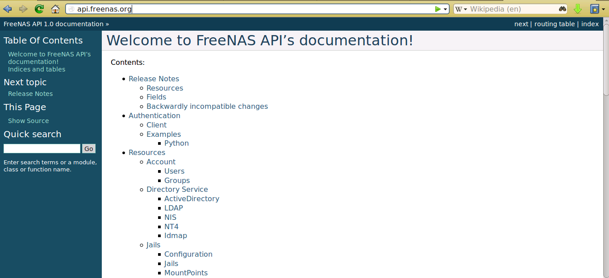

.. index:: API
.. _Using the FreeNAS® API:

Using the FreeNAS® API
=======================

FreeNAS® provides a `REST <https://en.wikipedia.org/wiki/Representational_state_transfer>`_ API which can be used as an alternate mechanism for remotely
controlling a TrueNAS® system.

REST provides an easy-to-read, HTTP implementation of functions, known as resources, which are available beneath a specified base URL. Each resource is
manipulated using the HTTP methods defined in :rfc:`2616`, such as GET, PUT, POST, or DELETE.

As seen in :numref:`Figure %s: FreeNAS® API Documentation <api1>`, an online version of the API is available at `api.freenas.org <http://api.freenas.org>`_.

.. _api1:

The rest of this section walks through some code examples to get you started using the APIs.

.. _A Simple API Example:

A Simple API Example
--------------------

.. highlight:: python
   :linenothreshold: 4

The `api directory of the FreeNAS® github repository <https://github.com/freenas/freenas/tree/master/examples/api>`_ contains some API usage examples. This
section provides a walk-through of the :file:`newuser.py` script, shown below, as it provides a simple example that creates a user.

In order to create a customized script based on this example, you will need a TrueNAS® system running at least version 9.2.0. If you would like to test the
scripts directly on the TrueNAS® system, create a user account. When creating this user account, select an existing volume or dataset for the user's "Home
Directory". Once the user is created, start the SSH service using :menuselection:`Services --> Control Services`. That user will now be able to :command:`ssh`
to the IP address of the TrueNAS® system in order to create and run scripts. Alternately, you can test your scripts on any system that has the software
mentioned in the previous section installed.

To customize this script, copy the contents of this example into a filename that ends in :file:`.py`. The text that is highlighted in red below should be
modified in your copy in order to match the needs of the user being created. The text in black should remain as-is. After saving your changes, run the script
by typing :command:`python scriptname.py`. If all goes well, the new user account will appear in :menuselection:`Account --> Users --> View Users` in the
TrueNAS® GUI.

Here is the example script with an explanation of the line numbers below it.
::

 import json
 import requests
 r = requests.post(
   'https://freenas.mydomain/api/v1.0/account/users/',
   auth=('root', 'freenas'),
   headers={'Content-Type': 'application/json'},
   verify=False,
   data=json.dumps({
 	'bsdusr_uid': '1100',
  	'bsdusr_username': 'myuser',
  	'bsdusr_mode': '755',
  	'bsdusr_creategroup': 'True',
  	'bsdusr_password': '12345',
  	'bsdusr_shell': '/usr/local/bin/bash',
  	'bsdusr_full_name': 'Full Name',
  	'bsdusr_email': 'name@provider.com',
    })
  )
  print r.text

Where:

**Lines 1-2:** import the Python modules used to make HTTP requests and handle data in JSON format.

**Line 4:** replace 
*freenas.mydomain* with the "Hostname" value in :menuselection:`System --> System Information`. Note that your script will fail if the machine running the
script is not able to resolve that hostname. If you are not using HTTPS to access the FreeNAS® system, change *https*
to *http*.

**Line 5:** replace *freenas* with the password that you use to access the TrueNAS® system.

**Line 7:** if you are using HTTPS and want to force validation of the SSL certificate, change
*False* to
*True*.

**Lines 8-16:** sets the values for the user being created. The `"Users" resource <http://api.freenas.org/resources/account.html#users>`_ describes this
resource in more detail. The allowed parameters are listed in the "Json Parameters" section of that resource. Since this resource creates a FreeBSD user, the
values that you input must be valid for a FreeBSD user account. Table 17.1a summarizes the valid values. Since this resource is using JSON, the possible
boolean values are *True*
or *False*.

**Table 17.1a: Valid JSON Parameters for Users Create Resource**

+--------------------------+----------+----------------------------------------------------------------------------------------------------------------------+
| **JSON Parameter**       | **Type** | **Description**                                                                                                      |
|                          |          |                                                                                                                      |
|                          |          |                                                                                                                      |
+==========================+==========+======================================================================================================================+
| bsdusr_username          | string   | maximum 32 characters, though a maximum of 8 is recommended for interoperability; can include numerals but can not   |
|                          |          | include a space                                                                                                      |
|                          |          |                                                                                                                      |
+--------------------------+----------+----------------------------------------------------------------------------------------------------------------------+
| bsdusr_full_name         | string   | may contain spaces and uppercase characters                                                                          |
|                          |          |                                                                                                                      |
+--------------------------+----------+----------------------------------------------------------------------------------------------------------------------+
| bsdusr_password          | string   | can include a mix of upper and lowercase letters, characters, and numbers                                            |
|                          |          |                                                                                                                      |
+--------------------------+----------+----------------------------------------------------------------------------------------------------------------------+
| bsdusr_uid               | integer  | by convention, user accounts have an ID greater than 1000 with a maximum allowable value of 65,535                   |
|                          |          |                                                                                                                      |
+--------------------------+----------+----------------------------------------------------------------------------------------------------------------------+
| bsdusr_group             | integer  | if "bsdusr_creategroup" is set to *False*, specify the numeric ID of the group to create                             |
|                          |          |                                                                                                                      |
+--------------------------+----------+----------------------------------------------------------------------------------------------------------------------+
| bsdusr_creategroup       | boolean  | if set to *True*, a primary group with the same numeric ID as "bsdusr_uid" will be automatically created             |
|                          |          |                                                                                                                      |
+--------------------------+----------+----------------------------------------------------------------------------------------------------------------------+
| bsdusr_mode              | string   | sets default numeric UNIX permissions of user's home directory                                                       |
|                          |          |                                                                                                                      |
+--------------------------+----------+----------------------------------------------------------------------------------------------------------------------+
| bsdusr_shell             | string   | specify full path to a UNIX shell that is installed on the system                                                    |
|                          |          |                                                                                                                      |
+--------------------------+----------+----------------------------------------------------------------------------------------------------------------------+
| bsdusr_password_disabled | boolean  | if set to *True*, user is not allowed to login                                                                       |
|                          |          |                                                                                                                      |
+--------------------------+----------+----------------------------------------------------------------------------------------------------------------------+
| bsdusr_locked            | boolean  | if set to *True*, user is not allowed to login                                                                       |
|                          |          |                                                                                                                      |
+--------------------------+----------+----------------------------------------------------------------------------------------------------------------------+
| bsdusr_sudo              | boolean  | if set to *True*, :command:`sudo` is enabled for the user                                                            |
|                          |          |                                                                                                                      |
+--------------------------+----------+----------------------------------------------------------------------------------------------------------------------+
| bsdusr_sshpubkey         | string   | contents of SSH authorized keys file                                                                                 |
|                          |          |                                                                                                                      |
+--------------------------+----------+----------------------------------------------------------------------------------------------------------------------+

.. note:: when using boolean values, JSON returns raw lowercase values whereas Python uses uppercase values. This means that you should use
   *True* or
   *False* in your Python scripts even though the example JSON responses in the API documentation are displayed as
   *true* or
   *false*.

.. _A More Complex Example:

A More Complex Example
----------------------

This section provides a walk-through of a more complex example found in the :file:`startup.py` script. Use the searchbar within the API documentation to
quickly locate the JSON parameters used in this example. This example defines a class and several methods which are used to create a ZFS volume, create a ZFS
dataset, share this dataset over CIFS, and enable the CIFS service. The responses from some methods are used as parameters in other methods. In addition to
the import lines seen in the previous example, this example imports two additional Python modules to provide parsing functions for command line arguments::

 import argparse
 import sys

It then creates a *Startup* class which is started with the hostname, username, and password provided by the user via the command line::

 class Startup(object):
   def __init__(self, hostname, user, secret):
	self._hostname = hostname
	self._user = user
	self._secret = secret
	self._ep = 'http://%s/api/v1.0' % hostname
  def request(self, resource, method='GET', data=None):
	if data is None:
	    data =
	r = requests.request(
	    method,
	    '%s/%s/' % (self._ep, resource),
	    data=json.dumps(data),
	    headers={'Content-Type': "application/json"},
	    auth=(self._user, self._secret),
 )
 if r.ok:
	try:
	    return r.json()
	except:
	    return r.text
 raise ValueError(r)

A *get_disks* method is defined to get all the disks in the system as a
*disk_name* response. The
*create_pool* method will then use this information to create a ZFS pool named
*tank* which will be created as a stripe. The
*volume_name* and
*layout* JSON parameters are described in the "Storage Volume" resource of the API documentation.
::

 def _get_disks(self):
	disks = self.request('storage/disk')
	return [disk['disk_name'] for disk in disks]

 def create_pool(self):
	disks = self._get_disks()
	self.request('storage/volume', method='POST', data={
	    'volume_name': 'tank',
	    'layout': [
		{'vdevtype': 'stripe', 'disks': disks},
	    ],
 })

The *create_dataset* method is defined which creates a dataset named :file:`MyShare`:
::

 def create_dataset(self):
	self.request('storage/volume/tank/datasets', method='POST', data={
	    'name': 'MyShare',
	})

The *create_cifs_share* method is used to share :file:`/mnt/tank/MyShare` with guest-only access enabled. The
*cifs_name*,
*cifs_path*,
*cifs_guestonly* JSON parameters, as well as the other allowable parameters, are described in the "Sharing CIFS" resource of the API documentation.
::

 def create_cifs_share(self):
	self.request('sharing/cifs', method='POST', data={
	    'cifs_name': 'My Test Share',
	    'cifs_path': '/mnt/tank/MyShare',
	    'cifs_guestonly': True
 })

Finally, the *service_start* method issues a command to enable the CIFS service. The
*srv_enable* JSON parameter is described in the Services Services resource.
::

 def service_start(self, name):
	self.request('services/services/%s' % name, method='PUT', data={
	    'srv_enable': True,

 })
 
.. index:: EULA
.. _Appendix A:

Appendix A
==========

TrueNAS® EULA:

BY PURCHASING, DOWNLOADING, INSTALLING, OR OTHERWISE USING THE SOFTWARE, YOU AGREE TO BE BOUND BY THE TERMS OF THIS END-USER LICENSE AGREEMENT (EULA). IF YOU DO NOT AGREE TO THE TERMS OF
THIS EULA, YOU MAY NOT INSTALL OR USE THE SOFTWARE.

1. DEFINITIONS

"Company" means iXsystems, Inc.

"Product" means iXsystems Storage Array software (TrueNAS®).

"EULA" means this End User License Agreement

"You" means the natural person or the entity that is agreeing to be bound by this EULA, their employees and third party contractors that provide services to you.

"Open Source Software" means various open source software components licensed under the terms of applicable open source license agreements included in the materials relating to such
software. Open Source Software is composed of individual software components, each of which has its own copyright and its own applicable license conditions.

"FreeNAS®" means a complete open source operating system available at http://www.iXsystems.org

"Site" means iXsystems, Inc. website: http://www.iXsystems.com

2. TERMS AND CONDITIONS

2.1. Company grants You a non-exclusive, non-sublicensable, non-transferable license to use the Product on a single computer, subject to the terms and conditions of this EULA and in
accordance with the instructions, specifications and documentation provided with the Product (collectively, the "Documentation"). This license of Product may not be shared or used
concurrently on different computers.

2.2. Product Warranty Disclaimer. THE PRODUCT IS PROVIDED "AS IS" WITHOUT WARRANTY OF ANY KIND, WHETHER EXPRESS, IMPLIED, STATUTORY, OR OTHERWISE. Company BEARS NO LIABILITY FOR ANY DAMAGES
RESULTING FROM USE (OR ATTEMPTED USE) OF THE PRODUCT.

2.3. You agree that You will NOT without the express written authorization of Company:
(a) copy, sell, sublicense, or otherwise transfer the Product to any third party;
(b) remove any titles, trademarks or trade names, copyright notices, legends, or other proprietary markings on the software in the Product;
(c)  except to the extent expressly permitted by applicable law, and to the extent that the Company is not permitted by that applicable law to exclude or limit the following rights, You will not decompile, disassemble, reverse engineer, or otherwise attempt to derive source code from the Product, in whole or in part.

2.4. FreeNAS® software. The Product contains part of FreeNAS® software, which in turn contains a variety of Open Source Software components. You can redistribute and/or modify the Open
Source Software under the terms and conditions of the corresponding open source licenses. You may obtain a copy of the source code corresponding to the binaries for the Open Source Software
from the FreeNAS® home page at http://www.FreeNAS.org. You agree to comply with the applicable licenses and additional terms and notices of such Open Source Software components. Company
makes no warranties or representations of any kind to You regarding Open Source Software components, or that the corresponding open source licenses may not change or be altered at any time.

2.5. Third party software. The Product may contain Third Party software that must be separately licensed. Any separately licensed software is licensed exclusively by that license and the
terms of this License Agreement do not apply.

2.6. Software Modifications. Modifications of the Product software will not be supported by the Company unless indicated otherwise by express written authorization. Company will not be
liable for any modifications to the Product software or any errors or damages resulting from such modifications.

2.7. Company may update or discontinue the Product or revise the Documentation at any time without prior notice to You, and the Product and/or the Documentation may become unavailable to You
even after an order is placed. All prices mentioned on the Company Site are subject to change without notice.

2.8. Product Descriptions; Pricing; Errors. Company attempts to be as accurate as possible and eliminate errors in the Product and on the Site. However, Company does not warrant that the
Product, its descriptions, photographs, pricing or other content of the Site is accurate, complete, reliable, stable, defect free, current, or error-free. In the event of an error, whether
on the Site or otherwise, Company reserves the right to correct such error at any time, and Your sole remedy in the event of such error is stop using the Product.

3. TERMINATION

3.1. Termination. This License Agreement shall commence as of the date on which the submitted trial registration request has been received by Company and, unless terminated earlier in
accordance with this License Agreement shall continue in perpetuity.

3.2. Company may terminate this EULA immediately and without notice if You fail to comply with any term of this EULA.

4. LIMITATION OF LIABILITY

4.1. Company PROVIDES THE PRODUCT WITHOUT ANY WARRANTIES OF ANY KIND, EXPRESS, IMPLIED, STATUTORY, OR IN ANY OTHER PROVISION OF THIS EULA OR COMMUNICATION WITH You. Company SPECIFICALLY
DISCLAIMS ANY IMPLIED WARRANTIES OF MERCHANTABILITY, FITNESS FOR A PARTICULAR PURPOSE, AND NON- INFRINGEMENT.

4.2. TO THE MAXIMUM EXTENT PERMITTED BY APPLICABLE LAW, IN NO EVENT WILL Company BE LIABLE FOR ANY LOST PROFITS OR BUSINESS OPPORTUNITIES, LOSS OF USE, BUSINESS INTERRUPTION, LOSS OF DATA,
OR ANY OTHER INDIRECT, SPECIAL, INCIDENTAL, OR CONSEQUENTIAL DAMAGES UNDER ANY THEORY OF LIABILITY, WHETHER BASED IN CONTRACT, TORT, NEGLIGENCE, PRODUCT LIABILITY, OR OTHERWISE.

5. GENERAL

5.1. Governing Law.  This License Agreement shall be governed, construed and enforced in accordance with the laws of the United States of America and of the State of California.

5.2. Entire Agreement. This Agreement constitutes the entire and only agreement between the parties for Product and all other prior negotiations, representations, agreements, and
understandings are superseded hereby.  No agreements altering or supplementing the terms hereof may be made except by means of a written document signed by the duly authorized
representatives of the parties.

5.3. Waiver and Modification. No failure of either party to exercise or enforce any of its rights under this EULA will act as a waiver of those rights. This EULA may only be modified, or any
rights under it waived, by a written document executed by the party against which it is asserted.

5.4. Severability. If any provision of this EULA is found illegal or unenforceable, it will be enforced to the maximum extent permissible, and the legality and enforceability of the other
provisions of this EULA will not be affected.

5.5. United States Government End Users. For any Software licensed directly or indirectly on behalf of a unit or agency of the United States Government, this paragraph applies. Company's
proprietary software embodied in the Product: (a) was developed at private expense and is in all respects Company's proprietary information; (b) was not developed with government funds; (c)
is Company's trade secret for all purposes of the Freedom of Information Act; (d) is a commercial item and thus, pursuant to Section 12.212 of the Federal Acquisition Regulations (FAR) and
DFAR Supplement Section 227.7202, Government's use, duplication or disclosure of such software is subject to the restrictions set forth by the Company.

5.6. Foreign Corrupt Practices Act. You will comply with the requirements of the United States Foreign Corrupt Practices Act (the "FCPA") and will refrain from making, directly or
indirectly, any payments to third parties which constitute a breach of the FCPA. You will notify Company immediately upon Your becoming aware that such a payment has been made. You will
indemnify and hold harmless Company from any breach of this provision.

5.7. Export Restrictions. You may not export or re-export the Product except in compliance with the United States Export Administration Act and the related rules and regulations and similar
non-U.S. government restrictions, if applicable. The Product and accompanying documentation are deemed to be "commercial computer software" and "commercial computer software documentation"
respectively, pursuant to DFAR Section 227.7202 and FAR Section 12.212(b), as applicable.

5.8. All disputes arising out of or relating to this EULA will be exclusively resolved in accordance with the Commercial Arbitration Rules of the American Arbitration Association (the "AAA
Rules") under confidential binding arbitration held in Santa Clara County, California. To the fullest extent permitted by applicable law, no arbitration under this EULA will be joined to an
arbitration involving any other party subject to this EULA, whether through class arbitration proceedings or otherwise. Any litigation relating to this EULA shall be subject to the
jurisdiction of the Federal Courts of the Northern District of California and the state courts of the State of California, with venue lying in Santa Clara County, California.

5.9. Title. Company retains all right, title, and interest in and to the Software and the Software License Key and in all related copyrights, trade secrets, patents, trademarks, and any
other intellectual and industrial property and proprietary rights, including registrations, applications, renewals, and extensions of such rights.

5.10. Contact Information. If You have any questions about this Agreement, or if You want to contact Company for any reason, please email sales@iXsystems.com.
