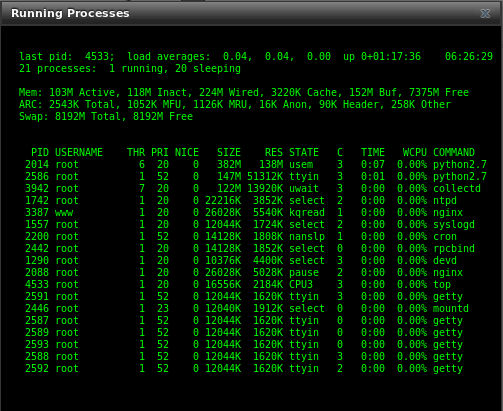
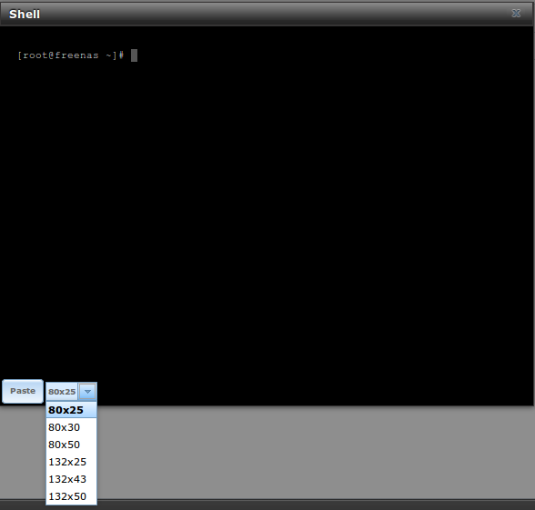
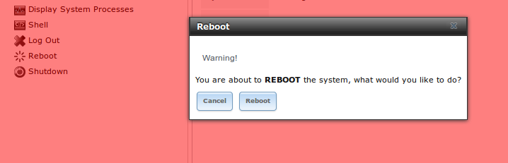
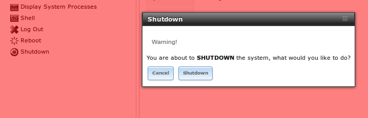
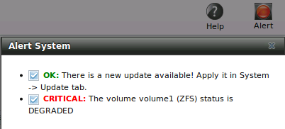

.. _Additional Options:

Additional Options
==================

This section covers the remaining miscellaneous options available from the TrueNAS® graphical administrative interface.

.. index:: Processes

.. _Display System Processes:

Display System Processes
------------------------

If you click Display System Processes, a screen will open showing the output of
`top(1) <http://www.freebsd.org/cgi/man.cgi?query=top>`_. An example is shown in Figure 13.1a.

**Figure 13.1a: System Processes Running on TrueNAS®**

|process.png|

The display will automatically refresh itself. Simply click the X in the upper right corner to close the display when you are finished. Note that the display
is read-only, meaning that you won't be able to issue a :command:`kill` command within it.

.. index:: Shell

.. _Shell:

Shell
-----

The TrueNAS® GUI provides a web shell, making it convenient to run command line tools from the web browser as the *root* user. The link to Shell is the
fourth entry from the bottom of the menu tree. In Figure 13.2a, the link has been clicked and Shell is open.

**Figure 13.2a: Web Shell**

|shell.png|

The prompt indicates that the current user is *root*, the hostname is
*truenas*, and the current working directory is :file:`~`
(*root*'s home directory).

To change the size of the shell, click the *80x25* drop-down menu and select a different size.

To copy text from shell, highlight the text, right-click, and select Copy from the right-click menu. To paste into the shell, click the "Paste" button, paste
the text into the box that opens, and click the OK button to complete the paste operation.

While you are in Shell, you will not have access to any of the other GUI menus. If you need to have access to a prompt while using the GUI menus, use
:command:`tmux` instead as it supports multiple shell sessions and the detachment and reattachment of sessions.

Shell provides history (use your up arrow to see previously entered commands and press :kbd:`Enter` to repeat the currently displayed command) and tab
completion (type a few letters and press tab to complete a command name or filename in the current directory). When you are finished using Shell, type
:command:`exit` to leave the session.

.. note:: not all of Shell's features render correctly in Chrome. Firefox is the recommended browser for using Shell.

Due to the embedded nature of TrueNAS®, some FreeBSD components are missing and noticeable in Shell. For example, man pages are not included; however,
FreeBSD man pages are available
`online <http://www.freebsd.org/cgi/man.cgi>`_. Most FreeBSD command line utilities should be available in Shell.

.. index:: Log Out
.. _Log Out:

Log Out
-------

To log out of the TrueNAS® GUI, simply click the "Log Out" entry in the tree. You will immediately be logged out. An informational message will indicate that
you are logged out and will provide a hyperlink which you can click on to log back in. When logging back in, you will be prompted for the *root* password.

.. index:: Reboot

.. _Reboot:

Reboot
------

If you click "Reboot", you will receive the warning message shown in Figure 13.4a and your browser color will change to red to indicate that you have selected
an option that will negatively impact users of the TrueNAS® system.

**Figure 13.4a: Reboot Warning Message**

|reboot.png|

If a scrub or resilver is in progress when a reboot is requested, an additional warning will ask you to make sure that you wish to proceed. In this case, it
is recommended to "Cancel" the reboot request and to periodically run :command:`zpool status` from `Shell`_ until it is verified that the scrub or resilver
process is complete. Once complete, the reboot request can be re-issued.

Click the "Cancel" button if you wish to cancel the reboot request. Otherwise, click the Reboot button to reboot the system. Rebooting the system will
disconnect all clients, including the web administration GUI. The URL in your web browser will change to add */system/reboot/* to the end of the IP address.
Wait a few minutes for the system to boot, then use your browser's back button to return to the TrueNAS® system's IP address. If all went well, you should
receive the GUI login screen. If the login screen does not appear, access the system using IPMI in order to determine what problem is preventing the system
from resuming normal operation.

.. index:: Shutdown

.. _Shutdown:

Shutdown
--------

If you click "Shutdown", you will receive the warning message shown in Figure 13.5a and your browser color will change to red to indicate that you have
selected an option that will negatively impact users of the TrueNAS® system.

**Figure 13.5a: Shutdown Warning Message**

|shutdown.png|

If a scrub or resilver is in progress when a shutdown is requested, an additional warning will ask you to make sure that you wish to proceed. In this case, it
is recommended to "Cancel" the shutdown request and to periodically run :command:`zpool status` from `Shell`_ until it is verified that the scrub or resilver
process is complete. Once complete, the shutdown request can be re-issued.

Click the "Cancel" button if you wish to cancel the shutdown request. Otherwise, click the "Shutdown" button to halt the system. Shutting down the system will
disconnect all clients, including the web administration GUI, and will power off the TrueNAS® system.

.. index:: Help

.. _Help:

Help
----

The Help button in the upper right corner provides a pop-up menu containing hyperlinks to the following TrueNAS® support resources:

*   the link to open a support ticket

*   the link to the TrueNAS® knowledge base

*   the email address of the support team

.. index:: Support

.. _Creating a Support Ticket:

Creating a Support Ticket
~~~~~~~~~~~~~~~~~~~~~~~~~

As an iXsystems customer, you have access to the resources available at
`https://support.ixsystems.com <https://support.ixsystems.com/>`_, shown in Figure 13.6a.

**Figure 13.6a: iXsystems Support Website**

|support.png|

.. |support.png| image:: images/support.png
    :width: 6.9252in
    :height: 3.7492in

The support website provides some knowledge base articles. If the support issue is not addressed by the TrueNAS® Administrator Guide or a knowledge base
article, click the "Submit a Ticket" hyperlink, then click TrueNAS® so that your ticket can be routed to a TrueNAS® support representative.

In the "Submit a Ticket" screen, select "TrueNAS" then click the "Next" button.

You will then be prompted to fill in your "Contact Information", "System Details", and a description of the issue. Use a "Subject" line that summarizes the
support issue.

The "Message Details" should contain a summary of how to recreate the problem, as well as any applicable error messages or screenshots. Use the "Upload Files"
button to attach a log file or screenshot. If the issue is related to a configuration, upload the file that is created by going to `System -> Advanced -> Save
Debug`.

When finished, input the captcha information and click the "Submit" button. A message will indicate that the ticket has been submitted and has been issued a
Ticket ID. An email confirmation will also be sent, indicating the Ticket ID and providing a hyperlink to check the status of or to reply to the ticket.

A login account is not required to submit a ticket. However, a login is required in order to view your submitted tickets. If you do not have a login account,
click "Register" to create one. The registration process will ask for your name, email address, a password, and to verify a captcha image. A registration
email will be sent to the provided email address; you will not be able to login until you follow the link in the email to validate your account.

To view the status of your tickets, click the "View Tickets" tab while logged in. In addition to the status, you can view any comments by support staff as
well as click a ticket's Post Reply button in order to respond to a comment or to provide additional requested information.

.. index:: Alert

.. _Alert:

Alert
-----

TrueNAS® provides an alert system to provide a visual warning of any conditions that require administrative attention. The "Alert" button in the far right
corner will flash red when there is an outstanding alert. In the example alert shown in Figure 13.7a. one of the disks in a ZFS pool is offline which has
degraded the state of the pool.

**Figure 13.7a: Example Alert Message**

|alert.png|

Informational messages will have a green "OK" while messages requiring attention will be listed as a red "CRITICAL". CRITICAL messages will also be emailed to
the root user account. If you are aware of a critical condition but wish to remove the flashing alert until you deal with it, uncheck the box next to that
message.

Behind the scenes, an alert script checks for various alert conditions, such as volume and disk status, and writes the current conditions to
:file:`/var/tmp/alert`. A javascript retrieves the current alert status every minute and will change the solid green alert icon to flashing red if a new
alert is detected. Some of the conditions that trigger an alert include:

* a volume's capacity goes over 80%

* new OpenZFS feature flags are available for the pool; this alert can be unchecked if you choose not to upgrade the pool at this time

* non-optimal multipath states

* ZFS pool status changes from "HEALTHY"

* the system is unable to bind to the "WebGUI IPv4 Address" set in :menuselection:`System --> General`

* the system can not find an IP address configured on an iSCSI portal

* a replication task fails

* a VMware login or a :ref:`VMware Snapshots` task fails

* the status of a LSI MegaRAID SAS controller has changed;
  `mfiutil(8) <http://www.freebsd.org/cgi/man.cgi?query=mfiutil>`_
  is included for managing these devices

An alert will also be generated when the LSI HBA firmware version does not match the driver version. To resolve this alert, download the IT (integrated
target) firmware, not the IR (integrated RAID) firmware, from the LSI website. Then, specify the name of the firmware image and bios as well as the
controller to flash::

 sas2flash -f firmwareimagename -v biosname -c controllernumber

When finished, reboot the system. The new firmware version should appear in the system messages and the alert will be cleared.

