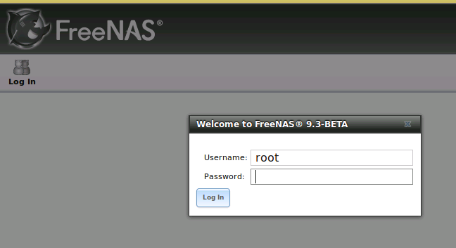
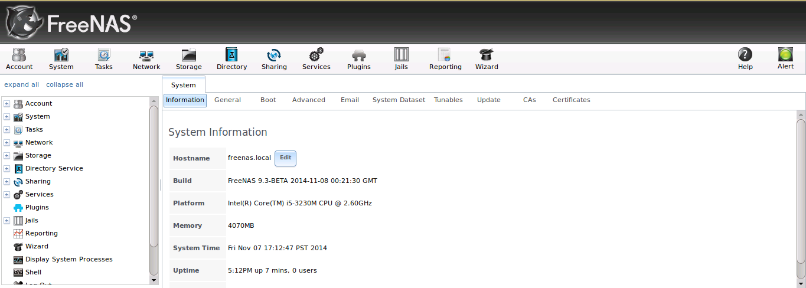

:orphan:

Accessing TrueNAS®
------------------

When you boot into TrueNAS®, the Console Setup, shown in Figure 3a, will appear at the end of the boot process. If you have access to the the TrueNAS®
system's keyboard and monitor, this Console Setup menu can be used to administer the system should the administrative GUI become inaccessible.

.. note:: you can access the Console Setup menu from within the TrueNAS® GUI by typing :command:`/etc/netcli` from `Shell`. You can disable the Console
   Setup menu by unchecking the "Enable Console Menu" in `System --> Settings --> Advanced`.

**Figure 3a: TrueNAS® Console Setup Menu**

|console.png|

This menu provides the following options:

**1) Configure Network Interfaces:** provides a configuration wizard to configure the system's network interfaces.

**2) Configure Link Aggregation:** allows you to either create a new link aggregation_ or to delete an existing link aggregation.

**3) Configure VLAN Interface:** used to create or delete a VLAN interface.

**4) Configure Default Route:** used to set the IPv4 or IPv6 default gateway. When prompted, input the IP address of the default gateway.

**5) Configure Static Routes:** will prompt for the destination network and the gateway IP address. Re-enter this option for each route you need to add.

**6) Configure DNS:** will prompt for the name of the DNS domain then the IP address of the first DNS server. To input multiple DNS servers, press enter to
input the next one. When finished, press enter twice to leave this option.

**7) Reset WebGUI login credentials:** if you are unable to login to the graphical administrative interface, select this option. The next time the graphical
interface is accessed, it will prompt to set the *root* password.

**8) Reset to factory defaults:** if you wish to delete
**all** of the configuration changes made in the administrative GUI, select this option. Once the configuration is reset, the system will reboot. You will
need to go to Storage --> Volumes --> Auto Import Volume to re-import your volume.

**9) Shell:** enters a shell in order to run FreeBSD commands. To leave the shell, type :command:`exit`.

**10) Reboot:** reboots the system.

**11) Shutdown:** halts the system.

During boot, TrueNAS® will automatically try to connect to a DHCP server from all live interfaces. If it successfully receives an IP address, it will display
the IP address which can be used to access the graphical console. In the example seen in Figure 3a, the TrueNAS® system is accessible from
*http://192.168.1.78*.

If your TrueNAS® server is not connected to a network with a DHCP server, you can use the network configuration wizard to manually configure the interface as
seen in Example 3a. In this example, the TrueNAS® system has one network interface (*em0*).

**Example 3a: Manually Setting an IP Address from the Console Menu**

::

 Enter an option from 1-11: 1
 1) em0
 Select an interface (q to quit): 1
 Delete existing config? (y/n) n
 Configure interface for DHCP? (y/n) n
 Configure IPv4? (y/n) y
 Interface name: (press enter as can be blank)
 Several input formats are supported
 Example 1 CIDR Notation: 192.168.1.1/24
 Example 2 IP and Netmask separate: IP: 192.168.1.1
 Netmask: 255.255.255.0, or /24 or 24
 IPv4 Address: 192.168.1.108/24
 Saving interface configuration: Ok
 Configure IPv6? (y/n) n
 Restarting network: ok
 You may try the following URLs to access the web user interface:
 `http://192.168.1.108 <http://192.168.1.108/>`_

Once the system has an IP address, input that address into a graphical web browser from a computer capable of accessing the network containing the TrueNAS®
system. You should be prompted to input the password for the root user, as seen in Figure 3b.

**Figure 3b: Input the Root Password**

|login.png|

Enter the password created during the installation. You should then see the administrative GUI as shown in the example in Figure 3c.

**Figure 3c: TrueNAS® Graphical Configuration Menu**

|initial.png|

If you are unable to access the IP address from a browser, check the following:

* Are proxy settings enabled in the browser configuration? If so, disable the settings and try connecting again.

* If the page does not load, make sure that you can :command:`ping` the TrueNAS® system's IP address. If the address is in a private IP address range, you
  will only be able to access the system from within the private network.

* If the user interface loads but is unresponsive or seems to be missing menu items, try using a different web browser. IE9 has known issues and will not
  display the graphical administrative interface correctly if compatibility mode is turned on. If you can't access the GUI using Internet Explorer, use
  `Firefox <http://www.mozilla.com/en-US/firefox/all.html>`_
  instead.

* If you receive "An error occurred!" messages when attempting to configure an item in the GUI, make sure that the browser is set to allow cookies from
  the TrueNAS® system.

This
`blog post <http://fortysomethinggeek.blogspot.com/2012/10/ipad-iphone-connect-with-freenas-or-any.html>`_
describes some applications which can be used to access the TrueNAS® system from an iPad or iPhone.

.. index:: Initial Configuration Wizard, Configuration Wizard, Wizard
.. _Initial Configuration Wizard:

Initial Configuration Wizard
~~~~~~~~~~~~~~~~~~~~~~~~~~~~

Beginning with TrueNAS® 9.3, a configuration wizard automatically starts the first time the TrueNAS® GUI is accessed. This wizard walks you through the
steps needed to quickly configure TrueNAS® to start serving data over a network. This section describes these configuration steps. If you wish to use the
wizard again after the initial configuration, click the "Wizard" icon.

Figure 3.1a shows the initial wizard configuration screen.

**Figure 3.1a: Initial Configuration Wizard**

|wizard.png|

.. |wizard.png| image:: images/wizard.png
    :width: 2.7in
    :height: 1.8in

.. note:: you can exit the wizard at any time by clicking the "Exit" button. However, exiting the wizard will not save any selections. You can always restart
   the wizard again by clicking the "Wizard" icon. Alternately, you can use the TrueNAS® GUI to configure the system, as described in the rest of this Guide.

This screen can be used to change the default language, keyboard map, and timezone. After making your selections, click "Next". The next screen depends on
whether or not the storage disks have already been formatted into a ZFS pool.

Figure 3.1b shows the configuration screen that appears if the storage disks have not yet been formatted.

**Figure 3.1b: Volume Creation Wizard**

|wizard1.png|

.. |wizard1.png| image:: images/wizard1.png
    :width: 4.7in
    :height: 2.4in

.. note:: the initial configuration wizard will not recognize an **encrypted** ZFS pool. If your ZFS pool is GELI-encrypted, cancel the wizard and use the
   instructions in :ref:`Importing an Encrypted Pool` to import the encrypted volume. You can then rerun the wizard afterwards, if you wish to use it for
   post-configuration, and it will recognize that the volume has been imported and will not prompt to reformat the disks.

Input a name for the ZFS pool that conforms to these
`naming conventions <http://docs.oracle.com/cd/E23824_01/html/821-1448/gbcpt.html>`_. It is recommended to choose a name that will stick out in the logs (e.g.
**not** :file:`data` or :file:`freenas`).

Next, decide if the pool should provide disk redundancy, and if so, which type. The :ref:`ZFS Primer` discusses RAIDZ redundancy in more detail. If you prefer
to make a more complex configuration, click the "Exit" button to close the "Wizard" and instead use :ref:`Volume Manager`.

The following redundancy types are available:

* **Automatic:** automatically creates a mirrored, RAIDZ1, or RAIDZ2 pool, depending upon the number of disks. If you prefer to control the type of
  redundancy, select one of the other options.

* **RAID 10:** creates a striped mirror and requires a minimum of 4 disks.

* **RAIDZ2:** requires a minimum of 4 disks. Up to 2 disks can fail without data loss.

* **RAIDZ1:** requires a minimum of 3 disks. Up to 1 disk can fail without data loss.

* **Stripe:** requires a minimum of 1 disk. Provides **no** redundancy, meaning if any of the disks in the stripe fails, all data in the stripe is lost.

Once you have made your selection, click "Next" to continue.

If the disks have already been formatted with ZFS and the disks have **not** been encrypted, the next screen will instead prompt to import the volume, as seen
in Figure 3.1c.

**Figure 3.1c: Volume Import Screen**

|wizard2.png|

.. |wizard2.png| image:: images/wizard2.png
    :width: 3.0in
    :height: 1.2in

Select the existing volume from the drop-down menu and click "Next" to continue.

The next screen in the wizard is shown in Figure 3.1d.

**Figure 3.1d: Directory Service Selection**

|wizard3.png|

.. |wizard3.png| image:: images/wizard3.png
    :width: 3.8in
    :height: 2.1in

If the TrueNAS® system is on a network that does not contain an Active Directory, LDAP, NIS, or NT4 server, click "Next" to skip to the next screen.

However, if the TrueNAS® system is on a network containing an Active Directory, LDAP, NIS, or NT4 server and you wish to import the users and groups from
that server, select the type of directory service in the "Directory Service" drop-down menu. The rest of the fields in this screen will vary, depending upon
which directory service is selected. Tables 3.1a to 3.1d summarize the available configuration options for each directory service.

.. note:: additional configuration options are available for each directory service. The wizard can be used to set the initial values required to connect to
   that directory service. You can then review the other available options in :ref:`Directory Service` to determine if additional configuration is required.

**Table 3.1a: Active Directory Options**

+--------------------------+---------------+-------------------------------------------------------------------------------------------------------+
| **Setting**              | **Value**     | **Description**                                                                                       |
|                          |               |                                                                                                       |
+==========================+===============+=======================================================================================================+
| Domain Name              | string        | name of Active Directory domain (e.g. *example.com*) or child domain (e.g.                            |
|                          |               | *sales.example.com*)                                                                                  |
|                          |               |                                                                                                       |
+--------------------------+---------------+-------------------------------------------------------------------------------------------------------+
| Domain Account Name      | string        | name of the Active Directory administrator account                                                    |
|                          |               |                                                                                                       |
+--------------------------+---------------+-------------------------------------------------------------------------------------------------------+
| Domain Account Password  | string        | password for the Active Directory administrator account                                               |
|                          |               |                                                                                                       |
+--------------------------+---------------+-------------------------------------------------------------------------------------------------------+

**Table 3.1b: LDAP Options**

+-------------------------+----------------+-------------------------------------------------------------------------------------------------------+
| **Setting**             | **Value**      | **Description**                                                                                       |
|                         |                |                                                                                                       |
+=========================+================+=======================================================================================================+
| Hostname                | string         | hostname or IP address of LDAP server                                                                 |
|                         |                |                                                                                                       |
+-------------------------+----------------+-------------------------------------------------------------------------------------------------------+
| Base DN                 | string         | top level of the LDAP directory tree to be used when searching for resources (e.g.                    |
|                         |                | *dc=test,dc=org*)                                                                                     |
|                         |                |                                                                                                       |
+-------------------------+----------------+-------------------------------------------------------------------------------------------------------+
| Bind DN                 | string         | name of administrative account on LDAP server (e.g. *cn=Manager,dc=test,dc=org*)                      |
|                         |                |                                                                                                       |
+-------------------------+----------------+-------------------------------------------------------------------------------------------------------+
| Base password           | string         | password for                                                                                          |
|                         |                |                                                                                                       |
+-------------------------+----------------+-------------------------------------------------------------------------------------------------------+

**Table 3.1c: NIS Options**

+-------------------------+----------------+-------------------------------------------------------------------------------------------------------+
| **Setting**             | **Value**      | **Description**                                                                                       |
|                         |                |                                                                                                       |
+=========================+================+=======================================================================================================+
| NIS domain              | string         | name of NIS domain                                                                                    |
|                         |                |                                                                                                       |
+-------------------------+----------------+-------------------------------------------------------------------------------------------------------+
| NIS servers             | string         | comma delimited list of hostnames or IP addresses                                                     |
|                         |                |                                                                                                       |
+-------------------------+----------------+-------------------------------------------------------------------------------------------------------+
| Secure mode             | checkbox       | if checked,                                                                                           |
|                         |                | `ypbind(8) <http://www.freebsd.org/cgi/man.cgi?query=ypbind>`_                                        |
|                         |                | will refuse to bind to any NIS server that is not running as root on a TCP port number over 1024      |
|                         |                |                                                                                                       |
+-------------------------+----------------+-------------------------------------------------------------------------------------------------------+
| Manycast                | checkbox       | if checked, ypbind will bind to the server that responds the fastest; this is useful when no local    |
|                         |                | NIS server is available on the same subnet                                                            |
|                         |                |                                                                                                       |
+-------------------------+----------------+-------------------------------------------------------------------------------------------------------+

**Table 3.1d: NT4 Options**

+-------------------------+----------------+-------------------------------------------------------------------------------------------------------+
| **Setting**             | **Value**      | **Description**                                                                                       |
|                         |                |                                                                                                       |
+=========================+================+=======================================================================================================+
| Domain Controller       | string         | hostname of domain controller                                                                         |
|                         |                |                                                                                                       |
+-------------------------+----------------+-------------------------------------------------------------------------------------------------------+
| NetBIOS Name            | string         | hostname of FreeNAS system                                                                            |
|                         |                |                                                                                                       |
+-------------------------+----------------+-------------------------------------------------------------------------------------------------------+
| Workgroup Name          | string         | name of Windows server's workgroup                                                                    |
|                         |                |                                                                                                       |
+-------------------------+----------------+-------------------------------------------------------------------------------------------------------+
| Administrator Name      | string         | name of the domain administrator account                                                              |
|                         |                |                                                                                                       |
+-------------------------+----------------+-------------------------------------------------------------------------------------------------------+
| Administrator Password  | string         | input and confirm the password for the domain administrator account                                   |
|                         |                |                                                                                                       |
+-------------------------+----------------+-------------------------------------------------------------------------------------------------------+

The next configuration screen, shown in Figure 3.1e, can be used to create the network shares.

**Figure 3.1e: Share Creation**

|wizard4.png|

.. |wizard4.png| image:: images/wizard4.png
    :width: 3.5in
    :height: 3.4in

TrueNAS® supports several types of shares for providing storage data to the clients in a network. The initial wizard can be used to quickly make shares using
default permissions which should "just work" for common scenarios. If you wish to configure more complex scenarios, refer to the section on :ref:`Sharing`.

To create a share using the wizard, input a name, then select the "Purpose" of the share:

* **Windows (CIFS):** this type of share can be accessed by any operating system using a CIFS client. Check the box for "Allow Guest" if users should not be
  prompted for a password in order to access the share. If you make any CIFS shares using the wizard, you can fine-tune them afterwards using
  :ref:`Windows (CIFS) Shares`.

* **Mac OS X (AFP):** this type of share can be accessed by Mac OS X users. Check the box for "Time Machine" if Mac users will be using the TrueNAS® system
  as a backup device. If you make any AFP shares using the wizard, you can fine-tune them afterwards using :ref:`Apple (AFP) Shares`.

* **Generic Unix (NFS):** this type of share can be accessed by any operating system using a NFS client. If you make any NFS shares using the wizard, you can
  fine-tune them afterwards using :ref:`Unix (NFS) Shares`.

* **Block Storage (iSCSI):** this type of share can be accessed by any operating system using iSCSI initiator software. Input the size of the block storage to
  create in the format *20G* (for 20 GB). If you make any iSCSI shares using the wizard, you can fine-tune them afterwards using :ref:`iSCSI`.

After selecting the "Purpose", click the "Ownership" button to see the screen shown in Figure 3.1f.

**Figure 3.1f: Share Permissions**

|wizard5.png|

.. |wizard5.png| image:: images/wizard5.png
    :width: 3.2in
    :height: 2.3in

The default permissions for the share will be displayed. To create a user or group, input the desired name, then check the "Create User" box, to create that
user, and the "Create Group" box, to create that group. Check or uncheck the boxes in the "Mode" section to set the initial access permissions for the share.
When finished, click the "Return" button to return to the share creation screen. Click the "Add" button to finish creating that share, which will then
appear in the "Name" frame.

You can use the "Delete" button to remove the highlighted share in the "Name" frame. If you need to edit a share, highlight it, make the change, then press
the "Update" button.

When you are finished making shares, click the "Next" button to advance to the screen shown in Figure 3.1g.

**Figure 3.1g: Miscellaneous Settings**

|wizard6.png|

.. |wizard6.png| image:: images/wizard6.png
    :width: 3.44in
    :height: 3.99in

This screen can be used to configure the following settings:

* **Console messages:** check this box if you would like to view system messages at the bottom of the graphical administrative interface. This can be handy
  when troubleshooting a service that will not start. When using the console message view, if you click the console messages area, it will pop-up as a window,
  allowing you to scroll through the output and to copy its contents.

* **Root E-mail:** TrueNAS® provides an "Alert" icon in the upper right corner to provide a visual indication of events that warrant administrative
  attention. The alert system automatically emails the *root* user account whenever an alert is issued. **It is important** to input the email address of the
  person to receive these alerts and other administrative emails. The rest of the email settings in this screen should also be reviewed and edited as
  necessary. Before leaving this screen, click the "Send Test Mail" button to ensure that email notifications are working correctly.

* **From email:** the from email address to use when sending email notifications.

* **Outgoing mail server:** hostname or IP address of SMTP server.

* **Port to connect to:** port number used by the SMTP server.

* **TLS/SSL:** encryption type used by the SMTP server.

* **Use SMTP Authentication:** check this box if the SMTP server requires authentication.

* **Username:** input the username if the SMTP server requires authentication.

* **Password:** input the password if the SMTP server requires authentication.

When finished, click "Next". A message will indicate that the wizard is now ready to perform all of the saved actions. If you wish to make any changes, click
the "Return to Wizard" button to review your edits. If you click the "Exit without saving" button, none of your selections will be saved. To save your edits,
click the "Confirm" button. A status bar will indicate when the wizard has completed applying your settings.

In addition to the settings that you specify, the wizard will automatically enable :ref:`S.M.A.R.T. Tests`, create a boot environment, and add the new boot
environment to the boot menu. If you also wish to save a backup of the configuration database to the system being used to access the administrative graphical
interface, go to :menuselection:`System --> General`, click the "Save Config" button, and browse to the directory to save the configuration to.
**It is recommended to always backup your configuration after making any configuration changes**.

The rest of this Guide describes all of the configuration screens available within the TrueNAS® graphical administrative interface. The screens are listed in
the order that they appear within the tree, or the left frame of the graphical interface.
**iXsystems recommends that you contact your support technician for initial setup and configuration assistance.**
Once your system has been configured and you are familiar with the configuration workflow, the rest of this document can be used as a reference guide to the
features built into the TrueNAS® appliance.

.. note:: it is important to use the graphical interface (or the console setup menu) for all non-ZFS configuration changes. TrueNAS® uses a configuration
   database to store its settings. If you make changes at the command line, they will not be written to the configuration database. This means that these
   changes will not persist after a reboot and will be overwritten by the values in the configuration database during an upgrade.

