Initial Setup
=============

Depending on the degree of pre-configuration you requested from iXsystems, much of the initial TrueNAS® setup may already be complete. 

.. note:: always perform the initial TrueNAS® setup in consultation with your iXsystems Support Representative. You can contact iXsystems Support at
   truenas-support@ixsystems.com. Be sure to have all of your TrueNAS® hardware serial numbers on hand, which are located on the back of the chassis.

This section covers these initial setup steps:

* :ref:`Packing List`: provides an overview of the hardware components.

* :ref:`Hardware Setup`: how to install the TrueNAS® hardware into a rack and connect all necessary expansion shelves.

* :ref:`Out-of-Band Management`: connect and configure the TrueNAS® out-of-band management port.

* :ref:`Console Setup Menu`: access the TrueNAS® console setup menu to configure network interfaces.

.. index:: Packing List

.. _Packing List:

Packing List
------------

The TrueNAS® Storage Appliance supports two expansion shelf models: the :ref:`E16 Expansion Shelf` and the :ref:`E24 Expansion Shelf`. Each is designed to be
straightforward to set up.

The TrueNAS® Storage Appliance comes with a number of necessary accessories. If anything is missing or your TrueNAS® Storage Appliance arrived in less than pristine
condition, immediately take pictures and contact iXsystems support.

Check that your shipment includes the following items:

* TrueNAS® Storage Appliance

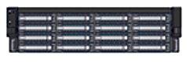

* Up to 16 Populated 3.5" drive trays

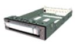

* One pair of outer rails, left and right

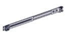

* Eight thumbscrews

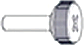

* Two screws 

.. image:: images/tn_screws.jpg

* Two power cables

.. image:: images/tn_power_cable.jpg

* One serial to 3.5mm cable

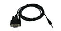

* One bezel

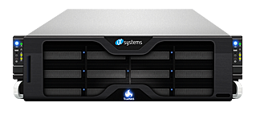

* One printed guide

Since network cables are highly configuration-dependent, contact your iXsystems Sales Representative if you have any questions regarding the included cables.

Any unused drive bays will be populated with drive tray blanks to maintain proper airflow.

The layout of the storage controller will vary by configuration. Figure 3.1a provides an example of the front view of the TrueNAS® Storage Appliance.

**Figure 3.1a: Front View**

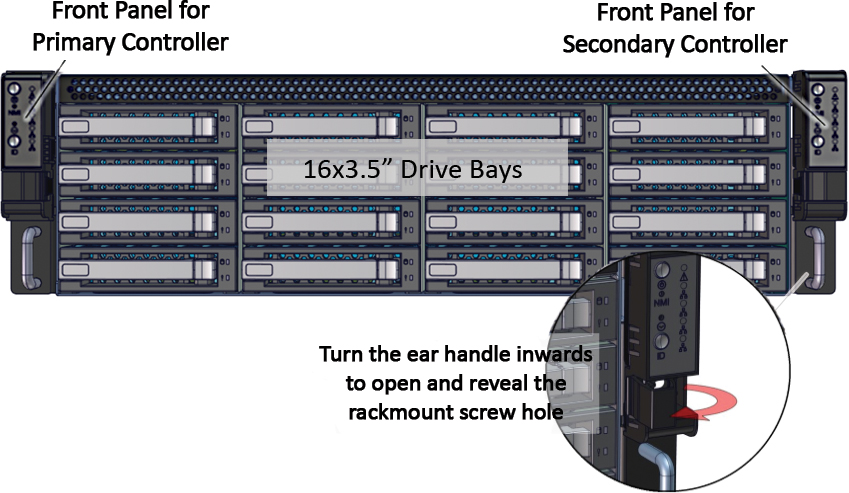

Note the two control panels on either side of the front of the appliance. The one on the left controls the primary storage controller, and the one on the
right controls the secondary storage controller in High Availability models.

Figure 3.1b shows the layout of the front panel buttons and indicators.

**Figure 3.1b: Front Panel Buttons and Indicators**

.. image:: images/tn_appliance_front_panel.jpg

Figure 3.1c shows the rear view of the appliance. If the TrueNAS® Storage Appliance is configured for High Availability, both storage controller slots will
be populated. In a single-controller model, the bottom controller slot will contain a controller slot cover panel.

**Figure 3.1c: Rear View**

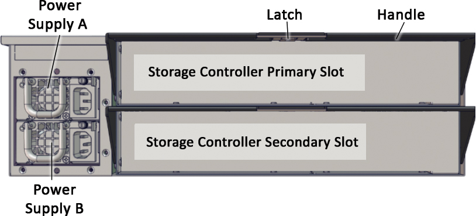

Figure 3.1d shows a drive tray and the meanings for the LED colors.

**Figure 3.1d: 3.5" Drive Tray**

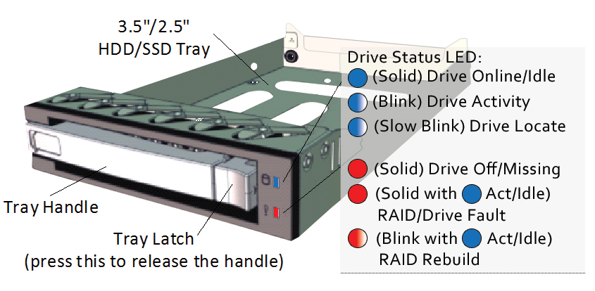

.. index:: Hardware Setup

.. _Hardware Setup:

Hardware Setup
--------------

TrueNAS® Storage Appliance slide rails support racks with both square and circular hole types. Set the mounting brackets into the correct position for your rack type
by pressing the button on the mounting bracket and rotating them in place, as shown in Figure 3.2a. The square rack style brackets are the default. The
circular hole style is the one with a flat surface and screw holes.

**Figure 3.2a: Rotate Rackmount Bracket**

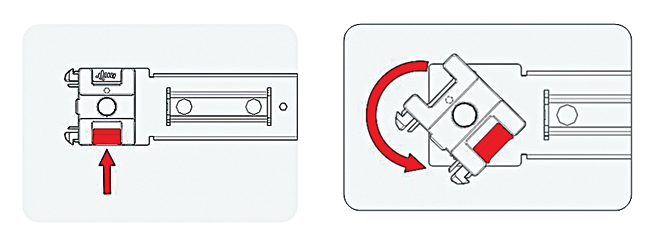

.. index:: Install TrueNAS Outer Rail in Rack

Before installing the TrueNAS® Storage Appliance, confirm that the rails included with your TrueNAS® Storage Appliance are long enough for your rack. Examine each rail to
find the sides labeled "Front" and "Rear".

For racks with square holes, snap the mounting brackets into the holes at either end of the rail into the mouting holes. Make sure to install the rails with
the end labeled "Front" toward the front of the rack. Refer to Figure 3.2b for a detailed view.

**Figure 3.2b: Installing Rails in Racks with Square Holes**

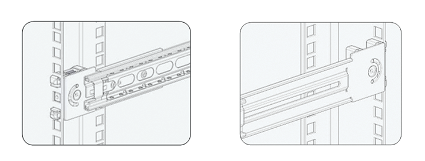

For racks with round holes, secure the rails into the rack at the desired position using the eight thumbscrews included with the rails. Make sure to install
the rails with the end labeled "Front" toward the front of the rack. Refer to Figure 3.2c for a detailed view.

**Figure 3.2c: Installing Rails in Racks with Round Holes**

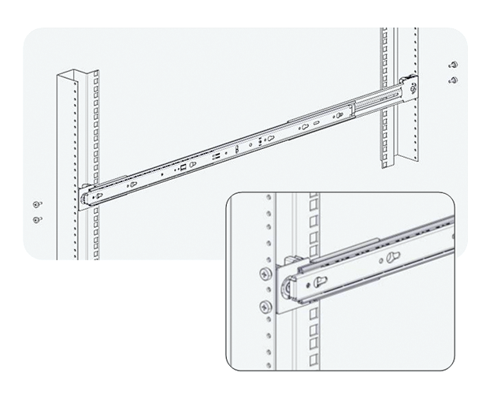

.. index:: Install Appliance into Rack

You are now ready to install the TrueNAS® Storage Appliance into the rack.

.. warning:: two people are required to lift a TrueNAS® Storage Appliance.

Carefully align the TrueNAS® Storage Appliance inner rail with the notches in the outer rail. Once the rails are aligned, slide the appliance toward the rack. When
the appliance stops moving, move the pin-lock laches to allow the appliance to slide the rest of the way into the rack. Refer to Figure 3.2d for a detailed
view.

**Figure 3.2d: Push Appliance into Rack and Release pin-lock Latches.**

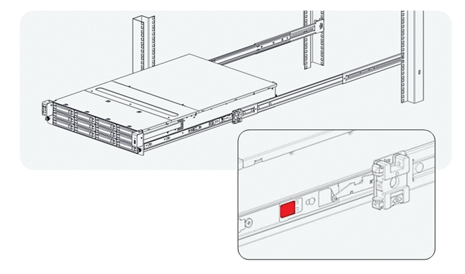

.. index:: Install Drive Trays into a TrueNAS Appliance

Next, install all of the populated drive trays into the front of the appliance. Refer to Figure 3.2e for a detailed view.

.. note:: to avoid personal injury, do not install drives into the TrueNAS® Storage Appliance before racking.

**Figure 3.2e: Drive Installation Instructions**

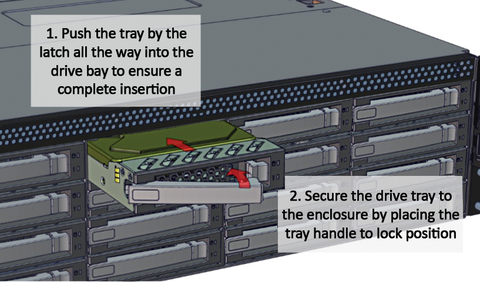

TrueNAS® drive bays are numbered as shown in Figure 3.2f. If your TrueNAS® Storage Appliance includes ZIL (Write Cache) or L2ARC (Read Cache) devices,
install all ZIL devices starting from slot 0, followed by all L2ARC devices, followed by any remaining drives.

**Figure 3.2f: Drive Bay Ordering**

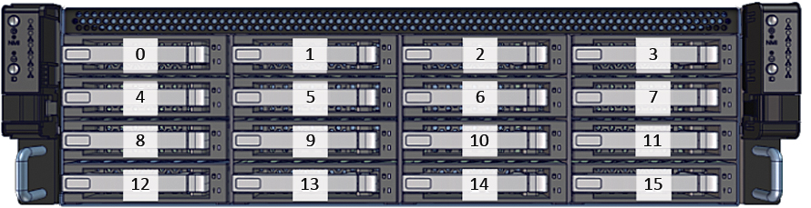

Both network and storage cabling should be connected **before** turning on the TrueNAS® Storage Appliance for the first time.

Network cabling is highly dependent on the exact TrueNAS® model and environment. If you need assistance connecting your TrueNAS® Storage Appliance to the network,
contact your iXsystems Support Representative. 

In order to configure and use :ref:`Out-of-Band Management`, you must connect the out-of-band management port before turning on the TrueNAS® Storage Appliance.
Refer to Figure 3.2g or the sticker on the storage controller handle for the location of the out-of-band management port.

**Figure 3.2g: TrueNAS® Back Panel Layout**

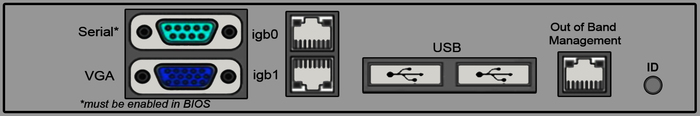

For storage cabling instructions, refer to the instructions in :ref:`E16 Expansion Shelf` or :ref:`E24 Expansion Shelf`, depending upon the TrueNAS®
expansion shelf.

.. index:: Attach the TrueNAS Bezel

Finally, each TrueNAS® Storage Appliance includes an optional bezel. To attach the bezel to the TrueNAS® Storage Appliance, insert the two tabs on the right side of the
bezel into the holes in the right side handle section. Push the left side of the bezel down until it clicks into place.

.. index:: Plug in and Power on your TrueNAS appliance

Once all of the other hardware setup steps are complete, plug the power cords into the AC receptacles on the back of the TrueNAS® Storage Appliance and secure them
in place with the wire locks. 

.. note:: be sure to power on all TrueNAS® storage expansion shelves before powering on the TrueNAS® Storage Appliance.

Power on the TrueNAS® Storage Appliance by pressing the top left button on the control panel for each storage controller. Wait thirty seconds after turning on the
first storage controller before powering on the second storage controller. This will make it clear which controller will be the active controller in High
Availability configurations.

Once the TrueNAS® Storage Appliance is fully operational, the TrueNAS® logo will act as a global fault light. By default, it is backlit in white. If there
are any issues that need to be addressed, the light will turn red. In this case, refer to the :ref:`Alert` section of the TrueNAS® administrative graphical
interface for more details about the error condition.

.. index:: E16 Expansion Shelf

.. _E16 Expansion Shelf:

E16 Expansion Shelf
---------------------------

The TrueNAS® E16 expansion shelf is a 3U, 16-bay storage expansion unit designed specifically to work with the TrueNAS® Storage Appliance. This section will
cover setting up an E16 expansion shelf and connecting it to a TrueNAS® Storage Appliance.

.. index:: E16 Expansion Shelf Contents

The E16 expansion shelf comes with a number of necessary accessories. If anything is missing or your E16 expansion shelf arrived in less than pristine
condition, immediately take pictures and contact iXsystems support.

* TrueNAS® E16 expansion shelf

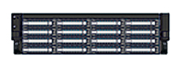

* Up to 16 populated 3.5" drive trays

* Two power cables

.. image:: images/tn_power_cable.jpg

* Two host expansion cables (SAS 8088)

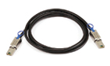

* Inner and outer rails, left and right

.. image:: /images/tn_rails.jpg

* Two sets of screws

.. image:: images/tn_screws.jpg

* One printed guide

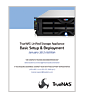

Unused drive bays will be populated with drive tray blanks to maintain proper airflow.

.. index:: E16 Expansion Shelf Layout

Figure 3.3a shows the front view and Figure 3.3b shows the rear view of the TrueNAS® E16 expansion shelf.

**Figure 3.3a: Front View**

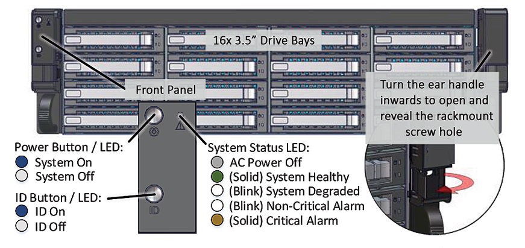

**Figure 3.3b: Rear View**

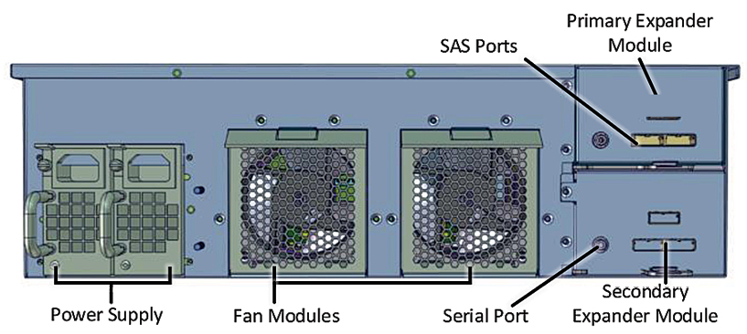

Figure 3.3c provides a detailed view of a drive tray and the possible statuses for the LED.

**Figure 3.3c: 3.5" Drive Tray**

.. index:: Attach E16 Expansion Shelf Inner Rail to Chassis

To attach the E16 expansion shelf inner rail to the chassis, remove the inner rail from both rails. Slide the inner and outer rails apart, and then push the
pin-lock latch outward to allow the rails to separate completely, as shown in Figure 3.3d.

**Figure 3.3d: Separate Inner and Outer Rails**

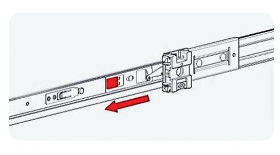

Align the inner rail keyholes to the two hooks near the front of the chassis, then slide the rails forward into place as shown in Figure 3.3e.

**Figure 3.3e: Attach Inner Rail to Chassis**

.. image:: images/tn_attach_inner_rail.jpg

Secure the inner rail in place with a small screw from the rail kit. Refer to Figure 3.3f for a detailed view.

**Figure 3.3f: Secure inner rail in place**

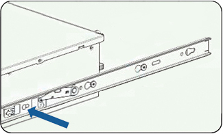

The TrueNAS® E16 expansion shelf slide rails support racks with both square and circular hole types. Set the mounting brackets into the correct position for
your rack type by pressing the button on the mounting bracket and rotating them in place, as shown in Figure 3.3g. The square rack style brackets are the
default. The circular hole style is the one with a flat surface and screw holes.

**Figure 3.3g: Rotate Rackmount Bracket**

Before installing, confirm that the rails included with the TrueNAS® E16 expansion shelf are long enough for your rack. Examine each rail to find the sides
labeled "Front" and "Rear". 

For racks with square holes, snap the mounting brackets into the holes at either end of the rail into the mouting holes. Make sure to install the rails with
the end labeled "Front" toward the front of the rack. Refer to Figure 3.3h for a detailed view.

**Figure 3.3h: Installing Rails in Racks with Square Holes**

For racks with round holes, secure the rails into the rack at the desired position using the eight thumbscrews included with the rails. Make sure to install
the rails with the end labeled "Front" toward the front of the rack. Refer to Figure 3.3i for a detailed view.

**Figure 3.3i: Installing Rails in Racks with Round Holes**

You are now ready to install the E16 expansion shelf into the rack.

.. warning:: two people are required to lift a TrueNAS® E16 expansion shelf.

Carefully align the TrueNAS® E16 expansion shelf inner rail with the notches in the outer rail. Once the rails are aligned, slide the appliance toward the
rack. When the appliance stops moving, move the pin-lock laches to allow the appliance to slide the rest of the way into the rack. Refer to Figure 3.3j for a
detailed view.

**Figure 3.3j: Push Expansion Shelf into Rack and Release pin-lock Latches.**

Next, install all populated drive trays into the front of the expansion shelf as shown in Figure 3.3k.

.. note:: to avoid personal injury, do not install drives into the E16 expansion shelf before racking.

**Figure 3.3k: Drive Installation Instructions**

TrueNAS® drive bays are numbered for your convenience. Intall them in the order indicated in Figure 3.3l.

**Figure 3.3l: Drive Bay Ordering**

.. index:: Connect E16 Expansion Shelf to TrueNAS Appliance

Note the labels on the SAS ports on the back of the TrueNAS® Storage Appliance and the letter label on the back of the expansion shelf. Using the included
SAS cables, connect the "In" SAS port of the top expander on the E16 expansion shelf to the SAS port with the same letter on the TrueNAS® Storage Appliance's
primary storage controller (the one in the top slot). If you have a secondary storage controller, connect the "In" SAS port of the bottom expander to the port
with the same letter on the secondary storage controller. Refer to Figure 3.3m for a detailed view.

**Example 3.3m: Connecting an E16 Expansion Shelf to a TrueNAS® Storage Appliance**

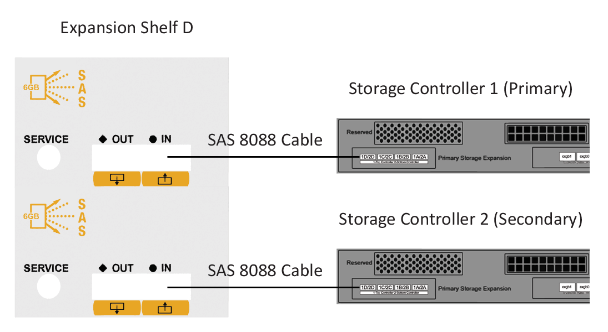

.. index:: Plug in and Power on E16 Expansion Shelf

Once all the other hardware setup steps are complete, plug the power cords into the AC receptacles on the back of the E16 expansion shelf and secure them in
place with the wire locks. Power on the E16 expansion shelf by pressing the top left button on the control panel.

If you are setting up a TrueNAS® Storage Appliance for the first time, wait two minutes after powering on all expansion shelves before turning on the
TrueNAS® Storage Appliance.

.. index:: E24 Expansion Shelf

.. _E24 Expansion Shelf:

E24 Expansion Shelf
---------------------------

The TrueNAS® E24 expansion shelf is a 4U, 24-bay storage expansion unit designed specifically for use with the TrueNAS® Storage Appliance. This section will
cover setting up an E24 expansion shelf and connecting it to a TrueNAS® Storage Appliance.

.. index:: TrueNAS E24 Expansion Shelf Contents

The E24 expansion shelf comes with a number of necessary accessories. If anything is missing or your E24 expansion shelf arrived in less than pristine
condition, immediately take pictures and contact iXsystems support.

* TrueNAS® E24 expansion shelf

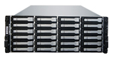

* Up to 24 populated drive trays

* Two power cables

.. image:: images/tn_power_cable.jpg

* Two host expansion cables (SAS 8088)

* One rail kit

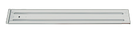

* One printed guide

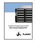

Unused drive bays will be populated with drive tray blanks to maintain proper airflow.

.. index:: TrueNAS E24 Expansion Shelf Layout

Figures 3.4a and 3.4b show the front and rear views of the TrueNAS® E24 expansion shelf.

**Figure 3.4a: Front View**

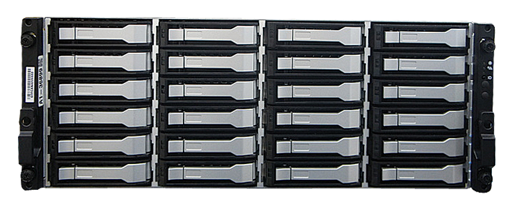

**Figure 3.4b: Rear View**

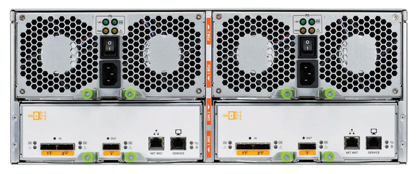

Figure 3.4c provides a detailed view of a drive tray.

**Figure 3.4c: 3.5" Drive Tray**

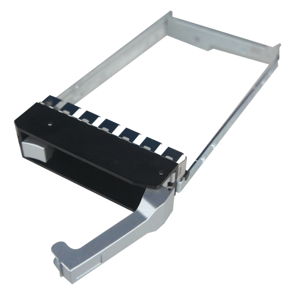

.. index:: Install E24 Expansion Shelf Rails

Two rails and three sets of screws are included in the rail kit. Use only the screws labeled for use in the type of rack you have. Take note of the engraved
rails at either end of each rail specifying whether they are for the Left (L) or Right (R) and which end is the front and which is the back. With two people,
attach each rail to the rack using the topmost and bottommost screw holes. The folded ends of the rails should be inside the corners of the rack.
Figures 3.4d and 3.4e depict the front left and rear right attachments for an L-type rack.

**Figure 3.4d: Front Left rail**

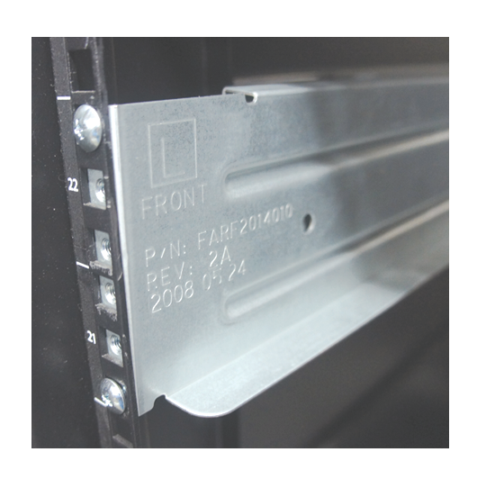

**Figure 3.4e: Rear Right rail**

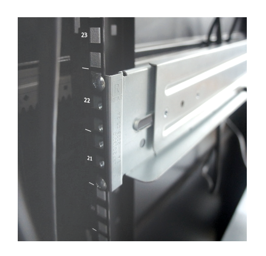

.. index:: Install E24 Expansion Shelf into Rack

Next, install the E24 expansion shelf into the rack.

.. note:: to avoid personal injury, do not install drives into the E24 expansion shelf before racking.

With two people, place the back of the expansion shelf on the rack. Gently push it backwards until the front panels of the expansion shelf are pressed against
the front of the rack.

Secure the expansion shelf to the rack by pushing down and tightening the two built-in thumbscrews as indicated in Figure 3.4f.

**Figure 3.4f: Secure E24 Expansion Shelf to the Rack.**

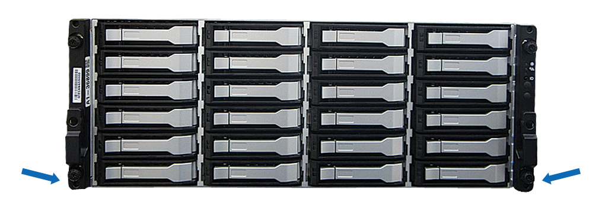

.. index:: Install Drives into the E24 Expansion Shelf

Once the E24 expansion shelf is secured into the rack, insert the included hard drives. To insert a drive, release the handle with the tab on the right side,
push it into the drive bay until the handle starts to be pulled back, and then push the handle the rest of the way forward to secure the drive in place. The
drive carriers are numbered for your convenience. Use the layout depicted in Figure 3.4g to insert the drives.

**Figure 3.4g: E24 Expansion Shelf Drive Layout**

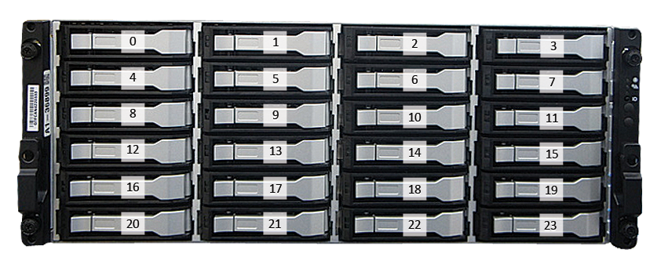

.. index:: Connect E24 Expansion Shelf to TrueNAS Appliance

To connect the E24 expansion shelf to the TrueNAS® Storage Appliance, note the labels on the SAS ports on the back of the TrueNAS® Storage Appliance and the
letter label on the back of the expansion shelf. Using the included SAS cables, connect the left "In" SAS port of the left side expander on the E24 expansion
shelf to the SAS port with the same letter on the TrueNAS® Storage Appliance's primary storage controller (the one in the top slot). If you have a secondary
storage controller, connect the left "In" SAS port of the right side expander to the port with the same letter on the secondary storage controller. Refer to
Figure 3.4h for a detailed view.

**Figure 3.4h: Example connection between E24 Expansion Shelf and TrueNAS® Storage Appliance**

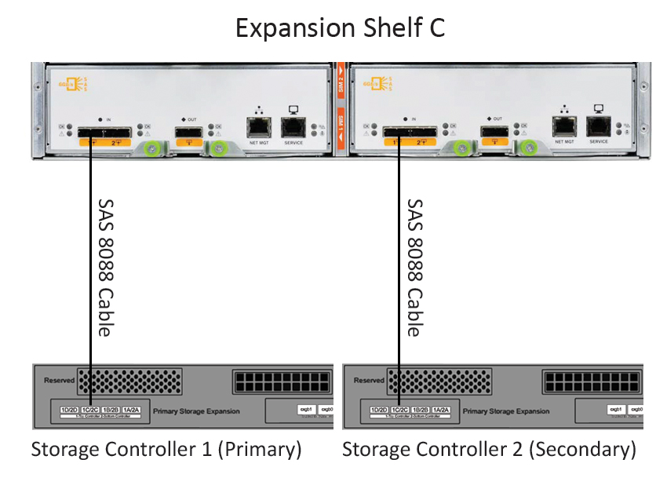

.. note:: if you only have one storage controller, retain your second SAS cable. If you later upgrade TrueNAS® with a second storage controller, you will
   need it to connect to the E24 expansion shelf.

.. index:: Plug in and Power on E24 Expansion Shelf

Before you plug in and power on the E24 expansion shelf, make sure the power switches on both power supplies are set to the Off (Circle) position shown in
Figure 3.4i. Using the power cables provided, connect both power supplies to appropriate power sources. Secure the power cables in place with the plastic
locks.

**Figure 3.4i: E24 Power Supply**

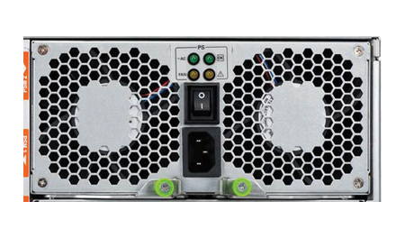

Once all the power and storage connections are set up, turn on the expansion shelf by moving the power switches on both power supplies to the On (line)
position.

If you are setting up a TrueNAS® Storage Appliance for the first time, wait two minutes after powering on all expansion shelves before turning on the
TrueNAS® Storage Appliance. 

.. index:: Out-of-Band Management

.. _Out-of-Band Management:

Out-of-Band Management
----------------------

Before attempting to configure TrueNAS® for out-of-band management, ensure that the out-of-band management port is connected to an appropriate network. Refer
to the guide included with your TrueNAS® Storage Appliance for detailed instructions on how to connect to a network.

Make sure to connect the out-of-band management port **before** powering on the TrueNAS® Storage Appliance. 

In most cases, the out-of-band management interface will have been pre-configured by iXsystems. This section contains instructions for configuring it from the
BIOS if needed. Alternately, if you have already have access to the TrueNAS® administrative graphical interface, the same settings can be configured using
the instructions in :ref:`IPMI`.

To access the system BIOS, press "F2" at the splash screen when booting the TrueNAS® Storage Appliance. This will open the menu shown in Figure 3.5a.

**Figure 3.5a: Initial BIOS Screen**

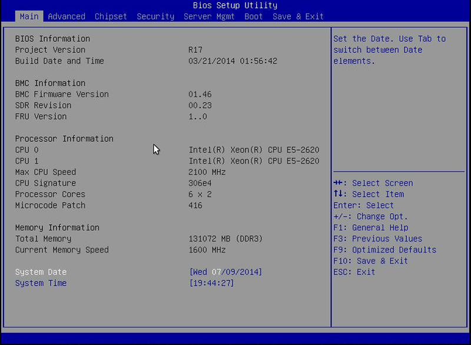
   
Navigate to the "Server Mgmt" menu and then "BMC LAN Configuration", as shown in Figure 3.5b.

**Figure 3.5b: Navigate to BMC LAN Configuration**

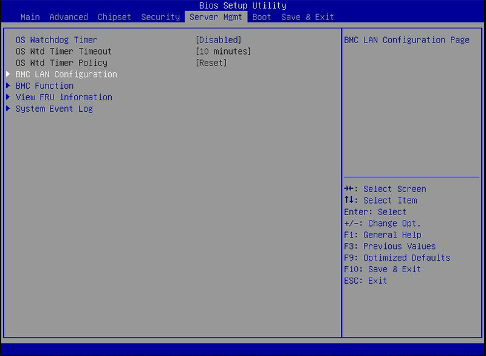
   
If you will be using DCHP to assign the out-of-band management IP address, leave the "Configuration Source" set to "Dynamic" in the screen shown in Figure
3.5c. If an IP has been assigned by DHCP, it will be displayed.

**Figure 3.5c: Configuring a Dynamic IP Address**

.. image:: images/tn_BIOS3.png

To instead assign a static IP address for out-of-band management, set the "Configuration Source" to "Static", as seen in the example shown in Figure 3.5d.
Enter the desired IP Address into the "IP Address" setting, filling out all four octets completely.

**Figure 3.5d: Configuring a Static IP Address**

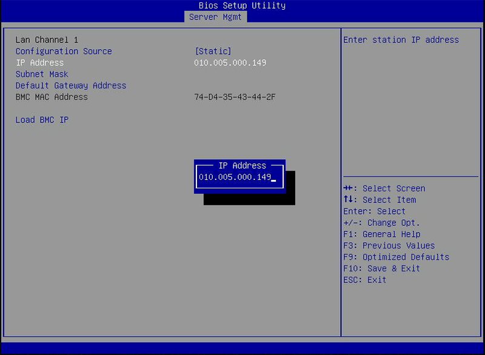
   
Next, enter the "Subnet Mask" of the subnet within which you wish to have access to out-of-band management. An example is seen in Figure 3.5e.

**Figure 3.5e: Entering the Subnet Mask**

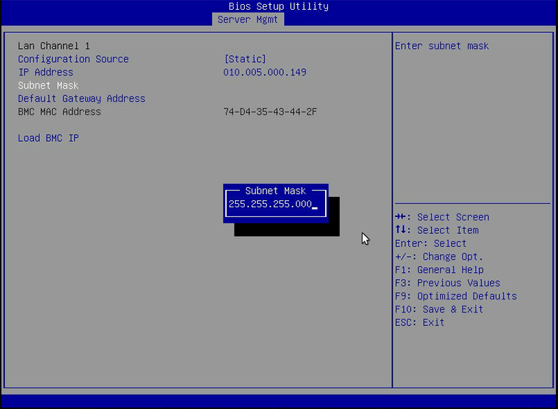

Finally, set the "Default Gateway Address" for the network to which the out-of-band management port is connected. An example is seen in Figure 3.5f.

**Figure 3.5f: Entering the Default Gateway Address**

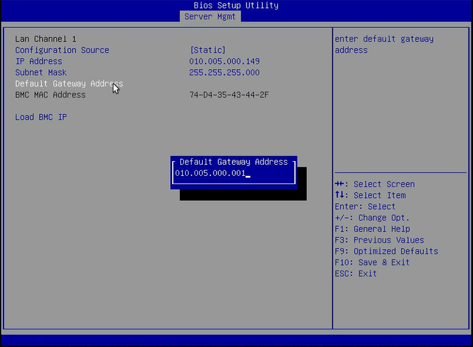

Save the changes you have made, exit the BIOS, and allow the system to boot.

To connect to the TrueNAS® Storage Appliance using the out-of-band management port, input the configured IP address into a web browser from a computer that
is either within the same network or which is directly wired to the appliance. As seen in Figure 3.5g, a login prompt will appear.

**Figure 3.5g: Connecting to the IPMI Graphical Interface**

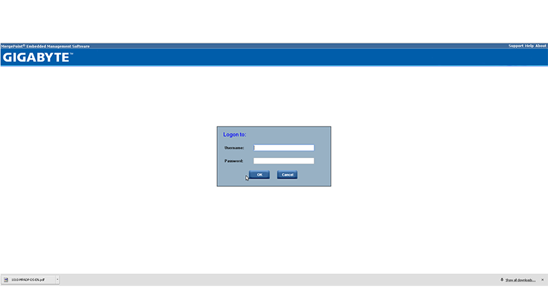

Login using the default "Username" of *admin* and the default "Password" of
*password*.

You can change the default administrative password using the instructions in :ref:`IPMI`.

Once logged in, click the "vKVM and Media" button at the top right to download the Java KVM Client. Run the client by clicking the "Launch Java KVM Client"
button shown in Figure 3.5h.

**Figure 3.5h: Launching the Java KVM Client**

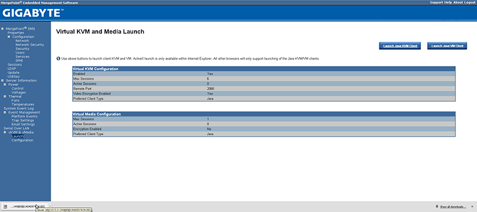

When prompted for a program to open the file with, select the Java Web Start Launcher shown in Figure 3.5i.

**Figure 3.5i: Configure the Launch Program**

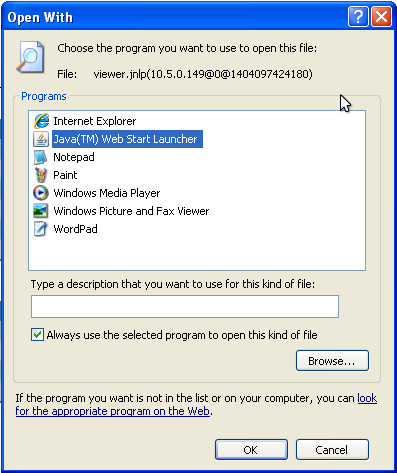

When asked if you want to run a program by an unknown publisher, check the box indicating that you understand the risks and press "Run". An example is seen in
Figure 3.5j.

**Figure 3.5j: Respond to Warning**

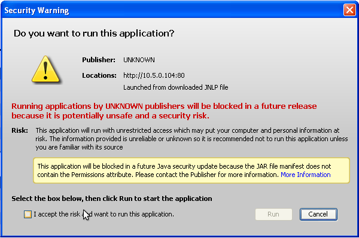

When prompted that the connection is untrusted, as seen in Figure 3.5k, press "Continue".

**Figure 3.5k: Continue Through this Screen**

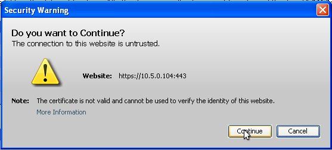

Once the out-of-band console opens, you can control the TrueNAS® Storage Appliance as if you were using a directly-connected keyboard and monitor.

.. index:: Console Setup Menu
.. _Console Setup Menu:

Console Setup Menu
------------------------------

Once you have completed setting up the hardware for the TrueNAS® Storage Appliance, boot the system. The Console Setup menu, shown in Figure 3.6a, will
appear at the end of the boot process. If you have access to the TrueNAS® system's keyboard and monitor, this Console Setup menu can be used to administer
the system should the administrative GUI become inaccessible.

.. note:: you can access the Console Setup menu from within the TrueNAS® GUI by typing :command:`/etc/netcli` from :ref:`Shell`. You can disable the Console
   Setup menu by unchecking the "Enable Console Menu" in `System --> Settings --> Advanced`.

**Figure 3.6a: TrueNAS® Console Setup Menu**

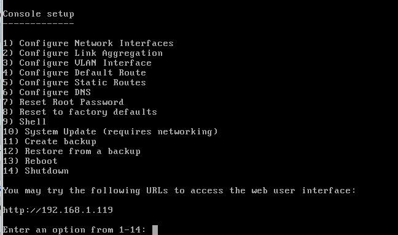

This menu provides the following options:

**1) Configure Network Interfaces:** provides a configuration wizard to configure the system's network interfaces.

**2) Configure Link Aggregation:** allows you to either create a new link aggregation or to delete an existing link aggregation.

**3) Configure VLAN Interface:** used to create or delete a VLAN interface.

**4) Configure Default Route:** used to set the IPv4 or IPv6 default gateway. When prompted, input the IP address of the default gateway.

**5) Configure Static Routes:** will prompt for the destination network and the gateway IP address. Re-enter this option for each route you need to add.

**6) Configure DNS:** will prompt for the name of the DNS domain then the IP address of the first DNS server. To input multiple DNS servers, press
:kbd:`Enter` to input the next one. When finished, press :kbd:`Enter` twice to leave this option.

**7) Reset Root Password:** if you are unable to login to the graphical administrative interface, select this option and follow the prompts to set the *root*
password.

**8) Reset to factory defaults:** if you wish to delete
**all** of the configuration changes made in the administrative GUI, select this option. Once the configuration is reset, the system will reboot. You will
need to go to :menuselection:`Storage --> Volumes --> Import Volume` to re-import your volume.

**9) Shell:** enters a shell in order to run FreeBSD commands. To leave the shell, type :command:`exit`.

**10) System Update:** if any system updates are available, they will automatically be downloaded and applied. The functionality is the same as described in
:ref:`Update`, except that the updates will be applied immediately and access to the GUI is not required.

**11) Create backup:** used to backup the TrueNAS® configuration and ZFS layout, and, optionally, the data, to a remote system over an encrypted connection.
The only requirement for the remote system is that it has sufficient space to hold the backup and it is running an SSH server on port 22. The remote system
does not have to be formatted with ZFS as the backup will be saved as a binary file. When this option is selected, it will prompt for the hostname or IP
address of the remote system, the name of a user account on the remote system, the password for that user account, the full path to a directory on the remote
system to save the backup, whether or not to also backup all of the data, whether or not to compress the data, and a confirmation to save the values, where
"y" will start the backup, "n" will repeat the configuration, and "q" will quit the backup wizard. If you leave the password empty, key-based authentication
will be used instead. This requires that the public key of the *root* user is stored in :file:`~root/.ssh/authorized_keys` on the remote system and that key
should **not** be protected by a passphrase. Refer to :ref:`Rsync over SSH Mode` for instructions on how to generate a key pair.

**12) Restore from a backup:** if a backup has already been created using "11) Create backup" or :menuselection:`System --> Advanced --> Backup`, it can be
restored using this option. Once selected, it will prompt for the hostname or IP address of the remote system holding the backup, the username that was used,
the password (leave empty if key-based authentication was used), the full path of the remote directory storing the backup, and a confirmation that the values
are correct, where "y" will start the restore, "n" will repeat the configuration, and "q" will quit the restore wizard. The restore will indicate if it could
log into the remote system, find the backup, and indicate whether or not the backup contains data. It will then prompt to restore TrueNAS® from that backup.
Note that if you press "y" to perform the restore, the system will be returned to the database configuration, ZFS layout, and optionally the data, at the
point when the backup was created. The system will reboot once the restore is complete.

.. warning:: the backup and restore options are meant for disaster recovery. If you restore a system, it will be returned to the point in time that the backup
             was created. If you select the option to save the data, any data created after the backup was made will be lost. If you do **not** select the
             option to save the data, the system will be recreated with the same ZFS layout, but with **no** data.

.. warning:: the backup function **IGNORES ENCRYPTED POOLS**. Do not use it to backup systems with encrypted pools.

**13) Reboot:** reboots the system.

**14) Shutdown:** halts the system.

During boot, TrueNAS® will automatically try to connect to a DHCP server from all live interfaces. If it successfully receives an IP address, it will display
the IP address which can be used to access the graphical console. In the example seen in Figure 3a, the TrueNAS® system is accessible from
*http://10.2.1.115*.

If your TrueNAS® server is not connected to a network with a DHCP server, you can use the network configuration wizard to manually configure the interface as
seen in Example 3.6a. In this example, the TrueNAS® system has one network interface (*em0*).

**Example 3.6a: Manually Setting an IP Address from the Console Menu**

::

 Enter an option from 1-14: 1
 1) em0
 Select an interface (q to quit): 1
 Delete existing config? (y/n) n
 Configure interface for DHCP? (y/n) n
 Configure IPv4? (y/n) y
 Interface name: (press enter as can be blank)
 Several input formats are supported
 Example 1 CIDR Notation: 192.168.1.1/24
 Example 2 IP and Netmask separate: IP: 192.168.1.1
 Netmask: 255.255.255.0, or /24 or 24
 IPv4 Address: 192.168.1.108/24
 Saving interface configuration: Ok
 Configure IPv6? (y/n) n
 Restarting network: ok
 You may try the following URLs to access the web user interface:
 http://192.168.1.108

Once the system has an IP address, input that address into a graphical web browser from a computer capable of accessing the network containing the TrueNAS®
system. You should be prompted to input the password for the *root* user, as seen in Figure 3.6b.

**Figure 3.6b: Input the Root Password**

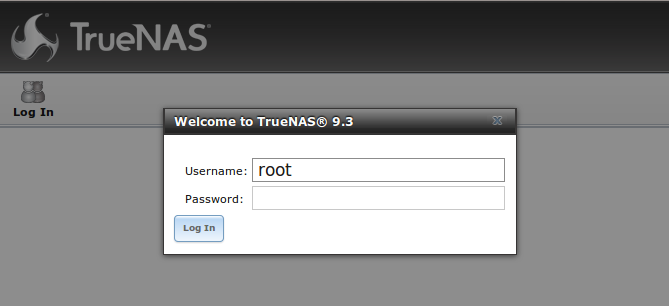

Enter the default password of *abcd1234*. You should then see the administrative GUI as shown in the example in Figure 3.6c.

.. note:: you can change the default *root* password to a more secure value by going to `Account --> Users --> View Users`. Highlight the entry for
          *root*, click the "Modify User" button, enter the new password in the "Password" and "Password confirmation" fields, and click "OK" to save the new
          password to use on subsequent logins.

**Figure 3.6c: TrueNAS® Graphical Configuration Menu**

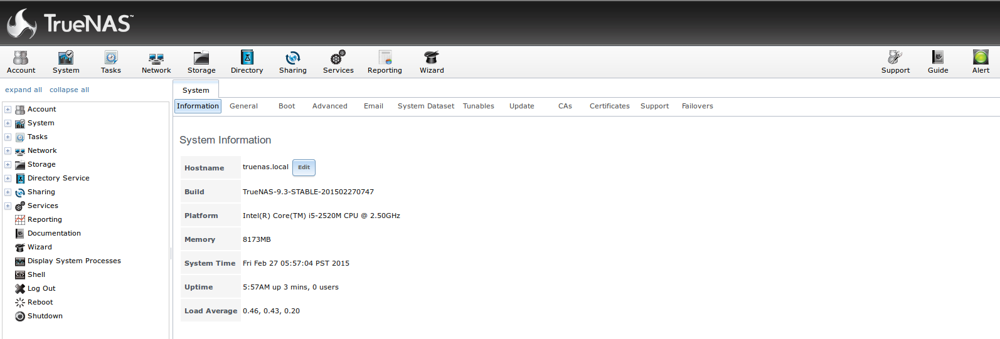

If you are unable to access the IP address from a browser, check the following:

* Are proxy settings enabled in the browser configuration? If so, disable the settings and try connecting again.

* If the page does not load, make sure that you can :command:`ping` the TrueNAS® system's IP address. If the address is in a private IP address range, you
  will only be able to access the system from within the private network.

* If the user interface loads but is unresponsive or seems to be missing menu items, try using a different web browser. IE9 has known issues and will not
  display the graphical administrative interface correctly if compatibility mode is turned on. If you can't access the GUI using Internet Explorer, use
  `Firefox <http://www.mozilla.com/en-US/firefox/all.html>`_
  instead.

* If you receive "An error occurred!" messages when attempting to configure an item in the GUI, make sure that the browser is set to allow cookies from
  the TrueNAS® system.

This
`blog post <http://fortysomethinggeek.blogspot.com/2012/10/ipad-iphone-connect-with-freenas-or-any.html>`_
describes some applications which can be used to access the TrueNAS® system from an iPad or iPhone.

.. index:: Initial Configuration Wizard, Configuration Wizard, Wizard
.. _Initial Configuration Wizard:

The rest of this Guide describes all of the configuration screens available within the TrueNAS® graphical administrative interface. The screens are listed in
the order that they appear within the tree, or the left frame of the graphical interface.

.. note:: iXsystems recommends that you contact your iXsystems Support Representative for initial setup and configuration assistance.

Once your system has been configured and you are familiar with the configuration workflow, the rest of this document can be used as a reference guide to the
features built into the TrueNAS® Storage Appliance.

.. note:: it is important to use the graphical interface (or the console setup menu) for all non-ZFS configuration changes. TrueNAS® uses a configuration
   database to store its settings. If you make changes at the command line, they will not be written to the configuration database. This means that these
   changes will not persist after a reboot and will be overwritten by the values in the configuration database during an upgrade.
