.. index:: Services
.. _Services Configuration:

Services Configuration
======================

The Services section of the GUI allows you to configure, start, and stop the various services that ship with the TrueNAS® system. TrueNAS® supports the
following built-in services:

* :ref:`AFP`

* :ref:`CIFS`

* :ref:`Domain Controller`

* :ref:`Dynamic DNS`

* :ref:`FTP`

* :ref:`iSCSI`

* :ref:`LLDP`

* :ref:`NFS`

* :ref:`Rsync`

* :ref:`S.M.A.R.T.`

* :ref:`SNMP`

* :ref:`SSH`

* :ref:`TFTP`

* :ref:`UPS`

* :ref:`WebDAV`

This section demonstrates how to start a TrueNAS® service then describes the available configuration options for each TrueNAS® service.

.. index:: Start Service, Stop Service
.. _Control Services:

Control Services
----------------

:menuselection:`Services --> Control Services`, shown in Figure 11.1a, allows you to quickly determine which services are currently running, to start and stop
services, and to configure services. By default, all services, except for the S.M.A.R.T. service, are off until you start them.

**Figure 11.1a: Control Services**

|services.png|

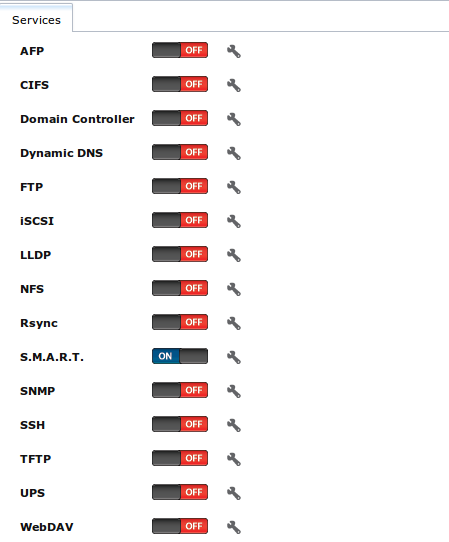

A service is stopped if its icon is a red "OFF". A service is running if its icon is a blue "ON". To start or stop a service, click its ON/OFF icon.

To configure a service, click the wrench icon associated with the service or click the name of the service in the "Services" section of the tree menu.

If a service does not start, go to :menuselection:`System --> Advanced` and check the box "Show console messages in the footer". Console messages will now
show at the bottom of your browser. If you click the console messages area, it will pop-up as a window, allowing you to scroll through the output and to copy
messages. Watch these messages for errors when you stop and start the problematic service.

If you would like to read the system logs to get more information about a service failure, open :ref:`Shell` and type :command:`more /var/log/messages`.

.. index:: AFP, Apple Filing Protocol
.. _AFP:

AFP
---

The settings that are configured when creating AFP Shares in :menuselection:`Sharing --> Apple (AFP) Shares --> Add Apple (AFP) Share` are specific to each
configured AFP Share. In contrast, global settings which apply to all AFP shares are configured in :menuselection:`Services --> AFP`.

Figure 11.2a shows the available global AFP configuration options which are described in Table 11.2a.

**Figure 11.2a: Global AFP Configuration**

|afp1a.png|

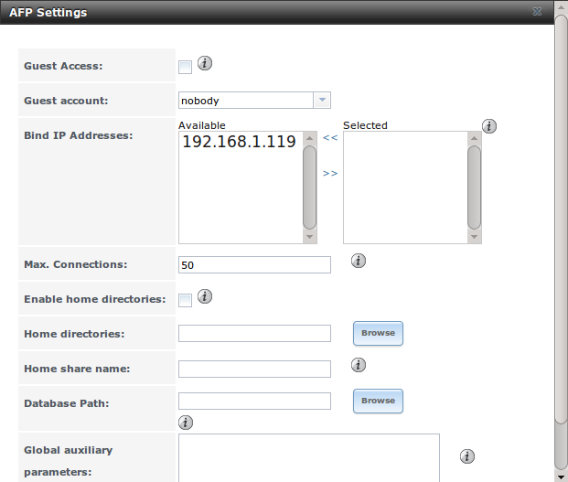

**Table 11.2a: Global AFP Configuration Options**

+-------------------------+----------------+-----------------------------------------------------------------------------------------------------------------+
| **Setting**             | **Value**      | **Description**                                                                                                 |
|                         |                |                                                                                                                 |
+=========================+================+=================================================================================================================+
| Guest Access            | checkbox       | if checked, clients will not be prompted to authenticate before accessing AFP shares                            |
|                         |                |                                                                                                                 |
+-------------------------+----------------+-----------------------------------------------------------------------------------------------------------------+
| Guest account           | drop-down menu | select account to use for guest access; the selected account must have permissions to the volume/dataset being  |
|                         |                | shared                                                                                                          |
|                         |                |                                                                                                                 |
+-------------------------+----------------+-----------------------------------------------------------------------------------------------------------------+
| Bind IP Addresses       | selection      | used to specify the IP address(es) to listen for FTP connections; highlight the desired IP address(es) in the   |
|                         |                | "Available" list and use the ">>" button to add to the "Selected" list                                          |
|                         |                |                                                                                                                 |
+-------------------------+----------------+-----------------------------------------------------------------------------------------------------------------+
| Max Connections         | integer        | maximum number of simultaneous connections                                                                      |
|                         |                |                                                                                                                 |
+-------------------------+----------------+-----------------------------------------------------------------------------------------------------------------+
| Enable home directories | checkbox       | if checked, any user home directories located under "Home directories" will be available over the share         |
|                         |                |                                                                                                                 |
+-------------------------+----------------+-----------------------------------------------------------------------------------------------------------------+
| Home directories        | browse button  | select the volume or dataset which contains user home directories                                               |
|                         |                |                                                                                                                 |
+-------------------------+----------------+-----------------------------------------------------------------------------------------------------------------+
| Home share name         | string         | overrides default home folder name with the specified value                                                     |
|                         |                |                                                                                                                 |
+-------------------------+----------------+-----------------------------------------------------------------------------------------------------------------+
| Database Path           | browse button  | select the path to store the CNID databases used by AFP (default is the root of the volume); the path must be   |
|                         |                | writable                                                                                                        |
+-------------------------+----------------+-----------------------------------------------------------------------------------------------------------------+
| Global auxiliary        | string         | additional `afp.conf(5) <http://netatalk.sourceforge.net/3.0/htmldocs/afp.conf.5.html>`_                        |
| parameters              |                | parameters not covered elsewhere in this screen                                                                 |
|                         |                |                                                                                                                 |
+-------------------------+----------------+-----------------------------------------------------------------------------------------------------------------+

When configuring home directories, it is recommended to create a dataset to hold the home directories which contains a child dataset for each user. As an
example, create a dataset named :file:`volume1/homedirs` and browse to this dataset when configuring the "Home directories" field of the AFP service. Then, as
you create each user, first create a child dataset for that user. For example, create a dataset named :file:`volume1/homedirs/user1`. When you create the
*user1* user, browse to the :file:`volume1/homedirs/user1` dataset in the "Home Directory" field of the "Add New User" screen.

.. _Troubleshooting AFP:

Troubleshooting AFP
~~~~~~~~~~~~~~~~~~~

You can determine which users are connected to an AFP share by typing :command:`afpusers`.

If you receive a "Something wrong with the volume's CNID DB" error message, run the following command from :ref:`Shell`, replacing the path to the problematic
AFP share::

 dbd -rf /path/to/share

This command may take a while, depending upon the size of the volume or dataset being shared. This command will wipe the CNID database and rebuild it from the
CNIIDs stored in the AppleDouble files.

.. index:: CIFS, Samba, Windows File Share, SMB
.. _CIFS:

CIFS
----

The settings that are configured when creating CIFS Shares in :menuselection:`Sharing --> Windows (CIFS) Shares --> Add Windows (CIFS) Share` are specific to
each configured CIFS Share. In contrast, global settings which apply to all CIFS shares are configured in :menuselection:`Services --> CIFS`.

.. note:: after starting the CIFS service, it may take several minutes for the
   `master browser election <http://www.samba.org/samba/docs/man/Samba-HOWTO-Collection/NetworkBrowsing.html#id2581357>`_
   to occur and for the TrueNAS® system to become available in Windows Explorer.

Figure 11.3a shows the global CIFS configuration options which are described in Table 11.3a. This configuration screen is really a front-end to
`smb4.conf <http://www.sloop.net/smb.conf.html>`_.

**Figure 11.3a: Global CIFS Configuration**

|cifs1.png|

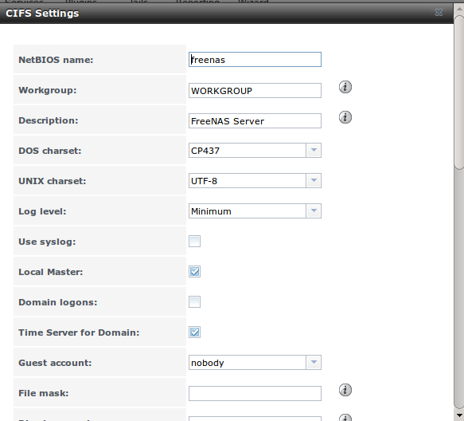

**Table 11.3a: Global CIFS Configuration Options**

+----------------------------------+----------------+-------------------------------------------------------------------------------------------------------+
| **Setting**                      | **Value**      | **Description**                                                                                       |
|                                  |                |                                                                                                       |
+==================================+================+=======================================================================================================+
| NetBIOS Name                     | string         | must be lowercase and and is automatically populated with the system's hostname; it                   |
|                                  |                | **must**  be different from the                                                                       |
|                                  |                | *Workgroup* name                                                                                      |
|                                  |                |                                                                                                       |
+----------------------------------+----------------+-------------------------------------------------------------------------------------------------------+
| Workgroup                        | string         | must match Windows workgroup name; this setting is ignored if the Active Directory or LDAP service is |
|                                  |                | running                                                                                               |
|                                  |                |                                                                                                       |
+----------------------------------+----------------+-------------------------------------------------------------------------------------------------------+
| Description                      | string         | optional                                                                                              |
|                                  |                |                                                                                                       |
+----------------------------------+----------------+-------------------------------------------------------------------------------------------------------+
| DOS charset                      | drop-down menu | the character set Samba uses when communicating with DOS and Windows 9x/ME clients; default is        |
|                                  |                | *CP437*                                                                                               |
|                                  |                |                                                                                                       |
+----------------------------------+----------------+-------------------------------------------------------------------------------------------------------+
| UNIX charset                     | drop-down menu | default is *UTF-8* which supports all characters in all languages                                     |
|                                  |                |                                                                                                       |
+----------------------------------+----------------+-------------------------------------------------------------------------------------------------------+
| Log level                        | drop-down menu | choices are *Minimum*,                                                                                |
|                                  |                | *Normal*, or                                                                                          |
|                                  |                | *Debug*                                                                                               |
|                                  |                |                                                                                                       |
+----------------------------------+----------------+-------------------------------------------------------------------------------------------------------+
| Use syslog                       | checkbox       | when checked, authentication failures are logged to :file:`/var/log/messages` instead of the default  |
|                                  |                | of :file:`/var/log/samba4/log.smbd`                                                                   |
|                                  |                |                                                                                                       |
+----------------------------------+----------------+-------------------------------------------------------------------------------------------------------+
| Local Master                     | checkbox       | determines whether or not the system participates in a browser election; should be disabled           |
|                                  |                | when network contains an AD or LDAP server and is not necessary if Vista or Windows 7 machines are    |
|                                  |                | present                                                                                               |
|                                  |                |                                                                                                       |
+----------------------------------+----------------+-------------------------------------------------------------------------------------------------------+
| Domain logons                    | checkbox       | only check if need to provide the netlogin service for older Windows clients                          |
|                                  |                |                                                                                                       |
+----------------------------------+----------------+-------------------------------------------------------------------------------------------------------+
| Time Server for Domain           | checkbox       | determines whether or not the system advertises itself as a time server to Windows clients;           |
|                                  |                | should be disabled when network contains an AD or LDAP server                                         |
|                                  |                |                                                                                                       |
+----------------------------------+----------------+-------------------------------------------------------------------------------------------------------+
| Guest Account                    | drop-down menu | account to be used for guest access; that account must have permission to access the shared           |
|                                  |                | volume/dataset                                                                                        |
|                                  |                |                                                                                                       |
+----------------------------------+----------------+-------------------------------------------------------------------------------------------------------+
| File mask                        | integer        | overrides default file creation mask of 0666 which creates files with read and write access for       |
|                                  |                | everybody                                                                                             |
|                                  |                |                                                                                                       |
+----------------------------------+----------------+-------------------------------------------------------------------------------------------------------+
| Directory mask                   | integer        | overrides default directory creation mask of 0777 which grants directory read, write and execute      |
|                                  |                | access for everybody                                                                                  |
|                                  |                |                                                                                                       |
+----------------------------------+----------------+-------------------------------------------------------------------------------------------------------+
|                                  |                |                                                                                                       |
| Allow Empty Password             | checkbox       | if checked, users can just press :kbd:`Enter` when prompted for a password; requires that the         |
|                                  |                | username/password be the same as the Windows user account                                             |
|                                  |                |                                                                                                       |
+----------------------------------+----------------+-------------------------------------------------------------------------------------------------------+
| Auxiliary parameters             | string         | :file:`smb.conf` options not covered elsewhere in this screen; see                                    |
|                                  |                | `the Samba Guide <http://oreilly.com/openbook/samba/book/appb_02.html>`_                              |
|                                  |                | for additional settings                                                                               |
|                                  |                |                                                                                                       |
+----------------------------------+----------------+-------------------------------------------------------------------------------------------------------+
| Unix Extensions                  | checkbox       | allows non-Windows CIFS clients to access symbolic links and hard links, has no effect on Windows     |
|                                  |                | clients                                                                                               |
|                                  |                |                                                                                                       |
+----------------------------------+----------------+-------------------------------------------------------------------------------------------------------+
| Zeroconf share discovery         | checkbox       | enable if Mac clients will be connecting to the CIFS share                                            |
|                                  |                |                                                                                                       |
+----------------------------------+----------------+-------------------------------------------------------------------------------------------------------+
| Hostnames lookups                | checkbox       | allows you to specify hostnames rather than IP addresses in the "Hosts Allow" or "Hosts Deny" fields  |
|                                  |                | of a CIFS share; uncheck if you only use IP addresses as it saves the time of a host lookup           |
|                                  |                |                                                                                                       |
+----------------------------------+----------------+-------------------------------------------------------------------------------------------------------+
| Server minimum protocol          | drop-down menu | the minimum protocol version the server will support where the default sets automatic                 |
|                                  |                | negotiation; refer to Table 11.3b for descriptions                                                    |
|                                  |                |                                                                                                       |
+----------------------------------+----------------+-------------------------------------------------------------------------------------------------------+
| Server maximum protocol          | drop-down menu | the maximum protocol version the server will support; refer to Table 11.3b for descriptions           |
|                                  |                |                                                                                                       |
+----------------------------------+----------------+-------------------------------------------------------------------------------------------------------+
| Allow execute always             | checkbox       | if checked, Samba will allow the user to execute a file, even if that user's permissions are not set  |
|                                  |                | to execute                                                                                            |
|                                  |                |                                                                                                       |
+----------------------------------+----------------+-------------------------------------------------------------------------------------------------------+
| Obey pam restrictions            | checkbox       | uncheck this box to allow cross-domain authentication, to allow users and groups to be managed on     |
|                                  |                | another forest, or to allow permissions to be delegated from active directory users and groups to     |
|                                  |                | domain admins on another forest                                                                       |
|                                  |                |                                                                                                       |
+----------------------------------+----------------+-------------------------------------------------------------------------------------------------------+
| Bind IP Addresses                | checkboxes     | check the IP address(es) that CIFS should listen on                                                   |
|                                  |                |                                                                                                       |
+----------------------------------+----------------+-------------------------------------------------------------------------------------------------------+
| Idmap Range Low                  | integer        | defines the beginning UID/GID this system is authoritative for; any UID/GID lower than this value is  |
|                                  |                | ignored, providing a way to avoid accidental UID/GID overlaps between local and remotely defined IDs  |
|                                  |                |                                                                                                       |
+----------------------------------+----------------+-------------------------------------------------------------------------------------------------------+
| Idmap Range High                 | integer        | defines the ending UID/GID this system is authoritative for; any UID/GID higher than this value is    |
|                                  |                | ignored, providing a way to avoid accidental UID/GID overlaps between local and remotely defined IDs  |
|                                  |                |                                                                                                       |
+----------------------------------+----------------+-------------------------------------------------------------------------------------------------------+

**Table 11.3b: Description of SMB Protocol Versions**

+----------------+------------------------------------------------------------+
| **Value**      | **Description**                                            |
|                |                                                            |
+================+============================================================+
| CORE           | used by DOS                                                |
|                |                                                            |
+----------------+------------------------------------------------------------+
| COREPLUS       | used by DOS                                                |
|                |                                                            |
+----------------+------------------------------------------------------------+
| LANMAN1        | used by Windows for Workgroups, OS/2, and Windows 9x       |
|                |                                                            |
+----------------+------------------------------------------------------------+
| LANMAN2        | used by Windows for Workgroups, OS/2, and Windows 9x       |
|                |                                                            |
+----------------+------------------------------------------------------------+
| NT1            | used by Windows NT                                         |
|                |                                                            |
+----------------+------------------------------------------------------------+
| SMB2           | used by Windows 7; same as SMB2_10                         |
|                |                                                            |
+----------------+------------------------------------------------------------+
| SMB2_02        | used by Windows Vista                                      |
|                |                                                            |
+----------------+------------------------------------------------------------+
| SMB2_10        | used by Windows 7                                          |
|                |                                                            |
+----------------+------------------------------------------------------------+
| SMB2_22        | used by early Windows 8                                    |
|                |                                                            |
+----------------+------------------------------------------------------------+
| SMB2_24        | used by Windows 8 beta                                     |
|                |                                                            |
+----------------+------------------------------------------------------------+
| SMB3           | used by Windows 8                                          |
|                |                                                            |
+----------------+------------------------------------------------------------+
| SMB3_00        | used by Windows 8, mostly the same as SMB2_24              |
|                |                                                            |
+----------------+------------------------------------------------------------+

.. note:: Windows 8.1 and Windows Server 2012 R2 use SMB3.02 which is not yet supported by Samba. 

.. note:: do not set the
   *directory name cache size* as an "Auxiliary parameter". Due to differences in how Linux and BSD handle file descriptors, directory name caching is
   disabled on BSD systems in order to improve performance.

.. _Troubleshooting CIFS:

Troubleshooting CIFS
~~~~~~~~~~~~~~~~~~~~

Windows automatically caches file sharing information. If you make changes to a CIFS share or to the permissions of a volume/dataset being shared by CIFS and
are no longer able to access the share, try logging out and back into the Windows system. Alternately, users can type :command:`net use /delete` from the
command line to clear their SMB sessions.

Windows also automatically caches login information. If you wish users to be prompted to login every time access is required, reduce the cache settings on the
client computers.

Where possible, avoid using a mix of case in filenames as this may cause confusion for Windows users.
`Representing and resolving filenames with Samba <http://oreilly.com/openbook/samba/book/ch05_04.html>`_
explains this in more detail.

If a particular user cannot connect to a CIFS share, double-check that their password does not contain the *?* character. If it does, have the user change
their password and try again.

If permissions work for Windows users but not for OS X users, try disabling "Unix Extensions" and restarting the CIFS service.

If the CIFS service will not start, run this command from :ref:`Shell` to see if there is an error in the configuration::

 testparm /usr/local/etc/smb4.conf

If clients have problems connecting to the CIFS share, go to :menuselection:`Services --> CIFS` and verify that "Server maximum protocol" is set to "SMB2".

It is recommended to use a dataset for CIFS sharing. When creating the dataset, make sure that the "Share type" is set to Windows.

**Do not** use :command:`chmod` to attempt to fix the permissions on a CIFS share as it destroys the Windows ACLs. The correct way to manage permissions on a
CIFS share is to manage the share security from a Windows system as either the owner of the share or a member of the group the share is owned by. To do so,
right-click on the share, click "Properties" and navigate to the "Security" tab. If you already destroyed the ACLs using :command:`chmod`,
:command:`winacl` can be used to fix them. Type :command:`winacl` from :ref:`Shell` for usage instructions. 

The
`Common Errors <http://www.samba.org/samba/docs/man/Samba-HOWTO-Collection/domain-member.html#id2573692>`_
section of the Samba documentation contains additional troubleshooting tips.

.. index:: Domain Controller, DC
.. _Domain Controller:

Domain Controller
-----------------

TrueNAS® can be configured to act either as the domain controller for a network or to join an existing Active Directory network as a domain controller. 

.. note:: this section demonstrates how to configure the TrueNAS® system to act as a domain controller. If your goal is to integrate with an existing Active
   Directory network in order to access its authentication and authorization services, instead configure :ref:`Active Directory`.

Be aware that configuring a domain controller is a complex process that requires a good understanding of how Active Directory works. While
:menuselection:`Services --> Domain Controller` makes it easy to input the needed settings into the administrative graphical interface, it is up to you to
understand what those settings should be. Before beginning your configuration, read through the
`Samba AD DC HOWTO <http://wiki.samba.org/index.php/Samba_AD_DC_HOWTO>`_. Once TrueNAS® is configured, use the RSAT utility from a Windows system to manage
the domain controller. The Samba AD DC HOWTO includes instructions for installing and configuring RSAT.

Figure 11.4a shows the configuration screen for creating a domain controller and Table 11.4a summarizes the available options.

**Figure 11.4a: Domain Controller Settings**

|directory1a.png|

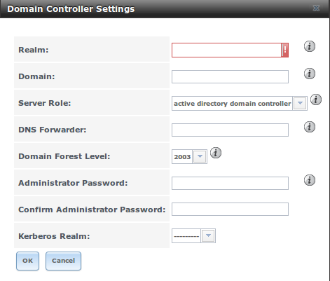

**Table 11.4a: Domain Controller Configuration Options**

+------------------------+----------------+-------------------------------------------------------------------------------------------------------------------------------------------------------------------------------------------+
| **Setting**            | **Value**      | **Description**                                                                                                                                                                           |
|                        |                |                                                                                                                                                                                           |
|                        |                |                                                                                                                                                                                           |
+========================+================+===========================================================================================================================================================================================+
| Realm                  | string         | capitalized DNS realm name                                                                                                                                                                |
|                        |                |                                                                                                                                                                                           |
+------------------------+----------------+-------------------------------------------------------------------------------------------------------------------------------------------------------------------------------------------+
| Domain                 | string         | capitalized domain name                                                                                                                                                                   |
|                        |                |                                                                                                                                                                                           |
+------------------------+----------------+-------------------------------------------------------------------------------------------------------------------------------------------------------------------------------------------+
| Server Role            | drop-down menu | at this time, the only supported role is as the domain controller for a new domain                                                                                                        |
|                        |                |                                                                                                                                                                                           |
+------------------------+----------------+-------------------------------------------------------------------------------------------------------------------------------------------------------------------------------------------+
| DNS Forwarder          | string         | IP address of DNS forwarder; required for recursive queries when *SAMBA_INTERNAL* is selected                                                                                             |
|                        |                |                                                                                                                                                                                           |
+------------------------+----------------+-------------------------------------------------------------------------------------------------------------------------------------------------------------------------------------------+
| Domain Forest Level    | drop-down menu | choices are *2000*,                                                                                                                                                                       |
|                        |                | *2003*,                                                                                                                                                                                   |
|                        |                | *2008*, or                                                                                                                                                                                |
|                        |                | *2008_R2*; refer to                                                                                                                                                                       |
|                        |                | `Understanding Active Directory Domain Services (AD DS) Functional Levels <http://technet.microsoft.com/en-us/library/understanding-active-directory-functional-levels%28WS.10%29.aspx>`_ |
|                        |                | for details                                                                                                                                                                               |
|                        |                |                                                                                                                                                                                           |
+------------------------+----------------+-------------------------------------------------------------------------------------------------------------------------------------------------------------------------------------------+
| Administrator password | string         | password to be used for the Active Directory administrator account                                                                                                                        |
|                        |                |                                                                                                                                                                                           |
+------------------------+----------------+-------------------------------------------------------------------------------------------------------------------------------------------------------------------------------------------+
| Kerberos Realm         | drop-down menu | this drop-down menu will auto-populate using the information from "Realm" when the settings in this screen are saved                                                                      |
|                        |                |                                                                                                                                                                                           |
+------------------------+----------------+-------------------------------------------------------------------------------------------------------------------------------------------------------------------------------------------+

.. index:: Dynamic DNS, DDNS
.. _Dynamic DNS:

Dynamic DNS
-----------

Dynamic DNS (DDNS) is useful if your TrueNAS® system is connected to an ISP that periodically changes the IP address of the system. With dynamic DNS, the
system can automatically associate its current IP address with a domain name, allowing you to access the TrueNAS® system even if the IP address changes. DDNS
requires you to register with a DDNS service such as
`DynDNS <http://www.dyndns.com/>`_.

Figure 11.5a shows the DDNS configuration screen and Table 11.5a summarizes the configuration options. The values you need to input will be given to you by the
DDNS provider. After configuring DDNS, don't forget to start the DDNS service in :menuselection:`Services --> Control Services`.

**Figure 11.5a: Configuring DDNS**

|ddns.png|

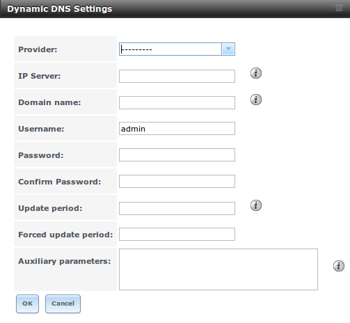

**Table 11.5a: DDNS Configuration Options**

+----------------------+----------------+--------------------------------------------------------------------------------------------------------------------+
| **Setting**          | **Value**      | **Description**                                                                                                    |
|                      |                |                                                                                                                    |
+======================+================+====================================================================================================================+
| Provider             | drop-down menu | several providers are supported; if your provider is not listed, leave this field blank and specify the custom     |
|                      |                | provider in the "Auxiliary parameters" field                                                                       |
|                      |                |                                                                                                                    |
+----------------------+----------------+--------------------------------------------------------------------------------------------------------------------+
| IP Server            | string         | can be used to specify the hostname and port of the IP check server                                                |
|                      |                |                                                                                                                    |
+----------------------+----------------+--------------------------------------------------------------------------------------------------------------------+
| Domain name          | string         | fully qualified domain name (e.g. *yourname.dyndns.org*)                                                           |
|                      |                |                                                                                                                    |
+----------------------+----------------+--------------------------------------------------------------------------------------------------------------------+
| Username             | string         | username used to logon to the provider and update the record                                                       |
|                      |                |                                                                                                                    |
+----------------------+----------------+--------------------------------------------------------------------------------------------------------------------+
| Password             | string         | password used to logon to the provider and update the record                                                       |
|                      |                |                                                                                                                    |
+----------------------+----------------+--------------------------------------------------------------------------------------------------------------------+
| Update period        | integer        | how often the IP is checked in seconds                                                                             |
+----------------------+----------------+--------------------------------------------------------------------------------------------------------------------+
| Forced update period | integer        | how often the IP should be updated, even it has not changed, in seconds                                            |
|                      |                |                                                                                                                    |
+----------------------+----------------+--------------------------------------------------------------------------------------------------------------------+
| Auxiliary parameters | string         | additional parameters passed to the provider during record update; an example of specifying a custom provider is   |
|                      |                | *dyndns_system default@provider.com*                                                                               |
|                      |                |                                                                                                                    |
+----------------------+----------------+--------------------------------------------------------------------------------------------------------------------+

.. index:: FTP, File Transfer Protocol
.. _FTP:

FTP
---

TrueNAS® uses the
`proftpd <http://www.proftpd.org/>`_
FTP server to provide FTP services. Once the FTP service is configured and started, clients can browse and download data using a web browser or FTP client
software. The advantage of FTP is that easy-to-use cross-platform utilities are available to manage uploads to and downloads from the TrueNAS® system. The
disadvantage of FTP is that it is considered to be an insecure protocol, meaning that it should not be used to transfer sensitive files. If you are concerned
about sensitive data, see Encrypting FTP.

This section provides an overview of the FTP configuration options. It then provides examples for configuring anonymous FTP, specified user access within a
chroot environment, encrypting FTP connections, and troubleshooting tips.

Figure 11.6a shows the configuration screen for :menuselection:`Services --> FTP`. Some settings are only available in "Advanced Mode". To see these settings,
either click the "Advanced Mode" button or configure the system to always display these settings by checking the box "Show advanced fields by default" in
:menuselection:`System --> Advanced`.

**Figure 11.6a: Configuring FTP**

|ftp1.png|

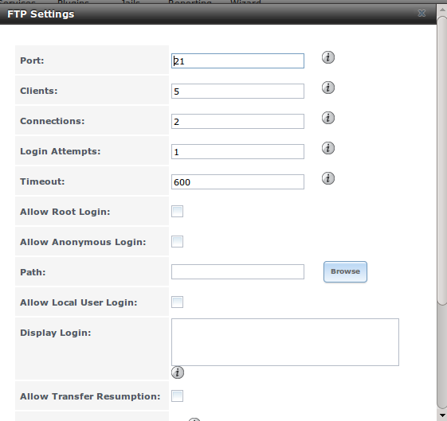

Table 11.6a summarizes the available options when configuring the FTP server:

**Table 11.6a: FTP Configuration Options**

+--------------------------------------------------------------+----------------+-------------------------------------------------------------------------------------+
| **Setting**                                                  | **Value**      | **Description**                                                                     |
|                                                              |                |                                                                                     |
+==============================================================+================+=====================================================================================+
| Port                                                         | integer        | port the FTP service listens on                                                     |
|                                                              |                |                                                                                     |
+--------------------------------------------------------------+----------------+-------------------------------------------------------------------------------------+
| Clients                                                      | integer        | maximum number of simultaneous clients                                              |
|                                                              |                |                                                                                     |
+--------------------------------------------------------------+----------------+-------------------------------------------------------------------------------------+
| Connections                                                  | integer        | maximum number of connections per IP address where *0* means unlimited              |
|                                                              |                |                                                                                     |
+--------------------------------------------------------------+----------------+-------------------------------------------------------------------------------------+
| Login Attempts                                               | integer        | maximum number of attempts before client is disconnected; increase this if          |
|                                                              |                | users are prone to typos                                                            |
|                                                              |                |                                                                                     |
+--------------------------------------------------------------+----------------+-------------------------------------------------------------------------------------+
| Timeout                                                      | integer        | maximum client idle time in seconds before client is disconnected                   |
|                                                              |                |                                                                                     |
+--------------------------------------------------------------+----------------+-------------------------------------------------------------------------------------+
| Allow Root Login                                             | checkbox       | discouraged as increases security risk                                              |
|                                                              |                |                                                                                     |
+--------------------------------------------------------------+----------------+-------------------------------------------------------------------------------------+
| Allow Anonymous Login                                        | checkbox       | enables anonymous FTP logins with access to the directory specified in              |
|                                                              |                | "Path"                                                                              |
|                                                              |                |                                                                                     |
+--------------------------------------------------------------+----------------+-------------------------------------------------------------------------------------+
| Path                                                         | browse button  | root directory for anonymous FTP connections                                        |
|                                                              |                |                                                                                     |
+--------------------------------------------------------------+----------------+-------------------------------------------------------------------------------------+
| Allow Local User Login                                       | checkbox       | required if "Anonymous Login" is disabled                                           |
|                                                              |                |                                                                                     |
+--------------------------------------------------------------+----------------+-------------------------------------------------------------------------------------+
| Display Login                                                | string         | message displayed to local login users after authentication; not displayed          |
|                                                              |                | to anonymous login users                                                            |
|                                                              |                |                                                                                     |
+--------------------------------------------------------------+----------------+-------------------------------------------------------------------------------------+
| File Permission                                              | checkboxes     | only available in "Advanced Mode"; sets default permissions for newly created       |
|                                                              |                | files                                                                               |
|                                                              |                |                                                                                     |
+--------------------------------------------------------------+----------------+-------------------------------------------------------------------------------------+
| Directory Permission                                         | checkboxes     | only available in "Advanced Mode"; sets default permissions for newly created       |
|                                                              |                | directories                                                                         |
|                                                              |                |                                                                                     |
+--------------------------------------------------------------+----------------+-------------------------------------------------------------------------------------+
| Enable                                                       | checkbox       | only available in "Advanced Mode"; enables File eXchange Protocol which is          |
| `FXP <http://en.wikipedia.org/wiki/File_eXchange_Protocol>`_ |                | discouraged as it makes the server vulnerable to FTP bounce attacks                 |
|                                                              |                |                                                                                     |
+--------------------------------------------------------------+----------------+-------------------------------------------------------------------------------------+
| Allow Transfer Resumption                                    | checkbox       | allows FTP clients to resume interrupted transfers                                  |
|                                                              |                |                                                                                     |
+--------------------------------------------------------------+----------------+-------------------------------------------------------------------------------------+
| Always Chroot                                                | checkbox       | a local user is only allowed access to their home directory unless the user         |
|                                                              |                | is a member of group *wheel*                                                        |
|                                                              |                |                                                                                     |
+--------------------------------------------------------------+----------------+-------------------------------------------------------------------------------------+
| Require IDENT Authentication                                 | checkbox       | only available in "Advanced Mode"; will result in timeouts if :command:`identd` is  |
|                                                              |                | not running on the client                                                           |
|                                                              |                |                                                                                     |
+--------------------------------------------------------------+----------------+-------------------------------------------------------------------------------------+
| Perform Reverse DNS Lookups                                  | checkbox       | perform reverse DNS lookups on client IPs; can cause long delays if reverse         |
|                                                              |                | DNS is not configured                                                               |
|                                                              |                |                                                                                     |
+--------------------------------------------------------------+----------------+-------------------------------------------------------------------------------------+
| Masquerade address                                           | string         | public IP address or hostname; set if FTP clients can not connect through a         |
|                                                              |                | NAT device                                                                          |
|                                                              |                |                                                                                     |
+--------------------------------------------------------------+----------------+-------------------------------------------------------------------------------------+
| Minimum passive port                                         | integer        | only available in "Advanced Mode"; used by clients in PASV mode, default of *0*     |
|                                                              |                | means any port above 1023                                                           |
|                                                              |                |                                                                                     |
+--------------------------------------------------------------+----------------+-------------------------------------------------------------------------------------+
| Maximum passive port                                         | integer        | only available in "Advanced Mode"; used by clients in PASV mode, default of *0*     |
|                                                              |                | means any port above 1023                                                           |
|                                                              |                |                                                                                     |
+--------------------------------------------------------------+----------------+-------------------------------------------------------------------------------------+
| Local user upload bandwidth                                  | integer        | only available in "Advanced Mode"; in KB/s, default of *0* means unlimited          |
|                                                              |                |                                                                                     |
+--------------------------------------------------------------+----------------+-------------------------------------------------------------------------------------+
| Local user download bandwidth                                | integer        | only available in "Advanced Mode"; in KB/s, default of *0* means unlimited          |
|                                                              |                |                                                                                     |
+--------------------------------------------------------------+----------------+-------------------------------------------------------------------------------------+
| Anonymous user upload bandwidth                              | integer        | only available in "Advanced Mode"; in KB/s, default of *0* means unlimited          |
|                                                              |                |                                                                                     |
+--------------------------------------------------------------+----------------+-------------------------------------------------------------------------------------+
| Anonymous user download bandwidth                            | integer        | only available in "Advanced Mode"; in KB/s, default of *0*  means unlimited         |
|                                                              |                |                                                                                     |
+--------------------------------------------------------------+----------------+-------------------------------------------------------------------------------------+
| Enable TLS                                                   | checkbox       | only available in "Advanced Mode"; enables encrypted connections and requires a     |
|                                                              |                | certificate to be created or imported using :ref:`Certificates`                     |
|                                                              |                |                                                                                     |
+--------------------------------------------------------------+----------------+-------------------------------------------------------------------------------------+
| TLS policy                                                   | drop-down menu | only available in "Advanced Mode"; the selected policy defines whether the          |
|                                                              |                | control channel, data channel, both channels, or neither channel, of an FTP         |
|                                                              |                | session must occur over SSL/TLS; the policies are described                         |
|                                                              |                | `here <http://www.proftpd.org/docs/directives/linked/config_ref_TLSRequired.html>`_ |
|                                                              |                |                                                                                     |
+--------------------------------------------------------------+----------------+-------------------------------------------------------------------------------------+
| TLS allow client renegotiations                              | checkbox       | only available in "Advanced Mode"; checking this box is **not** recommended as      |
|                                                              |                | it breaks several security measures; for this and the rest of the TLS fields,       |
|                                                              |                | refer to                                                                            |
|                                                              |                | `mod_tls <http://www.proftpd.org/docs/contrib/mod_tls.html>`_                       |
|                                                              |                | for more details                                                                    |
|                                                              |                |                                                                                     |
+--------------------------------------------------------------+----------------+-------------------------------------------------------------------------------------+
| TLS allow dot login                                          | checkbox       | only available in "Advanced Mode"; if checked, the user's home directory is         |
|                                                              |                | checked for a :file:`.tlslogin` file which contains one or more PEM-encoded         |
|                                                              |                | certificates; if not found, the user will be prompted for password                  |
|                                                              |                | authentication                                                                      |
|                                                              |                |                                                                                     |
+--------------------------------------------------------------+----------------+-------------------------------------------------------------------------------------+
| TLS allow per user                                           | checkbox       | only available in "Advanced Mode"; if checked, the user's password may be sent      |
|                                                              |                | unencrypted                                                                         |
|                                                              |                |                                                                                     |
+--------------------------------------------------------------+----------------+-------------------------------------------------------------------------------------+
| TLS common name required                                     | checkbox       | only available in "Advanced Mode"; if checked, the common name in the               |
|                                                              |                | certificate must match the FQDN of the host                                         |
|                                                              |                |                                                                                     |
+--------------------------------------------------------------+----------------+-------------------------------------------------------------------------------------+
| TLS enable diagnostics                                       | checkbox       | only available in "Advanced Mode"; if checked when troubleshooting a                |
|                                                              |                | connection, will log more verbosely                                                 |
|                                                              |                |                                                                                     |
+--------------------------------------------------------------+----------------+-------------------------------------------------------------------------------------+
| TLS export certificate data                                  | checkbox       | only available in "Advanced Mode"; if checked, exports the certificate              |
|                                                              |                | environment variables                                                               |
|                                                              |                |                                                                                     |
+--------------------------------------------------------------+----------------+-------------------------------------------------------------------------------------+
| TLS no certificate request                                   | checkbox       | only available in "Advanced Mode"; try checking this box if the client can not      |
|                                                              |                | connect and you suspect that the client software is not properly handling           |
|                                                              |                | the server's certificate request                                                    |
|                                                              |                |                                                                                     |
+--------------------------------------------------------------+----------------+-------------------------------------------------------------------------------------+
| TLS no empty fragments                                       | checkbox       | only available in "Advanced Mode"; checking this box is **not**                     |
|                                                              |                | recommended as it bypasses a security mechanism                                     |
|                                                              |                |                                                                                     |
+--------------------------------------------------------------+----------------+-------------------------------------------------------------------------------------+
| TLS no session reuse required                                | checkbox       | only available in "Advanced Mode"; checking this box reduces the security of        |
|                                                              |                | the connection so only do so if the client does not understand reused SSL           |
|                                                              |                | sessions                                                                            |
|                                                              |                |                                                                                     |
+--------------------------------------------------------------+----------------+-------------------------------------------------------------------------------------+
| TLS export standard vars                                     | checkbox       | only available in "Advanced Mode"; if checked, sets several environment             |
|                                                              |                | variables                                                                           |
|                                                              |                |                                                                                     |
+--------------------------------------------------------------+----------------+-------------------------------------------------------------------------------------+
| TLS DNS name required                                        | checkbox       | only available in "Advanced Mode"; if checked, the client's DNS name must           |
|                                                              |                | resolve to its IP address and the cert must contain the same DNS name               |
|                                                              |                |                                                                                     |
+--------------------------------------------------------------+----------------+-------------------------------------------------------------------------------------+
| TLS IP address required                                      | checkbox       | only available in "Advanced Mode"; if checked, the client's certificate must        |
|                                                              |                | contain the IP address that matches the IP address of the client                    |
|                                                              |                |                                                                                     |
+--------------------------------------------------------------+----------------+-------------------------------------------------------------------------------------+
| Certificate                                                  | drop-down menu | the SSL certificate to be used for TLS FTP connections; to create a certificate,    |
|                                                              |                | use `System --> Certificates`                                                       |
|                                                              |                |                                                                                     |
+--------------------------------------------------------------+----------------+-------------------------------------------------------------------------------------+
| Auxiliary parameters                                         | string         | only available in "Advanced Mode"; used to add                                      |
|                                                              |                | `proftpd(8) <http://linux.die.net/man/8/proftpd>`_                                  |
|                                                              |                | parameters not covered elsewhere in this screen                                     |
|                                                              |                |                                                                                     |
+--------------------------------------------------------------+----------------+-------------------------------------------------------------------------------------+

The following example demonstrates the auxiliary parameters that will prevent all users from performing the FTP DELETE command::

 <Limit DELE>
 DenyAll
 </Limit>

.. _Anonymous FTP:

Anonymous FTP
~~~~~~~~~~~~~

Anonymous FTP may be appropriate for a small network where the TrueNAS® system is not accessible from the Internet and everyone in your internal network
needs easy access to the stored data. Anonymous FTP does not require you to create a user account for every user. In addition, passwords are not required so
you don't have to manage changed passwords on the TrueNAS® system.

To configure anonymous FTP:

#.  Give the built-in ftp user account permissions to the volume/dataset to be shared in :menuselection:`Storage --> Volumes` as follows:

    * "Owner(user)": select the built-in *ftp* user from the drop-down menu

    * "Owner(group)": select the built-in *ftp* group from the drop-down menu

    * "Mode": review that the permissions are appropriate for the share

    .. note:: for FTP, the type of client does not matter when it comes to the type of ACL. This means that you always use Unix ACLs, even if Windows clients
       will be accessing TrueNAS® via FTP.

#.  Configure anonymous FTP in :menuselection:`Services --> FTP` by setting the following attributes:

    * check the box "Allow Anonymous Login"

    * "Path": browse to the volume/dataset/directory to be shared

#.  Start the FTP service in :menuselection:`Services --> Control Services`. Click the red "OFF" button next to FTP. After a second or so, it will change to a
    blue "ON", indicating that the service has been enabled.

#.  Test the connection from a client using a utility such as
    `Filezilla <http://filezilla-project.org/>`_.

In the example shown in Figure 11.6b, a user has input the following information into the Filezilla client:

* IP address of the TrueNAS® server: *192.168.1.113*

* "Username": *anonymous*

* "Password": the email address of the user

**Figure 11.6b: Connecting Using Filezilla**

|filezilla.png|

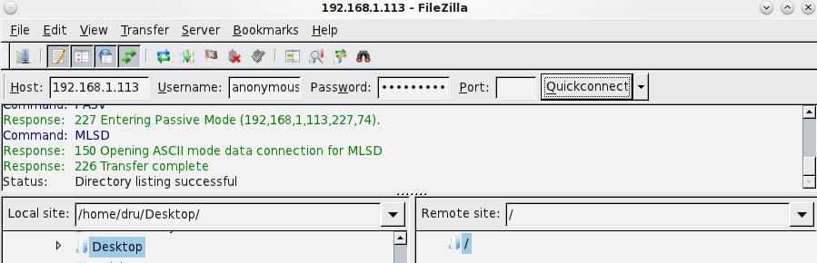

The messages within the client indicate that the FTP connection is successful. The user can now navigate the contents of the root folder on the remote
site—this is the volume/dataset that was specified in the FTP service configuration. The user can also transfer files between the local site (their system)
and the remote site (the TrueNAS® system).

.. _FTP in chroot:

FTP in chroot
~~~~~~~~~~~~~

If you require your users to authenticate before accessing the data on the TrueNAS® system, you will need to either create a user account for each user or
import existing user accounts using Active Directory or LDAP. If you then create a ZFS dataset for each user, you can chroot each user so that they are
limited to the contents of their own home directory. Datasets provide the added benefit of configuring a quota so that the size of the user's home directory
is limited to the size of the quota.

To configure this scenario:

#.  Create a ZFS dataset for each user in :menuselection:`Storage --> Volumes`. Click an existing :menuselection:`ZFS volume --> Create ZFS Dataset` and set
    an appropriate quota for each dataset. Repeat this process to create a dataset for every user that will need access to the FTP service.

#.  If you are not using AD or LDAP, create a user account for each user in :menuselection:`Account --> Users --> Add User`. For each user, browse to the
    dataset created for that user in the "Home Directory" field. Repeat this process to create a user account for every user that will need access to the FTP
    service, making sure to assign each user their own dataset.

#.  Set the permissions for each dataset in :menuselection:`Storage --> Volumes`. Click the "Change Permissions" button for a dataset to assign a user
    account as "Owner" of that dataset and to set the desired permissions for that user. Repeat for each dataset.

    .. note:: for FTP, the type of client does not matter when it comes to the type of ACL. This means that you always use Unix ACLs, even if Windows clients
       will be accessing TrueNAS® via FTP.

#.  Configure FTP in :menuselection:`Services --> FTP` with the following attributes:

    * "Path": browse to the parent volume containing the datasets

    * make sure the boxes for "Allow Anonymous Login" and "Allow Root Login" are **unchecked**

    * check the box "Allow Local User Login"

    * check the box "Always Chroot"

#.  Start the FTP service in :menuselection:`Services --> Control Services`. Click the red "OFF" button next to FTP. After a second or so, it will change to a
    blue "ON", indicating that the service has been enabled.

#.  Test the connection from a client using a utility such as Filezilla.

To test this configuration in Filezilla, use the IP address of the TrueNAS® system, the Username of a user that has been associated with a dataset, and the
Password for that user. The messages should indicate that the authorization and the FTP connection are successful. The user can now navigate the contents of
the root folder on the remote site—this time it is not the entire volume but the dataset that was created for that user. The user should be able to
transfer files between the local site (their system) and the remote site (their dataset on the TrueNAS® system).

.. _Encrypting FTP:

Encrypting FTP
~~~~~~~~~~~~~~

To configure any FTP scenario to use encrypted connections:

#.  Import or create a certificate authority using the instructions in :ref:`CAs`. Then, import or create the certificate to use for encrypted connections
    using the instructions in :ref:`Certificates`.

#.  In :menuselection:`Services --> FTP`. Check the box "Enable TLS" and select the certificate in the "Certificate" drop-down menu.

#.  Specify secure FTP when accessing the TrueNAS® system. For example, in Filezilla input *ftps://IP_address* (for an implicit connection) or
    *ftpes://IP_address* (for an explicit connection) as the Host when connecting. The first time a user connects, they should be presented with the
    certificate of the TrueNAS® system. Click "OK" to accept the certificate and negotiate an encrypted connection.

#.  To force encrypted connections, select *on* for the "TLS Policy".

.. _Troubleshooting FTP:

Troubleshooting FTP
~~~~~~~~~~~~~~~~~~~

The FTP service will not start if it can not resolve the system's hostname to an IP address using DNS. To see if the FTP service is running, open :ref:`Shell`
and issue the command::

 sockstat -4p 21

If there is nothing listening on port 21, the FTP service isn't running. To see the error message that occurs when TrueNAS® tries to start the FTP service,
go to :menuselection:`System --> Advanced`, check the box "Show console messages in the footer" and click "Save". Next, go to
:menuselection:`Services --> Control Services` and switch the FTP service off then back on in the GUI. Watch the console messages at the bottom of the browser
for errors.

If the error refers to DNS, either create an entry in your local DNS server with the TrueNAS® system's hostname and IP address or add an entry for the IP
address of the TrueNAS® system in the "Host name database" field of :menuselection:`Network --> Global Configuration`.

.. _iSCSI:

iSCSI
-----

Refer to :ref:`Block (iSCSI)` for instructions on how to configure iSCSI. To start the iSCSI service, click its entry in "Services".

.. note:: a warning message will occur if you stop the iSCSI service when initiators are connected. Type :command:`ctladm islist` to determine the names of
          the connected initiators.

.. index:: LLDP, Link Layer Discovery Protocol
.. _LLDP:

LLDP
----

The Link Layer Discovery Protocol (LLDP) is used by network devices to advertise their identity, capabilities, and neighbors on an Ethernet network. TrueNAS®
uses the `ladvd <http://http://code.google.com/p/ladvd/>`_ LLDP implementation. If your network contains managed switches, configuring and starting the LLDP
service will tell the TrueNAS® system to advertise itself on the network.

Figure 11.8a shows the LLDP configuration screen and Table 11.8a summarizes the configuration options for the LLDP service.

**Figure 11.8a: Configuring LLDP**

|lldp.png|

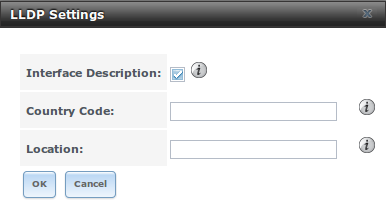

**Table 11.8a: LLDP Configuration Options**

+------------------------+------------+---------------------------------------------------------------------------------------------------------------------+
| **Setting**            | **Value**  | **Description**                                                                                                     |
|                        |            |                                                                                                                     |
+========================+============+=====================================================================================================================+
| Interface Description  | checkbox   | when checked, receive mode is enabled and received peer information is saved in interface descriptions              |
|                        |            |                                                                                                                     |
+------------------------+------------+---------------------------------------------------------------------------------------------------------------------+
| Country Code           | string     | required for LLDP location support; input 2 letter ISO 3166 country code                                            |
|                        |            |                                                                                                                     |
+------------------------+------------+---------------------------------------------------------------------------------------------------------------------+
| Location               | string     | optional; specify the physical location of the host                                                                 |
|                        |            |                                                                                                                     |
+------------------------+------------+---------------------------------------------------------------------------------------------------------------------+

.. index:: NFS, Network File System
.. _NFS:

NFS
---

The settings that are configured when creating NFS Shares in :menuselection:`Sharing --> Unix (NFS) Shares --> Add Unix (NFS) Share` are specific to each
configured NFS Share. In contrast, global settings which apply to all NFS shares are configured in :menuselection:`Services --> NFS`.

Figure 11.9a shows the configuration screen and Table 11.9a summarizes the configuration options for the NFS service.

**Figure 11.9a: Configuring NFS**

|nfs1a.png|

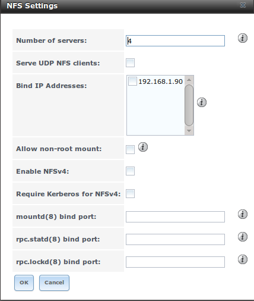

**Table 11.9a: NFS Configuration Options**

+------------------------+------------+---------------------------------------------------------------------------------------------------------------------+
| **Setting**            | **Value**  | **Description**                                                                                                     |
|                        |            |                                                                                                                     |
+========================+============+=====================================================================================================================+
| Number of servers      | integer    | run :command:`sysctl -n kern.smp.cpus` from Shell to determine the number; do not exceed the number listed in the   |
|                        |            | output of that command                                                                                              |
|                        |            |                                                                                                                     |
+------------------------+------------+---------------------------------------------------------------------------------------------------------------------+
| Serve UDP NFS clients  | checkbox   | check if NFS client needs to use UDP                                                                                |
|                        |            |                                                                                                                     |
+------------------------+------------+---------------------------------------------------------------------------------------------------------------------+
| Bind IP Addresses      | checkboxes | select the IP address(es) to listen for NFS requests; if left unchecked, NFS will listen on all available addresses |
|                        |            |                                                                                                                     |
+------------------------+------------+---------------------------------------------------------------------------------------------------------------------+
| Allow non-root mount   | checkbox   | check this box only if the NFS client requires it                                                                   |
|                        |            |                                                                                                                     |
+------------------------+------------+---------------------------------------------------------------------------------------------------------------------+
| Enable NFSv4           | checkbox   | the default is to use NFSv3, check this box to switch to NFSv4                                                      |
|                        |            |                                                                                                                     |
+------------------------+------------+---------------------------------------------------------------------------------------------------------------------+
| Require Kerberos for   | checkbox   | check this box when using Kerberos authentication with NFSv4                                                        |
| NFSv4                  |            |                                                                                                                     |
|                        |            |                                                                                                                     |
+------------------------+------------+---------------------------------------------------------------------------------------------------------------------+
| mountd(8) bind port    | integer    | optional; specify port for                                                                                          |
|                        |            | `mountd(8) <http://www.freebsd.org/cgi/man.cgi?query=mountd>`_                                                      |
|                        |            | to bind to                                                                                                          |
|                        |            |                                                                                                                     |
+------------------------+------------+---------------------------------------------------------------------------------------------------------------------+
| rpc.statd(8) bind port | integer    | optional; specify port for                                                                                          |
|                        |            | `rpc.statd(8) <http://www.freebsd.org/cgi/man.cgi?query=rpc.statd>`_                                                |
|                        |            | to bind to                                                                                                          |
|                        |            |                                                                                                                     |
+------------------------+------------+---------------------------------------------------------------------------------------------------------------------+
| rpc.lockd(8) bind port | integer    | optional; specify port for                                                                                          |
|                        |            | `rpc.lockd(8) <http://www.freebsd.org/cgi/man.cgi?query=rpc.lockd>`_                                                |
|                        |            | to bind to                                                                                                          |
|                        |            |                                                                                                                     |
+------------------------+------------+---------------------------------------------------------------------------------------------------------------------+

.. index:: Rsync
.. _Rsync:

Rsync
-----

:menuselection:`Services --> Rsync` is used to configure an rsync server when using rsync module mode. See the section on Rsync Module Mode for a
configuration example.

This section describes the configurable options for the :command:`rsyncd` service and rsync modules.

.. _Configure Rsyncd:

Configure Rsyncd
~~~~~~~~~~~~~~~~

Figure 11.10a shows the rsyncd configuration screen which is accessed from :menuselection:`Services --> Rsync --> Configure Rsyncd`.

**Figure 11.10a: Rsyncd Configuration**

|rsyncd.png|

.. |rsyncd.png| image:: images/rsyncd.png

Table 11.10a summarizes the options that can be configured for the rsync daemon:

**Table 11.10a: Rsync Configuration Options**

+----------------------+-----------+---------------------------------------------------------------------+
| **Setting**          | **Value** | **Description**                                                     |
|                      |           |                                                                     |
|                      |           |                                                                     |
+======================+===========+=====================================================================+
| TCP Port             | integer   | port for :command:`rsyncd` to listen on, default is *873*           |
|                      |           |                                                                     |
+----------------------+-----------+---------------------------------------------------------------------+
| Auxiliary parameters | string    | additional parameters from                                          |
|                      |           | `rsyncd.conf(5) <http://www.samba.org/ftp/rsync/rsyncd.conf.html>`_ |
|                      |           |                                                                     |
+----------------------+-----------+---------------------------------------------------------------------+

.. _Rsync Modules:

Rsync Modules
~~~~~~~~~~~~~

Figure 11.10b shows the configuration screen that appears when you click :menuselection:`Services --> Rsync --> Rsync Modules --> Add Rsync Module`.

Table 11.10b summarizes the options that can be configured when creating a rsync module.

**Figure 11.10b: Adding an Rsync Module**

|rsync3.png|

.. |rsync3.png| image:: images/rsync3.png

**Table 11.10b: Rsync Module Configuration Options**

+----------------------+----------------+-------------------------------------------------------------------------------+
| **Setting**          | **Value**      | **Description**                                                               |
|                      |                |                                                                               |
|                      |                |                                                                               |
+======================+================+===============================================================================+
| Module name          | string         | mandatory; needs to match the setting on the rsync client                     |
|                      |                |                                                                               |
+----------------------+----------------+-------------------------------------------------------------------------------+
| Comment              | string         | optional description                                                          |
|                      |                |                                                                               |
+----------------------+----------------+-------------------------------------------------------------------------------+
| Path                 | browse button  | volume/dataset to hold received data                                          |
|                      |                |                                                                               |
+----------------------+----------------+-------------------------------------------------------------------------------+
| Access Mode          | drop-down menu | choices are *Read and Write*,                                                 |
|                      |                | *Read-only*, or                                                               |
|                      |                | *Write-only*                                                                  |
|                      |                |                                                                               |
|                      |                |                                                                               |
+----------------------+----------------+-------------------------------------------------------------------------------+
| Maximum connections  | integer        | *0* is unlimited                                                              |
|                      |                |                                                                               |
+----------------------+----------------+-------------------------------------------------------------------------------+
| User                 | drop-down menu | select user that file transfers to and from that module should take place as  |
|                      |                |                                                                               |
+----------------------+----------------+-------------------------------------------------------------------------------+
| Group                | drop-down menu | select group that file transfers to and from that module should take place as |
|                      |                |                                                                               |
+----------------------+----------------+-------------------------------------------------------------------------------+
| Hosts allow          | string         | see                                                                           |
|                      |                | `rsyncd.conf(5) <http://www.samba.org/ftp/rsync/rsyncd.conf.html>`_           |
|                      |                | for allowed formats                                                           |
|                      |                |                                                                               |
+----------------------+----------------+-------------------------------------------------------------------------------+
| Hosts deny           | string         | see rsyncd.conf(5) for allowed formats                                        |
|                      |                |                                                                               |
+----------------------+----------------+-------------------------------------------------------------------------------+
| Auxiliary parameters | string         | additional parameters from rsyncd.conf(5)                                     |
|                      |                |                                                                               |
+----------------------+----------------+-------------------------------------------------------------------------------+

.. index:: S.M.A.R.T.
.. _S.M.A.R.T.:

S.M.A.R.T.
----------

TrueNAS® uses the
`smartd(8) <http://smartmontools.sourceforge.net/man/smartd.8.html>`_
service to monitor disk S.M.A.R.T. data for disk health. To fully configure S.M.A.R.T. you need to:

#.  Schedule when to run the S.M.A.R.T. tests in :menuselection:`Tasks --> S.M.A.R.T. Tests --> Add S.M.A.R.T. Test`.

#.  Enable or disable S.M.A.R.T. for each disk member of a volume in :menuselection:`Volumes --> View Volumes`. By default, this is already enabled on all
    disks that support S.M.A.R.T.

#.  Check the configuration of the S.M.A.R.T. service as described in this section.

#.  Start the S.M.A.R.T. service in :menuselection:`Services --> Control Services`.

Figure 11.11a shows the configuration screen that appears when you click :menuselection:`Services --> S.M.A.R.T.`

**Figure 11.11a: S.M.A.R.T Configuration Options**

|smart2.png|

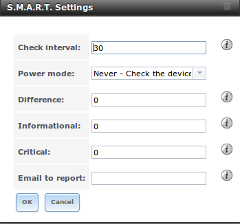

.. note:: :command:`smartd` will wake up at every configured "Check Interval". It will check the times you configured in
   :menuselection:`System --> S.M.A.R.T. Tests` to see if any tests should be run. Since the smallest time increment for a test is an hour (60 minutes), it
   does not make sense to set a "Check Interval" value higher than 60 minutes. For example, if you set the "Check Interval" for *120* minutes and the smart
   test to every hour, the test will only be run every 2 hours since the daemon only wakes up every 2 hours.

Table 11.11a summarizes the options in the S.M.A.R.T configuration screen.

**Table 11.11a: S.M.A.R.T Configuration Options**

+-----------------+----------------------------+-------------------------------------------------------------------------------------------------------------+
| **Setting**     | **Value**                  | **Description**                                                                                             |
|                 |                            |                                                                                                             |
|                 |                            |                                                                                                             |
+=================+============================+=============================================================================================================+
| Check interval  | integer                    | in minutes, how often to wake up :command:`smartd` to check to see if any tests have been configured to run |
|                 |                            |                                                                                                             |
+-----------------+----------------------------+-------------------------------------------------------------------------------------------------------------+
| Power mode      | drop-down menu             | the configured test is not performed if the system enters the specified power mode; choices are:            |
|                 |                            | *Never*,                                                                                                    |                                                       
|                 |                            | *Sleep*,                                                                                                    |                                      
|                 |                            | *Standby*, or                                                                                               |
|                 |                            | *Idle*                                                                                                      |
|                 |                            |                                                                                                             |
+-----------------+----------------------------+-------------------------------------------------------------------------------------------------------------+
| Difference      | integer in degrees Celsius | default of *0* disables this check, otherwise reports if the temperature of a drive has changed by N        |
|                 |                            | degrees Celsius since last report                                                                           |
|                 |                            |                                                                                                             |
+-----------------+----------------------------+-------------------------------------------------------------------------------------------------------------+
| Informational   | integer in degrees Celsius | default of *0* disables this check, otherwise will message with a log level of LOG_INFO if the temperature  |
|                 |                            | is higher than specified degrees in Celsius                                                                 |
|                 |                            |                                                                                                             |
+-----------------+----------------------------+-------------------------------------------------------------------------------------------------------------+
| Critical        | integer in degrees Celsius | default of *0* disables this check, otherwise will message with a log level of LOG_CRIT and send an email   |
|                 |                            | if the temperature is higher than specified degrees in Celsius                                              |
|                 |                            |                                                                                                             |
+-----------------+----------------------------+-------------------------------------------------------------------------------------------------------------+
| Email to report | string                     | email address of person or alias to receive S.M.A.R.T. alerts                                               |
|                 |                            |                                                                                                             |
+-----------------+----------------------------+-------------------------------------------------------------------------------------------------------------+

.. index:: SNMP, Simple Network Management Protocol
.. _SNMP:

SNMP
----

SNMP (Simple Network Management Protocol) is used to monitor network-attached devices for conditions that warrant administrative attention. TrueNAS® uses
`Net-SNMP <http://net-snmp.sourceforge.net/>`_ to provide SNMP. When you start the SNMP service, the following port will be enabled on the TrueNAS® system:

* UDP 161 (listens here for SNMP requests)

Available MIBS are located in :file:`/usr/local/share/snmp/mibs`.

Figure 11.12a shows the SNMP configuration screen. Table 11.12a summarizes the configuration options.

**Figure 11.12a: Configuring SNMP**

|snmp2.png|

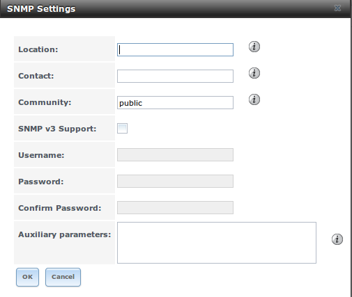

**Table 11.12a: SNMP Configuration Options**

+----------------------+------------+--------------------------------------------------------------------------------------------------+
| **Setting**          | **Value**  | **Description**                                                                                  |
|                      |            |                                                                                                  |
+======================+============+==================================================================================================+
| Location             | string     | optional description of system's location                                                        |
|                      |            |                                                                                                  |
+----------------------+------------+--------------------------------------------------------------------------------------------------+
| Contact              | string     | optional email address of administrator                                                          |
|                      |            |                                                                                                  |
+----------------------+------------+--------------------------------------------------------------------------------------------------+
| Community            | string     | password used on the SNMP network, default is *public* and                                       |
|                      |            | **should be changed for security reasons**                                                       |
|                      |            |                                                                                                  |
+----------------------+------------+--------------------------------------------------------------------------------------------------+
| SNMP v3 Support      | checkbox   | check this box to enable support for SNMP version 3                                              |
|                      |            |                                                                                                  |
+----------------------+------------+--------------------------------------------------------------------------------------------------+
| Username             | string     | only applies if "SNMP v3 Support" is checked; specify the username to register with this service |
|                      |            |                                                                                                  |
+----------------------+------------+--------------------------------------------------------------------------------------------------+
| Password             | string     | only applies if "SNMP v3 Support" is checked; specify and confirm a password of at least 8       |
|                      |            | characters                                                                                       |
+----------------------+------------+--------------------------------------------------------------------------------------------------+
| Auxiliary Parameters | string     | additional options not covered in this screen, one per line                                      |
|                      |            |                                                                                                  |
+----------------------+------------+--------------------------------------------------------------------------------------------------+

.. index:: SSH, Secure Shell
.. _SSH:

SSH
---

Secure Shell (SSH) allows for files to be transferred securely over an encrypted network. If you configure your TrueNAS® system as an SSH server, the users
in your network will need to use
`SSH  client software <http://en.wikipedia.org/wiki/Comparison_of_SSH_clients>`_ in order to transfer files using SSH.

This section shows the TrueNAS® SSH configuration options, demonstrates an example configuration that restricts users to their home directory, and provides
some troubleshooting tips.

Figure 11.13a shows the :menuselection:`Services --> SSH` configuration screen. Once you have configured SSH, don't forget to start it in
:menuselection:`Services --> Control Services`.

**Figure 11.13a: SSH Configuration**

|ssh1.png|

.. |ssh1.png| image:: images/ssh1.png

Table 11.13a summarizes the configuration options. Some settings are only available in "Advanced Mode". To see these settings, either click the "Advanced
Mode" button or configure the system to always display these settings by checking the box "Show advanced fields by default" in
:menuselection:`System --> Advanced`.

**Table 11.13a: SSH Configuration Options**

+-------------------------------+----------------+----------------------------------------------------------------------------------------------------------+
| **Setting**                   | **Value**      | **Description**                                                                                          |
|                               |                |                                                                                                          |
+===============================+================+==========================================================================================================+
| TCP Port                      | integer        | port to open for SSH connection requests; *22* by default                                                |
|                               |                |                                                                                                          |
+-------------------------------+----------------+----------------------------------------------------------------------------------------------------------+
| Login as Root with password   | checkbox       | **for security reasons, root logins are discouraged and disabled by default** if enabled, password must  |
|                               |                | be set for *root* user in "View Users"                                                                   |
|                               |                |                                                                                                          |
+-------------------------------+----------------+----------------------------------------------------------------------------------------------------------+
| Allow Password Authentication | checkbox       | if unchecked, key based authentication for all users is required; requires                               |
|                               |                | `additional setup <http://the.earth.li/%7Esgtatham/putty/0.55/htmldoc/Chapter8.html>`_                   |
|                               |                | on both the SSH client and server                                                                        |
|                               |                |                                                                                                          |
+-------------------------------+----------------+----------------------------------------------------------------------------------------------------------+
| Allow TCP Port Forwarding     | checkbox       | allows users to bypass firewall restrictions using SSH's                                                 |
|                               |                | `port forwarding feature <http://www.symantec.com/connect/articles/ssh-port-forwarding>`_                |
|                               |                |                                                                                                          |
+-------------------------------+----------------+----------------------------------------------------------------------------------------------------------+
| Compress Connections          | checkbox       | may reduce latency over slow networks                                                                    |
|                               |                |                                                                                                          |
+-------------------------------+----------------+----------------------------------------------------------------------------------------------------------+
| Host Private Key              | string         | only available in "Advanced Mode"; allows you to paste a specific host key as the default key is changed |
|                               |                | with every installation                                                                                  |
|                               |                |                                                                                                          |
+-------------------------------+----------------+----------------------------------------------------------------------------------------------------------+
| SFTP Log Level                | drop-down menu | only available in "Advanced Mode"; select the                                                            |
|                               |                | `syslog(3) <http://www.freebsd.org/cgi/man.cgi?query=syslog>`_                                           |
|                               |                | level of the SFTP server                                                                                 |
|                               |                |                                                                                                          |
+-------------------------------+----------------+----------------------------------------------------------------------------------------------------------+
| SFTP Log Facility             | drop-down menu | only available in "Advanced Mode"; select the                                                            |
|                               |                | `syslog(3) <http://www.freebsd.org/cgi/man.cgi?query=syslog>`_                                           |
|                               |                | facility of the SFTP server                                                                              |
|                               |                |                                                                                                          |
+-------------------------------+----------------+----------------------------------------------------------------------------------------------------------+
| Extra Options                 | string         | only available in "Advanced Mode"; additional                                                            |
|                               |                | `sshd_config(5) <http://www.freebsd.org/cgi/man.cgi?query=sshd_config>`_                                 |
|                               |                | options not covered in this screen, one per line; these options are case-sensitive and mis-spellings may |
|                               |                | prevent the SSH service from starting                                                                    |
|                               |                |                                                                                                          |
+-------------------------------+----------------+----------------------------------------------------------------------------------------------------------+

A few sshd_config(5) options that are useful to input in the "Extra Options" field include:

*  increase the *ClientAliveInterval* if SSH connections tend to drop

* *ClientMaxStartup* defaults to 
  *10*; increase this value if you need more concurrent SSH connections

.. index:: SCP, Secure Copy
.. _SCP Only:

SCP Only
~~~~~~~~

When you configure SSH, authenticated users with a user account created using :menuselection:`Account --> Users --> Add User` can use the :command:`ssh`
command to login to the TrueNAS® system over the network. A user's home directory will be the volume/dataset specified in the "Home Directory" field of their
TrueNAS® user account. While the SSH login will default to the user's home directory, users are able to navigate outside of their home directory which can
pose a security risk.

It is possible to allow users to use the :command:`scp` and :command:`sftp` commands to transfer files between their local computer and their home directory
on the TrueNAS® system, while restricting them from logging into the system using :command:`ssh`. To configure this scenario, go to
:menuselection:`Account --> Users --> View Users`, select the user and click "Modify User", and change the user's "Shell" to
*scponly*. Repeat for each user that needs restricted SSH access.

Test the configuration from another system by running the :command:`sftp`, :command:`ssh`, and :command:`scp` commands as the user. The :command:`sftp`
and :command:`scp` commands should work but the :command:`ssh`  should fail.

.. note:: some utilities such as WinSCP and Filezilla can bypass the scponly shell. This section assumes that users are accessing the system using the command
   line versions of :command:`scp` and :command:`sftp`.

.. _Troubleshooting SSH:

Troubleshooting SSH
~~~~~~~~~~~~~~~~~~~

If you add any "Extra Options", be aware that the keywords listed in
`sshd_config(5) <http://www.freebsd.org/cgi/man.cgi?query=sshd_config>`_
are case sensitive. This means that your configuration will fail to do what you intended if you do not match the upper and lowercase letters of the keyword.

If your clients are receiving "reverse DNS" or timeout errors, add an entry for the IP address of the TrueNAS® system in the "Host name database" field
of :menuselection:`Network --> Global Configuration`.

When configuring SSH, always test your configuration as an SSH user account to ensure that the user is limited to what you have configured and that they have
permission to transfer files within the intended directories. If the user account is experiencing problems, the SSH error messages are usually pretty specific
to what the problem is. Type the following command within :ref:`Shell` to read these messages as they occur::

 tail -f /var/log/messages

Additional messages regarding authentication errors may be found in :file:`/var/log/auth.log`.

.. index:: TFTP, Trivial File Transfer Protocol
.. _TFTP:

TFTP
----

Trivial File Transfer Protocol (TFTP) is a light-weight version of FTP usually used to transfer configuration or boot files between machines, such as routers,
in a local environment. TFTP provides an extremely limited set of commands and provides no authentication.

If the TrueNAS® system will be used to store images and configuration files for the network's devices, configure and start the TFTP service. Starting the
TFTP service will open UDP port 69.

Figure 11.14a shows the TFTP configuration screen and Table 11.14a summarizes the available options:

**Figure 11.14a: TFTP Configuration**

|tftp.png|

.. |tftp.png| image:: images/tftp.png

**Table 11.14a: TFTP Configuration Options**

+-----------------+---------------+--------------------------------------------------------------------------------------------------------------------------+
| **Setting**     | **Value**     | **Description**                                                                                                          |
|                 |               |                                                                                                                          |
+=================+===============+==========================================================================================================================+
| Directory       | browse button | browse to an **existing** directory to be used for storage; some devices require a specific directory name, refer to the |
|                 |               | device's documentation for details                                                                                       |
|                 |               |                                                                                                                          |
+-----------------+---------------+--------------------------------------------------------------------------------------------------------------------------+
| Allow New Files | checkbox      | enable if network devices need to send files to the system (e.g. backup their config)                                    |
|                 |               |                                                                                                                          |
+-----------------+---------------+--------------------------------------------------------------------------------------------------------------------------+
| Port            | integer       | UDP port to listen for TFTP requests, *69* by default                                                                    |
|                 |               |                                                                                                                          |
+-----------------+---------------+--------------------------------------------------------------------------------------------------------------------------+
| Username        | drop-down     | account used for tftp requests; must have permission to the "Directory"                                                  |
|                 | menu          |                                                                                                                          |
|                 |               |                                                                                                                          |
|                 |               |                                                                                                                          |
+-----------------+---------------+--------------------------------------------------------------------------------------------------------------------------+
| Umask           | integer       | umask for newly created files, default is *022* (everyone can read, nobody can write); some devices require a less       |
|                 |               | strict umask                                                                                                             |
|                 |               |                                                                                                                          |
+-----------------+---------------+--------------------------------------------------------------------------------------------------------------------------+
| Extra options   | string        | additional                                                                                                               |
|                 |               | `tftpd(8) <http://www.freebsd.org/cgi/man.cgi?query=tftpd>`_                                                             |
|                 |               | options not shown in this screen, one per line                                                                           |
|                 |               |                                                                                                                          |
+-----------------+---------------+--------------------------------------------------------------------------------------------------------------------------+

.. index:: UPS, Uninterruptible Power Supply
.. _UPS:

UPS
---

TrueNAS® uses
`NUT <http://www.networkupstools.org/>`_
(Network UPS Tools) to provide UPS support. If the TrueNAS® system is connected to a UPS device, configure the UPS service then start it in
:menuselection:`Services --> Control Services`.

Figure 11.15a shows the UPS configuration screen:

**Figure 11.15a: UPS Configuration Screen**

|ups.png|

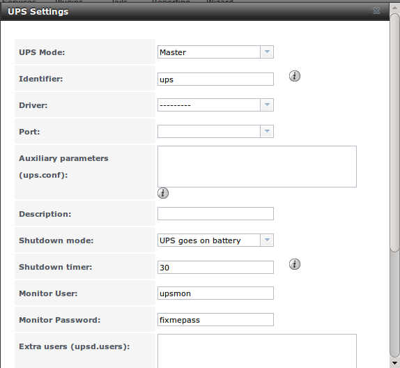

Table 11.15a summarizes the options in the UPS Configuration screen.

**Table 11.15a: UPS Configuration Options**

+---------------------------+----------------+-------------------------------------------------------------------------------------------------------+
| **Setting**               | **Value**      | **Description**                                                                                       |
|                           |                |                                                                                                       |
|                           |                |                                                                                                       |
+===========================+================+=======================================================================================================+
| UPS Mode                  | drop-down menu | select from *Master* or                                                                               |
|                           |                | *Slave*                                                                                               |
|                           |                |                                                                                                       |
+---------------------------+----------------+-------------------------------------------------------------------------------------------------------+
| Identifier                | string         | can contain alphanumeric, period, comma, hyphen, and underscore characters                            |
|                           |                |                                                                                                       |
+---------------------------+----------------+-------------------------------------------------------------------------------------------------------+
| Driver                    | drop-down menu | supported UPS devices are listed at                                                                   |
|                           |                | `http://www.networkupstools.org/stable-hcl.html <http://www.networkupstools.org/stable-hcl.html>`_    |
|                           |                |                                                                                                       |
+---------------------------+----------------+-------------------------------------------------------------------------------------------------------+
| Port                      | drop-down      | select the serial or USB port the UPS is plugged into (see  NOTE below)                               |
|                           | menu           |                                                                                                       |
|                           |                |                                                                                                       |
+---------------------------+----------------+-------------------------------------------------------------------------------------------------------+
| Auxiliary Parameters      | string         | additional options from                                                                               |
|                           |                | `ups.conf(5) <http://www.networkupstools.org/docs/man/ups.conf.html>`_                                |
|                           |                |                                                                                                       |
+---------------------------+----------------+-------------------------------------------------------------------------------------------------------+
| Description               | string         | optional                                                                                              |
|                           |                |                                                                                                       |
+---------------------------+----------------+-------------------------------------------------------------------------------------------------------+
| Shutdown mode             | drop-down menu | choices are *UPS goes on battery* and                                                                 |
|                           |                | *UPS reaches low battery*                                                                             |
|                           |                |                                                                                                       |
+---------------------------+----------------+-------------------------------------------------------------------------------------------------------+
| Shutdown timer            | integer        | in seconds; will initiate shutdown after this many seconds after UPS enters *UPS goes on battery*,    |
|                           |                | unless power is restored                                                                              |
|                           |                |                                                                                                       |
+---------------------------+----------------+-------------------------------------------------------------------------------------------------------+
| Monitor User              | string         | default is *upsmon*                                                                                   |
|                           |                |                                                                                                       |
+---------------------------+----------------+-------------------------------------------------------------------------------------------------------+
| Monitor Password          | string         | default is known value *fixmepass* and should be changed; can not contain a space or #                |
|                           |                |                                                                                                       |
+---------------------------+----------------+-------------------------------------------------------------------------------------------------------+
| Extra users               | string         | defines the accounts that have administrative access; see                                             |
|                           |                | `upsd.users(5) <http://www.networkupstools.org/docs/man/upsd.users.html>`_                            |
|                           |                | for examples                                                                                          |
|                           |                |                                                                                                       |
+---------------------------+----------------+-------------------------------------------------------------------------------------------------------+
| Remote monitor            | checkbox       | if enabled, be aware that the default is to listen on all interfaces and to use the known values user |
|                           |                | *upsmon* and password                                                                                 |
|                           |                | *fixmepass*                                                                                           |
|                           |                |                                                                                                       |
+---------------------------+----------------+-------------------------------------------------------------------------------------------------------+
| Send Email Status Updates | checkbox       | if checked, activates the "To email" field                                                            |
|                           |                |                                                                                                       |
+---------------------------+----------------+-------------------------------------------------------------------------------------------------------+
| To email                  | email address  | if "Send Email" box checked, email address of person to receive status updates                        |
|                           |                |                                                                                                       |
+---------------------------+----------------+-------------------------------------------------------------------------------------------------------+
| Email subject             | string         | if "Send Email" box checked, subject of email updates                                                 |
|                           |                |                                                                                                       |
+---------------------------+----------------+-------------------------------------------------------------------------------------------------------+

.. note:: for USB devices, the easiest way to determine the correct device name is to check the box "Show console messages" in
   :menuselection:`System --> Advanced`. Plug in the USB device and the console messages will give the name of the */dev/ugenX.X* device; where the X's are
   the numbers that show on the console.

`upsc(8) <http://www.networkupstools.org/docs/man/upsc.html>`_
can be used to get status variables from the UPS daemon such as the current charge and input voltage. It can be run from Shell using the following syntax. The
man page gives some other usage examples.
::

 upsc ups@localhost

`upscmd(8) <http://www.networkupstools.org/docs/man/upscmd.html>`_
can be used to send commands directly to the UPS, assuming that the hardware supports the command being sent. Only users with administrative rights can use
this command. These users are created in the "Extra users" field.

.. index:: WebDAV
.. _WebDAV:

WebDAV
------

In TrueNAS® 9.3, WebDAV can be configured to provide a file browser over a web connection. Before starting this service, you must create at least
one WebDAV share using :menuselection:`Sharing --> WebDAV Shares --> Add WebDAV Share`. Refer to :ref:`WebDAV Shares` for instructions on how to create a
share and then how to connect to it once the service is configured and started.

The settings in the WebDAV service apply to all WebDAV shares. Figure 11.16a shows the WebDAV configuration screen. Table 11.16a summarizes the available
options.

**Figure 11.16a: WebDAV Configuration Screen**

|webdav2.png|

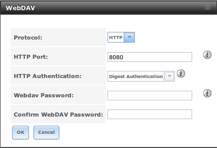

**Table 11.16a: WebDAV Configuration Options**

+---------------------------+----------------+-------------------------------------------------------------------------------------------------------+
| **Setting**               | **Value**      | **Description**                                                                                       |
|                           |                |                                                                                                       |
|                           |                |                                                                                                       |
+===========================+================+=======================================================================================================+
| Protocol                  | drop-down menu | choices are *HTTP* (connection always unencrypted),                                                   |
|                           |                | *HTTPS* (connection always encrypted), or                                                             |
|                           |                | *HTTP+HTTPS* (both types of connections allowed)                                                      |
|                           |                |                                                                                                       |
+---------------------------+----------------+-------------------------------------------------------------------------------------------------------+
| HTTP Port                 | string         | only appears if the selected "Protocol" is *HTTP* or                                                  |
|                           |                | *HTTP+HTTPS* and is used to specify the port to be used for unencrypted connections; the default      |
|                           |                | of *8080* should work, if you change it,                                                              |
|                           |                | **do not** pick a port number already being used by another service                                   |
|                           |                |                                                                                                       |
+---------------------------+----------------+-------------------------------------------------------------------------------------------------------+
| HTTPS Port                | string         | only appears if the selected "Protocol" is *HTTPS* or                                                 |
|                           |                | *HTTP+HTTPS* and is used to specify the port to be used for encrypted connections; the default        |
|                           |                | of *8081* should work, if you change it,                                                              |
|                           |                | **do not** pick a port number already being used by another service                                   |
|                           |                |                                                                                                       |
+---------------------------+----------------+-------------------------------------------------------------------------------------------------------+
| Webdav SSL Certificate    | drop-down menu | only appears if the selected "Protocol" is *HTTPS* or                                                 |
|                           |                | *HTTP+HTTPS*; select the the SSL certificate to be used for encrypted connections; to create a        |
|                           |                | certificate, use `System --> Certificates`                                                            |
|                           |                |                                                                                                       |
+---------------------------+----------------+-------------------------------------------------------------------------------------------------------+
| HTTP Authentication       | drop-down menu | choices are *Basic Authentication* (unencrypted) or                                                   |
|                           |                | *Digest Authentication* (encrypted)                                                                   |
|                           |                |                                                                                                       |
+---------------------------+----------------+-------------------------------------------------------------------------------------------------------+
| Webdav Password           | string         | default is *davtest*; this should be changed as it is a known value                                   |
|                           |                |                                                                                                       |
+---------------------------+----------------+-------------------------------------------------------------------------------------------------------+

