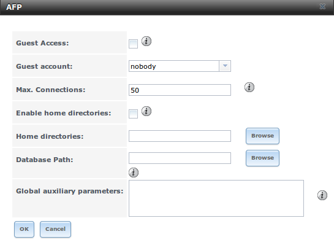
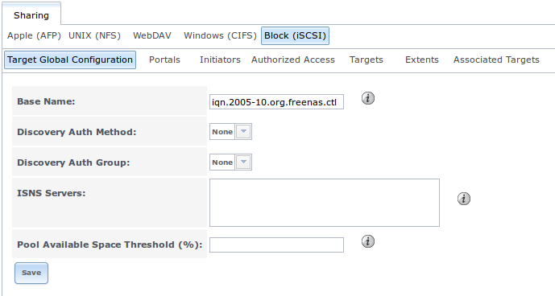
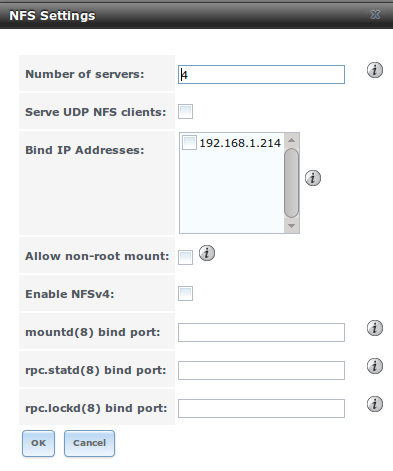
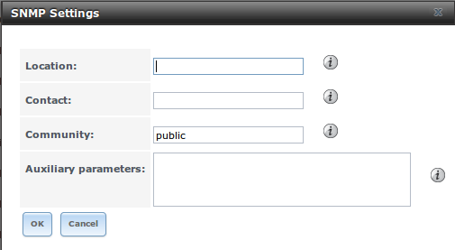

:orphan:

Services Configuration
----------------------

The Services section of the GUI allows you to configure, start, and stop the various services that ship with the TrueNAS® system. TrueNAS® supports the
following built-in services:

*   `AFP`_

*   `CIFS`_

*   `Directory Services`_

*   `Dynamic DNS`_

*   `FTP`_

*   `iSCSI`_

*   `NFS`_

*   `Rsync`_

*   `S.M.A.R.T.`_

*   `SNMP`_

*   `SSH`_

*   `TFTP`_

*   `UPS`_

This section demonstrates how to start a TrueNAS® service then describes the available configuration options for each TrueNAS® service.

Control Services
~~~~~~~~~~~~~~~~

`Services --> Control Services`, shown in Figure 10.1a, allows you to quickly determine which services are currently running, to start and stop services, and
to configure services. By default, all services (except for the S.M.A.R.T. service) are off until you start them.

A service is stopped if its icon is a red "OFF". A service is running if its icon is a blue ON. To start or stop a service, click its "ON/OFF" icon.

To configure a service, click the wrench icon associated with the service or click the name of the service in the Services section of the tree menu.

If a service does not start, go to `System --> Settings --> Advanced` and check the box "Show console messages in the footer". Console messages will now show
at the bottom of your browser. If you click the console messages area, it will pop-up as a window, allowing you to scroll through the output and to copy
messages. Watch these messages for errors when you stop and start the problematic service.

If you would like to read the system logs to get more information about a service failure, open `Shell`_ and type :command:`more /var/log/messages`.

**Figure 10.1a: Control Services**

|10000000000002110000025D33161F62_png|

.. |10000000000002110000025D33161F62_png| image:: images/control.png
    :width: 4.4453in
    :height: 5.0417in

AFP
~~~

The Apple Filing Protocol (AFP) is a network protocol that offers file services for Mac computers. Before configuring this service, you should first create
your AFP Shares in `Sharing --> Apple (AFP) Shares --> Add Apple (AFP) Share`. After configuring this service, go to `Services --> Control Services` to start
the service. The AFP shares will not be available on the network if this service is not running.

Starting this service will open the following ports on the TrueNAS® system:

*   TCP 548 (afpd)

*   TCP 4799 (cnid_metadata)

*   UDP 5353 and a random UDP port (avahi)

Figure 10.2a shows the configuration options which are described in Table 10.2a.

**Figure 10.2a: AFP Configuration**

|10000000000002DF00000198436BE488_png|

**Table 10.2a: AFP Configuration Options**

+-------------------------+----------------+-----------------------------------------------------------------------------------------------------------------+
| Setting                 | Value          | Description                                                                                                     |
|                         |                |                                                                                                                 |
+=========================+================+=================================================================================================================+
| Guest Access            | checkbox       | if checked, clients will not be prompted to authenticate before accessing the AFP share                         |
|                         |                |                                                                                                                 |
+-------------------------+----------------+-----------------------------------------------------------------------------------------------------------------+
| Guest Account           | drop-down menu | select account to use for guest access; the selected account must have permissions to the volume/dataset being  |
|                         |                | shared                                                                                                          |
|                         |                |                                                                                                                 |
+-------------------------+----------------+-----------------------------------------------------------------------------------------------------------------+
| Max Connections         | integer        | maximum number of simultaneous connections                                                                      |
|                         |                |                                                                                                                 |
+-------------------------+----------------+-----------------------------------------------------------------------------------------------------------------+
| Enable home directories | checkbox       | if checked, any user home directories located under "Home directories" will be available over the share         |
|                         |                |                                                                                                                 |
+-------------------------+----------------+-----------------------------------------------------------------------------------------------------------------+
| Home directories        | Browse button  | select the volume or dataset which contains user home directories                                               |
|                         |                |                                                                                                                 |
+-------------------------+----------------+-----------------------------------------------------------------------------------------------------------------+
| Database Path           | string         | specify the path to store the CNID databases used by AFP (default is the root of the volume); the path must be  |
|                         |                | writable                                                                                                        |
|                         |                |                                                                                                                 |
+-------------------------+----------------+-----------------------------------------------------------------------------------------------------------------+

When configuring home directories, it is recommended to create a dataset to hold the home directories which contains a child dataset for each user. As an
example, create a dataset named :file:`volume1/homedirs` and browse to this dataset when configuring the "Home directories" field of the AFP service. Then, as
you create each user, first create a child dataset for that user. For example, create a dataset named :file:`volume1/homedirs/user1`. When you create the
*user1* user, browse to the :file:`volume1/homedirs/user1` dataset in the "Home Directory" field of the "Add New User" screen.

Troubleshooting
^^^^^^^^^^^^^^^

If you receive a "Something wrong with the volume's CNID DB" error message, run the following command from `Shell`_, replacing the path to the problematic AFP
share::

 dbd -rf /path/to/share

This command may take a while, depending upon the size of the volume or dataset being shared. This command will wipe the CNID database and rebuild it from the
CNIIDs stored in the AppleDouble files.

CIFS
~~~~

The Common Internet File System (CIFS) is a network protocol that offers file services for (typically) Windows computers. Unix-like systems that provide a
`CIFS client <http://www.samba.org/samba/GUI/>`_
can also connect to CIFS shares. Before configuring this service, you should first create your CIFS shares in `Sharing --> Windows (CIFS) Shares
--> Add Windows (CIFS) Share`. After configuring this service, go to Services --> Control Services to start the service. The CIFS shares will not be available
on the network if this service is not running.

.. note:: after starting the CIFS service, it may take several minutes for the
   `master browser election <http://www.samba.org/samba/docs/man/Samba-HOWTO-Collection/NetworkBrowsing.html#id2581357>`_
   to occur and for the TrueNAS® system to become available in Windows Explorer.

Starting this service will open the following ports on the TrueNAS® system:

*   TCP 139 (smbd)

*   TCP 445 (smbd)

*   UDP 137 (nmbd)

*   UDP 138 (nmbd)

Figure 10.3a shows the configuration options which are described in Table 10.3a. This configuration screen is really a front-end to :file:`smb4.conf`.

**Figure 10.3a: Configuring CIFS**

|10000000000003690000025CBE7403B2_png|

.. |10000000000003690000025CBE7403B2_png| image:: images/cifs1.png
    :width: 6.9252in
    :height: 4.7508in

**Table 10.3a: CIFS Configuration Options**

+----------------------------------+----------------+--------------------------------------------------------------------------------------------------------+
| Setting                          | Value          | Description                                                                                            |
|                                  |                |                                                                                                        |
+==================================+================+========================================================================================================+
| NetBIOS Name                     | string         | must be lowercase and and is automatically populated with the hostname of the TrueNAS® system; it     |
|                                  |                | **must** be different from the "Workgroup" name                                                        |
|                                  |                |                                                                                                        |
+----------------------------------+----------------+--------------------------------------------------------------------------------------------------------+
| Workgroup                        | string         | must match Windows workgroup name; this setting is ignored if the Active Directory or LDAP service is  |
|                                  |                | running                                                                                                |
|                                  |                |                                                                                                        |
+----------------------------------+----------------+--------------------------------------------------------------------------------------------------------+
| Description                      | string         | optional                                                                                               |
|                                  |                |                                                                                                        |
+----------------------------------+----------------+--------------------------------------------------------------------------------------------------------+
| DOS Charset                      | drop-down menu | the character set Samba uses when communicating with DOS and Windows 9x/ME clients; default is         |
|                                  |                | *CP437*                                                                                                |
|                                  |                |                                                                                                        |
+----------------------------------+----------------+--------------------------------------------------------------------------------------------------------+
| UNIX Charset                     | drop-down menu | default is *UTF-8* which supports all characters in all languages                                      |
|                                  |                |                                                                                                        |
+----------------------------------+----------------+--------------------------------------------------------------------------------------------------------+
| Log Level                        | drop-down menu | choices are *Minimum*,                                                                                 |
|                                  |                | *Normal*,                                                                                              |
|                                  |                | *Full*, or                                                                                             |
|                                  |                | *Debug*                                                                                                |
|                                  |                |                                                                                                        |
+----------------------------------+----------------+--------------------------------------------------------------------------------------------------------+
| Use syslog                       | checkbox       | logs most events to syslog instead of the samba log files                                              |
|                                  |                |                                                                                                        |
+----------------------------------+----------------+--------------------------------------------------------------------------------------------------------+
| Local Master                     | checkbox       | determines whether or not the TrueNAS® system participates in a browser election; should be           |
|                                  |                | disabled when network contains an AD or LDAP server and is not necessary if Vista or Windows           |
|                                  |                | 7 machines are present                                                                                 |
|                                  |                |                                                                                                        |
+----------------------------------+----------------+--------------------------------------------------------------------------------------------------------+
| Time Server for Domain           | checkbox       | determines whether or not the TrueNAS® system advertises itself as a time server to Windows clients;  |
|                                  |                | should be disabled when network contains an AD or LDAP server                                          |
|                                  |                |                                                                                                        |
+----------------------------------+----------------+--------------------------------------------------------------------------------------------------------+
| Guest Account                    | drop-down menu | account to be used for guest access; that account must have permission to access the shared            |
|                                  |                | volume/dataset                                                                                         |
|                                  |                |                                                                                                        |
+----------------------------------+----------------+--------------------------------------------------------------------------------------------------------+
| File mask                        | integer        | overrides default file creation mask of 0666 which creates files with read and write access for        |
|                                  |                | everybody                                                                                              |
|                                  |                |                                                                                                        |
+----------------------------------+----------------+--------------------------------------------------------------------------------------------------------+
| Directory mask                   | integer        | overrides default directory creation mask of 0777 which grants directory read, write and execute       |
|                                  |                | access for everybody                                                                                   |
|                                  |                |                                                                                                        |
+----------------------------------+----------------+--------------------------------------------------------------------------------------------------------+
| Allow Empty Password             | checkbox       | if checked, users can just press enter when prompted for a password; requires that the                 |
|                                  |                | username/password be the same for the TrueNAS® user account and the Windows user account              |
|                                  |                |                                                                                                        |
+----------------------------------+----------------+--------------------------------------------------------------------------------------------------------+
| Auxiliary parameters             | string         | :file:`smb4.conf`options not covered elsewhere in this screen                                          |
|                                  |                |                                                                                                        |
+----------------------------------+----------------+--------------------------------------------------------------------------------------------------------+
| Enable home directories          | checkbox       | if checked, a folder with the same name as the user account will be created for each user              |
|                                  |                |                                                                                                        |
+----------------------------------+----------------+--------------------------------------------------------------------------------------------------------+
| Enable home directories browsing | checkbox       | users can browse (but not write to) other users' home directories                                      |
|                                  |                |                                                                                                        |
+----------------------------------+----------------+--------------------------------------------------------------------------------------------------------+
| Home directories                 | browse button  | select volume/dataset where the home directories will be created                                       |
|                                  |                |                                                                                                        |
+----------------------------------+----------------+--------------------------------------------------------------------------------------------------------+
| Homes auxiliary parameters       | string         | options specific to the [homes] section of :file:`smb4.conf`; for example, *hide dot files = yes*      |
|                                  |                | hides files beginning with a dot in home directories                                                   |
|                                  |                |                                                                                                        |
+----------------------------------+----------------+--------------------------------------------------------------------------------------------------------+
| Unix Extensions                  | checkbox       | allows non-Windows CIFS clients to access symbolic links and hard links, has no affect on Windows      |
|                                  |                | clients                                                                                                |
|                                  |                |                                                                                                        |
+----------------------------------+----------------+--------------------------------------------------------------------------------------------------------+
| Zeroconf share discovery         | checkbox       | enable if Mac clients will be connecting to the CIFS share                                             |
|                                  |                |                                                                                                        |
+----------------------------------+----------------+--------------------------------------------------------------------------------------------------------+
| Hostnames lookups                | checkbox       | allows you to specify hostnames rather than IP addresses in the "Hosts Allow" or "Hosts Deny" fields   |
|                                  |                | of a CIFS share; uncheck if you only use IP addresses as it saves the time of a host lookup            |
|                                  |                |                                                                                                        |
+----------------------------------+----------------+--------------------------------------------------------------------------------------------------------+
| Server minimum protocol          | drop-down menu | the minimum protocol version the server will support where the default of *------* sets                |
|                                  |                | automatic negotiation; refer to Table 10.3b for descriptions                                           |
|                                  |                |                                                                                                        |
+----------------------------------+----------------+--------------------------------------------------------------------------------------------------------+
| Server maximum protocol          | drop-down menu | the maximum protocol version the server will support; refer to Table 10.3b for descriptions            |
|                                  |                |                                                                                                        |
+----------------------------------+----------------+--------------------------------------------------------------------------------------------------------+
| Allow execute always             | checkbox       | if checked, Samba will allow the user to execute a file, even if that user's permissions are not set   |
|                                  |                | to execute                                                                                             |
|                                  |                |                                                                                                        |
+----------------------------------+----------------+--------------------------------------------------------------------------------------------------------+

**Table 10.3b: Description of SMB Protocol Versions**

+-----------+------------------------------------------------------+
| **Value** | **Description**                                      |
|           |                                                      |
+===========+======================================================+
| CORE      | used by DOS                                          |
|           |                                                      |
+-----------+------------------------------------------------------+
| COREPLUS  | used by DOS                                          |
|           |                                                      |
+-----------+------------------------------------------------------+
| LANMAN1   | used by Windows for Workgroups, OS/2, and Windows 9x |
|           |                                                      |
+-----------+------------------------------------------------------+
| LANMAN2   | used by Windows for Workgroups, OS/2, and Windows 9x |
|           |                                                      |
+-----------+------------------------------------------------------+
| NT1       | used by Windows NT                                   |
|           |                                                      |
+-----------+------------------------------------------------------+
| SMB2      | used by Windows 7; same as "SMB2_10"                 |
|           |                                                      |
+-----------+------------------------------------------------------+
| SMB2_02   | used by Windows Vista                                |
|           |                                                      |
+-----------+------------------------------------------------------+
| SMB2_10   | used by Windows 7                                    |
|           |                                                      |
+-----------+------------------------------------------------------+
| SMB2_22   | used by early Windows 8                              |
|           |                                                      |
+-----------+------------------------------------------------------+
| SMB2_24   | used by Windows 8 beta                               |
|           |                                                      |
+-----------+------------------------------------------------------+
| SMB3      | used by Windows 8                                    |
|           |                                                      |
+-----------+------------------------------------------------------+
| SMB3_00   | used by Windows 8, mostly the same as "SMB2_24"      |
|           |                                                      |
+-----------+------------------------------------------------------+

.. note:: Windows 8.1 and Windows Server 2012 R2 use SMB3.02 which is not yet supported by Samba.

Troubleshooting Tips
^^^^^^^^^^^^^^^^^^^^

Windows automatically caches file sharing information. If you make changes to a CIFS share or to the permissions of a volume/dataset being shared by CIFS and
are no longer able to access the share, try logging out and back into the Windows system. Alternately, users can type :command:`net use /delete` from the
command line to clear their SMB sessions.

Windows also automatically caches login information. If you wish users to be prompted to login every time access is required, reduce the cache settings on the
client computers.

Where possible, avoid using a mix of case in filenames as this may cause confusion for Windows users.
`Representing and resolving filenames with Samba <http://oreilly.com/openbook/samba/book/ch05_04.html>`_
explains this in more detail.

If permissions work for Windows users but not for OS X users, try disabling "Unix Extensions" and restarting the CIFS service.

If the CIFS service will not start, run this command from `Shell`_ to see if there is an error in the configuration::

 testparm /usr/local/etc/smb4.conf**

If clients have problems connecting to the CIFS share, go to `Services --> CIFS` and verify that "Server maximum protocol" is set to "SMB2".

It is recommended to use a dataset for CIFS sharing. When creating the dataset, make sure that the "Share type" is set to Windows.

.. warning:: **Do not** use :command:`chmod` to attempt to fix the permissions on a CIFS share as it destroys the Windows ACLs. The correct way to manage
   permissions on a CIFS share is to manage the share security from a Windows system as either the owner of the share or a member of the group the share is
   owned by. To do so, right-click on the share, click "Properties" and navigate to the "Security" tab. If you already destroyed the ACLs using
   :command:`chmod`, :command:`winacl` can be used to fix them. Type :command:`winacl` from `Shell`_ for usage instructions.

Directory Services
~~~~~~~~~~~~~~~~~~

TrueNAS® supports the following directory services:

*   `Active Directory`_ (for Windows 2000 and higher networks)

*   `Domain Controller`_ (for configuring TrueNAS® as a domain controller)

*   `LDAP`_

*   `NIS`_

*   `NT4`_ (for Windows networks older than Windows 2000)

This section summarizes each of these services and their available configurations within the TrueNAS® GUI.

.. note:: at this time, **only one directory service can be configured**. That service must first be selected in the `System --> Settings --> General -->
   Directory Service` drop-down menu. Once selected, a Directory Service entry will be added to `Services --> Control Services` so that the service can be
   started, stopped, and configured.

Active Directory
^^^^^^^^^^^^^^^^

Active Directory (AD) is a service for sharing resources in a Windows network. AD can be configured on a Windows server that is running Windows Server 2000 or
higher or on a Unix-like operating system that is running Samba version 4. Since AD provides authentication and authorization services for the users in a
network, you do not have to recreate these user accounts on the TrueNAS® system. Instead, configure the Active Directory service so that it can import the
account information and imported users can be authorized to access the CIFS shares on the TrueNAS® system.

.. note:: if your network contains an NT4 domain controller, or any domain controller containing a version which is earlier than Windows 2000, configure `NT4`_
   instead.

**Before configuring the Active Directory service**, ensure name resolution is properly configured by :command:`ping`ing the domain name of the Active
Directory domain controller from `Shell`_ on the TrueNAS® system. If the :command:`ping` fails, check the DNS server and default gateway settings in `Network
--> Global Configuration` on the TrueNAS® system.

Next, add a DNS record for the TrueNAS® system on the Windows server and verify that you can :command:`ping` the hostname of the TrueNAS® system from the
domain controller.

Active Directory relies on Kerberos, which is a time sensitive protocol. This means that the time on both the TrueNAS® system and the Active Directory Domain
Controller can not be out of sync by more than a few minutes. The best way to ensure that the same time is running on both systems is to configure both
systems to:

*   use the same NTP server (set in `System --> NTP Servers` on the TrueNAS® system)

*   have the same timezone

*   be set to either localtime or universal time at the BIOS level

Figure 10.4a shows the screen that appears when you click `Services --> Directory Services --> Active Directory`. Table 10.4a describes the configurable
options. Some settings are only available in "Advanced Mode". To see these settings, either click the "Advanced Mode" button or configure the system to always
display these settings by checking the box "Show advanced fields by default" in `System --> Settings --> Advanced`.

**Figure 10.4a: Configuring Active Directory**

|10000000000002F90000019AD98392DC_png|

.. |10000000000002F90000019AD98392DC_png| image:: images/ad.png
    :width: 6.3953in
    :height: 3.4165in

**Table 10.4a: Active Directory Configuration Options**

+--------------------------+---------------+-----------------------------------------------------------------------------------------------------------------+
| Setting                  | Value         | Description                                                                                                     |
|                          |               |                                                                                                                 |
+==========================+===============+=================================================================================================================+
| Domain Name              | string        | name of Active Directory domain (e.g. *example.com*) or child domain (e.g.                                      |
|                          |               | *sales.example.com*)                                                                                            |
|                          |               |                                                                                                                 |
+--------------------------+---------------+-----------------------------------------------------------------------------------------------------------------+
| NetBIOS Name             | string        | automatically populated with the hostname of the TrueNAS® system;                                              |
|                          |               | **use caution when changing this setting** as setting an incorrect value can corrupt an AD installation         |
|                          |               |                                                                                                                 |
+--------------------------+---------------+-----------------------------------------------------------------------------------------------------------------+
| Workgroup Name           | string        | name of Windows server's workgroup (for older Microsoft clients)                                                |
|                          |               |                                                                                                                 |
+--------------------------+---------------+-----------------------------------------------------------------------------------------------------------------+
| Domain Account Name      | string        | name of the Active Directory administrator account                                                              |
|                          |               |                                                                                                                 |
+--------------------------+---------------+-----------------------------------------------------------------------------------------------------------------+
| Domain Account Password  | string        | password for the Active Directory administrator account                                                         |
|                          |               |                                                                                                                 |
+--------------------------+---------------+-----------------------------------------------------------------------------------------------------------------+
| Use keytab               | checkbox      | only available in "Advanced Mode"; if selected, browse to the "Kerberos keytab"                                 |
|                          |               |                                                                                                                 |
+--------------------------+---------------+-----------------------------------------------------------------------------------------------------------------+
| Kerberos keytab          | browse button | only available in "Advanced Mode";  browse to the location of the keytab created using the instructions in      |
|                          |               | `Using a Keytab`_                                                                                               |
|                          |               |                                                                                                                 |
+--------------------------+---------------+-----------------------------------------------------------------------------------------------------------------+
| Verbose logging          | checkbox      | only available in "Advanced Mode"; if checked, logs attempts to join the domain to :file:`/var/log/messages`    |
|                          |               |                                                                                                                 |
+--------------------------+---------------+-----------------------------------------------------------------------------------------------------------------+
| UNIX extensions          | checkbox      | only available in "Advanced Mode"; **only** check this box if the AD server has been explicitly configured to   |
|                          |               | map permissions for UNIX users; checking this box provides persistent UIDs and GUIDs, otherwise, users/groups   |
|                          |               | get mapped to the UID/GUID range configured in Samba                                                            |
|                          |               |                                                                                                                 |
+--------------------------+---------------+-----------------------------------------------------------------------------------------------------------------+
| Allow Trusted Domains    | checkbox      | only available in "Advanced Mode"; should only be enabled if network has active domain/forest trusts and you    |
|                          |               | need to manage files on multiple domains; use with caution as it will generate more winbindd traffic, slowing   |
|                          |               | down the ability to filter through user/group information                                                       |
|                          |               |                                                                                                                 |
+--------------------------+---------------+-----------------------------------------------------------------------------------------------------------------+
| Use default domain       | checkbox      | only available in "Advanced Mode"; when unchecked, the domain name is prepended to the username; if "Allow      |
|                          |               | Trusted Domains" is checked and multiple domains use the same usernames, uncheck this box to prevent name       |
|                          |               | collisions                                                                                                      |
|                          |               |                                                                                                                 |
+--------------------------+---------------+-----------------------------------------------------------------------------------------------------------------+
| Domain Controller        | string        | only available in "Advanced Mode"; can be used to specify hostname of domain controller                         |
|                          |               |                                                                                                                 |
+--------------------------+---------------+-----------------------------------------------------------------------------------------------------------------+
| Global Catalog Server    | string        | only available in "Advanced Mode"; can be used to specify hostname of global catalog server                     |
|                          |               |                                                                                                                 |
+--------------------------+---------------+-----------------------------------------------------------------------------------------------------------------+
| Kerberos Server          | string        | only available in "Advanced Mode"; can be used to specify hostname of kerberos server                           |
|                          |               |                                                                                                                 |
+--------------------------+---------------+-----------------------------------------------------------------------------------------------------------------+
| Kerberos Password Server | string        | only available in "Advanced Mode"; can be used to specify hostname of kerberos password server                  |
|                          |               |                                                                                                                 |
+--------------------------+---------------+-----------------------------------------------------------------------------------------------------------------+
| AD timeout               | integer       | only available in "Advanced Mode"; in seconds, increase if the AD service does not start after connecting to    |
|                          |               | the domain                                                                                                      |
|                          |               |                                                                                                                 |
+--------------------------+---------------+-----------------------------------------------------------------------------------------------------------------+
| DNS timeout              | integer       | only available in "Advanced Mode"; in seconds, increase if AD DNS queries timeout                               |
|                          |               |                                                                                                                 |
+--------------------------+---------------+-----------------------------------------------------------------------------------------------------------------+

.. note:: Active Directory places restrictions on which characters are allowed in Domain and NetBIOS names. If you are having problems connecting to the
   realm,
   `verify <http://support.microsoft.com/kb/909264>`_
   that your settings do not include any disallowed characters. Also, the Administrator Password cannot contain the *$* character. If a
   *$* exists in the domain administrator's password, kinit will report a "Password Incorrect" error and ldap_bind will report an "Invalid credentials (49)"
   error.

Once you have configured the Active Directory service, start it in `Services --> Control Services --> Directory Services`. It may take a few minutes for the
Active Directory information to be populated to the TrueNAS® system. Once populated, the AD users and groups will be available in the drop-down menus of the
permissions screen of a volume/dataset. For performance reasons, every available user may not show in the listing. However, it will autocomplete all
applicable users if you start typing in a username.

You can verify which Active Directory users and groups have been imported to the TrueNAS® system by using these commands within the TrueNAS® `Shell`_::

 wbinfo -u
(to view users)

::
 wbinfo -g
(to view groups)

In addition, :command:`wbinfo -t` will test the connection and, if successful, will give a message similar to:
::
 checking the trust secret for domain YOURDOMAIN via RPC calls succeeded

To manually check that a specified user can authenticate::

 net ads join -S dcname -U username

If no users or groups are listed in the output of those commands, these commands will provide more troubleshooting information::

 getent passwd

 getent group

Using a Keytab
""""""""""""""

Kerberos keytabs are used to do Active Directory joins without a password. This means that the password for the Active Directory administrator account does
not need to be saved into the TrueNAS® configuration database, which is a security risk in some environments.

When using a keytab, it is recommended to create and use a less privileged account for performing the required LDAP queries as the password for that account
will be stored in the TrueNAS® configuration database. Create this account on the domain controller, then input that account name and its associated password
into the "Domain Account Name" and "Domain Account Password" fields in the screen shown in Figure 10.4a.

The keytab itself can be created on a Windows system using these commands. The text in red needs to be modified to the actual values used in the domain.::

 ktpass.exe -out hostname.keytab host/hostname@DOMAINNAME -ptype KRB5_NT_PRINCIPAL -mapuser DOMAIN\username -pass userpass

 setspn -A host/hostname@DOMAINNAME DOMAIN\username

where:

*   **hostname** is the fully qualified hostname of the domain controller

*   **DOMAINNAME** is the domain name in all caps

*   **DOMAIN** is the pre-Windows 2000 short name for the domain

*   **username** is the privileged account name

*   **userpass** is the password associated with username

This will create a keytab with sufficient privileges to grant tickets for CIFS and LDAP.

Once the keytab is generated, transfer it to the TrueNAS® system, check the "Use keytab" box and browse to the location of the keytab.

Troubleshooting Tips
""""""""""""""""""""

If you are running AD in a 2003/2008 mixed domain, see this
`forum post <http://forums.freenas.org/showthread.php?1931-2008R2-2003-mixed-domain>`_
for instructions on how to prevent the secure channel key from becoming corrupt.

Active Directory uses DNS to determine the location of the domain controllers and global catalog servers in the network. Use the
:command:`host -t srv _ldap._tcp.domainname.com` command to determine the network's SRV records and, if necessary, change the weight and/or priority of the
SRV record to reflect the fastest server. More information about SRV records can be found in the Technet article
`How DNS Support for Active Directory Works <http://technet.microsoft.com/en-us/library/cc759550%28WS.10%29.aspx>`_.

The realm that is used depends upon the priority in the SRV DNS record, meaning that DNS can override your Active Directory settings. If you are unable to
connect to the correct realm, check the SRV records on the DNS server.
`This article <http://www.informit.com/guides/content.aspx?g=security&seqNum=37&rll=1>`_
describes how to configure KDC discovery over DNS and provides some examples of records with differing priorities.

If the cache becomes out of sync due to an AD server being taken off and back online, resync the cache using `System --> Settings --> Advanced --> Rebuild
LDAP/AD Cache`.

An expired password for the administrator account will cause kinit to fail so ensure that the password is still valid.

Try creating a Computer entry on the Windows server's OU. When creating this entry, enter the TrueNAS® hostname in the name field. Make sure it is the same
name as the one set in the "Hostname" field in `Network --> Global Configuration` and the "NetBIOS Name" in `Services --> Directory Services --> Active
Directory` settings. Make sure the hostname of the domain controller is set in the "Domain Controller" field of `Services --> Directory Services --> Active
Directory`.

Domain Controller
^^^^^^^^^^^^^^^^^^

Beginning with TrueNAS® 9.2.1, TrueNAS® uses Samba4, meaning that it can be configured to act as the domain controller for a network. Refer to the
`Samba FAQ <https://wiki.samba.org/index.php/FAQ>`_
for further information.

.. note:: creating a domain controller is a complex process that requires a good understanding of how Active Directory works. While TrueNAS® makes it easy to
   input the needed settings into the administrative graphical interface, it can't tell you what those settings should be. Refer to the
   `Samba AD DC HOWTO <http://wiki.samba.org/index.php/Samba_AD_DC_HOWTO>`_
   for more information about creating a new domain. The current implementation does not support a configuration that allows TrueNAS® to join an existing
   domain as a domain controller.

Figure 10.4b shows the configuration screen for creating a domain controller and Table 10.4b summarizes the available options.

**Figure 10.4b: Domain Controller Settings**

|10000000000002F6000001E9628137CD_png|

.. |10000000000002F6000001E9628137CD_png| image:: images/dc.png
    :width: 6.3693in
    :height: 4.0752in

**Table 10.4b: Domain Controller Configuration Options**

+------------------------+----------------+-------------------------------------------------------------------------------------------------------------------------------------------------------------------------------------------+
| **Setting**            | **Value**      | **Description**                                                                                                                                                                           |
|                        |                |                                                                                                                                                                                           |
|                        |                |                                                                                                                                                                                           |
+========================+================+===========================================================================================================================================================================================+
| Realm                  | string         | capitalized DNS realm name                                                                                                                                                                |
|                        |                |                                                                                                                                                                                           |
+------------------------+----------------+-------------------------------------------------------------------------------------------------------------------------------------------------------------------------------------------+
| Domain                 | string         | capitalized domain name                                                                                                                                                                   |
|                        |                |                                                                                                                                                                                           |
+------------------------+----------------+-------------------------------------------------------------------------------------------------------------------------------------------------------------------------------------------+
| Server Role            | drop-down menu | at this time, the only supported role is as the domain controller for a new domain                                                                                                        |
|                        |                |                                                                                                                                                                                           |
+------------------------+----------------+-------------------------------------------------------------------------------------------------------------------------------------------------------------------------------------------+
| DNS Backend            | drop-down menu | choices are *SAMBA_INTERNAL*,                                                                                                                                                             |
|                        |                | *BIND9_FLATFILE*,                                                                                                                                                                         |
|                        |                | *BIND9_DLZ*, or                                                                                                                                                                           |
|                        |                | *NONE*; refer to                                                                                                                                                                          |
|                        |                | `Which DNS backend should I choose? <https://wiki.samba.org/index.php/DNS>`_                                                                                                              |
|                        |                | for details                                                                                                                                                                               |
|                        |                |                                                                                                                                                                                           |
+------------------------+----------------+-------------------------------------------------------------------------------------------------------------------------------------------------------------------------------------------+
| DNS Forwarder          | string         | IP address of DNS forwarder; required for recursive queries when *SAMBA_INTERNAL* is selected                                                                                             |
|                        |                |                                                                                                                                                                                           |
+------------------------+----------------+-------------------------------------------------------------------------------------------------------------------------------------------------------------------------------------------+
| Domain Forest Level    | drop-down menu | choices are *2000*,                                                                                                                                                                       |
|                        |                | *2003*,                                                                                                                                                                                   |
|                        |                | *2008*, or                                                                                                                                                                                |
|                        |                | *2008_R2*; refer to                                                                                                                                                                       |
|                        |                | `Understanding Active Directory Domain Services (AD DS) Functional Levels <http://technet.microsoft.com/en-us/library/understanding-active-directory-functional-levels%28WS.10%29.aspx>`_ |
|                        |                | for details                                                                                                                                                                               |
|                        |                |                                                                                                                                                                                           |
+------------------------+----------------+-------------------------------------------------------------------------------------------------------------------------------------------------------------------------------------------+
| Administrator password | string         | password to be used for the Active Directory administrator account                                                                                                                        |
|                        |                |                                                                                                                                                                                           |
+------------------------+----------------+-------------------------------------------------------------------------------------------------------------------------------------------------------------------------------------------+

LDAP
^^^^

TrueNAS® includes an
`OpenLDAP <http://www.openldap.org/>`_
client for accessing information from an LDAP server. An LDAP server provides directory services for finding network resources such as users and their
associated permissions. Examples of LDAP servers include Microsoft Server (2000 and newer), Mac OS X Server, Novell eDirectory, and OpenLDAP running on a BSD
or Linux system. If an LDAP server is running on your network, you should configure the TrueNAS® LDAP service so that the network's users can authenticate to
the LDAP server and thus be provided authorized access to the data stored on the TrueNAS® system.

.. note:: LDAP will not work with CIFS shares until the LDAP directory has been configured for and populated with Samba attributes. The most popular script
   for performing this task is
   `smbldap-tools <http://download.gna.org/smbldap-tools/>`_
   and instructions for using it can be found at
   `The Linux Samba-OpenLDAP Howto <http://download.gna.org/smbldap-tools/docs/samba-ldap-howto/#htoc29>`_.

Figure 10.4c shows the LDAP Configuration screen that is seen when you click `Services --> Directory Services --> LDAP`.

Table 10.4c summarizes the available configuration options. If you are new to LDAP terminology, skim through the
`OpenLDAP Software 2.4 Administrator's Guide <http://www.openldap.org/doc/admin24/>`_.

**Figure 10.4c: Configuring LDAP**

|100000000000022A000001A5020C73E1_png|

.. |100000000000022A000001A5020C73E1_png| image:: images/ldap.png
    :width: 6.6744in
    :height: 3.898in

**Table 10.4c: LDAP Configuration Options**

+-------------------------+----------------+----------------------------------------------------------------------------------------------------------------+
| Setting                 | Value          | Description                                                                                                    |
|                         |                |                                                                                                                |
+=========================+================+================================================================================================================+
| Hostname                | string         | hostname or IP address of LDAP server                                                                          |
|                         |                |                                                                                                                |
+-------------------------+----------------+----------------------------------------------------------------------------------------------------------------+
| Base DN                 | string         | top level of the LDAP directory tree to be used when searching for resources (e.g. *dc=test,dc=org*)           |
|                         |                |                                                                                                                |
+-------------------------+----------------+----------------------------------------------------------------------------------------------------------------+
| Allow Anonymous Binding | checkbox       | instructs LDAP server to not provide authentication and to allow read/write access to any client               |
|                         |                |                                                                                                                |
+-------------------------+----------------+----------------------------------------------------------------------------------------------------------------+
| Root bind DN            | string         | name of administrative account on LDAP server (e.g. *cn=Manager,dc=test,dc=org)*                               |
|                         |                |                                                                                                                |
+-------------------------+----------------+----------------------------------------------------------------------------------------------------------------+
| Root bind password      | string         | password for "Root bind DN"                                                                                    |
|                         |                |                                                                                                                |
+-------------------------+----------------+----------------------------------------------------------------------------------------------------------------+
| Password Encryption     | drop-down menu | select a type supported by the LDAP server, choices are: *clear* (unencrypted),                                |
|                         |                | *crypt*,                                                                                                       |
|                         |                | *md5*,                                                                                                         |
|                         |                | *nds*,                                                                                                         |
|                         |                | *racf*,                                                                                                        |
|                         |                | *ad*, or                                                                                                       |
|                         |                | *exop*                                                                                                         |
|                         |                |                                                                                                                |
+-------------------------+----------------+----------------------------------------------------------------------------------------------------------------+
| User Suffix             | string         | optional, can be added to name when user account added to LDAP directory (e.g. dept. or company name)          |
|                         |                |                                                                                                                |
+-------------------------+----------------+----------------------------------------------------------------------------------------------------------------+
| Group Suffix            | string         | optional, can be added to name when group added to LDAP directory (e.g. dept. or company name)                 |
|                         |                |                                                                                                                |
+-------------------------+----------------+----------------------------------------------------------------------------------------------------------------+
| Password Suffix         | string         | optional, can be added to password when password added to LDAP directory                                       |
|                         |                |                                                                                                                |
+-------------------------+----------------+----------------------------------------------------------------------------------------------------------------+
| Machine Suffix          | string         | optional, can be added to name when system added to LDAP directory (e.g. server, accounting)                   |
|                         |                |                                                                                                                |
+-------------------------+----------------+----------------------------------------------------------------------------------------------------------------+
| Encryption Mode         | drop-down menu | choices are *Off*,                                                                                             |
|                         |                | *SSL*, or                                                                                                      |
|                         |                | *TLS*                                                                                                          |
|                         |                |                                                                                                                |
|                         |                |                                                                                                                |
+-------------------------+----------------+----------------------------------------------------------------------------------------------------------------+
| Self signed certificate | string         | used to verify the certificate of the LDAP server if SSL connections are used; paste the output of the command |
|                         |                | :command:`openssl s_client -connect server:port -showcerts`                                                    |
|                         |                |                                                                                                                |
+-------------------------+----------------+----------------------------------------------------------------------------------------------------------------+
| Auxiliary Parameters    | string         | `ldap.conf(5) <http://www.openldap.org/software/man.cgi?query=ldap.conf>`_                                     |
|                         |                | options, one per line, not covered by other options in this screen                                             |
|                         |                |                                                                                                                |
+-------------------------+----------------+----------------------------------------------------------------------------------------------------------------+

.. note:: TrueNAS® automatically appends the root DN. This means that you should not include the scope and root DN when configuring the user, group,
   password, and machine suffixes.

After configuring the LDAP service, start it in `Services --> Control Services --> Directory Services`. If the service will not start, refer to the
`Common errors encountered when using OpenLDAP Software <http://www.openldap.org/doc/admin24/appendix-common-errors.html>`_
for common errors and how to fix them. When troubleshooting LDAP, open `Shell`_ and look for error messages in :file:`/var/log/auth.log`.

To verify that the users have been imported, type :command:`getent passwd` from `Shell`_. To verify that the groups have been imported, type
:command:`getent group`.

NIS
^^^

Network Information Service (NIS) is a service which maintains and distributes a central directory of Unix user and group information, hostnames, email
aliases and other text-based tables of information. If a NIS server is running on your network, the TrueNAS® system can be configured to import the users and
groups from the NIS directory.

After configuring this service, start it in `Services --> Control Services --> Directory Services`.

Figure 10.4d shows the configuration screen which opens when you click `Services --> Directory Services --> NIS`. Table 10.4d summarizes the configuration
options.

**Figure 10.4d: NIS Configuration**

|100000000000026C000001D44B27AE5B_png|

.. |100000000000026C000001D44B27AE5B_png| image:: images/nis.png
    :width: 5.2098in
    :height: 3.9in

**Table 10.4d: NIS Configuration Options**

+-------------+-----------+----------------------------------------------------------------------------------------------------------------------------+
| **Setting** | **Value** | **Description**                                                                                                            |
|             |           |                                                                                                                            |
|             |           |                                                                                                                            |
+-------------+-----------+----------------------------------------------------------------------------------------------------------------------------+
| NIS domain  | string    | name of NIS domain                                                                                                         |
|             |           |                                                                                                                            |
+-------------+-----------+----------------------------------------------------------------------------------------------------------------------------+
| NIS servers | string    | comma delimited list of hostnames or IP addresses                                                                          |
|             |           |                                                                                                                            |
+-------------+-----------+----------------------------------------------------------------------------------------------------------------------------+
| Secure mode | checkbox  | if checked,                                                                                                                |
|             |           | `ypbind(8) <http://www.freebsd.org/cgi/man.cgi?query=ypbind>`_                                                             |
|             |           | will refuse to bind to any NIS server that is not running as root on a TCP port number over 1024                           |
|             |           |                                                                                                                            |
+-------------+-----------+----------------------------------------------------------------------------------------------------------------------------+
| Manycast    | checkbox  | if checked, ypbind                                                                                                                   |
|             |           | will bind to the server that responds the fastest; this is useful when no local NIS server is available on the same subnet |
|             |           |                                                                                                                            |
+-------------+-----------+----------------------------------------------------------------------------------------------------------------------------+

NT4
^^^

This service should only be configured if the Windows network's domain controller is running NT4. If it is not, you should configure `Active Directory`_
instead.

Figure 10.4e shows the configuration screen that appears when you click `Services --> Directory Services --> NT4`. These options are summarized in Table
10.4e.

After configuring the NT4 service, start it in `Services --> Control Services --> Directory Services`.

**Figure 10.4e: NT4 Configuration Options**

|10000000000002E6000001E89DA79EB9_png|

.. |10000000000002E6000001E89DA79EB9_png| image:: images/nt.png
    :width: 6.2346in
    :height: 4.0665in

**Table 10.4e: NT4 Configuration Options**

+------------------------+-----------+---------------------------------------------------------------------+
| **Setting**            | **Value** | **Description**                                                     |
|                        |           |                                                                     |
|                        |           |                                                                     |
+========================+===========+=====================================================================+
| Domain Controller      | string    | hostname of domain controller                                       |
|                        |           |                                                                     |
+------------------------+-----------+---------------------------------------------------------------------+
| NetBIOS Name           | string    | hostname of TrueNAS® system                                         |
|                        |           |                                                                     |
+------------------------+-----------+---------------------------------------------------------------------+
| Workgroup Name         | string    | name of Windows server's workgroup                                  |
|                        |           |                                                                     |
+------------------------+-----------+---------------------------------------------------------------------+
| Administrator Name     | string    | name of the domain administrator account                            |
|                        |           |                                                                     |
+------------------------+-----------+---------------------------------------------------------------------+
| Administrator Password | string    | input and confirm the password for the domain administrator account |
|                        |           |                                                                     |
+------------------------+-----------+---------------------------------------------------------------------+

Dynamic DNS
~~~~~~~~~~~

Dynamic DNS (DDNS) is useful if your TrueNAS® system is connected to an ISP that periodically changes the IP address of the system. With dynamic DNS, the
system can automatically associate its current IP address with a domain name, allowing you to access the TrueNAS® system even if the IP address changes. DDNS
requires you to register with a DDNS service such as
`DynDNS <http://www.dyndns.com/>`_.

Figure 10.5a shows the DDNS configuration screen and Table 10.5a summarizes the configuration options. The values you need to input will be given to you by
the DDNS provider. After configuring DDNS, don't forget to start the DDNS service in `Services --> Control Services`.

**Figure 10.5a: Configuring DDNS**

|100000000000031E0000020162252062_png|

.. |100000000000031E0000020162252062_png| image:: images/ddns.png
    :width: 6.7063in
    :height: 4.2752in

**Table 10.5a: DDNS Configuration Options**

+----------------------+----------------+--------------------------------------------------------------------------------------------------------------------+
| Setting              | Value          | Description                                                                                                        |
|                      |                |                                                                                                                    |
+======================+================+====================================================================================================================+
| Provider             | drop-down menu | several providers are supported; if your provider is not listed, leave this field blank and specify the custom     |
|                      |                | provider in the "Auxiliary parameters" field                                                                       |
|                      |                |                                                                                                                    |
+----------------------+----------------+--------------------------------------------------------------------------------------------------------------------+
| Domain name          | string         | fully qualified domain name (e.g. *yourname.dyndns.org*)                                                           |
|                      |                |                                                                                                                    |
+----------------------+----------------+--------------------------------------------------------------------------------------------------------------------+
| Username             | string         | username used to logon to the provider and update the record                                                       |
|                      |                |                                                                                                                    |
+----------------------+----------------+--------------------------------------------------------------------------------------------------------------------+
| Password             | string         | password used to logon to the provider and update the record                                                       |
|                      |                |                                                                                                                    |
+----------------------+----------------+--------------------------------------------------------------------------------------------------------------------+
| Update period        | integer        | in seconds; be careful with this setting as the provider may block you for abuse if this setting occurs more often |
|                      |                | than the IP address changes                                                                                        |
|                      |                |                                                                                                                    |
+----------------------+----------------+--------------------------------------------------------------------------------------------------------------------+
| Forced update period | integer        | in seconds so be careful with this setting as the provider may block you for abuse; issues a DDNS update request   |
|                      |                | even when the address has not changed so that the service provider knows that the account is still active          |
|                      |                |                                                                                                                    |
+----------------------+----------------+--------------------------------------------------------------------------------------------------------------------+
| Auxiliary parameters | string         | additional parameters passed to the provider during record update; an example of specifying a custom provider is   |
|                      |                | *dyndns_system default@provider.com*                                                                               |
|                      |                |                                                                                                                    |
+----------------------+----------------+--------------------------------------------------------------------------------------------------------------------+

FTP
~~~

TrueNAS® uses the
`proftpd <http://www.proftpd.org/>`_
FTP server to provide FTP services. Once the FTP service is configured and started, clients can browse and download data using a web browser or FTP client
software. The advantage of FTP is that easy-to-use cross-platform utilities are available to manage uploads to and downloads from the TrueNAS® system. The
disadvantage of FTP is that it is considered to be an insecure protocol, meaning that it should not be used to transfer sensitive files. If you are concerned
about sensitive data, see `Encrypting FTP`_.

This section provides an overview of the FTP configuration options. It then provides examples for configuring anonymous FTP, specified user access within a
chroot environment, encrypting FTP connections, and troubleshooting tips.

FTP Configuration Options
^^^^^^^^^^^^^^^^^^^^^^^^^

Figure 10.6a shows the configuration screen for `Services --> FTP`. Some settings are only available in "Advanced Mode". To see these settings, either click
the "Advanced Mode" button or configure the system to always display these settings by checking the box "Show advanced fields by default" in `System -->
Settings --> Advanced`.

**Figure 10.6a: Configuring FTP**

|10000000000003540000025CAD8E4AEF_png|

.. |10000000000003540000025CAD8E4AEF_png| image:: images/ftp.png
    :width: 6.9252in
    :height: 4.8681in

Table 10.6a summarizes the available options when configuring the FTP server:

**Table 10.6a: FTP Configuration Options**

+--------------------------------------------------------------+----------------+--------------------------------------------------------------------------------------+
| Setting                                                      | Value          | Description                                                                          |
|                                                              |                |                                                                                      |
+==============================================================+================+======================================================================================+
| Port                                                         | integer        | port the FTP service listens on                                                      |
|                                                              |                |                                                                                      |
+--------------------------------------------------------------+----------------+--------------------------------------------------------------------------------------+
| Clients                                                      | integer        | maximum number of simultaneous clients                                               |
|                                                              |                |                                                                                      |
+--------------------------------------------------------------+----------------+--------------------------------------------------------------------------------------+
| Connections                                                  | integer        | maximum number of connections per IP address where *0* means unlimited               |
|                                                              |                |                                                                                      |
+--------------------------------------------------------------+----------------+--------------------------------------------------------------------------------------+
| Login Attempts                                               | integer        | maximum number of attempts before client is disconnected; increase this if users are |
|                                                              |                | prone to typos                                                                       |
|                                                              |                |                                                                                      |
+--------------------------------------------------------------+----------------+--------------------------------------------------------------------------------------+
| Timeout                                                      | integer        | maximum client idle time in seconds before client is disconnected                    |
|                                                              |                |                                                                                      |
+--------------------------------------------------------------+----------------+--------------------------------------------------------------------------------------+
| Allow Root Login                                             | checkbox       | discouraged as increases security risk                                               |
|                                                              |                |                                                                                      |
+--------------------------------------------------------------+----------------+--------------------------------------------------------------------------------------+
| Allow Anonymous Login                                        | checkbox       | enables anonymous FTP logins with access to the directory specified in "Path"        |
|                                                              |                |                                                                                      |
+--------------------------------------------------------------+----------------+--------------------------------------------------------------------------------------+
| Path                                                         | browse button  | root directory for anonymous FTP connections                                         |
|                                                              |                |                                                                                      |
+--------------------------------------------------------------+----------------+--------------------------------------------------------------------------------------+
| Allow Local User Login                                       | checkbox       | required if "Anonymous Login" is disabled                                            |
|                                                              |                |                                                                                      |
+--------------------------------------------------------------+----------------+--------------------------------------------------------------------------------------+
| Display Login                                                | string         | message displayed to local login users after authentication; not displayed to        |
|                                                              |                | anonymous login users                                                                |
|                                                              |                |                                                                                      |
+--------------------------------------------------------------+----------------+--------------------------------------------------------------------------------------+
| File Permission                                              | checkboxes     | only available in "Advanced Mode"; sets default permissions for newly created files  |
|                                                              |                |                                                                                      |
+--------------------------------------------------------------+----------------+--------------------------------------------------------------------------------------+
| Directory Permission                                         | checkboxes     | only available in "Advanced Mode"; sets default permissions for newly created        |
|                                                              |                | directories                                                                          |
|                                                              |                |                                                                                      |
+--------------------------------------------------------------+----------------+--------------------------------------------------------------------------------------+
| Enable                                                       | checkbox       | only available in Advanced Mode; enables File eXchange Protocol which is             |
| `FXP <http://en.wikipedia.org/wiki/File_eXchange_Protocol>`_ |                | discouraged as it makes the server  vulnerable to FTP bounce attacks                 |
|                                                              |                |                                                                                      |
+--------------------------------------------------------------+----------------+--------------------------------------------------------------------------------------+
| Allow Transfer Resumption                                    | checkbox       | allows FTP clients to resume interrupted transfers                                   |
|                                                              |                |                                                                                      |
+--------------------------------------------------------------+----------------+--------------------------------------------------------------------------------------+
| Always Chroot                                                | checkbox       | a local user is only allowed access to their home directory unless the user is a     |
|                                                              |                | member of group *wheel*                                                              |
|                                                              |                |                                                                                      |
+--------------------------------------------------------------+----------------+--------------------------------------------------------------------------------------+
| Require IDENT Authentication                                 | checkbox       | only available in "Advanced Mode"; will result in timeouts if identd is not running  |
|                                                              |                | on the client                                                                        |
|                                                              |                |                                                                                      |
+--------------------------------------------------------------+----------------+--------------------------------------------------------------------------------------+
| Perform Reverse DNS Lookups                                  | checkbox       | perform reverse DNS lookups on client IPs; can cause long delays if reverse DNS is   |
|                                                              |                | not configured                                                                       |
|                                                              |                |                                                                                      |
+--------------------------------------------------------------+----------------+--------------------------------------------------------------------------------------+
| Masquerade address                                           | string         | public IP address or hostname; set if FTP clients can not connect through a NAT      |
|                                                              |                | device                                                                               |
|                                                              |                |                                                                                      |
+--------------------------------------------------------------+----------------+--------------------------------------------------------------------------------------+
| Minimum passive port                                         | integer        | only available in "Advanced Mode"; used by clients in PASV mode, default of *0*      |
|                                                              |                | means any port above 1023                                                            |
|                                                              |                |                                                                                      |
+--------------------------------------------------------------+----------------+--------------------------------------------------------------------------------------+
| Maximum passive port                                         | integer        | only available in "Advanced Mode"; used by clients in PASV mode, default of *0*      |                                                                                                                                                                                                              |
|                                                              |                | means any port above 1023                                                            |
|                                                              |                |                                                                                      |
+--------------------------------------------------------------+----------------+--------------------------------------------------------------------------------------+
| Local user upload bandwidth                                  | integer        | only available in "Advanced Mode"; in KB/s, default of *0* means unlimited           |
|                                                              |                |                                                                                      |
+--------------------------------------------------------------+----------------+--------------------------------------------------------------------------------------+
| Local user download bandwidth                                | integer        | only available in "Advanced Mode"; in KB/s, default of *0* means unlimited           |
|                                                              |                |                                                                                      |
+--------------------------------------------------------------+----------------+--------------------------------------------------------------------------------------+
| Anonymous user upload bandwidth                              | integer        | only available in "Advanced Mode"; in KB/s, default of *0* means unlimited           |
|                                                              |                |                                                                                      |
+--------------------------------------------------------------+----------------+--------------------------------------------------------------------------------------+
| Anonymous user download bandwidth                            | integer        | only available in "Advanced Mode"; in KB/s, default of *0* means unlimited           |
|                                                              |                |                                                                                      |
+--------------------------------------------------------------+----------------+--------------------------------------------------------------------------------------+
| Enable TLS                                                   | checkbox       | only available in "Advanced Mode"; enables encrypted connections; if not provided,   |
|                                                              |                | a certificate will automatically be generated and will appear in the                 |
|                                                              |                | "Certificate and private key" box once you click "OK"                                |
|                                                              |                |                                                                                      |
+--------------------------------------------------------------+----------------+--------------------------------------------------------------------------------------+
| TLS policy                                                   | drop-down menu | only available in "Advanced Mode"; the selected policy defines whether the control   |
|                                                              |                | channel, data channel, both channels, or neither channel, of an FTP session must     |
|                                                              |                | occur over SSL/TLS; the policies are described                                       |
|                                                              |                | `here <http://www.proftpd.org/docs/directives/linked/config_ref_TLSRequired.html>`_  |
|                                                              |                |                                                                                      |
+--------------------------------------------------------------+----------------+--------------------------------------------------------------------------------------+
| TLS allow client renegotiations                              | checkbox       | only available in "Advanced Mode"; checking this box is **not** recommended as it    |
|                                                              |                | breaks several security measures; for this and the rest of the TLS fields, refer to  |
|                                                              |                | `mod_tls <http://www.proftpd.org/docs/contrib/mod_tls.html>`_                        |
|                                                              |                | for more details                                                                     |
|                                                              |                |                                                                                      |
+--------------------------------------------------------------+----------------+--------------------------------------------------------------------------------------+
| TLS allow dot login                                          | checkbox       | only available in "Advanced Mode"; if checked, the user's home directory is checked  |
|                                                              |                | for a :file:`.tlslogin`  file which contains one or more PEM-encoded certificates;   |
|                                                              |                | if not found, the user will be prompted for password authentication                  |
|                                                              |                |                                                                                      |
+--------------------------------------------------------------+----------------+--------------------------------------------------------------------------------------+
| TLS allow per user                                           | checkbox       | only available in "Advanced Mode"; if checked, the user's password may be sent       |
|                                                              |                | unencrypted                                                                          |
|                                                              |                |                                                                                      |
+--------------------------------------------------------------+----------------+--------------------------------------------------------------------------------------+
| TLS common name required                                     | checkbox       | only available in "Advanced Mode"; if checked, the common name in the certificate    |
|                                                              |                | must match the FQDN of the host                                                      |
|                                                              |                |                                                                                      |
+--------------------------------------------------------------+----------------+--------------------------------------------------------------------------------------+
| TLS enable diagnostics                                       | checkbox       | only available in "Advanced Mode"; if checked when troubleshooting a connection,     |
|                                                              |                | will log more verbosely                                                              |
|                                                              |                |                                                                                      |
+--------------------------------------------------------------+----------------+--------------------------------------------------------------------------------------+
| TLS export certificate data                                  | checkbox       | only available in "Advanced Mode"; if checked, exports the certificate environment   |
|                                                              |                | variables                                                                            |
|                                                              |                |                                                                                      |
+--------------------------------------------------------------+----------------+--------------------------------------------------------------------------------------+
| TLS no certificate request                                   | checkbox       | only available in "Advanced Mode"; try checking this box if the client can not       |
|                                                              |                | connect and you suspect that the client software is not properly handling the        |
|                                                              |                | server's certificate request                                                         |
|                                                              |                |                                                                                      |
+--------------------------------------------------------------+----------------+--------------------------------------------------------------------------------------+
| TLS no empty fragments                                       | checkbox       | only available in "Advanced Mode"; checking this box is **not**                      |
|                                                              |                | recommended as it bypasses a security mechanism                                      |
|                                                              |                |                                                                                      |
+--------------------------------------------------------------+----------------+--------------------------------------------------------------------------------------+
| TLS no session reuse                                         | checkbox       | only available in "Advanced Mode"; checking this box reduces the security of the     |
| required                                                     |                | connection so only do so if the client does not understand reused SSL sessions       |
|                                                              |                |                                                                                      |
+--------------------------------------------------------------+----------------+--------------------------------------------------------------------------------------+
| TLS export standard vars                                     | checkbox       | only available in "Advanced Mode"; if checked, sets several environment variables    |
|                                                              |                |                                                                                      |
+--------------------------------------------------------------+----------------+--------------------------------------------------------------------------------------+
| TLS use implicit SSL                                         | checkbox       | only available in "Advanced Mode"; if checked, will break clients that expect        |
|                                                              |                | explicit connections                                                                 |
|                                                              |                |                                                                                      |
+--------------------------------------------------------------+----------------+--------------------------------------------------------------------------------------+
| TLS DNS name required                                        | checkbox       | only available in "Advanced Mode"; if checked, the client's DNS name must resolve to |
|                                                              |                | its IP address and the cert must contain the same DNS name                           |
|                                                              |                |                                                                                      |
+--------------------------------------------------------------+----------------+--------------------------------------------------------------------------------------+
| TLS IP address required                                      | checkbox       | only available in "Advanced Mode"; if checked, the client's certificate must contain |
|                                                              |                | the IP address that matches the IP address of the client                             |
|                                                              |                |                                                                                      |
+--------------------------------------------------------------+----------------+--------------------------------------------------------------------------------------+
| Certificate and private key                                  | string         | only available in "Advanced Mode"; the SSL certificate and private key to be used    |
|                                                              |                | for TLS FTP connections                                                              |
|                                                              |                |                                                                                      |
+--------------------------------------------------------------+----------------+--------------------------------------------------------------------------------------+
| Auxiliary parameters                                         | string         | only available in "Advanced Mode"; only available in Advanced Mode; include          |
|                                                              |                | `proftpd(8) <http://linux.die.net/man/8/proftpd>`_                                   |
|                                                              |                | parameters not covered elsewhere in this screen                                      |
|                                                              |                |                                                                                      |
+--------------------------------------------------------------+----------------+--------------------------------------------------------------------------------------+

The following example demonstrates the auxiliary parameters that will prevent all users from performing the FTP DELETE command::

 <Limit DELE>
 DenyAll
 </Limit>

Anonymous FTP
^^^^^^^^^^^^^

Anonymous FTP may be appropriate for a small network where the TrueNAS® system is not accessible from the Internet and everyone in your internal network
needs easy access to the stored data. Anonymous FTP does not require you to create a user account for every user. In addition, passwords are not required so
you don't have to manage changed passwords on the TrueNAS® system.

To configure anonymous FTP:

#.  **Give the built-in ftp user account permissions** to the volume/dataset to be shared in `Storage --> Volumes` as follows:

*   Owner(user): select the built-in *ftp* user from the drop-down menu

*   Owner(group): select the built-in *ftp* group from the drop-down menu

*   Mode: review that the permissions are appropriate for the share

.. note:: for FTP, the type of client does not matter when it comes to the type of ACL. This means that you always use Unix ACLs, even if Windows clients will
   be accessing TrueNAS® via FTP.

#.  **Configure anonymous FTP** in `Services --> FTP` by setting the following attributes:

*   check the box "Allow Anonymous Login"

*   Path: browse to the volume/dataset/directory to be shared

#.  **Start the FTP service** in `Services -> Control Services`. Click the red "OFF" button next to FTP. After a second or so, it will change to a blue ON,
    indicating that the service has been enabled.

#.  **Test the connection** from a client using a utility such as `Filezilla <http://filezilla-project.org/>`_.

In the example shown in Figure 10.6b, a user has input the following information into the Filezilla client:

*   IP address of the TrueNAS® server: *192.168.1.113*

*   Username: *anonymous*

*   Password: the email address of the user

**Figure 10.6b: Connecting Using Filezilla**

|100000000000038300000122BD3F6150_png|

.. |100000000000038300000122BD3F6150_png| image:: images/filezilla.png
    :width: 6.9252in
    :height: 2.2335in

The messages within the client indicate that the FTP connection is successful. The user can now navigate the contents of the root folder on the remote
site--this is the volume/dataset that was specified in the FTP service configuration. The user can also transfer files between the local site (their system)
and the remote site (the TrueNAS® system).

Specified User Access in chroot
^^^^^^^^^^^^^^^^^^^^^^^^^^^^^^^

If you require your users to authenticate before accessing the data on the TrueNAS® system, you will need to either create a user account for each user or
import existing user accounts using `Active Directory`_ or `LDAP`_. If you then create a ZFS dataset for each user, you can chroot each user so that they are
limited to the contents of their own home directory. Datasets provide the added benefit of configuring a quota so that the size of the user's home directory
is limited to the size of the quota.

To configure this scenario:

#.  **Create a ZFS dataset for each user** in `Storage --> Volumes`. Click an `existing ZFS volume --> Create ZFS Dataset` and set an appropriate quota for
    each dataset. Repeat this process to create a dataset for every user that will need access to the FTP service.

#.  **If you are not using AD or LDAP, create a user account for each user** in `Account --> Users --> Add User`. For each user, browse to the dataset created
    for that user in the "Home Directory" field. Repeat this process to create a user account for every user that will need access to the FTP service, making
    sure to assign each user their own dataset.

#.  **Set the permissions for each dataset** in `Storage --> Volumes`. Click the "Change Permissions" button for a dataset to assign a user account as "Owner"
    of that dataset and to set the desired permissions for that user. Repeat for each dataset.

.. note:: for FTP, the type of client does not matter when it comes to the type of ACL. This means that you always use Unix ACLs, even if Windows clients will
   be accessing TrueNAS® via FTP.

#.  **Configure FTP** in `Services --> FTP` with the following attributes:

*   Path: browse to the parent volume containing the datasets

*   make sure the boxes for "Allow Anonymous Login" and "Allow Root Login" are **unchecked**

*   check the box "Allow Local User Login"

*   check the box "Always Chroot"

#.  **Start the FTP service** in `Services -> Control Services`. Click the red "OFF" button next to FTP. After a second or so, it will change to a blue ON,
    indicating that the service has been enabled.

#.  **Test the connection from a client** using a utility such as Filezilla.

To test this configuration in Filezilla, use the "IP address" of the TrueNAS® system, the "Username" of a user that has been associated with a dataset, and
the "Password" for that user. The messages should indicate that the authorization and the FTP connection are successful. The user can now navigate the
contents of the root folder on the remote site--this time it is not the entire volume but the dataset that was created for that user. The user should be able
to transfer files between the local site (their system) and the remote site (their dataset on the TrueNAS® system).

Encrypting FTP
^^^^^^^^^^^^^^

To configure any FTP scenario to use encrypted connections:

#.  **Enable TLS** in `Services --> FTP`. Check the box "Enable TLS". Once you press "OK", a certificate and key will automatically be generated for you and
    proftpd will restart and be configured to use that certificate. If you prefer to use your own certificate, delete the automatically generated one that
    appears in the "Certificate and private key field" and paste in your own certificate and key.

#.  **Specify secure FTP when accessing the TrueNAS® system.** For example, in Filezilla input *ftps://IP_address* (for an implicit connection) or
    *ftpes://IP_address* (for an explicit connection) as the "Host" when connecting. The first time a user connects, they should be presented with the
    certificate of the TrueNAS® system. Click "OK" to accept the certificate and negotiate an encrypted connection.

To force encrypted connections, add the following line to "Auxiliary Parameters"::

 TLS Required on

Troubleshooting
^^^^^^^^^^^^^^^

The FTP service will not start if it can not resolve the system's hostname to an IP address using DNS. To see if the FTP service is running, open `Shell`_
and issue the command::

 sockstat -4p 21*

If there is nothing listening on port 21, proftpd isn't running. To see the error message that occurs when TrueNAS® tries to start the FTP service,
go to `System --> Settings --> Advanced`, check the box "Show console messages in the footer" and click "Save". Next, go to `Services --> Control Services`
and switch the FTP service off then back on in the GUI. Watch the console messages at the bottom of the browser for errors.

If the error refers to DNS, either create an entry in your local DNS server with the TrueNAS® system's hostname and IP address or add an entry for the IP
address of the TrueNAS® system in the "Host name database" field of Network --> Global Configuration`.

iSCSI
~~~~~

iSCSI is a protocol standard for the consolidation of storage data. iSCSI allows TrueNAS® to act like a storage area network (SAN) over an existing Ethernet
network. Specifically, it exports disk devices over an Ethernet network that iSCSI clients (called initiators) can attach to and mount. Traditional SANs
operate over fibre channel networks which require a fibre channel infrastructure such as fibre channel HBAs, fibre channel switches, and discrete cabling.
iSCSI can be used over an existing Ethernet network, although dedicated networks can be built for iSCSI traffic in an effort to boost performance. iSCSI also
provides an advantage in an environment that uses Windows shell programs; these programs tend to filter "Network Location" but iSCSI mounts are not filtered.
TrueNAS® uses
`istgt <http://www.peach.ne.jp/archives/istgt/>`_
to provide iSCSI.

Before configuring the iSCSI service, you should be familiar with the following iSCSI terminology:

**CHAP:** an authentication method which uses a shared secret and three-way authentication to determine if a system is authorized to access the storage device
and to periodically confirm that the session has not been hijacked by another system. In iSCSI, the initiator (client) performs the CHAP authentication.

**Mutual CHAP:** a superset of CHAP in that both ends of the communication authenticate to each other.

**Initiator:** a client which has authorized access to the storage data on the TrueNAS® system. The client requires initiator software to connect to the
iSCSI share.

**Target:** a storage resource on the TrueNAS® system.

**Extent:** the storage unit to be shared. It can either be a file or a device.

**LUN:** stands for Logical Unit Number and represents a logical SCSI device. An initiator negotiates with a target to establish connectivity to a LUN; the
result is an iSCSI connection that emulates a connection to a SCSI hard disk. Initiators treat iSCSI LUNs the same way as they would a raw SCSI or IDE hard
drive; rather than mounting remote directories, initiators format and directly manage filesystems on iSCSI LUNs.

TrueNAS® supports multiple iSCSI drives. When configuring multiple iSCSI LUNs, create a new target for each LUN. Portal groups and initiator groups can be
reused without any issue. Since istgt multiplexes a target with multiple LUNs over the same TCP connection, you will experience contention from TCP if there
is more than one target per LUN.

In order to configure iSCSI:

#.  Decide if you will use authentication, and if so, whether it will be CHAP or mutual CHAP. If using authentication, create an authorized access as
    described in `Authorized Accesses`_.

#.  Create either a device extent or a file extent, as descried in `Adding an Extent`_ to be used as storage.

#.  Determine which hosts are allowed to connect using iSCSI and create an initiator as described in `Initiators`_.

#.  Create at least one portal as described in `Portals`_.

#.  Review the `Target Global Configuration`_ parameters.

#.  Create a target as described in `Targets`_.

#.  Associate a target with an extent as described in `Target/Extents`_.

#.  Start the iSCSI service in `Services --> Control Services`.

The rest of this section describes these steps in more detail.

Authorized Accesses
^^^^^^^^^^^^^^^^^^^

If you will be using CHAP or mutual CHAP to provide authentication, you must create an authorized access in `Services --> ISCSI --> Authorized Accesses -->
Add Authorized Access`. This screen is shown in Figure 10.7a.

.. note:: this screen sets login authentication. This is different from discovery authentication which is set in `Target Global Configuration`_.

Table 10.7a summarizes the settings that can be configured when adding an authorized access.

**Figure 10.7a: Adding an iSCSI Authorized Access**

|100000000000017F00000171394D6770_png|

.. |10000000000004630000029F3CF5C770_png| image:: images/authorized.png
    :width: 6.9252in
    :height: 4.1035in

**Table 10.7a: Authorized Access Configuration Settings**

+-------------+---------+------------------------------------------------------------------------------------------------------------------------------------+
| Setting     | Value   | Description                                                                                                                        |
|             |         |                                                                                                                                    |
+=============+=========+====================================================================================================================================+
| Group ID    | integer | allows different groups to be configured with different authentication profiles; for instance, all users with a Group ID of *1*    |
|             |         | will inherit the authentication profile associated with Group 1                                                                    |
|             |         |                                                                                                                                    |
+-------------+---------+------------------------------------------------------------------------------------------------------------------------------------+
| User        | string  | name of user account that will be created on the TrueNAS® device for CHAP authentication with the user on the remote system; many |
|             |         | initiators default to using the initiator name as the user                                                                         |
|             |         |                                                                                                                                    |
+-------------+---------+------------------------------------------------------------------------------------------------------------------------------------+
| Secret      | string  | password to be associated with *User*; the iSCSI standard requires that this be at least 12 characters long                        |
|             |         |                                                                                                                                    |
+-------------+---------+------------------------------------------------------------------------------------------------------------------------------------+
| Peer User   | string  | only input when configuring mutual CHAP; in most cases it will need to be the same value as "User"                                 |
|             |         |                                                                                                                                    |
+-------------+---------+------------------------------------------------------------------------------------------------------------------------------------+
| Peer Secret | string  | the mutual secret password which **must be different than the Secret**; required if the                                            |
|             |         | *Peer User* is set                                                                                                                 |
|             |         |                                                                                                                                    |
+-------------+---------+------------------------------------------------------------------------------------------------------------------------------------+

.. note:: CHAP does not work with GlobalSAN initiators on Mac OS X.

As authorized accesses are added, they will be listed under "View Authorized Accesses". In the example shown in Figure 10.7b, three users (*test1*,
*test2*, and
*test3*) and two groups 
(*1* and
*2*) have been created, with group 1 consisting of one CHAP user and group 2 consisting of one mutual CHAP user and one CHAP user. Click an authorized access
entry to display its "Edit" and "Delete" buttons.

**Figure 10.7b: Viewing Authorized Accesses**

|10000000000003BF00000247364CBF18_png|

.. |10000000000003BF00000247364CBF18_png| image:: images/access.png
    :width: 6.9252in
    :height: 4.1752in

Extents
^^^^^^^

In iSCSI, the target virtualizes something and presents it as a device to the iSCSI client. That something can be a device extent or a file extent:

**Device extent:** virtualizes an unformatted physical disk, RAID controller, `zvol`_, zvol snapshot, or an existing
`HAST device <http://www.freebsd.org/doc/en_US.ISO8859-1/books/handbook/disks-hast.html>`_.

Virtualizing a single disk is slow as there is no caching but virtualizing a hardware RAID controller has higher performance due to its cache. This type of
virtualization does a pass-through to the disk or hardware RAID controller. None of the benefits of ZFS are provided and performance is limited to the
capabilities of the disk or controller.

Virtualizing a zvol adds the benefits of ZFS such as its read cache and write cache. Even if the client formats the device extent with a different filesystem,
as far as TrueNAS® is concerned, the data benefits from ZFS features such as block checksums and snapshots.

**File extent:** allows you to export a portion of a ZFS volume. The advantage of a file extent is that you can create multiple exports per volume.

Adding an Extent
""""""""""""""""

To add an extent, go to `Services --> ISCSI --> Extents --> Add Extent`. In the example shown in Figure 10.7c, the device extent is using the
:file:`export` zvol that was previously created from the :file:`/mnt/volume1` volume.

Table 10.7b summarizes the settings that can be configured when creating an extent. Note that
**file extent creation will fail if you do not append the name of the file to be created to the volume/dataset name.**

**Figure 10.7c: Adding an iSCSI Extent**

|10000000000002C1000002157A3E698B_png|

.. |10000000000002C1000002157A3E698B_png| image:: images/extent.png
    :width: 5.9244in
    :height: 4.4417in

**Table 10.7b: Extent Configuration Settings**

+--------------------+----------------+----------------------------------------------------------------------------------------------------------------------+
| Setting            | Value          | Description                                                                                                          |
|                    |                |                                                                                                                      |
+====================+================+======================================================================================================================+
| Extent Name        | string         | name of extent; if the "Extent size" is not *0*, it can not be an existing file within the volume/dataset            |
|                    |                |                                                                                                                      |
+--------------------+----------------+----------------------------------------------------------------------------------------------------------------------+
| Extent Type        | drop-down menu | select from *File* or                                                                                                |
|                    |                | *Device*                                                                                                             |
|                    |                |                                                                                                                      |
+--------------------+----------------+----------------------------------------------------------------------------------------------------------------------+
| Path to the extent | browse button  | only appears if "File" is selected; either browse to an existing file and use *0* as the "Extent size",              |
|                    |                | **or** browse to the volume or dataset, click the "Close" button, append the "Extent Name" to the path, and specify  |
|                    |                | a value in "Extent size"                                                                                             |
|                    |                |                                                                                                                      |
+--------------------+----------------+----------------------------------------------------------------------------------------------------------------------+
| Device             | drop-down menu | only appears if *Device* is selected; select the unformatted disk, controller, zvol, zvol snapshot, or HAST device   |
|                    |                |                                                                                                                      |
+--------------------+----------------+----------------------------------------------------------------------------------------------------------------------+
| Extent size        | integer        | only appears if *File* is selected; if the size is specified as *0*, the file must already exist and the actual file |
|                    |                | size will be used; otherwise specifies the size of the file to create                                                |
|                    |                |                                                                                                                      |
+--------------------+----------------+----------------------------------------------------------------------------------------------------------------------+
| Comment            | string         | optional                                                                                                             |
|                    |                |                                                                                                                      |
+--------------------+----------------+----------------------------------------------------------------------------------------------------------------------+

Initiators
^^^^^^^^^^

The next step is to configure authorized initiators, or the systems which are allowed to connect to the iSCSI targets on the TrueNAS® system. To configure
which systems can connect, use `Services --> ISCSI --> Initiators --> Add Initiator`, shown in Figure 10.7d.

**Figure 10.7d: Adding an iSCSI Initiator**

|100000000000022A00000107CAD88F71_png|

.. |100000000000022A00000107CAD88F71_png| image:: images/100000000000022A00000107CAD88F71.png
    :width: 6.6744in
    :height: 2.4346in

.. note:: TrueNAS® does contain
`iscontrol(8) <http://www.freebsd.org/cgi/man.cgi?query=iscontrol>`_. This utility allows the TrueNAS® system to act as an initiator (rather than a target)
and must be run from the command line. If you create a custom configuration for :command:`iscontrol`, back it up as it will not survive a reboot of the system.

Table 10.7c summarizes the settings that can be configured when adding an initiator.

**Table 10.7c: Initiator Configuration Settings**

+--------------------+--------+--------------------------------------------------------------------------------------+
| Setting            | Value  | Description                                                                          |
|                    |        |                                                                                      |
+====================+========+======================================================================================+
| Initiators         | string | use *ALL* keyword or a list of initiator hostnames separated by commas with no space |
|                    |        |                                                                                      |
+--------------------+--------+--------------------------------------------------------------------------------------+
| Authorized network | string | use *ALL* keyword or a network address with CIDR mask such as                        |
|                    |        | *192.168.2.0/24*                                                                     |
|                    |        |                                                                                      |
+--------------------+--------+--------------------------------------------------------------------------------------+
| Comment            | string | optional description                                                                 |
|                    |        |                                                                                      |
+--------------------+--------+--------------------------------------------------------------------------------------+

In the example shown in Figure 10.7e, two groups have been created. Group 1 allows connections from any initiator on any network; Group 2 allows connections
from any initiator on the *10.10.1.0/24* network. Click an initiator's entry to display its "Edit" and "Delete" buttons.

.. note:: if you delete an initiator, a warning will indicate if any targets or target/extent mappings depend upon the initiator. If you confirm the delete,
   these will be deleted as well.

**Figure 10.7e: Sample iSCSI Initiator Configuration**

|10000000000003B60000025BD275B70C_png|

.. |10000000000003B60000025BD275B70C_png| image:: images/initiator.png
    :width: 6.9252in
    :height: 4.3583in

Portals
^^^^^^^

A portal specifies the IP address and port number to be used for iSCSI connections. `Services --> ISCSI --> Portals --> Add Portal` will bring up the screen
shown in Figure 10.7f.

Table 10.7d summarizes the settings that can be configured when adding a portal. If you need to assign additional IP addresses to the portal, click the link
"Add extra Portal IP".

**Figure 10.7f: Adding an iSCSI Portal**

|100000000000027100000242B05E469D_png|

.. |100000000000027100000242B05E469D_png| image:: images/portal.png
    :width: 5.252in
    :height: 4.8165in

**Table 10.7d: Portal Configuration Settings**

+-------------+----------------+-------------------------------------------------------------------------------+
| **Setting** | **Value**      | **Description**                                                               |
|             |                |                                                                               |
|             |                |                                                                               |
+=============+================+===============================================================================+
| Comment     | string         | optional description; portals are automatically assigned a numeric group ID   |
|             |                |                                                                               |
+-------------+----------------+-------------------------------------------------------------------------------+
| IP address  | drop-down menu | select the IP address associated with an interface or the wildcard address of |
|             |                | *0.0.0.0* (any interface)                                                     |
|             |                |                                                                               |
+-------------+----------------+-------------------------------------------------------------------------------+
| Port        | integer        | TCP port used to access the iSCSI target; default is *3260*                   |
|             |                |                                                                               |
+-------------+----------------+-------------------------------------------------------------------------------+

TrueNAS® systems with multiple IP addresses or interfaces can use a portal to provide services on different interfaces or subnets. This can be used to
configure multi-path I/O (MPIO). MPIO is more efficient than a link aggregation.

If the TrueNAS® system has multiple configured interfaces, portals can also be used to provide network access control. For example, consider a system with
four interfaces configured with the following addresses:

192.168.1.1/24

192.168.2.1/24

192.168.3.1/24

192.168.4.1/24

You could create a portal containing the first two IP addresses (group ID 1) and a portal containing the remaining two IP addresses (group ID 2). You could
then create a target named A with a Portal Group ID of 1 and a second target named B with a Portal Group ID of 2. In this scenario, istgt would listen on all
four interfaces, but connections to target A would be limited to the first two networks and connections to target B would be limited to the last two networks.

Another scenario would be to create a portal which includes every IP address **except** for the one used by a management interface. This would prevent iSCSI
connections to the management interface.

Target Global Configuration
^^^^^^^^^^^^^^^^^^^^^^^^^^^

`Services --> iSCSI --> Target Global Configuration`, shown in Figures 10.7g, contains settings that apply to all iSCSI shares. Table 10.7e summarizes the
settings that can be configured in the Target Global Configuration screen. The integer values in the table are used to tune network performance; most of these
values are described in
`RFC 3720 <http://tools.ietf.org/html/rfc3720>`_.

LUC (Logical Unit Controller) is an API provided by istgt to control removable media by providing functions to list targets, load or unload a media to a unit,
change media file, or reset a LUN.

In order to dynamically add or remove **targets** without restarting the iSCSI service, which can disrupt iSCSI initiators, set the following options:

*   check the "Enable LUC" box

*   leave the "Controller IP address" and "Control Authorized Network" at their default values

*   change the "Controller Auth Method" to *None*

.. note:: the following operations do require that the iSCSI service be restarted: editing a target, adding or deleting LUNs, or changing the size of an
   existing extent.

**Figure 10.7g: iSCSI Target Global Configuration Variables**

|10000000000003BD0000029DD0519D40_png|

**Table 10.7e: Target Global Configuration Settings**

+---------------------------------+------------------------------+-------------------------------------------------------------------------------------------+
| **Setting**                     | **Value**                    | **Description**                                                                           |
|                                 |                              |                                                                                           |
|                                 |                              |                                                                                           |
+=================================+==============================+===========================================================================================+
| Base Name                       | string                       | see the "Constructing iSCSI names using the iqn. format" section of                       |
|                                 |                              | `RFC 3721 <http://www.ietf.org/rfc/rfc3721.txt>`_                                         |
|                                 |                              | if you are unfamiliar with this format                                                    |
|                                 |                              |                                                                                           |
+---------------------------------+------------------------------+-------------------------------------------------------------------------------------------+
| Discovery Auth Method           | drop-down menu               | configures the authentication level required by the target for discovery of valid         |
|                                 |                              | devices, where *None* will allow anonymous discovery,                                     |
|                                 |                              | *CHAP* and                                                                                |
|                                 |                              | *Mutual CHAP* require authentication, and                                                 |
|                                 |                              | *Auto* lets the initiator decide the authentication scheme                                |
|                                 |                              |                                                                                           |
+---------------------------------+------------------------------+-------------------------------------------------------------------------------------------+
| Discovery Auth Group            | drop-down menu               | depends on "Discovery Auth Method" setting: required if set to *CHAP* or                  |
|                                 |                              | *Mutual CHAP*, optional if set to                                                         |
|                                 |                              | *Auto*, and not needed if set to                                                          |
|                                 |                              | *None*                                                                                    |
|                                 |                              |                                                                                           |
+---------------------------------+------------------------------+-------------------------------------------------------------------------------------------+
| Enable multithreaded mode       | checkbox                     | do not check this box unless instructed to do so by a support engineer                    |
|                                 |                              |                                                                                           |
+---------------------------------+------------------------------+-------------------------------------------------------------------------------------------+
| I/O Timeout                     | integer representing seconds | sets the limit on how long an I/O can be outstanding before an error condition is         |
|                                 |                              | returned; values range from 0-300 with a default of *30*                                  |
|                                 |                              |                                                                                           |
+---------------------------------+------------------------------+-------------------------------------------------------------------------------------------+
| NOPIN Interval                  | integer representing seconds | how often the target sends a NOP-IN packet to keep a discovered session alive; values     | 
|                                 |                              | range from 0-300 with a default of *20*                                                   |
|                                 |                              |                                                                                           |
+---------------------------------+------------------------------+-------------------------------------------------------------------------------------------+
| Max. Sessions                   | integer                      | limits the number of sessions the target portal will create/accept from initiator         |
|                                 |                              | portals; values range from 1-65536 with a default of *16*                                 |
|                                 |                              |                                                                                           |
+---------------------------------+------------------------------+-------------------------------------------------------------------------------------------+
| Max. Connections                | integer                      | the number of connections a single initiator can make to a single target; values range    |
|                                 |                              | from 1-65536 with a default of *8*                                                        |
|                                 |                              |                                                                                           |
+---------------------------------+------------------------------+-------------------------------------------------------------------------------------------+
| Max. pre-send R2T               | integer                      | values range from 1-255 with a default of *32*                                            |
|                                 |                              |                                                                                           |
+---------------------------------+------------------------------+-------------------------------------------------------------------------------------------+
| MaxOutstandingR2T               | integer                      | the maximum number of ready to receive packets (R2Ts) the target can have outstanding for |
|                                 |                              | a single iSCSI command, where larger values should yield performance increases until      |
|                                 |                              | "MaxOutstandingR2T" exceeds the size of the largest "Write I/O" divided by                |
|                                 |                              | "MaxBurstLength"; values range from 1-255 with a default of *16*                          |
|                                 |                              |                                                                                           |
+---------------------------------+------------------------------+-------------------------------------------------------------------------------------------+
| First burst length              | integer                      | maximum amount in bytes of unsolicited data an iSCSI initiator may send to the target     |
|                                 |                              | during the execution of a single SCSI command; values range from 1- 2^32 with a default   |
|                                 |                              | of *65,536*                                                                               |
|                                 |                              |                                                                                           |
+---------------------------------+------------------------------+-------------------------------------------------------------------------------------------+
| Max burst length                | integer                      | maximum write size in bytes the target is willing to receive between R2Ts; values range   |
|                                 |                              | from 1-2^32 with a default of *262,144*                                                   |
|                                 |                              |                                                                                           |
+---------------------------------+------------------------------+-------------------------------------------------------------------------------------------+
| Max receive data segment length | integer                      | in bytes; values range from 1-2^32 with a default of *262,144*                            |
|                                 |                              |                                                                                           |
+---------------------------------+------------------------------+-------------------------------------------------------------------------------------------+
| DefaultTime2Wait                | integer                      | minimum time in seconds to wait before attempting a logout or an active task reassignment |
|                                 |                              | after an unexpected connection termination or reset; values range from 1-300 with a       |
|                                 |                              | default of *2*                                                                            |
|                                 |                              |                                                                                           |
+---------------------------------+------------------------------+-------------------------------------------------------------------------------------------+
| DefaultTime2Retain              | integer                      | maximum time in seconds after "Time2Wait" before which an active task reassignment is     |
|                                 |                              | still possible after an unexpected connection termination or reset; values range from     |
|                                 |                              | 1-300 with a default of *60*                                                              |
|                                 |                              |                                                                                           |
+---------------------------------+------------------------------+-------------------------------------------------------------------------------------------+
| Enable LUC                      | checkbox                     | check if you need to dynamically add and remove targets; if checked, the next three       |
|                                 |                              | fields are activated and required                                                         |
|                                 |                              |                                                                                           |
+---------------------------------+------------------------------+-------------------------------------------------------------------------------------------+
| Controller IP address           | IP address                   | keep the default value of *127.0.0.1*                                                     |
|                                 |                              |                                                                                           |
+---------------------------------+------------------------------+-------------------------------------------------------------------------------------------+
| Controller TCP port             | integer                      | possible values range from 1024-65535 with a default value of *3261*                      |
|                                 |                              |                                                                                           |
+---------------------------------+------------------------------+-------------------------------------------------------------------------------------------+
| Controller Authorized netmask   | subnet mask                  | keep the default value of *127.0.0.0/8*                                                   |
|                                 |                              |                                                                                           |
+---------------------------------+------------------------------+-------------------------------------------------------------------------------------------+
| Controller Auth Method          | drop-down menu               | choices are *None*,                                                                       |
|                                 |                              | *Auto*,                                                                                   |
|                                 |                              | *CHAP*, or                                                                                |
|                                 |                              | *Mutual CHAP*                                                                             |
|                                 |                              |                                                                                           |
+---------------------------------+------------------------------+-------------------------------------------------------------------------------------------+
| Controller Auth Group           | drop-down menu               | required if "Controller Auth Method" is set to *CHAP* or                                  |
|                                 |                              | *Mutual CHAP*, optional if set to                                                         |
|                                 |                              | *Auto*, and not needed if set to                                                          |
|                                 |                              | *None*                                                                                    |
|                                 |                              |                                                                                           |
+---------------------------------+------------------------------+-------------------------------------------------------------------------------------------+

If the settings in this screen differ from the settings on the initiator, set them to be the same. When making changes, always match the larger setting.

If you are changing integer values to optimize the connection, refer to the iSCSI initiator's documentation. For example, the following modifications are
recommended if the iSCSI initiator is running on Xenserver:

*   Max. pre-send R2T: *255*

*   MaxOutstandingR2T: *64*

*   First burst length: *262,144*

*   Max burst length: *2,097,152*

Targets
^^^^^^^

Next, create a Target using `Services --> ISCSI --> Targets --> Add Target`, as shown in Figure 10.7h. A target combines a "portal ID", "allowed initiator
ID", and an "authentication method". Table 10.7f summarizes the settings that can be configured when creating a Target.

.. note:: an iSCSI target creates a block device that may be accessible to multiple initiators. A clustered filesystem is required on the block device, such
   as VMFS used by VMWare ESX/ESXi, in order for multiple initiators to mount the block device read/write. If a traditional filesystem such as EXT, XFS, FAT,
   NTFS, UFS, or ZFS is placed on the block device, care must be taken that only one initiator at a time has read/write access or the result will be
   filesystem corruption. If you need to support multiple clients to the same data on a non-clustered filesystem, use CIFS or NFS instead of iSCSI or create
   multiple iSCSI targets (one per client).

**Figure 10.7h: Adding an iSCSI Target**

|10000000000001BD000001C3DC193DAA_png|

.. |10000000000001BD000001C3DC193DAA_png| image:: images/10000000000001BD000001C3DC193DAA.png
    :width: 5.3602in
    :height: 4.1756in

**Table 10.7f: Target Settings**

+-----------------------------+----------------+-------------------------------------------------------------------------------------------------------------+
| **Setting**                 | **Value**      | **Description**                                                                                             |
|                             |                |                                                                                                             |
|                             |                |                                                                                                             |
+=============================+================+=============================================================================================================+
| Target Name                 | string         | required value; base name will be appended automatically if it does not start with *iqn*                    |
|                             |                |                                                                                                             |
+-----------------------------+----------------+-------------------------------------------------------------------------------------------------------------+
| Target Alias                | string         | optional user-friendly name                                                                                 |
|                             |                |                                                                                                             |
+-----------------------------+----------------+-------------------------------------------------------------------------------------------------------------+
| Serial                      | string         | unique ID for target to allow for multiple LUNs; the default is generated from the system's MAC address     |
|                             |                |                                                                                                             |
+-----------------------------+----------------+-------------------------------------------------------------------------------------------------------------+
| Target Flags                | drop-down menu | choices are *read-write* or                                                                                 |
|                             |                | *read-only*                                                                                                 |
|                             |                |                                                                                                             |
+-----------------------------+----------------+-------------------------------------------------------------------------------------------------------------+
| Portal Group ID             | drop-down menu | leave empty or select number of existing portal to use                                                      |
|                             |                |                                                                                                             |
+-----------------------------+----------------+-------------------------------------------------------------------------------------------------------------+
| Initiator Group ID          | drop-down menu | select which existing initiator group has access to the target                                              |
|                             |                |                                                                                                             |
+-----------------------------+----------------+-------------------------------------------------------------------------------------------------------------+
| Auth Method                 | drop-down menu | choices are *None*,                                                                                         |
|                             |                | *Auto*,                                                                                                     |
|                             |                | *CHAP*, or                                                                                                  |
|                             |                | *Mutual CHAP*                                                                                               |
|                             |                |                                                                                                             |
+-----------------------------+----------------+-------------------------------------------------------------------------------------------------------------+
| Authentication Group number | drop-down menu | *None* or integer representing number of existing authorized access                                         |
|                             |                |                                                                                                             |
+-----------------------------+----------------+-------------------------------------------------------------------------------------------------------------+
| Queue Depth                 | integer        | see                                                                                                         |
|                             |                | `this post <http://storagefoo.blogspot.com/2006/04/queue-depths.html>`_                                     |
|                             |                | for an explanation of the math involved; values are 0-255 where *0* is disabled and default is              |
|                             |                | *32*                                                                                                        |
|                             |                |                                                                                                             |
+-----------------------------+----------------+-------------------------------------------------------------------------------------------------------------+
| Logical Block Size          | integer        | should only be changed to emulate a physical disk's size or to increase the block size to allow for larger  |
|                             |                | filesystems on an operating system limited by block count; default is *512*                                 |
|                             |                |                                                                                                             |
+-----------------------------+----------------+-------------------------------------------------------------------------------------------------------------+

Target/Extents
^^^^^^^^^^^^^^

The last step is associating an extent to a target within `Services --> ISCSI --> Target/Extents --> Add Target/Extent`. This screen is shown in Figure
10.7i. Use the drop-down menus to select the existing target and extent.

**Figure 10.7i: Associating iSCSI Targets/Extents**

|100000000000024D000002859C1AFF83_png|

.. |100000000000024D000002859C1AFF83_png| image:: images/target.png
    :width: 7in
    :height: 5.3752in
    
Table 10.7g summarizes the settings that can be configured when associating targets and extents.

**Table 10.7g: Target/Extents Configuration Settings**

+---------+----------------+-------------------------------------------------------------------------------------------------------+
| Setting | Value          | Description                                                                                           |
|         |                |                                                                                                       |
+=========+================+=======================================================================================================+
| Lun ID  | drop-down menu | specify the ID of the LUN; the default of *Auto* will select the next available LUN ID, starting at 0 |
|         |                |                                                                                                       |
+---------+----------------+-------------------------------------------------------------------------------------------------------+
| Target  | drop-down menu | select the pre-created target                                                                         |
|         |                |                                                                                                       |
+---------+----------------+-------------------------------------------------------------------------------------------------------+
| Extent  | drop-down menu | select the pre-created extent                                                                         |
|         |                |                                                                                                       |
+---------+----------------+-------------------------------------------------------------------------------------------------------+

It is recommended to always associate extents to targets in a 1:1 manner, even though the GUI will allow multiple extents to be associated with the same
target.

Once iSCSI has been configured, don't forget to start it in `Services --> Control Services`. Click the red "OFF" button next to iSCSI. After a second or so,
it will change to a blue ON, indicating that the service has started.

Connecting to iSCSI Share
^^^^^^^^^^^^^^^^^^^^^^^^^

In order to access the iSCSI target, clients will need to use iSCSI initiator software.

An iSCSI Initiator client is pre-installed with Windows 7. A detailed how-to for this client can be found
`here <http://www.windowsnetworking.com/articles_tutorials/Connecting-Windows-7-iSCSI-SAN.html>`_. A client for Windows 2000, XP, and 2003 can be found
`here <http://www.microsoft.com/downloads/en/details.aspx?FamilyID=12cb3c1a-15d6-4585-b385-befd1319f825>`_. This
`how-to <http://www.trainsignal.com/blog/freenas-8-iscsi-target-windows-7>`_ shows how to create an iSCSI target for a Windows 7 system.

Mac OS X does not include an initiator.
`globalSAN <http://www.studionetworksolutions.com/products/product_detail.php?pi=11>`_
is a commercial, easy-to-use Mac initiator.

BSD systems provide command line initiators:
`iscontrol(8) <http://www.freebsd.org/cgi/man.cgi?query=iscontrol>`_
comes with FreeBSD,
`iscsi-initiator(8) <http://netbsd.gw.com/cgi-bin/man-cgi?iscsi-initiator++NetBSD-current>`_
comes with NetBSD, and
`iscsid(8) <http://www.openbsd.org/cgi-bin/man.cgi?query=iscsid>`_
comes with OpenBSD.

Some Linux distros provide the command line utility :command:`iscsiadm` from
`Open-iSCSI <http://www.open-iscsi.org/>`_. Use a web search to see if a package exists for your distribution should the command not exist on your Linux
system.

If you add a LUN while :command:`iscsiadm` is already connected, it will not see the new LUN until you rescan using :command:`iscsiadm -m node -R`.
Alternately, use :command:`iscsiadm -m discovery -t st -p <portal_IP>` to find the new LUN and :command:`iscsiadm -m node -T <LUN_Name> -l` to log into
the LUN.

Instructions for connecting from a VMware ESXi Server can be found at
`How to configure FreeNAS 8 for iSCSI and connect to ESX(i) <http://www.vladan.fr/how-to-configure-freenas-8-for-iscsi-and-connect-to-esxi/>`_. Note that the
requirements for booting vSphere 4.x off iSCSI differ between ESX and ESXi. ESX requires a hardware iSCSI adapter while ESXi requires specific iSCSI boot
firmware support. The magic is on the booting host side, meaning that there is no difference to the TrueNAS® configuration. See the
`iSCSI SAN Configuration Guide <http://www.vmware.com/pdf/vsphere4/r41/vsp_41_iscsi_san_cfg.pdf>`_ for details.

If you can see the target but not connect to it, check the discovery authentication settings in `Target Global Configuration`_.

If the LUN is not discovered by ESXi, make sure that promiscuous mode is set to "Accept" in the vswitch.

To determine which initiators are connected, type :command:`istgtcontrol info` within `Shell`_.

Growing LUNs
^^^^^^^^^^^^

The method used to grow the size of an existing iSCSI LUN depends on whether the LUN is backed by a file extent or a zvol. Both methods are described in this
section.

After the LUN is expanded using one of the methods below, use the tools from the initiator software to grow the partitions and the filesystems it contains.

Zvol Based LUN
""""""""""""""

Before growing a zvol based LUN, make sure that all initiators are disconnected. Stop the iSCSI service in `Control Services`_.

Open `Shell`_ and identify the zvol to be grown::

 zfs list -t volume
 NAME			USED	AVAIL	REFER	MOUNTPOINT
 tank/iscsi_zvol	4G	17.5G	33.9M	-

Then, grow the zvol. This example grows :file:`su`tank/iscsi_zvol` from 4G to 6G:
::
 zfs set volsize=6G tank/iscsi_zvol

 zfs set refreservation=6G tank/iscsi_zvol

Verify that the changes have taken effect::

 zfs list -t volume
 NAME			USED	AVAIL	REFER	MOUNTPOINT
 tank/iscsi_zvol	6G	17.5G	33.9M	-

You can now start the iSCSI service and allow initiators to connect.

File Extent Based LUN
"""""""""""""""""""""

Before growing a file extent based LUN, make sure that all initiators are disconnected. Stop the iSCSI service in `Control Services`_.

Then, go to `Services --> iSCSI --> File Extents --> View File Extents` to determine the path of the file extent to grow. Open `Shell`_ to grow the extent.
This example grows :file:`/mnt/volume1/data` by 2G:
::

 truncate -s +2g /mnt/volume1/data

Go back to `Services --> iSCSI --> File Extents --> View File Extents` and click the "Edit" button for the file extent. Set the size to *0* as this causes the
iSCSI target to use the new size of the file.

You can now start the iSCSI service and allow initiators to connect.

NFS
~~~

Network File System (NFS) is a protocol for sharing files on a network. Before configuring this service, you should first create your NFS Shares in `Sharing
--> Unix (NFS) Shares --> Add Unix (NFS) Share`. After configuring this service, go to `Services --> Control Panel` to start the service.

Starting this service will open the following ports on the TrueNAS® system:

*   TCP and UDP 111 (used by :command:`rpcbind`)

*   TCP 2049 (used by :command:`nfsd`)

Additionally, :command:`mountd` and :command:`rpcbind` will each bind to a randomly available UDP port.

Figure 10.8a shows the configuration screen and Table 10.8a summarizes the configuration options for the NFS service.

**Figure 10.8a: Configuring NFS**

|10000000000002B1000002025FBFEA5F_png|

**Table 10.8a: NFS Configuration Options**

+------------------------+------------+---------------------------------------------------------------------------------------------------------------------+
| Setting                | Value      | Description                                                                                                         |
|                        |            |                                                                                                                     |
+========================+============+=====================================================================================================================+
| Number of servers      | integer    | run :command:`sysctl -n kern.smp.cpus` from `Shell`_                                                                |
|                        |            | to determine the number; do not exceed the number listed in the output of that command                              |
|                        |            |                                                                                                                     |
+------------------------+------------+---------------------------------------------------------------------------------------------------------------------+
| Serve UDP NFS clients  | checkbox   | check if NFS client needs to use UDP                                                                                |
|                        |            |                                                                                                                     |
+------------------------+------------+---------------------------------------------------------------------------------------------------------------------+
| Bind IP Addresses      | checkboxes | select the IP address(es) to listen for NFS requests; if left unchecked, NFS will listen on all available addresses |
|                        |            |                                                                                                                     |
+------------------------+------------+---------------------------------------------------------------------------------------------------------------------+
| Allow non-root mount   | checkbox   | check this box only if the NFS client requires it                                                                   |
|                        |            |                                                                                                                     |
+------------------------+------------+---------------------------------------------------------------------------------------------------------------------+
| mountd(8) bind port    | integer    | optional; specify port for                                                                                          |
|                        |            | `mountd(8) <http://www.freebsd.org/cgi/man.cgi?query=mountd>`_                                                      |
|                        |            | to bind to                                                                                                          |
|                        |            |                                                                                                                     |
+------------------------+------------+---------------------------------------------------------------------------------------------------------------------+
| rpc.statd(8) bind port | integer    | optional; specify port for                                                                                          |
|                        |            | `rpc.statd(8) <http://www.freebsd.org/cgi/man.cgi?query=rpc.statd>`_                                                |
|                        |            | to bind to                                                                                                          |
|                        |            |                                                                                                                     |
+------------------------+------------+---------------------------------------------------------------------------------------------------------------------+
| rpc.lockd(8) bind port | integer    | optional; specify port for                                                                                          |
|                        |            | `rpc.lockd(8) <http://www.freebsd.org/cgi/man.cgi?query=rpc.lockd>`_                                                |
|                        |            | to bind to                                                                                                          |
|                        |            |                                                                                                                     |
+------------------------+------------+---------------------------------------------------------------------------------------------------------------------+

Rsync
~~~~~

Services --> Rsync is used to configure an rsync server when using rsync module mode. See `Configuring Rsync Module Mode Between Two TrueNAS® Systems`_
for a configuration example.

This section describes the configurable options for the :command:`rsyncd` service and rsync modules.

Figure 10.9a shows the rsyncd configuration screen which is accessed from `Services --> Rsync --> Configure Rsyncd`.

**Figure 10.9a: Rsyncd Configuration**

|1000000000000234000000C82AD0CB4B_png|

.. |1000000000000234000000C82AD0CB4B_png| image:: images/rsyncd.png
    :width: 6.7945in
    :height: 1.8516in

Table 10.9a summarizes the options that can be configured for the rsync daemon:

**Table 10.9a: Rsync Configuration Options**

+----------------------+-----------+---------------------------------------------------------------------+
| **Setting**          | **Value** | **Description**                                                     |
|                      |           |                                                                     |
|                      |           |                                                                     |
+======================+===========+=====================================================================+
| TCP Port             | integer   | port for :command:`rsyncd` to listen on, default is *873*           |
|                      |           |                                                                     |
+----------------------+-----------+---------------------------------------------------------------------+
| Auxiliary parameters | string    | additional parameters from                                          |
|                      |           | `rsyncd.conf(5) <http://www.samba.org/ftp/rsync/rsyncd.conf.html>`_ |
|                      |           |                                                                     |
|                      |           |                                                                     |
+----------------------+-----------+---------------------------------------------------------------------+

Rsync Modules
^^^^^^^^^^^^^

Figure 10.9b shows the configuration screen that appears when you click `Services --> Rsync --> Rsync Modules --> Add Rsync Module`.

Table 10.9b summarizes the options that can be configured when creating a rsync module.

**Figure 10.9b: Adding an Rsync Module**

|100000000000023D000001C2EB395B61_png|

.. |100000000000023D000001C2EB395B61_png| image:: images/module.png
    :width: 6.9028in
    :height: 4.1665in

**Table 10.9b: Rsync Module Configuration Options**

+----------------------+----------------+-------------------------------------------------------------------------------+
| **Setting**          | **Value**      | **Description**                                                               |
|                      |                |                                                                               |
|                      |                |                                                                               |
+======================+================+===============================================================================+
| Module name          | string         | mandatory; needs to match the setting on the rsync client                     |
|                      |                |                                                                               |
+----------------------+----------------+-------------------------------------------------------------------------------+
| Comment              | string         | optional description                                                          |
|                      |                |                                                                               |
+----------------------+----------------+-------------------------------------------------------------------------------+
| Path                 | browse button  | volume/dataset to hold received data                                          |
|                      |                |                                                                               |
+----------------------+----------------+-------------------------------------------------------------------------------+
| Access Mode          | drop-down menu | choices are *Read and Write*,                                                 |
|                      |                | *Read-only*, or                                                               |
|                      |                | *Write-only*                                                                  |
|                      |                |                                                                               |
+----------------------+----------------+-------------------------------------------------------------------------------+
| Maximum connections  | integer        | *0* is unlimited                                                              |
|                      |                |                                                                               |
+----------------------+----------------+-------------------------------------------------------------------------------+
| User                 | drop-down menu | select user that file transfers to and from that module should take place as  |
|                      |                |                                                                               |
+----------------------+----------------+-------------------------------------------------------------------------------+
| Group                | drop-down menu | select group that file transfers to and from that module should take place as |
|                      |                |                                                                               |
+----------------------+----------------+-------------------------------------------------------------------------------+
| Hosts allow          | string         | see                                                                           |
|                      |                | `rsyncd.conf(5) <http://www.samba.org/ftp/rsync/rsyncd.conf.html>`_           |
|                      |                | for allowed formats                                                           |
|                      |                |                                                                               |
+----------------------+----------------+-------------------------------------------------------------------------------+
| Hosts deny           | string         | see rsyncd.conf(5) for allowed formats                                        |
|                      |                |                                                                               |
+----------------------+----------------+-------------------------------------------------------------------------------+
| Auxiliary parameters | string         | additional parameters from rsyncd.conf(5)                                     |
|                      |                |                                                                               |
+----------------------+----------------+-------------------------------------------------------------------------------+

S.M.A.R.T.
~~~~~~~~~~

TrueNAS® uses the
`smartd(8) <http://smartmontools.sourceforge.net/man/smartd.8.html>`_
service to monitor disk S.M.A.R.T. data for disk health. To fully configure S.M.A.R.T. you need to:

#.  Schedule when to run the S.M.A.R.T. tests in `System --> S.M.A.R.T. Tests --> Add S.M.A.R.T. Test`.

#.  Enable or disable S.M.A.R.T. for each disk member of a volume in `Volumes --> View Volumes`. By default, this is already enabled on all disks.

#.  Check the configuration of the S.M.A.R.T. service as described in this section.

#.  Start the S.M.A.R.T. service in `Services --> Control Services`.

Figure 10.10a shows the configuration screen that appears when you click `Services --> S.M.A.R.T.`.

**Figure 10.10a: S.M.A.R.T Configuration Options**

|10000000000002DC00000201D214215B_png|

.. |10000000000002DC00000201D214215B_png| image:: images/smart.png
    :width: 6.1516in
    :height: 4.2752in

.. note:: :command:`smartd` will wake up at every
   *Check Interval* configured in Figure 8.10a. It will check the times you configured in your tests to see if any tests should be run. Since the smallest
   time increment for a test is an hour (60 minutes), it does not make sense to set a check interval value higher than 60 minutes. For example, if you set the
   check interval for 120 minutes and the smart test to every hour, the test will only be run every 2 hours since the daemon only wakes up every 2 hours.

Table 10.10a summarizes the options in the S.M.A.R.T configuration screen.

**Table 10.10a: S.M.A.R.T Configuration Options**

+-----------------+----------------------------+-------------------------------------------------------------------------------------------------------------+
| **Setting**     | **Value**                  | **Description**                                                                                             |
|                 |                            |                                                                                                             |
|                 |                            |                                                                                                             |
+=================+============================+=============================================================================================================+
| Check interval  | integer                    | in minutes, how often to wake up :command:`smartd` to check to see if any tests have been configured to run |
|                 |                            |                                                                                                             |
+-----------------+----------------------------+-------------------------------------------------------------------------------------------------------------+
| Power mode      | drop-down menu             | the configured test is not performed if the system enters the specified power mode; choices are: *Never*,   |
|                 |                            | *Sleep*,                                                                                                    |
|                 |                            | *Standby*, or                                                                                               |
|                 |                            | *Idle*                                                                                                      |
|                 |                            |                                                                                                             |
+-----------------+----------------------------+-------------------------------------------------------------------------------------------------------------+
| Difference      | integer in degrees Celsius | default of *0* disables this check, otherwise reports if the temperature of a drive has changed by N        |
|                 |                            | degrees Celsius since last report                                                                           |
|                 |                            |                                                                                                             |
+-----------------+----------------------------+-------------------------------------------------------------------------------------------------------------+
| Informational   | integer in degrees Celsius | default of *0*  disables this check, otherwise will message with a log level of "LOG_INFO" if the           |
|                 |                            | temperature is higher than specified degrees in Celsius                                                     |
|                 |                            |                                                                                                             |
+-----------------+----------------------------+-------------------------------------------------------------------------------------------------------------+
| Critical        | integer in degrees Celsius | default of *0* disables this check, otherwise will message with a log level of "LOG_CRIT" and send an email |
|                 |                            | if the temperature is higher than specified degrees in Celsius                                              |
|                 |                            |                                                                                                             |
+-----------------+----------------------------+-------------------------------------------------------------------------------------------------------------+
| Email to report | string                     | email address of person to receive S.M.A.R.T. alert; separate multiple email recipients with a comma and no |
|                 |                            | space                                                                                                       |
|                 |                            |                                                                                                             |
+-----------------+----------------------------+-------------------------------------------------------------------------------------------------------------+

SNMP
~~~~

SNMP (Simple Network Management Protocol) is used to monitor network-attached devices for conditions that warrant administrative attention. TrueNAS® can be
configured as a
`bsnmpd(8) <http://www.freebsd.org/cgi/man.cgi?query=bsnmpd>`_
server using FreeBSD's simple and extensible SNMP daemon. When you start the SNMP service, the following port will be enabled on the TrueNAS® system:

*   UDP 161 (:command:` bsnmpd` listens here for SNMP requests)

Available MIBS are located in :file:`/usr/share/SNMP/mibs` and :file:`/usr/local/share/SNMP/mibs`.

Figure 10.11a shows the SNMP configuration screen. Table 10.11a summarizes the configuration options.

**Figure 10.11a: Configuring SNMP**

|1000000000000311000002177442A57A_png|

**Table 10.11a: SNMP Configuration Options**

+----------------------+--------+----------------------------------------------------------------+
| Setting              | Value  | Description                                                    |
|                      |        |                                                                |
+======================+========+================================================================+
| Location             | string | optional description of TrueNAS® system's location             |
|                      |        |                                                                |
+----------------------+--------+----------------------------------------------------------------+
| Contact              | string | optional email address of TrueNAS® administrator               |
|                      |        |                                                                |
+----------------------+--------+----------------------------------------------------------------+
| Community            | string | password used on the SNMP network, default is *public* and     |
|                      |        | **should be changed for security reasons**                     |
|                      |        |                                                                |
+----------------------+--------+----------------------------------------------------------------+
| Auxiliary Parameters | string | additional                                                     |
|                      |        | `bsnmpd(8) <http://www.freebsd.org/cgi/man.cgi?query=bsnmpd>`_ |
|                      |        | options not covered in this screen, one per line               |
|                      |        |                                                                |
+----------------------+--------+----------------------------------------------------------------+

SSH
~~~

Secure Shell (SSH) allows for files to be transferred securely over an encrypted network. If you configure your TrueNAS® system as an SSH server, the users
in your network will need to use
`SSH client software <http://en.wikipedia.org/wiki/Comparison_of_SSH_clients>`_
in order to transfer files using SSH.

This section shows the TrueNAS® SSH configuration options, demonstrates an example configuration that restricts users to their home directory, and provides
some troubleshooting tips.

SSH Configuration Screen
^^^^^^^^^^^^^^^^^^^^^^^^

Figure 10.12a shows the `Services --> SSH` configuration screen. Once you have configured SSH, don't forget to start it in `Services --> Control Services`.

**Figure 10.12a: SSH Configuration**

|10000000000001950000012301F7AD89_png|

.. |10000000000001950000012301F7AD89_png| image:: images/ssh.png
    :width: 4.8783in
    :height: 2.6937in

Table 10.12a summarizes the configuration options. Some settings are only available in "Advanced Mode". To see these settings, either click the "Advanced
Mode" button or configure the system to always display these settings by checking the box "Show advanced fields by default" in `System --> Settings -->
Advanced`.

**Table 10.12a: SSH Configuration Options**

+-------------------------------+----------------+-----------------------------------------------------------------------------------------------------------+
| Setting                       | Value          | Description                                                                                               |
|                               |                |                                                                                                           |
+===============================+================+===========================================================================================================+
| TCP Port                      | integer        | port to open for SSH connection requests; *22* by default                                                 |
|                               |                |                                                                                                           |
+-------------------------------+----------------+-----------------------------------------------------------------------------------------------------------+
| Login as Root with password   | checkbox       | **for security reasons, root logins are discouraged and disabled by default;** if enabled, password must  |
|                               |                | be set for *root* user in `Account --> Users --> View Users`                                              |
|                               |                |                                                                                                           |
+-------------------------------+----------------+-----------------------------------------------------------------------------------------------------------+
| Allow Password Authentication | checkbox       | if unchecked, key based authentication for all users is required; requires                                |
|                               |                | `additional setup <http://the.earth.li/%7Esgtatham/putty/0.55/htmldoc/Chapter8.html>`_                    |
|                               |                | on both the SSH client and server                                                                         |
|                               |                |                                                                                                           |
+-------------------------------+----------------+-----------------------------------------------------------------------------------------------------------+
| Allow TCP Port Forwarding     | checkbox       | allows users to bypass firewall restrictions using SSH's                                                  |
|                               |                | `port forwarding feature <http://www.symantec.com/connect/articles/ssh-port-forwarding>`_                 |
|                               |                |                                                                                                           |
+-------------------------------+----------------+-----------------------------------------------------------------------------------------------------------+
| Compress Connections          | checkbox       | may reduce latency over slow networks                                                                     |
|                               |                |                                                                                                           |
+-------------------------------+----------------+-----------------------------------------------------------------------------------------------------------+
| Host Private Key              | string         | only available in "Advanced Mode"; allows you to paste a specific host key as the default key is changed  |
|                               |                | with every installation                                                                                   |
|                               |                |                                                                                                           |
+-------------------------------+----------------+-----------------------------------------------------------------------------------------------------------+
| SFTP Log Level                | drop-down menu | only available in "Advanced Mode"; select the                                                             |
|                               |                | `syslog(3) <http://www.freebsd.org/cgi/man.cgi?query=syslog>`_                                            |
|                               |                | level of the SFTP server                                                                                  |
|                               |                |                                                                                                           |
+-------------------------------+----------------+-----------------------------------------------------------------------------------------------------------+
| SFTP Log Facility             | drop-down menu | only available in "Advanced Mode"; select the syslog(3) facility of the SFTP server                       |
|                               |                |                                                                                                           |
+-------------------------------+----------------+-----------------------------------------------------------------------------------------------------------+
| Extra Options                 | string         | only available in "Advanced Mode"; additional                                                             |
|                               |                | `sshd_config(5) <http://www.freebsd.org/cgi/man.cgi?query=sshd_config>`_                                  |
|                               |                | options not covered in this screen, one per line; these options are case-sensitive and mis-spellings may  |
|                               |                | prevent the SSH service from starting                                                                     |
|                               |                |                                                                                                           |
+-------------------------------+----------------+-----------------------------------------------------------------------------------------------------------+

A few sshd_config(5) options that are useful to input in the "Extra Options" field include:

*   *ClientAliveInterval*: increase this number if ssh connections tend to drop

*   *ClientMaxStartup*: defaults to
    *10*; increase if you have more users

Chrooting Command Line SFTP Users
^^^^^^^^^^^^^^^^^^^^^^^^^^^^^^^^^^

By default when you configure SSH, users can use the :command:`ssh` command to login to the TrueNAS® system. A user's home directory will be the
volume/dataset specified in the "Home Directory" field of their user account on the TrueNAS® system. Users can also use the :command:`scp` and
:command:`sftp` commands to transfer files between their local computer and their home directory on the TrueNAS® system.

While these commands will default to the user's home directory, users are able to navigate outside of their home directory which can pose a security risk. SSH
supports using a
`chroot <http://en.wikipedia.org/wiki/Chroot>`_
to confine users to only the :command:`sftp` command and to be limited to the contents of their own home directory. To configure this scenario on TrueNAS®,
perform the following steps.

.. note:: some utilities such as WinSCP can
   `bypass the chroot <http://winscp.net/eng/docs/faq_breaks_permissions>`_. This section assumes that users are accessing the chroot using the command line
   :command:`sftp`.

#.  **Create a ZFS dataset for each user requiring sftp access** in `Storage --> Volumes`.

#.  **If you are not using Active Directory or LDAP, create a user account** for each user in `Account --> Users --> Add User`. In the "Home Directory" field,
    browse to the location of the dataset you created for that user. Repeat this process to create a user account for every user that will need access to the
    SSH service.

#.  **Create a group** named
    *sftp*
    in `Account --> Groups --> Add Group`. Then, click on the
    *sftp* group in "View Groups" and add the users who are to be restricted to their home directories when using :command:`sftp`.

#.  **Set permissions for each dataset** in `Storage --> Volume --> View Volumes`. SSH chroot is
    **very specific** with regards to the required permissions (see the ChrootDirectory keyword in
    `sshd_config(5) <http://www.freebsd.org/cgi/man.cgi?query=sshd_config>`_
    for details).
    **Your configuration will not work if the permissions on the datasets used by SSH chroot users differ from those shown in Figure 10**.12b.**

#.  **Create a home directory** within each dataset using `Shell`_. Due to the permissions required by SSH chroot, the user will not have permissions to write
    to the root of their own dataset until you do this. Since your intention is to limit them to the contents of their home directory, manually create a home
    directory for each user **within their own dataset** and change the ownership of the directory to the user. Example 10.12a demonstrates the commands used
    to create a home directory called *user1* for the user account
    *user1* on dataset :file:`/mnt/volume1/user1`.

**Figure 10.12b: Permissions Required by SSH Chroot**

|100000000000018E000001903888CE7D_png|

.. |100000000000018E000001903888CE7D_png| image:: images/perms1.png
    :width: 3.5535in
    :height: 3.5083in

**Example 10.12a: Creating a User's Home Directory**
::

 mkdir /mnt/volume1/user1/user1

 chown user1:user1 /mnt/volume1/user1/user1

#.  **Configure SSH** in `Services --> SSH`. Add these lines to the "Extra Options" section:
::

 Match Group sftp
 ChrootDirectory %h
 ForceCommand internal-sftp
 AllowTcpForwarding no

#.  **Start the SSH service** in `Services -> Control Services`. Click the red "OFF" button next to SSH. After a second or so, it will change to a blue ON,
    indicating that the service has been enabled.

#.  **Test the connection** from a client by running :command:`sftp`, :command:`ssh`, and :command:`scp` as the user. The :command:`sftp` command should work
    but be limited to the user's home directory and the :command:`ssh` and :command:`scp` commands should fail.

Troubleshooting SSH Connections
^^^^^^^^^^^^^^^^^^^^^^^^^^^^^^^

If you add any "Extra Options" in the SSH configuration screen, be aware that the keywords listed in
`sshd_config(5) <http://www.freebsd.org/cgi/man.cgi?query=sshd_config>`_
are case sensitive. This means that your configuration will fail to do what you intended if you do not match the upper and lowercase letters of the keyword.

If your clients are receiving "reverse DNS" or timeout errors, add an entry for the IP address of the TrueNAS® system in the "Host name database" field of
`Network --> Global Configuration`.

When configuring SSH, always test your configuration as an SSH user account to ensure that the user is limited to what you have configured and that they have
permission to transfer files within the intended directories. If the user account is experiencing problems, the SSH error messages are usually pretty specific
to what the problem is. Type the following command within `Shell`_ to read these messages as they occur::

 tail -f /var/log/messages

Additional messages regarding authentication errors may be found in :file:`/var/log/auth.log`.

TFTP
~~~~

Trivial File Transfer Protocol (TFTP) is a light-weight version of FTP usually used to transfer configuration or boot files between machines, such as routers,
in a local environment. TFTP provides an extremely limited set of commands and provides no authentication.

If the TrueNAS® system will be used to store images and configuration files for the network's devices, configure and start the TFTP service. Starting the
TFTP service will open UDP port 69.

Figure 10.13a shows the TFTP configuration screen and Table 10.13a summarizes the available options.

**Figure 10.13a: TFTP Configuration**

|10000000000001A10000014C23FFB30C_png|

.. |10000000000001A10000014C23FFB30C_png| image:: images/tftp.png
    :width: 5.0236in
    :height: 3.0744in

**Table 10.13a: TFTP Configuration Options**

+-----------------+----------------+-------------------------------------------------------------------------------------------------------------------------+
| Setting         | Value          | Description                                                                                                             |
|                 |                |                                                                                                                         |
+=================+================+=========================================================================================================================+
| Directory       | browse button  | browse to the directory to be used for storage; some devices require a specific directory name, refer to the device's   |
|                 |                | documentation for details                                                                                               |
|                 |                |                                                                                                                         |
+-----------------+----------------+-------------------------------------------------------------------------------------------------------------------------+
| Allow New Files | checkbox       | enable if network devices need to send files to the TrueNAS® system (e.g. backup their config)                         |
|                 |                |                                                                                                                         |
+-----------------+----------------+-------------------------------------------------------------------------------------------------------------------------+
| Port            | integer        | UDP port to listen for TFTP requests, *69* by default                                                                   |
|                 |                |                                                                                                                         |
+-----------------+----------------+-------------------------------------------------------------------------------------------------------------------------+
| Username        | drop-down menu | account used for tftp requests; must have permission to the "Directory"                                                 |
|                 |                |                                                                                                                         | 
+-----------------+----------------+-------------------------------------------------------------------------------------------------------------------------+
| Umask           | integer        | umask for newly created files, default is *022* (everyone can read, nobody can write); some devices require a less      |
|                 |                | strict umask                                                                                                            |
|                 |                |                                                                                                                         |
+-----------------+----------------+-------------------------------------------------------------------------------------------------------------------------+
| Extra options   | string         | additional                                                                                                              |
|                 |                | `tftpd(8) <http://www.freebsd.org/cgi/man.cgi?query=tftpd>`_                                                            |
|                 |                | options not shown in this screen, one per line                                                                          |
|                 |                |                                                                                                                         |
+-----------------+----------------+-------------------------------------------------------------------------------------------------------------------------+

UPS
~~~

TrueNAS® uses
`NUT <http://www.networkupstools.org/>`_
(Network UPS Tools) to provide UPS support. If the TrueNAS® system is connected to a UPS device, configure the UPS service then start it in `Services -->
Control Services`.

Figure 10.14a shows the UPS configuration screen:

**Figure 10.14a: UPS Configuration Screen**

|10000000000003580000025D45CA7580_png|

.. |10000000000003580000025D45CA7580_png| image:: images/ups.png
    :width: 6.9252in
    :height: 4.8535in

Table 10.14a summarizes the options in the UPS Configuration screen.

**Table 10.14a: UPS Configuration Options**

+---------------------------+----------------+-------------------------------------------------------------------------------------------------------+
| **Setting**               | **Value**      | **Description**                                                                                       |
|                           |                |                                                                                                       |
|                           |                |                                                                                                       |
+===========================+================+=======================================================================================================+
| UPS Mode                  | drop-down menu | select from *Master* or                                                                               |
|                           |                | *Slave*                                                                                               |
|                           |                |                                                                                                       |
+---------------------------+----------------+-------------------------------------------------------------------------------------------------------+
| Identifier                | string         | can contain alphanumeric, period, comma, hyphen, and underscore characters                            |
|                           |                |                                                                                                       |
+---------------------------+----------------+-------------------------------------------------------------------------------------------------------+
| Driver                    | drop-down menu | supported UPS devices are listed at                                                                   |
|                           |                | `http://www.networkupstools.org/stable-hcl.html <http://www.networkupstools.org/stable-hcl.html>`_    |
|                           |                |                                                                                                       |
+---------------------------+----------------+-------------------------------------------------------------------------------------------------------+
| Port                      | drop-down menu | select the serial or USB port the UPS is plugged into (see NOTE below)                                |
|                           |                |                                                                                                       |
+---------------------------+----------------+-------------------------------------------------------------------------------------------------------+
| Auxiliary Parameters      | string         | additional options from                                                                               |
|                           |                | `ups.conf(5) <http://www.networkupstools.org/docs/man/ups.conf.html>`_                                |
|                           |                |                                                                                                       |
+---------------------------+----------------+-------------------------------------------------------------------------------------------------------+
| Description               | string         | optional                                                                                              |
|                           |                |                                                                                                       |
+---------------------------+----------------+-------------------------------------------------------------------------------------------------------+
| Shutdown mode             | drop-down menu | choices are *UPS goes on battery* and                                                                 |
|                           |                | *UPS reaches low battery*                                                                             |
|                           |                |                                                                                                       |
+---------------------------+----------------+-------------------------------------------------------------------------------------------------------+
| Shutdown timer            | integer        | in seconds; will initiate shutdown after this many seconds after UPS enters                           |
|                           |                | *UPS goes on battery*, unless power is restored                                                       |
|                           |                |                                                                                                       |
+---------------------------+----------------+-------------------------------------------------------------------------------------------------------+
| Monitor User              | string         | default is *upsmon*                                                                                   |
|                           |                |                                                                                                       |
+---------------------------+----------------+-------------------------------------------------------------------------------------------------------+
| Monitor Password          | string         | default is known value *fixmepass* and should be changed; can not contain a space or #                |
|                           |                |                                                                                                       |
+---------------------------+----------------+-------------------------------------------------------------------------------------------------------+
| Extra users               | string         | defines the accounts that have administrative access; see                                             |
|                           |                | `upsd.users(5) <http://www.networkupstools.org/docs/man/upsd.users.html>`_                            |
|                           |                | for examples                                                                                          |
|                           |                |                                                                                                       |
+---------------------------+----------------+-------------------------------------------------------------------------------------------------------+
| Remote monitor            | checkbox       | if enabled, be aware that the default is to listen on all interfaces and to use the known values user |
|                           |                | *upsmon* and password                                                                                 |
|                           |                | *fixmepass*                                                                                           |
|                           |                |                                                                                                       |
+---------------------------+----------------+-------------------------------------------------------------------------------------------------------+
| Send Email Status Updates | checkbox       | if checked, activates the "To email" field                                                            |
|                           |                |                                                                                                       |
+---------------------------+----------------+-------------------------------------------------------------------------------------------------------+
| To email                  | email address  | if "Send Email Status Updates" box checked, email address of person to receive status updates         |
|                           |                |                                                                                                       |
+---------------------------+----------------+-------------------------------------------------------------------------------------------------------+
| Email subject             | string         | if "Send Email Status Updates" box checked, subject of email updates                                  |
|                           |                |                                                                                                       |
+---------------------------+----------------+-------------------------------------------------------------------------------------------------------+

.. note:: for USB devices, the easiest way to determine the correct device name is to check the box "Show console messages" in `System --> Settings --> 
   Advanced`. Plug in the USB device and the console messages will give the name of the */dev/ugenX.X* device; where the X's are the numbers that show on the
   console.

`upsc(8) <http://www.networkupstools.org/docs/man/upsc.html>`_
can be used to get status variables from the UPS daemon such as the current charge and input voltage. It can be run from `Shell`_ using the following syntax.
The man page gives some other usage examples.::

 upsc ups@localhost

`upscmd(8) <http://www.networkupstools.org/docs/man/upscmd.html>`_
can be used to send commands directly to the UPS, assuming that the hardware supports the command being sent. Only users with administrative rights can use
this command. These users are created in the "Extra users" field.
