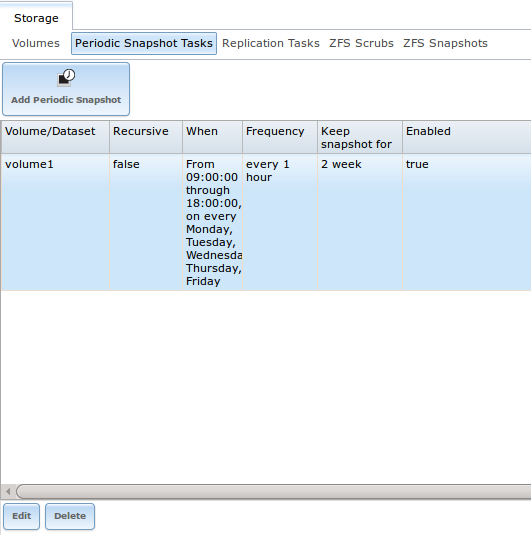
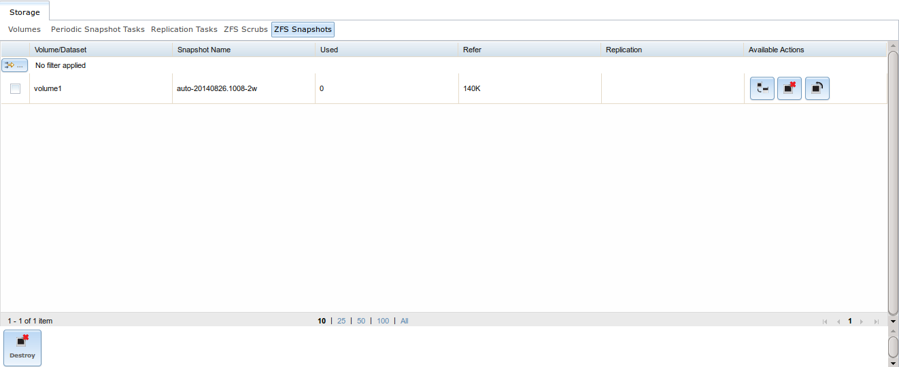
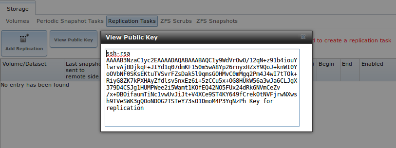
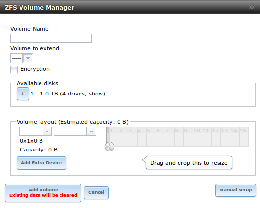
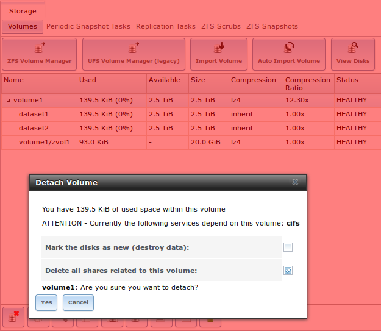
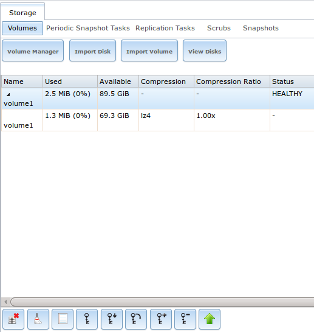
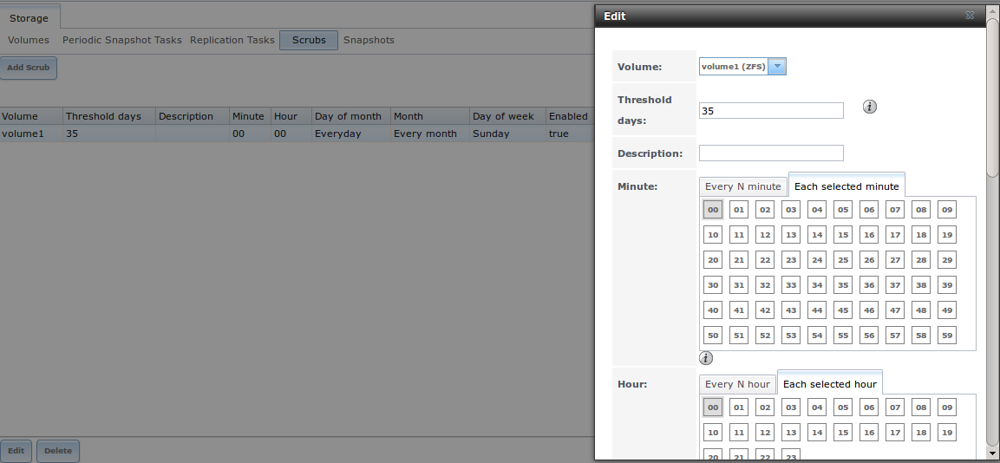

:orphan:

Storage Configuration
---------------------

The Storage section of the graphical interface allows you to configure the following:

*   `Periodic Snapshot Tasks`_: used to schedule the automatic creation of ZFS snapshots.

*   `Replication Tasks`_: used to schedule the replication of snapshots over an encrypted connection.

*   `Volumes`_: used to create and manage storage volumes.

*   `ZFS Scrubs`_: used to schedule ZFS scrubs as part of ongoing disk maintenance.

These configurations are described in more detail in this section.

Periodic Snapshot Tasks
~~~~~~~~~~~~~~~~~~~~~~~

A periodic snapshot task allows you to schedule the creation of read-only versions of ZFS volumes and datasets at a given point in time. Snapshots can be
created quickly and, if little data changes, new snapshots take up very little space. For example, a snapshot where no files have changed takes 0 MB of
storage, but as you make changes to files, the snapshot size changes to reflect the size of the changes.

Snapshots provide a clever way of keeping a history of files, should you need to recover an older copy or even a deleted file. For this reason, many
administrators take snapshots often (e.g. every 15 minutes), store them for a period of time (e.g. for a month), and store them on another system (e.g. using
`Replication Tasks`_). Such a strategy allows the administrator to roll the system back to a specific time or, if there is a catastrophic loss, an off-site
snapshot can restore the system up to the last snapshot interval.

Before you can create a snapshot, you need to have an existing ZFS volume. How to create a volume is described in `ZFS Volume Manager`_.

Creating a Periodic Snapshot Task
^^^^^^^^^^^^^^^^^^^^^^^^^^^^^^^^^

To create a periodic snapshot task, click `Storage --> Periodic Snapshot Tasks --> Add Periodic Snapshot` which will open the screen shown in Figure 8.1a.
Table 8.1a summarizes the fields in this screen.

.. note:: if you just need a one-time snapshot, instead use `Storage --> Volumes --> View Volumes` and click the "Create Snapshot" button for the volume or
   dataset that you wish to snapshot.

Figure 8.1a: Creating a ZFS Periodic Snapshot

|10000000000002B700000256704C108D_png|

.. |10000000000002B700000256704C108D_png| image:: images/periodic.png
    :width: 5.8402in
    :height: 4.9835in

**Table 8.1a: Options When Creating a Periodic Snapshot**

+----------------+----------------------------+--------------------------------------------------------------------------------------------------------------+
| Setting        | Value                      | Description                                                                                                  |
|                |                            |                                                                                                              |
+================+============================+==============================================================================================================+
| Enabled        | checkbox                   | uncheck to disable the scheduled replication task without deleting it                                        |
|                |                            |                                                                                                              |
+----------------+----------------------------+--------------------------------------------------------------------------------------------------------------+
| Volume/Dataset | drop-down menu             | select an existing ZFS volume, dataset, or zvol; if you select a volume, separate snapshots will also be     |
|                |                            | created for each of its datasets                                                                             |
|                |                            |                                                                                                              |
+----------------+----------------------------+--------------------------------------------------------------------------------------------------------------+
| Recursive      | checkbox                   | select this box to take separate snapshots of the volume/dataset and each of its child datasets; if          |
|                |                            | unchecked, only one snapshot is taken of the volume/dataset specified in "Volume/Dataset"                    |
|                |                            |                                                                                                              |
+----------------+----------------------------+--------------------------------------------------------------------------------------------------------------+
| Lifetime       | integer and drop-down menu | how long to keep the snapshot on this system; if the snapshot is replicated, it is not removed from the      |
|                |                            | receiving system when the lifetime expires                                                                   |
|                |                            |                                                                                                              |
+----------------+----------------------------+--------------------------------------------------------------------------------------------------------------+
| Begin          | drop-down menu             | do not create snapshots before this time of day                                                              |
|                |                            |                                                                                                              |
+----------------+----------------------------+--------------------------------------------------------------------------------------------------------------+
| End            | drop-down menu             | do not create snapshots after this time of day                                                               |
|                |                            |                                                                                                              |
+----------------+----------------------------+--------------------------------------------------------------------------------------------------------------+
| Interval       | drop-down menu             | how often to take snapshot between the "Begin" and "End" times                                               |
|                |                            |                                                                                                              |
+----------------+----------------------------+--------------------------------------------------------------------------------------------------------------+
| Weekday        | checkboxes                 | which days of the week to take snapshots                                                                     |
|                |                            |                                                                                                              |
+----------------+----------------------------+--------------------------------------------------------------------------------------------------------------+

If the "Recursive" box is checked, you do not need to create snapshots for every dataset individually as they are included in the snapshot. The downside is
that there is no way to exclude certain datasets from being included in a recursive snapshot.

Once you click the "OK" button, a snapshot will be taken and this task will be repeated according to your settings.

Managing Periodic Snapshot Tasks
^^^^^^^^^^^^^^^^^^^^^^^^^^^^^^^^

After creating a periodic snapshot task, an entry for the snapshot task will be added to "View Periodic Snapshot Tasks", as seen in the example in Figure 8.1b.
Click an entry to access its "Modify" and "Delete" buttons.

If you click the "ZFS Snapshots" tab (above the "Add Periodic Snapshot" button), you can review the listing of available snapshots. An example is shown in
Figure 8.1c.

.. note:: if snapshots do not appear, check that the current time does not conflict with the begin, end, and interval settings. If the snapshot was attempted
   but failed, an entry will be added to :file:`/var/log/messages`. This log file can be viewed in `Shell`_.

**Figure 8.1b: View Periodic Snapshot Tasks**

|100000000000039300000297B64A4D2A_png|

**Figure 8.1c: Viewing Available Snapshots**

|100000000000063B000002962F17D97F_png|

The most recent snapshot for a volume or dataset will be listed last and will have 3 icons. The icons associated with a snapshot allow you to:

**Clone Snapshot:** will prompt for the name of the clone to create. The clone will be a writable copy of the snapshot. Since a clone is really a dataset
which can be mounted, the clone will appear in the "Active Volumes" tab, instead of the "Periodic Snapshots" tab, and will have the word *clone* in its name.

**Destroy Snapshot:** a pop-up message will ask you to confirm this action. Child clones must be destroyed before their parent snapshot can be destroyed.
While creating a snapshot is instantaneous, deleting a snapshot can be I/O intensive and can take a long time, especially when deduplication is enabled. In
order to delete a block in a snapshot, ZFS has to walk all the allocated blocks to see if that block is used anywhere else; if it is not, it can be freed.

**Rollback Snapshot:** a pop-up message will ask if you are sure that you want to rollback to this snapshot state. If you click "Yes", any files that have
changed since the snapshot was taken will be reverted back to their state at the time of the snapshot.

.. note:: rollback is a potentially dangerous operation and will cause any configured replication tasks to fail as the replication system uses the existing
   snapshot when doing an incremental backup. If you do need to restore the data within a snapshot, the recommended steps are:

#.  Clone the desired snapshot.

#.  Share the clone with the share type or service running on the TrueNAS® system.

#.  Once users have recovered the needed data, destroy the clone in the Active Volumes tab.

This approach will never destroy any on-disk data and has no impact on replication.

Periodic snapshots can be configured to appear as `Shadow Copies`_ in newer versions of Windows Explorer. Users can access the files in the shadow copy using
Explorer without requiring any interaction with the TrueNAS® graphical administrative interface.

The "ZFS Snapshots" screen allows you to create filters to view snapshots by selected criteria. To create a filter, click the "Define filter" icon (near the
text "No filter applied"). When creating a filter:

*   select the column or leave the default of *Any Column*.

*   select the condition. Possible conditions are: *contains* (default),
    *is, starts with, ends with, does not contain, is not, does not start with, does not end with*, and
    *is empty*.

*   input a value that meets your view criteria.

*   click the "Filter" button to save your filter and exit the define filter screen. Alternately, click the "+" button to add another filter.

If you create multiple filters, select the filter you wish to use before leaving the define filter screen. Once a filter is selected, the "No filter applied"
text will change to "Clear filter". If you click "Clear filter", a pop-up message will indicate that this will remove the filter and all available snapshots
will be listed.

Replication Tasks
~~~~~~~~~~~~~~~~~

A replication task allows you to automate the copy of ZFS snapshots to another system over an encrypted connection. This allows you to create an off-site
backup of a ZFS dataset or pool.

This section will refer to the system generating the ZFS snapshots as *PUSH* and the system to receive a copy of the ZFS snapshots as
*PULL*.

Before you can configure a replication task, the following pre-requisites must be met:

*   a ZFS volume must exist on both *PUSH* and
    *PULL*.

*   a periodic snapshot task must be created on *PUSH*. You will not be able to create a replication task before the first snapshot exists.

*   the SSH service must be enabled on *PULL*. The first time the service is enabled, it will generate the required SSH keys.

A replication task uses the following keys:

*   :file:`/data/ssh/replication.pub`: the RSA public key used for authenticating the *PUSH* replication user. This key needs to be copied to the replication
    user account on *PULL*.

*   :file:`/etc/ssh/ssh_host_rsa_key.pub`: the RSA host public key of *PULL* used to authenticate the receiving side in order to prevent a man-in-the-middle
    attack. This key needs to be copied to the replication task on *PUSH*.

This section will demonstrate how to configure a replication task between the following two TrueNAS® systems:

*   *192.168.2.2* will be referred to as
    *PUSH*. This system has a periodic snapshot task for the ZFS dataset :file:`/mnt/local/data`.

*   *192.168.2.6* will be referred to as
    *PULL* . This system has an existing ZFS volume named :file:`/mnt/remote` which will store the pushed snapshots.

Configure PULL
^^^^^^^^^^^^^^

A copy of the public key for the replication user on *PUSH* needs to be pasted to the public key of the replication user on the
*PULL* system.

To obtain a copy of the replication key: on *PUSH* go to `Storage --> View Replication Tasks`. Click the "View Public Key" button and copy its contents. An
example is shown in Figure 8.2a.

**Figure 8.2a: Copy the Replication Key**

|100000000000039B0000018C2CCCC9E4_png|

.. |100000000000039B0000018C2CCCC9E4_png| image:: images/replication.png
    :width: 6.9252in
    :height: 2.9457in

Go to *PULL* and click `Account --> Users --> View Users`. Click the "Modify User" button for the user account you will be using for replication (by default
this is the *root* user). Paste the copied key into the "SSH Public Key" field and click "OK". If a key already exists, append the new text after the existing
key.

On *PULL*, ensure that the SSH service is enabled in `Services --> Control Services`. Start it if it is not already running.

Configure PUSH
^^^^^^^^^^^^^^

On *PUSH*, verify that a periodic snapshot task has been created and that at least one snapshot is listed in `Storage --> Periodic Snapshot Tasks --> View
Periodic Snapshot Tasks --> ZFS Snapshots`.

To create the replication task, click `Storage --> Replication Tasks --> Add Replication Task`. In the screen shown in Figure 8.2b, input the required
configuration. For this example:

*   the "Volume/Dataset" is *local/data*

*   the "Remote ZFS Volume/Dataset" is *remote*

*   the "Remote hostname" is *192.168.2.6*

*   the "Begin" and "End" times are at their default values, meaning that replication will occur whenever a snapshot is created

*   once the "Remote hostname" is input, click the "SSH Key Scan" button; assuming the address is reachable and the SSH service is running on *PULL*, its key
    will automatically be populated to the Remote hostkey box

**Figure 8.2b: Adding a Replication Task**

|10000000000004380000026A479A7E0D_png|

Table 8.2a summarizes the available options in the Add Replication Task screen.

**Table 8.2a: Adding a Replication Task**

+---------------------------+----------------+--------------------------------------------------------------------------------------------------------------+
| **Setting**               | **Value**      | **Description**                                                                                              |
|                           |                |                                                                                                              |
|                           |                |                                                                                                              |
+===========================+================+==============================================================================================================+
| Enabled                   | checkbox       | uncheck to disable the scheduled replication task without deleting it                                        |
|                           |                |                                                                                                              |
+---------------------------+----------------+--------------------------------------------------------------------------------------------------------------+
| Volume/Dataset            | drop-down menu | the ZFS volume or dataset on *PUSH* containing the snapshots to be replicated; the drop-down menu will be    |
|                           |                | empty if a snapshot does not already exist                                                                   |
|                           |                |                                                                                                              |
+---------------------------+----------------+--------------------------------------------------------------------------------------------------------------+
| Remote ZFS Volume/Dataset | string         | the ZFS volume on *PULL* that will store the snapshots;                                                      |
|                           |                | */mnt/* is assumed and should not be included in the path                                                    |
|                           |                |                                                                                                              |
+---------------------------+----------------+--------------------------------------------------------------------------------------------------------------+
| Recursively replicate     | checkbox       | if checked will replicate child datasets and replace previous snapshot stored on *PULL*                      |
|                           |                |                                                                                                              |
+---------------------------+----------------+--------------------------------------------------------------------------------------------------------------+
| Initialize remote side    | checkbox       | does a reset once operation which destroys the replication data on *PULL*                                    |
|                           |                | before reverting to normal operation; use this option if replication gets stuck                              |
|                           |                |                                                                                                              |
+---------------------------+----------------+--------------------------------------------------------------------------------------------------------------+
| Limit (kB/s)              | integer        | limits replication speed to specified value in kilobytes/second; default of *0* is unlimited                 |
|                           |                |                                                                                                              |
+---------------------------+----------------+--------------------------------------------------------------------------------------------------------------+
| Begin                     | drop-down menu | the replication can not start before this time; the times selected in the "Begin" and "End"                  |
|                           |                | fields set the replication window for when replication can occur                                             |
|                           |                |                                                                                                              |
+---------------------------+----------------+--------------------------------------------------------------------------------------------------------------+
| End                       | drop-down menu | the replication must start by this time; once started, replication will occur until it is finished (see NOTE |
|                           |                | below)                                                                                                       |
|                           |                |                                                                                                              |
+---------------------------+----------------+--------------------------------------------------------------------------------------------------------------+
| Remote hostname           | string         | IP address or DNS name of *PULL*                                                                             |
|                           |                |                                                                                                              |
+---------------------------+----------------+--------------------------------------------------------------------------------------------------------------+
| Remote port               | string         | must match port being used by SSH service on *PULL*                                                          |
|                           |                |                                                                                                              |
+---------------------------+----------------+--------------------------------------------------------------------------------------------------------------+
| Dedicated User Enabled    | checkbox       | allows a user account other than root to be used for replication                                             |
|                           |                |                                                                                                              |
+---------------------------+----------------+--------------------------------------------------------------------------------------------------------------+
| Dedicated User            | drop-down menu | only available if "Dedicated User Enabled" is checked; select the user account to be used for replication    |
|                           |                |                                                                                                              |
+---------------------------+----------------+--------------------------------------------------------------------------------------------------------------+
| Enable High Speed Ciphers | checkbox       | note that the cipher is quicker because it has a lower strength                                              |
|                           |                |                                                                                                              |
+---------------------------+----------------+--------------------------------------------------------------------------------------------------------------+
| Remote hostkey            | string         | use the SSH Key Scan button to retrieve the public key of *PULL*                                             |
|                           |                |                                                                                                              |
|                           |                |                                                                                                              |
+---------------------------+----------------+--------------------------------------------------------------------------------------------------------------+

By default, replication occurs when snapshots occur. For example, if snapshots are scheduled for every 2 hours, replication occurs every 2 hours. The "Begin"
and "End" times can be used to create a window of time where replication occurs. Change the default times (which allow replication to occur at any time of the
day a snapshot occurs) if snapshot tasks are scheduled during office hours but the replication itself should occur after office hours. For the "End" time,
consider how long replication will take so that it finishes before the next day's office hours begin.

Once the replication task is created, it will appear in the "View Replication Tasks" of *PUSH.*

*PUSH* will immediately attempt to replicate its latest snapshot to
*PULL*. If the replication is successful, the snapshot will appear in the `Storage --> Periodic Snapshot Tasks --> View Periodic Snapshot Tasks --> ZFS
Snapshots` tab of *PULL*. If the snapshot is not replicated, see the next section for troubleshooting tips.

Troubleshooting Replication
^^^^^^^^^^^^^^^^^^^^^^^^^^^

If you have followed all of the steps above and have *PUSH* snapshots that are not replicating to
*PULL*, check to see if SSH is working properly. On
*PUSH*, open `Shell`_ and try to :command:`ssh` into
*PULL*. Replace
*hostname_or_ip* with the value for
*PULL*::

 ssh -vv -i /data/ssh/replication hostname_or_ip

This command should not ask for a password. If it asks for a password, SSH authentication is not working. Go to `Storage --> Replication Tasks --> View
Replication Tasks` and click the "View Public Key" button. Make sure that it matches one of the values in :file:`/~/.ssh/authorized_keys` on *PULL*, where
*~* represents the home directory of the replication user.

Also check :file:`/var/log/auth.log` on *PULL* and :file:`/var/log/messages` on
*PUSH* to see if either log gives an indication of the error.

If the key is correct and replication is still not working, try deleting all snapshots on *PULL* except for the most recent one. In `Storage --> Periodic
Snapshot Tasks --> View Periodic Snapshot Tasks --> ZFS Snapshots` check the box next to every snapshot except for the last one (the one with 3 icons instead
of 2), then click the global "Destroy" button at the bottom of the screen.

Once you have only one snapshot, open Shell on *PUSH* and use the :command:`zfs send` command. To continue our example, the ZFS snapshot on the
*local/data* dataset of
*PUSH* is named
*auto-20110922.1753-2h*, the IP address of
*PULL* is
*192.168.2.6*, and the ZFS volume on
*PULL* is
*remote*. Note that the
**@** is used to separate the volume/dataset name from the snapshot name.
::

 zfs send local/data@auto-20110922.1753-2h | ssh -i /data/ssh/replication 192.168.2.6 zfs receive local/data@auto-20110922.1753-2h

.. note:: if this command fails with the error "cannot receive new filesystem stream: destination has snapshots", check the box "initialize remote side for
   once" in the replication task and try again. If the :command:`zfs send` command still fails, you will need to open Shell on *PULL* and use the
   :command:`zfs destroy -R volume_name@snapshot_name` command to delete the stuck snapshot. You can then use the :command:`zfs list -t snapshot` on *PULL*
   to confirm if the snapshot successfully replicated.

After successfully transmitting the snapshot, recheck again after the time period between snapshots lapses to see if the next snapshot successfully
transmitted. If it is still not working, you can manually send an incremental backup of the last snapshot that is on both systems to the current one with this
command::

 zfs send local/data@auto-20110922.1753-2h | ssh -i /data/ssh/replication 192.168.2.6 zfs receive local/data@auto-20110922.1753-2h

Volumes
~~~~~~~

Since the storage disks are separate from the TrueNAS® operating system, you do not actually have a NAS (network-attached storage) system until you configure
your disks into at least one volume.

.. note:: in ZFS terminology, the storage that is managed by ZFS is referred to as a pool. When configuring the ZFS pool using the TrueNAS® graphical
   interface, the term volume is used to refer to a ZFS pool.

Proper storage design is important for any NAS.
**It is recommended that you read through this entire chapter first, before configuring your storage disks, so that you are aware of all of the possible features, know which ones will benefit your setup most, and are aware of any caveats or hardware restrictions.**

Auto Importing Volumes
^^^^^^^^^^^^^^^^^^^^^^

If you click `Storage --> Volumes --> Auto Import Volume`, you can configure TrueNAS® to use an **existing** software UFS or ZFS RAID volume. This action is
typically performed when an existing TrueNAS® system is re-installed (rather than upgraded). Since the operating system is separate from the disks, a new
installation does not affect the data on the disks; however, the new operating system needs to be configured to use the existing volume.

Supported volumes are UFS GEOM stripes (RAID0), UFS GEOM mirrors (RAID1), UFS GEOM RAID3, as well as existing ZFS pools. UFS RAID5 is not supported as it is
an unmaintained summer of code project which was never integrated into FreeBSD.

The import of existing GELI-encrypted ZFS pools is also supported. However, the pool must be decrypted before it can be imported.

Figure 8.3a shows the initial pop-up window that appears when you select to auto import a volume. If you are importing a UFS RAID or an existing, unencrypted
ZFS pool, select "No: Skip to import".

**Figure 8.3a: Initial Auto Import Volume Screen**

|10000000000001B100000232D1ADEC28_png|

.. |10000000000001B100000232D1ADEC28_png| image:: images/auto.png
    :width: 6.5in
    :height: 5.5in

A drop-down menu will then show which software RAID volumes are available for import. Select the volume and click the "OK" button to import the volume.

TrueNAS® will not import a dirty volume. If an existing UFS RAID does not show in the drop-down menu, you will need to :command:`fsck` the volume.

If an existing ZFS pool does not show in the drop-down menu, run :command:zpool import` from `Shell`_ to import the pool.

If you plan to physically install ZFS formatted disks from another system, be sure to export the drives on that system to prevent an "in use by another
machine" error during the import.

If you suspect that your hardware is not being detected, run :command:`camcontrol devlist` from Shell. If the disk does not appear in the output, check to see
if the controller driver is supported or if it needs to be loaded by creating a `tunable`_.

Auto Importing a GELI-Encrypted ZFS Pool
""""""""""""""""""""""""""""""""""""""""

If you are importing an existing GELI-encrypted ZFS pool, you must decrypt the disks before importing the pool. In Figure 8.3a, select "Yes: Decrypt disks" to
access the screen shown in Figure 8.3b.

**Figure 8.3b Decrypting the Disks Before Importing the ZFS Pool**

|decrypt.png|

Select the disks in the encrypted pool, browse to the location of the saved encryption key, input the passphrase associated with the key, then click "OK" to
decrypt the disks.

.. note:: the encryption key is required to decrypt the pool. If the pool can not be decrypted, it can not be re-imported after a failed upgrade or lost
   configuration. This means that it is **very important** to save a copy of the key and to remember the passphrase that was configured for the key. The
   `View Volumes`_ screen is used to manage the keys for encrypted volumes.

Once the pool is decrypted, it should appear in the "import" drop-down menu. Click the "OK" button to finish the volume import.

Importing Volumes
^^^^^^^^^^^^^^^^^

The `Volume --> Import Volume` screen, shown in Figure 8.3c, is used to import a single disk or partition that has been formatted with a supported filesystem.
TrueNAS® supports the import of disks that have been formatted with UFS, NTFS, MSDOS, or EXT2. The import is meant to be a temporary measure in order to copy
the data from a disk to a volume. Only one disk can be imported at a time.

**Figure 8.3c: Importing a Volume**

|100000000000027400000181DF086267_png|

.. |100000000000027400000181DF086267_png| image:: images/import.png
    :width: 5.6075in
    :height: 3.3772in

Input a name for the volume, use the drop-down menu to select the disk or partition that you wish to import, and select the type of filesystem on the disk.

Before importing a disk, be aware of the following caveats:

*   TrueNAS® will not import a dirty filesystem. If a supported filesystem does not show in the drop-down menu, you will need to :command:`fsck` or run a
    disk check on the filesystem.

*   TrueNAS® can not import dynamic NTFS volumes.

*   if an NTFS volume will not import, try ejecting the volume safely from a Windows system. This will fix some journal files that are required to mount the
    drive.

ZFS Volume Manager
^^^^^^^^^^^^^^^^^^

If you have unformatted disks or wish to overwrite the filesystem (and data) on your disks, use the "ZFS Volume Manager" to format the desired disks into a
ZFS pool.

If you click on `Storage --> Volumes --> ZFS Volume Manager`, you will see a screen similar to the example shown in Figure 8.3d.

**Figure 8.3d: Creating a ZFS Pool Using Volume Manager**

|10000000000003AB00000216F6A8B51F_png|

Table 8.3a summarizes the configuration options of this screen.

**Table 8.3a: Options When Creating a ZFS Volume**

+------------------+----------------+--------------------------------------------------------------------------------------------+
| Setting          | Value          | Description                                                                                |
|                  |                |                                                                                            |
+==================+================+============================================================================================+
| Volume name      | string         | ZFS volumes must conform to these                                                          |
|                  |                | `naming conventions <http://docs.oracle.com/cd/E23824_01/html/821-1448/gbcpt.html>`_       |
|                  |                | ; it is recommended to choose a name that will stick out in the logs (e.g. **not**         |
|                  |                | *data* or                                                                                  |
|                  |                | *freenas*)                                                                                 |
|                  |                |                                                                                            |
+------------------+----------------+--------------------------------------------------------------------------------------------+
| Volume to extend | drop-down menu | requires an existing ZFS pool to extend; see                                               |
|                  |                | `Extending a ZFS Volume`_ for instructions                                                 |
|                  |                |                                                                                            |
+------------------+----------------+--------------------------------------------------------------------------------------------+
| Encryption       | checkbox       | read the section on `Encryption`_ before choosing to use encryption                        |
|                  |                |                                                                                            |
+------------------+----------------+--------------------------------------------------------------------------------------------+
| Available disks  | display        | displays the size of available disks; hover over "show" to list the available device names |                                                    |
|                  |                |                                                                                            |
+------------------+----------------+--------------------------------------------------------------------------------------------+
| Volume layout    | drag and drop  | click and drag the icon to select the desired number of disks                              |
|                  |                |                                                                                            |
+------------------+----------------+--------------------------------------------------------------------------------------------+
| Add Extra Device | button         | select to configure multiple pools or to add log or cache devices during pool creation     |
|                  |                |                                                                                            |
+------------------+----------------+--------------------------------------------------------------------------------------------+

To configure the pool, drag the slider to select the desired number of disks. The ZFS Volume Manager will automatically select the optimal configuration and
the resulting storage capacity, which takes swap into account, will be displayed. If you wish to change the layout or the number of disks, use the mouse to
drag the slider to the desired volume layout. The drop-down menu showing the optimal configuration can also be clicked to change the configuration, though the
GUI will turn red if the selected configuration is not recommended.

.. note:: for performance and capacity reasons, this screen will not allow you to create a volume from disks of differing sizes. While it is not recommended,
   it is possible to create a volume in this situation by using the "Manual setup" button and following the instructions in `Manual Volume Creation`_.

ZFS Volume Manager will allow you to save save a non-optimal configuration. It will still work, but will perform less efficiently than an optimal
configuration. However, the GUI will not allow you to select a configuration if the number of disks selected is not enough to create that configuration. Click
the tool tip icon to access a link to this documentation.

The Add Volume button warns that **creating a volume will destroys any existing data on the selected disk(s)**. In other words, creating a new volume
reformats the selected disks. If your intent is to not overwrite the data on an existing volume, see if the volume format is supported by the auto-import_ or
import actions. If so, perform the supported action instead. If the current storage format is not supported, you will need to backup the data to an external
media, format the disks, then restore the data to the new volume.

The ZFS Volume Manager will automatically select the optimal layout for the new pool, depending upon the number of disks selected. The following formats are
supported:

*   **Stripe:** requires at least one disk

*   **Mirror:** requires at least two disks

*   **RAIDZ1:** requires at least three disks

*   **RAIDZ2:** requires at least four disks

*   **RAIDZ3:** requires at least five disks

*   **log device:** add a dedicated log device (slog)

*   **cache device:** add a dedicated cache device

If you have more than five disks and are using ZFS, consider the number of disks to use for best performance and scalability.

Depending upon the size and number of disks, the type of controller, and whether or not encryption is selected, creating the volume may take some time. Once
the volume is created, the screen will refresh and the new volume will be listed under `Storage --> Volumes`.

Encryption
""""""""""

TrueNAS® supports
`GELI <http://www.freebsd.org/cgi/man.cgi?query=geli>`_
full disk encryption when creating ZFS volumes. It is important to understand the following when considering whether or not encryption is right for your
TrueNAS® system:

*   This is **not** the encryption method used by Oracle ZFSv30. That version of ZFS has not been open sourced and is the property of Oracle.

*   This is full disk encryption and **not** per-filesystem encryption. The underlying drives are first encrypted, then the pool is created on top of the
    encrypted devices.

*   This type of encryption is primarily targeted at users who store sensitive data and want to retain the ability to remove disks from the pool without
    having to first wipe the disk's contents.

*   This design is only suitable for safe disposal of disks independent of the encryption key. As long as the key and the disks are intact, the system is
    vulnerable to being decrypted. The key should be protected by a strong passphrase and any backups of the key should be securely stored.

*   On the other hand, if the key is lost, the data on the disks is inaccessible. Always backup the key!

*   The encryption key is per ZFS volume (pool). If you create multiple pools, each pool has its own encryption key.

*   As data is written, it is automatically encrypted and as data is read, it is decrypted on the fly. There should be very little, if any, degradation in
    performance when using encryption.

*   Data in the ARC cache and the contents of RAM are unencrypted.

*   Swap is always encrypted, even on unencrypted volumes.

*   There is no way to convert an existing, unencrypted volume. Instead, the data must be backed up, the existing pool must be destroyed, a new encrypted
    volume must be created, and the backup restored to the new volume.

*   Hybrid pools are not supported. In other words, newly created vdevs must match the existing encryption scheme. When
    `Extending a ZFS Volume`_, Volume Manager will automatically encrypt the new vdev being added to the existing encrypted pool.

.. note:: the encryption facility used by TrueNAS® is designed to protect against physical theft of the disks. It is not designed to protect against
   unauthorized software access. Ensure that only authorized users have access to the administrative GUI and that proper permissions are set on shares if
   sensitive data stored on the system.

Creating an Encrypted Volume
""""""""""""""""""""""""""""

To create an encrypted volume, check the "Encryption" box shown in Figure 8.3d. Input the volume name, select the disks to add to the volume, and click the
"Add Volume" button to make the encrypted volume.

Once the volume is created, **it is extremely important** to set a passphrase on the key, make a backup of the key, and create a recovery key. Without these,
it is impossible to re-import the disks at a later time.

To perform these tasks, go to `Storage --> Volumes -> View Volumes`. This screen is shown in Figure 8.3n.

To set a passphrase on the key, click the volume name and then the "Create Passphrase" button (the key shaped icon in Figure 8.3n). You will be prompted to
input the password used to access the TrueNAS® administrative GUI, and then to input and repeat the desired passphrase. Unlike a password, a passphrase can
contain spaces and is typically a series of words. A good passphrase is easy to remember (like the line to a song or piece of literature) but hard to guess
(people who know you should not be able to guess the passphrase).

When you set the passphrase, a warning message will remind you to create a new recovery key as a new passphrase needs a new recovery key. This way, if the
passphrase is forgotten, the associated recovery key can be used instead. To create the recovery key, click the "Add recovery key" button (second last key
icon in Figure 8.3n). This screen will prompt you to input the password used to access the TrueNAS® administrative GUI and then to select the directory in
which to save the key. Note that the recovery key is saved to the client system, not on the TrueNAS® system.

Finally, download a copy of the encryption key, using the "Download key" button (the key icon with a down arrow in Figure 8.3n). Again, the encryption key is
saved to the client system, not on the TrueNAS® system. You will be prompted to input the password used to access the TrueNAS® administrative GUI before the
selecting the directory in which to store the key.

The passphrase, recovery key, and encryption key need to be protected. Do not reveal the passphrase to others. On the system containing the downloaded keys,
take care that that system and its backups are protected. Anyone who has the keys has the ability to re-import the disks should they be discarded or stolen.

Manual Volume Creation
""""""""""""""""""""""

The "Manual Setup" button shown in Figure 8.3d can be used to create a non-optimal ZFS volume. While this is **not** recommended, it can, for example, be used
to create a volume containing disks of different sizes or to put more than the recommended number of disks into a vdev.

.. note:: when using disks of differing sizes, the volume is limited by the size of the smallest disk. When using more disks than are recommended for a vdev,
   you increase resilvering time and the risk that more than the allowable number of disks will fail before a resilver completes. For these reasons, it is
   recommended to instead let the ZFS Volume Manager create an optimal pool for you, as described in `ZFS Volume Manager`_, using same-size disks.

Figure 8.3e shows the "Manual Setup" screen and Table 8.3b summarizes the available options.

**Figure 8.3e: Creating a Non-Optimal ZFS Volume**

|1000000000000307000001E1E1BCAF06_png|

.. |1000000000000307000001E1E1BCAF06_png| image:: images/zfs2.png
    :width: 6.5126in
    :height: 4.0083in

**Table 8.3b: Manual Setup Options**

+---------------+------------------+------------------------------------------------------------------------------------------------+
| **Setting**   | **Value**        | **Description**                                                                                |
|               |                  |                                                                                                |
|               |                  |                                                                                                |
+===============+==================+================================================================================================+
| Volume name   | string           | ZFS volumes must conform to these                                                              |
|               |                  | `naming conventions <http://docs.oracle.com/cd/E19082-01/817-2271/gbcpt/index.html>`_          |
|               |                  | ; it is recommended to choose a name that will stick out in the logs (e.g. **not**             |
|               |                  | *data* or                                                                                      |
|               |                  | *freenas*)                                                                                     |
|               |                  |                                                                                                |
+---------------+------------------+------------------------------------------------------------------------------------------------+
| Encryption    | checkbox         | read the section on `Encryption`_                                                              |
|               |                  | before choosing to use encryption                                                              |
|               |                  |                                                                                                |
+---------------+------------------+------------------------------------------------------------------------------------------------+
| Member disks  | list             | highlight desired number of disks from list of available disks                                 |
|               |                  |                                                                                                |
+---------------+------------------+------------------------------------------------------------------------------------------------+
| Deduplication | drop-down menu   | choices are *Off*,                                                                             |
|               |                  | *Verify*, and                                                                                  |
|               |                  | *On*; carefully consider the section on `Deduplication`_                                       |
|               |                  | before changing this setting                                                                   |
|               |                  |                                                                                                |
+---------------+------------------+------------------------------------------------------------------------------------------------+
| ZFS Extra     | bullet selection | used to specify if disk is used for storage (*None*), a log device, a cache device, or a spare |
|               |                  |                                                                                                |
+---------------+------------------+------------------------------------------------------------------------------------------------+

Extending a ZFS Volume
^^^^^^^^^^^^^^^^^^^^^^

The "Volume to extend" drop-down menu in `Storage --> Volumes --> ZFS Volume Manager`, shown in Figure 8.3f, can be used to add additional disks to an
existing ZFS volume. This drop-down empty will be empty if an existing ZFS volume does not exist.

**Figure 8.3f: Extending a Volume**

|100000000000033B000001F75231DBD3_png|

.. |100000000000033B000001F75231DBD3_png| image:: images/extend.png
    :width: 6.9252in
    :height: 4.1374in

.. note:: if the existing volume is encrypted, a warning message will remind you that the operation of extending a volume will reset the passphrase and
   recovery key. After extending the volume, you should immediately recreate both as described in `Creating an Encrypted Volume`_.

Once an existing volume has been selected from the drop-down menu, drag and drop the desired disk(s) and select the desired volume layout. For example you can:

*   select an SSD or disk with a volume layout of *Log (ZIL)* to add a log device to the ZFS pool. Selecting 2 SSDs or disks will mirror the log device.

*   select an SSD or disk with a volume layout of *Cache (L2ARC)* to add a cache device to the ZFS pool.

*   add additional disks to increase the capacity of the ZFS pool. The caveats to doing this are described below.

When adding disks to increase the capacity of a volume, ZFS supports the addition of virtual devices, known as vdevs, to an existing ZFS pool. A vdev can be a
single disk, a stripe, a mirror, a RAIDZ1, RAIDZ2, or a RAIDZ3. **Once a vdev is created, you can not add more drives to that vdev**; however, you can stripe
a new vdev (and its disks) with the **same type of existing vdev** in order to increase the overall size of ZFS the pool. In other words, when you extend a
ZFS volume, you are really striping similar vdevs. Here are some examples:

*   to extend a ZFS stripe, add one or more disks. Since there is no redundancy, you do not have to add the same amount of disks as the existing stripe.

*   to extend a ZFS mirror, add the same number of drives. The resulting striped mirror is a RAID 10. For example, if you have 10 drives, you could start by
    creating a mirror of two drives, extending this mirror by creating another mirror of two drives, and repeating three more times until all 10 drives have
    been added.

*   to extend a three drive RAIDZ1, add three additional drives. The result is a RAIDZ+0, similar to RAID 50 on a hardware controller.

*   to extend a RAIDZ2 requires a minimum of four additional drives. The result is a RAIDZ2+0, similar to RAID 60 on a hardware controller.

If you try to add an incorrect number of disks to the existing vdev, an error message will appear, indicating the number of disks that are needed. You will
need to select the correct number of disks in order to continue.

Creating ZFS Datasets
^^^^^^^^^^^^^^^^^^^^^

An existing ZFS volume can be divided into datasets. Permissions, compression, deduplication, and quotas can be set on a per dataset basis, allowing more
granular control over access to storage data. A dataset is similar to a folder in that you can set permissions; it is also similar to a filesystem in that you
can set properties such as quotas and compression as well as create snapshots.

.. note:: ZFS provides thick provisioning using quotas and thin provisioning using reserved space.

If you select an existing ZFS volume --> Create ZFS Dataset, you will see the screen shown in Figure 8.3g.

Once a dataset is created, you can click on that dataset and select Create ZFS Dataset, thus creating a nested dataset, or a dataset within a dataset. You can
also create a zvol within a dataset. When creating datasets, double-check that you are using the Create ZFS Dataset option for the intended volume or dataset.
If you get confused when creating a dataset on a volume, click all existing datasets to close them--the remaining Create ZFS Dataset will be for the volume.

Table 8.3c summarizes the options available when creating a ZFS dataset. Some settings are only available in Advanced Mode. To see these settings, either
click the "Advanced Mode" button or configure the system to always display these settings by checking the box "Show advanced fields by default" in `System -->
Settings --> Advanced`. These attributes can also be changed after dataset creation in Storage --> Volumes --> View Volumes`.

**Figure 8.3g: Creating a ZFS Dataset**

|100000000000037F000001B270AAC95B_png|

.. |100000000000037F000001B270AAC95B_png| image:: images/dataset.png
    :width: 6.9252in
    :height: 3.3299in

**Table 8.3c: ZFS Dataset Options**

+--------------------------+---------------------+-----------------------------------------------------------------------------------------------------------+
| Setting                  | Value               | Description                                                                                               |
|                          |                     |                                                                                                           |
+==========================+=====================+===========================================================================================================+
| Dataset Name             | string              | mandatory                                                                                                 |
|                          |                     |                                                                                                           |
+--------------------------+---------------------+-----------------------------------------------------------------------------------------------------------+
| Compression Level        | drop-down menu      | see `Compression`_ for a comparison of the available algorithms                                           |
|                          |                     |                                                                                                           |
+--------------------------+---------------------+-----------------------------------------------------------------------------------------------------------+
| Share Type               | drop-down menu      | select the type of share that will be used on the dataset; choices are *UNIX* for an NFS share,           |
|                          |                     | *Windows* for a CIFS share, or                                                                            |
|                          |                     | *Mac* for an AFP share                                                                                    |
|                          |                     |                                                                                                           |
+--------------------------+---------------------+-----------------------------------------------------------------------------------------------------------+
| Enable atime             | Inherit, On, or Off | controls whether the access time for files is updated when they are read; setting this property to *Off*  |
|                          |                     | avoids producing log traffic when reading files and can result in significant performance gains           |
|                          |                     |                                                                                                           |
+--------------------------+---------------------+-----------------------------------------------------------------------------------------------------------+
| Quota for this dataset   | integer             | only available in "Advanced Mode"; default of *0* is off; can specify M (megabyte), G (gigabyte), or T    |
|                          |                     | (terabyte) as in *20G* for 20 GB, can also include a decimal point (e.g.                                  |
|                          |                     | *2.8G*)                                                                                                   |
|                          |                     |                                                                                                           |
+--------------------------+---------------------+-----------------------------------------------------------------------------------------------------------+
| Quota for this dataset   | integer             | only available in "Advanced Mode"; default of *0* is off; can specify M (megabyte), G (gigabyte), or T    |
| and all children         |                     | (terabyte) as in *20G* for 20 GB                                                                          |
|                          |                     |                                                                                                           |
+--------------------------+---------------------+-----------------------------------------------------------------------------------------------------------+
| Reserved space for this  | integer             | only available in "Advanced Mode"; default of *0* is unlimited (besides hardware); can specify M          |
| dataset                  |                     | (megabyte), G (gigabyte), or T (terabyte) as in *20G* for 20 GB                                           |
|                          |                     |                                                                                                           |
+--------------------------+---------------------+-----------------------------------------------------------------------------------------------------------+
| Reserved space for this  | integer             | only available in "Advanced Mode"; default of *0* is unlimited (besides hardware); can specify M          |
| dataset and all children |                     | (megabyte), G (gigabyte), or T (terabyte) as in *20G* for 20 GB                                           |
|                          |                     |                                                                                                           |
+--------------------------+---------------------+-----------------------------------------------------------------------------------------------------------+
| ZFS Deduplication        | drop-down menu      | read the section on `Deduplication`_  before making a change to this setting                              |
|                          |                     |                                                                                                           |
+--------------------------+---------------------+-----------------------------------------------------------------------------------------------------------+
| Record Size              | drop-down menu      | only available in "Advanced Mode"; while ZFS automatically adapts the record size dynamically to adapt to |
|                          |                     | data, if the data has a fixed size (e.g. a database), setting the "Record Size" may result in better      |
|                          |                     | performance                                                                                               |
|                          |                     |                                                                                                           |
+--------------------------+---------------------+-----------------------------------------------------------------------------------------------------------+

Deduplication
"""""""""""""

The "ZFS Deduplication" option warns that enabling dedup may have drastic performance implications and that compression should be used instead. This
`article <http://constantin.glez.de/blog/2011/07/zfs-dedupe-or-not-dedupe>`_
provides a good description of the value v.s. cost considerations for deduplication.

**Unless you have a lot of RAM and a lot of duplicate data, do not change the default deduplication setting of "Off".** The dedup tables used during
deduplication need ~8 GB of RAM per 1TB of data to be deduplicated. For performance reasons, consider using compression rather than turning this option on.

If deduplication is changed to *On*, duplicate data blocks are removed synchronously. The result is that only unique data is stored and common components are
shared among files. If deduplication is changed to *Verify*, ZFS will do a byte-to-byte comparison when two blocks have the same signature to make sure that
the block contents are identical. Since hash collisions are extremely rare, verify is usually not worth the performance hit.

.. note:: once deduplication is enabled, the only way to disable it is to use the :command:`zfs set dedup=off dataset_name` command from `Shell`_. However,
   any data that is already stored as deduplicated will not be un-deduplicated as only newly stored data after the property change will not be deduplicated.
   The only way to remove existing deduplicated data is to copy all of the data off of the dataset, set the property to off, then copy the data back in again.
   Alternately, create a new dataset with the *ZFS Deduplication* left as disabled, copy the data to the new dataset, and destroy the original dataset.

Compression
"""""""""""

Most media (e.g. :file:`.mp3`, :file:`.mp4`, :file:`.avi`) is already compressed, meaning that you will increase CPU utilization for no gain if you store
these files on a compressed dataset. However, if you have raw :file:`.wav` rips of CDs or :file:`.vob` rips of DVDs, you will see a performance gain using a
compressed dataset. When selecting a compression type, you need to balance performance with the amount of compression. The following compression algorithms
are supported:

*   **lz4:** recommended compression method as it allows compressed datasets to operate at near real-time speed.

*   **gzip:** varies from levels 1 to 9 where
    *gzip fastest* (level 1) gives the least compression and
    *gzip maximum* (level 9) provides the best compression but is discouraged due to its performance impact.

*   **zle:** fast and simple algorithm to eliminate runs of zeroes.

*   **lzjb:** provides decent data compression, but is considered deprecated as lz4 provides much better performance.

Creating a zvol
^^^^^^^^^^^^^^^

A zvol is a feature of ZFS that creates a block device over ZFS. This allows you to use a zvol as an iSCSI device extent as described in `Extents>`_.

To create a zvol, select an existing ZFS volume or dataset --> Create zvol which will open the screen shown in Figure 8.3h.

The configuration options are described in Table 8.3d. Some settings are only available in Advanced Mode. To see these settings, either click the "Advanced
Mode" button or configure the system to always display these settings by checking the box "Show advanced fields by default" `in System --> Settings -->
Advanced`.

**Figure 8.3h Creating a zvol**

|100000000000029300000195C8959B52_png|

.. |100000000000029300000195C8959B52_png| image:: images/zvol.png
    :width: 5.5374in
    :height: 3.3752in

**Table 8.3d: zvol Configuration Options**

+--------------------+----------------+----------------------------------------------------------------------------------------------------------------------+
| **Setting**        | **Value**      | **Description**                                                                                                      |
|                    |                |                                                                                                                      |
|                    |                |                                                                                                                      |
+====================+================+======================================================================================================================+
| zvol Name          | string         | input a name for the zvol                                                                                            |
|                    |                |                                                                                                                      |
+--------------------+----------------+----------------------------------------------------------------------------------------------------------------------+
| Size for this zvol | integer        | specify size and value such as *10G*                                                                                 |
|                    |                |                                                                                                                      |
+--------------------+----------------+----------------------------------------------------------------------------------------------------------------------+
| Compression level  | drop-down menu | default of *Inherit* means it will use the same compression level as the existing zpool used to create the zvol      |
|                    |                |                                                                                                                      |
+--------------------+----------------+----------------------------------------------------------------------------------------------------------------------+
| Sparse volume      | checkbox       | used to provide thin provisioning; if this option is selected, writes will fail when the pool is low on space        |
|                    |                |                                                                                                                      |
+--------------------+----------------+----------------------------------------------------------------------------------------------------------------------+
| Block size         | integer        | only available in "Advanced Mode"; valid size is any power of 2 from 512b to 128kb with a default size of 8kb; can   |
|                    |                | be set to match the block size of the filesystem which will be formatted onto the iSCSI target                       |
|                    |                |                                                                                                                      |
+--------------------+----------------+----------------------------------------------------------------------------------------------------------------------+

Viewing Disks
^^^^^^^^^^^^^

`Storage --> Volumes --> View Disks` allows you to view all of the disks recognized by the TrueNAS® system. An example is shown in Figure 8.3i.

**Figure 8.3i: Viewing Disks**

|10000000000004CB000001E22FDAE157_png|

.. |10000000000004CB000001E22FDAE157_png| image:: images/disks.png
    :width: 6.9252in
    :height: 2.6717in

For each device, the current configuration of the options described in Table 8.3e is displayed. Click a disk's entry and then its "Edit" button to change its
configuration.

Clicking a disk's entry will also display its "Wipe" button which can be used to blank a disk while providing a progress bar of the wipe's status. Use this
option before discarding a disk.

.. note:: should a disk's serial number not be displayed in this screen, use the :command:`smartctl` command within `Shell`_. For example, to determine the
   serial number of disk ada0, type :command:`smartctl -a /dev/ada0 | grep Serial`.

Viewing Volumes
^^^^^^^^^^^^^^^

If you click `Storage --> Volumes --> View Volumes`, you can view and further configure existing volumes, ZFS datasets, and zvols. The example shown in Figure
8.3j demonstrates one ZFS volume with two datasets and one zvol.

Buttons are provided to provide quick access to `ZFS Volume Manager`_, and for `Importing Volumes`_, `Importing Volumes>`_, `Viewing Disks`_, and Viewing
Enclosures.

**Figure 8.3j: Viewing Volumes**

|100000000000037B000001EEEFFF3372_png|

.. |100000000000037B000001EEEFFF3372_png| image:: images/view.png
    :width: 6.9252in
    :height: 3.7717in

If you click the entry for a ZFS volume, eight icons will appear at the bottom of the screen. In order from left to right, these icons allow you to:

#.  **Detach Volume:** allows you to either detach a disk before removing it from the system (also known as a ZFS export) or to delete the contents of the
    volume, depending upon the choice you make in the screen that pops up when you click this button. The pop-up message, seen in Figure 8.3k, will show the
    current used space, provide the check box "Mark the disks as new (destroy data)", prompt you to make sure that you want to do this, warn you if the volume
    has any associated shares and ask if you wish to delete them, and the browser will turn red to alert you that you are about to do something that will make
    the data inaccessible. **If you do not check the box to mark the disks as new, the volume will be exported (ZFS volumes only).** This means that the data
    is not destroyed and the volume can be re-imported at a later time. If you will be moving a ZFS drive from one system to another, perform this
    `export <http://docs.huihoo.com/opensolaris/solaris-zfs-administration-guide/html/ch04s06.html>`_
    action first. This operation flushes any unwritten data to disk, writes data to the disk indicating that the export was done, and removes all knowledge of
    the pool from the system.
    **If you do check the box to mark the disks as new, the volume and all of its data, datasets, and zvols will be destroyed and the underlying disks will be returned to their raw state.**

#.  **Scrub Volume:** ZFS scrubs and how to schedule them are described in more detail in `ZFS Scrubs`_. This button allows you to manually initiate a scrub.
    A scrub is I/O intensive and can negatively impact performance, meaning that you should not initiate one while the system is busy. A cancel button is
    provided should you need to cancel a scrub.

.. note:: if you do cancel a scrub, the next scrub will start over from the beginning, not where the cancelled scrub left off.

**Figure 8.3k: Detaching or Deleting a Volume**

|100000000000037B000001EEDB98EF76_png|

#.  **Edit ZFS Options:** allows you to edit the volume's compression level, atime setting, dataset quota, and reserved space for quota. If compression is
    newly enabled on a volume or dataset that already contains data, existing files will not be compressed until they are modified as compression is only
    applied when a file is written.

#.  **Create ZFS Dataset:** allows you to create a dataset.

#.  **Create zvol:** allows you to create a zvol to use as an iSCSI device extent.

#.  **Change Permissions:** allows you to edit the volume's user, group, Unix rwx permissions, type of ACL, and to enable recursive permissions on the
    volume's subdirectories.

#.  **Create Snapshot:** allows you to configure the snapshot's name and whether or not it is recursive before manually creating a one-time snapshot. If you
    wish to schedule the regular creation of snapshots, instead create `Periodic Snapshot Tasks`_.

#.  **Volume Status:** as seen in the example in Figure 8.3l, this screen shows the device name and status of each disk in the ZFS pool as well as any read,
    write, or checksum errors. It also indicates the status of the latest `ZFS Scrubs`_. If you click the entry for a device, buttons will appear to edit the
    device's options (shown in Figure 8.3m ), offline the device, or replace the device (as described in `Replacing a Failed Drive`_).

**Figure 8.3l: Volume Status**

|10000000000002B2000001C55CD3483A_png|

.. |10000000000002B2000001C55CD3483A_png| image:: images/status.png
    :width: 6.161in
    :height: 3.9736in

If you click a disk in "Volume Status" and click its "Edit Disk" button, you will see the screen shown in Figure 8.3m. Table 8.3e summarizes the configurable
options.

**Figure 8.3m: Editing a Disk**

|1000000000000323000001EABE7B63C2_png|

.. |1000000000000323000001EABE7B63C2_png| image:: images/disk.png
    :width: 6.9252in
    :height: 4.1516in

**Table 8.3e: Disk Options**

+--------------------------------------------------------+----------------+----------------------------------------------------------------------------------------------------------------------+
| Setting                                                | Value          | Description                                                                                                          |
|                                                        |                |                                                                                                                      |
+========================================================+================+======================================================================================================================+
| Name                                                   | string         | read-only value showing FreeBSD device name for disk                                                                 |
|                                                        |                |                                                                                                                      |
+--------------------------------------------------------+----------------+----------------------------------------------------------------------------------------------------------------------+
| Serial                                                 | string         | read-only value showing the disk's serial number                                                                     |
|                                                        |                |                                                                                                                      |
+--------------------------------------------------------+----------------+----------------------------------------------------------------------------------------------------------------------+
| Description                                            | string         | optional                                                                                                             |
|                                                        |                |                                                                                                                      |
+--------------------------------------------------------+----------------+----------------------------------------------------------------------------------------------------------------------+
| HDD Standby                                            | drop-down menu | indicates the time of inactivity (in minutes) before the drive enters standby mode in order to conserve energy; this |
|                                                        |                | `forum post <http://forums.freenas.org/showthread.php?2068-How-to-find-out-if-a-drive-is-spinning-down-properly>`_   |
|                                                        |                | demonstrates how to determine if a drive has spun down                                                               |
|                                                        |                |                                                                                                                      |
+--------------------------------------------------------+----------------+----------------------------------------------------------------------------------------------------------------------+
| Advanced Power Management                              | drop-down menu | default is *Disabled*, can select a power management profile from the menu                                           |
|                                                        |                |                                                                                                                      |
+--------------------------------------------------------+----------------+----------------------------------------------------------------------------------------------------------------------+
| Acoustic Level                                         | drop-down menu | default is *Disabled*, can be modified for disks that understand                                                     |
|                                                        |                | `AAM <http://en.wikipedia.org/wiki/Automatic_acoustic_management>`_                                                  |
|                                                        |                |                                                                                                                      |
+--------------------------------------------------------+----------------+----------------------------------------------------------------------------------------------------------------------+
| Enable                                                 | checkbox       | enabled by default if the disk supports S.M.A.R.T.; unchecking this box will disable any configured                  |
| `S.M.A.R.T <http://en.wikipedia.org/wiki/S.M.A.R.T.>`_ |                | `S.M.A.R.T. Tests <#1.4.6.S.M.A.R.T. Tests|outline>`_                                                                |
|                                                        |                | for the disk                                                                                                         |
|                                                        |                |                                                                                                                      |
+--------------------------------------------------------+----------------+----------------------------------------------------------------------------------------------------------------------+
| S.M.A.R.T. extra options                               | string         | `smartctl(8) <http://smartmontools.sourceforge.net/man/smartctl.8.html>`_                                            |
|                                                        |                | options                                                                                                              |
|                                                        |                |                                                                                                                      |
+--------------------------------------------------------+----------------+----------------------------------------------------------------------------------------------------------------------+

A ZFS dataset only has five icons as the "scrub volume", "create ZFS volume", and "volume status" buttons only apply to volumes. In a dataset, the "Detach
Volume" button is replaced with the "Destroy Dataset" button. If you click the "Destroy Dataset" button, the browser will turn red to indicate that this is a
destructive action. The pop-up warning message will warn that destroying the dataset will delete all of the files and snapshots of that dataset.

Key Management for Encrypted Volumes
""""""""""""""""""""""""""""""""""""

If you check the "Enable full disk encryption" box during the creation of a ZFS volume, five encryption icons will be added to the icons that are typically
seen when viewing a volume. An example is seen in Figure 8.3n.

**Figure 8.3n: Encryption Icons Associated with an Encrypted ZFS Volume**

|10000000000003940000029EBC39757F_png|

These icons are used to:

**Create/Change Passphrase:** click this icon to set and confirm the passphrase associated with the GELI encryption key.
**Remember this passphrase as you can not re-import an encrypted volume without it.** In other words, if you forget the passphrase, it is possible for the
data on the volume to become inaccessible. An example would be a failed USB stick that requires a new installation on a new USB stick and a re-import of the
existing pool, or the physical removal of disks when moving from an older hardware system to a new system. Protect this passphrase as anyone who knows it
could re-import your encrypted volume, thus thwarting the reason for encrypting the disks in the first place.

When you click this icon, a red warning is displayed: **Remember to add a new recovery key as this action invalidates the previous recovery key.** Setting a
passphrase invalidates the existing key. Once you set the passphrase, immediately click the "Add recovery key" button to create a new recovery key. Once the
passphrase is set, the name of this icon will change to "Change Passphrase".

**Download Key:** click this icon to download a backup copy of the GELI encryption key. Since the GELI encryption key is separate from the TrueNAS®
configuration database,
**it is highly recommended to make a backup of the key. If the key is every lost or destroyed and there is no backup key, the data on the disks is inaccessible.**

**Encryption Re-key:** generates a new GELI encryption key. Typically this is only performed when the administrator suspects that the current key may be
compromised. This action also removes the current passphrase.

**Add recovery key:** generates a new recovery key and prompts for a location to download a backup copy of the recovery key. This recovery key can be used if
the passphrase is forgotten. **Always immediately** add a recovery key whenever the passphrase is changed.

**Remove recover key:** Typically this is only performed when the administrator suspects that the current recovery key may be compromised. **Immediately**
create a new passphrase and recovery key.

Each of these icons will prompt for the password used to access the TrueNAS® administrative GUI.

Setting Permissions
^^^^^^^^^^^^^^^^^^^

Setting permissions is an important aspect of configuring volumes. The graphical administrative interface is meant to set the **initial** permissions for a
volume or dataset in order to make it available as a share. Once a share is available, the client operating system should be used to fine-tune the permissions
of the files and directories that are created by the client.

`Sharing`_ contains configuration examples for several types of permission scenarios. This section provides an overview of the screen that is used to set
permissions.

Once a volume or dataset is created, it will be listed by its mount point name in `Storage --> Volumes --> View Volumes`. If you click the "Change
Permissions" icon for a specific volume/dataset, you will see the screen shown in Figure 8.3o. Table 8.3f summarizes the options in this screen.

**Figure 8.3o: Changing Permissions on a Volume or Dataset**

|10000000000002AB000001EDFCA56233_png|

.. |10000000000002AB000001EDFCA56233_png| image:: images/perms.png
    :width: 5.7398in
    :height: 4.1083in

**Table 8.3f: Options When Changing Permissions**

+----------------------------+------------------+------------------------------------------------------------------------------------------------------------+
| **Setting**                | **Value**        | **Description**                                                                                            |
|                            |                  |                                                                                                            |
|                            |                  |                                                                                                            |
+============================+==================+============================================================================================================+
| Owner (user)               | drop-down menu   | user to control the volume/dataset; users which were manually created or imported from Active Directory or |
|                            |                  | LDAP will appear in drop-down menu                                                                         |
|                            |                  |                                                                                                            |
+----------------------------+------------------+------------------------------------------------------------------------------------------------------------+
| Owner (group)              | drop-down menu   | group to control the volume/dataset; groups which were manually created or imported from Active Directory  |
|                            |                  | or LDAP will appear in drop-down                                                                           |
|                            |                  |                                                                                                            |
+----------------------------+------------------+------------------------------------------------------------------------------------------------------------+
| Mode                       | checkboxes       | check the desired **Unix** permissions for user, group, and other                                          |
|                            |                  |                                                                                                            |
+----------------------------+------------------+------------------------------------------------------------------------------------------------------------+
| Permission Type            | bullet selection | Unix and Windows ACLs are mutually exclusive, this means that you must select the correct type of ACL to   |
|                            |                  | match the share; see the paragraphs below this Table for more details                                      |
|                            |                  |                                                                                                            |
+----------------------------+------------------+------------------------------------------------------------------------------------------------------------+
| Set permission recursively | checkbox         | if checked, permissions will also apply to subdirectories of the volume or dataset; if data already exists |
|                            |                  | on the volume/dataset, it is recommended to instead change the permissions recursively on the client side  |
|                            |                  | to prevent a performance lag on the TrueNAS® system                                                       |
|                            |                  |                                                                                                            |
+----------------------------+------------------+------------------------------------------------------------------------------------------------------------+

When in doubt, or if you have a mix of operating systems in your network, select Unix ACLs as all clients understand them. *Windows/Mac* ACLs are appropriate
when the network contains only Windows and/or Mac clients and are the preferred option within an Active Directory domain. *Windows/Mac* ACLs add a superset of
permissions that augment those provided by Unix ACLs. While Windows and Mac clients also understand *Unix* ACLs, they won't benefit from the extra permissions
provided by Active Directory and *Windows/Mac* ACLs when
*Unix* ACLs are used.

If you change your mind about the type of ACL, you do not have to recreate the volume. That is, existing data is not lost if the type of ACL is changed.
However, if you change from *Windows/Mac* ACLs to
*Unix* ACLs, the extended permissions provided by
*Windows/Mac* ACLs will be removed from the existing files.

When you select *Windows/Mac* ACLs, the
*Mode* will become greyed out as it only applies to Unix permissions. The default Windows ACLs are always set to what Windows sets on new files and
directories by default. The Windows client should then be used to fine-tune the permissions as required.

Replacing a Failed Drive
^^^^^^^^^^^^^^^^^^^^^^^^

If you are using any form of redundant RAID, you should replace a failed drive as soon as possible to repair the degraded state of the RAID. Depending upon
the capability of your hardware, you may or may not need to reboot in order to replace the failed drive. AHCI capable hardware does not require a reboot.

.. note:: a stripe (RAID0) does not provide redundancy. If you lose a disk in a stripe, you will need to recreate the volume and restore the data from backup.

Before physically removing the failed device, go to `Storage --> Volumes --> View Volumes --> Volume Status` and locate the failed disk. Once you have located
the failed device in the GUI, perform the following steps:

#.  Click the disk's entry then its "Offline" button in order to change that disk's status to OFFLINE. This step is needed to properly remove the device from
    the ZFS pool and to prevent swap issues. Click the disk's "Offline" button, pull the disk, then skip to step 3. If there is no "Offline" button but only a
    "Replace" button, then the disk is already offlined and you can safely skip this step.

.. note:: if the process of changing the disk's status to OFFLINE fails with a "disk offline failed - no valid replicas" message, you will need to scrub the
   ZFS volume first using its "Scrub Volume" button in `Storage --> Volumes --> View Volumes`. Once the scrub completes, try to Offline the disk again before
   proceeding.

#.  Once the disk is showing as OFFLINE, click the disk again and then click its "Replace" button. Select the replacement disk from the drop-down menu and 
    click the "Replace Disk" button. If the disk is a member of an encrypted ZFS pool, you will be prompted to input the passphrase for the pool. Once you
    click the "Replace Disk" button, the ZFS pool will start to resilver. You can use the :command:`zpool status` command in `Shell`_ to monitor the status of
    the resilvering.

#.  If the replaced disk continues to be listed after resilvering is complete, click its entry and use the "Detach" button to remove the disk from the list.

Replacing a Failed Drive in an Encrypted Pool
"""""""""""""""""""""""""""""""""""""""""""""

If the ZFS pool is encrypted, additional steps are needed when replacing a failed drive.

First, make sure that a `passphrase has been set as described in `Creating an Encrypted Volume|outline>`_ **before** attempting to replace the failed drive.
Then, follow the steps 1 and 2 as described above. During step 3, you will be prompted to input the passphrase for the pool. Wait until the resilvering is
complete.

Next, restore the encryption keys to the pool.
**If the following additional steps are not performed before the next reboot, you may lose access to the pool permanently.**

#.  Highlight the pool that contains the disk you just replaced and click the "Encryption Re-key" button in the GUI. You will need to enter the *root*
    password.

#.  Highlight the pool that contains the disk you just replaced and click the "Create Passphrase" button and enter the new passphrase. You can reuse the old
    passphrase if desired.

#.  Highlight the pool that contains the disk you just replaced and click the "Download Key" button in order to save the new encryption key. Since the old key
    will no longer function, any old keys can be safely discarded.

#.  Highlight the pool that contains the disk you just replaced and click the "Add Recovery Key" button in order to save the new recovery key. The old
    recovery key will no longer function, so it can be safely discarded.

Removing a Log or Cache Device
""""""""""""""""""""""""""""""

If you have added any log or cache devices, these devices will also appear in `Storage --> Volumes --> View Volumes --> Volume Status`. If you click the
device, you can either use its "Replace" button to replace the device as described above, or click its "Remove" button to remove the device.

Before performing either of these operations, verify the version of ZFS running on the system by running :command:`zpool upgrade -v|more` from `Shell`_.

If the pool is running ZFSv15, and a non-mirrored log device fails, is replaced, or removed, the pool is unrecoverable and the pool must be recreated and the
data restored from a backup. For other ZFS versions, removing or replacing the log device will lose any data in the device which had not yet been written.
This is typically the last few seconds of writes.

Removing or replacing a cache device will not result in any data loss, but may have an impact on read performance until the device is replaced.

Replacing Drives to Grow a ZFS Pool
^^^^^^^^^^^^^^^^^^^^^^^^^^^^^^^^^^^

The recommended method for expanding the size of a ZFS pool is to pre-plan the number of disks in a vdev and to stripe additional vdevs using the
`ZFS Volume Manager as described in `Extending a ZFS Volume`_ as additional capacity is needed.

However, this is not an option if you do not have open drive ports or the ability to add a SAS/SATA HBA card. In this case, you can replace one disk at a time
with a larger disk, wait for the resilvering process to incorporate the new disk into the pool completes, then repeat with another disk until all of the disks
have been replaced. This process is slow and places the system in a degraded state. Since a failure at this point could be disastrous,
**do not attempt this method unless the system has a reliable backup.**

Check and verify that the autoexpand property is enabled **before** attempting to grow the pool. If it is not, the pool will not recognize that the disk
capacity has increased. To verify the property, use `Shell`_. This example checks the ZFS volume named *Vol1*::

 zpool get all Vol1
 NAME	PROPERTY	VALUE			SOURCE
 Vol1	size		4.53T			-
 Vol1	capacity	31%			-
 Vol1	altroot		/mnt			local
 Vol1	health		ONLINE			-
 Vol1	guid		8068631824452460057	default
 Vol1	version		28			default
 Vol1	bootfs		-			default
 Vol1	delegation	on			default
 Vol1	autoreplace	off			default
 Vol1	cachefile	/data/zfs/zpool.cache	local
 Vol1	failmode	wait			default
 Vol1	listsnapshots	off			default
 Vol1	autoexpand	on			local
 Vol1	dedupditto	0			default
 Vol1	dedupratio	1.00x			-
 Vol1	free		3.12T			-
 Vol1	allocated	1.41T			-
 Vol1	readonly	off			-
 Vol1	comment		-			default

If autoexpansion is not enabled, enable it by specifying the name of the ZFS volume::

 zpool set autoexpand=on Vol1

Verify that autoexpand is now enabled by repeating :command:`zpool get all Vol1`.

You are now ready to replace one drive with a larger drive using the instructions in `Replacing a Failed Drive`_.

Replace one drive at a time and wait for the resilver process to complete on the replaced drive before replacing the next drive. Once all the drives are
replaced and the resilver completes, you should see the added space in the pool.

You can view the status of the resilver process by running :command:`zpool status Vol1`.

Enabling ZFS Pool Expansion After Drive Replacement
"""""""""""""""""""""""""""""""""""""""""""""""""""

It is recommended to enable the autoexpand property before you start replacing drives. If the property is not enabled before replacing some or all of the
drives, extra configuration is needed to inform ZFS of the expanded capacity.

Verify that autoexpand is set as described in the previous section. Then, bring each of the drives back online with the following command, replacing the
volume name and GPT ID for each disk in the ZFS pool::

 zpool online -e Vol1 gptid/xxx

Online one drive at a time and check the status using the following example. If a drive starts to resilver, you need to wait for the resilver to complete
before proceeding to online the next drive.

To find the GPT ID information for the drives, use :command:`zpool status [Pool_Name]` which will also show you if any drives are failed or in the process of
being resilvered::

 zpool status Vol1
 pool: Vol1
 state: ONLINE
 scan: scrub repaired 0 in 16h24m with 0 errors on Sun Mar 10 17:24:20 2013
 config:
 NAME						STATE	READ WRITE CKSUM
 Vol1						ONLINE	0    0	   0
 raidz1-0					ONLINE	0    0	   0
 gptid/d5ed48a4-634a-11e2-963c-00e081740bfe	ONLINE	0    0	   0
 gptid/03121538-62d9-11e2-99bd-00e081740bfe	ONLINE	0    0	   0
 gptid/252754e1-6266-11e2-8088-00e081740bfe	ONLINE	0    0	   0
 gptid/9092045a-601d-11e2-892e-00e081740bfe	ONLINE	0    0	   0
 gptid/670e35bc-5f9a-11e2-92ca-00e081740bfe	ONLINE	0    0	   0
 errors: No known data errors

After onlining all of the disks, type :command:`zpool status` to see if the drives start to resilver. If this happens, wait for the resilvering process to
complete.

Next, export and then import the pool::

 zpool export Vol1

 zpool import -R /mnt Vol1

Once the import completes, all of the drive space should be available. Verify that the increased size is recognized::

 zpool list Vol1
 NAME	SIZE	ALLOC	FREE	CAP	DEDUP	HEALTH	ALTROOT
 Vol1	9.06T	1.41T	7.24T	31%	1.00x	ONLINE	/mnt

If you cannot see the extra space, you may need to run :command:`zpool online -e <pool> <device>` for every device listed in :command:`zpool status`.

Splitting a Mirrored ZFS Storage Pool
^^^^^^^^^^^^^^^^^^^^^^^^^^^^^^^^^^^^^

ZFSv28 provides the ability to to split a **mirrored** storage pool, which detaches a disk or disks in the original ZFS volume in order to create another
identical ZFS volume on another system.

.. note:: zpool split only works on mirrored ZFS volumes.

In this example, a ZFS mirror named *test* contains three drives::

 zpool status
 pool: test
 state: ONLINE
 scan: resilvered 568K in 0h0m with 0 errors on Wed Jul 6 16:10:58 2011
 config:
 NAME		STATE	READ WRITE CKSUM
 test		ONLINE	0    0	   0
 mirror-0	ONLINE	0    0	   0
 da1		ONLINE	0    0	   0
 da0		ONLINE	0    0	   0
 da4		ONLINE	0    0	   0

The following command splits from the existing three disk mirror *test* a new ZFS volume named
*migrant* containing one disk,
*da4*. Disks
*da0* and
*da1* remain in
*test*.::

 zpool split test migrant da4

At this point, *da4* can be physically removed and installed to a new system as the new pool is exported as it is created. Once physically installed, import
the identical pool on the new system::

 zpool import migrant

This makes the ZFS volume *migrant* available with a single disk. Be aware that properties come along with the clone, so the new pool will be mounted where
the old pool was mounted if the mountpoint property was set on the original pool.

Verify the status of the new pool::

 zpool status
 pool: migrant
 state: ONLINE
 scan: resilvered 568K in 0h0m with 0 errors on Wed Jul 6 16:10:58 2011
 config:
 NAME		STATE	READ WRITE CKSUM
 migrant	ONLINE	0    0	   0
 da4		ONLINE	0    0	   0
 errors: No known data errors

On the original system, the status now looks like this::

 zpool status
 pool: test
 state: ONLINE
 scan: resilvered 568K in 0h0m with 0 errors on Wed Jul 6 16:10:58 2011
 config:
 NAME		STATE	READ WRITE CKSUM
 test		ONLINE	0    0	   0
 mirror-0	ONLINE	0    0	   0
 da1		ONLINE	0    0	   0
 da0		ONLINE	0    0	   0
 errors: No known data errors

At this point, it is recommended to add disks to create a full mirror set. This example adds two disks named *da2* and
*da3*::

 zpool attach migrant da4 da2

 zpool attach migrant da4 da3

The *migrant* volume now looks like this::

 zpool status
 pool: migrant
 state: ONLINE
 scan: resilvered 572K in 0h0m with 0 errors on Wed Jul 6 16:43:27 2011
 config:
 NAME		STATE	READ WRITE CKSUM
 migrant	ONLINE	0    0	   0
 mirror-0	ONLINE	0    0	   0
 da4		ONLINE	0    0	   0
 da2		ONLINE	0    0	   0
 da3		ONLINE	0    0	   0

Now that the new system has been cloned, you can detach *da4* and install it back to the original system. Before physically removing the disk, run this
command on the new system::

 zpool detach migrant da4

Once the disk is physically re-installed, run this command on the original system::

 zpool attach orig da0 da4

Should you ever need to create a new clone, remember to remove the old clone first::

 zpool destroy migrant

ZFS Scrubs
~~~~~~~~~~

`Storage --> ZFS Scrubs` allows you to schedule and manage scrubs on a ZFS volume. Performing a ZFS scrub on a regular basis helps to identify data integrity
problems, detects silent data corruptions caused by transient hardware issues, and provides early alerts to disk failures. If you have consumer-quality
drives, consider a weekly scrubbing schedule. If you have datacenter-quality drives, consider a monthly scrubbing schedule.

Depending upon the amount of data, a scrub can take a long time. Scrubs are I/O intensive and can negatively impact performance. They should be scheduled for
evenings or weekends to minimize the impact to users.

A ZFS scrub only checks used disk space. To check unused disk space, schedule `S.M.A.R.T. Tests`_ with a *Type* of
*Long Self-Test* to run once or twice a month.

When you create a volume that is formatted with ZFS, a ZFS scrub is automatically scheduled for you. An entry of the same volume name is added to `Storage -->
ZFS Scrubs` and a summary of this entry can be viewed in `Storage --> ZFS Scrubs --> View ZFS Scrubs`. Figure 8.4a displays the default settings for the
volume named :file:`volume1`. Table 8.4a summarizes the options in this screen.

**Figure 8.4a: Viewing a Volume's Default Scrub Settings**

|10000000000003A3000002966F8731D7_png|

**Table 8.4a: ZFS Scrub Options**

+----------------+----------------------------+--------------------------------------------------------------------------------------------------------------+
| **Setting**    | **Value**                  | **Description**                                                                                              |
|                |                            |                                                                                                              |
|                |                            |                                                                                                              |
+================+============================+==============================================================================================================+
| Volume         | drop-down menu             | select ZFS volume to scrub                                                                                   |
|                |                            |                                                                                                              |
+----------------+----------------------------+--------------------------------------------------------------------------------------------------------------+
| Threshold days | integer                    | number of days since the last scrub completed before the next scrub can occur, regardless of the calendar    |
|                |                            | schedule; the default is a multiple of 7 which should ensure that the scrub always occurs on the same day of |
|                |                            | the week                                                                                                     |
|                |                            |                                                                                                              |
+----------------+----------------------------+--------------------------------------------------------------------------------------------------------------+
| Description    | string                     | optional                                                                                                     |
|                |                            |                                                                                                              |
+----------------+----------------------------+--------------------------------------------------------------------------------------------------------------+
| Minute         | slider or                  | if use the slider, scrub occurs every N minutes; if use minute selections, scrub starts at the highlighted   |
|                | minute selections          | minutes                                                                                                      |
|                |                            |                                                                                                              |
+----------------+----------------------------+--------------------------------------------------------------------------------------------------------------+
| Hour           | slider or hour selections  | if use the slider, scrub occurs every N hours; if use hour selections, scrub occurs at the highlighted hours |
|                |                            |                                                                                                              |
+----------------+----------------------------+--------------------------------------------------------------------------------------------------------------+
| Day of Month   | slider or month selections | if use the slider, scrub occurs every N days; if use month selections, scrub occurs on the highlighted days  |
|                |                            | of the selected months                                                                                       |
|                |                            |                                                                                                              |
+----------------+----------------------------+--------------------------------------------------------------------------------------------------------------+
| Month          | checkboxes                 | scrub occurs on the selected months                                                                          |
|                |                            |                                                                                                              |
+----------------+----------------------------+--------------------------------------------------------------------------------------------------------------+
| Day of week    | checkboxes                 | scrub occurs on the selected days; default is *Sunday* to least impact users                                 |                                                                                                                                                                                                        |
|                |                            |                                                                                                              |
+----------------+----------------------------+--------------------------------------------------------------------------------------------------------------+
| Enabled        | checkbox                   | uncheck to disable the scheduled scrub without deleting it                                                   |
|                |                            |                                                                                                              |
+----------------+----------------------------+--------------------------------------------------------------------------------------------------------------+

You should review the default selections and, if necessary, modify them to meet the needs of your environment.

While a delete button is provided,
**deleting a scrub is not recommended as a scrub provides an early indication of disk issues that could lead to a disk failure.** If you find that a scrub is
too intensive for your hardware, consider disabling the scrub as a temporary measure until the hardware can be upgraded.

If you do delete a scrub, you can create a new scrub task by clicking `Storage --> Volumes --> ZFS Scrubs --> Add ZFS Scrub`.