:orphan:

System Configuration
====================

The System section of the administrative GUI contains the following 
entries:

* :ref:`Information`: provides general TrueNAS® system information such as hostname, operating system version, platform, and uptime

* :ref:`General`: used to configure general settings such as HTTPS access, the language, and the timezone

* :ref:`Boot`: used to create, rename, and delete boot environments

* :ref:`Advanced`: used to configure advanced settings such as the serial console, swap, and console messages

* :ref:`Email`: used to configure the email address to receive notifications

* :ref:`System Dataset`: used to configure the location where logs and reporting graphs are stored

* :ref:`Tunables`: provides a front-end for tuning in real-time and to load additional kernel modules at boot time

* :ref:`Update`: used to perform upgrades and to check for system updates

* :ref:`CAs`: used to import or create an internal or intermediate CA (Certificate Authority)

* :ref:`Certificates`: used to import existing certificates or to create self-signed certificates

* :ref:`Support`: used to view licensing information or create a support ticket.

* :ref:`Failovers`: used to manage high availability.

Each of these is described in more detail in this section.

.. _Information:

Information
-----------

:menuselection:`System --> Information` displays general information about the TrueNAS® system. An example is seen in :numref:`Figure %s: System Information Tab <system1a>`.

.. _system1a:

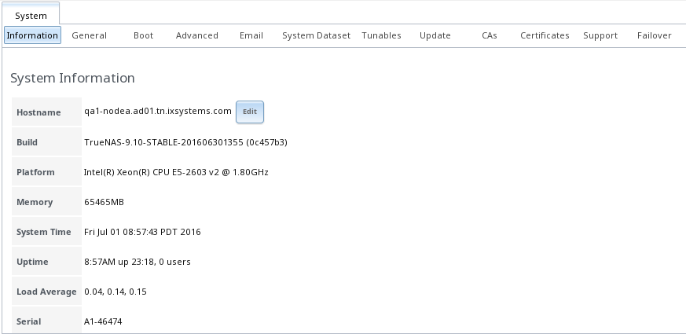

The information includes the hostname, build version, type of CPU (platform), the amount of memory, the current system time, the system's uptime, the
current load average, and the system's serial number.

To change the system's hostname, click its "Edit" button, type in the new hostname, and click "OK". The hostname must include the domain name. If the network
does not use a domain name add *.local* to the end of the hostname.

.. _General:

General
-------

:menuselection:`System --> General` is shown in :numref:`Figure %s: General Screen <tn_system2a>`.

.. _tn_system2a:

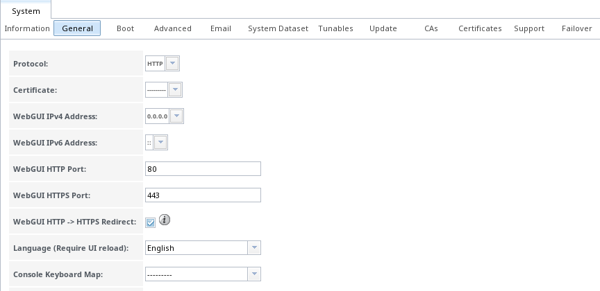
    
Table 5.2a summarizes the settings that can be configured using the General tab:

**Table 5.2a: General Configuration Settings**

+----------------------+----------------+--------------------------------------------------------------------------------------------------------------------------------+
| Setting              | Value          | Description                                                                                                                    |
|                      |                |                                                                                                                                |
+======================+================+================================================================================================================================+
| Protocol             | drop-down menu | protocol to use when connecting to the administrative GUI from a browser; if you change the default of *HTTP* to               |
|                      |                | *HTTPS* or to                                                                                                                  |
|                      |                | *HTTP+HTTPS*, select the certificate to use in "Certificate"; if you do not have a certificate, first create a CA (in `CAs`_)  |
|                      |                | then the certificate (in `Certificates`_)                                                                                      |
|                      |                |                                                                                                                                |
+----------------------+----------------+--------------------------------------------------------------------------------------------------------------------------------+
| Certificate          | drop-down menu | required for *HTTPS*; browse to the location of the certificate to use for encrypted connections                               |
|                      |                |                                                                                                                                |
+----------------------+----------------+--------------------------------------------------------------------------------------------------------------------------------+
| WebGUI IPv4 Address  | drop-down menu | choose from a list of recent IP addresses to limit the one to use when accessing the administrative GUI; the                   |
|                      |                | built-in HTTP server will automatically bind to the wildcard address of *0.0.0.0* (any address) and will issue an              | 
|                      |                | alert if the specified address becomes unavailable                                                                             |
|                      |                |                                                                                                                                |
+----------------------+----------------+--------------------------------------------------------------------------------------------------------------------------------+
| WebGUI IPv6 Address  | drop-down menu | choose from a list of recent IPv6 addresses to limit the one to use when accessing the administrative GUI; the                 |
|                      |                | built-in HTTP server will automatically bind to any address and will issue an alert                                            |
|                      |                | if the specified address becomes unavailable                                                                                   |
|                      |                |                                                                                                                                |
+----------------------+----------------+--------------------------------------------------------------------------------------------------------------------------------+
| WebGUI HTTP Port     | integer        | allows you to configure a non-standard port for accessing the administrative GUI over HTTP; changing this setting              |
|                      |                | may require you to                                                                                                             |
|                      |                | `change a firefox configuration setting <http://www.redbrick.dcu.ie/%7Ed_fens/articles/Firefox:_This_Address_is_Restricted>`_  |
|                      |                |                                                                                                                                |
+----------------------+----------------+--------------------------------------------------------------------------------------------------------------------------------+
| WebGUI HTTPS Port    | integer        | allows you to configure a non-standard port for accessing the administrative GUI over HTTPS                                    |
|                      |                |                                                                                                                                |
+----------------------+----------------+--------------------------------------------------------------------------------------------------------------------------------+
| WebGUI HTTPS -->     | checkbox       | when this box is checked, *HTTP* connections will be automatically redirected to                                               |
| HTTPS Redirect       |                | *HTTPS* if                                                                                                                     |
|                      |                | *HTTPS* is selected in "Protocol", otherwise such connections will fail                                                        |
|                      |                |                                                                                                                                |
|                      |                |                                                                                                                                |
+----------------------+----------------+--------------------------------------------------------------------------------------------------------------------------------+
| Language             | drop-down menu | select the localization from the drop-down menu and reload the browser; you can view the status of localization at             |
|                      |                | `pootle.freenas.org <http://pootle.freenas.org/>`_                                                                             |
|                      |                |                                                                                                                                |
+----------------------+----------------+--------------------------------------------------------------------------------------------------------------------------------+
| Console Keyboard Map | drop-down menu | select the keyboard layout                                                                                                     |
|                      |                |                                                                                                                                |
+----------------------+----------------+--------------------------------------------------------------------------------------------------------------------------------+
| Timezone             | drop-down menu | select the timezone from the drop-down menu                                                                                    |
|                      |                |                                                                                                                                |
+----------------------+----------------+--------------------------------------------------------------------------------------------------------------------------------+
| Syslog level         | drop-down menu | when "Syslog server" is defined, only logs matching this level are sent                                                        |
|                      |                |                                                                                                                                |
+----------------------+----------------+--------------------------------------------------------------------------------------------------------------------------------+
| Syslog server        | string         | *IP address_or_hostname:optional_port_number* of remote syslog server to send logs to; once set, log entries will be written   |
|                      |                | to both the console and the remote server                                                                                      |
|                      |                |                                                                                                                                |
+----------------------+----------------+--------------------------------------------------------------------------------------------------------------------------------+

If you make any changes, click the "Save" button.

This screen also contains the following buttons:

**Factory Restore:** resets the configuration database to the default base version. However, it does not delete user SSH keys or any other data stored in a
user's home directory. Since any configuration changes stored in the configuration database will be erased, this option is handy if you mess up your system or
wish to return a test system to the original configuration.

**Save Config:** used to save a backup copy of the current configuration database in the format *hostname-version-architecture* to the system being used to access the
administrative interface. It is recommended to always save the configuration after making any configuration changes. Note that while TrueNAS® automatically backs up the configuration
database to the system dataset every morning at 3:45, this backup will not occur if the system is shutdown at that time and the backup will not be available if the system dataset is
stored on the boot pool and the boot pool becomes unavailable. You can determine and change the location of the system dataset using :menuselection:`System --> System Dataset`.

**Upload Config:** allows you to browse to the location of a previously saved configuration file in order to restore that configuration. The screen will turn
red as an indication that the system will need to reboot in order to load the restored configuration.

**NTP Servers:** The network time protocol (NTP) is used to synchronize the time on the computers in a network. Accurate time is necessary for the successful
operation of time sensitive applications such as Active Directory or other directory services. By default, TrueNAS® is pre-configured to use three public NTP
servers. If your network is using a directory service, ensure that the TrueNAS® system and the server running the directory service have been configured to
use the same NTP servers. To add a NTP server on the TrueNAS® system, click :menuselection:`NTP Servers --> Add NTP Server` to open the screen shown in
:numref:`Figure %s: Add a NTP Server <ntp1>`. Table 5.2b summarizes the options when adding an NTP server.
`ntp.conf(5) <http://www.freebsd.org/cgi/man.cgi?query=ntp.conf>`_
explains these options in more detail.

.. _ntp1:

.. figure:: images/ntp1.png

**Table 5.2b: NTP Servers Configuration Options**

+-------------+-----------+-----------------------------------------------------------------------------------------------------------------------+
| **Setting** | **Value** | **Description**                                                                                                       |
|             |           |                                                                                                                       |
|             |           |                                                                                                                       |
+=============+===========+=======================================================================================================================+
| Address     | string    | name of NTP server                                                                                                    |
|             |           |                                                                                                                       |
+-------------+-----------+-----------------------------------------------------------------------------------------------------------------------+
| Burst       | checkbox  | recommended when "Max. Poll" is greater than *10*; only use on your own servers i.e.                                  |
|             |           | **do not** use with a public NTP server                                                                               |
|             |           |                                                                                                                       |
+-------------+-----------+-----------------------------------------------------------------------------------------------------------------------+
| IBurst      | checkbox  | speeds the initial synchronization (seconds instead of minutes)                                                       |
|             |           |                                                                                                                       |
+-------------+-----------+-----------------------------------------------------------------------------------------------------------------------+
| Prefer      | checkbox  | should only be used for NTP servers that are known to be highly accurate, such as those with time monitoring hardware |
|             |           |                                                                                                                       |
+-------------+-----------+-----------------------------------------------------------------------------------------------------------------------+
| Min. Poll   | integer   | power of 2 in seconds; can not be lower than                                                                          |
|             |           | *4* or higher than "Max. Poll"                                                                                        |
|             |           |                                                                                                                       |
+-------------+-----------+-----------------------------------------------------------------------------------------------------------------------+
| Max. Poll   | integer   | power of 2 in seconds; can not be higher than                                                                         |
|             |           | *17* or lower than "Min. Poll"                                                                                        |
|             |           |                                                                                                                       |
+-------------+-----------+-----------------------------------------------------------------------------------------------------------------------+
| Force       | checkbox  | forces the addition of the NTP server, even if it is currently unreachable                                            |
|             |           |                                                                                                                       |
+-------------+-----------+-----------------------------------------------------------------------------------------------------------------------+

.. index:: Boot

.. _Boot:

Boot
----

TrueNAS® supports a feature of ZFS known as multiple boot environments. With multiple boot environments, the process of updating the operating system becomes
a low-risk operation as the updater automatically creates a snapshot of your current boot environment and adds it to the boot menu before applying the update.
If the update fails, simply reboot the system and select the previous boot environment from the boot menu to instruct the system to go back to that system
state.

.. note:: do not confuse boot environments with the configuration database. Boot environments are a snapshot of the
   *operating system* at a specified time. When a TrueNAS® system boots, it loads the specified boot environment, or operating system, then reads the
   configuration database in order to load the current configuration values. If your intent is to make configuration changes, rather than operating system
   changes, make a backup of the configuration database first using :menuselection:`System --> General` --> Save Config.

As seen in :numref:`Figure %s: Viewing Boot Environments <be1g>`, two boot environments are created when TrueNAS® is installed. The system will boot into the *default* boot environment
and users can make their changes and update from this version. The other boot environment, named *Initial-Install* can be booted into if the system needs to be returned to
a pristine, non-configured version of the installation. If you used the initial configuration wizard, a third boot environment called *Wizard-date* is also
created indicating the date and time the wizard was run.

.. _be1g:

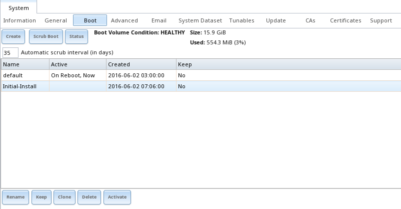

Each boot environment entry contains the following information:

* **Name:** the name of the boot entry as it will appear in the boot menu.

* **Active:** indicates which entry will boot by default if the user does not select another entry in the boot menu.

* **Created:** indicates the date and time the boot entry was created.

* **Keep:** indicates whether or not this boot environment can be pruned if an update does not have enough space to proceed. Click the entry's "Keep" button if that boot environment should
  not be automatically pruned.

Highlight an entry to view its configuration buttons.  The following configuration buttons are available:

* **Rename:** used to change the name of the boot environment.

* **Keep/Unkeep:** used to toggle whether or not the updater can prune (automatically delete) this boot environment if there is not enough space to proceed with the update.
  
* **Clone:** used to create a copy of the highlighted boot environment.

* **Delete:** used to delete the highlighted entries, which also removes these entries from the boot menu. Since you can not delete an entry that has been activated, this button will
  not appear for the active boot environment. If you need to delete an entry that you created and it is currently  activated, first activate another entry, which will clear the
  *On reboot* field of the currently activated entry. Note that this button will not be displayed for the "default" boot environment as this entry is needed in order to return the system to
  the original installation state.

* **Activate:** will only appear on entries which are not currently set to "Active". Changes the selected entry to the default boot entry on next boot. Its
  status will change to "On Reboot" and the current "Active" entry will change from "On Reboot, Now" to "Now", indicating that it was used on the last boot
  but won't be used on the next boot.

The buttons above the boot entries can be used to:

* **Create:** a manual boot environment. A pop-up menu will prompt you to input a "Name" for the boot environment. When inputting the name, only alphanumeric,
  underscores, and dashes are allowed.

* **Scrub Boot:** can be used to perform a manual scrub of the boot device(s). By default, the boot device is scrubbed every 35 days. To change the default
  interval, input a different number in the "Automatic scrub interval (in days)" field.The date and results of the last scrub are listed in this screen. The
  condition of the boot device should be listed as *HEALTHY*.

* **Status:** click this button to see the status of the boot device(s). In the example shown in :numref:`Figure %s: Viewing the Status of the Boot Device <tn_be2>`, both devices in the boot
  mirror are *ONLINE*.

.. _tn_be2:

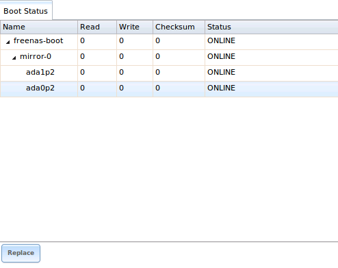

If one of the boot devices has a "Status" of *OFFLINE*, click the device that needs to be replaced, click its "Replace" button, select the new replacement
device, and click "Replace Disk" to rebuild the boot mirror.

:numref:`Figure %s: Boot Environments in Boot Menu <tn_be3a>` shows a sample boot menu.

.. _tn_be3a:

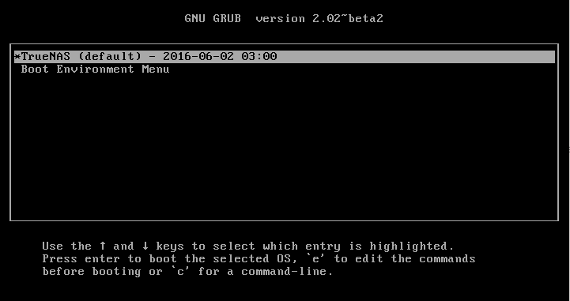

The first entry is the active boot environment, or the one that the system has been configured to boot into. To boot into a different boot environment, press the :kbd:`spacebar` to pause
this screen, use the down arrow to select "Boot Environment Menu", and press :kbd:`Enter`. This will present a menu that displays the other available boot environments. Use your up/down
arrows to select the desired boot environment and press :kbd:`Enter` to boot into it. If you wish to always boot into that boot environment, go to :menuselection:`System --> Boot`,
highlight that entry, and click the "Activate" button.

.. _Advanced:

Advanced
--------

:menuselection:`System --> Advanced` is shown in :numref:`Figure %s: Advanced Screen <tn_system3>`. The configurable settings are summarized in Table 5.4a.

.. _tn_system3:

.. figure:: images/tn_system3.png

**Table 5.4a: Advanced Configuration Settings**

+-----------------------------------------+----------------------------------+------------------------------------------------------------------------------+
| Setting                                 | Value                            | Description                                                                  |
|                                         |                                  |                                                                              |
+=========================================+==================================+==============================================================================+
| Enable Console Menu                     | checkbox                         | unchecking this box removes the console menu shown in Figure 3a              |
|                                         |                                  |                                                                              |
+-----------------------------------------+----------------------------------+------------------------------------------------------------------------------+
| Use Serial Console                      | checkbox                         | do **not** check this box if your serial port is disabled                    |
|                                         |                                  |                                                                              |
+-----------------------------------------+----------------------------------+------------------------------------------------------------------------------+
| Serial Port Address                     | string                           | serial port address written in hex                                           |
|                                         |                                  |                                                                              |
+-----------------------------------------+----------------------------------+------------------------------------------------------------------------------+
| Serial Port Speed                       | drop-down menu                   | select the speed used by the serial port                                     |
|                                         |                                  |                                                                              |
+-----------------------------------------+----------------------------------+------------------------------------------------------------------------------+
| Enable screen saver                     | checkbox                         | enables/disables the console screen saver                                    |
|                                         |                                  |                                                                              |
+-----------------------------------------+----------------------------------+------------------------------------------------------------------------------+
| Enable powerd (Power Saving Daemon)     | checkbox                         | `powerd(8) <http://www.freebsd.org/cgi/man.cgi?query=powerd>`_               |
|                                         |                                  | monitors the system state and sets the CPU frequency accordingly             |
|                                         |                                  |                                                                              |
+-----------------------------------------+----------------------------------+------------------------------------------------------------------------------+
| Show console messages in the footer     | checkbox                         | will display console messages in real time at bottom of browser; click the   |
|                                         |                                  | console to bring up a scrollable screen; check the "Stop refresh" box in the |
|                                         |                                  | scrollable screen to pause updating and uncheck the box to continue to watch |
|                                         |                                  | the messages as they occur                                                   |
|                                         |                                  |                                                                              |
+-----------------------------------------+----------------------------------+------------------------------------------------------------------------------+
| Show tracebacks in case of fatal errors | checkbox                         | provides a pop-up of diagnostic information when a fatal error occurs        |
|                                         |                                  |                                                                              |
+-----------------------------------------+----------------------------------+------------------------------------------------------------------------------+
| Show advanced fields by default         | checkbox                         | several GUI menus provide an "Advanced Mode" button to access additional     |
|                                         |                                  | features; enabling this shows these features by default                      |
|                                         |                                  |                                                                              |
+-----------------------------------------+----------------------------------+------------------------------------------------------------------------------+
| Enable autotune                         | checkbox                         | enables :ref:`autotune` which attempts to optimize the system depending      |
|                                         |                                  | upon the hardware which is installed                                         |
|                                         |                                  |                                                                              |
+-----------------------------------------+----------------------------------+------------------------------------------------------------------------------+
| Enable debug kernel                     | checkbox                         | if checked, next boot will boot into a debug version of the kernel           |
|                                         |                                  |                                                                              |
+-----------------------------------------+----------------------------------+------------------------------------------------------------------------------+
| Enable automatic upload of kernel       | checkbox                         | if checked, kernel crash dumps and telemetry (some system stats, collectd    |
| crash dumps and daily telemetry         |                                  | RRDs, and select syslog messages) are automatically sent to the  development |
|                                         |                                  | team for diagnosis                                                           |
|                                         |                                  |                                                                              |
+-----------------------------------------+----------------------------------+------------------------------------------------------------------------------+
| MOTD banner                             | string                           | input the message to be seen when a user logs in via SSH                     |
|                                         |                                  |                                                                              |
+-----------------------------------------+----------------------------------+------------------------------------------------------------------------------+
| Periodic Notification User              | drop-down menu                   | select the user to receive security output emails; this output runs nightly  |
|                                         |                                  | but only sends an email when the system reboots or encounters an error       |
|                                         |                                  |                                                                              |
+-----------------------------------------+----------------------------------+------------------------------------------------------------------------------+
| Remote Graphite Server hostname         | string                           | input the IP address or hostname of a remote server that is running          |
|                                         |                                  | a `Graphite <http://graphite.wikidot.com/>`_ server                          |
|                                         |                                  |                                                                              |
+-----------------------------------------+----------------------------------+------------------------------------------------------------------------------+

If you make any changes, click the "Save" button.

This tab also contains the following buttons:

**Backup:** used to backup the TrueNAS® configuration and ZFS layout, and, optionally, the data, to a remote system over an encrypted connection. Click this button to open the configuration
screen shown in :numref:`Figure %s: Backup Configuration Screen <backup1>`. Table 5.4b summarizes the configuration options. The only requirement for the remote system is
that it has sufficient space to hold the backup and it is running an SSH server on port 22. The remote system does not have to be formatted with ZFS as the
backup will be saved as a binary file. To restore a saved backup, use the "12) Restore from a backup" option of the TrueNAS® console menu shown in Figure 3a.

.. warning:: the backup and restore options are meant for disaster recovery. If you restore a system, it will be returned to the point in time that the backup
             was created. If you select the option to save the data, any data created after the backup was made will be lost. If you do **not** select the
             option to save the data, the system will be recreated with the same ZFS layout, but with **no** data.

.. warning:: the backup function **IGNORES ENCRYPTED POOLS**. Do not use it to backup systems with encrypted pools.

**Save Debug:** used to generate a text file of diagnostic information. Once the debug is created, it will prompt for the location to save the generated ASCII text file.

.. _backup1:

.. figure:: images/backup1.png

**Table 5.4b: Backup Configuration Settings**

+-----------------------------------------+----------------+------------------------------------------------------------------------------------------------+
| Setting                                 | Value          | Description                                                                                    |
|                                         |                |                                                                                                |
+=========================================+================+================================================================================================+
| Hostname or IP address                  | string         | input the IP address of the remote system, or the hostname if DNS is properly configured       |
|                                         |                |                                                                                                |
+-----------------------------------------+----------------+------------------------------------------------------------------------------------------------+
| User name                               | string         | the user account must exist on the remote system and have permissions to write to the "Remote  |
|                                         |                | directory"                                                                                     |
|                                         |                |                                                                                                |
+-----------------------------------------+----------------+------------------------------------------------------------------------------------------------+
| Password                                | string         | input and confirm the password associated with the user account                                |
|                                         |                |                                                                                                |
+-----------------------------------------+----------------+------------------------------------------------------------------------------------------------+
| Remote directory                        | string         | the full path to the directory to save the backup to                                           |
|                                         |                |                                                                                                |
+-----------------------------------------+----------------+------------------------------------------------------------------------------------------------+
| Backup data                             | checkbox       | by default, the backup is very quick as only the configuration database and the ZFS pool and   |
|                                         |                | database layout are saved; check this box to also save the data (which may take some time,     |
|                                         |                | depending upon the size of the pool and speed of the network)                                  |
|                                         |                |                                                                                                |
+-----------------------------------------+----------------+------------------------------------------------------------------------------------------------+
| Compress backup                         | checkbox       | if checked, gzip will be used to compress the backup which reduces the transmission size when  |
|                                         |                | "Backup data" is checked                                                                       |
|                                         |                |                                                                                                |
+-----------------------------------------+----------------+------------------------------------------------------------------------------------------------+
| Use key authentication                  | checkbox       | if checked, the public key of the *root* user must be stored in                                |
|                                         |                | :file:`~root/.ssh/authorized_keys` on the remote system and that key should **not** be         |
|                                         |                | protected by a passphrase; see :ref:`Rsync over SSH Mode` for instructions on how to generate  |
|                                         |                | a key pair                                                                                     |
|                                         |                |                                                                                                |
+-----------------------------------------+----------------+------------------------------------------------------------------------------------------------+

.. index:: Autotune
.. _Autotune:

Autotune
~~~~~~~~

TrueNAS® provides an autotune script which attempts to optimize the system. The "Enable autotune" checkbox in :menuselection:`System --> Advanced` is checked by default, meaning that
this script runs automatically. It is recommended to not disable this setting unless you are advised to do so by an iXsystems support engineer.

If the autotune script adjusts any settings, the changed values will appear in :menuselection:`System --> Tunables`. While you can modify, which will override, these values, speak to your
support engineer before doing so as this may have a negative impact on system performance. Note that if you delete a tunable that was created by autotune, it will be recreated at next boot.

If you wish to read the script to see which checks are performed, the script is located in :file:`/usr/local/bin/autotune`.

.. index:: Email
.. _Email:

Email
-----

:menuselection:`System --> Email`, shown in :numref:`Figure %s: Email Screen <tn_system4>`, is used to configure the email settings on the TrueNAS® system. Table 5.5a summarizes the settings
that can be configured using the Email tab.

.. note:: it is important to configure the system so that it can successfully send emails. An automatic script sends a nightly email to the *root* user
   account containing important information such as the health of the disks. :ref:`Alert` events are also emailed to the *root* user account.

.. _tn_system4:

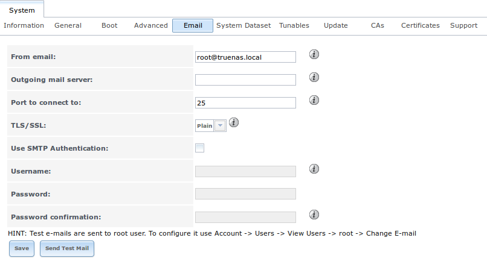

**Table 5.5a: Email Configuration Settings**

+----------------------+----------------------+-------------------------------------------------------------------------------------------------+
| **Setting**          | **Value**            | **Description**                                                                                 |
|                      |                      |                                                                                                 |
+======================+======================+=================================================================================================+
| From email           | string               | the **from** email address to be used when sending email notifications                          |
|                      |                      |                                                                                                 |
+----------------------+----------------------+-------------------------------------------------------------------------------------------------+
| Outgoing mail server | string or IP address | hostname or IP address of SMTP server                                                           |
|                      |                      |                                                                                                 |
+----------------------+----------------------+-------------------------------------------------------------------------------------------------+
| Port to connect to   | integer              | SMTP port number, typically *25*,                                                               |
|                      |                      | *465* (secure SMTP), or                                                                         |
|                      |                      | *587* (submission)                                                                              |
|                      |                      |                                                                                                 |
+----------------------+----------------------+-------------------------------------------------------------------------------------------------+
| TLS/SSL              | drop-down menu       | encryption type; choices are *Plain*,                                                           |
|                      |                      | *SSL*, or                                                                                       |
|                      |                      | *TLS*                                                                                           |
|                      |                      |                                                                                                 |
+----------------------+----------------------+-------------------------------------------------------------------------------------------------+
| Use                  | checkbox             | enables/disables                                                                                |
| SMTP                 |                      | `SMTP AUTH <https://en.wikipedia.org/wiki/SMTP_Authentication>`_                                |
| Authentication       |                      | using PLAIN SASL; if checked, input the required "Username" and "Password"                      |
|                      |                      |                                                                                                 |
+----------------------+----------------------+-------------------------------------------------------------------------------------------------+
| Username             | string               | input the username if the SMTP server requires authentication                                   |
|                      |                      |                                                                                                 |
+----------------------+----------------------+-------------------------------------------------------------------------------------------------+
| Password             | string               | input the password if the SMTP server requires authentication                                   |
|                      |                      |                                                                                                 |
+----------------------+----------------------+-------------------------------------------------------------------------------------------------+

Click the "Send Test Mail" button to verify that the configured email settings are working. If the test email fails, double-check the email address to send
emails to by clicking the "Change E-mail" button for the *root* account in :menuselection:`Account --> Users --> View Users`.

.. index:: System Dataset

.. _System Dataset:

System Dataset
--------------

:menuselection:`System --> System Dataset`, shown in :numref:`Figure %s: System Dataset Screen <tn_system5>`, is used to select the pool which will contain the persistent system dataset. The system
dataset stores debugging core files and Samba4 metadata such as the user/group cache and share level permissions. If the TrueNAS® system is configured to be
a Domain Controller, all of the domain controller state is stored there as well, including domain controller users and groups.

.. _tn_system5:

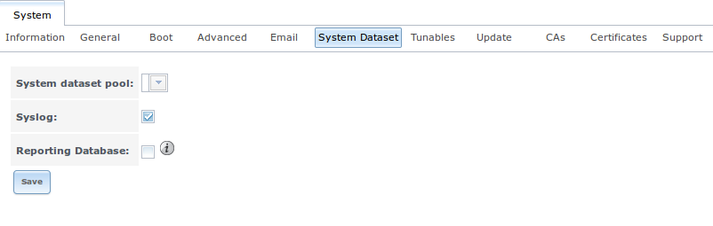

.. note:: encrypted volumes will not be displayed in the "System dataset pool" drop-down menu.

The system dataset can optionally be configured to also store the system log and :ref:`Reporting` information. If there are lots of log entries or reporting
information, moving these to the system dataset will prevent :file:`/var/` on the device holding the operating system from filling up as :file:`/var/` has
limited space. 

Use the drop-down menu to select the ZFS volume (pool) to contain the system dataset. 

.. note:: it is recommended to store the system dataset on the :file:`freenas-boot` pool. For this reason, a yellow system alert will be generated when the system dataset is configured to
   use another pool.

To store the system log on the system dataset, check the "Syslog" box.

To store the reporting information on the system dataset, check the "Reporting Database" box.

If you make any changes, click the "Save" button to save them.

If you change the pool storing the system dataset at a later time, TrueNAS® will automatically migrate the existing data in the system dataset to the new
location.

.. index:: Tunables
.. _Tunables:

Tunables
--------

:menuselection:`System --> Tunables` can be used to manage the following:

#. **FreeBSD sysctls:** a `sysctl(8) <http://www.freebsd.org/cgi/man.cgi?query=sysctl>`_ makes changes to the FreeBSD kernel running on a TrueNAS® system and
   can be used to tune the system.

#. **FreeBSD loaders:** a loader is only loaded when a FreeBSD-based system boots and can be used to pass a parameter to the kernel or to load an additional
   kernel module such as a FreeBSD hardware driver.

#. **FreeBSD rc.conf options:** `rc.conf(5) <https://www.freebsd.org/cgi/man.cgi?query=rc.conf>`_ is used to
   pass system configuration options to the system startup scripts as the system boots. Since TrueNAS® has been optimized for storage, not all of the
   services mentioned in rc.conf(5) are available for configuration.

.. warning:: adding a sysctl, loader, or rc.conf option is an advanced feature. A sysctl immediately affects the kernel running the TrueNAS® system and a
   loader could adversely affect the ability of the TrueNAS® system to successfully boot.
   **Do not create a tunable on a production system unless you understand and have tested the ramifications of that change.** 

Since sysctl, loader, and rc.conf values are specific to the kernel parameter to be tuned, the driver to be loaded, or the service to configure, descriptions
and suggested values can be found in the man page for the specific driver and in many sections of the
`FreeBSD Handbook <http://www.freebsd.org/doc/en_US.ISO8859-1/books/handbook/>`_.

To add a loader, sysctl, or rc.conf option, go to :menuselection:`System --> Tunables --> Add Tunable`, to access the screen shown in seen in
:numref:`Figure %s: Adding a Tunable <tunable1>`.

.. _tunable1:

.. figure:: images/tunable.png

Table 5.7a summarizes the options when adding a tunable.

**Table 5.7a: Adding a Tunable**

+-------------+-------------------+-------------------------------------------------------------------------------------+
| **Setting** | **Value**         | **Description**                                                                     |
|             |                   |                                                                                     |
|             |                   |                                                                                     |
+=============+===================+=====================================================================================+
| Variable    | string            | typically the name of the sysctl or driver to load, as indicated by its man page    |
|             |                   |                                                                                     |
+-------------+-------------------+-------------------------------------------------------------------------------------+
| Value       | integer or string | value to associate with "Variable"; typically this is set to *YES*                  |
|             |                   | to enable the sysctl or driver specified by the "Variable"                          |
|             |                   |                                                                                     |
+-------------+-------------------+-------------------------------------------------------------------------------------+
| Type        | drop-down menu    | choices are *Loader*,                                                               |
|             |                   | *rc.conf*, or                                                                       |
|             |                   | *Sysctl*                                                                            |
|             |                   |                                                                                     |
+-------------+-------------------+-------------------------------------------------------------------------------------+
| Comment     | string            | optional, but a useful reminder for the reason behind adding this tunable           |
|             |                   |                                                                                     |
+-------------+-------------------+-------------------------------------------------------------------------------------+
| Enabled     | checkbox          | uncheck if you would like to disable the tunable without deleting it                |
|             |                   |                                                                                     |
+-------------+-------------------+-------------------------------------------------------------------------------------+

.. note:: as soon as you add or edit a *Sysctl*, the running kernel will change that variable to the value you specify. However, when you add a
   *Loader* or
   *rc.conf*, the changes you make will not take effect until the system is rebooted. Regardless of the type of tunable, your changes will persist at each
   boot and across upgrades unless the tunable is deleted or its "Enabled" checkbox is unchecked.

Any tunables that you add will be listed in :menuselection:`System --> Tunables`. To change the value of an existing tunable, click its "Edit" button. To
remove a tunable, click its "Delete" button.

Some sysctls are read-only, meaning that they require a reboot in order to enable their setting. You can determine if a sysctl is read-only by first
attempting to change it from :ref:`Shell`. For example, to change the value of *net.inet.tcp.delay_ack* to *1*, use the command
:command:`sysctl net.inet.tcp.delay_ack=1`. If the sysctl value is read-only, an error message will indicate that the setting is read-only. If you do not get
an error, the setting is now applied. For the setting to be persistent across reboots, the sysctl must still be added in :menuselection:`System --> Tunables`.

The GUI does not display the sysctls that are pre-set when TrueNAS® is installed. TrueNAS® |version| ships with the following sysctls set::

 kern.metadelay=3
 kern.dirdelay=4
 kern.filedelay=5
 kern.coredump=0
 net.inet.carp.preempt=1
 debug.ddb.textdump.pending=1
 vfs.nfsd.tcpcachetimeo=300
 vfs.nfsd.tcphighwater=150000
 vfs.zfs.vdev.larger_ashift_minimal=0

**Do not add or edit these default sysctls** as doing so may render the system unusable.

The GUI does not display the loaders that are pre-set when TrueNAS® is installed. TrueNAS® |version| ships with the following loaders set::

 autoboot_delay="2"
 loader_logo="truenas-logo"
 loader_menu_title="Welcome to TrueNAS"
 loader_brand="truenas-brand"
 loader_version=" "
 kern.cam.boot_delay=10000
 debug.debugger_on_panic=1
 debug.ddb.textdump.pending=1
 hw.hptrr.attach_generic=0
 ispfw_load="YES"
 module_path="/boot/kernel;/boot/modules;/usr/local/modules"
 net.inet6.ip6.auto_linklocal="0"
 vfs.zfs.vol.mode=2
 kern.geom.label.disk_ident.enable="0"
 hint.ahciem.0.disabled="1"
 hint.ahciem.1.disabled="1"
 kern.msgbufsize="524288"
 kern.ipc.nmbclusters="262144"
 kern.hwpmc.nbuffers="4096"
 kern.hwpmc.nsamples="4096"
 hw.memtest.tests="0"
 vfs.zfs.trim.enabled="0"
 kern.cam.ctl.ha_mode=2

**Do not add or edit the default tunables** as doing so may render the system unusable.

The ZFS version used in |version| deprecates the following tunables::

 vfs.zfs.write_limit_override
 vfs.zfs.write_limit_inflated
 vfs.zfs.write_limit_max
 vfs.zfs.write_limit_min
 vfs.zfs.write_limit_shift
 vfs.zfs.no_write_throttle

If you upgrade from an earlier version of TrueNAS® where these tunables are set, they will automatically be deleted for you. You should not try to add these
tunables back.

.. _Update:

Update
------

TrueNAS® uses signed updates rather than point releases. This provides the TrueNAS® administrator more flexibility in deciding when to upgrade the system in
order to apply system patches or to add new drivers or features. It also allows the administrator to "test drive" an upcoming release. Combined with boot
environments, an administrator can try new features or apply system patches with the knowledge that they can revert to a previous version of the operating
system, using the instructions in :ref:`If Something Goes Wrong`. Signed patches also mean that the administrator no longer has to manually download the GUI
upgrade file and its associated checksum in order to perform an upgrade.

:numref:`Figure %s: Update Options <tn_update1a>` shows an example of the :menuselection:`System --> Update` screen. 

.. _tn_update1a:

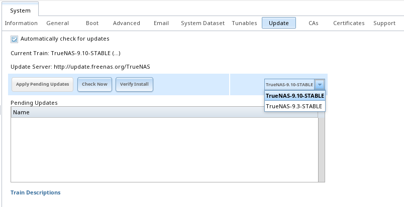

By default, the system will automatically check for updates and will issue an alert when a new update becomes available. To disable this default, uncheck the
box "Automatically check for updates".

This screen lists the URL of the official update server, should that
information be needed in a network with outbound firewall
restrictions. It also indicates which software branch, or train, the
system is currently tracking updates for. The following trains are
available:
  
* **TrueNAS-9.10-STABLE:**  this is the
  **recommended train for production use**. Once new fixes and
  features have been tested as production-ready, they are added to
  this train. It is recommended to follow this train and to apply any
  of its pending updates. 

* **TrueNAS-9.3-STABLE:** this is the maintenance-only mode for an
  older version of FreeNAS®. Unless an iX support engineer indicates
  otherwise, it is recommended to upgrade to "FreeNAS-9.10-STABLE", by
  selecting that train, to ensure that the system receives bug fixes
  and new features.

The "Verify Install" button will go through the operating system files in the current installation, looking for any inconsistencies. When finished, a pop-up
menu will list any files with checksum mismatches or permission errors.

To see if any updates are available, click the "Check Now" button. If there are any updates available, they will be listed.

To apply the updates now, make sure that there aren't any clients currently connected to the TrueNAS® system and that a scrub is not running. Click the "OK"
button to download and apply the updates. Note that some updates will automatically reboot the system once they are applied.

.. warning:: each update creates a boot environment and if the boot device does not have sufficient space to hold another boot environment, the upgrade will
   fail. If you need to create more space on the boot device, use :menuselection:`System --> Boot` to review your current boot environments and to delete the
   ones you no longer plan to boot into.

Alternately, you can download the updates now and apply them later. To do so, uncheck the "Apply updates after downloading" box before pressing "OK". In this
case, this screen will close once the updates are downloaded and the downloaded updates will be listed in the "Pending Updates" section of the screen shown
in :numref:`Figure %s: Update Options <tn_update1a>`. When you are ready to apply the previously downloaded updates, click the "Apply Pending Updates" button and be aware that the system may
reboot after the updates are applied.

.. _Updating an HA System:

Updating an HA System
~~~~~~~~~~~~~~~~~~~~~

If the TrueNAS® array has been configured for High Availability (HA), the update process must be started on the active node. Once the update is complete, the standby node will automatically
reboot. Wait for it to come back up by monitoring the remote console or the graphical administrative interface of the standby node.

At this point, the active mode may issue an alert indicating that there is a firmware version mismatch. This is expected when an update also updates the HBA version.

Once the standby node has finished booting up, it is important to perform a failover by rebooting the current active node. This action tells the standby node to import the current
configuration and restart its services.

Once the previously active node comes back up as a standby node, use :menuselection:`System --> Update` to apply the update on the current active node (which was previously the passive
node). Once complete, the now standby node will reboot a second time.

.. _If Something Goes Wrong:

If Something Goes Wrong
~~~~~~~~~~~~~~~~~~~~~~~

If an update fails, an alert will be issued and the details will be written to :file:`/data/update.failed`.

To return to a previous version of the operating system, you will need physical or IPMI access to the TrueNAS® console. Reboot the system and press any key
(except :kbd:`Enter`) when the boot menu appears to pause the boot. Select an entry with a date prior to the update then press  :kbd:`Enter` in order to boot
into that version of the operating system, before the update was applied.

.. index:: Upgrade ZFS Pool
.. _Upgrading a ZFS Pool:

Upgrading a ZFS Pool
~~~~~~~~~~~~~~~~~~~~

ZFS pools can be upgraded from the graphical administrative interface.

Before upgrading an existing ZFS pool, be aware of the following caveats first:

* the pool upgrade is a one-way street meaning that **if you change your mind you can not go back to an earlier ZFS version or downgrade to an earlier version
  of TrueNAS® that does not support those feature flags.**

* before performing any operation that may affect the data on a storage disk, **always backup your data first and verify the integrity of the backup.**
  While it is unlikely that the pool upgrade will affect the data, it is always better to be safe than sorry.

* upgrading a ZFS pool is **optional**. You do not need to upgrade the pool if you do not need newer feature flags or if you want to keep the possibility of
  reverting to an earlier version of TrueNAS® or repurposing the disks in another operating system that supports ZFS. If you do decide to upgrade the pool to
  the latest feature flags, you will not be able to import that pool into another operating system that does not yet support those feature flags.

To perform the ZFS pool upgrade, go to :menuselection:`Storage --> Volumes --> View Volumes` and highlight the volume (ZFS pool) to upgrade. Click the
"Upgrade" button. A warning message will remind you that a pool upgrade is irreversible. Click "OK" to proceed with the upgrade.

The upgrade itself should only take a seconds and is non-disruptive. This means that you do not need to stop any sharing services in order to upgrade the
pool. However, you should choose to upgrade when the pool is not being heavily used. The upgrade process will suspend I/O for a short period, but should be
nearly instantaneous on a quiet pool.

.. index:: CA, Certificate Authority
.. _CAs:

CAs
---

TrueNAS® can act as a Certificate Authority (CA). If you plan to use SSL or TLS to encrypt any of the connections to the TrueNAS® system, you will need to
first create a CA, then either create or import the certificate to be used for encrypted connections. Once you do this, the certificate will appear in the
drop-down menus for all the services that support SSL or TLS.

:numref:`Figure %s: Initial CA Screen <tn_ca1>` shows the initial screen if you click :menuselection:`System --> CAs`.

.. _tn_ca1:

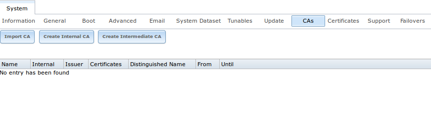

If your organization already has a CA, you can import the CA's certificate and key. Click the "Import CA" button to open the configuration screen shown in
:numref:`Figure %s: Importing a CA <ca2a>`. The configurable options are summarized in Table 5.9a.

.. _ca2a:

.. figure:: images/ca2a.png

**Table 5.9a: Importing a CA Options**

+----------------------+----------------------+---------------------------------------------------------------------------------------------------+
| **Setting**          | **Value**            | **Description**                                                                                   |
|                      |                      |                                                                                                   |
+======================+======================+===================================================================================================+
| Name                 | string               | mandatory; input a descriptive name for the CA                                                    |
|                      |                      |                                                                                                   |
+----------------------+----------------------+---------------------------------------------------------------------------------------------------+
| Certificate          | string               | mandatory; paste in the certificate for the CA                                                    |
|                      |                      |                                                                                                   |
+----------------------+----------------------+---------------------------------------------------------------------------------------------------+
| Private Key          | string               | if there is a private key associated with the "Certificate", paste it here                        |
|                      |                      |                                                                                                   |
+----------------------+----------------------+---------------------------------------------------------------------------------------------------+
| Passphrase           | string               | if the "Private Key" is protected by a passphrase, enter it here and repeat it in the "Confirm    |
|                      |                      | Passphrase" field                                                                                 |
|                      |                      |                                                                                                   |
+----------------------+----------------------+---------------------------------------------------------------------------------------------------+
| Serial               | string               | mandatory; input the serial number for the certificate                                            |
|                      |                      |                                                                                                   |
+----------------------+----------------------+---------------------------------------------------------------------------------------------------+

To instead create a new CA, first decide if it will be the only CA which will sign certificates for internal use or if the CA will be part of a
`certificate chain <https://en.wikipedia.org/wiki/Root_certificate>`_.

To create a CA for internal use only, click the "Create Internal CA" button which will open the screen shown in :numref:`Figure %s: Creating an Internal CA <ca3>`. 

.. _ca3:

.. figure:: images/ca3.png

The configurable options are described in Table 5.9b. When completing the fields for the certificate authority, use the information for your organization.

**Table 5.9b: Internal CA Options**

+----------------------+----------------------+-------------------------------------------------------------------------------------------------+
| **Setting**          | **Value**            | **Description**                                                                                 |
|                      |                      |                                                                                                 |
+======================+======================+=================================================================================================+
| Name                 | string               | mandatory; input a descriptive name for the CA                                                  |
|                      |                      |                                                                                                 |
+----------------------+----------------------+-------------------------------------------------------------------------------------------------+
| Key Length           | drop-down menu       | for security reasons, a minimum of *2048* is recommended                                        |
|                      |                      |                                                                                                 |
+----------------------+----------------------+-------------------------------------------------------------------------------------------------+
| Digest Algorithm     | drop-down menu       | the default should be fine unless your organization requires a different algorithm              |
|                      |                      |                                                                                                 |
+----------------------+----------------------+-------------------------------------------------------------------------------------------------+
| Lifetime             | integer              | in days                                                                                         |
|                      |                      |                                                                                                 |
+----------------------+----------------------+-------------------------------------------------------------------------------------------------+
| Country              | drop-down menu       | select the country for the organization                                                         |
|                      |                      |                                                                                                 |
+----------------------+----------------------+-------------------------------------------------------------------------------------------------+
| State                | string               | mandatory; input the state or province for the organization                                     |
|                      |                      |                                                                                                 |
+----------------------+----------------------+-------------------------------------------------------------------------------------------------+
| Locality             | string               | mandatory; input the location of the organization                                               |
|                      |                      |                                                                                                 |
+----------------------+----------------------+-------------------------------------------------------------------------------------------------+
| Organization         | string               | mandatory; input the name of the company or organization                                        |
|                      |                      |                                                                                                 |
+----------------------+----------------------+-------------------------------------------------------------------------------------------------+
| Email Address        | string               | mandatory; input the email address for the person responsible for the CA                        |
|                      |                      |                                                                                                 |
+----------------------+----------------------+-------------------------------------------------------------------------------------------------+
| Common Name          | string               | mandatory; input the FQDN of TrueNAS system                                                     |
|                      |                      |                                                                                                 |
+----------------------+----------------------+-------------------------------------------------------------------------------------------------+

To instead create an intermediate CA which is part of a certificate chain, click the "Create Intermediate CA" button. This screen adds one more option to the
screen shown in :numref:`Figure %s: Creating an Internal CA <ca3>`:

* **Signing Certificate Authority:** this drop-down menu is used to specify the root CA in the certificate chain. This CA must first be imported or created.

Any CAs that you import or create will be added as entries in :menuselection:`System --> CAs`. The columns in this screen will indicate the name of the CA,
whether or not it is an internal CA, whether or not the issuer is self-signed, the number of certificates that have been issued by the CA, the distinguished
name of the CA, the date and time the CA was created, and the date and time the CA expires.

If you click the entry for a CA, the following buttons become available:

* **Export Certificate:** will prompt to browse to the location, on the system being used to access the TrueNAS® system, to save a copy of the CA's
  X.509 certificate.

* **Export Private Key:** will prompt to browse to the location, on the system being used to access the TrueNAS® system, to save a copy of the CA's private
  key. Note that this option only appears if the CA has a private key.

* **Delete:** will prompt to confirm before deleting the CA.

.. index:: Certificates
.. _Certificates:

Certificates
------------

TrueNAS® can import existing certificates, create new certificates, and issue certificate signing requests so that created certificates can be
signed by the CA which was previously imported or created in :ref:`CAs`.

:numref:`Figure %s: Initial Certificates Screen <tn_cert>` shows the initial screen if you click :menuselection:`System --> Certificates`.

.. _tn_cert:

.. figure:: images/tn_cert.png

To import an existing certificate, click the "Import Certificate" button to open the configuration screen shown in :numref:`Figure %s: Importing a Certificate <cert2a>`. The configurable
options are summarized in Table 5.10a.

.. _cert2a:

.. figure:: images/cert2a.png

**Table 5.10a: Certificate Import Options**

+----------------------+----------------------+-------------------------------------------------------------------------------------------------+
| **Setting**          | **Value**            | **Description**                                                                                 |
|                      |                      |                                                                                                 |
+======================+======================+=================================================================================================+
| Name                 | string               | mandatory; input a descriptive name for the certificate; can not contain the *"* character      |
|                      |                      |                                                                                                 |
+----------------------+----------------------+-------------------------------------------------------------------------------------------------+
| Certificate          | string               | mandatory; paste the contents of the certificate                                                |
|                      |                      |                                                                                                 |
+----------------------+----------------------+-------------------------------------------------------------------------------------------------+
| Private Key          | string               | mandatory; paste the private key associated with the certificate                                |
|                      |                      |                                                                                                 |
+----------------------+----------------------+-------------------------------------------------------------------------------------------------+
| Passphrase           | string               | if the private key is protected by a passphrase, enter it here and repeat it in the "Confirm    |
|                      |                      | Passphrase" field                                                                               |
|                      |                      |                                                                                                 |
+----------------------+----------------------+-------------------------------------------------------------------------------------------------+

To instead create a new self-signed certificate, click the "Create Internal Certificate" button to see the screen shown in :numref:`Figure %s: Creating a New Certificate <cert3a>`. The
configurable options are summarized in Table 5.10b. When completing the fields for the certificate authority, use the information for your organization. Since this is a
self-signed certificate, use the CA that you imported or created using :ref:`CAs` as the signing authority.

.. _cert3a:

.. figure:: images/cert3a.png

**Table 5.10b: Certificate Creation Options**

+----------------------+----------------------+-------------------------------------------------------------------------------------------------+
| **Setting**          | **Value**            | **Description**                                                                                 |
|                      |                      |                                                                                                 |
+======================+======================+=================================================================================================+
| Signing Certificate  | drop-down menu       | mandatory; select the CA which was previously imported or created using :ref:`CAs`              |
| Authority            |                      |                                                                                                 |
+----------------------+----------------------+-------------------------------------------------------------------------------------------------+
| Name                 | string               | mandatory; input a descriptive name for the certificate; can not contain the *"* character      |
|                      |                      |                                                                                                 |
+----------------------+----------------------+-------------------------------------------------------------------------------------------------+
| Key Length           | drop-down menu       | for security reasons, a minimum of *2048* is recommended                                        |
|                      |                      |                                                                                                 |
+----------------------+----------------------+-------------------------------------------------------------------------------------------------+
| Digest Algorithm     | drop-down menu       | the default should be fine unless your organization requires a different algorithm              |
|                      |                      |                                                                                                 |
+----------------------+----------------------+-------------------------------------------------------------------------------------------------+
| Lifetime             | integer              | in days                                                                                         |
|                      |                      |                                                                                                 |
+----------------------+----------------------+-------------------------------------------------------------------------------------------------+
| Country              | drop-down menu       | select the country for the organization                                                         |
|                      |                      |                                                                                                 |
+----------------------+----------------------+-------------------------------------------------------------------------------------------------+
| State                | string               | mandatory; input the state or province for the organization                                     |
|                      |                      |                                                                                                 |
+----------------------+----------------------+-------------------------------------------------------------------------------------------------+
| Locality             | string               | mandatory; input the location for the organization                                              |
|                      |                      |                                                                                                 |
+----------------------+----------------------+-------------------------------------------------------------------------------------------------+
| Organization         | string               | mandatory; input the name of the company or organization                                        |
|                      |                      |                                                                                                 |
+----------------------+----------------------+-------------------------------------------------------------------------------------------------+
| Email Address        | string               | mandatory; input the email address for the person responsible for the CA                        |
|                      |                      |                                                                                                 |
+----------------------+----------------------+-------------------------------------------------------------------------------------------------+
| Common Name          | string               | mandatory; input the FQDN of TrueNAS system                                                     |
|                      |                      |                                                                                                 |
+----------------------+----------------------+-------------------------------------------------------------------------------------------------+

If you need to use a certificate that is signed by an external CA, such as Verisign, instead create a certificate signing request. To do so, click the "Create Certificate Signing Request"
button. This will open a screen similar to :numref:`Figure %s: Creating a New Certificate <cert3a>`, but without the "Signing Certificate Authority" field.

All certificates that you import, self-sign, or make a certificate signing request for will be added as entries to :menuselection:`System --> Certificates`.
In the example shown in :numref:`Figure %s: Managing Certificates <cert4>`, a self-signed certificate and a certificate signing request have been created for the fictional organization
*My Company*. The self-signed certificate was issued by the internal CA named
*My Company* and the administrator has not yet sent the certificate signing request to Verisign so that it can be signed. Once that certificate is signed and
returned by the external CA, it should be imported using the "Import Certificate" button so that is available as a configurable option for encrypting
connections.

.. _cert4:

.. figure:: images/cert4.png

If you click an entry, it will activate the following configuration buttons:

* **View:** once a certificate is created, it cannot be edited. You can, however, view its "Name", "Certificate", and "Private Key". If you need to change a
  certificate, you will need to "Delete" it then recreate it.

* **Export Certificate:** used to save a copy of the certificate or certificate signing request to the system being used to access the TrueNAS® system. For a
  certificate signing request, send the exported certificate to the external signing authority so that it can be signed.

* **Export Private Key:** used to save a copy of the private key associated with the certificate or certificate signing request to the system being used to
  access the TrueNAS® system.

* **Delete:** used to delete a certificate or certificate signing request.

.. index:: Support
.. _Support:

Support
-------

The TrueNAS® "Support" tab, shown in :numref:`Figure %s: Support Tab <tn_support1>`, is used to view or update the system's license information. It also provides a built-in ticketing system
for generating support requests.

.. _tn_support1:

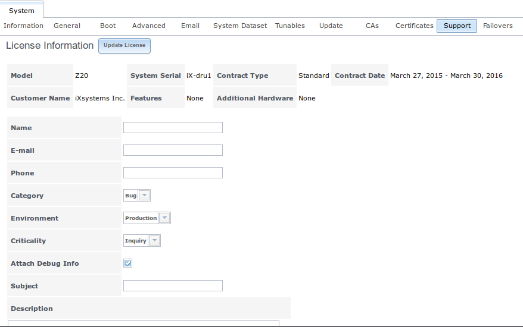

In this example, the system has a valid license which indicates the hardware model, system serial number, support contract type, licensed period, customer name,
licensed features, and additional supported hardware.

If the license expires or additional hardware, features, or contract type are required, contact your iXsystems support engineer. Once you have the new license string,
click the "Update License" button, paste in the new license, and click "OK". The new details should be displayed.

To generate a support ticket, complete the following fields:

* **Name:** input the name of the person the iXsystems Support Representative should contact to assist with the issue.

* **E-mail:** input the email address of the person to contact.

* **Phone:** input the phone number of the person to contact.

* **Category:** use the drop-down menu to indicate whether the ticket is to report a software bug, report a hardware failure, ask for assistance in installing
  or configuring the system, or request assistance in diagnosing a performance bottleneck.

* **Environment:** use the drop-down menu to indicate the role of the affected system. Choices are "Production", "Staging", "Test", "Prototyping", or "Initial
  Deployment/Setup".

* **Criticality:** use the drop-down menu to indicate the critical level. Choices are "Inquiry", "Loss of Functionality", or "Total Down".

* **Attach Debug Info:** it is recommended to leave this box checked so that an overview of the system's hardware and configuration is automatically generated
  and included with the ticket.

* **Subject:** input a descriptive title for the ticket.

* **Description:** input a 1 to 3 paragraph summary of the issue that describes the problem, and if applicable, what steps one can do to reproduce it.

* **Attachments:** this is the only optional field. It is useful for including configuration files or screenshots of any errors or tracebacks.

Once you have finished completing the fields, click the "Submit" button to generate and send the support ticket to iXsystems. A pop-up menu will provide a
clickable URL so that you can view the status of or add additional information to that support ticket. Clicking this URL will prompt you to login, or register
a new login, if you are not already logged into the `iXsystems Support page <https://support.ixsystems.com/>`_.

.. index:: Failovers

.. _Failovers:

Failovers
---------

If the TrueNAS® array has been licensed for High Availability (HA), a "Failover" tab will be added to "System". HA-licensed arrays use the Common Address Redundancy Protocol
(`CARP <http://www.openbsd.org/faq/pf/carp.html>`_) to provide high availability and failover. CARP was originally developed by the OpenBSD project and provides an open source, non
patent-encumbered alternative to the VRRP and HSRP protocols. TrueNAS® uses a two-unit active/standby model and provides an HA synchronization daemon to automatically monitor the status of
the active node, synchronize any configuration changes between the active and the standby node, and failover to the standby node should the active node become unavailable.

.. warning:: seamless failover is only available with iSCSI or NFS.  Other protocols will failover, but connections will be disrupted by the failover event. 

To configure HA, turn on both units in the array. Use the instructions in the :ref:`Console Setup Menu` to log into the graphical interface for one of the units, it doesn't matter which
one. If this is the first login, it will automatically display the "Upload License" screen. Otherwise, click :menuselection:`System --> Support --> Upload License`. Paste the HA license you
received from iXsystems and press "OK" to activate it. The license contains the serial numbers for both units in the chassis. Once the license is activated, the "Failovers" tab is added to
"System" and some fields are modified in "Network" so that the peer IP address, peer hostname, and virtual IP can be configured. An extra "IPMI (Node A/B)" tab will also be added so that
:ref:`IPMI` can be configured for the other unit.

.. note:: the modified fields will refer to this node as *This Node* and the other node as either
   *A* or
   *B*. The node value is hard-coded into each unit and the value that appears is automatically generated. For example, if you are on node *A*, the fields will refer to node
   *B*, and vice versa.

To configure HA networking, go to :menuselection:`Network --> Global Configuration`. The "Hostname" field will be replaced by two fields:

* **Hostname (Node A/B):** input the hostname to use for the other node.

* **Hostname (This Node):** input the hostname to use for this node.

Next, go to :menuselection:`Network --> Interfaces --> Add Interface`. The HA license adds several fields to the usual :ref:`Interfaces` screen:

* **IPv4 Address (Node A/B):** if the other node will use a static IP address, rather than DHCP, set it here.

* **IPv4 Address (This Node):** if this node will use a static IP address, rather than DHCP, set it here.

* **Virtual IP:** input the IP address to use for administrative access to the array.

* **Virtual Host ID:** the Virtual Host ID (VHID) must be unique on the broadcast segment of the network. It can be any unused number between *1* and
  *255*.

* **Critical for Failover:** check this box if a failover should occur when this interface becomes unavailable. How many seconds it takes for that failover to occur depends upon the
  value of the "Timeout", as described in Table 5.12a. This checkbox is interface-specific, allowing you to have different settings for a management network and a data network. Note that
  checking this box requires the *Virtual IP* to be set and that at least one interface needs to be set as "Critical for Failover" in order to configure failover.

* **Group:** this drop-down menu is greyed out unless the "Critical for Failover" checkbox is checked. This box allows you to group multiple, critical for failover interfaces. In this case,
  all of the interfaces in a group must go down before failover occurs. This can be a useful configuration in a multipath scenario.

Once the network configuration is complete, logout and log back in, this time using the "Virtual IP" address. You can now configure volumes and shares as usual and the configurations will
automatically synchronize between the active and the standby node. A "HA Enabled" icon will be added after the "Alert" icon on the active node and the passive node will indicate the virtual
IP address that is used for configuration management. The standby node will also have a red "Standby" icon and will no longer accept logins as all configuration changes need to occur on the
active node.

.. note:: once the "Virtual IP" address is configured, all subsequent logins should occur using this address.

The options available in :menuselection:`System --> Failovers` are shown in :numref:`Figure %s: Example Failovers Screen <failover1b>` and described in Table 5.12a.

.. _failover1b:

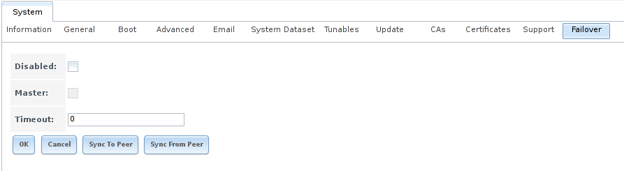

**Table 5.12a: Failover Options**

+----------------+----------------+-------------------------------------------------------------------------------------------------------------------------------------------------------+
| **Setting**    | **Value**      | **Description**                                                                                                                                       |
|                |                |                                                                                                                                                       |
+================+================+=======================================================================================================================================================+
| Disabled       | checkbox       | when checked, administratively disables failover which changes the "HA Enabled" icon to "HA Disabled" and activates the "Master" field; this will     |
|                |                | generate an error message if the standby node is not responding or failover has not been configured                                                   |
|                |                |                                                                                                                                                       |
+----------------+----------------+-------------------------------------------------------------------------------------------------------------------------------------------------------+
| Master         | checkbox       | greyed out unless "Disabled" is checked; in that case, this box is automatically checked on the master system, allowing the master to automatically   |
|                |                | takeover when the "Disabled" box is unchecked                                                                                                         |
|                |                |                                                                                                                                                       |
+----------------+----------------+-------------------------------------------------------------------------------------------------------------------------------------------------------+
| Timeout        | integer        | specifies, in seconds, how quickly failover occurs after a network failure; the default of *0* indicates that failover either occurs immediately or,  |
|                |                | if the system is using a link aggregation, after 2 seconds                                                                                            |
|                |                |                                                                                                                                                       |
+----------------+----------------+-------------------------------------------------------------------------------------------------------------------------------------------------------+
| Sync to Peer   | button         | forces a configuration change on the active node to sync to the standby node; since the HA daemon does this automatically, you should never need to   |
|                |                | do this unless instructed to do so by your iX support engineer                                                                                        |
|                |                |                                                                                                                                                       |
+----------------+----------------+-------------------------------------------------------------------------------------------------------------------------------------------------------+
| Sync From Peer | button         | forces a configuration change on the standby node to sync to the active node; since the HA daemon does this automatically, you should never need to   |
|                |                | do this unless instructed to do so by your iX support engineer                                                                                        |
+----------------+----------------+-------------------------------------------------------------------------------------------------------------------------------------------------------+

.. index:: Failovers

.. _Failover Management:

Failover Management
~~~~~~~~~~~~~~~~~~~

The :command:`hactl` command line utility is included for managing existing failovers. Once a failover has been configured, it is recommended
to use :command:`hactl` instead of the GUI as any changes made using :menuselection:`System --> Failovers` will restart networking.

If you type this command without any options, it will indicate the status of the failover. This example was run on an active node::

 hactl
 Node status: Active
 Failover status: Enabled

And this example was run on a system that has not been configured for failover::

 hactl
 Node status: Not an HA node

Table 5.12b summarizes the available options for this command.

**Table 5.12b: hactl Options**

+--------------------+---------------------------------------------------------------------------------------------+
| **Option**         | **Description**                                                                             |
|                    |                                                                                             |
+====================+=============================================================================================+
| **enable**         | administratively enables failover                                                           |
|                    |                                                                                             |
+--------------------+---------------------------------------------------------------------------------------------+
| **disable**        | administratively disables failover                                                          |
|                    |                                                                                             |
+--------------------+---------------------------------------------------------------------------------------------+
| **status**         | indicates whether the node is active, passive, or non-HA                                    |
|                    |                                                                                             |
+--------------------+---------------------------------------------------------------------------------------------+
| **takeover**       | can only be run from the passive node; will give a warning message that the current active  |
|                    | node will reboot                                                                            |
+--------------------+---------------------------------------------------------------------------------------------+
| **giveback**       | cannot be run from the active node; will give a warning message that this node will reboot  |
|                    |                                                                                             |
+--------------------+---------------------------------------------------------------------------------------------+
| **-h** or **help** | shows the help message (options) for this command                                           |
|                    |                                                                                             |
+--------------------+---------------------------------------------------------------------------------------------+
| **-q**             | will not display the current status if this is a non-HA node                                |
|                    |                                                                                             |
+--------------------+---------------------------------------------------------------------------------------------+

