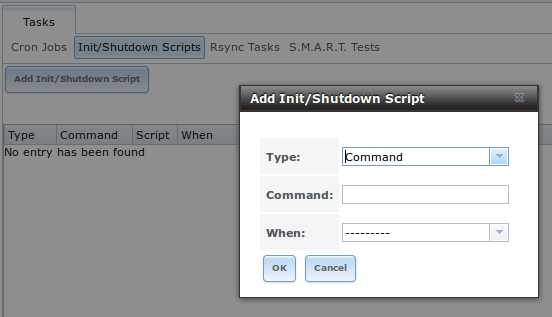
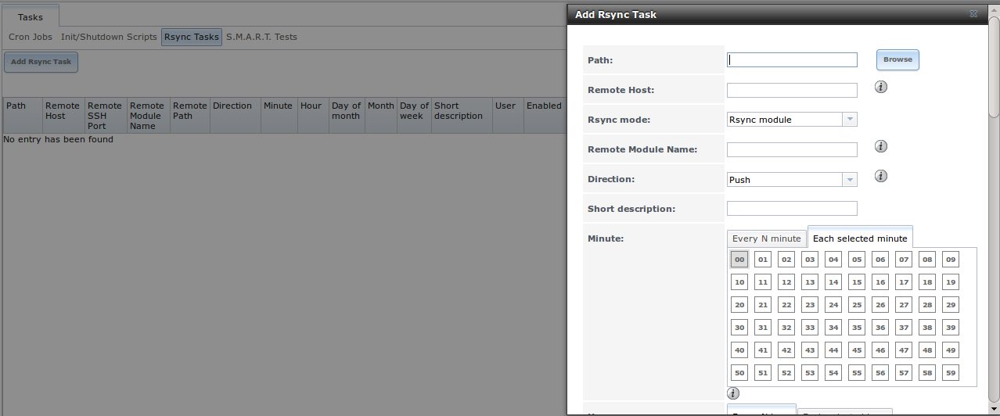
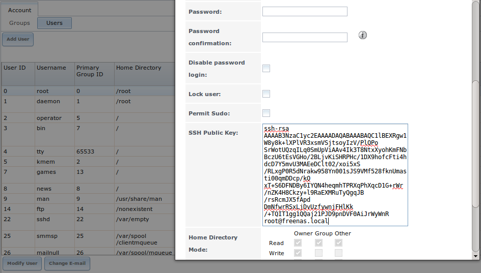

:orphan:

System Configuration
--------------------

The System section of the administrative GUI contains the following entries:

*   `Cron Jobs`_: provides a graphical front-end to
    `crontab(5) <http://www.freebsd.org/cgi/man.cgi?query=crontab&sektion=5>`_

*   `Failovers`_: used to configure high availability.

*   `Init/Shutdown Scripts`_: used to configure a command or script to automatically execute during system startup or shutdown

*   `NTP Servers`_: used to configure NTP server settings

*   `Rsync Tasks`_: allows you to schedule rsync tasks

*   `S.M.A.R.T. Tests`_: allows you to schedule which S.M.A.R.T. tests to run on a per-disk basis

*   `Settings`_: used to configure system wide settings such as timezone, email setup, HTTPS access, and firmware upgrades

*   `Sysctls`_: provides a front-end for tuning the TrueNAS® system by interacting with the underlying FreeBSD kernel

*   `System Information`_: provides general TrueNAS® system information such as hostname, operating system version, platform, and uptime

*   `Tunables`_: provides a front-end to load additional kernel modules at boot time

Each of these is described in more detail in this section.

Cron Jobs
~~~~~~~~~

`cron(8) <http://www.freebsd.org/cgi/man.cgi?query=cron>`_
is a daemon that runs a command or script on a regular schedule as a specified user. Typically, the user who wishes to schedule a task manually creates a
`crontab(5) <http://www.freebsd.org/cgi/man.cgi?query=crontab&sektion=5>`_
using syntax that can be perplexing to new Unix users. The TrueNAS® GUI makes it easy to schedule when you would like the task to occur.

.. note:: due to a limitation in FreeBSD, users with account names that contain spaces or exceed 17 characters are unable to create cron jobs.

Figure 6.1a shows the screen that opens when you click System --> Cron Jobs --> Add Cron Job. Table 6.1a summarizes the configurable options when creating a
cron job.

**Figure 6.1a: Creating a Cron Job**

|10000000000002F9000002650EAEDDBB_png|

.. |10000000000002F9000002650EAEDDBB_png| image:: images/cron1.png
    :width: 6.3953in
    :height: 5.1083in

**Table 6.1a: Cron Job Options**

+-------------------+-----------------------------+----------------------------------------------------------------------------------------------------------+
| **Setting**       | **Value**                   | **Description**                                                                                          |
|                   |                             |                                                                                                          |
|                   |                             |                                                                                                          |
+===================+=============================+==========================================================================================================+
| User              | drop-down menu              | make sure the selected user has permission to run the specified command or script                        |
|                   |                             |                                                                                                          |
+-------------------+-----------------------------+----------------------------------------------------------------------------------------------------------+
| Command           | string                      | the **full path** to the command or script to be run; if it is a script, test it at the command line     |
|                   |                             | first to make sure that it works as expected                                                             |
|                   |                             |                                                                                                          |
+-------------------+-----------------------------+----------------------------------------------------------------------------------------------------------+
| Short description | string                      | optional                                                                                                 |
|                   |                             |                                                                                                          |
+-------------------+-----------------------------+----------------------------------------------------------------------------------------------------------+
| Minute            | slider or minute selections | if use the slider, cron job occurs every N minutes; if use minute selections, cron job occurs at the     |
|                   |                             | highlighted minutes                                                                                      |
|                   |                             |                                                                                                          |
+-------------------+-----------------------------+----------------------------------------------------------------------------------------------------------+
| Hour              | slider or hour selections   | if use the slider, cron job occurs every N hours; if use hour selections, cron job occurs at the         |
|                   |                             | highlighted hours                                                                                        |
|                   |                             |                                                                                                          |
+-------------------+-----------------------------+----------------------------------------------------------------------------------------------------------+
| Day of month      | slider or month selections  | if use the slider, cron job occurs every N days; if use day selections, cron job occurs on the           |
|                   |                             | highlighted days each month                                                                              |
|                   |                             |                                                                                                          |
+-------------------+-----------------------------+----------------------------------------------------------------------------------------------------------+
| Month             | checkboxes                  | cron job occurs on the selected months                                                                   |
|                   |                             |                                                                                                          |
+-------------------+-----------------------------+----------------------------------------------------------------------------------------------------------+
| Day of week       | checkboxes                  | cron job occurs on the selected days                                                                     |
|                   |                             |                                                                                                          |
+-------------------+-----------------------------+----------------------------------------------------------------------------------------------------------+
| Redirect Stdout   | checkbox                    | disables emailing standard output to the *root* user account                                             |
|                   |                             |                                                                                                          |
+-------------------+-----------------------------+----------------------------------------------------------------------------------------------------------+
| Redirect Stderr   | checkbox                    | disables emailing errors to the *root* user account                                                      |
|                   |                             |                                                                                                          |
+-------------------+-----------------------------+----------------------------------------------------------------------------------------------------------+
| Enabled           | checkbox                    | uncheck if you would like to disable the cron job without deleting it                                    |
|                   |                             |                                                                                                          |
+-------------------+-----------------------------+----------------------------------------------------------------------------------------------------------+

Failovers
~~~~~~~~~

Some TrueNAS® appliances use the Common Address Redundancy Protocol (
`CARP <http://www.openbsd.org/faq/pf/carp.html>`_
) to provide high availability and failover. CARP was originally developed by the OpenBSD project and provides an open source, non patent-encumbered
alternative to the VRRP and HSRP protocols.

Failover is only available on certain appliances and requires an advanced configuration between multiple TrueNAS® appliances that is created with the
assistance of an iXsystems support engineer. At this time, failover can only be used with iSCSI or NFS. Contact your iXsystems representative if you wish to
schedule a time to configure failover.

This section provides an overview of the failover screen that is available in the graphical administrative interface. Your iXsystems support engineer will
assist you in the configuration and testing of a failover that is suited to your specific environment.
**Do not attempt to configure failover on your own as it will fail and may render existing shares or volumes inaccessible.**

The options available in System -> Failovers -> Add Failover are shown in Figure 6.2a and described in Table 6.2a.

**Figure 6.2a: Creating a Failover**

|10000000000002540000012E7707A58F_png|

.. |10000000000002540000012E7707A58F_png| image:: images/failover1.png
    :width: 5.0083in
    :height: 2.5165in

**Table 6.2a: Options When Creating a Failover**

+-------------+----------------+-----------------------------------------------------------------------------+
| **Setting** | **Value**      | **Description**                                                             |
|             |                |                                                                             |
+=============+================+=============================================================================+
| Volume      | drop-down menu | select the ZFS pool                                                         |
|             |                |                                                                             |
+-------------+----------------+-----------------------------------------------------------------------------+
| CARP        | drop-down menu | select the CARP that was previously created in Network -> CARPs -> Add CARP |
|             |                |                                                                             |
+-------------+----------------+-----------------------------------------------------------------------------+
| IP Address  | string         | input the IP address associated with the existing CARP                      |
|             |                |                                                                             |
+-------------+----------------+-----------------------------------------------------------------------------+

Once a failover configuration is working, a new icon will be added between the Log Out and Alert icons to each device in the failover configuration. The
active device will have a green Active icon and the passive device will have a red Passive icon. An entry will be added to
`System -> Failovers -> View Failovers` on each device. The available fields and actions are as follows:

**Volume:** the volume to be monitored for failover.

**CARP:** the shared virtual IP. This is the IP used for the high availability NFS mounts or iSCSI targets.

**IP Address:** the IP of the other device in the high availability setup.

**Sync From Peer:** used to copy the configurations from the other device to this one when setting up failover.

**Sync To Peer:** used to copy this device's configurations to the other device when setting up failover.

Init/Shutdown Scripts
~~~~~~~~~~~~~~~~~~~~~

TrueNAS® provides the ability to schedule commands or scripts to run at system startup or shutdown.

Figure 6.3a shows the screen that opens when you click System --> Init/Shutdown Scripts --> Add Init/Shutdown Script. Table 6.3a summarizes the available
options.

When scheduling a command, make sure that the command is in your path or give the full path to the command. One way to test the path is to type
:command:`which command_name`. If the command is not found, it is not in your path.

When scheduling a script, make sure that the script is executable and has been fully tested to ensure that it achieves the desired results.

**Figure 6.3a: Add an Init/Shutdown Script**

|100000000000024C00000139D4E765DD_png|

**Table 6.3a: Options When Adding an Init/Shutdown Script**

+-------------+----------------+--------------------------------------------------------------------------+
| **Setting** | **Value**      | **Description**                                                          |
|             |                |                                                                          |
+=============+================+==========================================================================+
| Type        | drop-down menu | select from *Command* (for an executable) or                             |
|             |                | *Script* (for an executable script)                                      |
|             |                |                                                                          |
+-------------+----------------+--------------------------------------------------------------------------+
| Command     | string         | if *Command* is selected, input the command plus any desired options; if |
|             |                | *Script* is selected, browse to the location of the script               |
|             |                |                                                                          |
+-------------+----------------+--------------------------------------------------------------------------+
| Type        | drop-down menu | select when the command/script will run; choices are *Pre Init* (very    |
|             |                | (early in boot process before filesystems are mounted), *Post Init*      |
|             |                | (towards end of boot process before FreeNAS services are started), or    |
|             |                | *Shutdown*                                                               |
|             |                |                                                                          |
+-------------+----------------+--------------------------------------------------------------------------+

NTP Servers
~~~~~~~~~~~

The network time protocol (NTP) is used to synchronize the time on the computers in a network. Accurate time is necessary for the successful operation of time
sensitive applications such as Active Directory.

By default, TrueNAS® is pre-configured to use three public NTP servers. If your network is using Active Directory, ensure that the TrueNAS® system and the
Active Directory Domain Controller have been configured to use the same NTP servers.

Figure 6.4a shows the default NTP configuration for TrueNAS®. If you wish to change a default server to match the settings used by your network's domain
controller, click an entry to access its "Edit" button. Alternately, you can delete the default NTP servers and click "Add NTP Server" to create your own.
Figure 6.4b shows the "Add NTP Server" screen and Table 6.4a summarizes the options when adding or editing an NTP server.
`ntp.conf(5) <http://www.freebsd.org/cgi/man.cgi?query=ntp.conf>`_
explains these options in more detail.

**Figure 6.4a: Default NTP Configuration**

|10000000000002E0000001970E9F2B96_png|

.. |10000000000002E0000001970E9F2B96_png| image:: images/ntp1.png
    :width: 6.1846in
    :height: 3.3917in

**Figure 6.4b: Add or Edit a NTP Server**

|ntp2.png|

**Table 6.4a: NTP Server Options**

+-------------+-----------+-----------------------------------------------------------------------------------------------------------------------+
| **Setting** | **Value** | **Description**                                                                                                       |
|             |           |                                                                                                                       |
|             |           |                                                                                                                       |
+=============+===========+=======================================================================================================================+
| Address     | string    | name of NTP server                                                                                                    |
|             |           |                                                                                                                       |
+-------------+-----------+-----------------------------------------------------------------------------------------------------------------------+
| Burst       | checkbox  | recommended when "Max. Poll" is greater than *10*; only use on your own servers i.e.                                  |
|             |           | **do not** use with a public NTP server                                                                               |
|             |           |                                                                                                                       |
+-------------+-----------+-----------------------------------------------------------------------------------------------------------------------+
| IBurst      | checkbox  | speeds the initial synchronization (seconds instead of minutes)                                                       |
|             |           |                                                                                                                       |
+-------------+-----------+-----------------------------------------------------------------------------------------------------------------------+
| Prefer      | checkbox  | should only be used for NTP servers that are known to be highly accurate, such as those with time monitoring hardware |
|             |           |                                                                                                                       |
+-------------+-----------+-----------------------------------------------------------------------------------------------------------------------+
| Min. Poll   | integer   | power of 2 in seconds; can not be lower than *4* or higher than "Max. Poll"                                           |
|             |           |                                                                                                                       |
+-------------+-----------+-----------------------------------------------------------------------------------------------------------------------+
| Max. Poll   | integer   | power of 2 in seconds; can not be higher than *17* or lower than "Min. Poll"                                          |
|             |           |                                                                                                                       |
+-------------+-----------+-----------------------------------------------------------------------------------------------------------------------+
| Force       | checkbox  | forces the addition of the NTP server, even if it is currently unreachable                                            |
|             |           |                                                                                                                       |
+-------------+-----------+-----------------------------------------------------------------------------------------------------------------------+

Rsync Tasks
~~~~~~~~~~~

`Rsync <http://www.samba.org/ftp/rsync/rsync.html>`_
is a utility that automatically copies specified data from one system to another over a network. Once the initial data is copied, rsync reduces the amount of
data sent over the network by sending only the differences between the source and destination files. Rsync can be used for backups, mirroring data on multiple
systems, or for copying files between systems.

To configure rsync, you need to configure both ends of the connection:

*   **the rsync server:** this system pulls (receives) the data. This system is referred to as
    *PULL* in the configuration examples.

*   **the rsync client:** this system pushes (sends) the data. This system is referred to as
    *PUSH* in the configuration examples.

TrueNAS® can be configured as either an rsync client or an rsync server. The opposite end of the connection can be another TrueNAS® system or any other
system running rsync. In TrueNAS® terminology, an rysnc task defines which data is synchronized between the two systems. If you are synchronizing data
between two TrueNAS® systems, create the rsync task on the rsync client.

TrueNAS® supports two modes of rsync operation:

*   **rsync module mode:** exports a directory tree, and its configured settings, as a symbolic name over an unencrypted connection. This mode requires that
    at least one module be defined on the rsync server. It can be defined in the TrueNAS® GUI under `Services --> Rsync --> Rsync Modules`. In other
    operating systems, the module is defined in
    `rsyncd.conf(5) <http://www.samba.org/ftp/rsync/rsyncd.conf.html>`_.

*   **rsync over SSH:** synchronizes over an encrypted connection. Requires the configuration of SSH user and host public keys.

This section summarizes the options when creating an Rsync Task. It then provides a configuration example between two TrueNAS® systems for each mode of rsync
operation.

Creating an Rsync Task
^^^^^^^^^^^^^^^^^^^^^^

Figure 6.5a shows the screen that appears when you click `System --> Rsync Tasks --> Add Rsync Task`. Table 6.5a summarizes the options that can be configured
when creating an rsync task.

**Figure 6.5a: Adding an Rsync Task**

|10000000000003500000025D7A1FD395_png|

**Table 6.5a: Rsync Configuration Options**

+--------------------------------+-----------------------------+-----------------------------------------------------------------------------------------------+
| **Setting**                    | **Value**                   | **Description**                                                                               |
|                                |                             |                                                                                               |
|                                |                             |                                                                                               |
+================================+=============================+===============================================================================================+
| Path                           | browse button               | browse to the volume/dataset/directory that you wish to copy; note that a path length greater |
|                                |                             | than 255 characters will fail                                                                 |
|                                |                             |                                                                                               |
+--------------------------------+-----------------------------+-----------------------------------------------------------------------------------------------+
| Remote Host                    | string                      | IP address or hostname of the remote system that will store the copy                          |
|                                |                             |                                                                                               |
+--------------------------------+-----------------------------+-----------------------------------------------------------------------------------------------+
| Remote SSH Port                | integer                     | only available in "Rsync over SSH" mode; allows you to specify an alternate SSH port other    |
|                                |                             | than the default of *22*                                                                      |
|                                |                             |                                                                                               |
+--------------------------------+-----------------------------+-----------------------------------------------------------------------------------------------+
| Rsync mode                     | drop-down menu              | choices are *Rsync module*                                                                    |
|                                |                             | or *Rsync over SSH*                                                                           |
|                                |                             |                                                                                               |
+--------------------------------+-----------------------------+-----------------------------------------------------------------------------------------------+
| Remote Module Name/Remote Path | string                      | when using *Rsync module* mode, at least one module must be defined in                        |
|                                |                             | `rsyncd.conf(5) <http://www.samba.org/ftp/rsync/rsyncd.conf.html>`_                           |
|                                |                             | of rsync server or in `Services --> Rsync --> Rsync Modules` of another TrueNAS® system;     |
|                                |                             | when using *Rsync over SSH* mode, input the path on the remote host to push or pull (e.g.     |
|                                |                             | :file:`/mnt/volume`)                                                                          |
|                                |                             |                                                                                               |
+--------------------------------+-----------------------------+-----------------------------------------------------------------------------------------------+
| Direction                      | drop-down menu              | choices are *Push* or                                                                         |
|                                |                             | *Pull*; default is to push from the TrueNAS® system to a remote host                         |
|                                |                             |                                                                                               |
+--------------------------------+-----------------------------+-----------------------------------------------------------------------------------------------+
| Short Description              | string                      | optional                                                                                      |
|                                |                             |                                                                                               |
+--------------------------------+-----------------------------+-----------------------------------------------------------------------------------------------+
| Minute                         | slider or minute selections | if use the slider, sync occurs every N minutes; if use minute selections, sync occurs at the  |
|                                |                             | highlighted minutes                                                                           |
|                                |                             |                                                                                               |
+--------------------------------+-----------------------------+-----------------------------------------------------------------------------------------------+
| Hour                           | slider or hour selections   | if use the slider, sync occurs every N hours; if use hour selections, sync occurs at the      |
|                                |                             | highlighted hours                                                                             |
|                                |                             |                                                                                               |
+--------------------------------+-----------------------------+-----------------------------------------------------------------------------------------------+
| Day of month                   | slider or day selections    | if use the slider, sync occurs every N days; if use day selections, sync occurs on the        |
|                                |                             | highlighted days                                                                              |
|                                |                             |                                                                                               |
+--------------------------------+-----------------------------+-----------------------------------------------------------------------------------------------+
| Month                          | checkboxes                  | task occurs on the selected months                                                            |
|                                |                             |                                                                                               |
+--------------------------------+-----------------------------+-----------------------------------------------------------------------------------------------+
| Day of week                    | checkboxes                  | task occurs on the selected days of the week                                                  |
|                                |                             |                                                                                               |
+--------------------------------+-----------------------------+-----------------------------------------------------------------------------------------------+
| User                           | drop-down menu              | specified user must have permission to write to the specified directory on the remote system; |
|                                |                             | due to a limitation in FreeBSD, the user name can not contain spaces or exceed 17 characters  |
|                                |                             |                                                                                               |
+--------------------------------+-----------------------------+-----------------------------------------------------------------------------------------------+
| Recursive                      | checkbox                    | if checked, copy will include all subdirectories of the specified volume                      |
|                                |                             |                                                                                               |
+--------------------------------+-----------------------------+-----------------------------------------------------------------------------------------------+
| Times                          | checkbox                    | preserve modification times of files                                                          |
|                                |                             |                                                                                               |
+--------------------------------+-----------------------------+-----------------------------------------------------------------------------------------------+
| Compress                       | checkbox                    | recommended on slow connections as reduces size of data to be transmitted                     |
|                                |                             |                                                                                               |
+--------------------------------+-----------------------------+-----------------------------------------------------------------------------------------------+
| Archive                        | checkbox                    | equivalent to **-rlptgoD** recursive, copy symlinks as symlinks, preserve permissions,        |
|                                |                             | preserve modification times, preserve group, preserve owner (super-user only), and preserve   |
|                                |                             | device files (super-user only) and special files)                                             |
|                                |                             |                                                                                               |
+--------------------------------+-----------------------------+-----------------------------------------------------------------------------------------------+
| Delete                         | checkbox                    | delete files in destination directory that don't exist in sending directory                   |
|                                |                             |                                                                                               |
+--------------------------------+-----------------------------+-----------------------------------------------------------------------------------------------+
| Quiet                          | checkbox                    | suppresses informational messages from the remote server                                      |
|                                |                             |                                                                                               |
+--------------------------------+-----------------------------+-----------------------------------------------------------------------------------------------+
| Preserve permissions           | checkbox                    | preserves original file permissions; useful if "User" is set to *root*                        |
|                                |                             |                                                                                               |
+--------------------------------+-----------------------------+-----------------------------------------------------------------------------------------------+
| Preserve extended attributes   | checkbox                    | both systems must support                                                                     |
|                                |                             | `extended attributes <http://en.wikipedia.org/wiki/Xattr>`_                                   |
|                                |                             |                                                                                               |
+--------------------------------+-----------------------------+-----------------------------------------------------------------------------------------------+
| Extra options                  | string                      | `rsync(1) <http://rsync.samba.org/ftp/rsync/rsync.html>`_                                     |
|                                |                             | options not covered by the GUI                                                                |
|                                |                             |                                                                                               |
+--------------------------------+-----------------------------+-----------------------------------------------------------------------------------------------+
| Enabled                        | checkbox                    | uncheck if you would like to disable the rsync task without deleting it                       |
|                                |                             |                                                                                               |
+--------------------------------+-----------------------------+-----------------------------------------------------------------------------------------------+

If the rysnc server requires password authentication, input *--password-file=/PATHTO/FILENAME*
in the "Extra options" box, replacing */PATHTO/FILENAME* with the appropriate path to the file containing the value of the password.

Configuring Rsync Module Mode Between Two TrueNAS® Systems
^^^^^^^^^^^^^^^^^^^^^^^^^^^^^^^^^^^^^^^^^^^^^^^^^^^^^^^^^^

This configuration example will configure rsync module mode between the two following TrueNAS® systems:

*   *192.168.2.2* has existing data in
    :file:`/mnt/local/images`. It will be the rsync client, meaning that an rsync task needs to be defined. It will be referred to as *PUSH.*

*   *192.168.2.6* has an existing volume named
    :file:`/mnt/remote`. It will be the rsync server, meaning that it will receive the contents of :file:`/mnt/local/images`. An rsync module needs to be
    defined on this system and the rsyncd service needs to be started. It will be referred to as *PULL.*

On *PUSH*, an rsync task is defined in `System --> Rsync Tasks --> Add Rsync Task` as shown in Figure 6.5b. In this example:

*   the "Path" points to :file:`/usr/local/images`, the directory to be copied

*   the "Remote Host" points to *192.168.2.6*, the IP address of the rsync server

*   the "Rsync Mode" is *Rsync module*

*   the "Remote Module Name" is *backups*; this will need to be defined on the rsync server

*   the "Direction" is *Push*

*   the rsync is scheduled to occur every 15 minutes

*   the "User" is set to *root* so it has permission to write anywhere

*   the "Preserve Permissions" checkbox is checked so that the original permissions are not overwritten by the *root* user

**Figure 6.5b: Configuring the Rsync Client**

|1000000000000230000001BF3B7F7314_png|

On *PULL*, an rsync module is defined in `Services --> Rsync Modules --> Add Rsync Module`, shown in Figure 6.5c. In this example:

*   the "Module Name" is *backups*; this needs to match the setting on the rsync client

*   the "Path" is :file:`/mnt/remote`; a directory called :file:`images` will be created to hold the contents of :file:`/usr/local/images`

*   the "User" is set to *root* so it has permission to write anywhere

*   "Hosts allow" is set to *192.168.2.2*, the IP address of the rsync client

Descriptions of the configurable options can be found in `Rsync Modules`.

To finish the configuration, start the rsync service on *PULL* in `Services --> Control Services`. If the rsync is successful, the contents of
:file:`/mnt/local/images/` will be mirrored to :file:`/mnt/remote/images/`.

**Figure 6.5c: Configuring the Rsync Server**

|rsync4.png|

Configuring Rsync over SSH Mode Between Two TrueNAS® Systems
^^^^^^^^^^^^^^^^^^^^^^^^^^^^^^^^^^^^^^^^^^^^^^^^^^^^^^^^^^^^

SSH replication mode does not require the creation of an rsync module or for the rsync service to be running on the rsync server. It does require SSH to be
configured before creating the rsync task:

*   a public/private key pair for the rsync user account (typically *root*) must be generated on
    *PUSH* and the public key copied to the same user account on
    *PULL*

*   to mitigate the risk of man-in-the-middle attacks, the public host key of *PULL* must be copied to
    *PUSH*

*   the SSH service must be running on *PULL*

To create the public/private key pair for the rsync user account, open `Shell`_on *PUSH*. The :file:`/` filesystem must first be mounted as read-write. The
following example generates an RSA type public/private key pair for the *root* user. When creating the key pair, do not enter the passphrase as the key is
meant to be used for an automated task.
::

 mount -o rw /

 ssh-keygen -t rsa
 Generating public/private rsa key pair.
 Enter file in which to save the key (/root/.ssh/id_rsa):
 Created directory '/root/.ssh'.
 Enter passphrase (empty for no passphrase):
 Enter same passphrase again:
 Your identification has been saved in /root/.ssh/id_rsa.
 Your public key has been saved in /root/.ssh/id_rsa.pub.
 The key fingerprint is:
 f5:b0:06:d1:33:e4:95:cf:04:aa:bb:6e:a4:b7:2b:df root@freenas.local
 The key's randomart image is:
 +--[ RSA 2048]----+
 |.o. oo           |
 |o+o. .           |
 |. =o +           |
 |+ +o             |
 |S o .            |
 |.o               |
 |o.               |
 |o oo             |
 |**oE             |
 +-----------------+
 |                 |
 +=================+

TrueNAS® supports the following types of SSH keys: DSA, and RSA. When creating the key, specify the type you wish to use or, if you are generating the key on
another operating system, select a type of key the key generation software supports.

.. note:: if a different user account is used for the rsync task, use the su - command after mounting the filesystem but before generating the key. For
   example, if the rsync task is configured to use the *user1* user account, use this command to become that user:

::
 su - user1

Next, view and copy the contents of the generated public key:
::

 more .ssh/id_rsa.pub
 ssh-rsa AAAAB3NzaC1yc2EAAAADAQABAAABAQC1lBEXRgw1W8y8k+lXPlVR3xsmVSjtsoyIzV/PlQPo
 SrWotUQzqILq0SmUpViAAv4Ik3T8NtxXyohKmFNbBczU6tEsVGHo/2BLjvKiSHRPHc/1DX9hofcFti4h
 dcD7Y5mvU3MAEeDClt02/xoi5xS/RLxgP0R5dNrakw958Yn001sJS9VMf528fknUmasti00qmDDcp/kO
 xT+S6DFNDBy6IYQN4heqmhTPRXqPhXqcD1G+rWr/nZK4H8Ckzy+l9RaEXMRuTyQgqJB/rsRcmJX5fApd
 DmNfwrRSxLjDvUzfywnjFHlKk/+TQIT1gg1QQaj21PJD9pnDVF0AiJrWyWnR root@freenas.local

Go to *PULL* and paste (or append) the copied key into the "SSH Public Key" field of `Account --> Users --> View Users --> root --> Modify User` (or the
specified rsync user account). The paste for the above example is shown in Figure 6.5d. When pasting the key, ensure that it is pasted as one long line and,
if necessary, remove any extra spaces representing line breaks.

**Figure 6.5d: Pasting the User's SSH Public Key**

|100000000000045700000296256625F7_png|

.. |100000000000045700000296256625F7_png| image:: images/rsync3.png
    :width: 6.9252in
    :height: 4.0917in

While on *PULL*, verify that the SSH service is running in `Services --> Control Services` and start it if it is not.

Next, copy the host key of *PULL* using `Shell` on
*PUSH*. The following command copies the RSA host key of the
*PULL* server used in our previous example. Be sure to include the double bracket
*>>* to prevent overwriting any existing entries in the :file:`known_hosts` file.
::

 ssh-keyscan -t rsa 192.168.2.6 >> /root/.ssh/known_hosts

.. note:: if *PUSH* is a Linux system, use the following command to copy the RSA key to the Linux system:

::
 cat ~/.ssh/id_rsa.pub | ssh user@192.168.2.6 'cat >> .ssh/authorized_keys'

You are now ready to create the rsync task on *PULL*. To configure "rsync SSH" mode using the systems in our previous example, the configuration would be as
follows:

*   the "Path" points to :file:`/mnt/local/images`, the directory to be copied

*   the "Remote Host" points to *192.168.2.6*, the IP address of the rsync server

*   the "Rsync Mode" is *Rsync over SSH*

*   the rsync is scheduled to occur every 15 minutes

*   the "User" is set to *root* so it has permission to write anywhere; the public key for this user must be generated on
    *PUSH* and copied to
    *PULL*

*   the "Preserve Permissions" checkbox is checked so that the original permissions are not overwritten by the *root* user

Once you save the rsync task, the rsync will automatically occur according to your schedule. In this example, the contents of :file:`/mnt/local/images/`
will automatically appear in :file:`/mnt/remote/images/` after 15 minutes. If the content does not appear, use `Shell` on *PULL* to read
:file:`/var/log/messages`. If the message indicates a *\n* (newline character) in the key, remove the space in your pasted key--it will be after the character
that appears just before the *\n* in the error message.

S.M.A.R.T. Tests
~~~~~~~~~~~~~~~~

`S.M.A.R.T. <http://en.wikipedia.org/wiki/S.M.A.R.T.>`_
(Self-Monitoring, Analysis and Reporting Technology) is a monitoring system for computer hard disk drives to detect and report on various indicators of
reliability. When a failure is anticipated by S.M.A.R.T., the drive should be replaced.

Figure 6.6a shows the configuration screen that appears when you click `System --> S.M.A.R.T. Tests --> Add S.M.A.R.T. Test`. The tests that you create will
be listed under "View S.M.A.R.T. Tests". After creating your tests, check the configuration in `Services --> S.M.A.R.T.`, then click the slider to "ON" for
the S.M.A.R.T. service in `Services --> Control Services`. The S.M.A.R.T. service will not start if you have not created any volumes.

.. note:: to prevent problems, do not enable the S.M.A.R.T. service if your disks are controlled by a RAID controller as it is the job of the controller to
   monitor S.M.A.R.T. and mark drives as Predictive Failure when they trip.

**Figure 6.6a: Adding a S.M.A.R.T. Test**

|10000000000001DA0000021AE2615C27_png|

.. |10000000000001DA0000021AE2615C27_png| image:: images/smart.png
    :width: 8in
    :height: 5in

Table 6.6a summarizes the configurable options when creating a S.M.A.R.T. test.

**Table 6.6a: S.M.A.R.T. Test Options**

+-------------------+---------------------------+------------------------------------------------------------------------------------------------------------+
| **Setting**       | **Value**                 | **Description**                                                                                            |
|                   |                           |                                                                                                            |
|                   |                           |                                                                                                            |
+===================+===========================+============================================================================================================+
| Disk              | list                      | highlight disk(s) to monitor                                                                               |
|                   |                           |                                                                                                            |
+-------------------+---------------------------+------------------------------------------------------------------------------------------------------------+
| Type              | drop-down menu            | select type of test to run; see                                                                            |
|                   |                           | `smartctl(8) <http://smartmontools.sourceforge.net/man/smartctl.8.html>`_                                  |
|                   |                           | for a description of each type of test (note that some test types will degrade performance or take disk(s) |
|                   |                           | offline)                                                                                                   |
|                   |                           |                                                                                                            |
+-------------------+---------------------------+------------------------------------------------------------------------------------------------------------+
| Short description | string                    | optional                                                                                                   |
|                   |                           |                                                                                                            |
+-------------------+---------------------------+------------------------------------------------------------------------------------------------------------+
| Hour              | slider or hour selections | if use the slider, test occurs every N hours; if use hour selections, test occurs at the highlighted hours |
|                   |                           |                                                                                                            |
+-------------------+---------------------------+------------------------------------------------------------------------------------------------------------+
| Day of month      | slider or day selections  | if use the slider, test occurs every N days; if use day selections, test occurs on the highlighted days    |
|                   |                           |                                                                                                            |
+-------------------+---------------------------+------------------------------------------------------------------------------------------------------------+
| Month             | checkboxes                | select the months when you wish the test to occur                                                          |
|                   |                           |                                                                                                            |
+-------------------+---------------------------+------------------------------------------------------------------------------------------------------------+
| Day of week       | checkboxes                | select the days of the week when you wish the test to occur                                                |
|                   |                           |                                                                                                            |
+-------------------+---------------------------+------------------------------------------------------------------------------------------------------------+

You can verify which tests will run and when by typing :command:`smartd -q showtests` within `Shell`_.

Settings
~~~~~~~~

The Settings tab, shown in Figure 6.7a, contains 5 tabs: General, Advanced, Email, SSL, and System Dataset.

**Figure 6.7a: General Tab of Settings**

|10000000000002B00000027AE346EDD8_png|

.. |10000000000002B00000027AE346EDD8_png| image:: images/system1.png
    :width: 8in
    :height: 6in

General Tab
^^^^^^^^^^^

Table 6.7a summarizes the settings that can be configured using the General tab:

**Table 6.7a: General Tab's Configuration Settings**

+----------------------+----------------+-------------------------------------------------------------------------------------------------------------------------------+
| Setting              | Value          | Description                                                                                                                   |
|                      |                |                                                                                                                               |
+======================+================+===============================================================================================================================+
| Protocol             | drop-down menu | protocol to use when connecting to the administrative GUI from a browser; if you change the default of *HTTP* to              |
|                      |                | *HTTPS*, an unsigned certificate and RSA key will be generated and you will be logged out in order to accept the certificate  |
|                      |                |                                                                                                                               |
+----------------------+----------------+-------------------------------------------------------------------------------------------------------------------------------+
| WebGUI IPv4 Address  | drop-down menu | choose from a list of recent IP addresses to limit the one to use when accessing the administrative GUI; the built-in HTTP    |
|                      |                | server will automatically bind to the wildcard address of *0.0.0.0* (any address) and will issue an alert if the specified    |
|                      |                | address becomes unavailable                                                                                                   |
|                      |                |                                                                                                                               |
+----------------------+----------------+-------------------------------------------------------------------------------------------------------------------------------+
| WebGUI IPv6 Address  | drop-down menu | choose from a list of recent IPv6 addresses to limit the one to use when accessing the administrative GUI; the built-in HTTP  |
|                      |                | server will automatically bind to the wildcard address of *::* (any address) and will issue an alert if the specified address |
|                      |                | becomes unavailable                                                                                                           |
|                      |                |                                                                                                                               |
+----------------------+----------------+-------------------------------------------------------------------------------------------------------------------------------+
| WebGUI HTTP Port     | integer        | allows you to configure a non-standard port for accessing the administrative GUI over HTTP; changing this setting may require |
|                      |                | you to                                                                                                                        |
|                      |                | `change a firefox configuration setting <http://www.redbrick.dcu.ie/%7Ed_fens/articles/Firefox:_This_Address_is_Restricted>`_ |
|                      |                |                                                                                                                               |
+----------------------+----------------+-------------------------------------------------------------------------------------------------------------------------------+
| WebGUI HTTPS Port    | integer        | allows you to configure a non-standard port for accessing the administrative GUI over HTTPS                                   |
|                      |                |                                                                                                                               |
+----------------------+----------------+-------------------------------------------------------------------------------------------------------------------------------+
| Language             | drop-down menu | select the localization from the drop-down menu and reload the browser; you can view the status of localization at            |
|                      |                | `pootle.freenas.org <http://pootle.freenas.org/>`_                                                                            |
|                      |                |                                                                                                                               |
+----------------------+----------------+-------------------------------------------------------------------------------------------------------------------------------+
| Console Keyboard Map | drop-down menu | select the keyboard layout                                                                                                    |
|                      |                |                                                                                                                               |
+----------------------+----------------+-------------------------------------------------------------------------------------------------------------------------------+
| Timezone             | drop-down menu | select the timezone from the drop-down menu                                                                                   |
|                      |                |                                                                                                                               |
+----------------------+----------------+-------------------------------------------------------------------------------------------------------------------------------+
| Syslog server        | string         | IP address or hostname of remote syslog server to send TrueNAS® logs to; once set, log entries will be written to both the   |
|                      |                | TrueNAS® console and the remote server                                                                                       |
|                      |                |                                                                                                                               |
+----------------------+----------------+-------------------------------------------------------------------------------------------------------------------------------+
| Directory Service    | drop-down menu | can select one of *Active Directory*,_                                                                                        |
|                      |                | *Domain Controller*,_                                                                                                         |
|                      |                | *LDAP*,                                                                                                                       |
|                      |                | *NIS*, or                                                                                                                     |
|                      |                | *NT4* ; if a service is selected, an entry named                                                                              |
|                      |                | *Directory Services* will be added to `Services --> Control Services` for managing that selected service                      |
|                      |                |                                                                                                                               |
+----------------------+----------------+-------------------------------------------------------------------------------------------------------------------------------+

If you make any changes, click the Save button.

This tab also contains the following buttons:

**Factory Restore:** resets the configuration database to the default base version. However, it does not delete user SSH keys or any other data stored in a
user's home directory. Since any configuration changes stored in the configuration database will be erased, this option is handy if you mess up your system or
wish to return a test system to the original configuration.

**Save Config:** used to create a backup copy of the current configuration database in the format
*hostname-version-architecture*.
**Always save the configuration after making changes and verify that you have a saved configuration before performing an upgrade.**

**Upload Config:** allows you to browse to location of saved configuration file in order to restore that configuration.

Advanced Tab
^^^^^^^^^^^^

The Advanced tab, shown in Figure 6.7b, allows you to set some miscellaneous settings on the TrueNAS® system. The configurable settings are summarized in
Table 6.7b.

**Figure 6.7b: Advanced Tab**

|1000000000000300000002999E0156B3_png|

.. |1000000000000300000002999E0156B3_png| image:: images/system2.png
    :width: 8in
    :height: 6in

**Table 6.7b: Advanced Tab's Configuration Settings**

+-----------------------------------------------+----------------+-------------------------------------------------------------------------------------------+
| Setting                                       | Value          | Description                                                                               |
|                                               |                |                                                                                           |
+===============================================+================+===========================================================================================+
| Enable Console Menu                           | checkbox       | unchecking this box removes the console menu shown in Figure 2.5a                         |
|                                               |                |                                                                                           |
+-----------------------------------------------+----------------+-------------------------------------------------------------------------------------------+
| Use Serial Console                            | checkbox       | do **not** check this box if your serial port is disabled                                 |
|                                               |                |                                                                                           |
+-----------------------------------------------+----------------+-------------------------------------------------------------------------------------------+
| Serial Port Address                           | string         | serial port address written in hex                                                        |
|                                               |                |                                                                                           |
+-----------------------------------------------+----------------+-------------------------------------------------------------------------------------------+
| Serial Port Speed                             | drop-down menu | select the speed used by the serial port                                                  |
|                                               |                |                                                                                           |
+-----------------------------------------------+----------------+-------------------------------------------------------------------------------------------+
| Enable screen saver                           | checkbox       | enables/disables the console screen saver                                                 |
|                                               |                |                                                                                           |
+-----------------------------------------------+----------------+-------------------------------------------------------------------------------------------+
| Enable powerd (Power Saving Daemon)           | checkbox       | `powerd(8) <http://www.freebsd.org/cgi/man.cgi?query=powerd>`_                            |
|                                               |                | monitors the system state and sets the CPU frequency accordingly                          |
|                                               |                |                                                                                           |
+-----------------------------------------------+----------------+-------------------------------------------------------------------------------------------+
| Show console messages in the footer           | checkbox       | will display console messages in real time at bottom of browser; click the console to     |
|                                               |                | bring up a scrollable screen; check the "Stop refresh" box in the scrollable screen to    |
|                                               |                | pause updating and uncheck the box to continue to watch the messages as they occur        |
|                                               |                |                                                                                           |
+-----------------------------------------------+----------------+-------------------------------------------------------------------------------------------+
| Show tracebacks in case of fatal errors       | checkbox       | provides a pop-up of diagnostic information when a fatal error occurs                     |
|                                               |                |                                                                                           |
+-----------------------------------------------+----------------+-------------------------------------------------------------------------------------------+
| Show advanced fields by default               | checkbox       | several GUI menus provide an "Advanced Mode" button to access additional features;        |
|                                               |                | enabling this shows these features by default                                             |
|                                               |                |                                                                                           |
+-----------------------------------------------+----------------+-------------------------------------------------------------------------------------------+
| Enable autotune                               | checkbox       | enables the `autotune`_ script which attempts to optimize the system depending upon the   |
|                                               |                | hardware which is installed                                                               |
|                                               |                |                                                                                           |
+-----------------------------------------------+----------------+-------------------------------------------------------------------------------------------+
| Enable debug kernel                           | checkbox       | if checked, next boot will boot into a debug version of the kernel                        |
|                                               |                |                                                                                           |
+-----------------------------------------------+----------------+-------------------------------------------------------------------------------------------+
| Enable automatic upload of kernel crash dumps | checkbox       | if checked, kernel crash dumps are automatically sent to the TrueNAS® development team   |
|                                               |                | for diagnosis                                                                             |
|                                               |                |                                                                                           |
+-----------------------------------------------+----------------+-------------------------------------------------------------------------------------------+
| MOTD banner                                   | string         | input the message to be seen when a user logs in via SSH                                  |                                                                                                                                                                                                                                                             |
|                                               |                |                                                                                           |
+-----------------------------------------------+----------------+-------------------------------------------------------------------------------------------+

If you make any changes, click the Save button.

This tab also contains the following buttons:

**Rebuild LDAP/AD Cache:** click if you add a user to Active Directory who needs immediate access to TrueNAS®; otherwise this occurs automatically once a day
as a cron job.

**Save Debug:** used to generate a text file of diagnostic information. t will prompt for the location to save the ASCII text file.

**Firmware Update:** used to upgrade TrueNAS®.

**Performance Test:** runs a series of performance tests and prompts to saves the results as a tarball. Since running the tests can affect performance, a
warning is provided and the tests should be run at a time that will least impact users.

Autotune
""""""""

TrueNAS® provides an autotune script which attempts to optimize the system. It is recommended to discuss system optimization with an iXsystems support
engineer prior to running this script and to review the results with the support engineer.

The "Enable autotune" checkbox in `System --> Settings --> Advanced` is unchecked by default; check it if you would like the autotuner to run at boot time. If
you would like the script to run immediately, reboot the system.

If autotuner finds any settings that need adjusting, the changed values will appear in System --> Sysctls` (for :file:`sysctl.conf` values) and in 
`System --> Tunables` (for :file:`loader.conf` values). If you do not like the changes, you can modify the values that are displayed in the GUI and your
changes will override the values that were created by the autotune script. However, if you delete a sysctl or tunable that was created by autotune, it will be
recreated at next boot. This is because autotune only creates values that do not already exist.

If you wish to read the script to see which checks are performed, the script is located in :file:`/usr/local/bin/autotune`.

Email Tab
^^^^^^^^^

The Email tab, shown in Figure 6.7c, is used to configure the email settings on the TrueNAS® system. Table 6.7c summarizes the settings that can be
configured using the Email tab.

.. note:: it is important to configure the system so that it can successfully send emails. An automatic script send a nightly email to the *root* user account
   containing important information such as the health of the disks. Alert events are also emailed to the *root* user account.

**Figure 6.7c: Email Tab**

|100000000000033D000002366E21DB69_png|

.. |100000000000033D000002366E21DB69_png| image:: images/system3.png
    :width: 8in
    :height: 5in

**Table 6.7c: Email Tab's Configuration Settings**

+----------------------+----------------------+-------------------------------------------------------------------------------------------------+
| Setting              | Value                | Description                                                                                     |
|                      |                      |                                                                                                 |
+======================+======================+=================================================================================================+
| From email           | string               | the **From** email address to be used when sending email notifications                          |
|                      |                      |                                                                                                 |
+----------------------+----------------------+-------------------------------------------------------------------------------------------------+
| Outgoing mail server | string or IP address | hostname or IP address of SMTP server                                                           |
|                      |                      |                                                                                                 |
+----------------------+----------------------+-------------------------------------------------------------------------------------------------+
| Port to connect to   | integer              | SMTP port number, typically 25, 465 (secure SMTP), or 587 (submission)                          |
|                      |                      |                                                                                                 |
+----------------------+----------------------+-------------------------------------------------------------------------------------------------+
| TLS/SSL              | drop-down menu       | encryption type; choices are *Plain*,                                                           |
|                      |                      | *SSL*, or                                                                                       |
|                      |                      | *TLS*                                                                                           |
|                      |                      |                                                                                                 |
+----------------------+----------------------+-------------------------------------------------------------------------------------------------+
| Use                  | checkbox             | enables/disables                                                                                |
| SMTP                 |                      | `SMTP AUTH <http://en.wikipedia.org/wiki/SMTP_Authentication>`_                                 |
| Authentication       |                      | using PLAIN SASL                                                                                |
|                      |                      |                                                                                                 |
+----------------------+----------------------+-------------------------------------------------------------------------------------------------+
| Username             | string               | used to authenticate with SMTP server                                                           |
|                      |                      |                                                                                                 |
+----------------------+----------------------+-------------------------------------------------------------------------------------------------+
| Password             | string               | used to authenticate with SMTP server                                                           |
|                      |                      |                                                                                                 |
+----------------------+----------------------+-------------------------------------------------------------------------------------------------+
| Send Test Mail       | button               | click to check that configured email settings are working; this will fail if you do not set the |
|                      |                      | **To** email address by clicking the Change E-mail button for the                               |
|                      |                      | *root* account in `Accounts --> Users --> View Users`                                           |
|                      |                      |                                                                                                 |
+----------------------+----------------------+-------------------------------------------------------------------------------------------------+

SSL Tab
^^^^^^^

When you change the "Protocol" value to *HTTPS* in `System --> Settings --> General`, an unsigned RSA certificate and key are auto-generated. Once generated,
the certificate and key will be displayed in the "SSL Certificate" field in `System --> Settings --> SSL`, shown in Figure 6.7d. If you already have your own
signed certificate that you wish to use for SSL/TLS connections, replace the values in the "SSL certificate field" with a copy/paste of your own key and
certificate. The certificate can be used to secure the HTTP connection (enabled in the `Settings --> General` Tab) to the TrueNAS® system. Table 6.7d
summarizes the settings that can be configured using the SSL tab. This
`howto <http://www.akadia.com/services/ssh_test_certificate.html>`_
shows how to manually generate your own certificate using OpenSSL and provides some examples for the values shown in Table 6.7d.

**Figure 6.7d: SSL Tab**

|10000000000002FA0000028B9FA479C1_png|

.. |10000000000002FA0000028B9FA479C1_png| image:: images/system4.png
    :width: 8in
    :height: 5.4299in

**Table 6.7d: SSL Tab's Configuration Settings**

+---------------------+--------+------------------------------------------------------------------------------------------------------------------+
| Setting             | Value  | Description                                                                                                      |
|                     |        |                                                                                                                  |
+=====================+========+==================================================================================================================+
| Organization        | string | optional                                                                                                         |
|                     |        |                                                                                                                  |
+---------------------+--------+------------------------------------------------------------------------------------------------------------------+
| Organizational Unit | string | optional                                                                                                         |
|                     |        |                                                                                                                  |
+---------------------+--------+------------------------------------------------------------------------------------------------------------------+
| Email Address       | string | optional                                                                                                         |
|                     |        |                                                                                                                  |
+---------------------+--------+------------------------------------------------------------------------------------------------------------------+
| Locality            | string | optional                                                                                                         |
|                     |        |                                                                                                                  |
+---------------------+--------+------------------------------------------------------------------------------------------------------------------+
| State               | string | optional                                                                                                         |
|                     |        |                                                                                                                  |
+---------------------+--------+------------------------------------------------------------------------------------------------------------------+
| Country             | string | optional                                                                                                         |
|                     |        |                                                                                                                  |
+---------------------+--------+------------------------------------------------------------------------------------------------------------------+
| Common Name         | string | optional                                                                                                         |
|                     |        |                                                                                                                  |
+---------------------+--------+------------------------------------------------------------------------------------------------------------------+
| Passphrase          | string | if the certificate was created with a passphrase, input and confirm it; the value will appear as dots in the GUI |
|                     |        |                                                                                                                  |
+---------------------+--------+------------------------------------------------------------------------------------------------------------------+
| SSL Certificate     | string | paste the private key and certificate into the box                                                               |
|                     |        |                                                                                                                  |
+---------------------+--------+------------------------------------------------------------------------------------------------------------------+

.. note:: TrueNAS® will check the validity of the certificate and key and will fallback to HTTP if they appear to be invalid.

System Dataset
^^^^^^^^^^^^^^

The System Dataset tab, shown in Figure 6.7e, is used to select the pool which will contain the persistent system dataset. The system dataset stores debugging
core files and Samba4 metadata such as the user/group cache and share level permissions. If the FreeNAS® system is configured to be a Domain Controller, all
of the domain controller state is stored there as well, including domain controller users and groups.

The system dataset can optionally be configured to also store the system log and the `Reporting`_ information. If there are lots of log entries or reporting
information, moving these to the system dataset will prevent
:file:`/var/` from filling up as :file:`/var/` has limited space.

Use the drop-down menu to select the ZFS volume (pool) to contain the system dataset.

To also store the system log on the system dataset, check the "Syslog" box.

To also store the reporting information, check the "Reporting Database" box.

If you change the pool storing the system dataset at a later time, FreeNAS® will automatically migrate the existing data in the system dataset to the new
location.

**Figure 6.7e: System Dataset Tab**

|10000000000002A20000016B14D58EB7_png|

.. |10000000000002A20000016B14D58EB7_png| image:: images/system5.png
    :width: 5.6638in
    :height: 3.0252in

Sysctls
~~~~~~~

`sysctl(8) <http://www.freebsd.org/cgi/man.cgi?query=sysctl>`_
is an interface that is used to make changes to the FreeBSD kernel running on a TrueNAS® system. It can be used to tune the system in order to meet the
specific needs of a network. Over five hundred system variables can be set using sysctl(8). Each variable is known as a MIB as it is comprised of a dotted set
of components. Since these MIBs are specific to the kernel feature that is being tuned, descriptions can be found in many FreeBSD man pages (e.g.
`sysctl(3) <http://www.freebsd.org/cgi/man.cgi?query=sysctl&sektion=3>`_,
`tcp(4) <http://www.freebsd.org/cgi/man.cgi?query=tcp>`_ and
`tuning(7) <http://www.freebsd.org/cgi/man.cgi?query=tuning>`_) and in many sections of the
`FreeBSD Handbook <http://www.freebsd.org/handbook>`_.

.. warning:: changing the value of a sysctl MIB is an advanced feature that immediately affects the kernel of the TrueNAS® system.
**Do not change a MIB on a production system unless you understand the ramifications of that change.** A badly configured MIB could cause the system to become
unbootable, unreachable via the network, or can cause the system to panic under load. Certain changes may break assumptions made by the TrueNAS® software.
This means that you should always test the impact of any changes on a test system first.

TrueNAS® provides a graphical interface for managing sysctl MIBs. To add a sysctl, go to `System --> Sysctls --> Add Sysctl`, shown in Figure 6.8a.

**Figure 6.8a: Adding a Sysctl**

|sysctl.png|

Table 6.8a summarizes the options when adding a sysctl.

**Table 6.8a: Adding a Sysctl**

+-------------+-------------------+-----------------------------------------------------------------------------------+
| **Setting** | **Value**         | **Description**                                                                   |
|             |                   |                                                                                   |
|             |                   |                                                                                   |
+=============+===================+===================================================================================+
| Variable    | string            | must be in dotted format e.g.                                                     |
|             |                   | *kern.ipc.shmmax*                                                                 |
|             |                   |                                                                                   |
|             |                   |                                                                                   |
+-------------+-------------------+-----------------------------------------------------------------------------------+
| Value       | integer or string | value to associate with the MIB; **do not make this up**,                         |
|             |                   | refer to the suggested values in a man page, FreeBSD Handbook page, or tutorial   |
|             |                   |                                                                                   |
+-------------+-------------------+-----------------------------------------------------------------------------------+
| Comment     | string            | optional, but a useful reminder for the reason behind using this MIB/value        |
|             |                   |                                                                                   |
+-------------+-------------------+-----------------------------------------------------------------------------------+
| Enabled     | checkbox          | uncheck if you would like to disable the sysctl without deleting it               |
|             |                   |                                                                                   |
+-------------+-------------------+-----------------------------------------------------------------------------------+

As soon as you add or edit a sysctl, the running kernel will change that variable to the value you specify. As long as the sysctl exists, that value will
persist across reboots and upgrades.

Note that any sysctl that is read-only will require a reboot to enable the setting change. You can verify if a sysctl is read-only by attempting to change it
from `Shell`_. For example, to change the value of *net.inet.tcp.delay_ack* to
*1*, use the command :command:`sysctl net.inet.tcp.delay_ack=1`. If the sysctl value is read-only, an error message will indicate that the setting is
read-only. If you do not get an error, the setting is now applied. However, for the setting to be persistent across reboots, the sysctl must be added in
`System --> Sysctls`.

Any MIBs that you add will be listed in `System --> Sysctls --> View Sysctls`. To change the value of a MIB, click its "Edit" button. To remove a MIB, click
its "Delete" button.

At this time, the GUI does not display the sysctl MIBs that are pre-set in the installation image. TrueNAS® 9.2.1.6 ships with the following MIBs set:
::
 kern.metadelay=3
 kern.dirdelay=4
 kern.filedelay=5
 kern.coredump=0
 net.inet.carp.preempt=1
 debug.ddb.textdump.pending=1
 vfs.nfsd.tcpcachetimeo=300
 vfs.nfsd.tcphighwater=150000
 vfs.zfs.vdev.larger_ashift_minimal=0

**Do not add or edit the default MIBS as sysctls** as doing so will overwrite the default values which may render the system unusable.

System Information
~~~~~~~~~~~~~~~~~~

`System --> System Information` displays general information about the TrueNAS® system. An example is seen in Figure 6.9a.

The information includes the hostname, the build version, type of CPU (platform), the amount of memory, the current system time, the system's uptime, the
current load average, and the current status of the boot device.

To change the system's hostname, click its "Edit" button, type in the new hostname, and click "OK". The hostname must include the domain name. If the network
does not use a domain name add *.local* to the end of the hostname.

**Figure 6.9a: System Information Tab**

|10000000000002B30000020A599E09BE_png|

.. |10000000000002B30000020A599E09BE_png| image:: images/system6.png
    :width: 8in
    :height: 6in

Tunables
~~~~~~~~

When a FreeBSD-based system boots,
`loader.conf(5) <http://www.freebsd.org/cgi/man.cgi?query=loader.conf>`_
is read to determine if any parameters should be passed to the kernel or if any additional kernel modules (such as drivers) should be loaded. Since loader
values are specific to the kernel parameter or driver to be loaded, descriptions can be found in the man page for the specified driver and in many sections of
the
`FreeBSD Handbook <http://www.freebsd.org/handbook>`_.

TrueNAS® provides a graphical interface for managing loader values. This advanced functionality is intended to make it easier to load additional kernel
modules at boot time. A typical usage would be to load a FreeBSD hardware driver that does not automatically load after a TrueNAS® installation.

.. warning:: adding a tunable is an advanced feature that could adversely effect the ability of the TrueNAS® system to successfully boot. It is
   **very important** that you do not have a typo when adding a tunable as this could halt the boot process. Fixing this problem requires physical access to
   the TrueNAS® system and knowledge of how to use the boot loader prompt as described in `Recovering From Incorrect Tunables`_. This means that you should
   always test the impact of any changes on a test system first.

To add a tunable, go to `System --> Tunables --> Add Tunable`, as seen in Figure 6.10a.

**Figure 6.10a: Adding a Tunable**

|tunable.png|

Table 6.10a summarizes the options when adding a tunable. The changes you make will not take effect until the system is rebooted as loader settings are only
read when the kernel is loaded at boot time. As long as the tunable exists, your changes will persist at each boot and across upgrades. Any tunables that you
add will be listed alphabetically in `System --> Tunables --> View Tunables`. To change the value of a tunable, click its "Edit" button. To remove a tunable,
click its "Delete" button.

**Table 6.10a: Adding a Tunable**

+-------------+-------------------+---------------------------------------------------------------------------+
| **Setting** | **Value**         | **Description**                                                           |
|             |                   |                                                                           |
|             |                   |                                                                           |
+=============+===================+===========================================================================+
| Variable    | string            | typically the name of the driver to load, as indicated by its man page    |
|             |                   |                                                                           |
+-------------+-------------------+---------------------------------------------------------------------------+
| Value       | integer or string | value to associate with variable; typically this is set to *YES*          |
|             |                   | to enable the driver specified by the variable                            |
|             |                   |                                                                           |
+-------------+-------------------+---------------------------------------------------------------------------+
| Comment     | string            | optional, but a useful reminder for the reason behind adding this tunable |
|             |                   |                                                                           |
+-------------+-------------------+---------------------------------------------------------------------------+
| Enabled     | checkbox          | uncheck if you would like to disable the tunable without deleting it      |
|             |                   |                                                                           |
+-------------+-------------------+---------------------------------------------------------------------------+

At this time, the GUI does not display the tunables that are pre-set in the installation image. TrueNAS® 9.2.1.6 ships with the following tunables set:
::
 autoboot_delay="2"
 loader_logo="truenas-logo"
 loader_menu_title="Welcome to TrueNAS"
 loader_brand="truenas-brand"
 loader_version=" "
 kern.cam.boot_delay=10000
 geom_mirror_load="YES"
 geom_stripe_load="YES"
 geom_raid_load="YES"
 geom_raid3_load="YES"
 geom_raid5_load="YES"
 geom_gate_load="YES"
 geom_multipath_load="YES"
 hwpmc_load="YES"
 debug.debugger_on_panic=1
 debug.ddb.textdump.pending=1
 hw.hptrr.attach_generic=0
 kern.ipc.nmbclusters="262144"
 kern.hwpmc.nbuffers="4096"
 kern.hwpmc.nsamples="4096"
 hw.memtest.tests="0"
 module_path="/boot/modules;/usr/local/modules"
 net.inet6.ip6.auto_linklocal="0"
 kern.msgbufsize="524288"

**Do not add or edit the default tunables** as doing so will overwrite the default values which may render the system unusable.

The ZFS version used in 9.2.1.x deprecates the following tunables:
::
 vfs.zfs.write_limit_override
 vfs.zfs.write_limit_inflated
 vfs.zfs.write_limit_max
 vfs.zfs.write_limit_min
 vfs.zfs.write_limit_shift
 vfs.zfs.no_write_throttle

If you upgrade from an earlier version of TrueNAS® where these tunables are set, they will automatically be deleted for you. You should not try to add these
tunables back.

Recovering From Incorrect Tunables
^^^^^^^^^^^^^^^^^^^^^^^^^^^^^^^^^^

If a tunable is preventing the system from booting, you will need physical access to the TrueNAS® boot messages. Watch the boot messages and press the number
:kbd:`3` key or the :kbd:`Esc` key to select "3. Esc ape to loader prompt" when you see the TrueNAS® boot menu shown in Figure 6.10b.

**Figure 6.10b: TrueNAS® Boot Menu**

|10000000000002CE000001914C7A0CC0_png|

.. |10000000000002CE000001914C7A0CC0_png| image:: images/boot.png
    :width: 6.0335in
    :height: 3.3417in

The boot loader prompt provides a minimal set of commands described in
`loader(8) <http://www.freebsd.org/cgi/man.cgi?query=loader>`_. Once at the prompt, use the
:command:`unset` command to disable a problematic value, the :command:`set` command to modify the problematic value, or the :command:`unload` command to
prevent the problematic driver from loading.

Example 6.10 a demonstrates several examples using these commands at the boot loader prompt. The first command disables the current value associated with the
*kern.ipc.nmbclusters* MIB and will fail with a "no such file or directory" error message if a current tunable does not exist to set this value. The second
command disables ACPI. The third command instructs the system not to load the fuse driver. When finished, type :command:`boot` to continue the boot process.

**Example 6.10a: Sample Commands at the Boot Loader Prompt**
::

 Type '?' for a list of commands, 'help' for more detailed help.
 OK
 unset kern.ipc.nmbclusters
 OK
 set hint.acpi.0.disabled=1
 OK
 unload fuse
 OK
 boot

Any changes made at the boot loader prompt only effect the current boot. This means that you need to edit or remove the problematic tunable in
`System --> Tunables --> View Tunables` to make your change permanent and to prevent future boot errors.
