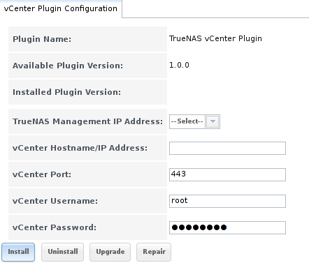
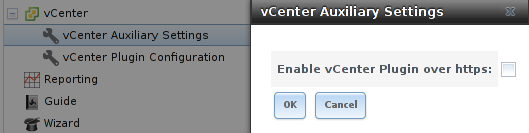

.. index:: vCenter
.. _vCenter:

vCenter
=======

Administrators who use `VMware vCenter Server <https://www.vmware.com/products/vcenter-server>`_ to administer their vSphere environments can use the TrueNAS® vCenter plugin to manage their
TrueNAS® array from vCenter Server.

.. note:: at this time, the vCenter plugin only supports the creation of iSCSI and NFS datastores from vCenter Server.

To configure the vCenter plugin, click "vCenter". This will open the screen shown in :numref:`Figure %s: Configuring the vCenter Plugin <vcenter1>`.

.. _vcenter1:

Table 14a summarizes the options in this screen.

**Table 14a: vCenter Plugin Options**

+-------------------------------+----------------+---------------------------------------------------------------------------------------------------------------------------------------+
| **Setting**                   | **Value**      | **Description**                                                                                                                       |
|                               |                |                                                                                                                                       |
+===============================+================+=======================================================================================================================================+
| TrueNAS Management IP Address | drop-down menu | select the CARP address of the TrueNAS system                                                                                         |
|                               |                |                                                                                                                                       |
+-------------------------------+----------------+---------------------------------------------------------------------------------------------------------------------------------------+
| vCenter Hostname/IP Address   | string         | input the IP address or resolveable hostname of the vCenter Server                                                                    |
|                               |                |                                                                                                                                       |
+-------------------------------+----------------+---------------------------------------------------------------------------------------------------------------------------------------+
| vCenter Port                  | integer        | input the port number the vCenter Server is listening on                                                                              |
|                               |                |                                                                                                                                       |
+-------------------------------+----------------+---------------------------------------------------------------------------------------------------------------------------------------+
| vCenter Username              | string         | input the username for the vCenter Server                                                                                             |
|                               |                |                                                                                                                                       |
+-------------------------------+----------------+---------------------------------------------------------------------------------------------------------------------------------------+
| vCenter Password              | string         | input the password associated with *vCenter Username*                                                                                 |
|                               |                |                                                                                                                                       |
+-------------------------------+----------------+---------------------------------------------------------------------------------------------------------------------------------------+

After inputting this information, click the "Install" button to add the TrueNAS® system as an object in vCenter Server. From vCenter Server, click the object to create its datastores.

In addition to the "Install" button, these buttons are available:

**Uninstall:** click to remove the TrueNAS® object from vCenter Server.

**Upgrade:** as more features are added to the vCenter plugin, the "Available Plugin Version" number will be incremented. Click this button to upgrade to the newer version and access
its features.

**Repair:** click this button if your iXsystems support engineer asks you to do so. This will reinstall the TrueNAS® object in order to repair a corrupted object.

.. note:: in a HA-configured scenario, the "Upgrade" button can only be used from the system that originally installed the plugin. This means that the "Upgrade" button will be greyed out on
   the other system in the HA pair.

To configure the vCenter plugin to use a secure connection, click :menuselection:`vCenter --> vCenter Auxiliary Settings` in the left tree. In the screen shown in
:numref:`Figure %s: Securing the vCenter Plugin Connection <vcenter2>`, check the "Enable vCenter Plugin over https" box.

.. _vcenter2:

