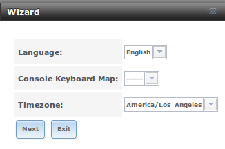
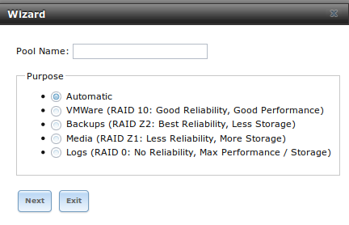
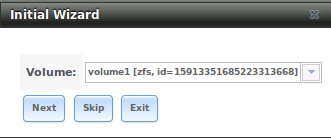
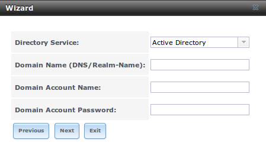
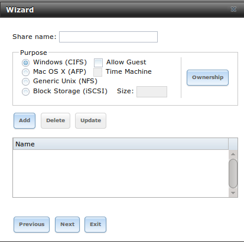
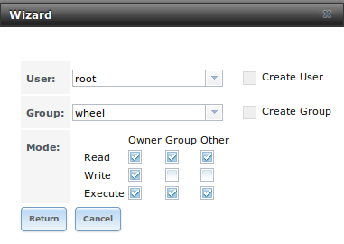
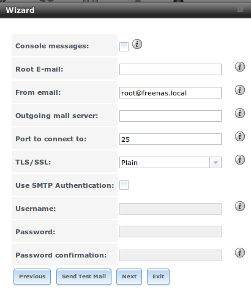

.. _Wizard:

Wizard
------

TrueNAS® provides a wizard which walks you through the steps needed to quickly configure TrueNAS® to start serving data over a network. This section
describes the configuration steps which are available from the wizard.

Figure 13a shows the first wizard configuration screen.

**Figure 13a: Configuration Wizard**

|wizard.png|

Note that you can exit the wizard at any time by clicking the "Exit" button. However, exiting the wizard will not save any selections.

This first screen can be used to change the default language, keyboard map, and timezone. After making your selections, click "Next".

.. note:: typically, a TrueNAS® system ships with pre-configured volumes. The screens shown in Figures 13b and 13c will only appear if unformatted disks
          are available or the system has been reinstalled.

Figure 13b shows the configuration screen that appears when unformatted disks are available.

**Figure 13b: Volume Creation Wizard**

|wizard1.png|

.. note:: the wizard will not recognize an **encrypted** ZFS pool. If your ZFS pool is GELI-encrypted, cancel the wizard and use the instructions in
          :ref:`Importing an Encrypted Pool` to import the encrypted volume. You can then rerun the wizard and it will recognize that the volume has been
          imported and will not prompt to reformat the disks.

Input a name for the ZFS pool that conforms to these
`naming conventions <http://docs.oracle.com/cd/E23824_01/html/821-1448/gbcpt.html>`_. It is recommended to choose a name that will stick out in the logs (e.g.
**not** :file:`data` or :file:`freenas`).

Next, decide if the pool should provide disk redundancy, and if so, which type. The :ref:`ZFS Primer` discusses RAIDZ redundancy in more detail. If you prefer
to make a more complex configuration, click the "Exit" button to close the "Wizard" and instead use :ref:`Volume Manager`.

The following redundancy types are available:

* **Automatic:** automatically creates a mirrored, RAIDZ1, or RAIDZ2 pool, depending upon the number of disks. If you prefer to control the type of
  redundancy, select one of the other options.

* **RAID 10:** creates a striped mirror and requires a minimum of 4 disks.

* **RAIDZ2:** requires a minimum of 4 disks. Up to 2 disks can fail without data loss.

* **RAIDZ1:** requires a minimum of 3 disks. Up to 1 disk can fail without data loss.

* **Stripe:** requires a minimum of 1 disk. Provides **no** redundancy, meaning if any of the disks in the stripe fails, all data in the stripe is lost.

Once you have made your selection, click "Next" to continue.

If the system has been reinstalled and the disks are formatted as an unencrypted ZFS pool, a screen to import the volume will appear. This screen is shown in
Figure 13c.

**Figure 13c: Volume Import Screen**

|wizard2.png|

Select the existing volume from the drop-down menu and click "Next" to continue.

The next screen in the wizard is shown in Figure 13d.

**Figure 13d: Directory Service Selection**

|wizard3.png|

If the TrueNAS® system is on a network that does not contain an Active Directory, LDAP, NIS, or NT4 server, click "Next" to skip to the next screen.

However, if the TrueNAS® system is on a network containing an Active Directory, LDAP, NIS, or NT4 server and you wish to import the users and groups from
that server, select the type of directory service in the "Directory Service" drop-down menu. The rest of the fields in this screen will vary, depending upon
which directory service is selected. Tables 13a to 13d summarize the available configuration options for each directory service.

.. note:: additional configuration options are available for each directory service. The wizard can be used to set the initial values required to connect to
   that directory service. You can then review the other available options in :ref:`Directory Service` to determine if additional configuration is required.

**Table 13a: Active Directory Options**

+--------------------------+---------------+-------------------------------------------------------------------------------------------------------+
| **Setting**              | **Value**     | **Description**                                                                                       |
|                          |               |                                                                                                       |
+==========================+===============+=======================================================================================================+
| Domain Name              | string        | name of Active Directory domain (e.g. *example.com*) or child domain (e.g.                            |
|                          |               | *sales.example.com*)                                                                                  |
|                          |               |                                                                                                       |
+--------------------------+---------------+-------------------------------------------------------------------------------------------------------+
| Domain Account Name      | string        | name of the Active Directory administrator account                                                    |
|                          |               |                                                                                                       |
+--------------------------+---------------+-------------------------------------------------------------------------------------------------------+
| Domain Account Password  | string        | password for the Active Directory administrator account                                               |
|                          |               |                                                                                                       |
+--------------------------+---------------+-------------------------------------------------------------------------------------------------------+

**Table 13b: LDAP Options**

+-------------------------+----------------+-------------------------------------------------------------------------------------------------------+
| **Setting**             | **Value**      | **Description**                                                                                       |
|                         |                |                                                                                                       |
+=========================+================+=======================================================================================================+
| Hostname                | string         | hostname or IP address of LDAP server                                                                 |
|                         |                |                                                                                                       |
+-------------------------+----------------+-------------------------------------------------------------------------------------------------------+
| Base DN                 | string         | top level of the LDAP directory tree to be used when searching for resources (e.g.                    |
|                         |                | *dc=test,dc=org*)                                                                                     |
|                         |                |                                                                                                       |
+-------------------------+----------------+-------------------------------------------------------------------------------------------------------+
| Bind DN                 | string         | name of administrative account on LDAP server (e.g. *cn=Manager,dc=test,dc=org*)                      |
|                         |                |                                                                                                       |
+-------------------------+----------------+-------------------------------------------------------------------------------------------------------+
| Base password           | string         | password for                                                                                          |
|                         |                |                                                                                                       |
+-------------------------+----------------+-------------------------------------------------------------------------------------------------------+

**Table 13c: NIS Options**

+-------------------------+----------------+-------------------------------------------------------------------------------------------------------+
| **Setting**             | **Value**      | **Description**                                                                                       |
|                         |                |                                                                                                       |
+=========================+================+=======================================================================================================+
| NIS domain              | string         | name of NIS domain                                                                                    |
|                         |                |                                                                                                       |
+-------------------------+----------------+-------------------------------------------------------------------------------------------------------+
| NIS servers             | string         | comma delimited list of hostnames or IP addresses                                                     |
|                         |                |                                                                                                       |
+-------------------------+----------------+-------------------------------------------------------------------------------------------------------+
| Secure mode             | checkbox       | if checked,                                                                                           |
|                         |                | `ypbind(8) <http://www.freebsd.org/cgi/man.cgi?query=ypbind>`_                                        |
|                         |                | will refuse to bind to any NIS server that is not running as root on a TCP port number over 1024      |
|                         |                |                                                                                                       |
+-------------------------+----------------+-------------------------------------------------------------------------------------------------------+
| Manycast                | checkbox       | if checked, ypbind will bind to the server that responds the fastest; this is useful when no local    |
|                         |                | NIS server is available on the same subnet                                                            |
|                         |                |                                                                                                       |
+-------------------------+----------------+-------------------------------------------------------------------------------------------------------+

**Table 13d: NT4 Options**

+-------------------------+----------------+-------------------------------------------------------------------------------------------------------+
| **Setting**             | **Value**      | **Description**                                                                                       |
|                         |                |                                                                                                       |
+=========================+================+=======================================================================================================+
| Domain Controller       | string         | hostname of domain controller                                                                         |
|                         |                |                                                                                                       |
+-------------------------+----------------+-------------------------------------------------------------------------------------------------------+
| NetBIOS Name            | string         | hostname of FreeNAS system                                                                            |
|                         |                |                                                                                                       |
+-------------------------+----------------+-------------------------------------------------------------------------------------------------------+
| Workgroup Name          | string         | name of Windows server's workgroup                                                                    |
|                         |                |                                                                                                       |
+-------------------------+----------------+-------------------------------------------------------------------------------------------------------+
| Administrator Name      | string         | name of the domain administrator account                                                              |
|                         |                |                                                                                                       |
+-------------------------+----------------+-------------------------------------------------------------------------------------------------------+
| Administrator Password  | string         | input and confirm the password for the domain administrator account                                   |
|                         |                |                                                                                                       |
+-------------------------+----------------+-------------------------------------------------------------------------------------------------------+

The next configuration screen, shown in Figure 13e, can be used to create the network shares.

**Figure 13e: Share Creation**

|wizard4.png|

TrueNAS® supports several types of shares for providing storage data to the clients in a network. The initial wizard can be used to quickly make shares using
default permissions which should "just work" for common scenarios. If you wish to configure more complex scenarios, refer to the section on :ref:`Sharing`.

To create a share using the wizard, input a name, then select the "Purpose" of the share:

* **Windows (CIFS):** this type of share can be accessed by any operating system using a CIFS client. Check the box for "Allow Guest" if users should not be
  prompted for a password in order to access the share. If you make any CIFS shares using the wizard, you can fine-tune them afterwards using
  :ref:`Windows (CIFS) Shares`.

* **Mac OS X (AFP):** this type of share can be accessed by Mac OS X users. Check the box for "Time Machine" if Mac users will be using the TrueNAS® system
  as a backup device. If you make any AFP shares using the wizard, you can fine-tune them afterwards using :ref:`Apple (AFP) Shares`.

* **Generic Unix (NFS):** this type of share can be accessed by any operating system using a NFS client. If you make any NFS shares using the wizard, you can
  fine-tune them afterwards using :ref:`Unix (NFS) Shares`.

* **Block Storage (iSCSI):** this type of share can be accessed by any operating system using iSCSI initiator software. Input the size of the block storage to
  create in the format *20G* (for 20 GB). If you make any iSCSI shares using the wizard, you can fine-tune them afterwards using :ref:`iSCSI`.

After selecting the "Purpose", click the "Ownership" button to see the screen shown in Figure 13f.

**Figure 13f: Share Permissions**

|wizard5.png|

The default permissions for the share will be displayed. To create a user or group, input the desired name, then check the "Create User" box, to create that
user, and the "Create Group" box, to create that group. Check or uncheck the boxes in the "Mode" section to set the initial access permissions for the share.
When finished, click the "Return" button to return to the share creation screen. Click the "Add" button to finish creating that share, which will then
appear in the "Name" frame.

You can use the "Delete" button to remove the highlighted share in the "Name" frame. If you need to edit a share, highlight it, make the change, then press
the "Update" button.

When you are finished making shares, click the "Next" button to advance to the screen shown in Figure 13g.

**Figure 13g: Miscellaneous Settings**

|wizard6.png|

This screen can be used to configure the following settings:

* **Console messages:** check this box if you would like to view system messages at the bottom of the graphical administrative interface. This can be handy
  when troubleshooting a service that will not start. When using the console message view, if you click the console messages area, it will pop-up as a window,
  allowing you to scroll through the output and to copy its contents.

* **Root E-mail:** TrueNAS® provides an "Alert" icon in the upper right corner to provide a visual indication of events that warrant administrative
  attention. The alert system automatically emails the *root* user account whenever an alert is issued. **It is important** to input the email address of the
  person to receive these alerts and other administrative emails. The rest of the email settings in this screen should also be reviewed and edited as
  necessary. Before leaving this screen, click the "Send Test Mail" button to ensure that email notifications are working correctly.

* **From email:** the from email address to use when sending email notifications.

* **Outgoing mail server:** hostname or IP address of SMTP server.

* **Port to connect to:** port number used by the SMTP server.

* **TLS/SSL:** encryption type used by the SMTP server.

* **Use SMTP Authentication:** check this box if the SMTP server requires authentication.

* **Username:** input the username if the SMTP server requires authentication.

* **Password:** input the password if the SMTP server requires authentication.

When finished, click "Next". A message will indicate that the wizard is now ready to perform all of the saved actions. If you wish to make any changes, click
the "Return to Wizard" button to review your edits. If you click the "Exit without saving" button, none of your selections will be saved. To save your edits,
click the "Confirm" button. A status bar will indicate when the wizard has completed applying your settings.

In addition to the settings that you specify, the wizard will automatically enable :ref:`S.M.A.R.T. Tests`, create a boot environment, and add the new boot
environment to the boot menu. If you also wish to save a backup of the configuration database to the system being used to access the administrative graphical
interface, go to :menuselection:`System --> General`, click the "Save Config" button, and browse to the directory to save the configuration to.
**It is recommended to always backup your configuration after making any configuration changes**.